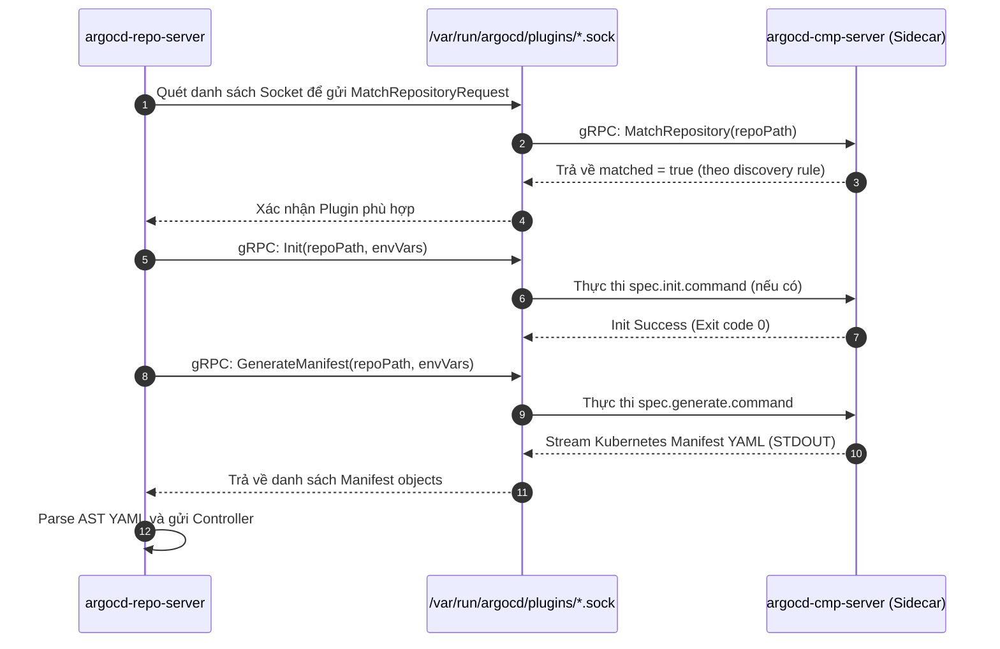
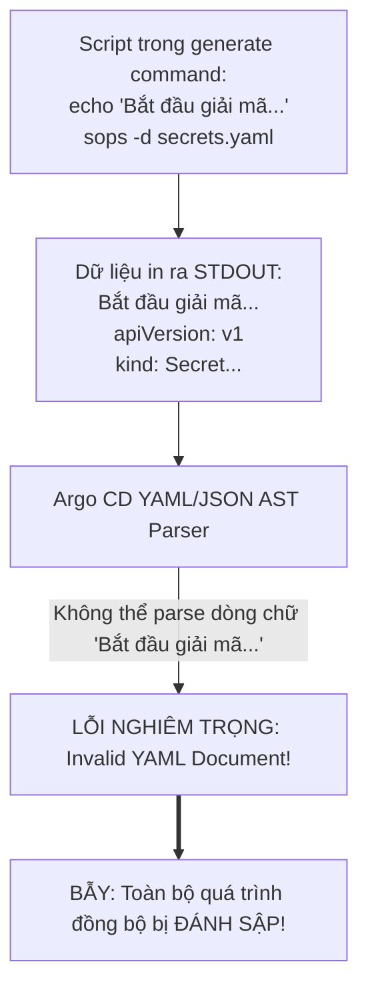


# Tùy Biến Engine Render Với Config Management Plugins (CMP v2 Sidecar)

Mặc dù Argo CD hỗ trợ sẵn các công cụ render manifest phổ biến nhất như Helm và Kustomize, nhưng trong thực tế các doanh nghiệp thường có những công cụ và quy trình đặc thù:
- Bạn muốn sử dụng **Helmfile** để điều phối nhiều Helm release phức tạp.
- Bạn muốn sử dụng **Jsonnet** hoặc **Cue** để viết cấu hình hướng đối tượng.
- Bạn muốn tự động giải mã các tệp bí mật được mã hóa bằng **Mozilla SOPS** (kết nối AWS KMS / HashiCorp Vault / GCP Cloud KMS / Azure Key Vault) ngay trong quá trình render manifest trước khi apply xuống cụm.

> [!IMPORTANT]
> **CMP V2 SIDECAR ISOLATION:**
> CMP v2 thực thi lệnh trong một Container cô lập hoàn toàn, chia sẻ socket nội bộ với `repo-server` qua volume `plugins`. Điều này loại bỏ triệt để nguy cơ Command Injection làm rò rỉ credential của Repo Server.

> [!TIP]
> **TỐI ƯU STREAMING OUTPUT:**
> Lệnh `generate.command` trong CMP v2 bắt buộc phải xuất bản duy nhất một luồng chuẩn YAML (stdout) hợp lệ. Mọi dòng log debug phải được chuyển hướng sang `stderr` (e.g. `echo "Debug log" >&2`) để tránh lỗi Parse Manifest.

---

## 1. Sự Tiến Hóa Kiến Trúc: CMP v1 (Legacy) vs CMP v2 (Sidecar Architecture)

Trước phiên bản Argo CD 2.4, CMP v1 chạy trực tiếp các lệnh nhúng bên trong container chính của `argocd-repo-server`. Mô hình cũ này bộc lộ những lỗ hổng bảo mật nghiêm trọng (nguy cơ chiếm quyền Repo Server qua Command Injection, xung đột phiên bản binary, thiếu cô lập tài nguyên).

**CMP v2** tách biệt hoàn toàn mỗi plugin thành một **Sidecar Container độc lập**, giao tiếp với `repo-server` thông qua một tệp socket nội bộ:

```mermaid
flowchart TD
    subgraph REPO_POD["POD: argocd-repo-server"]
        subgraph MAIN_CTR["Main Container: argocd-repo-server"]
            REPO_MAIN["Repo Server Core<br/>- Nhận gRPC từ Controller/API<br/>- Clone Git Repo vào /tmp<br/>- Điều phối kết nối Socket"]
        end

        subgraph SHARED_VOL["Shared Volume: emptyDir (/var/run/argocd/plugins)"]
            SOCK_1["plugin-sops.sock (Unix Domain Socket)"]
            SOCK_2["plugin-helmfile.sock (Unix Domain Socket)"]
        end

        subgraph SIDECAR_1["Sidecar Container: sops-plugin"]
            SOPS_ENGINE["CMP Plugin Server (argocd-cmp-server)<br/>- Binary: sops, helm, kustomize, age<br/>- Lắng nghe gRPC trên socket"]
        end

        subgraph SIDECAR_2["Sidecar Container: helmfile-plugin"]
            HELMFILE_ENGINE["CMP Plugin Server (argocd-cmp-server)<br/>- Binary: helmfile, helm<br/>- Lắng nghe gRPC trên socket"]
        end
    end

    REPO_MAIN [--]|gRPC qua Socket nội bộ| SOCK_1
    SOCK_1 [--]|Xử lý render an toàn| SOPS_ENGINE

    REPO_MAIN [--]|gRPC qua Socket nội bộ| SOCK_2
    SOCK_2 [--]|Xử lý render an toàn| HELMFILE_ENGINE


```

---

## 2. Bảng So Sánh Chi Tiết Các Kiến Trúc Mở Rộng Render

| Tiêu Chí So Sánh | CMP v1 (Legacy In-Tree) | CMP v2 (Sidecar Container - Khuyên Dùng) | Tùy Biến Fork Repo Server Image |
| :--- | :--- | :--- | :--- |
| **Môi trường thực thi** | Chạy trực tiếp trong container `argocd-repo-server` | Container Sidecar riêng biệt cô lập hoàn toàn | Gộp chung binary vào image tự build lại |
| **Giao thức giao tiếp** | Fork tiến trình con cục bộ (Subprocess) | **gRPC qua Unix Domain Socket (`.sock`)** | Gọi hàm nội bộ Go |
| **Bảo mật & Phân quyền** | Thấp (Rủi ro RCE chiếm quyền Repo Server) | **Rất cao (Chạy Non-root, Read-only RootFS)** | Trung bình |
| **Quản lý phiên bản Binary** | Dễ xung đột thư viện giữa các plugin | Cô lập 100% (Mỗi sidecar mang binary riêng) | Dễ phình to kích thước Docker image |
| **Tự động nhận diện (Discovery)** | Dựa trên regex đường dẫn tĩnh | **Hỗ trợ `discover.find` và `discover.fileName`** | Không hỗ trợ động |
| **Khả năng cập nhật Plugin** | Phải khởi động lại toàn bộ Repo Server | Restart Pod (nhưng tách bạch logic cấu hình) | Phải build lại Docker image chính |

---

## 3. Cơ Chế Giao Thức gRPC & Vòng Đời Thực Thi Của CMP v2

Khi Repo Server cần render manifest cho một Application sử dụng CMP, chu trình gRPC diễn ra như sau:



---

## 4. Cấu Trúc Tệp Khai Báo Plugin (`plugin.yaml`)

Mỗi CMP v2 được điều khiển bởi một tệp cấu hình chuẩn `plugin.yaml` đặt tại thư mục `/home/argocd/cmp-server/config/plugin.yaml` bên trong container Sidecar:

```yaml
# plugin.yaml — Cấu hình Plugin tự động giải mã SOPS & Render Helm
apiVersion: argoproj.io/v1alpha1
kind: ConfigManagementPlugin
metadata:
  name: sops-helm-decryptor
spec:
  version: v1.0
  
  # 1. QUY TẮC TỰ ĐỘNG PHÁT HIỆN (DISCOVERY)
  # Argo CD tự động chọn plugin này nếu thư mục Git có chứa file 'helmfile.yaml' hoặc 'secrets.enc.yaml'
  discover:
    fileName: "helmfile.yaml"
    # Hoặc sử dụng lệnh shell glob để kiểm tra linh hoạt
    find:
      glob: "**/secrets.enc.yaml"

  # 2. BƯỚC KHỞI TẠO (INIT - Tùy chọn)
  # Chạy trước bước render (ví dụ: tải dependencies hoặc plugin Helm)
  init:
    command: ["/bin/sh", "-c"]
    args: ["helm dependency build ."]

  # 3. BƯỚC BIÊN DỊCH MANIFEST (GENERATE - Bắt Buộc)
  # Lệnh này BẮT BUỘC phải in ra các Kubernetes Manifests hợp lệ (STDOUT)
  generate:
    command: ["/bin/sh", "-c"]
    args:
      - |
        # Chuyển hướng log gỡ lỗi sang STDERR để không làm hỏng cú pháp YAML
        echo "--> [CMP Plugin] Đang giải mã secrets bằng SOPS..." >&2
        sops -d secrets.enc.yaml > /tmp/decrypted-secrets.yaml 2>&1
        
        # Render Helm template ra màn hình STDOUT thuần túy
        helm template "${ARGOCD_APP_NAME}" . -f /tmp/decrypted-secrets.yaml
        
        # Dọn dẹp tệp tạm sau khi hoàn tất
        rm -f /tmp/decrypted-secrets.yaml

  # 4. DANH SÁCH THAM SỐ ĐƯỢC PHÉP TRUYỀN TỪ APPLICATION CRD
  parameters:
    dynamic:
      - name: release-name
        title: "Tên của Helm Release"
        tooltip: "Ghi đè tên release khi render"
    static:
      - name: environment
        title: "Tên môi trường triển khai"
        tooltip: "dev / staging / prod"
```

---

## 5. Bảng Ma Trận Các Biến Môi Trường Hệ Thống Tự Động Inject Vào CMP

Khi thực thi lệnh `init` và `generate`, Argo CD tự động truyền vào tiến trình các biến môi trường sau:

| Tên Biến Môi Trường | Mô Tả Ý Nghĩa | Ví Dụ Giá Trị |
| :--- | :--- | :--- |
| `ARGOCD_APP_NAME` | Tên của Application CRD đang được đồng bộ | `payment-service-prod` |
| `ARGOCD_APP_NAMESPACE` | Namespace chứa đối tượng Application | `argocd` |
| `ARGOCD_APP_REVISION` | Git commit SHA hoặc Git Tag đang render | `a1b2c3d4e5f67890` |
| `ARGOCD_APP_SOURCE_PATH` | Đường dẫn tương đối của ứng dụng trong Git | `services/payment/prod` |
| `ARGOCD_APP_SOURCE_REPO_URL` | URL của Git Repository | `https://github.com/company/gitops.git` |
| `ARGOCD_APP_SOURCE_TARGET_REVISION` | Branch hoặc Tag mục tiêu được khai báo | `main` hoặc `v2.4.0` |
| `PARAM_<PARAM_NAME>` | Tham số tùy biến được truyền từ `spec.source.plugin.parameters` | `PARAM_RELEASE_NAME=payment` |

---

## 6. Xây Dựng Dockerfile Tối Ưu Cho CMP Sidecar

Dưới đây là `Dockerfile` đa tầng (Multi-stage) chuẩn mực để đóng gói Sidecar chứa đầy đủ `helm`, `sops`, `age`, `helmfile` và binary `argocd-cmp-server`:

```dockerfile
# Dockerfile cho CMP Sidecar
FROM alpine:3.19 AS builder

# 1. Cài đặt các công cụ tải về cần thiết
RUN apk add --no-cache curl tar gzip bash

# 2. Tải SOPS, Helm và Helmfile binary chính thức
ARG SOPS_VERSION="v3.8.1"
ARG HELMFILE_VERSION="v0.162.0"
ARG HELM_VERSION="v3.14.2"

RUN curl -Lo /usr/local/bin/sops https://github.com/getsops/sops/releases/download/${SOPS_VERSION}/sops-${SOPS_VERSION}.linux.amd64 && \
    chmod +x /usr/local/bin/sops

RUN curl -Lo /tmp/helm.tar.gz https://get.helm.sh/helm-${HELM_VERSION}-linux-amd64.tar.gz && \
    tar -zxvf /tmp/helm.tar.gz -C /tmp && \
    mv /tmp/linux-amd64/helm /usr/local/bin/helm && \
    chmod +x /usr/local/bin/helm

# 3. Chuyển sang Runtime Image bảo mật chuẩn Argo CD
FROM quay.io/argoproj/argocd:v2.10.4

USER root
COPY --from=builder /usr/local/bin/sops /usr/local/bin/sops
COPY --from=builder /usr/local/bin/helm /usr/local/bin/helm

# Chạy dưới tài khoản unprivileged 999 của Argo CD
USER 999
ENTRYPOINT ["/var/run/argocd/argocd-cmp-server"]
```

---

## 7. Cấu Hình Patch Bổ Sung CMP Sidecar Vào `argocd-repo-server`

Để kích hoạt Plugin, ta patch Deployment `argocd-repo-server` trong namespace `argocd`:

```yaml
# patch-repo-server-cmp.yaml
apiVersion: apps/v1
kind: Deployment
metadata:
  name: argocd-repo-server
  namespace: argocd
spec:
  template:
    spec:
      volumes:
        # Volume chia sẻ socket gRPC giữa các containers
        - name: cmp-plugin-sockets
          emptyDir: {}
        # Volume chứa tệp plugin.yaml
        - name: sops-plugin-config
          configMap:
            name: sops-plugin-configmap
        - name: tmp-dir
          emptyDir:
            sizeLimit: 1Gi
      containers:
        # 1. Gắn volume socket vào container chính
        - name: argocd-repo-server
          volumeMounts:
            - mountPath: /var/run/argocd/plugins
              name: cmp-plugin-sockets

        # 2. Khởi tạo Sidecar Container chuyên trách
        - name: sops-helm-plugin
          image: custom-registry.io/argocd-cmp-sops:v2.0
          command: ["/var/run/argocd/argocd-cmp-server"]
          securityContext:
            runAsNonRoot: true
            runAsUser: 999
            readOnlyRootFilesystem: true
          volumeMounts:
            - mountPath: /var/run/argocd/plugins
              name: cmp-plugin-sockets
            - mountPath: /home/argocd/cmp-server/config/plugin.yaml
              subPath: plugin.yaml
              name: sops-plugin-config
            - mountPath: /tmp
              name: tmp-dir
```

---

## 8. Khai Báo Sử Dụng Plugin Trong Application CRD

Nếu cấu hình `discover` được thiết lập, Argo CD sẽ **tự động nhận diện** plugin mà không cần khai báo. Nếu muốn chỉ định tường minh:

```yaml
# application-with-plugin.yaml
apiVersion: argoproj.io/v1alpha1
kind: Application
metadata:
  name: encrypted-payment-service
  namespace: argocd
spec:
  project: default
  source:
    repoURL: "https://github.com/company/ecommerce-gitops.git"
    targetRevision: "main"
    path: "services/payment-encrypted"
    
    # Chỉ định sử dụng CMP Plugin cụ thể kèm tham số
    plugin:
      name: sops-helm-decryptor
      env:
        - name: release-name
          value: "payment-prod-release"
  destination:
    server: "https://kubernetes.default.svc"
    namespace: "payment-prod"
  syncPolicy:
    automated:
      prune: true
      selfHeal: true
```

---

## 9. Cạm Bẫy Thực Chiến: "Lệnh Generate In Ra Log Rác Khiến Argo CD Báo Lỗi 'Invalid YAML Document'"

### Hiện Tượng Sự Cố & Log Trace
- Lập trình viên viết script trong lệnh `generate` có chèn các lệnh `echo "Starting build..."` hoặc gọi một công cụ in ra banner thông báo.
- Khi Argo CD thực hiện đồng bộ, quá trình bị **hủy bỏ ngay lập tức** với thông báo lỗi đỏ rực:

```json
{
  "timestamp": "2026-04-05T16:20:00Z",
  "level": "error",
  "component": "argocd-repo-server",
  "msg": "Failed to parse YAML from plugin output: error converting YAML to JSON: yaml: line 1: did not find expected key",
  "raw_output": "Starting build...\napiVersion: apps/v1\nkind: Deployment"
}
```



### 9.1. Phân Tích Nguyên Nhân Gốc Rễ (5-Whys)
1. **Tại sao bộ Parser báo lỗi Invalid YAML?** $\rightarrow$ Vì dòng đầu tiên của dữ liệu trả về là chuỗi text `Starting build...`.
2. **Tại sao dòng text này xuất hiện?** $\rightarrow$ Vì trong script của lệnh `generate` có chứa lệnh `echo "Starting build..."`.
3. **Tại sao echo lại lọt vào parser?** $\rightarrow$ Mặc định `echo` in ra luồng STDOUT, và Repo Server đọc toàn bộ luồng STDOUT để parse Kubernetes AST.
4. **Làm thế nào để in log mà không làm lỗi parser?** $\rightarrow$ Bắt buộc phải chuyển hướng các thông báo log sang luồng **STDERR** bằng cú pháp `>&2`.
5. **Quy tắc vàng của CMP là gì?** $\rightarrow$ Luồng STDOUT **CHỈ DÀNH RIÊNG CHO MANIFESTS YAML THUẦN TÚY 100%**.

---

## 10. Hướng Dẫn Thực Hành CLI: Kiểm Thử CMP Plugin (Step-by-Step Lab)

Dưới đây là quy trình thực hành từ dòng lệnh để build, cấu hình và kiểm thử CMP Sidecar:

```bash
# Bước 1: Build Docker Image cho CMP Sidecar và đẩy lên Registry nội bộ
docker build -t custom-registry.io/argocd-cmp-sops:v2.0 .
docker push custom-registry.io/argocd-cmp-sops:v2.0

# Bước 2: Tạo ConfigMap chứa tệp plugin.yaml
kubectl create configmap sops-plugin-configmap -n argocd \
  --from-file=plugin.yaml=plugin.yaml

# Bước 3: Áp dụng patch cho deployment argocd-repo-server
kubectl patch deployment argocd-repo-server -n argocd --patch-file patch-repo-server-cmp.yaml

# Bước 4: Kiểm tra xem Sidecar Container đã tạo file Socket thành công chưa
kubectl exec -n argocd deploy/argocd-repo-server -c argocd-repo-server -- \
  ls -la /var/run/argocd/plugins

# Bước 5: Xem nhật ký hoạt động thời gian thực của Sidecar Plugin
kubectl logs -n argocd -l app.kubernetes.io/name=argocd-repo-server -c sops-helm-plugin -f

# Bước 6: Ép buộc Argo CD chạy lại lệnh generate của Plugin
argocd app get encrypted-payment-service --hard-refresh
```

---

## 11. Bộ Câu Hỏi Tự Kiểm Tra Chuyên Sâu (Self-Check Q&A)

Dưới đây là 10 câu hỏi sát hạch chuyên sâu về CMP v2:

### Câu 1: Tại sao CMP v2 lại sử dụng Unix Domain Socket thay vì cổng mạng TCP để giao tiếp giữa `repo-server` và Sidecar?
- **Đáp án:** Unix Domain Socket hoạt động trong không gian bộ nhớ chia sẻ cục bộ (Shared Memory) giữa các container trong cùng một Pod, mang lại: (1) **Tốc độ truyền tải siêu tốc** (không tốn chi phí đóng gói TCP/IP stack), và (2) **Bảo mật tuyệt đối** (không mở cổng mạng ra bên ngoài, không lo bị quét cổng nội bộ).

### Câu 2: Lệnh `init` trong `plugin.yaml` khác lệnh `generate` ở điểm nào?
- **Đáp án:** Lệnh `init` chạy trước để chuẩn bị môi trường (tải thư viện phụ thuộc, kiểm tra kết nối); kết quả của `init` không được dùng làm manifest. Lệnh `generate` là lệnh bắt buộc và **phải in ra toàn bộ nội dung Kubernetes YAML manifests cuối cùng ra luồng STDOUT**.

### Câu 3: Làm thế nào để truyền một thông tin nhạy cảm (như AWS Access Key) vào Sidecar Container của CMP Plugin?
- **Đáp án:** Khai báo biến môi trường trong khối `env` của Sidecar Container bên trong Deployment `argocd-repo-server` đọc từ một Kubernetes `Secret` (`secretKeyRef`), hoặc sử dụng IAM Roles for Service Accounts (**IRSA / Workload Identity**).

### Câu 4: Nếu trong cùng một thư mục Git vừa có tệp `kustomization.yaml` vừa có điều kiện khớp với `discover` của CMP Plugin, Argo CD sẽ ưu tiên cái nào?
- **Đáp án:** Mặc định các công cụ Built-in (Kustomize/Helm) có độ ưu tiên cao. Nếu muốn ép buộc sử dụng CMP Plugin, bạn bắt buộc phải khai báo tường minh trường `spec.source.plugin.name` trong đối tượng `Application CRD`.

### Câu 5: Điều gì xảy ra nếu lệnh `generate` của Plugin chạy vượt quá thời gian quy định?
- **Đáp án:** Tiến trình sẽ bị ngắt (Timeout) bởi `ARGOCD_EXEC_TIMEOUT` (mặc định là 90 giây). Ứng dụng sẽ chuyển sang trạng thái `ComparisonError`.

### Câu 6: Tại sao nên đặt `readOnlyRootFilesystem: true` cho Sidecar Container của CMP Plugin?
- **Đáp án:** Để ngăn chặn các script hoặc tool bên trong plugin vô tình hoặc cố ý ghi file đè vào hệ điều hành container, đảm bảo tính bất biến (Immutability) và an toàn bảo mật, chỉ cho phép ghi dữ liệu tạm vào thư mục `/tmp` đã được mount qua `emptyDir`.

### Câu 7: Biến môi trường `$ARGOCD_APP_NAME` và `$ARGOCD_APP_NAMESPACE` có sẵn trong lệnh `generate` không?
- **Đáp án:** **Có!** Argo CD tự động truyền các biến môi trường chuẩn của Application vào tiến trình thực thi lệnh của Plugin để script có thể tùy biến cấu hình theo tên và namespace ứng dụng.

### Câu 8: `discover.find.glob` trong `plugin.yaml` hỗ trợ những biểu thức so khớp nào?
- **Đáp án:** Hỗ trợ cú pháp Glob tiêu chuẩn, ví dụ `**/values-*.yaml` hoặc `*.jsonnet`, giúp quét các file định dạng đặc thù trong cây thư mục để kích hoạt plugin tự động.

### Câu 9: Làm thế nào để kiểm tra danh sách tất cả các CMP Plugins đang hoạt động trên Repo Server?
- **Đáp án:** Kiểm tra danh sách các file `.sock` nằm trong thư mục `/var/run/argocd/plugins` của container `argocd-repo-server`. Mỗi file socket đại diện cho một CMP server đang hoạt động.

### Câu 10: Có thể kết hợp CMP Plugin với tính năng Multiple Sources của Argo CD không?
- **Đáp án:** **Hoàn toàn được!** Bạn có thể khai báo một nguồn Git sử dụng CMP Plugin để giải mã secrets và một nguồn khác chứa Helm Chart công khai.

---

## Tổng Kết

Config Management Plugins v2 (CMP v2) là cánh cửa mở ra khả năng tùy biến vô hạn cho Argo CD, cho phép các doanh nghiệp tích hợp liền mạch mọi công cụ phân phối phần mềm đặc thù (SOPS, Helmfile, Jsonnet, Cue) mà vẫn giữ nguyên tính toàn vẹn và bảo mật của mô hình GitOps.

Chúc mừng bạn đã hoàn thành trọn vẹn **Giai Đoạn 3 (Quy Mô Đa Cụm & Quản Lý Hàng Trăm Ứng Dụng)**!

Ở bài tiếp theo mở màn **Giai Đoạn 4**, chúng ta sẽ bước vào lĩnh vực An ninh & Vận hành chuyên sâu với **Kiểm Soát Truy Cập: Argo CD RBAC, Policy Roles & Group Mapping Chuẩn Doanh Nghiệp**!

