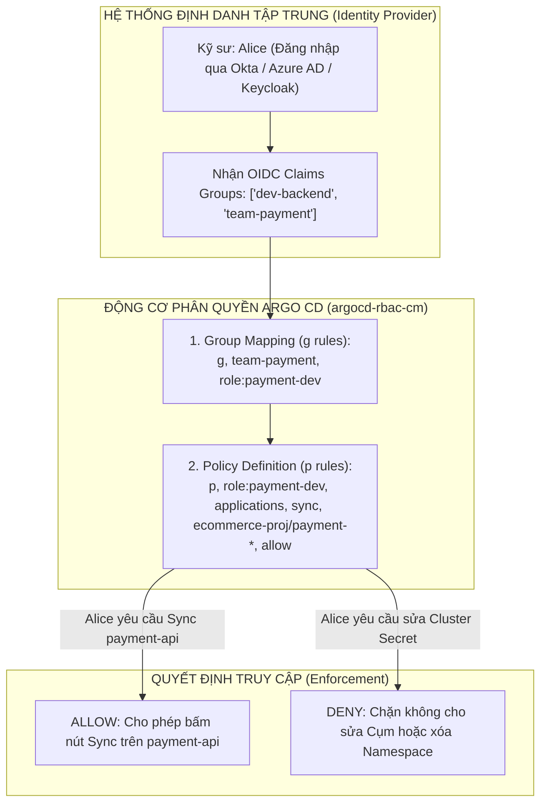
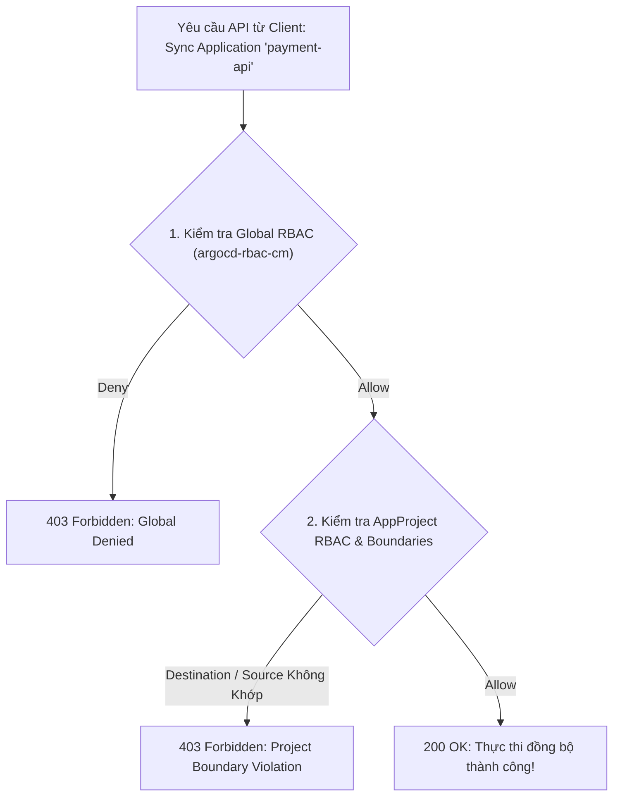
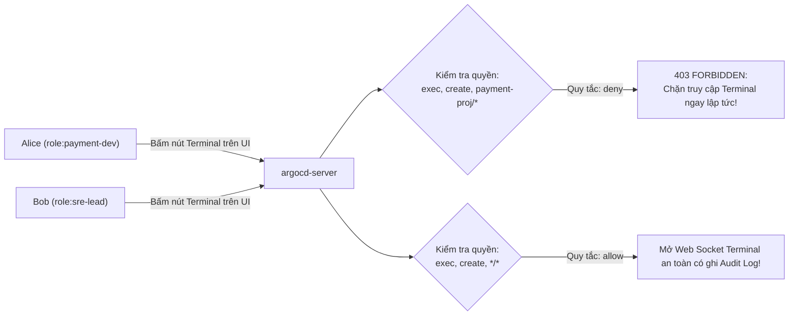
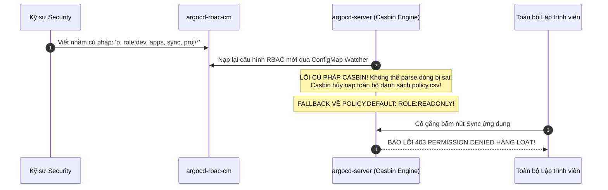


# Kiểm Soát Truy Cập: Argo CD RBAC, Policy Roles & Group Mapping Chuẩn Doanh Nghiệp

Trong một tổ chức công nghệ có hàng trăm kỹ sư phát triển (Developers), kỹ sư kiểm thử (QA), chuyên viên an ninh mạng (SecOps) và kỹ sư vận hành (SRE), việc cấp chung một tài khoản `admin` toàn năng hoặc để chính sách phân quyền mặc định là một "lỗ hổng tử huyệt" đe dọa trực tiếp tới sự an toàn của hệ thống.

Một lập trình viên chỉ nên có quyền xem nhật ký (Logs) và kích hoạt đồng bộ (`sync`) trên các ứng dụng thuộc nhóm của mình ở môi trường Dev/Staging. Ngược lại, quyền can thiệp vào môi trường Production, thay đổi cấu hình Cụm (Clusters) hay mở giao diện dòng lệnh trực tiếp vào Pods (**Terminal Exec**) bắt buộc phải được kiểm soát nghiêm ngặt theo nguyên lý đặc quyền tối thiểu (**Principle of Least Privilege**).

Argo CD tích hợp sẵn động cơ phân quyền mạnh mẽ **Casbin RBAC Engine**. Bài viết này sẽ giúp bạn làm chủ cú pháp chính sách Casbin, cấu trúc ánh xạ nhóm định danh từ hệ thống SSO (OIDC Groups Mapping), kiểm soát các tài nguyên nhạy cảm và xử lý các sự cố mất quyền truy cập do lỗi cú pháp CSV.

---

## 1. Bản Chất Động Cơ Casbin & Sơ Đồ Phân Quyền Đa Tầng

Argo CD sử dụng thư viện mã nguồn mở **Casbin** để đánh giá quyền hạn của từng yêu cầu gửi tới `argocd-server`. Toàn bộ cấu hình RBAC được lưu trữ tập trung trong ConfigMap **`argocd-rbac-cm`**.



> [!IMPORTANT]
> **QUY TẮC PHÂN QUYỀN ZERO TRUST:**
> Luôn đặt `policy.default: role:readonly` trong `argocd-rbac-cm` để đảm bảo người dùng mới đăng nhập chỉ có quyền xem dữ liệu cơ bản, không thể can thiệp vào hệ thống cho đến khi được gán vai trò chính thức.

> [!WARNING]
> **KIỂM TRA CÚ PHÁP CASBIN TRƯỚC KHI APPLY:**
> Một dòng CSV bị sai cú pháp có thể khiến Casbin vô hiệu hóa toàn bộ bảng phân quyền và đẩy toàn bộ nhân viên về quyền read-only. Luôn chạy `argocd admin settings rbac validate` để kiểm tra trước.

---

## 2. Bảng Ma Trận Các Tài Nguyên & Hành Động Trong Argo CD RBAC

Argo CD quản lý phân quyền trên **8 nhóm tài nguyên** chính với **7 loại hành động** khác nhau:

| Tài Nguyên (`Resource`) | Các Hành Động Hỗ Trợ (`Action`) | Đối Tượng Áp Dụng (`Object`) | Ý Nghĩa Thực Tiễn |
| :--- | :--- | :--- | :--- |
| **`applications`** | `get`, `create`, `update`, `delete`, `sync`, `override`, `action/*` | `<Project>/<App>` (vd: `payment/api`) | Kiểm soát xem, tạo, sửa, xóa, trigger đồng bộ ứng dụng |
| **`clusters`** | `get`, `create`, `update`, `delete` | `<Cluster-Server-URL>` hoặc `*` | Quản lý danh bạ cụm Kubernetes kết nối vào Argo CD |
| **`repositories`** | `get`, `create`, `update`, `delete` | `<Repo-URL>` hoặc `*` | Quản lý cấu hình kết nối Git/Helm repositories và SSH keys |
| **`projects`** | `get`, `create`, `update`, `delete` | `<Project-Name>` hoặc `*` | Quản trị các đối tượng ranh giới AppProject |
| **`accounts`** | `get`, `update`, `can-i` | `<Account-Name>` hoặc `*` | Quản lý tài khoản người dùng cục bộ và sinh API Token |
| **`certificates`** | `get`, `create`, `update`, `delete` | `<Server-Name>` hoặc `*` | Quản lý chứng chỉ TLS/SSH Known Hosts |
| **`gpgkeys`** | `get`, `create`, `delete` | `<Key-ID>` hoặc `*` | Quản lý khóa công khai xác thực chữ ký số Git commit |
| **`logs`** / **`exec`** | `get` (cho logs), `create` (cho exec) | `<Project>/<App>` | Xem logs trực tiếp của Pods hoặc mở Web Terminal Exec |

---

## 3. Cú Pháp Casbin CSV Chuẩn: 6 Trường Dữ Liệu Bắt Buộc

Cấu trúc một dòng phân quyền chuẩn trong Argo CD bao gồm 2 loại quy tắc:

### 3.1. Quy Tắc Phân Quyền (Policy Rule - `p`)
```
p, <Subject/Role>, <Resource>, <Action>, <Object>, <Effect>
```
- **`<Subject/Role>`:** Tên vai trò hoặc định danh người dùng (ví dụ: `role:developer`, `role:qa-lead`, `admin`).
- **`<Resource>`:** Một trong 8 loại tài nguyên chuẩn của Argo CD (`applications`, `clusters`, `repositories`, `projects`, `accounts`, `logs`, `exec`, `gpgkeys`).
- **`<Action>`:** Hành động mong muốn (`get`, `create`, `update`, `delete`, `sync`, `override`, hoặc `action/<custom-action>`).
- **`<Object>`:** Định danh đối tượng (thường có dạng `<AppProject>/<ApplicationName>`, hỗ trợ ký tự đại diện `*` và glob matching).
- **`<Effect>`:** `allow` (cho phép) hoặc `deny` (từ chối tường minh).

### 3.2. Quy Tắc Gán Nhóm (Group Mapping Rule - `g`)
```
g, <User/OIDC_Group>, <Role>
```
Ánh xạ một người dùng cụ thể hoặc một nhóm trả về từ SSO (OIDC Group claim) vào một vai trò đã định nghĩa trong hệ thống.

### 3.3. Giải Mã Mô Hình Khớp Nối Casbin (Casbin Matcher Engine)

Bên dưới tầng mã nguồn, Argo CD sử dụng định dạng Casbin Model với bộ so khớp `patternMatch` và `globMatch`:

```ini
[request_definition]
r = sub, res, act, obj

[policy_definition]
p = sub, res, act, obj, eft

[role_definition]
g = _, _

[policy_effect]
e = some(where (p.eft == allow)) && !some(where (p.eft == deny))

[matchers]
m = g(r.sub, p.sub) && globMatch(r.res, p.res) && globMatch(r.act, p.act) && globMatch(r.obj, p.obj)
```

Điều này giải thích tại sao bạn có thể sử dụng các ký tự đại diện dạng glob như `payment-*/*` hoặc `*/*-staging` để khớp đồng thời nhiều ứng dụng mà không cần phải viết từng dòng riêng biệt.

---

## 4. Phân Tích Cấu Hình Chi Tiết Tệp `argocd-rbac-cm` (Line-by-Line Breakdown)

Dưới đây là manifest cấu hình thực tế cho một tổ chức tài chính với 4 phòng ban độc lập (Core Banking, Payment, Fraud Detection và SRE):

```yaml
# argocd-rbac-cm.yaml — Bảng phân quyền RBAC đa tầng chuẩn Enterprise Banking
apiVersion: v1
kind: ConfigMap
metadata:
  name: argocd-rbac-cm
  namespace: argocd
  labels:
    app.kubernetes.io/name: argocd-rbac-cm
    app.kubernetes.io/part-of: argocd
data:
  # 1. THIẾT LẬP CHÍNH SÁCH MẶC ĐỊNH CHO NGƯỜI DÙNG MỚI (Zero Trust)
  # Mặc định người dùng đăng nhập chỉ có quyền đọc (Read-only), không có quyền can thiệp
  policy.default: role:readonly

  # 2. ĐỊNH NGHĨA CÁC VAI TRÒ VÀ QUY TẮC PHÂN QUYỀN NỘI BỘ (Policy CSV)
  policy.csv: |
    # ----------------------------------------------------
    # VAI TRÒ 1: DEVELOPER NHÓM THANH TOÁN (role:payment-dev)
    # ----------------------------------------------------
    # Cho phép xem thông tin toàn bộ ứng dụng trong project payment
    p, role:payment-dev, applications, get, payment-project/*, allow
    # Cho phép thực thi lệnh sync trên các ứng dụng payment
    p, role:payment-dev, applications, sync, payment-project/*, allow
    # Cho phép xem logs của Pods nhưng CẤM mở Terminal (Exec)
    p, role:payment-dev, logs, get, payment-project/*, allow
    p, role:payment-dev, exec, create, payment-project/*, deny

    # ----------------------------------------------------
    # VAI TRÒ 2: CORE BANKING LEAD (role:core-lead)
    # ----------------------------------------------------
    # Toàn quyền trong project core-banking nhưng cấm xóa ứng dụng prod
    p, role:core-lead, applications, get, core-project/*, allow
    p, role:core-lead, applications, sync, core-project/*, allow
    p, role:core-lead, applications, update, core-project/*, allow
    p, role:core-lead, applications, delete, core-project/*-prod, deny

    # ----------------------------------------------------
    # VAI TRÒ 3: QA TESTER TOÀN CỤM (role:qa-tester)
    # ----------------------------------------------------
    # QA được quyền sync ứng dụng trên môi trường staging nhưng cấm đụng vào prod
    p, role:qa-tester, applications, get, */*-staging, allow
    p, role:qa-tester, applications, sync, */*-staging, allow
    p, role:qa-tester, logs, get, */*-staging, allow

    # ----------------------------------------------------
    # VAI TRÒ 4: SRE / PLATFORM LEAD (role:sre-lead)
    # ----------------------------------------------------
    # Toàn quyền quản trị ứng dụng và hạ tầng cụm
    p, role:sre-lead, applications, *, */*, allow
    p, role:sre-lead, clusters, *, *, allow
    p, role:sre-lead, repositories, *, *, allow
    p, role:sre-lead, projects, *, *, allow
    p, role:sre-lead, exec, create, */*, allow

    # ----------------------------------------------------
    # ÁNH XẠ NHÓM TỪ OIDC SSO (GROUP MAPPINGS)
    # ----------------------------------------------------
    # Nhóm 'okta-payment-engineers' từ Okta được gán role:payment-dev
    g, okta-payment-engineers, role:payment-dev
    
    # Nhóm 'okta-core-banking' từ Okta được gán role:core-lead
    g, okta-core-banking, role:core-lead

    # Nhóm 'qa-automation-team' từ Keycloak được gán role:qa-tester
    g, qa-automation-team, role:qa-tester
    
    # Nhóm 'azure-ad-sre-team' từ Azure AD được gán role:sre-lead
    g, azure-ad-sre-team, role:sre-lead

    # Phân cấp vai trò: sre-lead kế thừa toàn bộ quyền của role:readonly
    g, role:sre-lead, role:readonly

  # 3. CẤU HÌNH PHẠM VI QUYỀN POD TERMINAL EXEC
  # Kích hoạt tính năng Web Terminal (mặc định bị vô hiệu hóa)
  exec.enabled: "true"

  # 4. CHỈ ĐỊNH CLAIM ĐỌC NHÓM TỪ OIDC TOKEN
  # Đọc claim 'groups' hoặc 'roles' do IDP trả về
  scopes: "[groups, email]"
```

### 4.1. Phân Quyền AppProject Token Dành Cho CI/CD Pipelines

Ngoài các quyền gán cho con người, bạn có thể tạo vai trò nội bộ trong `AppProject` để cấp JWT Token cho GitHub Actions hoặc GitLab CI:

```yaml
# appproject-with-roles.yaml — Phân quyền Project Roles và Token cho CI
apiVersion: argoproj.io/v1alpha1
kind: AppProject
metadata:
  name: payment-project
  namespace: argocd
spec:
  roles:
    - name: cicd-deployer
      description: "Quyền sync tự động dành cho GitHub Actions"
      policies:
        - p, proj:payment-project:cicd-deployer, applications, get, payment-project/*, allow
        - p, proj:payment-project:cicd-deployer, applications, sync, payment-project/*, allow
      groups: []
      jwtTokens: []
```

---

## 5. So Sánh Phân Quyền Cấp Cụm (Global RBAC) vs Phân Quyền AppProject

Trong Argo CD, quyền hạn có thể được thiết lập ở 2 tầng độc lập:

| Tiêu Chí So Sánh | Global RBAC (`argocd-rbac-cm`) | AppProject RBAC (`spec.roles`) |
| :--- | :--- | :--- |
| **Phạm vi quản lý** | Toàn bộ cụm Argo CD (Clusters, Repos, Projects, Users) | Giới hạn duy nhất bên trong 1 AppProject |
| **Vị trí lưu trữ** | ConfigMap `argocd-rbac-cm` tại namespace `argocd` | CRD `AppProject` (`spec.roles` và `spec.sourceRepos`) |
| **Cơ chế Token/JWT** | Hỗ trợ OIDC SSO Group mapping trực tiếp | Hỗ trợ cấp phát JWT API Tokens nội bộ cho CI/CD |
| **Người có quyền sửa** | Chỉ Platform Admin (SRE Team) có quyền sửa ConfigMap | Team Lead của Project có thể tự quản lý role nội bộ |
| **Độ ưu tiên đánh giá** | Đánh giá trước khi yêu cầu tới hệ thống | Đánh giá kết hợp bổ sung trong phạm vi Project |



---

## 6. Kiểm Soát Quyền Hạn Pod Terminal (`exec`) & Nhật Ký Kiểm Toán (Audit Trail)

Mỗi khi một người dùng cố gắng mở Terminal Exec hoặc thực thi các hành động quan trọng, `argocd-server` sẽ ghi nhận một dòng log kiểm toán (Audit Trail) có cấu trúc:

```json
{
  "timestamp": "2026-04-06T14:22:15Z",
  "level": "info",
  "sub": "alice.nguyen@company.com",
  "groups": ["okta-payment-engineers"],
  "resource": "exec",
  "action": "create",
  "object": "payment-project/payment-api",
  "decision": "deny",
  "reason": "Explicit deny rule matched in policy.csv"
}
```

Nhờ có cấu trúc log này, đội ngũ SIEM/SOC có thể thiết lập cảnh báo thời gian thực khi có người dùng cố gắng truy cập trái phép vào các container nhạy cảm.



---

## 7. Cạm Bẫy Thực Chiến: "Lỗi Cú Pháp CSV Làm Casbin Fallback Về Quyền Mặc Định Khiến Cả Công Ty Mất Quyền"

### Hiện Tượng Sự Cố & Log Trace
- Kỹ sư Security chỉnh sửa một dòng trong ConfigMap `argocd-rbac-cm` để thêm quyền cho nhân viên mới, nhưng viết nhầm cú pháp `apps` thay vì `applications` hoặc thừa dấu phẩy.
- 1 phút sau, toàn bộ hàng trăm kỹ sư trong công ty (bao gồm cả SRE và Developers) đều bị **mất toàn bộ quyền hạn**, nút "Sync" bị mờ đi và giao diện báo lỗi `PermissionDenied` cho mọi thao tác.

```json
{
  "timestamp": "2026-04-06T10:15:30Z",
  "level": "error",
  "component": "argocd-server",
  "msg": "Failed to load RBAC policies: line 14: invalid syntax in policy definition: 'p, role:dev, apps, sync, proj/*'",
  "fallback_policy": "role:readonly"
}
```



### 7.1. Phân Tích Nguyên Nhân Gốc Rễ (5-Whys)
1. **Tại sao toàn bộ kỹ sư bị mất quyền?** $\rightarrow$ Vì Casbin kích hoạt chế độ Fallback về `policy.default` (`role:readonly`).
2. **Tại sao Casbin kích hoạt Fallback?** $\rightarrow$ Vì bộ parser gặp lỗi cú pháp khi nạp bảng `policy.csv`.
3. **Tại sao lại có lỗi cú pháp?** $\rightarrow$ Kỹ sư gõ nhầm tên tài nguyên `apps` thay vì định danh chuẩn `applications`.
4. **Tại sao lỗi không được phát hiện trước khi nạp?** $\rightarrow$ Kỹ sư sửa trực tiếp ConfigMap bằng `kubectl edit` trên production mà không chạy công cụ kiểm tra tính hợp lệ trước.
5. **Giải pháp ngăn ngừa tận gốc là gì?** $\rightarrow$ Bắt buộc kiểm thử cấu hình bằng `argocd admin settings rbac validate` trong GitOps PR Pipeline trước khi merge vào nhánh chính.

---

## 8. Hướng Dẫn Thực Hành CLI: Kiểm Tra Quyền Hạn Bằng Lệnh `can-i`

Argo CD cung cấp công cụ kiểm tra quyền hạn tương tự như `kubectl auth can-i`:

```bash
# Bước 1: Kiểm tra tính hợp lệ của tệp RBAC CSV trước khi apply
argocd admin settings rbac validate --policy-file argocd-rbac-cm.yaml

# Bước 2: Kiểm tra xem vai trò role:payment-dev có quyền sync trên ứng dụng cụ thể không
argocd admin settings rbac can role:payment-dev sync applications "payment-project/payment-api"

# Bước 3: Kiểm tra xem vai trò role:payment-dev có bị cấm mở Terminal (Exec) không
argocd admin settings rbac can role:payment-dev create exec "payment-project/payment-api"

# Bước 4: Tạo JWT API Token cho ServiceAccount trong AppProject
argocd proj role create-token payment-project cicd-deployer -e 30d

# Bước 5: Kiểm tra quyền hạn trực tiếp của tài khoản người dùng đang đăng nhập
argocd account can-i sync applications "payment-project/payment-api"

# Bước 6: Xem thông tin phân quyền chi tiết của token hiện tại
argocd account get-user-info

# Bước 7: Mô phỏng quyết định truy cập cho một nhóm OIDC giả lập
argocd admin settings rbac can okta-payment-engineers sync applications "payment-project/payment-api"
```

---

## 9. Bộ Câu Hỏi Tự Kiểm Tra Chuyên Sâu (Self-Check Q&A)


<details class="qa-card">
<summary class="qa-summary">
  <div class="qa-summary-left">
    <span class="qa-num-badge">Q01</span>
    <span>Tại sao nên đặt `policy.default: role:readonly` thay vì `role:admin` hoặc để trống?</span>
  </div>
  <span class="qa-chevron">
    <svg width="18" height="18" fill="none" stroke="currentColor" stroke-width="2.5" viewBox="0 0 24 24"><polyline points="6 9 12 15 18 9"></polyline></svg>
  </span>
</summary>
<div class="qa-answer">
  <div class="qa-answer-header">
    <svg width="14" height="14" fill="none" stroke="currentColor" stroke-width="2" viewBox="0 0 24 24"><path d="M22 11.08V12a10 10 0 1 1-5.93-9.14"></path><polyline points="22 4 12 14.01 9 11.01"></polyline></svg>
    <span>Phân Tích &amp; Lời Giải Kỹ Thuật</span>
  </div>
  Theo nguyên lý **Defense-in-Depth** và **Zero Trust**, khi một người dùng mới đăng nhập vào hệ thống mà chưa được gán vào nhóm cụ thể nào, họ chỉ nên có quyền xem thông tin cơ bản (`role:readonly`) để không gây ra bất kỳ xáo trộn nào cho hạ tầng cho đến khi được cấp quyền chính thức.
</div>
</details>

<details class="qa-card">
<summary class="qa-summary">
  <div class="qa-summary-left">
    <span class="qa-num-badge">Q02</span>
    <span>Trong cú pháp phân quyền của Casbin, trường `<Object>` có định dạng chuẩn như thế nào?</span>
  </div>
  <span class="qa-chevron">
    <svg width="18" height="18" fill="none" stroke="currentColor" stroke-width="2.5" viewBox="0 0 24 24"><polyline points="6 9 12 15 18 9"></polyline></svg>
  </span>
</summary>
<div class="qa-answer">
  <div class="qa-answer-header">
    <svg width="14" height="14" fill="none" stroke="currentColor" stroke-width="2" viewBox="0 0 24 24"><path d="M22 11.08V12a10 10 0 1 1-5.93-9.14"></path><polyline points="22 4 12 14.01 9 11.01"></polyline></svg>
    <span>Phân Tích &amp; Lời Giải Kỹ Thuật</span>
  </div>
  Định dạng chuẩn là `<AppProjectName>/<ApplicationName>`. Ví dụ: `payment-project/payment-api`, hoặc sử dụng ký tự đại diện `ecommerce-*/*` để đại diện cho toàn bộ ứng dụng nằm trong các project bắt đầu bằng `ecommerce-`.
</div>
</details>

<details class="qa-card">
<summary class="qa-summary">
  <div class="qa-summary-left">
    <span class="qa-num-badge">Q03</span>
    <span>Làm thế nào để cấp quyền cho một nhóm developer được phép xem log của Pods nhưng cấm tuyệt đối việc mở Terminal (Exec)?</span>
  </div>
  <span class="qa-chevron">
    <svg width="18" height="18" fill="none" stroke="currentColor" stroke-width="2.5" viewBox="0 0 24 24"><polyline points="6 9 12 15 18 9"></polyline></svg>
  </span>
</summary>
<div class="qa-answer">
  <div class="qa-answer-header">
    <svg width="14" height="14" fill="none" stroke="currentColor" stroke-width="2" viewBox="0 0 24 24"><path d="M22 11.08V12a10 10 0 1 1-5.93-9.14"></path><polyline points="22 4 12 14.01 9 11.01"></polyline></svg>
    <span>Phân Tích &amp; Lời Giải Kỹ Thuật</span>
  </div>
  Khai báo 2 dòng policy:
  ```csv
  p, role:dev, logs, get, my-project/*, allow
  p, role:dev, exec, create, my-project/*, deny
  ```
</div>
</details>

<details class="qa-card">
<summary class="qa-summary">
  <div class="qa-summary-left">
    <span class="qa-num-badge">Q04</span>
    <span>Quy tắc `g` (Group Mapping) trong Casbin hoạt động như thế nào với các nhóm trả về từ SSO (OIDC Claims)?</span>
  </div>
  <span class="qa-chevron">
    <svg width="18" height="18" fill="none" stroke="currentColor" stroke-width="2.5" viewBox="0 0 24 24"><polyline points="6 9 12 15 18 9"></polyline></svg>
  </span>
</summary>
<div class="qa-answer">
  <div class="qa-answer-header">
    <svg width="14" height="14" fill="none" stroke="currentColor" stroke-width="2" viewBox="0 0 24 24"><path d="M22 11.08V12a10 10 0 1 1-5.93-9.14"></path><polyline points="22 4 12 14.01 9 11.01"></polyline></svg>
    <span>Phân Tích &amp; Lời Giải Kỹ Thuật</span>
  </div>
  Khi người dùng đăng nhập qua SSO, token OIDC chứa mảng `groups`. `argocd-server` sẽ so khớp từng tên nhóm trong token với trường thứ hai của quy tắc `g, <OIDC_Group_Name>, <Role_Name>` để tự động trao các quyền tương ứng của vai trò đó cho người dùng.
</div>
</details>

<details class="qa-card">
<summary class="qa-summary">
  <div class="qa-summary-left">
    <span class="qa-num-badge">Q05</span>
    <span>Lệnh CLI nào giúp kiểm tra tính hợp lệ của toàn bộ bảng phân quyền RBAC trước khi áp dụng?</span>
  </div>
  <span class="qa-chevron">
    <svg width="18" height="18" fill="none" stroke="currentColor" stroke-width="2.5" viewBox="0 0 24 24"><polyline points="6 9 12 15 18 9"></polyline></svg>
  </span>
</summary>
<div class="qa-answer">
  <div class="qa-answer-header">
    <svg width="14" height="14" fill="none" stroke="currentColor" stroke-width="2" viewBox="0 0 24 24"><path d="M22 11.08V12a10 10 0 1 1-5.93-9.14"></path><polyline points="22 4 12 14.01 9 11.01"></polyline></svg>
    <span>Phân Tích &amp; Lời Giải Kỹ Thuật</span>
  </div>
  Lệnh `argocd admin settings rbac validate`. Lệnh này sẽ phân tích cú pháp từng dòng CSV và báo lỗi nếu có dòng bị thiếu trường hoặc sai định dạng.
</div>
</details>

<details class="qa-card">
<summary class="qa-summary">
  <div class="qa-summary-left">
    <span class="qa-num-badge">Q06</span>
    <span>Có thể gán quyền cho một vai trò kế thừa (Inheritance) các quyền từ một vai trò khác trong Casbin không?</span>
  </div>
  <span class="qa-chevron">
    <svg width="18" height="18" fill="none" stroke="currentColor" stroke-width="2.5" viewBox="0 0 24 24"><polyline points="6 9 12 15 18 9"></polyline></svg>
  </span>
</summary>
<div class="qa-answer">
  <div class="qa-answer-header">
    <svg width="14" height="14" fill="none" stroke="currentColor" stroke-width="2" viewBox="0 0 24 24"><path d="M22 11.08V12a10 10 0 1 1-5.93-9.14"></path><polyline points="22 4 12 14.01 9 11.01"></polyline></svg>
    <span>Phân Tích &amp; Lời Giải Kỹ Thuật</span>
  </div>
  **Có!** Sử dụng cú pháp `g, <Child_Role>, <Parent_Role>`. Ví dụ: `g, role:lead-dev, role:payment-dev` giúp `role:lead-dev` kế thừa toàn bộ quyền của `role:payment-dev` và có thể khai báo thêm các quyền mở rộng.
</div>
</details>

<details class="qa-card">
<summary class="qa-summary">
  <div class="qa-summary-left">
    <span class="qa-num-badge">Q07</span>
    <span>Hành động `override` trong tài nguyên `applications` dùng để làm gì?</span>
  </div>
  <span class="qa-chevron">
    <svg width="18" height="18" fill="none" stroke="currentColor" stroke-width="2.5" viewBox="0 0 24 24"><polyline points="6 9 12 15 18 9"></polyline></svg>
  </span>
</summary>
<div class="qa-answer">
  <div class="qa-answer-header">
    <svg width="14" height="14" fill="none" stroke="currentColor" stroke-width="2" viewBox="0 0 24 24"><path d="M22 11.08V12a10 10 0 1 1-5.93-9.14"></path><polyline points="22 4 12 14.01 9 11.01"></polyline></svg>
    <span>Phân Tích &amp; Lời Giải Kỹ Thuật</span>
  </div>
  Quyền `override` cho phép người dùng ghi đè các tham số (parameters, values) của Helm hoặc Kustomize trực tiếp từ giao diện Web UI hoặc CLI mà không cần commit vào Git repo. Đây là quyền nguy hiểm và nên hạn chế tối đa trên Production.
</div>
</details>

<details class="qa-card">
<summary class="qa-summary">
  <div class="qa-summary-left">
    <span class="qa-num-badge">Q08</span>
    <span>Làm thế nào để cấp quyền đọc ứng dụng cho toàn bộ các nhóm nhưng chỉ cho phép nhóm `sre-team` được kích hoạt đồng bộ (`sync`)?</span>
  </div>
  <span class="qa-chevron">
    <svg width="18" height="18" fill="none" stroke="currentColor" stroke-width="2.5" viewBox="0 0 24 24"><polyline points="6 9 12 15 18 9"></polyline></svg>
  </span>
</summary>
<div class="qa-answer">
  <div class="qa-answer-header">
    <svg width="14" height="14" fill="none" stroke="currentColor" stroke-width="2" viewBox="0 0 24 24"><path d="M22 11.08V12a10 10 0 1 1-5.93-9.14"></path><polyline points="22 4 12 14.01 9 11.01"></polyline></svg>
    <span>Phân Tích &amp; Lời Giải Kỹ Thuật</span>
  </div>
  Khai báo:
  ```csv
  p, role:readonly, applications, get, */*, allow
  p, role:sre, applications, sync, */*, allow
  g, sre-team, role:sre
  ```
</div>
</details>

<details class="qa-card">
<summary class="qa-summary">
  <div class="qa-summary-left">
    <span class="qa-num-badge">Q09</span>
    <span>Điều gì xảy ra nếu có 2 quy tắc mâu thuẫn nhau: một quy tắc `allow` và một quy tắc `deny` cho cùng một hành động?</span>
  </div>
  <span class="qa-chevron">
    <svg width="18" height="18" fill="none" stroke="currentColor" stroke-width="2.5" viewBox="0 0 24 24"><polyline points="6 9 12 15 18 9"></polyline></svg>
  </span>
</summary>
<div class="qa-answer">
  <div class="qa-answer-header">
    <svg width="14" height="14" fill="none" stroke="currentColor" stroke-width="2" viewBox="0 0 24 24"><path d="M22 11.08V12a10 10 0 1 1-5.93-9.14"></path><polyline points="22 4 12 14.01 9 11.01"></polyline></svg>
    <span>Phân Tích &amp; Lời Giải Kỹ Thuật</span>
  </div>
  Trong động cơ Casbin của Argo CD, quy tắc `deny` luôn có độ ưu tiên cao hơn (**Deny takes precedence**). Nếu có bất kỳ quy tắc nào khớp với `deny`, yêu cầu sẽ bị từ chối ngay lập tức.
</div>
</details>

<details class="qa-card">
<summary class="qa-summary">
  <div class="qa-summary-left">
    <span class="qa-num-badge">Q10</span>
    <span>Làm thế nào để cho phép một ServiceAccount của CI/CD (GitHub Actions / GitLab CI) đồng bộ ứng dụng mà không cần cấp quyền tài khoản người dùng cá nhân?</span>
  </div>
  <span class="qa-chevron">
    <svg width="18" height="18" fill="none" stroke="currentColor" stroke-width="2.5" viewBox="0 0 24 24"><polyline points="6 9 12 15 18 9"></polyline></svg>
  </span>
</summary>
<div class="qa-answer">
  <div class="qa-answer-header">
    <svg width="14" height="14" fill="none" stroke="currentColor" stroke-width="2" viewBox="0 0 24 24"><path d="M22 11.08V12a10 10 0 1 1-5.93-9.14"></path><polyline points="22 4 12 14.01 9 11.01"></polyline></svg>
    <span>Phân Tích &amp; Lời Giải Kỹ Thuật</span>
  </div>
  Tạo một Project Role trong `AppProject` với quyền `sync`, sau đó tạo JWT Token cục bộ (`argocd proj role create-token <project> <role>`) và lưu token vào Secret của CI/CD pipeline.
</div>
</details>

---

## Tổng Kết

Một ma trận RBAC chặt chẽ kết hợp với cơ chế ánh xạ nhóm OIDC tập trung là "tấm khiên" bảo vệ vững chắc cho nền tảng GitOps doanh nghiệp, bảo đảm mọi hành vi can thiệp vào hệ thống đều nằm trong tầm kiểm soát và tuân thủ tuyệt đối các tiêu chuẩn an ninh quốc tế.

Ở bài tiếp theo, chúng ta sẽ đi sâu vào **Tích Hợp Đăng Nhập Tập Trung: SSO, OIDC, Dex & Okta / Keycloak Chuẩn Doanh Nghiệp**!

