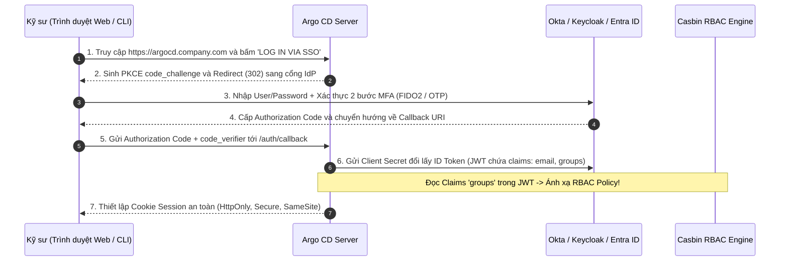
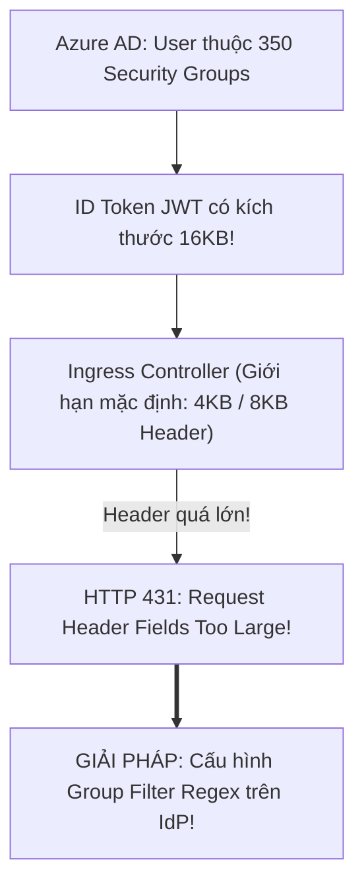


# Tích Hợp Đăng Nhập Tập Trung: SSO, OIDC, Dex & Okta / Keycloak Chuẩn Doanh Nghiệp

Trong kỷ nguyên chuyển đổi số và tuân thủ an toàn thông tin doanh nghiệp (ISO 27001, SOC 2, HIPAA, PCI-DSS), việc yêu cầu nhân viên phải ghi nhớ mật khẩu tĩnh cục bộ hoặc chia sẻ tài khoản chung là điều bị nghiêm cấm hoàn toàn.

Mọi hoạt động đăng nhập vào các hệ thống quản trị cốt lõi như Argo CD bắt buộc phải thông qua giải pháp **Đăng Nhập Một Lần (Single Sign-On - SSO)** kết hợp với chuẩn mở **OpenID Connect (OIDC)** hoặc **SAML 2.0**. Khi một kỹ sư rời khỏi công ty, quyền truy cập vào toàn bộ hạ tầng GitOps sẽ tự động bị thu hồi ngay lập tức từ hệ thống định danh trung tâm (**Identity Provider - IdP** như Okta, Microsoft Entra ID / Azure AD, Google Workspace, Keycloak).

Bài viết này sẽ hướng dẫn bạn bóc tách hai kiến trúc tích hợp SSO: **Direct OIDC** và **Embedded Dex Broker**, xây dựng cấu hình kết nối chuẩn mực cho các IdP hàng đầu, xử lý luồng xác thực CLI SSO và khắc phục các lỗi cạm bẫy như **HTTP 431 Request Header Fields Too Large** khi token chứa quá nhiều nhóm.

---

## 1. Hai Kiến Trúc Tích Hợp SSO Trong Argo CD

Argo CD cung cấp hai phương án tích hợp hệ thống định danh:

```mermaid
flowchart TD
    subgraph OPTION1["PHƯƠNG ÁN 1: DIRECT OIDC (Trực Tiếp với IdP Chuẩn OIDC)"]
        ARGO_1["Argo CD Server Core"] [--]|Chuẩn OIDC Discovery / Token Endpoint| IDP_OIDC["Enterprise IdP (Okta, Azure AD, Keycloak, Ping)"]
    end

    subgraph OPTION2["PHƯƠNG ÁN 2: EMBEDDED DEX BROKER (Cầu Nối Đa Giao Thức)"]
        ARGO_2["Argo CD Server"] [--]|gRPC Nội Bộ| DEX["Embedded Dex IdP Broker"]
        DEX [--]|OAuth2| GITHUB["GitHub / GitLab Organizations"]
        DEX [--]|LDAP / AD| LDAP["Active Directory / OpenLDAP"]
        DEX [--]|SAML 2.0| SAML["Legacy Enterprise SAML"]
    end


```

### Bảng So Sánh Hai Phương Án Tích Hợp:

| Tiêu Chí So Sánh | Phương Án 1: Direct OIDC | Phương Án 2: Embedded Dex Broker |
| :--- | :--- | :--- |
| **Độ phức tạp vận hành** | Rất thấp (Chỉ cần cấu hình URL và Client Secret) | Trung bình (Chạy thêm Pod/Container Dex) |
| **Giao thức hỗ trợ** | Chỉ hỗ trợ chuẩn OpenID Connect (OIDC) | Hỗ trợ **OIDC, OAuth2 (GitHub/GitLab), LDAP, SAML 2.0** |
| **Hệ thống IdP tương thích** | Okta, Azure AD (Entra ID), Keycloak, Google | GitHub, GitLab, FreeIPA, Windows Active Directory |
| **Bảo trì & Tài nguyên** | Tiết kiệm CPU/RAM, không có điểm nghẽn phụ | Cần giám sát trạng thái của `argocd-dex-server` |
| **Mức độ khuyên dùng** | Khuyên dùng cho hầu hết doanh nghiệp hiện đại | Dùng khi bắt buộc phải kết nối LDAP/GitHub/SAML |

> [!IMPORTANT]
> **YÊU CẦU BẮT BUỘC VỀ OIDC GROUPS CLAIM:**
> Khi tích hợp OIDC với Okta, Keycloak hoặc Azure AD, bắt buộc phải cấu hình IdP trả về claim `groups` trong ID Token và khai báo scope `groups` trong `argocd-cm` để hệ thống ánh xạ quyền RBAC chính xác.

> [!WARNING]
> **CHÍNH XÁC ĐƯỜNG DẪN CALLBACK URI:**
> Callback URI trên IdP đối với Direct OIDC là `https://<host>/auth/callback`, trong khi đối với Dex Broker là `https://<host>/api/dex/callback`. Sai đường dẫn này sẽ gây lỗi `400 Invalid Redirect URI`.

---

## 2. Luồng Xác Thực OIDC Authorization Code Flow Với PKCE

Quy trình xác thực an toàn giữa Trình duyệt Web, Argo CD Server và Identity Provider diễn ra qua 7 bước khép kín:



---

## 3. Cấu Trúc Bóc Tách Của JWT ID Token Trả Về Từ SSO

Dưới đây là cấu trúc mẫu của một ID Token (JSON Web Token) sau khi người dùng xác thực thành công qua SSO:

```json
{
  "iss": "https://company.okta.com/oauth2/default",
  "sub": "00u1234567890abcdef",
  "aud": "0oa98f2k3j4h5g6l7m8n",
  "exp": 1775568000,
  "iat": 1775481600,
  "email": "alice.nguyen@company.com",
  "email_verified": true,
  "name": "Alice Nguyen",
  "groups": [
    "okta-payment-engineers",
    "developers",
    "vietnam-engineering-team"
  ]
}
```

Khi nhận được token này, Argo CD sẽ:
1. Xác thực chữ ký mã hóa của Token dựa trên Public Keys từ endpoint `/.well-known/jwks.json` của IdP.
2. Trích xuất mảng `groups` và chuyển giao cho Casbin RBAC Engine để so khớp với các quy tắc `g, okta-payment-engineers, role:payment-dev`.

---

## 4. Cấu Hình Direct OIDC Cho Các IdP Doanh Nghiệp Hàng Đầu

### 4.1. Cấu Hình Tệp `argocd-cm` Cho Okta

```yaml
# argocd-cm-oidc-okta.yaml — Cấu hình Direct OIDC chuẩn mực cho Okta
apiVersion: v1
kind: ConfigMap
metadata:
  name: argocd-cm
  namespace: argocd
data:
  # 1. URL chính thức của Argo CD (Bắt buộc để tính toán Redirect URI)
  url: "https://argocd.company.internal"

  # 2. KHỐI CẤU HÌNH DIRECT OIDC CHO OKTA
  oidc.config: |
    name: "Okta Enterprise SSO"
    issuer: "https://company.okta.com/oauth2/default"
    clientID: "0oa98f2k3j4h5g6l7m8n"
    clientSecret: $oidc.clientSecret
    requestedScopes:
      - openid
      - profile
      - email
      - groups # BẮT BUỘC ĐỂ LẤY DANH SÁCH NHÓM CHO RBAC!
    requestedIDTokenClaims:
      groups:
        essential: true
```

### 4.2. Cấu Hình Microsoft Entra ID (Azure AD)

Trong môi trường Azure AD, ta cần cấu hình claim `groups` để đọc trực tiếp Object ID hoặc sAMAccountName:

```yaml
# argocd-cm-azure-ad.yaml
apiVersion: v1
kind: ConfigMap
metadata:
  name: argocd-cm
  namespace: argocd
data:
  url: "https://argocd.company.internal"
  oidc.config: |
    name: "Microsoft Entra ID"
    issuer: "https://login.microsoftonline.com/a1b2c3d4-e5f6-7890-abcd-ef1234567890/v2.0"
    clientID: "98765432-abcd-ef01-2345-678901234567"
    clientSecret: $oidc.azure.clientSecret
    requestedScopes:
      - openid
      - profile
      - email
      - User.Read
```

### 4.3. Cấu Hình Keycloak Realm & Client Scopes

Keycloak là giải pháp IdP mã nguồn mở phổ biến nhất trong hệ sinh thái Cloud Native On-Premise:

```yaml
# argocd-cm-keycloak.yaml
apiVersion: v1
kind: ConfigMap
metadata:
  name: argocd-cm
  namespace: argocd
data:
  url: "https://argocd.company.internal"
  oidc.config: |
    name: "Keycloak Internal SSO"
    issuer: "https://keycloak.company.internal/realms/enterprise"
    clientID: "argocd-cluster-client"
    clientSecret: $oidc.keycloak.clientSecret
    requestedScopes:
      - openid
      - profile
      - email
      - roles
```

### 4.4. Cấu Hình Google Workspace OIDC Với Ràng Buộc Hosted Domain

```yaml
# argocd-cm-google.yaml
apiVersion: v1
kind: ConfigMap
metadata:
  name: argocd-cm
  namespace: argocd
data:
  url: "https://argocd.company.internal"
  oidc.config: |
    name: "Google Workspace SSO"
    issuer: "https://accounts.google.com"
    clientID: "1234567890-abcdef.apps.googleusercontent.com"
    clientSecret: $oidc.google.clientSecret
    # Chỉ cho phép nhân viên có email thuộc domain công ty đăng nhập
    hostedDomain: "company.com"
    requestedScopes:
      - openid
      - profile
      - email
```

### 4.5. Cấu Hình Nạp Client Secret Trong `argocd-secret`

```bash
# Nạp Client Secret bảo mật vào tệp argocd-secret (Mã hóa base64 an toàn)
kubectl -n argocd patch secret argocd-secret -p '{"stringData": {"oidc.clientSecret": "okta-super-secret-client-token"}}'
```

---

## 5. Cấu Hình Embedded Dex Broker Kết Nối GitHub & LDAP

### 5.1. Cấu Hình Dex Kết Nối GitHub Organization

```yaml
# argocd-cm-dex-github.yaml
apiVersion: v1
kind: ConfigMap
metadata:
  name: argocd-cm
  namespace: argocd
data:
  url: "https://argocd.company.internal"
  dex.config: |
    connectors:
      - type: github
        id: github
        name: GitHub Enterprise
        config:
          clientID: "Iv1.8a9f2b3c4d5e6f7g"
          clientSecret: $dex.github.clientSecret
          orgs:
            - name: company-org
              teams:
                - sre-team
                - payment-devs
```

### 5.2. Cấu Hình Dex Kết Nối Active Directory / OpenLDAP

```yaml
# argocd-cm-dex-ldap.yaml — Cấu hình Dex kết nối LDAP nội bộ
apiVersion: v1
kind: ConfigMap
metadata:
  name: argocd-cm
  namespace: argocd
data:
  dex.config: |
    connectors:
      - type: ldap
        id: ldap
        name: Active Directory
        config:
          host: "ldap.company.internal:636"
          insecureNoSSL: false
          bindDN: "cn=argocd-svc,ou=ServiceAccounts,dc=company,dc=internal"
          bindPW: $dex.ldap.bindPW
          userSearch:
            baseDN: "ou=Users,dc=company,dc=internal"
            filter: "(objectClass=person)"
            username: "sAMAccountName"
            idAttr: "DN"
            emailAttr: "mail"
            nameAttr: "displayName"
          groupSearch:
            baseDN: "ou=Groups,dc=company,dc=internal"
            filter: "(objectClass=group)"
            userMatchers:
              - userAttr: "DN"
                groupAttr: "member"
            nameAttr: "cn"
```

---

## 6. Đăng Nhập Dòng Lệnh CLI Qua SSO (`--sso`)

Kỹ sư không cần phải nhớ mật khẩu tĩnh khi sử dụng Argo CD CLI. Bạn có thể kích hoạt luồng đăng nhập SSO ngay trên Terminal:

```bash
# Kích hoạt đăng nhập SSO trên CLI
argocd login argocd.company.internal --sso --grpc-web
```

Khi chạy lệnh trên:
1. Argo CD CLI sẽ tự động khởi tạo một Web Server cục bộ tạm thời tại cổng ngẫu nhiên trên máy bạn (ví dụ `http://localhost:8085`).
2. Tự động mở trình duyệt web mặc định để bạn hoàn tất quy trình đăng nhập SSO trên Okta/Google.
3. Nhận lại JWT Token an toàn và lưu vào tệp cấu hình `~/.argocd/config`.

---

## 7. Cạm Bẫy Thực Chiến: "Lỗi HTTP 431 Request Header Fields Too Large & Lệch Redirect URI"

### Bẫy 1: Lỗi `HTTP 431 Request Header Fields Too Large` (Tràn Kích Thước Cookie do Quá Nhiều Nhóm)
- **Hiện tượng:** Kỹ sư đăng nhập qua Azure AD (Entra ID) thành công trên IdP, nhưng khi quay lại Argo CD thì trình duyệt báo lỗi `431 Request Header Fields Too Large` hoặc `Bad Request`.
- **Nguyên nhân:** Trong các tập đoàn lớn, một nhân viên có thể thuộc 200 - 300 Security Groups trong Active Directory. Khi Azure AD nhét toàn bộ danh sách group này vào ID Token, kích thước Token vượt quá 8KB, làm tràn giới hạn Header HTTP của Ingress Controller (Nginx / ALB / Traefik).
- **Khắc phục:**
  1. Cấu hình Ingress tăng giới hạn buffer: `nginx.ingress.kubernetes.io/proxy-buffer-size: "128k"`.
  2. Trên Azure AD, cấu hình **Token Group Filter** chỉ trả về các nhóm có tiền tố liên quan đến Argo CD (ví dụ `argocd-*` hoặc `k8s-*`).



---

### Bẫy 2: Lỗi `400 Invalid Redirect URI` (Sai Đường Dẫn Callback)
- **Hiện tượng:** Người dùng bấm "Log in via SSO", màn hình Okta/Google báo lỗi ngay lập tức: `Redirect URI mismatch / 400 Bad Request`.
- **Nguyên nhân:** Đường dẫn Callback URI khai báo trên trang quản trị Okta không khớp chính xác với cấu hình của Argo CD:
  - Đối với **Direct OIDC:** Callback URL bắt buộc phải là `https://<argocd-url>/auth/callback`.
  - Đối với **Dex Broker:** Callback URL bắt buộc phải là `https://<argocd-url>/api/dex/callback`.
- **Khắc phục:** Đảm bảo trường `url:` trong `argocd-cm` có giao thức `https://` và đã khai báo đúng đường dẫn trên IdP.

---

## 8. Hướng Dẫn Thực Hành CLI: Kiểm Tra Token Và Đăng Nhập (Step-by-Step Lab)

Dưới đây là quy trình kiểm tra và xác thực kết nối SSO:

```bash
# Bước 1: Kiểm tra cấu hình OIDC Discovery của IdP từ bên trong cụm
kubectl run oidc-test --rm -it --image=curlimages/curl -- \
  curl -s https://company.okta.com/oauth2/default/.well-known/openid-configuration | jq .

# Bước 2: Kiểm tra trạng thái sẵn sàng của Pod Dex (nếu dùng Dex)
kubectl get pods -n argocd -l app.kubernetes.io/name=argocd-dex-server

# Bước 3: Đăng nhập CLI qua SSO
argocd login argocd.company.internal --sso --grpc-web

# Bước 4: Xem chi tiết thông tin định danh và các Claims Groups nhận được từ SSO Token
argocd account get-user-info

# Bước 5: Xem log xác thực thời gian thực trên argocd-server
kubectl logs -n argocd -l app.kubernetes.io/name=argocd-server -c argocd-server -f | grep -i "oidc"

# Bước 6: Trích xuất và giải mã JWT token lưu trong file config máy cá nhân
cat ~/.argocd/config | grep -A 5 "auth-token"
```

---

## 9. Bộ Câu Hỏi Tự Kiểm Tra Chuyên Sâu (Self-Check Q&A)

Dưới đây là 10 câu hỏi sát hạch chuyên sâu về SSO/OIDC trong Argo CD:

### Câu 1: Sự khác nhau về Callback URL giữa Direct OIDC và Embedded Dex Broker là gì?
- **Đáp án:** 
  - Direct OIDC sử dụng endpoint: `https://<argocd-url>/auth/callback`.
  - Embedded Dex Broker sử dụng endpoint: `https://<argocd-url>/api/dex/callback`.

### Câu 2: Tại sao trường `groups` trong `requestedScopes` là bắt buộc khi tích hợp SSO với Argo CD?
- **Đáp án:** Vì nếu thiếu Scope `groups`, hệ thống Identity Provider (Okta/Azure AD) sẽ không đính kèm danh sách các nhóm của người dùng vào bên trong ID Token (JWT). Không có thông tin nhóm, động cơ RBAC của Argo CD sẽ không thể thực hiện ánh xạ (`g rules`) và sẽ đẩy người dùng về quyền mặc định `role:readonly`.

### Câu 3: Làm thế nào để bảo vệ mật khẩu `clientSecret` của OIDC không bị lộ trong ConfigMap `argocd-cm`?
- **Đáp án:** Sử dụng cú pháp tham chiếu biến bí mật: `clientSecret: $oidc.clientSecret`. Sau đó, lưu giá trị bí mật thực tế vào trường `oidc.clientSecret` bên trong Kubernetes `Secret` `argocd-secret`.

### Câu 4: Khi một nhân viên bị vô hiệu hóa tài khoản trên Okta/Azure AD, phiên làm việc (Session) trên Argo CD của họ tồn tại tối đa bao lâu?
- **Đáp án:** Tồn tại tối đa bằng thời hạn sống của JWT Session Token (mặc định là 24 giờ). Muốn thu hồi quyền ngay lập tức, SRE có thể xóa phiên làm việc của người dùng đó trong bộ nhớ đệm `argocd-redis` hoặc khởi động lại cụm Redis.

### Câu 5: Có thể cấu hình vừa cho phép đăng nhập qua SSO vừa giữ lại tài khoản cục bộ `admin` để dự phòng sự cố mất mạng không?
- **Đáp án:** **Hoàn toàn được!** Trên giao diện đăng nhập của Argo CD sẽ hiển thị đồng thời cả form nhập User/Password cục bộ và nút bấm "Log in via SSO". Tuy nhiên, mật khẩu admin cục bộ phải được bảo vệ cực kỳ nghiêm ngặt và chỉ dùng trong các tình huống khẩn cấp (Break-glass scenario).

### Câu 6: Tham số `requestedIDTokenClaims` trong cấu hình OIDC có vai trò gì?
- **Đáp án:** Tham số này yêu cầu Identity Provider bắt buộc phải nhúng các thông tin bổ sung (như `groups`, `email_verified`) trực tiếp vào trong ID Token thay vì phải gọi thêm một HTTP request tới endpoint `/userinfo`.

### Câu 7: Tại sao cần thêm cờ `--grpc-web` khi chạy lệnh `argocd login --sso` qua Ingress?
- **Đáp án:** Nhiều Ingress Controller hoặc Reverse Proxy (như AWS ALB hoặc Cloudflare) không hỗ trợ gRPC thuần qua HTTP/2 một cách hoàn chỉnh. Cờ `--grpc-web` đóng gói các cuộc gọi gRPC qua giao thức HTTP/1.1 Web standard để đảm bảo kết nối luôn thông suốt.

### Câu 8: Dex Broker lưu trữ dữ liệu phiên làm việc và trạng thái kết nối ở đâu?
- **Đáp án:** Dex Broker trong Argo CD mặc định sử dụng cơ chế lưu trữ trong bộ nhớ (In-Memory) hoặc sử dụng Kubernetes Custom Resources / ConfigMaps nội bộ để quản lý trạng thái.

### Câu 9: Làm thế nào để cấu hình thời gian hết hạn (Session Lifetime) cho phiên đăng nhập SSO?
- **Đáp án:** Có thể cấu hình tham số `users.session.duration` trong ConfigMap `argocd-cm` (ví dụ: `24h` hoặc `8h` theo ca làm việc của doanh nghiệp).

### Câu 10: Nếu IdP sử dụng chứng chỉ TLS nội bộ tự ký (Self-signed Certificate), làm thế nào để Argo CD tin cậy OIDC Issuer?
- **Đáp án:** Thêm chuỗi chứng chỉ CA Certificate nội bộ vào trường `rootCA` bên trong khối `oidc.config` hoặc mount tệp CA vào thư mục `/etc/ssl/certs` của container `argocd-server`.

---

## Tổng Kết

Tích hợp SSO/OIDC là tiêu chuẩn bắt buộc để đưa Argo CD vào môi trường vận hành chuyên nghiệp, mang lại trải nghiệm đăng nhập liền mạch, kiểm soát quyền hạn tập trung và nâng cao tính tuân thủ an toàn thông tin doanh nghiệp.

Ở bài tiếp theo, chúng ta sẽ bước vào chuyên đề sống còn: **Quản Trị Bí Mật (Secrets Management) Trong GitOps: So Sánh Toàn Diện Sealed Secrets, External Secrets Operator (ESO) & SOPS**!

