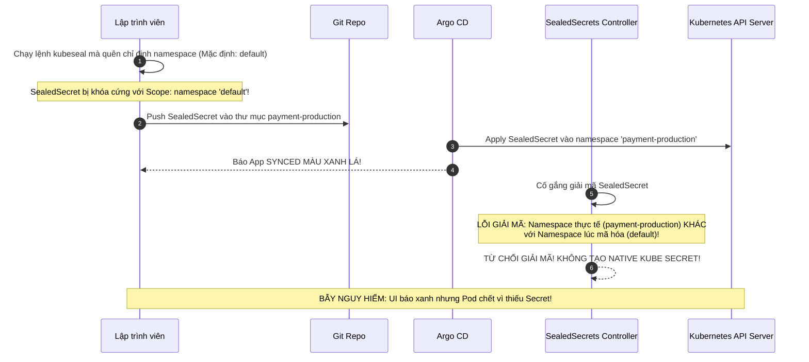


# Quản Lý Bí Mật Trong GitOps: Sealed Secrets, External Secrets (ESO) & SOPS

Triết lý nền tảng của GitOps là: *"Toàn bộ cấu hình hệ thống phải được khai báo và lưu trữ công khai trên kho Git (Single Source of Truth)"*.

Tuy nhiên, điều này đặt ra một thách thức an ninh sống còn: **Làm thế nào để quản lý các thông tin bí mật cực kỳ nhạy cảm (như mật khẩu cơ sở dữ liệu, API Keys Stripe, chứng chỉ TLS tư nhân) trên Git mà không làm lộ dữ liệu cho người khác?**

Nhiều lập trình viên mới bắt đầu thường nhầm lẫn rằng việc mã hóa chuỗi thành **Base64** trong Kubernetes Secret chuẩn (`kind: Secret`) là đã an toàn. Thực tế, Base64 chỉ là một thuật toán mã hóa định dạng (Encoding), bất kỳ ai cũng có thể giải mã ngược lại thành văn bản thô (Cleartext) trong vòng 0.1 giây bằng lệnh `base64 -d`!

Để giải quyết bài toán "hóc búa" này, cộng đồng GitOps đã phát triển 3 giải pháp quản lý Secret cấp doanh nghiệp: **Bitnami Sealed Secrets**, **External Secrets Operator (ESO)** và **Mozilla SOPS**. Bài viết này sẽ so sánh toàn diện 3 giải pháp, phân tích kiến trúc chuyên sâu, quy trình xoay vòng khóa và vạch trần cạm bẫy giải mã Secret sập ngầm.

---

## 1. Ma Trận So Sánh Toàn Diện 3 Giải Pháp Quản Trị Secret

```mermaid
flowchart TD
    subgraph S1["1. BITNAMI SEALED SECRETS (Mã Hóa Bất Đối Xứng Phía Client)"]
        PLAIN_1["Kube Secret Gốc"] -->|kubeseal + Public Key| SEALED_CRD["SealedSecret CRD (An toàn đẩy lên Git)"]
        SEALED_CRD -->|Argo CD Deploy| K8S_1["Cụm K8s (Controller giữ Private Key)"]
        K8S_1 -->|Giải mã| NATIVE_SEC1["Native Kubernetes Secret"]
    end

    subgraph S2["2. EXTERNAL SECRETS OPERATOR - ESO (Đồng Bộ Từ Vault / Cloud KMS)"]
        VAULT["Secret Manager Ngoài (HashiCorp Vault / AWS / GCP)"]
        EXT_CRD["ExternalSecret CRD (Lưu trên Git, chỉ chứa tham chiếu Key)"]
        ESO_CTRL["ESO Controller trong cụm"]
        
        EXT_CRD -->|Argo CD Deploy| ESO_CTRL
        ESO_CTRL [--]|Kéo Secret qua IAM Role / Token| VAULT
        ESO_CTRL -->|Sinh ra| NATIVE_SEC2["Native Kubernetes Secret"]
    end

    subgraph S3["3. MOZILLA SOPS (Mã Hóa Từng Trường Bằng Khóa KMS)"]
        SOPS_FILE["secrets.enc.yaml (Mã hóa từng value qua AWS KMS / PGP)"]
        CMP_PLUGIN["Argo CD CMP Plugin (Giải mã trong bộ nhớ RAM lúc render)"]
        
        SOPS_FILE -->|Lưu trên Git| CMP_PLUGIN
        CMP_PLUGIN ==>|Render trực tiếp| NATIVE_SEC3["Native Kubernetes Secret trên cụm"]
    end


```

### Bảng Đánh Giá Kiến Trúc Đa Chiều:

| Tiêu Chí So Sánh | 1. Bitnami Sealed Secrets | 2. External Secrets Operator (ESO) | 3. Mozilla SOPS / KSOPS |
| :--- | :--- | :--- | :--- |
| **Cơ chế hoạt động** | Mã hóa bất đối xứng (RSA-OAEP 4096-bit) | Kéo Secret từ dịch vụ Secret Manager ngoài | Mã hóa từng giá trị field bằng KMS/PGP/Age |
| **Dữ liệu lưu trên Git** | Tệp `SealedSecret` CRD đã mã hóa toàn bộ | Tệp `ExternalSecret` CRD (Chỉ lưu Key Name) | Tệp YAML chuẩn đã mã hóa từng dòng giá trị |
| **Phụ thuộc hạ tầng ngoài** | **Không** (Hoàn toàn tự quản trong cụm) | **Có** (Cần HashiCorp Vault/AWS/GCP KMS) | **Có** (Cần Cloud KMS hoặc PGP/Age Key) |
| **Tự động xoay vòng khóa (Rotation)** | Phức tạp (Phải chạy lại `kubeseal` và commit) | **Tự động 100%** từ Vault/AWS Secrets | Trung bình (Chạy lại script CI/CD) |
| **Hỗ trợ Multi-Cluster** | Phải chia sẻ Private Key hoặc mã hóa riêng | Tự động kết nối chung 1 Vault trung tâm | Tự động giải mã nếu các cụm có IAM Role KMS |
| **Mức độ phổ biến** | Rất cao trong cụm On-Premise/K8s thuần | **Chuẩn mực Enterprise hàng đầu** | Cao cho nhóm GitOps nhỏ thích sửa file trực tiếp |

> [!CAUTION]
> **TUYỆT ĐỐI KHÔNG LƯU PLAINTEXT SECRET TRÊN GIT:**
> Trường `data` trong Kubernetes Secret chỉ được mã hóa Base64 đơn giản chứ không có tính bảo mật mật mã học. Luôn sử dụng Bitnami Sealed Secrets, External Secrets Operator (ESO) hoặc SOPS trước khi commit lên Git.

> [!WARNING]
> **CẨN TRỌNG VỚI SCOPE CỦA KUBESEAL:**
> Khi mã hóa bằng `kubeseal`, luôn chỉ định rõ `--namespace` và `--name` để tránh lỗi giải mã sập ngầm khi deploy sang namespace khác.

---

## 2. Giải Pháp 1: Bitnami Sealed Secrets (Mã Hóa Bất Đối Xứng)

### 2.1. Quy Trình Mã Hóa Và Giải Mã
1. **Phía Client (Developer):** Sử dụng công cụ CLI `kubeseal` và **Public Key** của cụm để mã hóa Kubernetes Secret thành đối tượng `SealedSecret` CRD. Tệp này an toàn 100% để đẩy lên kho Git công khai.
2. **Phía Cụm Kubernetes:** `SealedSecrets Controller` là thành phần duy nhất nắm giữ **Private Key** (lưu an toàn trong etcd). Controller sẽ tự động giải mã `SealedSecret` thành `Native Kubernetes Secret` để các Pods sử dụng.

### 2.2. Phân Tích Cấu Hình Manifest `SealedSecret` (Line-by-Line Breakdown)

```yaml
# sealedsecret-payment-db.yaml
apiVersion: bitnami.com/v1alpha1
kind: SealedSecret
metadata:
  name: payment-db-credentials
  namespace: payment-production
  annotations:
    # Phạm vi mã hóa: Strict (Mặc định) - Khóa chặt theo đúng Namespace và Name
    sealedsecrets.bitnami.com/cluster-wide: "false"
spec:
  # Khuôn mẫu của Secret đích sau khi giải mã
  template:
    metadata:
      name: payment-db-credentials
      namespace: payment-production
      labels:
        app.kubernetes.io/name: payment-api
    type: Opaque
  # Dữ liệu đã được mã hóa RSA-OAEP an toàn tuyệt đối
  encryptedData:
    username: AgByK3j4h5g6l7m8n9... (Chuỗi mã hóa an toàn)
    password: AgBy9f8e7d6c5b4a3z... (Chuỗi mã hóa an toàn)
```

### 2.3. Quy Trình Tự Động Xoay Vòng Khóa Private Key (Key Rotation)

Mặc định, Sealed Secrets Controller tự động sinh cặp khóa RSA mới sau mỗi 30 ngày (`--key-renew-period=720h`).
- **Khóa mới** được dùng để mã hóa các Secrets mới sinh ra trong tương lai.
- **Tất cả các khóa cũ** vẫn được lưu lại trong Secret `sealed-secrets-key*` tại namespace `argocd` để tiếp tục giải mã các SealedSecret đã được commit từ trước.
- **Quy tắc vàng:** Không bao giờ xóa các Secret khóa cũ trừ khi đã re-seal toàn bộ repository bằng Public Key mới nhất.

---

## 3. Giải Pháp 2: External Secrets Operator (ESO) Chuẩn Doanh Nghiệp

ESO là giải pháp được các tập đoàn lớn ưu tiên hàng đầu vì khả năng tích hợp trực tiếp với các kho quản trị bí mật chuyên nghiệp như **HashiCorp Vault**, **AWS Secrets Manager**, **Azure Key Vault**, và **GCP Secret Manager**.

```mermaid
flowchart LR
    VAULT_STORE["HashiCorp Vault Server<br/>Path: secret/data/production/payment"]
    
    subgraph K8S_ESO["CỤM KUBERNETES"]
        SS["SecretStore CRD<br/>(Cấu hình kết nối & Xác thực Vault)"]
        ES["ExternalSecret CRD<br/>(Khai báo Key cần kéo)"]
        CTRL["ESO Controller"]
        KUBE_SEC["Kubernetes Secret: payment-db-secret"]
    end

    ES --> SS
    SS --> CTRL
    CTRL [--]|Đồng bộ mỗi 1 giờ| VAULT_STORE
    CTRL -->|Tự động sinh ra| KUBE_SEC


```

### 3.1. Phân Tích Cấu Hình Chi Tiết Manifest ESO Với HashiCorp Vault

#### Bước 1: Khởi tạo `SecretStore` kết nối HashiCorp Vault
```yaml
# secretstore-vault.yaml
apiVersion: external-secrets.io/v1beta1
kind: SecretStore
metadata:
  name: vault-backend-store
  namespace: payment-production
spec:
  provider:
    vault:
      server: "https://vault.company.internal:8200"
      path: "secret"
      version: "v2"
      auth:
        # Xác thực bằng Kubernetes ServiceAccount Token (Chuẩn Zero Trust)
        kubernetes:
          mountPath: "kubernetes"
          role: "payment-service-role"
          serviceAccountRef:
            name: payment-vault-sa
```

#### Bước 2: Khởi tạo `ExternalSecret` kéo dữ liệu
```yaml
# externalsecret-payment.yaml
apiVersion: external-secrets.io/v1beta1
kind: ExternalSecret
metadata:
  name: payment-db-external-secret
  namespace: payment-production
spec:
  # Chu kỳ tự động kiểm tra và đồng bộ lại từ Vault (ví dụ mỗi 1 giờ)
  refreshInterval: "1h"
  secretStoreRef:
    name: vault-backend-store
    kind: SecretStore
  # Tên của Kubernetes Secret đích sẽ được sinh ra
  target:
    name: payment-db-credentials
    creationPolicy: Owner
  # Định vị khóa bí mật trên HashiCorp Vault
  data:
    - secretKey: DB_USERNAME
      remoteRef:
        key: production/payment
        property: username
    - secretKey: DB_PASSWORD
      remoteRef:
        key: production/payment
        property: password
```

### 3.2. Cấu Hình ESO Với AWS Secrets Manager Qua IRSA

```yaml
# secretstore-aws.yaml — Kết nối AWS Secrets Manager không cần Secret tĩnh
apiVersion: external-secrets.io/v1beta1
kind: ClusterSecretStore
metadata:
  name: aws-secrets-manager
spec:
  provider:
    aws:
      service: SecretsManager
      region: ap-southeast-1
      auth:
        jwt:
          serviceAccountRef:
            name: eso-irsa-sa
            namespace: external-secrets
```

### 3.3. Cấu Hình ESO Với Google Cloud Secret Manager (GCP Workload Identity)

```yaml
# secretstore-gcp.yaml — Kết nối GCP Secret Manager
apiVersion: external-secrets.io/v1beta1
kind: ClusterSecretStore
metadata:
  name: gcp-secret-manager
spec:
  provider:
    gcpsm:
      projectID: "enterprise-production-project-123"
      auth:
        workloadIdentity:
          clusterLocation: "asia-southeast1"
          clusterName: "prod-gke-cluster"
          serviceAccountRef:
            name: eso-gcp-sa
            namespace: external-secrets
```

---

## 4. Giải Pháp 3: Mozilla SOPS & KSOPS Với Cloud KMS

SOPS cho phép mã hóa từng giá trị field bên trong tệp YAML trong khi vẫn giữ nguyên cấu trúc keys, cho phép `git diff` trực quan:

```yaml
# .sops.yaml — Cấu hình quy tắc mã hóa tự động bằng AWS KMS
creation_rules:
  - path_regex: .*/secrets/.*\.enc\.yaml$
    kms: "arn:aws:kms:ap-southeast-1:123456789012:key/a1b2c3d4-e5f6-7890-abcd-ef1234567890"
    encrypted_regex: '^(data|stringData)$'
```

### 4.1. Tích Hợp KSOPS Trong Kustomize Build

```yaml
# kustomization.yaml — Tích hợp KSOPS Generator giải mã lúc render
apiVersion: kustomize.config.k8s.io/v1beta1
kind: Kustomization
generators:
  - secret-generator.yaml
```

```yaml
# secret-generator.yaml
apiVersion: viaduct.ai/v1alpha1
kind: ksops
metadata:
  name: payment-secret-generator
  annotations:
    config.kubernetes.io/function: |
      exec:
        path: ksops
files:
  - secrets.enc.yaml
```

---

## 5. Cạm Bẫy Thực Chiến: "SealedSecret Báo Synced Màu Xanh Nhưng Native Kube Secret Không Sinh Ra Do Sai Scope Mã Hóa"

### Hiện Tượng Sự Cố & Log Trace
- Lập trình viên mã hóa Secret trên máy cá nhân bằng lệnh `kubeseal` từ namespace `default`.
- Đẩy tệp `SealedSecret` lên Git và deploy sang namespace `payment-production`.
- Trên Argo CD UI, ứng dụng báo **`Sync Status: Synced`** và **`Health: Healthy`** màu xanh lá.
- Tuy nhiên, Pod ứng dụng liên tục bị lỗi `CreateContainerConfigError` vì không tìm thấy Secret `payment-db-credentials`!

```json
{
  "timestamp": "2026-04-08T14:32:10Z",
  "level": "error",
  "controller": "sealed-secrets-controller",
  "msg": "Failed to unseal secret payment-db-credentials in namespace payment-production: decryption error: namespace mismatch (expected: default, actual: payment-production)"
}
```



### 5.1. Phân Tích Nguyên Nhân Gốc Rễ (5-Whys)
1. **Tại sao Pod bị lỗi thiếu Secret?** $\rightarrow$ Vì Native Kubernetes Secret không tồn tại trong namespace `payment-production`.
2. **Tại sao Native Secret không được tạo?** $\rightarrow$ Vì SealedSecrets Controller từ chối giải mã đối tượng `SealedSecret`.
3. **Tại sao Controller từ chối giải mã?** $\rightarrow$ Vì namespace lúc mã hóa (`default`) không khớp với namespace hiện tại (`payment-production`).
4. **Tại sao namespace bị lệch?** $\rightarrow$ Do kỹ sư chạy lệnh `kubeseal` trên máy cá nhân mà quên thêm tham số `--namespace`.
5. **Quy tắc an ninh của Kubeseal là gì?** $\rightarrow$ Cơ chế Strict Scope bảo vệ dữ liệu bằng cách gắn chặt mã hóa với cặp `Namespace + SecretName`.

### 5.2. Quy Trình Khắc Phục Chuẩn Xác
Khi mã hóa bằng `kubeseal`, luôn chỉ định tường minh cả Namespace và Name:

```bash
# Luôn chỉ định cờ --namespace và --name khi chạy kubeseal
kubectl create secret generic payment-db-credentials \
  --from-literal=username=postgres \
  --from-literal=password=SuperSecretPassword123 \
  --dry-run=client -o yaml | \
kubeseal \
  --controller-name=sealed-secrets-controller \
  --controller-namespace=argocd \
  --format=yaml \
  --namespace=payment-production \
  --name=payment-db-credentials > sealedsecret-payment-db.yaml
```

---

## 6. Hướng Dẫn Thực Hành CLI: Quản Trị SealedSecrets & ESO (Step-by-Step Lab)

```bash
# Bước 1: Trích xuất Public Certificate của cụm để chia sẻ cho các lập trình viên mã hóa
kubeseal --fetch-cert --controller-name=sealed-secrets-controller --controller-namespace=argocd > pub-sealed-secrets.pem

# Bước 2: Mã hóa một tệp Secret cục bộ bằng Public Key đã tải về
kubeseal --cert pub-sealed-secrets.pem --format yaml < my-secret.yaml > my-sealed-secret.yaml

# Bước 3: Kiểm tra trạng thái đồng bộ của ExternalSecret CRD
kubectl get externalsecrets -n payment-production
kubectl describe externalsecret payment-db-external-secret -n payment-production

# Bước 4: Kiểm tra xem Native Kubernetes Secret đã được sinh ra thành công chưa
kubectl get secret payment-db-credentials -n payment-production -o jsonpath="{.data.DB_USERNAME}" | base64 -d

# Bước 5: Kiểm tra nhật ký của SealedSecrets Controller khi giải mã thất bại
kubectl logs -n argocd -l app.kubernetes.io/name=sealed-secrets -f

# Bước 6: Kiểm tra trạng thái ClusterSecretStore kết nối AWS Secrets Manager
kubectl get clustersecretstores
```

---

## 7. Bộ Câu Hỏi Tự Kiểm Tra Chuyên Sâu (Self-Check Q&A)


<div class="qa-answer">
  <div class="qa-answer-header">
    <svg width="14" height="14" fill="none" stroke="currentColor" stroke-width="2" viewBox="0 0 24 24"><path d="M22 11.08V12a10 10 0 1 1-5.93-9.14"></path><polyline points="22 4 12 14.01 9 11.01"></polyline></svg>
    <span>Phân Tích &amp; Lời Giải Kỹ Thuật</span>
  </div>
  
Vì trường <code>data</code> trong Kubernetes Secret chỉ được mã hóa dạng <b style="color: var(--accent-primary);">Base64</b> chứ không được mã hóa mật mã học (Not Encrypted). Bất kỳ ai có quyền đọc Git đều có thể giải mã lấy mật khẩu trong 1 dòng lệnh, dẫn tới nguy cơ lộ lọt toàn bộ cơ sở dữ liệu.
</div>
</details>

<div class="qa-answer">
  <div class="qa-answer-header">
    <svg width="14" height="14" fill="none" stroke="currentColor" stroke-width="2" viewBox="0 0 24 24"><path d="M22 11.08V12a10 10 0 1 1-5.93-9.14"></path><polyline points="22 4 12 14.01 9 11.01"></polyline></svg>
    <span>Phân Tích &amp; Lời Giải Kỹ Thuật</span>
  </div>
  
Toàn bộ các tệp <code>SealedSecret</code> đã mã hóa trước đó trên Git sẽ <b style="color: var(--accent-primary);">không bao giờ có thể giải mã được nữa</b>. Do đó, việc sao lưu Secret chứa Private Key của Sealed Secrets Controller (<code>sealed-secrets-key*</code>) ra nơi an toàn là nhiệm vụ sống còn của SRE.
</div>
</details>

<div class="qa-answer">
  <div class="qa-answer-header">
    <svg width="14" height="14" fill="none" stroke="currentColor" stroke-width="2" viewBox="0 0 24 24"><path d="M22 11.08V12a10 10 0 1 1-5.93-9.14"></path><polyline points="22 4 12 14.01 9 11.01"></polyline></svg>
    <span>Phân Tích &amp; Lời Giải Kỹ Thuật</span>
  </div>
  
ESO cho phép <b style="color: var(--accent-primary);">tự động xoay vòng bí mật (Secret Auto-Rotation)</b> trực tiếp từ HashiCorp Vault / AWS Secrets Manager mà không cần lập trình viên phải chạy lại lệnh mã hóa và commit lại Git.
</div>
</details>

<div class="qa-answer">
  <div class="qa-answer-header">
    <svg width="14" height="14" fill="none" stroke="currentColor" stroke-width="2" viewBox="0 0 24 24"><path d="M22 11.08V12a10 10 0 1 1-5.93-9.14"></path><polyline points="22 4 12 14.01 9 11.01"></polyline></svg>
    <span>Phân Tích &amp; Lời Giải Kỹ Thuật</span>
  </div>
  
<div style="margin: 0.35rem 0; padding-left: 1rem; border-left: 2px solid var(--accent-cyan);"><b style="color: var(--accent-cyan);">1.</b> <code>strict</code> (Mặc định): Khóa chặt theo đúng Secret Name và Namespace.</div>
  <div style="margin: 0.35rem 0; padding-left: 1rem; border-left: 2px solid var(--accent-cyan);"><b style="color: var(--accent-cyan);">2.</b> <code>namespace-wide</code>: Có thể đổi tên Secret miễn là nằm trong cùng một Namespace.</div>
  <div style="margin: 0.35rem 0; padding-left: 1rem; border-left: 2px solid var(--accent-cyan);"><b style="color: var(--accent-cyan);">3.</b> <code>cluster-wide</code>: Có thể sử dụng trong bất kỳ Namespace nào trên toàn cụm.</div>
</div>
</details>

<div class="qa-answer">
  <div class="qa-answer-header">
    <svg width="14" height="14" fill="none" stroke="currentColor" stroke-width="2" viewBox="0 0 24 24"><path d="M22 11.08V12a10 10 0 1 1-5.93-9.14"></path><polyline points="22 4 12 14.01 9 11.01"></polyline></svg>
    <span>Phân Tích &amp; Lời Giải Kỹ Thuật</span>
  </div>
  
Cấu hình <b style="color: var(--accent-primary);">Custom Lua Health Check</b> cho <code>bitnami.com_SealedSecret</code> trong <code>argocd-cm</code>. Khi <code>status.conditions</code> báo <code>Synced: False</code>, Argo CD sẽ lập tức đổi màu biểu tượng thành <code>Degraded</code> màu đỏ thay vì báo <code>Healthy</code> ảo.
</div>
</details>

<div class="qa-answer">
  <div class="qa-answer-header">
    <svg width="14" height="14" fill="none" stroke="currentColor" stroke-width="2" viewBox="0 0 24 24"><path d="M22 11.08V12a10 10 0 1 1-5.93-9.14"></path><polyline points="22 4 12 14.01 9 11.01"></polyline></svg>
    <span>Phân Tích &amp; Lời Giải Kỹ Thuật</span>
  </div>
  
<code>SecretStore</code> là tài nguyên có phạm vi Namespace (Namespace-scoped), chỉ cấp Secret cho một namespace cụ thể. <code>ClusterSecretStore</code> là tài nguyên cấp Cụm (Cluster-scoped), cho phép nhiều namespace cùng tái sử dụng một cấu hình kết nối Vault chung.
</div>
</details>

<div class="qa-answer">
  <div class="qa-answer-header">
    <svg width="14" height="14" fill="none" stroke="currentColor" stroke-width="2" viewBox="0 0 24 24"><path d="M22 11.08V12a10 10 0 1 1-5.93-9.14"></path><polyline points="22 4 12 14.01 9 11.01"></polyline></svg>
    <span>Phân Tích &amp; Lời Giải Kỹ Thuật</span>
  </div>
  
SOPS chỉ mã hóa phần <b style="color: var(--accent-primary);">giá trị (values)</b> của các trường được chỉ định (như <code>data</code> hoặc <code>stringData</code>), trong khi giữ nguyên các <b style="color: var(--accent-primary);">khóa (keys)</b> và cấu trúc phân cấp YAML, giúp lập trình viên vẫn đọc hiểu cấu trúc và theo dõi <code>git diff</code> dễ dàng.
</div>
</details>

<div class="qa-answer">
  <div class="qa-answer-header">
    <svg width="14" height="14" fill="none" stroke="currentColor" stroke-width="2" viewBox="0 0 24 24"><path d="M22 11.08V12a10 10 0 1 1-5.93-9.14"></path><polyline points="22 4 12 14.01 9 11.01"></polyline></svg>
    <span>Phân Tích &amp; Lời Giải Kỹ Thuật</span>
  </div>
  
Kết hợp ESO với <b style="color: var(--accent-primary);">Reloader</b> (Stakater Reloader) bằng cách gắn annotation <code>reloader.stakater.com/auto: "true"</code> trên Deployment, giúp tự động kích hoạt Rolling Restart khi Secret bị thay đổi.
</div>
</details>

<div class="qa-answer">
  <div class="qa-answer-header">
    <svg width="14" height="14" fill="none" stroke="currentColor" stroke-width="2" viewBox="0 0 24 24"><path d="M22 11.08V12a10 10 0 1 1-5.93-9.14"></path><polyline points="22 4 12 14.01 9 11.01"></polyline></svg>
    <span>Phân Tích &amp; Lời Giải Kỹ Thuật</span>
  </div>
  
Vault Agent Injector nạp secret trực tiếp vào bộ nhớ Pod hoặc file tạm trong container, bỏ qua đối tượng Kubernetes Secret chuẩn. Điều này khiến Argo CD không thể theo dõi trạng thái tài nguyên Secret và làm tăng tiêu thụ tài nguyên do mỗi Pod phải chạy thêm một Sidecar.
</div>
</details>

<div class="qa-answer">
  <div class="qa-answer-header">
    <svg width="14" height="14" fill="none" stroke="currentColor" stroke-width="2" viewBox="0 0 24 24"><path d="M22 11.08V12a10 10 0 1 1-5.93-9.14"></path><polyline points="22 4 12 14.01 9 11.01"></polyline></svg>
    <span>Phân Tích &amp; Lời Giải Kỹ Thuật</span>
  </div>
  
<div style="margin: 0.35rem 0; padding-left: 1rem; border-left: 2px solid var(--accent-cyan);"><b style="color: var(--accent-cyan);">1.</b> Tạo cặp khóa mới trên Sealed Secrets Controller.</div>
  <div style="margin: 0.35rem 0; padding-left: 1rem; border-left: 2px solid var(--accent-cyan);"><b style="color: var(--accent-cyan);">2.</b> Thu hồi và đổi toàn bộ mật khẩu trên cơ sở dữ liệu/dịch vụ ngoài.</div>
  <div style="margin: 0.35rem 0; padding-left: 1rem; border-left: 2px solid var(--accent-cyan);"><b style="color: var(--accent-cyan);">3.</b> Dùng Public Key mới để chạy lại <code>kubeseal</code> cho toàn bộ các repository Git.</div>
  <div style="margin: 0.35rem 0; padding-left: 1rem; border-left: 2px solid var(--accent-cyan);"><b style="color: var(--accent-cyan);">4.</b> Xóa Private Key cũ trên cụm và kích hoạt đồng bộ lại qua Argo CD.</div>
</div>
</details>

---

## Tổng Kết

Lựa chọn đúng giải pháp quản lý bí mật (Sealed Secrets cho cụm độc lập, ESO cho kiến trúc Enterprise Vault/Cloud) là điều kiện tiên quyết để xây dựng một nền tảng GitOps an toàn, tuân thủ các chuẩn mực an ninh thông tin khắt khe nhất.

Ở bài tiếp theo, chúng ta sẽ khám phá **Hệ Thống Cảnh Báo Thông Minh: Argo CD Notifications, Slack, Telegram & Webhook Automation**!

