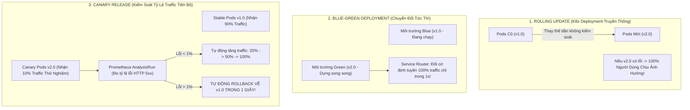
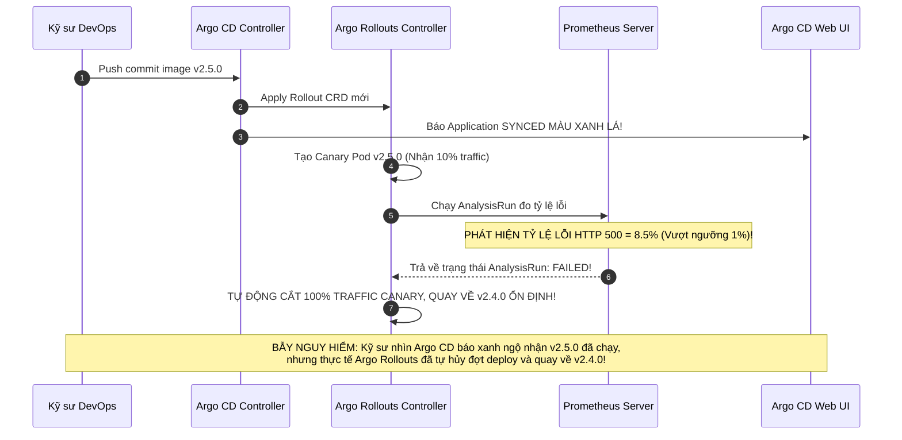


# Progressive Delivery: Triển Khai Canary & Blue-Green Với Argo Rollouts

Trong kiến trúc Kubernetes truyền thống, đối tượng `Deployment` tiêu chuẩn chỉ hỗ trợ chiến lược phát hành **Rolling Update** thô sơ: thay thế dần dần các Pods cũ bằng Pods mới.

Hạn chế chết người của Rolling Update là:
- **Không có khả năng kiểm soát tỷ lệ luồng mạng (Traffic Shaping):** Khi một Pod mới vừa khởi động xong, nó sẽ ngay lập tức nhận một phần lưu lượng truy cập thực tế từ người dùng.
- **Không có khả năng tự động đo lường và Rollback:** Nếu phiên bản mới có một lỗi logic ẩn (ví dụ: làm tăng đột biến lỗi HTTP 500 hoặc làm chậm thời gian phản hồi DB), Kubernetes hoàn toàn không biết và vẫn tiếp tục roll 100% Pods mới, đánh sập toàn bộ hệ thống Production!

**Argo Rollouts** ra đời để hiện thực hóa triết lý **Progressive Delivery** (Phát hành phần mềm tiến bộ có kiểm soát rủi ro), cung cấp hai chiến lược đỉnh cao: **Canary Release** (chia nhỏ traffic $5\% \rightarrow 20\% \rightarrow 50\% \rightarrow 100\%$) và **Blue-Green Deployment**, kết hợp với việc tự động đo lường số liệu thời gian thực qua **Prometheus AnalysisRun** để tự động Rollback tức thì trong 1 giây.

Bài viết này sẽ hướng dẫn bạn làm chủ toàn diện Argo Rollouts, tích hợp các bộ định tuyến mạng Ingress/Istio, xây dựng ma trận phân tích đa chỉ số và thiết lập các rào chắn số liệu bảo vệ an toàn cho hệ thống.

---

## 1. So Sánh 3 Chiến Lược Triển Khai Phần Mềm



### Bảng So Sánh Chi Tiết 3 Chiến Lược:

| Tiêu Chí Kỹ Thuật | Kubernetes RollingUpdate | Argo Rollouts Blue-Green | Argo Rollouts Canary |
| :--- | :--- | :--- | :--- |
| **Điều khiển tỷ lệ Traffic** | Không thể (Phụ thuộc tỷ lệ số Pod) | Không (100% Blue hoặc 100% Green) | **Chính xác từng % (1% - 100%)** |
| **Tự động đo lường số liệu** | Không hỗ trợ | Hỗ trợ qua `prePromotionAnalysis` | **Hỗ trợ đo lường liên tục từng bước** |
| **Khả năng Rollback tức thì** | Chậm (Phải deploy lại image cũ) | **Tức thì (Đổi lại Service Selector)** | **Tức thì (Cắt luồng traffic Canary)** |
| **Chi phí tài nguyên máy chủ** | Thấp ($+25\%$ Pods) | Cao (Tốn gấp đôi $+100\%$ Pods) | **Thấp (Chỉ tạo 1 - 2 Pods Canary)** |
| **Hỗ trợ Header Routing** | Không | Không | **Có (Định tuyến theo Cookie / Header)** |

> [!IMPORTANT]
> **TỰ ĐỘNG ROLLBACK TRONG 1 GIÂY VỚI ANALYSISRUN:**
> Kết hợp Argo Rollouts Canary với Prometheus `AnalysisTemplate` đo lường tỷ lệ lỗi HTTP 5xx giúp bảo vệ trải nghiệm người dùng: Nếu phiên bản mới có lỗi, hệ thống sẽ tự động cắt 100% traffic Canary và quay về phiên bản cũ ngay lập tức.

> [!TIP]
> **KIỂM SOÁT BẰNG PLUGIN CLI:**
> Cài đặt plugin `kubectl argo rollouts` để theo dõi trực quan bảng điều khiển thời gian thực và thực thi các lệnh `promote`, `pause`, `abort`, `retry` nhanh chóng.

---

## 2. So Sánh Các Nhà Cung Cấp Định Tuyến Mạng (Traffic Routers)

Argo Rollouts hỗ trợ nhiều công nghệ điều phối lưu lượng mạng để phân tách traffic giữa Stable và Canary:

| Bộ Định Tuyến (`Traffic Router`) | Cơ Chế Phân Phối | Hỗ Trợ Header Routing | Mức Độ Khuyên Dùng |
| :--- | :--- | :--- | :--- |
| **NGINX Ingress Controller** | Tự động tạo Canary Ingress với trọng số | Có (`canary-by-header`, `cookie`) | Chuẩn mực cho cụm K8s dùng NGINX Ingress |
| **Istio Service Mesh** | Điều chỉnh trọng số trên `VirtualService` | Rất mạnh mẽ (Match URI, Header, Method) | Tối ưu cho hệ thống Microservices dùng Service Mesh |
| **AWS ALB Ingress Controller** | Phân chia trọng số Target Groups trên ALB | Hỗ trợ qua ALB Rule routing | Khuyên dùng cho EKS trên AWS |
| **Traefik Ingress** | Sử dụng Traefik `TraefikService` CRD | Có | Tốt cho môi trường Edge / K3s |
| **Linkerd Service Mesh** | Điều phối qua TrafficSplit CRD | Có | Tốt cho các hệ thống Service Mesh nhẹ |

### 2.1. Cấu Hình Tích Hợp Istio Service Mesh

```yaml
# rollout-istio.yaml — Định tuyến qua Istio VirtualService
strategy:
  canary:
    trafficRouting:
      istio:
        virtualService:
          name: payment-virtual-service
          routes:
            - primary
        destinationRule:
          name: payment-destination-rule
          canarySubsetName: canary
          stableSubsetName: stable
```

---

## 3. Phân Tích Cấu Hình Chi Tiết Manifest Canary & Blue-Green

### 3.1. Manifest Cấu Hình Canary Rollout (`rollout-canary.yaml`)

```yaml
# rollout-payment.yaml — Cấu hình Canary Release tiến bộ với NGINX Ingress
apiVersion: argoproj.io/v1alpha1
kind: Rollout
metadata:
  name: payment-service-rollout
  namespace: payment-production
spec:
  replicas: 10
  selector:
    matchLabels:
      app: payment-service
  strategy:
    canary:
      canaryService: payment-service-canary
      stableService: payment-service-stable
      trafficRouting:
        nginx:
          stableIngress: payment-service-ingress
      analysis:
        templates:
          - templateName: http-error-rate-check
        args:
          - name: service-name
            value: payment-service
      steps:
        - setWeight: 10
        - pause: { duration: 5m }
        - setWeight: 30
        - pause: { duration: 10m }
        - setWeight: 60
        - pause: { duration: 10m }
  template:
    metadata:
      labels:
        app: payment-service
    spec:
      containers:
        - name: payment-api
          image: company-registry.io/payment-api:v2.5.0
          ports:
            - containerPort: 8080
```

### 3.2. Manifest Cấu Hình Blue-Green Deployment (`rollout-bluegreen.yaml`)

```yaml
# rollout-bluegreen.yaml — Chiến lược Blue-Green chuyển đổi tức thì
apiVersion: argoproj.io/v1alpha1
kind: Rollout
metadata:
  name: catalog-service-bluegreen
  namespace: catalog-production
spec:
  replicas: 6
  selector:
    matchLabels:
      app: catalog-service
  strategy:
    blueGreen:
      activeService: catalog-service-active
      previewService: catalog-service-preview
      # Tạm dừng chờ duyệt thủ công trước khi chuyển đổi traffic
      autoPromotionEnabled: false
      scaleDownDelaySeconds: 30
      prePromotionAnalysis:
        templates:
          - templateName: catalog-smoke-test-check
  template:
    metadata:
      labels:
        app: catalog-service
    spec:
      containers:
        - name: catalog-app
          image: company-registry.io/catalog-api:v3.1.0
          ports:
            - containerPort: 8080
```

---

## 4. Tự Động Đo Lường Đa Chỉ Số Với AnalysisTemplate

Một hệ thống Progressive Delivery chuẩn Enterprise cần kết hợp cả **Tỷ Lệ Lỗi (Error Rate)** và **Độ Trễ Phân Vị P99 (P99 Latency)**:

```yaml
# analysis-multi-metrics.yaml — Đo lường đồng thời cả Error Rate và P99 Latency
apiVersion: argoproj.io/v1alpha1
kind: AnalysisTemplate
metadata:
  name: http-error-rate-check
  namespace: payment-production
spec:
  args:
    - name: service-name
  metrics:
    # 1. Chỉ số Tỷ lệ lỗi HTTP 5xx (Phải <= 1%)
    - name: success-rate
      interval: 30s
      successCondition: result[0] <= 0.01
      failureLimit: 2
      provider:
        prometheus:
          address: "http://prometheus-server.monitoring.svc:9090"
          query: |
            sum(rate(http_requests_total{status=~"5.*", app="{{args.service-name}}"}[1m]))
            /
            sum(rate(http_requests_total{app="{{args.service-name}}"}[1m]))

    # 2. Chỉ số Độ trễ phản hồi P99 (Phải <= 200ms = 0.2s)
    - name: p99-latency
      interval: 30s
      successCondition: result[0] <= 0.2
      failureLimit: 2
      provider:
        prometheus:
          address: "http://prometheus-server.monitoring.svc:9090"
          query: |
            histogram_quantile(0.99, sum(rate(http_request_duration_seconds_bucket{app="{{args.service-name}}"}[1m])) by (le))
```

### 4.1. Chạy Thử Nghiệm Song Song Với Experiment CRD

Argo Rollouts cung cấp tài nguyên `Experiment` cho phép tạo ra 2 tập Pods tạm thời (Baseline và Canary) chạy song song trong 10 phút để so sánh hiệu năng trực tiếp dưới cùng một luồng tải:

```yaml
# experiment-ab-test.yaml — Chạy Experiment so sánh A/B
apiVersion: argoproj.io/v1alpha1
kind: Experiment
metadata:
  name: payment-ab-experiment
  namespace: payment-production
spec:
  duration: 10m
  templates:
    - name: baseline
      specRef: stable
    - name: canary
      specRef: canary
  analyses:
    - name: latency-comparison
      templateName: http-error-rate-check
```

### 4.2. Tích Hợp Đánh Giá Trạng Thái Với Custom Lua Script Cho Argo CD

Để Argo CD UI tự động hiển thị trạng thái `Degraded` khi Rollout bị lỗi abort:

```yaml
# argocd-cm-lua-rollout.yaml
resource.customizations: |
  argoproj.io/Rollout:
    health.lua: |
      hs = {}
      if obj.status ~= nil then
        if obj.status.phase == "Degraded" or (obj.status.abort ~= nil and obj.status.abort == true) then
          hs.status = "Degraded"
          hs.message = "Rollout analysis failed and rollout aborted!"
          return hs
        end
        if obj.status.phase == "Healthy" then
          hs.status = "Healthy"
          hs.message = "Rollout is healthy"
          return hs
        end
      end
      hs.status = "Progressing"
      hs.message = "Rollout is in progress"
      return hs
```

---

## 5. Cạm Bẫy Thực Chiến: "Rollout CRD Báo Synced Xanh Nhưng Đợt Canary Bị Tự Động Rollback Về Bản Cũ"

### Hiện Tượng Sự Cố & Log Trace
- Kỹ sư DevOps push commit nâng cấp image lên `v2.5.0` trên Git.
- Trên giao diện Argo CD, ứng dụng báo **`Sync Status: Synced`** màu xanh lá.
- Kỹ sư thông báo với toàn công ty là phiên bản mới đã được deploy.
- Tuy nhiên, khi kiểm tra hệ thống, toàn bộ khách hàng **vẫn đang sử dụng phiên bản cũ `v2.4.0`**!

```json
{
  "timestamp": "2026-04-10T11:20:45Z",
  "level": "warning",
  "controller": "argo-rollouts",
  "rollout": "payment-service-rollout",
  "msg": "AnalysisRun 'payment-service-rollout-6b8c-1' failed. Error rate 0.085 exceeded threshold 0.010. Aborting rollout and scaling down canary pods."
}
```



### 5.1. Phân Tích Nguyên Nhân Gốc Rễ (5-Whys)
1. **Tại sao người dùng vẫn chạy v2.4.0 trong khi Git báo v2.5.0?** $\rightarrow$ Vì Argo Rollouts Controller đã kích hoạt quy trình Rollback khẩn cấp.
2. **Tại sao Rollouts lại Rollback?** $\rightarrow$ Vì AnalysisRun phát hiện tỷ lệ lỗi HTTP 500 đạt 8.5%, vượt quá ngưỡng an toàn 1%.
3. **Tại sao Argo CD UI lại báo xanh (`Synced`)?** $\rightarrow$ Vì tệp YAML của Rollout đã được nạp thành công vào API Server Kubernetes.
4. **Tại sao Argo CD không báo đỏ khi Rollout bị Abort?** $\rightarrow$ Vì thiếu cấu hình **Custom Lua Health Check** cho `argoproj.io/Rollout` trong ConfigMap `argocd-cm`.
5. **Giải pháp khắc phục là gì?** $\rightarrow$ Cài đặt Lua Health Script cho Rollout trong `argocd-cm` để Argo CD UI tự động chuyển sang trạng thái `Degraded` màu đỏ khi AnalysisRun thất bại.

---

## 6. Hướng Dẫn Thực Hành CLI: Điều Khiển Argo Rollouts (Step-by-Step Lab)

```bash
# Bước 1: Theo dõi bảng điều khiển trực quan thời gian thực của Rollout trên Terminal
kubectl argo rollouts get rollout payment-service-rollout -n payment-production --watch

# Bước 2: Khởi chạy Web UI Dashboard trực quan của Argo Rollouts trên cổng cục bộ
kubectl argo rollouts dashboard -n payment-production &

# Bước 3: Thúc đẩy đợt Rollout vượt qua bước Pause thủ công (Promote)
kubectl argo rollouts promote payment-service-rollout -n payment-production

# Bước 4: Hủy bỏ khẩn cấp đợt deploy và ép buộc Rollback ngay lập tức (Abort)
kubectl argo rollouts abort payment-service-rollout -n payment-production

# Bước 5: Khôi phục lại trạng thái để thử nghiệm lại đợt phát hành mới sau khi sửa lỗi code
kubectl argo rollouts retry rollout payment-service-rollout -n payment-production

# Bước 6: Xem danh sách các AnalysisRuns và kết quả đo lường Prometheus chi tiết
kubectl get analysisruns -n payment-production
```

---

## 7. Bộ Câu Hỏi Tự Kiểm Tra Chuyên Sâu (Self-Check Q&A)

Dưới đây là 10 câu hỏi sát hạch chuyên sâu về Argo Rollouts:

### Câu 1: Sự khác biệt cơ bản giữa `AnalysisTemplate` và `AnalysisRun` trong Argo Rollouts là gì?
- **Đáp án:** `AnalysisTemplate` là bản khai báo khuôn mẫu tĩnh định nghĩa câu truy vấn PromQL, ngưỡng đo lường và khoảng thời gian kiểm tra. `AnalysisRun` là **thực thể đang chạy thực tế** được Argo Rollouts Controller tự động sinh ra trong quá trình deploy để thực thi câu truy vấn và ghi lại kết quả đo lường.

### Câu 2: Trong chiến lược Canary, nếu một bước được định nghĩa là `- pause: {}` (không có duration), điều gì sẽ xảy ra?
- **Đáp án:** Đợt Rollout sẽ **tạm dừng vô hạn** tại bước đó và chuyển sang trạng thái `Suspended`. Nó đòi hỏi con người (kỹ sư phát hành) phải vào phê duyệt thủ công bằng lệnh `kubectl argo rollouts promote` hoặc bấm nút trên giao diện thì mới được đi tiếp.

### Câu 3: Làm thế nào để điều hướng traffic chính xác theo trọng số phần trăm khi sử dụng NGINX Ingress?
- **Đáp án:** Argo Rollouts tự động tạo một Ingress phụ (Canary Ingress) có gắn annotation `nginx.ingress.kubernetes.io/canary: "true"` và `nginx.ingress.kubernetes.io/canary-weight: "10"` để NGINX Controller tự động phân bổ đúng 10% request vào Canary Service.

### Câu 4: Khi một đợt Canary bị Prometheus đánh sập (Analysis Failed), các Pods Canary phiên bản mới có bị xóa không?
- **Đáp án:** Có! Argo Rollouts Controller sẽ lập tức chuyển trọng số traffic về 0%, scale số lượng Pods Canary về 0, và giữ nguyên 100% các Pods Stable phiên bản cũ để đảm bảo dịch vụ không bị gián đoạn dù chỉ 1 giây.

### Câu 5: Có thể kết hợp Argo Rollouts với Argo CD Auto-Sync được không?
- **Đáp án:** **Hoàn toàn được và là chuẩn mực cao nhất của GitOps!** Khi có commit mới, Argo CD sẽ sync tệp Rollout mới xuống cụm, và Argo Rollouts Controller sẽ tiếp quản để thực thi quy trình Canary Release từng bước an toàn.

### Câu 6: `prePromotionAnalysis` trong Blue-Green Deployment được thực thi vào thời điểm nào?
- **Đáp án:** Được thực thi sau khi các Pods Green (phiên bản mới) đã sẵn sàng nhưng **TRƯỚC KHI** chuyển 100% traffic từ Blue sang Green. Nếu bài kiểm tra này thành công, hệ thống mới chính thức trỏ Service sang Green.

### Câu 7: Làm thế nào để cấu hình Header-based routing để chỉ có nhân viên nội bộ (QA) thử nghiệm Canary?
- **Đáp án:** Cấu hình `setCanaryScale` kết hợp với `match: - headers: { "X-Canary-Internal": "true" }` trong khối traffic routing của Rollout.

### Câu 8: `consecutiveErrorLimit` trong AnalysisTemplate dùng để làm gì?
- **Đáp án:** Cho phép bỏ qua một số lần lỗi truy vấn mạng tạm thời tới Prometheus Server (ví dụ: mất kết nối 1-2 lần) trước khi đánh dấu bài kiểm tra là Thất bại hoàn toàn (Failed).

### Câu 9: Tại sao nên sử dụng cả 2 chỉ số Error Rate và P99 Latency trong một AnalysisTemplate?
- **Đáp án:** Vì một phiên bản mới có thể không ném ra mã lỗi HTTP 500 nhưng lại bị rò rỉ bộ nhớ hoặc nghẽn database khiến thời gian phản hồi (Latency) tăng từ 50ms lên 3000ms. Kết hợp cả 2 chỉ số giúp bảo vệ toàn diện chất lượng dịch vụ (SLA/SLO).

### Câu 10: Làm thế nào để Argo Rollouts tự động thông báo kết quả Canary (Succeeded/Aborted) vào kênh Slack?
- **Đáp án:** Gắn Annotation Notifications của Argo CD Notifications lên đối tượng `Rollout CRD` hoặc cài đặt tính năng Notifications tích hợp sẵn của Argo Rollouts Controller.

---

## Tổng Kết

Argo Rollouts là "vũ khí tối thượng" đưa nền tảng phân phối phần mềm của doanh nghiệp lên cấp độ **Progressive Delivery** đỉnh cao — nơi mọi đợt phát hành mã nguồn đều được bảo vệ bởi các rào chắn số liệu thông minh và khả năng tự phục hồi thần tốc.

Ở bài tiếp theo, chúng ta sẽ bước vào chuyên đề: **Giám Sát & Đo Lường Hệ Thống: Argo CD Observability, Prometheus Metrics & Grafana Dashboard Chuẩn SRE**!

