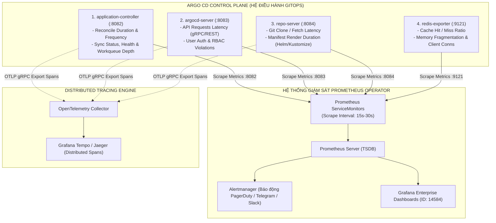


# Giám Sát & Đo Lường: Argo CD Observability, Prometheus & Grafana Chuẩn SRE

Khi hệ thống GitOps trở thành "xương sống" phân phối toàn bộ hạ tầng và vi dịch vụ của một tổ chức, bản thân **Argo CD Control Plane** phải được giám sát nghiêm ngặt như một dịch vụ cấp 0 (Tier-0 Critical Infrastructure).

Một sự cố nghẽn mạng ngầm bên trong `argocd-application-controller` hoặc việc bộ nhớ đệm Redis bị đầy có thể làm toàn bộ chu trình đồng bộ bị trễ hàng giờ, khiến các bản vá lỗi bảo mật khẩn cấp (Security Hotfixes) không thể tiếp cận được môi trường Production.

Làm thế nào để các kỹ sư SRE biết được: *Argo CD đang quản lý bao nhiêu ứng dụng?*, *Tần suất Reconcile trung bình là bao lâu?*, *Độ trễ khi kết nối kho Git là bao nhiêu giây?*, và *Có ứng dụng nào đang bị kẹt ở trạng thái Degraded hay không?*

Bài viết này sẽ hướng dẫn bạn tích hợp toàn diện **Prometheus**, cấu hình **ServiceMonitor**, thiết lập các câu truy vấn **PromQL Vàng**, nạp **Grafana Dashboard** chuẩn Enterprise và cấu hình phân tán dấu vết **OpenTelemetry Tracing**.

---

## 1. Ba Trụ Cột Observability Trong Argo CD Control Plane

Argo CD cung cấp đầy đủ 3 trụ cột giám sát chuẩn Cloud Native với 4 vi dịch vụ xuất bản metrics qua các cổng TCP riêng biệt:



---

## 2. Bảng Ma Trận Các Cổng Metrics & Chỉ Số Trọng Yếu

Dưới đây là bảng tổng hợp 15 chỉ số Prometheus quan trọng nhất của hệ thống Argo CD mà mọi kỹ sư SRE cần nắm vững:

| Thành Phần Vi Dịch Vụ | Cổng Cung Cấp | Tên Metric Prometheus | Kiểu Dữ Liệu | Ngưỡng Cảnh Báo SRE | Ý Nghĩa Kỹ Thuật Thực Tiễn |
| :--- | :--- | :--- | :--- | :--- | :--- |
| **`application-controller`** | TCP `:8082` | `argocd_app_reconcile_count` | Counter | Tăng vọt > 500/phút | Tổng số vòng lặp điều hòa (Reconcile) theo App/Project |
| **`application-controller`** | TCP `:8082` | `argocd_app_health_status` | Gauge | Value = 1 với `health_status="Degraded"` | Trạng thái sức khỏe ứng dụng (`Healthy`, `Degraded`, `Progressing`) |
| **`application-controller`** | TCP `:8082` | `argocd_app_sync_total` | Counter | Tỷ lệ `phase="Failed"` > 5% | Thống kê số đợt đồng bộ (`phase="Succeeded"`, `"Failed"`) |
| **`application-controller`** | TCP `:8082` | `argocd_app_reconcile_duration_seconds` | Histogram | P99 > 30 giây | Thời gian controller hoàn thành một chu kỳ điều hòa đối tượng |
| **`application-controller`** | TCP `:8082` | `workqueue_depth` | Gauge | Hàng đợi > 50 jobs kéo dài > 5m | Độ dài hàng đợi công việc đang chờ controller xử lý |
| **`application-controller`** | TCP `:8082` | `argocd_cluster_api_resource_objects` | Gauge | Quá 50,000 resources | Số lượng Kubernetes resource objects trên cụm đích được cache |
| **`argocd-server`** | TCP `:8083` | `argocd_api_request_total` | Counter | HTTP 5xx > 1% | Tổng số lượt gọi gRPC và REST API tới máy chủ API |
| **`argocd-server`** | TCP `:8083` | `argocd_api_request_duration_seconds` | Histogram | P95 > 2 giây | Thời gian phản hồi phân vị P95/P99 của Web UI/CLI |
| **`repo-server`** | TCP `:8084` | `argocd_git_request_duration_seconds` | Histogram | P95 > 10 giây | Thời gian fetch/clone Git Repository từ GitHub/GitLab |
| **`repo-server`** | TCP `:8084` | `argocd_git_request_total` | Counter | N/A | Tổng số lượt kết nối clone/fetch kho Git |
| **`repo-server`** | TCP `:8084` | `argocd_repo_pending_request_total` | Gauge | Pending > 10 requests | Số lượng request render manifest đang chờ worker xử lý |
| **`repo-server`** | TCP `:8084` | `argocd_git_fetch_total` | Counter | Tăng liên tục khi không có commit mới | Đếm số lần repo-server phát lệnh `git fetch` về Git server |
| **`argocd-redis`** | TCP `:9121` | `redis_connected_clients` | Gauge | Clients > 500 | Số lượng kết nối đang mở vào bộ đệm Redis |
| **`argocd-redis`** | TCP `:9121` | `redis_keyspace_hits_total` | Counter | Hit Rate < 80% | Số lượt đọc cache thành công (Hit) |
| **`argocd-redis`** | TCP `:9121` | `redis_keyspace_misses_total` | Counter | Miss Rate > 20% | Số lượt miss cache buộc phải fetch lại từ Git & Kubernetes API |

> [!IMPORTANT]
> **BỐN CÂU TRUY VẤN PROMQL VÀNG:**
> Một hệ thống giám sát Argo CD chuẩn SRE bắt buộc phải thiết lập 4 câu truy vấn PromQL: (1) Số lượng App Degraded, (2) Tần suất Reconcile Storm, (3) Độ trễ Git P95, và (4) Tỷ lệ Sync thất bại.

> [!TIP]
> **GRAFANA DASHBOARD CHÍNH THỨC:**
> Nạp ngay Grafana Dashboard ID **`14584`** (Argo CD Official Overview) để có toàn bộ biểu đồ trực quan về trạng thái của Controller, Repo Server và các cụm Kubernetes từ xa.

---

## 3. Cấu Hình Prometheus ServiceMonitor Chuẩn Mực (Line-by-Line Breakdown)

Để Prometheus tự động thu thập (Scrape) dữ liệu từ tất cả các vi dịch vụ của Argo CD, ta khai báo đối tượng `ServiceMonitor` của Prometheus Operator:

```yaml
# argocd-servicemonitor.yaml — Cấu hình Scrape Metrics toàn diện cho Argo CD Control Plane
apiVersion: monitoring.coreos.com/v1
kind: ServiceMonitor
metadata:
  name: argocd-metrics
  namespace: argocd
  labels:
    release: prometheus-stack      # Label để Prometheus Operator nhận diện và kích hoạt Scrape
    app.kubernetes.io/name: argocd-metrics
spec:
  selector:
    matchLabels:
      app.kubernetes.io/part-of: argocd
  endpoints:
    # Endpoint 1: Thu thập metrics từ application-controller (Cổng 8082)
    - port: metrics
      path: /metrics
      interval: 15s                # Tần suất lấy mẫu 15 giây / lần để phát hiện nhanh trạng thái
      scrapeTimeout: 10s
      metricRelabelings:
        - action: keep
          sourceLabels: [__name__]
          regex: "argocd_.*|workqueue_.*|process_.*"

    # Endpoint 2: Thu thập metrics từ argocd-server (Cổng 8083)
    - port: server-metrics
      path: /metrics
      interval: 30s
      scrapeTimeout: 10s

    # Endpoint 3: Thu thập metrics từ repo-server (Cổng 8084)
    - port: repo-metrics
      path: /metrics
      interval: 15s
      scrapeTimeout: 10s

---
# redis-servicemonitor.yaml — Thu thập metrics từ Redis Sentinel / Redis Cache
apiVersion: monitoring.coreos.com/v1
kind: ServiceMonitor
metadata:
  name: argocd-redis-metrics
  namespace: argocd
  labels:
    release: prometheus-stack
spec:
  selector:
    matchLabels:
      app.kubernetes.io/name: argocd-redis-ha-exporter
  endpoints:
    - port: tcp-redis-exporter
      path: /metrics
      interval: 30s
      scrapeTimeout: 10s
```

### Giải Thích Từng Khối Cấu Hình:
- **`release: prometheus-stack`**: Khớp với `serviceMonitorSelector` của Prometheus instance đang chạy trên cụm.
- **`port: metrics`**: Trỏ tới port `8082` trên `argocd-metrics` Service của Application Controller.
- **`metricRelabelings`**: Lọc bỏ các metric không cần thiết của Go runtime nếu muốn tiết kiệm tài nguyên lưu trữ TSDB, chỉ giữ lại các prefix `argocd_*`, `workqueue_*`.

---

## 4. Bộ Câu Truy Vấn PromQL Vàng & Cảnh Báo PrometheusRule Chuẩn SRE

Dưới đây là 4 câu truy vấn PromQL cốt lõi kèm theo đối tượng `PrometheusRule` sẵn sàng đưa vào vận hành thực tế:

### 1. Số Lượng Ứng Dụng Đang Bị Lỗi Degraded:
```promql
sum(argocd_app_health_status{health_status="Degraded"}) by (project, name) > 0
```

### 2. Tần Suất Đồng Bộ Thất Bại (Failed Sync Rate > 5% trong 5 phút):
```promql
(sum(rate(argocd_app_sync_total{phase="Failed"}[5m])) 
/ 
sum(rate(argocd_app_sync_total[5m]))) * 100 > 5
```

### 3. Phát Hiện Reconcile Storm (Tần Suất Reconcile Bất Thường):
```promql
sum(rate(argocd_app_reconcile_count[5m])) by (dest_server, project) > 200
```

### 4. Phân Vị P95 Độ Trễ Render Manifest Tại Repo Server (> 15 giây):
```promql
histogram_quantile(0.95, sum(rate(argocd_git_request_duration_seconds_bucket[5m])) by (le)) > 15
```

```yaml
# argocd-alerting-rules.yaml — Bộ quy tắc cảnh báo khẩn cấp SRE cho Argo CD
apiVersion: monitoring.coreos.com/v1
kind: PrometheusRule
metadata:
  name: argocd-critical-alerts
  namespace: argocd
  labels:
    role: alert-rules
    release: prometheus-stack
spec:
  groups:
    - name: ArgoCD-SRE-Alerts
      rules:
        # Alert 1: Ứng dụng production bị lỗi Degraded quá 10 phút
        - alert: ArgoAppDegradedCritical
          expr: sum(argocd_app_health_status{health_status="Degraded", project="production"}) by (name) == 1
          for: 10m
          labels:
            severity: critical
            team: platform-sre
          annotations:
            summary: "Ứng dụng Production '{{ $labels.name }}' đang ở trạng thái Degraded!"
            description: "Ứng dụng {{ $labels.name }} trên project production đã bị Degraded liên tục hơn 10 phút. Cần kiểm tra Pod crash hoặc sai cấu hình ngay lập tức."

        # Alert 2: Reconcile Queue Bị Ứ Đọng (Controller Bị Quá Tải)
        - alert: ArgoControllerQueueStalled
          expr: workqueue_depth{name="app_reconcile"} > 50
          for: 5m
          labels:
            severity: warning
            team: platform-sre
          annotations:
            summary: "Hàng đợi điều hòa của Argo CD Controller đang bị dồn ứ!"
            description: "Có hơn 50 ứng dụng đang xếp hàng chờ reconcile trong 5 phút qua. Hãy kiểm tra sharding hoặc tăng số lượng worker threads (--status-processors)."

        # Alert 3: Độ trễ kết nối Git Server quá cao
        - alert: ArgoRepoServerGitHighLatency
          expr: histogram_quantile(0.95, sum(rate(argocd_git_request_duration_seconds_bucket[5m])) by (le)) > 20
          for: 5m
          labels:
            severity: warning
            team: platform-sre
          annotations:
            summary: "Repo Server có độ trễ clone/fetch Git P95 vượt quá 20 giây!"
            description: "Kết nối mạng tới kho Git hoặc hiệu năng của Repo Server bị suy giảm nghiêm trọng."
```

---

## 5. Cấu Hình Phân Tán Dấu Vết (OpenTelemetry Tracing)

Khi hệ thống có hàng ngàn ứng dụng, việc chỉ nhìn metrics không đủ để giải thích vì sao một lệnh Sync cụ thể lại mất tới 2 phút. Cấu hình OpenTelemetry Tracing giúp bạn nhìn rõ từng Span (Render Helm $\rightarrow$ Kustomize $\rightarrow$ Fetch Git $\rightarrow$ Apply Kubernetes API):

```yaml
# Cấu hình OpenTelemetry Tracing trong argocd-cmd-params-cm
apiVersion: v1
kind: ConfigMap
metadata:
  name: argocd-cmd-params-cm
  namespace: argocd
data:
  # Kích hoạt OTLP Exporter gửi trace tới OpenTelemetry Collector
  otlp.address: "otel-collector.monitoring.svc.cluster.local:4317"
  otlp.insecure: "true"
```

---

## 6. Phân Tích Cạm Bẫy Thực Chiến: Reconcile Storm Làm Sập Kubernetes API Server

### Tình Huống Sự Cố Thực Tế:
Tại một công ty tài chính với 800 Microservices quản lý qua Argo CD. Sau khi nâng cấp lên phiên bản mới, Kubernetes API Server của cụm Production liên tục bị nghẽn (CPU 100%, etcd timeout), khiến toàn bộ cụm rơi vào tình trạng mất kiểm soát.

```log
# Trích đoạn log từ kube-apiserver và argocd-application-controller
2026-04-11T14:22:01.328Z [ERROR] kube-apiserver: etcdserver: request timed out, dropped 1420 requests
2026-04-11T14:22:02.102Z [WARN]  argocd-application-controller: Rate limit exceeded for client argocd-controller (QPS: 50, Burst: 100)
2026-04-11T14:22:02.890Z [ERROR] argocd-application-controller: Failed to reconcile app 'core-banking-backend': context deadline exceeded
2026-04-11T14:22:03.110Z [INFO]  argocd-repo-server: Manifest render request queued, pending: 84
```

### 5-Whys Root Cause Analysis:
1. **Tại sao Kubernetes API Server bị sập?** $\rightarrow$ Vì nhận hơn 15,000 requests/giây từ `argocd-application-controller`.
2. **Tại sao Controller lại gửi nhiều request như vậy?** $\rightarrow$ Vì 800 ứng dụng được kích hoạt chế độ Auto-Sync cùng với `selfHeal: true` nhưng thiếu `ignoreDifferences` cho một Mutating Webhook tự chèn annotation vào Pod.
3. **Tại sao lại tạo ra vòng lặp vô tận?** $\rightarrow$ Argo CD phát hiện Drift (do Webhook) $\rightarrow$ Ép Sync đè lại $\rightarrow$ Webhook lại chèn annotation $\rightarrow$ Tạo ra hiện tượng **Reconcile Storm**.
4. **Tại sao Redis Cache không giảm tải được?** $\rightarrow$ Vì Redis bị cấu hình RAM mặc định 256MB, dẫn đến tràn bộ nhớ (OOM) và liên tục kích hoạt cơ chế `eviction`, làm Cache Hit Rate giảm từ 95% xuống còn 12%.
5. **Biện pháp khắc phục tận gốc:**
   - **Tăng giới hạn QPS/Burst của Controller:** Thiết lập `--kube-api-qps=150` và `--kube-api-burst=300`.
   - **Cấu hình `ignoreDifferences`:** Bỏ qua các metadata/annotation được sinh tự động bởi Mutating Admission Webhooks.
   - **Mở rộng tài nguyên Redis:** Chuyển sang cụm Redis HA Sentinel với dung lượng RAM 4GB và thuật toán `allkeys-lru`.
   - **Bật Controller Sharding:** Phân chia 800 ứng dụng ra 4 Controller Shards khác nhau (`ARGOCD_CONTROLLER_REPLICAS=4`).

---

## 7. Hands-on Lab: Triển Khai Giám Sát Argo CD Với Prometheus & Grafana

### Bước 1: Kiểm tra các cổng Metrics nội bộ của Argo CD Pods
```bash
# Kiểm tra cổng 8082 của Application Controller
kubectl port-forward -n argocd svc/argocd-metrics 8082:8082 &

# Query lấy mẫu 10 metrics đầu tiên
curl -s http://localhost:8082/metrics | head -n 15
```

### Bước 2: Triển khai ServiceMonitor vào cụm Kubernetes
```bash
# Áp dụng manifest ServiceMonitor đã cấu hình ở Mục 3
kubectl apply -f argocd-servicemonitor.yaml

# Xác minh Prometheus Operator đã nhận diện Target
kubectl get servicemonitors.monitoring.coreos.com -n argocd
```

### Bước 3: Kiểm tra Target trên giao diện Web của Prometheus
Truy cập Prometheus UI (`http://prometheus:9090/targets`) và tìm kiếm target nhóm `serviceMonitor/argocd/argocd-metrics/0`. Đảm bảo trạng thái hiển thị **UP (1/1)** màu xanh lá.

### Bước 4: Chạy thử nghiệm các câu truy vấn PromQL
```bash
# Truy vấn số lượng ứng dụng đang quản lý
curl -s -G "http://localhost:9090/api/v1/query" \
  --data-urlencode "query=count(argocd_app_info)" | jq .
```

### Bước 5: Nạp Grafana Dashboard chuẩn ID 14584
1. Mở giao diện Grafana $\rightarrow$ Chọn **Dashboards** $\rightarrow$ **Import**.
2. Nhập ID **`14584`** (Argo CD Official Overview) $\rightarrow$ Nhấn **Load**.
3. Chọn Data Source là `Prometheus` $\rightarrow$ Nhấn **Import**.

### Bước 6: Kiểm tra hệ thống Báo động (Alertmanager)
Áp dụng tệp `argocd-alerting-rules.yaml` và cố tình chỉnh sửa một manifest ứng dụng để gây lỗi `Degraded`, sau đó quan sát thông báo được gửi về kênh Slack/Telegram.

---

## 8. 10 Câu Hỏi Tự Kiểm Tra Chuyên Sâu (Self-Check Q&A)


<div class="qa-answer">
  <div class="qa-answer-header">
    <svg width="14" height="14" fill="none" stroke="currentColor" stroke-width="2" viewBox="0 0 24 24"><path d="M22 11.08V12a10 10 0 1 1-5.93-9.14"></path><polyline points="22 4 12 14.01 9 11.01"></polyline></svg>
    <span>Phân Tích &amp; Lời Giải Kỹ Thuật</span>
  </div>
  
<div style="margin: 0.35rem 0; padding-left: 1rem; border-left: 2px solid var(--accent-primary);">• <b style="color: var(--accent-primary);">argocd-application-controller:</b> Cổng TCP <code>:8082</code> (Chứa reconcile metrics, app status, workqueue).<br/></div>
  <div style="margin: 0.35rem 0; padding-left: 1rem; border-left: 2px solid var(--accent-primary);">• <b style="color: var(--accent-primary);">argocd-server:</b> Cổng TCP <code>:8083</code> (Chứa API request metrics, latency, user auth).<br/></div>
  <div style="margin: 0.35rem 0; padding-left: 1rem; border-left: 2px solid var(--accent-primary);">• <b style="color: var(--accent-primary);">argocd-repo-server:</b> Cổng TCP <code>:8084</code> (Chứa Git clone/fetch latency, manifest render duration).<br/></div>
  <div style="margin: 0.35rem 0; padding-left: 1rem; border-left: 2px solid var(--accent-primary);">• <b style="color: var(--accent-primary);">argocd-redis / redis-exporter:</b> Cổng TCP <code>:9121</code> (Chứa Redis cache memory, connections, hit/miss ratio).</div>
</div>
</details>

<div class="qa-answer">
  <div class="qa-answer-header">
    <svg width="14" height="14" fill="none" stroke="currentColor" stroke-width="2" viewBox="0 0 24 24"><path d="M22 11.08V12a10 10 0 1 1-5.93-9.14"></path><polyline points="22 4 12 14.01 9 11.01"></polyline></svg>
    <span>Phân Tích &amp; Lời Giải Kỹ Thuật</span>
  </div>
  
Metric <code>argocd_app_health_status{health_status="Degraded"}</code> với giá trị trả về bằng 1. Ta dùng hàm PromQL: <code>sum(argocd_app_health_status{health_status="Degraded"})</code> để đếm tổng số ứng dụng lỗi trên toàn hệ thống.
</div>
</details>

<div class="qa-answer">
  <div class="qa-answer-header">
    <svg width="14" height="14" fill="none" stroke="currentColor" stroke-width="2" viewBox="0 0 24 24"><path d="M22 11.08V12a10 10 0 1 1-5.93-9.14"></path><polyline points="22 4 12 14.01 9 11.01"></polyline></svg>
    <span>Phân Tích &amp; Lời Giải Kỹ Thuật</span>
  </div>
  
Reconcile Storm là hiện tượng controller liên tục thực hiện vòng lặp điều hòa với tần suất cực cao (hàng trăm lần/giây), thường do xung đột giữa GitOps Auto-Sync và mutating webhook trên cụm Kubernetes. Metric phát hiện sớm nhất là <code>argocd_app_reconcile_count</code> (tốc độ gia tăng đột biến) và <code>workqueue_depth</code> (hàng đợi dồn ứ).
</div>
</details>

<div class="qa-answer">
  <div class="qa-answer-header">
    <svg width="14" height="14" fill="none" stroke="currentColor" stroke-width="2" viewBox="0 0 24 24"><path d="M22 11.08V12a10 10 0 1 1-5.93-9.14"></path><polyline points="22 4 12 14.01 9 11.01"></polyline></svg>
    <span>Phân Tích &amp; Lời Giải Kỹ Thuật</span>
  </div>
  
<code>workqueue_depth</code> đo lường số lượng nhiệm vụ đang xếp hàng chờ controller xử lý. Nếu metric này tăng cao liên tục, chứng tỏ Controller đang bị quá tải CPU/RAM, nghẽn mạng tới cụm đích hoặc bị giới hạn QPS từ Kubernetes API Server.
</div>
</details>

<div class="qa-answer">
  <div class="qa-answer-header">
    <svg width="14" height="14" fill="none" stroke="currentColor" stroke-width="2" viewBox="0 0 24 24"><path d="M22 11.08V12a10 10 0 1 1-5.93-9.14"></path><polyline points="22 4 12 14.01 9 11.01"></polyline></svg>
    <span>Phân Tích &amp; Lời Giải Kỹ Thuật</span>
  </div>
  
Tệp <code>ServiceMonitor</code> phải có <code>metadata.labels</code> khớp chính xác với <code>serviceMonitorSelector</code> được định nghĩa trong tài nguyên <code>Prometheus</code> Custom Resource (thường là nhãn <code>release: prometheus-stack</code>).
</div>
</details>

<div class="qa-answer">
  <div class="qa-answer-header">
    <svg width="14" height="14" fill="none" stroke="currentColor" stroke-width="2" viewBox="0 0 24 24"><path d="M22 11.08V12a10 10 0 1 1-5.93-9.14"></path><polyline points="22 4 12 14.01 9 11.01"></polyline></svg>
    <span>Phân Tích &amp; Lời Giải Kỹ Thuật</span>
  </div>
  
Sử dụng metric dạng Histogram của repo-server: <code>argocd_git_request_duration_seconds_bucket</code> hoặc <code>argocd_repo_pending_request_total</code> để giám sát thời gian xử lý và số lượng request đang chờ worker render.
</div>
</details>

<div class="qa-answer">
  <div class="qa-answer-header">
    <svg width="14" height="14" fill="none" stroke="currentColor" stroke-width="2" viewBox="0 0 24 24"><path d="M22 11.08V12a10 10 0 1 1-5.93-9.14"></path><polyline points="22 4 12 14.01 9 11.01"></polyline></svg>
    <span>Phân Tích &amp; Lời Giải Kỹ Thuật</span>
  </div>
  
Nếu Redis Hit Rate thấp (< 80%), repo-server sẽ liên tục phải clone lại Git repo và controller phải liên tục gọi API Server để đọc toàn bộ tài nguyên, gây nghẽn băng thông mạng và làm chậm thời gian đồng bộ gấp 5 - 10 lần.
</div>
</details>

<div class="qa-answer">
  <div class="qa-answer-header">
    <svg width="14" height="14" fill="none" stroke="currentColor" stroke-width="2" viewBox="0 0 24 24"><path d="M22 11.08V12a10 10 0 1 1-5.93-9.14"></path><polyline points="22 4 12 14.01 9 11.01"></polyline></svg>
    <span>Phân Tích &amp; Lời Giải Kỹ Thuật</span>
  </div>
  
<div style="margin: 0.35rem 0; padding-left: 1rem; border-left: 2px solid var(--accent-primary);">• Tăng số luồng xử lý: <code>--status-processors</code> (mặc định 20, có thể tăng lên 50).<br/></div>
  <div style="margin: 0.35rem 0; padding-left: 1rem; border-left: 2px solid var(--accent-primary);">• Tăng số luồng đồng bộ: <code>--operation-processors</code> (mặc định 10, tăng lên 30).<br/></div>
  <div style="margin: 0.35rem 0; padding-left: 1rem; border-left: 2px solid var(--accent-primary);">• Tăng giới hạn API Client: <code>--kube-api-qps</code> và <code>--kube-api-burst</code>.<br/></div>
  <div style="margin: 0.35rem 0; padding-left: 1rem; border-left: 2px solid var(--accent-primary);">• Kích hoạt Controller Sharding: <code>ARGOCD_CONTROLLER_REPLICAS</code> kết hợp sharding algorithm.</div>
</div>
</details>

<div class="qa-answer">
  <div class="qa-answer-header">
    <svg width="14" height="14" fill="none" stroke="currentColor" stroke-width="2" viewBox="0 0 24 24"><path d="M22 11.08V12a10 10 0 1 1-5.93-9.14"></path><polyline points="22 4 12 14.01 9 11.01"></polyline></svg>
    <span>Phân Tích &amp; Lời Giải Kỹ Thuật</span>
  </div>
  
Metrics chỉ cho biết con số tổng quát (thời gian trung bình, tỷ lệ lỗi), trong khi OpenTelemetry Tracing cung cấp chi tiết toàn bộ hành trình của một lần Sync cụ thể: mất bao nhiêu ms ở Git clone, bao nhiêu ms ở Helm template render, và bao nhiêu ms khi gửi từng manifest tới Kubernetes API Server.
</div>
</details>

<div class="qa-answer">
  <div class="qa-answer-header">
    <svg width="14" height="14" fill="none" stroke="currentColor" stroke-width="2" viewBox="0 0 24 24"><path d="M22 11.08V12a10 10 0 1 1-5.93-9.14"></path><polyline points="22 4 12 14.01 9 11.01"></polyline></svg>
    <span>Phân Tích &amp; Lời Giải Kỹ Thuật</span>
  </div>
  
Grafana Dashboard ID <b style="color: var(--accent-primary);"><code>14584</code></b> (Argo CD Overview Dashboard) do cộng đồng Argo Project và Red Hat bảo trợ, cung cấp đầy đủ thông số Controller, Repo Server, API Server và Kubernetes clusters.
</div>
</details>

---

## 9. Tổng Kết & Bài Học Tiếp Theo

Thiết lập một hệ thống **Observability** toàn diện với Prometheus, ServiceMonitor, PromQL và Grafana giúp bạn chuyển đổi từ thế bị động (chờ developer báo cáo khi app không deploy được) sang thế chủ động (phát hiện sớm suy giảm hiệu năng trước khi xảy ra sự cố).

Trong **Bài 23: Bảo Mật, Hardening, Sao Lưu DR & Xử Lý Sự Cố Argo CD Production**, chúng ta sẽ tiến vào các chiến lược bảo mật tối thượng: Network Policies, Non-root containers, sao lưu `argocd-util backup` và kịch bản khôi phục thảm họa (Disaster Recovery) sau thảm họa sập toàn bộ cụm Control Plane!

