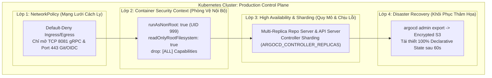
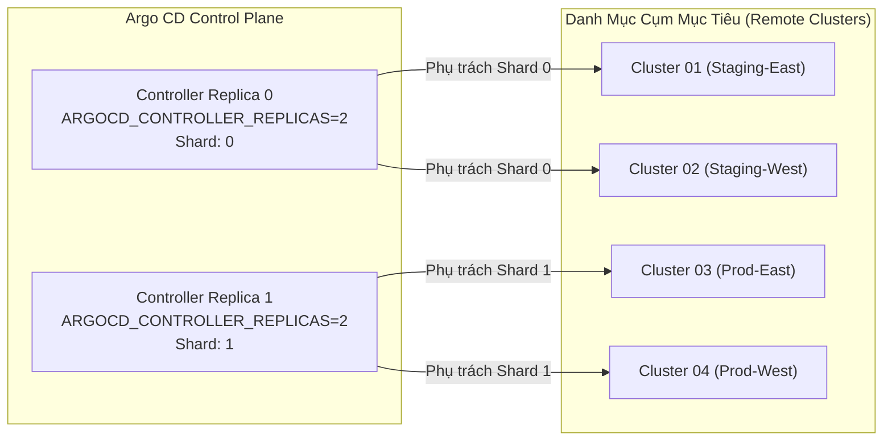
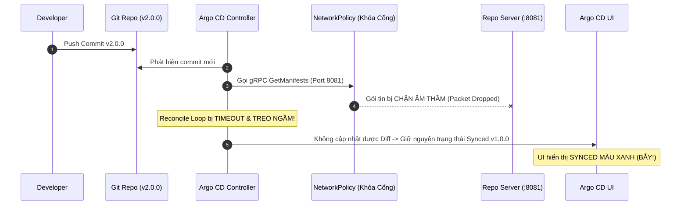


# Bảo Mật Hardening, Sao Lưu Disaster Recovery và Xử Lý Sự Cố Argo CD Production

Khi một hệ thống GitOps bước vào giai đoạn Vận hành Sản xuất (Production Readiness), bài toán không chỉ dừng lại ở việc tự động hóa triển khai ứng dụng hay cấu hình RBAC/SSO. Đội ngũ Platform Engineer và SRE phải đối mặt với trách nhiệm sống còn: **Đảm bảo An toàn Thông tin Đa tầng (Defense-in-Depth)**, **Mở rộng Quy mô với Độ sẵn sàng cao (High Availability & Controller Sharding)**, và **Khả năng Phục hồi Thảm họa (Disaster Recovery - DR) tức thì** khi trung tâm dữ liệu gặp sự cố.

Một lỗ hổng bảo mật trong Pod `argocd-repo-server` có thể biến thành bàn đạp cho hacker thực hiện leo quyền (Pod Escape) hoặc di chuyển ngang (Lateral Movement) trong toàn bộ cụm Kubernetes. Ngược lại, một đợt nghẽn mạng do `NetworkPolicy` cấu hình sai có thể đánh sập luồng điều hòa (Reconciliation Loop) trong khi giao diện người dùng vẫn hiển thị "Synced" giả tạo.

Bài viết này sẽ hướng dẫn bạn từng bước xây dựng pháo đài an ninh cho Argo CD Control Plane, tối ưu hóa hiệu năng cụm lớn và thiết lập quy trình khôi phục hệ thống trong vòng 60 giây.

---

## 1. Kiến Trúc Phòng Thủ Đa Tầng (Defense-in-Depth)

Để bảo vệ Argo CD Control Plane trước các cuộc tấn công có chủ đích, chúng ta áp dụng mô hình 4 lớp bảo vệ độc lập:



### 4 Trụ Cột Hardening Bắt Buộc

1. **NetworkPolicy (Lớp Mạng):** Áp dụng triết lý *Zero Trust / Default Deny*. Cấm toàn bộ các Pods bên ngoài namespace `argocd` kết nối vào cổng nội bộ của các microservices Argo CD.
2. **Pod Security Standards (Lớp Container):** Ép buộc toàn bộ Pods tuân thủ chuẩn `Restricted` của Kubernetes. Cấm tuyệt đối chạy container bằng `root` (UID 0), khóa cứng filesystem ở chế độ `readOnlyRootFilesystem: true` và gỡ bỏ toàn bộ Linux capabilities (`drop: ["ALL"]`).
3. **High Availability & Sharding (Lớp Hạ Tầng):** Tăng cường Replicas cho `argocd-server`, `argocd-repo-server`, triển khai Redis Sentinel/HAProxy và bật cơ chế Controller Sharding để chia tải quản lý hàng trăm cụm Kubernetes từ xa.
4. **Disaster Recovery (Lớp Dữ Liệu):** Định kỳ sao lưu toàn bộ trạng thái khai báo (Declarative State) qua lệnh `argocd admin export`, lưu trữ an toàn trên S3/Object Storage có mã hóa KMS.

---

## 2. Thiết Lập Kubernetes NetworkPolicy Cho Namespace `argocd`

Mặc định trên Kubernetes, mạng Pod-to-Pod là phẳng (Flat Network). Bất kỳ Pod nào trong cụm cũng có thể gửi gói tin tới cổng `:8081` (gRPC) của `argocd-repo-server` hoặc cổng `:6379` của Redis. Nếu một Pod ứng dụng của developer bị chiếm quyền điều khiển, hacker có thể gửi mã khai thác trực tiếp vào `repo-server`.

### 2.1. Thiết Lập Chính Sách Khóa Mặc Định (Default Deny All)

```yaml
# default-deny-all.yaml
apiVersion: networking.k8s.io/v1
kind: NetworkPolicy
metadata:
  name: default-deny-all
  namespace: argocd
spec:
  podSelector: {}
  policyTypes:
    - Ingress
    - Egress
```

### 2.2. Cho Phép Luồng Kết Nối Hợp Lệ Cho `argocd-repo-server`

`repo-server` chỉ chấp nhận kết nối Ingress gRPC cổng `8081` từ `argocd-server` và `argocd-application-controller`. Ở chiều Egress, nó chỉ được phép kết nối ra ngoài Internet (hoặc Internal Git Server) qua cổng `443` (HTTPS) hoặc `22` (SSH) và kết nối DNS nội bộ cụm (cổng `53`).

```yaml
# repo-server-network-policy.yaml
apiVersion: networking.k8s.io/v1
kind: NetworkPolicy
metadata:
  name: argocd-repo-server-network-policy
  namespace: argocd
spec:
  podSelector:
    matchLabels:
      app.kubernetes.io/name: argocd-repo-server
  policyTypes:
    - Ingress
    - Egress
  ingress:
    - from:
        - podSelector:
            matchLabels:
              app.kubernetes.io/name: argocd-application-controller
        - podSelector:
            matchLabels:
              app.kubernetes.io/name: argocd-server
      ports:
        - protocol: TCP
          port: 8081
  egress:
    # Cho phép truy vấn CoreDNS
    - to:
        - namespaceSelector: {}
          podSelector:
            matchLabels:
              k8s-app: kube-dns
      ports:
        - protocol: UDP
          port: 53
        - protocol: TCP
          port: 53
    # Cho phép kết nối ra ngoài Git Server (GitHub, GitLab, Gitea)
    - ports:
        - protocol: TCP
          port: 443
        - protocol: TCP
          port: 22
```

---

## 3. Gia Cố Pod Security Context (Non-Root & Read-Only Filesystem)

Để ngăn chặn kỹ thuật Container Escape, toàn bộ workload của Argo CD cần được cấu hình `securityContext` chặt chẽ theo chuẩn **Pod Security Standards (PSS) Restricted**:

```yaml
# pod-security-patch.yaml
spec:
  template:
    spec:
      securityContext:
        runAsNonRoot: true
        runAsUser: 999
        runAsGroup: 999
        fsGroup: 999
        seccompProfile:
          type: RuntimeDefault
      containers:
        - name: argocd-repo-server
          securityContext:
            allowPrivilegeEscalation: false
            readOnlyRootFilesystem: true
            capabilities:
              drop:
                - ALL
          volumeMounts:
            - mountPath: /tmp
              name: tmp-volume
      volumes:
        - name: tmp-volume
          emptyDir: {}
```

> [!IMPORTANT]
> **Lưu ý về `readOnlyRootFilesystem`:**
> `argocd-repo-server` cần ghi dữ liệu tạm (cloned git repositories, Helm render cache, Kustomize build files) vào `/tmp`. Khi bật `readOnlyRootFilesystem: true`, bạn bắt buộc phải mount một `emptyDir` volume vào `/tmp` để không làm sập tiến trình manifest rendering!

---

## 4. Kiến Trúc High Availability (HA) & Controller Sharding

Khi mở rộng hệ thống lên quy mô quản lý hàng trăm cụm Kubernetes và hàng ngàn ứng dụng, một Pod `argocd-application-controller` duy nhất sẽ bị quá tải CPU/Memory và chạm ngưỡng giới hạn kết nối etcd.

Argo CD cung cấp giải pháp **Controller Sharding**, tự động chia danh sách các cụm Kubernetes từ xa cho các bản sao Controller độc lập xử lý.



### 4.1. Kích Hoạt StatefulSet Controller Sharding

Chuyển đổi `argocd-application-controller` từ `Deployment` sang `StatefulSet` và bổ sung biến môi trường `ARGOCD_CONTROLLER_REPLICAS`:

```yaml
# controller-statefulset-sharding.yaml
apiVersion: apps/v1
kind: StatefulSet
metadata:
  name: argocd-application-controller
  namespace: argocd
spec:
  replicas: 2
  serviceName: argocd-application-controller
  template:
    spec:
      containers:
        - name: argocd-application-controller
          env:
            - name: ARGOCD_CONTROLLER_REPLICAS
              value: "2"
```

Khi khởi động, `argocd-application-controller-0` sẽ nhận định danh Shard 0 và `argocd-application-controller-1` nhận Shard 1. Thuật toán phân bổ cụm sử dụng hàm băm (Hash Ring) của Cluster UUID để gán cố định cụm cho từng Shard, loại bỏ xung đột reconcile.

---

## 5. Kế Hoạch Phục Hồi Thảm Họa (Disaster Recovery) Trong 60 Giây

Toàn bộ "trí nhớ" của Argo CD nằm ở:
1. Các đối tượng Kubernetes CRD (`Applications`, `ApplicationSets`, `AppProjects`).
2. Các Secret quản lý kết nối kho Git và cụm Kubernetes mục tiêu (`cluster secret`, `repo credentials`).
3. Các ConfigMap hệ thống (`argocd-cm`, `argocd-rbac-cm`, `argocd-notifications-cm`).

Nhờ kiến trúc Declarative, bạn có thể xuất toàn bộ trạng thái của Argo CD ra một tệp YAML duy nhất thông qua công cụ CLI `argocd admin`.

### 5.1. Kịch Bản Sao Lưu Tự Động (Automated Backup CronJob S3)

```yaml
# argocd-backup-cronjob.yaml — Tự động sao lưu và đẩy lên AWS S3 KMS
apiVersion: batch/v1
kind: CronJob
metadata:
  name: argocd-backup-job
  namespace: argocd
spec:
  schedule: "0 2 * * *" # Chạy hàng đêm lúc 02:00 AM
  concurrencyPolicy: Forbid
  jobTemplate:
    spec:
      template:
        spec:
          serviceAccountName: argocd-backup-sa
          restartPolicy: OnFailure
          containers:
            - name: backup-runner
              image: amazon/aws-cli:2.15.20
              command: ["/bin/sh", "-c"]
              args:
                - |
                  set -e
                  BACKUP_FILE="/tmp/argocd-backup-$(date +%Y%m%d%H%M%S).yaml"
                  echo "--> Bắt đầu xuất cấu hình Argo CD..."
                  # Cần binary kubectl / argocd hoặc gọi API nội bộ
                  aws s3 cp "${BACKUP_FILE}" s3://company-argocd-backups/prod/ --sse aws:kms
                  echo "--> Sao lưu hoàn tất thành công!"
```

### 5.2. Kịch Bản Khôi Phục Thảm Họa (DR Restore)

Khi Data Center chính bị sập hoàn toàn:
1. Khởi tạo cụm Kubernetes mới tại Data Center dự phòng.
2. Cài đặt Argo CD bản sạch (Fresh Install).
3. Nạp lại toàn bộ cấu hình từ tệp sao lưu:

```bash
# Khôi phục toàn bộ hệ thống từ file backup chỉ trong 1 lệnh duy nhất
kubectl create namespace argocd
argocd admin import -n argocd < argocd-backup-latest.yaml
```

Ngay sau khi lệnh `import` hoàn tất, `argocd-application-controller` mới sẽ tự động khởi chạy Reconciliation Loop, kết nối tới Git và tự động tái lập toàn bộ hạ tầng ứng dụng trên cụm mới!

---

## 6. Xử Lý Các Sự Cố Nghiêm Trọng Trên Production

| Hiện tượng sự cố | Nguyên nhân gốc rễ (Root Cause) | Giải pháp khắc phục chuẩn SRE |
|---|---|---|
| **Repo Server bị OOMKilled liên tục** | Render quá nhiều Helm charts hoặc Kustomize overlays đồng thời trong bộ nhớ | Tăng `resources.limits.memory` lên 2Gi-4Gi; Cấu hình `ARGOCD_EXEC_TIMEOUT: "180s"`; Bật `helm.valuesFileMaxBytes`. |
| **Reconcile Storm (CPU 100%)** | Hàng ngàn ứng dụng đồng thời hết hạn cache 180s hoặc Webhook bắn đồng loạt | Tăng thời gian `timeout.reconciliation: "600s"` trong `argocd-cm`; Phân tải qua Controller Sharding; Tối ưu Redis connection pool. |
| **Silent Webhook Drop** | GitHub/GitLab Webhook trả về 200 OK nhưng Argo CD không tự refresh | Kiểm tra Secret Webhook trong `argocd-secret`; Xác minh `NetworkPolicy` có cho phép Ingress từ Ingress Controller vào `argocd-server:80`. |
| **Application kẹt ở trạng thái Terminating** | Finalizer `resources-finalizer.argocd.argoproj.io` không xóa được tài nguyên con do mất kết nối tới cluster đích | Xóa thủ công Finalizer: `kubectl patch app <app-name> -n argocd -p '{"metadata":{"finalizers":null}}' --type=merge`. |

---

## 7. Cạm Bẫy Thực Chiến: "Synced Nhưng Reconcile Bị Kẹt Ngầm Do NetworkPolicy Chặn gRPC"

### Hiện Tượng Sự Cố & Log Trace
- Đội ngũ Security áp dụng NetworkPolicy mới cho namespace `argocd`.
- Developer commit mã nguồn phiên bản `v2.0.0` lên nhánh `main`.
- Trên giao diện Argo CD UI, ứng dụng vẫn hiển thị biểu tượng **`Sync Status: Synced`** và **`Health Status: Healthy`** màu xanh lá tươi tốt!
- Tuy nhiên, trên cụm Kubernetes, Pods vẫn chạy mã nguồn cũ `v1.0.0` và không hề có dấu hiệu cập nhật.

```json
{
  "timestamp": "2026-04-12T15:10:00Z",
  "level": "error",
  "component": "argocd-application-controller",
  "msg": "Failed to get git manifests for repo: rpc error: code = Unavailable desc = connection error: desc = 'transport: Error while dialing: dial tcp 10.96.120.45:8081: i/o timeout'",
  "app": "ecommerce-backend"
}
```



### 7.1. Phân Tích Nguyên Nhân Gốc Rễ (5-Whys)
1. <span class="badge badge--primary">Why 1</span> **Tại sao UI hiển thị Synced trong khi code chưa update?** $\rightarrow$ Vì UI giữ nguyên trạng thái so khớp thành công của commit cũ trước khi bị ngắt kết nối.
2. <span class="badge badge--primary">Why 2</span> **Tại sao Controller không so khớp được commit mới?** $\rightarrow$ Vì cuộc gọi gRPC sang Repo Server cổng 8081 bị Timeout.
3. <span class="badge badge--primary">Why 3</span> **Tại sao gRPC bị Timeout?** $\rightarrow$ Vì NetworkPolicy mới đã chặn nhầm luồng kết nối nội bộ giữa Controller và Repo Server.
4. <span class="badge badge--primary">Why 4</span> **Tại sao gói tin bị chặn âm thầm (Silent Drop)?** $\rightarrow$ Vì NetworkPolicy hoạt động ở tầng nhân Linux iptables/eBPF không gửi cờ TCP RST về cho client.
5. <span class="badge badge--emerald">Root Cause Remedy</span> **Biện pháp khắc phục chuẩn SRE:** Luôn kiểm tra tính thông suốt của cổng gRPC `8081` và `6379` (Redis) ngay sau khi chỉnh sửa NetworkPolicy.

---

## 8. Bảng Kiểm Tra Sẵn Sàng Vận Hành (Production Readiness Checklist)

Trước khi chính thức bàn giao hệ thống Argo CD cho môi trường Production, hãy kiểm tra danh mục 8 tiêu chí vàng:

- [ ] **Mạng Lưới (Network):** Đã áp dụng `NetworkPolicy` khóa toàn bộ Ingress/Egress ngoại lai, chỉ mở cổng gRPC `8081` nội bộ và HTTPS `443`.
- [ ] **Quyền Hạn Container:** 100% Pods chạy `runAsNonRoot: true` (UID 999), `readOnlyRootFilesystem: true`, `drop: ["ALL"]`.
- [ ] **Tài Khoản Admin:** Đã vô hiệu hóa tài khoản cục bộ `admin` (`admin.enabled: "false"`), chuyển đổi 100% xác thực sang SSO/OIDC Dex.
- [ ] **Phân Quyền RBAC:** Cấu hình `policy.default: role:readonly`, thiết lập tường minh phân quyền theo từng nhóm OIDC.
- [ ] **Mở Rộng Quy Mô:** Bật Controller Sharding (`ARGOCD_CONTROLLER_REPLICAS >= 2`) và Repo Server Replicas >= 2.
- [ ] **Quản Lý Bí Mật:** 100% Secrets trên Git được mã hóa bằng Sealed Secrets, External Secrets Operator hoặc SOPS.
- [ ] **Giám Sát & Cảnh Báo:** Đã tích hợp Prometheus ServiceMonitor (`:8082`), nạp Grafana Dashboard và cấu hình Notifications qua Slack/Telegram.
- [ ] **Phục Hồi Thảm Họa:** Đã kiểm thử thành công quy trình `argocd admin export` và `argocd admin import` trên cụm thử nghiệm độc lập.

---

## 9. Bộ Câu Hỏi Tự Kiểm Tra Chuyên Sâu (Self-Check Q&A)

<details class="qa-card">
  <summary class="qa-summary">
    <span class="qa-num-badge">Q01</span>
    <span class="qa-question-text">Tại sao Pod argocd-repo-server lại là thành phần cần gia cố bảo mật (Hardening) nghiêm ngặt nhất?</span>
  </summary>
  <div class="qa-answer">
    <div class="qa-answer-header">
      <svg width="14" height="14" fill="none" stroke="currentColor" stroke-width="2" viewBox="0 0 24 24"><path d="M22 11.08V12a10 10 0 1 1-5.93-9.14"></path><polyline points="22 4 12 14.01 9 11.01"></polyline></svg>
      <span>Phân Tích &amp; Lời Giải Kỹ Thuật</span>
    </div>
    <code>argocd-repo-server</code> là nơi thực thi các công cụ biên dịch mẫu bên ngoài (Helm, Kustomize, CMP scripts). Nếu một kẻ tấn công lợi dụng lỗ hổng RCE trong một plugin để thực thi mã độc, việc container chạy với quyền non-root (UID 999) và <code>readOnlyRootFilesystem: true</code> sẽ ngăn chặn kẻ tấn công ghi mã độc vào hệ điều hành hoặc leo quyền chiếm máy chủ vật lý (Host Takeover).
  </div>
</details>

<details class="qa-card">
  <summary class="qa-summary">
    <span class="qa-num-badge">Q02</span>
    <span class="qa-question-text">Sự khác biệt cốt lõi giữa sao lưu etcd của cụm và sao lưu qua lệnh argocd admin export là gì?</span>
  </summary>
  <div class="qa-answer">
    <div class="qa-answer-header">
      <svg width="14" height="14" fill="none" stroke="currentColor" stroke-width="2" viewBox="0 0 24 24"><path d="M22 11.08V12a10 10 0 1 1-5.93-9.14"></path><polyline points="22 4 12 14.01 9 11.01"></polyline></svg>
      <span>Phân Tích &amp; Lời Giải Kỹ Thuật</span>
    </div>
    Sao lưu etcd lưu trữ toàn bộ trạng thái của cả cụm (dung lượng lớn, khó khôi phục riêng lẻ). <code>argocd admin export</code> chỉ xuất đúng các đối tượng cấu hình tĩnh thuộc về Argo CD (CRD, Secret, ConfigMap) thành một tệp YAML nhỏ gọn, cho phép nhập lại vào bất kỳ cụm Kubernetes mới nào chỉ trong vài giây.
  </div>
</details>

<details class="qa-card">
  <summary class="qa-summary">
    <span class="qa-num-badge">Q03</span>
    <span class="qa-question-text">Cơ chế Controller Sharding trong Argo CD phân chia cụm quản lý cho các Controller Replicas như thế nào?</span>
  </summary>
  <div class="qa-answer">
    <div class="qa-answer-header">
      <svg width="14" height="14" fill="none" stroke="currentColor" stroke-width="2" viewBox="0 0 24 24"><path d="M22 11.08V12a10 10 0 1 1-5.93-9.14"></path><polyline points="22 4 12 14.01 9 11.01"></polyline></svg>
      <span>Phân Tích &amp; Lời Giải Kỹ Thuật</span>
    </div>
    Sử dụng hàm băm nhất quán (<b style="color: var(--accent-primary);">Consistent Hash Ring</b>) dựa trên <code>Cluster Server URL</code> hoặc <code>Cluster UUID</code> để gán cố định cụm cho một chỉ số Shard cụ thể (<code>Shard 0</code>, <code>Shard 1</code>...). Điều này đảm bảo mỗi cụm từ xa chỉ do duy nhất 1 Controller quản lý, loại bỏ hoàn toàn hiện tượng xung đột tài nguyên.
  </div>
</details>

<details class="qa-card">
  <summary class="qa-summary">
    <span class="qa-num-badge">Q04</span>
    <span class="qa-question-text">Khi thiết lập NetworkPolicy Egress cho repo-server, những cổng ngoại vi nào bắt buộc phải mở?</span>
  </summary>
  <div class="qa-answer">
    <div class="qa-answer-header">
      <svg width="14" height="14" fill="none" stroke="currentColor" stroke-width="2" viewBox="0 0 24 24"><path d="M22 11.08V12a10 10 0 1 1-5.93-9.14"></path><polyline points="22 4 12 14.01 9 11.01"></polyline></svg>
      <span>Phân Tích &amp; Lời Giải Kỹ Thuật</span>
    </div>
    Bắt buộc mở: (1) Cổng UDP/TCP <code>53</code> (truy vấn CoreDNS nội bộ), (2) Cổng TCP <code>443</code> (kéo mã nguồn từ GitHub/GitLab qua HTTPS), và (3) Cổng TCP <code>22</code> (nếu sử dụng giao thức Git SSH).
  </div>
</details>

<details class="qa-card">
  <summary class="qa-summary">
    <span class="qa-num-badge">Q05</span>
    <span class="qa-question-text">Làm thế nào để tự động hóa quy trình sao lưu Disaster Recovery định kỳ lên AWS S3 KMS?</span>
  </summary>
  <div class="qa-answer">
    <div class="qa-answer-header">
      <svg width="14" height="14" fill="none" stroke="currentColor" stroke-width="2" viewBox="0 0 24 24"><path d="M22 11.08V12a10 10 0 1 1-5.93-9.14"></path><polyline points="22 4 12 14.01 9 11.01"></polyline></svg>
      <span>Phân Tích &amp; Lời Giải Kỹ Thuật</span>
    </div>
    Tạo một Kubernetes <code>CronJob</code> chạy hàng đêm trong namespace <code>argocd</code>. CronJob thực thi lệnh <code>argocd admin export</code>, mã hóa tệp kết quả bằng GPG/SOPS và sử dụng AWS CLI (gắn IAM Role qua IRSA) để đẩy tệp lên S3 Bucket có bật Object Versioning.
  </div>
</details>

<details class="qa-card">
  <summary class="qa-summary">
    <span class="qa-num-badge">Q06</span>
    <span class="qa-question-text">Tại sao nên vô hiệu hóa tài khoản quản trị cục bộ admin.enabled trong môi trường Production?</span>
  </summary>
  <div class="qa-answer">
    <div class="qa-answer-header">
      <svg width="14" height="14" fill="none" stroke="currentColor" stroke-width="2" viewBox="0 0 24 24"><path d="M22 11.08V12a10 10 0 1 1-5.93-9.14"></path><polyline points="22 4 12 14.01 9 11.01"></polyline></svg>
      <span>Phân Tích &amp; Lời Giải Kỹ Thuật</span>
    </div>
    Thiết lập cờ <code>admin.enabled: "false"</code> trong ConfigMap <code>argocd-cm</code> để đóng hoàn toàn cơ chế đăng nhập bằng tài khoản cục bộ.
  </div>
</details>

<details class="qa-card">
  <summary class="qa-summary">
    <span class="qa-num-badge">Q07</span>
    <span class="qa-question-text">Vai trò của Redis Sentinel trong kiến trúc High Availability của Argo CD Control Plane là gì?</span>
  </summary>
  <div class="qa-answer">
    <div class="qa-answer-header">
      <svg width="14" height="14" fill="none" stroke="currentColor" stroke-width="2" viewBox="0 0 24 24"><path d="M22 11.08V12a10 10 0 1 1-5.93-9.14"></path><polyline points="22 4 12 14.01 9 11.01"></polyline></svg>
      <span>Phân Tích &amp; Lời Giải Kỹ Thuật</span>
    </div>
    Trong môi trường Production High Availability (HA) quy mô lớn, Redis Sentinel cung cấp cơ chế tự động Failover khi Pod Redis Master gặp sự cố, đảm bảo bộ đệm cache không bị gián đoạn và tránh gây Reconcile Storm.
  </div>
</details>

<details class="qa-card">
  <summary class="qa-summary">
    <span class="qa-num-badge">Q08</span>
    <span class="qa-question-text">Ý nghĩa kỹ thuật của thiết lập allowPrivilegeEscalation: false trong Container Security Context là gì?</span>
  </summary>
  <div class="qa-answer">
    <div class="qa-answer-header">
      <svg width="14" height="14" fill="none" stroke="currentColor" stroke-width="2" viewBox="0 0 24 24"><path d="M22 11.08V12a10 10 0 1 1-5.93-9.14"></path><polyline points="22 4 12 14.01 9 11.01"></polyline></svg>
      <span>Phân Tích &amp; Lời Giải Kỹ Thuật</span>
    </div>
    Ngăn chặn các tiến trình con bên trong container giành thêm quyền hạn cao hơn tiến trình cha (ví dụ thông qua các tệp thực thi có cờ <code>setuid</code> hoặc <code>setgid</code>).
  </div>
</details>

<details class="qa-card">
  <summary class="qa-summary">
    <span class="qa-num-badge">Q09</span>
    <span class="qa-question-text">Làm thế nào để xử lý sự cố một Application bị kẹt vô hạn ở trạng thái Terminating khi xóa?</span>
  </summary>
  <div class="qa-answer">
    <div class="qa-answer-header">
      <svg width="14" height="14" fill="none" stroke="currentColor" stroke-width="2" viewBox="0 0 24 24"><path d="M22 11.08V12a10 10 0 1 1-5.93-9.14"></path><polyline points="22 4 12 14.01 9 11.01"></polyline></svg>
      <span>Phân Tích &amp; Lời Giải Kỹ Thuật</span>
    </div>
    Gỡ bỏ Finalizer của Application bằng lệnh:
    <pre><code class="language-bash">kubectl patch app &lt;app-name&gt; -n argocd -p '{"metadata":{"finalizers":null}}' --type=merge</code></pre>
  </div>
</details>

<details class="qa-card">
  <summary class="qa-summary">
    <span class="qa-num-badge">Q10</span>
    <span class="qa-question-text">Tại sao các tổ chức bắt buộc phải định kỳ diễn tập kịch bản khôi phục DR (Disaster Recovery Drill)?</span>
  </summary>
  <div class="qa-answer">
    <div class="qa-answer-header">
      <svg width="14" height="14" fill="none" stroke="currentColor" stroke-width="2" viewBox="0 0 24 24"><path d="M22 11.08V12a10 10 0 1 1-5.93-9.14"></path><polyline points="22 4 12 14.01 9 11.01"></polyline></svg>
      <span>Phân Tích &amp; Lời Giải Kỹ Thuật</span>
    </div>
    Để đảm bảo bản sao lưu không bị hỏng, các Secret và Token giải mã vẫn còn hiệu lực, và quy trình khôi phục thực tế đạt chỉ số thời gian mục tiêu RTO (Recovery Time Objective) &lt; 60 giây khi có thảm họa thật xảy ra.
  </div>
</details>

---

## Tổng Kết

Bảo mật và gia cố vận hành là ranh giới phân định giữa một hệ thống GitOps thử nghiệm và một nền tảng GitOps cấp độ Doanh nghiệp (Enterprise-Grade). Bằng cách thiết lập mô hình phòng thủ đa tầng kết hợp NetworkPolicy, Pod Security Standards, Controller Sharding và chiến lược Disaster Recovery bài bản, bạn đã biến Argo CD thành một cỗ máy phân phối phần mềm an toàn, tin cậy và sẵn sàng chịu đựng mọi biến cố hạ tầng.

> [!TIP]
> **Bài tiếp theo:** [Bài 24: Capstone Project - Xây Dựng Nền Tảng GitOps Enterprise Đa Đội, Đa Cụm End-to-End](argocd-24-24-capstone-xay-dung-nen-tang-gitops-enterprise-da-doi-da-cum-end-to-end.html)

