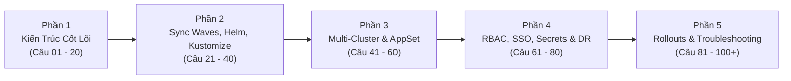
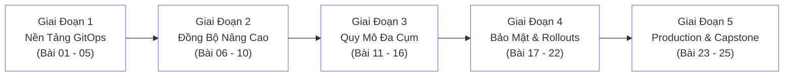


# Đại Tuyển Tập 100+ Câu Hỏi Phỏng Vấn Argo CD & GitOps Chuyên Sâu (24 Chuyên Đề)

Chào mừng bạn đến với chuyên đề tổng kết đặc biệt của toàn bộ Series **Argo CD & GitOps Enterprise Architecture**. 

Trong thị trường tuyển dụng công nghệ hiện đại, vai trò **Platform Engineer**, **DevOps Lead** và **Site Reliability Engineer (SRE)** đòi hỏi sự am hiểu sâu sắc về triết lý GitOps, khả năng thiết kế hệ thống phân phối đa cụm và năng lực xử lý sự cố thực chiến. Các câu hỏi phỏng vấn ngày nay không còn dừng lại ở mức định nghĩa lý thuyết cơ bản, mà tập trung vào các bài toán thiết kế kiến trúc quy mô lớn, tối ưu hóa hiệu năng và đối soát các cạm bẫy "Synced nhưng sai".

Bộ tài liệu này tổng hợp **100+ câu hỏi phỏng vấn kỹ thuật chuyên sâu** được đúc kết từ 24 chuyên đề, phân loại theo 5 nhóm chủ đề cốt lõi giúp bạn tự tin chinh phục mọi vòng phỏng vấn kỹ thuật cấp cao và chứng chỉ quốc tế **Certified Argo Project Associate (CAPA)**.

> [!TIP]
> **CHIẾN THUẬT TRẢ LỜI PHỎNG VẤN ĐỈNH CAO:**
> Khi người phỏng vấn hỏi về một lỗi hoặc cơ chế trong Argo CD, đừng chỉ trả lời "đúng định nghĩa". Hãy luôn trả lời theo công thức 3 bước:
> 1. **Bản chất kỹ thuật (How it works under the hood)**.
> 2. **Cạm bẫy thực chiến hay gặp ("Synced nhưng sai")**.
> 3. **Giải pháp kiến trúc chuẩn Enterprise (Best Practice & Zero-Trust)**.

> [!IMPORTANT]
> **CHUẨN BỊ CHO CHỨNG CHỈ QUỐC TẾ CAPA:**
> Hãy đọc kỹ các câu hỏi thuộc Phần 2 (Sync Waves/Hooks) và Phần 4 (RBAC/OIDC/Secrets), đây là 2 phần chiếm tỷ trọng câu hỏi tình huống cao nhất trong kỳ thi Certified Argo Project Associate.

---

## Mục Lục 5 Khối Kiến Thức Trọng Tâm

1. [Phần 1: Nguyên Lý GitOps & Kiến Trúc Cốt Lõi Argo CD (Câu 01 – 20)](#phan-1-nguyen-ly-gitops--kien-truc-cot-loi-argo-cd)
2. [Phần 2: Điều Phối Nâng Cao, Kustomize, Helm & Config Management Plugins (Câu 21 – 40)](#phan-2-dieu-phoi-nang-cao-kustomize-helm--config-management-plugins)
3. [Phần 3: Quy Mô Đa Cụm, App-of-Apps & ApplicationSet Engine (Câu 41 – 60)](#phan-3-quy-mo-da-cum-app-of-apps--applicationset-engine)
4. [Phần 4: Bảo Mật, RBAC, SSO/OIDC, Secrets Management & Disaster Recovery (Câu 61 – 80)](#phan-4-bao-mat-rbac-ssooidc-secrets-management--disaster-recovery)
5. [Phần 5: Progressive Delivery, Observability & Khắc Phục Sự Cố Production (Câu 81 – 100+)](#phan-5-progressive-delivery-observability--khac-phuc-su-co-production)

---

## Phần 1: Nguyên Lý GitOps & Kiến Trúc Cốt Lõi Argo CD

  

    Q01
    Sự khác biệt bản chất giữa mô hình Push-based CD truyền thống và Pull-based GitOps của Argo CD là gì?
  

  

    

      <svg width="14" height="14" fill="none" stroke="currentColor" stroke-width="2" viewBox="0 0 24 24"><path d="M22 11.08V12a10 10 0 1 1-5.93-9.14"></path><polyline points="22 4 12 14.01 9 11.01"></polyline></svg>
      Phân Tích &amp; Lời Giải Kỹ Thuật
    

    
• <b style="color: var(--accent-primary);">Push CD:</b> CI/CD runner nằm bên ngoài cụm Kubernetes, giữ quyền <code>cluster-admin</code> (hoặc ServiceAccount token) và chủ động "đẩy" (<code>kubectl apply</code>) lệnh vào cụm. Nguy cơ: Lộ credential bảo mật ra bên ngoài, không phát hiện được Configuration Drift nếu có ai đó sửa trực tiếp trên cụm.

    
• <b style="color: var(--accent-primary);">Pull GitOps:</b> Argo CD controller chạy trực tiếp *bên trong* cụm (hoặc Hub cluster), liên tục kéo (pull) khai báo từ Git về và so sánh với trạng thái thực tế (<code>Reconciliation Loop</code>). Ưu điểm: Zero-trust credentials (không cần mở cổng mạng Ingress vào cụm), tự động phát hiện và sửa chữa Drift (<code>Self-Healing</code>).

  

  

    Q02
    Chu kỳ thăm dò (polling interval) mặc định của Argo CD tới Git là bao lâu và làm thế nào để đồng bộ tức thì khi có commit mới?
  

  

    

      <svg width="14" height="14" fill="none" stroke="currentColor" stroke-width="2" viewBox="0 0 24 24"><path d="M22 11.08V12a10 10 0 1 1-5.93-9.14"></path><polyline points="22 4 12 14.01 9 11.01"></polyline></svg>
      Phân Tích &amp; Lời Giải Kỹ Thuật
    

    Chu kỳ quét mặc định là <b style="color: var(--accent-primary);">180 giây (3 phút)</b>. Để cập nhật tức thì trong vòng 1 giây mà không cần chờ 180s, ta cấu hình <b style="color: var(--accent-primary);">Git Webhooks</b> (GitHub/GitLab/Gitea) trỏ về endpoint <code>/api/webhook</code> của <code>argocd-server</code>. Khi có sự kiện <code>push</code>, Webhook sẽ đánh thức Reconcile loop ngay lập tức.
  

  

    Q03
    Argo CD nhận diện và quản lý vòng đời các tài nguyên trên cụm Kubernetes bằng cơ chế Resource Tracking nào?
  

  

    

      <svg width="14" height="14" fill="none" stroke="currentColor" stroke-width="2" viewBox="0 0 24 24"><path d="M22 11.08V12a10 10 0 1 1-5.93-9.14"></path><polyline points="22 4 12 14.01 9 11.01"></polyline></svg>
      Phân Tích &amp; Lời Giải Kỹ Thuật
    

    Argo CD sử dụng cơ chế <b style="color: var(--accent-primary);">Resource Tracking</b>. Có 3 phương pháp tracking:
    
<b style="color: var(--accent-cyan);">1.</b> <code>label</code> (Mặc định trước đây): Gắn nhãn <code>app.kubernetes.io/instance: &lt;app-name&gt;</code>.

    
<b style="color: var(--accent-cyan);">2.</b> <code>annotation</code> (Khuyên dùng hiện nay): Gắn annotation <code>argocd.argoproj.io/tracking-id: &lt;app-name&gt;:&lt;group/kind&gt;:&lt;namespace&gt;/&lt;name&gt;</code>.

    
<b style="color: var(--accent-cyan);">3.</b> <code>annotation+label</code>: Kết hợp cả hai để vừa tương thích UI vừa tránh xung đột tên.

  

  

    Q04
    Điều gì sẽ xảy ra nếu một kỹ sư sửa trực tiếp cấu hình Pod trên cụm Kubernetes khi selfHeal: false?
  

  

    

      <svg width="14" height="14" fill="none" stroke="currentColor" stroke-width="2" viewBox="0 0 24 24"><path d="M22 11.08V12a10 10 0 1 1-5.93-9.14"></path><polyline points="22 4 12 14.01 9 11.01"></polyline></svg>
      Phân Tích &amp; Lời Giải Kỹ Thuật
    

    Khi một kỹ sư dùng lệnh <code>kubectl edit</code> sửa trực tiếp cấu hình trên Live Cluster (ví dụ đổi image hoặc scale số Pod), Argo CD sẽ phát hiện trạng thái <code>OutOfSync</code>. Nhưng vì <code>selfHeal: false</code>, Argo CD không tự động kéo lại trạng thái từ Git. Nếu người vận hành chạy lệnh <code>argocd app sync</code> nhưng trên Git file cấu hình chưa được cập nhật, trạng thái có thể bị lệch mà không được tự khôi phục.
  

  

    Q05
    Ba trường bắt buộc cốt lõi trong spec của một Application Custom Resource (CRD) là gì?
  

  

    

      <svg width="14" height="14" fill="none" stroke="currentColor" stroke-width="2" viewBox="0 0 24 24"><path d="M22 11.08V12a10 10 0 1 1-5.93-9.14"></path><polyline points="22 4 12 14.01 9 11.01"></polyline></svg>
      Phân Tích &amp; Lời Giải Kỹ Thuật
    

    
• <code>spec.source</code>: Định nghĩa "Nguồn chân lý" (Git repo URL, branch/tag/commit revision, và thư mục path chứa manifests).

    
• <code>spec.destination</code>: Định nghĩa "Đích đến triển khai" (Kubernetes API server URL và target namespace).

    
• <code>spec.project</code>: Gán ứng dụng vào một <code>AppProject</code> để áp dụng các rào chắn bảo mật và phân quyền RBAC.

  

  

    Q06
    Kiến trúc Argo CD Control Plane gồm 4 microservices chính nào và nhiệm vụ của từng thành phần là gì?
  

  

    

      <svg width="14" height="14" fill="none" stroke="currentColor" stroke-width="2" viewBox="0 0 24 24"><path d="M22 11.08V12a10 10 0 1 1-5.93-9.14"></path><polyline points="22 4 12 14.01 9 11.01"></polyline></svg>
      Phân Tích &amp; Lời Giải Kỹ Thuật
    

    
<b style="color: var(--accent-cyan);">1.</b> <code>argocd-server</code>: API Gateway tiếp nhận Web UI, CLI, Webhook, xử lý Auth JWT &amp; RBAC.

    
<b style="color: var(--accent-cyan);">2.</b> <code>argocd-repo-server</code>: Clone Git repository, render Helm/Kustomize/CMP sang raw Kubernetes manifests qua cổng gRPC <code>:8081</code>.

    
<b style="color: var(--accent-cyan);">3.</b> <code>argocd-application-controller</code>: Chạy Reconciliation Loop, tính toán Three-Way Diff, thực thi Auto-Sync, Prune và Self-Heal.

    
<b style="color: var(--accent-cyan);">4.</b> <code>argocd-redis</code>: Bộ nhớ đệm phân tán lưu trữ manifest cache, session token và trạng thái cụm.

  

  

    Q07
    Cơ chế Three-Way Diff trong Argo CD hoạt động như thế nào để phát hiện Configuration Drift?
  

  

    

      <svg width="14" height="14" fill="none" stroke="currentColor" stroke-width="2" viewBox="0 0 24 24"><path d="M22 11.08V12a10 10 0 1 1-5.93-9.14"></path><polyline points="22 4 12 14.01 9 11.01"></polyline></svg>
      Phân Tích &amp; Lời Giải Kỹ Thuật
    

    So sánh: (1) Manifest mới trên Git (Desired State), (2) Trạng thái thực tế trên Live Cluster (Live State), và (3) Bản ghi cấu hình lần apply trước (<code>Last-Applied-Configuration</code>).
  

  

    Q08
    Sự khác biệt giữa lệnh đồng bộ Soft Refresh và Hard Refresh trong Argo CD là gì?
  

  

    

      <svg width="14" height="14" fill="none" stroke="currentColor" stroke-width="2" viewBox="0 0 24 24"><path d="M22 11.08V12a10 10 0 1 1-5.93-9.14"></path><polyline points="22 4 12 14.01 9 11.01"></polyline></svg>
      Phân Tích &amp; Lời Giải Kỹ Thuật
    

    <code>--refresh</code> (Soft) kiểm tra commit Git mới nhưng vẫn dùng lại manifest render trong Redis cache nếu SHA không đổi; <code>--hard-refresh</code> xóa sạch cache Redis và ép <code>repo-server</code> clone và render lại 100% từ đầu.
  

  

    Q09
    Tác dụng của cơ chế bảo vệ thư mục Git rỗng trong Argo CD là gì?
  

  

    

      <svg width="14" height="14" fill="none" stroke="currentColor" stroke-width="2" viewBox="0 0 24 24"><path d="M22 11.08V12a10 10 0 1 1-5.93-9.14"></path><polyline points="22 4 12 14.01 9 11.01"></polyline></svg>
      Phân Tích &amp; Lời Giải Kỹ Thuật
    

    Ngăn chặn thảm họa xóa sạch toàn bộ tài nguyên trên cụm Kubernetes nếu thư mục Git bị rỗng ngoài ý muốn (do merge PR nhầm hoặc script CI bị lỗi).
  

  

    Q10
    Server-Side Apply (SSA) giải quyết vấn đề gì so với Client-Side Apply?
  

  

    

      <svg width="14" height="14" fill="none" stroke="currentColor" stroke-width="2" viewBox="0 0 24 24"><path d="M22 11.08V12a10 10 0 1 1-5.93-9.14"></path><polyline points="22 4 12 14.01 9 11.01"></polyline></svg>
      Phân Tích &amp; Lời Giải Kỹ Thuật
    

    Loại bỏ giới hạn kích thước 256KB của annotation <code>kubectl.kubernetes.io/last-applied-configuration</code>, nhường việc quản lý trường cho <code>fieldManagers</code> của Kubernetes API Server và tối ưu xử lý xung đột với CRD lớn.
  

  

    Q11
    Lợi ích kỹ thuật của tùy chọn ApplyOutOfSyncOnly trong Sync Options là gì?
  

  

    

      <svg width="14" height="14" fill="none" stroke="currentColor" stroke-width="2" viewBox="0 0 24 24"><path d="M22 11.08V12a10 10 0 1 1-5.93-9.14"></path><polyline points="22 4 12 14.01 9 11.01"></polyline></svg>
      Phân Tích &amp; Lời Giải Kỹ Thuật
    

    Chỉ apply đúng những tài nguyên đang bị sai lệch (OutOfSync) thay vì gửi toàn bộ 500 file YAML lên etcd, giúp tăng tốc độ đồng bộ lên gấp 10 lần và giảm tải API Server.
  

  

    Q12
    Khi gắn Finalizer resources-finalizer.argocd.argoproj.io, hành vi xóa Application sẽ diễn ra thế nào?
  

  

    

      <svg width="14" height="14" fill="none" stroke="currentColor" stroke-width="2" viewBox="0 0 24 24"><path d="M22 11.08V12a10 10 0 1 1-5.93-9.14"></path><polyline points="22 4 12 14.01 9 11.01"></polyline></svg>
      Phân Tích &amp; Lời Giải Kỹ Thuật
    

    Kích hoạt cơ chế <b style="color: var(--accent-primary);">Cascade Deletion</b>: Argo CD sẽ chặn việc xóa Application, tìm và xóa sạch toàn bộ các tài nguyên con (Pods, Services, PVC) trên Kubernetes trước rồi mới xóa Application CRD.
  

  

    Q13
    Làm thế nào để xóa một Application trong Argo CD mà vẫn giữ nguyên các tài nguyên đang chạy trên cụm?
  

  

    

      <svg width="14" height="14" fill="none" stroke="currentColor" stroke-width="2" viewBox="0 0 24 24"><path d="M22 11.08V12a10 10 0 1 1-5.93-9.14"></path><polyline points="22 4 12 14.01 9 11.01"></polyline></svg>
      Phân Tích &amp; Lời Giải Kỹ Thuật
    

    Chạy lệnh <code>argocd app delete &lt;app-name&gt; --cascade=false</code> hoặc patch gỡ bỏ <code>metadata.finalizers</code> trước khi xóa.
  

  

    Q14
    Tại sao trong triết lý GitOps lại cấm tuyệt đối việc sử dụng image tag :latest trên môi trường Production?
  

  

    

      <svg width="14" height="14" fill="none" stroke="currentColor" stroke-width="2" viewBox="0 0 24 24"><path d="M22 11.08V12a10 10 0 1 1-5.93-9.14"></path><polyline points="22 4 12 14.01 9 11.01"></polyline></svg>
      Phân Tích &amp; Lời Giải Kỹ Thuật
    

    Tag <code>:latest</code> là Mutable (có thể bị ghi đè nội dung image mà tag không đổi), phá vỡ nguyên tắc xác định phiên bản bất biến của GitOps và khiến Argo CD không phát hiện được sự thay đổi để Reconcile.
  

  

    Q15
    Thông tin kết nối và chứng chỉ của các cụm Kubernetes đích được Argo CD lưu trữ ở đâu và với nhãn gì?
  

  

    

      <svg width="14" height="14" fill="none" stroke="currentColor" stroke-width="2" viewBox="0 0 24 24"><path d="M22 11.08V12a10 10 0 1 1-5.93-9.14"></path><polyline points="22 4 12 14.01 9 11.01"></polyline></svg>
      Phân Tích &amp; Lời Giải Kỹ Thuật
    

    Được lưu dưới dạng Kubernetes Secret trong namespace <code>argocd</code> có gắn nhãn <code>argocd.argoproj.io/secret-type: cluster</code>.
  

  

    Q16
    Biến môi trường nào trong argocd-repo-server quy định thời gian timeout tối đa khi thực thi render manifests?
  

  

    

      <svg width="14" height="14" fill="none" stroke="currentColor" stroke-width="2" viewBox="0 0 24 24"><path d="M22 11.08V12a10 10 0 1 1-5.93-9.14"></path><polyline points="22 4 12 14.01 9 11.01"></polyline></svg>
      Phân Tích &amp; Lời Giải Kỹ Thuật
    

    Biến <code>ARGOCD_EXEC_TIMEOUT</code> (mặc định là <code>90s</code>).
  

  

    Q17
    Trong trường hợp nào nên sử dụng tính năng Foreground Deletion thay vì Background Deletion khi xóa tài nguyên?
  

  

    

      <svg width="14" height="14" fill="none" stroke="currentColor" stroke-width="2" viewBox="0 0 24 24"><path d="M22 11.08V12a10 10 0 1 1-5.93-9.14"></path><polyline points="22 4 12 14.01 9 11.01"></polyline></svg>
      Phân Tích &amp; Lời Giải Kỹ Thuật
    

    Khi bạn muốn đảm bảo toàn bộ tài nguyên con phải bị xóa hoàn tất trước khi đối tượng cha được đánh dấu là đã xóa xong.
  

  

    Q18
    Tham số backoff.factor trong Retry Policy của Application có ý nghĩa kỹ thuật gì?
  

  

    

      <svg width="14" height="14" fill="none" stroke="currentColor" stroke-width="2" viewBox="0 0 24 24"><path d="M22 11.08V12a10 10 0 1 1-5.93-9.14"></path><polyline points="22 4 12 14.01 9 11.01"></polyline></svg>
      Phân Tích &amp; Lời Giải Kỹ Thuật
    

    Là hệ số nhân lũy tiến thời gian chờ giữa các lần thử lại đồng bộ thất bại (ví dụ <code>duration: 5s</code>, <code>factor: 2</code> $\rightarrow$ Thử lại sau <code>5s</code>, <code>10s</code>, <code>20s</code>, <code>40s</code>).
  

  

    Q19
    Làm thế nào để xem luồng nhật ký log trực tiếp của một Application từ dòng lệnh Argo CD CLI?
  

  

    

      <svg width="14" height="14" fill="none" stroke="currentColor" stroke-width="2" viewBox="0 0 24 24"><path d="M22 11.08V12a10 10 0 1 1-5.93-9.14"></path><polyline points="22 4 12 14.01 9 11.01"></polyline></svg>
      Phân Tích &amp; Lời Giải Kỹ Thuật
    

    Lệnh <code>argocd app logs &lt;app-name&gt; --follow</code>.
  

  

    Q20
    Nguyên nhân nào dẫn đến lỗi kết nối gRPC Unavailable khi chạy Argo CD CLI qua Ingress và cách khắc phục?
  

  

    

      <svg width="14" height="14" fill="none" stroke="currentColor" stroke-width="2" viewBox="0 0 24 24"><path d="M22 11.08V12a10 10 0 1 1-5.93-9.14"></path><polyline points="22 4 12 14.01 9 11.01"></polyline></svg>
      Phân Tích &amp; Lời Giải Kỹ Thuật
    

    Do CLI mặc định dùng giao thức HTTP/2 gRPC trong khi Ingress Controller chỉ cấu hình cho HTTP/1.1. Khắc phục bằng cách thêm cờ <code>--grpc-web</code> vào câu lệnh CLI.
  

---

## Phần 2: Điều Phối Nâng Cao, Kustomize, Helm & Config Management Plugins

  

    Q21
    Sự khác biệt giữa Sync Waves và Resource Hooks trong Argo CD là gì và khi nào nên sử dụng loại nào?
  

  

    

      <svg width="14" height="14" fill="none" stroke="currentColor" stroke-width="2" viewBox="0 0 24 24"><path d="M22 11.08V12a10 10 0 1 1-5.93-9.14"></path><polyline points="22 4 12 14.01 9 11.01"></polyline></svg>
      Phân Tích &amp; Lời Giải Kỹ Thuật
    

    
• <b style="color: var(--accent-primary);">Sync Waves (<code>argocd.argoproj.io/sync-wave</code>):</b> Sắp xếp thứ tự đồng bộ các tài nguyên theo số thứ tự từ bé đến lớn (ví dụ: Wave -1: Namespace/CRD $\rightarrow$ Wave 0: ConfigMap/Secret $\rightarrow$ Wave 1: Deployment). Wave sau chỉ chạy khi toàn bộ tài nguyên của Wave trước đạt trạng thái <code>Healthy</code>.

    
• <b style="color: var(--accent-primary);">Resource Hooks (<code>argocd.argoproj.io/hook</code>):</b> Chạy các tác vụ ngắn hạn (thường là Kubernetes Job/Pod) tại các thời điểm cụ thể trong vòng đời Sync: <code>PreSync</code> (chạy Database Migration trước khi roll code), <code>PostSync</code> (gửi thông báo Slack sau khi deploy xong), <code>SyncFail</code> (dọn dẹp khi deploy lỗi).

    
• <b style="color: var(--accent-primary);">Quy tắc lựa chọn:</b> Dùng Sync Waves để điều phối thứ tự tài nguyên Kubernetes chuẩn; dùng Hooks cho các tác vụ Job xử lý nghiệp vụ một lần.

  

  

    Q22
    Khi PreSync Hook Job thất bại, Argo CD xử lý đợt Sync tiếp theo như thế nào?
  

  

    

      <svg width="14" height="14" fill="none" stroke="currentColor" stroke-width="2" viewBox="0 0 24 24"><path d="M22 11.08V12a10 10 0 1 1-5.93-9.14"></path><polyline points="22 4 12 14.01 9 11.01"></polyline></svg>
      Phân Tích &amp; Lời Giải Kỹ Thuật
    

    Quá trình đồng bộ (Sync Phase) sẽ bị <b style="color: var(--accent-primary);">Dừng ngay lập tức (Aborted)</b>. Argo CD sẽ không bao giờ thực thi bước Sync chính (không tạo hay cập nhật Deployment/Service), bảo vệ hệ thống không bị đưa vào trạng thái nửa vời hoặc hỏng Database.
  

  

    Q23
    Làm thế nào để viết Custom Lua Health Check cho một Custom Resource Definition (CRD)?
  

  

    

      <svg width="14" height="14" fill="none" stroke="currentColor" stroke-width="2" viewBox="0 0 24 24"><path d="M22 11.08V12a10 10 0 1 1-5.93-9.14"></path><polyline points="22 4 12 14.01 9 11.01"></polyline></svg>
      Phân Tích &amp; Lời Giải Kỹ Thuật
    

    Ta cấu hình script Lua trong ConfigMap <code>argocd-cm</code> dưới thuộc tính <code>resource.customizations.health.&lt;group_kind&gt;</code>. Script Lua nhận đối tượng tài nguyên qua biến <code>obj</code> và trả về bảng trạng thái gồm <code>status</code> (<code>Healthy</code>, <code>Progressing</code>, <code>Degraded</code>, <code>Suspended</code>) và <code>message</code>.
  

  

    Q24
    Cách giải quyết xung đột vĩnh viễn giữa HorizontalPodAutoscaler (HPA) và số lượng replicas trong Git?
  

  

    

      <svg width="14" height="14" fill="none" stroke="currentColor" stroke-width="2" viewBox="0 0 24 24"><path d="M22 11.08V12a10 10 0 1 1-5.93-9.14"></path><polyline points="22 4 12 14.01 9 11.01"></polyline></svg>
      Phân Tích &amp; Lời Giải Kỹ Thuật
    

    Cấu hình thuộc tính <code>ignoreDifferences</code> trong Application CRD:
    <pre><code class="language-yaml">spec:
  ignoreDifferences:
    - group: apps
      kind: Deployment
      jsonPointers:
        - /spec/replicas</code></pre>
    Đồng thời, khuyến nghị xóa hẳn trường <code>spec.replicas</code> trong tệp YAML Deployment trên Git để HPA toàn quyền làm chủ số lượng Pods.
  

  

    Q25
    Tính năng Multiple Sources trong Argo CD cho phép kết hợp Helm Chart và values.yaml riêng như thế nào?
  

  

    

      <svg width="14" height="14" fill="none" stroke="currentColor" stroke-width="2" viewBox="0 0 24 24"><path d="M22 11.08V12a10 10 0 1 1-5.93-9.14"></path><polyline points="22 4 12 14.01 9 11.01"></polyline></svg>
      Phân Tích &amp; Lời Giải Kỹ Thuật
    

    Cho phép kết hợp Helm Chart công khai từ một kho Helm/OCI với tệp <code>values.yaml</code> nội bộ bảo mật nằm trong một kho Git riêng của doanh nghiệp bằng từ khóa <code>$values</code>:
    <pre><code class="language-yaml">spec:
  sources:
    - repoURL: 'https://charts.bitnami.com/bitnami'
      chart: redis
      targetRevision: 18.0.1
      helm:
        valueFiles:
          - $values/environments/prod/redis-values.yaml
    - repoURL: 'https://github.com/company/internal-configs.git'
      targetRevision: main
      ref: values</code></pre>
  

  

    Q26
    Tại sao trong cấu hình JSON Pointer của ignoreDifferences, dấu gạch chéo / trong tên nhãn phải viết thành ~1?
  

  

    

      <svg width="14" height="14" fill="none" stroke="currentColor" stroke-width="2" viewBox="0 0 24 24"><path d="M22 11.08V12a10 10 0 1 1-5.93-9.14"></path><polyline points="22 4 12 14.01 9 11.01"></polyline></svg>
      Phân Tích &amp; Lời Giải Kỹ Thuật
    

    Theo chuẩn <b style="color: var(--accent-primary);">RFC 6901</b>, dấu <code>/</code> là ký tự phân tách cấp độ JSON. Khi tên key chứa dấu <code>/</code>, bắt buộc phải escape thành <code>~1</code> (và <code>~</code> thành <code>~0</code>) để bộ phân tích cú pháp không hiểu nhầm là cấp con mới.
  

  

    Q27
    Ý nghĩa kỹ thuật của tùy chọn RespectIgnoreDifferences trong Sync Options là gì?
  

  

    

      <svg width="14" height="14" fill="none" stroke="currentColor" stroke-width="2" viewBox="0 0 24 24"><path d="M22 11.08V12a10 10 0 1 1-5.93-9.14"></path><polyline points="22 4 12 14.01 9 11.01"></polyline></svg>
      Phân Tích &amp; Lời Giải Kỹ Thuật
    

    Ép buộc Argo CD Controller phải bỏ qua các trường đã khai báo trong <code>ignoreDifferences</code> ngay cả trong lúc thực thi lệnh Apply, thay vì chỉ bỏ qua lúc tính toán trạng thái so sánh.
  

  

    Q28
    Kustomize ConfigMap Generator kích hoạt rolling update cho Deployment như thế nào khi nội dung config đổi?
  

  

    

      <svg width="14" height="14" fill="none" stroke="currentColor" stroke-width="2" viewBox="0 0 24 24"><path d="M22 11.08V12a10 10 0 1 1-5.93-9.14"></path><polyline points="22 4 12 14.01 9 11.01"></polyline></svg>
      Phân Tích &amp; Lời Giải Kỹ Thuật
    

    Kustomize tự động tính toán mã băm nội dung (Content Hash Suffix) và gắn vào tên ConfigMap (ví dụ <code>config-7b8f9g</code>). Khi nội dung đổi, tên ConfigMap đổi $\rightarrow$ Pod Template trong Deployment đổi $\rightarrow$ Kubernetes tự động kích hoạt <b style="color: var(--accent-primary);">Rolling Update</b> Pods mới.
  

  

    Q29
    Config Management Plugins (CMP) phiên bản v2 giao tiếp với repo-server qua phương thức nào?
  

  

    

      <svg width="14" height="14" fill="none" stroke="currentColor" stroke-width="2" viewBox="0 0 24 24"><path d="M22 11.08V12a10 10 0 1 1-5.93-9.14"></path><polyline points="22 4 12 14.01 9 11.01"></polyline></svg>
      Phân Tích &amp; Lời Giải Kỹ Thuật
    

    Giao tiếp qua <b style="color: var(--accent-primary);">Unix Domain Socket gRPC</b> đặt trong thư mục chia sẻ <code>/var/run/argocd/plugins</code>.
  

  

    Q30
    Ba chính sách dọn dẹp Hook (hook-delete-policy) trong Argo CD là gì?
  

  

    

      <svg width="14" height="14" fill="none" stroke="currentColor" stroke-width="2" viewBox="0 0 24 24"><path d="M22 11.08V12a10 10 0 1 1-5.93-9.14"></path><polyline points="22 4 12 14.01 9 11.01"></polyline></svg>
      Phân Tích &amp; Lời Giải Kỹ Thuật
    

    <code>HookSucceeded</code> (xóa khi thành công), <code>HookFailed</code> (xóa khi thất bại), và <code>BeforeHookCreation</code> (xóa bản ghi cũ trước khi tạo Job mới).
  

  

    Q31
    Tại sao lệnh generate trong plugin CMP v2 bắt buộc phải in log debug ra STDERR thay vì STDOUT?
  

  

    

      <svg width="14" height="14" fill="none" stroke="currentColor" stroke-width="2" viewBox="0 0 24 24"><path d="M22 11.08V12a10 10 0 1 1-5.93-9.14"></path><polyline points="22 4 12 14.01 9 11.01"></polyline></svg>
      Phân Tích &amp; Lời Giải Kỹ Thuật
    

    Vì Argo CD yêu cầu luồng STDOUT của lệnh <code>generate</code> phải là <b style="color: var(--accent-primary);">100% tài nguyên Kubernetes YAML/JSON hợp lệ</b>. Mọi dòng chữ log in ra STDOUT sẽ làm hỏng bộ phân tích cú pháp AST của Controller. Log thông báo phải chuyển hướng sang <b style="color: var(--accent-primary);">STDERR</b> (<code>&gt;&amp;2</code>).
  

  

    Q32
    Làm thế nào để Argo CD kéo Helm Chart từ một kho lưu trữ bảo mật sử dụng giao thức OCI Registry?
  

  

    

      <svg width="14" height="14" fill="none" stroke="currentColor" stroke-width="2" viewBox="0 0 24 24"><path d="M22 11.08V12a10 10 0 1 1-5.93-9.14"></path><polyline points="22 4 12 14.01 9 11.01"></polyline></svg>
      Phân Tích &amp; Lời Giải Kỹ Thuật
    

    Tạo Secret có nhãn <code>argocd.argoproj.io/secret-type: repository</code>, khai báo <code>type: helm</code>, <code>enableOCI: "true"</code> và URL có tiền tố <code>oci://</code>.
  

  

    Q33
    Tùy chọn PrunePropagationPolicy và PruneLast trong Sync Options mang lại lợi ích gì cho hệ thống?
  

  

    

      <svg width="14" height="14" fill="none" stroke="currentColor" stroke-width="2" viewBox="0 0 24 24"><path d="M22 11.08V12a10 10 0 1 1-5.93-9.14"></path><polyline points="22 4 12 14.01 9 11.01"></polyline></svg>
      Phân Tích &amp; Lời Giải Kỹ Thuật
    

    Tài nguyên cũ cần prune sẽ chỉ bị xóa sau khi toàn bộ tài nguyên mới đã được apply và đạt trạng thái <code>Healthy</code>, đảm bảo quá trình chuyển đổi Zero-Downtime.
  

  

    Q34
    Trạng thái sức khỏe Suspended của tài nguyên trong Argo CD xuất hiện trong những tình huống nào?
  

  

    

      <svg width="14" height="14" fill="none" stroke="currentColor" stroke-width="2" viewBox="0 0 24 24"><path d="M22 11.08V12a10 10 0 1 1-5.93-9.14"></path><polyline points="22 4 12 14.01 9 11.01"></polyline></svg>
      Phân Tích &amp; Lời Giải Kỹ Thuật
    

    Khi tài nguyên tạm dừng có chủ đích theo nghiệp vụ (ví dụ: CronJob <code>spec.suspend: true</code> hoặc Argo Rollouts Canary đang trong bước Pause).
  

  

    Q35
    Làm thế nào để kiểm tra tính hợp lệ của một Lua Health Check script trước khi đưa vào Production bằng CLI?
  

  

    

      <svg width="14" height="14" fill="none" stroke="currentColor" stroke-width="2" viewBox="0 0 24 24"><path d="M22 11.08V12a10 10 0 1 1-5.93-9.14"></path><polyline points="22 4 12 14.01 9 11.01"></polyline></svg>
      Phân Tích &amp; Lời Giải Kỹ Thuật
    

    Lệnh <code>argocd admin settings resource-overrides health &lt;file.yaml&gt; --lua-script &lt;script.lua&gt;</code>.
  

  

    Q36
    Cấu trúc Kustomize Base/Overlays giúp tối ưu hóa việc quản lý cấu hình đa môi trường như thế nào?
  

  

    

      <svg width="14" height="14" fill="none" stroke="currentColor" stroke-width="2" viewBox="0 0 24 24"><path d="M22 11.08V12a10 10 0 1 1-5.93-9.14"></path><polyline points="22 4 12 14.01 9 11.01"></polyline></svg>
      Phân Tích &amp; Lời Giải Kỹ Thuật
    

    Đảm bảo nguyên lý <b style="color: var(--accent-primary);">DRY</b>: Cấu hình chung đặt ở Base, các môi trường Dev/Prod chỉ viết các tệp Patch đè lên các tham số riêng biệt (Replicas, CPU/RAM, Ingress), loại bỏ sao chép trùng lặp.
  

  

    Q37
    Làm thế nào để ghi đè (override) một tham số Helm values trực tiếp từ câu lệnh CLI mà không cần sửa file YAML?
  

  

    

      <svg width="14" height="14" fill="none" stroke="currentColor" stroke-width="2" viewBox="0 0 24 24"><path d="M22 11.08V12a10 10 0 1 1-5.93-9.14"></path><polyline points="22 4 12 14.01 9 11.01"></polyline></svg>
      Phân Tích &amp; Lời Giải Kỹ Thuật
    

    Chạy lệnh <code>argocd app set &lt;app-name&gt; --parameter &lt;key&gt;=&lt;value&gt;</code>.
  

  

    Q38
    Tại sao nên luôn đặt thuộc tính activeDeadlineSeconds cho các Kubernetes Job được dùng làm Resource Hook?
  

  

    

      <svg width="14" height="14" fill="none" stroke="currentColor" stroke-width="2" viewBox="0 0 24 24"><path d="M22 11.08V12a10 10 0 1 1-5.93-9.14"></path><polyline points="22 4 12 14.01 9 11.01"></polyline></svg>
      Phân Tích &amp; Lời Giải Kỹ Thuật
    

    Đặt thời gian timeout tối đa cho Job. Nếu Job bị kẹt deadlock, Kubernetes sẽ tự hủy Job sau thời gian này, ngăn chặn việc treo vô hạn toàn bộ tiến trình deploy của Argo CD.
  

  

    Q39
    Lợi ích của việc sử dụng cú pháp JQ Path Expressions thay cho RFC 6902 JSON Pointers trong ignoreDifferences là gì?
  

  

    

      <svg width="14" height="14" fill="none" stroke="currentColor" stroke-width="2" viewBox="0 0 24 24"><path d="M22 11.08V12a10 10 0 1 1-5.93-9.14"></path><polyline points="22 4 12 14.01 9 11.01"></polyline></svg>
      Phân Tích &amp; Lời Giải Kỹ Thuật
    

    Cho phép lọc động các phần tử trong mảng (ví dụ <code>.spec.containers[] | select(.name == "istio-proxy")</code>) mà không phụ thuộc vào vị trí chỉ số index cố định của phần tử.
  

  

    Q40
    Làm thế nào để dừng khẩn cấp một thao tác Sync đang chạy (in-progress) khi phát hiện sự cố?
  

  

    

      <svg width="14" height="14" fill="none" stroke="currentColor" stroke-width="2" viewBox="0 0 24 24"><path d="M22 11.08V12a10 10 0 1 1-5.93-9.14"></path><polyline points="22 4 12 14.01 9 11.01"></polyline></svg>
      Phân Tích &amp; Lời Giải Kỹ Thuật
    

    Chạy lệnh <code>argocd app terminate-op &lt;app-name&gt;</code>.
  

---

## Phần 3: Quy Mô Đa Cụm, App-of-Apps & ApplicationSet Engine

  

    Q41
    Mô hình Root App-of-Apps là gì và cơ chế hoạt động tự động hóa của nó ra sao?
  

  

    

      <svg width="14" height="14" fill="none" stroke="currentColor" stroke-width="2" viewBox="0 0 24 24"><path d="M22 11.08V12a10 10 0 1 1-5.93-9.14"></path><polyline points="22 4 12 14.01 9 11.01"></polyline></svg>
      Phân Tích &amp; Lời Giải Kỹ Thuật
    

    Là mô hình quản trị cây thư mục ứng dụng phân tầng. Một <b style="color: var(--accent-primary);">Root Application</b> duy nhất được triển khai trên Argo CD, trỏ tới một thư mục Git chứa định nghĩa của hàng chục <b style="color: var(--accent-primary);">Child Applications</b>. Khi thêm một service mới, kỹ sư chỉ cần commit file <code>application.yaml</code> con vào Git, Root App sẽ tự động phát hiện và sinh ra ứng dụng mới mà không cần chạm tay vào Argo CD UI.
  

  

    Q42
    Hãy liệt kê và phân tích vai trò của các loại Generators cốt lõi trong ApplicationSet Engine?
  

  

    

      <svg width="14" height="14" fill="none" stroke="currentColor" stroke-width="2" viewBox="0 0 24 24"><path d="M22 11.08V12a10 10 0 1 1-5.93-9.14"></path><polyline points="22 4 12 14.01 9 11.01"></polyline></svg>
      Phân Tích &amp; Lời Giải Kỹ Thuật
    

    
• <b style="color: var(--accent-primary);">List Generator:</b> Sinh ứng dụng dựa trên một danh sách tĩnh khai báo trực tiếp trong YAML.

    
• <b style="color: var(--accent-primary);">Cluster Generator:</b> Tự động quét các cụm Kubernetes kết nối với Argo CD (dựa vào Labels) để sinh ứng dụng lên từng cụm.

    
• <b style="color: var(--accent-primary);">Git Directory/File Generator:</b> Quét cấu trúc thư mục hoặc file JSON/YAML trên kho Git để tự động tạo ứng dụng tương ứng (Zero-Touch Deployment).

    
• <b style="color: var(--accent-primary);">Matrix Generator:</b> Nhân ma trận tích Descartes giữa 2 generators (ví dụ: 10 Microservices $\times$ 5 Cụm = Tự động sinh 50 Ứng dụng con).

    
• <b style="color: var(--accent-primary);">Merge Generator:</b> Gộp các generator và cho phép override các tham số cấu hình cục bộ theo điều kiện.

    
• <b style="color: var(--accent-primary);">Pull Request Generator:</b> Quét các PR đang mở trên GitHub/GitLab để tự động dựng môi trường thử nghiệm tạm thời (Ephemeral/Preview Environment) và tự xóa khi PR đóng.

  

  

    Q43
    Khi Hub Cluster bị mất kết nối mạng với Spoke Cluster, các ứng dụng trên Spoke Cluster có bị dừng hoạt động không?
  

  

    

      <svg width="14" height="14" fill="none" stroke="currentColor" stroke-width="2" viewBox="0 0 24 24"><path d="M22 11.08V12a10 10 0 1 1-5.93-9.14"></path><polyline points="22 4 12 14.01 9 11.01"></polyline></svg>
      Phân Tích &amp; Lời Giải Kỹ Thuật
    

    <b style="color: var(--accent-primary);">Không!</b> Các ứng dụng trên Spoke Cluster vẫn tiếp tục hoạt động bình thường nhờ tính chất phân tán của Kubernetes. Chỉ có luồng cập nhật cấu hình mới (Reconciliation) từ Hub sang Spoke bị tạm hoãn cho đến khi kết nối mạng được phục hồi.
  

  

    Q44
    Năm rào chắn an ninh cốt lõi mà một AppProject cung cấp để bảo vệ môi trường đa tenant là gì?
  

  

    

      <svg width="14" height="14" fill="none" stroke="currentColor" stroke-width="2" viewBox="0 0 24 24"><path d="M22 11.08V12a10 10 0 1 1-5.93-9.14"></path><polyline points="22 4 12 14.01 9 11.01"></polyline></svg>
      Phân Tích &amp; Lời Giải Kỹ Thuật
    

    
<b style="color: var(--accent-cyan);">1.</b> <code>sourceRepos</code>: Giới hạn các kho Git được phép sử dụng.

    
<b style="color: var(--accent-cyan);">2.</b> <code>destinations</code>: Giới hạn các cụm và namespace được phép deploy tới.

    
<b style="color: var(--accent-cyan);">3.</b> <code>clusterResourceWhitelist / Blacklist</code>: Giới hạn các tài nguyên cấp cụm (Namespace, PV, CRD, ClusterRole).

    
<b style="color: var(--accent-cyan);">4.</b> <code>namespaceResourceWhitelist / Blacklist</code>: Giới hạn các tài nguyên trong namespace.

    
<b style="color: var(--accent-cyan);">5.</b> <code>syncWindows</code>: Thiết lập khung giờ cấm hoặc cho phép deploy (ngăn deploy vào giờ cao điểm hoặc ban đêm).

  

  

    Q45
    Tại sao Root Application báo Synced màu xanh nhưng một ứng dụng con bên trong lại bị lỗi Degraded?
  

  

    

      <svg width="14" height="14" fill="none" stroke="currentColor" stroke-width="2" viewBox="0 0 24 24"><path d="M22 11.08V12a10 10 0 1 1-5.93-9.14"></path><polyline points="22 4 12 14.01 9 11.01"></polyline></svg>
      Phân Tích &amp; Lời Giải Kỹ Thuật
    

    Do Root App chỉ kiểm tra xem tệp <code>Application CRD</code> con có lưu thành công vào etcd không. Trạng thái lỗi Pods bên trong Child App không tự động nổi lên tầng Root nếu không cấu hình Custom Health Check cho Application CRD.
  

  

    Q46
    Làm thế nào để khắc phục giới hạn Rate Limit của GitHub API khi sử dụng Git Generator trong ApplicationSet?
  

  

    

      <svg width="14" height="14" fill="none" stroke="currentColor" stroke-width="2" viewBox="0 0 24 24"><path d="M22 11.08V12a10 10 0 1 1-5.93-9.14"></path><polyline points="22 4 12 14.01 9 11.01"></polyline></svg>
      Phân Tích &amp; Lời Giải Kỹ Thuật
    

    Khai báo GitHub Personal Access Token hoặc GitHub App trong <code>tokenRef</code> (tăng hạn mức từ 60 lên 5,000 requests/giờ) và kết hợp với Git Webhook.
  

  

    Q47
    Biến thay thế path.basename trong Git Directory Generator của ApplicationSet trả về giá trị gì?
  

  

    

      <svg width="14" height="14" fill="none" stroke="currentColor" stroke-width="2" viewBox="0 0 24 24"><path d="M22 11.08V12a10 10 0 1 1-5.93-9.14"></path><polyline points="22 4 12 14.01 9 11.01"></polyline></svg>
      Phân Tích &amp; Lời Giải Kỹ Thuật
    

    Trả về tên của thư mục cuối cùng trong đường dẫn (ví dụ: <code>services/payment-api</code> $\rightarrow$ <code>payment-api</code>).
  

  

    Q48
    Làm thế nào để khi xóa một ApplicationSet, các Application con và tài nguyên của chúng không bị xóa theo?
  

  

    

      <svg width="14" height="14" fill="none" stroke="currentColor" stroke-width="2" viewBox="0 0 24 24"><path d="M22 11.08V12a10 10 0 1 1-5.93-9.14"></path><polyline points="22 4 12 14.01 9 11.01"></polyline></svg>
      Phân Tích &amp; Lời Giải Kỹ Thuật
    

    Cấu hình <code>spec.syncPolicy.preserveResourcesOnDeletion: true</code> trong ApplicationSet.
  

  

    Q49
    ServiceAccount nào được tạo tự động trên Spoke Cluster khi thực hiện kết nối cụm qua lệnh argocd cluster add?
  

  

    

      <svg width="14" height="14" fill="none" stroke="currentColor" stroke-width="2" viewBox="0 0 24 24"><path d="M22 11.08V12a10 10 0 1 1-5.93-9.14"></path><polyline points="22 4 12 14.01 9 11.01"></polyline></svg>
      Phân Tích &amp; Lời Giải Kỹ Thuật
    

    ServiceAccount <code>argocd-manager</code> (nằm trong namespace <code>kube-system</code>).
  

  

    Q50
    Hai loại Sync Windows trong AppProject là gì và vai trò kiểm soát an toàn vận hành của chúng ra sao?
  

  

    

      <svg width="14" height="14" fill="none" stroke="currentColor" stroke-width="2" viewBox="0 0 24 24"><path d="M22 11.08V12a10 10 0 1 1-5.93-9.14"></path><polyline points="22 4 12 14.01 9 11.01"></polyline></svg>
      Phân Tích &amp; Lời Giải Kỹ Thuật
    

    Hỗ trợ 2 loại: <code>kind: allow</code> (chỉ cho phép deploy trong khung giờ này) và <code>kind: deny</code> (cấm tuyệt đối deploy trong khung giờ này).
  

  

    Q51
    Hàm template path.basenameNormalized trong ApplicationSet xử lý tên nhánh Git như thế nào?
  

  

    

      <svg width="14" height="14" fill="none" stroke="currentColor" stroke-width="2" viewBox="0 0 24 24"><path d="M22 11.08V12a10 10 0 1 1-5.93-9.14"></path><polyline points="22 4 12 14.01 9 11.01"></polyline></svg>
      Phân Tích &amp; Lời Giải Kỹ Thuật
    

    Tự động chuẩn hóa tên nhánh Git thành định dạng an toàn cho Kubernetes DNS (đổi chữ hoa thành thường, đổi <code>/</code> và <code>_</code> thành dấu <code>-</code>).
  

  

    Q52
    Tại sao tên của Application được sinh ra bởi ApplicationSet không được phép chứa dấu gạch dưới (_) hoặc chữ in hoa?
  

  

    

      <svg width="14" height="14" fill="none" stroke="currentColor" stroke-width="2" viewBox="0 0 24 24"><path d="M22 11.08V12a10 10 0 1 1-5.93-9.14"></path><polyline points="22 4 12 14.01 9 11.01"></polyline></svg>
      Phân Tích &amp; Lời Giải Kỹ Thuật
    

    Vì tên Application sẽ trở thành tên đối tượng Kubernetes CRD trên etcd, cấm chứa chữ hoa và dấu gạch dưới <code>_</code>.
  

  

    Q53
    Làm thế nào để cấu hình Application quét đệ quy toàn bộ thư mục con bên trong Git repository?
  

  

    

      <svg width="14" height="14" fill="none" stroke="currentColor" stroke-width="2" viewBox="0 0 24 24"><path d="M22 11.08V12a10 10 0 1 1-5.93-9.14"></path><polyline points="22 4 12 14.01 9 11.01"></polyline></svg>
      Phân Tích &amp; Lời Giải Kỹ Thuật
    

    Cấu hình <code>spec.source.directory.recurse: true</code>.
  

  

    Q54
    Làm thế nào để gắn nhãn (labels) bổ sung cho một cụm Kubernetes đã đăng ký trong Argo CD?
  

  

    

      <svg width="14" height="14" fill="none" stroke="currentColor" stroke-width="2" viewBox="0 0 24 24"><path d="M22 11.08V12a10 10 0 1 1-5.93-9.14"></path><polyline points="22 4 12 14.01 9 11.01"></polyline></svg>
      Phân Tích &amp; Lời Giải Kỹ Thuật
    

    Chạy lệnh <code>kubectl label secret &lt;cluster-secret-name&gt; -n argocd &lt;key&gt;=&lt;value&gt;</code>.
  

  

    Q55
    Lệnh CLI nào cho phép tạo JWT Project Token cho CI/CD pipeline xác thực vào một AppProject cụ thể?
  

  

    

      <svg width="14" height="14" fill="none" stroke="currentColor" stroke-width="2" viewBox="0 0 24 24"><path d="M22 11.08V12a10 10 0 1 1-5.93-9.14"></path><polyline points="22 4 12 14.01 9 11.01"></polyline></svg>
      Phân Tích &amp; Lời Giải Kỹ Thuật
    

    Lệnh <code>argocd proj role create-token &lt;project-name&gt; &lt;role-name&gt;</code>.
  

  

    Q56
    Khi triển khai kiến trúc Hub-and-Spoke, luồng kết nối mạng giữa Hub Cluster và Spoke Cluster cần mở những cổng nào?
  

  

    

      <svg width="14" height="14" fill="none" stroke="currentColor" stroke-width="2" viewBox="0 0 24 24"><path d="M22 11.08V12a10 10 0 1 1-5.93-9.14"></path><polyline points="22 4 12 14.01 9 11.01"></polyline></svg>
      Phân Tích &amp; Lời Giải Kỹ Thuật
    

    Chỉ cần mở kết nối Egress một chiều từ Hub Cluster tới cổng TCP <code>:6443</code> (API Server) của Spoke Cluster.
  

  

    Q57
    Merge Generator trong ApplicationSet có vai trò gì trong việc ghi đè tham số cấu hình cho từng cụm?
  

  

    

      <svg width="14" height="14" fill="none" stroke="currentColor" stroke-width="2" viewBox="0 0 24 24"><path d="M22 11.08V12a10 10 0 1 1-5.93-9.14"></path><polyline points="22 4 12 14.01 9 11.01"></polyline></svg>
      Phân Tích &amp; Lời Giải Kỹ Thuật
    

    Cho phép gộp các generator và override tham số dựa trên thuộc tính định danh chung (<code>mergeKeys</code>).
  

  

    Q58
    Làm thế nào để ngăn chặn các Pull Request từ Fork Repo độc hại kích hoạt dựng Ephemeral Environment trong ApplicationSet?
  

  

    

      <svg width="14" height="14" fill="none" stroke="currentColor" stroke-width="2" viewBox="0 0 24 24"><path d="M22 11.08V12a10 10 0 1 1-5.93-9.14"></path><polyline points="22 4 12 14.01 9 11.01"></polyline></svg>
      Phân Tích &amp; Lời Giải Kỹ Thuật
    

    Sử dụng bộ lọc <code>filters.labels</code> (chỉ build khi Maintainer gắn nhãn <code>safe-to-test</code>) hoặc giới hạn <code>filters.forkMatch: false</code>.
  

  

    Q59
    Tại sao lệnh argocd cluster add có thể bị lỗi xác thực trên các phiên bản Kubernetes 1.24+ mới?
  

  

    

      <svg width="14" height="14" fill="none" stroke="currentColor" stroke-width="2" viewBox="0 0 24 24"><path d="M22 11.08V12a10 10 0 1 1-5.93-9.14"></path><polyline points="22 4 12 14.01 9 11.01"></polyline></svg>
      Phân Tích &amp; Lời Giải Kỹ Thuật
    

    Do Kubernetes 1.24+ chuyển sang dùng Token ServiceAccount có thời hạn ngắn. Cần tạo Secret tĩnh gắn annotation <code>kubernetes.io/service-account.name</code> để cấp token dài hạn.
  

  

    Q60
    Sự khác biệt cốt lõi giữa List Generator và Matrix Generator trong ApplicationSet là gì?
  

  

    

      <svg width="14" height="14" fill="none" stroke="currentColor" stroke-width="2" viewBox="0 0 24 24"><path d="M22 11.08V12a10 10 0 1 1-5.93-9.14"></path><polyline points="22 4 12 14.01 9 11.01"></polyline></svg>
      Phân Tích &amp; Lời Giải Kỹ Thuật
    

    List Generator chỉ duyệt qua 1 danh sách tĩnh 1 chiều; Matrix Generator nhân ma trận 2 chiều giữa 2 generator độc lập (ví dụ Dịch vụ $\times$ Cụm).
  

---

## Phần 4: Bảo Mật, RBAC, SSO/OIDC, Secrets Management & Disaster Recovery

  

    Q61
    Cú pháp phân quyền Casbin CSV trong argocd-rbac-cm có định dạng chuẩn như thế nào?
  

  

    

      <svg width="14" height="14" fill="none" stroke="currentColor" stroke-width="2" viewBox="0 0 24 24"><path d="M22 11.08V12a10 10 0 1 1-5.93-9.14"></path><polyline points="22 4 12 14.01 9 11.01"></polyline></svg>
      Phân Tích &amp; Lời Giải Kỹ Thuật
    

    Định dạng chuẩn gồm 6 trường:
    <pre><code>p, &lt;subject/role&gt;, &lt;resource&gt;, &lt;action&gt;, &lt;object&gt;, &lt;effect&gt;</code></pre>
    Ví dụ:
    <code>p, role:developer, applications, sync, ecommerce-project/*, allow</code> (Cho phép role <code>developer</code> được thực thi lệnh <code>sync</code> trên toàn bộ ứng dụng thuộc project <code>ecommerce-project</code>).
  

  

    Q62
    So sánh 3 giải pháp quản lý Secret trong GitOps: Sealed Secrets, External Secrets Operator (ESO), và SOPS.
  

  

    

      <svg width="14" height="14" fill="none" stroke="currentColor" stroke-width="2" viewBox="0 0 24 24"><path d="M22 11.08V12a10 10 0 1 1-5.93-9.14"></path><polyline points="22 4 12 14.01 9 11.01"></polyline></svg>
      Phân Tích &amp; Lời Giải Kỹ Thuật
    

    
<b style="color: var(--accent-primary);">&bull; Bitnami Sealed Secrets:</b> Mã hóa Secret bất đối xứng (Asymmetric Encryption) bằng Public Key phía client (<code>kubeseal</code>), an toàn đẩy lên Git. Controller trong cụm giữ Private Key để giải mã thành Kubernetes Secret. Điểm mạnh: Nhẹ, không phụ thuộc hạ tầng Cloud bên ngoài.

    
<b style="color: var(--accent-primary);">&bull; External Secrets Operator (ESO):</b> Đồng bộ Secret từ các dịch vụ bên ngoài (AWS Secrets Manager, HashiCorp Vault, Azure Key Vault, GCP Secret Manager) vào cụm qua đối tượng <code>ExternalSecret</code> CRD. Điểm mạnh: Quản trị tập trung chuẩn doanh nghiệp.

    
<b style="color: var(--accent-primary);">&bull; Mozilla SOPS:</b> Mã hóa từng giá trị (value) trong file YAML/JSON bằng khóa KMS (AWS/GCP/Azure) hoặc PGP. Tích hợp trực tiếp qua CMP Plugin.

  

  

    Q63
    Tại sao nên vô hiệu hóa tài khoản cục bộ admin (admin.enabled: "false") khi đã tích hợp Dex OIDC SSO?
  

  

    

      <svg width="14" height="14" fill="none" stroke="currentColor" stroke-width="2" viewBox="0 0 24 24"><path d="M22 11.08V12a10 10 0 1 1-5.93-9.14"></path><polyline points="22 4 12 14.01 9 11.01"></polyline></svg>
      Phân Tích &amp; Lời Giải Kỹ Thuật
    

    Tài khoản <code>admin</code> mặc định là tài khoản toàn quyền (God-mode), dùng chung mật khẩu tĩnh, không có xác thực đa yếu tố (MFA) và khó thực hiện Audit Log truy vết cá nhân. Tắt tài khoản này và bắt buộc đăng nhập qua SSO (Okta, Google, Azure AD) giúp áp dụng nguyên lý Zero Trust và kiểm soát định danh tập trung.
  

  

    Q64
    Quy trình Disaster Recovery (Khôi phục thảm họa) Argo CD thực hiện như thế nào khi toàn bộ Data Center bị phá hủy?
  

  

    

      <svg width="14" height="14" fill="none" stroke="currentColor" stroke-width="2" viewBox="0 0 24 24"><path d="M22 11.08V12a10 10 0 1 1-5.93-9.14"></path><polyline points="22 4 12 14.01 9 11.01"></polyline></svg>
      Phân Tích &amp; Lời Giải Kỹ Thuật
    

    
<b style="color: var(--accent-cyan);">1.</b> Khởi tạo cụm Kubernetes mới tại Data Center dự phòng.

    
<b style="color: var(--accent-cyan);">2.</b> Cài đặt Argo CD bản sạch.

    
<b style="color: var(--accent-cyan);">3.</b> Nạp lại toàn bộ cấu hình khai báo từ file sao lưu đã mã hóa bằng lệnh: <code>argocd admin import -n argocd &lt; argocd-backup.yaml</code>

    
<b style="color: var(--accent-cyan);">4.</b> Sau khi import, Argo CD Controller sẽ tự động kết nối lại kho Git và tự động kéo/tái lập toàn bộ hàng trăm ứng dụng lên cụm mới.

  

  

    Q65
    Sáu loại tài nguyên được kiểm soát bởi Casbin RBAC trong Argo CD là gì?
  

  

    

      <svg width="14" height="14" fill="none" stroke="currentColor" stroke-width="2" viewBox="0 0 24 24"><path d="M22 11.08V12a10 10 0 1 1-5.93-9.14"></path><polyline points="22 4 12 14.01 9 11.01"></polyline></svg>
      Phân Tích &amp; Lời Giải Kỹ Thuật
    

    <code>applications</code>, <code>clusters</code>, <code>repositories</code>, <code>projects</code>, <code>accounts</code>, và <code>logs</code>/<code>exec</code>.
  

  

    Q66
    Scope OIDC nào bắt buộc phải khai báo để Argo CD nhận diện được danh sách nhóm người dùng cho RBAC?
  

  

    

      <svg width="14" height="14" fill="none" stroke="currentColor" stroke-width="2" viewBox="0 0 24 24"><path d="M22 11.08V12a10 10 0 1 1-5.93-9.14"></path><polyline points="22 4 12 14.01 9 11.01"></polyline></svg>
      Phân Tích &amp; Lời Giải Kỹ Thuật
    

    Scope <b style="color: var(--accent-primary);"><code>groups</code></b> trong <code>oidc.config.requestedScopes</code>.
  

  

    Q67
    Sự khác biệt về Callback Redirect URI giữa Direct OIDC và Dex Broker là gì?
  

  

    

      <svg width="14" height="14" fill="none" stroke="currentColor" stroke-width="2" viewBox="0 0 24 24"><path d="M22 11.08V12a10 10 0 1 1-5.93-9.14"></path><polyline points="22 4 12 14.01 9 11.01"></polyline></svg>
      Phân Tích &amp; Lời Giải Kỹ Thuật
    

    Direct OIDC là <code>https://&lt;host&gt;/auth/callback</code>; Dex Broker là <code>https://&lt;host&gt;/api/dex/callback</code>.
  

  

    Q68
    Ba chế độ Scope trong Bitnami Sealed Secrets là gì?
  

  

    

      <svg width="14" height="14" fill="none" stroke="currentColor" stroke-width="2" viewBox="0 0 24 24"><path d="M22 11.08V12a10 10 0 1 1-5.93-9.14"></path><polyline points="22 4 12 14.01 9 11.01"></polyline></svg>
      Phân Tích &amp; Lời Giải Kỹ Thuật
    

    <code>strict</code> (khóa theo Name + Namespace), <code>namespace-wide</code> (khóa theo Namespace), và <code>cluster-wide</code> (dùng toàn cụm).
  

  

    Q69
    Tại sao readOnlyRootFilesystem: true trên argocd-repo-server bắt buộc phải mount emptyDir vào /tmp?
  

  

    

      <svg width="14" height="14" fill="none" stroke="currentColor" stroke-width="2" viewBox="0 0 24 24"><path d="M22 11.08V12a10 10 0 1 1-5.93-9.14"></path><polyline points="22 4 12 14.01 9 11.01"></polyline></svg>
      Phân Tích &amp; Lời Giải Kỹ Thuật
    

    Vì <code>repo-server</code> cần ghi các tệp tạm khi clone Git và render Helm/Kustomize vào <code>/tmp</code>. Nếu không mount <code>emptyDir</code>, tiến trình render sẽ sập vì không có quyền ghi đĩa.
  

  

    Q70
    Lệnh CLI nào dùng để kiểm tra tính hợp lệ của toàn bộ bảng phân quyền argocd-rbac-cm?
  

  

    

      <svg width="14" height="14" fill="none" stroke="currentColor" stroke-width="2" viewBox="0 0 24 24"><path d="M22 11.08V12a10 10 0 1 1-5.93-9.14"></path><polyline points="22 4 12 14.01 9 11.01"></polyline></svg>
      Phân Tích &amp; Lời Giải Kỹ Thuật
    

    Lệnh <code>argocd admin settings rbac validate</code>.
  

  

    Q71
    Điều gì xảy ra nếu Sealed Secret Controller bị mất Private Key trên cụm?
  

  

    

      <svg width="14" height="14" fill="none" stroke="currentColor" stroke-width="2" viewBox="0 0 24 24"><path d="M22 11.08V12a10 10 0 1 1-5.93-9.14"></path><polyline points="22 4 12 14.01 9 11.01"></polyline></svg>
      Phân Tích &amp; Lời Giải Kỹ Thuật
    

    Toàn bộ các file <code>SealedSecret</code> đã mã hóa trên Git sẽ vĩnh viễn không thể giải mã được nữa. Cần backup Secret Private Key định kỳ.
  

  

    Q72
    Cổng TCP nào bắt buộc phải mở giữa argocd-application-controller và argocd-repo-server trong NetworkPolicy?
  

  

    

      <svg width="14" height="14" fill="none" stroke="currentColor" stroke-width="2" viewBox="0 0 24 24"><path d="M22 11.08V12a10 10 0 1 1-5.93-9.14"></path><polyline points="22 4 12 14.01 9 11.01"></polyline></svg>
      Phân Tích &amp; Lời Giải Kỹ Thuật
    

    Cổng <b style="color: var(--accent-primary);">TCP <code>:8081</code></b> (giao thức gRPC).
  

  

    Q73
    Biến môi trường nào được sử dụng để kích hoạt tính năng Controller Sharding?
  

  

    

      <svg width="14" height="14" fill="none" stroke="currentColor" stroke-width="2" viewBox="0 0 24 24"><path d="M22 11.08V12a10 10 0 1 1-5.93-9.14"></path><polyline points="22 4 12 14.01 9 11.01"></polyline></svg>
      Phân Tích &amp; Lời Giải Kỹ Thuật
    

    Biến <code>ARGOCD_CONTROLLER_REPLICAS</code> (chạy trên StatefulSet).
  

  

    Q74
    Lệnh CLI nào cho phép đăng nhập Argo CD qua giao diện SSO trên trình duyệt?
  

  

    

      <svg width="14" height="14" fill="none" stroke="currentColor" stroke-width="2" viewBox="0 0 24 24"><path d="M22 11.08V12a10 10 0 1 1-5.93-9.14"></path><polyline points="22 4 12 14.01 9 11.01"></polyline></svg>
      Phân Tích &amp; Lời Giải Kỹ Thuật
    

    Lệnh <code>argocd login &lt;host&gt; --sso --grpc-web</code>.
  

  

    Q75
    Làm thế nào để kiểm tra quyền hạn của một vai trò cụ thể qua CLI?
  

  

    

      <svg width="14" height="14" fill="none" stroke="currentColor" stroke-width="2" viewBox="0 0 24 24"><path d="M22 11.08V12a10 10 0 1 1-5.93-9.14"></path><polyline points="22 4 12 14.01 9 11.01"></polyline></svg>
      Phân Tích &amp; Lời Giải Kỹ Thuật
    

    Chạy lệnh <code>argocd account can-i &lt;action&gt; &lt;resource&gt; &lt;sub-object&gt;</code>.
  

  

    Q76
    Chuẩn Pod Security Standards (PSS) Restricted yêu cầu UID chạy container tối thiểu là bao nhiêu?
  

  

    

      <svg width="14" height="14" fill="none" stroke="currentColor" stroke-width="2" viewBox="0 0 24 24"><path d="M22 11.08V12a10 10 0 1 1-5.93-9.14"></path><polyline points="22 4 12 14.01 9 11.01"></polyline></svg>
      Phân Tích &amp; Lời Giải Kỹ Thuật
    

    Yêu cầu chạy dưới User non-root (UID khác 0, ví dụ UID <code>999</code> hoặc <code>10001</code>).
  

  

    Q77
    Cơ chế External Secrets Operator (ESO) kết nối với HashiCorp Vault qua phương thức xác thực nào là an toàn nhất?
  

  

    

      <svg width="14" height="14" fill="none" stroke="currentColor" stroke-width="2" viewBox="0 0 24 24"><path d="M22 11.08V12a10 10 0 1 1-5.93-9.14"></path><polyline points="22 4 12 14.01 9 11.01"></polyline></svg>
      Phân Tích &amp; Lời Giải Kỹ Thuật
    

    Xác thực bằng <b style="color: var(--accent-primary);">Kubernetes ServiceAccount Token</b> (Vault Kubernetes Auth Method), không dùng secret tĩnh.
  

  

    Q78
    Làm thế nào để vô hiệu hóa tính năng Web Terminal vào Pod trên Argo CD?
  

  

    

      <svg width="14" height="14" fill="none" stroke="currentColor" stroke-width="2" viewBox="0 0 24 24"><path d="M22 11.08V12a10 10 0 1 1-5.93-9.14"></path><polyline points="22 4 12 14.01 9 11.01"></polyline></svg>
      Phân Tích &amp; Lời Giải Kỹ Thuật
    

    Cấu hình <code>exec.enabled: "false"</code> trong <code>argocd-cm</code> hoặc phân quyền <code>p, &lt;role&gt;, exec, create, *, deny</code> trong <code>argocd-rbac-cm</code>.
  

  

    Q79
    Tại sao Secret argocd-initial-admin-secret bắt buộc phải xóa sau khi cài đặt?
  

  

    

      <svg width="14" height="14" fill="none" stroke="currentColor" stroke-width="2" viewBox="0 0 24 24"><path d="M22 11.08V12a10 10 0 1 1-5.93-9.14"></path><polyline points="22 4 12 14.01 9 11.01"></polyline></svg>
      Phân Tích &amp; Lời Giải Kỹ Thuật
    

    Vì nó chứa mật khẩu admin khởi tạo dạng plaintext, vi phạm chuẩn an ninh CIS Kubernetes Benchmark.
  

  

    Q80
    Lệnh CLI argocd admin export xuất dữ liệu ra định dạng gì?
  

  

    

      <svg width="14" height="14" fill="none" stroke="currentColor" stroke-width="2" viewBox="0 0 24 24"><path d="M22 11.08V12a10 10 0 1 1-5.93-9.14"></path><polyline points="22 4 12 14.01 9 11.01"></polyline></svg>
      Phân Tích &amp; Lời Giải Kỹ Thuật
    

    Xuất toàn bộ trạng thái cấu hình tĩnh (CRD, ConfigMap, Secret) ra định dạng <b style="color: var(--accent-primary);">Kubernetes YAML Stream</b> chuẩn.
  

---

## Phần 5: Progressive Delivery, Observability & Khắc Phục Sự Cố Production

  

    Q81
    Sự khác biệt cơ bản giữa Kubernetes Deployment tiêu chuẩn và Argo Rollouts là gì?
  

  

    

      <svg width="14" height="14" fill="none" stroke="currentColor" stroke-width="2" viewBox="0 0 24 24"><path d="M22 11.08V12a10 10 0 1 1-5.93-9.14"></path><polyline points="22 4 12 14.01 9 11.01"></polyline></svg>
      Phân Tích &amp; Lời Giải Kỹ Thuật
    

    Deployment tiêu chuẩn của Kubernetes chỉ hỗ trợ chiến lược Rolling Update thô sơ (thay thế dần từng Pod cũ bằng Pod mới) mà không có khả năng kiểm soát tỷ lệ Traffic mạng, không hỗ trợ tạm dừng theo dõi và không thể tự động Rollback dựa trên số liệu PromQL. <b style="color: var(--accent-primary);">Argo Rollouts</b> là giải pháp Progressive Delivery cung cấp chiến lược <b style="color: var(--accent-primary);">Canary Release</b> (chia nhỏ traffic 10% &rarr; 30% &rarr; 100%), <b style="color: var(--accent-primary);">Blue-Green Deployment</b> và tích hợp <code>AnalysisTemplate</code> để tự động đo lường số liệu Prometheus/Datadog.
  

  

    Q82
    Trong Argo Rollouts Canary, cơ chế AnalysisRun tự động Rollback hoạt động như thế nào khi tỷ lệ lỗi HTTP 5xx tăng vọt?
  

  

    

      <svg width="14" height="14" fill="none" stroke="currentColor" stroke-width="2" viewBox="0 0 24 24"><path d="M22 11.08V12a10 10 0 1 1-5.93-9.14"></path><polyline points="22 4 12 14.01 9 11.01"></polyline></svg>
      Phân Tích &amp; Lời Giải Kỹ Thuật
    

    Trong tệp <code>Rollout</code>, ta liên kết với một <code>AnalysisTemplate</code>. Template này thực thi định kỳ các câu truy vấn PromQL (ví dụ đo <code>http_requests_total</code> lỗi 5xx chia cho tổng request). Nếu kết quả vượt ngưỡng <code>failureLimit</code> (ví dụ Error Rate &gt; 1%), <code>AnalysisRun</code> sẽ chuyển sang trạng thái <code>Failed</code>. Argo Rollouts Controller ngay lập tức ngắt toàn bộ traffic đến Pods Canary và trả lại 100% traffic cho phiên bản ổn định cũ trong vòng chưa đầy 1 giây.
  

  

    Q83
    Cần cấu hình những gì để Argo CD Notifications gửi tin nhắn cảnh báo trực tiếp về kênh Telegram hoặc Slack khi ứng dụng bị Degraded?
  

  

    

      <svg width="14" height="14" fill="none" stroke="currentColor" stroke-width="2" viewBox="0 0 24 24"><path d="M22 11.08V12a10 10 0 1 1-5.93-9.14"></path><polyline points="22 4 12 14.01 9 11.01"></polyline></svg>
      Phân Tích &amp; Lời Giải Kỹ Thuật
    

    Cần cấu hình 4 thành phần trong ConfigMap <code>argocd-notifications-cm</code>:
    
<b style="color: var(--accent-cyan);">1.</b> <b style="color: var(--accent-primary);">Services:</b> Khai báo Bot Token và Chat ID của Telegram / Webhook URL của Slack.

    
<b style="color: var(--accent-cyan);">2.</b> <b style="color: var(--accent-primary);">Templates:</b> Soạn thảo mẫu tin nhắn thông báo (chứa biến <code>&#123;&#123;.app.metadata.name&#125;&#125;</code>, <code>&#123;&#123;.app.status.sync.status&#125;&#125;</code>).

    
<b style="color: var(--accent-cyan);">3.</b> <b style="color: var(--accent-primary);">Triggers:</b> Định nghĩa điều kiện kích hoạt (ví dụ: <code>when: app.status.health.status == 'Degraded'</code>).

    
<b style="color: var(--accent-cyan);">4.</b> <b style="color: var(--accent-primary);">Subscriptions:</b> Đăng ký nhận thông báo cho Application qua annotation: <code>notifications.argoproj.io/subscribe.on-degraded.telegram: &lt;chat_id&gt;</code>.

  

  

    Q84
    Bốn chỉ số PromQL vàng (Golden Metrics) mà mọi SRE phải theo dõi trên Grafana cho Argo CD là gì?
  

  

    

      <svg width="14" height="14" fill="none" stroke="currentColor" stroke-width="2" viewBox="0 0 24 24"><path d="M22 11.08V12a10 10 0 1 1-5.93-9.14"></path><polyline points="22 4 12 14.01 9 11.01"></polyline></svg>
      Phân Tích &amp; Lời Giải Kỹ Thuật
    

    
<b style="color: var(--accent-cyan);">1.</b> <code>argocd_app_reconcile_count</code>: Tần suất và số lượng đợt Reconcile của Controller.

    
<b style="color: var(--accent-cyan);">2.</b> <code>argocd_app_sync_total</code>: Tổng số lượt Sync ứng dụng phân theo trạng thái (Success vs Failed).

    
<b style="color: var(--accent-cyan);">3.</b> <code>argocd_git_request_duration_seconds</code>: Thời gian trễ khi kết nối và clone kho Git.

    
<b style="color: var(--accent-cyan);">4.</b> <code>argocd_redis_request_duration_seconds</code>: Độ trễ truy vấn bộ nhớ đệm Redis Cache.

  

  

    Q85
    Làm thế nào để xử lý sự cố Pod argocd-repo-server bị lỗi OOMKilled (Out Of Memory) liên tục?
  

  

    

      <svg width="14" height="14" fill="none" stroke="currentColor" stroke-width="2" viewBox="0 0 24 24"><path d="M22 11.08V12a10 10 0 1 1-5.93-9.14"></path><polyline points="22 4 12 14.01 9 11.01"></polyline></svg>
      Phân Tích &amp; Lời Giải Kỹ Thuật
    

    
&bull; Tăng cấu hình <code>resources.limits.memory</code> từ 1Gi lên 2Gi - 4Gi.

    
&bull; Cấu hình biến môi trường <code>ARGOCD_EXEC_TIMEOUT: "180s"</code> để tránh các tiến trình render kẹt vô hạn.

    
&bull; Tăng số lượng Replicas của <code>argocd-repo-server</code> lên 3 - 5 Pods để chia sẻ tải biên dịch manifests.

    
&bull; Đảm bảo mount <code>emptyDir</code> vào <code>/tmp</code> để không làm nghẽn bộ nhớ đệm trên đĩa.

  

  

    Q86
    Thuộc tính oncePer trong Argo CD Notifications Trigger giải quyết vấn đề gì?
  

  

    

      <svg width="14" height="14" fill="none" stroke="currentColor" stroke-width="2" viewBox="0 0 24 24"><path d="M22 11.08V12a10 10 0 1 1-5.93-9.14"></path><polyline points="22 4 12 14.01 9 11.01"></polyline></svg>
      Phân Tích &amp; Lời Giải Kỹ Thuật
    

    Ngăn chặn hiện tượng <b style="color: var(--accent-primary);">Notification Storm</b> (bão tin nhắn spam) khi Pod bị lỗi flapping liên tục giữa Progressing và Degraded.
  

  

    Q87
    Lệnh CLI nào dùng để theo dõi trực quan quá trình Canary Release của Argo Rollouts trên Terminal?
  

  

    

      <svg width="14" height="14" fill="none" stroke="currentColor" stroke-width="2" viewBox="0 0 24 24"><path d="M22 11.08V12a10 10 0 1 1-5.93-9.14"></path><polyline points="22 4 12 14.01 9 11.01"></polyline></svg>
      Phân Tích &amp; Lời Giải Kỹ Thuật
    

    Lệnh <code>kubectl argo rollouts get rollout &lt;rollout-name&gt; --watch</code>.
  

  

    Q88
    Làm thế nào để thúc đẩy một đợt Rollout vượt qua bước pause: {} thủ công?
  

  

    

      <svg width="14" height="14" fill="none" stroke="currentColor" stroke-width="2" viewBox="0 0 24 24"><path d="M22 11.08V12a10 10 0 1 1-5.93-9.14"></path><polyline points="22 4 12 14.01 9 11.01"></polyline></svg>
      Phân Tích &amp; Lời Giải Kỹ Thuật
    

    Chạy lệnh <code>kubectl argo rollouts promote &lt;rollout-name&gt;</code>.
  

  

    Q89
    Cổng phát metrics Prometheus mặc định của argocd-application-controller là cổng nào?
  

  

    

      <svg width="14" height="14" fill="none" stroke="currentColor" stroke-width="2" viewBox="0 0 24 24"><path d="M22 11.08V12a10 10 0 1 1-5.93-9.14"></path><polyline points="22 4 12 14.01 9 11.01"></polyline></svg>
      Phân Tích &amp; Lời Giải Kỹ Thuật
    

    Cổng <b style="color: var(--accent-primary);">TCP <code>:8082</code></b>.
  

  

    Q90
    Mã ID của Dashboard tổng quan chính thức của Argo CD trên Grafana Community là bao nhiêu?
  

  

    

      <svg width="14" height="14" fill="none" stroke="currentColor" stroke-width="2" viewBox="0 0 24 24"><path d="M22 11.08V12a10 10 0 1 1-5.93-9.14"></path><polyline points="22 4 12 14.01 9 11.01"></polyline></svg>
      Phân Tích &amp; Lời Giải Kỹ Thuật
    

    Mã <b style="color: var(--accent-primary);">ID: <code>14584</code></b>.
  

  

    Q91
    Hiện tượng "Reconcile Storm" xuất hiện khi nào và cách khắc phục?
  

  

    

      <svg width="14" height="14" fill="none" stroke="currentColor" stroke-width="2" viewBox="0 0 24 24"><path d="M22 11.08V12a10 10 0 1 1-5.93-9.14"></path><polyline points="22 4 12 14.01 9 11.01"></polyline></svg>
      Phân Tích &amp; Lời Giải Kỹ Thuật
    

    Xuất hiện khi hàng ngàn ứng dụng đồng thời hết hạn cache 180s làm CPU Controller quá tải 100%. Khắc phục bằng cách tăng <code>timeout.reconciliation: "600s"</code>, bật Controller Sharding và dùng Webhook.
  

  

    Q92
    Làm thế nào để gửi thử một thông báo test từ Notifications Controller qua dòng lệnh?
  

  

    

      <svg width="14" height="14" fill="none" stroke="currentColor" stroke-width="2" viewBox="0 0 24 24"><path d="M22 11.08V12a10 10 0 1 1-5.93-9.14"></path><polyline points="22 4 12 14.01 9 11.01"></polyline></svg>
      Phân Tích &amp; Lời Giải Kỹ Thuật
    

    Chạy lệnh <code>kubectl exec -n argocd deploy/argocd-notifications-controller -- argocd-notifications template notify &lt;template-name&gt; &lt;app-name&gt; --recipient &lt;service&gt;:&lt;dest&gt;</code>.
  

  

    Q93
    Sự khác biệt giữa canaryService và stableService trong Argo Rollouts là gì?
  

  

    

      <svg width="14" height="14" fill="none" stroke="currentColor" stroke-width="2" viewBox="0 0 24 24"><path d="M22 11.08V12a10 10 0 1 1-5.93-9.14"></path><polyline points="22 4 12 14.01 9 11.01"></polyline></svg>
      Phân Tích &amp; Lời Giải Kỹ Thuật
    

    <code>stableService</code> luôn trỏ vào các Pods phiên bản ổn định cũ (nhận phần lớn traffic); <code>canaryService</code> trỏ vào các Pods phiên bản mới để phục vụ lưu lượng thử nghiệm hoặc kiểm thử nội bộ.
  

  

    Q94
    Làm thế nào để ép buộc Argo Rollouts hủy bỏ đợt phát hành và Rollback ngay lập tức qua CLI?
  

  

    

      <svg width="14" height="14" fill="none" stroke="currentColor" stroke-width="2" viewBox="0 0 24 24"><path d="M22 11.08V12a10 10 0 1 1-5.93-9.14"></path><polyline points="22 4 12 14.01 9 11.01"></polyline></svg>
      Phân Tích &amp; Lời Giải Kỹ Thuật
    

    Chạy lệnh <code>kubectl argo rollouts abort &lt;rollout-name&gt;</code>.
  

  

    Q95
    Metric nào phản ánh số lượng ứng dụng đang rơi vào trạng thái Degraded trong Prometheus?
  

  

    

      <svg width="14" height="14" fill="none" stroke="currentColor" stroke-width="2" viewBox="0 0 24 24"><path d="M22 11.08V12a10 10 0 1 1-5.93-9.14"></path><polyline points="22 4 12 14.01 9 11.01"></polyline></svg>
      Phân Tích &amp; Lời Giải Kỹ Thuật
    

    Metric <code>argocd_app_health_status&#123;health_status="Degraded"&#125;</code>.
  

  

    Q96
    Khi GitHub Webhook bắn tín hiệu về Argo CD nhưng ứng dụng không tự cập nhật, cần kiểm tra những gì?
  

  

    

      <svg width="14" height="14" fill="none" stroke="currentColor" stroke-width="2" viewBox="0 0 24 24"><path d="M22 11.08V12a10 10 0 1 1-5.93-9.14"></path><polyline points="22 4 12 14.01 9 11.01"></polyline></svg>
      Phân Tích &amp; Lời Giải Kỹ Thuật
    

    Kiểm tra: (1) Secret Webhook trong <code>argocd-secret</code> khớp với GitHub secret, (2) NetworkPolicy có cho phép Ingress vào port 80/443 của <code>argocd-server</code>, (3) URL repo trong Application khớp 100% với URL trong Webhook payload.
  

  

    Q97
    Tùy chọn failureLimit: 2 trong AnalysisTemplate có ý nghĩa gì?
  

  

    

      <svg width="14" height="14" fill="none" stroke="currentColor" stroke-width="2" viewBox="0 0 24 24"><path d="M22 11.08V12a10 10 0 1 1-5.93-9.14"></path><polyline points="22 4 12 14.01 9 11.01"></polyline></svg>
      Phân Tích &amp; Lời Giải Kỹ Thuật
    

    Cho phép câu truy vấn PromQL đo lường thất bại tối đa 2 lần liên tiếp. Nếu thất bại đến lần thứ 3, đợt AnalysisRun sẽ bị đánh trượt và kích hoạt Rollback.
  

  

    Q98
    Trong Blue-Green Deployment của Argo Rollouts, thuộc tính autoPromotionEnabled: false có tác dụng gì?
  

  

    

      <svg width="14" height="14" fill="none" stroke="currentColor" stroke-width="2" viewBox="0 0 24 24"><path d="M22 11.08V12a10 10 0 1 1-5.93-9.14"></path><polyline points="22 4 12 14.01 9 11.01"></polyline></svg>
      Phân Tích &amp; Lời Giải Kỹ Thuật
    

    Ngăn không cho Rollouts tự động chuyển đổi traffic sang môi trường Green mới, bắt buộc kỹ sư phải kiểm thử thủ công trên <code>previewService</code> và chạy lệnh promote thì mới đổi cờ traffic.
  

  

    Q99
    Lệnh nào kiểm tra xem Controller có đang bị kẹt hàng đợi Workqueue xử lý không?
  

  

    

      <svg width="14" height="14" fill="none" stroke="currentColor" stroke-width="2" viewBox="0 0 24 24"><path d="M22 11.08V12a10 10 0 1 1-5.93-9.14"></path><polyline points="22 4 12 14.01 9 11.01"></polyline></svg>
      Phân Tích &amp; Lời Giải Kỹ Thuật
    

    Kiểm tra metric <code>workqueue_depth&#123;name="app_reconciliation_queue"&#125;</code> qua cổng <code>:8082</code>.
  

  

    Q100
    Bẫy "Synced nhưng sai đa tầng" (The Multi-Layer Synced Trap) là gì và làm thế nào để phòng chống triệt để?
  

  

    

      <svg width="14" height="14" fill="none" stroke="currentColor" stroke-width="2" viewBox="0 0 24 24"><path d="M22 11.08V12a10 10 0 1 1-5.93-9.14"></path><polyline points="22 4 12 14.01 9 11.01"></polyline></svg>
      Phân Tích &amp; Lời Giải Kỹ Thuật
    

    Là hiện tượng Root App báo <code>Synced</code> màu xanh nhưng bên dưới dính 3 tầng lỗi ngầm: (1) SealedSecret giải mã sập, (2) Rollout bị Prometheus rollback về code cũ, (3) NetworkPolicy chặn gRPC reconcile code mới. Phòng chống bằng cách thực thi <b style="color: var(--accent-primary);">Quy trình kiểm thử nghiệm thu Production Handover Audit 5 bước</b> đối soát tận gốc Live State.
  

---

## Bảng Tổng Kết Lộ Trình 25 Chuyên Đề Argo CD & GitOps Enterprise

---

## Lời Kết

Chúc mừng bạn đã hoàn thành trọn vẹn **Series 25 Chuyên Đề Argo CD & GitOps Enterprise Architecture**! 

Hành trình từ những dòng manifest đầu tiên cho tới việc thiết kế và vận hành hệ thống E-commerce đa cụm cấp doanh nghiệp là một bước tiến vượt bậc trong sự nghiệp kỹ thuật của bạn. Hãy lưu giữ bộ cẩm nang 100+ câu hỏi phỏng vấn này, liên tục thực hành trên các môi trường lab thực tế và tự tin khẳng định vị thế **GitOps Platform Lead** trong mọi dự án công nghệ lớn!

> [!NOTE]
> **Hoàn Tất Khóa Học:** Chúc mừng bạn đã hoàn thành toàn bộ 25 bài học thuộc series **ArgoCD & GitOps Mastery**. Hãy tiếp tục áp dụng các kiến thức chuẩn SRE vào hệ thống thực tế và tối ưu hóa hạ tầng Kubernetes của bạn!



