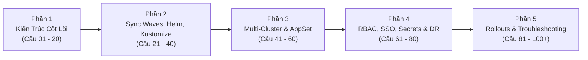
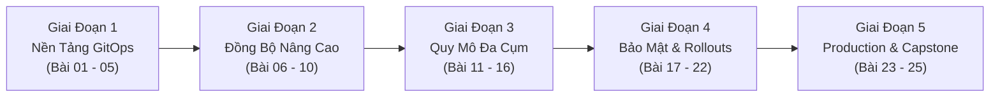


# Đại Tuyển Tập 100+ Câu Hỏi Phỏng Vấn Argo CD & GitOps Chuyên Sâu (24 Chuyên Đề)

Chào mừng bạn đến với chuyên đề tổng kết đặc biệt của toàn bộ Series **Argo CD & GitOps Enterprise Architecture**. 

Trong thị trường tuyển dụng công nghệ hiện đại, vai trò **Platform Engineer**, **DevOps Lead** và **Site Reliability Engineer (SRE)** đòi hỏi sự am hiểu sâu sắc về triết lý GitOps, khả năng thiết kế hệ thống phân phối đa cụm và năng lực xử lý sự cố thực chiến. Các câu hỏi phỏng vấn ngày nay không còn dừng lại ở mức định nghĩa lý thuyết cơ bản, mà tập trung vào các bài toán thiết kế kiến trúc quy mô lớn, tối ưu hóa hiệu năng và đối soát các cạm bẫy "Synced nhưng sai".

Bộ tài liệu này tổng hợp **100+ câu hỏi phỏng vấn kỹ thuật chuyên sâu** được đúc kết từ 24 chuyên đề, phân loại theo 5 nhóm chủ đề cốt lõi giúp bạn tự tin chinh phục mọi vòng phỏng vấn kỹ thuật cấp cao và chứng chỉ quốc tế **Certified Argo Project Associate (CAPA)**.



> [!TIP]
> **CHIẾN THUẬT TRẢ LỜI PHỎNG VẤN ĐỈNH CAO:**
> Khi người phỏng vấn hỏi về một lỗi hoặc cơ chế trong Argo CD, đừng chỉ trả lời "đúng định nghĩa". Hãy luôn trả lời theo công thức 3 bước:
> 1. **Bản chất kỹ thuật (How it works under the hood)**.
> 2. **Cạm bẫy thực chiến hay gặp ("Synced nhưng sai")**.
> 3. **Giải pháp kiến trúc chuẩn Enterprise (Best Practice & Zero-Trust)**.

> [!IMPORTANT]
> **CHUẨN BỊ CHO CHỨNG CHỈ QUỐC TẾ CAPA:**
> Hãy đọc kỹ các câu hỏi thuộc Phần 2 (Sync Waves/Hooks) và Phần 4 (RBAC/OIDC/Secrets), đây là 2 phần chiếm tỷ trọng câu hỏi tình huống cao nhất trong kỳ thi Certified Argo Project Associate.

---

## Mục Lục 5 Khối Kiến Thức Trọng Tâm

1. [Phần 1: Nguyên Lý GitOps & Kiến Trúc Cốt Lõi Argo CD (Câu 01 – 20)](#phan-1-nguyen-ly-gitops--kien-truc-cot-loi-argo-cd)
2. [Phần 2: Điều Phối Nâng Cao, Kustomize, Helm & Config Management Plugins (Câu 21 – 40)](#phan-2-dieu-phoi-nang-cao-kustomize-helm--config-management-plugins)
3. [Phần 3: Quy Mô Đa Cụm, App-of-Apps & ApplicationSet Engine (Câu 41 – 60)](#phan-3-quy-mo-da-cum-app-of-apps--applicationset-engine)
4. [Phần 4: Bảo Mật, RBAC, SSO/OIDC, Secrets Management & Disaster Recovery (Câu 61 – 80)](#phan-4-bao-mat-rbac-ssooidc-secrets-management--disaster-recovery)
5. [Phần 5: Progressive Delivery, Observability & Khắc Phục Sự Cố Production (Câu 81 – 100+)](#phan-5-progressive-delivery-observability--khac-phuc-su-co-production)

---

## Phần 1: Nguyên Lý GitOps & Kiến Trúc Cốt Lõi Argo CD

### Câu 01: Sự khác biệt bản chất giữa mô hình Push-based CD (Jenkins/GitLab CI) và Pull-based GitOps (Argo CD) là gì?
- **Trả lời:** 
  - **Push CD:** CI/CD runner nằm bên ngoài cụm Kubernetes, giữ quyền `cluster-admin` (hoặc ServiceAccount token) và chủ động "đẩy" (`kubectl apply`) lệnh vào cụm. Nguy cơ: Lộ credential bảo mật ra bên ngoài, không phát hiện được Configuration Drift nếu có ai đó sửa trực tiếp trên cụm.
  - **Pull GitOps:** Argo CD controller chạy trực tiếp *bên trong* cụm (hoặc Hub cluster), liên tục kéo (pull) khai báo từ Git về và so sánh với trạng thái thực tế (`Reconciliation Loop`). Ưu điểm: Zero-trust credentials (không cần mở cổng mạng Ingress vào cụm), tự động phát hiện và sửa chữa Drift (`Self-Healing`).

### Câu 02: Chu kỳ Reconcile mặc định của Argo CD là bao lâu? Làm thế nào để Argo CD cập nhật ngay lập tức khi có commit mới?
- **Trả lời:** Chu kỳ quét mặc định là **180 giây (3 phút)**. Để cập nhật tức thì trong vòng 1 giây mà không cần chờ 180s, ta cấu hình **Git Webhooks** (GitHub/GitLab/Gitea) trỏ về endpoint `/api/webhook` của `argocd-server`. Khi có sự kiện `push`, Webhook sẽ đánh thức Reconcile loop ngay lập tức.

### Câu 03: Argo CD sử dụng cơ chế nào để biết một tài nguyên trên Kubernetes thuộc về một Application cụ thể?
- **Trả lời:** Argo CD sử dụng cơ chế **Resource Tracking**. Có 3 phương pháp tracking:
  1. `label` (Mặc định trước đây): Gắn nhãn `app.kubernetes.io/instance: <app-name>`.
  2. `annotation` (Khuyên dùng hiện nay): Gắn annotation `argocd.argoproj.io/tracking-id: <app-name>:<group/kind>:<namespace>/<name>`.
  3. `annotation+label`: Kết hợp cả hai để vừa tương thích UI vừa tránh xung đột tên.

### Câu 04: Cạm bẫy "Synced nhưng sai" xuất hiện như thế nào khi cấu hình `automated.selfHeal: false`?
- **Trả lời:** Khi một kỹ sư dùng lệnh `kubectl edit` sửa trực tiếp cấu hình trên Live Cluster (ví dụ đổi image hoặc scale số Pod), Argo CD sẽ phát hiện trạng thái `OutOfSync`. Nhưng vì `selfHeal: false`, Argo CD không tự động kéo lại trạng thái từ Git. Nếu người vận hành chạy lệnh `argocd app sync` nhưng trên Git file cấu hình chưa được cập nhật, trạng thái có thể bị lệch mà không được tự khôi phục.

### Câu 05: Phân biệt ý nghĩa của 3 trường dữ liệu trong Application CRD: `spec.source`, `spec.destination`, và `spec.project`.
- **Trả lời:**
  - `spec.source`: Định nghĩa "Nguồn chân lý" (Git repo URL, branch/tag/commit revision, và thư mục path chứa manifests).
  - `spec.destination`: Định nghĩa "Đích đến triển khai" (Kubernetes API server URL và target namespace).
  - `spec.project`: Gán ứng dụng vào một `AppProject` để áp dụng các rào chắn bảo mật và phân quyền RBAC.

### Câu 06: Bốn microservices cấu thành nên Argo CD Control Plane là gì và vai trò của từng thành phần?
- **Trả lời:**
  1. `argocd-server`: API Gateway tiếp nhận Web UI, CLI, Webhook, xử lý Auth JWT & RBAC.
  2. `argocd-repo-server`: Clone Git repository, render Helm/Kustomize/CMP sang raw Kubernetes manifests qua cổng gRPC `:8081`.
  3. `argocd-application-controller`: Chạy Reconciliation Loop, tính toán Three-Way Diff, thực thi Auto-Sync, Prune và Self-Heal.
  4. `argocd-redis`: Bộ nhớ đệm phân tán lưu trữ manifest cache, session token và trạng thái cụm.

### Câu 07: Thuật toán Three-Way Diff trong Argo CD so sánh 3 nguồn dữ liệu nào?
- **Trả lời:** So sánh: (1) Manifest mới trên Git (Desired State), (2) Trạng thái thực tế trên Live Cluster (Live State), và (3) Bản ghi cấu hình lần apply trước (`Last-Applied-Configuration`).

### Câu 08: Lệnh `argocd app get --refresh` khác gì so với `--hard-refresh`?
- **Trả lời:** `--refresh` (Soft) kiểm tra commit Git mới nhưng vẫn dùng lại manifest render trong Redis cache nếu SHA không đổi; `--hard-refresh` xóa sạch cache Redis và ép `repo-server` clone và render lại 100% từ đầu.

### Câu 09: Thuộc tính `allowEmpty: false` trong `syncPolicy.automated` có tác dụng gì?
- **Trả lời:** Ngăn chặn thảm họa xóa sạch toàn bộ tài nguyên trên cụm Kubernetes nếu thư mục Git bị rỗng ngoài ý muốn (do merge PR nhầm hoặc script CI bị lỗi).

### Câu 10: Tùy chọn `ServerSideApply=true` trong `syncOptions` giải quyết vấn đề gì?
- **Trả lời:** Loại bỏ giới hạn kích thước 256KB của annotation `kubectl.kubernetes.io/last-applied-configuration`, nhường việc quản lý trường cho `fieldManagers` của Kubernetes API Server và tối ưu xử lý xung đột với CRD lớn.

### Câu 11: Tùy chọn `ApplyOutOfSyncOnly=true` mang lại lợi ích gì cho hệ thống lớn?
- **Trả lời:** Chỉ apply đúng những tài nguyên đang bị sai lệch (OutOfSync) thay vì gửi toàn bộ 500 file YAML lên etcd, giúp tăng tốc độ đồng bộ lên gấp 10 lần và giảm tải API Server.

### Câu 12: Finalizer `resources-finalizer.argocd.argoproj.io` hoạt động như thế nào khi xóa Application?
- **Trả lời:** Kích hoạt cơ chế **Cascade Deletion**: Argo CD sẽ chặn việc xóa Application, tìm và xóa sạch toàn bộ các tài nguyên con (Pods, Services, PVC) trên Kubernetes trước rồi mới xóa Application CRD.

### Câu 13: Làm thế nào để xóa một Application trên Argo CD mà không làm tắt các Pods đang chạy (Orphan Deletion)?
- **Trả lời:** Chạy lệnh `argocd app delete <app-name> --cascade=false` hoặc patch gỡ bỏ `metadata.finalizers` trước khi xóa.

### Câu 14: Tại sao không nên sử dụng Docker tag `:latest` trong cấu hình GitOps?
- **Trả lời:** Tag `:latest` là Mutable (có thể bị ghi đè nội dung image mà tag không đổi), phá vỡ nguyên tắc xác định phiên bản bất biến của GitOps và khiến Argo CD không phát hiện được sự thay đổi để Reconcile.

### Câu 15: Cấu trúc cơ bản của tệp Kubeconfig kết nối cụm được lưu ở đâu trong Argo CD?
- **Trả lời:** Được lưu dưới dạng Kubernetes Secret trong namespace `argocd` có gắn nhãn `argocd.argoproj.io/secret-type: cluster`.

### Câu 16: Biến môi trường nào điều khiển thời gian chờ thực thi biên dịch của `argocd-repo-server`?
- **Trả lời:** Biến `ARGOCD_EXEC_TIMEOUT` (mặc định là `90s`).

### Câu 17: Khi nào nên cấu hình `PrunePropagationPolicy=foreground`?
- **Trả lời:** Khi bạn muốn đảm bảo toàn bộ tài nguyên con phải bị xóa hoàn tất trước khi đối tượng cha được đánh dấu là đã xóa xong.

### Câu 18: Tham số `retry.backoff.factor` trong `syncPolicy` hoạt động như thế nào?
- **Trả lời:** Là hệ số nhân lũy tiến thời gian chờ giữa các lần thử lại đồng bộ thất bại (ví dụ `duration: 5s`, `factor: 2` $\rightarrow$ Thử lại sau `5s`, `10s`, `20s`, `40s`).

### Câu 19: Lệnh CLI nào cho phép stream nhật ký Pod trực tiếp từ Argo CD mà không cần quyền `kubectl`?
- **Trả lời:** Lệnh `argocd app logs <app-name> --follow`.

### Câu 20: Tại sao Argo CD UI có thể truy cập được nhưng lệnh CLI lại bị lỗi `400 Bad Request` khi gọi qua Ingress?
- **Trả lời:** Do CLI mặc định dùng giao thức HTTP/2 gRPC trong khi Ingress Controller chỉ cấu hình cho HTTP/1.1. Khắc phục bằng cách thêm cờ `--grpc-web` vào câu lệnh CLI.

---

## Phần 2: Điều Phối Nâng Cao, Kustomize, Helm & Config Management Plugins

### Câu 21: Phân biệt cơ chế hoạt động của `Sync Waves` và `Resource Hooks` trong Argo CD. Khi nào nên dùng loại nào?
- **Trả lời:**
  - **Sync Waves (`argocd.argoproj.io/sync-wave`):** Sắp xếp thứ tự đồng bộ các tài nguyên theo số thứ tự từ bé đến lớn (ví dụ: Wave -1: Namespace/CRD $\rightarrow$ Wave 0: ConfigMap/Secret $\rightarrow$ Wave 1: Deployment). Wave sau chỉ chạy khi toàn bộ tài nguyên của Wave trước đạt trạng thái `Healthy`.
  - **Resource Hooks (`argocd.argoproj.io/hook`):** Chạy các tác vụ ngắn hạn (thường là Kubernetes Job/Pod) tại các thời điểm cụ thể trong vòng đời Sync: `PreSync` (chạy Database Migration trước khi roll code), `PostSync` (gửi thông báo Slack sau khi deploy xong), `SyncFail` (dọn dẹp khi deploy lỗi).
  - **Quy tắc lựa chọn:** Dùng Sync Waves để điều phối thứ tự tài nguyên Kubernetes chuẩn; dùng Hooks cho các tác vụ Job xử lý nghiệp vụ một lần.

### Câu 22: Điều gì xảy ra nếu một `PreSync` Job bị lỗi (CrashLoopBackOff hoặc OOMKilled)?
- **Trả lời:** Quá trình đồng bộ (Sync Phase) sẽ bị **Dừng ngay lập tức (Aborted)**. Argo CD sẽ không bao giờ thực thi bước Sync chính (không tạo hay cập nhật Deployment/Service), bảo vệ hệ thống không bị đưa vào trạng thái nửa vời hoặc hỏng Database.

### Câu 23: Làm thế nào để định nghĩa Custom Health Check bằng mã Lua cho một CRD chưa được Argo CD hỗ trợ sẵn?
- **Trả lời:** Ta cấu hình script Lua trong ConfigMap `argocd-cm` dưới thuộc tính `resource.customizations.health.<group_kind>`. Script Lua nhận đối tượng tài nguyên qua biến `obj` và trả về bảng trạng thái gồm `status` (`Healthy`, `Progressing`, `Degraded`, `Suspended`) và `message`.

### Câu 24: Khi HPA (Horizontal Pod Autoscaler) tự động scale số lượng `replicas`, làm sao ngăn Argo CD liên tục báo OutOfSync và tự kéo về con số trong Git?
- **Trả lời:** Cấu hình thuộc tính `ignoreDifferences` trong Application CRD:
```yaml
spec:
  ignoreDifferences:
    - group: apps
      kind: Deployment
      jsonPointers:
        - /spec/replicas
```
Đồng thời, khuyến nghị xóa hẳn trường `spec.replicas` trong tệp YAML Deployment trên Git để HPA toàn quyền làm chủ số lượng Pods.

### Câu 25: Tính năng Multiple Sources trong Argo CD giải quyết bài toán quản trị Helm Chart của bên thứ ba như thế nào?
- **Trả lời:** Cho phép kết hợp Helm Chart công khai từ một kho Helm/OCI với tệp `values.yaml` nội bộ bảo mật nằm trong một kho Git riêng của doanh nghiệp bằng từ khóa `$values`:
```yaml
spec:
  sources:
    - repoURL: 'https://charts.bitnami.com/bitnami'
      chart: redis
      targetRevision: 18.0.1
      helm:
        valueFiles:
          - $values/environments/prod/redis-values.yaml
    - repoURL: 'https://github.com/company/internal-configs.git'
      targetRevision: main
      ref: values
```

### Câu 26: Tại sao ký tự `/` trong tên của Annotation/Label phải đổi thành `~1` trong `jsonPointers`?
- **Trả lời:** Theo chuẩn **RFC 6901**, dấu `/` là ký tự phân tách cấp độ JSON. Khi tên key chứa dấu `/`, bắt buộc phải escape thành `~1` (và `~` thành `~0`) để bộ phân tích cú pháp không hiểu nhầm là cấp con mới.

### Câu 27: Tùy chọn `RespectIgnoreDifferences=true` trong `syncOptions` có ý nghĩa gì?
- **Trả lời:** Ép buộc Argo CD Controller phải bỏ qua các trường đã khai báo trong `ignoreDifferences` ngay cả trong lúc thực thi lệnh Apply, thay vì chỉ bỏ qua lúc tính toán trạng thái so sánh.

### Câu 28: Kustomize `configMapGenerator` giải quyết vấn đề Pod không reload cấu hình mới như thế nào?
- **Trả lời:** Kustomize tự động tính toán mã băm nội dung (Content Hash Suffix) và gắn vào tên ConfigMap (ví dụ `config-7b8f9g`). Khi nội dung đổi, tên ConfigMap đổi $\rightarrow$ Pod Template trong Deployment đổi $\rightarrow$ Kubernetes tự động kích hoạt **Rolling Update** Pods mới.

### Câu 29: Trong CMP v2 (Config Management Plugins), Sidecar Container giao tiếp với `argocd-repo-server` qua kênh nào?
- **Trả lời:** Giao tiếp qua **Unix Domain Socket gRPC** đặt trong thư mục chia sẻ `/var/run/argocd/plugins`.

### Câu 30: Ba tùy chọn trong `hook-delete-policy` của Resource Hooks là gì?
- **Trả lời:** `HookSucceeded` (xóa khi thành công), `HookFailed` (xóa khi thất bại), và `BeforeHookCreation` (xóa bản ghi cũ trước khi tạo Job mới).

### Câu 31: Tại sao lệnh `generate` trong tệp `plugin.yaml` của CMP cấm tuyệt đối in log thông báo ra STDOUT?
- **Trả lời:** Vì Argo CD yêu cầu luồng STDOUT của lệnh `generate` phải là **100% tài nguyên Kubernetes YAML/JSON hợp lệ**. Mọi dòng chữ log in ra STDOUT sẽ làm hỏng bộ phân tích cú pháp AST của Controller. Log thông báo phải chuyển hướng sang **STDERR** (`>&2`).

### Câu 32: Làm thế nào để đăng ký một kho Helm lưu trữ theo chuẩn OCI Registry trong Argo CD?
- **Trả lời:** Tạo Secret có nhãn `argocd.argoproj.io/secret-type: repository`, khai báo `type: helm`, `enableOCI: "true"` và URL có tiền tố `oci://`.

### Câu 33: Tùy chọn `PruneLast=true` trong `syncOptions` hoạt động ra sao?
- **Trả lời:** Tài nguyên cũ cần prune sẽ chỉ bị xóa sau khi toàn bộ tài nguyên mới đã được apply và đạt trạng thái `Healthy`, đảm bảo quá trình chuyển đổi Zero-Downtime.

### Câu 34: Khi nào một tài nguyên có trạng thái Health là `Suspended`?
- **Trả lời:** Khi tài nguyên tạm dừng có chủ đích theo nghiệp vụ (ví dụ: CronJob `spec.suspend: true` hoặc Argo Rollouts Canary đang trong bước Pause).

### Câu 35: Lệnh CLI nào dùng để kiểm thử một đoạn mã Lua Custom Health Check với file YAML thực tế?
- **Trả lời:** Lệnh `argocd admin settings resource-overrides health <file.yaml> --lua-script <script.lua>`.

### Câu 36: Base & Overlays Pattern trong Kustomize mang lại lợi ích gì cho quản trị đa môi trường?
- **Trả lời:** Đảm bảo nguyên lý **DRY**: Cấu hình chung đặt ở Base, các môi trường Dev/Prod chỉ viết các tệp Patch đè lên các tham số riêng biệt (Replicas, CPU/RAM, Ingress), loại bỏ sao chép trùng lặp.

### Câu 37: Làm thế nào để override một tham số Helm từ dòng lệnh CLI của Argo CD?
- **Trả lời:** Chạy lệnh `argocd app set <app-name> --parameter <key>=<value>`.

### Câu 38: Tham số `activeDeadlineSeconds` trong Kubernetes Job có vai trò gì đối với `PreSync` Hook?
- **Trả lời:** Đặt thời gian timeout tối đa cho Job. Nếu Job bị kẹt deadlock, Kubernetes sẽ tự hủy Job sau thời gian này, ngăn chặn việc treo vô hạn toàn bộ tiến trình deploy của Argo CD.

### Câu 39: Cú pháp `jqPathExpressions` trong `ignoreDifferences` vượt trội hơn `jsonPointers` ở điểm nào?
- **Trả lời:** Cho phép lọc động các phần tử trong mảng (ví dụ `.spec.containers[] | select(.name == "istio-proxy")`) mà không phụ thuộc vào vị trí chỉ số index cố định của phần tử.

### Câu 40: Làm thế nào để cưỡng chế hủy một đợt Sync đang bị kẹt do Hook lỗi?
- **Trả lời:** Chạy lệnh `argocd app terminate-op <app-name>`.

---

## Phần 3: Quy Mô Đa Cụm, App-of-Apps & ApplicationSet Engine

### Câu 41: Mô hình kiến trúc App-of-Apps Pattern hoạt động như thế nào?
- **Trả lời:** Là mô hình quản trị cây thư mục ứng dụng phân tầng. Một **Root Application** duy nhất được triển khai trên Argo CD, trỏ tới một thư mục Git chứa định nghĩa của hàng chục **Child Applications**. Khi thêm một service mới, kỹ sư chỉ cần commit file `application.yaml` con vào Git, Root App sẽ tự động phát hiện và sinh ra ứng dụng mới mà không cần chạm tay vào Argo CD UI.

### Câu 42: Phân biệt các loại Generators trong ApplicationSet CRD: List, Cluster, Git Directory, Matrix, Merge, và Pull Request.
- **Trả lời:**
  - **List Generator:** Sinh ứng dụng dựa trên một danh sách tĩnh khai báo trực tiếp trong YAML.
  - **Cluster Generator:** Tự động quét các cụm Kubernetes kết nối với Argo CD (dựa vào Labels) để sinh ứng dụng lên từng cụm.
  - **Git Directory/File Generator:** Quét cấu trúc thư mục hoặc file JSON/YAML trên kho Git để tự động tạo ứng dụng tương ứng (Zero-Touch Deployment).
  - **Matrix Generator:** Nhân ma trận tích Descartes giữa 2 generators (ví dụ: 10 Microservices $\times$ 5 Cụm = Tự động sinh 50 Ứng dụng con).
  - **Merge Generator:** Gộp các generator và cho phép override các tham số cấu hình cục bộ theo điều kiện.
  - **Pull Request Generator:** Quét các PR đang mở trên GitHub/GitLab để tự động dựng môi trường thử nghiệm tạm thời (Ephemeral/Preview Environment) và tự xóa khi PR đóng.

### Câu 43: Khi một cụm Kubernetes từ xa (Spoke Cluster) bị mất kết nối mạng với Hub Cluster, ứng dụng đang chạy trên Spoke Cluster có bị ảnh hưởng không?
- **Trả lời:** **Không!** Các ứng dụng trên Spoke Cluster vẫn tiếp tục hoạt động bình thường nhờ tính chất phân tán của Kubernetes. Chỉ có luồng cập nhật cấu hình mới (Reconciliation) từ Hub sang Spoke bị tạm hoãn cho đến khi kết nối mạng được phục hồi.

### Câu 44: Năm rào chắn an ninh cốt lõi mà `AppProject` thiết lập cho các đội phát triển là gì?
- **Trả lời:**
  1. `sourceRepos`: Giới hạn các kho Git được phép sử dụng.
  2. `destinations`: Giới hạn các cụm và namespace được phép deploy tới.
  3. `clusterResourceWhitelist / Blacklist`: Giới hạn các tài nguyên cấp cụm (Namespace, PV, CRD, ClusterRole).
  4. `namespaceResourceWhitelist / Blacklist`: Giới hạn các tài nguyên trong namespace.
  5. `syncWindows`: Thiết lập khung giờ cấm hoặc cho phép deploy (ngăn deploy vào giờ cao điểm hoặc ban đêm).

### Câu 45: Lỗi cạm bẫy "Root App báo Synced xanh nhưng Child App bị sập đỏ" xảy ra do nguyên nhân gì?
- **Trả lời:** Do Root App chỉ kiểm tra xem tệp `Application CRD` con có lưu thành công vào etcd không. Trạng thái lỗi Pods bên trong Child App không tự động nổi lên tầng Root nếu không cấu hình Custom Health Check cho Application CRD.

### Câu 46: Trong Pull Request Generator, làm sao ngăn cản việc bị cạn kiệt GitHub API Rate Limit?
- **Trả lời:** Khai báo GitHub Personal Access Token hoặc GitHub App trong `tokenRef` (tăng hạn mức từ 60 lên 5,000 requests/giờ) và kết hợp với Git Webhook.

### Câu 47: Biến `{{path.basename}}` trong Git Directory Generator trả về giá trị gì?
- **Trả lời:** Trả về tên của thư mục cuối cùng trong đường dẫn (ví dụ: `services/payment-api` $\rightarrow$ `payment-api`).

### Câu 48: Làm thế nào để bảo vệ các ứng dụng con không bị xóa khi đối tượng ApplicationSet bị xóa?
- **Trả lời:** Cấu hình `spec.syncPolicy.preserveResourcesOnDeletion: true` trong ApplicationSet.

### Câu 49: ServiceAccount nào được tạo trên cụm Spoke khi chạy lệnh `argocd cluster add`?
- **Trả lời:** ServiceAccount `argocd-manager` (nằm trong namespace `kube-system`).

### Câu 50: Thuộc tính `syncWindows` trong AppProject hỗ trợ những loại khung giờ nào?
- **Trả lời:** Hỗ trợ 2 loại: `kind: allow` (chỉ cho phép deploy trong khung giờ này) và `kind: deny` (cấm tuyệt đối deploy trong khung giờ này).

### Câu 51: Biến `{{branch_slug}}` trong Pull Request Generator có tác dụng gì?
- **Trả lời:** Tự động chuẩn hóa tên nhánh Git thành định dạng an toàn cho Kubernetes DNS (đổi chữ hoa thành thường, đổi `/` và `_` thành dấu `-`).

### Câu 52: Tại sao tên ứng dụng sinh ra bởi ApplicationSet bắt buộc phải tuân thủ chuẩn RFC 1123?
- **Trả lời:** Vì tên Application sẽ trở thành tên đối tượng Kubernetes CRD trên etcd, cấm chứa chữ hoa và dấu gạch dưới `_`.

### Câu 53: Cơ chế nào giúp Root App-of-Apps tự động quét qua toàn bộ các thư mục con trong thư mục `apps/`?
- **Trả lời:** Cấu hình `spec.source.directory.recurse: true`.

### Câu 54: Làm thế nào để gán nhãn cho một cụm Kubernetes để Cluster Generator nhận diện?
- **Trả lời:** Chạy lệnh `kubectl label secret <cluster-secret-name> -n argocd <key>=<value>`.

### Câu 55: Lệnh CLI nào cho phép tạo JWT Token cho một Role bên trong AppProject?
- **Trả lời:** Lệnh `argocd proj role create-token <project-name> <role-name>`.

### Câu 56: Cần mở luồng mạng nào giữa Hub Cluster và Spoke Cluster trong kiến trúc Multi-Cluster?
- **Trả lời:** Chỉ cần mở kết nối Egress một chiều từ Hub Cluster tới cổng TCP `:6443` (API Server) của Spoke Cluster.

### Câu 57: Trong Merge Generator, cơ chế ghi đè tham số hoạt động ra sao?
- **Trả lời:** Cho phép gộp các generator và override tham số dựa trên thuộc tính định danh chung (`mergeKeys`).

### Câu 58: Làm thế nào để ngăn chặn PR Generator tự động tạo môi trường cho các PR nguy hiểm từ bên ngoài?
- **Trả lời:** Sử dụng bộ lọc `filters.labels` (chỉ build khi Maintainer gắn nhãn `safe-to-test`) hoặc giới hạn `filters.forkMatch: false`.

### Câu 59: Tại sao từ Kubernetes 1.24+, kết nối tới Spoke Cluster có thể bị lỗi Unauthorized sau một thời gian?
- **Trả lời:** Do Kubernetes 1.24+ chuyển sang dùng Token ServiceAccount có thời hạn ngắn. Cần tạo Secret tĩnh gắn annotation `kubernetes.io/service-account.name` để cấp token dài hạn.

### Câu 60: Điểm khác biệt lớn nhất giữa ApplicationSet Matrix Generator và List Generator là gì?
- **Trả lời:** List Generator chỉ duyệt qua 1 danh sách tĩnh 1 chiều; Matrix Generator nhân ma trận 2 chiều giữa 2 generator độc lập (ví dụ Dịch vụ $\times$ Cụm).

---

## Phần 4: Bảo Mật, RBAC, SSO/OIDC, Secrets Management & Disaster Recovery

### Câu 61: Cú pháp phân quyền Casbin CSV trong `argocd-rbac-cm` có định dạng chuẩn như thế nào?
- **Trả lời:** Định dạng chuẩn gồm 6 trường:
```
p, <subject/role>, <resource>, <action>, <object>, <effect>
```
Ví dụ:
`p, role:developer, applications, sync, ecommerce-project/*, allow` (Cho phép role `developer` được thực thi lệnh `sync` trên toàn bộ ứng dụng thuộc project `ecommerce-project`).

### Câu 62: So sánh 3 giải pháp quản lý Secret trong GitOps: Sealed Secrets, External Secrets Operator (ESO), và SOPS.
- **Trả lời:**
  - **Bitnami Sealed Secrets:** Mã hóa Secret bất đối xứng (Asymmetric Encryption) bằng Public Key phía client (`kubeseal`), an toàn đẩy lên Git. Controller trong cụm giữ Private Key để giải mã thành Kubernetes Secret. Điểm mạnh: Nhẹ, không phụ thuộc hạ tầng Cloud bên ngoài.
  - **External Secrets Operator (ESO):** Đồng bộ Secret từ các dịch vụ bên ngoài (AWS Secrets Manager, HashiCorp Vault, Azure Key Vault, GCP Secret Manager) vào cụm qua đối tượng `ExternalSecret` CRD. Điểm mạnh: Quản trị tập trung chuẩn doanh nghiệp.
  - **Mozilla SOPS:** Mã hóa từng giá trị (value) trong file YAML/JSON bằng khóa KMS (AWS/GCP/Azure) hoặc PGP. Tích hợp trực tiếp qua CMP Plugin.

### Câu 63: Tại sao nên vô hiệu hóa tài khoản cục bộ `admin` (`admin.enabled: "false"`) khi đã tích hợp Dex OIDC SSO?
- **Trả lời:** Tài khoản `admin` mặc định là tài khoản toàn quyền (God-mode), dùng chung mật khẩu tĩnh, không có xác thực đa yếu tố (MFA) và khó thực hiện Audit Log truy vết cá nhân. Tắt tài khoản này và bắt buộc đăng nhập qua SSO (Okta, Google, Azure AD) giúp áp dụng nguyên lý Zero Trust và kiểm soát định danh tập trung.

### Câu 64: Quy trình Disaster Recovery (Khôi phục thảm họa) Argo CD thực hiện như thế nào khi toàn bộ Data Center bị phá hủy?
- **Trả lời:**
  1. Khởi tạo cụm Kubernetes mới tại Data Center dự phòng.
  2. Cài đặt Argo CD bản sạch.
  3. Nạp lại toàn bộ cấu hình khai báo từ file sao lưu đã mã hóa bằng lệnh:
     `argocd admin import -n argocd < argocd-backup.yaml`
  4. Sau khi import, Argo CD Controller sẽ tự động kết nối lại kho Git và tự động kéo/tái lập toàn bộ hàng trăm ứng dụng lên cụm mới.

### Câu 65: Sáu loại tài nguyên được kiểm soát bởi Casbin RBAC trong Argo CD là gì?
- **Trả lời:** `applications`, `clusters`, `repositories`, `projects`, `accounts`, và `logs`/`exec`.

### Câu 66: Scope OIDC nào bắt buộc phải khai báo để Argo CD nhận diện được danh sách nhóm người dùng cho RBAC?
- **Trả lời:** Scope **`groups`** trong `oidc.config.requestedScopes`.

### Câu 67: Sự khác biệt về Callback Redirect URI giữa Direct OIDC và Dex Broker là gì?
- **Trả lời:** Direct OIDC là `https://<host>/auth/callback`; Dex Broker là `https://<host>/api/dex/callback`.

### Câu 68: Ba chế độ Scope trong Bitnami Sealed Secrets là gì?
- **Trả lời:** `strict` (khóa theo Name + Namespace), `namespace-wide` (khóa theo Namespace), và `cluster-wide` (dùng toàn cụm).

### Câu 69: Tại sao `readOnlyRootFilesystem: true` trên `argocd-repo-server` bắt buộc phải mount `emptyDir` vào `/tmp`?
- **Trả lời:** Vì `repo-server` cần ghi các tệp tạm khi clone Git và render Helm/Kustomize vào `/tmp`. Nếu không mount `emptyDir`, tiến trình render sẽ sập vì không có quyền ghi đĩa.

### Câu 70: Lệnh CLI nào dùng để kiểm tra tính hợp lệ của toàn bộ bảng phân quyền `argocd-rbac-cm`?
- **Trả lời:** Lệnh `argocd admin settings rbac validate`.

### Câu 71: Điều gì xảy ra nếu Sealed Secret Controller bị mất Private Key trên cụm?
- **Trả lời:** Toàn bộ các file `SealedSecret` đã mã hóa trên Git sẽ vĩnh viễn không thể giải mã được nữa. Cần backup Secret Private Key định kỳ.

### Câu 72: Cổng TCP nào bắt buộc phải mở giữa `argocd-application-controller` và `argocd-repo-server` trong NetworkPolicy?
- **Trả lời:** Cổng **TCP `:8081`** (giao thức gRPC).

### Câu 73: Biến môi trường nào được sử dụng để kích hoạt tính năng Controller Sharding?
- **Trả lời:** Biến `ARGOCD_CONTROLLER_REPLICAS` (chạy trên StatefulSet).

### Câu 74: Lệnh CLI nào cho phép đăng nhập Argo CD qua giao diện SSO trên trình duyệt?
- **Trả lời:** Lệnh `argocd login <host> --sso --grpc-web`.

### Câu 75: Làm thế nào để kiểm tra quyền hạn của một vai trò cụ thể qua CLI?
- **Trả lời:** Chạy lệnh `argocd account can-i <action> <resource> <sub-object>`.

### Câu 76: Chuẩn Pod Security Standards (PSS) Restricted yêu cầu UID chạy container tối thiểu là bao nhiêu?
- **Trả lời:** Yêu cầu chạy dưới User non-root (UID khác 0, ví dụ UID `999` hoặc `10001`).

### Câu 77: Cơ chế External Secrets Operator (ESO) kết nối với HashiCorp Vault qua phương thức xác thực nào là an toàn nhất?
- **Trả lời:** Xác thực bằng **Kubernetes ServiceAccount Token** (Vault Kubernetes Auth Method), không dùng secret tĩnh.

### Câu 78: Làm thế nào để vô hiệu hóa tính năng Web Terminal vào Pod trên Argo CD?
- **Trả lời:** Cấu hình `exec.enabled: "false"` trong `argocd-cm` hoặc phân quyền `p, <role>, exec, create, *, deny` trong `argocd-rbac-cm`.

### Câu 79: Tại sao Secret `argocd-initial-admin-secret` bắt buộc phải xóa sau khi cài đặt?
- **Trả lời:** Vì nó chứa mật khẩu admin khởi tạo dạng plaintext, vi phạm chuẩn an ninh CIS Kubernetes Benchmark.

### Câu 80: Lệnh CLI `argocd admin export` xuất dữ liệu ra định dạng gì?
- **Trả lời:** Xuất toàn bộ trạng thái cấu hình tĩnh (CRD, ConfigMap, Secret) ra định dạng **Kubernetes YAML Stream** chuẩn.

---

## Phần 5: Progressive Delivery, Observability & Khắc Phục Sự Cố Production

### Câu 81: Sự khác biệt cơ bản giữa Kubernetes Deployment tiêu chuẩn và Argo Rollouts là gì?
- **Trả lời:** Deployment tiêu chuẩn của Kubernetes chỉ hỗ trợ chiến lược Rolling Update thô sơ (thay thế dần từng Pod cũ bằng Pod mới) mà không có khả năng kiểm soát tỷ lệ Traffic mạng, không hỗ trợ tạm dừng theo dõi và không thể tự động Rollback dựa trên số liệu PromQL. **Argo Rollouts** là giải pháp Progressive Delivery cung cấp chiến lược **Canary Release** (chia nhỏ traffic 10% $\rightarrow$ 30% $\rightarrow$ 100%), **Blue-Green Deployment** và tích hợp `AnalysisTemplate` để tự động đo lường số liệu Prometheus/Datadog.

### Câu 82: Trong Argo Rollouts Canary, cơ chế `AnalysisRun` tự động Rollback hoạt động như thế nào khi tỷ lệ lỗi HTTP 5xx tăng vọt?
- **Trả lời:** Trong tệp `Rollout`, ta liên kết với một `AnalysisTemplate`. Template này thực thi định kỳ các câu truy vấn PromQL (ví dụ đo `http_requests_total` lỗi 5xx chia cho tổng request). Nếu kết quả vượt ngưỡng `failureLimit` (ví dụ Error Rate > 1%), `AnalysisRun` sẽ chuyển sang trạng thái `Failed`. Argo Rollouts Controller ngay lập tức ngắt toàn bộ traffic đến Pods Canary và trả lại 100% traffic cho phiên bản ổn định cũ trong vòng chưa đầy 1 giây.

### Câu 83: Cần cấu hình những gì để Argo CD Notifications gửi tin nhắn cảnh báo trực tiếp về kênh Telegram hoặc Slack khi ứng dụng bị `Degraded`?
- **Trả lời:** Cần cấu hình 4 thành phần trong ConfigMap `argocd-notifications-cm`:
  1. **Services:** Khai báo Bot Token và Chat ID của Telegram / Webhook URL của Slack.
  2. **Templates:** Soạn thảo mẫu tin nhắn thông báo (chứa biến `{{.app.metadata.name}}`, `{{.app.status.sync.status}}`).
  3. **Triggers:** Định nghĩa điều kiện kích hoạt (ví dụ: `when: app.status.health.status == 'Degraded'`).
  4. **Subscriptions:** Đăng ký nhận thông báo cho Application qua annotation: `notifications.argoproj.io/subscribe.on-degraded.telegram: <chat_id>`.

### Câu 84: Bốn chỉ số PromQL vàng (Golden Metrics) mà mọi SRE phải theo dõi trên Grafana cho Argo CD là gì?
- **Trả lời:**
  1. `argocd_app_reconcile_count`: Tần suất và số lượng đợt Reconcile của Controller.
  2. `argocd_app_sync_total`: Tổng số lượt Sync ứng dụng phân theo trạng thái (Success vs Failed).
  3. `argocd_git_request_duration_seconds`: Thời gian trễ khi kết nối và clone kho Git.
  4. `argocd_redis_request_duration_seconds`: Độ trễ truy vấn bộ nhớ đệm Redis Cache.

### Câu 85: Làm thế nào để xử lý sự cố Pod `argocd-repo-server` bị lỗi `OOMKilled` (Out Of Memory) liên tục?
- **Trả lời:**
  - Tăng cấu hình `resources.limits.memory` từ 1Gi lên 2Gi - 4Gi.
  - Cấu hình biến môi trường `ARGOCD_EXEC_TIMEOUT: "180s"` để tránh các tiến trình render kẹt vô hạn.
  - Tăng số lượng Replicas của `argocd-repo-server` lên 3 - 5 Pods để chia sẻ tải biên dịch manifests.
  - Đảm bảo mount `emptyDir` vào `/tmp` để không làm nghẽn bộ nhớ đệm trên đĩa.

### Câu 86: Thuộc tính `oncePer` trong Argo CD Notifications Trigger giải quyết vấn đề gì?
- **Trả lời:** Ngăn chặn hiện tượng **Notification Storm** (bão tin nhắn spam) khi Pod bị lỗi flapping liên tục giữa Progressing và Degraded.

### Câu 87: Lệnh CLI nào dùng để theo dõi trực quan quá trình Canary Release của Argo Rollouts trên Terminal?
- **Trả lời:** Lệnh `kubectl argo rollouts get rollout <rollout-name> --watch`.

### Câu 88: Làm thế nào để thúc đẩy một đợt Rollout vượt qua bước `pause: {}` thủ công?
- **Trả lời:** Chạy lệnh `kubectl argo rollouts promote <rollout-name>`.

### Câu 89: Cổng phát metrics Prometheus mặc định của `argocd-application-controller` là cổng nào?
- **Trả lời:** Cổng **TCP `:8082`**.

### Câu 90: Mã ID của Dashboard tổng quan chính thức của Argo CD trên Grafana Community là bao nhiêu?
- **Trả lời:** Mã **ID: `14584`**.

### Câu 91: Hiện tượng "Reconcile Storm" xuất hiện khi nào và cách khắc phục?
- **Trả lời:** Xuất hiện khi hàng ngàn ứng dụng đồng thời hết hạn cache 180s làm CPU Controller quá tải 100%. Khắc phục bằng cách tăng `timeout.reconciliation: "600s"`, bật Controller Sharding và dùng Webhook.

### Câu 92: Làm thế nào để gửi thử một thông báo test từ Notifications Controller qua dòng lệnh?
- **Trả lời:** Chạy lệnh `kubectl exec -n argocd deploy/argocd-notifications-controller -- argocd-notifications template notify <template-name> <app-name> --recipient <service>:<dest>`.

### Câu 93: Sự khác biệt giữa `canaryService` và `stableService` trong Argo Rollouts là gì?
- **Trả lời:** `stableService` luôn trỏ vào các Pods phiên bản ổn định cũ (nhận phần lớn traffic); `canaryService` trỏ vào các Pods phiên bản mới để phục vụ lưu lượng thử nghiệm hoặc kiểm thử nội bộ.

### Câu 94: Làm thế nào để ép buộc Argo Rollouts hủy bỏ đợt phát hành và Rollback ngay lập tức qua CLI?
- **Trả lời:** Chạy lệnh `kubectl argo rollouts abort <rollout-name>`.

### Câu 95: Metric nào phản ánh số lượng ứng dụng đang rơi vào trạng thái `Degraded` trong Prometheus?
- **Trả lời:** Metric `argocd_app_health_status{health_status="Degraded"}`.

### Câu 96: Khi GitHub Webhook bắn tín hiệu về Argo CD nhưng ứng dụng không tự cập nhật, cần kiểm tra những gì?
- **Trả lời:** Kiểm tra: (1) Secret Webhook trong `argocd-secret` khớp với GitHub secret, (2) NetworkPolicy có cho phép Ingress vào port 80/443 của `argocd-server`, (3) URL repo trong Application khớp 100% với URL trong Webhook payload.

### Câu 97: Tùy chọn `failureLimit: 2` trong `AnalysisTemplate` có ý nghĩa gì?
- **Trả lời:** Cho phép câu truy vấn PromQL đo lường thất bại tối đa 2 lần liên tiếp. Nếu thất bại đến lần thứ 3, đợt AnalysisRun sẽ bị đánh trượt và kích hoạt Rollback.

### Câu 98: Trong Blue-Green Deployment của Argo Rollouts, thuộc tính `autoPromotionEnabled: false` có tác dụng gì?
- **Trả lời:** Ngăn không cho Rollouts tự động chuyển đổi traffic sang môi trường Green mới, bắt buộc kỹ sư phải kiểm thử thủ công trên `previewService` và chạy lệnh promote thì mới đổi cờ traffic.

### Câu 99: Lệnh nào kiểm tra xem Controller có đang bị kẹt hàng đợi Workqueue xử lý không?
- **Trả lời:** Kiểm tra metric `workqueue_depth{name="app_reconciliation_queue"}` qua cổng `:8082`.

### Câu 100: Bẫy "Synced nhưng sai đa tầng" (The Multi-Layer Synced Trap) là gì và làm thế nào để phòng chống triệt để?
- **Trả lời:** Là hiện tượng Root App báo `Synced` màu xanh nhưng bên dưới dính 3 tầng lỗi ngầm: (1) SealedSecret giải mã sập, (2) Rollout bị Prometheus rollback về code cũ, (3) NetworkPolicy chặn gRPC reconcile code mới. Phòng chống bằng cách thực thi **Quy trình kiểm thử nghiệm thu Production Handover Audit 5 bước** đối soát tận gốc Live State.

---

## Bảng Tổng Kết Lộ Trình 25 Chuyên Đề Argo CD & GitOps Enterprise



---

## Lời Kết

Chúc mừng bạn đã hoàn thành trọn vẹn **Series 25 Chuyên Đề Argo CD & GitOps Enterprise Architecture**! 

Hành trình từ những dòng manifest đầu tiên cho tới việc thiết kế và vận hành hệ thống E-commerce đa cụm cấp doanh nghiệp là một bước tiến vượt bậc trong sự nghiệp kỹ thuật của bạn. Hãy lưu giữ bộ cẩm nang 100+ câu hỏi phỏng vấn này, liên tục thực hành trên các môi trường lab thực tế và tự tin khẳng định vị thế **GitOps Platform Lead** trong mọi dự án công nghệ lớn!

