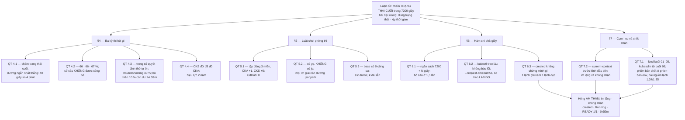
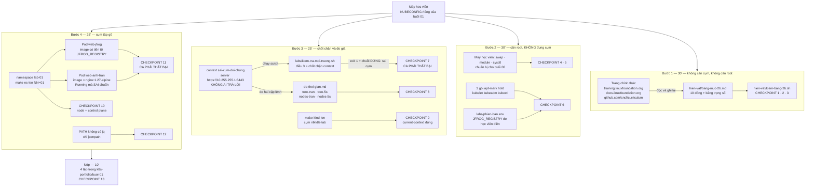


# [BÀI 01] TỔNG QUAN 3 KỲ THI CNCF (CKA/CKAD/CKS), MÔI TRƯỜNG LÀM BÀI & CHIẾN THUẬT TỐI ƯU THỜI GIAN

Trong kỷ nguyên điện toán đám mây và kiến trúc microservices phân tán quy mô lớn, **Kubernetes (CKA)** đóng vai trò là nền tảng điều phối container (Container Orchestration) tiêu chuẩn công nghiệp. Để làm chủ hệ thống trong môi trường sản xuất (Production) cũng như chinh phục kỳ thi chứng chỉ quốc tế của Linux Foundation / CNCF, kỹ sư không chỉ nắm vững các câu lệnh thao tác cơ bản mà phải thấu hiểu sâu sắc bản chất cơ chế tầng thấp: từ chu trình điều hòa (Reconciliation Loop), cấu trúc điều phối tài nguyên, kiến trúc mạng CNI, lưu trữ CSI cho đến các chuẩn mực an ninh phòng thủ chiều sâu.

Bài viết chuyên sâu này sẽ đồng hành cùng bạn giải mã toàn diện bức tranh kiến trúc, phân tích các đánh đổi kỹ thuật thực chiến (Engineering Trade-offs), cung cấp bài thực hành Lab từng bước và bộ câu hỏi phỏng vấn chuẩn Architect / Lead Engineer.

---

## 1. Bản Chất Kiến Trúc & Cơ Chế Vận Hành Tầng Thấp

> Mọi con số về ba kỳ thi trong tệp này lấy từ bảng **Mục 2b** và ba bảng **Mục 2c** của
> `ntkk8s/THEO-DOI-TIEN-DO.md`, kiểm ngày **2026-08-18** trên trang chính thức của Linux Foundation
> và kho `github.com/cncf/curriculum`. Phiên bản cụm lấy từ `ntkk8s/labs/phien-ban.env`
> (`K8S_VER`, `K8S_VER_TRUOC`, `LAB_CONTEXT`) — tệp buổi **không** ghi cứng số phiên bản.
> Mọi lệnh trong tệp này dán vào chạy được trên cụm `kind` **ba node** của buổi —
> 1 control-plane + 2 worker, theo `ntkk8s/labs/kind-cluster.yaml`.

---


Đây là buổi mở đầu cả khoá nên không có buổi trước để ôn. Thay vào đó, giảng viên hỏi năm câu dưới đây và gọi ngẫu nhiên. Năm câu này **chấm để phân nhóm, không chấm để lấy điểm**: chúng đo học viên đang ở đâu so với năm mảnh nền mà toàn bộ 72 buổi dựng lên. Học viên trả lời được **câu 2 và câu 5** thì bỏ qua được bước 2 của lab hôm nay và dùng thời gian dư cho bài tập mở rộng BT5, BT6.

| # | Câu hỏi | Đáp án vắn tắt — phải có một con số hoặc một tên lệnh | Nó dẫn vào đâu |
|---|---|---|---|
| 1 | Học viên đã từng gõ `kubectl` vào cụm nào, và làm sao biết **chắc** mình đang gõ vào cụm nào | Bằng đúng một lệnh: `kubectl config current-context`. Không có cách nào khác nhanh hơn, và không có thông báo nào tự nói ra điều đó | §7, `QT 7.2` |
| 2 | Một Pod ở trạng thái `Running` thì chứng minh được điều gì, và **không** chứng minh được điều gì | Chứng minh kubelet đã khởi động xong container. **Không chứng minh cấu hình đúng** — muốn biết trường đề yêu cầu có đúng thì phải đọc bằng `kubectl get -o jsonpath` | §6, `QT 6.3` |
| 3 | Ba kỳ thi CKA, CKAD, CKS — kỳ nào đòi phải đỗ kỳ nào trước, và chứng chỉ sống bao lâu | CKS đòi đã thi và đỗ **CKA** trước. Cả ba chứng chỉ hiệu lực **2 năm** | §4, `QT 4.4` |
| 4 | Đề thi 120 phút mà có `N` câu thì ngân sách trung bình mỗi câu là bao nhiêu | Phép chia `120 ÷ N` phút, đổi ra giây là `7200 ÷ N` giây. Với `N = 15` ra **480 giây** | §6, `QT 6.1` |
| 5 | `kubectl get pods` treo vì cụm không với tới được — cắt nó bằng cờ nào | Cờ `--request-timeout=5s`. `kubectl` trần **không** có timeout hữu ích | §6, `QT 6.2` |

**Cách chấm ở lớp.** Mỗi câu 1 điểm, không có điểm nửa. Trả lời câu 3 mà không nêu được con số **2 năm** thì không tính điểm câu đó — buổi này tồn tại phần lớn là để những con số như vậy không bị nhớ mờ.


**Luận đề trung tâm.**

> **Ba kỳ thi này không hỏi "học viên có biết Kubernetes không". Chúng hỏi: trong 120 phút, học viên đưa
> được cụm về đúng trạng thái yêu cầu bao nhiêu lần. Điểm chấm là TRẠNG THÁI CUỐI của cụm, không phải quá
> trình đi tới đó — nên mọi thứ trong 72 buổi tới đều quy về hai đại lượng: đúng trạng thái, và kịp thời gian.**

Buổi 01 không dạy một cơ chế nào của Kubernetes, và đó là chủ ý. Nó chốt **hàm mục tiêu** của cả khoá. Người học Kubernetes bằng cách đọc tài liệu theo thứ tự tài liệu sẽ biết rất nhiều thứ và vẫn trượt, vì hàm chấm không cho điểm cho việc biết. Đặt hàm mục tiêu ở buổi đầu làm cho 71 buổi sau có tiêu chí để cắt: **nội dung nào không đổi ra trạng thái cụm hoặc không đổi ra giây thì không vào bài.**

**Bốn thứ buổi này chốt, và buổi nào dùng lại.** Buổi 01 không có buổi trước nên không có bảng "kết quả buổi trước được dùng lại". Bảng dưới đây chạy chiều ngược: cái buổi này chốt, và chỗ nó được dùng lại.

| Kết quả buổi 01 chốt | Số hiệu | Buổi dùng lại |
|---|---|---|
| Bảng mười dòng về ba kỳ thi, có nguồn và ngày kiểm | `QT 4.2` · `QT 4.3` · `QT 4.4` | 66 · 67 · 68 (ba buổi tổng ôn tốc độ) — dùng để tính ngân sách giây cho đề thi thử |
| Danh sách tên miền tài liệu được mở và cách tra trong tập đóng đó | `QT 5.1` | mọi buổi có khối `04-o-thi.md`; buổi 04 luyện tốc độ tra |
| Ràng buộc "lời giải phải có một đường không cần `jq`" | `QT 5.2` | mọi buổi có khối `04-o-thi.md`; buổi 04 dựng bộ jsonpath |
| Chốt chặn `current-context` trước mọi lệnh, và tệp `labs/phien-ban.env` là nơi chốt phiên bản | `QT 7.1` · `QT 7.2` | mọi buổi có lab — `§L1` của cả 71 buổi sau bắt đầu bằng phép kiểm này |

**Nguyên lý xuất hiện lần thứ mấy.** Bộ giáo án này đếm số lần một nguyên lý quay lại, vì lần thứ nhất là thông tin còn lần thứ năm là bản năng.

| Nguyên lý | Lần thứ | Các lần trước ở buổi nào |
|---|---|---|
| Hỏng **âm thầm** đắt hơn hỏng ồn ào | **1** | — (buổi này mở đầu; nguyên lý này trở lại ở buổi 06, 17, 20, 22, 23, 49) |
| Trạng thái cuối là thứ duy nhất được chấm, không phải quá trình | **1** | — (trở lại ở buổi 03 dưới dạng `spec` so `status`, và ở mọi khối ô thi) |
| Con số nào cũng phải có nguồn hoặc phải đo | **1** | — (trở lại ở buổi 04, 18, 19, 23 dưới dạng bảng đo) |

**Về bài tập về nhà.** Buổi này không nhận BTVN từ buổi trước. Ba câu BTVN 4 của chính nó dẫn vào buổi 02.

**Bốn câu hỏi trung tâm của buổi** — sau 60 phút học viên trả lời được, trước 60 phút thì không:

1. Ba kỳ thi khác nhau ở điểm đạt, ở miền, ở điều kiện tiên quyết như thế nào — và con số nào trong ba con số điểm đạt **không giống hai con số kia**?
2. Trong phòng thi, học viên được mở đúng những tên miền nào, và công cụ nào **có sẵn** còn công cụ nào **không** — kể cả một công cụ mà hầu hết người luyện thi đều tưởng là có?
3. Một câu hỏi thi nên được cấp bao nhiêu giây, con số đó tính ra từ đâu ở **phút đầu tiên** của kỳ thi, và khi nào thì bỏ câu là quyết định đúng?
4. Vì sao dòng chữ `pod/web created` **không** chứng minh gì, và phải gõ thêm cái gì để chứng minh?

---


| # | Làm được gì | Hiện vật chứng minh |
|---|---|---|
| LĐ1 | Đọc trang chính thức của ba chứng chỉ và tự điền lại bảng mười dòng về luật thi, mỗi dòng có URL nguồn và ngày kiểm | `k8s-portfolio/buoi-01/bang-muc-2b.md`, lab bước 1, checkpoint 1 |
| LĐ2 | Chép lại ba bảng trọng số miền và tự kiểm cả ba cộng đúng 100 % bằng một script mình viết | `kiem-bang-2b.sh`, lab bước 1, checkpoint 2 |
| LĐ3 | Nêu được chỗ hai nguồn chính thức đang lệch nhau về phiên bản CKS và cách xử lý đã chốt | Dòng CKS trong `bang-muc-2b.md` có cả `1.34` và `1.35`, checkpoint 3 |
| LĐ4 | Tính ngân sách giây cho một đề `N` câu ngay tại chỗ, và nói được ngưỡng bỏ câu của mình | `04-o-thi.md` §T1, và vấn đáp câu 7 |
| LĐ5 | Giải một truy vấn trạng thái cụm bằng `-o jsonpath` hoặc `-o custom-columns`, **không** dùng `jq` | Lab bước 4, checkpoint 12 — chạy với `PATH` đã bỏ `jq` |
| LĐ6 | Dựng cụm tập gõ `kind` **ba node** — 1 control-plane + 2 worker theo `labs/kind-cluster.yaml` — ghim phiên bản từ `labs/phien-ban.env`, và khẳng định node `Ready` bằng `jsonpath` | Lab bước 2 và bước 4, checkpoint 6 và 10 |
| LĐ7 | Chứng minh chốt chặn context có thật, bằng cách **cố ý đặt sai** rồi thấy script dừng hẳn | Lab bước 3, checkpoint 7 — script thoát mã khác 0, in `DỪNG: sai cụm` |
| LĐ8 | Đo trên máy của chính mình cái giá của việc trỏ `kubectl` vào cụm không với tới được | `do-thoi-gian.md`, lab bước 3, checkpoint 8 |

---


| Cần biết | Mức yêu cầu | Nguồn tự học nếu thiếu |
|---|---|---|
| Gõ được lệnh trong shell Linux, hiểu `$?`, biết chuyển hướng `>` | Vận dụng | Bất kỳ tài liệu shell cơ bản; buổi này chỉ cần đọc mã thoát và ghi tệp |
| Biết `ssh` sang một máy khác và nhận ra mình đang ở máy nào | Vận dụng | §5, `QT 5.3` — trong phòng thi đây là bước đầu tiên của **mỗi** câu |
| Đã cài `kubectl` hoặc biết cài, và biết `kubectl` đọc cấu hình từ đâu | Nhớ | §0.1 câu 1; §7, `QT 7.2` |
| Đọc được YAML: thụt lề, danh sách, ánh xạ | Vận dụng | YAML chỉ có ba cấu trúc; học 15 phút là đủ cho cả khoá |
| Biết Docker hoặc một runtime container ở mức `docker run` | Nhớ | Cần để `kind` dựng được cụm trong container; buổi 07 mới dạy runtime |
| Hiểu "ảnh container" gồm host registry, đường dẫn kho, và thẻ | Nhớ | §3.1 dòng 14; đường ảnh JFrog dùng ở lab bước 4 |
| Máy học viên có đủ 32 GB RAM / 8 vCPU / 200 GB SSD như quy ước môi trường | Bắt buộc từ buổi 06 | Buổi này `kind` ba node là ba container trên **một** máy nên chạy được trên máy nhỏ hơn; cụm `kubeadm` ba node của buổi 06 thì không |
| Chưa cần biết một cơ chế nào của Kubernetes | — | Buổi 02 mới bắt đầu: kiến trúc cụm và đường đi của một lệnh `kubectl` |

---


### 3.1. Bảng đối chiếu thuật ngữ

Quy ước của khoá: **tên trường API và tên đối tượng dùng thẳng tiếng Anh** — học viên gõ đúng chữ đó và đề thi viết đúng chữ đó. Tên miền curriculum cũng giữ nguyên văn tiếng Anh, vì trang chính thức viết vậy và học viên phải tìm lại được đúng chuỗi đó. Khái niệm thì dùng tiếng Việt, tiếng Anh để bên cạnh vì phỏng vấn bằng tiếng Anh.

Mười sáu dòng đầu là thuật ngữ chốt của buổi; bốn dòng cuối là thuật ngữ phụ về môi trường thi, thêm vào để không có chữ nào xuất hiện từ §4 trở đi mà chưa có trong bảng này.

| # | Tiếng Việt dùng trong bài | Tiếng Anh | Ghi chú dùng trong thân bài |
|---|---|---|---|
| 1 | thi thực hành trên dòng lệnh | performance-based exam | dùng cụm tiếng Việt; nhắc tiếng Anh một lần ở §4 |
| 2 | điểm đạt | passing score | luôn đi kèm con số phần trăm **và** tên chứng chỉ — ba kỳ không cùng một số |
| 3 | miền curriculum | curriculum domain | thân bài giữ **nguyên văn tiếng Anh** tên miền (`Troubleshooting`, `Cluster Setup`…) |
| 4 | trọng số | weight | luôn ghi `%`; nguồn duy nhất là ba bảng Mục 2c |
| 5 | ngữ cảnh | context | tên trường dùng thẳng tiếng Anh: `current-context`, `contexts` |
| 6 | tệp cấu hình truy cập cụm | kubeconfig | dùng thẳng `kubeconfig`, không dịch |
| 7 | máy nền | base host | nguyên văn `base` khi nói tên máy trong phòng thi |
| 8 | máy làm bài được chỉ định | designated SSH host | mỗi câu thi chỉ định máy của nó |
| 9 | trạng thái cuối | final state | thuật ngữ trung tâm của buổi — đây là thứ duy nhất được chấm |
| 10 | ngân sách giây | second budget | thuật ngữ **riêng của bộ giáo án này**, không phải thuật ngữ chính thức |
| 11 | tập đóng tài liệu | closed set of allowed docs | nhấn rằng danh sách là hữu hạn và đếm được |
| 12 | chốt chặn | guard / preflight check | phép kiểm chạy **trước** việc chính, và dừng hẳn khi không thoả |
| 13 | hỏng âm thầm | silent failure | luôn nêu kèm hai thuộc tính: im lặng hay ồn ào · có chặn hay không chặn |
| 14 | ảnh container | container image | trường API dùng thẳng `image`; đường đầy đủ có host registry, kho, thẻ |
| 15 | cụm tập gõ | scratch cluster | thuật ngữ **riêng của bộ này** cho cụm `kind` buổi 01–05 |
| 16 | trần điểm | score ceiling | điểm cao nhất còn có thể đạt sau khi đã mất chắc chắn một phần — dùng ở `QT 4.3` |
| 17 | bộ mô phỏng luyện thi | exam simulator | sản phẩm luyện tập kèm theo lần mua; **không** phải đề thi, và số câu của nó không phải số của đề thi |
| 18 | panel đề bài | task panel | khung bên trái màn hình thi, liệt kê các câu; nơi đọc ra số câu ở phút đầu |
| 19 | máy trạm thi | exam workstation | Linux Desktop trong trình duyệt an toàn, khác với các máy SSH làm bài |
| 20 | ca đối chứng phải thất bại | negative control | phép thử mà **kết quả đúng là thất bại**; thiếu nó thì chưa chứng minh được gì |


Bốn mô hình dưới đây, mỗi cái một câu học viên nhớ được. Chúng quay lại ở mọi buổi còn lại của khoá.

**Mô hình 1 — Hàm chấm không đọc lời giải, nó đọc cụm.**

Người chấm là một đoạn mã chạy **sau khi hết giờ**, đọc trạng thái cụm qua API server. Nó không thấy học viên đã nghĩ gì, không thấy YAML viết đẹp, không thấy dòng chú thích giải thích ý tưởng. Giá trị thực dụng: mọi tranh luận kiểu "cách nào chuẩn hơn" biến thành một câu hỏi đo được — **cách nào để lại đúng trạng thái đó trong ít giây hơn**. Mô hình này là nguồn của `QT 4.1` và của toàn bộ khối `04-o-thi.md` trong 72 buổi.

**Mô hình 2 — Ngân sách giây.**

Mỗi câu là một khoản chi tính bằng giây. Tổng thu là hằng số **7200 giây**. Chi quá **1,5 lần** ngân sách của một câu mà chưa xong thì khoản đó đang lấy tiền của câu khác — và câu chưa được chạm tới có xác suất ăn điểm cao hơn câu đã sa lầy. Giá trị thực dụng: quyết định bỏ câu trở thành một phép so sánh hai số, không còn là một cuộc đấu tranh nội tâm giữa lúc đồng hồ chạy. Đây là nguồn của `QT 6.1`.

**Mô hình 3 — Tài liệu là một tập đóng, không phải Internet.**

Trong lúc thi, cửa sổ trình duyệt chỉ vào được vài tên miền đếm được trên đầu ngón tay. Học tra cứu nhanh gấp đôi **trong tập đóng đó** thì đó là điểm; học tra Google nhanh gấp đôi thì đó là con số không, và trong phòng thi thật thì đó là vi phạm. Giá trị thực dụng: buổi 04 luyện tốc độ tra chỉ trên đúng những tên miền đó, cộng `kubectl explain` ngay trong terminal. Đây là nguồn của `QT 5.1`.

**Mô hình 4 — Mỗi lệnh ghi phải có một lệnh đọc đi kèm.**

`kubectl apply` in ra `created` chỉ nói API server đã nhận và lưu. Trường mà đề yêu cầu có đúng hay không thì phải **đọc ra** mới biết. Giá trị thực dụng: thêm một lệnh `-o jsonpath` tốn khoảng **5–10 giây**, còn bỏ nó thì rủi ro là **toàn bộ điểm** của câu. Đây là nguồn của `QT 6.3`, và là lý do mọi checkpoint trong 72 bài lab đều là một lệnh đọc, không phải một cái nhìn.

---

### 1.1. Ba kỳ thi hỏi gì, và cái chúng không hỏi (10 phút)

Trước khi vào bốn quy tắc, một dòng về **điều khoản thương mại**: kiểm ngày 2026-08-18 thì mỗi lần mua gồm **hai lượt thi, tức một lần thi lại**, kèm hai lượt dùng bộ mô phỏng luyện thi, mỗi lượt truy cập 36 giờ. Con số này đổi **thường xuyên hơn** chín dòng còn lại của bảng Mục 2b vì nó là chính sách bán hàng, không phải thiết kế đề thi — học viên **tự kiểm lại lúc mua**.

**Nguyên lý cốt lõi:** Cả ba kỳ thi chấm **trạng thái cuối của cụm sau khi hết giờ**, không chấm quá trình đi tới đó — nên đường gõ nào để lại đúng trạng thái đó đều được điểm như nhau, và đường ngắn nhất luôn thắng.

**Giải thích cơ chế ngầm:** Ba kỳ thi này là thi thực hành trên dòng lệnh — nguyên văn trang chứng chỉ: "online, proctored, performance-based test that requires solving multiple tasks from a command line running Kubernetes". Bài được chấm **tự động sau khi hết giờ** — nguyên văn trang FAQ: "Upon completion, exams are scored automatically". Ghép hai câu đó lại thì ra cơ chế: đoạn mã chấm chạy khi phiên thi đã đóng, và nó chỉ đọc được thứ nó **truy vấn được từ API server**. Nó không có bản ghi thao tác của học viên, không có lịch sử shell, không có tệp YAML học viên đã soạn rồi xoá. Thứ duy nhất còn lại lúc nó chạy là các đối tượng trong etcd. Hệ quả trực tiếp: hai học viên tạo cùng một Pod, một người bằng một lệnh `kubectl run`, một người bằng 18 dòng YAML soạn tay, nhận **cùng một số điểm** — nhưng người thứ hai đã trả nhiều hơn khoảng năm phút cho cùng số điểm đó.

> [!WARNING]
> **CẠM BẪY THỰC CHIẾN:**
> Trên đồng hồ: một câu mà lời giải chuẩn tốn **40 giây** ngốn hết **4 phút**, tức **gấp 6 lần** (240 ÷ 40 = 6). Trong lúc luyện, đo bằng cách bấm giờ từng câu rồi so với cột "giây ước lượng" của mục T3 trong `04-o-thi.md`; câu nào lệch quá gấp đôi là câu đang đi đường dài. Dấu hiệu thứ hai, nặng hơn: gõ xong **không đọc lại**, nên trường đề yêu cầu bị thiếu mà không có gì báo — cụ thể `kubectl get pod web -n lab-01 -o jsonpath='{.metadata.labels.tier}'` in ra **chuỗi rỗng** trong khi đề đòi `tier=fe`.

**Minh hoạ.**

Yêu cầu: *Pod tên `web`, ảnh `nginx`, namespace `lab-01`, nhãn `tier=fe`.*

```bash
# SAI — mở trình soạn thảo, gõ 18 dòng, lưu, apply. Cùng kết quả, gấp 6 lần thời gian.
vim /tmp/pod.yaml
kubectl apply -f /tmp/pod.yaml
```

```yaml
# SAI (nội dung /tmp/pod.yaml) — đúng nhưng không đáng, vì hàm chấm không cộng điểm cho YAML
apiVersion: v1
kind: Pod
metadata:
  name: web
  namespace: lab-01
  labels:
    tier: fe
spec:
  containers:
    - name: web
      image: ${JFROG_REGISTRY}/docker-remote/nginx:1.27-alpine
```

```bash
# ĐÚNG — một lệnh ghi, một lệnh đọc. Khoảng 45 giây kể cả đọc đề.
source ntkk8s/labs/phien-ban.env
kubectl run web -n lab-01 --image="${JFROG_REGISTRY}/docker-remote/nginx:1.27-alpine" --labels=tier=fe
kubectl get pod web -n lab-01 -o jsonpath='{.metadata.labels.tier}{"\n"}'   # phải in: fe
```

Kết luận thi hành: **`kubectl run` và `kubectl create ... --dry-run=client -o yaml` là đường mặc định**; soạn YAML tay chỉ khi đề đòi một trường mà cờ dòng lệnh không có. Buổi 04 dựng bộ lệnh rút gọn cho việc này.

**Nguyên lý cốt lõi:** Ba kỳ thi **không** cùng điểm đạt — CKA **66 %**, CKAD **66 %**, CKS **67 %** — và **không** trang chính thức nào công bố số câu cố định, nên mọi kế hoạch làm bài dựa trên một số câu định trước đều là kế hoạch dựa trên tin nghe lại.

**Giải thích cơ chế ngầm:** Ngưỡng đạt lấy nguyên văn từ trang FAQ của Linux Foundation: "a score of 66% or above must be earned to pass" cho CKA và CKAD, và "a score of 67% or above must be earned to pass" cho CKS. Ba con số này gần nhau đến mức bộ nhớ tự gộp lại thành một — và chỗ chúng khác nhau lại nằm đúng ở kỳ khó nhất. Còn **số câu** thì không có ở bất cứ trang nào của Linux Foundation. Con số học viên hay nghe là mô tả **bộ mô phỏng luyện thi**, không phải đề thi. Cơ chế của sai lầm này rất đơn giản: người thi trước kể lại một con số, con số đó đúng cho lần thi của người đó, rồi nó được truyền đi như thể là hằng số của kỳ thi. Vì đề thi được sinh từ một kho câu hỏi, số câu là **biến chỉ đọc được khi mở panel đề bài**.

> [!WARNING]
> **CẠM BẪY THỰC CHIẾN:**
> Học viên vào phòng thi đã tự tính sẵn "mỗi câu 7 phút", mở panel đề bài thấy số câu khác, rồi mất **2 phút đầu** để tính lại trong lúc đồng hồ đã chạy — 2 phút đó là **120 giây**, tức khoảng một phần tư ngân sách của một câu. Dấu hiệu thứ hai, muộn hơn và đau hơn: học viên CKS ôn theo ngưỡng 66 %, được **66 %**, và **trượt** vì thiếu đúng **1** điểm. Dấu hiệu đo được trong lúc luyện: hỏi học viên ba con số điểm đạt, ai đọc ra một con số duy nhất cho cả ba là chưa đọc nguồn.

**Minh hoạ.**

| Chứng chỉ | Điểm đạt | Sai được tối đa, tính trên 100 điểm |
|---|---|---|
| CKA | **66 %** | **34** |
| CKAD | **66 %** | **34** |
| CKS | **67 %** | **33** |

```bash
# ĐÚNG — dán bảng này vào hiện vật kèm URL nguồn và ngày kiểm, rồi tự kiểm số học
cat <<'TXT' >> k8s-portfolio/buoi-01/bang-muc-2b.md
| Điểm đạt CKA · CKAD · CKS | 66 % · 66 % · 67 % | docs.linuxfoundation.org/tc-docs/certification/faq-cka-ckad-cks | 2026-08-18 |
TXT
awk 'BEGIN{print "sai duoc toi da:", 100-66, 100-66, 100-67}'
# in ra: sai duoc toi da: 34 34 33
```

```text
SAI  — "điểm đạt là 66 % cho cả ba kỳ" và "đề có 17 câu nên mỗi câu 7 phút"
ĐÚNG — "66 · 66 · 67", và "số câu đọc trên panel đề bài ở phút đầu tiên rồi chia 7200 giây"
```

**Nguyên lý cốt lõi:** Trọng số miền là số của CNCF và nó quyết định **thứ tự ôn**, không phải sở thích: `Troubleshooting` của CKA nặng **30 %** — miền lớn nhất trong cả ba kỳ thi — còn bỏ trọn một miền **10 %** là tự đặt trần điểm ở **90**, tức chỉ còn dư **24 điểm** trước ngưỡng đạt của CKA.

**Giải thích cơ chế ngầm:** Bài chấm cộng điểm **theo câu**, và câu phân bố theo miền theo đúng trọng số công bố. Nên một miền không phải một chủ đề để đọc cho biết, nó là một khoản điểm có kích thước biết trước. Ở đây phải nói rõ một chỗ dễ lẫn đại lượng: ngưỡng đạt công bố dưới dạng **phần trăm**, nhưng vì thang là 100 nên trong mọi phép tính của khoá ta dùng nó như **66 điểm trên 100** — phép trừ dưới đây là `điểm − điểm = điểm`, không phải phần trăm trừ phần trăm. Bỏ trọn miền `Storage` **10 %** của CKA thì mất **10 điểm** chắc chắn, trần điểm còn **90**, và dư địa trước ngưỡng đạt còn `100 − 10 − 66 = 24` điểm — tức chỉ được sai thêm gần một phần tư bài, trong khi những câu còn lại toàn là câu chưa biết dễ hay khó. Với CKS ngưỡng **67** thì dư địa còn `100 − 10 − 67 = 23` điểm. Chiều ngược lại cũng đáng nói: `Troubleshooting` **30 %** nghĩa là gần một phần ba số điểm của CKA **không** nằm ở chỗ dựng mới mà ở chỗ **sửa cái đang hỏng** — đó là lý do lộ trình 72 buổi đặt một buổi chẩn đoán ở cuối mỗi nhóm chủ đề, chứ không dồn troubleshooting vào một tuần cuối.

> [!WARNING]
> **CẠM BẪY THỰC CHIẾN:**
> Học viên xếp `Storage` của CKA vào cuối lịch ôn, hết thời gian, vào thi gặp hai câu Storage và bỏ cả hai. Dấu hiệu đo được, thấy trước khi thi: bảng tự chấm của một đề thi thử có **đúng một miền toàn 0 điểm**. Lệnh để thấy dấu hiệu này là chính bảng tự chấm ở mục T5 của `04-o-thi.md` — cột "miền" phải có ít nhất một điểm khác 0 ở mọi dòng; dòng nào tổng bằng 0 thì miền đó đang bị bỏ, không phải đang khó.

**Minh hoạ.**

CKA — nền Kubernetes v1.35, điểm đạt 66 %, 120 phút:

| Miền | Trọng số |
|---|---|
| `Troubleshooting` | 30 % |
| `Cluster Architecture, Installation & Configuration` | 25 % |
| `Services & Networking` | 20 % |
| `Workloads & Scheduling` | 15 % |
| `Storage` | 10 % |
| **Tổng** | **100 %** |

CKAD — nền Kubernetes v1.35, điểm đạt 66 %, 120 phút:

| Miền | Trọng số |
|---|---|
| `Application Environment, Configuration and Security` | 25 % |
| `Application Design and Build` | 20 % |
| `Application Deployment` | 20 % |
| `Services and Networking` | 20 % |
| `Application Observability and Maintenance` | 15 % |
| **Tổng** | **100 %** |

CKS — trang chứng chỉ nói v1.35, curriculum PDF còn v1.34, điểm đạt 67 %, 120 phút:

| Miền | Trọng số |
|---|---|
| `Minimize Microservice Vulnerabilities` | 20 % |
| `Supply Chain Security` | 20 % |
| `Monitoring, Logging and Runtime Security` | 20 % |
| `Cluster Setup` | 15 % |
| `Cluster Hardening` | 15 % |
| `System Hardening` | 10 % |
| **Tổng** | **100 %** |

```bash
# SAI — nhìn mắt rồi tin là cộng đủ 100 %
# ĐÚNG — cộng bằng máy; bảng nào không ra 100 là bảng chép thiếu một dòng
printf '30\n25\n20\n15\n10\n' | awk '{s+=$1} END{print "CKA :", s}'
printf '25\n20\n20\n20\n15\n' | awk '{s+=$1} END{print "CKAD:", s}'
printf '20\n20\n20\n15\n15\n10\n' | awk '{s+=$1} END{print "CKS :", s}'
# ba dòng phải in đúng 100
```

Đọc ra ba điều từ ba bảng trên, và cả khoá dựa vào chúng: CKA nặng nhất ở `Troubleshooting` **30 %**; CKAD nặng nhất ở `Application Environment, Configuration and Security` **25 %**, tức cấu hình và bảo mật ứng dụng chứ không phải viết YAML `Deployment`; CKS **chia phẳng hơn hẳn** hai kỳ kia — ba miền 20 %, hai miền 15 %, một miền 10 % — nên với CKS không có miền nào bỏ được.

**Nguyên lý cốt lõi:** Thứ tự ba chứng chỉ của khoá là ràng buộc **của luật thi**, không phải lựa chọn sư phạm: CKS đòi đã thi và đỗ CKA trước, và cả ba chứng chỉ hiệu lực **2 năm** — nên lịch thi phải đặt sao cho CKA còn hiệu lực lúc đặt lịch CKS.

**Giải thích cơ chế ngầm:** Nguyên văn trang CKS: "CKS candidates must have taken and passed the Certified Kubernetes Administrator (CKA) exam prior to attempting the CKS exam." Đây là phép kiểm **ở tầng hệ thống đặt lịch**, không phải một lời khuyên trong tài liệu ôn — nó chặn ở bước đăng ký, trước khi học viên vào phòng thi. Ghép với hiệu lực **2 năm**, hai điều kiện này biến thứ tự CKA → CKAD → CKS từ gợi ý thành ràng buộc cứng, và thêm một ràng buộc thứ hai về **thời điểm**: đỗ CKA rồi để quá 2 năm thì lúc đặt lịch CKS không còn CKA còn hiệu lực nữa. Lộ trình 72 buổi vì thế xếp CKA trước không phải vì CKA dễ hơn, mà vì không xếp cách khác được.

> [!WARNING]
> **CẠM BẪY THỰC CHIẾN:**
> Học viên đặt lịch CKS trước và bị từ chối ngay ở bước đăng ký, mất chỗ trong tuần đã xin nghỉ — thiệt hại là một tuần nghỉ phép, không phải một lượt thi. Dấu hiệu thứ hai, muộn hơn: đỗ CKA năm đầu, học CKAD và CKS chậm, tới lúc đặt lịch CKS thì CKA đã quá **2 năm** và phải thi lại CKA trước. Cách phát hiện sớm: mở trang tài khoản chứng chỉ, đọc ngày hết hiệu lực của CKA, so với ngày dự định thi CKS — khoảng cách phải còn dương.

**Minh hoạ.**

| Mốc của khoá | Sau buổi | Khoảng cách tính từ CKA |
|---|---|---|
| Đặt lịch và thi **CKA** | **30** | 0 |
| Đặt lịch và thi **CKAD** | **45** | khoảng 2 tháng |
| Đặt lịch và thi **CKS** | **65** | khoảng **4 tháng** |

```text
SAI  — đăng ký CKS ở tháng thứ nhất "để lấy động lực", bị từ chối ở bước đặt lịch
ĐÚNG — cả khoá 6 tháng; CKA sau buổi 30, CKS sau buổi 65, cách nhau khoảng 4 tháng,
       nên lúc đặt lịch CKS thì CKA còn dư khoảng 20 tháng hiệu lực (24 − 4 = 20)
```

Mốc buổi 30 · 45 · 65 lấy từ `00-tong-quan/00-lo-trinh-72-buoi.md`. Học viên đi chậm hơn lộ trình thì con số phải kiểm lại là **hiệu lực còn dư**, không phải số buổi đã học.

---

### 1.2. Luật chơi trong phòng thi (8 phút)

Ba quy tắc của mục này đều thuộc loại (a) — chép từ trang chính thức. Chúng có một tính chất chung: **không suy ra được**. Không ai đoán ra rằng máy `base` không có `kubectl`, và không ai đoán ra rằng `jq` không nằm trong danh sách công bố. Đây là mục duy nhất trong 72 buổi mà việc học đúng nghĩa là **đọc và ghi nhớ có nguồn**.

**Nguyên lý cốt lõi:** Tài liệu trong lúc thi là một **tập đóng vài tên miền**, không phải Internet: cả ba kỳ thi được `kubernetes.io/docs/`, `kubernetes.io/blog/`, `helm.sh/docs/`; **CKA thêm** `gateway-api.sigs.k8s.io/`; **CKS thêm sáu miền nữa**; ô tìm kiếm của `kubernetes.io/docs/` được dùng nhưng **không được mở kết quả trỏ ra ngoài**.

**Giải thích cơ chế ngầm:** Danh sách nằm ở trang Resources Allowed của Linux Foundation, và nguyên văn về ô tìm kiếm là: "Using the search function on https://kubernetes.io/docs/ is allowed, but you must not open external search results." Cơ chế thi hành là trình duyệt trong môi trường thi chỉ mở được các miền trong danh sách, cộng với người giám thị theo dõi màn hình — nên đây là chặn ở **tầng luật thi và tầng trình duyệt của môi trường thi**, không phải ở tầng cụm Kubernetes. Điểm quan trọng hơn cả danh sách: **GitHub không có trong đó**. Điều này giết một thói quen rất phổ biến — tra ví dụ YAML bằng cách mở một kho GitHub nào đó. Thói quen ấy hoạt động rất tốt suốt thời gian luyện và **hoàn toàn không hoạt động** trong 120 phút quan trọng nhất. Vì thế đường tra nhanh nhất trong phòng thi thường **không** phải trình duyệt mà là `kubectl explain` ngay trong terminal: nó không tính vào tài liệu ngoài, không mất thời gian tải trang, và nó đọc đúng schema của phiên bản đang chạy.

> [!WARNING]
> **CẠM BẪY THỰC CHIẾN:**
> Trong lúc luyện, học viên tra một trường API bằng cách gõ vào Google rồi mở một kết quả Stack Overflow. Dấu hiệu đo được: **đếm số lần trong một buổi luyện mà học viên mở tab ngoài tập đóng** — con số này phải về **0** trước kỳ thi. Cách đếm rẻ nhất là mở lịch sử trình duyệt sau buổi luyện và lọc theo tên miền; số dòng không thuộc tập đóng của kỳ thi mình đang luyện — 3 tên miền với CKAD, 4 với CKA, 9 với CKS — chính là con số đó. Trong phòng thi thật, thao tác đó **là vi phạm**, không chỉ là chậm — hậu quả không phải mất giây mà là mất bài.

**Minh hoạ.**

Cùng một việc: tra tên đầy đủ của trường `securityContext.readOnlyRootFilesystem`.

```bash
# SAI — mở Google, gõ "kubernetes readonly root filesystem yaml", mở kết quả đầu tiên.
#       Trong phòng thi: không mở được, và nếu mở được thì là vi phạm.
```

```bash
# ĐÚNG — đường thứ nhất, ngay trong terminal, không cần trình duyệt
kubectl explain pod.spec.containers.securityContext --recursive | grep -i readonly
# in ra dòng có readOnlyRootFilesystem <boolean>

# ĐÚNG — đường dự phòng, dùng ô tìm kiếm của chính trang tài liệu, không mở kết quả ngoài
# https://kubernetes.io/docs/  →  ô Search  →  "readOnlyRootFilesystem"
```

| Kỳ thi | Số tên miền được mở | Gồm những gì |
|---|---|---|
| Cả ba | **3** | `kubernetes.io/docs/` · `kubernetes.io/blog/` · `helm.sh/docs/`, cộng bản dịch của tài liệu `kubernetes.io` |
| CKA thêm | **+1** | `gateway-api.sigs.k8s.io/` |
| CKS thêm | **+6** | `falco.org/docs/` · `etcd.io/docs/` · `kubernetes-sigs.github.io/bom/cli-reference/` · `kubernetes.github.io/ingress-nginx/user-guide/nginx-configuration/` · `docs.cilium.io/en/stable` · `istio.io/latest/docs/` |
| GitHub | **0** | không nằm trong danh sách của kỳ nào |

**Nguyên lý cốt lõi:** Danh sách công cụ công bố sẵn trên máy làm bài có **`yq`** và **không** có **`jq`** — nên mọi lời giải của học viên phải có sẵn một đường **không cần `jq`**, thường là `-o jsonpath` hoặc `-o custom-columns`.

**Giải thích cơ chế ngầm:** Trang hướng dẫn CKA/CKAD và trang chỉ dẫn CKS liệt kê đúng **5** thứ có sẵn trên các máy SSH làm bài: `kubectl` kèm alias `k` và bash autocompletion, `yq`, `curl`, `wget`, `man`. `jq` **không** có trong câu đó. Cơ chế của cái bẫy: máy của học viên gần như luôn có `jq`, nên trong suốt vài trăm giờ luyện tập, đường `-o json | jq` hoạt động hoàn hảo và **không có tín hiệu nào** cho biết nó sẽ chết. Đây là hỏng âm thầm dạng ngược: nó im lặng trong lúc luyện, rồi ồn ào đúng một lần, đúng lúc đắt nhất. Kết luận thi hành của bộ giáo án, viết thành ràng buộc chứ không phải khuyến nghị: `02-lab.md` được dùng `jq` thoải mái vì cụm lab là máy của học viên; `04-o-thi.md` **bắt buộc** có một đường không `jq` cho mọi câu, ở cả 72 buổi.

> [!WARNING]
> **CẠM BẪY THỰC CHIẾN:**
> Học viên luyện cả khoá bằng `kubectl get ... -o json | jq ...`, vào phòng thi gõ `jq` và nhận `jq: command not found`, rồi mất **60–90 giây mỗi câu** để nghĩ lại cách đọc trường đó bằng công cụ khác. Dấu hiệu đo được, và đây là phép thử phải chạy ít nhất một lần mỗi tuần: chạy lại một câu đã giải với `PATH` **tạm thời không có `jq`**. Lời giải chết trong môi trường đó là lời giải chưa dùng được trong phòng thi.

**Minh hoạ.**

Yêu cầu: *in tên và `nodeName` của mọi Pod trong namespace `lab-01`.*

```bash
# SAI — chạy trên máy học viên, chết trên máy thi
kubectl get pods -n lab-01 -o json | jq -r '.items[] | "\(.metadata.name) \(.spec.nodeName)"'
```

```bash
# ĐÚNG — đường thứ nhất, ngắn nhất, một lệnh
kubectl get pods -n lab-01 -o custom-columns=TEN:.metadata.name,NODE:.spec.nodeName

# ĐÚNG — đường thứ hai, khi cần định dạng chính xác từng ký tự
kubectl get pods -n lab-01 -o jsonpath='{range .items[*]}{.metadata.name}{" "}{.spec.nodeName}{"\n"}{end}'
```

```bash
# Phép thử phải chạy hàng tuần: bỏ jq khỏi PATH rồi chạy lại lời giải của mình
PATH=$(printf '%s' "$PATH" | tr ':' '\n' | grep -v "$(dirname "$(command -v jq)")" | paste -sd:) \
  kubectl get pods -n lab-01 -o custom-columns=TEN:.metadata.name,NODE:.spec.nodeName
```

Ghi chú loại phát biểu: danh sách **5** công cụ là loại (a) — chép từ trang chính thức, Mục 2b dòng 10. Ràng buộc "mọi lời giải phải có một đường không `jq`" là loại (b) — suy ra từ danh sách đó.

**Nguyên lý cốt lõi:** Máy `base` mà học viên gặp đầu tiên **không có `kubectl`**; mọi việc phải làm trên máy SSH được chỉ định của từng câu — và trên máy đó alias `k` cùng bash autocompletion **đã có sẵn**, nên dựng lại chúng là thao tác thừa.

**Giải thích cơ chế ngầm:** Nguyên văn: "The base system (with hostname `base`) does not have any of the above tools pre-installed as all tasks on this exam must be completed on a designated SSH host." Cơ chế: môi trường thi tách **máy trạm thi** khỏi các **máy làm bài**. Máy trạm chỉ để hiển thị panel đề bài, trình duyệt tài liệu và một terminal; công cụ nằm trên các máy SSH, và **mỗi câu chỉ định máy của nó**. Nên bước đầu tiên của mỗi câu là `ssh` sang đúng máy đề bài ghi, không phải bắt đầu gõ `kubectl`. Về alias: `k` và bash autocompletion đã sẵn trên máy làm bài, nên gõ lại `alias k=kubectl` là thao tác thừa — tốn vài giây và tốn nhiều hơn thế nếu học viên còn ngồi nhớ cú pháp `complete -F __start_kubectl k`. Cái **phải** tự tạo là biến rút gọn cho chế độ chạy khan, ví dụ `export do='--dry-run=client -o yaml'`; buổi 04 dựng bộ này.

> [!WARNING]
> **CẠM BẪY THỰC CHIẾN:**
> Gõ `kubectl get nodes` trên `base` và nhận `kubectl: command not found`, rồi tưởng môi trường thi hỏng và gọi giám thị — mất vài phút cho một việc không hỏng. Dấu hiệu thứ hai, tốn hơn nhiều: làm xong một câu rồi phát hiện mình vẫn đang ở máy của **câu trước**, tức lệnh gõ đúng cú pháp nhưng vào **sai cụm**. Trường hợp này mất trọn điểm câu và **không có thông báo lỗi nào** — đối tượng vẫn được tạo, chỉ là ở cụm khác. Cách phát hiện trong 2 giây: `hostname` và `kubectl config current-context`, hai chuỗi này phải khớp với máy mà đề bài chỉ định.

**Minh hoạ.**

```bash
# SAI — bắt đầu câu bằng lệnh nghiệp vụ
kubectl -n lab-01 get pods
# trên base: kubectl: command not found
# trên máy của câu trước: chạy được, vào sai cụm, mất trọn điểm mà không có lỗi nào
```

```bash
# ĐÚNG — hai dòng mở đầu cố định cho MỌI câu, tốn khoảng 5 giây
ssh <máy đề bài chỉ định>            # ví dụ: ssh cka-node-01
kubectl config current-context       # xác nhận đang ở cụm của câu này
# chỉ sau khi hai dòng trên đúng thì mới gõ lệnh nghiệp vụ
```

```bash
# ĐÚNG — cái phải tự tạo, vì nó KHÔNG có sẵn
export do='--dry-run=client -o yaml'
kubectl create deploy web --image=nginx $do > /tmp/web.yaml
# còn `k` và autocompletion thì đã sẵn: không gõ lại alias
```

Ba con số của quy tắc này: **0** công cụ trên máy `base`; **1** dòng `ssh` mở đầu mỗi câu; **1** dòng xác nhận context sau đó.

---

### 1.3. Vì sao trượt không phải vì không biết mà vì không kịp (8 phút)

Ba quy tắc của §4 và §5 nói về **luật**. Ba quy tắc của mục này nói về **hàm chi phí**: mỗi câu tiêu giây, tổng giây là hằng số, và có hai chỗ giây bị mất mà học viên không nhìn thấy — chờ một lệnh treo, và làm lại một câu vì không biết nó đã sai.

**Nguyên lý cốt lõi:** Ngân sách giây của một câu tính ở **phút đầu tiên** của kỳ thi, bằng 120 phút chia cho số câu **đọc được trên panel đề bài**, chứ không lấy từ con số nghe lại — và câu nào chi quá **1,5 lần** ngân sách của nó mà chưa xong thì đánh dấu, bỏ qua, quay lại sau.

**Giải thích cơ chế ngầm:** Tổng thời gian là hằng số **120 phút = 7200 giây** (Mục 2b dòng 4, giống nhau cho cả ba kỳ). Số câu là **biến**, chỉ biết được khi mở đề — `QT 4.2` đã chỉ ra rằng không trang chính thức nào công bố nó. Nên ngân sách mỗi câu là một phép chia phải làm **tại chỗ**: `7200 giây ÷ N câu = giây mỗi câu`. Về ngưỡng bỏ câu, cơ chế là thế này: điểm cộng **theo câu**, nên một câu chi quá ngân sách đang lấy giây của một câu **chưa được chạm tới** — và câu chưa chạm tới có xác suất ăn điểm cao hơn câu đã sa lầy, đơn giản vì với câu đã sa lầy ta đã có bằng chứng là nó khó với ta, còn với câu chưa đọc thì chưa có bằng chứng nào. Hệ số **1,5** là **kinh nghiệm thực tế của bộ giáo án này**, không phải số chính thức: nó đủ rộng để không bỏ oan một câu chỉ chậm hơn một chút, đủ chặt để không mất hai câu vì một câu. Học viên nào đo được hệ số tốt hơn cho mình qua ba đề thi thử thì dùng số của mình.

> [!WARNING]
> **CẠM BẪY THỰC CHIẾN:**
> Hết giờ mà còn **3 câu chưa đọc** — đây là dấu hiệu rõ nhất và cũng là dấu hiệu muộn nhất. Dấu hiệu đo được, thấy được ngay trên bảng tự chấm của một đề thi thử: **có một câu 0 điểm chiếm hơn 20 % tổng thời gian**. Cách lấy con số đó: bấm giờ từng câu khi luyện, ghi vào cột "giây đã chi" của bảng tự chấm ở mục T5 trong `04-o-thi.md`, rồi chia cho tổng. Câu nào có tỉ số thời gian cao mà điểm bằng 0 là câu lẽ ra phải bỏ.

**Minh hoạ.**

| Số câu `N` đọc trên panel | Ngân sách mỗi câu | Ngưỡng bỏ câu (`× 1,5`) |
|---|---|---|
| 15 | `7200 ÷ 15` = **480 giây** | **720 giây** |
| 20 | `7200 ÷ 20` = **360 giây** | **540 giây** |
| `N` | `7200 ÷ N` giây | `1,5 × 7200 ÷ N` giây |

```bash
# ĐÚNG — làm phép chia này ở phút đầu tiên, N là số câu ĐỌC ĐƯỢC trên panel đề bài
N=15
awk -v n="$N" 'BEGIN{printf "ngan sach: %d giay/cau; nguong bo: %d giay\n", 7200/n, 1.5*7200/n}'
# in ra: ngan sach: 480 giay/cau; nguong bo: 720 giay
```

```text
SAI  — định trước ở nhà "mỗi câu 420 giây" rồi vào phòng thi giữ nguyên con số đó
ĐÚNG — mở panel, đếm N, chia 7200, viết hai con số ra giấy nháp trước khi làm câu đầu tiên
```

**Nguyên lý cốt lõi:** `kubectl` trỏ vào một cụm không với tới được thì **treo rất lâu** chứ không báo lỗi ngay, và cờ cắt là `--request-timeout` — trong lab buổi này học viên **đo** con số treo đó trên máy mình chứ không tin một con số in trong sách.

**Giải thích cơ chế ngầm:** `kubectl` phải chờ tầng vận chuyển kết luận rằng đầu kia không trả lời. Thời gian đó do **hệ điều hành** quyết định qua các tham số thử lại của TCP, không do `kubectl` quyết định. Vì thế nó **khác nhau giữa các máy** và khác nhau giữa các **kiểu hỏng**: một địa chỉ bị chặn im lặng (gói đi mất, không có trả lời) treo lâu hơn hẳn một địa chỉ trả về `connection refused` (có trả lời, và trả lời là "không") — ca thứ hai kết thúc gần như tức thì. Đây chính là lý do phép kiểm môi trường của khoá dùng `kubectl --request-timeout=5s` chứ không dùng `kubectl` trần: cờ đó đặt trần thời gian **ở phía client**, nên hành vi của script không còn phụ thuộc vào tham số mạng của máy. Nói rõ để không lẫn: **`--request-timeout=5s` là lựa chọn của bộ giáo án này** cho `labs/kiem-tra-moi-truong.sh`, không phải mặc định của `kubectl`; `kubectl` trần không có timeout hữu ích cho việc này.

Và đây là chỗ dễ hiểu sai nhất của cờ đó: **`--request-timeout` cắt TỪNG LỜI GỌI API, không cắt cả lệnh.** Một lệnh `kubectl` không nhất thiết là một lời gọi HTTP. `kubectl get nodes` trước tiên phải **dò danh sách tài nguyên** — gọi `/api`, rồi `/apis`, rồi từng nhóm API để biết `nodes` thuộc nhóm nào và phiên bản nào — sau đó mới gọi lời gọi nghiệp vụ. Với một cụm không với tới được thì **mỗi** lời gọi trong chuỗi đó đều chạm trần, nên tổng thời gian là **bội số** của trần theo số lời gọi mà lệnh sinh ra, không phải bằng trần. Vì thế ràng buộc "phải dưới sáu giây" chỉ đúng cho lệnh sinh **đúng một** lời gọi, ví dụ `kubectl get --raw /readyz`; áp cùng ràng buộc đó lên `kubectl get nodes` là áp sai và học viên sẽ tưởng cờ không có tác dụng.

Cách đếm số lời gọi mà một lệnh sinh ra, để biết mình đang ở ca nào — chạy trên cụm **đang sống** để có kết quả đọc được:

```bash
kubectl -v=6 get nodes 2>&1 | grep -c 'GET http'      # số lời gọi của một lệnh get nodes
kubectl -v=6 get --raw /readyz 2>&1 | grep -c 'GET http'   # so với lệnh một lời gọi
```

Số của lệnh thứ nhất lớn hơn số của lệnh thứ hai; nhân số đó với trần **5 giây** là ước lượng thời gian tệ nhất của lệnh đó khi cụm không trả lời. Bộ nhớ đệm dò tài nguyên trong `~/.kube/cache` làm số này **đổi giữa hai lần chạy**, nên nó cũng là đại lượng phải đo, không phải tra.

> [!WARNING]
> **CẠM BẪY THỰC CHIẾN:**
> Gõ một lệnh rồi ngồi nhìn con trỏ nháy, không biết đang chờ mạng hay đang chờ cụm — và trong phòng thi, mỗi lần như vậy là một khoản chi không ai ghi vào ngân sách. Dấu hiệu đo được: `time kubectl get nodes` với context sai in ra một số giây **lớn hơn hẳn** số giây của cùng lệnh đó khi có `--request-timeout=5s` — cả hai số đều do học viên đo. Ràng buộc kiểm được duy nhất nằm ở lệnh **một lời gọi API**: `time kubectl --context context-sai --request-timeout=5s get --raw /readyz` phải ra **≤ 6 giây**, tức trần 5 giây cộng thời gian tiến trình khởi động và kết thúc. Nếu chính lệnh đó vượt 6 giây thì cờ **không** có tác dụng và phải đi tìm lý do, chứ không phải nới ràng buộc.

**Minh hoạ.**

```bash
# Ba dòng này chạy ở bước 3 của lab, trên máy của chính học viên
kubectl config set-cluster cum-khong-toi --server=https://10.255.255.1:6443
kubectl config set-context context-sai --cluster=cum-khong-toi --user=khong-co

# CẶP A — lệnh sinh ĐÚNG MỘT lời gọi API
time kubectl --context context-sai get --raw /readyz                        # SAI: không có trần
time kubectl --context context-sai --request-timeout=5s get --raw /readyz   # ĐÚNG: có trần

# CẶP B — lệnh sinh NHIỀU lời gọi API (dò tài nguyên rồi mới gọi nghiệp vụ)
time kubectl --context context-sai get nodes                                # SAI: không có trần
time kubectl --context context-sai --request-timeout=5s get nodes           # có trần TỪNG lời gọi
```

Cặp A — lệnh **một** lời gọi API, và đây là cặp duy nhất có ràng buộc kiểm được:

| Lệnh | Số giây `real` đo trên máy của học viên |
|---|---|
| `kubectl --context context-sai get --raw /readyz` | (học viên điền — lab bước 3) |
| `kubectl --context context-sai --request-timeout=5s get --raw /readyz` | (học viên điền — phải **≤ 6 giây**) |

Cặp B — lệnh **nhiều** lời gọi API, không có trần giây nào để kiểm:

| Lệnh | Số giây `real` đo trên máy của học viên |
|---|---|
| `kubectl --context context-sai get nodes` | (học viên điền — lab bước 3) |
| `kubectl --context context-sai --request-timeout=5s get nodes` | (học viên điền — **không** có trần; con số này lớn hơn hẳn con số tương ứng ở cặp A, vì trần 5 giây áp cho **từng** lời gọi và lệnh này sinh nhiều lời gọi) |

Bốn ô trên **để trống có chủ ý**. Đây là đại lượng loại (c): nó phụ thuộc hệ điều hành, kiểu hỏng của đường mạng, và số lời gọi mà lệnh sinh ra — nên **lab đo, không tra**. Con số duy nhất chốt được trong cả bốn ô là ràng buộc **≤ 6 giây** của ô thứ hai cặp A. Bất cứ con số in sẵn ở ba ô còn lại cũng sẽ sai trên một phần lớn máy của học viên, và cái sai đó dạy học viên tin vào sách thay vì tin vào phép đo.

**Nguyên lý cốt lõi:** Dòng `pod/web created` chỉ chứng minh API server đã nhận và ghi được đối tượng; nó **không** chứng minh trường mà đề yêu cầu có đúng — nên mỗi lệnh ghi phải kèm **một lệnh đọc** khẳng định đúng cái trường đó.

**Giải thích cơ chế ngầm:** `kubectl apply` in ra kết quả của **lời gọi ghi**, tức là "đã lưu". Cái đề chấm là **giá trị một trường cụ thể** trong đối tượng đã lưu. Hai chuyện đó khác nhau bất cứ khi nào lệnh gõ ra một đối tượng **hợp lệ** nhưng **không mang** trường đề yêu cầu: trường viết sai chỗ trong cây YAML, sai chính tả, hay bị bỏ quên hẳn — cả ba đều cho ra `created`. Với các trường không thuộc schema, `kubectl apply` còn im lặng hơn nữa trong nhiều ca, vì đối tượng vẫn hợp lệ nếu trường sai chính tả bị coi là không có. Đây là chế độ hỏng **im lặng** và **không chặn**: không có gì bị từ chối, Pod lên, `READY 1/1`, và điểm là **0**.

> [!WARNING]
> **CẠM BẪY THỰC CHIẾN:**
> `kubectl get pod` hiện `Running` và `READY 1/1`, mà nhãn đề yêu cầu thì không có. Dấu hiệu đo được, một lệnh: `kubectl get pod web -n lab-01 -o jsonpath='{.metadata.labels.tier}'` in ra **chuỗi rỗng**. Với đối tượng có nhiều container thì đọc đúng chỉ số: `-o jsonpath='{.spec.containers[0].image}'`. Nguyên tắc chung của cả khoá: **dấu hiệu phải là một chuỗi in ra được**, không phải một cảm giác về màu sắc của output.

**Minh hoạ.**

```bash
# SAI — apply xong sang câu kế tiếp
kubectl apply -f /tmp/pod.yaml
# pod/web created        ← chỉ nói "đã lưu"
```

```bash
# ĐÚNG — một lệnh ghi, một lệnh đọc, và chỉ sang câu sau khi lệnh đọc in ra giá trị mong đợi
kubectl apply -f /tmp/pod.yaml
kubectl get pod web -n lab-01 -o jsonpath='{.metadata.labels.tier}{"\n"}'
# phải in: fe        ← in ra rỗng nghĩa là câu này đang 0 điểm dù Pod đã Running

# ĐÚNG — dạng tự chấm, dùng được luôn trong lab và trong khối ô thi
kubectl get pod web -n lab-01 -o jsonpath='{.metadata.labels.tier}' \
  | grep -qx fe && echo "trường tier — ĐẠT" || echo "trường tier — LỖI"
```

Giá phải trả của quy tắc này: khoảng **5–10 giây** mỗi câu cho lệnh đọc. Đổi lại là **toàn bộ điểm** của câu đó. Với một đề `N = 15` câu, tổng chi phí là 75–150 giây, tức khoảng **1–2 % của 7200 giây** — và nó chuyển một rủi ro không quan sát được thành một phép kiểm nhìn thấy được. Đây là một trong những phép đổi rẻ nhất trong cả khoá.

---

### 1.4. Cụm học của khoá và chốt chặn không đụng cụm tổ chức (6 phút)

**Nguyên lý cốt lõi:** Cụm của buổi 01–05 là **`kind` ba node** — 1 control-plane + 2 worker theo `labs/kind-cluster.yaml` — dùng để tập gõ; cụm chuẩn của khoá là **`kubeadm` ba node** dựng ở buổi 06 — và phiên bản của cả hai chốt ở **đúng một tệp** `labs/phien-ban.env`, vì hai nguồn chính thức về phiên bản CKS **đang lệch nhau**.

**Giải thích cơ chế ngầm:** Về chọn cụm: `kind` chạy control plane **trong container**, nên nó giấu mất chính thứ mà buổi 06 trở đi cần dạy — `kubeadm init` thật, thư mục `/etc/kubernetes/manifests` trên một máy riêng, `systemctl restart kubelet`, chứng chỉ cụm nằm ở đâu. Buổi 01–05 không cần những thứ đó; chúng cần **một API server còn sống để tập gõ**, và `kind` lên trong vài chục giây. Cấu hình của khoá là **ba node** chứ không phải một, vì `labs/kind-cluster.yaml` khai một `role: control-plane` và hai `role: worker` — có hai worker thì các buổi sau mới đặt được Pod lên node khác node control plane và mới nói được về nhãn node, còn cụm một node thì mọi Pod nằm cùng một chỗ và câu hỏi đó biến mất. Về phiên bản: trang chứng chỉ CKS nói đề dựa trên Kubernetes **v1.35**, còn tệp curriculum mới nhất trong kho `github.com/cncf/curriculum` vẫn là `CKS_Curriculum v1.34.pdf`. **Cả hai đều là nguồn chính thức và chúng đang không khớp.** Đây là ca mẫu để dạy một điều không hiển nhiên: "tài liệu chính thức" không phải một khối đồng nhất. Cách xử lý đã chốt ở Mục 2b ghi chú (b): **ôn theo danh sách miền của bản 1.34, luyện tay trên cụm 1.35**, và mở lại cả hai nguồn trước khi thi. Nơi ghi con số là **một tệp duy nhất**, vì hai chỗ ghi cùng một con số là hai chỗ để chúng lệch nhau.

> [!WARNING]
> **CẠM BẪY THỰC CHIẾN:**
> Học viên dựng `kind` cho tiện rồi tới buổi 06 mới phát hiện **không có `/etc/kubernetes/manifests` nào để sửa** — phép kiểm là `ls /etc/kubernetes/manifests` trên máy học viên, trả về `No such file or directory`. Dấu hiệu về phiên bản: một tệp buổi ghi cứng `1.34` trong khi `labs/phien-ban.env` ghi `K8S_VER=1.35`, và không ai biết tệp nào đúng. Cách phát hiện bằng một lệnh: `grep -rn '1\.3[0-9]' ntkk8s/buoi/ | grep -v phien-ban.env` — mỗi dòng in ra là một chỗ ghi cứng phải sửa thành dẫn chiếu biến.

**Minh hoạ.**

```bash
# SAI — gõ số phiên bản trực tiếp vào lệnh cài đặt, ba tháng sau không ai biết vì sao là số đó
curl -LO "https://dl.k8s.io/release/v1.35.0/bin/linux/amd64/kubectl"
```

```bash
# ĐÚNG — dẫn chiếu đúng một nơi chốt phiên bản
source ntkk8s/labs/phien-ban.env
echo "cum lab: $K8S_VER | ban truoc: $K8S_VER_TRUOC | ngay kiem: $NGAY_KIEM_PHIEN_BAN"
curl -LO "https://dl.k8s.io/release/v${K8S_VER}.0/bin/linux/amd64/kubectl"
```

| Giai đoạn | Cụm | Vì sao | Đổi gì trong `phien-ban.env` |
|---|---|---|---|
| Buổi 01–05 | `kind` ba node (1 control-plane + 2 worker theo `labs/kind-cluster.yaml`), tên cụm `ntkk8s-lab` | chỉ cần API server còn sống để tập gõ, cộng hai worker để có chỗ đặt Pod | `LAB_CONTEXT="kind-ntkk8s-lab"` |
| Buổi 06 trở đi | `kubeadm` ba node | control plane thật, tệp bản kê khai thật, `kubelet` thật | đổi sang `LAB_CONTEXT_KUBEADM="kubernetes-admin@kubernetes"` |
| Ôn theo curriculum | — | CKS PDF còn `1.34` | `K8S_VER_TRUOC="1.34"` — dùng danh sách miền của bản này |
| Luyện tay trên cụm | — | ba trang chứng chỉ nói `v1.35` | `K8S_VER="1.35"` |

**Nguyên lý cốt lõi:** `kubectl config current-context` là phép kiểm phải chạy **trước** lệnh đầu tiên của mỗi buổi, không phải sau khi thấy lạ — vì một `kubectl` trỏ sai cụm chạy đúng cú pháp, trả về thành công, và không có thông báo nào nói nó vào cụm khác.

**Giải thích cơ chế ngầm:** `kubectl` chọn cụm từ `current-context` trong `kubeconfig`, và **không có bước nào xác nhận lại với người gõ**. Cụm sai vẫn có `namespace`, vẫn nhận `delete`, vẫn trả về `deleted`. Đây là chế độ hỏng **im lặng** và **không chặn** — hai thuộc tính xấu nhất đi cùng nhau: im lặng nên không ai biết, không chặn nên hậu quả xảy ra thật. Vì thế `labs/kiem-tra-moi-truong.sh` **dừng hẳn** khi `current-context` khác `LAB_CONTEXT`, và nó dừng **trước khi gọi bất cứ lệnh nào vào cụm**, không phải sau. Chỗ đặt phép kiểm quan trọng ngang nội dung phép kiểm: script kiểm **10** điều, chốt chặn context là điều số **3**, cố ý đặt ngay trước phép kiểm số **4** — là lời gọi đầu tiên vào API server. Nói rõ tầng: đây là chặn ở **tầng script kiểm môi trường** trên máy học viên, không phải tầng cụm; cụm Kubernetes không có cơ chế nào từ chối một client vì client gõ nhầm cụm.

> [!WARNING]
> **CẠM BẪY THỰC CHIẾN:**
> `kubectl get ns` trả về một danh sách namespace mà học viên **không nhận ra tên nào** — đó là dấu hiệu sớm nhất và rẻ nhất. Dấu hiệu đo được, một lệnh: `kubectl config current-context` in ra một chuỗi **khác** `kind-ntkk8s-lab`. Trường hợp thật đáng nhớ: kubeconfig mặc định của một máy làm việc trỏ vào cụm dùng chung của tổ chức, nên `kubectl delete ns lab-01` gõ **đúng**, chạy **đúng**, và vào **sai cụm** — không có lỗi nào, chỉ có một namespace của người khác biến mất.

**Minh hoạ.**

```bash
# SAI — gõ lệnh nghiệp vụ ngay khi mở máy
kubectl create ns lab-01
# namespace/lab-01 created     ← ở cụm nào? Không ai biết, và output không nói.
```

```bash
# ĐÚNG — chốt chặn trước, và chỉ gõ tiếp khi nó xác nhận đúng cụm lab
cd ntkk8s/labs && make kiem
# ...
# [3/10] context: kind-ntkk8s-lab — đúng context lab
# ...
kubectl create ns lab-01
```

```bash
# ĐÚNG — dạng một dòng, dùng được ngay khi chưa có make
source ntkk8s/labs/phien-ban.env
[ "$(kubectl config current-context)" = "$LAB_CONTEXT" ] \
  || { echo "DỪNG: sai cụm — đang ở $(kubectl config current-context), cần $LAB_CONTEXT"; exit 1; }
```

**Ba chế độ hỏng âm thầm của buổi.** Cả ba đều có cùng cặp thuộc tính, và đó chính là điều làm chúng đắt.

| # | Chế độ hỏng | Im lặng hay ồn ào | Có chặn hay không chặn | Nhìn thấy ở đâu |
|---|---|---|---|---|
| 1 | `kubeconfig` trỏ vào cụm khác cụm lab — lệnh chạy đúng cú pháp, trả về thành công, vào sai cụm | **Im lặng** | **Không chặn** | Lab bước 3: đặt context sai có chủ ý, `make kiem` phải dừng và in `DỪNG: sai cụm` |
| 2 | `JFROG_REGISTRY` để trống nên ảnh kéo từ registry mặc định thay vì JFrog — Pod vẫn `Running`, chuỗi cung ứng đã ra ngoài chuẩn tổ chức | **Im lặng** | **Không chặn** | Lab bước 4: đọc `.spec.containers[0].image` bằng `jsonpath` và khẳng định tiền tố đúng |
| 3 | Đối tượng tạo ra hợp lệ nhưng thiếu đúng trường đề yêu cầu — `created`, `Running`, `READY 1/1`, và **0 điểm** | **Im lặng** | **Không chặn** | Lab bước 4 và cả bốn câu ô thi: mỗi câu chấm bằng `jsonpath` trên đúng trường đề yêu cầu |

Một điểm phải nói cho rõ, vì nó là ranh giới của buổi 01: chế độ hỏng số 2 **không** bị chặn ở buổi này. Buổi 01 chỉ **phát hiện** một ảnh không đi qua JFrog bằng cách đọc trường `image`. Việc **chặn** thật sự thuộc tầng chính sách registry của tổ chức và nó chỉ có hiệu lực từ buổi 61, nơi khoá dạy admission controller từ chối ảnh ngoài JFrog. Buổi 01 không có admission controller nào cả.

---

### 1.5. Đưa vào cụm thật (4 phút)

Buổi này không cấu hình một cơ chế nào của Kubernetes, nên "đưa vào cụm thật" ở đây có nghĩa khác: **đưa chốt chặn và cách chốt phiên bản của khoá vào máy và vào quy trình mà học viên đang dùng ở chỗ làm**. Đó là hai thứ trong bốn thứ buổi này chốt, và cả hai đều áp được hôm nay.

**Áp vào cụm đang chạy thì làm gì trước.** Theo thứ tự, việc rẻ nhất và không đụng ai trước:

1. Chạy `kubectl config get-contexts` và đếm số context trong `kubeconfig` mặc định. Con số này là số cụm mà một lần gõ nhầm có thể với tới. Nhiều hơn **1** thì đã có rủi ro.
2. Tách `kubeconfig` của cụm học ra một tệp riêng và gọi nó bằng biến, không trộn vào tệp mặc định: `export KUBECONFIG=$HOME/.kube/ntkk8s-lab.conf`. Việc này chỉ đụng máy của học viên, không đụng cụm nào.
3. Đặt chốt chặn context thành **dòng đầu tiên** của mọi script vận hành đang có: ba dòng `[ "$(kubectl config current-context)" = "$CONTEXT_MONG_DOI" ] || exit 1`. Không đụng cụm, không cần quyền gì.
4. Chốt phiên bản vào một tệp duy nhất trong kho của tổ chức, theo đúng cách `labs/phien-ban.env` làm, rồi `grep` tìm mọi chỗ đang ghi cứng số phiên bản và sửa thành dẫn chiếu.
5. Chỉ sau bốn việc trên mới nói tới việc đổi gì trên cụm — và ở buổi 01 thì **không có** gì phải đổi trên cụm.

**Cái gì hỏng nếu áp thẳng lên prod.** Hai chỗ hỏng thật, và cả hai đều do chốt chặn chặn **quá** chứ không phải chặn **thiếu**:

- Đặt chốt chặn `current-context` vào một script đang chạy trong CI, nơi context có tên khác trên mỗi runner, thì mọi việc chạy tự động **dừng hết** ngay lần chạy đầu. Cách áp thử an toàn: chạy chốt chặn ở chế độ **cảnh báo** trước — in ra dòng cảnh báo và tiếp tục, thu log một tuần, đếm xem có bao nhiêu context lạ xuất hiện, rồi mới đổi sang **dừng hẳn**. Đây đúng là nếp làm việc "`warn` trước `enforce`" mà buổi 20 dùng cho Pod Security Admission.
- Đổi một tệp chốt phiên bản đang được nhiều nơi đọc thì mọi nơi đó đổi cùng lúc. Cách áp thử an toàn: đổi trên một nhánh, chạy `kubectl diff -f -` hoặc `--dry-run=server` cho các bản kê khai bị ảnh hưởng, đọc phần khác biệt, rồi mới nhập nhánh.
- Nếu phải chạm cụm thật, dùng namespace riêng và `--dry-run=server` trước `apply`, và không thử trên cụm nào mà `current-context` chưa được tự tay xác nhận.

**Đo trước — đo sau.** Đúng ba con số, ghi lại vào `k8s-portfolio/buoi-01/do-thoi-gian.md`:

| # | Con số | Đo trước | Đo sau |
|---|---|---|---|
| 1 | Số context trong `kubeconfig` mà một lần gõ nhầm với tới được | `kubectl config get-contexts -o name \| wc -l` | phải bằng **1** cho tệp `kubeconfig` của cụm học |
| 2 | Số giây một lệnh treo khi context trỏ vào cụm không với tới được, so với cùng lệnh có `--request-timeout=5s` | `time kubectl --context <sai> get --raw /readyz` (học viên điền) | cùng lệnh **một lời gọi API** đó có cờ phải ra **≤ 6 giây**; lệnh nhiều lời gọi như `get nodes` thì không có trần để kiểm |
| 3 | Số chỗ trong kho còn ghi cứng số phiên bản Kubernetes | `grep -rn '1\.3[0-9]' <kho> \| grep -v phien-ban.env \| wc -l` | phải về **0** |

**Khi nào KHÔNG nên dùng.** Bốn vùng mà nội dung buổi này sai hoặc không giúp gì:

1. **Cụm nhiều người dùng chung với quy trình đã có cổng kiểm soát.** Nếu tổ chức đã bắt mọi thay đổi đi qua GitOps và không ai gõ `kubectl` vào prod, thì chốt chặn `current-context` trên máy cá nhân giải quyết một vấn đề không tồn tại. Việc đáng làm ở đó là kiểm quyền của tài khoản dịch vụ, không phải kiểm context.
2. **Việc tự động hoá không có người ngồi trước máy.** Chốt chặn dạng "dừng và hỏi lại" chỉ có nghĩa khi có người đọc dòng in ra. Trong CI thì phép kiểm phải chuyển thành so khớp tên cụm lấy từ biến của môi trường, cộng một mã thoát — không phải một dòng chữ.
3. **`--request-timeout=5s` cho các lệnh vốn chạy lâu.** Áp cờ 5 giây lên `kubectl wait`, `kubectl logs -f`, `kubectl apply` lên một bản kê khai lớn, hay `kubectl cp` một tệp nặng thì lệnh bị cắt giữa đường. Cờ này dành cho **phép kiểm nhanh**, không dành cho việc làm thật.
4. **Ngân sách giây khi học một cơ chế mới.** Mô hình "chi quá 1,5 lần thì bỏ" là mô hình của **phòng thi**. Mang nó vào lúc học một cơ chế lần đầu thì nó cắt đúng lúc học viên bắt đầu hiểu. Trong 71 buổi lab còn lại, đồng hồ dùng để **đo**, còn quy tắc bỏ câu chỉ bật lên ở khối `04-o-thi.md`.

---

### 1.6. Bẫy hay gặp (2 phút)

| # | Bẫy | Vì sao dính | Làm đúng là |
|---|---|---|---|
| 1 | Nhớ một điểm đạt cho cả ba kỳ | Ba con số gần nhau nên bộ nhớ gộp lại thành một | CKA **66 %** · CKAD **66 %** · CKS **67 %**; dư địa 34 · 34 · **33** điểm |
| 2 | Lập kế hoạch làm bài dựa trên một số câu định trước | Nghe từ người thi trước, không kiểm nguồn | Tính `7200 ÷ N` giây ở **phút đầu**, `N` đọc trên panel đề bài |
| 3 | Luyện toàn bộ bằng `jq` | Máy học viên có `jq` nên không bao giờ thấy vấn đề | Luyện thêm `-o custom-columns` và `-o jsonpath`; thử lại với `PATH` không có `jq` |
| 4 | Gõ lệnh trên máy `base` | Đó là máy đầu tiên nhìn thấy | `ssh <máy đề bài chỉ định>` rồi `kubectl config current-context` |
| 5 | Tạo lại `alias k=kubectl` trong phòng thi | Thói quen từ lúc luyện trên máy mình | `k` và bash autocompletion **đã có sẵn**; cái phải tự tạo là `export do='--dry-run=client -o yaml'` |
| 6 | Viết YAML tay khi có đường imperative | Cảm giác YAML "chuẩn hơn" | `kubectl run` hoặc `kubectl create ... --dry-run=client -o yaml` — chênh **gấp 6 lần** thời gian (240 ÷ 40) |
| 7 | `apply` xong sang câu sau, không đọc lại | Dòng `created` nhìn như đã xong | Một lệnh `-o jsonpath` trên đúng trường đề yêu cầu, tốn **5–10 giây** |
| 8 | Quên `-n <namespace>` | Namespace mặc định luôn có sẵn nên lệnh không báo lỗi | `-n lab-01` trong mọi lệnh, hoặc `kubectl config set-context --current --namespace=lab-01` |
| 9 | `kubectl label` thiếu `--overwrite` | Lệnh báo lỗi ngắn, dễ đọc vội thành đã xong | `kubectl label --overwrite`; dấu hiệu là chuỗi `already has a value` trong output |
| 10 | Gõ lệnh trước khi kiểm `current-context` | Không thấy hậu quả cho tới lần đầu vào sai cụm | `cd ntkk8s/labs && make kiem` trước lệnh đầu tiên của mỗi buổi |
| 11 | Ngồi chờ `kubectl` treo mà không biết đang chờ gì | Không có thông báo nào trong lúc treo | `--request-timeout=5s`, và `time` để có số đo thật; cờ cắt **từng lời gọi API** nên ràng buộc **≤ 6 giây** chỉ áp cho lệnh một lời gọi như `get --raw /readyz` |
| 12 | Ghi cứng số phiên bản Kubernetes vào lệnh hoặc vào tệp buổi | Nhanh hơn việc `source` một tệp | `source ntkk8s/labs/phien-ban.env` rồi dùng `$K8S_VER`; `grep -rn '1\.3[0-9]'` phải về **0** dòng |
| 13 | Dùng tên ảnh trần thay vì đường JFrog | Pod vẫn `Running` nên không thấy sai | `${JFROG_REGISTRY}/docker-remote/nginx:1.27-alpine`; kiểm bằng `jsonpath` trên `.spec.containers[0].image` |
| 14 | Tin rằng "tài liệu chính thức" là một khối đồng nhất | Cả hai nguồn đều là nguồn chính thức nên không ai nghĩ chúng lệch | Trang CKS nói **1.35**, curriculum PDF còn **1.34** — mở **cả hai** và ghi ngày kiểm |
| 15 | Đặt lịch CKS trước khi đỗ CKA | Thứ tự tưởng là tuỳ chọn | CKS đòi **đã thi và đỗ CKA**; chứng chỉ hiệu lực **2 năm**, nên khoảng cách hai kỳ phải nhỏ hơn 24 tháng |

---

## §10. Tóm tắt (2 phút)



**Năm điều phải nhớ.**

1. **Hàm chấm đọc cụm, không đọc lời giải.** Đoạn mã chấm chạy sau khi hết giờ và chỉ truy vấn được API server, nên nó không thấy YAML viết đẹp, không thấy quá trình, không thấy ý định. Từ đó suy ra toàn bộ cách làm bài của khoá: đường gõ nào để lại đúng trạng thái đó thì được điểm như nhau, và với một Pod đơn giản thì đường một lệnh `kubectl run` tốn khoảng **40 giây** trong khi đường soạn YAML tay tốn khoảng **4 phút** — **gấp 6 lần** cho cùng số điểm. Đây là `QT 4.1`, và nó là lý do khối `04-o-thi.md` của cả 72 buổi luôn viết đường ngắn nhất trước, đường đẹp nhất sau.
2. **Ba kỳ thi không cùng một con số, và số câu thì không có con số nào.** CKA **66 %**, CKAD **66 %**, CKS **67 %** — dư địa sai lần lượt là **34 · 34 · 33** điểm trên thang 100. Trọng số miền là số của CNCF: `Troubleshooting` của CKA nặng **30 %**, tức gần một phần ba điểm nằm ở chỗ sửa cái đang hỏng, không phải chỗ dựng mới; bỏ trọn một miền **10 %** đặt trần điểm ở **90** và chỉ còn dư `100 − 10 − 66 = 24` điểm cho CKA, **23** cho CKS. Ngược lại, **số câu mỗi đề không phải con số chính thức** — con số học viên hay nghe là mô tả bộ mô phỏng luyện thi. Đây là `QT 4.2` và `QT 4.3`.
3. **Luật chơi phải đọc, không suy ra được.** Tài liệu trong lúc thi là một tập đóng: **3** tên miền cho cả ba kỳ, CKA thêm **1**, CKS thêm **6**, GitHub **0**; ô tìm kiếm của `kubernetes.io/docs/` được dùng nhưng không được mở kết quả trỏ ra ngoài. Trên máy làm bài có **5** thứ được công bố — `kubectl` kèm alias `k` và autocompletion, `yq`, `curl`, `wget`, `man` — và **`jq` không thuộc năm thứ đó**, nên mọi lời giải phải có một đường `-o jsonpath` hoặc `-o custom-columns`. Máy `base` có **0** công cụ, nên mỗi câu mở đầu bằng **1** dòng `ssh` và **1** dòng xác nhận context. Đây là `QT 5.1`, `QT 5.2`, `QT 5.3`.
4. **Giây là một ngân sách, và nó được tính tại chỗ.** Tổng thu là **7200 giây**; ngân sách mỗi câu là `7200 ÷ N` với `N` đọc trên panel đề bài ở phút đầu — `N = 15` ra **480 giây**, ngưỡng bỏ câu **720 giây**; `N = 20` ra **360** và **540**. Hệ số **1,5** là kinh nghiệm thực tế của bộ giáo án này, không phải số chính thức. Hai chỗ giây bị mất mà không ai ghi vào ngân sách: một lệnh treo vì trỏ vào cụm không với tới được — cắt bằng `--request-timeout=5s`, và số giây treo khi không có cờ thì **lab đo, không tra**; và một câu phải làm lại vì không biết nó đã sai. Đây là `QT 6.1` và `QT 6.2`.
5. **Hỏng âm thầm là chủ đề xuyên suốt, và buổi này nêu ba ca.** Cả ba đều **im lặng** và **không chặn**: `kubeconfig` trỏ sai cụm thì lệnh chạy đúng cú pháp và trả về thành công; ảnh không đi qua JFrog thì Pod vẫn `Running`; đối tượng thiếu đúng trường đề yêu cầu thì vẫn `created`, `Running`, `READY 1/1`, và **0 điểm**. Cách sống được với chúng chỉ có một: **mỗi lệnh ghi kèm một lệnh đọc**, tốn **5–10 giây**, và **`kubectl config current-context` chạy trước lệnh đầu tiên** — điều số **3** trong **10** điều mà `labs/kiem-tra-moi-truong.sh` kiểm, đặt ngay trước lời gọi API đầu tiên. Đây là `QT 6.3`, `QT 7.1`, `QT 7.2`.

---

## §11. Câu hỏi tự kiểm tra

Mục này học viên tự làm ngoài giờ lớp, **không** tính vào 60 phút giảng. Trả lời bằng một câu và một con số, không cần viết dài. Sai từ **4** câu trở lên thì đọc lại §4 và §5 trước khi vào lab.

1. Đoạn mã chấm của kỳ thi chạy vào lúc nào, và nó đọc được những gì?
2. Ba con số điểm đạt của CKA, CKAD, CKS là bao nhiêu, và dư địa sai của từng kỳ trên thang 100 điểm là bao nhiêu?
3. Số câu của một đề CKA là bao nhiêu? Trả lời kèm nguồn.
4. Miền nào nặng nhất trong cả ba kỳ thi, nặng bao nhiêu phần trăm, và điều đó đổi cách xếp lộ trình 72 buổi như thế nào?
5. Bỏ trọn một miền trọng số 10 % thì trần điểm còn bao nhiêu, và dư địa trước ngưỡng đạt của CKA còn bao nhiêu điểm? Viết ra phép tính.
6. Kể tên ba tên miền tài liệu mà cả ba kỳ thi đều được mở. CKA được thêm mấy miền, CKS được thêm mấy miền, và GitHub có trong danh sách không?
7. Năm công cụ được công bố có sẵn trên máy SSH làm bài là gì? Công cụ nào **không** có trong đó dù hầu hết người luyện thi đều tưởng là có?
8. Máy `base` có bao nhiêu công cụ trong số đó, và hai dòng lệnh mở đầu mỗi câu thi là gì?
9. Đề có 20 câu thì ngân sách mỗi câu là bao nhiêu giây, và ngưỡng bỏ câu là bao nhiêu giây? Hệ số dùng để tính ngưỡng đó thuộc loại phát biểu nào?
10. `kubectl get nodes` trỏ vào một cụm không với tới được thì treo bao nhiêu giây? Trả lời cho đúng, và nói rõ vì sao đặt `--request-timeout=5s` vào lệnh đó **không** làm nó xong trong 5 giây.
11. `kubectl apply -f pod.yaml` in ra `pod/web created`. Điều đó chứng minh gì và không chứng minh gì? Viết lệnh chứng minh phần còn lại, cho trường `metadata.labels.tier`.
12. Vì sao buổi 01–05 dùng `kind` mà buổi 06 trở đi dùng `kubeadm`? Nêu đúng một thứ mà `kind` giấu mất.
13. Hai nguồn chính thức nào đang lệch nhau về phiên bản CKS, lệch ra sao, và cách xử lý đã chốt là gì?
14. `kubectl config current-context` là điều kiểm thứ mấy trong `labs/kiem-tra-moi-truong.sh`, và vì sao nó phải đứng trước điều thứ 4?
15. Nêu một chế độ hỏng âm thầm của buổi này kèm hai thuộc tính của nó, và nói rõ nó bị chặn ở tầng nào — hoặc không bị chặn ở đâu cả.

### Đáp án

1. Chạy **sau khi hết giờ**, khi phiên thi đã đóng — nguyên văn trang FAQ: "Upon completion, exams are scored automatically". Nó chỉ đọc được thứ truy vấn được từ API server, tức các đối tượng còn lại trong cụm. Không có lịch sử shell, không có tệp YAML đã xoá, không có bản ghi thao tác. Đây là `QT 4.1`.
2. CKA **66 %**, CKAD **66 %**, CKS **67 %**. Dư địa sai: `100 − 66 = 34` · `100 − 66 = 34` · `100 − 67 = 33` điểm. Nguồn: trang FAQ của Linux Foundation, kiểm 2026-08-18. Đây là `QT 4.2`.
3. **Không trang chính thức nào công bố số câu cố định** cho CKA, CKAD hay CKS. Con số hay nghe là mô tả **bộ mô phỏng luyện thi**. Trả lời một con số cụ thể là trả lời sai, kể cả khi con số đó tình cờ đúng cho một lần thi nào đó. Đây là `QT 4.2`.
4. `Troubleshooting` của **CKA**, **30 %** — miền lớn nhất trong cả ba kỳ. Vì gần một phần ba điểm nằm ở chỗ **sửa cái đang hỏng**, lộ trình đặt một buổi chẩn đoán ở **cuối mỗi nhóm chủ đề** thay vì dồn troubleshooting vào một tuần cuối. Đây là `QT 4.3`.
5. Trần điểm còn **90**. Dư địa CKA: `100 − 10 − 66 = 24` điểm; CKS: `100 − 10 − 67 = 23` điểm. Lưu ý đại lượng: ngưỡng công bố dưới dạng phần trăm nhưng dùng như **66 điểm trên 100**, nên phép trừ là `điểm − điểm = điểm`. Đây là `QT 4.3`.
6. `kubernetes.io/docs/` · `kubernetes.io/blog/` · `helm.sh/docs/`, cộng bản dịch của tài liệu `kubernetes.io`. CKA thêm **1** (`gateway-api.sigs.k8s.io/`); CKS thêm **6** (`falco.org/docs/`, `etcd.io/docs/`, `kubernetes-sigs.github.io/bom/cli-reference/`, `kubernetes.github.io/ingress-nginx/user-guide/nginx-configuration/`, `docs.cilium.io/en/stable`, `istio.io/latest/docs/`). GitHub: **không** có trong danh sách của kỳ nào. Đây là `QT 5.1`.
7. `kubectl` kèm alias `k` và bash autocompletion · `yq` · `curl` · `wget` · `man` — **5** thứ. Cái không có: **`jq`**. Hệ quả thi hành: mọi lời giải phải có một đường `-o jsonpath` hoặc `-o custom-columns`. Đây là `QT 5.2`.
8. Máy `base` có **0** công cụ trong số đó — nguyên văn: "all tasks on this exam must be completed on a designated SSH host". Hai dòng mở đầu: `ssh <máy đề bài chỉ định>` rồi `kubectl config current-context`. Đây là `QT 5.3`.
9. `7200 ÷ 20 = 360` giây mỗi câu; ngưỡng bỏ `360 × 1,5 = 540` giây. Hệ số **1,5** thuộc loại **(c) — kinh nghiệm thực tế** của bộ giáo án này, không phải số chính thức. Đây là `QT 6.1`.
10. Câu trả lời đúng là **không có một con số chung** — đại lượng này thuộc loại **(c)**, phụ thuộc hệ điều hành và kiểu hỏng của đường mạng (bị chặn im lặng khác với `connection refused`), nên **lab đo trên máy của chính học viên**. Con số duy nhất chốt được là trần phía client `--request-timeout=5s`, và nó cắt **từng lời gọi API** chứ không cắt cả lệnh — nên ràng buộc **≤ 6 giây** chỉ áp cho lệnh sinh đúng một lời gọi, ví dụ `get --raw /readyz`; với `get nodes` thì tổng là bội số của trần theo số lời gọi, đếm được bằng `kubectl -v=6 get nodes 2>&1 | grep -c 'GET http'`. Đây là `QT 6.2`.
11. Chứng minh **API server đã nhận và lưu** được đối tượng. **Không** chứng minh trường đề yêu cầu có đúng. Lệnh chứng minh: `kubectl get pod web -n lab-01 -o jsonpath='{.metadata.labels.tier}{"\n"}'` — in ra chuỗi rỗng nghĩa là câu đó đang 0 điểm dù Pod đã `Running`. Chi phí khoảng **5–10 giây**. Đây là `QT 6.3`.
12. Vì buổi 01–05 chỉ cần **một API server còn sống để tập gõ**, và `kind` lên trong vài chục giây. `kind` chạy control plane trong container nên nó **giấu mất** những thứ buổi 06 dạy — nêu một thứ là đủ, ví dụ thư mục bản kê khai tĩnh `/etc/kubernetes/manifests` trên một máy riêng, hoặc `systemctl restart kubelet`, hoặc `kubeadm init` thật. Đây là `QT 7.1`.
13. Trang chứng chỉ CKS nói đề dựa trên Kubernetes **v1.35**; tệp mới nhất trong kho `github.com/cncf/curriculum` vẫn là `CKS_Curriculum v1.34.pdf`. Cả hai là nguồn chính thức. Cách xử lý đã chốt: **ôn theo danh sách miền của bản 1.34, luyện tay trên cụm 1.35**, và mở lại cả hai nguồn trước khi thi. Số phiên bản dùng trong lệnh lấy từ `labs/phien-ban.env` (`K8S_VER`, `K8S_VER_TRUOC`). Đây là `QT 7.1`.
14. Điều thứ **3** trong **10** điều. Nó đứng trước điều thứ **4** vì điều thứ 4 là **lời gọi đầu tiên vào API server** — chốt chặn phải chặn **trước khi** có bất cứ lệnh nào chạm vào cụm, không phải sau. Đây là `QT 7.2`.
15. Ví dụ: `kubeconfig` trỏ vào cụm khác cụm lab. Hai thuộc tính: **im lặng** (không có thông báo nào nói ta đang ở cụm khác) và **không chặn** (lệnh chạy đúng cú pháp, `delete` vẫn trả `deleted`). Nó bị chặn ở **tầng script kiểm môi trường** trên máy học viên, **không** ở tầng cụm — cụm Kubernetes không từ chối một client vì client gõ nhầm cụm. Ca thứ hai chấp nhận được: ảnh không đi qua JFrog — im lặng, không chặn, và ở buổi 01 thì **không bị chặn ở đâu cả**, chỉ được **phát hiện** bằng `jsonpath` trên `.spec.containers[0].image`; việc chặn thật thuộc buổi 61.

---

## §12. Tài liệu tham khảo

Cụm lab của buổi này chạy Kubernetes phiên bản lấy từ `ntkk8s/labs/phien-ban.env` — `K8S_VER=1.35`, bản phụ liền trước `K8S_VER_TRUOC=1.34`, ngày kiểm `NGAY_KIEM_PHIEN_BAN=2026-08-18`. Ba kỳ thi đều dựa trên **v1.35** theo trang chứng chỉ, với chỗ lệch ở curriculum CKS đã nêu ở `QT 7.1`.

| # | Nguồn | Dùng cho | Loại phát biểu |
|---|---|---|---|
| 1 | `training.linuxfoundation.org/certification/certified-kubernetes-administrator-cka/` | Phiên bản v1.35, mô tả thi thực hành trên dòng lệnh, miền và trọng số CKA, số lượt thi | **(a)** tài liệu chính thức |
| 2 | `training.linuxfoundation.org/certification/certified-kubernetes-application-developer-ckad/` | Phiên bản v1.35, miền và trọng số CKAD | **(a)** |
| 3 | `training.linuxfoundation.org/certification/certified-kubernetes-security-specialist/` | Phiên bản v1.35, miền và trọng số CKS, điều kiện tiên quyết CKA, hiệu lực 2 năm | **(a)** |
| 4 | `docs.linuxfoundation.org/tc-docs/certification/faq-cka-ckad-cks` | Thời lượng 120 phút, điểm đạt 66 · 66 · 67 %, chấm tự động sau khi hết giờ | **(a)** |
| 5 | `docs.linuxfoundation.org/tc-docs/certification/certification-resources-allowed` | Tập đóng tên miền tài liệu, quy định về ô tìm kiếm | **(a)** |
| 6 | `docs.linuxfoundation.org/tc-docs/certification/lf-handbook2/exam-user-interface/examui-performance-based-exams`, `.../tips-cka-and-ckad`, `.../important-instructions-cks` | Máy trạm thi và panel đề bài; năm công cụ trên máy SSH làm bài; máy `base` không có công cụ nào | **(a)** |
| 7 | `github.com/cncf/curriculum` | Tệp curriculum PDF của ba chứng chỉ; chỗ lệch `CKS_Curriculum v1.34.pdf` | **(a)** |
| 8 | `kubernetes.io/docs/reference/kubectl/` và `kubectl explain` trên cụm `K8S_VER` | Cú pháp `-o jsonpath`, `-o custom-columns`, cờ `--request-timeout`, `--dry-run` | **(a)** |
| 9 | `kind.sigs.k8s.io/docs/user/quick-start/` | Dựng cụm tập gõ ba node từ `labs/kind-cluster.yaml`; giới hạn của control plane trong container | **(a)** |
| 10 | `ntkk8s/THEO-DOI-TIEN-DO.md` Mục 2b và Mục 2c | Nguồn duy nhất của mọi con số về ba kỳ thi trong tệp này, kèm ngày kiểm | **(a)** trích lại có nguồn |
| 11 | `ntkk8s/labs/phien-ban.env` | `K8S_VER`, `K8S_VER_TRUOC`, `LAB_CONTEXT`, `JFROG_REGISTRY` | **(a)** chốt của khoá |
| 12 | Suy ra từ cơ chế chấm tự động và từ cách `kubectl` chọn cụm | `QT 4.1` phần đường ngắn nhất · `QT 4.3` phép tính trần điểm · `QT 5.2` ràng buộc không `jq` · `QT 6.1` cách chia ngân sách · `QT 6.3` lệnh đọc kèm lệnh ghi · `QT 7.2` toàn bộ | **(b)** suy ra từ cơ chế |
| 13 | Kinh nghiệm vận hành của bộ giáo án này | Hệ số bỏ câu **1,5** · lựa chọn `--request-timeout=5s` cho script kiểm · thứ tự 10 điều kiểm và vị trí số 3 của chốt chặn context | **(c)** kinh nghiệm thực tế — ghi rõ |
| 14 | Đo trên máy của học viên trong lab buổi 01 | Số giây `kubectl` treo khi context sai · số giây dựng xong cụm `kind` tới lúc node `Ready` · số giây giải một truy vấn có `jq` so với chỉ `jsonpath` | **(c)** phải đo, **không** tra |

Ba dòng cuối bảng là ranh giới quan trọng nhất của cả khoá: con số loại (a) thì **chép có nguồn và ghi ngày kiểm**, con số loại (b) thì **nêu cơ chế**, con số loại (c) thì **đo hoặc nói rõ là kinh nghiệm**. Không con số nào được đi vào bài mà không thuộc một trong ba loại đó.

---

## Bảng đối soát thời lượng

| Mục | Tiêu đề | Thời lượng |
|---|---|---|
| §0 | Khởi động và khảo bài đầu vào | 10' |
| §1 | Sau buổi này học viên làm được gì | 1' |
| §2 | Cần biết trước | 1' |
| §3 | Thuật ngữ và mô hình tư duy | 8' |
| §4 | Ba kỳ thi hỏi gì, và cái chúng không hỏi | 10' |
| §5 | Luật chơi trong phòng thi | 8' |
| §6 | Vì sao trượt không phải vì không biết mà vì không kịp | 8' |
| §7 | Cụm học của khoá và chốt chặn không đụng cụm tổ chức | 6' |
| §8 | Đưa vào cụm thật | 4' |
| §9 | Bẫy hay gặp | 2' |
| §10 | Tóm tắt | 2' |
| **Tổng** | | **60'** |

`§11. Câu hỏi tự kiểm tra` và `§12. Tài liệu tham khảo` **không tính giờ giảng** — học viên tự làm ngoài lớp. Sau khối lý thuyết là 10 phút giải lao, rồi 120 phút lab, 30 phút luyện đề bấm giờ và 20 phút vấn đáp, đủ 240 phút của buổi.

---

## 2. Hướng Dẫn Thực Hành & Triển Khai Lab Chuẩn Production

> [!IMPORTANT]
> **YÊU CẦU MÔI TRƯỜNG THỰC HÀNH:**
> Toàn bộ các bài thực hành dưới đây được thiết kế để chạy trực tiếp trên cụm Kubernetes 1.30+ tiêu chuẩn (hoặc cụm kind/kubeadm lab). Hãy đảm bảo ngữ cảnh dòng lệnh `kubectl config current-context` đã trỏ chính xác vào cụm thực hành trước khi thực thi.

## Khối thực hành — 120 phút


> `K8S_VER=1.35` · `K8S_VER_TRUOC=1.34` · `LAB_CONTEXT=kind-ntkk8s-lab` · `LAB_NS_PREFIX=lab`.
> Không lệnh nào dưới đây ghi cứng số phiên bản — tất cả đọc biến từ tệp đó.
>
> **Điểm khác biệt của bài lab này so với 71 buổi còn lại:** lúc buổi bắt đầu, học viên **chưa có cụm nào**.
> Bài lab tự dựng cụm tập gõ ở cuối bước 3. Vì thế phép kiểm `kubectl config current-context` ở §L1 chạy
> theo **hai giai đoạn**, không phải một — xem §L1 dòng 1.
>
> **Cụm dùng:** `kind`, tên cụm `ntkk8s-lab`, dựng bằng `make kind-len` từ `ntkk8s/labs/`. Buổi này
> **không** đụng `kubeadm`, `etcdctl`, hay `systemctl` trên node của cụm — cụm `kubeadm` ba node dựng ở buổi 06.
> Ba lệnh `swapoff`, `modprobe`, `sysctl` ở bước 2 chạy trên **máy học viên**, là việc chuẩn bị cho buổi 06,
> **không** phải cấu hình node của cụm `kind`.

---

## L0. Mục tiêu thực hành và tiêu chí hoàn thành

| # | Mục tiêu | Tiêu chí hoàn thành (kiểm chứng được bằng lệnh) | Kiểm ở |
|---|---|---|---|
| TH1 | Tự điền bảng mười dòng về ba kỳ thi từ trang chính thức | `bang-muc-2b.md` có **≥ 10 dòng dữ liệu**, mỗi dòng chứa một `http...` và một ngày dạng `YYYY-MM-DD` | CHECKPOINT 1 |
| TH2 | Chép lại ba bảng trọng số miền của CNCF | `awk` cộng cột trọng số theo chứng chỉ ra **đúng 100** cho cả ba | CHECKPOINT 2 |
| TH3 | Ghi lại chỗ hai nguồn chính thức lệch nhau về phiên bản CKS | Có **một dòng** chứa đồng thời `CKS`, `1.34` và `1.35` | CHECKPOINT 3 |
| TH4 | Tự viết công cụ kiểm bảng của chính mình | `bash kiem-bang-2b.sh` thoát mã `0` và in **≥ 4** dòng kết quả kiểm | CHECKPOINT 1 · 2 · 3 |
| TH5 | Tắt swap trên máy học viên (chuẩn bị buổi 06) | `swapon --show` **không in dòng nào** | CHECKPOINT 4 |
| TH6 | Nạp mô-đun nhân và ba `sysctl` cho mạng Pod | `lsmod` có `br_netfilter`, và ba `sysctl -n` đều in `1` | CHECKPOINT 5 |
| TH7 | Ghim phiên bản ở đúng một chỗ | `kubectl version --client` khớp `K8S_VER`, `apt-mark showhold` đủ **3** gói, `JFROG_REGISTRY` khác rỗng | CHECKPOINT 6 |
| TH8 | Chứng minh chốt chặn context là thật, không phải lời hứa | `kiem-tra-moi-truong.sh` thoát **mã khác 0** và in chuỗi `DỪNG: sai cụm` | CHECKPOINT 7 |
| TH9 | Đo giá của việc trỏ sai cụm bằng số giây của chính mình | Hai ô giây trong `do-thoi-gian.md` đã điền, ô `treo-5s` **≤ 6** | CHECKPOINT 8 |
| TH10 | Đưa context về đúng cụm lab | `kubectl config current-context` in đúng `kind-ntkk8s-lab` | CHECKPOINT 9 |
| TH11 | Cụm tập gõ đủ điều kiện làm việc, khẳng định bằng `jsonpath` | Đúng **1** node control-plane, số node `Ready` bằng tổng số node, **≥ 4** Pod control plane `Running` | CHECKPOINT 10 |
| TH12 | Phát hiện ảnh đi ra ngoài chuẩn tổ chức dù Pod vẫn chạy | `.spec.containers[0].image` của `web-jfrog` có tiền tố `JFROG_REGISTRY`; của `web-anh-tran` **không** có | CHECKPOINT 11 |
| TH13 | Lời giải sống sót khi máy không có `jq` | Truy vấn `-o jsonpath` in đúng giá trị trong một `PATH` **không chứa** `jq` | CHECKPOINT 12 |
| TH14 | Nộp hiện vật đủ và môi trường sạch | **4** tệp trong `k8s-portfolio/buoi-01/` khác rỗng, và `kiem-tra-moi-truong.sh` chạy **0 lỗi** | CHECKPOINT 13 |

**Sản phẩm cuối buổi** — bốn tệp trong `~/k8s-portfolio/buoi-01/`:

| Tệp | Nội dung | Sinh ra ở bước |
|---|---|---|
| `bang-muc-2b.md` | Bảng mười dòng tự điền, mỗi dòng có URL nguồn và ngày kiểm; kèm bảng trọng số miền của ba chứng chỉ | Bước 1 |
| `do-thoi-gian.md` | Tám ô giây: bốn ô đo ở bước 3, bốn ô đo ở bước 4 — mỗi ô ghi rõ máy và lệnh đã chạy | Bước 3 và bước 4 |
| `kiem-bang-2b.sh` | Script học viên tự viết để kiểm bảng của mình, chạy lại được sau khi curriculum đổi | Bước 1 |
| `nhat-ky-buoi-01.md` | Ba dòng: chốt chặn context đã chặn được ca nào · `jq` thiếu thì thay bằng gì · một câu tự viết về hàm mục tiêu của khoá | Bước 4 và bước nộp |

**Ba con số bài lab KHÔNG đưa trước, học viên phải đo:** số giây `kubectl` treo khi context trỏ vào cụm không với tới được · số giây dựng xong cụm `kind` tới lúc node `Ready` · số giây giải cùng một truy vấn bằng đường có `jq` so với đường chỉ `jsonpath`. Ba đại lượng này phụ thuộc máy và phụ thuộc kiểu hỏng, nên mọi ô của chúng trong `do-thoi-gian.md` để trống dạng `___` cho tới khi chính học viên điền vào.

---

## L1. Điều kiện tiên quyết về môi trường

**Trước hết, tách kubeconfig của bài lab ra khỏi kubeconfig công việc.** Đây là dòng đầu tiên của buổi, và nó là lý do bài lab này không có khả năng đụng vào cụm dùng chung của tổ chức:

```bash
mkdir -p "$HOME/.kube"
export KUBECONFIG="$HOME/.kube/config-ntkk8s-lab01"
[ -f "$KUBECONFIG" ] || touch "$KUBECONFIG"
chmod 600 "$KUBECONFIG"
echo "KUBECONFIG=$KUBECONFIG"
```

Mọi lệnh của buổi này chạy trong shell đã `export KUBECONFIG` như trên. `kind`, `kubectl`, `make kiem` và `kiem-tra-moi-truong.sh` đều đọc biến này, nên tệp `~/.kube/config` của công việc **không bị ghi thêm dòng nào**. Mở terminal mới thì phải `export` lại — đây là lỗi số 1 của §L8.

Ba biến còn lại dùng suốt buổi. Sửa `NTKK8S` cho khớp chỗ đặt kho trên máy mình:

```bash
export NTKK8S="$HOME/vinjfrogmanage/ntkk8s"      # SỬA cho đúng máy mình
export LAB="$HOME/lab01"                          # nơi làm việc
export HV="$LAB/hien-vat"                         # nơi sinh hiện vật
export PORT="$HOME/k8s-portfolio/buoi-01"         # nơi nộp
mkdir -p "$HV" "$PORT"
[ -f "$NTKK8S/labs/phien-ban.env" ] && echo "thấy phien-ban.env" || echo "SAI đường dẫn NTKK8S"
```

| # | Kiểm tra | Lệnh | Kết quả kỳ vọng |
|---|---|---|---|
| 1 | **CHỐT CHẶN — context, hai giai đoạn.** GIAI ĐOẠN A là từ bước 1 tới giữa bước 3, lúc cụm tập gõ **chưa tồn tại**. GIAI ĐOẠN B là từ cuối bước 3 trở đi | `kubectl config current-context 2>/dev/null || echo "(rỗng)"` | **Giai đoạn A:** in `(rỗng)`. In ra một chuỗi khác thì **dừng lại**, xem đoạn ngay dưới bảng. **Giai đoạn B:** in đúng `kind-ntkk8s-lab` |
| 2 | **Không có cụm nào của tổ chức trong kubeconfig đang dùng** | `kubectl config view -o jsonpath='{range .clusters[*]}{.name}{" -> "}{.cluster.server}{"\n"}{end}'` | Giai đoạn A: **không in gì**. Giai đoạn B: đúng một dòng, và địa chỉ là `127.0.0.1` hoặc `0.0.0.0` — cụm `kind` chạy trên máy này |
| 3 | Có quyền `sudo` (bước 2 cần, ba bước còn lại không cần) | `sudo -n true && echo có \|\| echo "cần gõ mật khẩu"` | `có` hoặc gõ được mật khẩu |
| 4 | `docker` chạy được **không cần `sudo`** | `docker info --format '{{.ServerVersion}}'` | in ra một số phiên bản, không phải `permission denied` |
| 5 | `kind` có trong `PATH` | `kind version` | in ra `kind vX.Y.Z` |
| 6 | `kubectl` có trong `PATH` | `kubectl version --client -o json \| jq -r .clientVersion.gitVersion` | in ra `v1.35.x` — khớp `K8S_VER` của `phien-ban.env` |
| 7 | Bốn công cụ mà `kiem-tra-moi-truong.sh` đòi | `command -v jq yq vim tmux \| wc -l` | `4`. Thiếu thì bước 2 cài |
| 8 | Đĩa trống trên `/` | `df -BG --output=avail / \| tail -1` | `≥ 20G` — chính là ngưỡng điều 10 của script kiểm môi trường |
| 9 | RAM trống | `free -g \| awk '/Mem:/{print $7}'` | `≥ 4` — cụm `kind` theo `labs/kind-cluster.yaml` cần chỗ cho control plane cộng hai worker |
| 10 | Chưa có cụm `kind` cùng tên | `kind get clusters 2>/dev/null \| grep -cx ntkk8s-lab` | `0`. Ra `1` thì hoặc dùng lại cụm đó, hoặc `make kind-xoa` trước |
| 11 | Kho `ntkk8s` đọc được, `phien-ban.env` nạp được | `set -a; source "$NTKK8S/labs/phien-ban.env"; set +a; echo "$K8S_VER $LAB_CONTEXT"` | `1.35 kind-ntkk8s-lab` |
| 12 | Ra được Internet tới trang chính thức của Linux Foundation (bước 1 cần) | `curl -s -o /dev/null -w '%{http_code}\n' https://training.linuxfoundation.org/` | `200` hoặc `301`/`302` |

**Nếu dòng 1 ở giai đoạn A in ra một chuỗi khác `(rỗng)`.** Nghĩa là `KUBECONFIG` chưa được `export`, hoặc đang trỏ vào tệp cấu hình công việc. Dừng lại, không gõ tiếp một lệnh nào vào cụm đó. Kiểm bằng hai lệnh:

```bash
echo "KUBECONFIG=${KUBECONFIG:-<chưa đặt, kubectl đang dùng ~/.kube/config>}"
kubectl config view -o jsonpath='{range .contexts[*]}{.name}{"\n"}{end}'
```

Thấy tên context nào của tổ chức trong danh sách đó thì `export KUBECONFIG` lại theo đoạn đầu §L1 rồi kiểm lại. Đây không phải thủ tục hình thức: một `kubectl` trỏ sai cụm chạy đúng cú pháp, trả về thành công, và không có dòng thông báo nào nói nó vào cụm khác — bước 3 của bài lab tái hiện đúng ca đó và **đo giá** của nó.

**Mức độ tác động của bài lab.**

| Hạng mục | Bài lab này làm gì |
|---|---|
| Cụm dùng chung của tổ chức | **Không đụng.** Bài lab chạy trên một `KUBECONFIG` riêng, và cụm duy nhất trong tệp đó là cụm `kind` do chính học viên dựng |
| `~/.kube/config` của máy làm việc | **Không ghi vào.** Cả `kind create cluster` lẫn `kubectl config set-*` đều ghi vào tệp trỏ bởi `KUBECONFIG` |
| Máy học viên | **Có thay đổi, cần `sudo`, chỉ ở bước 2:** tắt swap và chú thích dòng swap trong `/etc/fstab`; nạp hai mô-đun nhân `overlay` và `br_netfilter`; đặt ba giá trị `sysctl`; cài gói và `apt-mark hold` ba gói. Bốn thay đổi này là điều kiện cần của buổi 06, không phải của buổi 01 |
| Cụm `kind` | **Dựng mới một cụm** tên `ntkk8s-lab`. Buổi 02, 03, 04 và 05 dùng lại đúng cụm này, nên **cuối buổi không xoá cụm** |
| Namespace | Tạo `lab-01` bằng `make ns-len NN=01`. Hai Pod trong đó, không Service, không mở cổng nào ra ngoài |
| Registry | Kéo **một** ảnh qua JFrog: `${JFROG_REGISTRY}/docker-remote/nginx:1.27-alpine`. Không đẩy gì lên JFrog |
| Ca cố ý làm sai | Bước 3 tạo thêm một context tên `sai-cum-doi-chung` trỏ vào địa chỉ `https://10.255.255.1:6443` — một địa chỉ **không có ai trả lời**, cố ý chọn để không lệnh nào chạm được vào máy thật. Cuối buổi xoá context và cluster đó |

**Hai ca đối chứng PHẢI THẤT BẠI — báo trước cho cả lớp.** Ở bước 3, `kiem-tra-moi-truong.sh` sẽ **dừng hẳn và thoát mã khác 0**; đó là kết quả **đúng**, không phải môi trường hỏng. Ở bước 4, Pod `web-anh-tran` sẽ `Running` bình thường mà **vẫn không đạt** phép kiểm tiền tố ảnh; đó cũng là kết quả **đúng**. Ai gọi giảng viên ở hai chỗ này vì tưởng lab hỏng là đã bỏ qua đoạn cảnh báo này.

---

## L2. Kiến trúc bài lab



**Bốn quyết định thiết kế:**

1. **Bước 1 không phát bảng đã điền, mà bắt học viên tự mở trang chính thức.** Phương án hiển nhiên là in bảng ra cho cả lớp rồi giảng, tiết kiệm được đúng 25 trong 30 phút. Nó yếu ở chỗ: mười con số đó **đổi theo từng bản curriculum** — trong khi bài lab này đang chạy, một trong ba trang chứng chỉ có thể đã đổi nền Kubernetes hoặc đổi trọng số miền. Người nhận bảng đúng cho tới lần đổi tiếp theo; người biết tự mở nguồn và ghi ngày kiểm thì đúng mãi. Bảng ở `THEO-DOI-TIEN-DO.md` Mục 2b chỉ dùng để **đối soát sau khi học viên đã điền xong**, đó là lý do nó không xuất hiện trong tệp này.

2. **Chốt chặn context được chứng minh bằng cách CỐ Ý đặt sai, không bằng cách chạy cho đúng.** Phương án hiển nhiên là gõ `make kiem` và đọc dòng `ĐẠT   đúng context lab`. Nó không chứng minh gì cả: một script chỉ có lệnh `echo "ĐẠT"` cũng cho ra đúng dòng đó. Bằng chứng duy nhất có giá trị là **script dừng khi phải dừng** — thoát mã khác 0 và in `DỪNG: sai cụm`. Đó là toàn bộ nội dung CHECKPOINT 7, và nó là ca đối chứng phải thất bại thứ nhất của buổi.

3. **Dùng `kind` chứ không dựng `kubeadm` ngay buổi 01.** Phương án hiển nhiên là dựng luôn cụm chuẩn ba node cho xong việc. Nó sai về nhịp học: `kubeadm init` là **nội dung chính của buổi 06**, và chép lệnh dựng nó ở buổi 01 sẽ tiêu mất bài học lớn nhất của giai đoạn đầu để đổi lấy một cụm mà buổi 01 chỉ cần dùng để gõ vài lệnh đọc. `kind` lên trong khoảng một phút và vứt đi không tiếc. Điều buổi 01 **vẫn phải làm** cho buổi 06 là ba việc trên máy học viên ở bước 2 — swap, mô-đun nhân, `sysctl` — vì ba việc đó tốn thời gian chờ và tốn `sudo`, làm trước thì buổi 06 dành trọn thời gian cho `kubeadm init`.

4. **Đường ảnh JFrog vào bài từ buổi 01, không đợi tới buổi 61.** Phương án hiển nhiên là viết `image: nginx:1.27-alpine` cho gọn rồi sửa sau. Cái giá của nó tính được: buổi 61 dạy chính sách chặn registry ngoài JFrog, và tới lúc đó phải sửa lại bản kê khai của hàng chục buổi trước. Bước 4 còn dùng chính chỗ này làm ca đối chứng thứ hai: hai Pod, **cùng một khối byte ảnh**, khác nhau đúng chuỗi `image` — một Pod đạt phép kiểm chuỗi cung ứng, một Pod không, và **cả hai đều `Running`**. Đó là hình ảnh trực tiếp của hỏng âm thầm: im lặng, và không chặn. Ở buổi 01 phép kiểm này là một lệnh `jsonpath` do học viên gõ; chỉ từ buổi 61 nó mới thành một admission controller thật sự chặn.

---

## L3. Bước 1 — Đọc nguồn gốc: tự điền bảng mười dòng về ba kỳ thi (30 phút)

Bước này **không cần cụm, không cần `sudo`, không cần Docker**. Nó chỉ cần một trình duyệt và một trình soạn thảo. Kiểm chứng `QT 4.2`, `QT 4.3`, `QT 4.4`, `QT 5.1`.

### 3.1. Dựng khung hiện vật (5 phút)

Tạo khung bảng với **các ô giá trị để trống**. Đây là tệp học viên sẽ điền bằng tay trong 13 phút tới:

```bash
mkdir -p "$HV" && cd "$HV"
cat > bang-muc-2b.md <<'MD'
# BẢNG MƯỜI DÒNG VỀ BA KỲ THI — TỰ ĐIỀN TỪ NGUỒN GỐC

Quy tắc điền: mỗi dòng phải có **URL đã mở** và **ngày kiểm dạng YYYY-MM-DD**.
Không điền từ trí nhớ, không điền từ lời người thi trước. Ô nào chưa mở nguồn thì để nguyên chữ CHUA-DIEN.

| # | Số cần xác minh | URL đã mở | Giá trị đọc được | Ngày kiểm |
|---|---|---|---|---|
| 1 | Phiên bản Kubernetes của kỳ thi CKA | CHUA-DIEN | CHUA-DIEN | CHUA-DIEN |
| 2 | Phiên bản Kubernetes của kỳ thi CKAD | CHUA-DIEN | CHUA-DIEN | CHUA-DIEN |
| 3 | Phiên bản Kubernetes của kỳ thi CKS — mở CẢ HAI nguồn | CHUA-DIEN | CHUA-DIEN | CHUA-DIEN |
| 4 | Thời lượng mỗi kỳ thi | CHUA-DIEN | CHUA-DIEN | CHUA-DIEN |
| 5 | Điểm đạt của CKA · CKAD · CKS | CHUA-DIEN | CHUA-DIEN | CHUA-DIEN |
| 6 | Số lượt thi bao gồm trong giá | CHUA-DIEN | CHUA-DIEN | CHUA-DIEN |
| 7 | Miền curriculum và trọng số của cả ba | CHUA-DIEN | xem bảng trọng số dưới | CHUA-DIEN |
| 8 | Tên miền tài liệu được mở trong lúc thi | CHUA-DIEN | CHUA-DIEN | CHUA-DIEN |
| 9 | Điều kiện tiên quyết của CKS và thời hạn hiệu lực | CHUA-DIEN | CHUA-DIEN | CHUA-DIEN |
| 10 | Công cụ có sẵn trong môi trường thi | CHUA-DIEN | CHUA-DIEN | CHUA-DIEN |

## Bảng trọng số miền — ba chứng chỉ trong một bảng

Cột trọng số ghi **số nguyên, không có dấu phần trăm**, để script cộng được.
CKA có 5 miền, CKAD có 5 miền, CKS có 6 miền.

| Chứng chỉ | Miền (giữ nguyên tên tiếng Anh) | Trọng số |
|---|---|---|

## Chỗ hai nguồn chính thức lệch nhau

Viết một dòng bảng ở đây, dòng đó phải chứa cả tên chứng chỉ và cả hai số phiên bản.

| Chứng chỉ | Nguồn thứ nhất nói gì | Nguồn thứ hai nói gì | Cách xử lý đã chốt |
|---|---|---|---|
MD
wc -l bang-muc-2b.md
```

Bốn địa chỉ được mở ở bước này — và **chỉ** bốn địa chỉ này, vì kỹ năng đang luyện là đọc nguồn gốc chứ không phải tra Google:

| Nguồn | Dùng cho dòng nào |
|---|---|
| `https://training.linuxfoundation.org/certification/certified-kubernetes-administrator-cka/` | 1 · 6 · 7 |
| `https://training.linuxfoundation.org/certification/certified-kubernetes-application-developer-ckad/` | 2 · 6 · 7 |
| `https://training.linuxfoundation.org/certification/certified-kubernetes-security-specialist/` | 3 · 6 · 7 · 9 |
| `https://docs.linuxfoundation.org/tc-docs/certification/faq-cka-ckad-cks` | 4 · 5 |
| `https://docs.linuxfoundation.org/tc-docs/certification/certification-resources-allowed` | 8 |
| `https://docs.linuxfoundation.org/tc-docs/certification/lf-handbook2/exam-user-interface/examui-performance-based-exams` | 10 |
| `https://github.com/cncf/curriculum` | 3 · 7 — đây là nguồn thứ hai của dòng 3 |

Ngày kiểm lấy bằng lệnh, không gõ tay:

```bash
date +%F
```

### 3.2. Điền mười dòng (13 phút)

Mở tệp và điền. Ba điều dễ làm sai, cả ba đều làm CHECKPOINT 1 không đạt:

| Việc làm sai | Hậu quả đo được |
|---|---|
| Điền giá trị mà để `CHUA-DIEN` ở ô URL | Dòng đó không có chuỗi `http`, CHECKPOINT 1 báo thiếu URL |
| Ghi ngày kiểu `18/08/2026` | Không khớp `YYYY-MM-DD`, CHECKPOINT 1 báo thiếu ngày |
| Dùng ký tự `\|` trong ô giá trị | Vỡ cột bảng, script đếm sai — thay bằng dấu `·` |

Dòng 3 là dòng khó nhất và cũng là dòng đáng nhất của cả bước: nó đòi mở **hai** nguồn và ghi lại chỗ hai nguồn chính thức **không khớp nhau**. Viết cả hai số phiên bản trên **cùng một dòng** — CHECKPOINT 3 tìm đúng dòng đó.

Dòng 10 cũng cần đọc kỹ hơn vẻ ngoài của nó: câu liệt kê công cụ trên máy làm bài rất ngắn. Đếm đúng số thứ nó liệt kê, rồi tự trả lời một câu: **công cụ nào mà học viên vẫn dùng hằng ngày lại KHÔNG có trong câu đó?** Câu trả lời quyết định cách viết mọi lời giải trong 71 buổi còn lại, và nó là nội dung CHECKPOINT 12 của bước 4.

### 3.3. Điền bảng trọng số miền (6 phút)

Thêm **16 dòng** vào bảng trọng số: 5 dòng CKA, 5 dòng CKAD, 6 dòng CKS. Định dạng đúng để script cộng được:

```markdown
| CKA | Troubleshooting | 30 |
```

Không viết `30 %`, không viết `0.30`, không viết `30%`. Chỉ số nguyên. Trước khi gọi CHECKPOINT 2, tự cộng nhẩm từng chứng chỉ — nếu ra 95 hay 105 thì đã đọc thiếu hoặc đọc thừa một miền, quay lại trang chứng chỉ.

### 3.4. Viết công cụ kiểm bảng của chính mình (6 phút)

Bảng này sẽ được dùng lại ở buổi 66, 67, 68 để dựng đề thi thử đúng trọng số. Tới lúc đó curriculum có thể đã đổi, nên thứ phải nộp không chỉ là bảng mà là **cái kiểm được bảng**:

```bash
cat > "$HV/kiem-bang-2b.sh" <<'SH'
#!/usr/bin/env bash
# Kiểm bảng mười dòng của buổi 01. Chạy trong chính thư mục chứa bang-muc-2b.md.
# Ba phép kiểm đầu là CHECKPOINT 1, 2, 3 của bài lab.
cd "$(dirname "$0")" || exit 2
F=bang-muc-2b.md
[ -f "$F" ] || { echo "LỖI   không thấy $F"; exit 2; }

DONG='^\|[[:space:]]*[0-9]{1,2}[[:space:]]*\|'

# ── CHECKPOINT 1 — 10 dòng dữ liệu, mỗi dòng có URL và ngày YYYY-MM-DD ──
N=$(grep -cE "$DONG" "$F")
NU=$(grep -E "$DONG" "$F" | grep -c 'http')
ND=$(grep -E "$DONG" "$F" | grep -cE '[0-9]{4}-[0-9]{2}-[0-9]{2}')
echo "  đếm: $N dòng dữ liệu · $NU dòng có URL · $ND dòng có ngày kiểm"
if [ "$N" -ge 10 ] && [ "$NU" -eq "$N" ] && [ "$ND" -eq "$N" ]; then
  echo "CHECKPOINT 1 — ĐẠT"
else
  echo "CHECKPOINT 1 — LỖI  (cần ≥10 dòng, MỌI dòng có URL và ngày YYYY-MM-DD)"
fi

# ── CHECKPOINT 2 — ba bảng trọng số cộng đúng 100 ──
awk -F'|' '
  $2 ~ /^[[:space:]]*(CKA|CKAD|CKS)[[:space:]]*$/ && $4 ~ /^[[:space:]]*[0-9]+[[:space:]]*$/ {
    gsub(/[[:space:]]/,"",$2); s[$2]+=$4+0; c[$2]++
  }
  END {
    n=0; ok=1
    for (k in s) { printf "  %s: tổng %d %% trên %d miền\n", k, s[k], c[k]; n++; if (s[k]!=100) ok=0 }
    if (n==3 && ok==1) print "CHECKPOINT 2 — ĐẠT"
    else printf "CHECKPOINT 2 — LỖI  (thấy %d chứng chỉ, cần đúng 3 và mỗi cái cộng đúng 100)\n", n
  }' "$F"

# ── CHECKPOINT 3 — một dòng nêu cả hai số phiên bản của CKS ──
NL=$(awk '/CKS/ && /1\.34/ && /1\.35/' "$F" | wc -l)
if [ "$NL" -ge 1 ] && grep -q '1\.34' "$F" && grep -q '1\.35' "$F"; then
  echo "CHECKPOINT 3 — ĐẠT"
else
  echo "CHECKPOINT 3 — LỖI  (cần một dòng chứa đồng thời CKS, 1.34 và 1.35)"
fi

# ── Phép kiểm thứ tư: tự thêm, xem BT1 của §L9 ──
grep -q 'CHUA-DIEN' "$F" && echo "  còn ô CHUA-DIEN — bảng chưa điền hết" || echo "  không còn ô CHUA-DIEN"
SH
chmod +x "$HV/kiem-bang-2b.sh"
bash "$HV/kiem-bang-2b.sh"
```

**CHECKPOINT 1 — `bang-muc-2b.md` có ít nhất mười dòng dữ liệu, và MỌI dòng đều có một URL cùng một ngày kiểm dạng `YYYY-MM-DD`.**

```bash
cd "$HV"
DONG='^\|[[:space:]]*[0-9]{1,2}[[:space:]]*\|'
N=$(grep -cE "$DONG" bang-muc-2b.md)
NU=$(grep -E "$DONG" bang-muc-2b.md | grep -c 'http')
ND=$(grep -E "$DONG" bang-muc-2b.md | grep -cE '[0-9]{4}-[0-9]{2}-[0-9]{2}')
printf "dòng dữ liệu=%s  có URL=%s  có ngày=%s\n" "$N" "$NU" "$ND"
[ "$N" -ge 10 ] && [ "$NU" -eq "$N" ] && [ "$ND" -eq "$N" ] \
  && echo "CHECKPOINT 1 — ĐẠT" \
  || echo "CHECKPOINT 1 — LỖI"
```

**CHECKPOINT 2 — cột trọng số cộng đúng 100 cho cả ba chứng chỉ, không phải 95 và cũng không phải 105.**

```bash
cd "$HV"
awk -F'|' '
  $2 ~ /^[[:space:]]*(CKA|CKAD|CKS)[[:space:]]*$/ && $4 ~ /^[[:space:]]*[0-9]+[[:space:]]*$/ {
    gsub(/[[:space:]]/,"",$2); s[$2]+=$4+0; c[$2]++
  }
  END {
    n=0; ok=1
    for (k in s) { printf "%s = %d %% trên %d miền\n", k, s[k], c[k]; n++; if (s[k]!=100) ok=0 }
    if (n==3 && ok==1) print "CHECKPOINT 2 — ĐẠT"
    else print "CHECKPOINT 2 — LỖI"
  }' bang-muc-2b.md
```

**CHECKPOINT 3 — có một dòng ghi cả hai số phiên bản của CKS, tức chỗ hai nguồn chính thức lệch nhau đã được ghi lại thành văn.**

```bash
cd "$HV"
awk '/CKS/ && /1\.34/ && /1\.35/ {print "  dòng tìm được: " $0; n++} END{exit !(n>=1)}' bang-muc-2b.md \
  && echo "CHECKPOINT 3 — ĐẠT" \
  || echo "CHECKPOINT 3 — LỖI"
```

**Câu phải trả lời trước khi sang bước 2** — viết vào `nhat-ky-buoi-01.md` sau, giờ chỉ cần trả lời trong đầu: trong mười dòng vừa điền, **dòng nào là dòng duy nhất mà ba chứng chỉ cho ba giá trị khác nhau**, và con số nào trong ba giá trị đó **không giống hai con số kia**? Trả lời sai câu này thì mất đúng 1 điểm ở kỳ thi khó nhất trong ba kỳ.

---

## L4. Bước 2 — Dựng máy học và ghim phiên bản (30 phút)

Bước này là bước **duy nhất** của buổi cần `sudo`. Kiểm chứng `QT 5.2` và `QT 7.1`.

**Đọc trước khi gõ dòng đầu tiên.** Ba lệnh `swapoff`, `modprobe`, `sysctl --system` dưới đây chạy trên **máy học viên** — cái máy đang mở terminal này. Chúng **không** chạy vào node của cụm `kind`, và chúng **không** cần thiết cho cụm `kind` chút nào: `kind` chạy control plane trong container nên nó tự lo phần đó. Ba lệnh này là **điều kiện cần của buổi 06**, lúc chính cái máy này trở thành node `kubeadm` thật: kubelet từ chối khởi động khi còn swap, và mạng Pod không đi được khi thiếu `br_netfilter` cùng ba giá trị `sysctl`. Làm trước ở buổi 01 vì ba việc này tốn `sudo` và tốn thời gian chờ, còn buổi 06 cần dành trọn thời gian cho `kubeadm init`.

### 4.1. Công cụ trên máy học viên (12 phút)

Bảy công cụ. Bốn cái đầu là điều kiện để bài lab chạy được, ba cái sau là điều kiện để `kiem-tra-moi-truong.sh` không báo lỗi ở CHECKPOINT 13:

```bash
sudo apt-get update
sudo apt-get install -y ca-certificates curl gnupg apt-transport-https jq vim tmux
command -v yq >/dev/null || {
  YQ_URL="https://github.com/mikefarah/yq/releases/latest/download/yq_linux_amd64"
  sudo curl -fsSL -o /usr/local/bin/yq "$YQ_URL" && sudo chmod +x /usr/local/bin/yq
}
command -v jq yq vim tmux | wc -l      # phải in 4
```

Docker phải chạy được **không cần `sudo`**, vì `kind` gọi Docker bằng quyền của người dùng đang gõ:

```bash
command -v docker || { echo "cài Docker Engine theo tài liệu của tổ chức rồi quay lại"; }
sudo systemctl enable --now docker 2>/dev/null || true
id -nG | tr ' ' '\n' | grep -qx docker || {
  sudo usermod -aG docker "$USER"
  echo "ĐÃ thêm $USER vào nhóm docker — PHẢI đăng xuất đăng nhập lại, hoặc chạy: newgrp docker"
}
docker info --format 'docker server {{.ServerVersion}}'
```

`kind` — cài bản nhị phân rời, không qua trình quản lý gói, để phiên bản của nó độc lập với `K8S_VER`:

```bash
command -v kind >/dev/null || {
  sudo curl -fsSL -o /usr/local/bin/kind \
    "https://kind.sigs.k8s.io/dl/latest/kind-linux-amd64"
  sudo chmod +x /usr/local/bin/kind
}
kind version
```

`kubectl`, `kubelet`, `kubeadm` — ba gói này cài từ kho `pkgs.k8s.io` của đúng nhánh phiên bản đã chốt. **Không gõ số phiên bản vào lệnh**, đọc nó từ `phien-ban.env`:

```bash
set -a; source "$NTKK8S/labs/phien-ban.env"; set +a
echo "nhánh kho sẽ dùng: v$K8S_VER"

sudo mkdir -p /etc/apt/keyrings
curl -fsSL "https://pkgs.k8s.io/core:/stable:/v${K8S_VER}/deb/Release.key" \
  | sudo gpg --dearmor -o /etc/apt/keyrings/kubernetes-apt-keyring.gpg
echo "deb [signed-by=/etc/apt/keyrings/kubernetes-apt-keyring.gpg] https://pkgs.k8s.io/core:/stable:/v${K8S_VER}/deb/ /" \
  | sudo tee /etc/apt/sources.list.d/kubernetes.list >/dev/null

sudo apt-get update
sudo apt-get install -y kubelet kubeadm kubectl
```

### 4.2. Chuẩn bị máy học viên cho buổi 06 (8 phút)

Lần nữa cho rõ: **ba việc dưới đây tác động vào máy học viên, không vào cụm `kind`.**

```bash
# Tắt swap ngay lập tức — và tắt cả sau khi khởi động lại máy
sudo swapoff -a
sudo sed -i '/ swap / s/^/#/' /etc/fstab
grep -n swap /etc/fstab

# Hai mô-đun nhân — nạp ngay, và nạp lại mỗi lần máy khởi động
cat <<'EOF' | sudo tee /etc/modules-load.d/k8s.conf
overlay
br_netfilter
EOF
sudo modprobe overlay
sudo modprobe br_netfilter

# Ba giá trị sysctl cho mạng Pod
cat <<'EOF' | sudo tee /etc/sysctl.d/k8s.conf
net.bridge.bridge-nf-call-iptables  = 1
net.bridge.bridge-nf-call-ip6tables = 1
net.ipv4.ip_forward                 = 1
EOF
sudo sysctl --system >/dev/null
```

Chỗ hỏng thường gặp nhất của bước này là làm **một nửa**: gõ `swapoff -a` mà không sửa `/etc/fstab`, hoặc `modprobe` mà không ghi `/etc/modules-load.d/k8s.conf`. Cả hai đều đạt hai checkpoint dưới đây **ngay hôm nay** và hỏng lại sau lần khởi động máy tiếp theo — hỏng **im lặng**, và người phát hiện là buổi 06. Vì thế kiểm thêm hai tệp, không chỉ kiểm trạng thái đang chạy:

```bash
grep -qE '^#.* swap ' /etc/fstab && echo "fstab: dòng swap đã bị chú thích" || echo "fstab: CHƯA chú thích dòng swap (hoặc máy không có swap trong fstab)"
grep -qx br_netfilter /etc/modules-load.d/k8s.conf && echo "modules-load.d: đã ghi br_netfilter" || echo "modules-load.d: CHƯA ghi"
```

**CHECKPOINT 4 — `swapon --show` không in ra dòng nào, tức máy học viên hiện không có vùng swap nào đang hoạt động.**

```bash
OUT=$(swapon --show 2>/dev/null)
printf 'swapon --show in ra %d dòng\n' "$(printf '%s' "$OUT" | grep -c . )"
[ -z "$OUT" ] \
  && echo "CHECKPOINT 4 — ĐẠT" \
  || { echo "$OUT"; echo "CHECKPOINT 4 — LỖI"; }
```

**CHECKPOINT 5 — mô-đun `br_netfilter` đã nạp, và cả ba giá trị `sysctl` của mạng Pod đều bằng `1`.**

```bash
lsmod | awk '$1=="br_netfilter"{c++} END{exit !(c>=1)}' && MOD=1 || MOD=0
A=$(sysctl -n net.bridge.bridge-nf-call-iptables  2>/dev/null)
B=$(sysctl -n net.bridge.bridge-nf-call-ip6tables 2>/dev/null)
C=$(sysctl -n net.ipv4.ip_forward                 2>/dev/null)
printf 'br_netfilter=%s  iptables=%s  ip6tables=%s  ip_forward=%s\n' "$MOD" "$A" "$B" "$C"
lsmod | awk '$1=="overlay"{c++} END{if (c>=1) print "  ghi chú: overlay đã nạp"; else print "  ghi chú: overlay CHƯA nạp — buổi 06 sẽ cần"}'
[ "$MOD" = 1 ] && [ "$A" = 1 ] && [ "$B" = 1 ] && [ "$C" = 1 ] \
  && echo "CHECKPOINT 5 — ĐẠT" \
  || echo "CHECKPOINT 5 — LỖI"
```

### 4.3. Ghim phiên bản và điền đường registry (10 phút)

Ghim ba gói. Buổi 08 dạy nâng cấp cụm **có chủ đích**, và một lần `apt upgrade` vô tình sẽ phá bài đó — nên ghim ngay hôm nay:

```bash
sudo apt-mark hold kubelet kubeadm kubectl
apt-mark showhold
```

`apt-mark showhold` phải in ra **đúng ba dòng** `kubeadm`, `kubectl`, `kubelet`. Hai kiểu gõ sai hay gặp: ghim `kube-proxy` (không phải gói apt trên máy này) và ghim khi gói chưa cài — cả hai đều không sinh lỗi rõ ràng, chỉ làm `showhold` thiếu dòng.

Tiếp theo là **phần học viên phải điền, không ai điền hộ**: `JFROG_REGISTRY` trong `labs/phien-ban.env` đang trống. Giá trị đúng là địa chỉ registry JFrog của tổ chức, lấy từ người quản trị hoặc từ tài liệu nội bộ. Điền sao cho **đường ảnh đầy đủ** của khoá ghép lại đúng dạng này:

```bash
${JFROG_REGISTRY}/docker-remote/nginx:1.27-alpine
```

nghĩa là `JFROG_REGISTRY` chứa **phần đứng trước** `/docker-remote/...`, không bao gồm `/docker-remote`. Điền bằng lệnh, đừng mở trình soạn thảo — để lần sau còn tự động hoá được:

```bash
read -rp "JFROG_REGISTRY (địa chỉ registry JFrog của tổ chức): " JF
[ -n "$JF" ] || { echo "để trống là bỏ dở bài — hỏi người quản trị registry"; }
sed -i "s|^JFROG_REGISTRY=.*|JFROG_REGISTRY=\"$JF\"|" "$NTKK8S/labs/phien-ban.env"
grep -n '^JFROG_REGISTRY=' "$NTKK8S/labs/phien-ban.env"

set -a; source "$NTKK8S/labs/phien-ban.env"; set +a
export ANH_JFROG="${JFROG_REGISTRY}/docker-remote/nginx:1.27-alpine"
echo "ảnh bài lab sẽ dùng: $ANH_JFROG"
```

Đăng nhập registry rồi thử kéo ảnh ngay — thử ở bước 2 chứ không đợi tới bước 4, vì nếu quyền chưa có thì bước 4 sẽ nằm chờ đúng lúc còn 25 phút:

```bash
docker login "${JFROG_REGISTRY%%/*}"
docker pull "$ANH_JFROG"
docker image inspect "$ANH_JFROG" --format 'kéo được, id={{.Id}}' | cut -c1-60
```

**CHECKPOINT 6 — `kubectl` khớp `K8S_VER` của `phien-ban.env`, ba gói đã ở trạng thái `hold`, và `JFROG_REGISTRY` khác rỗng.**

```bash
set -a; source "$NTKK8S/labs/phien-ban.env"; set +a
CV=$(kubectl version --client -o json 2>/dev/null | jq -r '.clientVersion.gitVersion')
NHOLD=$(apt-mark showhold 2>/dev/null | grep -cE '^(kubelet|kubeadm|kubectl)$')
printf 'kubectl=%s  K8S_VER=%s  gói hold=%s  JFROG_REGISTRY=%s\n' \
  "$CV" "$K8S_VER" "$NHOLD" "${JFROG_REGISTRY:-<rỗng>}"
case "$CV" in
  "v$K8S_VER".*) VOK=1 ;;
  *)             VOK=0 ;;
esac
[ "$VOK" = 1 ] && [ "$NHOLD" -eq 3 ] && [ -n "${JFROG_REGISTRY:-}" ] \
  && echo "CHECKPOINT 6 — ĐẠT" \
  || echo "CHECKPOINT 6 — LỖI"
```

**Câu phải trả lời trước khi sang bước 3.** `kubectl version --client` vừa in ra một chuỗi khớp `K8S_VER`. Câu hỏi: nếu ngày mai một người sửa `K8S_VER` trong `phien-ban.env` từ `1.35` thành `1.36`, thì **bao nhiêu lệnh trong bước 2 phải sửa lại**? Đếm ra một con số. Con số đó chính là giá trị của quy ước "chốt phiên bản ở đúng một tệp" — và nó là lý do `QT 7.1` tồn tại.

---

## L5. Bước 3 — Chốt chặn context, và đo giá của việc trỏ sai cụm (25 phút)

Kiểm chứng `QT 6.2` và `QT 7.2`. Bước này chứa **ca đối chứng phải thất bại thứ nhất**.

### 5.1. Chốt chặn khi chưa có cụm nào (5 phút)

Đây là giai đoạn A của §L1 dòng 1: cụm tập gõ chưa tồn tại. Chạy phép kiểm môi trường **ngay lúc này**, trước khi có gì để kiểm:

```bash
cd "$NTKK8S/labs"
bash kiem-tra-moi-truong.sh; echo "mã thoát = $?"
```

Đọc kỹ output. Script kiểm mười điều và **chốt chặn context là điều số 3** — nó đặt trước điều số 4 là lời gọi đầu tiên vào API server, và đó là chủ ý: một script kiểm môi trường chạy nhầm vào cụm sản xuất là đúng thứ nó phải ngăn. Lúc này output phải kết thúc bằng dòng có chuỗi `DỪNG: chưa có context` và mã thoát khác `0`.

Ghi lại ba điều quan sát được, sẽ dùng ở §L10:

| Câu hỏi | Cách trả lời bằng lệnh |
|---|---|
| Script dừng ở điều thứ mấy? | Đếm số dòng `ĐẠT` cộng `LỖI` in ra trước dòng `DỪNG` |
| Nó đã gọi bao nhiêu lệnh vào API server trước khi dừng? | `bash kiem-tra-moi-truong.sh 2>&1 \| grep -c 'API server'` — phải là `0` |
| Vì sao thứ tự này quan trọng? | Nếu chốt chặn đặt sau điều 4 thì lệnh gọi API đầu tiên đã bay vào cụm sai trước khi ai kịp đọc cảnh báo |

Tạo tệp hiện vật đo thời gian, **mọi ô số để trống**:

```bash
cat > "$HV/do-thoi-gian.md" <<MD
# ĐO THỜI GIAN — BUỔI 01

Máy đo: $(hostname) · nhân $(uname -r) · $(nproc) vCPU · RAM $(free -g | awk '/Mem:/{print $2}') GB
Ngày đo: $(date +%F)

Tám ô giây dưới đây do CHÍNH máy này đo. Không sao chép số của người khác:
số giây treo phụ thuộc hệ điều hành và kiểu hỏng của đường mạng, số giây dựng cụm
phụ thuộc máy và việc ảnh đã có trong cache chưa, còn hai ô cuối là tốc độ tay của từng người.

Bốn ô đầu đo ở bước 3, và chúng đi thành HAI CẶP: cặp thứ nhất là một lời gọi API duy nhất,
cặp thứ hai là một lệnh phải hỏi discovery trước khi gọi. Hai cặp cho hai kết luận khác nhau.

| # | Khoá đo | Lệnh hoặc thao tác đã đo | Máy | Số giây |
|---|---|---|---|---|
| 1 | treo-tran | kubectl --context sai-cum-doi-chung get --raw /readyz | $(hostname) | ___ |
| 2 | treo-5s | kubectl --context sai-cum-doi-chung --request-timeout=5s get --raw /readyz | $(hostname) | ___ |
| 3 | nodes-tran | timeout 120 kubectl --context sai-cum-doi-chung get nodes | $(hostname) | ___ |
| 4 | nodes-5s | kubectl --context sai-cum-doi-chung --request-timeout=5s get nodes | $(hostname) | ___ |
| 5 | kind-len | make kind-len | $(hostname) | ___ |
| 6 | node-ready | kubectl wait --for=condition=Ready node --all --timeout=180s | $(hostname) | ___ |
| 7 | cau-co-jq | giải truy vấn bước 4 bằng đường có jq, bấm giờ tay | $(hostname) | ___ |
| 8 | cau-khong-jq | giải cùng truy vấn đó chỉ bằng jsonpath, bấm giờ tay | $(hostname) | ___ |
MD

ghi_so() {   # ghi_so <khoá> <số giây>
  sed -i "/^| [0-9]* | $1 /s/___/$2/" "$HV/do-thoi-gian.md"
  grep -E "^\| [0-9]+ \| $1 " "$HV/do-thoi-gian.md"
}
cat "$HV/do-thoi-gian.md"
```

### 5.2. Tạo context sai có chủ đích, rồi chạy chốt chặn (7 phút)

Địa chỉ `10.255.255.1` được chọn vì nó nằm trong dải riêng và **không có ai trả lời** — không gói tin nào của bài lab chạm được vào một máy thật:

```bash
kubectl config set-cluster cum-doi-chung \
  --server=https://10.255.255.1:6443 --insecure-skip-tls-verify=true
kubectl config set-credentials nguoi-khong-co --token=khong-hop-le
kubectl config set-context sai-cum-doi-chung \
  --cluster=cum-doi-chung --user=nguoi-khong-co --namespace=default
kubectl config use-context sai-cum-doi-chung
kubectl config current-context
```

Bây giờ `current-context` là `sai-cum-doi-chung`. Đây là tình huống thật đáng nhớ nhất của nghề: `kubeconfig` mặc định của một máy làm việc trỏ vào cụm dùng chung, và mọi lệnh gõ ra đều **đúng cú pháp, trả về thành công, vào sai cụm**. Chạy chốt chặn:

```bash
cd "$NTKK8S/labs"
bash kiem-tra-moi-truong.sh; echo "mã thoát = $?"
```

**CHECKPOINT 7 — CA PHẢI THẤT BẠI: với context trỏ ra ngoài cụm lab, `kiem-tra-moi-truong.sh` thoát mã khác `0` và in chuỗi `DỪNG: sai cụm`. Script chạy tiếp tới cuối là script hỏng.**

```bash
cd "$NTKK8S/labs"
kubectl config use-context sai-cum-doi-chung >/dev/null
OUT=$(bash kiem-tra-moi-truong.sh 2>&1); RC=$?
NAPI=$(printf '%s\n' "$OUT" | grep -c 'API server')
printf 'mã thoát=%s  có chuỗi DỪNG: sai cụm=%s  số dòng nói tới API server=%s\n' \
  "$RC" "$(printf '%s\n' "$OUT" | grep -c 'DỪNG: sai cụm')" "$NAPI"
if [ "$RC" -ne 0 ] && printf '%s\n' "$OUT" | grep -q 'DỪNG: sai cụm' && [ "$NAPI" -eq 0 ]; then
  echo "CHECKPOINT 7 — ĐẠT"
  echo "  chốt chặn đã dừng đúng như thiết kế, và dừng TRƯỚC khi gọi lệnh nào vào cụm"
else
  echo "CHECKPOINT 7 — LỖI"
  echo "  script không dừng, hoặc dừng mà vẫn kịp gọi vào cụm — đọc điều 3 của kiem-tra-moi-truong.sh"
fi
```

Ba điều kiện trong `if` trên, mỗi cái loại bỏ một kiểu hỏng khác nhau: `RC -ne 0` loại kiểu script in cảnh báo rồi vẫn thoát `0` (kiểu này chết người khi script được gọi trong một pipeline khác); chuỗi `DỪNG: sai cụm` loại kiểu dừng vì lý do khác — chẳng hạn thiếu `yq` — mà ta tưởng là dừng vì context; `NAPI -eq 0` loại kiểu chốt chặn đặt **sau** lời gọi API đầu tiên, tức chặn muộn.

### 5.3. Đo giá của việc trỏ sai cụm (7 phút)

Không tra con số này ở đâu cả. Nó phụ thuộc hệ điều hành, phụ thuộc kiểu hỏng của đường mạng, và vì thế nó phải được **đo trên chính máy đang ngồi**:

```bash
do_giay() {   # do_giay <lệnh...>  → in số giây nguyên
  local t0 t1
  t0=$(date +%s); "$@" >/dev/null 2>&1; t1=$(date +%s)
  echo $((t1 - t0))
}

# CẶP 1 — một lời gọi API duy nhất, không qua discovery.
# Lệnh TRẦN, không có cờ cắt. Nó sẽ treo. Đừng bấm Ctrl-C: chỗ này đang đo.
TRAN=$(do_giay kubectl --context sai-cum-doi-chung get --raw /readyz)
echo "một lời gọi, không cờ cắt: $TRAN giây"

# Cùng lời gọi đó, thêm đúng một cờ
T5=$(do_giay kubectl --context sai-cum-doi-chung --request-timeout=5s get --raw /readyz)
echo "một lời gọi, có --request-timeout=5s: $T5 giây"

ghi_so treo-tran "$TRAN"
ghi_so treo-5s   "$T5"
```

Xem thông báo lỗi của lệnh có cờ — nó nói rõ cờ nào đã cắt và cắt ở đâu:

```bash
kubectl --context sai-cum-doi-chung --request-timeout=5s get --raw /readyz 2>&1 | tail -2
```

Chuỗi `?timeout=5s` trong thông báo là bằng chứng cờ đã đi thẳng vào URL của lời gọi. Ghi nhớ chỗ đó: cờ này cắt **từng lời gọi**, không cắt **cả lệnh**. Cặp đo thứ hai chứng minh sự khác biệt đó bằng số:

```bash
# CẶP 2 — một lệnh THẬT. `get nodes` phải hỏi discovery trước khi biết `nodes` là gì.
# timeout 120 là hàng rào an toàn của bài lab, không phải phép cắt của kubectl:
# ô này ghi 120 nghĩa là lệnh còn treo lâu hơn thế.
NTRAN=$(do_giay timeout 120 kubectl --context sai-cum-doi-chung get nodes)
echo "get nodes, không cờ cắt: $NTRAN giây"

N5=$(do_giay kubectl --context sai-cum-doi-chung --request-timeout=5s get nodes)
echo "get nodes, có --request-timeout=5s: $N5 giây"

ghi_so nodes-tran "$NTRAN"
ghi_so nodes-5s   "$N5"
```

**Đây là chỗ bất ngờ của cả bước, và là lý do bài lab đo thay vì tra.** Ô `nodes-5s` gần như chắc chắn **lớn hơn 5 giây rất nhiều**, dù cờ ghi `5s`. Cơ chế: `get nodes` phải gọi discovery — `/api`, `/apis`, rồi từng nhóm API — trước khi biết `nodes` thuộc nhóm nào; cờ `--request-timeout` cắt **mỗi** lời gọi trong số đó, nên tổng thời gian là **một bội số** của 5 giây. Lấy `nodes-5s` chia cho `treo-5s` để ra bội số đo được trên máy của mình, và ghi con số đó vào nhật ký: đó là số lời gọi mà `kubectl` phải làm trước khi trả lời được một câu tưởng như đơn giản.

**CHECKPOINT 8 — hai ô giây trong `do-thoi-gian.md` đã điền bằng số của chính máy này, và ô `treo-5s` không lớn hơn 6 giây.**

```bash
lay() { awk -F'|' -v k=" $1 " '$3 == k {gsub(/[^0-9]/,"",$6); print $6}' "$HV/do-thoi-gian.md" | head -1; }
A=$(lay treo-tran); B=$(lay treo-5s)
C=$(lay nodes-tran); D=$(lay nodes-5s)
printf 'cặp 1 — một lời gọi:  treo-tran=%s giây  treo-5s=%s giây\n' "${A:-<trống>}" "${B:-<trống>}"
printf 'cặp 2 — get nodes:    nodes-tran=%s giây  nodes-5s=%s giây\n' "${C:-<trống>}" "${D:-<trống>}"
if [ -n "$A" ] && [ -n "$B" ] && [ "$B" -le 6 ]; then
  echo "CHECKPOINT 8 — ĐẠT"
  printf '  chênh lệch đo được trên máy này: %s giây cho một lời gọi\n' "$((A - B))"
  [ -n "$D" ] && [ "$B" -gt 0 ] && printf '  bội số của cặp 2 so với cặp 1: %s lần\n' "$((D / B))"
else
  echo "CHECKPOINT 8 — LỖI"
  echo "  còn ô trống, hoặc một lời gọi có --request-timeout=5s vẫn quá 6 giây"
  echo "  (đo lại đúng lệnh get --raw /readyz; nếu đo bằng get nodes thì con số là bội số của 5, không phải 5)"
fi
```

**Kết luận thi hành, viết vào `nhat-ky-buoi-01.md` ở bước nộp:** đây chính là lý do `kiem-tra-moi-truong.sh` dùng `kubectl --request-timeout=5s` ở mọi lời gọi thay vì `kubectl` trần, **và** lý do nó đặt chốt chặn context ở điều 3, trước lời gọi API đầu tiên ở điều 4. Cờ cắt làm cho mỗi lời gọi có hạn; chốt chặn làm cho **không có lời gọi nào** khi context sai. Chỉ một trong hai thứ đó thì vẫn tốn: đo được trên máy này, cặp 2 cho thấy một lệnh duy nhất vẫn tiêu tới bội số của 5 giây dù đã có cờ.

### 5.4. Đưa context về đúng cụm lab (6 phút)

Muốn `current-context` về đúng `kind-ntkk8s-lab` thì phải có cụm đó trước — nên đây là chỗ cụm tập gõ được dựng. Bấm giờ luôn, vì con số này cũng là một ô trống phải điền:

```bash
cd "$NTKK8S/labs"
set -a; source ./phien-ban.env; set +a
make phien-ban

T0=$(date +%s)
make kind-len
T1=$(date +%s)
ghi_so kind-len "$((T1 - T0))"
```

Ảnh node mà `make kind-len` dùng là `kindest/node:v$K8S_VER`. Nếu lệnh dừng vì không kéo được đúng thẻ ảnh đó, xem §L8 dòng 5 — đó là lỗi về **thẻ ảnh**, không phải lỗi cụm.

`kind` tự thêm cluster, user, context vào tệp trỏ bởi `KUBECONFIG` và tự đặt `current-context`. Đo tiếp thời gian tới lúc mọi node báo `Ready`:

```bash
T0=$(date +%s)
kubectl wait --for=condition=Ready node --all --timeout=180s
T1=$(date +%s)
ghi_so node-ready "$((T1 - T0))"

kubectl config current-context
kubectl config view -o jsonpath='{range .clusters[*]}{.name}{" -> "}{.cluster.server}{"\n"}{end}'
```

**CHECKPOINT 9 — `kubectl config current-context` in đúng giá trị `LAB_CONTEXT` của `phien-ban.env`, và context `sai-cum-doi-chung` vẫn còn đó để chứng minh phép chọn là có thật.**

```bash
set -a; source "$NTKK8S/labs/phien-ban.env"; set +a
kubectl config use-context "$LAB_CONTEXT" >/dev/null 2>&1
CTX=$(kubectl config current-context 2>/dev/null || echo "")
NCTX=$(kubectl config view -o jsonpath='{range .contexts[*]}{.name}{"\n"}{end}' | grep -c .)
printf 'current-context=%s  LAB_CONTEXT=%s  số context trong kubeconfig=%s\n' \
  "${CTX:-<rỗng>}" "$LAB_CONTEXT" "$NCTX"
[ "$CTX" = "$LAB_CONTEXT" ] && [ "$NCTX" -ge 2 ] \
  && echo "CHECKPOINT 9 — ĐẠT" \
  || echo "CHECKPOINT 9 — LỖI"
```

Giờ chạy lại chốt chặn — cùng một script, cùng một máy, khác đúng một dòng `current-context`:

```bash
cd "$NTKK8S/labs" && bash kiem-tra-moi-truong.sh; echo "mã thoát = $?"
```

Lần này script phải đi hết mười điều. Nó **vẫn có thể** còn dòng `LỖI` ở điều 9 nếu `JFROG_REGISTRY` chưa điền ở bước 2 — đó là dòng cuối cùng phải sạch trước CHECKPOINT 13.

---

## L6. Bước 4 — Cụm tập gõ, đường ảnh JFrog, và lời giải không cần `jq` (25 phút)

Kiểm chứng `QT 5.2`, `QT 6.3`, `QT 7.1`. Bước này chứa **ca đối chứng phải thất bại thứ hai**.

### 6.1. Cụm tập gõ đủ điều kiện làm việc chưa (6 phút)

Trước khi tạo gì trong cụm, khẳng định cụm đủ điều kiện — và khẳng định **bằng lệnh đọc trường**, không bằng cách đọc bảng `kubectl get nodes` bằng mắt. Ba câu hỏi, ba lệnh:

```bash
# 1. Có đúng bao nhiêu node, và bao nhiêu trong số đó Ready
kubectl get nodes -o jsonpath='{range .items[*]}{.metadata.name}{"="}{.status.conditions[?(@.type=="Ready")].status}{"\n"}{end}'

# 2. Node nào là control plane
kubectl get nodes -l node-role.kubernetes.io/control-plane \
  -o jsonpath='{range .items[*]}{.metadata.name}{"\n"}{end}'

# 3. Bốn thành phần control plane có đang chạy không
kubectl -n kube-system get pods \
  -o jsonpath='{range .items[*]}{.metadata.name}{" "}{.status.phase}{"\n"}{end}' \
  | grep -E '^(kube-apiserver|kube-scheduler|kube-controller-manager|etcd)'
```

Số node của cụm do `labs/kind-cluster.yaml` quyết định — đọc tệp đó rồi mới kết luận, đừng đoán:

```bash
grep -cE '^\s+- role:' "$NTKK8S/labs/kind-cluster.yaml"
grep -nE '^\s+- role:' "$NTKK8S/labs/kind-cluster.yaml"
```

Điều đúng với **mọi** cụm `kind` dựng từ tệp đó, và vì thế là điều đáng đem ra làm checkpoint: **đúng một** node mang nhãn `node-role.kubernetes.io/control-plane`, **mọi** node đều `Ready`, và **ít nhất bốn** Pod control plane đang `Running` trong `kube-system`.

**CHECKPOINT 10 — đúng 1 node control plane, số node `Ready` bằng tổng số node, và ≥ 4 Pod control plane ở phase `Running`, tất cả đọc bằng `jsonpath`.**

```bash
NTOTAL=$(kubectl get nodes -o jsonpath='{range .items[*]}{.metadata.name}{"\n"}{end}' | grep -c .)
NREADY=$(kubectl get nodes -o jsonpath='{range .items[*]}{.metadata.name}{"="}{.status.conditions[?(@.type=="Ready")].status}{"\n"}{end}' | grep -c '=True$')
NCPNODE=$(kubectl get nodes -l node-role.kubernetes.io/control-plane -o jsonpath='{range .items[*]}{.metadata.name}{"\n"}{end}' | grep -c .)
NCPPOD=$(kubectl -n kube-system get pods -o jsonpath='{range .items[*]}{.metadata.name}{" "}{.status.phase}{"\n"}{end}' \
        | grep -E '^(kube-apiserver|kube-scheduler|kube-controller-manager|etcd)' | grep -c ' Running$')
printf 'node tổng=%s  node Ready=%s  node control-plane=%s  Pod control plane Running=%s\n' \
  "$NTOTAL" "$NREADY" "$NCPNODE" "$NCPPOD"
[ "$NTOTAL" -ge 1 ] && [ "$NREADY" -eq "$NTOTAL" ] && [ "$NCPNODE" -eq 1 ] && [ "$NCPPOD" -ge 4 ] \
  && echo "CHECKPOINT 10 — ĐẠT" \
  || echo "CHECKPOINT 10 — LỖI"
```

Chú ý cấu trúc của lệnh đọc `Ready`: `{.status.conditions[?(@.type=="Ready")].status}`. Đây là dạng lọc theo trường của `jsonpath`, và nó là một trong bốn dạng phải gõ được không cần tra ở kỳ thi. Buổi 04 luyện bộ dạng đó thành phản xạ; hôm nay chỉ cần gõ đúng một lần và nhận ra nó **không** cần `jq`.

### 6.2. Hai Pod, cùng một khối byte ảnh, khác đúng chuỗi `image` (11 phút)

Tạo namespace bằng lệnh dùng chung của khoá, không gõ `kubectl create ns` tay — để cách đặt tên giống nhau ở cả 72 buổi:

```bash
cd "$NTKK8S/labs"
make ns-len NN=01
kubectl get ns lab-01 -o jsonpath='{.metadata.name}{"\n"}'
```

Nạp ảnh vào node của cụm. `kind` không dùng thông tin đăng nhập registry của Docker trên máy, nên cách gọn nhất — và cũng là cách buổi 02 tới 05 dùng lại — là kéo ảnh về máy rồi nạp thẳng vào containerd của node:

```bash
set -a; source "$NTKK8S/labs/phien-ban.env"; set +a
export ANH_JFROG="${JFROG_REGISTRY}/docker-remote/nginx:1.27-alpine"

docker pull "$ANH_JFROG"
kind load docker-image "$ANH_JFROG" --name ntkk8s-lab

# CÙNG khối byte đó, gắn thêm một tên trần. Không kéo gì thêm từ Internet.
docker tag "$ANH_JFROG" nginx:1.27-alpine
kind load docker-image nginx:1.27-alpine --name ntkk8s-lab

docker image inspect "$ANH_JFROG" nginx:1.27-alpine --format '{{.RepoTags}} {{.Id}}' | cut -c1-90
```

Hai dòng cuối in ra **cùng một `Id`** cho hai tên ảnh khác nhau. Ghi nhớ điều đó: hai Pod sắp tạo chạy **đúng cùng một khối byte**, nên mọi khác biệt về sau không đến từ nội dung ảnh mà đến từ **chuỗi khai báo trong bản kê khai**.

Pod thứ nhất — đường JFrog, đúng chuẩn tổ chức:

```bash
cat <<EOF | kubectl apply -f -
apiVersion: v1
kind: Pod
metadata:
  name: web-jfrog
  namespace: lab-01
  labels:
    tier: fe
    duong-anh: jfrog
spec:
  containers:
    - name: web
      image: ${ANH_JFROG}
      imagePullPolicy: IfNotPresent
      ports:
        - containerPort: 80
EOF
```

Pod thứ hai — ảnh trần, kiểu viết nhanh mà ai cũng từng viết:

```bash
cat <<'EOF' | kubectl apply -f -
apiVersion: v1
kind: Pod
metadata:
  name: web-anh-tran
  namespace: lab-01
  labels:
    tier: fe
    duong-anh: tran
spec:
  containers:
    - name: web
      image: nginx:1.27-alpine
      imagePullPolicy: IfNotPresent
      ports:
        - containerPort: 80
EOF

kubectl -n lab-01 wait --for=condition=Ready pod/web-jfrog pod/web-anh-tran --timeout=120s
```

Hai Pod đều lên. Cả hai đều `READY 1/1`. Đọc trạng thái bằng mắt thì không có gì để nói — nên phải đọc **đúng cái trường mà chuẩn tổ chức quy định**:

```bash
kubectl -n lab-01 get pods -o jsonpath='{range .items[*]}{.metadata.name}{"  phase="}{.status.phase}{"  image="}{.spec.containers[0].image}{"\n"}{end}'
```

**CHECKPOINT 11 — CA PHẢI THẤT BẠI: `.spec.containers[0].image` của `web-jfrog` bắt đầu bằng `JFROG_REGISTRY`, còn của `web-anh-tran` thì KHÔNG — dù cả hai Pod đều ở phase `Running`.**

```bash
set -a; source "$NTKK8S/labs/phien-ban.env"; set +a
IMG_OK=$(kubectl -n lab-01 get pod web-jfrog    -o jsonpath='{.spec.containers[0].image}')
IMG_TR=$(kubectl -n lab-01 get pod web-anh-tran -o jsonpath='{.spec.containers[0].image}')
PH_OK=$(kubectl -n lab-01 get pod web-jfrog    -o jsonpath='{.status.phase}')
PH_TR=$(kubectl -n lab-01 get pod web-anh-tran -o jsonpath='{.status.phase}')
case "$IMG_OK" in "$JFROG_REGISTRY"/*) A=1 ;; *) A=0 ;; esac
case "$IMG_TR" in "$JFROG_REGISTRY"/*) B=1 ;; *) B=0 ;; esac
printf 'web-jfrog     phase=%s  thoả tiền tố=%s  image=%s\n' "$PH_OK" "$A" "$IMG_OK"
printf 'web-anh-tran  phase=%s  thoả tiền tố=%s  image=%s\n' "$PH_TR" "$B" "$IMG_TR"
if [ "$A" -eq 1 ] && [ "$B" -eq 0 ] && [ "$PH_OK" = Running ] && [ "$PH_TR" = Running ]; then
  echo "CHECKPOINT 11 — ĐẠT"
  echo "  Pod ảnh trần vẫn chạy mà không thoả chuẩn registry: im lặng, và không chặn"
else
  echo "CHECKPOINT 11 — LỖI"
  echo "  hoặc phép kiểm tiền tố sai, hoặc một trong hai Pod không lên — xem §L8 dòng 12 và 13"
fi
```

Đọc lại thông điệp của checkpoint này cho kỹ, vì nó là hình ảnh cô đọng nhất của cả buổi: **phép kiểm phải thất bại đúng chỗ nó cần thất bại.** `web-anh-tran` chạy tốt, phục vụ được, `kubectl get pod` xanh mượt. Cái sai của nó nằm ở một chuỗi trong bản kê khai, và ở buổi 01 thứ duy nhất phát hiện được nó là **một lệnh đọc trường do người vận hành tự gõ**. Không có admission controller nào ở đây chặn hộ — điều đó tới buổi 61 mới có, và khi đó cùng bản kê khai này sẽ bị từ chối ngay lúc `apply`.

Hai thuộc tính của chế độ hỏng này, ghi vào `nhat-ky-buoi-01.md`: **im lặng** — không log nào, không sự kiện nào; và **không chặn** — mọi thứ vẫn chạy.

### 6.3. Lời giải phải có một đường không cần `jq` (8 phút)

Một truy vấn, hai đường. Đường thứ nhất là đường quen tay trên máy học viên:

```bash
kubectl -n lab-01 get pods -o json | jq -r '.items[] | .metadata.name + " " + .spec.nodeName'
```

Đường thứ hai, cùng kết quả, không dùng công cụ ngoài `kubectl`:

```bash
kubectl -n lab-01 get pods -o jsonpath='{range .items[*]}{.metadata.name}{" "}{.spec.nodeName}{"\n"}{end}'
kubectl -n lab-01 get pods -o custom-columns=TEN:.metadata.name,NODE:.spec.nodeName --no-headers
```

Bấm giờ tay cả hai đường — tính từ lúc bắt đầu gõ tới lúc có output đúng, gõ từ đầu chứ không sao chép dòng ở trên. Hai số này là số của riêng từng người, và nó là lý do buổi 04 tồn tại:

```bash
ghi_so cau-co-jq    "<số giây bấm được>"     # thay bằng số của mình
ghi_so cau-khong-jq "<số giây bấm được>"     # thay bằng số của mình
grep -E '^\| [78] \|' "$HV/do-thoi-gian.md"
```

Giờ dựng một `PATH` **không có `jq`**, để thử xem lời giải nào sống sót. Cách làm là một thư mục chỉ chứa liên kết tới đúng những công cụ có trên máy làm bài:

```bash
mkdir -p "$LAB/khong-jq" && cd "$LAB/khong-jq"
for b in bash sh kubectl yq curl wget man awk grep sed cut sort head tail tr wc cat printf env date; do
  p=$(command -v "$b" 2>/dev/null) && ln -sf "$p" "./$b"
done
ls | tr '\n' ' '; echo

env PATH="$LAB/khong-jq" bash -c 'command -v jq && echo "VẪN CÒN jq" || echo "PATH này KHÔNG có jq"'
env PATH="$LAB/khong-jq" bash -c 'kubectl -n lab-01 get pods -o json | jq -r ".items[].metadata.name"' 2>&1 | tail -1
```

Dòng cuối in ra thông báo `jq: command not found` — đúng thứ sẽ hiện lên trong phòng thi, và mỗi lần nó hiện lên là mất 60 tới 90 giây để nghĩ lại cách đọc trường đó. Thư mục `khong-jq` này giữ lại tới hết khoá: mọi lời giải của khối ô thi phải chạy được trong nó.

**CHECKPOINT 12 — trong một `PATH` không chứa `jq`, lệnh `-o jsonpath` vẫn in ra đúng chuỗi `image` của `web-jfrog`.**

```bash
set -a; source "$NTKK8S/labs/phien-ban.env"; set +a
ANH_JFROG="${JFROG_REGISTRY}/docker-remote/nginx:1.27-alpine"
if env PATH="$LAB/khong-jq" bash -c 'command -v jq' >/dev/null 2>&1; then KHONGJQ=0; else KHONGJQ=1; fi
GT=$(env PATH="$LAB/khong-jq" bash -c \
  "kubectl -n lab-01 get pod web-jfrog -o jsonpath='{.spec.containers[0].image}'")
SO=$(env PATH="$LAB/khong-jq" bash -c \
  "kubectl -n lab-01 get pods -o jsonpath='{range .items[*]}{.metadata.name}{\"\n\"}{end}'" | grep -c .)
printf 'PATH không có jq=%s  giá trị đọc được=%s  số Pod liệt kê được=%s\n' "$KHONGJQ" "$GT" "$SO"
[ "$KHONGJQ" -eq 1 ] && [ "$GT" = "$ANH_JFROG" ] && [ "$SO" -eq 2 ] \
  && echo "CHECKPOINT 12 — ĐẠT" \
  || echo "CHECKPOINT 12 — LỖI"
```

**Câu phải trả lời trước khi sang bước nộp.** Lấy số giây ở ô `cau-co-jq` trừ số giây ở ô `cau-khong-jq`. Nhân hiệu số đó với số câu của một đề thi — dùng chính con số câu mà học viên đọc được trên panel đề bài, không dùng con số nghe lại. Kết quả là **số giây một kỳ thi sẽ lấy đi của người chỉ biết một đường**. Nếu hiệu số ra âm, nghĩa là đường `jsonpath` đã nhanh hơn, và đó là kết quả tốt nhất có thể của bước này.

---

## L7. Nộp hiện vật và dọn dẹp (10 phút)

### 7.1. Viết nhật ký ba dòng (3 phút)

Ba dòng, không nhiều hơn. Đây là tệp mà chính học viên sẽ đọc lại ở buổi 66:

```bash
cat > "$HV/nhat-ky-buoi-01.md" <<'MD'
# NHẬT KÝ BUỔI 01

1. Chốt chặn context đã chặn được ca nào của tôi hôm nay, và nó chặn ở TẦNG nào:
   (viết vào đây — nêu rõ script dừng ở điều thứ mấy, mã thoát bao nhiêu, và nó đã gọi
    bao nhiêu lệnh vào cụm trước khi dừng)

2. Máy làm bài không có jq. Truy vấn tôi hay giải bằng jq nhất là:
   (viết truy vấn đó ra) — và đường thay thế không cần jq của tôi là:
   (viết lệnh -o jsonpath hoặc -o custom-columns tương ứng)

3. Một câu của tôi về hàm mục tiêu của khoá này:
   (viết một câu, phải chứa một con số hoặc một cơ chế; câu không có số cũng không có
    cơ chế thì viết lại)
MD
vim "$HV/nhat-ky-buoi-01.md"
```

### 7.2. Gom bốn tệp về nơi nộp (2 phút)

```bash
mkdir -p "$PORT"
cp "$HV/bang-muc-2b.md"        "$PORT/"
cp "$HV/do-thoi-gian.md"       "$PORT/"
cp "$HV/kiem-bang-2b.sh"       "$PORT/"
cp "$HV/nhat-ky-buoi-01.md"    "$PORT/"
chmod +x "$PORT/kiem-bang-2b.sh"
ls -la "$PORT"
```

Kiểm nhanh rằng ba tệp văn bản không còn ô trống nào:

```bash
grep -c '___'      "$PORT/do-thoi-gian.md"     # phải là 0
grep -c 'CHUA-DIEN' "$PORT/bang-muc-2b.md"     # phải là 0
grep -c 'viết vào đây' "$PORT/nhat-ky-buoi-01.md"  # phải là 0
```

### 7.3. Checkpoint cuối (3 phút)

**CHECKPOINT 13 — bốn tệp hiện vật có mặt trong `k8s-portfolio/buoi-01/` và khác rỗng, không tệp nào còn ô trống, và `kiem-tra-moi-truong.sh` chạy 0 lỗi.**

```bash
set -a; source "$NTKK8S/labs/phien-ban.env"; set +a
THIEU=0
for f in bang-muc-2b.md do-thoi-gian.md kiem-bang-2b.sh nhat-ky-buoi-01.md; do
  if [ -s "$PORT/$f" ]; then echo "  có $f ($(wc -c <"$PORT/$f") byte)"
  else echo "  THIẾU hoặc rỗng: $f"; THIEU=$((THIEU+1)); fi
done
TRONG=$(( $(grep -c '___' "$PORT/do-thoi-gian.md" 2>/dev/null || echo 0) \
        + $(grep -c 'CHUA-DIEN' "$PORT/bang-muc-2b.md" 2>/dev/null || echo 0) ))
bash "$NTKK8S/labs/kiem-tra-moi-truong.sh" > "$LAB/kiem-moi-truong.log" 2>&1; RC=$?
LOI=$(grep -c 'LỖI' "$LAB/kiem-moi-truong.log")
printf 'tệp thiếu=%s  ô trống còn lại=%s  môi trường: mã thoát=%s, %s dòng LỖI\n' \
  "$THIEU" "$TRONG" "$RC" "$LOI"
[ "$THIEU" -eq 0 ] && [ "$TRONG" -eq 0 ] && [ "$RC" -eq 0 ] && [ "$LOI" -eq 0 ] \
  && echo "CHECKPOINT 13 — ĐẠT" \
  || { tail -20 "$LAB/kiem-moi-truong.log"; echo "CHECKPOINT 13 — LỖI"; }
```

Cuối cùng gom kết quả mười ba checkpoint vào một tệp để §L10 chấm được:

```bash
bash "$HV/kiem-bang-2b.sh" | tee "$PORT/checkpoint.log"
echo "— các checkpoint còn lại chạy lại theo từng khối mã ở §L4 tới §L7 —" >> "$PORT/checkpoint.log"
grep -c 'CHECKPOINT' "$PORT/checkpoint.log"
```

### 7.4. Dọn dẹp — cái gì xoá, cái gì GIỮ (2 phút)

| Đối tượng | Xoá hay giữ | Lệnh |
|---|---|---|
| Context và cluster đối chứng `sai-cum-doi-chung` | **Xoá** — để không ai vô tình chọn lại nó ở buổi 02 | `kubectl config delete-context sai-cum-doi-chung; kubectl config delete-cluster cum-doi-chung; kubectl config delete-user nguoi-khong-co` |
| Pod `web-anh-tran` | **Xoá** — bản kê khai không thoả chuẩn tổ chức thì không để lại trong cụm | `kubectl -n lab-01 delete pod web-anh-tran` |
| Pod `web-jfrog` và namespace `lab-01` | **Giữ** tới hết buổi 02, buổi 02 dùng lại để so `spec` với `status` | — |
| Cụm `kind` tên `ntkk8s-lab` | **GIỮ.** Buổi 02, 03, 04, 05 dùng lại đúng cụm này. Chỉ xoá khi máy hết chỗ | `make kind-xoa` — **không** chạy hôm nay |
| Thư mục `$LAB/khong-jq` | **Giữ** tới hết khoá — mọi lời giải ô thi phải chạy được trong nó | — |
| Biến `KUBECONFIG` | Giữ trong `~/.bashrc` để buổi sau không phải nhớ | `echo 'export KUBECONFIG="$HOME/.kube/config-ntkk8s-lab01"' >> ~/.bashrc` |

```bash
kubectl config delete-context sai-cum-doi-chung 2>/dev/null
kubectl config delete-cluster cum-doi-chung     2>/dev/null
kubectl config delete-user   nguoi-khong-co     2>/dev/null
kubectl -n lab-01 delete pod web-anh-tran --ignore-not-found
kubectl config current-context
kind get clusters
```

Sau khi dọn, `kubectl config current-context` vẫn phải in `kind-ntkk8s-lab` và `kind get clusters` vẫn phải in `ntkk8s-lab`. Xoá context đang dùng thì `current-context` thành rỗng — đó là dấu hiệu đã xoá quá tay, chọn lại bằng `kubectl config use-context kind-ntkk8s-lab`.

---

## L8. Xử lý sự cố thường gặp trong lab

| # | Dấu hiệu chính xác | Nguyên nhân | Cách sửa |
|---|---|---|---|
| 1 | Mở terminal mới, `kubectl config current-context` in `error: current-context is not set` hoặc in tên một context của tổ chức | `KUBECONFIG` là biến của shell, không sống qua terminal mới | `export KUBECONFIG="$HOME/.kube/config-ntkk8s-lab01"`, rồi thêm dòng đó vào `~/.bashrc`. **Không** gõ tiếp lệnh nào trước khi làm việc này |
| 2 | `docker info` in `permission denied while trying to connect to the Docker daemon socket` | Người dùng chưa thuộc nhóm `docker`, hoặc đã thêm nhưng chưa mở phiên mới | `sudo usermod -aG docker "$USER"` rồi `newgrp docker` hoặc đăng xuất đăng nhập lại. Kiểm bằng `id -nG \| tr ' ' '\n' \| grep -x docker` |
| 3 | `docker info` in `Cannot connect to the Docker daemon at unix:///var/run/docker.sock` | Docker chưa chạy | `sudo systemctl enable --now docker`; trên WSL2 không có systemd thì bật Docker Desktop hoặc `sudo service docker start` |
| 4 | `make kind-len` in `node(s) already exist for a cluster with the name "ntkk8s-lab"` | Cụm cùng tên đã có từ lần thử trước | Dùng lại: `kubectl config use-context kind-ntkk8s-lab`. Muốn làm lại từ đầu: `make kind-xoa` rồi `make kind-len` — và đo lại ô `kind-len`, vì lần này ảnh đã có trong cache |
| 5 | `make kind-len` dừng ở `failed to pull image "kindest/node:v1.35"` hoặc `manifest unknown` | `kindest/node` chỉ có thẻ đủ ba số, dạng `v1.35.<bản vá>`; `Makefile` ghép thẻ từ `K8S_VER` là hai số | Tra thẻ có thật rồi dựng bằng lệnh tường minh: `kind create cluster --config "$NTKK8S/labs/kind-cluster.yaml" --image kindest/node:v1.35.<bản vá>`. Báo người điều phối để sửa `Makefile` — **không** tự sửa tệp trong `labs/` |
| 6 | `make kind-len` treo rất lâu ở `Starting control-plane` rồi thất bại | Máy thiếu RAM cho ba node, hoặc giới hạn `inotify` của nhân quá thấp | Kiểm `free -g` (cần ≥ 4 GB trống). Nâng giới hạn: `sudo sysctl -w fs.inotify.max_user_instances=512 fs.inotify.max_user_watches=524288` rồi dựng lại |
| 7 | `kubectl wait --for=condition=Ready node --all` hết `180s` mà vẫn `timed out` | CNI của `kind` chưa lên xong, hoặc máy đang quá tải vì `apt` còn chạy song song | `kubectl -n kube-system get pods` xem Pod nào chưa `Running`; chờ thêm rồi `wait` lại. Ghi số giây thật vào ô `node-ready`, kể cả khi nó lớn |
| 8 | `make: *** No rule to make target` hoặc `bash: kiem-tra-moi-truong.sh: No such file or directory` | `Makefile` gọi script bằng đường dẫn tương đối, nên phải chạy từ đúng thư mục | `cd "$NTKK8S/labs"` trước khi gõ `make`. Từ chỗ khác thì gọi thẳng: `bash "$NTKK8S/labs/kiem-tra-moi-truong.sh"` |
| 9 | `make kind-len` in `chưa chốt K8S_VER` rồi thoát | `phien-ban.env` bị sửa hỏng ở bước 2 — thường do lệnh `sed` điền `JFROG_REGISTRY` gõ sai dấu | `grep -n '^K8S_VER=' "$NTKK8S/labs/phien-ban.env"` phải ra `K8S_VER="1.35"`. Hỏng thì phục hồi tệp từ kho, đừng vá tay |
| 10 | `kiem-tra-moi-truong.sh` in `LỖI   thiếu yq (cần từ buổi 04)` — hoặc `vim`, `tmux` | Ba công cụ này script coi là bắt buộc, bước 2 chưa cài xong | `sudo apt-get install -y vim tmux` và cài `yq` theo §L4 mục 4.1. Kiểm lại: `command -v jq yq vim tmux \| wc -l` phải ra `4` |
| 11 | `kiem-tra-moi-truong.sh` in `LỖI   chưa chốt JFROG_REGISTRY` dù mọi thứ khác `ĐẠT` | Ô `JFROG_REGISTRY` trong `phien-ban.env` còn rỗng — đây là ô **học viên** phải điền ở bước 2 | Điền theo §L4 mục 4.3. Đây cũng là dòng `LỖI` duy nhất còn lại làm CHECKPOINT 13 không đạt |
| 12 | `docker pull "$ANH_JFROG"` in `unauthorized` hoặc `denied: requested access to the resource is denied` | Chưa `docker login`, hoặc `JFROG_REGISTRY` điền sai — thường là điền kèm cả `/docker-remote` nên đường ảnh thành `.../docker-remote/docker-remote/nginx` | `echo "$ANH_JFROG"` và đọc lại: giữa host và `nginx` phải có **đúng một** lần `docker-remote`. Rồi `docker login "${JFROG_REGISTRY%%/*}"` |
| 13 | `kubectl -n lab-01 get pod web-jfrog` báo `ErrImagePull` hoặc `ImagePullBackOff` dù `docker pull` trên máy đã xong | Node của `kind` là một container riêng, nó **không** dùng thông tin đăng nhập Docker của máy, và ảnh chưa được nạp vào containerd của node | `kind load docker-image "$ANH_JFROG" --name ntkk8s-lab`, và giữ `imagePullPolicy: IfNotPresent` trong bản kê khai. Đặt `Always` là buộc node tự kéo và lại hỏng đúng chỗ này |
| 14 | Hai Pod nằm `Pending` mãi, `kubectl -n lab-01 describe pod` nói `node(s) had untolerated taint` | Cụm chỉ có node control plane còn `Ready`, hai worker chưa lên | Chờ `kubectl wait --for=condition=Ready node --all` xong rồi mới `apply`. Cụm chỉ một node thì Pod phải chịu `taint` của control plane — với `kind` thì node control plane **không** mang taint đó, nên dấu hiệu này chỉ ra worker chưa lên |
| 15 | `kubectl config use-context kind-ntkk8s-lab` in `no context exists with the name: "kind-ntkk8s-lab"` | Cụm `kind` chưa dựng, hoặc dựng lúc `KUBECONFIG` trỏ tệp khác nên context nằm ở tệp khác | `kind get clusters` và `kubectl config get-contexts`. Cụm có mà context không có thì lấy lại: `kind export kubeconfig --name ntkk8s-lab` |
| 16 | CHECKPOINT 7 chạy ra `LỖI`, và output có `DỪNG: chưa có context` thay vì `DỪNG: sai cụm` | Đã xoá context đối chứng trước khi chạy, hoặc `kubectl config use-context sai-cum-doi-chung` chưa chạy | Tạo lại ba đối tượng ở §L5 mục 5.2 rồi `use-context sai-cum-doi-chung`, kiểm bằng `kubectl config current-context` trước khi gọi script |
| 17 | Ô `treo-tran` trong `do-thoi-gian.md` vẫn là `___` sau khi đã đo | `ghi_so` là hàm shell của phiên hiện tại; mở terminal khác hoặc chạy lại `source` thì mất | Định nghĩa lại `ghi_so` theo §L5 mục 5.1 rồi `ghi_so treo-tran <số>`. Kiểm bằng `grep -E '^\| [12] \|' "$HV/do-thoi-gian.md"` |
| 18 | Ô `treo-5s` đo ra `0` giây, hoặc ô `treo-5s` ra một số lớn hơn 20 | `0` giây nghĩa là đang đo trên context **đúng** — cụm trả lời ngay nên không có gì để treo. Số lớn hơn 20 nghĩa là đã đo bằng `get nodes` chứ không bằng `get --raw /readyz`, tức đang đếm cả các lời gọi discovery | Đo lại đúng cú pháp `kubectl --context sai-cum-doi-chung --request-timeout=5s get --raw /readyz`. Cờ `--context` phải nằm trên chính lệnh đo, đừng đổi `current-context` để đo. Con số của `get nodes` thuộc ô `nodes-5s`, không thuộc ô `treo-5s` |
| 19 | CHECKPOINT 2 in `LỖI` dù bảng trọng số nhìn đúng | Ô trọng số ghi `30 %` hay `30%` nên `awk` không nhận là số nguyên | Bỏ dấu phần trăm trong ô số: `sed -i 's/ *% *|/ |/g' "$HV/bang-muc-2b.md"` rồi kiểm lại |
| 20 | CHECKPOINT 1 in `LỖI` ở cột ngày dù đã điền ngày | Ngày ghi kiểu `18/08/2026` hoặc `18-08-2026`, không phải `YYYY-MM-DD` | Lấy ngày bằng `date +%F` rồi dán vào. Định dạng này là để bảng còn sắp xếp và so sánh được ở buổi 66 |
| 21 | CHECKPOINT 12 in `bash: No such file or directory` hoặc `kubectl: command not found` | Thư mục `khong-jq` thiếu liên kết tới `bash` hoặc `kubectl`; `env PATH=...` chỉ tìm trong đúng thư mục đó | Chạy lại vòng lặp tạo liên kết ở §L6 mục 6.3, rồi `ls "$LAB/khong-jq"` phải thấy cả `bash` và `kubectl` |
| 22 | `apt-mark showhold` in ít hơn ba dòng | Ghim trước khi cài, hoặc gõ tên gói không tồn tại như `kube-proxy` | Cài xong ba gói rồi mới `sudo apt-mark hold kubelet kubeadm kubectl`. Kiểm: `apt-mark showhold \| grep -cE '^(kubelet\|kubeadm\|kubectl)$'` phải ra `3` |
| 23 | `apt-get install kubelet` in `E: Unable to locate package kubelet` | Kho `pkgs.k8s.io` chưa thêm, hoặc thêm sai nhánh — nhánh phải là `v$K8S_VER`, tức hai số | `cat /etc/apt/sources.list.d/kubernetes.list` phải chứa `core:/stable:/v1.35/deb/`. Sửa rồi `sudo apt-get update` |
| 24 | Khởi động lại máy, `sysctl -n net.ipv4.ip_forward` in `0` dù hôm qua in `1` | Chỉ chạy `sysctl -w` hoặc `modprobe` mà không ghi hai tệp cấu hình | Kiểm `cat /etc/sysctl.d/k8s.conf` và `cat /etc/modules-load.d/k8s.conf`. Đây là hỏng **im lặng** mà buổi 06 mới phát hiện, nên kiểm ngay hôm nay |
| 25 | Trên WSL2, `swapon --show` vẫn in một dòng sau `swapoff -a` | WSL2 dựng swap từ cấu hình của chính nó, không từ `/etc/fstab` | Thêm `swap=0` vào `%USERPROFILE%\.wslconfig` phía Windows rồi `wsl --shutdown`. Ghi nhận: đây là máy học viên, không phải node cụm — với `kind` thì swap không chặn gì, nhưng buổi 06 thì có |

---

## L9. Bài tập mở rộng

### BT1. Phép kiểm thứ tư cho bảng của chính mình

Thêm vào `kiem-bang-2b.sh` một phép kiểm nữa: mọi URL trong bảng phải thuộc một trong ba miền `training.linuxfoundation.org`, `docs.linuxfoundation.org`, `github.com/cncf`. Dòng nào có URL ngoài ba miền đó thì in `LỖI` kèm số dòng.

**Câu phải trả lời:** script của học viên sẽ nói gì nếu một dòng ghi ngày kiểm cách đây hơn 180 ngày? Nếu nó **không** nói gì, thì bảng này còn giá trị bao lâu, và ai sẽ là người phát hiện nó đã cũ?

### BT2. Ba kiểu hỏng, ba số giây treo khác nhau

Đo lại số giây treo với ba context sai theo ba kiểu khác nhau: (a) địa chỉ không ai trả lời `https://10.255.255.1:6443`; (b) địa chỉ trả về từ chối kết nối `https://127.0.0.1:6443` khi không có gì lắng nghe ở cổng đó; (c) tên máy không phân giải được `https://khong-co-may-nay.lab:6443`. Ghi ba số vào một bảng ba dòng.

**Câu phải trả lời:** kiểu nào treo lâu nhất, kiểu nào trả lời gần như tức thì, và cơ chế nào ở tầng dưới `kubectl` quyết định sự khác biệt đó? Con số của học viên có giống con số của người ngồi cạnh không — nếu khác thì tại sao một bảng in trong sách không dùng được cho câu này?

### BT3. Chốt chặn của riêng mình, và vùng nó không chặn được

Viết một hàm shell tên `kk` bọc `kubectl`: nó đọc `current-context`, so với `LAB_CONTEXT` trong `phien-ban.env`, và **từ chối chạy** kèm thông báo rõ ràng khi hai giá trị lệch nhau. Thêm vào `~/.bashrc`, rồi thử `kk get nodes` ở cả hai context.

**Câu phải trả lời:** hàm `kk` chặn ở **tầng nào**, và kể ra **hai** đường mà một lệnh vẫn vào được cụm sai dù có hàm này. Gợi ý: cờ nào của `kubectl` bỏ qua `current-context`, và biến môi trường nào bỏ qua cả tệp kubeconfig đang dùng?

### BT4. Rà tiền tố ảnh cho toàn cụm bằng một lệnh

Viết **một** lệnh `kubectl` duy nhất, không dùng `jq`, in ra mọi container của mọi namespace kèm chuỗi `image` của nó; rồi đếm bao nhiêu container **không** bắt đầu bằng `JFROG_REGISTRY`.

**Câu phải trả lời:** trong `kube-system` của cụm `kind`, có bao nhiêu container thoả tiền tố JFrog? Con số đó nói gì về việc áp một chính sách chặn registry ngoài JFrog lên **cụm đang chạy** ở buổi 61 — và nó nên được bật ở mức cảnh báo trước hay mức chặn trước?

### BT5. Ba truy vấn, chỉ được dùng `jsonpath` hoặc `custom-columns`

Giải ba truy vấn sau trong `PATH` không có `jq`, mỗi truy vấn bấm giờ: (a) tên và `nodeName` của mọi Pod trong `lab-01`; (b) tên mọi Pod trong `kube-system` đang ở phase `Running`, sắp xếp theo tên; (c) tên và `restartCount` của mọi container trong `kube-system`.

**Câu phải trả lời:** truy vấn nào trong ba cái trên **không** làm được chỉ bằng `jsonpath` mà phải nhờ tới `sort` hoặc `yq`? Chi phí thêm bằng bao nhiêu giây so với đường có `jq`, đo bằng chính đồng hồ của học viên?

### BT6. Máy tính ngân sách giây

Viết `ngan-sach.sh N` nhận số câu `N` đọc được trên panel đề bài, in ra: ngân sách trung bình mỗi câu tính bằng giây, ngưỡng bỏ câu bằng 1,5 lần ngân sách đó, và tổng số giây còn lại nếu đã tiêu hết ngưỡng bỏ cho **hai** câu.

**Câu phải trả lời:** với giá trị `N` nào thì ngân sách mỗi câu rơi xuống dưới 300 giây, và khi đọc panel đề bài thấy đúng con số đó thì thứ tự làm bài phải đổi thế nào? Vì sao không được tính sẵn con số này ở nhà?

---

## L10. Hiện vật nộp và tiêu chí chấm điểm

| Hạng mục | Bằng chứng phải nộp | Điểm |
|---|---|---|
| CHECKPOINT 1 — bảng mười dòng có URL và ngày kiểm | `bang-muc-2b.md` trong `k8s-portfolio/buoi-01/` | 8 |
| CHECKPOINT 2 — ba bảng trọng số cộng đúng 100 | Cùng tệp, phần bảng trọng số | 8 |
| CHECKPOINT 3 — ghi lại chỗ hai nguồn lệch nhau về phiên bản CKS | Cùng tệp, dòng chứa cả `1.34` và `1.35` | 8 |
| Công cụ tự viết chạy được, thoát mã `0` | `kiem-bang-2b.sh` | 6 |
| CHECKPOINT 4 — `swapon --show` rỗng | Ảnh output hoặc dòng in ĐẠT trong `checkpoint.log` | 4 |
| CHECKPOINT 5 — `br_netfilter` và ba `sysctl` bằng `1` | Như trên, kèm nội dung hai tệp `/etc/sysctl.d/k8s.conf` và `/etc/modules-load.d/k8s.conf` | 4 |
| CHECKPOINT 6 — phiên bản khớp `K8S_VER`, ba gói `hold`, `JFROG_REGISTRY` khác rỗng | Dòng in ĐẠT kèm ba giá trị thật | 8 |
| **CHECKPOINT 7 — ca đối chứng: script thoát mã khác 0 và in `DỪNG: sai cụm`** | Output đầy đủ kèm dòng `mã thoát = 1` | 12 |
| CHECKPOINT 8 — bốn ô giây của bước 3 đã điền, `treo-5s` ≤ 6 | `do-thoi-gian.md` dòng 1 tới 4, gồm cả bội số của cặp 2 | 8 |
| CHECKPOINT 9 — `current-context` đúng `kind-ntkk8s-lab` | Dòng in ĐẠT | 4 |
| CHECKPOINT 10 — một node control plane, mọi node `Ready`, ≥ 4 Pod control plane | Dòng in ĐẠT kèm bốn con số | 6 |
| **CHECKPOINT 11 — ca đối chứng: ảnh trần không thoả tiền tố dù Pod `Running`** | Output hai dòng `web-jfrog` và `web-anh-tran` | 12 |
| CHECKPOINT 12 — `jsonpath` sống sót trong `PATH` không có `jq` | Dòng in ĐẠT, kèm hai ô giây 7 và 8 của `do-thoi-gian.md` | 8 |
| CHECKPOINT 13 — bốn tệp đủ, môi trường 0 lỗi | `checkpoint.log` và `kiem-moi-truong.log` | 4 |
| **Tổng** | | **100** |

**Ngưỡng đạt của bài lab: 66 điểm** — chọn đúng ngưỡng của CKA và CKAD để học viên quen con số thật ngay từ buổi 01. Nếu đây là thang của CKS thì ngưỡng là 67.

**Điểm trừ** — dẫn chiếu bảng `Bẫy hay gặp` ở §9 của `01-ly-thuyet.md`:

| Việc | Trừ | Bẫy tương ứng |
|---|---|---|
| Điền một ô của bảng mười dòng mà không mở nguồn, hoặc để trống ngày kiểm | −8 và **trần điểm hạng mục đó là 0** | §9 dòng 14 — tin rằng "tài liệu chính thức" là một khối đồng nhất |
| Ghi một điểm đạt duy nhất cho cả ba kỳ thi | −6 | §9 dòng 1 — nhớ một điểm đạt cho cả ba kỳ |
| Viết một con số câu cố định vào bất kỳ hiện vật nào như thể đó là số chính thức | −6 | §9 dòng 2 — kế hoạch dựa trên số câu định trước |
| Sao chép số giây của người khác vào `do-thoi-gian.md` | −8 và **trần điểm CHECKPOINT 8 là 0** | §9 dòng 11 — ngồi chờ `kubectl` treo mà không có số đo thật |
| Bỏ qua ca đối chứng ở bước 3, chỉ chạy `make kiem` cho ra `ĐẠT` | −12 | §9 dòng 10 — gõ lệnh trước khi kiểm `current-context` |
| Dùng tên ảnh trần cho Pod chính, hoặc xoá Pod đối chứng trước khi chạy CHECKPOINT 11 | −12 | §9 dòng 13 — dùng tên ảnh trần thay vì đường JFrog |
| Ghi cứng `1.35` vào một lệnh của bước 2 thay vì đọc `K8S_VER` | −4 mỗi chỗ | §9 dòng 12 — ghi cứng số phiên bản |
| Giải mọi truy vấn của bước 4 bằng `jq`, không nộp đường thay thế | −8 | §9 dòng 3 — luyện toàn bộ bằng `jq` |
| Tạo Pod thiếu `-n lab-01` rồi để lại rác ở namespace `default` | −4 | §9 dòng 8 — quên `-n <namespace>` |
| `apply` xong không đọc lại trường, nộp hiện vật chỉ có dòng `created` | −6 | §9 dòng 7 — `apply` xong sang việc khác, không đọc lại |
| Xoá cụm `kind` cuối buổi | −4 | Buổi 02 tới 05 dùng lại đúng cụm này, xoá là tự tạo thêm việc |

---

## Bảng đối soát thời lượng

| Mục | Nội dung | Thời lượng |
|---|---|---|
| §L3 mục 3.1 | Dựng khung hiện vật, mở bốn nguồn chính thức | 5' |
| §L3 mục 3.2 | Điền mười dòng | 13' |
| §L3 mục 3.3 | Điền bảng trọng số miền của ba chứng chỉ | 6' |
| §L3 mục 3.4 | Viết `kiem-bang-2b.sh` — CHECKPOINT 1 · 2 · 3 | 6' |
| **§L3** | **Bước 1 — Đọc nguồn gốc, tự điền bảng mười dòng** | **30'** |
| §L4 mục 4.1 | Bảy công cụ trên máy học viên | 12' |
| §L4 mục 4.2 | Swap, mô-đun nhân, ba `sysctl` — CHECKPOINT 4 · 5 | 8' |
| §L4 mục 4.3 | Ghim ba gói, điền `JFROG_REGISTRY`, kéo ảnh — CHECKPOINT 6 | 10' |
| **§L4** | **Bước 2 — Dựng máy học và ghim phiên bản** | **30'** |
| §L5 mục 5.1 | Chốt chặn khi chưa có cụm, dựng `do-thoi-gian.md` | 5' |
| §L5 mục 5.2 | Context sai có chủ đích — CHECKPOINT 7 | 7' |
| §L5 mục 5.3 | Đo giá của việc trỏ sai cụm — CHECKPOINT 8 | 7' |
| §L5 mục 5.4 | Dựng cụm tập gõ, đưa context về đúng — CHECKPOINT 9 | 6' |
| **§L5** | **Bước 3 — Chốt chặn context và đo giá trỏ sai cụm** | **25'** |
| §L6 mục 6.1 | Khẳng định cụm đủ điều kiện — CHECKPOINT 10 | 6' |
| §L6 mục 6.2 | Hai Pod, hai chuỗi `image` — CHECKPOINT 11 | 11' |
| §L6 mục 6.3 | Đường không cần `jq` — CHECKPOINT 12 | 8' |
| **§L6** | **Bước 4 — Cụm tập gõ, đường ảnh JFrog, lời giải không cần `jq`** | **25'** |
| §L7 | Nhật ký, gom hiện vật, CHECKPOINT 13, dọn dẹp | 10' |
| **Tổng** | | **120'** |

§L0, §L1, §L2, §L8, §L9, §L10 là phần đọc và tra cứu, không chiếm thời lượng giảng: §L1 chạy trước giờ học ít nhất 30 phút, §L8 tra khi hỏng, §L9 làm ngoài lớp, §L10 dùng để chấm.

**Kiểm chứng QT theo bước:** §L3 kiểm `QT 4.2` · `QT 4.3` · `QT 4.4` · `QT 5.1`; §L4 kiểm `QT 5.2` · `QT 7.1`; §L5 kiểm `QT 6.2` · `QT 7.2`; §L6 kiểm `QT 5.2` · `QT 6.3` · `QT 7.1`. Ba quy tắc `QT 4.1`, `QT 5.3`, `QT 6.1` không có bước lab riêng — chúng được kiểm ở khối ô thi, nơi có đồng hồ.

---

## 3. Bộ Câu Hỏi Vấn Đáp & Phỏng Vấn Kỹ Thuật Chuyên Sâu

Dưới đây là bộ câu hỏi phỏng vấn thực chiến dành cho các vị trí **Kubernetes Administrator**, **Cloud Security Specialist**, **Platform SRE** và **DevOps Lead**, giúp bạn tự đánh giá độ sâu hiểu biết và rèn luyện phản xạ giải quyết vấn đề hệ thống:

---

## V1. Cách tiến hành

Khối này **không** phải bài kiểm tra viết. Nó là buổi tập trả lời bằng miệng, vì học viên khoá này đi phỏng
vấn **bằng tiếng Anh** và thi **bằng tiếng Anh**. Vì thế tên đối tượng và tên trường API nói thẳng tiếng Anh
— `Deployment`, `securityContext`, `current-context`, `jsonpath` — còn phần lập luận nói tiếng Việt.

**Ngân sách 20 phút:**

| Việc | Thời lượng |
|---|---|
| Giảng viên đọc luật chơi và thang điểm | 2' |
| Hỏi **5–7 câu** trong 12, ưu tiên hai câu 🔥 | 15' |
| Đọc to bốn câu chốt ở `V3`, mỗi học viên nói lại một câu | 3' |
| **Tổng** | **20'** |

**Quy tắc cho giảng viên:**

- Chọn **5–7 câu** trong 12, ưu tiên hai câu 🔥. Mỗi câu cần khoảng **90 giây** để trả lời cho đủ, cộng
  **30 giây** cho câu đào sâu — nên hỏi hết 12 câu trong 20 phút là không làm được.
- **Gọi ngẫu nhiên**, không hỏi cả lớp. Người trả lời thiếu thì gọi người kế tiếp bổ sung; giảng viên
  **không** trả lời thay.
- Học viên trả lời **không nhìn tài liệu, không nhìn máy**. Mục đích chính của khối này là bắt học viên nói
  con số ra miệng cùng với **nguồn** của nó.
- Nghe một khẳng định định lượng không có số ("điểm đạt tầm sáu mấy phần trăm"), giảng viên **luôn** hỏi lại
  đúng hai chữ: *"bao nhiêu"*. Nghe đúng một con số thì hỏi tiếp *"lấy ở đâu, kiểm ngày nào"* — buổi 01 là buổi
  duy nhất của khoá mà câu hỏi thứ hai đó **quan trọng hơn** câu hỏi thứ nhất.

**Thang điểm mỗi câu:**

| Điểm | Nghĩa |
|---|---|
| 0 | Không trả lời được, hoặc trả lời sai — kể cả sai theo kiểu nghe rất hợp lý |
| 1 | Nhắc được tên khái niệm hoặc một con số, nhưng không nêu được **cơ chế** cũng không nêu được **nguồn** |
| 2 | Nêu đúng cơ chế, hoặc nêu đúng con số kèm nguồn |
| 3 | Nêu đúng cơ chế **và** một con số kèm nguồn, hoặc **và** một ca mà điều mình vừa nói **không** đúng |

Buổi 01 không dạy một cơ chế nào của Kubernetes — đó là chủ ý. Nên ở buổi này, "cơ chế" nghĩa là **cơ chế
của hàm chấm và của môi trường thi**: chấm tự động sau khi hết giờ bằng cách đọc trạng thái cụm; máy `base`
không có `kubectl`; `kubectl` chọn cụm từ `current-context` mà không xác nhận lại với người gõ.

### Hai quy tắc trần điểm của buổi này

Trần điểm nghĩa là: dù phần còn lại của câu trả lời hay đến đâu, câu đó **không** được quá số điểm ghi ở đây.

**Trần điểm 1 — thiếu chỗ CKS khác hai kỳ kia thì trần điểm câu 2 là 1.** Trả lời câu 2 mà **không** nêu được
rằng CKS khác CKA và CKAD ở ngưỡng đạt thì **trần điểm câu đó là 1**, dù đã nói đúng **66 %** cho CKA và CKAD.
Ba con số gần nhau nên bộ nhớ gộp chúng lại, và chỗ gộp lại nằm đúng ở kỳ thi khó nhất.

**Trần điểm 2 — con số không có nguồn thì trần điểm câu đó là 1.** Trả lời **bất cứ câu nào** bằng một con số
về kỳ thi mà **không** nói được nguồn hoặc ngày kiểm thì **trần điểm câu đó là 1**. "Trang FAQ của Linux
Foundation, kiểm ngày 2026-08-18" là đủ; "em đọc đâu đó" thì không. Quy tắc này áp cả cho câu trả lời **đúng**
— con số đúng mà không biết lấy từ đâu thì tới lần curriculum đổi tiếp theo nó thành con số sai.

### Bốn câu phân loại thật của buổi, và mỗi câu phân loại điều gì

| Câu | Phân loại điều gì |
|---|---|
| **3** | Phân loại người **đọc nguồn** với người **nghe lại**. Ai trả lời ra một con số cụ thể là đã học từ tin nghe lại. Đáp án đúng là "không trang chính thức nào công bố" |
| **6** | Phân loại người đã **đọc trang môi trường thi** với người chỉ luyện bài. `yq` có trong danh sách công bố, `jq` **không** |
| **10** | Phân loại người hiểu **hỏng âm thầm** với người chỉ biết đọc trạng thái. Ai trả lời "chắc Pod chưa `Ready`" là chưa hiểu — Pod `Running`, `READY 1/1`, mà vẫn 0 điểm |
| **12** | Phân loại người đã bị **trỏ sai cụm** một lần với người chưa. Ai trả lời `kubectl get nodes` thì chưa bị; đáp án đúng là kiểm `current-context` **trước** lệnh đầu tiên |

Hai câu **9** và **10** là câu **chẩn đoán**: đề đưa một triệu chứng, học viên phải nói ra mình phân biệt các
giả thuyết bằng **đại lượng nào** — bao nhiêu giây, trường nào in ra chuỗi rỗng — chứ không phải kể tên nguyên
nhân theo thứ tự nghĩ ra.

---

## V2. Bộ câu hỏi


<div class="qa-answer">
  <div class="qa-answer-header">
    <svg width="14" height="14" fill="none" stroke="currentColor" stroke-width="2" viewBox="0 0 24 24"><path d="M22 11.08V12a10 10 0 1 1-5.93-9.14"></path><polyline points="22 4 12 14.01 9 11.01"></polyline></svg>
    <span>Phân Tích &amp; Lời Giải Kỹ Thuật</span>
  </div>
  
Không được thêm điểm nào cả. Cả ba kỳ chấm <b style="color: var(--accent-primary);">trạng thái cuối của cụm sau khi hết giờ</b>,
không chấm quá trình đi tới đó. Đây là thi thực hành trên dòng lệnh — nguyên văn trang chứng chỉ gọi nó là
"performance-based test that requires solving multiple tasks from a command line" — và trang FAQ nói bài
được chấm tự động sau khi kết thúc: "Upon completion, exams are scored automatically".

Cơ chế: đoạn mã chấm chạy <b style="color: var(--accent-primary);">sau</b> khi hết giờ và chỉ đọc được thứ nó truy vấn được từ API server — không có
bản ghi thao tác, không thấy tệp YAML, không thấy comment. Hệ quả: mọi đường gõ để lại đúng trạng thái đó đều
được điểm như nhau, nên <b style="color: var(--accent-primary);">đường ngắn nhất luôn thắng</b>.

Con số cho thấy chuyện này đắt cỡ nào: cùng yêu cầu "Pod tên <code>web</code>, ảnh <code>nginx</code>, namespace <code>lab-01</code>, nhãn
<code>tier=fe</code>" thì <code>kubectl run</code> một dòng cộng một lệnh đọc lại tốn khoảng <b style="color: var(--accent-primary);">40 giây</b>, còn mở <code>vim</code> viết YAML tay
tốn khoảng <b style="color: var(--accent-primary);">4 phút</b> — <b style="color: var(--accent-primary);">gấp 6 lần</b>, trên tổng <b style="color: var(--accent-primary);">120 phút</b>.

<b style="color: var(--accent-primary);">Tiêu chí chấm:</b>
  <div style="margin: 0.35rem 0; padding-left: 1rem; border-left: 2px solid var(--accent-primary);">• <b style="color: var(--accent-primary);">0đ:</b> "Chấm xem mình làm đúng cách hay không", hoặc cho rằng YAML đẹp có điểm, hoặc tin là có người đọc bài.</div>
  <div style="margin: 0.35rem 0; padding-left: 1rem; border-left: 2px solid var(--accent-primary);">• <b style="color: var(--accent-primary);">1đ:</b> Nói "chấm kết quả, không chấm cách làm" nhưng không biết bài chấm tự động bằng cách đọc cụm.</div>
  <div style="margin: 0.35rem 0; padding-left: 1rem; border-left: 2px solid var(--accent-primary);">• <b style="color: var(--accent-primary);">2đ:</b> Nêu đúng cơ chế: chấm tự động sau khi hết giờ, đọc trạng thái cụm qua API server, không có bản ghi</div>
  thao tác — nên đường ngắn nhất bằng điểm đường dài nhất.
  <div style="margin: 0.35rem 0; padding-left: 1rem; border-left: 2px solid var(--accent-primary);">• <b style="color: var(--accent-primary);">3đ:</b> Như trên, <b style="color: var(--accent-primary);">và</b> con số 40 giây so 4 phút trên tổng 120 phút, <b style="color: var(--accent-primary);">và</b> chiều ngược lại: đường ngắn nhất</div>
  chỉ thắng khi nó vẫn để lại <b style="color: var(--accent-primary);">đúng</b> trạng thái, nên luôn phải kèm một lệnh đọc.

<b style="color: var(--accent-primary);">Câu hỏi đào sâu:</b> Nếu chấm chỉ đọc trạng thái cuối thì xoá đối tượng đi tạo lại cho nhanh có được không?
*(Thường được, và đó chính là bẫy: xoá rồi tạo lại cho ra trạng thái cuối đúng — trừ khi đề yêu cầu **giữ
nguyên** đối tượng đang chạy, và khi đó <code>kubectl label --overwrite</code> hoặc <code>kubectl set</code> là đường duy nhất.
Đó là bẫy của câu ô thi <code>T2.2</code> buổi này.)*
</div>
</details>

---

### Câu 2 — ★★

**Hỏi:** Điểm đạt của ba kỳ thi là bao nhiêu? Trong ba con số đó, con số nào **không** giống hai con số kia?

**Đáp án chuẩn:** CKA **66 %**, CKAD **66 %**, CKS **67 %**. Con số khác là của **CKS: 67 %**. Nguồn là trang
FAQ của Linux Foundation — `docs.linuxfoundation.org/tc-docs/certification/faq-cka-ckad-cks` — nguyên văn
"a score of 66% or above must be earned to pass" cho CKA và CKAD, và "a score of 67% or above must be earned
to pass" cho CKS. Ngày kiểm của bộ giáo án này: **2026-08-18**.

Cách dùng con số khi làm bài: trên thang 100 điểm thì **sai được tối đa 34 · 34 · 33** điểm theo thứ tự
CKA · CKAD · CKS. Với CKS, dư địa là **33 điểm** chứ không phải 34 — thiếu đúng **1 điểm** so với hai kỳ kia,
và 1 điểm đó nằm ở kỳ khó nhất. Kèm theo: cả ba kỳ đều **120 phút** — thời lượng giống nhau, ngưỡng thì không.

**Tiêu chí chấm:**
- **0đ:** Không nhớ con số nào, hoặc nói một ngưỡng khác hẳn (70 %, 75 %).
- **1đ:** Nói "cả ba đều 66 %" — **trần điểm câu này là 1** theo quy tắc trần điểm 1 ở `V1`, kể cả khi phần còn
  lại rất tốt. Cũng trần 1 nếu nói đúng ba con số mà không nói được nguồn hay ngày kiểm (trần điểm 2).
- **2đ:** Đúng 66 % · 66 % · 67 % **và** chỉ ra CKS là con số khác, kèm nguồn.
- **3đ:** Như trên, **và** quy ra dư địa 34 · 34 · 33 điểm, **và** nói rõ 120 phút giống nhau cho cả ba nên
  đừng nhớ lẫn hai đại lượng.

**Câu hỏi đào sâu:** Hai phần, hỏi liền nhau.

**(a)** Ngưỡng 66 % là phần trăm của cái gì — của số câu, hay của điểm? *(Của **điểm**, không phải của số câu.
Các câu không cùng số điểm, nên làm xong 2 trong 3 câu không có nghĩa là được 66 %. Vì thế khi vào phòng thi,
thứ phải nhìn trên panel đề bài là **phần trăm điểm của từng câu**, và câu nặng điểm thì làm trước.)*

**(b)** Ngoài điểm đạt, ba kỳ còn khác nhau ở một **điều kiện** nào nữa? Điều đó buộc thứ tự thi phải thế nào?
— dẫn chiếu `QT 4.4`. *(Khác ở **điều kiện tiên quyết**: **CKS đòi đã thi và đỗ CKA trước khi được thi CKS** —
nguyên văn trang CKS: "CKS candidates must have taken and passed the Certified Kubernetes Administrator (CKA)
exam prior to attempting the CKS exam." CKA và CKAD thì không đòi kỳ nào trước. Cộng với chuyện **cả ba chứng
chỉ hiệu lực 2 năm**, hai điều này làm thứ tự **CKA → CKAD → CKS** thành **ràng buộc của luật thi**, không phải
lựa chọn sư phạm của khoá: đặt lịch CKS trước thì bị từ chối ngay lúc đặt lịch, còn đỗ CKA rồi để CKS chậm quá
2 năm thì tới lúc đặt lịch CKS, CKA đã hết hiệu lực. Nguồn: trang CKS của Linux Foundation, kiểm
**2026-08-18**. Mốc của khoá: CKA sau buổi 30, CKAD sau buổi 45, CKS sau buổi 65 — khoảng cách CKA tới CKS
chừng **4 tháng**, còn dư **20 tháng** hiệu lực.)*

---

### Câu 3 — ★★

**Hỏi:** Mỗi đề thi CKA có bao nhiêu câu?

**Đáp án chuẩn:** **Không trang chính thức nào của Linux Foundation công bố số câu cố định** cho CKA, CKAD
hay CKS. Con số mà hầu hết người luyện thi nói ra — thường là "17 câu" — là mô tả của một **bộ mô phỏng
luyện thi**, không phải của đề thi. Nên câu trả lời đúng cho câu hỏi này là nói ra chỗ trống đó, rồi nói ra
cái mình làm để bù chỗ trống đó.

Cái làm để bù: hằng số duy nhất được công bố là **120 phút, tức 7200 giây**. Số câu là biến chỉ biết được
khi mở đề. Nên ngân sách giây của một câu **tính tại chỗ ở phút đầu tiên** của kỳ thi: đếm số câu đọc được
trên panel đề bài, lấy `7200 ÷ N`. Không định trước ở nhà.

Cái giá của việc tin một con số nghe lại: người vào phòng thi đã tự tính sẵn "mỗi câu 7 phút" thì mất khoảng
**2 phút đầu** để tính lại trong lúc đồng hồ đã chạy — và 2 phút đó lấy từ đúng cái ngân sách họ đang tính.

**Tiêu chí chấm:**
- **0đ:** Nói ra **một con số cụ thể** như thể đó là số chính thức — "17 câu", "15 tới 20 câu", "khoảng 17".
  Đây là câu bẫy và con số là câu trả lời sai, dù nó rất phổ biến và dù nó có thể trùng với đề học viên gặp.
- **1đ:** Nói "em không nhớ chính xác" mà không nói được rằng **con số đó không tồn tại trên trang chính thức**.
  Không nhớ khác với không có.
- **2đ:** Nói đúng rằng không nguồn chính thức nào công bố số câu, và con số hay nghe là của bộ mô phỏng.
- **3đ:** Như trên, **và** nêu ngay cách xử lý: hằng số là 7200 giây, `N` đọc trên panel đề bài ở phút đầu,
  ngân sách là `7200 ÷ N` — cộng một câu nói rõ vì sao tính ở nhà lại tệ hơn tính tại chỗ.

**Câu hỏi đào sâu:** Trong bảng mười dòng con số về ba kỳ thi, dòng nào **dễ hết hiệu lực nhất** và phải
kiểm lại gần nhất với ngày mua? *(Dòng về **số lượt thi bao gồm trong giá** — hiện là hai lượt thi cho mỗi
lần mua, tức một lần thi lại. Đó là **điều khoản thương mại**, nó đổi thường xuyên hơn chín dòng còn lại của
bảng, nên phải tự kiểm lại đúng lúc bấm mua chứ không tin bảng chép hôm nay. Ngược lại, dòng ổn định nhất là
thời lượng 120 phút.)*

---

### Câu 4 — ★★★

**Hỏi:** Trong ba kỳ thi, miền curriculum nào nặng nhất? Điều đó đổi thứ tự ôn của học viên như thế nào?

**Đáp án chuẩn:** Miền nặng nhất trong cả ba kỳ là **`Troubleshooting` của CKA: 30 %**. Không miền nào của
ba kỳ vượt được con số đó. Đủ bộ ba đỉnh: CKA nặng nhất ở `Troubleshooting` **30 %**; CKAD nặng nhất ở
`Application Environment, Configuration and Security` **25 %**; CKS thì **phẳng hơn hẳn** — ba miền **20 %**
(`Minimize Microservice Vulnerabilities`, `Supply Chain Security`, `Monitoring, Logging and Runtime Security`),
hai miền **15 %**, một miền **10 %**. Nguồn: ba trang chứng chỉ của Linux Foundation đối chiếu
`github.com/cncf/curriculum`, kiểm **2026-08-18**; cả ba bảng cộng đúng **100 %**.

Nó đổi thứ tự ôn theo hai hướng. Một, gần **một phần ba** điểm của CKA không nằm ở chỗ dựng mới mà ở chỗ
**sửa cái đang hỏng** — nên troubleshooting không được dồn vào tuần cuối, nó phải nằm ở cuối **mỗi** nhóm chủ
đề, lúc học viên vừa biết cơ chế nên còn biết chỗ nào hỏng được. Hai, không miền nào bỏ được: bỏ trọn miền
nhẹ nhất của CKA — `Storage` **10 %** — là tự đặt trần điểm ở **90**, nên dư địa còn
`100 − 10 − 66 = 24` điểm, tức chỉ được sai thêm gần một phần tư bài. Với CKS thì `100 − 10 − 67 = 23`.

**Tiêu chí chấm:**
- **0đ:** Không nhớ miền nào, hoặc nói miền nặng nhất là một miền của CKAD hay CKS.
- **1đ:** Nói đúng `Troubleshooting` nặng nhất nhưng không ra được con số **30 %**, hoặc ra được con số mà
  không nói được nguồn (trần điểm 1 theo quy tắc trần điểm 2).
- **2đ:** Đúng `Troubleshooting` **30 %** của CKA kèm nguồn, **và** nói được một hệ quả thật cho thứ tự ôn.
- **3đ:** Như trên, **và** nêu được cả ba đỉnh (CKA 30 %, CKAD 25 %, CKS phẳng ở 20 %), **và** làm được phép
  tính trần điểm `100 − 10 − 66 = 24` cho CKA và `= 23` cho CKS.

**Câu hỏi đào sâu:** Trọng số 30 % nghĩa là đề có 30 % số câu về troubleshooting, hay 30 % số điểm?
*(Là **điểm**. Trọng số miền phân bố điểm, và câu thì không đồng giá — nên một miền 30 % có thể chỉ có vài
câu nhưng mỗi câu nặng. Điều này ghép với câu 2: cái phải đọc trên panel đề bài là phần trăm điểm của từng
câu, không phải số câu của từng miền.)*

---

### Câu 5 — ★★

**Hỏi:** Trong lúc thi, học viên được mở những trang tài liệu nào? GitHub có nằm trong đó không?

**Đáp án chuẩn:** Tài liệu trong lúc thi là một **tập đóng gồm vài tên miền**, không phải Internet. Cả ba kỳ
được **3** tên miền dùng chung: `https://kubernetes.io/docs/`, `https://kubernetes.io/blog/`,
`https://helm.sh/docs/` — cộng các bản dịch của tài liệu `kubernetes.io`. **CKA thêm 1** tên miền:
`https://gateway-api.sigs.k8s.io/`. **CKS được tất cả những cái trên cộng thêm 6** tên miền nữa:
`falco.org/docs/`, `etcd.io/docs/`, `kubernetes-sigs.github.io/bom/cli-reference/`,
`kubernetes.github.io/ingress-nginx/user-guide/nginx-configuration/`, `docs.cilium.io/en/stable`,
`istio.io/latest/docs/`. Nguồn: trang Resources Allowed của Linux Foundation, kiểm **2026-08-18**.

**GitHub không nằm trong danh sách** — điều này giết thói quen tra ví dụ YAML bằng cách mở một repo. Chỗ dễ
nhầm: `kubernetes-sigs.github.io` và `kubernetes.github.io` **là** GitHub Pages và **có** trong danh sách của
CKS, nhưng đó là hai trang tài liệu cụ thể, không phải `github.com`.

Một dòng luật nữa: ô tìm kiếm của `kubernetes.io/docs/` **được** dùng nhưng **không được mở kết quả trỏ ra
ngoài** — nguyên văn "you must not open external search results". Nên tra Google rồi mở Stack Overflow không
chỉ là chậm, nó là **vi phạm**.

**Tiêu chí chấm:**
- **0đ:** Trả lời "được mở tài liệu chính thức" mà không kể được tên miền nào; hoặc nói GitHub được mở.
- **1đ:** Kể được `kubernetes.io/docs/` và biết là danh sách hữu hạn, nhưng không kể được hai tên miền chung
  còn lại và không biết CKA với CKS có thêm.
- **2đ:** Kể đủ **3** tên miền chung, nói đúng GitHub không có, và biết CKS được thêm.
- **3đ:** Như trên, **và** ra được con số **3 chung · CKA thêm 1 · CKS thêm 6**, **và** nêu luật về ô tìm
  kiếm: dùng được nhưng không được mở kết quả trỏ ra ngoài.

**Câu hỏi đào sâu:** Đường tra nhanh nhất cho một tên trường như `securityContext.readOnlyRootFilesystem` là
gì? *(Không phải trình duyệt — nhanh nhất là ngay trong terminal:
`kubectl explain pod.spec.containers.securityContext --recursive | grep -i readonly`, không tốn một lần đổi cửa
sổ nào. Trình duyệt chỉ là đường dự phòng, dùng khi cần một đoạn YAML mẫu chứ không phải một tên trường.)*

---

### Câu 6 — ★★★

**Hỏi:** Trên máy làm bài của kỳ thi có sẵn những công cụ nào? Có công cụ nào mà hầu hết người luyện thi
**tưởng** là có nhưng thật ra không có không?

**Đáp án chuẩn:** Có, và đó là **`jq`**. Danh sách công bố trên các máy SSH host làm bài gồm đúng **5** thứ:
`kubectl` kèm alias `k` và bash autocompletion · **`yq`** · `curl` · `wget` · `man`. **`jq` không có trong
danh sách đó**, `yq` thì có. Nguồn: trang hướng dẫn thi của Linux Foundation cho CKA/CKAD và trang
important instructions của CKS, kiểm **2026-08-18**.

Hệ quả thi hành, và đây là phần đáng điểm: **mọi lời giải phải có sẵn một đường không cần `jq`** — thường là
`-o jsonpath` hoặc `-o custom-columns`. Cùng yêu cầu "in tên và `nodeName` của mọi Pod trong namespace":
đường phụ thuộc `jq` là `-o json | jq -r '.items[] | ...'`, đường dùng được trong phòng thi là
`-o custom-columns=TEN:.metadata.name,NODE:.spec.nodeName`.

Cái giá của việc không biết: học viên luyện cả khoá bằng `jq`, vào phòng thi nhận `command not found`, rồi mất
khoảng **60–90 giây mỗi câu** để nghĩ lại cách đọc trường đó. Phép thử ở nhà rất rẻ — chạy lại một lời giải đã
xong với `PATH` tạm thời không có `jq`; lời giải chết là lời giải chưa dùng được trong phòng thi.

Trên máy trạm còn một danh sách nữa nên biết: Terminal Emulator, **VSCodium** — **cài extension bị cấm** —
Firefox chỉ vào được các tên miền ở câu 5, và Virtual Keyboard. Mở được **nhiều cửa sổ terminal**, nên
**không cần dựa vào `tmux`**.

**Tiêu chí chấm:**
- **0đ:** Nói `jq` có sẵn, hoặc không kể được công cụ nào.
- **1đ:** Kể được `kubectl` và alias `k`, nhưng không biết chuyện `jq` không có — tức chưa đọc trang môi
  trường thi.
- **2đ:** Nói đúng "`yq` có, `jq` không" và kể được phần lớn danh sách 5 công cụ.
- **3đ:** Như trên, **và** nêu ngay hệ quả "mọi lời giải phải có một đường `-o jsonpath` hoặc
  `-o custom-columns`", **và** nêu phép thử ở nhà bằng `PATH` không có `jq`, **và** biết `k` cùng
  autocompletion đã có sẵn nên dựng lại là thao tác thừa.

**Câu hỏi đào sâu:** Nếu `k` đã có sẵn thì thứ nào là thứ **thật sự** nên tự tạo ở phút đầu tiên?
*(`export do='--dry-run=client -o yaml'` — cái này **không** có sẵn, và nó là thứ tiết kiệm nhiều giây nhất
cho các câu phải sinh bản kê khai. Buổi 04 dựng trọn bộ này. Tương tự, `export ns='-n <namespace>'` hoặc
`kubectl config set-context --current --namespace=...` cũng nên đặt sớm để khỏi quên `-n`.)*

---

### Câu 7 — ★★★

**Hỏi:** Giả sử mở đề ra và panel đề bài hiện 15 câu. Ngân sách mỗi câu là bao nhiêu giây, và mốc nào thì
học viên bỏ câu đó lại để đi tiếp?

**Đáp án chuẩn:** Tổng thời gian là **120 phút = 7200 giây**. Với 15 câu thì ngân sách trung bình là
`7200 ÷ 15 = 480 giây` mỗi câu, tức 8 phút. Mốc bỏ câu là **1,5 lần** ngân sách, tức `480 × 1,5 = 720 giây`
— chi tới đó mà chưa xong thì đánh dấu câu, bỏ qua, quay lại sau nếu còn thời gian. Nếu đề ra 20 câu thì hai
con số thành **360 giây** và **540 giây**.

Hai chỗ phải nói rõ nguồn, và đây là chỗ phân điểm 2 với điểm 3. **7200 giây** là con số chính thức — trang
FAQ của Linux Foundation, cả ba kỳ đều 2 giờ, kiểm **2026-08-18**. **Hệ số 1,5** thì **không** chính thức, nó
là **kinh nghiệm thực tế** của bộ giáo án này: đủ rộng để không bỏ oan câu chỉ chậm một chút, đủ chặt để không
mất hai câu vì một câu.

Cơ chế của việc bỏ câu: điểm cộng theo câu, nên câu chi quá ngân sách đang lấy giây của một câu **chưa được
chạm tới** — và câu chưa chạm tới có xác suất ăn điểm cao hơn câu đã sa lầy, vì với câu đã sa lầy ta đã có
bằng chứng mình không giải được nó. Dấu hiệu đã làm sai, đọc trên bảng tự chấm: một câu 0 điểm chiếm hơn
**20 %** tổng thời gian.

**Tiêu chí chấm:**
- **0đ:** Không tính được, hoặc lấy 15 câu chia cho 120 rồi trả lời một số vô nghĩa về đơn vị.
- **1đ:** Ra được 8 phút mỗi câu nhưng không đổi ra giây và không có mốc bỏ câu nào.
- **2đ:** Ra đúng **480 giây** và **720 giây**, nói đúng 7200 giây là hằng số công bố.
- **3đ:** Như trên, **và** nói rõ hệ số **1,5** là kinh nghiệm thực tế chứ không phải số chính thức, **và**
  nêu cơ chế "câu chưa chạm tới có xác suất ăn điểm cao hơn câu đã sa lầy", **và** nhấn rằng `N` phải đọc
  trên panel đề bài ở phút đầu chứ không định trước ở nhà.

**Câu hỏi đào sâu:** Nếu đề có 15 câu mà điểm của các câu không bằng nhau thì ngân sách 480 giây đều nhau có
còn đúng không? *(Không. `7200 ÷ N` chỉ là mốc khởi điểm để có một con số ngay ở phút đầu. Ngay sau khi đọc
xong phần trăm điểm của từng câu, ngân sách phải được **phân bổ lại theo tỉ lệ điểm** — câu nặng 10 % thì
đáng khoảng `7200 × 0,10 = 720 giây`. Việc chia đều chỉ dùng khi chưa kịp đọc hết bảng điểm.)*

---

### Câu 8 — ★★

**Hỏi:** Học viên vào phòng thi, mở terminal, gõ `kubectl get nodes` và nhận `command not found`. Môi trường
thi có hỏng không? Bước đầu tiên của mỗi câu phải là gì?

**Đáp án chuẩn:** Môi trường không hỏng. Máy đầu tiên học viên gặp là máy `base`, và máy `base` có **0** công
cụ trong danh sách ở câu 6 — nguyên văn trang hướng dẫn: "The base system (with hostname `base`) does not
have any of the above tools pre-installed as all tasks on this exam must be completed on a designated SSH
host." Nghĩa là mọi việc phải làm trên **máy SSH được chỉ định của từng câu**, và mỗi câu chỉ định máy riêng
của nó.

Nên bước đầu tiên của mỗi câu là **1** dòng `ssh <máy đề bài chỉ định>`, và ngay sau đó **1** dòng
`kubectl config current-context`. Trên máy đó, alias `k` và bash autocompletion **đã có sẵn**, nên dựng lại là
thao tác thừa.

Vì sao dòng thứ hai không được bỏ, và đây là phần đắt hơn: bỏ dòng `ssh` thì lỗi **ồn ào** —
`command not found` nói ngay. Bỏ dòng xác nhận context thì lỗi **im lặng** — làm trọn một câu trên máy của câu
trước, cú pháp đúng, lệnh trả về thành công, mất trọn điểm mà **không có thông báo nào**.

**Tiêu chí chấm:**
- **0đ:** Kết luận môi trường thi hỏng, hoặc đề nghị cài `kubectl` lên máy `base`.
- **1đ:** Biết phải `ssh` sang máy khác nhưng không nói được đó là máy do **từng câu** chỉ định.
- **2đ:** Nói đúng máy `base` không có công cụ nào, mỗi câu chỉ định máy riêng, bước đầu là `ssh` sang đúng máy.
- **3đ:** Như trên, **và** thêm dòng thứ hai `kubectl config current-context`, **và** phân biệt được hai kiểu
  lỗi: thiếu `ssh` là lỗi ồn ào, làm trên máy của câu trước là lỗi im lặng và mất trọn điểm.

**Câu hỏi đào sâu:** Làm xong một câu rồi, có nên `exit` về `base` trước khi sang câu sau không? *(Có, và đó
là thói quen rẻ nhất để chặn lỗi im lặng nói trên: về `base` thì lệnh `kubectl` **chắc chắn** báo
`command not found` nếu ta quên `ssh` cho câu mới — tức lỗi im lặng bị biến thành lỗi ồn ào. Đây là cùng một
ý tưởng với chốt chặn `current-context` ở câu 12: cố tình dựng một chỗ chắc chắn hỏng to để không hỏng ngầm.)*

---

### Câu 9 — ★★★

**Hỏi:** Học viên gõ `kubectl get pods`, con trỏ nháy và không có gì in ra. Chưa biết vì sao. Hãy chẩn đoán
theo thứ tự — và nói rõ mỗi bước phân biệt hai giả thuyết bằng **đại lượng nào**.

**Đáp án chuẩn:** Bốn giả thuyết, xếp theo thứ tự *rẻ nhất trước*: (1) `current-context` trỏ vào một cụm
không với tới được; (2) cụm với tới được nhưng API server không trả lời; (3) mạng chặn im lặng — gói bị drop;
(4) API server trả lời nhưng namespace rỗng thật, tức không có gì hỏng.

Thứ tự chẩn đoán và đại lượng phân biệt từng bước:

| Bước | Lệnh | Đại lượng đọc | Phân biệt được gì |
|---|---|---|---|
| 1 | `kubectl config current-context` | **chuỗi** tên context, **0** lời gọi mạng | Tách giả thuyết (1) ra khỏi ba cái còn lại, tốn gần **0 giây** vì lệnh này đọc tệp `kubeconfig`, không gọi cụm |
| 2 | `time kubectl --request-timeout=5s get pods` | **số giây** tới lúc có phản hồi, và **loại thông báo** | `refused` về gần như tức thì (đầu kia trả lời rằng không có ai lắng nghe) so với treo tới hết **5 giây** rồi timeout (không ai trả lời gì) |
| 3 | `kubectl -v=6 get pods` | **URL** nó đang gọi và **mã trạng thái** HTTP | Cụm đúng nhưng bị 401 hoặc 403 thì đó là chuyện xác thực, không phải chuyện mạng |
| 4 | `kubectl get pods -A` | **số dòng** in ra | Nếu `-A` có dòng mà `-n` hiện tại không có thì chẳng có gì hỏng: namespace rỗng thật |

Cơ chế phải nói được ở bước 2: `kubectl` trần **treo rất lâu** chứ không báo lỗi ngay, vì nó chờ tầng vận
chuyển kết luận rằng đầu kia không trả lời — khoảng chờ đó do **hệ điều hành** quyết định, không do `kubectl`,
nên nó **khác nhau giữa các máy**. Vì thế số giây treo là đại lượng **phải đo trên máy của mình**, không tra
trong sách. Con số duy nhất chốt được là **5 giây**: giá trị `--request-timeout` mà
`labs/kiem-tra-moi-truong.sh` dùng, và đó là **lựa chọn của bộ giáo án này**, không phải mặc định của
`kubectl`.

**Tiêu chí chấm:**
- **0đ:** "Khởi động lại cụm", hoặc gõ lại lệnh cũ và chờ tiếp.
- **1đ:** Kể được vài nguyên nhân có thể nhưng không xếp thứ tự và không nói được mình đọc đại lượng nào.
- **2đ:** Đặt `current-context` lên đầu vì nó không tốn lời gọi mạng, và dùng `--request-timeout=5s` cùng
  `time` để lấy số giây thay vì ngồi chờ.
- **3đ:** Như trên, **và** phân biệt `refused` (về ngay) với drop im lặng (treo tới timeout) bằng **số giây**,
  **và** nói rõ số giây treo là đại lượng phải đo chứ không tra, **và** không quên giả thuyết "namespace rỗng
  thật, không có gì hỏng".

**Câu hỏi đào sâu:** Vì sao script kiểm môi trường dùng `--request-timeout=5s` chứ không để `kubectl` trần?
*(Vì một script kiểm phải **kết luận** trong thời gian biết trước. `kubectl` trần không có timeout hữu ích nên
script treo hàng chục giây ở bước đầu, và người chạy không phân biệt được "đang chờ mạng" với "script hỏng".
Đặt 5 giây biến một chỗ treo vô hạn định thành một mã thoát đọc được.)*

---

### Câu 10 — ★★★

**Hỏi:** Học viên gõ `kubectl apply -f pod.yaml`, thấy `pod/web created`. Kiểm lại thì `kubectl get pod` hiện
`Running` và `READY 1/1`. Nhưng câu đó bị **0 điểm**. Giải thích, và nói rõ học viên phân biệt các giả thuyết
bằng đại lượng nào.

**Đáp án chuẩn:** Dòng `created` chỉ chứng minh **API server đã nhận và ghi được một đối tượng hợp lệ**; nó
**không** chứng minh trường đề yêu cầu có đúng. Còn `Running` và `READY 1/1` chỉ nói kubelet đã khởi động
container xong. Cả ba tín hiệu đều đi qua được khi đối tượng hợp lệ nhưng **thiếu đúng cái trường đề chấm** —
trường viết sai chỗ, sai chính tả, hay bị bỏ quên đều cho ra `created`. Đây là chế độ hỏng **âm thầm**, với hai
thuộc tính xấu nhất đi cùng nhau: **im lặng** — không thông báo nào — và **không chặn** — mọi thứ vẫn chạy.

Bốn giả thuyết và đại lượng phân biệt:

| Giả thuyết | Lệnh | Đại lượng đọc |
|---|---|---|
| Sai namespace vì quên `-n` | `kubectl get pod web -A` | **namespace** in ra ở cột đầu khác namespace đề yêu cầu |
| Thiếu hoặc sai nhãn đề yêu cầu | `kubectl get pod web -n lab-01 -o jsonpath='{.metadata.labels.tier}'` | **chuỗi rỗng** thay vì `fe` |
| Trường viết sai cấp trong YAML | `kubectl get pod web -n lab-01 -o yaml` rồi so với đề | **đường dẫn trường** trong cây, không phải sự có mặt của chữ đó trong tệp |
| Làm trên máy SSH của câu trước | `kubectl config current-context` | **chuỗi** context khác cái câu này chỉ định |

Kết luận thi hành: **mỗi lệnh ghi phải kèm một lệnh đọc** khẳng định đúng trường đề yêu cầu, và chỉ sang câu
sau khi lệnh đọc in ra giá trị mong đợi. Giá của thói quen này khoảng **5–10 giây mỗi câu**, đổi lấy **toàn
bộ** điểm của câu đó.

**Tiêu chí chấm:**
- **0đ:** "Chắc Pod chưa `Ready`", hoặc "chắc hệ thống chấm sai".
- **1đ:** Đoán đúng là thiếu một trường nào đó nhưng không nói được cách phát hiện, hoặc vẫn tin rằng
  `Running` chứng minh cấu hình đúng.
- **2đ:** Nói đúng cơ chế: `created` chỉ nói đã ghi, hàm chấm đọc **giá trị một trường cụ thể**; và dùng
  `-o jsonpath` trên đúng trường đó để phát hiện.
- **3đ:** Như trên, **và** gọi tên chế độ hỏng này là **âm thầm** kèm hai thuộc tính im lặng · không chặn,
  **và** kể được ít nhất ba giả thuyết cùng đại lượng phân biệt tương ứng, **và** ra con số 5–10 giây so với
  trọn điểm câu.

**Câu hỏi đào sâu:** Có một biến thể của chế độ hỏng này mà `jsonpath` trên trường đề yêu cầu vẫn in ra đúng
giá trị. Là gì? *(Đối tượng đúng nhưng **kéo ảnh từ registry sai** — bản kê khai dùng tên ảnh trần thay vì
đường qua JFrog. Pod vẫn `Running`, `.spec.containers[0].image` vẫn in ra một chuỗi hợp lệ, chỉ có **tiền tố**
là sai. Phát hiện bằng cách khẳng định tiền tố chứ không khẳng định sự tồn tại: so `.spec.containers[0].image`
với giá trị `JFROG_REGISTRY`. Buổi 01 chỉ **phát hiện** chuyện này; chính sách thật sự **chặn** nó nằm ở
buổi 61.)*

---

### Câu 11 — ★★★

**Hỏi:** Cụm lab của khoá này dùng `kind` hay `kubeadm`? Vì sao câu trả lời lại khác nhau tuỳ buổi?

**Đáp án chuẩn:** Cả hai, và mốc đổi là **buổi 06**. Buổi **01–05** dùng **`kind` ba node** — **1**
`control-plane` cộng **2** `worker` theo `labs/kind-cluster.yaml` — tên cụm `ntkk8s-lab`, context
`kind-ntkk8s-lab`. Từ buổi **06** trở đi dùng cụm chuẩn **`kubeadm` ba node**, context
`kubernetes-admin@kubernetes`.

Chỗ phải nói cho đúng, và đây là phần đáng điểm: **điều phân biệt hai cụm KHÔNG phải số node** — cả hai đều
ba node. Nó là chỗ **`kind` chạy control plane trong container**. Hệ quả là `kind` **giấu mất** chính thứ mà
buổi 06 trở đi cần dạy: không có `kubeadm init` thật để chạy, không có `/etc/kubernetes/manifests` trên một
máy riêng để sửa, không có `systemctl restart kubelet` trên một node thật, và `etcdctl` không đi vào một etcd
chạy như tiến trình của hệ điều hành. Buổi 01–05 không cần những thứ đó — chúng cần một API server còn sống
cùng vài node để đặt Pod lên, và `kind` lên trong vài chục giây.

Phần thứ hai, về phiên bản: phiên bản của **cả hai** cụm chốt ở **đúng một tệp** — `labs/phien-ban.env`, với
`K8S_VER=1.35` và `K8S_VER_TRUOC=1.34`, ngày kiểm **2026-08-18**. Lý do phải chốt ở một chỗ: **hai nguồn chính
thức về phiên bản CKS đang lệch nhau** — trang chứng chỉ CKS nói đề dựa trên Kubernetes `v1.35`, còn tệp
curriculum mới nhất trong kho CNCF vẫn là `CKS_Curriculum v1.34.pdf`. Cách xử lý đã chốt: **ôn theo danh sách
miền của bản `1.34`, luyện tay trên cụm `1.35`**, và mở lại cả hai nguồn trước khi thi.

**Tiêu chí chấm:**
- **0đ:** Nói "hai cụm khác nhau ở **số node**" — sai, cả hai đều ba node. Cũng 0đ nếu nói "cụm nào cũng như
  nhau", hoặc cho rằng `kind` dùng được cho mọi buổi.
- **1đ:** Biết có hai loại cụm nhưng không nói được mốc buổi 06 và không nói được `kind` giấu cái gì.
- **2đ:** Nói đúng `kind` ba node cho buổi 01–05, `kubeadm` ba node từ buổi 06, **và** đặt trục phân biệt vào
  chỗ `kind` chạy control plane trong container, kèm ít nhất hai thứ nó giấu mất
  (`/etc/kubernetes/manifests`, `systemctl restart kubelet`, `etcdctl`, `kubeadm init` thật).
- **3đ:** Như trên, **và** nói được phiên bản chốt ở `labs/phien-ban.env` chứ không ghi cứng trong tệp buổi,
  **và** nêu chỗ lệch giữa trang CKS (`v1.35`) và curriculum PDF (`v1.34`) cùng cách xử lý "ôn theo `1.34`,
  luyện tay trên `1.35`".

**Câu hỏi đào sâu:** "Tài liệu chính thức" mà lệch nhau thì tin cái nào? *(Không chọn một cái rồi bỏ cái kia.
Với **danh sách miền và trọng số** thì tin tệp curriculum, vì đó là thứ đề bám vào để phân bố điểm. Với
**hành vi của cụm** thì tin phiên bản trên trang chứng chỉ, vì đó là bản cụm thi đang chạy. Và ghi **ngày
kiểm** cạnh cả hai — vì chỗ lệch này sẽ tự hết khi CNCF đăng tệp mới, còn thói quen ghi ngày kiểm thì không
hết bao giờ.)*

---

### Câu 12 — 🔥

**Hỏi:** Học viên mở máy để làm bài lab buổi 07. Việc **đầu tiên** phải làm là gì, và vì sao nó phải là việc
đầu tiên chứ không phải việc thứ ba?

**Đáp án chuẩn:** Việc đầu tiên là kiểm `kubectl config current-context` — trong thực tế của khoá này là
`cd ntkk8s/labs && make kiem`, và chỉ gõ tiếp khi nó in ra đúng context lab.

Vì sao phải là việc đầu tiên: `kubectl` chọn cụm từ `current-context` trong `kubeconfig` và **không có bước
nào xác nhận lại với người gõ**. Một `kubectl` trỏ sai cụm chạy **đúng cú pháp**, **trả về thành công**, và
không có thông báo nào nói nó vừa vào cụm khác — cụm sai vẫn có namespace, vẫn nhận `delete`, vẫn in `deleted`.
Đây là hỏng **im lặng** và **không chặn**. Ca thật đáng nhớ: `kubeconfig` mặc định của một máy làm việc trỏ vào
cụm dùng chung của tổ chức, nên `kubectl delete ns lab-01` gõ đúng, chạy đúng, và vào **sai cụm**.

Vì thế phép kiểm không được nằm ở vị trí thứ ba: nó phải chặn **trước khi có lời gọi API nào**. Trong
`labs/kiem-tra-moi-truong.sh`, script kiểm **10** điều và chốt chặn context là điều số **3** — cố ý đặt ngay
trước phép kiểm số **4**, là lời gọi đầu tiên vào API server. Giá trị đích: `LAB_CONTEXT="kind-ntkk8s-lab"` cho
buổi 01–05, `LAB_CONTEXT_KUBEADM="kubernetes-admin@kubernetes"` từ buổi 06.

Một điểm nữa mới đủ 3 điểm: kiểm cho **đúng** thì chưa chứng minh gì — một script luôn in `ĐẠT` cũng cho cùng
kết quả. Chỉ khi **cố ý đặt context sai** rồi thấy script **dừng hẳn**, thoát mã khác **0** và in
`DỪNG: sai cụm`, thì mới biết chốt chặn có thật.

**Tiêu chí chấm:**
- **0đ:** Trả lời `kubectl get nodes` hoặc `kubectl get pods` — tức lệnh đầu tiên đã là một lời gọi vào cụm
  chưa biết là cụm nào.
- **1đ:** Nói "kiểm xem cụm còn sống không" mà không nhắc `current-context`.
- **2đ:** Nói đúng `kubectl config current-context` trước lệnh đầu tiên, và nêu được cơ chế: `kubectl` không
  xác nhận lại cụm với người gõ.
- **3đ:** Như trên, **và** gọi tên hai thuộc tính im lặng · không chặn, **và** nói được rằng phép kiểm phải
  chạy trước lời gọi API đầu tiên (điều số 3 trước điều số 4 trong script 10 điều), **và** nêu ca đối chứng
  phải thất bại: đặt context sai thì script phải in `DỪNG: sai cụm` và thoát mã khác 0.

**Câu hỏi đào sâu:** Trong phòng thi thì phép kiểm này biến thành gì? *(Thành **1** dòng
`kubectl config current-context` ngay sau **1** dòng `ssh <máy đề bài chỉ định>` ở đầu **mỗi** câu — vì mỗi
câu chỉ định máy riêng và mỗi máy có cụm riêng. Nó tốn vài giây, so với việc làm trọn một câu trên cụm của câu
trước và mất trọn điểm mà không có thông báo nào.)*

---

## V3. Câu chốt để nói khi phỏng vấn

Bốn câu dưới đây viết **nguyên văn** như người ta nói ra miệng. Học viên học thuộc đúng chữ, nói không quá
**20 giây** mỗi câu, tổng dưới **80 giây**. Mỗi câu chứa **một con số** hoặc **một cơ chế** — đó là lý do
duy nhất để nó có mặt ở đây.

> **1.** "Ba kỳ không cùng ngưỡng: CKA và CKAD là 66 %, CKS là 67 % — nên với CKS tôi tính dư địa trên 33
> điểm, không phải 34."

> **2.** "Trên máy làm bài có `yq` chứ không có `jq` trong danh sách công bố, nên mọi lời giải của tôi đều có
> một đường `-o jsonpath` hoặc `-o custom-columns`."


> **4.** "Việc đầu tiên tôi làm trước mọi lệnh là `kubectl config current-context`, vì một `kubectl` trỏ sai
> cụm chạy đúng cú pháp và trả về thành công — nó im lặng và nó không chặn."

**Ba điều về cách nói bốn câu này:** (1) **nói con số trước, giải thích sau** — người phỏng vấn nghe "66 và
67" ở giây thứ ba thì biết ngay là đã đọc nguồn; (2) **câu 2 và câu 4 ghi điểm nhất**, vì chúng không phải trí
nhớ mà là **hệ quả hành động** — một cái đổi cách viết mọi lời giải, một cái đổi thứ tự thao tác; (3) **đừng
nối bốn câu thành một đoạn** — nói dồn cả bốn khi được hỏi một câu là dấu hiệu học thuộc lòng.

---

## V4. Bảng ghi điểm

Giảng viên chấm **chỉ những câu đã hỏi**, không chấm câu không hỏi.

| Câu | Mức | QT được hỏi | Loại | Trần điểm áp dụng | Điểm 0–3 |
|---|---|---|---|---|---|
| 1 | 🔥 | `QT 4.1` | câu tủ | trần điểm 2 nếu nói 120 phút mà không có nguồn | |
| 2 | ★★ | `QT 4.2` · `QT 4.4` | trí nhớ có bẫy | **trần điểm 1** nếu không nêu CKS khác hai kỳ kia · trần điểm 2 | |
| 3 | ★★ | `QT 4.2` | **bẫy** | 0đ nếu nói ra một con số cụ thể như thể là số chính thức | |
| 4 | ★★★ | `QT 4.3` | suy luận | trần điểm 2 cho mọi trọng số nói không kèm nguồn | |
| 5 | ★★ | `QT 5.1` | trí nhớ | trần điểm 2 | |
| 6 | ★★★ | `QT 5.2` | trí nhớ có bẫy | trần điểm 2 | |
| 7 | ★★★ | `QT 6.1` | tính toán | trần điểm 2 nếu dùng 7200 giây mà không biết nguồn | |
| 8 | ★★ | `QT 5.3` | trí nhớ | trần điểm 2 | |
| 9 | ★★★ | `QT 6.2` | **chẩn đoán** | 0đ nếu điền một con số giây treo thay vì nói phải đo | |
| 10 | ★★★ | `QT 6.3` | **chẩn đoán** | 0đ nếu trả lời "Pod chưa `Ready`" | |
| 11 | ★★★ | `QT 7.1` | đánh giá | trần điểm 2 nếu ghi cứng phiên bản thay vì dẫn `labs/phien-ban.env` | |
| 12 | 🔥 | `QT 7.2` | tổng hợp | 0đ nếu lệnh đầu tiên là một lời gọi vào cụm | |

**Quy đổi:** mỗi câu tối đa **3 điểm**. Điểm phần trăm `= tổng điểm ÷ (3 × số câu đã hỏi)`.
Ngưỡng của buổi lấy đúng ngưỡng thật của kỳ thi: **66 %** theo chuẩn CKA và CKAD, **67 %** theo chuẩn CKS.

| Số câu đã hỏi | Điểm tối đa | Cần bao nhiêu điểm để đạt **66 %** | Cần bao nhiêu điểm để đạt **67 %** |
|---|---|---|---|
| 5 câu | 15 | **10** điểm (`10 ÷ 15 = 66,7 %`) | **11** điểm (`11 ÷ 15 = 73,3 %`) |
| 6 câu | 18 | **12** điểm (`12 ÷ 18 = 66,7 %`) | **13** điểm (`13 ÷ 18 = 72,2 %`) |
| 7 câu | 21 | **14** điểm (`14 ÷ 21 = 66,7 %`) | **15** điểm (`15 ÷ 21 = 71,4 %`) |

Đọc bảng ra một điều đáng nói ở lớp: với thang 3 điểm, ngưỡng 66 % luôn rơi đúng **hai phần ba** số điểm tối
đa, còn ngưỡng 67 % thì **không** — nó đòi thêm trọn **1 điểm**. Đúng như chỗ CKS đòi 67 % thay vì 66 %: một
điểm nghe như làm tròn, nhưng nó là một điểm thật.

**Ba điều giảng viên ghi lại cho buổi sau:** ai bị **trần điểm 1** ở câu 2 (nhớ lẫn 66 với 67), ai trả lời
câu 3 bằng một con số (học từ tin nghe lại), và ai trả lời câu 12 bằng một lệnh gọi vào cụm (chưa từng bị trỏ
sai cụm). Ba nhóm này cần được gọi lại ở phần khởi động buổi 02.

---

## V5. Bài tập về nhà

### BTVN 1 — Nói bốn câu chốt ra miệng, bấm giờ

Bật ghi âm, nói lần lượt bốn câu ở `V3` **không nhìn tệp**. Yêu cầu đo được: mỗi câu **≤ 20 giây**, tổng
**≤ 80 giây**. Nghe lại và đếm hai con số, cả hai phải về **0**: số lần nói một con số về kỳ thi mà không kèm
nguồn, và số lần dùng từ định lượng không có số ("khá cao", "tầm"). Câu nào phải nói lại quá 3 lần mới đạt thì
ghi số thứ tự lại — đó là câu học viên sẽ nói hỏng trong phỏng vấn thật.

### BTVN 2 — Bảng ngân sách giây, tự lập chứ không chép

Lập bảng ba cột — `N` câu · ngân sách `7200 ÷ N` giây · ngưỡng bỏ câu `× 1,5` giây — cho `N` chạy từ 12 tới
24, bước 2, tức bảy dòng. Rồi che bảng và nói ra miệng ba dòng `N = 15`, `N = 18`, `N = 20` trong dưới
**10 giây** cho cả ba. Câu phải trả lời kèm bài: bảng này dùng ở phút thứ mấy của kỳ thi, và **vì sao** nó
không được lập sẵn thành một con số duy nhất mang vào phòng thi.

### BTVN 3 — Giết `jq` trên máy mình một buổi tối

Chọn ba truy vấn hay dùng nhất có `jq`. Viết lại mỗi truy vấn thành **hai** đường không cần `jq`: một
`-o jsonpath`, một `-o custom-columns`. Rồi chạy lại cả ba trong shell có `PATH` **không** có `jq`, đo thời
gian gõ từng đường. Nộp bảng bốn cột: truy vấn · đường `jq` · đường `jsonpath` · đường `custom-columns`, cộng
ba số giây. Câu phải trả lời: trong ba truy vấn đó, cái nào `jq` thật sự ngắn hơn đáng kể — và nếu có thì học
viên định làm gì với nó trong phòng thi.

### BTVN 4 — Chuẩn bị cho buổi 02

Đúng ba câu. Làm trên cụm `kind` vừa dựng ở lab buổi này, **ghi kết quả ra giấy hoặc ra tệp** vì buổi 02 sẽ
đối chiếu ngay ở phần khởi động.

**Câu 1.** Chạy `kubectl -v=8 get pods -n lab-01`, chép lại **dòng đầu tiên có chữ `GET`**. Nó gọi tới
**đường dẫn URL nào**, bằng **phương thức HTTP nào**, và trả về **mã trạng thái** bao nhiêu?

**Câu 2.** Mở `~/.kube/config`, kể tên ba khối `clusters`, `users`, `contexts`. Rồi **đoán**: thành phần nào
của cụm dùng khối `users` để xác thực ta?

**Câu 3.** **Ghi phán đoán trước khi thử** — nếu `kube-scheduler` bị tắt, `kubectl create deploy` còn in
`created` không, và Pod có chạy không? Viết phán đoán ra trước, **không** tra tài liệu, **không** thử.

**Ba câu này dẫn vào đâu ở buổi 02:**

| Câu | Dựng trên | Dẫn vào mục nào của buổi 02 |
|---|---|---|
| 1 | `QT 6.3` | **Bảy chặng của một `kubectl apply`** — chặng đầu là `kubeconfig` và lời gọi HTTP. Học viên đã có sẵn output thật của chính máy mình để đối chiếu ngay ở phần khởi động |
| 2 | `QT 7.2` | **Chặng xác thực và chặng uỷ quyền** của buổi 02; đồng thời nối tiếp trực tiếp chốt chặn `current-context` của buổi 01 — cùng một tệp `kubeconfig`, lần này đọc vào bên trong nó |
| 3 | `QT 4.1` | Mục **"thành phần nào chết thì hỏng cái gì"**. Buổi 02 sẽ **tắt `kube-scheduler` thật** và học viên đối chiếu với phán đoán của chính mình — nên việc ghi phán đoán **trước** là cố ý, tra đáp án trước là tự tiêu mất bài học |

Điểm chung của ba câu: cả ba biến buổi 02 từ *nghe giảng về kiến trúc* thành *đối chiếu output mình đã có với
cơ chế được giảng*. Riêng câu 3 không làm lại được — sau khi nghe giảng thì phán đoán đã không còn là phán đoán.

---

## 4. Đề Thi Thực Hành Bấm Giờ & Thử Thách Tốc Độ (Exam Speed Challenge)

> [!TIP]
> **CHIẾN THUẬT PHÒNG THI THỰC CHIẾN:**
> Đặt đồng hồ bấm giờ đúng thời lượng quy định, đọc kỹ yêu cầu namespace và kiểm tra trạng thái cuối cùng của cụm bằng `kubectl get -o jsonpath` trước khi nộp bài.

---

## T0. Vì sao có khối này (1 phút)

Phần lý thuyết của buổi này nằm **ngoài curriculum** — nó dạy luật thi, không dạy cơ chế Kubernetes. Bốn câu dưới đây thì nằm **trong** curriculum: chúng là bốn thao tác cả ba kỳ thi đều bắt gõ trong mỗi câu — tạo một đối tượng đúng bốn thuộc tính, sửa một đối tượng đang chạy, đọc một trường ra đúng định dạng, ghi kết quả ra đúng đường dẫn tệp. Khối này chấm **trạng thái cuối của cụm** sau khi hết giờ, đúng như hàm chấm thật, nên gõ bằng đường nào cũng được điểm như nhau và đường ngắn nhất là đường thắng.

Bốn câu ở đây phủ ba miền curriculum ở **mức làm quen**: chỉ cần gõ được lệnh, chưa cần hiểu cơ chế — cơ chế nằm ở các buổi ghi trong cột cuối.

| Chứng chỉ | Miền curriculum | Trọng số | Câu nào của khối này phủ | Cơ chế dạy ở buổi nào |
|---|---|---|---|---|
| CKAD | `Application Design and Build` | 20 % | T2.1 | 31 · 32 · 33 |
| CKA | `Workloads & Scheduling` | 15 % | T2.2 | 14 · 15 · 16 · 17 |
| CKA | `Troubleshooting` | 30 % | T2.3 · T2.4 | 26 · 27 · 28 · 29 · 30 |
| — | ngoài curriculum — dạy vì luật thi quyết định cách ôn | — | T1 (luật chơi), T6 (kho lệnh rút gọn) | nhắc lại ở `T1` của mọi khối ô thi; luyện lại ở buổi 66 · 67 · 68 |

Trọng số ba miền trên là số của CNCF, kiểm ngày 2026-08-18 (Mục 2c của `THEO-DOI-TIEN-DO.md`). Bốn câu này **không** đủ để đánh dấu miền nào đã phủ — chúng chỉ chạm vào.

---

## T1. Luật chơi (1 phút)

Đọc hết mục này trong 60 giây rồi bấm đồng hồ.

1. **Đồng hồ 900 giây cho cả bốn câu**, chạy liên tục. Ngân sách từng câu ghi ở tiêu đề: 210 · 180 · 270 · 240. Câu nào chi quá **1,5 lần** ngân sách của nó mà chưa xong thì đánh dấu, bỏ qua, quay lại sau.
2. **Tập đóng tài liệu — đúng bốn tên miền** cho đề kiểu CKA: `https://kubernetes.io/docs/`, `https://kubernetes.io/blog/`, `https://helm.sh/docs/`, `https://gateway-api.sigs.k8s.io/`. Được dùng ô tìm kiếm của `kubernetes.io/docs/` nhưng **không mở kết quả trỏ ra ngoài**. GitHub, Stack Overflow, ghi chú riêng và chính giáo án này đều **không** được mở.
3. **Không có `jq` trên máy làm bài.** Danh sách công cụ công bố gồm `kubectl` kèm alias `k` và bash autocompletion, `yq`, `curl`, `wget`, `man`. Lời giải nào chết khi thiếu `jq` là lời giải chưa dùng được — câu T2.3 kiểm đúng điều này.
4. **Số câu của một đề thi thật KHÔNG được công bố.** Không trang nào của Linux Foundation ghi số câu cố định cho CKA, CKAD hay CKS; con số học viên hay nghe là mô tả bộ mô phỏng luyện thi. Khối này có bốn câu vì nó là bài luyện 30 phút, **không** vì đề thi có bốn câu. Trong phòng thi, ngân sách mỗi câu tính ở phút đầu: 7200 giây chia cho số câu đọc được trên panel đề bài.
5. **Chấm theo trạng thái cuối cùng của cụm và nội dung tệp hiện vật**, không chấm quá trình. Không ai đọc lệnh đã gõ; YAML viết đẹp không có điểm.
6. **Sai namespace là mất trọn điểm câu đó**, y như thi thật. Namespace của cả bốn câu là `lab-01`.
7. Hết 900 giây thì **dừng tay ngay**, không sửa thêm ký tự nào, rồi chạy đoạn mã chấm T5.

**Chuẩn bị trước khi bấm đồng hồ — KHÔNG tính vào 900 giây.** Khối dưới đây dựng namespace, hai Pod có sẵn của đề, thư mục hiện vật, và ghi `metadata.uid` của `cache-01` để câu T2.2 chấm được điều kiện "không xoá đi tạo lại".

```bash
set -e
# Nạp môi trường thi
export K8S_VER="1.35"
export LAB_CONTEXT="kind-ntkk8s-lab"

[ "$(kubectl config current-context)" = "$LAB_CONTEXT" ] || { echo "DỪNG: sai cụm"; exit 1; }

ANH="${JFROG_REGISTRY}/docker-remote/nginx:1.27-alpine"
kubectl create namespace lab-01 --dry-run=client -o yaml | kubectl apply -f -
kubectl -n lab-01 run cache-01 --image="$ANH" --labels=tier=fe,app=cache
kubectl -n lab-01 run queue-01 --image="$ANH" --labels=tier=be,app=queue
kubectl -n lab-01 wait --for=condition=Ready pod/cache-01 pod/queue-01 --timeout=120s

mkdir -p ~/k8s-portfolio/buoi-01/o-thi
kubectl -n lab-01 get pod cache-01 -o jsonpath='{.metadata.uid}' > /tmp/uid-cache-01.txt
echo "SẴN SÀNG — bấm đồng hồ 900 giây"
```

Cụm của khối này là cụm tập gõ `kind` **ba node** — 1 control-plane cộng 2 worker mang nhãn `lop: worker-a` và `lop: worker-b`, nên `kubectl get nodes` ra **ba dòng** — tên cụm `ntkk8s-lab`, context `kind-ntkk8s-lab`, phiên bản lấy từ `labs/phien-ban.env` (`K8S_VER=1.35`). `JFROG_REGISTRY` là giá trị học viên đã điền ở bước 2 của lab; tệp này **không** ghi tên host nào.

---

## T2. Bộ câu hỏi kiểu đề thi

> Bốn câu, tổng **900 giây**, tổng **100 điểm**. Mỗi câu độc lập: câu sau không cần câu trước làm xong.
> Biến `$JFROG_REGISTRY` đã có trong shell sau khi chạy khối chuẩn bị ở T1.

### Câu T2.1. Tạo Pod đúng bốn thuộc tính — 210 giây

`CKAD · Application Design and Build` (20 %) · **25 điểm**

**Bối cảnh.** Namespace `lab-01` đã tồn tại trên cụm có context `kind-ntkk8s-lab`.

**Yêu cầu.**

1. Tạo một Pod tên `web-01` trong namespace `lab-01`.
2. Container của Pod dùng ảnh `${JFROG_REGISTRY}/docker-remote/nginx:1.27-alpine`, trong đó `JFROG_REGISTRY` là giá trị đang có trong `ntkk8s/labs/phien-ban.env`.
3. Pod mang nhãn `tier=fe`.
4. Pod mang nhãn `buoi=01`.
5. Khi hết giờ, Pod `web-01` phải ở pha `Running`.

Không yêu cầu Service, probe, tệp hiện vật.

---

### Câu T2.2. Sửa nhãn Pod đang chạy — 180 giây

`CKA · Workloads & Scheduling` (15 %) · **20 điểm**

**Bối cảnh.** Trong namespace `lab-01` có Pod `cache-01` đang chạy, hiện mang hai nhãn `tier=fe` và `app=cache`.

**Yêu cầu.**

1. Đổi giá trị nhãn `tier` của Pod `cache-01` thành `be`.
2. Thêm cho Pod `cache-01` nhãn `env=exam`.
3. Giữ nguyên nhãn `app=cache`.
4. Pod `cache-01` phải là **đúng Pod đang chạy từ trước**: `metadata.uid` của nó khi hết giờ phải bằng giá trị đã lưu trong `/tmp/uid-cache-01.txt`.

---

### Câu T2.3. Đọc trường ra đúng định dạng, không dùng jq — 270 giây

`CKA · Troubleshooting` (30 %) · **30 điểm**

**Bối cảnh.** Namespace `lab-01`. Máy làm bài **không có `jq`**.

**Yêu cầu.**

1. Ghi ra tệp `~/k8s-portfolio/buoi-01/o-thi/pod-app.txt` một dòng cho mỗi Pod trong namespace `lab-01` **có nhãn `app`** — bất kể giá trị của nhãn đó.
2. Mỗi dòng đúng định dạng sau, ba trường, phân cách bằng đúng một ký tự `|`, không khoảng trắng quanh dấu phân cách:

   ```bash
   <metadata.name>|<spec.nodeName>|<spec.containers[0].image>
   ```

3. Các dòng sắp theo `metadata.name` tăng dần.
4. Tệp **không** có dòng tiêu đề, **không** có dòng trống ở giữa.

---

### Câu T2.4. Ghi hiện vật ra đúng đường dẫn và tự xác nhận — 240 giây

`CKA · Troubleshooting` (30 %) · **25 điểm**

**Bối cảnh.** Namespace `lab-01`, Pod `cache-01`. Thư mục `~/k8s-portfolio/buoi-01/o-thi/` đã có.

**Yêu cầu.**

1. Ghi ra tệp `~/k8s-portfolio/buoi-01/o-thi/anh-cache-01.txt` **đúng một dòng**, là giá trị trường `.spec.containers[0].image` của Pod `cache-01`, nguyên văn, không thêm tên trường, không thêm dấu ngoặc.
2. Ghi ra tệp `~/k8s-portfolio/buoi-01/o-thi/context.txt` **đúng một dòng**, là tên context `kubectl` đang dùng.
3. Trước khi sang việc khác, in nội dung cả hai tệp ra terminal để tự xác nhận.

---

## T3. Lời giải chuẩn

> Đường dưới đây là **đường gõ ngắn nhất**, không phải đường đẹp nhất: theo `QT 4.1`, hàm chấm đọc cụm chứ không đọc lời giải. **Mọi lời giải ở đây đều có một đường không cần `jq`**: ràng buộc thi hành của `QT 5.2`, không phải khuyến nghị.

**Bảng đường gõ ngắn nhất của cả bốn câu:**

| Câu | Đường gõ ngắn nhất | Số thao tác | Giây ước lượng |
|---|---|---|---|
| T2.1 | `kubectl run` một dòng với `--image`, `-n`, `--labels`; rồi một `-o jsonpath` đọc lại nhãn | 2 lệnh | 45 |
| T2.2 | `kubectl label --overwrite`; rồi `-o jsonpath` đọc lại | 2 lệnh | 30 |
| T2.3 | `kubectl get -o jsonpath` với `range`; **không** `jq` | 1 lệnh | 60 |
| T2.4 | lệnh đọc `-o jsonpath` chuyển hướng `>` vào đúng đường dẫn; rồi `cat` xác nhận | 2 lệnh | 40 |
| **Tổng** | | **7 lệnh** | **175** |

**175 giây trên ngân sách 900 giây là tỉ số 0,194 — dưới một phần năm.** Phần còn lại không phải chỗ dư để gõ chậm; nó là chỗ hai loại chi phí thật ẩn vào:

- **Đọc đề.** Bốn câu trên có 15 ý đánh số, mỗi ý là một điều kiện chấm được. Đọc trượt một ý — chẳng hạn ý 4 của T2.3 về dòng tiêu đề — thì gõ nhanh vẫn ra 0 điểm cho phần đó. Panel đề thi thật còn dài hơn, và thêm phần chỉ định máy SSH.
- **Tra tài liệu trong tập đóng của kỳ thi** — tập đóng của đề kiểu CKA là 4 tên miền; CKAD 3, CKS 9. `.spec.containers[0].image` thì ai cũng nhớ, nhưng `{range .items[*]}` cùng `{"\n"}{end}` thì phần lớn phải tra. Tra được trong tập đóng đó cộng `kubectl explain` là điểm; tra được trên Google là con số không, vì thao tác đó không tồn tại trong phòng thi.

Khoảng dư 725 giây chính là **giá của việc chưa thuộc**. Buổi 04 để bóp con số đó lại.

---

### Lời giải câu T2.1

```bash
# Nạp môi trường thi
export K8S_VER="1.35"
export LAB_CONTEXT="kind-ntkk8s-lab"
k run web-01 -n lab-01 --image="${JFROG_REGISTRY}/docker-remote/nginx:1.27-alpine" --labels=tier=fe,buoi=01
k -n lab-01 get pod web-01 -o jsonpath='{.metadata.labels}{" "}{.spec.containers[0].image}{" "}{.status.phase}{"\n"}'
```

| Đường đi | Số thao tác | Giây ước lượng |
|---|---|---|
| Đường ngắn nhất (ở trên) | 2 lệnh | 45 |
| `k run ... $do > p.yaml`, sửa trong `vim`, `k apply -f p.yaml`, đọc lại | 5 thao tác | 150 |
| Viết YAML tay 18 dòng trong `vim`, `k apply`, đọc lại | 4 thao tác | 240 |

**Vì sao đường ngắn hơn vẫn đúng:** hàm chấm đọc `metadata.labels`, `spec.containers[0].image`, `status.phase` của đối tượng đã lưu trong etcd; ba trường đó giống hệt nhau dù đối tượng đến từ `kubectl run` hay từ một tệp YAML. Chênh lệch **240 giây so với 40 giây là gấp 6 lần**, và 200 giây đó lấy từ một câu khác.

**Hai điểm phải nhớ:** `kubectl run` đặt **tên container bằng tên Pod**, nên đề nào đòi tên container khác tên Pod thì `run` không đủ, phải dùng `$do` rồi sửa một dòng. Và `--labels` nhận danh sách phân cách bằng dấu phẩy **không có khoảng trắng** — có khoảng trắng là shell tách thành hai tham số.

---

### Lời giải câu T2.2

```bash
k -n lab-01 label pod cache-01 tier=be env=exam --overwrite
k -n lab-01 get pod cache-01 -o jsonpath='{.metadata.labels}{" uid="}{.metadata.uid}{"\n"}'
```

| Đường đi | Số thao tác | Giây ước lượng | Rủi ro điểm |
|---|---|---|---|
| Đường ngắn nhất (ở trên) | 2 lệnh | 30 | — |
| `k -n lab-01 edit pod cache-01`, sửa hai dòng trong `vim`, ghi, đọc lại | 4 thao tác | 90 | thụt lề sai thì `edit` từ chối ghi, mất thêm một lượt |
| `k get pod -o yaml > f`, sửa `vim`, `k delete pod cache-01`, `k apply -f f`, đọc lại | 5 thao tác | 180 | **mất 6 điểm chắc chắn** — `metadata.uid` đổi, ý 4 của đề không thoả |

**Vì sao đường ngắn hơn vẫn đúng:** `kubectl label` gửi một patch chỉ chạm `metadata.labels`, đối tượng không bị thay thế nên `metadata.uid`, `status.startTime` và `restartCount` giữ nguyên — đúng điều ý 4 chấm. Đường xoá đi tạo lại cho ra một Pod **trông giống hệt** mà `uid` khác: hỏng **âm thầm**, **không chặn**, vì `kubectl get pod` vẫn hiện `Running` và `READY 1/1`.

**`--overwrite` là bắt buộc** vì `tier` đã có giá trị. Thiếu cờ đó, lệnh trả lỗi có chuỗi `already has a value` và **không ghi gì** — mất cả `tier=be` lẫn `env=exam`, tức 12 trên 20 điểm của câu, chỉ vì một cờ.

---

### Lời giải câu T2.3

Câu này kiểm đúng ràng buộc `QT 5.2`. **Không có `jq` trong lời giải, và không cần.**

```bash
k -n lab-01 get pod -l app --sort-by=.metadata.name \
  -o jsonpath='{range .items[*]}{.metadata.name}{"|"}{.spec.nodeName}{"|"}{.spec.containers[0].image}{"\n"}{end}' \
  > ~/k8s-portfolio/buoi-01/o-thi/pod-app.txt
```

| Đường đi | Số thao tác | Giây ước lượng | Kết quả trên máy thi |
|---|---|---|---|
| Đường ngắn nhất (ở trên), chỉ `-o jsonpath` | 1 lệnh | 60 | đúng, chạy được |
| `-o json` rồi `jq -r '.items[] \| ...'` | 1 lệnh | 45 | **0 điểm** — `jq: command not found` |
| `-o custom-columns=...` rồi `sed` gộp khoảng trắng thành `\|` | 2 lệnh | 90 | đúng nhưng dài hơn và dễ sai `sed` |
| Đọc mắt từng Pod bằng `k get pod -o wide` rồi gõ tay vào `vim` | 4 thao tác | 150 | rủi ro sai một ký tự trong chuỗi ảnh |

**Vì sao `custom-columns` không phải đường ngắn nhất ở đây:** nó chỉ in cột **cách nhau bằng khoảng trắng đệm**, không nhận ký tự phân cách tuỳ ý, nên đề đòi đúng một ký tự `|` thì phải kèm một lượt `sed`. Đề đòi ký tự phân cách thì `jsonpath` với `range` là công cụ đúng; đề chỉ đòi "liệt kê tên và node" thì `custom-columns` ngắn hơn.

**Ba chi tiết cú pháp trả điểm ở đây:**

- `-l app` chọn theo **sự tồn tại của khoá nhãn**, không cần biết giá trị — nó loại `web-01` của câu T2.1 vì Pod đó không có nhãn `app`.
- `{"\n"}` phải nằm **trong** cặp `{range}{end}`, ở cuối mỗi vòng. Đặt ngoài thì mọi Pod dồn về một dòng.
- Cụm có ba node, nên `cache-01` và `queue-01` **có thể nằm trên hai worker khác nhau**: `spec.nodeName` phải đọc ra, không được gõ tay một tên node cho cả hai dòng.
- `--sort-by=.metadata.name` đảm bảo ý 3. API server vốn trả danh sách theo tên tăng dần trong một namespace, nhưng đó là hệ quả cách etcd lưu khoá, không phải cam kết của API. Dự phòng nếu quên cờ: nối `| sort` vào cuối pipeline, vẫn tính một lệnh.

Kiểm rằng lời giải không phụ thuộc `jq`, như bước 4 của lab đã đo: chạy lại lệnh trên trong shell có `PATH` đã bỏ thư mục chứa `jq`. Chết ở đó là lời giải chưa dùng được trong phòng thi.

---

### Lời giải câu T2.4

```bash
k -n lab-01 get pod cache-01 -o jsonpath='{.spec.containers[0].image}{"\n"}' > ~/k8s-portfolio/buoi-01/o-thi/anh-cache-01.txt; k config current-context > ~/k8s-portfolio/buoi-01/o-thi/context.txt
cat ~/k8s-portfolio/buoi-01/o-thi/anh-cache-01.txt ~/k8s-portfolio/buoi-01/o-thi/context.txt
```

| Đường đi | Số thao tác | Giây ước lượng | Rủi ro điểm |
|---|---|---|---|
| Đường ngắn nhất (ở trên) — một dòng ghi cả hai tệp, một dòng `cat` xác nhận | 2 lệnh | 40 | — |
| `k get pod -o yaml`, đọc mắt, mở `vim` gõ tay giá trị ảnh, lưu | 3 thao tác | 90 | sai một ký tự trong tag là mất 10 điểm |

**Vì sao đường ngắn hơn vẫn đúng:** đề chấm **nội dung tệp**, không chấm cách tệp được sinh ra. `{"\n"}` ở cuối jsonpath là phần trả điểm: thiếu nó thì dòng duy nhất **không kết thúc bằng ký tự xuống dòng** — `grep -qx` vẫn khớp nhưng `wc -l` trả `0`, nên bảng chấm dưới đây đếm bằng `grep -c`.

**Vì sao có ý 3 "in ra để tự xác nhận":** đây là `QT 6.3` áp vào một câu ghi tệp. Chuyển hướng `>` **không** báo lỗi khi jsonpath trỏ sai trường — nó tạo một tệp **rỗng**, và tệp rỗng ở đúng đường dẫn nhìn hệt tệp đúng cho tới lúc chấm. `cat` mất 3 giây, và nó là thứ phân biệt 25 điểm với 7 điểm.

**`QT 5.3` áp vào đây:** trong đề thi thật, việc đầu tiên của mỗi câu là `ssh` sang máy đề bài chỉ định rồi `kubectl config current-context`. Ghi tệp lên máy `base` là ghi đúng nội dung vào sai máy — mất trọn điểm, không thông báo lỗi. Ý 2 cố ý bắt gõ ra tên context.

---

## T4. Bẫy mất điểm

Bảy dòng đầu là bảy cách mất điểm hay gặp nhất; ba dòng cuối là bẫy riêng của khối này. Cột thứ ba là dấu hiệu **nhận ra ngay**, trong vài giây sau khi gõ, không phải sau khi hết giờ.

| # | Bẫy | Mất bao nhiêu điểm | Dấu hiệu nhận ra ngay |
|---|---|---|---|
| 1 | Tạo Pod đúng nhưng **sai namespace** vì quên `-n` | trọn điểm câu — 25 hoặc 20 | `kubectl get pod <ten>` không thấy, mà `kubectl get pod -A` lại thấy |
| 2 | Dùng `kubectl label` **thiếu** `--overwrite` khi nhãn đã tồn tại | trọn 20 điểm câu T2.2 | output có chuỗi `already has a value` |
| 3 | Viết YAML tay thay vì `kubectl run`, hết ngân sách giây | 0 điểm cho câu bị bỏ dở sau đó | đồng hồ vượt 1,5 lần ngân sách mà chưa xong câu |
| 4 | Giải câu T2.3 bằng `jq` — trên máy thi không có | trọn 30 điểm | `jq: command not found` |
| 5 | Ghi tệp ra **sai đường dẫn** hoặc thêm dòng tiêu đề mà đề không yêu cầu | trọn 25 điểm câu T2.4 | `cat` ra nội dung khác định dạng đề mô tả |
| 6 | `apply` xong sang câu khác, không đọc lại trường đề yêu cầu | trọn điểm câu, dù Pod `Running` | `-o jsonpath` trên trường đó in ra chuỗi rỗng |
| 7 | Gõ lệnh trên máy `base` thay vì máy đề bài chỉ định | trọn điểm câu | `kubectl: command not found` trên `base` |
| 8 | Xoá Pod `cache-01` rồi tạo lại để đổi nhãn cho nhanh | 5 điểm ý 4 câu T2.2, cộng 30–60 giây chờ `Ready` lại | `metadata.uid` khác nội dung `/tmp/uid-cache-01.txt`; `AGE` chỉ vài giây |
| 9 | Đặt `{"\n"}` ngoài cặp `{range}{end}` ở câu T2.3 | 25 trên 30 điểm — cả hai Pod dồn một dòng | `grep -c . pod-app.txt` in `1` thay vì `2` |
| 10 | Chuyển hướng `>` với jsonpath trỏ sai trường ở câu T2.4 | 17 trên 25 điểm — tệp có mà **rỗng** | `cat` không in gì; `grep -c . anh-cache-01.txt` in `0` |

Ba dòng 8, 9, 10 cùng một họ với `QT 6.3`: cả ba đều **im lặng** và **không chặn** — không lệnh nào báo lỗi, không Pod nào `CrashLoopBackOff`, và điểm đã mất từ lúc gõ. Cách chặn duy nhất là một lệnh đọc ngay sau mỗi lệnh ghi, tốn 5–10 giây.

---

## T5. Bảng tự chấm

Điểm chia theo **ý chấm được**. Một câu đúng ba trên bốn ý vẫn ăn điểm ba ý đó — thi thật cũng chấm bộ phận như vậy.

| Câu | Ý chấm | Điểm tối đa | Điểm đạt |
|---|---|---|---|
| T2.1 | Pod `web-01` tồn tại trong `lab-01` và ở pha `Running` | 8 | |
| T2.1 | `.spec.containers[0].image` đúng đường JFrog và tag `1.27-alpine` | 7 | |
| T2.1 | nhãn `tier=fe` | 5 | |
| T2.1 | nhãn `buoi=01` | 5 | |
| T2.2 | nhãn `tier` của `cache-01` bằng `be` | 7 | |
| T2.2 | nhãn `env=exam` có mặt | 5 | |
| T2.2 | nhãn `app=cache` còn nguyên | 3 | |
| T2.2 | `metadata.uid` không đổi, không xoá đi tạo lại | 5 | |
| T2.3 | tệp `pod-app.txt` có đúng đường dẫn và khác rỗng | 5 | |
| T2.3 | đúng 2 dòng dữ liệu, không dòng tiêu đề | 7 | |
| T2.3 | dòng 1 đúng định dạng ba trường của `cache-01` | 9 | |
| T2.3 | dòng 2 đúng định dạng ba trường của `queue-01` | 9 | |
| T2.4 | tệp `anh-cache-01.txt` có đúng đường dẫn và khác rỗng | 7 | |
| T2.4 | nội dung đúng một dòng, bằng nguyên văn chuỗi ảnh | 10 | |
| T2.4 | tệp `context.txt` chứa đúng tên context cụm lab | 8 | |
| **TỔNG** | | **100** | |

**Ngưỡng ĐẠT của buổi: 66 điểm trên 100** — đúng ngưỡng của CKA và CKAD, để học viên quen con số thật ngay từ buổi 01. **Nếu đây là đề CKS thì ngưỡng là 67.** Ba kỳ thi không cùng ngưỡng, và một điểm là khoảng cách giữa đỗ và trượt.

Mốc đọc bảng: dưới 66 thì làm lại cả khối; 66 tới 89 thì làm lại đúng câu bị mất điểm; từ 90 trở lên thì chuyển sang tính lại **giây**, vì trạng thái đúng đã không còn là chỗ nghẽn.

**Chấm tự động — phủ cả bốn câu, in ra tổng điểm:**

```bash
#!/usr/bin/env bash
# Chấm khối ô thi buổi 01. Chạy SAU khi hết 900 giây và KHÔNG sửa thêm gì trước khi chạy.
# set -f tắt bung glob để các biểu thức jsonpath dạng {.spec.containers[0].image} đi qua nguyên vẹn.
set -f
# Nạp môi trường thi
export K8S_VER="1.35"
export LAB_CONTEXT="kind-ntkk8s-lab"

ANH="${JFROG_REGISTRY}/docker-remote/nginx:1.27-alpine"
HV="$HOME/k8s-portfolio/buoi-01/o-thi"
UID_TRUOC=$(cat /tmp/uid-cache-01.txt 2>/dev/null || echo KHONG-CO)
NODE_C=$(kubectl -n lab-01 get pod cache-01 -o jsonpath='{.spec.nodeName}' 2>/dev/null)
NODE_Q=$(kubectl -n lab-01 get pod queue-01 -o jsonpath='{.spec.nodeName}' 2>/dev/null)
TONG=0

jp()   { kubectl -n lab-01 get pod "$1" -o jsonpath="$2" 2>/dev/null; }
cham() { # cham <điểm> <mô tả> <lệnh kiểm>
  if eval "$3" >/dev/null 2>&1; then TONG=$((TONG+$1)); printf "  ĐẠT  (+%2d) %s\n" "$1" "$2"
  else printf "  LỖI  ( 0) %s\n" "$2"; fi
}

echo "── T2.1 (25 điểm) ──"
cham  8 "web-01 tồn tại trong lab-01 và Running" 'jp web-01 {.status.phase} | grep -qx Running'
cham  7 "web-01 dùng đúng ảnh JFrog"             'jp web-01 {.spec.containers[0].image} | grep -qxF "$ANH"'
cham  5 "web-01 có nhãn tier=fe"                 'jp web-01 {.metadata.labels.tier} | grep -qx fe'
cham  5 "web-01 có nhãn buoi=01"                 'jp web-01 {.metadata.labels.buoi} | grep -qx 01'

echo "── T2.2 (20 điểm) ──"
cham  7 "cache-01 có nhãn tier=be"               'jp cache-01 {.metadata.labels.tier} | grep -qx be'
cham  5 "cache-01 có nhãn env=exam"              'jp cache-01 {.metadata.labels.env} | grep -qx exam'
cham  3 "cache-01 giữ nhãn app=cache"            'jp cache-01 {.metadata.labels.app} | grep -qx cache'
cham  5 "cache-01 giữ nguyên uid — không tạo lại" 'jp cache-01 {.metadata.uid} | grep -qxF "$UID_TRUOC"'

echo "── T2.3 (30 điểm) ──"
cham  5 "pod-app.txt tồn tại và khác rỗng"       '[ -s "$HV/pod-app.txt" ]'
cham  7 "đúng 2 dòng dữ liệu, không dòng tiêu đề" '[ "$(grep -c . "$HV/pod-app.txt")" = 2 ] && ! grep -qiE "^(name|NAME)" "$HV/pod-app.txt"'
cham  9 "dòng 1 đúng ba trường của cache-01"     'sed -n 1p "$HV/pod-app.txt" | grep -qxF "cache-01|$NODE_C|$ANH"'
cham  9 "dòng 2 đúng ba trường của queue-01"     'sed -n 2p "$HV/pod-app.txt" | grep -qxF "queue-01|$NODE_Q|$ANH"'

echo "── T2.4 (25 điểm) ──"
cham  7 "anh-cache-01.txt tồn tại và khác rỗng"  '[ -s "$HV/anh-cache-01.txt" ]'
cham 10 "nội dung đúng một dòng bằng chuỗi ảnh"  '[ "$(grep -c . "$HV/anh-cache-01.txt")" = 1 ] && grep -qxF "$ANH" "$HV/anh-cache-01.txt"'
cham  8 "context.txt chứa đúng context cụm lab"  'grep -qxF "$LAB_CONTEXT" "$HV/context.txt"'

printf "\nTỔNG: %d/100 — ngưỡng ĐẠT của buổi là 66 (đề CKS thì 67)\n" "$TONG"
if [ "$TONG" -ge 66 ]; then echo "KẾT LUẬN: ĐẠT"; else echo "KẾT LUẬN: CHƯA ĐẠT — thiếu $((66-TONG)) điểm"; fi
```

Đoạn mã trên **không dùng `jq`**, đúng ràng buộc `QT 5.2` — chỉ `kubectl -o jsonpath`, `grep`, `sed`. Nó là hàm chấm của kỳ thi thật thu nhỏ: mỗi dòng `cham` truy vấn một trường cụ thể, và không dòng nào biết học viên đã gõ gì.

---

## T6. Kho lệnh rút gọn của buổi

**Cái gì có sẵn trên máy làm bài, cái gì phải tự tạo** — nhớ sai chỗ này là tốn giây ngay phút đầu:

| Thứ | Trên máy SSH của kỳ thi | Việc phải làm |
|---|---|---|
| alias `k` cho `kubectl` | **đã có sẵn** | không gõ lại `alias k=kubectl` — thao tác thừa |
| bash autocompletion cho `kubectl` | **đã có sẵn** | dùng ngay, gõ `k get po<Tab>` |
| `yq` · `curl` · `wget` · `man` | **đã có sẵn** | dùng được |
| `jq` | **không có trong danh sách công bố** | mọi lời giải phải có đường `-o jsonpath` hoặc `-o custom-columns` |
| `export do='--dry-run=client -o yaml'` | **không có** | tự tạo, một dòng, dùng lại cả kỳ thi |
| nhiều cửa sổ terminal | **có** | không cần dùng `tmux` |
| `kubectl` trên máy `base` | **không có** | `ssh` sang máy đề bài chỉ định trước mọi việc |
| VSCodium | có, **cấm cài extension** | không tính vào kế hoạch làm bài |

```bash
# Ba dòng gõ đầu mỗi phiên luyện và đầu mỗi kỳ thi. Dòng 1 là chốt chặn, không phải thủ tục.
kubectl config current-context                 # phải in kind-ntkk8s-lab (labs/phien-ban.env)
export do='--dry-run=client -o yaml'           # PHẢI tự tạo — máy thi không có
export now='--force --grace-period=0'          # xoá không chờ, dùng khi phải tạo lại đối tượng
kubectl config set-context --current --namespace=lab-01   # bỏ được -n ở mọi lệnh sau đó
```

**Bảy lệnh của bốn câu, viết dạng ngắn nhất:**

| Việc cần làm | Lệnh ngắn nhất |
|---|---|
| Tạo Pod đủ ảnh, namespace, hai nhãn | `k run web-01 -n lab-01 --image="$ANH" --labels=tier=fe,buoi=01` |
| Sinh khung YAML khi `run` không có cờ cần dùng | `k run web-01 --image="$ANH" $do > p.yaml` |
| Đổi nhãn đã có, giữ nguyên đối tượng | `k -n lab-01 label pod cache-01 tier=be env=exam --overwrite` |
| Đọc một trường, kèm xuống dòng | `k -n lab-01 get pod cache-01 -o jsonpath='{.spec.containers[0].image}{"\n"}'` |
| Duyệt danh sách, mỗi dòng một đối tượng, có phân cách | `k -n lab-01 get pod -o jsonpath='{range .items[*]}{.metadata.name}{"|"}{.spec.nodeName}{"\n"}{end}'` |
| Liệt kê cột không cần ký tự phân cách riêng | `k -n lab-01 get pod -o custom-columns='TEN:.metadata.name,NODE:.spec.nodeName' --no-headers` |
| Tra tên trường trong terminal, không mở trình duyệt | `k explain pod.spec.containers --recursive \| grep -i image` |
| Cắt lệnh treo khi nghi cụm không với tới | `k --request-timeout=5s get nodes` |

**Bốn mẫu jsonpath đủ cho cả bốn câu:**

| Mẫu | Nó lấy ra cái gì |
|---|---|
| `{.metadata.labels.tier}` | một nhãn cụ thể; nhãn có dấu chấm trong tên thì viết `{.metadata.labels['app\.kubernetes\.io/name']}` |
| `{.spec.containers[0].image}` | ảnh của container thứ nhất |
| `{range .items[*]}...{"\n"}{end}` | một dòng cho mỗi phần tử của danh sách |
| `{"\n"}` | ký tự xuống dòng — thiếu nó là dồn dòng, và là 25 trên 30 điểm ở câu T2.3 |

**Khối `vim` — chỉ cần khi đề đòi trường mà `kubectl run` không có cờ.** Dán vào `~/.vimrc` đầu phiên, mất 10 giây, chặn hẳn lỗi thụt lề YAML:

```vim
set expandtab
set tabstop=2
set shiftwidth=2
set number
```

Trong `vim`: `:set paste` trước khi dán YAML từ panel đề bài, `yyp` nhân đôi một dòng, `dd` xoá một dòng, `:wq` ghi và thoát. Trong terminal của kỳ thi, sao chép là `Ctrl+Shift+C`, dán là `Ctrl+Shift+V`.

---

## Bảng đối soát thời lượng

| Mục | Nội dung | Thời lượng |
|---|---|---|
| T0 | Vì sao có khối này, bảng phủ | 1' |
| T1 | Luật chơi, cộng khối chuẩn bị chạy trước khi bấm đồng hồ | 1' |
| T2 | Làm bài bấm giờ — 900 giây: 210 + 180 + 270 + 240 | 15' |
| T3 | Chữa bốn câu theo đường gõ ngắn nhất, đối chiếu số thao tác và giây | 6' |
| T4 | Điểm qua bảng bẫy mất điểm | 2' |
| T5 | Chạy đoạn mã chấm, đối soát bảng tự chấm, so với ngưỡng 66 | 4' |
| T6 | Chốt kho lệnh rút gọn cho buổi 02 | 1' |
| **Tổng** | | **30'** |

Đối soát theo giây: `210 + 180 + 270 + 240 = 900` giây làm bài · `120` giây cho T0 và T1 · `780` giây chữa và chấm (T3 `360` + T4 `120` + T5 `240` + T6 `60`) · tổng `1800` giây, đúng **30'**. Đường gõ ngắn nhất cả bốn câu: `45 + 30 + 60 + 40 = 175` giây, tỉ số `175 ÷ 900 = 0,194`.

