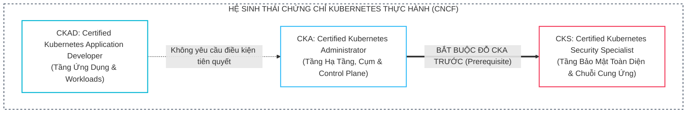
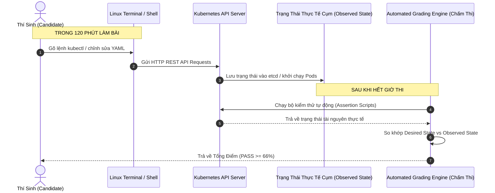
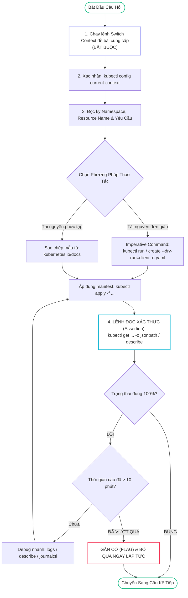
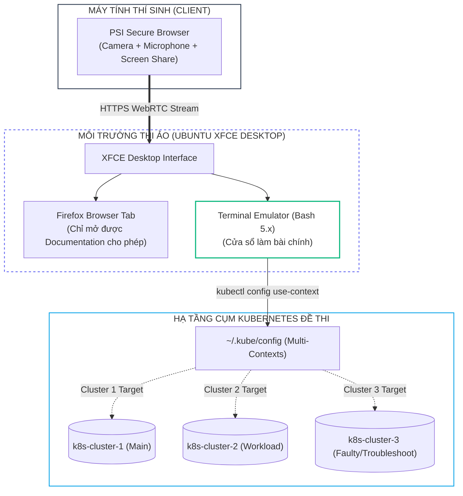
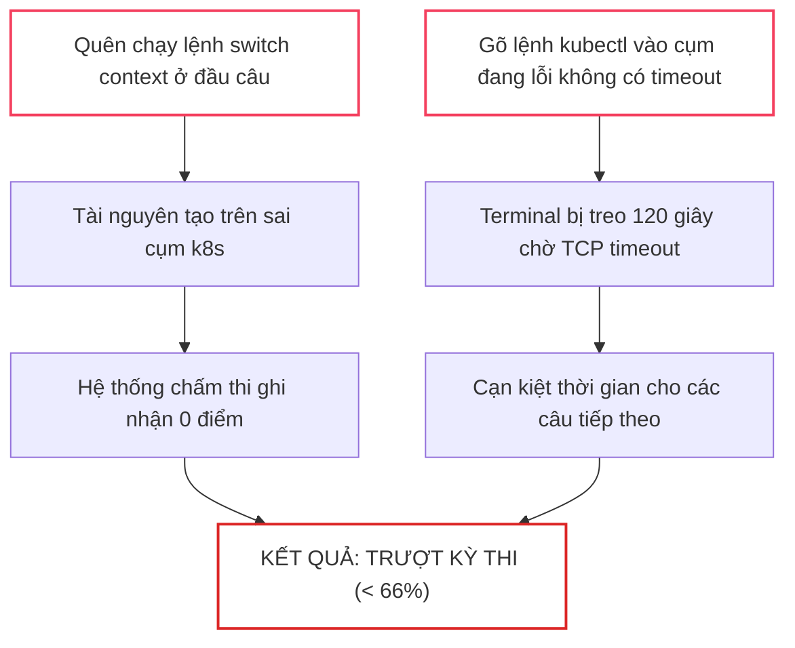
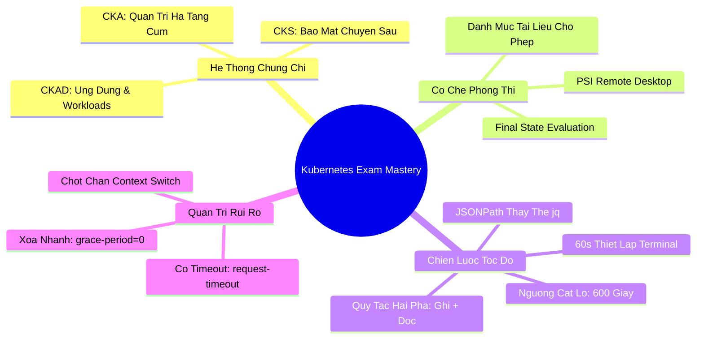


# [BÀI 01] TỔNG QUAN 3 KỲ THI CNCF (CKA/CKAD/CKS), MÔI TRƯỜNG LÀM BÀI & CHIẾN THUẬT TỐI ƯU THỜI GIAN

Trong kỷ nguyên điện toán đám mây và kiến trúc microservices phân tán quy mô lớn, **Kubernetes** đóng vai trò là nền tảng điều phối container (Container Orchestration) tiêu chuẩn công nghiệp. Để vận hành hệ thống vững chắc trong môi trường sản xuất (Production) cũng như chinh phục các kỳ thi chứng chỉ thực hành đỉnh cao của **Linux Foundation / CNCF (Cloud Native Computing Foundation)**, kỹ sư không chỉ cần hiểu khái niệm mà phải làm chủ kỹ năng xử lý trực tiếp trên hệ thống dòng lệnh dưới áp lực thời gian thực.

Khác biệt hoàn toàn với các kỳ thi lý thuyết trắc nghiệm truyền thống, các chứng chỉ của CNCF là **kỳ thi thực hành 100% (Performance-Based Exam)** trên các cụm Kubernetes thực tế. Bài viết mở đầu này sẽ đồng hành cùng bạn giải mã toàn diện bức tranh kiến trúc giữa 3 kỳ thi, phân tích cơ chế chấm điểm tầng thấp, thiết lập môi trường thi tốc độ cao và xây dựng chiến thuật tối ưu thời gian làm bài chuẩn SRE / DevOps Lead.

---

> [!IMPORTANT]
> **MỤC TIÊU KỸ THUẬT THEN CHỐT:**
> - **Phân định rõ ranh giới chuyên môn**: Thấu hiểu sự khác biệt cốt lõi về trọng số kiến thức giữa **CKAD** (Ứng dụng), **CKA** (Quản trị hạ tầng cụm) và **CKS** (Bảo mật chuyên sâu).
> - **Giải mã cơ chế chấm thi**: Nắm vững nguyên lý **Final State Evaluation** (chỉ chấm trạng thái thực tế sau cùng của cụm, không chấm quá trình gõ lệnh).
> - **Thiết lập môi trường làm bài tốc độ cao**: Cấu hình `kubectl completion`, aliases, `.vimrc` tối ưu cho YAML, và làm chủ **JSONPath / Custom-Columns** mà không phụ thuộc vào `jq`.
> - **Kiểm soát rủi ro phòng thi**: Áp dụng quy tắc **Context Verification Guard** và cờ `--request-timeout` để loại bỏ 100% nguy cơ thao tác nhầm cụm hoặc mất điểm do lệnh bị treo.

---

## 1. Bản Chất Kiến Trúc & Tư Duy Cốt Lõi: So Sánh Toàn Diện CKA vs CKAD vs CKS

### 1.1. Bản Chất và Phân Định Trách Nhiệm Giữa 3 Kỳ Thi

Hệ sinh thái chứng chỉ thực hành Kubernetes của Linux Foundation được thiết kế theo 3 cấp độ phân quyền và trách nhiệm kỹ thuật rõ rệt:



1. <span class="badge badge--cyan">CKAD (Application Developer)</span>:
   - **Tập trung**: Vận hành và thiết kế tài nguyên ứng dụng chạy trên Kubernetes từ góc nhìn của lập trình viên.
   - **Phạm vi kỹ thuật**: Multi-container Pods (Sidecar, Adapter, Ambassador), Deployments, Jobs/CronJobs, ConfigMaps/Secrets, Resource Requests/Limits, Readiness/Liveness/Startup Probes, Ingress và NetworkPolicy cơ bản.
   - **Không bao gồm**: Cài đặt cụm, nâng cấp kubeadm, sao lưu etcd, debug control plane services.

2. <span class="badge badge--primary">CKA (Administrator)</span>:
   - **Tập trung**: Vận hành, bảo trì, mở rộng và khắc phục sự cố toàn diện cho cụm Kubernetes ở cấp độ hạ tầng.
   - **Phạm vi kỹ thuật**: Khởi tạo và nâng cấp cụm bằng `kubeadm`, backup/restore `etcd`, quản trị Role-Based Access Control (RBAC), cấu hình Custom StorageClass / PersistentVolumes (CSI), cài đặt mạng CNI (Calico/Flannel), phân tích logs dịch vụ hệ thống `journalctl / crictl`, và xử lý sự cố Worker/Control Plane Node.

3. <span class="badge badge--rose">CKS (Security Specialist)</span>:
   - **Tập trung**: Bảo vệ toàn diện vòng đời ứng dụng và hạ tầng cụm trước các cuộc tấn công mạng.
   - **Điều kiện tiên quyết**: <b style="color: var(--accent-rose);">Bắt buộc phải sở hữu chứng chỉ CKA còn hiệu lực</b> mới được cấp chứng chỉ CKS.
   - **Phạm vi kỹ thuật**: Hardening cụm (CIS Benchmark, API Server Security, Secret Encryption at Rest), Hardening hệ điều hành (AppArmor, Seccomp), Quét lỗ hổng container (Trivy), Runtime Threat Detection (Falco, Sysdig), Ký số hình ảnh (Cosign), và Audit Logging.

---

### 1.2. Cơ Chế Chấm Điểm Tự Động (Final State Evaluation)

Một trong những sai lầm phổ biến nhất của kỹ sư khi bước vào phòng thi là giữ thói quen lập trình hoặc thao tác dòng lệnh theo cảm tính mà không hiểu cách thức hệ thống chấm điểm vận hành:



> [!NOTE]
> **QUY TẮC CHẤM THI CỐT LÕI:**
> - Hệ thống chấm điểm tự động **KHÔNG** đọc lịch sử bash history, không quan tâm bạn dùng lệnh imperative hay declarative, và không đọc các file nháp tạm thời.
> - Điểm số được tính bằng việc **chạy các kịch bản kiểm tra tự động (Automated Assertions)** trực tiếp lên Kubernetes API Server để xác minh trạng thái tài nguyên sau cùng.
> - Dòng chữ thông báo `pod/web created` trên màn hình chỉ xác nhận API Server đã tiếp nhận yêu cầu ghi, **hoàn toàn không chứng minh được Pod đã sẵn sàng phục vụ hoặc đúng cấu hình yêu cầu**.

---

### 1.3. Mô Hình Phân Bổ Ngân Sách Thời Gian & Chiến Lược Cắt Lỗ (Fast-Fail)

Mỗi bài thi diễn ra trong **120 phút (7.200 giây)** với số lượng khoảng **15 – 20 câu hỏi**. Do đó, quản trị thời gian là yếu tố sống còn quyết định kết quả thi:

$$\text{Ngân sách thời gian trung bình} = \frac{7200\text{ giây}}{N\text{ câu hỏi}} \approx 360 - 480\text{ giây/câu (6 - 8 phút)}$$



- **Quy tắc hai pha (Two-Phase Execution)**: Mọi thao tác phải bao gồm **1 Lệnh Ghi + 1 Lệnh Đọc Xác Thực**. Tuyệt đối không chuyển câu khi chưa có lệnh đọc chứng minh tài nguyên đã đạt `Running / Ready` hoặc trường dữ liệu yêu cầu đã được cập nhật chính xác.
- **Quy tắc cắt lỗ (Skip Threshold - 600 giây)**: Nếu một câu hỏi gặp sự cố bất thường và bạn không thể khắc phục sau 10 phút, lập tức đánh dấu cờ (Flag) và chuyển sang câu tiếp theo. 80% câu hỏi còn lại là các câu vừa sức; không bao giờ để 1 câu khó làm cạn kiệt thời gian của 5 câu dễ khác.

---

## 2. Bảng Ma Trận So Sánh Kỹ Thuật Toàn Diện (Engineering Matrix)

Dưới đây là bảng so sánh chi tiết các thông số kỹ thuật, môi trường sát hạch và trọng số phân bổ giữa 3 chứng chỉ CNCF:

### 2.1. Ma Trận Quy Cách Thi & Môi Trường

| Tiêu Chí Kỹ Thuật | CKAD | CKA | CKS |
| :--- | :--- | :--- | :--- |
| **Mục Tiêu Đào Tạo** | Phát triển ứng dụng Cloud-Native | Quản trị hạ tầng & cụm Kubernetes | Bảo mật cụm, Pod & Chuỗi cung ứng |
| **Thời Gian Làm Bài** | 120 phút | 120 phút | 120 phút |
| **Điểm Đạt (Passing Score)** | **66%** | **66%** | **67%** |
| **Số Lượng Câu Hỏi** | 15 – 19 câu | 15 – 20 câu | 15 – 16 câu |
| **Điều Kiện Tiên Quyết** | Không | Không | <b style="color: var(--accent-rose);">Phải có CKA còn hạn</b> |
| **Thời Hạn Chứng Chỉ** | 2 năm | 2 năm | 2 năm |
| **Giao Diện Phòng Thi** | Remote Desktop (PSI Browser) | Remote Desktop (PSI Browser) | Remote Desktop (PSI Browser) |
| **Trang Tra Cứu Cho Phép** | `kubernetes.io/docs`<br/>`github.com/kubernetes` | `kubernetes.io/docs`<br/>`github.com/kubernetes` | `kubernetes.io/docs`<br/>`falco.org/docs`<br/>`trivy.dev` |

---

### 2.2. Ma Trận Trọng Số Kiến Thức (Domain Weights Matrix)

| Miền Kiến Thức (Domain) | CKA Trọng Số | CKAD Trọng Số | CKS Trọng Số | Trọng Tâm Kỹ Thuật |
| :--- | :---: | :---: | :---: | :--- |
| **Cluster Architecture, Setup & Config** | **25%** | — | **10%** | `kubeadm`, etcd backup, RBAC, Control plane components |
| **Workloads & Scheduling** | **15%** | **20%** | — | Deployments, DaemonSets, Affinity, Taints/Tolerations |
| **Services & Networking** | **20%** | **20%** | — | CNI, CoreDNS, Ingress, NodePort, NetworkPolicy |
| **Storage & Volumes** | **10%** | — | — | PV, PVC, StorageClass, Volume Expansion, CSI Drivers |
| **Troubleshooting & Maintenance** | **30%** | **15%** | — | Control plane failure, Worker drain, Kubelet debugging |
| **Application Design & Build** | — | **20%** | — | Multi-container Pods, Jobs/CronJobs, Init Containers |
| **Application Config & Security** | — | **25%** | — | ConfigMaps, Secrets, ServiceAccounts, SecurityContext |
| **Cluster & System Hardening** | — | — | **30%** | CIS Benchmark, AppArmor, Seccomp, Secret Encryption |
| **Microservice & Supply Chain Security** | — | — | **40%** | Trivy vulnerability scan, Cosign signing, Falco runtime |

---

## 3. Kiến Trúc Môi Trường Thi Chuẩn Production & Thiết Lập Tốc Độ Cao

### 3.1. Sơ Đồ Kiến Trúc Môi Trường Thi Remote Desktop (PSI Platform)

Phòng thi hiện đại của Linux Foundation sử dụng nền tảng **PSI Bridge Remote Desktop** chạy môi trường Ubuntu XFCE ảo hóa bên trong trình duyệt:



---

### 3.2. Cấu Hình Tối Ưu Môi Trường Terminal Trong 60 Giây Đầu

Khi giám thị (Proctor) bấm giờ bắt đầu làm bài, hãy dành đúng **60 giây đầu tiên** để thiết lập môi trường dòng lệnh. Đây là khoản đầu tư sinh lời lớn nhất cho toàn bộ 119 phút còn lại:

```bash
# ==============================================================================
# BƯỚC 1: KÍCH HOẠT AUTO-COMPLETION VÀ ALIAS TỐC ĐỘ CAO
# ==============================================================================
# 1. Kích hoạt bash completion cho lệnh kubectl và gán alias 'k'
source <(kubectl completion bash)
alias k=kubectl
complete -o default -F __start_kubectl k

# 2. Khai báo các biến môi trường tạo khuôn mẫu YAML siêu tốc
export do="--dry-run=client -o yaml"
export now="--force --grace-period=0"

# ==============================================================================
# BƯỚC 2: CẤU HÌNH VIMRC CHO THAO TÁC YAML CHUẨN XÁC (KHÔNG BỊ LỖI THỤT DÒNG)
# ==============================================================================
cat << 'EOF' > ~/.vimrc
set tabstop=2
set shiftwidth=2
set expandtab
set smartindent
set number
set paste
EOF
```

---

### 3.3. Cơ Chế Chốt Chặn Context & Kỹ Thuật Truy Vấn Không Dùng `jq`

Trong phòng thi, tiện ích `jq` **không được đảm bảo có sẵn trên mọi node/cluster**. Do đó, việc thành thạo cú pháp `jsonpath` và `custom-columns` nguyên bản của `kubectl` là bắt buộc:

```bash
# ------------------------------------------------------------------------------
# 1. TRÍCH XUẤT THÔNG TIN POD BẰNG JSONPATH NGUYÊN BẢN
# ------------------------------------------------------------------------------
# Lấy danh sách IP của tất cả Pods trong namespace default:
kubectl get pods -o jsonpath='{.items[*].status.podIP}'

# Lấy toàn bộ container image đang chạy trong cụm:
kubectl get pods -A -o jsonpath='{range .items[*]}{.metadata.name}{"\t"}{.spec.containers[*].image}{"\n"}{end}'

# ------------------------------------------------------------------------------
# 2. HIỂN THỊ DẠNG BẢNG TÙY BIẾN VỚI CUSTOM-COLUMNS
# ------------------------------------------------------------------------------
# Hiển thị thông tin Pod gọn gàng chuẩn kiểm toán:
kubectl get pods -o custom-columns=POD_NAME:.metadata.name,CONTAINER_IMG:.spec.containers[0].image,NODE:.spec.nodeName,STATUS:.status.phase
```

---

## 4. Phân Tích Cạm Bẫy Thực Chiến: Thảm Họa Nhầm Context & Treo Lệnh Mất Điểm

### Tình Huống Sự Cố Thực Tế:
<span class="badge badge--rose">🕒 10:30 AM</span> Trong phòng thi CKA, thí sinh hoàn thành Câu 3 (thao tác trên cụm `cluster-dev`). Chuyển sang Câu 4, đề bài yêu cầu: *"Tạo một Deployment tên web-app 3 bản sao trên cụm cluster-prod"*. Thí sinh vội vã gõ lệnh tạo deployment ngay mà quên thực thi dòng lệnh switch context ở đầu câu. Sau đó, tại Câu 5 (khắc phục sự cố Node trên cụm `cluster-faulty`), thí sinh gõ lệnh `kubectl get nodes` mà không có cờ timeout, khiến phiên terminal bị treo cứng suốt 2 phút do API Server của cụm đang mất kết nối mạng.

---

### Hậu Quả & Log Lỗi Thực Tế:
```text
# LỖI 1: THAO TÁC THÀNH CÔNG TRÊN SAI CỤM MỤC TIÊU
$ kubectl create deployment web-app --image=nginx:alpine --replicas=3
deployment.apps/web-app created   <-- Tạo thành công trên 'cluster-dev' của Câu 3!

[Grading Engine Check on 'cluster-prod']:
$ kubectl get deployment web-app -n default --context=cluster-prod
Error from server (NotFound): deployments.apps "web-app" not found
Result: Score awarded: 0 / 7 points!

# LỖI 2: LỆNH GET BỊ TREO DO API SERVER KHÔNG PHẢN HỒI (MẤT 120 GIÂY)
$ kubectl get nodes
... [TERMINAL BLOCKED FOR 120 SECONDS WAITING FOR OS TCP TIMEOUT] ...
Error from server (Timeout): the server was unable to return a response in the time allotted (get nodes)
```

Tài nguyên của Câu 4 được khởi tạo thành công mỹ mãn nhưng nằm trên **SAI CỤM KUBERNETES**, dẫn đến mất trọn 7% điểm số của câu. Đồng thời, việc bị treo terminal ở Câu 5 gây cạn kiệt quỹ thời gian và tạo áp lực tâm lý nặng nề:



---

### 5-Whys Root Cause Analysis:
1. <span class="badge badge--primary">Why 1</span> **Tại sao câu hỏi 4 bị 0 điểm dù lệnh chạy thành công?** $\rightarrow$ Do tài nguyên `web-app` được tạo trên cụm `cluster-dev` thay vì `cluster-prod`.
2. <span class="badge badge--primary">Why 2</span> **Tại sao lệnh lại chạy vào cluster-dev?** $\rightarrow$ Thí sinh không chạy lệnh `kubectl config use-context cluster-prod` được ghi ở dòng đầu tiên của đề bài.
3. <span class="badge badge--primary">Why 3</span> **Tại sao lại quên chạy lệnh switch context?** $\rightarrow$ Thí sinh vội vã đọc phần mô tả nghiệp vụ bên dưới mà không hình thành phản xạ sao chép dòng lệnh context đầu tiên.
4. <span class="badge badge--primary">Why 4</span> **Tại sao câu 5 bị mất 2 phút quý giá do treo terminal?** $\rightarrow$ Lệnh `kubectl` mặc định không giới hạn thời gian chờ client-side khi API Server bị unreachable.
5. <span class="badge badge--emerald">Root Cause Remedy</span> **Biện pháp khắc phục chuẩn SRE & Exam Master:**
   - <span class="badge badge--emerald">Context First Rule</span> Luôn sao chép và chạy dòng lệnh `kubectl config use-context <name>` trước khi đọc nội dung câu hỏi.
   - <span class="badge badge--cyan">Current Context Check</span> Kiểm tra lại bằng lệnh `kubectl config current-context` để đảm bảo chắc chắn 100%.
   - <span class="badge badge--amber">Timeout Safety Guard</span> Luôn gắn cờ `--request-timeout=5s` khi tương tác với cụm đang nghi ngờ có sự cố.

---

## 5. Hands-on Lab: Khởi Tạo Môi Trường Thực Hành & Kiểm Thử Kỹ Năng Tốc Độ (8 Bước)

Bảng ma trận tóm tắt quy trình thực hành chuẩn:

| Bước | Lệnh CLI / Cấu Hình | Mục Đích Thực Thi |
| :---: | :--- | :--- |
| <span class="badge badge--primary">01</span> | `kind create cluster --name k8s-lab` | Khởi tạo cụm Kubernetes thực hành cục bộ |
| <span class="badge badge--cyan">02</span> | `alias k=kubectl && export do="--dry-run=client -o yaml"` | Nạp biến môi trường và alias tốc độ cao |
| <span class="badge badge--emerald">03</span> | `kubectl config current-context` | Kiểm tra và xác thực Context làm việc an toàn |
| <span class="badge badge--primary">04</span> | `k run nginx-pod --image=nginx:alpine $do > pod.yaml` | Sinh file cấu hình Pod chuẩn không cần gõ tay |
| <span class="badge badge--cyan">05</span> | `k apply -f pod.yaml` | Khởi tạo tài nguyên vào cụm thực hành |
| <span class="badge badge--emerald">06</span> | `k get pod nginx-pod -o jsonpath='{.status.phase}'` | Thực thi lệnh đọc xác thực trạng thái Pod |
| <span class="badge badge--amber">07</span> | `k get nodes --request-timeout=3s` | Kiểm tra cụm an toàn với cờ chống treo lệnh |
| <span class="badge badge--rose">08</span> | `k delete pod nginx-pod $now` | Xóa nhanh tài nguyên không cần chờ đợi |

---

### Hướng Dẫn Thực Hành Chi Tiết Từng Bước:

#### Bước 1: Khởi tạo cụm Kubernetes thực hành với Kind
```bash
# Tạo cấu hình cụm Kind 3 nodes (1 Control-plane + 2 Workers)
cat << 'EOF' > kind-config.yaml
kind: Cluster
apiVersion: kind.x-k8s.io/v1alpha4
nodes:
- role: control-plane
- role: worker
- role: worker
EOF

# Khởi tạo cụm
kind create cluster --name k8s-lab --config kind-config.yaml
```

#### Bước 2: Thiết lập cấu hình Shell & Vim chuyên nghiệp
```bash
# Nạp alias và cấu hình completion
alias k=kubectl
source <(kubectl completion bash)
complete -o default -F __start_kubectl k

export do="--dry-run=client -o yaml"
export now="--force --grace-period=0"
```

#### Bước 3: Chốt chặn an toàn Context Switching
```bash
# Kiểm tra context hiện tại
k config current-context

# Giả lập chuyển đổi giữa các context
k config use-context kind-k8s-lab
```

#### Bước 4: Tạo Pod khai báo nhanh bằng Imperative Generator
```bash
# Tạo manifest Pod hoàn chỉnh có Resource Limits và Environment Variables trong 5 giây
k run secure-app --image=nginx:alpine --port=80 --env="APP_ENV=production" $do > secure-app.yaml

# Bổ sung nhanh trường cấu hình nếu cần và apply
k apply -f secure-app.yaml
```

#### Bước 5: Truy vấn dữ liệu nâng cao không phụ thuộc `jq`
```bash
# 1. Trích xuất IP của Pod vừa tạo
k get pod secure-app -o jsonpath='{.status.podIP}'

# 2. Trích xuất tên Node mà Pod đang chạy
k get pod secure-app -o jsonpath='{.spec.nodeName}'
```

#### Bước 6: Thử nghiệm cơ chế phòng thủ Timeout
```bash
# Thử nghiệm truy vấn cụm an toàn với timeout 3 giây
k get nodes --request-timeout=3s
```

#### Bước 7: Xác thực trạng thái hoạt động thực tế của Pod (Two-Phase Rule)
```bash
# Lệnh đọc xác thực hai pha
POD_STATUS=$(k get pod secure-app -o jsonpath='{.status.phase}')
if [ "$POD_STATUS" == "Running" ]; then
    echo ">> [PASS] Pod đang hoạt động chuẩn xác!"
else
    echo ">> [FAIL] Pod chưa sẵn sàng, cần kiểm tra logs!"
fi
```

#### Bước 8: Dọn dẹp tài nguyên nhanh chóng
```bash
# Xóa Pod lập tức không chờ grace period
k delete pod secure-app $now
rm -f kind-config.yaml secure-app.yaml
```

---

## 6. 10 Câu Hỏi Tự Kiểm Tra Chuyên Sâu (Self-Check Q&A Accordion)

<details class="qa-card">
<summary class="qa-summary">
  <div class="qa-summary-left">
    <span class="qa-num-badge">Q01</span>
    <span>Sự khác biệt bản chất nhất giữa kỳ thi CKA và CKAD là gì?</span>
  </div>
  <span class="qa-chevron">
    <svg width="18" height="18" fill="none" stroke="currentColor" stroke-width="2.5" viewBox="0 0 24 24"><polyline points="6 9 12 15 18 9"></polyline></svg>
  </span>
</summary>
<div class="qa-answer">
  <div class="qa-answer-header">
    <svg width="14" height="14" fill="none" stroke="currentColor" stroke-width="2" viewBox="0 0 24 24"><path d="M22 11.08V12a10 10 0 1 1-5.93-9.14"></path><polyline points="22 4 12 14.01 9 11.01"></polyline></svg>
    <span>Phân Tích &amp; Lời Giải Kỹ Thuật</span>
  </div>
  <div style="margin-bottom: 8px;"><b style="color: var(--accent-primary);">CKAD</b> tập trung 100% vào <b style="color: var(--accent-cyan);">Tầng Ứng Dụng (Workloads)</b>: Thiết kế Pod đa container, Deployment, Job/CronJob, ConfigMap/Secret và Probes từ góc nhìn của Software Engineer.</div>
  <div>Ngược lại, <b style="color: var(--accent-primary);">CKA</b> tập trung vào <b style="color: var(--accent-emerald);">Tầng Hạ Tầng &amp; Vận Hành Cụm</b>: Cài đặt/nâng cấp cụm với kubeadm, sao lưu etcd, phân quyền RBAC, cấu hình CNI/CSI và chẩn đoán sự cố Control Plane / Worker Node.</div>
</div>
</details>

<details class="qa-card">
<summary class="qa-summary">
  <div class="qa-summary-left">
    <span class="qa-num-badge">Q02</span>
    <span>Tại sao dòng chữ "pod/web created" không đảm bảo bạn sẽ có điểm trong bài thi?</span>
  </div>
  <span class="qa-chevron">
    <svg width="18" height="18" fill="none" stroke="currentColor" stroke-width="2.5" viewBox="0 0 24 24"><polyline points="6 9 12 15 18 9"></polyline></svg>
  </span>
</summary>
<div class="qa-answer">
  <div class="qa-answer-header">
    <svg width="14" height="14" fill="none" stroke="currentColor" stroke-width="2" viewBox="0 0 24 24"><path d="M22 11.08V12a10 10 0 1 1-5.93-9.14"></path><polyline points="22 4 12 14.01 9 11.01"></polyline></svg>
    <span>Phân Tích &amp; Lời Giải Kỹ Thuật</span>
  </div>
  Dòng thông báo <code>pod/web created</code> chỉ xác nhận rằng <b style="color: var(--accent-primary);">API Server đã tiếp nhận và ghi bản ghi vào etcd</b>. Nó không chứng minh được Container Image có tải được không (<code>ErrImagePull</code>), Pod có bị crash lặp lại không (<code>CrashLoopBackOff</code>), hay cổng mạng đã mở đúng chưa. Hệ thống chấm điểm tự động kiểm tra <b style="color: var(--accent-emerald);">Trạng thái thực tế sau cùng (Observed State)</b>, do đó bắt buộc phải dùng lệnh đọc để xác nhận trạng thái <code>Running / Ready</code>.
</div>
</details>

<details class="qa-card">
<summary class="qa-summary">
  <div class="qa-summary-left">
    <span class="qa-num-badge">Q03</span>
    <span>Tại sao không nên phụ thuộc vào công cụ 'jq' trong các kỳ thi của Linux Foundation?</span>
  </div>
  <span class="qa-chevron">
    <svg width="18" height="18" fill="none" stroke="currentColor" stroke-width="2.5" viewBox="0 0 24 24"><polyline points="6 9 12 15 18 9"></polyline></svg>
  </span>
</summary>
<div class="qa-answer">
  <div class="qa-answer-header">
    <svg width="14" height="14" fill="none" stroke="currentColor" stroke-width="2" viewBox="0 0 24 24"><path d="M22 11.08V12a10 10 0 1 1-5.93-9.14"></path><polyline points="22 4 12 14.01 9 11.01"></polyline></svg>
    <span>Phân Tích &amp; Lời Giải Kỹ Thuật</span>
  </div>
  Trong môi trường thi thực tế, một số node hoặc môi trường cơ sở có thể <b style="color: var(--accent-rose);">không được cài sẵn package jq</b>. Nếu chỉ biết trích xuất dữ liệu bằng <code>jq</code>, thí sinh sẽ bị bế tắc hoàn toàn. Kỹ năng sử dụng <code style="color: var(--accent-primary);">-o jsonpath='{...}'</code> và <code style="color: var(--accent-cyan);">-o custom-columns=...</code> là tính năng có sẵn 100% của binary <code>kubectl</code> trên mọi nền tảng.
</div>
</details>

<details class="qa-card">
<summary class="qa-summary">
  <div class="qa-summary-left">
    <span class="qa-num-badge">Q04</span>
    <span>Quy tắc hai pha (Two-Phase Execution) trong phòng thi thực hành là gì?</span>
  </div>
  <span class="qa-chevron">
    <svg width="18" height="18" fill="none" stroke="currentColor" stroke-width="2.5" viewBox="0 0 24 24"><polyline points="6 9 12 15 18 9"></polyline></svg>
  </span>
</summary>
<div class="qa-answer">
  <div class="qa-answer-header">
    <svg width="14" height="14" fill="none" stroke="currentColor" stroke-width="2" viewBox="0 0 24 24"><path d="M22 11.08V12a10 10 0 1 1-5.93-9.14"></path><polyline points="22 4 12 14.01 9 11.01"></polyline></svg>
    <span>Phân Tích &amp; Lời Giải Kỹ Thuật</span>
  </div>
  Quy tắc hai pha quy định rằng mỗi câu hỏi phải gồm 2 hành động liên tiếp:
  <div style="margin-top: 6px; padding-left: 10px; border-left: 2px solid var(--accent-primary);">1. <b style="color: var(--accent-primary);">Pha Ghi (Write Phase)</b>: Tạo hoặc chỉnh sửa tài nguyên bằng lệnh imperative hoặc apply file YAML.</div>
  <div style="margin-top: 6px; padding-left: 10px; border-left: 2px solid var(--accent-emerald);">2. <b style="color: var(--accent-emerald);">Pha Đọc (Read / Assertion Phase)</b>: Chạy lệnh <code>kubectl get ...</code> kết hợp jsonpath để chứng minh giá trị hoặc trạng thái mong muốn đã hiện hữu trên cụm.</div>
</div>
</details>

<details class="qa-card">
<summary class="qa-summary">
  <div class="qa-summary-left">
    <span class="qa-num-badge">Q05</span>
    <span>Những trang tài liệu nào được phép tra cứu trong kỳ thi CKA / CKAD / CKS?</span>
  </div>
  <span class="qa-chevron">
    <svg width="18" height="18" fill="none" stroke="currentColor" stroke-width="2.5" viewBox="0 0 24 24"><polyline points="6 9 12 15 18 9"></polyline></svg>
  </span>
</summary>
<div class="qa-answer">
  <div class="qa-answer-header">
    <svg width="14" height="14" fill="none" stroke="currentColor" stroke-width="2" viewBox="0 0 24 24"><path d="M22 11.08V12a10 10 0 1 1-5.93-9.14"></path><polyline points="22 4 12 14.01 9 11.01"></polyline></svg>
    <span>Phân Tích &amp; Lời Giải Kỹ Thuật</span>
  </div>
  Thí sinh được phép mở 1 tab trình duyệt trong môi trường Remote Desktop để truy cập:
  <ul>
    <li><code>https://kubernetes.io/docs/</code> và các trang dịch phụ thuộc</li>
    <li><code>https://github.com/kubernetes/</code></li>
    <li>Đối với CKS: được phép mở thêm <code>https://falco.org/docs/</code> và <code>https://trivy.dev/</code></li>
  </ul>
  <b style="color: var(--accent-rose);">Tuyệt đối không</b> truy cập diễn đàn, blog ngoài, Reddit, StackOverflow hoặc các trang tìm kiếm chung như Google.
</div>
</details>

<details class="qa-card">
<summary class="qa-summary">
  <div class="qa-summary-left">
    <span class="qa-num-badge">Q06</span>
    <span>Làm thế nào để tạo nhanh file YAML mẫu cho Pod hoặc Deployment mà không cần gõ từng dòng?</span>
  </div>
  <span class="qa-chevron">
    <svg width="18" height="18" fill="none" stroke="currentColor" stroke-width="2.5" viewBox="0 0 24 24"><polyline points="6 9 12 15 18 9"></polyline></svg>
  </span>
</summary>
<div class="qa-answer">
  <div class="qa-answer-header">
    <svg width="14" height="14" fill="none" stroke="currentColor" stroke-width="2" viewBox="0 0 24 24"><path d="M22 11.08V12a10 10 0 1 1-5.93-9.14"></path><polyline points="22 4 12 14.01 9 11.01"></polyline></svg>
    <span>Phân Tích &amp; Lời Giải Kỹ Thuật</span>
  </div>
  Sử dụng cờ <code>--dry-run=client -o yaml</code> kết hợp với các lệnh imperative:
  <div style="margin-top: 6px;"><code>kubectl run my-pod --image=nginx $do &gt; pod.yaml</code></div>
  <div style="margin-top: 4px;"><code>kubectl create deployment my-dep --image=redis --replicas=3 $do &gt; dep.yaml</code></div>
  <div style="margin-top: 4px;"><code>kubectl create service clusterip my-svc --tcp=80:8080 $do &gt; svc.yaml</code></div>
</div>
</details>

<details class="qa-card">
<summary class="qa-summary">
  <div class="qa-summary-left">
    <span class="qa-num-badge">Q07</span>
    <span>Tại sao cần gán cờ '--request-timeout=5s' khi kiểm tra các cụm Kubernetes bị nghi ngờ hỏng?</span>
  </div>
  <span class="qa-chevron">
    <svg width="18" height="18" fill="none" stroke="currentColor" stroke-width="2.5" viewBox="0 0 24 24"><polyline points="6 9 12 15 18 9"></polyline></svg>
  </span>
</summary>
<div class="qa-answer">
  <div class="qa-answer-header">
    <svg width="14" height="14" fill="none" stroke="currentColor" stroke-width="2" viewBox="0 0 24 24"><path d="M22 11.08V12a10 10 0 1 1-5.93-9.14"></path><polyline points="22 4 12 14.01 9 11.01"></polyline></svg>
    <span>Phân Tích &amp; Lời Giải Kỹ Thuật</span>
  </div>
  Khi một API Server bị treo hoặc mạng giữa client và cluster bị đứt đoạn, lệnh <code>kubectl</code> mặc định sẽ chờ đợi theo chu kỳ TCP timeout của Linux kernel (thường kéo dài từ <b style="color: var(--accent-rose);">60 đến 120 giây</b>). Cờ <code>--request-timeout=5s</code> sẽ chủ động ngắt kết nối sau 5 giây nếu không nhận được phản hồi, giúp thí sinh không bị treo terminal và bảo vệ quỹ thời gian làm bài.
</div>
</details>

<details class="qa-card">
<summary class="qa-summary">
  <div class="qa-summary-left">
    <span class="qa-num-badge">Q08</span>
    <span>Khi nào thí sinh nên quyết định bỏ qua (Skip / Flag) một câu hỏi trong phòng thi?</span>
  </div>
  <span class="qa-chevron">
    <svg width="18" height="18" fill="none" stroke="currentColor" stroke-width="2.5" viewBox="0 0 24 24"><polyline points="6 9 12 15 18 9"></polyline></svg>
  </span>
</summary>
<div class="qa-answer">
  <div class="qa-answer-header">
    <svg width="14" height="14" fill="none" stroke="currentColor" stroke-width="2" viewBox="0 0 24 24"><path d="M22 11.08V12a10 10 0 1 1-5.93-9.14"></path><polyline points="22 4 12 14.01 9 11.01"></polyline></svg>
    <span>Phân Tích &amp; Lời Giải Kỹ Thuật</span>
  </div>
  Thí sinh nên lập tức đánh dấu cờ (Flag) và bỏ qua câu hỏi khi:
  <ul>
    <li>Thời gian thao tác trên câu hỏi đó đã vượt quá <b style="color: var(--accent-rose);">10 phút (600 giây)</b> mà vẫn chưa xác định được nguyên nhân lỗi.</li>
    <li>Câu hỏi yêu cầu viết manifest quá phức tạp nhưng điểm số chỉ chiếm tỷ trọng nhỏ (ví dụ: 2-3%).</li>
    <li>Sau khi hoàn thành tất cả các câu dễ và nắm chắc &gt;70% điểm trong tay, thí sinh mới quay lại xử lý các câu đã gắn cờ.</li>
  </ul>
</div>
</details>

<details class="qa-card">
<summary class="qa-summary">
  <div class="qa-summary-left">
    <span class="qa-num-badge">Q09</span>
    <span>Làm thế nào để xóa một Pod ngay lập tức mà không phải chờ 30 giây mặc định?</span>
  </div>
  <span class="qa-chevron">
    <svg width="18" height="18" fill="none" stroke="currentColor" stroke-width="2.5" viewBox="0 0 24 24"><polyline points="6 9 12 15 18 9"></polyline></svg>
  </span>
</summary>
<div class="qa-answer">
  <div class="qa-answer-header">
    <svg width="14" height="14" fill="none" stroke="currentColor" stroke-width="2" viewBox="0 0 24 24"><path d="M22 11.08V12a10 10 0 1 1-5.93-9.14"></path><polyline points="22 4 12 14.01 9 11.01"></polyline></svg>
    <span>Phân Tích &amp; Lời Giải Kỹ Thuật</span>
  </div>
  Sử dụng cờ <code>--force --grace-period=0</code> (đã được tạo alias <code>$now</code>):
  <div style="margin-top: 6px;"><code>kubectl delete pod &lt;pod-name&gt; --force --grace-period=0</code></div>
  Lệnh này sẽ yêu cầu API Server xóa bản ghi Pod lập tức khỏi etcd mà không cần đợi Kubelet gửi tín hiệu SIGKILL tới container runtime.
</div>
</details>

<details class="qa-card">
<summary class="qa-summary">
  <div class="qa-summary-left">
    <span class="qa-num-badge">Q10</span>
    <span>Cần lưu ý điều gì khi chỉnh sửa tệp Kubeconfig hoặc chuyển đổi Context trong phòng thi?</span>
  </div>
  <span class="qa-chevron">
    <svg width="18" height="18" fill="none" stroke="currentColor" stroke-width="2.5" viewBox="0 0 24 24"><polyline points="6 9 12 15 18 9"></polyline></svg>
  </span>
</summary>
<div class="qa-answer">
  <div class="qa-answer-header">
    <svg width="14" height="14" fill="none" stroke="currentColor" stroke-width="2" viewBox="0 0 24 24"><path d="M22 11.08V12a10 10 0 1 1-5.93-9.14"></path><polyline points="22 4 12 14.01 9 11.01"></polyline></svg>
    <span>Phân Tích &amp; Lời Giải Kỹ Thuật</span>
  </div>
  <div style="margin-bottom: 8px;">1. <b style="color: var(--accent-rose);">Tuyệt đối không xóa hoặc ghi đè</b> tệp <code>~/.kube/config</code> gốc của phòng thi vì tệp này chứa thông tin chứng chỉ và địa chỉ endpoint của toàn bộ các cụm thi.</div>
  <div>2. Luôn sao chép chính xác câu lệnh <code>kubectl config use-context &lt;context-name&gt;</code> được cung cấp ở đầu mỗi câu hỏi để tránh thao tác nhầm trên cụm của câu trước.</div>
</div>
</details>

---

## 7. Tổng Kết & Lộ Trình Bài Học Tiếp Theo

### Tóm Tắt Các Điểm Cốt Lõi:
1. **Chấm Thi Dựa Trên Trạng Thái Cuối**: Linux Foundation chỉ chấm điểm trạng thái thực tế sau cùng của tài nguyên trong etcd, không chấm quá trình gõ lệnh.
2. **Quy Tắc Hai Pha**: Luôn kết hợp 1 Lệnh Ghi + 1 Lệnh Đọc Xác Thực để đảm bảo 100% câu hỏi đã hoàn tất chính xác trước khi chuyển câu.
3. **Môi Trường Dòng Lệnh Tốc Độ Cao**: Thiết lập aliases, auto-completion và thuần thục JSONPath/Custom-Columns để không phụ thuộc vào `jq`.
4. **Kỷ Luật Context & Thời Gian**: Luôn switch context đầu mỗi câu, tuân thủ ngưỡng cắt lỗ 10 phút/câu để bảo toàn điểm số chung cuộc.



---

> [!TIP]
> **BÀI HỌC TIẾP THEO:**
> Trong **[[Bài 02] Kiến Trúc Cụm & Đường Đi Của Một Lệnh: API Server, Etcd, Controller Manager & Kubelet](cka-02-02-kien-truc-cum-va-duong-di-cua-mot-lenh.html)**, chúng ta sẽ mổ xẻ sâu vào cơ chế hoạt động tầng thấp của Kubernetes Control Plane, phân tích đường đi của một request HTTP qua 7 chặng kiểm soát nghiêm ngặt và thực hành xử lý sự cố khi từng thành phần cốt lõi gặp sự cố.


