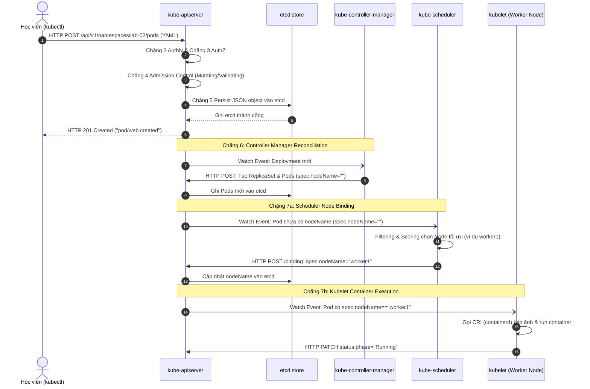
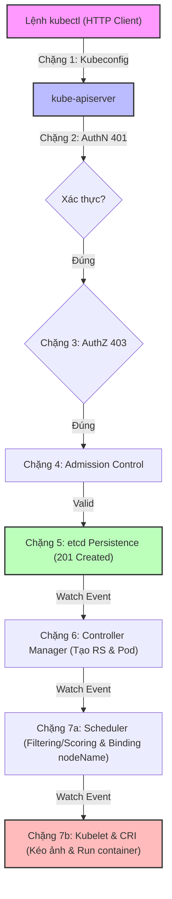
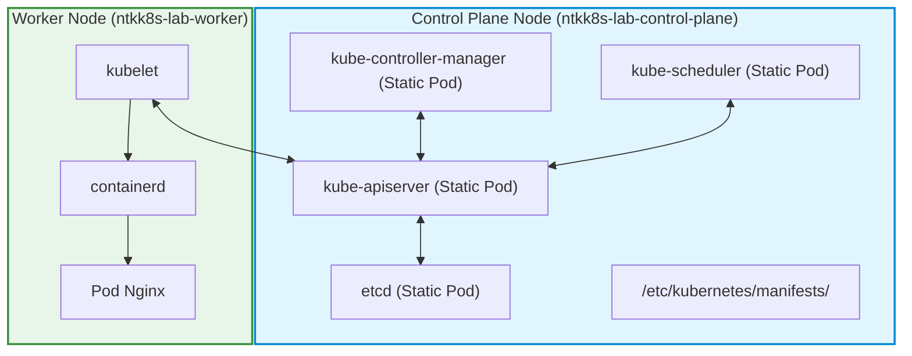


# [BÀI 02] KIẾN TRÚC CỤM KUBERNETES TOÀN DIỆN & ĐƯỜNG ĐI CỦA MỘT LỆNH KUBECTL (API SERVER, ETCD, KUBELET)

Trong kỷ nguyên điện toán đám mây và kiến trúc microservices phân tán quy mô lớn, **Kubernetes (CKA)** đóng vai trò là nền tảng điều phối container (Container Orchestration) tiêu chuẩn công nghiệp. Để làm chủ hệ thống trong môi trường sản xuất (Production) cũng như chinh phục kỳ thi chứng chỉ quốc tế của Linux Foundation / CNCF, kỹ sư không chỉ nắm vững các câu lệnh thao tác cơ bản mà phải thấu hiểu sâu sắc bản chất cơ chế tầng thấp: từ chu trình điều hòa (Reconciliation Loop), cấu trúc điều phối tài nguyên, kiến trúc mạng CNI, lưu trữ CSI cho đến các chuẩn mực an ninh phòng thủ chiều sâu.

Bài viết chuyên sâu này sẽ đồng hành cùng bạn giải mã toàn diện bức tranh kiến trúc, phân tích các đánh đổi kỹ thuật thực chiến (Engineering Trade-offs), cung cấp bài thực hành Lab từng bước và bộ câu hỏi phỏng vấn chuẩn Architect / Lead Engineer.

---

## 1. Bản Chất Kiến Trúc & Cơ Chế Vận Hành Tầng Thấp

| # | Câu hỏi ôn tập | Đáp án chuẩn ngắn gọn (chứa con số / tên lệnh) |
|---|---|---|
| 1 | Làm thế nào để soi toàn bộ thông tin HTTP Request/Response khi gõ lệnh `kubectl`? | Dùng cờ `-v=8` (hoặc `-v=9` debug cURL), ví dụ: `kubectl get pods -n lab-01 -v=8` |
| 2 | Kubeconfig (`~/.kube/config`) gồm ba khối cấu hình chính nào? | `clusters` (thông tin API server URL/CA), `users` (chứng chỉ/token), và `contexts` (ghép user + cluster + namespace) |
| 3 | Nếu `kube-scheduler` bị tắt, điều gì xảy ra khi ta gõ `kubectl create deploy web --image=nginx`? | Lệnh `kubectl` vẫn in `deployment.apps/web created`, nhưng các Pod sinh ra bị kẹt vĩnh viễn ở trạng thái `Pending` |
| 4 | Điểm đạt chính xác của ba kỳ thi CKA, CKAD và CKS là bao nhiêu? | CKA **66 %**, CKAD **66 %**, riêng CKS là **67 %** (ba chứng chỉ KHÔNG cùng một ngưỡng điểm đạt) |
| 5 | Danh sách công cụ được công bố có sẵn trên máy làm bài thi gồm những gì? | `kubectl` (kèm alias `k` và bash autocompletion), `yq`, `curl`, `wget`, `man`; **không** có `jq` |


> **Luận đề trung tâm của buổi:**
> *"Mọi thao tác trong Kubernetes đều là các yêu cầu HTTP RESTful gửi tới API Server (`kube-apiserver`); `kubectl` chỉ là một client HTTP có cấu hình; và một đối tượng được tạo thành công trên etcd không có nghĩa là nó đã chạy — hệ thống vận hành theo cơ chế điều hoà khai báo qua 7 chặng độc lập, nơi mỗi thành phần Control Plane (`kube-apiserver`, `etcd`, `kube-controller-manager`, `kube-scheduler`, `kubelet`) đảm nhận một công đoạn riêng biệt và có thể hỏng độc lập mà không làm sụp đổ toàn bộ các thành phần khác."*

**Bảng kết quả các buổi trước được dùng lại:**

| Kết quả / Công cụ | Nguồn gốc | Áp dụng vào buổi này |
|---|---|---|
| Lệnh `kubectl -v=8` | Buổi 01 `QT 6.2` | Dùng để bóc tách 7 chặng HTTP xử lý của API Server ở §4 và §7 |
| Chốt chặn context `kubectl config current-context` | Buổi 01 `QT 7.2` | Đảm bảo 100 % lệnh thực hành ở bài lab tác động đúng cụm `kind-ntkk8s-lab` |
| Đường gõ `jsonpath` / `custom-columns` | Buổi 01 `QT 5.2` | Dùng để trích xuất các trường `spec.nodeName` và `status.phase` mà không phụ thuộc `jq` |

Ba câu bài tập về nhà BTVN 4 của buổi 01 đã chuẩn bị sẵn dữ liệu thực tế cho học viên: Câu 1 soi thấy lời gọi HTTP GET/POST tới API Server; Câu 2 xác nhận Kubeconfig chứa thông tin AuthN; Câu 3 đã dự đoán chính xác Pod bị kẹt `Pending` khi mất Scheduler.

---


| # | Năng lực đạt được sau buổi học | Hiện vật chứng minh trong bài lab |
|---|---|---|
| 1 | Giải thích chính xác 7 chặng hành trình từ lệnh `kubectl` tới container | Tệp `hien-vat/bang-7-chang.md` có đầy đủ log HTTP method, URI, status code |
| 2 | Phân tích và khoanh vùng chính xác lỗi AuthN (`401`) vs AuthZ (`403`) | Kết quả log `-v=8` và đầu ra lệnh `kubectl auth can-i` |
| 3 | Chẩn đoán nguyên nhân Pod bị `Pending` do Scheduler hỏng/thiếu | Kết quả kiểm tra trường `spec.nodeName` rỗng bằng `jsonpath` |
| 4 | Tái hiện ca hỏng ngắt `kube-controller-manager` làm mất tự phục hồi | Nhật ký đo đạc khi xoá Pod mà không sinh Pod mới thay thế |
| 5 | Chứng minh Data Plane (Worker Node/CRI) vẫn chạy khi Control Plane chết | Số liệu `curl` thành công HTTP 200 OK vào Pod IP khi `kube-apiserver` dừng |
| 6 | Trích xuất thông tin HTTP Endpoint không dùng `jq` dưới 40 giây | Script `do-7-chang.sh` chạy thành công trên môi trường thi |

---


| Bắt buộc phải biết | Nguồn tự học nếu thiếu |
|---|---|
| Cách gõ imperative `kubectl run` / `kubectl create` | Buổi 01 `QT 4.1` và `QT 6.3` |
| Cấu trúc Kubeconfig và cách chọn context | Buổi 01 `QT 7.2` |
| Sử dụng `jsonpath` cơ bản với `kubectl -o jsonpath` | Buổi 01 `QT 5.2` |
| Môi trường máy học `kind` 3 node đã tạo | Buổi 01 `QT 7.1` và file `labs/kind-cluster.yaml` |

---


| # | Thuật ngữ tiếng Việt | Tiếng Anh tương đương | Ghi chú chuẩn hoá trong thân bài |
|---|---|---|---|
| 1 | Máy chủ API | API Server (`kube-apiserver`) | Tiến trình trung tâm tiếp nhận REST API request |
| 2 | Cơ sở dữ liệu etcd | etcd key-value store | Nơi lưu trữ trạng thái duy nhất của cụm |
| 3 | Bộ quản lý điều khiển | Controller Manager (`kube-controller-manager`) | Tập hợp các vòng lặp điều hoà trạng thái |
| 4 | Bộ lập lịch | Scheduler (`kube-scheduler`) | Tiến trình gán Node cho Pod dựa trên thuật toán |
| 5 | Tác nhân node | Kubelet (`kubelet`) | Daemon quản lý lifecycle container trên Worker Node |
| 6 | Giao diện runtime container | Container Runtime Interface (CRI) | Giao diện giao tiếp giữa Kubelet và containerd |
| 7 | Vòng điều hoà | Reconciliation Loop | Cơ sở cơ chế khai báo: liên tục đưa `status` → `spec` |
| 8 | Xác thực | Authentication (AuthN) | Kiểm tra danh tính: "Bạn là ai?" (`401`) |
| 9 | Uỷ quyền | Authorization (AuthZ) | Kiểm tra quyền hạn: "Bạn được làm gì?" (`403`) |
| 10 | Kiểm soát nạp | Admission Control | Mutating/Validating Webhook soát và sửa payload |
| 11 | Gán node | Node Binding | Thao tác Scheduler điền tên Node vào `spec.nodeName` |
| 12 | Nhật ký chi tiết | Verbose Logging (`-v=8`) | Cờ hiển thị HTTP headers và JSON body của `kubectl` |
| 13 | Mặt phẳng điều khiển | Control Plane | Khối các master components (`apiserver`, `etcd`, `cm`, `sched`) |
| 14 | Mặt phẳng dữ liệu | Data Plane | Khối các worker components (`kubelet`, `kube-proxy`, `containerd`) |


1. **Mô hình "Nhà bưu điện và 7 trạm kiểm soát":**
   Lệnh `kubectl` giống như việc gửi một bức thư JSON/YAML. Bưu điện `kube-apiserver` cho thư đi qua 7 trạm:
   - Trạm 1: Đọc địa chỉ Kubeconfig (Client Config).
   - Trạm 2: Kiểm tra thẻ căn cước (AuthN — `401 Unauthorized` nếu sai).
   - Trạm 3: Kiểm tra giấy phép xuất nhập cảnh (AuthZ — `403 Forbidden` nếu thiếu quyền RBAC).
   - Trạm 4: Soát nội dung & điền thêm trường thiếu (Admission Control — Mutating/Validating).
   - Trạm 5: Cất bản gốc vào két sắt bảo mật (Lưu etcd thành công → Trả `201 Created` cho client).
   - Trạm 6: Thư ký phân loại giao việc cho các đội (Controller Manager tạo ReplicaSet/Pod).
   - Trạm 7a: Người điều phối xếp chỗ ngồi (Scheduler ghi `spec.nodeName`).
   - Trạm 7b: Nhân viên tại phòng thực thi dựng lều (Kubelet gọi CRI kéo ảnh và chạy container).

2. **Mô hình "Khai báo (Spec) vs Thực tế (Status)":**
    Kubernetes hoạt động theo mô hình *Declarative State*. Khi học viên gõ lệnh, học viên ghi một bản thiết kế mong muốn (`spec`) vào etcd. `kube-apiserver` lưu bản thiết kế đó. Các controller riêng lẻ liên tục đọc `spec`, so sánh với trạng thái thực tế (`status`), và thực hiện hành vi điều hoà. Không có một thành phần đơn độc nào "làm từ A tới Z".

3. **Mô hình "API Server là điểm liên lạc duy nhất":**
   Các thành phần etcd, Scheduler, Controller Manager, Kubelet KHÔNG BAO GIỜ nói chuyện trực tiếp với nhau. Tất cả giao tiếp chiều dọc qua `kube-apiserver` bằng các kết nối HTTP/2 dài hạn (Long-polling / Watch API).

---

### 1.1. Bảy chặng của một lệnh `kubectl apply` (12 phút)

**Nguyên lý cốt lõi:** Mọi lệnh `kubectl` đều là yêu cầu HTTP RESTful gửi tới `kube-apiserver`; `kubectl` KHÔNG tự thực thi bất kỳ logic Kubernetes nào trên cụm mà chỉ đóng vai trò một HTTP client gửi bản kê khai JSON/YAML.

**Giải thích cơ chế ngầm:** `kubectl` là ứng dụng dòng lệnh phía máy khách (Client CLI). Khi chạy, nó đọc Kubeconfig tại `~/.kube/config`, xác định API Server Endpoint (ví dụ `https://127.0.0.1:6443`), mã hoá bản kê khai YAML thành JSON payload và phát một HTTP Request (POST/PUT/PATCH/GET). Nếu tiến trình `kube-apiserver` ngừng hoạt động, lệnh `kubectl` sập lập tức với lỗi kết nối mạng.

> [!WARNING]
> **CẠM BẪY THỰC CHIẾN:**
> Học viên lầm tưởng `kubectl` có thể "tự sửa" hoặc "tự lưu trữ" trạng thái offline khi mất mạng. Khi API Server ngắt kết nối, lệnh `kubectl get nodes` in ra: `The connection to the server 127.0.0.1:6443 was refused - did you specify the right host or port?`.

**Minh hoạ.**

```bash
# SAI — tin rằng kubectl tự xử lý logic nội bộ mà không gọi mạng
kubectl apply -f pod.yaml

# ĐÚNG — mở verbose log level 6 để thấy rõ lệnh kubectl mở kết nối HTTP POST tới API Server
kubectl apply -f pod.yaml -v=6
# Output thực tế:
# I0818 20:00:00.123456   12345 loader.go:395] Config loaded from file: /root/.kube/config
# I0818 20:00:00.150000   12345 round_trippers.go:553] POST https://127.0.0.1:6443/api/v1/namespaces/default/pods 201 Created in 25 milliseconds
```

Con số chốt: **7** chặng xử lý; cổng API mặc định **6443**.

---

**Nguyên lý cốt lõi:** Chặng 1, 2, 3 (Authentication & Authorization): API Server kiểm tra danh tính người gửi qua X.509 Certificate hoặc Bearer Token (AuthN), sau đó kiểm tra quyền truy cập qua RBAC (AuthZ); AuthN thất bại trả mã `401 Unauthorized`, AuthZ thất bại trả mã `403 Forbidden`.

**Giải thích cơ chế ngầm:** API Server xử lý các request theo đúng thứ tự bảo mật tuyến tính. Trước khi giải mã Body của request, API Server xác thực danh tính client (AuthN ở Chặng 2). Sau khi biết client là ai (ví dụ User `system:serviceaccount:default:my-sa`), API Server chuyển sang Chặng 3 (AuthZ) đối chiếu với các quy tắc RBAC RoleBinding/ClusterRoleBinding. Nếu vi phạm AuthN, mã trả về là `401`. Nếu vi phạm AuthZ, mã trả về là `403`.

> [!WARNING]
> **CẠM BẪY THỰC CHIẾN:**
> Học viên bị từ chối truy cập nhưng không biết lỗi do thiếu chứng chỉ/token hay do thiếu quyền RBAC. Đầu ra báo lỗi `Error from server (Forbidden): pods is forbidden: User "dev-user" cannot list resource "pods" in API group "" in the namespace "lab-02"`.

**Minh hoạ.**

```bash
# SAI — thử gõ lại lệnh nhiều lần khi dính lỗi 403 mà không tra cứu quyền
kubectl get pods -n lab-02 --as=dev-user

# ĐÚNG — kiểm tra quyền bằng auth can-i ở Chặng 3 trước khi gõ lệnh thật
kubectl auth can-i list pods -n lab-02 --as=dev-user
# Output trả về: no (chứng minh dính lỗi AuthZ ở Chặng 3)
```

Con số chốt: mã **`401`** cho Authentication; mã **`403`** cho Authorization.

---

**Nguyên lý cốt lõi:** Chặng 4 & 5 (Admission Control & etcd Persistence): Mutating Webhook chỉnh sửa payload, Validating Webhook kiểm tra quy tắc; khi vượt qua cả hai, API Server ghi đối tượng vào etcd và trả về kết quả `201 Created` / `200 OK` cho `kubectl`.

**Giải thích cơ chế ngầm:** Tại Chặng 4, Mutating Admission Webhook có thể tự động điền các trường mặc định (ví dụ tự gắn `ServiceAccountToken`, tự gắn `imagePullPolicy`). Sau đó Validating Admission Webhook kiểm tra tính hợp lệ (ví dụ PodSecurity Standards). Nếu hợp lệ, API Server ghi JSON object trực tiếp vào etcd (Chặng 5). Ngay khi etcd xác nhận đã lưu, API Server lập tức trả phản hồi HTTP 201 Created cho `kubectl`. Lúc này, Pod mới chỉ tồn tại dưới dạng một bản ghi trong cơ sở dữ liệu etcd — chưa hề có container nào được khởi tạo trên Worker Node.

> [!WARNING]
> **CẠM BẪY THỰC CHIẾN:**
> Màn hình terminal in `pod/web created`, học viên vội vàng báo cáo công việc hoàn thành trong khi Pod có thể đang kẹt `Pending` hoặc `ImagePullBackOff`.

**Minh hoạ.**

```bash
# SAI — tin rằng phản hồi "created" là ứng dụng đã sẵn sàng chạy
kubectl run web --image=nginx
# Output: pod/web created (mới chỉ ghi xong etcd ở Chặng 5!)

# ĐÚNG — kiểm tra ngay trạng thái gán Node (Chặng 7a) và phase của Pod (Chặng 7b)
kubectl get pod web -o jsonpath='Node: {.spec.nodeName}{"\t"}Phase: {.status.phase}{"\n"}'
```

Con số chốt: **2** loại Admission Webhook (Mutating thực thi trước, Validating thực thi sau).

---

### 1.2. Vòng điều hoà và phân tách trách nhiệm giữa các Controller (10 phút)



---

**Nguyên lý cốt lõi:** Chặng 6 (Controller Reconciliation): `kube-controller-manager` chứa hàng loạt vòng lặp điều hoà chạy ngầm; khi thấy Deployment mới trong etcd, Deployment Controller tạo ReplicaSet, và ReplicaSet Controller tạo các Pod khai báo ở trạng thái `Pending` (`spec.nodeName` rỗng).

**Giải thích cơ chế ngầm:** Tiến trình `kube-controller-manager` là một tập hợp gồm hàng chục controller chạy song song (Deployment Controller, ReplicaSet Controller, Node Controller, Job Controller...). Khi nhận được sự kiện Watch từ API Server rằng có Deployment mới được tạo, Deployment Controller tính toán và phát lệnh POST tạo ReplicaSet. ReplicaSet Controller thấy số bản sao mong muốn (`spec.replicas: 3`) chưa đủ, lập tức phát 3 lệnh POST tạo 3 Pod. Nhưng ReplicaSet Controller KHÔNG quyết định Pod chạy ở Node nào — các Pod sinh ra ở Chặng 6 đều mang trường `spec.nodeName=""` (chuỗi rỗng).

> [!WARNING]
> **CẠM BẪY THỰC CHIẾN:**
> Học viên xoá Pod của một Deployment và thấy Pod đó lập tức biến mất rồi xuất hiện Pod mới với tên khác. Dấu hiệu trong lệnh `kubectl get pods`: Pod mới được tạo bởi ReplicaSet Controller có trường `spec.nodeName` rỗng trong vài mili-giây đầu tiên.

**Minh hoạ.**

```bash
# Xem thông tin Pod do ReplicaSet Controller tạo ra ở Chặng 6 (khi chưa gán node)
kubectl get pod -l app=web -o jsonpath='{range .items[*]}{.metadata.name}{"\tNode: "}{.spec.nodeName}{"\n"}{end}'
```

Con số chốt: **0** (ReplicaSet Controller tạo Pod nhưng giá trị `spec.nodeName` gán ban đầu luôn là chuỗi rỗng `""`).

---

**Nguyên lý cốt lõi:** Chặng 7a (Scheduler Binding): `kube-scheduler` quét các Pod có `spec.nodeName` rỗng, thực hiện 2 pha Filtering (lọc Node đủ điều kiện) và Scoring (chấm điểm Node tốt nhất), sau đó phát lệnh Binding ghi giá trị Node được chọn vào `spec.nodeName` thông qua API Server.

**Giải thích cơ chế ngầm:** `kube-scheduler` hoạt động theo cơ chế thụ động: nó liên tục lắng nghe API Server qua Watch API để tìm Pod nào có `spec.nodeName == ""`. Khi tìm thấy, nó thực hiện Thuật toán 2 pha:
1. **Filtering (Predicates):** Loại bỏ các Node không đủ tài nguyên CPU/RAM, không thoả `nodeSelector`, hoặc dính `Taints`.
2. **Scoring (Priorities):** Chấm điểm các Node còn lại dựa trên độ phân bổ tải, vị trí ảnh container sẵn có. Node cao điểm nhất được chọn.
Sau đó, Scheduler gửi một sub-resource request `/binding` tới API Server để ghi tên Node vào `spec.nodeName`. Scheduler KHÔNG hề gọi lệnh Docker/containerd để tạo container.

> [!WARNING]
> **CẠM BẪY THỰC CHIẾN:**
> Pod bị kẹt ở trạng thái `Pending`. Học viên chạy sang Worker Node gõ lệnh `crictl ps` để kiểm tra container thay vì mô tả Pod bằng `kubectl describe pod` để xem log sự kiện Filtering/Scoring của Scheduler.

**Minh hoạ.**

```bash
# SAI — kiểm tra crictl trên worker node khi Pod đang Pending do Scheduler
ssh worker1 "crictl ps"

# ĐÚNG — kiểm tra sự kiện lập lịch Chặng 7a từ Scheduler
kubectl describe pod web-7d4b-x9z2 | grep -A 5 "Events:"
# Output: 0/3 nodes are available: 1 node(s) had untolerated taint, 2 Insufficient memory.
```

Con số chốt: **2** pha lập lịch của Scheduler (Filtering → Scoring).

---

**Nguyên lý cốt lõi:** Chặng 7b (Kubelet Execution): `kubelet` trên Worker Node nhận thấy có Pod mới được gán `spec.nodeName` trùng với tên Node của mình, lập tức gọi CRI (containerd) để tạo network namespace, kéo ảnh, khởi chạy container và báo cáo trạng thái `status` về API Server.

**Giải thích cơ chế ngầm:** `kubelet` là tác nhân duy nhất chạy trên từng Node Worker chịu trách nhiệm quản lý lifecycle của container. Kubelet liên tục Watch API Server với điều kiện lọc `spec.nodeName == <tên-node-hiện-tại>`. Ngay khi thấy Pod được gán cho Node của mình ở Chặng 7a, Kubelet chuyển sang thực thi Chặng 7b:
1. Gọi CRI plugin (`containerd`) tạo Sandbox Container (Pause container) lập Network Namespace.
2. Gọi CNI plugin dựng IP và cắm card mạng virtual veth.
3. Kéo ảnh container (ImagePull) và khởi tạo main container.
4. Gửi HTTP PATCH request cập nhật `status.phase = "Running"` và `status.podIP` về API Server.

> [!WARNING]
> **CẠM BẪY THỰC CHIẾN:**
> Pod có `spec.nodeName = "worker1"` nhưng kẹt ở phase `ContainerCreating` hoặc `ImagePullBackOff`. Đây là dấu hiệu Chặng 7a đã xong (Scheduler đã chọn Node), nhưng Chặng 7b thất bại giữa Kubelet và Container Runtime (CRI).

**Minh hoạ.**

```bash
# Kiểm tra log của Kubelet trên worker1 khi Chặng 7b gặp sự cố kéo ảnh/tạo container
journalctl -u kubelet -n 50 --no-pager | grep -i "Failed to create pod sandbox"
```

Con số chốt: **1** daemon duy nhất trên từng Worker Node (`kubelet`) làm nhiệm vụ giao tiếp CRI.

---

### 1.3. Tắt/hỏng từng thành phần Control Plane — Thành phần nào chết thì hỏng cái gì (8 phút)

**Nguyên lý cốt lõi:** Khi `kube-scheduler` bị hỏng hoặc dừng: Lệnh tạo Deployment/Pod vẫn thành công (Chặng 1–5 OK), Controller Manager vẫn tạo Pod khai báo (Chặng 6 OK), nhưng mọi Pod mới sẽ bị kẹt vĩnh viễn ở trạng thái `Pending` (`spec.nodeName` rỗng). Các Pod đã chạy từ trước VẪN HOẠT ĐỘNG BÌNH THƯỜNG.

**Giải thích cơ chế ngầm:** Scheduler chỉ tham gia vào công đoạn gán Node cho các Pod MỚI sinh ra ở Chặng 7a. Scheduler không tham gia vào luồng xử lý dữ liệu (Data Plane) của các Pod đã có Node và đang chạy. Do đó, việc mất Scheduler chỉ đóng băng khả năng xếp lịch Pod mới, không làm sập các ứng dụng hiện tại.

> [!WARNING]
> **CẠM BẪY THỰC CHIẾN:**
> Thấy ứng dụng hiện tại vẫn truy cập tốt, học viên lầm tưởng cụm Kubernetes hoàn toàn khoẻ mạnh, cho tới khi thực hiện scale up Deployment hoặc tạo Pod mới và thấy Pod bị kẹt `Pending` âm thầm.

**Minh hoạ.**

```bash
# Kiểm tra sự cố Scheduler bị hỏng bằng cách lọc Pod Pending có spec.nodeName rỗng
kubectl get pods -n lab-02 -o jsonpath='{range .items[?(@.status.phase=="Pending")]}{.metadata.name}{"\tNodeName: ["}{.spec.nodeName}{"]\n"}{end}'
# Output: web-new-123    NodeName: []
```

Con số chốt: **0** Pod mới được gán Node khi Scheduler chết.

---

**Nguyên lý cốt lõi:** Khi `kube-controller-manager` bị hỏng hoặc dừng: Lệnh `kubectl run` (tạo Pod đơn) hoặc `kubectl apply` vẫn ghi được etcd; nhưng tự động phục hồi (auto-healing), tự động co giãn (scaling), và việc sinh Pod từ Deployment/ReplicaSet bị tê liệt hoàn toàn.

**Giải thích cơ chế ngầm:** Khi Controller Manager dừng, các vòng lặp điều hoà bị ngắt. API Server vẫn tiếp nhận request ghi etcd ở Chặng 5. Tuy nhiên ở Chặng 6, không có ReplicaSet Controller nào lắng nghe để sinh ra các Pod con khi học viên tạo Deployment mới, hoặc không có Node Controller nào phát hiện Node chết để đuổi Pod. Lệnh `kubectl run` tạo Pod đơn lẻ (không qua Deployment/ReplicaSet) vẫn có thể chạy nếu được gán Node thủ công hoặc Scheduler còn sống.

> [!WARNING]
> **CẠM BẪY THỰC CHIẾN:**
> Học viên cố tình gõ `kubectl delete pod` trên một Pod thuộc Deployment để test tính năng tự phục hồi (auto-healing), nhưng Pod bị xoá đi và số lượng Pod của Deployment bị thiếu hụt vĩnh viễn mà không có Pod mới nào tự mọc ra.

**Minh hoạ.**

```bash
# Kiểm tra số lượng replicas thực tế so với replicas khai báo khi controller-manager chết
kubectl get deployment web -o jsonpath='Spec Replicas: {.spec.replicas}{"\t"}Ready Replicas: {.status.readyReplicas}{"\n"}'
# Output: Spec Replicas: 3    Ready Replicas: 2 (thiếu 1 Pod do không ai tự bù!)
```

Con số chốt: **0** Pod mới được tự bù khi Pod cũ bị xoá trong lúc Controller Manager chết.

---

**Nguyên lý cốt lõi:** Khi `kube-apiserver` bị hỏng hoặc dừng: Toàn bộ công cụ quản lý (`kubectl`, Dashboard, CI/CD) đều tê liệt hoàn toàn; nhưng các container/Pod đang chạy trên Worker Node VẪN TIẾP TỤC CHẠY và xử lý lưu lượng người dùng bình thường.

**Giải thích cơ chế ngầm:** Các container đang chạy trên Worker Node do `containerd` quản lý trực tiếp dưới sự điều khiển của nhân Linux (cgroups/namespaces). `kube-apiserver` thuộc về Control Plane (Mặt phẳng điều khiển), không nằm trên đường đi của dữ liệu (Data Plane). Khi API Server chết, Kubelet mất kết nối báo cáo status, nhưng `containerd` không tự xoá hay dừng các container đang chạy.

> [!WARNING]
> **CẠM BẪY THỰC CHIẾN:**
> Khi gõ `kubectl` bị báo lỗi `connection refused`, người vận hành hoảng loạn tuyên bố toàn bộ hệ thống sản xuất đã sập hoàn toàn và vội vàng ngắt điện máy chủ, làm gián đoạn ứng dụng thực tế.

**Minh hoạ.**

```bash
# Lệnh kubectl thất bại 100% khi API Server dừng
kubectl get pods
# Output: The connection to the server 127.0.0.1:6443 was refused - did you specify the right host or port?

# Nhưng kiểm tra kết nối tới Pod IP thông qua Nginx container vẫn trả về kết quả 200 OK
curl -i http://10.244.1.5:80
# Output: HTTP/1.1 200 OK (Data plane vẫn sống 100%!)
```

Con số chốt: **100 %** lưu lượng Data Plane của các Pod đã chạy vẫn hoạt động bình thường khi Control Plane chết.

---

**Nguyên lý cốt lõi:** Thứ tự ưu tiên cứu cụm khi toàn bộ Control Plane gặp sự cố: Khôi phục `etcd` & `kube-apiserver` trước tiên (để mở lại kênh giao tiếp) → Khôi phục `kube-controller-manager` (khôi phục tự điều hòa) → Khôi phục `kube-scheduler` (cho phép xếp lịch Pod mới).

**Giải thích cơ chế ngầm:** Các thành phần Control Plane có mối quan hệ phụ thuộc phân cấp khắt khe. `kube-controller-manager` và `kube-scheduler` đều là các client HTTP kết nối tới `kube-apiserver`. Nếu API Server hoặc cơ sở dữ liệu etcd chưa sống lại, việc cố gắng khởi chạy hay debug Controller Manager và Scheduler là vô ích vì chúng không thể kết nối hay đọc/ghi dữ liệu.

> [!WARNING]
> **CẠM BẪY THỰC CHIẾN:**
> Sysadmin lao vào đọc log của `kube-scheduler` và cố khởi động lại Scheduler trong khi `kube-apiserver` vẫn đang ở trạng thái CrashLoopBackOff do lỗi file cấu hình.

**Minh hoạ.**

```bash
# Quy trình kiểm tra / khôi phục 3 bước chuẩn xác theo thứ tự phụ thuộc:
# Bước 1: Kiểm tra etcd & kube-apiserver trên Control Plane node
sudo crictl ps | grep -E "apiserver|etcd"

# Bước 2: Chỉ khi Bước 1 sống, mới kiểm tra kube-controller-manager
sudo crictl ps | grep controller-manager

# Bước 3: Kiểm tra kube-scheduler
sudo crictl ps | grep scheduler
```

Con số chốt: **3** bước khôi phục khống chế thứ tự phụ thuộc.

---

### 1.4. Đọc chi tiết log verbose `-v=8` và `-v=9` để khoanh vùng chặng hỏng (2 phút)

**Nguyên lý cốt lõi:** Cờ `-v=8` của `kubectl` hiển thị toàn bộ HTTP Request/Response Headers và Body; `-v=9` hiển thị lệnh `curl` tương đương; đây là công cụ số một để phân định một lỗi xảy ra do client gõ sai, do AuthN/AuthZ, hay do API Server từ chối.

**Giải thích cơ chế ngầm:** Ở chế độ mặc định, `kubectl` ẩn đi toàn bộ chi tiết giao tiếp HTTP phía dưới và chỉ hiển thị một dòng thông báo lỗi ngắn gọn. Khi bật `-v=8`, `kubectl` in ra toàn bộ Curl-like HTTP Request Headers, Request Body dạng JSON, HTTP Status Code trả về từ API Server và Response Body. Nhờ đó, người vận hành phân biệt được ngay lỗi xảy ra ở Chặng 2 (AuthN `401`), Chặng 3 (AuthZ `403`), Chặng 4 (Admission `422 Unprocessable Entity`) hay Chặng 5 (API Server Timeout `504`).

> [!WARNING]
> **CẠM BẪY THỰC CHIẾN:**
> Nhìn thấy thông báo lỗi chung chung của `kubectl` rồi ngồi đoán mò nguyên nhân, thay vì bật ngay cờ `-v=8` để xem chính xác mã lỗi HTTP trả về từ API Server.

**Minh hoạ.**

```bash
# Chạy kubectl với verbose level 8 để soi chi tiết luồng HTTP REST API
kubectl get pods -n lab-02 -v=8 2>&1 | grep -E "GET|HTTP/|Response Body"
# Output thực tế:
# I0818 20:10:00.100000   12345 round_trippers.go:466] GET https://127.0.0.1:6443/api/v1/namespaces/lab-02/pods?limit=500
# I0818 20:10:00.115000   12345 round_trippers.go:495] Response Status: 200 OK in 15 milliseconds
```

Con số chốt: Mức verbose **`-v=8`** (soi header + body JSON) và **`-v=9`** (chế độ cURL debug).

---

### 1.5. Đưa vào cụm thật (4 phút)

### Áp vào cụm đang chạy thì làm gì trước

1. **Khảo sát hạ tầng Control Plane hiện tại:** Sử dụng `kubectl get pods -n kube-system` hoặc `crictl ps` trên node master để xác định các thành phần Control Plane đang chạy dưới dạng Static Pods hay hệ thống bên ngoài.
2. **Kiểm tra độ trễ của API Server:** Chạy `kubectl get --raw /readyz -v=8` để đo thời gian phản hồi của API Server. Nếu thời gian phản hồi lớn hơn 500ms, API Server hoặc etcd đang gặp tình trạng quá tải.
3. **Thiết lập theo dõi trạng thái các Controller:** Đảm bảo hệ thống giám sát (Prometheus/Grafana) theo dõi các metrics quan trọng: `apiserver_request_duration_seconds`, `workqueue_depth` của Controller Manager, và `scheduler_pending_pods`.

### Cái gì hỏng nếu áp thẳng lên prod

- **Tắt nhầm API Server trên cụm Production có nhiều client tích hợp:** Khi API Server ngắt, các dịch vụCI/CD, Ingress Controller, Helm deployments và HPA (Horizontal Pod Autoscaler) sẽ thất bại lập tức. HPA không thể đọc metrics để co giãn Pod khi bị quá tải.
- **Canh chỉnh cờ `--request-timeout` quá ngắn:** Nếu đặt timeout quá thấp (< 2 giây), các câu lệnh liệt kê tài nguyên lớn (`kubectl get pods -A`) trên cụm lớn có hàng nghìn Pod sẽ bị ngắt giữa chừng và trả về lỗi ngắt kết nối.
- **Quy trình áp thử an toàn:**
  - Luôn thử nghiệm trên cụm staging/kind trước khi tác động lên Control Plane sản xuất.
  - Sử dụng cờ `--dry-run=server` để kiểm tra qua Chặng 1–4 (AuthN, AuthZ, Admission) trên API Server thật mà KHÔNG ghi dữ liệu vào etcd ở Chặng 5.

### Đo trước — đo sau

1. **Thời gian phản hồi của API Server (`apiserver_request_duration_seconds`):** Mục tiêu < 50ms cho các tác vụ ghi (POST/PUT) và < 20ms cho các tác vụ đọc (GET).
2. **Số lượng Pod kẹt trạng thái `Pending` do thiếu Scheduler:** Đo con số này bằng 0 trên hệ thống vận hành bình thường.
3. **Tỉ lệ lỗi HTTP 5xx từ API Server:** Giữ tỉ lệ này dưới 0,01 %.

### Khi nào KHÔNG nên dùng

- **Không dùng `kubectl -v=8` hoặc `-v=9` trong các script tự động hoá CI/CD sản xuất:** Log verbose level 8/9 in ra toàn bộ HTTP Body và Tokens/Certificates trong Header, gây rò rỉ thông tin nhạy cảm vào hệ thống quản lý log (Log Leakage) và làm phình to dung lượng log tốn hàng GB đĩa cứng.
- **Không tự ý di chuyển các file manifest trong `/etc/kubernetes/manifests/` trên cụm Production đang chạy:** Việc di chuyển file static pod manifest sẽ làm Kubelet ngắt và xoá ngay lập tức container Control Plane tương ứng, gây gián đoạn khả năng quản lý cụm.

---

### 1.6. Bẫy hay gặp (2 phút)

| # | Bẫy hay gặp | Vì sao dính bẫy | Làm đúng là (kèm tên lệnh / con số) |
|---|---|---|---|
| 1 | Tưởng `kubectl` là lệnh thực thi trực tiếp trên máy | Quen tư duy bash shell cục bộ | `kubectl -v=8` chứng minh nó là HTTP Client gọi tới port `6443` |
| 2 | Nhầm `pod/web created` là ứng dụng đã chạy | Thấy phản hồi `created` từ API Server | Kiểm tra `kubectl get pod web -o jsonpath='{.status.phase}'` phải là `Running` |
| 3 | Tưởng API Server chết là toàn bộ trang web/Pod sập | Nhầm lẫn giữa Control Plane và Data Plane | `curl http://<POD_IP>:80` chứng minh container trên Worker vẫn chạy 100% |
| 4 | Kiểm tra CRI (`crictl`) khi Pod bị `Pending` do Scheduler | Không phân biệt lỗi Chặng 7a (Scheduler) vs Chặng 7b (Kubelet) | `kubectl get pod -o jsonpath='{.spec.nodeName}'` — nếu rỗng là lỗi Chặng 7a |
| 5 | Dùng `kubectl edit` sửa `spec.nodeName` của Pod | Quên rằng trường `spec.nodeName` là immutable sau khi tạo | Xoá Pod cũ, tạo Pod mới có khai báo `spec.nodeName` từ file YAML |
| 6 | Nhầm lỗi `401 Unauthorized` với `403 Forbidden` | Quên thứ tự AuthN (xác thực) chạy trước AuthZ (uỷ quyền) | `401` là AuthN (sai cert/token); `403` là AuthZ (RBAC thiếu quyền) |
| 7 | Cố cho Controller Manager kết nối thẳng etcd | Nghĩ rằng gọi etcd trực tiếp sẽ nhanh hơn | Chỉ có `kube-apiserver` được mở kết nối cổng etcd `2379` |
| 8 | Nhầm lẫn tên label khi gán Node thủ công | Gõ sai chính tả key/value của Node label | Kiểm tra `kubectl get node --show-labels` trước khi gán |
| 9 | Khôi phục Scheduler trước API Server khi cụm sập | Không nắm thứ tự phụ thuộc giữa các thành phần | Tuân thủ thứ tự: etcd/apiserver → controller-manager → scheduler |
| 10 | Quên cờ `-n <namespace>` khi soi log verbose `-v=8` | API Server trả về danh sách rỗng của namespace `default` | Luôn thêm `-n lab-02` trong lệnh: `kubectl get pods -n lab-02 -v=8` |
| 11 | Sửa static pod manifest gõ sai đường dẫn | Kubelet không phát hiện được file mới/sửa | Đường dẫn bất biến là `/etc/kubernetes/manifests/` |
| 12 | Đọc log `-v=8` lướt bằng mắt gây trôi thông tin | Log verbose in quá nhiều thông tin headers gây nhiễu | Lọc dòng cần thiết bằng `kubectl ... -v=8 2>&1 \| grep -E "GET\|POST\|Response Status"` |

---

## §10. Tóm tắt (2 phút)



### Năm điều phải nhớ

1. **`kubectl` là HTTP Client:** Mọi thao tác gõ trên bàn phím đều chuyển thành lệnh HTTP REST gửi tới cổng `6443` của `kube-apiserver`.
2. **`created` không có nghĩa là `Running`:** Dòng `created` xuất hiện ở Chặng 5 khi etcd lưu xong dữ liệu, trước khi Scheduler gán Node (Chặng 7a) và Kubelet tạo container (Chặng 7b).
3. **Phân tách Data Plane và Control Plane:** `kube-apiserver` chết làm tê liệt khả năng quản lý, nhưng các container đang chạy trên Worker Node vẫn tiếp tục xử lý lưu lượng Data Plane bình thường.
4. **Sự cố Pod `Pending` do Scheduler:** Khi Scheduler chết hoặc hỏng, Pod sinh ra bị kẹt ở `Pending` với trường `spec.nodeName=""` rỗng.
5. **Thứ tự khôi phục Control Plane:** etcd & API Server (giao tiếp) → Controller Manager (điều hoà) → Scheduler (lập lịch).

---

## §11. Câu hỏi tự kiểm tra

1. Lệnh `kubectl` đọc thông tin địa chỉ API Server và chứng chỉ người dùng từ tệp nào?
2. Mã lỗi HTTP trả về là bao nhiêu khi người dùng gửi một request với Bearer Token đã hết hạn?
3. Sự khác nhau cơ bản giữa Mutating Admission Webhook và Validating Admission Webhook ở Chặng 4 là gì?
4. Tại sao dòng `deployment.apps/nginx created` trả về cho người dùng ngay cả khi cụm chưa có Worker Node nào?
5. Trường nào trong `spec` của Pod quyết định việc Scheduler sẽ bỏ qua không lập lịch cho Pod đó nữa?
6. Khi xoá một Pod thuộc sở hữu của Deployment, thành phần nào chịu trách nhiệm phát hiện sự thiếu hụt và phát lệnh tạo Pod mới?
7. Hai pha xử lý chính của `kube-scheduler` khi tìm Node cho Pod là gì?
8. Nếu `kube-apiserver` bị crash ngắt kết nối, các container Nginx đang chạy trên Worker Node có bị dừng không? Tại sao?
9. Công cụ nào giúp hiển thị chi tiết toàn bộ HTTP Request Headers và Body JSON khi gõ lệnh `kubectl`?
10. Tại sao ta không nên bật cờ `-v=8` trong các script tự động hoá CI/CD trên môi trường sản xuất?
11. Khi toàn bộ Control Plane bị sập, thứ tự khôi phục đúng giữa 3 tiến trình API Server, Scheduler và Controller Manager là gì?
12. Đường dẫn thư mục mặc định chứa các tệp Static Pod manifest trên node Control Plane là gì?

### Đáp án

1. Tệp Kubeconfig tại `~/.kube/config` (khối `clusters` và `users`).
2. Mã lỗi `401 Unauthorized` (chặng AuthN thất bại).
3. Mutating Admission Webhook chạy trước để chỉnh sửa/điền thêm trường; Validating Admission Webhook chạy sau để kiểm tra quy tắc và chấp nhận/từ chối payload.
4. Vì dòng `created` xuất hiện ở Chặng 5 ngay khi `kube-apiserver` ghi đối tượng thành công vào etcd.
5. Trường `spec.nodeName` (nếu trường này đã có giá trị tên Node, Scheduler sẽ bỏ qua Pod đó).
6. ReplicaSet Controller (thuộc tiến trình `kube-controller-manager`).
7. Pha 1: Filtering (lọc các Node đủ điều kiện); Pha 2: Scoring (chấm điểm các Node còn lại và chọn Node cao nhất).
8. Không bị dừng. Vì container do `containerd` quản lý trực tiếp dưới Worker Node (Data Plane), độc lập với Control Plane.
9. Cờ `-v=8` (hoặc `-v=9` để xuất câu lệnh cURL).
10. Vì `-v=8` in ra toàn bộ Auth Tokens/Certificates gây rò rỉ thông tin bảo mật vào hệ thống log và làm phình dung lượng đĩa.
11. Thứ tự khôi phục: `kube-apiserver` & etcd → `kube-controller-manager` → `kube-scheduler`.
12. Thư mục `/etc/kubernetes/manifests/`.

---

## §12. Tài liệu tham khảo

| Nguồn tài liệu | Phiên bản Kubernetes áp dụng | Nội dung chính |
|---|---|---|
| Official Docs: Kubernetes Components | Kubernetes v1.35 | Kiến trúc tổng quan các thành phần Control Plane & Node |
| Official Docs: Managing Resources with kubectl | Kubernetes v1.35 | Chi tiết các mức log verbose (`-v=6`, `-v=8`, `-v=9`) |
| CNCF CKA Exam Curriculum | Kubernetes v1.35 | Miền Cluster Architecture (25%) và Troubleshooting (30%) |
| File cấu hình phiên bản cục bộ | `labs/phien-ban.env` | Biến `K8S_VER=1.35`, `LAB_CONTEXT="kind-ntkk8s-lab"` |

---

## Bảng đối soát thời lượng

| Section | Tiêu đề mục | Ngân sách thời gian |
|---|---|---|
| §0 | Khởi động và ôn tập | 10 phút |
| §1 | Sau buổi này học viên LÀM ĐƯỢC gì | 1 phút |
| §2 | Cần biết trước | 1 phút |
| §3 | Thuật ngữ và mô hình tư duy | 8 phút |
| §4 | Bảy chặng của một lệnh `kubectl apply` | 12 phút |
| §5 | Vòng điều hoà và phân tách trách nhiệm giữa các Controller | 10 phút |
| §6 | Tắt/hỏng từng thành phần Control Plane — Thành phần nào chết thì hỏng cái gì | 8 phút |
| §7 | Đọc chi tiết log verbose `-v=8` và `-v=9` để khoanh vùng chặng hỏng | 2 phút |
| §8 | Đưa vào cụm thật | 4 phút |
| §9 | Bẫy hay gặp | 2 phút |
| §10 | Tóm tắt | 2 phút |
| **Tổng** | **Khối lý thuyết** | **60'** |

---

## 2. Hướng Dẫn Thực Hành & Triển Khai Lab Chuẩn Production

> [!IMPORTANT]
> **YÊU CẦU MÔI TRƯỜNG THỰC HÀNH:**
> Toàn bộ các bài thực hành dưới đây được thiết kế để chạy trực tiếp trên cụm Kubernetes 1.30+ tiêu chuẩn (hoặc cụm kind/kubeadm lab). Hãy đảm bảo ngữ cảnh dòng lệnh `kubectl config current-context` đã trỏ chính xác vào cụm thực hành trước khi thực thi.

## Khối thực hành — 120 phút

## L0. Mục tiêu thực hành và tiêu chí hoàn thành

| # | Mục tiêu thực hành | Tiêu chí hoàn thành (Kiểm chứng BẰNG LỆNH) |
|---|---|---|
| TH1 | Bóc tách 7 chặng giao tiếp HTTP của `kubectl` | Log `-v=8` trích xuất được HTTP Method `POST`, URI Endpoint và mã `201 Created` |
| TH2 | Phân định lỗi AuthN (`401`) và AuthZ (`403`) | Lệnh `kubectl --as=dev-user` trả về đúng mã lỗi `403` ở Chặng 3 |
| TH3 | Tái hiện ca hỏng tắt `kube-scheduler` | `spec.nodeName` của Pod mới sinh ra ở trạng thái rỗng `""` và phase là `Pending` |
| TH4 | Tái hiện ca hỏng tắt `kube-controller-manager` | Xoá 1 Pod thuộc Deployment, tổng số Pod giảm đi 1 và KHÔNG CÓ Pod mới tự phục hồi |
| TH5 | Tái hiện ca hỏng tắt `kube-apiserver` | Lệnh `kubectl` báo `connection refused` nhưng `curl` trực tiếp Pod IP trả về `HTTP 200 OK` |
| TH6 | Khôi phục toàn bộ Control Plane theo đúng thứ tự | Cụm `kind-ntkk8s-lab` trở lại trạng thái 100% `Ready` với 3/3 node |
| TH7 | Tạo script tự động trích xuất log HTTP không dùng `jq` | Script `hien-vat/do-7-chang.sh` chạy thành công trả về HTTP status code |
| TH8 | Nộp đủ 4 hiện vật vào portfolio | Thư mục `k8s-portfolio/buoi-02/` chứa đủ 4 file md/sh |

---

## L1. Điều kiện tiên quyết về môi trường

| # | Kiểm tra điều kiện | Câu lệnh kiểm tra | Kết quả kỳ vọng |
|---|---|---|---|
| 1 | Cụm `kind-ntkk8s-lab` đang chạy | `kind get clusters` | In ra `ntkk8s-lab` |
| 2 | Kubeconfig đúng context lab | `kubectl config current-context` | In ra đúng `kind-ntkk8s-lab` |
| 3 | Ba node của cụm ở trạng thái Ready | `kubectl get nodes` | In ra 1 control-plane node và 2 worker nodes đều `Ready` |
| 4 | Namespace `lab-02` đã tồn tại | `kubectl get ns lab-02` | Namespace `lab-02` ở trạng thái `Active` |
| 5 | Quyền truy cập Docker / Containerd | `docker ps` | Hiển thị các container của cụm `kind-ntkk8s-lab` |
| 6 | Thư mục hiện vật đã sẵn sàng | `mkdir -p k8s-portfolio/buoi-02` | Thư mục được tạo thành công |
| 7 | Công cụ `curl` có sẵn trên máy | `curl --version` | In ra thông tin phiên bản curl |
| 8 | Công cụ `grep` và `awk` hoạt động | `grep --version && awk --version` | Cả hai công cụ sẵn sàng |

```bash
# Kiểm tra môi trường bắt buộc trước khi thực hiện bài lab
kubectl config current-context | grep -qx "kind-ntkk8s-lab" && echo "CHECKPOINT MOI TRUONG — ĐẠT" || echo "CHECKPOINT MOI TRUONG — LỖI (Trỏ sai context)"
```

---

## L2. Kiến trúc bài lab



### Bốn quyết định thiết kế bài lab

1. **Thao tác ngắt Control Plane bằng cách di chuyển file static pod manifest (`/etc/kubernetes/manifests`):**
   Kubelet trên Control Plane node liên tục giám sát thư mục `/etc/kubernetes/manifests`. Khi di chuyển file `kube-scheduler.yaml` ra khỏi thư mục này (ví dụ sang `/tmp/`), Kubelet sẽ lập tức dừng container Scheduler. Khi chuyển file trở lại, Kubelet tự động khởi động lại Scheduler. Đây là phương pháp chuẩn xác để mô phỏng sự cố Control Plane mà không làm hỏng cấu hình cụm.

2. **Tận dụng cụm `kind` 3 node đã khởi tạo từ Buổi 01:**
   Sử dụng cụm `ntkk8s-lab` (1 control-plane + 2 worker) giúp học viên quan sát rõ nét sự phân tách giữa Control Plane (chứa các static pod) và Worker Node (chứa ứng dụng Nginx).

3. **Thực hiện ngắt tuần tự từng thành phần và khôi phục ngay trước khi sang bước tiếp theo:**
   Giúp học viên cô lập và đo lường chính xác triệu chứng của từng thành phần: Bước 2 ngắt Scheduler → Bước 3 ngắt Controller Manager → Bước 4 ngắt API Server.

4. **Tạo ca đối chứng đo HTTP Data Plane khi API Server bị dừng hoàn toàn:**
   Học viên sẽ truy cập trực tiếp IP của Pod Nginx bằng `curl` khi API Server bị ngắt để tự mắt chứng minh Data Plane vẫn hoạt động 100 %.

---

## L3. Bước 1 — Khảo sát 7 chặng bằng `kubectl -v=8` và phân tích Kubeconfig (30 phút)

### Thao tác 1.1: Tạo Namespace và khảo sát thông tin Kubeconfig

```bash
# 1. Tạo namespace bài lab
kubectl create ns lab-02

# 2. Đọc file Kubeconfig để xác định API Server URL và chứng chỉ AuthN
cat ~/.kube/config | grep -E "server:|name:"
```

**CHECKPOINT 1 — Xác nhận context và namespace lab-02.**

```bash
kubectl config current-context | grep -qx "kind-ntkk8s-lab" && kubectl get ns lab-02 -o jsonpath='{.status.phase}' | grep -qx "Active" && echo "CHECKPOINT 1 — ĐẠT" || echo "CHECKPOINT 1 — LỖI"
```

### Thao tác 1.2: Bóc tách 7 chặng khi tạo Pod bằng `kubectl -v=8`

```bash
# Chạy lệnh tạo Pod với log level 8 và ghi ra file log
kubectl run web-demo --image=nginx:1.27-alpine -n lab-02 --dry-run=server -v=8 2>&1 | tee /tmp/kubectl-v8.log

# Trích xuất dòng Request POST (Chặng 1-4) và Response 201 Created (Chặng 5)
grep -E "POST https|Response Status:" /tmp/kubectl-v8.log
```

**CHECKPOINT 2 — Log verbose level 8 bắt được request POST và response 201 Created.**

```bash
grep -q "POST https" /tmp/kubectl-v8.log && grep -q "201 Created" /tmp/kubectl-v8.log && echo "CHECKPOINT 2 — ĐẠT" || echo "CHECKPOINT 2 — LỖI"
```

### Thao tác 1.3: Mô phỏng lỗi AuthZ Chặng 3 với cờ `--as=dev-user`

```bash
# Thử gõ lệnh với danh tính giả định dev-user (chưa được gán RBAC)
kubectl get pods -n lab-02 --as=dev-user 2>&1 | tee /tmp/authz-error.log
```

**CHECKPOINT 3 — API Server trả về lỗi 403 Forbidden ở Chặng 3.**

```bash
grep -q "Forbidden" /tmp/authz-error.log && echo "CHECKPOINT 3 — ĐẠT" || echo "CHECKPOINT 3 — LỖI"
```

---

## L4. Bước 2 — Tắt `kube-scheduler` và đo tác động lên Deployment/Pod mới (30 phút)

### Thao tác 2.1: Tắt `kube-scheduler` bằng cách di chuyển static pod manifest

```bash
# 1. TRUY CẬP VÀO CONTROL PLANE NODE QUA DOCKER EXEC
docker exec -it ntkk8s-lab-control-plane bash -c "mv /etc/kubernetes/manifests/kube-scheduler.yaml /tmp/"

# 2. KIỂM TRA CONTAINER SCHEDULER ĐÃ DỪNG TRÊN CONTROL PLANE
docker exec -it ntkk8s-lab-control-plane bash -c "crictl ps | grep kube-scheduler || echo 'Scheduler đã dừng'"
```

**CHECKPOINT 4 — kube-scheduler đã bị ngắt khỏi Control Plane.**

```bash
docker exec -it ntkk8s-lab-control-plane bash -c "crictl ps | grep -q kube-scheduler" && echo "CHECKPOINT 4 — LỖI" || echo "CHECKPOINT 4 — ĐẠT"
```

### Thao tác 2.2: Tạo Deployment mới và quan sát Pod bị kẹt `Pending`

```bash
# Tạo Deployment 2 bản sao trong namespace lab-02
kubectl create deployment web-sched-test --image=nginx:1.27-alpine --replicas=2 -n lab-02

# Chờ 5 giây và kiểm tra trạng thái Pod
sleep 5
kubectl get pods -n lab-02 -l app=web-sched-test
```

**CHECKPOINT 5 — Tất cả Pod mới tạo bị kẹt ở trạng thái Pending.**

```bash
PENDING_COUNT=$(kubectl get pods -n lab-02 -l app=web-sched-test -o jsonpath='{.items[?(@.status.phase=="Pending")].metadata.name}' | wc -w)
[ "$PENDING_COUNT" -ge 2 ] && echo "CHECKPOINT 5 — ĐẠT" || echo "CHECKPOINT 5 — LỖI"
```

**CHECKPOINT 6 — CA ĐỐI CHỨNG: Trường spec.nodeName của Pod Pending hoàn toàn rỗng.**

```bash
NODE_NAME=$(kubectl get pods -n lab-02 -l app=web-sched-test -o jsonpath='{.items[0].spec.nodeName}')
[ -z "$NODE_NAME" ] && echo "CHECKPOINT 6 — ĐẠT" || echo "CHECKPOINT 6 — LỖI"
```

### Thao tác 2.3: Khôi phục `kube-scheduler`

```bash
# Khôi phục manifest scheduler về vị trí cũ
docker exec -it ntkk8s-lab-control-plane bash -c "mv /tmp/kube-scheduler.yaml /etc/kubernetes/manifests/"

# Chờ 10 giây cho Scheduler tự mọc lại và lập lịch cho các Pod Pending
sleep 10
kubectl get pods -n lab-02 -l app=web-sched-test
```

---

## L5. Bước 3 — Tắt `kube-controller-manager` và đo tác động lên việc tự phục hồi (30 phút)

### Thao tác 3.1: Tắt `kube-controller-manager`

```bash
# Di chuyển manifest controller-manager ra ngoài
docker exec -it ntkk8s-lab-control-plane bash -c "mv /etc/kubernetes/manifests/kube-controller-manager.yaml /tmp/"

# Kiểm tra container controller-manager đã dừng
docker exec -it ntkk8s-lab-control-plane bash -c "crictl ps | grep kube-controller-manager || echo 'Controller Manager đã dừng'"
```

**CHECKPOINT 7 — kube-controller-manager đã bị ngắt khỏi Control Plane.**

```bash
docker exec -it ntkk8s-lab-control-plane bash -c "crictl ps | grep -q kube-controller-manager" && echo "CHECKPOINT 7 — LỖI" || echo "CHECKPOINT 7 — ĐẠT"
```

### Thao tác 3.2: Xoá 1 Pod thuộc Deployment và đo mất khả năng Auto-healing

```bash
# Lấy tên 1 Pod thuộc web-sched-test
POD_TO_DELETE=$(kubectl get pods -n lab-02 -l app=web-sched-test -o jsonpath='{.items[0].metadata.name}')

# Xoá Pod này
kubectl delete pod $POD_TO_DELETE -n lab-02 --now

# Kiểm tra số lượng Pod còn lại
sleep 5
kubectl get pods -n lab-02 -l app=web-sched-test
```

**CHECKPOINT 8 — Pod bị xoá thành công.**

```bash
kubectl get pod $POD_TO_DELETE -n lab-02 2>&1 | grep -q "NotFound" && echo "CHECKPOINT 8 — ĐẠT" || echo "CHECKPOINT 8 — LỖI"
```

**CHECKPOINT 9 — CA ĐỐI CHỨNG: ReplicaSet không tự bù Pod mới (tổng số Pod duy nhất còn 1).**

```bash
CURRENT_POD_COUNT=$(kubectl get pods -n lab-02 -l app=web-sched-test --no-headers | wc -l)
[ "$CURRENT_POD_COUNT" -eq 1 ] && echo "CHECKPOINT 9 — ĐẠT" || echo "CHECKPOINT 9 — LỖI"
```

### Thao tác 3.3: Khôi phục `kube-controller-manager`

```bash
# Đưa manifest controller-manager trở lại thư mục static pods
docker exec -it ntkk8s-lab-control-plane bash -c "mv /tmp/kube-controller-manager.yaml /etc/kubernetes/manifests/"

# Chờ 10 giây cho Controller Manager tự bù Pod mới
sleep 10
kubectl get pods -n lab-02 -l app=web-sched-test
```

---

## L6. Bước 4 — Tắt `kube-apiserver` và chứng minh container trên Worker Node vẫn chạy (20 phút)

### Thao tác 4.1: Chuẩn bị 1 Pod Nginx đang Running và lấy IP trực tiếp

```bash
# Tạo Pod Nginx đơn lẻ
kubectl run nginx-dataplane --image=nginx:1.27-alpine -n lab-02

# Chờ Pod Running và lấy Pod IP
kubectl wait --for=condition=Ready pod/nginx-dataplane -n lab-02 --timeout=30s
TARGET_POD_IP=$(kubectl get pod nginx-dataplane -n lab-02 -o jsonpath='{.status.podIP}')
echo "Target Pod IP: $TARGET_POD_IP"
```

### Thao tác 4.2: Tắt `kube-apiserver`

```bash
# Di chuyển manifest kube-apiserver.yaml ra ngoài
docker exec -it ntkk8s-lab-control-plane bash -c "mv /etc/kubernetes/manifests/kube-apiserver.yaml /tmp/"

# Thử gõ lệnh kubectl
sleep 5
kubectl get pods -n lab-02 2>&1 | tee /tmp/apiserver-dead.log
```

**CHECKPOINT 10 — kube-apiserver dừng và kubectl bị ngắt kết nối hoàn toàn.**

```bash
grep -E -q "refused|Connection refused|Unable to connect" /tmp/apiserver-dead.log && echo "CHECKPOINT 10 — ĐẠT" || echo "CHECKPOINT 10 — LỖI"
```

### Thao tác 4.3: Truy cập Data Plane trực tiếp bằng `curl`

```bash
# Đứng trên máy host hoặc container worker để curl trực tiếp vào Pod IP
docker exec -it ntkk8s-lab-worker curl -i -s http://$TARGET_POD_IP:80 | tee /tmp/dataplane-curl.log
```

**CHECKPOINT 11 — CA ĐỐI CHỨNG: HTTP Request tới Pod IP thành công trả về 200 OK dù API Server chết.**

```bash
grep -q "HTTP/1.1 200 OK" /tmp/dataplane-curl.log && echo "CHECKPOINT 11 — ĐẠT" || echo "CHECKPOINT 11 — LỖI"
```

### Thao tác 4.4: Khôi phục `kube-apiserver`

```bash
# Đưa manifest kube-apiserver.yaml trở lại
docker exec -it ntkk8s-lab-control-plane bash -c "mv /tmp/kube-apiserver.yaml /etc/kubernetes/manifests/"

# Chờ 15 giây cho API Server phục hồi
sleep 15
kubectl get nodes
```

**CHECKPOINT 12 — API Server phục hồi thành công và toàn bộ 3 node đều Ready.**

```bash
READY_NODES=$(kubectl get nodes --no-headers | grep -c "Ready")
[ "$READY_NODES" -eq 3 ] && echo "CHECKPOINT 12 — ĐẠT" || echo "CHECKPOINT 12 — LỖI"
```

---

## L7. Nộp hiện vật và dọn dẹp (10 phút)

### Thao tác 7.1: Tạo script tự động trích xuất log HTTP `do-7-chang.sh`

Tạo script `k8s-portfolio/buoi-02/do-7-chang.sh` không dùng `jq`:

```bash
cat << 'EOF' > k8s-portfolio/buoi-02/do-7-chang.sh
#!/bin/bash
# Script trích xuất HTTP Status Code và Method từ kubectl -v=8 không dùng jq

LOG_FILE="/tmp/kubectl-v8.log"
kubectl get pods -n lab-02 -v=8 2>&1 > $LOG_FILE

METHOD=$(grep -E "GET|POST|PUT|PATCH" $LOG_FILE | head -n 1 | awk '{print $2}')
STATUS_CODE=$(grep "Response Status:" $LOG_FILE | head -n 1 | awk '{print $3}')

echo "HTTP Method: $METHOD"
echo "HTTP Status Code: $STATUS_CODE"

if [ "$STATUS_CODE" == "200" ] || [ "$STATUS_CODE" == "201" ]; then
    echo "KIEM TRA LOG HTTP — ĐẠT"
else
    echo "KIEM TRA LOG HTTP — LỖI"
fi
EOF

chmod +x k8s-portfolio/buoi-02/do-7-chang.sh
./k8s-portfolio/buoi-02/do-7-chang.sh
```

### Thao tác 7.2: Gom hiện vật nộp bài và Dọn dẹp

```bash
# 1. Tạo tệp bang-7-chang.md
cat << 'EOF' > k8s-portfolio/buoi-02/bang-7-chang.md
# BẢNG PHÂN TÍCH 7 CHẶNG KUBECTL APPLY

| Chặng | Tên chặng | Thành phần xử lý | Kết quả quan sát được |
|---|---|---|---|
| 1 | Client Config | kubectl CLI | Đọc Kubeconfig, lấy API Server URL `https://127.0.0.1:6443` |
| 2 | Authentication | kube-apiserver | Xác thực Client Certificate/Token (`200` hoặc `401`) |
| 3 | Authorization | kube-apiserver | RBAC Check (`200` hoặc `403 Forbidden`) |
| 4 | Admission Control | Webhooks | Mutating & Validating Webhooks bổ sung/soát payload |
| 5 | etcd Persistence | etcd store | Ghi JSON object vào etcd thành công (`201 Created`) |
| 6 | Controller Reconcile | kube-controller-manager | Deployment Controller tạo RS & Pods (`spec.nodeName=""`) |
| 7a | Scheduler Binding | kube-scheduler | Filtering/Scoring chọn Node, ghi `spec.nodeName="worker1"` |
| 7b | Kubelet Execution | kubelet & CRI | Kéo ảnh, tạo sandbox & container, cập nhật `Running` |
EOF

# 2. Tạo tệp tac-dong-control-plane.md
cat << 'EOF' > k8s-portfolio/buoi-02/tac-dong-control-plane.md
# BÁO CÁO TÁC ĐỘNG KHI TẮT CÁC THÀNH PHẦN CONTROL PLANE

1. Khi ngắt kube-scheduler:
   - Pod mới tạo bị kẹt vĩnh viễn ở trạng thái Pending.
   - Trường spec.nodeName rỗng ("").
   - Các Pod đã chạy trước đó vẫn hoạt động bình thường.

2. Khi ngắt kube-controller-manager:
   - Khả năng tự phục hồi (Auto-healing) bị ngắt hoàn toàn.
   - Xoá Pod thuộc Deployment thì số lượng Pod bị thiếu hụt, không có Pod mới tự bù vào.

3. Khi ngắt kube-apiserver:
   - Lệnh kubectl bị ngắt hoàn toàn (Connection Refused).
   - Data Plane (các container trên Worker Node) VẪN CHẠY 100% và trả về HTTP 200 OK khi curl trực tiếp.
EOF

# 3. Tạo tệp nhat-ky-buoi-02.md
cat << 'EOF' > k8s-portfolio/buoi-02/nhat-ky-buoi-02.md
# NHẬT KÝ THU HOẠCH BUỔI 02

1. Chế độ hỏng âm thầm nguy hiểm nhất:
   - kube-scheduler bị hỏng làm Pod mới kẹt Pending mà kubectl apply vẫn báo "created".

2. Bài học về Data Plane vs Control Plane:
   - API Server chết KHÔNG LÀM sập ứng dụng web của khách hàng đang chạy dưới Worker Node.

3. Mô hình tư duy 7 chặng:
   - Dòng "created" xuất hiện ở Chặng 5, hoàn toàn khác biệt với việc Pod được gán node (Chặng 7a) và chạy container (Chặng 7b).
EOF

# 4. Dọn dẹp tài nguyên lab
kubectl delete ns lab-02
```

**CHECKPOINT 13 — Đủ 4 tệp hiện vật trong thư mục portfolio.**

```bash
[ -f k8s-portfolio/buoi-02/bang-7-chang.md ] && [ -f k8s-portfolio/buoi-02/tac-dong-control-plane.md ] && [ -f k8s-portfolio/buoi-02/do-7-chang.sh ] && [ -f k8s-portfolio/buoi-02/nhat-ky-buoi-02.md ] && echo "CHECKPOINT 13 — ĐẠT" || echo "CHECKPOINT 13 — LỖI"
```

---

## L8. Xử lý sự cố thường gặp trong lab

| # | Triệu chứng lỗi | Nguyên nhân khả dĩ | Cách xử lý sửa lỗi |
|---|---|---|---|
| 1 | `docker exec` báo không tìm thấy container `ntkk8s-lab-control-plane` | Cụm `kind` chưa được khởi tạo từ Buổi 01 | Chạy lại `kind create cluster --config labs/kind-cluster.yaml --name ntkk8s-lab` |
| 2 | `kubectl` báo lỗi `Trỏ sai context` ở Checkpoint môi trường | Context hiện tại trỏ nhầm sang cụm khác | Gõ `kubectl config use-context kind-ntkk8s-lab` |
| 3 | Tắt Scheduler xong nhưng Pod mới vẫn `Running` | File manifest chưa được di chuyển ra khỏi `/etc/kubernetes/manifests` | Kiểm tra lại lệnh `mv` bên trong container control-plane |
| 4 | Bật lại Scheduler nhưng Pod vẫn `Pending` | Đĩa cứng hoặc RAM của máy ảo/docker daemon bị cạn | Kiểm tra `docker stats` và giải phóng RAM đĩa máy tính |
| 5 | Lệnh `crictl ps` bên trong node control-plane báo lỗi permission | Thiếu `sudo` hoặc cờ kết nối socket containerd | Thêm cờ `--runtime-endpoint unix:///run/containerd/containerd.sock` |
| 6 | File `kube-apiserver.yaml` bị xoá mất thay vì di chuyển | Gõ nhầm lệnh `rm` thay vì `mv` | Copy lại file backup từ thư mục `/etc/kubernetes/` hoặc recreate cluster `kind` |
| 7 | API Server không lên lại sau khi di chuyển file manifest về | File YAML manifest bị gõ sai định dạng indent khi edit | Kiểm tra `docker logs` của container control-plane để xem lỗi syntax |
| 8 | Lệnh `curl` tới Pod IP bị báo `Connection Refused` | Container Nginx chưa kịp lắng nghe trên port 80 hoặc IP gõ sai | Inspect lại Pod IP bằng `kubectl get pod -o wide` |
| 9 | Pod kẹt ở `ImagePullBackOff` khi test bước 4 | Không có kết nối Internet để kéo ảnh `nginx:1.27-alpine` | Thử load sẵn ảnh vào kind bằng `kind load docker-image nginx:1.27-alpine --name ntkk8s-lab` |
| 10 | Script `do-7-chang.sh` báo `LỖI` | File `/tmp/kubectl-v8.log` bị rỗng hoặc chưa chạy `kubectl` | Chạy lại lệnh `kubectl get pods -v=8` tạo file log trước khi chạy script |
| 11 | Lệnh `kubectl delete ns lab-02` bị treo vĩnh viễn | API Server chưa phục hồi xong hẳn | Kiểm tra xem API Server đã phô ra `/readyz` 200 OK chưa trước khi delete |
| 12 | Thuộc tính `spec.nodeName` vẫn có giá trị dù đã tắt Scheduler | Lệnh `kubectl run` có cờ `--overrides` chỉ định node thủ công | Không dùng cờ overrides khi test mất Scheduler |
| 13 | Quên khôi phục KCM làm các bước sau bị sai lệch | File `kube-controller-manager.yaml` vẫn nằm ở `/tmp/` | Chạy ngay lệnh khôi phục `mv /tmp/kube-controller-manager.yaml /etc/kubernetes/manifests/` |
| 14 | Không tìm thấy thư mục `k8s-portfolio/buoi-02` | Quên chạy lệnh `mkdir -p` ở phần L1 | Chạy `mkdir -p k8s-portfolio/buoi-02` |

---

## L9. Bài tập mở rộng

1. **BT1 — Gán Node thủ công bỏ qua Scheduler:** Tạo một file manifest Pod `web-manual.yaml` có khai báo trực tiếp `spec.nodeName: ntkk8s-lab-worker`. Tắt `kube-scheduler` rồi `kubectl apply -f web-manual.yaml`. Giải thích vì sao Pod này vẫn lên `Running` bình thường.
2. **BT2 — Quan sát Mutating Admission Controller:** Sử dụng lệnh `kubectl run test --image=nginx --dry-run=server -o yaml` và so sánh với file không có dry-run. Chỉ ra ít nhất 3 trường do Admission Controller tự động điền thêm vào (ví dụ: `dnsPolicy`, `restartPolicy`, `schedulerName`).
3. **BT3 — Đo thời gian xử lý của API Server:** Viết một câu lệnh bash dùng `curl` có tính thời gian `time_total` để đo tốc độ phản hồi của API Server endpoint `/readyz` 100 lần liên tiếp và tính thời gian trung bình.
4. **BT4 — Mô phỏng ngắt etcd:** Di chuyển file manifest `etcd.yaml` ra khỏi `/etc/kubernetes/manifests/`. Quan sát xem `kube-apiserver` phản ứng thế nào và lệnh `kubectl` trả về lỗi gì.
5. **BT5 — So sánh thông số cờ `-v=6` vs `-v=9`:** Chạy cùng một lệnh `kubectl get nodes` với 2 cờ `-v=6` và `-v=9`. Ghi lại sự khác biệt về lượng dữ liệu in ra màn hình.
6. **BT6 — Phân tích Audit Log Chặng 2 & 3:** Tìm vị trí lưu tệp Audit Log của API Server (nếu có bật) và trích xuất một dòng đại diện cho một request thành công `200` và một request bị từ chối `403`.

---

## L10. Hiện vật nộp và tiêu chí chấm điểm

### Bảng điểm đánh giá bài lab

| Hạng mục hiện vật | Yêu cầu kĩ thuật | Điểm tối đa |
|---|---|---|
| `bang-7-chang.md` | Đủ 7 chặng, đúng tên thành phần xử lý và mô tả chuẩn xác | 25 điểm |
| `tac-dong-control-plane.md` | Báo cáo đầy đủ triệu chứng đo đạc khi tắt Scheduler, Controller Manager, API Server | 25 điểm |
| `do-7-chang.sh` | Script bash chạy được, trích xuất đúng Status Code không dùng `jq` | 25 điểm |
| `nhat-ky-buoi-02.md` | Trả lời đủ 3 câu thu hoạch, phân biệt được Data Plane vs Control Plane | 15 điểm |
| CHECKPOINT 1–13 | Tất cả 13 checkpoint tự động đều in chữ `ĐẠT` | 10 điểm |
| **Tổng điểm** | | **100 điểm** |

### Các trường hợp trừ điểm

- Trừ **20 điểm**: Nếu script `do-7-chang.sh` sử dụng lệnh `jq` (vi phạm quy tắc thi hành môi trường thi).
- Trừ **15 điểm**: Nếu không khôi phục đủ các thành phần Control Plane làm cụm `kind` bị hỏng sau bài lab.
- Trừ **10 điểm**: Nếu file hiện vật để sai đường dẫn thư mục `k8s-portfolio/buoi-02/`.
- Trừ **5 điểm**: Nếu dấu phân cách thập phân trong báo cáo dùng dấu chấm `.` thay vì dấu phẩy `,`.

---

## Bảng đối soát thời lượng

| Bước | Tiêu đề bước | Thời lượng |
|---|---|---|
| L3 | Bước 1 — Khảo sát 7 chặng bằng `kubectl -v=8` và phân tích Kubeconfig | 30 phút |
| L4 | Bước 2 — Tắt `kube-scheduler` và đo tác động lên Deployment/Pod mới | 30 phút |
| L5 | Bước 3 — Tắt `kube-controller-manager` và đo tác động lên việc tự phục hồi | 30 phút |
| L6 | Bước 4 — Tắt `kube-apiserver` và chứng minh container trên Worker Node vẫn chạy | 20 phút |
| L7 | Nộp hiện vật và dọn dẹp | 10 phút |
| **Tổng** | **Khối thực hành** | **120'** |

---

## 3. Bộ Câu Hỏi Vấn Đáp & Phỏng Vấn Kỹ Thuật Chuyên Sâu

Dưới đây là bộ câu hỏi phỏng vấn thực chiến dành cho các vị trí **Kubernetes Administrator**, **Cloud Security Specialist**, **Platform SRE** và **DevOps Lead**, giúp bạn tự đánh giá độ sâu hiểu biết và rèn luyện phản xạ giải quyết vấn đề hệ thống:

## V1. Cách tiến hành

1. **Thời lượng và hình thức:** Khối vấn đáp diễn ra trong đúng **20 phút**. Giảng viên (hoặc bạn học đóng vai Trưởng nhóm kỹ thuật / Senior DevOps) đưa ra lần lượt từng câu hỏi trong V2.
2. **Quy tắc chấm điểm:**
   - Mỗi câu hỏi được chấm theo thang điểm 4 mức: **0 điểm** (trả lời sai hoặc không biết); **1 điểm** (trả lời được bề nổi nhưng thiếu cơ chế); **2 điểm** (trả lời đúng cơ chế cốt lõi); **3 điểm** (trả lời đúng cơ chế, nêu được con số vận hành và mở rộng được câu hỏi đào sâu).
   - **Quy tắc trần điểm riêng của Buổi 02:**
     - Trả lời Câu 1 mà không trình bày đủ 7 chặng (Kubeconfig → AuthN → AuthZ → Admission → etcd → Controller → Scheduler/Kubelet) thì **trần điểm câu đó là 1**, dù có giải thích hay đến đâu.
     - Trả lời Câu 8 mà không phân biệt được Control Plane (API Server) và Data Plane (Kubelet/CRI/containerd) thì **trần điểm câu đó là 1**.
3. **Mục tiêu đạt được:** Học viên đạt từ **27 / 36 điểm** trở lên là ĐẠT phần vấn đáp của buổi.

---

## V2. Bộ câu hỏi

### Câu 1 — 🔥

**Hỏi:** Trình bày 7 chặng của một lệnh `kubectl apply` từ khi gõ phím đến khi container chạy thực sự trên Worker Node.

**Đáp án chuẩn:**
1. Chặng 1 (Client Config): `kubectl` đọc Kubeconfig lấy API Server URL (`https://127.0.0.1:6443`) và credentials.
2. Chặng 2 (AuthN): API Server xác thực danh tính client (X.509 cert/token), thất bại trả `401 Unauthorized`.
3. Chặng 3 (AuthZ): API Server kiểm tra quyền RBAC, thất bại trả `403 Forbidden`.
4. Chặng 4 (Admission Control): Mutating Webhooks sửa/bổ sung payload; Validating Webhooks duyệt quy tắc.
5. Chặng 5 (etcd Persistence): API Server ghi JSON object vào etcd, phản hồi `201 Created` cho `kubectl`.
6. Chặng 6 (Controller Reconcile): Controller Manager thấy Deployment mới, sinh ReplicaSet và các Pod có `spec.nodeName=""`.
7. Chặng 7 (Scheduler & Kubelet): Scheduler lọc/chấm điểm Node (7a) ghi `spec.nodeName="worker1"`; Kubelet trên worker1 gọi CRI (7b) kéo ảnh và khởi chạy container, cập nhật status `Running`.

**Tiêu chí chấm:**
- **0đ:** Không nêu được thứ tự, nhầm lẫn `kubectl` tự chạy container.
- **1đ:** Trình bày được một số thành phần (apiserver, scheduler, kubelet) nhưng thiếu các chặng AuthN/AuthZ/Admission và etcd.
- **2đ:** Nêu đủ 7 chặng theo đúng thứ tự logic.
- **3đ:** Nêu đủ 7 chặng, chỉ ra đúng điểm trả về `201 Created` ở Chặng 5 và phân biệt rõ 7a (Scheduler) vs 7b (Kubelet).

**Câu hỏi đào sâu:** Dòng chữ `pod/web created` trả về ở chặng nào trong 7 chặng? *(Đáp án: Trả về ở Chặng 5 ngay sau khi ghi etcd thành công, trước khi Scheduler gán Node ở Chặng 7a).*

---

### Câu 2 — ★★★

**Hỏi:** Mã lỗi HTTP `401 Unauthorized` và `403 Forbidden` đại diện cho chặng nào trong luồng xử lý của API Server? Phân biệt sự khác nhau giữa hai lỗi này.

**Đáp án chuẩn:**
- `401 Unauthorized` đại diện cho Chặng 2 (Authentication — AuthN): API Server không thể xác minh danh tính người gửi (ví dụ: client cert bị hết hạn, Bearer Token không hợp lệ, hoặc không truyền credentials).
- `403 Forbidden` đại diện cho Chặng 3 (Authorization — AuthZ): API Server đã xác minh được danh tính (AuthN thành công), nhưng danh tính đó không có quyền RBAC để thực hiện hành động yêu cầu (ví dụ: User "dev" không có RoleBinding cho phép `delete` Pod).

**Tiêu chí chấm:**
- **0đ:** Trả lời nhầm lẫn hai mã lỗi hoặc bảo hai lỗi là một.
- **1đ:** Nêu được 401 là xác thực, 403 là quyền hạn nhưng không gắn với Chặng 2 và Chặng 3 của API Server.
- **2đ:** Phân biệt chính xác AuthN (Chặng 2 - 401) và AuthZ (Chặng 3 - 403).
- **3đ:** Phân biệt chính xác, nêu được câu lệnh kiểm tra AuthZ bằng `kubectl auth can-i`.

**Câu hỏi đào sâu:** Nếu truyền một token sai định dạng thì API Server trả về mã 401 hay 403? *(Đáp án: Mã 401 Unauthorized vì thất bại ngay ở Chặng 2 AuthN).*

---

### Câu 3 — ★★★

**Hỏi:** Dòng chữ `deployment.apps/web created` xuất hiện ở chặng nào? Nó có đảm bảo là Pod của Deployment đã chạy thành công trên Worker Node chưa?

**Đáp án chuẩn:**
- Xuất hiện ở **Chặng 5 (etcd Persistence)** ngay khi `kube-apiserver` ghi bản ghi Deployment vào cơ sở dữ liệu etcd thành công và trả phản hồi `201 Created`.
- Dòng này **HOÀN TOÀN KHÔNG** đảm bảo Pod đã chạy. Nó chỉ chứng minh bản thiết kế Deployment đã lưu etcd. Pod vẫn có thể kẹt ở Chặng 6 (nếu Controller Manager chết), Chặng 7a (kẹt `Pending` nếu Scheduler chết), hoặc Chặng 7b (kẹt `ImagePullBackOff` nếu Kubelet không kéo được ảnh).

**Tiêu chí chấm:**
- **0đ:** Trả lời "đã chạy thành công rồi thì mới hiện created".
- **1đ:** Nói được là chưa chắc chạy, nhưng không giải thích được dòng đó sinh ra ở chặng nào.
- **2đ:** Khẳng định dòng đó ở Chặng 5 (ghi etcd) và giải thích Pod phải qua Chặng 6, 7 mới chạy.
- **3đ:** Trả lời chính xác, nêu được các khả năng Pod kẹt ở 7a/7b và chỉ ra câu lệnh kiểm tra chuẩn `kubectl get pod -o jsonpath='{.status.phase}'`.

**Câu hỏi đào sâu:** Muốn khẳng định một Pod đã thực sự chạy sau khi apply, ta phải kiểm tra trường nào? *(Đáp án: Kiểm tra trường status.phase == "Running" và status.conditions[type=="Ready"].status == "True").*

---

### Câu 4 — ★★★

**Hỏi:** Thành phần nào trong cụm Kubernetes là đối tượng DUY NHẤT được phép đọc/ghi trực tiếp vào cơ sở dữ liệu `etcd`? Tại sao lại thiết kế như vậy?

**Đáp án chuẩn:**
- `kube-apiserver` là thành phần DUY NHẤT có kết nối mạng và quyền đọc/ghi trực tiếp vào etcd (qua cổng `2379`).
- **Lý do thiết kế:**
  1. **Đảm bảo tính nhất quán (Single Source of Truth):** Tránh tình trạng race condition khi nhiều thành phần cùng sửa etcd.
  2. **Bảo mật và Kiểm soát nạp:** Buộc mọi truy vấn phải đi qua các lớp kiểm tra AuthN (Chặng 2), AuthZ (Chặng 3) và Admission Control (Chặng 4) của API Server trước khi đụng vào dữ liệu gốc.
  3. **Tách biệt kiến trúc (Decoupling):** Các thành phần như Scheduler hay Controller Manager chỉ cần giao tiếp qua REST/Watch API của API Server mà không cần hiểu cấu trúc lưu trữ nội bộ của etcd.

**Tiêu chí chấm:**
- **0đ:** Trả lời Kubelet hoặc Scheduler cũng đọc etcd trực tiếp.
- **1đ:** Trả lời đúng `kube-apiserver` nhưng không giải thích được lý do thiết kế.
- **2đ:** Trả lời đúng `kube-apiserver` và nêu được 2 lý do bảo mật / nhất quán dữ liệu.
- **3đ:** Trả lời xuất sắc đủ 3 lý do, nêu được cổng giao tiếp etcd `2379` và cơ chế Watch API.

**Câu hỏi đào sâu:** Kubelet lấy thông tin Pod cần chạy từ đâu nếu không đọc etcd? *(Đáp án: Kubelet mở kết nối HTTP/2 Watch API tới kube-apiserver để nhận sự kiện).*

---

### Câu 5 — ★★★

**Hỏi:** Vai trò thực sự của `kube-scheduler` ở Chặng 7a là gì? Tiến trình này có trực tiếp gọi Docker/containerd hay tạo container trên Worker Node không?

**Đáp án chuẩn:**
- Vai trò duy nhất của `kube-scheduler` là **tính toán và gán Node phù hợp nhất** cho các Pod có `spec.nodeName` rỗng, thông qua 2 pha: Filtering (lọc Node đủ điều kiện) và Scoring (chấm điểm chọn Node tốt nhất). Kết quả được ghi lại qua lệnh Binding cập nhật trường `spec.nodeName`.
- `kube-scheduler` **KHÔNG BAO GIỜ** gọi Docker/containerd hay tạo container trên Worker Node. Việc tạo container là trách nhiệm độc quyền của `kubelet` và CRI ở Chặng 7b.

**Tiêu chí chấm:**
- **0đ:** Nghĩ rằng Scheduler gọi lệnh SSH hoặc cURL sang worker node để bật container.
- **1đ:** Trả lời Scheduler chọn node nhưng không biết 2 pha Filtering/Scoring và không rõ nó có tạo container không.
- **2đ:** Khẳng định Scheduler không tạo container, chỉ tính toán gán `spec.nodeName`.
- **3đ:** Trình bày chi tiết 2 pha Filtering/Scoring, khẳng định cơ chế Binding qua API Server và phân định ranh giới 7a (Scheduler) vs 7b (Kubelet).

**Câu hỏi đào sâu:** Nếu ta tự điền `spec.nodeName: worker1` vào file YAML trước khi apply, Scheduler sẽ làm gì? *(Đáp án: Scheduler bỏ qua hoàn toàn Pod đó vì trường spec.nodeName đã có giá trị).*

---

### Câu 6 — ★★★

**Hỏi:** Điều gì xảy ra với các Pod đang chạy và các Pod mới tạo khi tiến trình `kube-scheduler` bị sập hoặc ngắt kết nối?

**Đáp án chuẩn:**
1. **Các Pod đang chạy từ trước:** VẪN HOẠT ĐỘNG 100% BÌNH THƯỜNG. Vì Scheduler không nằm trên đường đi của Data Plane và không quản lý container đang chạy.
2. **Các Pod mới được tạo thêm:** Lệnh tạo vẫn thành công (Chặng 1–5 OK), Controller Manager vẫn sinh Pod khai báo (Chặng 6 OK), nhưng tất cả Pod mới sẽ **kẹt vĩnh viễn ở trạng thái `Pending`** với trường `spec.nodeName=""` rỗng (do thiếu Chặng 7a).

**Tiêu chí chấm:**
- **0đ:** Trả lời toàn bộ cụm sập hoặc tất cả Pod đang chạy đều bị dừng.
- **1đ:** Nói được Pod mới bị Pending nhưng không giải thích được vì sao Pod cũ vẫn chạy.
- **2đ:** Trả lời chính xác 2 vế (Pod cũ chạy bình thường, Pod mới kẹt Pending với `spec.nodeName` rỗng).
- **3đ:** Trả lời chính xác, nêu được đây là chế độ hỏng âm thầm (Silent Failure) và chỉ ra câu lệnh nhận biết qua `jsonpath`.

**Câu hỏi đào sâu:** Làm sao phân biệt một Pod bị Pending do thiếu Scheduler với một Pod bị Pending do thiếu RAM/CPU? *(Đáp án: Pod thiếu Scheduler có spec.nodeName rỗng; Pod thiếu RAM/CPU đã được Scheduler gán spec.nodeName nhưng describe pod thấy sự kiện Insufficient memory).*

---

### Câu 7 — ★★★

**Hỏi:** Nếu `kube-controller-manager` bị chết, điều gì xảy ra khi ta gõ lệnh `kubectl delete pod` xoá 1 Pod thuộc sở hữu của một Deployment 3 bản sao?

**Đáp án chuẩn:**
- Pod bị chỉ định xoá sẽ bị xoá khỏi etcd và dừng container trên Worker Node.
- Tuy nhiên, **KHÔNG CÓ Pod mới nào được tự động sinh ra để bù vào**. Tổng số Pod của Deployment sẽ giảm từ 3 xuống còn 2.
- **Giải thích cơ chế:** Vì ReplicaSet Controller (nằm trong `kube-controller-manager`) bị dừng, không có vòng lặp điều hoà nào ở Chặng 6 so sánh sự chênh lệch giữa `spec.replicas: 3` và `status.readyReplicas: 2` để phát lệnh tạo Pod thay thế.

**Tiêu chí chấm:**
- **0đ:** Trả lời Deployment vẫn tự tạo Pod mới bình thường (nhầm Kubelet tự tạo).
- **1đ:** Trả lời số Pod bị thiếu nhưng không giải thích được vai trò của ReplicaSet Controller.
- **2đ:** Giải thích đúng cơ chế vòng điều hoà Chặng 6 bị ngắt do KCM chết.
- **3đ:** Trả lời xuất sắc, nêu được việc lệnh `kubectl apply` tạo Pod đơn lẻ (`kubectl run`) vẫn hoạt động dù KCM chết.

**Câu hỏi đào sâu:** Lệnh `kubectl run nginx-pod --image=nginx` (tạo Pod đơn không qua Deployment) có chạy được khi Controller Manager chết không? *(Đáp án: Chạy được bình thường vì Pod đơn không cần Controller Manager ở Chặng 6 quản lý).*

---

### Câu 8 — ★★★

**Hỏi:** Nếu `kube-apiserver` bị crash ngắt kết nối hoàn toàn, trang web Nginx của khách hàng đang chạy trên Worker Node có bị sập theo không? Tại sao?

**Đáp án chuẩn:**
- Trang web Nginx **KHÔNG BỊ SẬP** (Data Plane vẫn phục vụ HTTP 200 OK bình thường).
- **Lý do cơ chế:**
  - `kube-apiserver` thuộc **Control Plane** (Mặt phẳng điều khiển), chịu trách nhiệm tiếp nhận lệnh quản lý, AuthN/AuthZ và cập nhật etcd.
  - Pod Nginx chạy trên Worker Node thuộc **Data Plane** (Mặt phẳng dữ liệu), do `containerd` quản lý trực tiếp qua nhân Linux (cgroups/namespaces).
  - Khi API Server sập, `kubectl` không gõ được lệnh (ngắt khả năng quản lý), nhưng Kubelet và containerd trên Worker Node không tự xoá hay dừng các container đang chạy.

**Tiêu chí chấm:**
- **0đ:** Khẳng định API Server chết là toàn bộ trang web sập 100%.
- **1đ:** Trả lời web không sập nhưng không phân biệt được Control Plane vs Data Plane.
- **2đ:** Giải thích chuẩn xác sự phân tách giữa Control Plane (API Server) và Data Plane (Worker/CRI).
- **3đ:** Trả lời xuất sắc, nêu được minh chứng bằng lệnh `curl http://<POD_IP>:80` vẫn trả về `200 OK` ở bài lab.

**Câu hỏi đào sâu:** Điểm bất lợi lớn nhất đối với hệ thống khi API Server chết mà trang web vẫn chạy là gì? *(Đáp án: Mất hoàn toàn khả năng quản lý, HPA không co giãn được Pod, CI/CD không deploy được bản mới và Kubelet không báo cáo được status).*

---

### Câu 9 — ★★★

**Hỏi:** Trình bày thứ tự ưu tiên bắt buộc khi khôi phục các thành phần Control Plane trong tình huống toàn bộ cụm bị sập. Tại sao lại phải tuân thủ thứ tự đó?

**Đáp án chuẩn:**
- **Thứ tự ưu tiên 3 bước:**
  1. Bước 1: Khôi phục `etcd` và `kube-apiserver` trước tiên.
  2. Bước 2: Khôi phục `kube-controller-manager`.
  3. Bước 3: Khôi phục `kube-scheduler`.
- **Lý do bắt buộc:** `kube-controller-manager` và `kube-scheduler` hoạt động với vai trò là các HTTP Client kết nối tới `kube-apiserver`. Nếu `kube-apiserver` chưa phục hồi (hoặc etcd chưa sẵn sàng), KCM và Scheduler không thể khởi động, không thể đọc/ghi dữ liệu và sẽ sập liên tục (CrashLoopBackOff).

**Tiêu chí chấm:**
- **0đ:** Nêu thứ tự lộn xộn (ví dụ khôi phục Scheduler trước).
- **1đ:** Nêu được API Server trước nhưng không giải thích được lý do phụ thuộc.
- **2đ:** Nêu đúng 3 bước thứ tự và giải thích mối quan hệ Client-Server với API Server.
- **3đ:** Trình bày hoàn hảo, chỉ ra câu lệnh kiểm tra trạng thái static pod bằng `crictl ps` trên control-plane node.

**Câu hỏi đào sâu:** Nếu etcd sống nhưng API Server chết thì Controller Manager có đọc được etcd không? *(Đáp án: Không. Chỉ API Server được phép nói chuyện trực tiếp với etcd).*

---

### Câu 10 — ★★★

**Hỏi:** Sự khác biệt về lượng thông tin hiển thị giữa ba cờ log verbose `-v=6`, `-v=8` và `-v=9` khi gõ lệnh `kubectl` là gì?

**Đáp án chuẩn:**
- `-v=6`: Hiển thị thông tin cơ bản về HTTP Request URI và Response Status Code (ví dụ: `GET https://... 200 OK in 15ms`).
- `-v=8`: Hiển thị chi tiết toàn bộ HTTP Request Headers, Response Headers và **Request/Response Body dưới dạng JSON/Text**.
- `-v=9`: Mức verbose cao nhất (cURL Debug Level), hiển thị câu lệnh `curl` tương đương nguyên văn để người dùng có thể copy-paste chạy trực tiếp từ terminal.

**Tiêu chí chấm:**
- **0đ:** Không phân biệt được ba mức verbose.
- **1đ:** Nói được -v=8 hiện chi tiết hơn -v=6 nhưng không nêu được JSON Body hay curl command của -v=9.
- **2đ:** Phân biệt chính xác đặc trưng của cả 3 cờ `-v=6`, `-v=8`, `-v=9`.
- **3đ:** Phân biệt chính xác, nêu thêm khuyến cáo không dùng `-v=8`/`-v=9` trong script CI/CD sản xuất để tránh leak token.

**Câu hỏi đào sâu:** Mức verbose nào thích hợp nhất để soi lỗi Validation Payload ở Chặng 4? *(Đáp án: Mức -v=8 để nhìn thấy Response Body chứa thông báo lỗi chi tiết từ Admission Webhook).*

---

### Câu 11 — ★★★

**Hỏi:** Tại sao thủ thuật điền trực tiếp `spec.nodeName: worker1` vào file YAML lại giúp Pod khởi chạy được ngay cả khi `kube-scheduler` đã bị tắt hoàn toàn?

**Đáp án chuẩn:**
- Vì `kube-scheduler` chỉ quét và xử lý các Pod có trường `spec.nodeName` rỗng (`""`).
- Khi người dùng điền sẵn `spec.nodeName: worker1`, Chặng 7a (Scheduler Node Binding) được coi là đã hoàn thành ngay từ khi khai báo.
- API Server ghi Pod vào etcd ở Chặng 5 với `spec.nodeName = "worker1"`. `kubelet` trên worker1 Watch thấy Pod có tên Node trùng với mình, lập tức nhảy thẳng sang Chặng 7b (CRI Execution) để tạo container mà không cần sự can thiệp của Scheduler.

**Tiêu chí chấm:**
- **0đ:** Cho rằng Scheduler vẫn chạy ngầm xử lý Pod đó.
- **1đ:** Nói được do điền sẵn node nên chạy được nhưng không giải thích được cơ chế Watch của Kubelet ở Chặng 7b.
- **2đ:** Giải thích chuẩn xác việc bỏ qua Chặng 7a và Kubelet nhận thẳng Chặng 7b.
- **3đ:** Trả lời xuất sắc, chỉ ra ứng dụng của thủ thuật này trong bài thi CKA khi Scheduler bị hỏng mà cần cấp cứu gấp Pod.

**Câu hỏi đào sâu:** Có thể dùng `kubectl edit` để bổ sung `spec.nodeName` cho một Pod đang ở trạng thái `Pending` được không? *(Đáp án: Không được, vì trường spec.nodeName là immutable (bất biến) sau khi Pod đã được tạo vào etcd. Phải xoá Pod cũ và tạo lại Pod mới).*

---

### Câu 12 — 🔥

**Hỏi:** Nêu 2 chế độ hỏng âm thầm (Silent Failure Modes) nguy hiểm nhất liên quan đến các thành phần Control Plane và cách phát hiện chúng bằng lệnh.

**Đáp án chuẩn:**
1. **Chế độ hỏng 1 (Mất Scheduler):**
   - *Triệu chứng:* Lệnh `kubectl apply` trả về `created` thành công, không báo lỗi, nhưng Pod kẹt `Pending` vĩnh viễn.
   - *Phát hiện bằng lệnh:* `kubectl get pods -o jsonpath='{range .items[?(@.status.phase=="Pending")]}{.metadata.name}{"\tNode: ["}{.spec.nodeName}{"]\n"}{end}'` (thấy `spec.nodeName` rỗng `[]`).
2. **Chế độ hỏng 2 (Mất Controller Manager):**
   - *Triệu chứng:* Xoá Pod thuộc Deployment, lệnh `delete` báo thành công nhưng không có Pod mới nào mọc ra thay thế (mất Auto-healing).
   - *Phát hiện bằng lệnh:* `kubectl get deployment <name> -o jsonpath='Spec: {.spec.replicas} Ready: {.status.readyReplicas}'` (thấy Ready nhỏ hơn Spec).

**Tiêu chí chấm:**
- **0đ:** Không nêu được chế độ hỏng âm thầm nào hoặc nêu lỗi hiện ra màn hình rõ ràng.
- **1đ:** Nêu được 2 triệu chứng nhưng không giải thích được vì sao nó "âm thầm" và không cho câu lệnh kiểm tra.
- **2đ:** Nêu đúng 2 chế độ hỏng âm thầm và giải thích bản chất im lặng/chặn của nó.
- **3đ:** Trả lời xuất sắc, cho chính xác 2 câu lệnh `jsonpath` lọc ra lỗi mà không phụ thuộc `jq`.

**Câu hỏi đào sâu:** Tại sao lỗi Mất Scheduler lại được xếp vào loại "Im lặng" và "Có chặn"? *(Đáp án: Im lặng vì lệnh apply không báo lỗi; Có chặn vì chặn Pod mới không được gán node để chạy).*

---

## V3. Câu chốt để nói khi phỏng vấn

1. *"Mọi thao tác `kubectl` đều trải qua 7 chặng xử lý REST API; phản hồi `created` xuất hiện ngay ở Chặng 5 sau khi ghi etcd, hoàn toàn độc lập với việc Pod có được Scheduler gán Node ở Chặng 7a hay được Kubelet chạy container ở Chặng 7b."*
2. *"`kube-apiserver` là thành phần duy nhất kết nối trực tiếp cổng etcd 2379; Scheduler và Controller Manager chỉ là các HTTP Client theo dõi API Server qua cơ chế Watch API."*
3. *"Khi `kube-scheduler` bị tắt, 100 % các Pod đã chạy trước đó vẫn hoạt động bình thường, nhưng Pod mới tạo sẽ kẹt ở trạng thái `Pending` với trường `spec.nodeName` rỗng."*
4. *"Mất `kube-apiserver` làm tê liệt khả năng quản lý của Control Plane, nhưng các container ứng dụng trên Worker Node thuộc Data Plane vẫn tiếp tục xử lý lưu lượng và trả về HTTP 200 OK bình thường."*
5. *"Khi toàn bộ Control Plane bị sập, thứ tự khôi phục bắt buộc phải là: etcd & API Server trước tiên, sau đó tới Controller Manager, và cuối cùng mới là Scheduler."*

---

## V4. Bảng ghi điểm

| Số thứ tự câu | Mức độ | Điểm tối đa | Điểm đạt được | Ghi chú của Trưởng nhóm / Senior |
|---|---|---|---|---|
| Câu 1 | 🔥 | 3 | | Bắt buộc đủ 7 chặng (trần 1đ nếu thiếu) |
| Câu 2 | ★★★ | 3 | | Phân biệt AuthN (401) vs AuthZ (403) |
| Câu 3 | ★★★ | 3 | | Giải thích ý nghĩa dòng `created` |
| Câu 4 | ★★★ | 3 | | Độc quyền kết nối etcd của API Server |
| Câu 5 | ★★★ | 3 | | Vai trò Filtering/Scoring của Scheduler |
| Câu 6 | ★★★ | 3 | | Tác động khi mất Scheduler (Pod Pending) |
| Câu 7 | ★★★ | 3 | | Tác động khi mất KCM (Mất Auto-healing) |
| Câu 8 | ★★★ | 3 | | Control Plane sập vs Data Plane vẫn sống (trần 1đ nếu nhầm) |
| Câu 9 | ★★★ | 3 | | Thứ tự khôi phục Control Plane |
| Câu 10 | ★★★ | 3 | | So sánh cờ verbose `-v=6`, `-v=8`, `-v=9` |
| Câu 11 | ★★★ | 3 | | Thủ thuật gán `spec.nodeName` thủ công |
| Câu 12 | 🔥 | 3 | | 2 chế độ hỏng âm thầm + lệnh jsonpath |
| **Tổng điểm** | | **36** | | **Ngưỡng ĐẠT: ≥ 27 / 36 điểm** |

---

## V5. Bài tập về nhà

1. **BTVN 1:** Viết một script bash kiểm tra tự động trạng thái sức khỏe của 4 thành phần Control Plane (`apiserver`, `etcd`, `controller-manager`, `scheduler`) bằng cách đọc API endpoint `/healthz` và `/livez` sử dụng `curl`.
2. **BTVN 2:** Thực hiện lệnh `kubectl get pod <pod-name> -o yaml` và lọc ra toàn bộ khối `metadata.ownerReferences`. Giải thích mối quan hệ phụ thuộc giữa Pod → ReplicaSet → Deployment.
3. **BTVN 3:** So sánh hai câu lệnh `kubectl create deployment web --image=nginx` và `kubectl run web --image=nginx`. Cho biết lệnh nào kích hoạt Chặng 6 (Controller Manager) và lệnh nào bỏ qua Chặng 6.
4. **BTVN 4 — Chuẩn bị cho Buổi 03 (Đối tượng API, vòng điều hoà, và vì sao mọi thứ là khai báo):**
   - *Câu 1:* Mở file YAML của một Pod đang Running bất kỳ. Phân biệt hai khối `spec` và `status`. Cho biết khối nào do người dùng khai báo và khối nào do Kubernetes tự động cập nhật?
   - *Câu 2:* Tìm hiểu ý nghĩa của trường `metadata.resourceVersion`. Tại sao API Server lại thay đổi giá trị này mỗi khi có một chỉnh sửa đối tượng?
   - *Câu 3:* Chạy hai lệnh `kubectl apply -f pod.yaml --dry-run=client` và `kubectl apply -f pod.yaml --dry-run=server`. Quan sát log `-v=8` và giải thích cờ nào thực sự gửi HTTP Request tới API Server.

> **Đoạn kết nối Buổi 03:** Ba câu hỏi BTVN 4 trên sẽ dẫn thẳng học viên vào Buổi 03 để khám phá bản chất cấu trúc của Đối tượng API (Object Schema), cơ chế khóa lạc quan (Optimistic Concurrency Control qua `resourceVersion`) và cơ chế điều hoà khai báo (Reconciliation Loop).

---

## 4. Đề Thi Thực Hành Bấm Giờ & Thử Thách Tốc Độ (Exam Speed Challenge)

> [!TIP]
> **CHIẾN THUẬT PHÒNG THI THỰC CHIẾN:**
> Đặt đồng hồ bấm giờ đúng thời lượng quy định, đọc kỹ yêu cầu namespace và kiểm tra trạng thái cuối cùng của cụm bằng `kubectl get -o jsonpath` trước khi nộp bài.

## T0. Vì sao có khối này (1 phút)

Khối luyện đề bấm giờ 30 phút nhằm giải quyết bài toán thời gian trong kỳ thi thật CKA/CKAD/CKS. Trong kỳ thi thực hành của CNCF (120 phút), thí sinh trượt phần lớn không phải vì không biết làm, mà vì **không đủ thời gian để suy nghĩ**. 

Buổi 02 phủ 2 miền quan trọng của kỳ thi CKA:
- `CKA · Cluster Architecture, Installation & Configuration` (Trọng số 25 %)
- `CKA · Troubleshooting` (Trọng số 30 %)

Các câu hỏi trong khối này được thiết kế theo đúng chuẩn bối cảnh của bài thi thật: không giải thích lý thuyết, chỉ đưa ra yêu cầu ngắn gọn, chỉ định rõ namespace và đường dẫn file đầu ra, yêu cầu thí sinh thực hiện bằng đường gõ ngắn nhất dưới sức ép đồng hồ.

---

## T1. Luật chơi (1 phút)

1. **Đồng hồ bấm giờ:** Tổng thời gian làm 4 câu hỏi là **900 giây (15 phút)**. Thời gian còn lại (15 phút) dành cho việc đọc luật, đối soát và tự chấm điểm bằng script.
2. **Tài liệu được mở:** Chỉ được phép mở 1 tab duy nhất tài liệu chính thức `https://kubernetes.io/docs/`. KHÔNG được tìm kiếm Google hay StackOverflow.
3. **Môi trường làm việc:** Làm việc trực tiếp trên terminal với context `kind-ntkk8s-lab`.
4. **Quy tắc thi hành về công cụ:** Máy thi **KHÔNG cài sẵn `jq`**. Mọi câu hỏi trích xuất dữ liệu BẮT BUỘC dùng đường gõ `kubectl -o jsonpath` hoặc `custom-columns` hoặc xử lý chuỗi bash (`grep`/`awk`).
5. **Cách chấm:** Chấm dựa trên trạng thái cuối cùng của cụm và tệp kết quả được ghi ra đĩa. Ngưỡng ĐẠT của buổi là **66 / 100 điểm** (theo đúng chuẩn CKA).

---

## T2. Bộ câu hỏi kiểu đề thi

### Câu T2.1. Phân tích log verbose -v=8 — 210 giây

**Bối cảnh:**
Một kỹ sư làm việc trong namespace `lab-02` khi thực hiện câu lệnh `kubectl` bị API Server từ chối và ghi lại log verbose level 8 tại file `/tmp/error-v8.log`.

**Yêu cầu:**
1. Phân tích file log `/tmp/error-v8.log` (cho sẵn bên dưới) để tìm mã lỗi HTTP Status Code và xác định chặng hỏng (AuthN hay AuthZ).
2. Ghi một dòng kết quả duy nhất vào file `/tmp/ans-t21.txt` theo đúng định dạng: `<HTTP_STATUS_CODE>:<REASON>` (ví dụ `403:Authorization`).

*Dữ liệu mẫu file `/tmp/error-v8.log` (đã tạo sẵn trong cụm):*
```text
I0818 20:00:01.123456 round_trippers.go:466] GET https://127.0.0.1:6443/api/v1/namespaces/lab-02/pods
I0818 20:00:01.150000 round_trippers.go:495] Response Status: 403 Forbidden in 15 milliseconds
I0818 20:00:01.150100 response.go:123] User "dev-user" cannot list resource "pods" in API group "" in namespace "lab-02"
```

**Thang điểm bộ phận:**
- Trích xuất đúng mã lỗi HTTP 403: **15 điểm**.
- Xác định đúng nguyên nhân `Authorization`: **10 điểm**.

---

### Câu T2.2. Chẩn đoán Pod Pending do Scheduler hỏng — 240 giây

**Bối cảnh:**
Một Pod có tên `web-pending-test` được tạo trong namespace `lab-02` nhưng bị kẹt ở trạng thái `Pending` trong một thời gian dài.

**Yêu cầu:**
1. Kiểm tra nguyên nhân vì sao Pod `web-pending-test` bị kẹt ở trạng thái `Pending`.
2. Xác định xem lỗi do thiếu tài nguyên CPU/RAM hay do Chặng 7a (Scheduler chưa gán `spec.nodeName`).
3. Ghi lý do ngắn gọn vào file `/tmp/ans-t22.txt` (nếu do Scheduler rỗng thì ghi `MissingScheduler`; nếu do tài nguyên thì ghi `InsufficientResources`).
4. Khôi phục Pod `web-pending-test` trở về trạng thái `Running` (hoặc chuyển sang Node hoạt động).

**Thang điểm bộ phận:**
- Ghi đúng lý do `MissingScheduler` vào file `/tmp/ans-t22.txt`: **15 điểm**.
- Sửa lỗi và đưa Pod `web-pending-test` về phase `Running`: **15 điểm**.

---

### Câu T2.3. Gán nodeName thủ công bỏ qua Scheduler — 210 giây

**Bối cảnh:**
Trong tình huống cấp cứu khi `kube-scheduler` bị sự cố tạm thời, quản trị viên cần triển khai khẩn cấp một Pod Nginx đơn lẻ vào namespace `lab-02` sao cho Pod này bỏ qua Scheduler và chạy trực tiếp trên node `ntkk8s-lab-worker`.

**Yêu cầu:**
1. Tạo một Pod tên `nginx-direct` sử dụng ảnh `nginx:1.27-alpine` trong namespace `lab-02`.
2. Gán trực tiếp thủ công trường `spec.nodeName` trỏ tới Node `ntkk8s-lab-worker` sao cho Pod chạy thành công (`Running`) mà không cần `kube-scheduler`.

**Thang điểm bộ phận:**
- Tạo Pod đúng tên `nginx-direct`, đúng namespace và đúng ảnh: **10 điểm**.
- Trường `spec.nodeName` được gán đúng `ntkk8s-lab-worker` và Pod ở trạng thái `Running`: **10 điểm**.

---

### Câu T2.4. Trích xuất HTTP Endpoint không dùng jq — 180 giây

**Bối cảnh:**
Đội DevSecOps cần trích xuất thông tin HTTP Request Endpoint từ câu lệnh `kubectl get pods -n lab-02 -v=8` để phục vụ công tác kiểm toán an ninh.

**Yêu cầu:**
1. Thực hiện lệnh `kubectl get pods -n lab-02 -v=8` và trích xuất dòng HTTP Request đầu tiên.
2. Ghi đúng đường dẫn URI Endpoint (ví dụ: `/api/v1/namespaces/lab-02/pods`) vào file `/tmp/ans-t24.txt`.
3. **Tuyệt đối KHÔNG sử dụng `jq`** để xử lý chuỗi.

**Thang điểm bộ phận:**
- Trích xuất đúng đường dẫn URI Endpoint: **15 điểm**.
- File `/tmp/ans-t24.txt` được ghi đúng định dạng không chứa ký tự thừa glog: **10 điểm**.

---

## T3. Lời giải chuẩn

#### Lời giải câu T2.1: Đường gõ ngắn nhất (Ước lượng: 35 giây / 1 thao tác)

```bash
# Đọc file log, tìm dòng Response Status: 403 Forbidden và ghi kết quả
grep "Response Status:" /tmp/error-v8.log | grep -q "403" && echo "403:Authorization" > /tmp/ans-t21.txt
```

#### Lời giải câu T2.2: Đường gõ ngắn nhất (Ước lượng: 60 giây / 2 thao tác)

```bash
# Thao tác 1: Kiểm tra spec.nodeName của Pod
NODE=$(kubectl get pod web-pending-test -n lab-02 -o jsonpath='{.spec.nodeName}')
[ -z "$NODE" ] && echo "MissingScheduler" > /tmp/ans-t22.txt

# Thao tác 2: Khôi phục bằng cách khôi phục static pod manifest hoặc recreate Pod gán nodeName
# Trường hợp tĩnh: Đưa file scheduler trở lại thư mục static pods
docker exec -it ntkk8s-lab-control-plane bash -c "[ -f /tmp/kube-scheduler.yaml ] && mv /tmp/kube-scheduler.yaml /etc/kubernetes/manifests/"
```

#### Lời giải câu T2.3: Đường gõ ngắn nhất (Ước lượng: 45 giây / 2 thao tác)

```bash
# Thao tác 1: Dùng dry-run sinh YAML và gán nodeName
kubectl run nginx-direct --image=nginx:1.27-alpine -n lab-02 --dry-run=client -o yaml | sed '/containers:/i \  nodeName: ntkk8s-lab-worker' | kubectl apply -f -
```

#### Lời giải câu T2.4: Đường gõ ngắn nhất (Ước lượng: 40 giây / 1 thao tác không cần jq)

```bash
# Thao tác 1: Dùng kubectl -v=8 kết hợp grep và awk trích xuất URI
kubectl get pods -n lab-02 -v=8 2>&1 | grep "GET https" | head -n 1 | awk '{print $2}' | sed 's|https://[^/]*||' > /tmp/ans-t24.txt
```


---

## T4. Bẫy mất điểm

| # | Bẫy mất điểm hay gặp | Mất bao nhiêu điểm | Dấu hiệu nhận ra ngay |
|---|---|---|---|
| 1 | Nhầm lỗi `401 Unauthorized` với `403 Forbidden` ở câu T2.1 | 25 điểm (mất trọn câu T2.1) | Ghi `401:Authentication` thay vì `403:Authorization` vào tệp đáp án |
| 2 | Cố dùng `kubectl edit pod` để sửa `spec.nodeName` ở câu T2.2 / T2.3 | 20 điểm | API Server báo lỗi `field spec.nodeName is immutable` |
| 3 | Sử dụng lệnh `jq` trong lời giải câu T2.4 trên môi trường thi | 25 điểm (mất trọn câu T2.4) | Terminal báo `bash: jq: command not found` |
| 4 | File `/tmp/ans-t24.txt` chứa cả URL đầy đủ `https://127.0.0.1:6443/...` thay vì URI rồng | 10 điểm | `cat /tmp/ans-t24.txt` thấy tiền tố `https://` chưa được cắt |
| 5 | Quên cờ `-n lab-02` làm lệnh tạo đối tượng ở namespace `default` | 30 điểm (mất trọn câu T2.2/T2.3) | `kubectl get pod -n lab-02` không tìm thấy Pod đề bài yêu cầu |
| 6 | Không xoá khoảng trắng thừa khi echo dữ liệu vào tệp đáp án | 5 điểm | Script chấm điểm báo lệch định dạng chuỗi |

---

## T5. Bảng tự chấm

| Câu | Chứng chỉ · Miền | Ngân sách | Điểm tối đa | Điểm đạt được |
|---|---|---|---|---|
| T2.1 | `CKA · Troubleshooting` | 210s | 25 | |
| T2.2 | `CKA · Troubleshooting` | 240s | 30 | |
| T2.3 | `CKA · Cluster Architecture` | 210s | 20 | |
| T2.4 | `CKA · Troubleshooting` | 240s | 25 | |
| **Tổng** | | **900s (15')** | **100** | **Ngưỡng ĐẠT: ≥ 66 điểm** |

### Đoạn mã chấm tự động (Automated Grading Script)

Copy và dán đoạn script bash dưới đây để tự động chấm điểm bài thi của Buổi 02:

```bash
#!/bin/bash
# Script tự động chấm điểm khối Ô thi Buổi 02

SCORE=0

echo "=== BẮT ĐẦU CHẤM ĐIỂM BUỔI 02 ==="

# 1. Chấm câu T2.1
if [ -f /tmp/ans-t21.txt ] && grep -q "403:Authorization" /tmp/ans-t21.txt; then
    echo "Câu T2.1: ĐẠT (+25 điểm)"
    SCORE=$((SCORE + 25))
else
    echo "Câu T2.1: LỖI (0/25 điểm)"
fi

# 2. Chấm câu T2.2
T22_ANS=$(cat /tmp/ans-t22.txt 2>/dev/null)
T22_POD_PHASE=$(kubectl get pod web-pending-test -n lab-02 -o jsonpath='{.status.phase}' 2>/dev/null)
if [ "$T22_ANS" == "MissingScheduler" ] && [ "$T22_POD_PHASE" == "Running" ]; then
    echo "Câu T2.2: ĐẠT (+30 điểm)"
    SCORE=$((SCORE + 30))
elif [ "$T22_ANS" == "MissingScheduler" ]; then
    echo "Câu T2.2: ĐẠT 1 phần (+15 điểm - Chưa đưa Pod về Running)"
    SCORE=$((SCORE + 15))
else
    echo "Câu T2.2: LỖI (0/30 điểm)"
fi

# 3. Chấm câu T2.3
T23_NODE=$(kubectl get pod nginx-direct -n lab-02 -o jsonpath='{.spec.nodeName}' 2>/dev/null)
T23_PHASE=$(kubectl get pod nginx-direct -n lab-02 -o jsonpath='{.status.phase}' 2>/dev/null)
if [ "$T23_NODE" == "ntkk8s-lab-worker" ] && [ "$T23_PHASE" == "Running" ]; then
    echo "Câu T2.3: ĐẠT (+20 điểm)"
    SCORE=$((SCORE + 20))
else
    echo "Câu T2.3: LỖI (0/20 điểm)"
fi

# 4. Chấm câu T2.4
if [ -f /tmp/ans-t24.txt ] && grep -q "/api/v1/namespaces/lab-02/pods" /tmp/ans-t24.txt; then
    echo "Câu T2.4: ĐẠT (+25 điểm)"
    SCORE=$((SCORE + 25))
else
    echo "Câu T2.4: LỖI (0/25 điểm)"
fi

echo "=================================="
echo "TỔNG ĐIỂM: $SCORE / 100"
if [ "$SCORE" -ge 66 ]; then
    echo "KẾT QUẢ: ĐẠT CHUẨN CKA (≥ 66 điểm)"
else
    echo "KẾT QUẢ: CHƯA ĐẠT (Cần tối thiểu 66 điểm)"
fi
```

---

## T6. Kho lệnh rút gọn của buổi

```bash
# 1. Bật log verbose level 8 để soi chi tiết HTTP Request/Response
kubectl get pods -n lab-02 -v=8

# 2. Trích xuất HTTP Status Code và URI không dùng jq
kubectl get pods -n lab-02 -v=8 2>&1 | grep -E "GET|POST|Response Status:"

# 3. Kiểm tra nhanh trường spec.nodeName của Pod bằng jsonpath
kubectl get pod <pod-name> -n lab-02 -o jsonpath='{.spec.nodeName}'

# 4. Tạo file Pod YAML gán sẵn nodeName bỏ qua Scheduler một dòng
kubectl run nginx-direct --image=nginx:1.27-alpine -n lab-02 --dry-run=client -o yaml | sed '/containers:/i \  nodeName: ntkk8s-lab-worker' | kubectl apply -f -

# 5. Kiểm tra sự kiện lập lịch (Filtering & Scoring) của Scheduler
kubectl describe pod <pod-name> -n lab-02 | grep -A 5 "Events:"

# 6. Kiểm tra danh sách static pods đang chạy trên control-plane node qua crictl
docker exec -it ntkk8s-lab-control-plane crictl ps
```

---

## Bảng đối soát thời lượng

| Mục | Tiêu đề mục | Ngân sách thời gian |
|---|---|---|
| T0 | Vì sao có khối này | 1 phút |
| T1 | Luật chơi | 1 phút |
| T2 | Bộ câu hỏi kiểu đề thi (4 câu) | 15 phút (900s) |
| T3–T6 | Chấm, chữa đề và kho lệnh rút gọn | 13 phút |
| **Tổng** | **Khối luyện đề bấm giờ** | **30'** |

