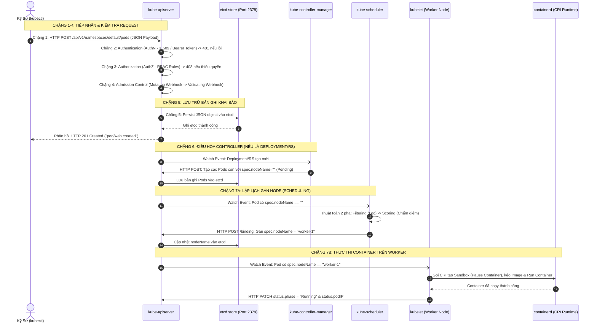
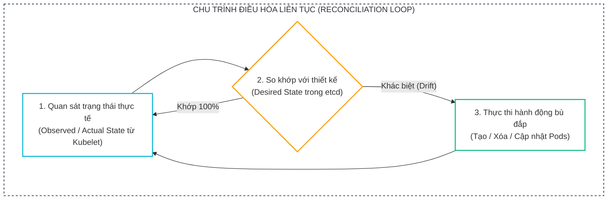
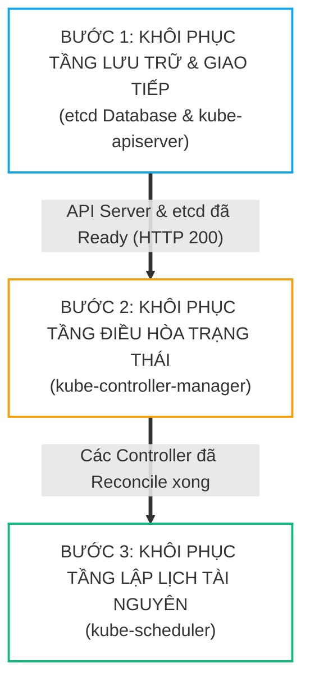
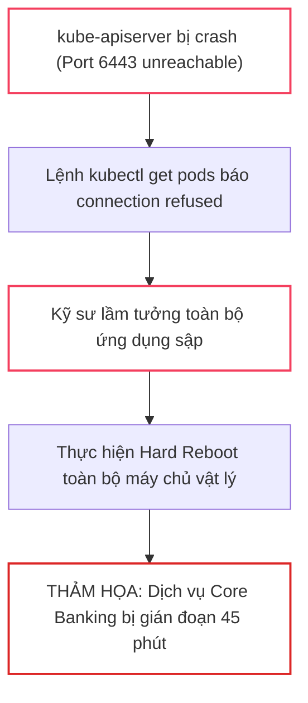
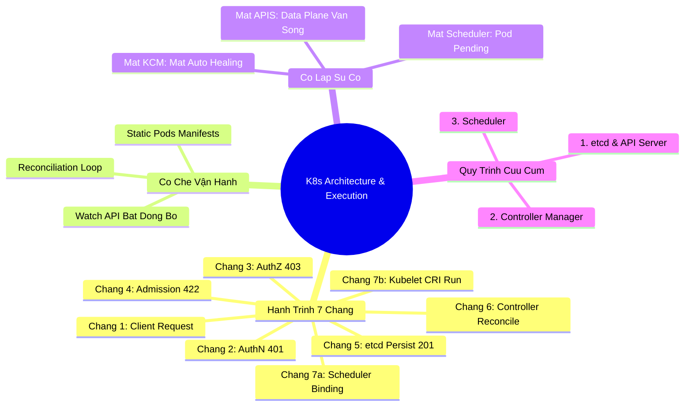


# [BÀI 02] KIẾN TRÚC CỤM KUBERNETES TOÀN DIỆN & ĐƯỜNG ĐI CỦA MỘT LỆNH KUBECTL (API SERVER, ETCD, KUBELET)

Trong thế giới quản trị hạ tầng Kubernetes doanh nghiệp, việc gõ một câu lệnh đơn giản như `kubectl apply -f deployment.yaml` trông có vẻ như một thao tác tức thì. Tuy nhiên, đằng sau hậu trường là một chuỗi phối hợp bất đồng bộ vô cùng tinh vi giữa hàng loạt thành phần phân tán: từ xác thực danh tính, kiểm soát phân quyền RBAC, kiểm tra chính sách nạp (Admission Webhooks), lưu vết vào cơ sở dữ liệu `etcd`, đến chu trình điều hòa của Controller Manager, thuật toán lọc/chấm điểm của Scheduler và lệnh kéo ảnh của Kubelet.

Nếu không nắm vững bản chất kiến trúc tầng thấp này, kỹ sư vận hành sẽ hoàn toàn bất lực khi đối mặt với các sự cố kinh điển trong môi trường sản xuất cũng như trong bài thi **CKA (Certified Kubernetes Administrator)**: *Tại sao lệnh báo `created` mà Pod mãi ở trạng thái `Pending`? Tại sao API Server sập nhưng người dùng vẫn truy cập được ứng dụng web? Khi cả cụm mất nguồn, thành phần nào bắt buộc phải khôi phục đầu tiên?*

Bài viết này sẽ đưa bạn đi sâu vào bên trong "động cơ" của Kubernetes, bóc tách tường tận hành trình 7 chặng của một lệnh `kubectl`, phân tích ma trận tác động khi từng thành phần Control Plane gặp sự cố và hướng dẫn thực hành xử lý lỗi thực tế.

---

> [!IMPORTANT]
> **MỤC TIÊU KỸ THUẬT THEN CHỐT:**
> - **Bóc tách hành trình 7 chặng**: Giải mã chính xác luồng xử lý từ Client CLI $\rightarrow$ API Server (AuthN/AuthZ/Admission) $\rightarrow$ etcd $\rightarrow$ Controller Manager $\rightarrow$ Scheduler $\rightarrow$ Kubelet & Container Runtime (CRI).
> - **Phân định Control Plane vs Data Plane**: Chứng minh bản chất độc lập giữa mặt phẳng điều khiển và mặt phẳng dữ liệu khi xảy ra sự cố sập Master Node.
> - **Ma trận cô lập lỗi thành phần**: Khoanh vùng nhanh chóng nguyên nhân gốc rễ dựa trên mã lỗi HTTP (`401`, `403`, `422`, `504`) và trạng thái Pod (`Pending` rỗng nodeName vs `ContainerCreating`).
> - **Quy trình cứu cụm chuẩn SRE**: Thiết lập phản xạ khôi phục Control Plane 3 bước theo đúng thứ tự phân cấp phụ thuộc nghiêm ngặt.

---

## 1. Bản Chất Kiến Trúc & Tư Duy Cốt Lõi: Hành Trình 7 Chặng Của Một Lệnh Kubectl

### 1.1. Bảy Chặng Xử Lý Tuần Tự Từ CLI Đến Container Runtime

Mọi thao tác quản trị Kubernetes đều là các yêu cầu **HTTP RESTful API** gửi tới cổng `6443` của `kube-apiserver`. Lệnh `kubectl` thực chất chỉ là một HTTP Client có cấu hình. Khi bạn thực hiện `kubectl apply -f pod.yaml`, yêu cầu sẽ trải qua 7 chặng nghiêm ngặt:



1. <span class="badge badge--indigo">Chặng 1 — Khởi Tạo Client Request</span>: `kubectl` đọc Kubeconfig tại `~/.kube/config`, mã hóa manifest YAML thành JSON và phát lệnh HTTP REST tới endpoint API Server.
2. <span class="badge badge--primary">Chặng 2 — Xác Thực Danh Tính (Authentication / AuthN)</span>: API Server giải mã X.509 Client Certificate hoặc Bearer Token để xác định danh tính client. Thất bại trả mã <b style="color: var(--accent-rose);">HTTP 401 Unauthorized</b>.
3. <span class="badge badge--primary">Chặng 3 — Kiểm Tra Phân Quyền (Authorization / AuthZ)</span>: API Server đối chiếu danh tính với hệ thống RBAC (Role / ClusterRole). Thất bại trả mã <b style="color: var(--accent-rose);">HTTP 403 Forbidden</b>.
4. <span class="badge badge--amber">Chặng 4 — Kiểm Soát Nạp (Admission Control)</span>:
   - **Mutating Admission Webhooks**: Chạy trước, tự động bổ sung/chỉnh sửa các trường mặc định (ví dụ: gắn sidecar proxy, inject token).
   - **Validating Admission Webhooks**: Chạy sau, kiểm tra tính hợp lệ của schema và chính sách bảo mật (PodSecurity Standards). Vi phạm trả mã <b style="color: var(--accent-rose);">HTTP 422 Unprocessable Entity</b>.
5. <span class="badge badge--emerald">Chặng 5 — Lưu Trữ etcd & Phản Hồi Client</span>: Khi vượt qua Chặng 4, API Server ghi đối tượng vào `etcd`. Ngay khi etcd xác nhận ghi thành công, API Server trả về mã <b style="color: var(--accent-emerald);">HTTP 201 Created</b> cho `kubectl`.
6. <span class="badge badge--cyan">Chặng 6 — Điều Hòa Controller (Controller Manager)</span>: Nếu đối tượng là Deployment/StatefulSet, Controller tương ứng phát hiện qua Watch API và sinh ra các Pod con với trường `spec.nodeName = ""` (chuỗi rỗng).
7. <span class="badge badge--emerald">Chặng 7 — Lập Lịch & Thực Thi Container</span>:
   - **Chặng 7a (Scheduler)**: `kube-scheduler` phát hiện Pod chưa có Node, chạy thuật toán Filtering và Scoring, rồi gửi yêu cầu `/binding` ghi tên Node vào `spec.nodeName`.
   - **Chặng 7b (Kubelet & CRI)**: `kubelet` trên Worker Node tương ứng phát hiện Pod được gán cho mình, gọi Container Runtime (containerd) qua giao tiếp CRI để kéo ảnh và khởi chạy container, sau đó cập nhật `status.phase = "Running"` về API Server.

---

### 1.2. Vòng Điều Hòa (Reconciliation Loop) & Nguyên Lý Bất Đồng Bộ

Cốt lõi của Kubernetes là **Mô hình Khai báo (Declarative State)** vận hành qua các vòng lặp điều hòa liên tục:

$$\text{Reconciliation Action} = \text{Observe}(\text{Actual State}) \oplus \text{Reconcile}(\text{Desired State})$$



> [!NOTE]
> **NGUYÊN TẮC GIAO TIẾP DUY NHẤT:**
> - Các thành phần `etcd`, `kube-scheduler`, `kube-controller-manager` và `kubelet` **TUYỆT ĐỐI KHÔNG BAO GIỜ GIAO TIẾP TRỰC TIẾP VỚI NHAU**.
> - Tất cả mọi tương tác đều bắt buộc phải đi qua trung gian `kube-apiserver` thông qua các kết nối HTTP/2 Watch API trường tồn (Long-polling streams).

---

### 1.3. Cơ Chế Cô Lập Sự Cố: Thành Phần Nào Chết Thì Hỏng Cái Gì?

Hiểu rõ ranh giới hỏng hóc giúp kỹ sư không hoảng loạn khi gặp sự cố trên môi trường Production:

1. **Khi `kube-scheduler` bị tắt/hỏng**:
   - Lệnh tạo Deployment/Pod vẫn thành công (Chặng 1–5 OK).
   - Controller Manager vẫn tạo Pod khai báo (Chặng 6 OK).
   - <b style="color: var(--accent-rose);">Hậu quả</b>: Mọi Pod mới sinh ra bị kẹt vĩnh viễn ở trạng thái `Pending` với trường `spec.nodeName` rỗng.
   - <b style="color: var(--accent-emerald);">Tác động Data Plane</b>: Các Pod cũ đã chạy từ trước vẫn xử lý lưu lượng mạng 100% bình thường.

2. **Khi `kube-controller-manager` bị tắt/hỏng**:
   - Lệnh tạo Pod đơn lẻ (`kubectl run`) vẫn gán Node và chạy được nếu Scheduler còn sống.
   - <b style="color: var(--accent-rose);">Hậu quả</b>: Tính năng tự phục hồi (Auto-healing) và co giãn (Scaling) bị tê liệt. Nếu xoá 1 Pod thuộc Deployment, tổng số Pod giảm đi và không có Pod mới nào được tự bù đắp.

3. **Khi `kube-apiserver` bị tắt/hỏng**:
   - Toàn bộ công cụ quản lý (`kubectl`, Helm, CI/CD pipelines, K8s Dashboard) bị ngắt kết nối lập tức.
   - <b style="color: var(--accent-emerald);">Tác động Data Plane</b>: Các container đang chạy trên Worker Node do `containerd` quản lý độc lập **VẪN HOẠT ĐỘNG VÀ PHỤC VỤ NGƯỜI DÙNG BÌNH THƯỜNG**. Data Plane không phụ thuộc vào trạng thái tức thời của Control Plane.

---

## 2. Bảng Ma Trận So Sánh Kỹ Thuật Toàn Diện (Engineering Matrix)

### 2.1. Ma Trận 7 Chặng Xử Lý Của Lệnh Kubectl

| Chặng | Thành Phần Xử Lý | Mục Đích Kỹ Thuật | Mã Lỗi / Phản Hồi | Hành Vi Khi Thất Bại |
| :---: | :--- | :--- | :---: | :--- |
| <span class="badge badge--primary">01</span> | **kubectl Client** | Đọc Kubeconfig, mã hóa JSON payload | `Client Error` | Lỗi cú pháp YAML hoặc sai context |
| <span class="badge badge--cyan">02</span> | **AuthN Module** | Xác thực danh tính X.509 / Token | `401 Unauthorized` | Từ chối ngay, không giải mã body |
| <span class="badge badge--cyan">03</span> | **AuthZ (RBAC)** | Kiểm tra quyền hạn RoleBinding | `403 Forbidden` | Chặn đứng hành vi trái phép |
| <span class="badge badge--amber">04</span> | **Admission Webhooks** | Mutating (sửa) & Validating (soát) | `422 Unprocessable` | Hủy bỏ request trước khi ghi etcd |
| <span class="badge badge--emerald">05</span> | **API Server & etcd** | Ghi dữ liệu vào etcd (Port 2379) | `201 Created` | Nếu etcd sập, trả mã `500/504 Timeout` |
| <span class="badge badge--indigo">06</span> | **Controller Manager** | Sinh Pods con từ Workload Controller | `Internal Watch` | Pod không được sinh ra nếu KCM chết |
| <span class="badge badge--emerald">07</span> | **Scheduler & Kubelet** | 7a: Gán Node $\rightarrow$ 7b: Chạy Container | `Running / Ready` | Pod kẹt `Pending` nếu Scheduler sập |

---

### 2.2. Ma Trận Tác Động Khi Từng Thành Phần Control Plane Gặp Sự Cố

| Thành Phần Bị Sập | Trạng Thái Pod Đang Chạy | Trạng Thái Pod Mới Sinh | Khả Năng Tự Phục Hồi | Hành Động Chẩn Đoán & Khôi Phục |
| :--- | :---: | :---: | :---: | :--- |
| **kube-scheduler** | <b style="color: var(--accent-emerald);">Bình thường</b> | <b style="color: var(--accent-rose);">Kẹt Pending (nodeName="")</b> | <b style="color: var(--accent-emerald);">Có</b> (nhưng không chạy được) | Kiểm tra static manifest tại `/etc/kubernetes/manifests/kube-scheduler.yaml` |
| **kube-controller-manager** | <b style="color: var(--accent-emerald);">Bình thường</b> | <b style="color: var(--accent-rose);">Không sinh Pod từ Deploy</b> | <b style="color: var(--accent-rose);">Mất hoàn toàn</b> | Kiểm tra log container `crictl logs` của tiến trình `kube-controller-manager` |
| **kube-apiserver** | <b style="color: var(--accent-emerald);">Bình thường</b> | <b style="color: var(--accent-rose);">Từ chối kết nối (Refused)</b> | <b style="color: var(--accent-rose);">Tê liệt quản trị</b> | Kiểm tra etcd health trước, sau đó soi log apiserver `/var/log/pods/` |
| **etcd Cluster** | <b style="color: var(--accent-emerald);">Bình thường</b> | <b style="color: var(--accent-rose);">Từ chối ghi dữ liệu</b> | <b style="color: var(--accent-rose);">Tê liệt hoàn toàn</b> | Khôi phục snapshot `etcdctl snapshot restore` từ bản backup gần nhất |

---

## 3. Kiến Trúc Khôi Phục Cụm Chuẩn SRE (3-Step Hierarchy)

Khi toàn bộ cụm Kubernetes bị mất nguồn đột ngột hoặc Control Plane gặp sự cố sập đồng loạt, kỹ sư bắt buộc phải tuân thủ **Quy trình khôi phục 3 bước theo thứ tự phân cấp phụ thuộc**:



```bash
# ==============================================================================
# QUY TRÌNH KIỂM TRA & KHÔI PHỤC CONTROL PLANE CHUẨN SRE
# ==============================================================================

# Bước 1: Kiểm tra tầng lưu trữ etcd và máy chủ API Server trên Control Plane Node
sudo crictl ps | grep -E "kube-apiserver|etcd"

# Bước 2: Chỉ khi API Server trả về kết quả 200 OK, mới kiểm tra Controller Manager
kubectl get --raw /readyz
sudo crictl ps | grep kube-controller-manager

# Bước 3: Kiểm tra tiến trình Scheduler để đảm bảo Pods mới được lập lịch
sudo crictl ps | grep kube-scheduler
```

---

## 4. Phân Tích Cạm Bẫy Thực Chiến: Sập API Server & Ảo Tưởng Về Lệnh "created"

### Tình Huống Sự Cố Thực Tế:
<span class="badge badge--rose">🕒 02:00 AM</span> Trong ca trực đêm tại ngân hàng, kỹ sư nhận được cảnh báo hệ thống giám sát không thể kết nối tới Kubernetes API Server (`connection refused`). Nhầm tưởng toàn bộ hệ thống Core Banking đang chạy trên cụm đã bị sập, kỹ sư lập tức ngắt điện toàn bộ cụm máy chủ vật lý để khởi động lại. Hành động này đã trực tiếp biến một sự cố quản trị nhỏ thành thảm họa sập toàn bộ dịch vụ thanh toán khách hàng suốt 45 phút.

---

### Hậu Quả & Log Lỗi Thực Tế:
```text
# LỖI KHI GÕ LỆNH KUBECTL (CONTROL PLANE BỊ MẤT KẾT NỐI):
$ kubectl get pods -n production
The connection to the server 10.0.0.10:6443 was refused - did you specify the right host or port?

# TUY NHIÊN DATA PLANE TRÊN WORKER NODES VẪN HOẠT ĐỘNG HOÀN TOÀN:
$ curl -I http://10.244.2.45:8080/api/v1/health
HTTP/1.1 200 OK
Content-Type: application/json
Date: Sun, 12 Sep 2026 02:01:15 GMT
Content-Length: 28

{"status":"SERVING_TRAFFIC"}
```

Sự nhầm lẫn tai hại giữa **Mặt phẳng điều khiển (Control Plane)** và **Mặt phẳng dữ liệu (Data Plane)** đã dẫn đến quyết định reboot thô bạo, phá hủy toàn bộ tiến trình container đang chạy trên các Worker Node:



---

### 5-Whys Root Cause Analysis:
1. <span class="badge badge--primary">Why 1</span> **Tại sao dịch vụ Core Banking bị mất kết nối thực tế?** $\rightarrow$ Do kỹ sư reboot cưỡng bức các máy chủ Worker Node.
2. <span class="badge badge--primary">Why 2</span> **Tại sao kỹ sư lại quyết định reboot Worker Node?** $\rightarrow$ Vì thấy lệnh `kubectl` báo lỗi `connection refused` và tưởng rằng toàn bộ ứng dụng đã chết.
3. <span class="badge badge--primary">Why 3</span> **Tại sao lệnh kubectl lại báo connection refused?** $\rightarrow$ Do tiến trình `kube-apiserver` trên Control Plane node bị dừng vì đầy dung lượng ổ đĩa log.
4. <span class="badge badge--primary">Why 4</span> **API Server chết có làm container trên Worker Node chết không?** $\rightarrow$ Không! `containerd` trên Worker Node chạy độc lập và tiếp tục phục vụ lưu lượng mạng.
5. <span class="badge badge--emerald">Root Cause Remedy</span> **Biện pháp khắc phục chuẩn SRE:**
   - <span class="badge badge--emerald">Data Plane Verification</span> Luôn kiểm tra trực tiếp Endpoint của Pod / Ingress Controller trước khi kết luận về trạng thái dịch vụ.
   - <span class="badge badge--cyan">Isolate Failure Domain</span> Phân tách rạch ròi quy trình xử lý sự cố Control Plane độc lập với Worker Nodes.

---

## 5. Hands-on Lab: Khảo Sát 7 Chặng & Xử Lý Sự Cố Từng Thành Phần Control Plane (8 Bước)

Bảng tóm tắt các bước thực hành trong bài Lab:

| Bước | Lệnh CLI / Cấu Hình | Mục Đích Kỹ Thuật |
| :---: | :--- | :--- |
| <span class="badge badge--primary">01</span> | `kubectl get pods -v=8` | Bóc tách chi tiết luồng HTTP Headers và JSON Body |
| <span class="badge badge--cyan">02</span> | `kubectl auth can-i list pods --as=dev-user` | Chẩn đoán lỗi phân quyền AuthZ ở Chặng 3 |
| <span class="badge badge--primary">03</span> | `mv /etc/kubernetes/manifests/kube-scheduler.yaml /tmp/` | Tắt Scheduler và quan sát Pod bị kẹt `Pending` |
| <span class="badge badge--emerald">04</span> | `k get pod -o jsonpath='{.spec.nodeName}'` | Xác minh trường `spec.nodeName` rỗng khi mất Scheduler |
| <span class="badge badge--primary">05</span> | `mv /tmp/kube-scheduler.yaml /etc/kubernetes/manifests/` | Khôi phục Scheduler và kiểm tra Pod tự động chạy |
| <span class="badge badge--amber">06</span> | `mv /etc/kubernetes/manifests/kube-controller-manager.yaml /tmp/` | Tắt Controller Manager và đo mất khả năng Auto-healing |
| <span class="badge badge--rose">07</span> | `mv /etc/kubernetes/manifests/kube-apiserver.yaml /tmp/` | Tắt API Server và chứng minh `curl` Pod IP vẫn 200 OK |
| <span class="badge badge--emerald">08</span> | `mv /tmp/*.yaml /etc/kubernetes/manifests/` | Khôi phục toàn bộ cụm và kiểm tra trạng thái Ready |

---

### Hướng Dẫn Thực Hành Chi Tiết Từng Bước:

#### Bước 1: Khảo sát chi tiết 7 chặng bằng cờ `-v=8`
```bash
# Chạy lệnh get pods với verbose log level 8
kubectl get pods -n default -v=8 2>&1 | grep -E "GET|POST|Response Status:|Response Body"
```

#### Bước 2: Mô phỏng lỗi AuthZ Chặng 3 với danh tính giả định
```bash
# Kiểm tra quyền liệt kê pods của dev-user
kubectl auth can-i list pods -n default --as=dev-user

# Thử gõ lệnh thật và nhận mã lỗi HTTP 403 Forbidden
kubectl get pods -n default --as=dev-user
```

#### Bước 3: Tắt `kube-scheduler` bằng cách di chuyển static pod manifest
```bash
# Truy cập vào Control Plane Node và di chuyển file manifest ra ngoài
sudo mv /etc/kubernetes/manifests/kube-scheduler.yaml /tmp/

# Đợi 5 giây cho Kubelet ngắt tiến trình Scheduler
sudo crictl ps | grep kube-scheduler || echo "Scheduler is STOPPED!"
```

#### Bước 4: Tạo Deployment mới và quan sát Pod bị kẹt `Pending`
```bash
# Tạo Deployment thử nghiệm 2 bản sao
kubectl create deployment sched-test --image=nginx:alpine --replicas=2

# Kiểm tra trạng thái Pod: Phase là Pending và spec.nodeName rỗng!
kubectl get pods -l app=sched-test -o jsonpath='{range .items[*]}{.metadata.name}{"\tPhase: "}{.status.phase}{"\tNode: ["}{.spec.nodeName}{"]\n"}{end}'
```

#### Bước 5: Khôi phục `kube-scheduler` và kiểm tra Pod tự động lập lịch
```bash
# Đưa manifest trở lại thư mục static pods
sudo mv /tmp/kube-scheduler.yaml /etc/kubernetes/manifests/

# Quan sát Scheduler tự động gán Node và Pod chuyển sang Running sau 5-10 giây
kubectl get pods -l app=sched-test -w
```

#### Bước 6: Tắt `kube-controller-manager` và kiểm tra mất tính năng Auto-healing
```bash
# Tắt Controller Manager
sudo mv /etc/kubernetes/manifests/kube-controller-manager.yaml /tmp/

# Xóa 1 Pod của Deployment sched-test
TARGET_POD=$(kubectl get pods -l app=sched-test -o jsonpath='{.items[0].metadata.name}')
kubectl delete pod $TARGET_POD --force --grace-period=0

# Kiểm tra: Deployment chỉ còn 1 Pod, không có Pod mới nào tự sinh ra!
kubectl get deployment sched-test
```

#### Bước 7: Tắt `kube-apiserver` và chứng minh Data Plane vẫn sống 100%
```bash
# 1. Lấy IP của Pod đang chạy
POD_IP=$(kubectl get pod -l app=sched-test -o jsonpath='{.items[0].status.podIP}')

# 2. Tắt API Server
sudo mv /etc/kubernetes/manifests/kube-apiserver.yaml /tmp/

# 3. Lệnh kubectl thất bại ngay lập tức
kubectl get pods

# 4. Nhưng curl trực tiếp vào Pod IP vẫn nhận phản hồi HTTP 200 OK!
curl -I http://$POD_IP:80
```

#### Bước 8: Khôi phục toàn bộ Control Plane và dọn dẹp môi trường lab
```bash
# Khôi phục toàn bộ manifests theo thứ tự
sudo mv /tmp/kube-apiserver.yaml /etc/kubernetes/manifests/
sleep 10
sudo mv /tmp/kube-controller-manager.yaml /etc/kubernetes/manifests/

# Xóa Deployment thử nghiệm
kubectl delete deployment sched-test
```

---

## 6. 10 Câu Hỏi Tự Kiểm Tra Chuyên Sâu (Self-Check Q&A Accordion)

<details class="qa-card">
<summary class="qa-summary">
  <div class="qa-summary-left">
    <span class="qa-num-badge">Q01</span>
    <span>Tại sao các thành phần trong cụm Kubernetes không bao giờ giao tiếp trực tiếp với etcd (ngoại trừ API Server)?</span>
  </div>
  <span class="qa-chevron">
    <svg width="18" height="18" fill="none" stroke="currentColor" stroke-width="2.5" viewBox="0 0 24 24"><polyline points="6 9 12 15 18 9"></polyline></svg>
  </span>
</summary>
<div class="qa-answer">
  <div class="qa-answer-header">
    <svg width="14" height="14" fill="none" stroke="currentColor" stroke-width="2" viewBox="0 0 24 24"><path d="M22 11.08V12a10 10 0 1 1-5.93-9.14"></path><polyline points="22 4 12 14.01 9 11.01"></polyline></svg>
    <span>Phân Tích &amp; Lời Giải Kỹ Thuật</span>
  </div>
  <b style="color: var(--accent-primary);">kube-apiserver</b> đóng vai trò là <b style="color: var(--accent-emerald);">Gatekeeper duy nhất</b> bảo vệ cơ sở dữ liệu etcd. Nếu cho phép các thành phần khác (Kubelet, Scheduler, Controller Manager) kết nối trực tiếp vào etcd, hệ thống sẽ mất khả năng kiểm soát xác thực (AuthN), phân quyền (AuthZ), kiểm soát nạp (Admission Webhooks) và tính toàn vẹn dữ liệu (Data Validation). API Server là thành phần duy nhất mở kết nối bảo mật mTLS tới port <code>2379</code> của etcd.
</div>
</details>

<details class="qa-card">
<summary class="qa-summary">
  <div class="qa-summary-left">
    <span class="qa-num-badge">Q02</span>
    <span>Sự khác biệt cốt lõi giữa Mutating Admission Webhook và Validating Admission Webhook ở Chặng 4 là gì?</span>
  </div>
  <span class="qa-chevron">
    <svg width="18" height="18" fill="none" stroke="currentColor" stroke-width="2.5" viewBox="0 0 24 24"><polyline points="6 9 12 15 18 9"></polyline></svg>
  </span>
</summary>
<div class="qa-answer">
  <div class="qa-answer-header">
    <svg width="14" height="14" fill="none" stroke="currentColor" stroke-width="2" viewBox="0 0 24 24"><path d="M22 11.08V12a10 10 0 1 1-5.93-9.14"></path><polyline points="22 4 12 14.01 9 11.01"></polyline></svg>
    <span>Phân Tích &amp; Lời Giải Kỹ Thuật</span>
  </div>
  <div style="margin-bottom: 6px;"><b style="color: var(--accent-primary);">Mutating Webhook</b> được thực thi trước để <strong>chỉnh sửa hoặc bổ sung</strong> các trường dữ liệu mặc định vào JSON payload (ví dụ: tự động tiêm sidecar container, inject biến môi trường hoặc gán StorageClass mặc định).</div>
  <div><b style="color: var(--accent-cyan);">Validating Webhook</b> được thực thi sau để <strong>kiểm tra tính hợp lệ</strong> và chỉ đưa ra quyết định chấp thuận (Allow) hoặc từ chối (Deny) request mà không được phép thay đổi nội dung payload.</div>
</div>
</details>

<details class="qa-card">
<summary class="qa-summary">
  <div class="qa-summary-left">
    <span class="qa-num-badge">Q03</span>
    <span>Khi người dùng gõ lệnh 'kubectl delete pod', thành phần nào thực sự ra lệnh tiêu diệt process container trên Linux?</span>
  </div>
  <span class="qa-chevron">
    <svg width="18" height="18" fill="none" stroke="currentColor" stroke-width="2.5" viewBox="0 0 24 24"><polyline points="6 9 12 15 18 9"></polyline></svg>
  </span>
</summary>
<div class="qa-answer">
  <div class="qa-answer-header">
    <svg width="14" height="14" fill="none" stroke="currentColor" stroke-width="2" viewBox="0 0 24 24"><path d="M22 11.08V12a10 10 0 1 1-5.93-9.14"></path><polyline points="22 4 12 14.01 9 11.01"></polyline></svg>
    <span>Phân Tích &amp; Lời Giải Kỹ Thuật</span>
  </div>
  Đó là <b style="color: var(--accent-primary);">Kubelet</b> phối hợp với <b style="color: var(--accent-emerald);">Container Runtime (containerd/CRI)</b> trên Worker Node. Khi nhận sự kiện Pod bị đánh dấu <code>deletionTimestamp</code> từ API Server, Kubelet gửi tín hiệu qua giao diện gRPC CRI tới containerd để phát tín hiệu <code>SIGTERM</code> (và sau đó là <code>SIGKILL</code> nếu quá grace period) tới tiến trình container trong nhân Linux.
</div>
</details>

<details class="qa-card">
<summary class="qa-summary">
  <div class="qa-summary-left">
    <span class="qa-num-badge">Q04</span>
    <span>Làm thế nào để gán một Pod chạy trên một Node cụ thể mà hoàn toàn bỏ qua bước lập lịch của kube-scheduler?</span>
  </div>
  <span class="qa-chevron">
    <svg width="18" height="18" fill="none" stroke="currentColor" stroke-width="2.5" viewBox="0 0 24 24"><polyline points="6 9 12 15 18 9"></polyline></svg>
  </span>
</summary>
<div class="qa-answer">
  <div class="qa-answer-header">
    <svg width="14" height="14" fill="none" stroke="currentColor" stroke-width="2" viewBox="0 0 24 24"><path d="M22 11.08V12a10 10 0 1 1-5.93-9.14"></path><polyline points="22 4 12 14.01 9 11.01"></polyline></svg>
    <span>Phân Tích &amp; Lời Giải Kỹ Thuật</span>
  </div>
  Khai báo trực tiếp trường <code style="color: var(--accent-primary);">spec.nodeName: "&lt;tên-node&gt;"</code> trong file YAML của Pod. Khi trường <code>nodeName</code> đã có giá trị ngay từ đầu, <code>kube-scheduler</code> sẽ bỏ qua Pod này trong chu kỳ quét, và Kubelet trên Node được chỉ định sẽ lập tức nhận Pod để khởi chạy.
</div>
</details>

<details class="qa-card">
<summary class="qa-summary">
  <div class="qa-summary-left">
    <span class="qa-num-badge">Q05</span>
    <span>Nếu kube-controller-manager bị crash, điều gì sẽ xảy ra khi một Worker Node bị ngắt điện?</span>
  </div>
  <span class="qa-chevron">
    <svg width="18" height="18" fill="none" stroke="currentColor" stroke-width="2.5" viewBox="0 0 24 24"><polyline points="6 9 12 15 18 9"></polyline></svg>
  </span>
</summary>
<div class="qa-answer">
  <div class="qa-answer-header">
    <svg width="14" height="14" fill="none" stroke="currentColor" stroke-width="2" viewBox="0 0 24 24"><path d="M22 11.08V12a10 10 0 1 1-5.93-9.14"></path><polyline points="22 4 12 14.01 9 11.01"></polyline></svg>
    <span>Phân Tích &amp; Lời Giải Kỹ Thuật</span>
  </div>
  <b style="color: var(--accent-rose);">Node Controller</b> (nằm trong Controller Manager) sẽ không thể hoạt động để đánh dấu Node ở trạng thái <code>NotReady</code> hoặc trục xuất (Evict) các Pod. Các Pod trên Node bị chết sẽ không bao giờ được tự động tạo lại trên các Node còn sống khác cho đến khi <code>kube-controller-manager</code> được khôi phục.
</div>
</details>

<details class="qa-card">
<summary class="qa-summary">
  <div class="qa-summary-left">
    <span class="qa-num-badge">Q06</span>
    <span>Thuật toán lập lịch của kube-scheduler bao gồm 2 pha nào và chức năng của từng pha?</span>
  </div>
  <span class="qa-chevron">
    <svg width="18" height="18" fill="none" stroke="currentColor" stroke-width="2.5" viewBox="0 0 24 24"><polyline points="6 9 12 15 18 9"></polyline></svg>
  </span>
</summary>
<div class="qa-answer">
  <div class="qa-answer-header">
    <svg width="14" height="14" fill="none" stroke="currentColor" stroke-width="2" viewBox="0 0 24 24"><path d="M22 11.08V12a10 10 0 1 1-5.93-9.14"></path><polyline points="22 4 12 14.01 9 11.01"></polyline></svg>
    <span>Phân Tích &amp; Lời Giải Kỹ Thuật</span>
  </div>
  <div style="margin-bottom: 6px;">1. <b style="color: var(--accent-primary);">Pha Filtering (Predicates)</b>: Quét toàn bộ danh sách Node và lọc ra tập hợp các Node đủ điều kiện đáp ứng yêu cầu của Pod (đủ CPU/RAM, thoả mãn nodeSelector/Affinity, không bị Taints chặn).</div>
  <div>2. <b style="color: var(--accent-emerald);">Pha Scoring (Priorities)</b>: Chấm điểm các Node vượt qua vòng lọc theo thang điểm từ 0–100 dựa trên các tiêu chí tối ưu (phân bổ tải đều, vị trí image có sẵn). Node có điểm số cao nhất sẽ được chọn để gán vào Pod.</div>
</div>
</details>

<details class="qa-card">
<summary class="qa-summary">
  <div class="qa-summary-left">
    <span class="qa-num-badge">Q07</span>
    <span>Tại sao cờ log verbose '-v=8' là công cụ bắt buộc phải biết khi gỡ rối lỗi phân quyền trong kỳ thi CKA?</span>
  </div>
  <span class="qa-chevron">
    <svg width="18" height="18" fill="none" stroke="currentColor" stroke-width="2.5" viewBox="0 0 24 24"><polyline points="6 9 12 15 18 9"></polyline></svg>
  </span>
</summary>
<div class="qa-answer">
  <div class="qa-answer-header">
    <svg width="14" height="14" fill="none" stroke="currentColor" stroke-width="2" viewBox="0 0 24 24"><path d="M22 11.08V12a10 10 0 1 1-5.93-9.14"></path><polyline points="22 4 12 14.01 9 11.01"></polyline></svg>
    <span>Phân Tích &amp; Lời Giải Kỹ Thuật</span>
  </div>
  Cờ <code>-v=8</code> hiển thị toàn bộ <b style="color: var(--accent-primary);">HTTP Request URI, Headers và Response Body</b>. Khi gặp lỗi, nó giúp bạn phân biệt ngay lập tức lỗi xảy ra ở tầng Client (JSON sai), tầng AuthN (mã <code>401</code> do chứng chỉ sai), tầng AuthZ (mã <code>403</code> do thiếu RBAC) hay tầng Admission (mã <code>422</code> do vi phạm policy).
</div>
</details>

<details class="qa-card">
<summary class="qa-summary">
  <div class="qa-summary-left">
    <span class="qa-num-badge">Q08</span>
    <span>Static Pods là gì và chúng được Kubelet quản lý như thế nào mà không cần API Server?</span>
  </div>
  <span class="qa-chevron">
    <svg width="18" height="18" fill="none" stroke="currentColor" stroke-width="2.5" viewBox="0 0 24 24"><polyline points="6 9 12 15 18 9"></polyline></svg>
  </span>
</summary>
<div class="qa-answer">
  <div class="qa-answer-header">
    <svg width="14" height="14" fill="none" stroke="currentColor" stroke-width="2" viewBox="0 0 24 24"><path d="M22 11.08V12a10 10 0 1 1-5.93-9.14"></path><polyline points="22 4 12 14.01 9 11.01"></polyline></svg>
    <span>Phân Tích &amp; Lời Giải Kỹ Thuật</span>
  </div>
  <b style="color: var(--accent-primary);">Static Pods</b> là các Pod được Kubelet trực tiếp giám sát thông qua các file manifest đặt tại thư mục cục bộ (mặc định là <code>/etc/kubernetes/manifests/</code>). Kubelet tự động khởi chạy, restart và quản lý vòng đời của chúng mà không cần API Server hay Scheduler. Các thành phần Control Plane cốt lõi (`etcd`, `apiserver`, `controller-manager`, `scheduler`) đều được triển khai dưới dạng Static Pods.
</div>
</details>

<details class="qa-card">
<summary class="qa-summary">
  <div class="qa-summary-left">
    <span class="qa-num-badge">Q09</span>
    <span>Sự khác biệt giữa hai cờ debug '-v=8' và '-v=9' trong kubectl là gì?</span>
  </div>
  <span class="qa-chevron">
    <svg width="18" height="18" fill="none" stroke="currentColor" stroke-width="2.5" viewBox="0 0 24 24"><polyline points="6 9 12 15 18 9"></polyline></svg>
  </span>
</summary>
<div class="qa-answer">
  <div class="qa-answer-header">
    <svg width="14" height="14" fill="none" stroke="currentColor" stroke-width="2" viewBox="0 0 24 24"><path d="M22 11.08V12a10 10 0 1 1-5.93-9.14"></path><polyline points="22 4 12 14.01 9 11.01"></polyline></svg>
    <span>Phân Tích &amp; Lời Giải Kỹ Thuật</span>
  </div>
  <code style="color: var(--accent-primary);">-v=8</code> in ra chi tiết HTTP Request/Response Headers và Body dạng text/JSON. Trong khi đó, <code style="color: var(--accent-cyan);">-v=9</code> in ra <strong>lệnh cURL tương đương hoàn chỉnh</strong> bao gồm toàn bộ headers xác thực, giúp kỹ sư có thể copy trực tiếp lệnh cURL để chạy debug độc lập bên ngoài terminal.
</div>
</details>

<details class="qa-card">
<summary class="qa-summary">
  <div class="qa-summary-left">
    <span class="qa-num-badge">Q10</span>
    <span>Tại sao lệnh 'kubectl describe pod' hiển thị thông tin sự kiện hữu ích hơn 'kubectl get pod' khi Pod kẹt Pending?</span>
  </div>
  <span class="qa-chevron">
    <svg width="18" height="18" fill="none" stroke="currentColor" stroke-width="2.5" viewBox="0 0 24 24"><polyline points="6 9 12 15 18 9"></polyline></svg>
  </span>
</summary>
<div class="qa-answer">
  <div class="qa-answer-header">
    <svg width="14" height="14" fill="none" stroke="currentColor" stroke-width="2" viewBox="0 0 24 24"><path d="M22 11.08V12a10 10 0 1 1-5.93-9.14"></path><polyline points="22 4 12 14.01 9 11.01"></polyline></svg>
    <span>Phân Tích &amp; Lời Giải Kỹ Thuật</span>
  </div>
  Lệnh <code>kubectl get pod</code> chỉ hiển thị trạng thái tổng quan (ví dụ: <code>Pending</code>). Trong khi đó, <code>kubectl describe pod</code> trích xuất mục <b style="color: var(--accent-amber);">Events</b> ở cuối, hiển thị chính xác lý do Scheduler từ chối lập lịch từ thuật toán Filtering (ví dụ: <code>0/3 nodes are available: 1 node has untolerated taint, 2 nodes have insufficient memory</code>).
</div>
</details>

---

## 7. Tổng Kết & Lộ Trình Bài Học Tiếp Theo

### Tóm Tắt Các Điểm Cốt Lõi:
1. **Kiến Trúc 7 Chặng Tuyến Tính**: Mọi thao tác quản trị đều chuyển thành HTTP REST calls đi qua API Server, lưu trữ tại etcd trước khi được Controller và Kubelet hiện thực hóa.
2. **Nguyên Lý Bất Đồng Bộ Qua Watch API**: Không thành phần nào nói chuyện trực tiếp với nhau ngoài API Server.
3. **Phân Tách Rạch Ròi Control Plane & Data Plane**: Sự cố sập API Server hay Master Node chỉ làm tê liệt khả năng quản lý, không làm gián đoạn lưu lượng mạng của các container đang chạy trên Worker Node.
4. **Quy Trình Cứu Cụm Phân Cấp**: Luôn khôi phục etcd & API Server trước tiên $\rightarrow$ Controller Manager $\rightarrow$ Scheduler.



---

> [!TIP]
> **BÀI HỌC TIẾP THEO:**
> Trong **[[Bài 03] Đối Tượng API & Vòng Đời Điều Hòa: Reconciliation Loop, GroupVersionResource (GVR) & Custom Resource Definitions (CRD)](cka-03-03-doi-tuong-api-va-vong-doi-dieu-hoa.html)**, chúng ta sẽ bóc tách sâu hơn về cấu trúc dữ liệu Kubernetes API: Cách API Server định tuyến qua GVR, nguyên lý hoạt động của Desired State vs Actual State và cách viết một Controller đơn giản.


