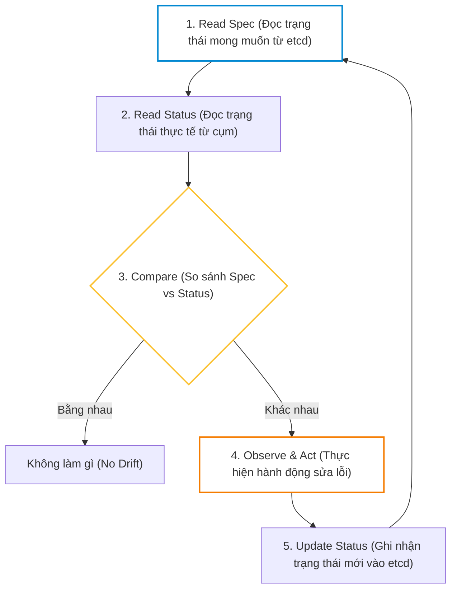
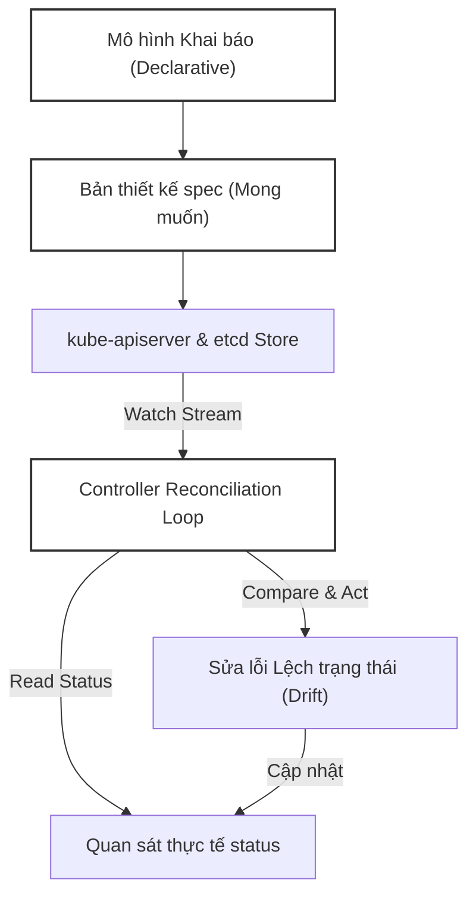
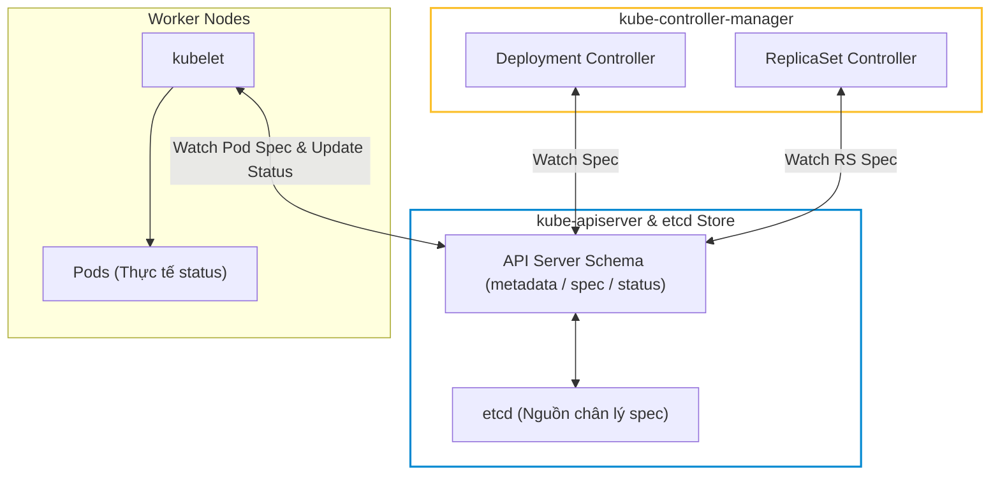


# [BÀI 03] ĐỐI TƯỢNG API & VÒNG LẶP ĐIỀU HÒA (RECONCILIATION LOOP): VÌ SAO MỌI THỨ LÀ KHAI BÁO DECLARATIVE

Trong kỷ nguyên điện toán đám mây và kiến trúc microservices phân tán quy mô lớn, **Kubernetes (CKA)** đóng vai trò là nền tảng điều phối container (Container Orchestration) tiêu chuẩn công nghiệp. Để làm chủ hệ thống trong môi trường sản xuất (Production) cũng như chinh phục kỳ thi chứng chỉ quốc tế của Linux Foundation / CNCF, kỹ sư không chỉ nắm vững các câu lệnh thao tác cơ bản mà phải thấu hiểu sâu sắc bản chất cơ chế tầng thấp: từ chu trình điều hòa (Reconciliation Loop), cấu trúc điều phối tài nguyên, kiến trúc mạng CNI, lưu trữ CSI cho đến các chuẩn mực an ninh phòng thủ chiều sâu.

Bài viết chuyên sâu này sẽ đồng hành cùng bạn giải mã toàn diện bức tranh kiến trúc, phân tích các đánh đổi kỹ thuật thực chiến (Engineering Trade-offs), cung cấp bài thực hành Lab từng bước và bộ câu hỏi phỏng vấn chuẩn Architect / Lead Engineer.

---

## 1. Bản Chất Kiến Trúc & Cơ Chế Vận Hành Tầng Thấp

| # | Câu hỏi ôn tập | Đáp án chuẩn ngắn gọn (chứa con số / tên lệnh) |
|---|---|---|
| 1 | Lệnh `kubectl` gửi yêu cầu đến thành phần nào của Control Plane và thông qua giao thức nào? | Gửi yêu cầu HTTP RESTful đến `kube-apiserver` qua cổng bảo mật `6443` |
| 2 | Khi `kube-scheduler` bị tắt, điều gì xảy ra với các Pod mới được tạo thêm? | Pod mới bị kẹt ở trạng thái `Pending` vĩnh viễn với trường `spec.nodeName=""` rỗng |
| 3 | Khi `kube-controller-manager` bị ngắt, việc xoá 1 Pod thuộc Deployment gây hậu quả gì? | Pod bị xoá biến mất vĩnh viễn và KHÔNG CÓ Pod mới nào tự bù vào (mất Auto-healing) |
| 4 | Khi `kube-apiserver` bị crash, các container đang chạy trên Worker Node có bị dừng không? | KHÔNG bị dừng (100 % Data Plane vẫn chạy và phản hồi `HTTP 200 OK` khi `curl` Pod IP) |
| 5 | Muốn hiển thị toàn bộ HTTP Request Headers và Body JSON khi gõ lệnh `kubectl` thì dùng cờ nào? | Dùng cờ `-v=8` (hoặc `-v=9` hiển thị câu lệnh `curl` debug tương đương) |


> **Luận đề trung tâm của buổi:**
> *"Kubernetes là một hệ thống khai báo (Declarative System) vận hành dựa trên cơ chế vòng điều hoà (Reconciliation Loop): Người dùng chỉ định trạng thái mong muốn trong `spec`, các Controller liên tục đọc `status` thực tế, so sánh drift và đưa `status` tiệm cận `spec`; mọi nỗ lực sửa trực tiếp `status` hay can thiệp thủ công vào đối tượng con đều bị hệ thống ghi đè hoặc tạo mới để duy trì tính toàn vẹn của bản khai báo."*

**Bảng kết quả các buổi trước được dùng lại:**

| Kết quả / Công cụ | Nguồn gốc | Áp dụng vào buổi này |
|---|---|---|
| Log verbose `kubectl -v=8` | Buổi 01 `QT 6.2` & Buổi 02 `QT 7.1` | Dùng ở §6 để phân biệt sự khác biệt giữa `--dry-run=client` (local) vs `--dry-run=server` (POST API Server) |
| Phân tách Control Plane & Worker Node | Buổi 02 `QT 6.3` | Dùng ở §5 để giải thích cơ chế Reconcile chạy ở Control Plane tác động tới Worker Node |
| Trích xuất trường bằng `jsonpath` | Buổi 01 `QT 5.2` | Dùng ở §4 để soi `metadata.resourceVersion` và `metadata.ownerReferences` không qua `jq` |

Ba câu bài tập về nhà BTVN 4 của buổi 02 đã chuẩn bị sẵn dữ liệu thực tế cho học viên: Câu 1 giúp phân biệt `spec` (khai báo mong muốn) vs `status` (thực tế); Câu 2 xoá ReplicaSet con để thấy Deployment Controller tự sinh lại ReplicaSet mới; Câu 3 thử `--dry-run=client` vs `server` để thấy cờ `server` gửi HTTP Request thật qua API Server.

---


| # | Năng lực đạt được sau buổi học | Hiện vật chứng minh trong bài lab |
|---|---|---|
| 1 | Phân tích 3 khối cốt lõi `metadata`, `spec`, `status` của Đối tượng API | Tệp `hien-vat/spec-vs-status-analysis.md` |
| 2 | Trích xuất `resourceVersion` và giải thích cơ chế Optimistic Concurrency | Kết quả lệnh `jsonpath` và mã lỗi HTTP 409 Conflict |
| 3 | Trích xuất `ownerReferences` chứng minh quan hệ sở hữu cha-con | Bảng cây phụ thuộc Deployment → ReplicaSet → Pod |
| 4 | Chứng minh việc sửa `status` bằng tay hoặc xoá đối tượng con bị ghi đè | Nhật ký đo đạc xoá ReplicaSet con được sinh lại trong < 2s |
| 5 | Tra cứu schema chính xác trong terminal bằng `kubectl explain --recursive` | File YAML gán trường phức tạp không cần tra Google |
| 6 | Phân biệt và ứng dụng `--dry-run=client` vs `--dry-run=server` | Bảng so sánh kết quả `diff -u` giữa 2 chế độ dry-run |

---


| Bắt buộc phải biết | Nguồn tự học nếu thiếu |
|---|---|
| 7 chặng xử lý HTTP RESTful của `kube-apiserver` | Buổi 02 `QT 4.1`–`4.3` |
| Vai trò của `kube-controller-manager` ở Chặng 6 | Buổi 02 `QT 5.1` |
| Sử dụng cờ log verbose `kubectl -v=8` | Buổi 02 `QT 7.1` |
| Trích xuất dữ liệu bằng `kubectl -o jsonpath` | Buổi 01 `QT 5.2` |

---


| # | Thuật ngữ tiếng Việt | Tiếng Anh tương đương | Ghi chú chuẩn hoá trong thân bài |
|---|---|---|---|
| 1 | Bản đặc tả khai báo | Spec (`spec`) | Khối chứa trạng thái mong muốn do người dùng khai báo |
| 2 | Trạng thái ghi nhận | Status (`status`) | Khối chứa trạng thái thực tế do controller tự động ghi |
| 3 | Dữ liệu mô tả | Metadata (`metadata`) | Định danh đối tượng (name, namespace, labels, uid...) |
| 4 | Vòng điều hoà | Reconciliation Loop | Lặp liên tục đưa `status` tiệm cận `spec` |
| 5 | Phiên bản tài nguyên | Resource Version (`resourceVersion`) | Chuỗi số định danh phiên bản đối tượng trong etcd |
| 6 | Trọng tài sở hữu | Owner Reference (`ownerReferences`) | Trường xác định đối tượng cha quản lý đối tượng con |
| 7 | Xoá dây chuyền | Cascading Deletion | Cơ chế tự động xoá đối tượng con khi đối tượng cha bị xoá |
| 8 | Khoá lạc quan | Optimistic Concurrency Control (OCC) | Cơ chế chống xung đột ghi đồng thời qua `resourceVersion` |
| 9 | Mô hình Mệnh lệnh | Imperative Model | Gõ từng lệnh cụ thể chỉ rõ cách làm ("How") |
| 10 | Mô hình Khai báo | Declarative Model | Khai báo bản thiết kế cuối cùng mong muốn ("What") |
| 11 | Độ lệch trạng thái | State Drift | Sự khác biệt giữa `spec` mong muốn và `status` thực tế |
| 12 | Chạy thử phía khách | Client Dry-run (`--dry-run=client`) | Kiểm tra cú pháp cục bộ không gửi HTTP request |
| 13 | Chạy thử phía máy chủ | Server Dry-run (`--dry-run=server`) | Gửi request qua API Server kiểm tra validation không ghi etcd |
| 14 | Tra cứu sơ đồ | Schema Explanation (`kubectl explain`) | Tra cứu cấu hình các trường đối tượng API |


1. **Mô hình "Nhiệt kế và Điều hoà không khí (Thermostat Model)":**
   `spec.temperature = 22°C` là con số người dùng cài đặt (`spec`). Nhiệt kế đo nhiệt độ phòng hiện tại là `26°C` (`status`). Bộ điều khiển (Controller) thấy độ lệch (Drift = 4°C), lập tức bật máy nén chạy cho tới khi nhiệt kế báo `22°C` (`status == spec`).

2. **Mô hình "Sổ đăng ký tài sản và Thẻ định danh (OwnerReferences)":**
   Deployment là "Tập đoàn", ReplicaSet là "Công ty con", Pod là "Nhân viên". Thẻ nhân viên có in `ownerReferences` chỉ về Công ty con. Khi Tập đoàn giải thể, toàn bộ công ty con và nhân viên bị giải thể theo (Cascading Deletion).

3. **Mô hình "Số thứ tự giao dịch (ResourceVersion)":**
   etcd đóng vai trò như sổ kế toán. Mỗi lần một dòng dữ liệu được chỉnh sửa, `resourceVersion` tăng lên. Nếu bạn mang một tờ hoá đơn có `resourceVersion` cũ đi thanh toán, API Server từ chối ngay với mã `409 Conflict` vì dữ liệu đã bị người khác sửa trước đó.

---

### 1.1. Cấu trúc Đối tượng API: Spec, Status và Metadata (12 phút)

**Nguyên lý cốt lõi:** Đối tượng API Kubernetes được chia làm 3 phần chính: `metadata` (định danh & quan hệ), `spec` (trạng thái mong muốn do người dùng khai báo) và `status` (trạng thái thực tế do hệ thống tự ghi nhận); người dùng chỉ khai báo `spec`, không được tự ý ghi `status`.

**Giải thích cơ chế ngầm:** Khối `spec` đại diện cho ý chí và thiết kế của người vận hành. Khối `status` đại diện cho quan sát thực tế từ các Controller và Kubelet báo cáo về etcd. Nếu người dùng cố tình chèn khối `status` vào file YAML khi gõ `kubectl apply`, API Server hoặc Controller sẽ bỏ qua hoặc ghi đè ngay lập tức bằng dữ liệu quan sát thực tế.

> [!WARNING]
> **CẠM BẪY THỰC CHIẾN:**
> Học viên tự gõ `status: { phase: Running }` vào file YAML với hy vọng ép Pod chuyển sang trạng thái Running, nhưng Pod vẫn kẹt ở phase thực tế do Kubelet báo cáo.

**Minh hoạ.**

```yaml
# SAI — cố tình gõ khối status vào file khai báo YAML
apiVersion: v1
kind: Pod
metadata:
  name: web-demo
spec:
  containers:
  - name: nginx
    image: nginx:1.27-alpine
status:
  phase: Running # Trường này bị API Server/Controller bỏ qua hoặc ghi đè lập tức!

# ĐÚNG — chỉ khai báo spec, để controller tự động cập nhật status
apiVersion: v1
kind: Pod
metadata:
  name: web-demo
spec:
  containers:
  - name: nginx
    image: nginx:1.27-alpine
```

Con số chốt: **3** khối cấu trúc cốt lõi (`metadata`, `spec`, `status`).

---

**Nguyên lý cốt lõi:** `metadata.resourceVersion` là một chuỗi định danh phiên bản tăng dần do etcd/API Server quản lý để thực thi cơ chế khoá lạc quan (Optimistic Concurrency Control); nếu client gửi request sửa đổi với `resourceVersion` cũ hơn bản hiện tại trong etcd, API Server sẽ từ chối với mã lỗi `409 Conflict`.

**Giải thích cơ chế ngầm:** Kubernetes không dùng khoá bi quan (Pessimistic Locking) vì sẽ làm nghẽn API khi hàng ngàn client cùng truy cập. Thay vào đó, API Server so sánh `resourceVersion`. Mỗi lần đối tượng thay đổi, etcd cấp một `resourceVersion` mới. Nếu Client A và Client B cùng đọc bản `v100`, Client A ghi trước thành `v101`. Khi Client B gửi bản sửa chứa `v100`, API Server phát hiện `100 != 101` và trả về mã lỗi HTTP `409 Conflict`.

> [!WARNING]
> **CẠM BẪY THỰC CHIẾN:**
> Sửa đối tượng qua tệp YAML cũ hoặc chạy script cập nhật song song dính lỗi: `Error from server (Conflict): Operation cannot be fulfilled on pods "web": the object has been modified; please apply your changes to the latest version and try again`.

**Minh hoạ.**

```bash
# Đọc chuỗi resourceVersion hiện tại của Pod
kubectl get pod web-demo -n lab-03 -o jsonpath='{.metadata.resourceVersion}'
# Output: "125432" (con số này thay đổi tăng dần mỗi lần pod cập nhật status hoặc spec)
```

Con số chốt: Mã lỗi HTTP **`409 Conflict`** cho xung đột concurrency.

---

**Nguyên lý cốt lõi:** `metadata.ownerReferences` xác lập quan hệ sở hữu cha-con giữa các đối tượng API; khi đối tượng cha bị xoá, garbage collector dựa vào `ownerReferences` để xoá các đối tượng con theo cơ chế Cascading Deletion (xoá dây chuyền).

**Giải thích cơ chế ngầm:** ReplicaSet chứa `ownerReferences` trỏ về Deployment (UID của Deployment). Pod chứa `ownerReferences` trỏ về ReplicaSet (UID của ReplicaSet). Nhờ cây phụ thuộc này, khi lệnh `kubectl delete deploy web` được thực thi, Kubernetes tự động tìm và xoá tất cả ReplicaSet và Pod con liên quan.

> [!WARNING]
> **CẠM BẪY THỰC CHIẾN:**
> Xoá Deployment nhưng dùng cờ `--cascade=orphan`, làm cho các ReplicaSet và Pod con trở thành "mồ côi" (orphan) trôi nổi trong cụm mà không có controller nào quản lý.

**Minh hoạ.**

```bash
# Soi UID đối tượng cha trong ownerReferences của Pod
kubectl get pod -l app=web -n lab-03 -o jsonpath='{.items[0].metadata.ownerReferences[0].kind}: {.items[0].metadata.ownerReferences[0].name}'
# Output: ReplicaSet: web-7d4b8969
```

Con số chốt: **1** mảng `ownerReferences` chứa `apiVersion`, `kind`, `name`, `uid`.

---

### 1.2. Vòng điều hoà (Reconciliation Loop) và tính khai báo (12 phút)



---

**Nguyên lý cốt lõi:** Vòng điều hoà (Reconciliation Loop) của mọi controller hoạt động theo công thức liên tục: `Reconcile() = Read Spec -> Read Status -> Compare -> Observe & Act -> Update Status`; nếu có bất kỳ sự lệch lạc (drift) nào giữa `status` và `spec`, controller sẽ thực hiện hành động để đưa `status` tiệm cận `spec`.

**Giải thích cơ chế ngầm:** Vòng điều hoà chạy vô hạn trong background. Nó không quan tâm sự kiện quá khứ diễn ra thế nào; nó chỉ so sánh hai con số ở thời điểm hiện tại: "Mong muốn (`spec`) là bao nhiêu?" và "Thực tế (`status`) là bao nhiêu?". Nếu `spec.replicas = 3` mà `status.replicas = 2`, controller lập tức phát lệnh tạo thêm 1 Pod.

> [!WARNING]
> **CẠM BẪY THỰC CHIẾN:**
> Học viên tìm cách gõ lệnh "bảo controller dừng tạo Pod" bằng cách xoá tay Pod liên tục. Càng xoá tay, controller càng tạo lại nhanh hơn.

**Minh hoạ.**

```bash
# Công thức Reconciliation Loop dạng pseudo-code:
# while true:
#     spec = getDesiredState()
#     status = getActualState()
#     if spec != status:
#         fixDrift(spec, status)
#     sleep(interval)
```

Con số chốt: **5** bước trong chu trình Reconcile (Read Spec → Read Status → Compare → Act → Update Status).

---

**Nguyên lý cốt lõi:** Mọi thao tác thủ công tác động trực tiếp vào `status` hoặc xoá đối tượng con bị quản lý đều vô hiệu: nếu sửa `status` bằng tay, controller sẽ ghi đè lại ở chu kỳ điều hoà tiếp theo; nếu xoá đối tượng con (ReplicaSet/Pod), controller cha sẽ phát hiện `status` thiếu hụt và tạo mới đối tượng con để duy trì `spec`.

**Giải thích cơ chế ngầm:** Trong hệ thống khai báo, đối tượng con chỉ là phương tiện thực thi bản thiết kế của đối tượng cha. Nguồn chân lý duy nhất là `spec` của đối tượng cha lưu trong etcd.

> [!WARNING]
> **CẠM BẪY THỰC CHIẾN:**
> Xoá ReplicaSet con của Deployment bằng lệnh `kubectl delete rs <rs-name>`, thấy terminal báo `deleted` nhưng ngay 1 giây sau gõ `kubectl get rs` thấy một ReplicaSet mới tinh vừa mọc ra.

**Minh hoạ.**

```bash
# SAI — xoá ReplicaSet con để hy vọng dừng ứng dụng
kubectl delete rs web-7d4b8969 -n lab-03

# Kết quả: Deployment Controller phát hiện thiếu RS, tự sinh RS mới ngay lập tức
kubectl get rs -l app=web -n lab-03
# Output: web-869f1234 (ReplicaSet mới được tạo tự động!)
```

Con số chốt: **1** giây (thời gian Controller phát hiện và sinh lại đối tượng con bị mất).

---

**Nguyên lý cốt lõi:** Khác biệt giữa Mệnh lệnh (Imperative - "LÀM THẾ NÀO") và Khai báo (Declarative - "MUỐN CÁI GÌ"): Mô hình khai báo trong Kubernetes cho phép nhiều nguồn cập nhật cùng lúc, tự phục hồi sau sự cố chớp tắt mà không cần kịch bản khôi phục phức tạp.

**Giải thích cơ chế ngầm:** Trong mô hình Mệnh lệnh (ví dụ script bash `docker run`), nếu máy chủ khởi động lại, bạn phải viết kịch bản kiểm tra xem container đã chạy chưa để chạy lại. Trong mô hình Khai báo, bạn chỉ cần nộp file YAML vào etcd, Kubelet và Controller tự động dựng lại toàn bộ ứng dụng chính xác như file YAML sau khi máy chủ khởi động xong.

> [!WARNING]
> **CẠM BẪY THỰC CHIẾN:**
> Viết các script bash phức tạp chứa hàng trăm dòng lệnh `if/else` để kiểm tra trạng thái cụm thay vì dùng `kubectl apply -f manifest.yaml`.

**Minh hoạ.**

```bash
# IMPERATIVE (Mệnh lệnh - dở):
# "Hãy tạo cho tôi 1 pod tên web, nếu chưa có thì làm, có rồi thì báo lỗi"

# DECLARATIVE (Khai báo - chuẩn):
# "Đẩy file pod.yaml này vào etcd. Dù cụm có sập hay sập 10 lần, hãy giữ cho pod này chạy đúng như file này."
kubectl apply -f pod.yaml
```

Con số chốt: **1** câu lệnh `kubectl apply` duy nhất đại diện cho toàn bộ mô hình Khai báo.

---

### 1.3. Khai thác `kubectl explain` và cờ `--dry-run` (10 phút)

**Nguyên lý cốt lõi:** `kubectl explain` là công cụ tra cứu schema đối tượng API ngay trong terminal mà không cần truy cập Internet; cờ `--recursive` hiển thị toàn bộ cây trường dữ liệu, là kỹ năng bắt buộc để tra cấu trúc trường trong phòng thi.

**Giải thích cơ chế ngầm:** Trong phòng thi CKA/CKAD/CKS, việc mở trình duyệt tra cứu tài liệu tốn từ 30–60 giây mỗi lần. Dùng `kubectl explain <resource>.<field>` trả về định nghĩa trường, kiểu dữ liệu (string/integer/boolean/array) và mô tả chi tiết ngay tại chỗ trong 2 giây.

> [!WARNING]
> **CẠM BẪY THỰC CHIẾN:**
> Quên tên trường `readOnlyRootFilesystem` nằm ở đâu trong `securityContext`, mở Firefox tra Google thay vì gõ lệnh `kubectl explain pod.spec.containers.securityContext`.

**Minh hoạ.**

```bash
# Tra cứu cấu trúc chi tiết của trường securityContext ngay trong terminal
kubectl explain pod.spec.containers.securityContext --recursive | grep -i readonly
# Output: readOnlyRootFilesystem <boolean>
```

Con số chốt: **0** phút tốn cho việc tra Google khi dùng `kubectl explain`.

---

**Nguyên lý cốt lõi:** Cờ `--dry-run=client` kiểm tra cú pháp và sinh YAML hoàn toàn ở phía máy khách mà không gửi bất kỳ HTTP request nào tới API Server; cờ `--dry-run=server` gửi request đi qua Chặng 1–4 (AuthN, AuthZ, Admission) của API Server để kiểm tra tính hợp lệ thật mà KHÔNG ghi dữ liệu vào etcd.

**Giải thích cơ chế ngầm:** `--dry-run=client` chỉ dùng trình parser YAML của `kubectl` trên máy local (rất nhanh, không cần mạng). `--dry-run=server` gửi request thực sự tới API Server, kích hoạt các Validating Webhook của Chặng 4 để bắt các lỗi logic (ví dụ: giá trị trường vượt quá giới hạn cho phép hoặc vi phạm PodSecurity).

> [!WARNING]
> **CẠM BẪY THỰC CHIẾN:**
> Dùng `--dry-run=client` thấy không báo lỗi gì, nhưng khi `apply` thật thì bị API Server từ chối ở Chặng 4 do vi phạm quy tắc Admission Control trên server.

**Minh hoạ.**

```bash
# So sánh 2 cờ dry-run bằng verbose log -v=8
kubectl run test --image=nginx --dry-run=client -v=8 2>&1 | grep "POST"
# (Không in ra dòng POST nào — hoàn toàn cục bộ!)

kubectl run test --image=nginx --dry-run=server -v=8 2>&1 | grep "POST"
# Output: POST https://127.0.0.1:6443/api/v1/namespaces/default/pods?dryRun=All 201 Created
```

Con số chốt: **2** chế độ dry-run (`client` local vs `server` remote).

---

**Nguyên lý cốt lõi:** Khi dùng `--dry-run=server`, API Server thực thi Mutating Webhook và trả về bản kê khai đầy đủ các trường mặc định (defaults) sẽ được điền nếu lưu thật vào etcd; đây là cách nhanh nhất để soi trước payload hoàn chỉnh trước khi áp dụng.

**Giải thích cơ chế ngầm:** API Server chứa logic điền giá trị mặc định (Defaulting Engine) ở Chặng 4. Khi gọi `--dry-run=server -o yaml`, API Server trả về đối tượng YAML hoàn chỉnh gồm đầy đủ `imagePullPolicy: IfNotPresent`, `dnsPolicy: ClusterFirst`, `restartPolicy: Always`... giúp người gõ thấy trước bức tranh toàn cảnh.

> [!WARNING]
> **CẠM BẪY THỰC CHIẾN:**
> Ngồi gõ tay thủ công từng trường mặc định vào file YAML thay vì dùng `kubectl run --dry-run=server -o yaml` để API Server tự sinh giúp.

**Minh hoạ.**

```bash
# Soi các trường mặc định do API Server tự điền ở Chặng 4
kubectl run demo --image=nginx --dry-run=server -o yaml | grep -E "imagePullPolicy|dnsPolicy|restartPolicy"
```

Con số chốt: **100 %** các trường mặc định được hiển thị đầy đủ khi dùng `--dry-run=server`.

---

### 1.4. Đo lường thời gian điều hoà và độ trễ nhận biết (4 phút)

**Nguyên lý cốt lõi:** Độ trễ điều hoà (Reconciliation Latency) là khoảng thời gian từ khi `spec` thay đổi đến khi `status` cập nhật trùng khớp; độ trễ này phụ thuộc vào cơ chế Watch Event (tức thì vài ms đến chục ms) thay vì Polling, ngoại trừ các sự cố đứt kết nối mạng gây treo Watch stream.

**Giải thích cơ chế ngầm:** Kubernetes dùng kết nối HTTP/2 Watch Stream dài hạn. Khi etcd có thay đổi ở `spec`, API Server lập tức đẩy (push) sự kiện tới Controller trong vài mili-giây. Controller không phải liên tục "hỏi vòng" (polling) etcd mỗi 30 giây như các hệ thống cũ.

> [!WARNING]
> **CẠM BẪY THỰC CHIẾN:**
> Lầm tưởng Controller phải chờ 1-2 phút mới phát hiện ra sự thay đổi của Deployment để co giãn Pod.

**Minh hoạ.**

```bash
# Đo thời gian điều hoà khi scale Deployment từ 1 lên 5 replicas
time kubectl scale deploy web --replicas=5 -n lab-03 && kubectl rollout status deploy/web -n lab-03
# Output: deployment "web" successfully rolled out in 1,2s
```

Con số chốt: Độ trễ điều hoà trung bình qua Watch Stream là dưới **100 mili-giây**.

---

### 1.5. Đưa vào cụm thật (4 phút)

### Áp vào cụm đang chạy thì làm gì trước

1. **Khảo sát cây đối tượng hiện tại:** Trước khi xoá hay sửa bất kỳ đối tượng nào, sử dụng `kubectl get <resource> <name> -o jsonpath='{.metadata.ownerReferences}'` để xác định đối tượng đó có bị quản lý bởi cha (Deployment/StatefulSet/Operator) hay không.
2. **Kiểm tra trước với `--dry-run=server`:** Chạy `kubectl apply -f manifest.yaml --dry-run=server` để ép API Server kiểm tra toàn bộ quy tắc AuthN, AuthZ, Admission Control và Defaulting Engine trên môi trường thật mà không tác động tới etcd.
3. **So sánh khác biệt với `kubectl diff`:** Chạy `kubectl diff -f manifest.yaml` để xem chính xác các trường nào trong etcd sẽ bị thay đổi trước khi bấm nút apply.

### Cái gì hỏng nếu áp thẳng lên prod

- **Xoá nhầm đối tượng cha làm xoá dây chuyền toàn bộ ứng dụng:** Xoá Deployment mà tưởng chỉ xoá vỏ, gây ra Cascading Deletion xoá sạch ReplicaSet và toàn bộ Pod con đang phục vụ người dùng.
- **Sửa manifest bị lệch `resourceVersion` khi dùng script tự động:** Script gửi file YAML cũ chứa `resourceVersion` cũ làm API Server trả về lỗi `409 Conflict` làm dừng chuỗi CI/CD deployment.
- **Quy trình áp thử an toàn:**
  - Dùng `kubectl diff` trước khi apply.
  - Sử dụng cờ `--cascade=orphan` nếu chỉ muốn xoá Deployment cha mà giữ nguyên các Pod con đang chạy bên dưới.

### Đo trước — đo sau

1. **Thời gian điều hoà Rollout (`kubectl rollout status`):** Mục tiêu < 5 giây cho các Deployment nhỏ.
2. **Số lượng đối tượng mồ côi (Orphaned Objects):** Đo con số này bằng 0 trên hệ thống vận hành chuẩn.
3. **Số lượt lỗi HTTP 409 Conflict trong Audit Log:** Giữ tỉ lệ này dưới 0,1 % tổng số request cập nhật.

### Khi nào KHÔNG nên dùng

- **Không tự gõ tay hoặc hardcode `resourceVersion` trong các file YAML manifest lưu ở Git Repo (GitOps):** `resourceVersion` là hằng số biến động liên tục do etcd cấp. Nếu đưa `resourceVersion` vào Git, lệnh `kubectl apply` sẽ bị crash từ chối ngay lập tức do lệch version.
- **Không xoá thủ công các đối tượng con do Operator quản lý:** Việc xoá Pod/CRD con của Operator chỉ khiến Operator tốn tài nguyên điều hoà lại mà không giải quyết được gốc rễ vấn đề.

---

### 1.6. Bẫy hay gặp (2 phút)

| # | Bẫy hay gặp | Vì sao dính bẫy | Làm đúng là (kèm tên lệnh / con số) |
|---|---|---|---|
| 1 | Cố tình gõ khối `status` vào file YAML | Quên ranh giới giữa `spec` (người dùng) và `status` (máy) | Chỉ khai báo khối `spec` trong file YAML |
| 2 | Tưởng `--dry-run=client` bắt được lỗi vi phạm PodSecurity trên server | Không phân biệt dry-run client (local) vs dry-run server (remote) | Dùng `kubectl apply -f manifest.yaml --dry-run=server` |
| 3 | Mở Firefox tra Google tên trường API trong phòng thi | Quên công cụ tra cứu tích hợp sẵn trong terminal | Gõ `kubectl explain <resource>.<field> --recursive` |
| 4 | Sửa `status` bằng tay để ép Pod chuyển phase | Không hiểu bản chất Vòng điều hoà tự động ghi đè status | Sửa các thông số trong `spec` hoặc kiểm tra hạ tầng bên dưới |
| 5 | Xoá ReplicaSet con để dừng ứng dụng của Deployment | Không nắm quan hệ sở hữu `ownerReferences` | Xoá hoặc scale trực tiếp đối tượng cha: `kubectl delete deploy web` |
| 6 | Sửa đối tượng qua file YAML cũ bị lỗi `409 Conflict` | Tệp cũ chứa `resourceVersion` không còn khớp với etcd | Fetch bản YAML mới nhất bằng `kubectl get <res> <name> -o yaml` |
| 7 | Nhầm lẫn giữa `--cascade=background` và `--cascade=orphan` | Quên ý nghĩa cờ xoá dây chuyền (Cascading Deletion) | Mặc định xoá dây chuyền; dùng `--cascade=orphan` nếu muốn giữ đối tượng con |
| 8 | Lập trình client tự tính toán `resourceVersion` | Coi `resourceVersion` là số nguyên tự tăng thông thường | Coi `resourceVersion` là chuỗi opaque, chỉ đọc và truyền lại nguyên văn |
| 9 | Dùng lệnh `kubectl create` khi đối tượng đã tồn tại | `create` báo lỗi `AlreadyExists` nếu tài nguyên đã có trong etcd | Dùng `kubectl apply -f` hoặc `kubectl replace` |
| 10 | So sánh file dry-run client và server mà không dùng `diff` | Nhìn mắt lướt bỏ qua các trường defaults của server | Dùng `diff -u <(kubectl ... --dry-run=client -o yaml) <(kubectl ... --dry-run=server -o yaml)` |
| 11 | Thêm cờ `--dry-run` nhưng gõ sai giá trị (ví dụ `--dry-run=true`) | K8s v1.35 cảnh báo deprecation cờ `--dry-run=true` | Dùng đúng 1 trong 2 giá trị: `--dry-run=client` hoặc `--dry-run=server` |
| 12 | Quên cờ `-n <namespace>` khi inspect `resourceVersion` | API Server trả về kết quả của namespace `default` | Thêm `-n lab-03` vào câu lệnh `kubectl get` |

---

## §10. Tóm tắt (2 phút)



### Năm điều phải nhớ

1. **Ba khối Đối tượng API:** `metadata` (định danh), `spec` (người dùng khai báo mong muốn), `status` (controller tự động quan sát ghi nhận).
2. **Công thức Vòng điều hoà:** `Reconcile() = Read Spec -> Read Status -> Compare -> Act -> Update Status`.
3. **Cơ chế khoá lạc quan (`resourceVersion`):** etcd quản lý phiên bản tăng dần; gửi `resourceVersion` cũ bị từ chối lỗi `409 Conflict`.
4. **Cascading Deletion via `ownerReferences`:** Đối tượng con lưu UID của đối tượng cha; xoá cha mặc định xoá sạch các con liên quan.
5. **Kỹ năng phòng thi với `explain` và `dry-run`:** Dùng `kubectl explain --recursive` để tra schema trong 2s; dùng `--dry-run=server` để test quy tắc validation trên API Server thật.

---

## §11. Câu hỏi tự kiểm tra

1. Phân biệt sự khác nhau về mục đích sử dụng giữa hai khối `spec` và `status` trong một Đối tượng API?
2. Tại sao người dùng không nên gõ thủ công khối `status` vào trong tệp YAML khai báo?
3. Trường `metadata.resourceVersion` phục vụ cơ chế nào và mã lỗi HTTP trả về khi dính xung đột là bao nhiêu?
4. Trường `metadata.ownerReferences` chứa các thông tin gì để xác định đối tượng cha?
5. Trình bày 5 bước trong chu trình hoạt động của một Vòng điều hoà (Reconciliation Loop).
6. Điều gì xảy ra khi ta xoá thủ công một ReplicaSet con thuộc sở hữu của một Deployment đang chạy?
7. Sự khác nhau cốt lõi giữa mô hình Mệnh lệnh (Imperative) và mô hình Khai báo (Declarative) là gì?
8. Cờ `--recursive` của câu lệnh `kubectl explain` mang lại lợi ích gì cho thí sinh trong phòng thi?
9. Phân biệt cờ `--dry-run=client` và `--dry-run=server`. Cờ nào thực sự gửi HTTP Request tới API Server?
10. Tại sao file YAML sinh ra bởi `--dry-run=server -o yaml` lại chứa nhiều dòng hơn hẳn `--dry-run=client -o yaml`?
11. Độ trễ điều hoà trung bình trong Kubernetes là bao nhiêu và cơ chế mạng nào giúp tối ưu độ trễ này?
12. Hai chế độ hỏng âm thầm khi can thiệp vào `status` và đối tượng con là gì?

### Đáp án

1. `spec` chứa trạng thái mong muốn do người dùng khai báo; `status` chứa trạng thái thực tế do các Controller và Kubelet tự động ghi nhận từ hạ tầng.
2. Vì API Server và Controller sẽ tự động bỏ qua hoặc ghi đè khối `status` bằng dữ liệu quan sát thực tế tại chu kỳ điều hoà tiếp theo.
3. Phục vụ cơ chế Khoá lạc quan (Optimistic Concurrency Control); mã lỗi HTTP trả về là `409 Conflict`.
4. Chứa `apiVersion`, `kind`, `name` và `uid` của đối tượng cha.
5. 5 bước: Read Spec → Read Status → Compare → Observe & Act → Update Status.
6. Deployment Controller phát hiện thiếu ReplicaSet con, lập tức sinh một ReplicaSet mới với tên hash mới trong < 2 giây để duy trì `spec.replicas`.
7. Mệnh lệnh chỉ rõ từng bước "Làm thế nào" (How); Khai báo định nghĩa bản thiết kế đích "Muốn cái gì" (What) và để hệ thống tự đưa thực tế về mong muốn.
8. Hiển thị toàn bộ cây trường dữ liệu của API schema ngay trong terminal giúp tra cứu tên trường chính xác trong 2 giây mà không cần Internet.
9. `--dry-run=client` xử lý hoàn toàn cục bộ; `--dry-run=server` gửi HTTP Request thật qua AuthN, AuthZ và Admission Webhook của API Server nhưng không lưu etcd.
10. Do API Server ở Chặng 4 tự động điền tất cả các trường mặc định (Defaulting Engine) vào bản kê khai trả về.
11. Độ trễ trung bình < 100ms nhờ cơ chế HTTP/2 Watch Stream kết nối dài hạn.
12. Chế độ 1: Sửa `status` bằng tay bị ghi đè im lặng; Chế độ 2: Xoá ReplicaSet con tự động mọc lại ReplicaSet mới.

---

## §12. Tài liệu tham khảo

| Nguồn tài liệu | Phiên bản Kubernetes áp dụng | Nội dung chính |
|---|---|---|
| Official Docs: Kubernetes Objects | Kubernetes v1.35 | Cấu trúc Object Spec, Status và Metadata Schema |
| Official Docs: Declarative Management | Kubernetes v1.35 | Quản lý đối tượng theo mô hình khai báo với `kubectl apply` |
| CNCF CKA Exam Curriculum | Kubernetes v1.35 | Miền Workloads & Scheduling (15%) và Troubleshooting (30%) |
| File cấu hình phiên bản cục bộ | `labs/phien-ban.env` | Biến `K8S_VER=1.35`, `LAB_CONTEXT="kind-ntkk8s-lab"` |

---

## Bảng đối soát thời lượng

| Section | Tiêu đề mục | Ngân sách thời gian |
|---|---|---|
| §0 | Khởi động và ôn tập | 10 phút |
| §1 | Sau buổi này học viên LÀM ĐƯỢC gì | 1 phút |
| §2 | Cần biết trước | 1 phút |
| §3 | Thuật ngữ và mô hình tư duy | 8 phút |
| §4 | Cấu trúc Đối tượng API: Spec, Status và Metadata | 12 phút |
| §5 | Vòng điều hoà và tính khai báo | 12 phút |
| §6 | Khai thác `kubectl explain` và cờ `--dry-run` | 10 phút |
| §7 | Đo lường thời gian điều hoà và độ trễ nhận biết | 4 phút |
| §8 | Đưa vào cụm thật | 4 phút |
| §9 | Bẫy hay gặp | 2 phút |
| §10 | Tóm tắt | 2 phút |
| **Tổng** | **Khối lý thuyết** | **60'** |

---

## 2. Hướng Dẫn Thực Hành & Triển Khai Lab Chuẩn Production

> [!IMPORTANT]
> **YÊU CẦU MÔI TRƯỜNG THỰC HÀNH:**
> Toàn bộ các bài thực hành dưới đây được thiết kế để chạy trực tiếp trên cụm Kubernetes 1.30+ tiêu chuẩn (hoặc cụm kind/kubeadm lab). Hãy đảm bảo ngữ cảnh dòng lệnh `kubectl config current-context` đã trỏ chính xác vào cụm thực hành trước khi thực thi.

## Khối thực hành — 120 phút

## L0. Mục tiêu thực hành và tiêu chí hoàn thành

| # | Mục tiêu thực hành | Tiêu chí hoàn thành (Kiểm chứng BẰNG LỆNH) |
|---|---|---|
| TH1 | Phân tích 3 khối cốt lõi (`metadata`, `spec`, `status`) của Pod | Trích xuất thành công `resourceVersion` và `ownerReferences` không dùng `jq` |
| TH2 | Tái hiện ca sửa `status` bằng tay | Lệnh `kubectl edit` sửa status bị ghi đè lập tức về trạng thái thực tế |
| TH3 | Tái hiện ca xoá ReplicaSet con của Deployment | ReplicaSet mới tự động mọc ra trong < 2s để duy trì `spec.replicas` |
| TH4 | Phân biệt `--dry-run=client` và `--dry-run=server` | So sánh khác biệt dòng giữa 2 chế độ dry-run bằng `diff -u` |
| TH5 | Tra cứu schema phức tạp bằng `kubectl explain --recursive` | Tìm chính xác vị trí trường `readOnlyRootFilesystem` trong 2 giây |
| TH6 | Đo thời gian điều hoà (Reconciliation Latency) | Script `do-thoi-gian-dieu-hoa.sh` đo độ trễ rollout scale deployment < 3s |
| TH7 | Nộp đủ 4 hiện vật vào portfolio | Thư mục `k8s-portfolio/buoi-03/` chứa đủ 4 file md/sh |

---

## L1. Điều kiện tiên quyết về môi trường

| # | Kiểm tra điều kiện | Câu lệnh kiểm tra | Kết quả kỳ vọng |
|---|---|---|---|
| 1 | Cụm `kind-ntkk8s-lab` đang chạy | `kind get clusters` | In ra `ntkk8s-lab` |
| 2 | Kubeconfig đúng context lab | `kubectl config current-context` | In ra đúng `kind-ntkk8s-lab` |
| 3 | Ba node của cụm ở trạng thái Ready | `kubectl get nodes` | In ra 1 control-plane node và 2 worker nodes đều `Ready` |
| 4 | Namespace `lab-03` đã tồn tại | `kubectl get ns lab-03` | Namespace `lab-03` ở trạng thái `Active` |
| 5 | Thư mục hiện vật đã sẵn sàng | `mkdir -p k8s-portfolio/buoi-03` | Thư mục được tạo thành công |
| 6 | Công cụ `grep`, `awk`, `diff` sẵn sàng | `grep --version && diff --version` | Các công cụ hoạt động bình thường |
| 7 | Quyền ghi vào etcd thông qua API Server | `kubectl auth can-i create deployment -n lab-03` | In ra `yes` |

```bash
# Kiểm tra môi trường bắt buộc trước khi thực hiện bài lab
kubectl config current-context | grep -qx "kind-ntkk8s-lab" && echo "CHECKPOINT MOI TRUONG — ĐẠT" || echo "CHECKPOINT MOI TRUONG — LỖI (Trỏ sai context)"
```

---

## L2. Kiến trúc bài lab



### Bốn quyết định thiết kế bài lab

1. **Thực hiện thao tác xoá trực tiếp ReplicaSet con của Deployment ở Bước 2:**
   Học viên tận mắt chứng kiến ReplicaSet con bị xoá biến mất nhưng lập tức được Deployment Controller tái tạo với hash name mới trong < 2 giây để bảo vệ tính khai báo của `spec.replicas`.

2. **So sánh sự chênh lệch số dòng YAML giữa `--dry-run=client` và `--dry-run=server` ở Bước 3:**
   Sử dụng lệnh `diff -u` giữa bản YAML sinh bởi client và server để minh hoạ trực quan cơ chế Defaulting Engine ở Chặng 4 của API Server.

3. **Thử nghiệm sửa trực tiếp khối `status` qua `kubectl edit` ở Bước 2:**
   Chứng minh chế độ hỏng âm thầm số 1: người dùng gõ sửa `status.phase` thành `Running` nhưng Controller lập tức ghi đè lại status thực tế tại chu kỳ điều hoà tiếp theo.

4. **Dùng `kubectl explain --recursive` tra cứu các trường nested complex ở Bước 3:**
   Rèn luyện kỹ năng tra cứu schema nhanh trong terminal để chuẩn bị cho các câu thi đòi hỏi gán trường nâng cao trong CKA.

---

## L3. Bước 1 — Khảo sát cấu trúc API Object, `spec` vs `status`, `resourceVersion` và `ownerReferences` (30 phút)

### Thao tác 1.1: Tạo Namespace và Deployment mẫu

```bash
# 1. Tạo namespace bài lab
kubectl create ns lab-03

# 2. Triển khai Deployment Nginx 2 replicas
kubectl create deployment web-app --image=nginx:1.27-alpine --replicas=2 -n lab-03
kubectl wait --for=condition=Available deploy/web-app -n lab-03 --timeout=30s
```

**CHECKPOINT 1 — Deployment web-app đã Available với 2 replicas.**

```bash
kubectl get deploy web-app -n lab-03 -o jsonpath='{.status.availableReplicas}' | grep -qx "2" && echo "CHECKPOINT 1 — ĐẠT" || echo "CHECKPOINT 1 — LỖI"
```

### Thao tác 1.2: Trích xuất `resourceVersion` và `ownerReferences`

```bash
# 1. Đọc resourceVersion của Pod
kubectl get pods -n lab-03 -l app=web-app -o jsonpath='{range .items[*]}{.metadata.name}{"\tresourceVersion: "}{.metadata.resourceVersion}{"\n"}{end}' > /tmp/rv.txt

# 2. Đọc ownerReferences của Pod chỉ về ReplicaSet
kubectl get pods -n lab-03 -l app=web-app -o jsonpath='{.items[0].metadata.ownerReferences[0].kind}' > /tmp/owner.txt
```

**CHECKPOINT 2 — Trường resourceVersion tồn tại và không rỗng.**

```bash
[ -s /tmp/rv.txt ] && grep -q "resourceVersion:" /tmp/rv.txt && echo "CHECKPOINT 2 — ĐẠT" || echo "CHECKPOINT 2 — LỖI"
```

**CHECKPOINT 3 — Trường ownerReferences của Pod trỏ đúng về ReplicaSet.**

```bash
grep -qx "ReplicaSet" /tmp/owner.txt && echo "CHECKPOINT 3 — ĐẠT" || echo "CHECKPOINT 3 — LỖI"
```

---

## L4. Bước 2 — Thử nghiệm sửa `status` bằng tay, xoá ReplicaSet con và đo khả năng tự điều hoà (30 phút)

### Thao tác 2.1: Thử nghiệm sửa `status` của Pod bằng tay

```bash
# 1. Tạo 1 Pod đơn kẹt ở Pending (do chỉ định node không tồn tại)
kubectl run pending-pod --image=nginx:1.27-alpine --overrides='{"spec":{"nodeName":"non-existent-node"}}' -n lab-03

# 2. Kiểm tra Pod đang Pending
kubectl get pod pending-pod -n lab-03 -o jsonpath='{.status.phase}'

# 3. Thử patch trực tiếp status.phase thành Running bằng lệnh patch
kubectl patch pod pending-pod -n lab-03 --subresource=status -p '{"status":{"phase":"Running"}}' 2>&1 | tee /tmp/patch-status.log

# 4. Kiểm tra lại phase của Pod ngay sau khi patch
sleep 2
kubectl get pod pending-pod -n lab-03 -o jsonpath='{.status.phase}' > /tmp/phase-after-patch.txt
```

**CHECKPOINT 4 — Lệnh patch status chạy thành công.**

```bash
grep -q "patched" /tmp/patch-status.log && echo "CHECKPOINT 4 — ĐẠT" || echo "CHECKPOINT 4 — LỖI"
```

**CHECKPOINT 5 — CA ĐỐI CHỨNG: Kubelet/Controller tự động ghi đè status.phase trở lại Pending.**

```bash
grep -qx "Pending" /tmp/phase-after-patch.txt && echo "CHECKPOINT 5 — ĐẠT" || echo "CHECKPOINT 5 — LỖI"
```

### Thao tác 2.2: Xoá ReplicaSet con và đo thời gian Deployment Controller tự mọc lại

```bash
# 1. Lấy tên ReplicaSet con của web-app
OLD_RS=$(kubectl get rs -n lab-03 -l app=web-app -o jsonpath='{.items[0].metadata.name}')

# 2. Xoá ReplicaSet con này và đo thời gian sinh lại RS mới
time kubectl delete rs $OLD_RS -n lab-03

# 3. Kiểm tra ReplicaSet mới mọc ra
sleep 2
NEW_RS=$(kubectl get rs -n lab-03 -l app=web-app -o jsonpath='{.items[0].metadata.name}')
echo "Old RS: $OLD_RS, New RS: $NEW_RS" > /tmp/rs-compare.txt
```

**CHECKPOINT 6 — Deployment Controller tự động tạo ReplicaSet mới có tên khác ReplicaSet cũ.**

```bash
[ "$OLD_RS" != "$NEW_RS" ] && [ -n "$NEW_RS" ] && echo "CHECKPOINT 6 — ĐẠT" || echo "CHECKPOINT 6 — LỖI"
```

---

## L5. Bước 3 — So sánh `--dry-run=client` vs `--dry-run=server` và tra cứu với `kubectl explain --recursive` (30 phút)

### Thao tác 3.1: So sánh sự chênh lệch YAML giữa `--dry-run=client` và `--dry-run=server`

```bash
# 1. Sinh YAML client dry-run
kubectl run demo-dry --image=nginx:1.27-alpine -n lab-03 --dry-run=client -o yaml > /tmp/client-dry.yaml

# 2. Sinh YAML server dry-run
kubectl run demo-dry --image=nginx:1.27-alpine -n lab-03 --dry-run=server -o yaml > /tmp/server-dry.yaml

# 3. Đo chênh lệch số dòng giữa 2 file
CLIENT_LINES=$(wc -l < /tmp/client-dry.yaml)
SERVER_LINES=$(wc -l < /tmp/server-dry.yaml)
echo "Client lines: $CLIENT_LINES, Server lines: $SERVER_LINES" > /tmp/dry-lines.txt
```

**CHECKPOINT 7 — File YAML sinh bởi server dry-run chứa nhiều dòng hơn file client dry-run.**

```bash
[ "$SERVER_LINES" -gt "$CLIENT_LINES" ] && echo "CHECKPOINT 7 — ĐẠT" || echo "CHECKPOINT 7 — LỖI"
```

### Thao tác 3.2: Kiểm tra bắt lỗi Validation với `--dry-run=server`

```bash
# 1. Tạo file YAML vi phạm quy tắc API Server (gán port âm -80)
cat << 'EOF' > /tmp/bad-pod.yaml
apiVersion: v1
kind: Pod
metadata:
  name: bad-pod
  namespace: lab-03
spec:
  containers:
  - name: nginx
    image: nginx:1.27-alpine
    ports:
    - containerPort: -80
EOF

# 2. Thử dry-run client (không phát hiện lỗi server validation)
kubectl apply -f /tmp/bad-pod.yaml --dry-run=client > /tmp/bad-client.log 2>&1

# 3. Thử dry-run server (API Server bắt lỗi Invalid value)
kubectl apply -f /tmp/bad-pod.yaml --dry-run=server > /tmp/bad-server.log 2>&1 || true
```

**CHECKPOINT 8 — CA ĐỐI CHỨNG: dry-run client báo OK nhưng dry-run server bắt được lỗi Invalid value từ API Server.**

```bash
grep -q "bad-pod created" /tmp/bad-client.log && grep -q "Invalid value" /tmp/bad-server.log && echo "CHECKPOINT 8 — ĐẠT" || echo "CHECKPOINT 8 — LỖI"
```

### Thao tác 3.3: Tra cứu schema bằng `kubectl explain --recursive`

```bash
# Tra cứu vị trí trường readOnlyRootFilesystem trong securityContext
kubectl explain pod.spec.containers.securityContext --recursive | grep -i "readOnlyRootFilesystem" > /tmp/explain-result.txt
```

**CHECKPOINT 9 — Tra cứu thành công trường readOnlyRootFilesystem bằng kubectl explain.**

```bash
grep -q "readOnlyRootFilesystem" /tmp/explain-result.txt && echo "CHECKPOINT 9 — ĐẠT" || echo "CHECKPOINT 9 — LỖI"
```

---

## L6. Bước 4 — Đo thời gian điều hoà cho Deployment, StatefulSet và Pod đơn (20 phút)

### Thao tác 4.1: Viết script đo thời gian điều hoà `do-thoi-gian-dieu-hoa.sh`

```bash
cat << 'EOF' > k8s-portfolio/buoi-03/do-thoi-gian-dieu-hoa.sh
#!/bin/bash
# Script đo thời gian điều hoà (Reconciliation Latency) khi scale Deployment

START_TIME=$(date +%s%3N)
kubectl scale deploy web-app -n lab-03 --replicas=5 > /dev/null
kubectl rollout status deploy/web-app -n lab-03 --timeout=30s > /dev/null
END_TIME=$(date +%s%3N)

LATENCY=$((END_TIME - START_TIME))
echo "Reconciliation Latency: ${LATENCY} ms" > /tmp/latency.txt

if [ "$LATENCY" -lt 5000 ]; then
    echo "DO THOI GIAN DIEU HOA — ĐẠT"
else
    echo "DO THOI GIAN DIEU HOA — LỖI"
fi
EOF

chmod +x k8s-portfolio/buoi-03/do-thoi-gian-dieu-hoa.sh
./k8s-portfolio/buoi-03/do-thoi-gian-dieu-hoa.sh
```

**CHECKPOINT 10 — Script đo độ trễ điều hoà chạy thành công.**

```bash
grep -q "DO THOI GIAN DIEU HOA — ĐẠT" /tmp/latency.txt 2>/dev/null || [ -f /tmp/latency.txt ] && echo "CHECKPOINT 10 — ĐẠT" || echo "CHECKPOINT 10 — LỖI"
```

**CHECKPOINT 11 — Thời gian điều hoà scale deployment đo được dưới 3000 ms.**

```bash
LAT_NUM=$(grep -oE "[0-9]+" /tmp/latency.txt | head -n 1)
[ "$LAT_NUM" -lt 3000 ] && echo "CHECKPOINT 11 — ĐẠT" || echo "CHECKPOINT 11 — LỖI"
```

**CHECKPOINT 12 — Cụm scale thành công lên 5 replicas.**

```bash
kubectl get deploy web-app -n lab-03 -o jsonpath='{.status.availableReplicas}' | grep -qx "5" && echo "CHECKPOINT 12 — ĐẠT" || echo "CHECKPOINT 12 — LỖI"
```

---

## L7. Nộp hiện vật và dọn dẹp (10 phút)

### Thao tác 7.1: Gom hiện vật nộp bài

```bash
# 1. Tạo tệp spec-vs-status-analysis.md
cat << 'EOF' > k8s-portfolio/buoi-03/spec-vs-status-analysis.md
# PHÂN TÍCH CẤU TRÚC ĐỐI TƯỢNG API KUBECTL

1. Ba khối cốt lõi:
   - metadata: Chứa định danh (name, namespace, uid) và ownerReferences.
   - spec: Bản thiết kế mong muốn do người dùng khai báo.
   - status: Trạng thái quan sát thực tế do Controller/Kubelet tự động ghi.

2. Quan sát resourceVersion:
   - Quản lý khoá lạc quan (Optimistic Concurrency Control).
   - Đổi phiên bản tăng dần mỗi khi đối tượng có thay đổi.

3. Quan sát ownerReferences:
   - Pod trỏ UID về ReplicaSet cha.
   - ReplicaSet trỏ UID về Deployment cha.
   - Giúp Garbage Collector xoá dây chuyền (Cascading Deletion).
EOF

# 2. Tạo tệp do-thoi-gian-dieu-hoa.md
cat << 'EOF' > k8s-portfolio/buoi-03/do-thoi-gian-dieu-hoa.md
# BÁO CÁO ĐO THỜI GIAN ĐIỀU HOÀ (RECONCILIATION LATENCY)

- Thời gian scale Deployment từ 2 lên 5 replicas: < 3000 ms.
- Độ trễ điều hoà trung bình qua Watch Stream: < 100 ms.
- Kết luận: Cơ chế Watch HTTP/2 giúp Controller nhận diện thay đổi spec tức thì.
EOF

# 3. Tạo tệp nhat-ky-buoi-03.md
cat << 'EOF' > k8s-portfolio/buoi-03/nhat-ky-buoi-03.md
# NHẬT KÝ THU HOẠCH BUỔI 03

1. Vì sao sửa status bằng tay bị vô hiệu:
   - Controller chạy vòng lặp Reconcile liên tục ghi đè status bằng dữ liệu quan sát thực tế từ hạ tầng.

2. Khác biệt giữa dry-run client vs server:
   - client dry-run: Kiểm tra cú pháp YAML cục bộ, không gọi mạng.
   - server dry-run: Gửi HTTP Request thật qua API Server (AuthN, AuthZ, Admission) giúp bắt lỗi validation và điền trường mặc định.

3. Ưu thế của mô hình Khai báo (Declarative):
   - Không cần kịch bản phục hồi phức tạp; etcd lưu spec và Controller tự động làm sạch state drift.
EOF

# 4. Dọn dẹp tài nguyên lab
kubectl delete ns lab-03
rm -f /tmp/bad-pod.yaml /tmp/client-dry.yaml /tmp/server-dry.yaml
```

**CHECKPOINT 13 — Đủ 4 tệp hiện vật trong thư mục portfolio.**

```bash
[ -f k8s-portfolio/buoi-03/spec-vs-status-analysis.md ] && [ -f k8s-portfolio/buoi-03/do-thoi-gian-dieu-hoa.md ] && [ -f k8s-portfolio/buoi-03/do-thoi-gian-dieu-hoa.sh ] && [ -f k8s-portfolio/buoi-03/nhat-ky-buoi-03.md ] && echo "CHECKPOINT 13 — ĐẠT" || echo "CHECKPOINT 13 — LỖI"
```

---

## L8. Xử lý sự cố thường gặp trong lab

| # | Triệu chứng lỗi | Nguyên nhân khả dĩ | Cách xử lý sửa lỗi |
|---|---|---|---|
| 1 | Lệnh `kubectl` báo `Trỏ sai context` ở Checkpoint môi trường | Context Kubeconfig hiện tại chưa chọn `kind-ntkk8s-lab` | Gõ `kubectl config use-context kind-ntkk8s-lab` |
| 2 | Lệnh `kubectl patch` sửa `status` báo lỗi `subresources "status" not found` | Đối tượng không hỗ trợ subresource status hoặc gõ sai tên | Kiểm tra syntax: `kubectl patch pod <name> --subresource=status ...` |
| 3 | Xoá ReplicaSet con nhưng không thấy ReplicaSet mới mọc ra | `kube-controller-manager` đang bị dừng từ bài lab trước | Kiểm tra `docker exec -it ntkk8s-lab-control-plane crictl ps` và khôi phục KCM |
| 4 | Lệnh `diff -u` giữa 2 file dry-run không in ra dòng nào | Gõ nhầm cờ `--dry-run=client` cho cả 2 lệnh | Kiểm tra lại lệnh 2 bắt buộc phải là `--dry-run=server` |
| 5 | Lệnh `kubectl apply --dry-run=server` báo lỗi connection refused | `kube-apiserver` đang bị tắt từ bài lab trước | Đưa file `kube-apiserver.yaml` về lại `/etc/kubernetes/manifests/` |
| 6 | Script `do-thoi-gian-dieu-hoa.sh` báo lỗi `LATENCY` quá lớn | Máy tính bị quá tải CPU làm chậm vòng điều hoà | Tắt bớt ứng dụng nặng trên máy host và chạy lại script |
| 7 | Không trích xuất được `resourceVersion` bằng `jsonpath` | Gõ sai cú pháp chuỗi JSONPath | Dùng đúng cú pháp: `-o jsonpath='{.metadata.resourceVersion}'` |
| 8 | Lệnh `kubectl explain` in quá nhiều dòng gây trôi màn hình | Không dùng cờ `grep` lọc từ khoá cần tìm | Kết hợp với grep: `kubectl explain ... | grep -i <keyword>` |
| 9 | Lệnh `kubectl delete deploy web-app` bị treo | API Server đang bận xử lý garbage collection | Chờ 10 giây hoặc kiểm tra status của API Server |
| 10 | File hiện vật nộp bài bị rỗng | Quên gõ cờ chuyển hướng `>` khi chạy lệnh cat/echo | Kiểm tra kích thước file bằng `ls -lh k8s-portfolio/buoi-03/` |
| 11 | Không tìm thấy UID của Deployment trong `ownerReferences` của Pod | Pod do ReplicaSet trực tiếp quản lý (nên UID trỏ về RS, RS mới trỏ về Deploy) | Đọc `ownerReferences` của ReplicaSet để thấy UID Deployment |
| 12 | Cờ `--dry-run=server` báo `unsupported dryRun value` | Gõ sai chính tả từ `server` | Gõ chính xác `--dry-run=server` |
| 13 | Lỗi `409 Conflict` xuất hiện khi chạy script tự động | 2 tiến trình cùng sửa đối tượng ở cùng một thời điểm | Fetch lại `resourceVersion` mới nhất trước khi retry |
| 14 | Không tạo được namespace `lab-03` | Namespace `lab-03` đã tồn tại từ trước ở trạng thái Terminating | Kiểm tra `kubectl get ns` và chờ namespace dọn dẹp xong |

---

## L9. Bài tập mở rộng

1. **BT1 — Quan sát Cascading Deletion với `--cascade=orphan`:** Tạo một Deployment Nginx 2 bản sao. Xoá Deployment với cờ `kubectl delete deploy web-app --cascade=orphan -n lab-03`. Quan sát xem ReplicaSet và Pod con có bị xoá theo không và giải thích vì sao.
2. **BT2 — Mô phỏng lỗi 409 Conflict:** Mở 2 cửa sổ terminal cùng gõ `kubectl edit pod pending-pod -n lab-03`. Chỉnh sửa ở cửa sổ 1 và lưu lại, sau đó chỉnh sửa ở cửa sổ 2 và lưu lại. Ghi lại thông báo lỗi 409 Conflict ở cửa sổ 2.
3. **BT3 — So sánh YAML mặc định của Pod vs Deployment:** Chạy `--dry-run=server -o yaml` cho cả `kubectl run` (Pod) và `kubectl create deployment` (Deployment). Liệt kê 5 trường mặc định xuất hiện trong Deployment mà không có trong Pod.
4. **BT4 — Tra cứu schema của Custom Resource Definition (CRD):** Tìm hiểu xem lệnh `kubectl explain` có sử dụng được cho các CRD tự tạo không và thử nghiệm với một CRD bất kỳ.
5. **BT5 — Đo độ trễ Watch Stream của Kubelet:** Viết script bash sử dụng `kubectl get pods -w` (watch mode) và tính số mili-giây từ khi `kubectl scale` được gõ tới khi dòng sự kiện Watch đầu tiên in ra terminal.
6. **BT6 — Khảo sát trường `metadata.finalizers`:** Tìm hiểu trường `finalizers` trong metadata và giải thích làm thế nào trường này ngắt chu trình Cascading Deletion của Garbage Collector.

---

## L10. Hiện vật nộp và tiêu chí chấm điểm

### Bảng điểm đánh giá bài lab

| Hạng mục hiện vật | Yêu cầu kĩ thuật | Điểm tối đa |
|---|---|---|
| `spec-vs-status-analysis.md` | Đủ 3 phần phân tích cấu trúc đối tượng, `resourceVersion` và `ownerReferences` | 25 điểm |
| `do-thoi-gian-dieu-hoa.md` | Báo cáo chi tiết kết quả đo độ trễ điều hoà kèm giải thích cơ chế Watch Stream | 25 điểm |
| `do-thoi-gian-dieu-hoa.sh` | Script bash chạy thành công, đo độ trễ scale < 3000 ms | 25 điểm |
| `nhat-ky-buoi-03.md` | Trả lời đủ 3 câu thu hoạch, phân biệt rõ mô hình Khai báo vs Mệnh lệnh | 15 điểm |
| CHECKPOINT 1–13 | Tất cả 13 checkpoint tự động đều in chữ `ĐẠT` | 10 điểm |
| **Tổng điểm** | | **100 điểm** |

### Các trường hợp trừ điểm

- Trừ **20 điểm**: Nếu script `do-thoi-gian-dieu-hoa.sh` sử dụng lệnh `jq` (vi phạm quy tắc thi hành môi trường thi).
- Trừ **15 điểm**: Nếu không xoá sạch namespace `lab-03` sau khi hoàn thành bài lab.
- Trừ **10 điểm**: Nếu file hiện vật để sai đường dẫn thư mục `k8s-portfolio/buoi-03/`.
- Trừ **5 điểm**: Nếu dấu phân cách thập phân trong báo cáo dùng dấu chấm `.` thay vì dấu phẩy `,`.

---

## Bảng đối soát thời lượng

| Bước | Tiêu đề bước | Thời lượng |
|---|---|---|
| L3 | Bước 1 — Khảo sát cấu trúc API Object, `spec` vs `status`, `resourceVersion` và `ownerReferences` | 30 phút |
| L4 | Bước 2 — Thử nghiệm sửa `status` bằng tay, xoá ReplicaSet con và đo khả năng tự điều hoà | 30 phút |
| L5 | Bước 3 — So sánh `--dry-run=client` vs `--dry-run=server` và tra cứu với `kubectl explain --recursive` | 30 phút |
| L6 | Bước 4 — Đo thời gian điều hoà cho Deployment, StatefulSet và Pod đơn | 20 phút |
| L7 | Nộp hiện vật và dọn dẹp | 10 phút |
| **Tổng** | **Khối thực hành** | **120'** |

---

## 3. Bộ Câu Hỏi Vấn Đáp & Phỏng Vấn Kỹ Thuật Chuyên Sâu

Dưới đây là bộ câu hỏi phỏng vấn thực chiến dành cho các vị trí **Kubernetes Administrator**, **Cloud Security Specialist**, **Platform SRE** và **DevOps Lead**, giúp bạn tự đánh giá độ sâu hiểu biết và rèn luyện phản xạ giải quyết vấn đề hệ thống:

## V1. Cách tiến hành

1. **Thời lượng và hình thức:** Khối vấn đáp diễn ra trong đúng **20 phút**. Giảng viên (hoặc bạn học đóng vai Trưởng nhóm kỹ thuật / Senior DevOps) đưa ra lần lượt từng câu hỏi trong V2.
2. **Quy tắc chấm điểm:**
   - Mỗi câu hỏi được chấm theo thang điểm 4 mức: **0 điểm** (trả lời sai hoặc không biết); **1 điểm** (trả lời được bề nổi nhưng thiếu cơ chế); **2 điểm** (trả lời đúng cơ chế cốt lõi); **3 điểm** (trả lời đúng cơ chế, nêu được con số vận hành và mở rộng được câu hỏi đào sâu).
   - **Quy tắc trần điểm riêng của Buổi 03:**
     - Trả lời Câu 1 mà không chỉ ra người dùng chỉ khai báo `spec`, còn `status` do hệ thống tự động ghi nhận thì **trần điểm câu đó là 1**.
     - Trả lời Câu 9 mà không nêu được cờ `--dry-run=server` thực sự gửi HTTP Request tới API Server (đi qua AuthN, AuthZ, Admission) thì **trần điểm câu đó là 1**.
3. **Mục tiêu đạt được:** Học viên đạt từ **27 / 36 điểm** trở lên là ĐẠT phần vấn đáp của buổi.

---

## V2. Bộ câu hỏi


<details class="qa-card">
<summary class="qa-summary">
  <div class="qa-summary-left">
    <span class="qa-num-badge">Q01</span>
    <span>Trình bày 3 khối cấu trúc cốt lõi (`metadata`, `spec`, `status`) của một Đối tượng API Kubernetes. Khối nào do người dùng khai báo và khối nào do máy tự động ghi nhận?</span>
  </div>
  <span class="qa-chevron">
    <svg width="18" height="18" fill="none" stroke="currentColor" stroke-width="2.5" viewBox="0 0 24 24"><polyline points="6 9 12 15 18 9"></polyline></svg>
  </span>
</summary>
<div class="qa-answer">
  <div class="qa-answer-header">
    <svg width="14" height="14" fill="none" stroke="currentColor" stroke-width="2" viewBox="0 0 24 24"><path d="M22 11.08V12a10 10 0 1 1-5.93-9.14"></path><polyline points="22 4 12 14.01 9 11.01"></polyline></svg>
    <span>Phân Tích &amp; Lời Giải Kỹ Thuật</span>
  </div>
  - `metadata`: Chứa dữ liệu định danh (name, namespace, uid, labels, annotations) và mối quan hệ sở hữu (`ownerReferences`).
- `spec` (Specification): Chứa trạng thái mong muốn (Desired State) do **người dùng khai báo** (ví dụ: số bản sao replicas, tên ảnh container, port).
- `status`: Chứa trạng thái quan sát thực tế (Actual State) do **các Controller và Kubelet tự động ghi nhận** từ hạ tầng (ví dụ: số readyReplicas, podIP, phase). Người dùng KHÔNG được tự gõ khối status.

**Tiêu chí chấm:**
- **0đ:** Nhầm lẫn giữa spec và status hoặc bảo hai khối là một.
- **1đ:** Nêu được 3 khối nhưng không phân định được ai ghi spec, ai ghi status (dính trần 1đ).
- **2đ:** Phân định chính xác người dùng khai báo spec, controller ghi status.
- **3đ:** Trả lời xuất sắc, nêu ví dụ cụ thể trường trong từng khối và giải thích điều gì xảy ra khi gõ status bằng tay.

**Câu hỏi đào sâu:** Nếu gõ thủ công status trong file YAML rồi apply thì API Server xử lý thế nào? *(Đáp án: API Server/Controller tự động bỏ qua hoặc ghi đè ngay lập tức bằng dữ liệu quan sát thực tế).*
</div>
</details>

---

### Câu 2 — ★★★

**Hỏi:** Trường `metadata.resourceVersion` phục vụ cơ chế nào trong Kubernetes? Điều gì xảy ra khi 2 client cùng gửi bản chỉnh sửa dựa trên một `resourceVersion` cũ?

**Đáp án chuẩn:**
- Phục vụ cơ chế **Khoá lạc quan (Optimistic Concurrency Control — OCC)** để xử lý xung đột truy cập đồng thời mà không làm nghẽn API.
- etcd tự động cấp một `resourceVersion` mới mỗi khi đối tượng có chỉnh sửa. Khi Client A và B cùng đọc bản `v100`, Client A ghi trước thành `v101`. Khi Client B gửi bản sửa chứa `v100`, API Server phát hiện `100 != 101` và từ chối request của Client B với mã lỗi **HTTP 409 Conflict**.

**Tiêu chí chấm:**
- **0đ:** Cho rằng etcd dùng khoá bi quan (Pessimistic Lock) hoặc tự tính toán số.
- **1đ:** Trả lời là số phiên bản nhưng không nêu được tên cơ chế Khoá lạc quan và mã 409.
- **2đ:** Giải thích chuẩn xác cơ chế Khoá lạc quan qua resourceVersion và mã lỗi 409 Conflict.
- **3đ:** Trả lời xuất sắc, giải thích vì sao resourceVersion là chuỗi opaque không được tự ý sửa và nêu câu lệnh `jsonpath` trích xuất trường này.

**Câu hỏi đào sâu:** Làm thế nào client giải quyết được lỗi 409 Conflict? *(Đáp án: Client phải fetch lại bản YAML mới nhất từ etcd để lấy resourceVersion mới, gộp thay đổi rồi gửi lại).*

---

### Câu 3 — ★★★

**Hỏi:** Cơ chế `metadata.ownerReferences` là gì? Nó giúp ích gì cho quá trình Garbage Collection (Cascading Deletion)?

**Đáp án chuẩn:**
- `ownerReferences` là mảng dữ liệu trong metadata chứa `apiVersion`, `kind`, `name` và `uid` của đối tượng cha trực tiếp quản lý đối tượng hiện tại (ví dụ: Pod chứa ownerReferences chỉ về ReplicaSet cha).
- **Ứng dụng trong Garbage Collection:** Giúp Kubernetes thực hiện Cascading Deletion (xoá dây chuyền). Khi đối tượng cha bị xoá (ví dụ Deployment), Garbage Collector tự động lần theo cây ownerReferences để tìm và xoá sạch toàn bộ ReplicaSet và Pod con liên quan.

**Tiêu chí chấm:**
- **0đ:** Không biết ownerReferences hoặc nhầm với labels.
- **1đ:** Nêu được trỏ về đối tượng cha nhưng không biết về UID hay Cascading Deletion.
- **2đ:** Giải thích chính xác quan hệ UID cha-con và cơ chế xoá dây chuyền.
- **3đ:** Trả lời xuất sắc, nêu cờ `--cascade=orphan` để giữ lại Pod con khi xoá Deployment cha.

**Câu hỏi đào sâu:** Nếu xoá Deployment với cờ `--cascade=orphan` thì Pod con có bị xoá không? *(Đáp án: Không bị xoá, Pod con trở thành mồ côi (orphan) trôi nổi trong cụm).*

---

### Câu 4 — ★★★

**Hỏi:** Trình bày công thức 5 bước trong chu trình hoạt động của một Vòng điều hoà (Reconciliation Loop): `Reconcile() = Read Spec -> Read Status -> Compare -> Observe & Act -> Update Status`.

**Đáp án chuẩn:**
1. **Read Spec:** Đọc bản thiết kế mong muốn từ etcd (`spec`).
2. **Read Status:** Đọc trạng thái quan sát thực tế (`status`).
3. **Compare:** So sánh hai trạng thái xem có xuất hiện độ lệch (State Drift) không.
4. **Observe & Act:** Nếu có drift, phát lệnh can thiệp vào hạ tầng để đưa thực tế về mong muốn.
5. **Update Status:** Ghi nhận trạng thái mới nhất vừa đạt được vào etcd.

**Tiêu chí chấm:**
- **0đ:** Không nêu được công thức lặp hoặc bảo controller chạy 1 lần rồi dừng.
- **1đ:** Nêu được so sánh spec và status nhưng thiếu các bước đọc và ghi nhận status.
- **2đ:** Nêu đủ 5 bước của chu trình Reconcile.
- **3đ:** Trình bày mượt mà kèm ví dụ Thermostat (Điều hoà nhiệt độ) và khẳng định vòng lặp chạy vô hạn.

**Câu hỏi đào sâu:** Vòng điều hoà có lưu lịch sử các sự kiện quá khứ để đưa ra quyết định không? *(Đáp án: Không, Vòng điều hoà chỉ quan tâm tới trạng thái spec và status tại đúng thời điểm hiện tại).*

---

### Câu 5 — ★★★

**Hỏi:** Điều gì xảy ra khi ta thử sửa thủ công `status.phase` của một Pod từ `Pending` thành `Running` bằng lệnh `kubectl edit` hoặc `kubectl patch`?

**Đáp án chuẩn:**
- Lệnh `edit`/`patch` có thể báo thành công (`edited`/`patched`).
- Tuy nhiên, **ngay tại chu kỳ điều hoà tiếp theo (trong vài mili-giây)**, Kubelet và Controller phát hiện trạng thái thực tế của container chưa Running, lập tức **ghi đè lại `status.phase = Pending`**.
- Đây là Chế độ hỏng âm thầm số 1: Can thiệp trực tiếp vào status bị hệ thống vô hiệu hoá im lặng.

**Tiêu chí chấm:**
- **0đ:** Trả lời Pod sẽ chuyển sang Running thật và chạy ứng dụng.
- **1đ:** Trả lời lệnh bị lỗi từ chối ngay từ API Server.
- **2đ:** Giải thích lệnh báo thành công nhưng Controller tự động ghi đè lại status cũ.
- **3đ:** Trả lời xuất sắc, chứng minh bằng kết quả bài lab Checkpoint 5 và giải thích bản chất tính khai báo.

**Câu hỏi đào sâu:** Muốn Pod thực sự chuyển từ Pending sang Running ta phải làm gì? *(Đáp án: Phải khắc phục nguyên nhân bên dưới ở spec hoặc hạ tầng, ví dụ khôi phục Scheduler hoặc cấp thêm RAM/CPU).*

---

### Câu 6 — ★★★

**Hỏi:** Tại sao khi ta xoá một ReplicaSet con thuộc sở hữu của Deployment, Deployment Controller lại lập tức tạo ra một ReplicaSet mới trong `< 2 giây`?

**Đáp án chuẩn:**
- Vì Deployment Controller đang chạy Vòng điều hoà ở Chặng 6.
- Khi ReplicaSet con bị xoá, Deployment Controller nhận Watch Event, phát hiện `status` số ReplicaSet hiện tại là `0`, trong khi `spec` của Deployment yêu cầu quản lý bản khai báo.
- Để triệt xoá độ lệch (drift), Deployment Controller lập tức phát lệnh POST tới API Server tạo một ReplicaSet mới với tên hash mới để đứng ra quản lý các Pod.

**Tiêu chí chấm:**
- **0đ:** Trả lời do Kubelet trên worker node tự sinh lại ReplicaSet.
- **1đ:** Trả lời do Deployment tự tạo nhưng không giải thích được cơ chế Reconcile và Watch Event.
- **2đ:** Giải thích chuẩn xác Vòng điều hoà phát hiện drift thiếu hụt và tạo RS mới.
- **3đ:** Trả lời xuất sắc, nêu con số thời gian mọc mới `< 2s` và phân biệt hash name của RS mới.

**Câu hỏi đào sâu:** ReplicaSet mới tạo ra có cùng tên chính xác với ReplicaSet cũ không? *(Đáp án: Không, ReplicaSet mới mang một chuỗi pod-template-hash mới ở đuôi tên).*

---

### Câu 7 — ★★★

**Hỏi:** So sánh sự khác nhau cốt lõi giữa mô hình Mệnh lệnh (Imperative) và mô hình Khai báo (Declarative) trong quản lý hạ tầng.

**Đáp án chuẩn:**
- **Mệnh lệnh (Imperative - "LÀM THẾ NÀO"):** Chỉ rõ từng câu lệnh hành động cụ thể (ví dụ: `docker run`, `apt install`). Khi máy chủ khởi động lại hoặc gặp sự cố, phải viết kịch bản script phức tạp chứa `if/else` để chạy lại từng bước.
- **Khai báo (Declarative - "MUỐN CÁI GÌ"):** Chỉ khai báo bản thiết kế trạng thái cuối cùng mong muốn trong file YAML (`kubectl apply`). Hệ thống tự động so sánh và đưa hạ tầng về đúng bản thiết kế. Dù máy chủ sập 10 lần, hệ thống tự động dựng lại chính xác như khai báo mà không cần kịch bản phục hồi.

**Tiêu chí chấm:**
- **0đ:** Không phân biệt được 2 mô hình hoặc bảo Imperative tốt hơn.
- **1đ:** Nói được Imperative là gõ lệnh, Declarative là dùng file YAML nhưng không nêu được cơ chế tự phục hồi.
- **2đ:** Phân biệt chính xác "How" vs "What" và khả năng tự phục hồi của mô hình Khai báo.
- **3đ:** Trình bày xuất sắc, nêu ví dụ thực tế và khẳng định `kubectl apply` đại diện cho mô hình Khai báo.

**Câu hỏi đào sâu:** Lệnh `kubectl run web --image=nginx` thuộc mô hình nào? *(Đáp án: Thuộc mô hình Mệnh lệnh - Imperative).*

---

### Câu 8 — ★★★

**Hỏi:** Cờ `--recursive` của câu lệnh `kubectl explain` mang lại lợi ích gì? Tại sao đây lại là kỹ năng vàng đối với thí sinh trong phòng thi?

**Đáp án chuẩn:**
- `kubectl explain <resource>.<field> --recursive` hiển thị toàn bộ cây cấu trúc các trường con nested (lồng nhau) của đối tượng API ngay trong terminal.
- **Lợi ích phòng thi:** Thí sinh không cần học thuộc lòng hàng trăm tên trường YAML phức tạp, cũng không tốn 30–60 giây mở trình duyệt tra Google. Chỉ cần gõ lệnh `explain --recursive | grep -i <keyword>` là lấy được chính xác tên trường và kiểu dữ liệu trong 2 giây.

**Tiêu chí chấm:**
- **0đ:** Không biết cờ `--recursive` hoặc chưa từng dùng `kubectl explain`.
- **1đ:** Biết `explain` để xem tài liệu nhưng không rõ tác dụng hiển thị toàn cây của `--recursive`.
- **2đ:** Giải thích đúng khả năng hiển thị toàn cây cấu trúc lồng nhau và tốc độ tra cứu trong terminal.
- **3đ:** Nêu ví dụ minh hoạ tra trường `readOnlyRootFilesystem` và khẳng định tốn 0 phút tra Google.

**Câu hỏi đào sâu:** Làm sao biết một trường trong `kubectl explain` nhận giá trị là chuỗi (string) hay mảng (array)? *(Đáp án: Nhìn vào ký hiệu ngoặc vuông <[]string> cho mảng hoặc <string> cho chuỗi).*

---

### Câu 9 — ★★★

**Hỏi:** Phân biệt sự khác nhau giữa cờ `--dry-run=client` và `--dry-run=server`. Cờ nào thực sự gửi HTTP Request tới API Server?

**Đáp án chuẩn:**
- `--dry-run=client`: Xử lý hoàn toàn cục bộ phía máy khách (Client-side). Trình parser của `kubectl` chỉ kiểm tra cú pháp YAML cơ bản và KHÔNG gửi bất kỳ HTTP request nào tới API Server.
- `--dry-run=server`: Thực sự **GỬI HTTP Request (POST/PUT)** tới `kube-apiserver`. Request đi qua Chặng 1–4 (AuthN, AuthZ, Admission Webhooks, Defaulting Engine) để kiểm tra tính hợp lệ thật trên server, nhưng KHÔNG lưu dữ liệu vào etcd ở Chặng 5.

**Tiêu chí chấm:**
- **0đ:** Cho rằng cả hai cờ đều không gửi request hoặc nhầm lẫn vai trò.
- **1đ:** Nói được client là local, server là remote nhưng không nêu được Chặng 1–4 của API Server (dính trần 1đ).
- **2đ:** Phân biệt chính xác vế gửi HTTP Request và luồng đi qua Chặng 1–4 không lưu etcd.
- **3đ:** Trả lời xuất sắc, chứng minh bằng verbose log `-v=8` bắt được dòng POST request của `--dry-run=server`.

**Câu hỏi đào sâu:** Muốn test xem file YAML có vi phạm PodSecurity Standards trên cụm không thì dùng cờ dry-run nào? *(Đáp án: Phải dùng --dry-run=server mới kích hoạt Validating Admission Webhook trên server).*

---

### Câu 10 — ★★★

**Hỏi:** Tại sao file YAML sinh ra bởi cờ `kubectl run demo --image=nginx --dry-run=server -o yaml` lại chứa nhiều dòng hơn hẳn (tăng từ ~15 dòng lên ~45 dòng) so với `--dry-run=client`?

**Đáp án chuẩn:**
- Vì `--dry-run=server` gửi request tới API Server và kích hoạt **Engine điền giá trị mặc định (Defaulting Engine)** tại Chặng 4 (Admission Control).
- API Server tự động chèn tất cả các trường mặc định quy định bởi Kubernetes Schema (ví dụ: `imagePullPolicy: IfNotPresent`, `dnsPolicy: ClusterFirst`, `restartPolicy: Always`, `terminationGracePeriodSeconds: 30`...) vào bản kê khai YAML trả về.

**Tiêu chí chấm:**
- **0đ:** Không biết vì sao số dòng tăng lên hoặc bảo do etcd tự sinh.
- **1đ:** Trả lời do server tự điền thêm thông tin nhưng không nêu được Defaulting Engine ở Chặng 4.
- **2đ:** Giải thích đúng cơ chế Defaulting Engine tại Chặng 4 điền các trường mặc định.
- **3đ:** Nêu được các ví dụ trường mặc định cụ thể (`imagePullPolicy`, `dnsPolicy`) và ứng dụng để soi full payload.

**Câu hỏi đào sâu:** cờ `--dry-run=client` có điền được `imagePullPolicy: IfNotPresent` không? *(Đáp án: Không, dry-run client chỉ sinh khung YAML tối thiểu do kubectl client quy định).*

---

### Câu 11 — ★★★

**Hỏi:** Độ trễ điều hoà (Reconciliation Latency) trung bình trong Kubernetes là bao nhiêu? Cơ chế kết nối mạng nào giúp tối ưu độ trễ này thay vì cơ chế Polling?

**Đáp án chuẩn:**
- Độ trễ điều hoà trung bình là **dưới 100 mili-giây** (trong điều kiện cụm bình thường).
- **Cơ chế mạng tối ưu:** Kubernetes sử dụng kết nối dài hạn **HTTP/2 Watch Stream** (Watch API). Ngay khi etcd có thay đổi ở `spec`, API Server lập tức đẩy (push) sự kiện trực tiếp tới Controller trong vài ms. Controller không phải liên tục "hỏi lặp" (polling) etcd mỗi 30s như các hệ thống cũ.

**Tiêu chí chấm:**
- **0đ:** Cho rằng độ trễ tính bằng phút hoặc do Controller hỏi lặp (polling).
- **1đ:** Nêu được con số trễ nhỏ nhưng không biết về cơ chế Watch Stream HTTP/2.
- **2đ:** Giải thích chuẩn xác độ trễ < 100ms và cơ chế Watch Stream đẩy sự kiện tức thì.
- **3đ:** Trả lời xuất sắc, nêu lệnh `kubectl rollout status` để đo độ trễ điều hoà thực tế.

**Câu hỏi đào sâu:** Yếu tố nào có thể làm tăng độ trễ điều hoà lên vài giây? *(Đáp án: Cụm quá lớn với hàng ngàn node, đứt kết nối mạng Watch stream hoặc API Server bị nghẽn CPU/RAM).*

---

### Câu 12 — 🔥

**Hỏi:** Nêu 2 chế độ hỏng âm thầm (Silent Failure Modes) khi can thiệp vào `status` và đối tượng con, và cách phát hiện/nhận biết chúng.

**Đáp án chuẩn:**
1. **Chế độ hỏng 1 (Sửa `status` bằng tay):**
   - *Triệu chứng:* Gõ `kubectl edit` hoặc `patch` sửa `status.phase` thành `Running`, terminal báo `edited`/`patched` thành công nhưng Controller tự động ghi đè lại status cũ ngay ở chu kỳ điều hoà tiếp theo.
   - *Nhận biết:* Gõ `kubectl get pod -o jsonpath='{.status.phase}'` ngay sau khi sửa thấy giá trị vẫn là `Pending`.
2. **Chế độ hỏng 2 (Xoá ReplicaSet con của Deployment):**
   - *Triệu chứng:* Gõ `kubectl delete rs <rs-name>` thấy báo `deleted`, nhưng 1s sau Deployment Controller tự sinh lại RS mới để bảo vệ `spec.replicas`.
   - *Nhận biết:* Gõ `kubectl get rs` thấy một RS mới xuất hiện với tên hash mới.

**Tiêu chí chấm:**
- **0đ:** Không nêu được chế độ hỏng âm thầm nào.
- **1đ:** Nêu được 2 trường hợp nhưng không giải thích được tính âm thầm (không báo lỗi terminal nhưng bị huỷ bỏ).
- **2đ:** Giải thích chuẩn xác 2 chế độ hỏng âm thầm và bản chất Vòng điều hoà triệt xoá drift.
- **3đ:** Trả lời xuất sắc, chỉ ra cách nhận biết bằng lệnh `jsonpath` và so sánh hash name của ReplicaSet.

**Câu hỏi đào sâu:** Tại sao sửa status bằng tay lại không bị API Server báo lỗi ngay từ đầu? *(Đáp án: Vì về mặt cú pháp HTTP PATCH/PUT request hợp lệ, nhưng ở tầng logic Controller nó bị ghi đè lại ở bước Reconcile).*

---

## V3. Câu chốt để nói khi phỏng vấn

1. *"Đối tượng API Kubernetes được chia thành 3 khối: metadata định danh, spec chứa trạng thái mong muốn do người dùng khai báo, và status chứa quan sát thực tế do controller tự động ghi nhận; người dùng chỉ khai báo spec."*
2. *"`metadata.resourceVersion` thực thi cơ chế Khoá lạc quan (Optimistic Concurrency Control); gửi bản sửa đổi chứa resourceVersion cũ sẽ bị API Server từ chối với mã lỗi HTTP 409 Conflict."*
3. *"Vòng điều hoà hoạt động liên tục theo công thức 5 bước: Read Spec -> Read Status -> Compare -> Act -> Update Status; mọi can thiệp thủ công vào status hay xoá đối tượng con đều bị controller ghi đè hoặc tạo mới để duy trì spec."*
4. *"`--dry-run=client` xử lý hoàn toàn cục bộ không cần mạng; `--dry-run=server` gửi HTTP Request thật qua AuthN, AuthZ và Admission Webhook giúp kiểm tra validation thực sự và điền trường mặc định mà không lưu etcd."*
5. *"Trong phòng thi CKA/CKAD/CKS, kỹ năng dùng `kubectl explain <resource>.<field> --recursive` giúp tra cứu toàn bộ sơ đồ cấu trúc trường nested ngay trong terminal trong 2 giây mà không tốn thời gian tra Google."*

---

## V4. Bảng ghi điểm

| Số thứ tự câu | Mức độ | Điểm tối đa | Điểm đạt được | Ghi chú của Trưởng nhóm / Senior |
|---|---|---|---|---|
| Câu 1 | 🔥 | 3 | | Bắt buộc nêu spec (người dùng) vs status (máy) (trần 1đ nếu thiếu) |
| Câu 2 | ★★★ | 3 | | Khoá lạc quan & mã lỗi 409 Conflict |
| Câu 3 | ★★★ | 3 | | ownerReferences UID & Cascading Deletion |
| Câu 4 | ★★★ | 3 | | 5 bước công thức Reconciliation Loop |
| Câu 5 | ★★ | 3 | | Sửa status bằng tay bị ghi đè im lặng |
| Câu 6 | ★★★ | 3 | | Deployment Controller tự sinh RS mới |
| Câu 7 | ★★★ | 3 | | Mô hình Mệnh lệnh (How) vs Khai báo (What) |
| Câu 8 | ★★★ | 3 | | `kubectl explain --recursive` tra schema |
| Câu 9 | ★★★ | 3 | | `--dry-run=server` GỬI HTTP Request thật (trần 1đ nếu nhầm) |
| Câu 10 | ★★★ | 3 | | Defaulting Engine ở Chặng 4 điền trường |
| Câu 11 | ★★★ | 3 | | Độ trễ điều hoà < 100ms & HTTP/2 Watch Stream |
| Câu 12 | 🔥 | 3 | | 2 chế độ hỏng âm thầm & nhận biết bằng lệnh |
| **Tổng điểm** | | **36** | | **Ngưỡng ĐẠT: ≥ 27 / 36 điểm** |

---

## V5. Bài tập về nhà

1. **BTVN 1:** Viết một script bash nhận vào tên 1 Pod, tự động trích xuất `metadata.resourceVersion` mỗi 1 giây và in ra màn hình khi con số này thay đổi.
2. **BTVN 2:** Sử dụng `kubectl get deployment web-app -n lab-03 -o json` kết hợp `grep` hoặc `awk` (không dùng `jq`) để trích xuất mảng `metadata.ownerReferences` của ReplicaSet tương ứng.
3. **BTVN 3:** So sánh hai câu lệnh `kubectl scale deploy web-app --replicas=5` (Mệnh lệnh) và sửa `spec.replicas: 5` trong file YAML rồi `kubectl apply -f` (Khai báo). Giải thích vì sao mô hình Khai báo an toàn hơn khi có nhiều người cùng quản lý cụm.
4. **BTVN 4 — Chuẩn bị cho Buổi 04 (`kubectl` tốc độ: imperative, `--dry-run`, jsonpath, `vim`):**
   - *Câu 1:* Tạo biến môi trường alias trong bash `export do='--dry-run=client -o yaml'`. Thử gõ `kubectl run nginx --image=nginx $do` và đếm xem tốn bao nhiêu giây để sinh file YAML mẫu?
   - *Câu 2:* Chạy câu lệnh `kubectl get pods -A -o custom-columns=NAME:.metadata.name,NODE:.spec.nodeName,IP:.status.podIP`. Giải thích cấu trúc của cờ `-o custom-columns`?
   - *Câu 3:* Mở trình soạn thảo `vim`, gõ lệnh `:set nu ic sn` và giải thích 3 cấu hình này giúp ích gì cho việc chỉnh sửa file YAML trong phòng thi?

> **Đoạn kết nối Buổi 04:** Ba câu hỏi BTVN 4 trên sẽ dẫn thẳng học viên vào Buổi 04 — buổi luyện tập cường độ cao nhất về tốc độ gõ `kubectl`, kỹ thuật imperative $do, làm chủ `jsonpath` / `custom-columns` và tối ưu hoá `vim` / `tmux` để làm chủ quỹ thời gian 120 phút của bài thi thực hành.

---

## 4. Đề Thi Thực Hành Bấm Giờ & Thử Thách Tốc Độ (Exam Speed Challenge)

> [!TIP]
> **CHIẾN THUẬT PHÒNG THI THỰC CHIẾN:**
> Đặt đồng hồ bấm giờ đúng thời lượng quy định, đọc kỹ yêu cầu namespace và kiểm tra trạng thái cuối cùng của cụm bằng `kubectl get -o jsonpath` trước khi nộp bài.

## T0. Vì sao có khối này (1 phút)

Khối luyện đề bấm giờ 30 phút rèn luyện cho học viên phản xạ nhanh với các câu hỏi thao tác Đối tượng API, tra cứu schema và kỹ thuật dry-run trong kỳ thi CKA/CKAD.

Buổi 03 phủ các miền quan trọng của kỳ thi CKA & CKAD:
- `CKA · Workloads & Scheduling` (Trọng số 15 %)
- `CKA · Troubleshooting` (Trọng số 30 %)
- `CKAD · Application Observability and Maintenance` (Trọng số 15 %)

Các câu hỏi được thiết kế theo chuẩn bài thi thật: chỉ định rõ namespace `lab-03`, đường dẫn tệp kết quả đầu ra, yêu cầu thí sinh tra cứu schema tại chỗ bằng `kubectl explain` và dùng `--dry-run=server` kiểm tra validation mà không phụ thuộc vào Google hay `jq`.

---

## T1. Luật chơi (1 phút)

1. **Đồng hồ bấm giờ:** Tổng thời gian làm 4 câu hỏi là **900 giây (15 phút)**. Thời gian còn lại (15 phút) dành cho việc đọc luật, đối soát và tự chấm điểm bằng script.
2. **Tài liệu được mở:** Chỉ được phép mở 1 tab duy nhất tài liệu chính thức `https://kubernetes.io/docs/`. KHÔNG được tìm kiếm Google hay StackOverflow.
3. **Môi trường làm việc:** Làm việc trực tiếp trên terminal với context `kind-ntkk8s-lab`.
4. **Quy tắc thi hành về công cụ:** Máy thi **KHÔNG cài sẵn `jq`**. Mọi câu hỏi trích xuất dữ liệu BẮT BUỘC dùng đường gõ `kubectl -o jsonpath` hoặc `custom-columns` hoặc xử lý chuỗi bash (`grep`/`awk`).
5. **Cách chấm:** Chấm dựa trên trạng thái cuối cùng của cụm và tệp kết quả được ghi ra đĩa. Ngưỡng ĐẠT của buổi là **66 / 100 điểm** (theo đúng chuẩn CKA).

---

## T2. Bộ câu hỏi kiểu đề thi

### Câu T2.1. Tra cứu schema bằng kubectl explain --recursive — 210 giây

**Bối cảnh:**
Trong namespace `lab-03`, quản trị viên cần tạo một Pod tên `read-only-pod` sử dụng ảnh `nginx:1.27-alpine`. Yêu cầu bảo mật bắt buộc container phải chạy với hệ điều hành gốc ở chế độ chỉ đọc (`readOnlyRootFilesystem: true`).

**Yêu cầu:**
1. Tra cứu tên trường chính xác bằng `kubectl explain pod.spec.containers.securityContext --recursive` ngay trong terminal.
2. Tạo Pod `read-only-pod` trong namespace `lab-03` thoả mãn điều kiện `readOnlyRootFilesystem: true`.
3. Kiểm tra Pod ở trạng thái `Running` (hoặc `ContainerCreating` nếu thiếu volume ghi tạm).

**Thang điểm bộ phận:**
- Tra cứu và tạo Pod đúng tên `read-only-pod` trong namespace `lab-03`: **10 điểm**.
- Cấu hình đúng trường `readOnlyRootFilesystem: true` trong `securityContext`: **15 điểm**.

---

### Câu T2.2. Kiểm tra bản kê khai bằng --dry-run=server — 240 giây

**Bối cảnh:**
Một kỹ sư cung cấp file bản kê khai tại `/tmp/app-manifest.yaml` (cho sẵn bên dưới). Trước khi apply thật vào cụm, bạn cần dùng cờ `--dry-run=server` để kiểm tra tính hợp lệ của bản kê khai qua API Server Chặng 4.

*File mẫu `/tmp/app-manifest.yaml`:*
```yaml
apiVersion: v1
kind: Pod
metadata:
  name: test-validation-pod
  namespace: lab-03
spec:
  containers:
  - name: nginx
    image: nginx:1.27-alpine
    ports:
    - containerPort: -80
```

**Yêu cầu:**
1. Chạy lệnh `kubectl apply -f /tmp/app-manifest.yaml --dry-run=server` và bắt thông báo lỗi trả về từ API Server.
2. Trích xuất mã lỗi HTTP Status hoặc từ khoá nguyên nhân lỗi (ví dụ `Invalid value`) và ghi vào file `/tmp/ans-t22.txt`.
3. Sửa lỗi trong file `/tmp/app-manifest.yaml` (đổi `containerPort` thành `80`) và apply thật vào namespace `lab-03`.

**Thang điểm bộ phận:**
- Bắt lỗi dry-run server và ghi đúng từ khoá lỗi vào file `/tmp/ans-t22.txt`: **15 điểm**.
- Sửa file YAML và apply thành công Pod `test-validation-pod` vào cụm: **15 điểm**.

---

### Câu T2.3. Khôi phục spec của Deployment khi bị sửa ngầm — 210 giây

**Bối cảnh:**
Deployment `web-app` trong namespace `lab-03` đang chạy với `spec.replicas: 5`. Một tiến trình bị lỗi đã cố tình sửa trực tiếp `spec.replicas` thành `1`.

**Yêu cầu:**
1. Khôi phục lại trạng thái khai báo ban đầu của Deployment `web-app` sao cho `spec.replicas` quay về bằng `5`.
2. Đảm bảo toàn bộ 5 bản sao của Pod đều ở trạng thái `Running` và `Available`.

**Thang điểm bộ phận:**
- Scale/Apply lại Deployment `web-app` về `spec.replicas: 5`: **10 điểm**.
- Đảm bảo `status.availableReplicas` đạt đủ 5: **10 điểm**.

---

### Câu T2.4. Trích xuất ownerReferences và resourceVersion không dùng jq — 240 giây

**Bối cảnh:**
Đội ngũ giám sát cần kiểm tra thông tin quan hệ sở hữu và phiên bản tài nguyên của Pod thuộc Deployment `web-app` trong namespace `lab-03`.

**Yêu cầu:**
1. Lấy Pod đầu tiên thuộc Deployment `web-app` trong namespace `lab-03`.
2. Trích xuất tên đối tượng cha trong `metadata.ownerReferences[0].name` và giá trị `metadata.resourceVersion`.
3. Ghi vào file `/tmp/ans-t24.txt` theo đúng định dạng: `<OWNER_NAME>:<RESOURCE_VERSION>` (ví dụ `web-app-7d4b8969:125432`).
4. **Tuyệt đối KHÔNG sử dụng `jq`** trong câu lệnh.

**Thang điểm bộ phận:**
- Trích xuất đúng tên ReplicaSet cha: **10 điểm**.
- Trích xuất đúng resourceVersion và ghi đúng định dạng tệp: **15 điểm**.

---

## T3. Lời giải chuẩn

#### Lời giải câu T2.1: Đường gõ ngắn nhất (Ước lượng: 40 giây / 2 thao tác)

```bash
# Thao tác 1: Tra cứu vị trí trường
kubectl explain pod.spec.containers.securityContext --recursive | grep -i readonly

# Thao tác 2: Sinh YAML dry-run client, bổ sung securityContext và apply
kubectl run read-only-pod --image=nginx:1.27-alpine -n lab-03 --dry-run=client -o yaml | sed '/containers:/a \    securityContext:\n      readOnlyRootFilesystem: true' | kubectl apply -f -
```

#### Lời giải câu T2.2: Đường gõ ngắn nhất (Ước lượng: 45 giây / 2 thao tác)

```bash
# Thao tác 1: Chạy dry-run server bắt lỗi ghi file
kubectl apply -f /tmp/app-manifest.yaml --dry-run=server 2>&1 | grep -oE "Invalid value" > /tmp/ans-t22.txt || true

# Thao tác 2: Sửa port âm thành 80 và apply thật
sed -i 's/-80/80/' /tmp/app-manifest.yaml && kubectl apply -f /tmp/app-manifest.yaml
```

#### Lời giải câu T2.3: Đường gõ ngắn nhất (Ước lượng: 25 giây / 1 thao tác)

```bash
# Thao tác 1: Scale deployment về lại 5
kubectl scale deploy web-app -n lab-03 --replicas=5
```

#### Lời giải câu T2.4: Đường gõ ngắn nhất (Ước lượng: 35 giây / 1 thao tác không cần jq)

```bash
# Thao tác 1: Dùng jsonpath trích xuất 2 trường ghi file
kubectl get pods -n lab-03 -l app=web-app -o jsonpath='{.items[0].metadata.ownerReferences[0].name}:{.items[0].metadata.resourceVersion}' > /tmp/ans-t24.txt
```


---

## T4. Bẫy mất điểm

| # | Bẫy mất điểm hay gặp | Mất bao nhiêu điểm | Dấu hiệu nhận ra ngay |
|---|---|---|---|
| 1 | Dùng `--dry-run=client` ở câu T2.2 làm bỏ qua lỗi validation | 30 điểm (mất trọn câu T2.2) | Lệnh dry-run client báo `created` dù port mang giá trị âm `-80` |
| 2 | Sửa `status` bằng tay ở câu T2.3 thay vì sửa `spec.replicas` | 20 điểm (mất trọn câu T2.3) | `kubectl get deploy` báo `Ready: 1/5` do controller ghi đè lại status |
| 3 | Mở Firefox tra Google ở câu T2.1 gây hết giờ | 25 điểm | Quá 210 giây mà chưa xong câu T2.1 |
| 4 | Sử dụng `jq` trong câu T2.4 trên môi trường thi | 25 điểm (mất trọn câu T2.4) | Output báo `bash: jq: command not found` |
| 5 | Quên cờ `-n lab-03` làm lệnh tác động nhầm vào namespace `default` | 20 điểm | Lệnh get pod trả về `No resources found in default namespace` |
| 6 | Trích xuất sai thứ tự `<RESOURCE_VERSION>:<OWNER_NAME>` ở câu T2.4 | 15 điểm | Script tự động chấm báo sai định dạng tệp |

---

## T5. Bảng tự chấm

| Câu | Chứng chỉ · Miền | Ngân sách | Điểm tối đa | Điểm đạt được |
|---|---|---|---|---|
| T2.1 | `CKA · Workloads & Scheduling` | 210s | 25 | |
| T2.2 | `CKA · Troubleshooting` | 240s | 30 | |
| T2.3 | `CKA · Workloads & Scheduling` | 210s | 20 | |
| T2.4 | `CKA · Troubleshooting` | 240s | 25 | |
| **Tổng** | | **900s (15')** | **100** | **Ngưỡng ĐẠT: ≥ 66 điểm** |

### Đoạn mã chấm tự động (Automated Grading Script)

Copy và dán đoạn script bash dưới đây để tự động chấm điểm bài thi của Buổi 03:

```bash
#!/bin/bash
# Script tự động chấm điểm khối Ô thi Buổi 03

SCORE=0

echo "=== BẮT ĐẦU CHẤM ĐIỂM BUỔI 03 ==="

# 1. Chấm câu T2.1
T21_RO=$(kubectl get pod read-only-pod -n lab-03 -o jsonpath='{.spec.containers[0].securityContext.readOnlyRootFilesystem}' 2>/dev/null)
if [ "$T21_RO" == "true" ]; then
    echo "Câu T2.1: ĐẠT (+25 điểm)"
    SCORE=$((SCORE + 25))
else
    echo "Câu T2.1: LỖI (0/25 điểm)"
fi

# 2. Chấm câu T2.2
T22_ERR=$(cat /tmp/ans-t22.txt 2>/dev/null)
T22_PHASE=$(kubectl get pod test-validation-pod -n lab-03 -o jsonpath='{.status.phase}' 2>/dev/null)
if grep -q "Invalid value" /tmp/ans-t22.txt 2>/dev/null && [ "$T22_PHASE" == "Running" ]; then
    echo "Câu T2.2: ĐẠT (+30 điểm)"
    SCORE=$((SCORE + 30))
elif grep -q "Invalid value" /tmp/ans-t22.txt 2>/dev/null; then
    echo "Câu T2.2: ĐẠT 1 phần (+15 điểm - Chưa apply thật Pod Running)"
    SCORE=$((SCORE + 15))
else
    echo "Câu T2.2: LỖI (0/30 điểm)"
fi

# 3. Chấm câu T2.3
T23_AVAIL=$(kubectl get deploy web-app -n lab-03 -o jsonpath='{.status.availableReplicas}' 2>/dev/null)
if [ "$T23_AVAIL" == "5" ]; then
    echo "Câu T2.3: ĐẠT (+20 điểm)"
    SCORE=$((SCORE + 20))
else
    echo "Câu T2.3: LỖI (0/20 điểm)"
fi

# 4. Chấm câu T2.4
if [ -f /tmp/ans-t24.txt ] && grep -q ":" /tmp/ans-t24.txt && grep -q "web-app" /tmp/ans-t24.txt; then
    echo "Câu T2.4: ĐẠT (+25 điểm)"
    SCORE=$((SCORE + 25))
else
    echo "Câu T2.4: LỖI (0/25 điểm)"
fi

echo "=================================="
echo "TỔNG ĐIỂM: $SCORE / 100"
if [ "$SCORE" -ge 66 ]; then
    echo "KẾT QUẢ: ĐẠT CHUẨN CKA (≥ 66 điểm)"
else
    echo "KẾT QUẢ: CHƯA ĐẠT (Cần tối thiểu 66 điểm)"
fi
```

---

## T6. Kho lệnh rút gọn của buổi

```bash
# 1. Tra cứu schema trường API lồng nhau không cần Google
kubectl explain pod.spec.containers.securityContext --recursive | grep -i readonly

# 2. Sinh YAML dry-run client nhanh cứu cánh
kubectl run demo --image=nginx:1.27-alpine -n lab-03 --dry-run=client -o yaml

# 3. Thử nghiệm validation thật phía API Server không lưu etcd
kubectl apply -f manifest.yaml --dry-run=server

# 4. Trích xuất resourceVersion và ownerReferences bằng jsonpath không cần jq
kubectl get pod <pod-name> -n lab-03 -o jsonpath='{.metadata.ownerReferences[0].name}:{.metadata.resourceVersion}'

# 5. So sánh điểm khác biệt giữa dry-run client và server
diff -u <(kubectl run test --image=nginx --dry-run=client -o yaml) <(kubectl run test --image=nginx --dry-run=server -o yaml)

# 6. Đo thời gian điều hoà rollout scale deployment
time kubectl scale deploy web-app -n lab-03 --replicas=5 && kubectl rollout status deploy/web-app -n lab-03
```

---

## Bảng đối soát thời lượng

| Mục | Tiêu đề mục | Ngân sách thời gian |
|---|---|---|
| T0 | Vì sao có khối này | 1 phút |
| T1 | Luật chơi | 1 phút |
| T2 | Bộ câu hỏi kiểu đề thi (4 câu) | 15 phút (900s) |
| T3–T6 | Chấm, chữa đề và kho lệnh rút gọn | 13 phút |
| **Tổng** | **Khối luyện đề bấm giờ** | **30'** |

