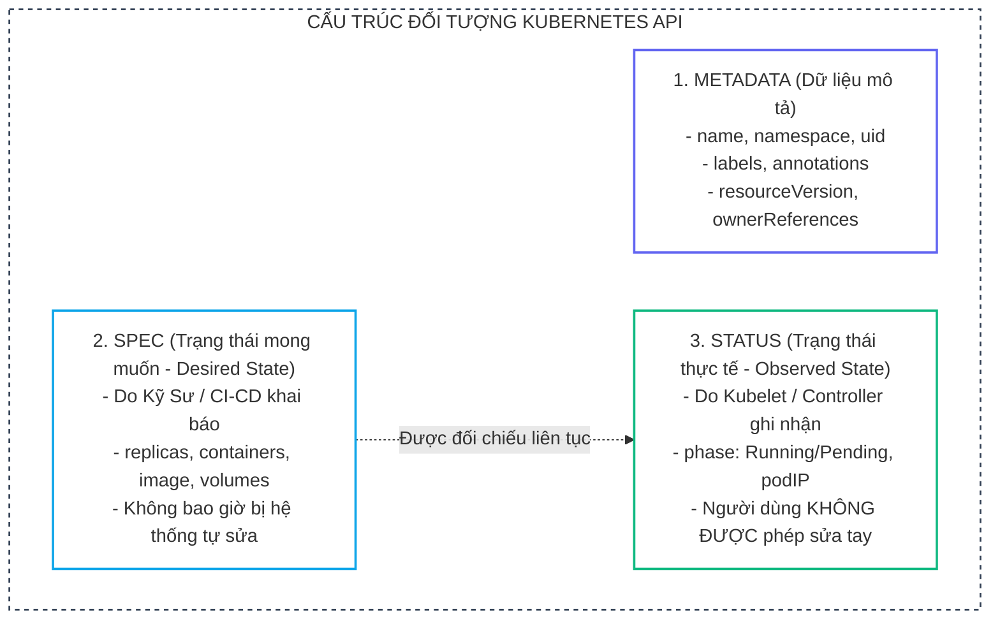
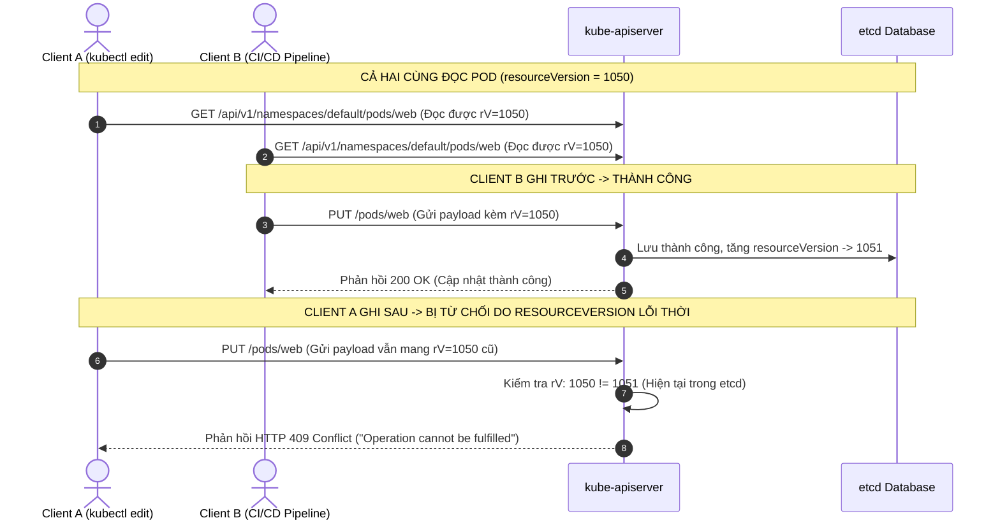
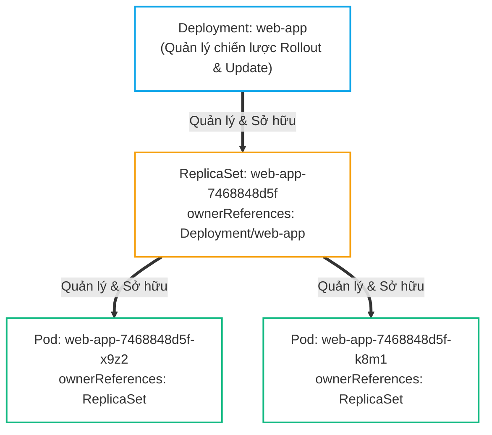
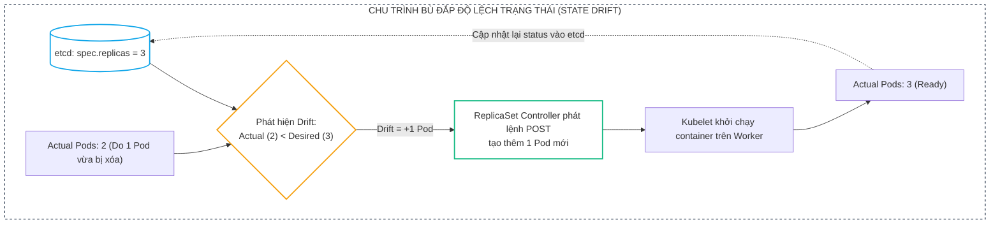
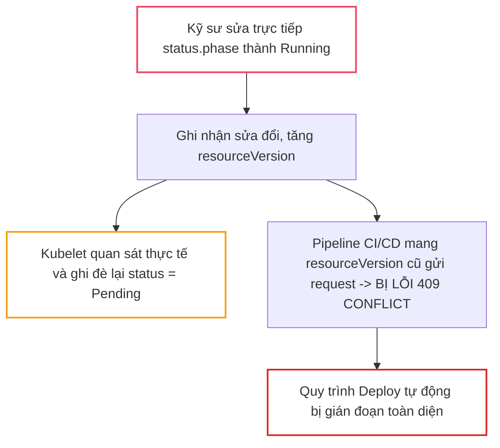
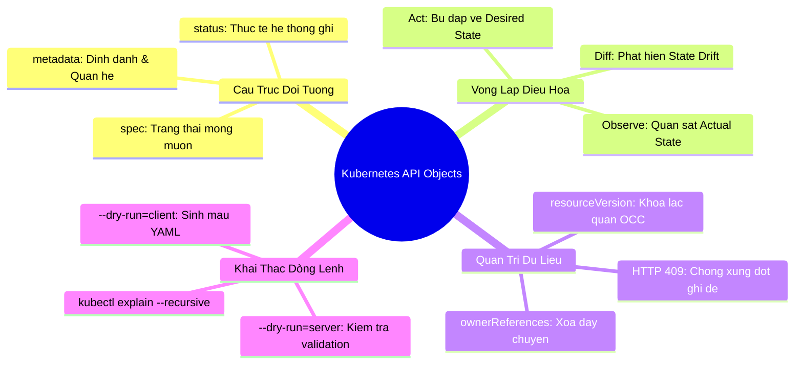


# [BÀI 03] ĐỐI TƯỢNG API & VÒNG LẶP ĐIỀU HÒA (RECONCILIATION LOOP): VÌ SAO MỌI THỨ LÀ KHAI BÁO DECLARATIVE

Trong kiến trúc Kubernetes, khái niệm **Mô hình Khai báo (Declarative Model)** không đơn thuần là cách chúng ta viết các tệp manifest YAML, mà là triết lý cốt lõi định hình toàn bộ hành vi vận hành của hệ thống. Thay vì ra lệnh từng bước như mô hình Mệnh lệnh (Imperative: *"Hãy tạo một container, mở cổng 80, gán 2GB RAM"*), kỹ sư chỉ cần định nghĩa **Trạng thái mong muốn (Desired State)** và giao toàn quyền cho hệ thống tự điều chỉnh để đạt được trạng thái đó.

Cơ chế giữ cho hàng triệu container luôn hoạt động đúng như thiết kế chính là **Vòng lặp điều hòa (Reconciliation Loop)**. Dù cho phần cứng gặp sự cố, container bị sập, hay người vận hành vô tình xóa mất một Pod con, các Controller chạy ngầm sẽ ngay lập tức phát hiện độ lệch trạng thái (State Drift) và tự động bù đắp trong vài phần mười giây.

Bài viết này sẽ mổ xẻ tường tận cấu trúc bên trong của một Đối tượng API Kubernetes, làm sáng tỏ sự khác biệt giữa `spec` và `status`, giải mã cơ chế chống xung đột đồng thời qua `resourceVersion` và hướng dẫn khai thác triệt để các công cụ tra cứu dòng lệnh chuẩn kỳ thi CKA.

---

> [!IMPORTANT]
> **MỤC TIÊU KỸ THUẬT THEN CHỐT:**
> - **Giải phẫu Đối tượng API**: Phân định rạch ròi vai trò của 3 khối `metadata`, `spec` (người dùng ghi), và `status` (hệ thống tự động cập nhật).
> - **Bản chất Vòng lặp điều hòa**: Hiểu sâu cơ chế `Observe -> Diff -> Act` của Controller Manager và nguyên lý bất biến khi đối tượng con bị can thiệp thủ công.
> - **Khóa lạc quan (OCC)**: Giải mã mã lỗi `HTTP 409 Conflict` và cách Kubernetes dùng `resourceVersion` để bảo vệ tính toàn vẹn dữ liệu trong `etcd`.
> - **Quan hệ sở hữu & Xóa dây chuyền**: Phân tích trường `metadata.ownerReferences` trong cấu trúc phả hệ Deployment $\rightarrow$ ReplicaSet $\rightarrow$ Pod.
> - **Tra cứu & Kiểm thử nhanh**: Khai thác `kubectl explain --recursive` và phân biệt chính xác giữa `--dry-run=client` và `--dry-run=server`.

---

## 1. Bản Chất Kiến Trúc & Tư Duy Cốt Lõi: Cấu Trúc Đối Tượng API & Chu Trình Điều Hòa

### 1.1. Cấu Trúc Đối Tượng API: Metadata, Spec và Status

Mọi tài nguyên trong Kubernetes (Pod, Service, Deployment, ConfigMap...) đều là một Đối tượng API (API Object) được lưu trữ dưới dạng JSON/YAML trong `etcd` với 3 phân vùng trách nhiệm độc lập:



1. <span class="badge badge--indigo">Khối Metadata (Định danh & Quan hệ)</span>:
   - Chứa thông tin nhận dạng duy nhất: `name`, `namespace`, `uid`.
   - Chứa nhãn phân loại (`labels`) phục vụ việc chọn lọc của Service/Deployment và chú thích phi định danh (`annotations`).
   - Chứa các trường hệ thống tối quan trọng: `resourceVersion` (quản lý phiên bản) và `ownerReferences` (xác định quan hệ cha-con).

2. <span class="badge badge--cyan">Khối Spec (Bản thiết kế mong muốn - Desired State)</span>:
   - Thể hiện ý chí và mong muốn của người vận hành: Cần bao nhiêu bản sao (`replicas`), dùng image nào, giới hạn CPU/RAM bao nhiêu.
   - Khi áp dụng lệnh `kubectl apply`, bạn chỉ gửi nội dung của khối `spec`.

3. <span class="badge badge--emerald">Khối Status (Trạng thái quan sát thực tế - Actual State)</span>:
   - Do Kubelet và Controller tự động ghi nhận và cập nhật vào `etcd` thông qua API Server.
   - Thể hiện thực trạng của tài nguyên: Pod đang ở phase nào (`Running`, `CrashLoopBackOff`), IP được cấp là gì, có bao nhiêu bản sao đang `Ready`.
   - **Quy tắc vàng**: Nếu người dùng cố tình chèn trường `status` vào file YAML khi `apply`, API Server sẽ tự động bỏ qua hoặc ghi đè ngay lập tức bằng giá trị thực tế.

---

### 1.2. Cơ Chế Khóa Lạc Quan (Optimistic Concurrency Control) Qua `resourceVersion`

Để ngăn chặn tình trạng hai tiến trình cùng ghi đè và làm mất dữ liệu của nhau (**Race Condition / Lost Updates**), Kubernetes áp dụng cơ chế **Optimistic Concurrency Control (OCC)** thông qua trường `metadata.resourceVersion`:



- Mỗi khi một đối tượng trong `etcd` bị thay đổi, `resourceVersion` (bản chất là 64-bit integer đếm commit index của etcd) sẽ tăng lên.
- Nếu client gửi bản cập nhật mang `resourceVersion` cũ hơn giá trị hiện hành trong `etcd`, API Server lập tức từ chối với mã <b style="color: var(--accent-rose);">HTTP 409 Conflict</b>, buộc client phải đọc lại dữ liệu mới nhất trước khi sửa tiếp.

---

### 1.3. Quan Hệ Sở Hữu (`ownerReferences`) & Xóa Dây Chuyền (Cascading Deletion)

Trong Kubernetes, các tài nguyên cấp cao không trực tiếp quản lý Pod mà xây dựng theo **Cây phả hệ phân cấp (Object Hierarchy)** thông qua trường `metadata.ownerReferences`:



- **Tính toàn vẹn của Controller**: Khi bạn xóa thủ công ReplicaSet con hoặc Pod con của một Deployment, Deployment Controller và ReplicaSet Controller sẽ phát hiện số lượng bản sao mong muốn (`spec.replicas`) bị thiếu hụt và tự động sinh lại đối tượng mới trong chưa đầy 1 giây.
- **Xóa dây chuyền (Cascading Deletion)**: Khi đối tượng cha (Deployment) bị xóa với chính sách mặc định `propagationPolicy: Foreground` hoặc `Background`, Kubernetes Garbage Collector sẽ tự động lần theo `ownerReferences` để xóa sạch toàn bộ ReplicaSet và Pods phụ thuộc.

---

## 2. Bảng Ma Trận So Sánh Kỹ Thuật Toàn Diện (Engineering Matrix)

### 2.1. So Sánh Mô Hình Mệnh Lệnh (Imperative) vs Khai Báo (Declarative)

| Tiêu Chí So Sánh | Mô Hình Mệnh Lệnh (Imperative) | Mô Hình Khai Báo (Declarative) |
| :--- | :--- | :--- |
| **Bản Chất Tư Duy** | Chỉ định các bước thực thi cụ thể (*"Làm như thế nào - How"*) | Khai báo bản thiết kế trạng thái cuối (*"Cần cái gì - What"*) |
| **Câu Lệnh Thao Tác** | `kubectl run`, `kubectl create`, `kubectl scale` | `kubectl apply -f manifest.yaml` |
| **Tính Idempotency** | Không có tính lặp lại an toàn (chạy lại lệnh sẽ báo lỗi đối tượng đã tồn tại) | **Tính Idempotency tuyệt đối** (chạy bao nhiêu lần cũng cho cùng 1 kết quả) |
| **Quản Trị GitOps** | Không hỗ trợ lưu vết cấu hình trong Git | **Chuẩn mực GitOps**: Toàn bộ hạ tầng lưu trong Git |
| **Phục Hồi Khi Lỗi** | Kỹ sư phải tự nhớ và gõ lại từng lệnh để bù đắp | Controller tự động Reconcile đưa hệ thống về đúng Spec |

---

### 2.2. So Sánh Hai Chế Độ Chạy Thử: `--dry-run=client` vs `--dry-run=server`

| Tiêu Chí Kỹ Thuật | `--dry-run=client` | `--dry-run=server` |
| :--- | :--- | :--- |
| **Nơi Xử Lý** | Cục bộ trên máy client (Terminal CLI) | Trên Kubernetes API Server thật |
| **Lưu Lượng Mạng** | Không phát sinh HTTP request tới cụm | Gửi đầy đủ HTTP POST/PUT request tới API Server |
| **Kiểm Tra AuthN / AuthZ** | Không kiểm tra | **Có kiểm tra** danh tính và quyền RBAC |
| **Kiểm Tra Admission Webhooks** | Không kiểm tra | **Thực thi đầy đủ** Mutating & Validating Webhooks |
| **Ghi Vào etcd Database** | Không ghi | **KHÔNG GHI** (Chỉ mô phỏng kết quả trả về) |
| **Mục Đích Sử Dụng Chính** | **Sinh nhanh file YAML mẫu** chuẩn trong 5 giây | **Kiểm thử chính sách bảo mật** và schema trước khi apply thật |

---

## 3. Kiến Trúc Điều Hòa Trạng Thái Chuẩn Production (Reconciliation Architecture)

Sơ đồ chi tiết chu trình điều hòa và cơ chế tự phục hồi khi có sự cố can thiệp thủ công:



```bash
# ==============================================================================
# BỘ LỆNH TRA CỨU SCHEMA & KIỂM THỬ KHAI BÁO TỐC ĐỘ CAO CHO KỲ THI CKA
# ==============================================================================

# 1. Tra cứu đường dẫn và kiểu dữ liệu của một trường trong Pod không cần mở tài liệu
kubectl explain pod.spec.containers.livenessProbe.httpGet

# 2. Tra cứu toàn bộ cây cấu trúc đệ quy của tài nguyên
kubectl explain deployment.spec.strategy --recursive

# 3. Sinh khung YAML hoàn chỉnh cho Service và kiểm tra tính hợp lệ trên Server thật
kubectl create service clusterip my-svc --tcp=80:8080 --dry-run=client -o yaml | kubectl apply --dry-run=server -f -
```

---

## 4. Phân Tích Cạm Bẫy Thực Chiến: Sửa Cưỡng Chế Status & Xung Đột ResourceVersion

### Tình Huống Sự Cố Thực Tế:
<span class="badge badge--rose">🕒 03:30 PM</span> Trong ca trực vận hành hệ thống thanh toán, kỹ sư phát hiện một Pod quan trọng bị kẹt ở trạng thái `Pending` do thiếu tài nguyên. Để "đánh lừa" hệ thống giám sát và khẩn trương báo cáo dịch vụ đã hoạt động, kỹ sư dùng lệnh `kubectl edit pod` và sửa trực tiếp dòng `phase: Pending` thành `phase: Running`. Cùng lúc đó, hệ thống CI/CD cố gắng cập nhật biến môi trường cho Pod và liên tục gặp lỗi sập pipeline do xung đột `resourceVersion`.

---

### Hậu Quả & Log Lỗi Thực Tế:
```text
# LỖI 1: KHỐI STATUS BỊ HỆ THỐNG GHI ĐÈ NGAY LẬP TỨC
$ kubectl edit pod auth-service
# Kỹ sư sửa status.phase: Running -> Lưu file
pod/auth-service edited

# KIỂM TRA LẠI: POD VẪN Ở TRẠNG THÁI PENDING VÌ KUBELET BÁO CÁO THỰC TẾ
$ kubectl get pod auth-service -o jsonpath='{.status.phase}'
Pending   <-- Bị Controller ghi đè về thực tế chỉ sau 50 mili-giây!

# LỖI 2: PIPELINE CI/CD BỊ SẬP VÌ XUNG ĐỘT RESOURCEVERSION (HTTP 409)
$ kubectl apply -f deployment.yaml
Error from server (Conflict): Operation cannot be fulfilled on deployments.apps "auth-service": 
the object has been modified; please apply your changes to the latest version and try again
```

Hành vi can thiệp sai lầm vào khối `status` không mang lại bất kỳ kết quả kỹ thuật nào, đồng thời làm thay đổi `resourceVersion` khiến các công cụ tự động hóa bị từ chối cập nhật do xung đột dữ liệu:



---

### 5-Whys Root Cause Analysis:
1. <span class="badge badge--primary">Why 1</span> **Tại sao pipeline CI/CD bị sập với lỗi 409 Conflict?** $\rightarrow$ Do đối tượng Deployment trên cụm đã bị sửa đổi `resourceVersion` trước khi CI/CD gửi payload.
2. <span class="badge badge--primary">Why 2</span> **Tại sao resourceVersion lại bị thay đổi đột ngột?** $\rightarrow$ Do kỹ sư đã mở lệnh `kubectl edit` để sửa trường `status` thủ công.
3. <span class="badge badge--primary">Why 3</span> **Tại sao việc sửa status lại không biến Pod thành Running?** $\rightarrow$ Vì `status` là trường phản ánh thực tế do Kubelet cập nhật; hệ thống điều hòa sẽ tự động ghi đè về đúng thực trạng.
4. <span class="badge badge--primary">Why 4</span> **Tại sao Pod ban đầu lại bị Pending?** $\rightarrow$ Do Scheduler không tìm được Node nào có đủ CPU/RAM đáp ứng `spec.resources.requests`.
5. <span class="badge badge--emerald">Root Cause Remedy</span> **Biện pháp khắc phục chuẩn SRE:**
   - <span class="badge badge--emerald">Spec-Only Rule</span> Tuyệt đối không can thiệp vào trường `status`. Mọi giải pháp khắc phục sự cố phải tác động vào `spec` (giảm request RAM hoặc bổ sung Worker Node).
   - <span class="badge badge--cyan">Declarative Apply</span> Sử dụng `kubectl apply` kết hợp Git version control thay vì `kubectl edit` trực tiếp trên Production để tránh xung đột `resourceVersion`.

---

## 5. Hands-on Lab: Khảo Sát Đối Tượng API & Kiểm Chứng Chu Trình Điều Hòa (8 Bước)

Bảng tóm tắt các bước thực hành trong bài Lab:

| Bước | Lệnh CLI / Cấu Hình | Mục Đích Kỹ Thuật |
| :---: | :--- | :--- |
| <span class="badge badge--primary">01</span> | `k run api-demo --image=nginx:alpine $do > pod.yaml` | Tạo file manifest Pod chuẩn không chứa khối `status` |
| <span class="badge badge--cyan">02</span> | `k apply -f pod.yaml` | Khởi tạo Pod vào cụm thực hành |
| <span class="badge badge--emerald">03</span> | `k get pod api-demo -o jsonpath='{.metadata.resourceVersion}'` | Trích xuất số hiệu `resourceVersion` của đối tượng |
| <span class="badge badge--primary">04</span> | `k create deployment deploy-demo --image=redis --replicas=3` | Khởi tạo Deployment để kiểm tra quan hệ phân cấp |
| <span class="badge badge--cyan">05</span> | `k get pods -l app=deploy-demo -o jsonpath='{.items[0].metadata.ownerReferences}'` | Khảo sát trường `ownerReferences` trỏ về ReplicaSet |
| <span class="badge badge--rose">06</span> | `k delete rs -l app=deploy-demo --cascade=orphan` | Thử nghiệm xóa ReplicaSet và quan sát Deployment tự bù |
| <span class="badge badge--amber">07</span> | `k explain pod.spec.containers.resources` | Thực hành tra cứu schema tài nguyên trong terminal |
| <span class="badge badge--emerald">08</span> | `k apply --dry-run=server -f pod.yaml` | Kiểm thử validation trên API Server thật không ghi etcd |

---

### Hướng Dẫn Thực Hành Chi Tiết Từng Bước:

#### Bước 1: Khởi tạo manifest Pod chuẩn không có trường status
```bash
# Sinh file manifest chuẩn bằng client dry-run
kubectl run api-demo --image=nginx:alpine --dry-run=client -o yaml > pod-demo.yaml

# Soi nội dung: Tuyệt đối không có trường status!
cat pod-demo.yaml
```

#### Bước 2: Apply Pod vào cụm và khảo sát khối status do hệ thống tự sinh
```bash
# Áp dụng cấu hình
kubectl apply -f pod-demo.yaml

# Đọc toàn bộ khối status thực tế do Kubelet ghi nhận
kubectl get pod api-demo -o yaml | grep -A 15 "^status:"
```

#### Bước 3: Trích xuất và theo dõi sự thay đổi của `resourceVersion`
```bash
# Lấy resourceVersion ban đầu
RV_BEFORE=$(kubectl get pod api-demo -o jsonpath='{.metadata.resourceVersion}')
echo "ResourceVersion Ban Đầu: $RV_BEFORE"

# Thực hiện gắn thêm nhãn (label) cho Pod
kubectl label pod api-demo env=production

# Lấy resourceVersion sau khi sửa: Con số này đã tăng lên!
RV_AFTER=$(kubectl get pod api-demo -o jsonpath='{.metadata.resourceVersion}')
echo "ResourceVersion Sau Cập Nhật: $RV_AFTER"
```

#### Bước 4: Tạo Deployment để kiểm tra quan hệ phả hệ `ownerReferences`
```bash
# Khởi tạo Deployment 3 bản sao
kubectl create deployment deploy-demo --image=nginx:alpine --replicas=3

# Lấy tên ReplicaSet do Deployment Controller sinh ra
RS_NAME=$(kubectl get rs -l app=deploy-demo -o jsonpath='{.items[0].metadata.name}')
echo "ReplicaSet Tự Sinh: $RS_NAME"
```

#### Bước 5: Kiểm tra trường `ownerReferences` của Pod và ReplicaSet
```bash
# 1. Soi ownerReferences của ReplicaSet: Trỏ về Deployment!
kubectl get rs $RS_NAME -o jsonpath='Owner: {.metadata.ownerReferences[0].kind} / Tên: {.metadata.ownerReferences[0].name}{"\n"}'

# 2. Soi ownerReferences của Pod: Trỏ về ReplicaSet!
POD_SAMPLE=$(kubectl get pods -l app=deploy-demo -o jsonpath='{.items[0].metadata.name}')
kubectl get pod $POD_SAMPLE -o jsonpath='Owner: {.metadata.ownerReferences[0].kind} / Tên: {.metadata.ownerReferences[0].name}{"\n"}'
```

#### Bước 6: Chứng minh chu trình điều hòa: Xóa ReplicaSet con và quan sát tự phục hồi
```bash
# Xóa ReplicaSet con
kubectl delete rs $RS_NAME

# Kiểm tra ngay lập tức: Deployment Controller đã sinh ra một ReplicaSet mới thay thế!
kubectl get rs -l app=deploy-demo
```

#### Bước 7: Kỹ thuật tra cứu sơ đồ Schema với `kubectl explain`
```bash
# Tra cứu cách khai báo trường Resources Requests & Limits trong phòng thi CKA
kubectl explain pod.spec.containers.resources.limits
```

#### Bước 8: Thực hành kiểm tra hợp lệ với `--dry-run=server` và dọn dẹp
```bash
# Thử nghiệm gửi manifest lên API Server thật để kiểm tra Mutating/Validating Webhooks
kubectl apply --dry-run=server -f pod-demo.yaml

# Dọn dẹp tài nguyên bài lab
kubectl delete pod api-demo --force --grace-period=0
kubectl delete deployment deploy-demo
rm -f pod-demo.yaml
```

---

## 6. 10 Câu Hỏi Tự Kiểm Tra Chuyên Sâu (Self-Check Q&A Accordion)

<details class="qa-card">
<summary class="qa-summary">
  <div class="qa-summary-left">
    <span class="qa-num-badge">Q01</span>
    <span>Tại sao người vận hành không được phép tự ý khai báo trường 'status' trong file YAML?</span>
  </div>
  <span class="qa-chevron">
    <svg width="18" height="18" fill="none" stroke="currentColor" stroke-width="2.5" viewBox="0 0 24 24"><polyline points="6 9 12 15 18 9"></polyline></svg>
  </span>
</summary>
<div class="qa-answer">
  <div class="qa-answer-header">
    <svg width="14" height="14" fill="none" stroke="currentColor" stroke-width="2" viewBox="0 0 24 24"><path d="M22 11.08V12a10 10 0 1 1-5.93-9.14"></path><polyline points="22 4 12 14.01 9 11.01"></polyline></svg>
    <span>Phân Tích &amp; Lời Giải Kỹ Thuật</span>
  </div>
  Khối <code>spec</code> là nơi người dùng khai báo <b style="color: var(--accent-primary);">Trạng thái mong muốn (Desired State)</b>, trong khi <code>status</code> là nơi hệ thống (Kubelet và các Controller) ghi nhận <b style="color: var(--accent-emerald);">Trạng thái thực tế (Observed State)</b>. Nếu người dùng tự ý ghi `status`, API Server sẽ tự động loại bỏ hoặc các Controller sẽ ghi đè lại ngay lập tức dựa trên quan sát thực tế từ cụm.
</div>
</details>

<details class="qa-card">
<summary class="qa-summary">
  <div class="qa-summary-left">
    <span class="qa-num-badge">Q02</span>
    <span>Mã lỗi HTTP 409 Conflict xảy ra trong tình huống nào và liên quan đến trường nào trong metadata?</span>
  </div>
  <span class="qa-chevron">
    <svg width="18" height="18" fill="none" stroke="currentColor" stroke-width="2.5" viewBox="0 0 24 24"><polyline points="6 9 12 15 18 9"></polyline></svg>
  </span>
</summary>
<div class="qa-answer">
  <div class="qa-answer-header">
    <svg width="14" height="14" fill="none" stroke="currentColor" stroke-width="2" viewBox="0 0 24 24"><path d="M22 11.08V12a10 10 0 1 1-5.93-9.14"></path><polyline points="22 4 12 14.01 9 11.01"></polyline></svg>
    <span>Phân Tích &amp; Lời Giải Kỹ Thuật</span>
  </div>
  Lỗi <b style="color: var(--accent-rose);">HTTP 409 Conflict</b> xảy ra do cơ chế khóa lạc quan (Optimistic Concurrency Control). Khi một client gửi yêu cầu cập nhật mang trường <code style="color: var(--accent-primary);">metadata.resourceVersion</code> cũ hơn phiên bản hiện có trong <code>etcd</code> (do đã có client khác sửa đổi trước đó), API Server từ chối request để chống ghi đè dữ liệu.
</div>
</details>

<details class="qa-card">
<summary class="qa-summary">
  <div class="qa-summary-left">
    <span class="qa-num-badge">Q03</span>
    <span>Vai trò cốt lõi của trường 'metadata.ownerReferences' là gì?</span>
  </div>
  <span class="qa-chevron">
    <svg width="18" height="18" fill="none" stroke="currentColor" stroke-width="2.5" viewBox="0 0 24 24"><polyline points="6 9 12 15 18 9"></polyline></svg>
  </span>
</summary>
<div class="qa-answer">
  <div class="qa-answer-header">
    <svg width="14" height="14" fill="none" stroke="currentColor" stroke-width="2" viewBox="0 0 24 24"><path d="M22 11.08V12a10 10 0 1 1-5.93-9.14"></path><polyline points="22 4 12 14.01 9 11.01"></polyline></svg>
    <span>Phân Tích &amp; Lời Giải Kỹ Thuật</span>
  </div>
  Trường <code>ownerReferences</code> xác định <b style="color: var(--accent-primary);">mối quan hệ phụ thuộc cha-con</b> giữa các đối tượng API (ví dụ: Deployment sở hữu ReplicaSet, ReplicaSet sở hữu Pod). Nó giúp Controller nhận biết đối tượng do mình quản lý và hỗ trợ Kubernetes Garbage Collector thực hiện cơ chế <b style="color: var(--accent-cyan);">Xóa dây chuyền (Cascading Deletion)</b> khi đối tượng cha bị xóa.
</div>
</details>

<details class="qa-card">
<summary class="qa-summary">
  <div class="qa-summary-left">
    <span class="qa-num-badge">Q04</span>
    <span>Điều gì xảy ra nếu bạn dùng lệnh 'kubectl delete rs' để xóa một ReplicaSet do Deployment quản lý?</span>
  </div>
  <span class="qa-chevron">
    <svg width="18" height="18" fill="none" stroke="currentColor" stroke-width="2.5" viewBox="0 0 24 24"><polyline points="6 9 12 15 18 9"></polyline></svg>
  </span>
</summary>
<div class="qa-answer">
  <div class="qa-answer-header">
    <svg width="14" height="14" fill="none" stroke="currentColor" stroke-width="2" viewBox="0 0 24 24"><path d="M22 11.08V12a10 10 0 1 1-5.93-9.14"></path><polyline points="22 4 12 14.01 9 11.01"></polyline></svg>
    <span>Phân Tích &amp; Lời Giải Kỹ Thuật</span>
  </div>
  <b style="color: var(--accent-primary);">Deployment Controller</b> liên tục theo dõi trạng thái cụm. Khi thấy ReplicaSet đại diện cho bản thiết kế mong muốn bị mất, chu trình điều hòa (Reconciliation Loop) sẽ lập tức phát lệnh POST lên API Server để <b style="color: var(--accent-emerald);">tự động tạo lại một ReplicaSet mới</b> và sinh các Pod tương ứng trong chưa đầy 1 giây.
</div>
</details>

<details class="qa-card">
<summary class="qa-summary">
  <div class="qa-summary-left">
    <span class="qa-num-badge">Q05</span>
    <span>Sự khác biệt quan trọng nhất giữa '--dry-run=client' và '--dry-run=server' là gì?</span>
  </div>
  <span class="qa-chevron">
    <svg width="18" height="18" fill="none" stroke="currentColor" stroke-width="2.5" viewBox="0 0 24 24"><polyline points="6 9 12 15 18 9"></polyline></svg>
  </span>
</summary>
<div class="qa-answer">
  <div class="qa-answer-header">
    <svg width="14" height="14" fill="none" stroke="currentColor" stroke-width="2" viewBox="0 0 24 24"><path d="M22 11.08V12a10 10 0 1 1-5.93-9.14"></path><polyline points="22 4 12 14.01 9 11.01"></polyline></svg>
    <span>Phân Tích &amp; Lời Giải Kỹ Thuật</span>
  </div>
  <div style="margin-bottom: 6px;"><code style="color: var(--accent-primary);">--dry-run=client</code> chỉ chạy kiểm tra cú pháp và sinh template YAML cục bộ trên máy mà <strong>hoàn toàn không gửi gói tin nào qua mạng</strong>.</div>
  <div><code style="color: var(--accent-cyan);">--dry-run=server</code> gửi request thật đến API Server để <strong>kiểm tra xác thực, quyền hạn RBAC và thực thi các Admission Webhooks</strong> nhưng đảm bảo không lưu dữ liệu vào etcd.</div>
</div>
</details>

<details class="qa-card">
<summary class="qa-summary">
  <div class="qa-summary-left">
    <span class="qa-num-badge">Q06</span>
    <span>Lệnh nào trong kubectl cho phép tra cứu toàn bộ cây cấu hình đệ quy của một đối tượng trong phòng thi CKA?</span>
  </div>
  <span class="qa-chevron">
    <svg width="18" height="18" fill="none" stroke="currentColor" stroke-width="2.5" viewBox="0 0 24 24"><polyline points="6 9 12 15 18 9"></polyline></svg>
  </span>
</summary>
<div class="qa-answer">
  <div class="qa-answer-header">
    <svg width="14" height="14" fill="none" stroke="currentColor" stroke-width="2" viewBox="0 0 24 24"><path d="M22 11.08V12a10 10 0 1 1-5.93-9.14"></path><polyline points="22 4 12 14.01 9 11.01"></polyline></svg>
    <span>Phân Tích &amp; Lời Giải Kỹ Thuật</span>
  </div>
  Sử dụng lệnh: <code style="color: var(--accent-primary);">kubectl explain &lt;resource&gt; --recursive</code>
  <div style="margin-top: 6px;">Ví dụ: <code>kubectl explain pod.spec.containers --recursive</code> sẽ in ra toàn bộ danh sách tất cả các trường con lồng nhau mà không cần rời khỏi màn hình terminal để tra cứu tài liệu web.</div>
</div>
</details>

<details class="qa-card">
<summary class="qa-summary">
  <div class="qa-summary-left">
    <span class="qa-num-badge">Q07</span>
    <span>Tại sao lệnh 'kubectl apply' có tính Idempotency trong khi 'kubectl create' thì không?</span>
  </div>
  <span class="qa-chevron">
    <svg width="18" height="18" fill="none" stroke="currentColor" stroke-width="2.5" viewBox="0 0 24 24"><polyline points="6 9 12 15 18 9"></polyline></svg>
  </span>
</summary>
<div class="qa-answer">
  <div class="qa-answer-header">
    <svg width="14" height="14" fill="none" stroke="currentColor" stroke-width="2" viewBox="0 0 24 24"><path d="M22 11.08V12a10 10 0 1 1-5.93-9.14"></path><polyline points="22 4 12 14.01 9 11.01"></polyline></svg>
    <span>Phân Tích &amp; Lời Giải Kỹ Thuật</span>
  </div>
  <code>kubectl create</code> gửi lệnh HTTP POST bắt buộc tạo mới; nếu đối tượng đã tồn tại, API Server sẽ trả lỗi ngay. Trong khi đó, <code>kubectl apply</code> sử dụng cơ chế <b style="color: var(--accent-primary);">Three-Way Merge Patch</b>: nếu đối tượng chưa có thì tạo mới, nếu đã có thì so sánh và cập nhật các trường thay đổi, đảm bảo chạy lặp lại nhiều lần vẫn đạt cùng một trạng thái duy nhất mà không gây lỗi.
</div>
</details>

<details class="qa-card">
<summary class="qa-summary">
  <div class="qa-summary-left">
    <span class="qa-num-badge">Q08</span>
    <span>Khái niệm 'State Drift' trong Kubernetes là gì và làm thế nào hệ thống giải quyết nó?</span>
  </div>
  <span class="qa-chevron">
    <svg width="18" height="18" fill="none" stroke="currentColor" stroke-width="2.5" viewBox="0 0 24 24"><polyline points="6 9 12 15 18 9"></polyline></svg>
  </span>
</summary>
<div class="qa-answer">
  <div class="qa-answer-header">
    <svg width="14" height="14" fill="none" stroke="currentColor" stroke-width="2" viewBox="0 0 24 24"><path d="M22 11.08V12a10 10 0 1 1-5.93-9.14"></path><polyline points="22 4 12 14.01 9 11.01"></polyline></svg>
    <span>Phân Tích &amp; Lời Giải Kỹ Thuật</span>
  </div>
  <b style="color: var(--accent-amber);">State Drift</b> là sự sai lệch giữa <b style="color: var(--accent-primary);">Trạng thái mong muốn (Spec)</b> và <b style="color: var(--accent-emerald);">Trạng thái thực tế (Status)</b> (ví dụ: khai báo 3 replicas nhưng thực tế chỉ còn 2 do 1 node sập). Controller Manager giải quyết độ lệch này bằng Vòng lặp điều hòa (Reconciliation Loop): liên tục quan sát, phát hiện độ lệch và thực hiện hành động tạo mới/xóa tài nguyên để đưa Actual State khớp hoàn toàn với Desired State.
</div>
</details>

<details class="qa-card">
<summary class="qa-summary">
  <div class="qa-summary-left">
    <span class="qa-num-badge">Q09</span>
    <span>Làm thế nào để xóa một Deployment nhưng vẫn giữ lại các Pods con của nó đang chạy?</span>
  </div>
  <span class="qa-chevron">
    <svg width="18" height="18" fill="none" stroke="currentColor" stroke-width="2.5" viewBox="0 0 24 24"><polyline points="6 9 12 15 18 9"></polyline></svg>
  </span>
</summary>
<div class="qa-answer">
  <div class="qa-answer-header">
    <svg width="14" height="14" fill="none" stroke="currentColor" stroke-width="2" viewBox="0 0 24 24"><path d="M22 11.08V12a10 10 0 1 1-5.93-9.14"></path><polyline points="22 4 12 14.01 9 11.01"></polyline></svg>
    <span>Phân Tích &amp; Lời Giải Kỹ Thuật</span>
  </div>
  Sử dụng cờ <code style="color: var(--accent-primary);">--cascade=orphan</code>:
  <div style="margin-top: 6px;"><code>kubectl delete deployment &lt;deployment-name&gt; --cascade=orphan</code></div>
  Lệnh này sẽ xóa bản ghi Deployment nhưng gỡ bỏ liên kết trong <code>ownerReferences</code> của ReplicaSet và Pods, giúp các container tiếp tục chạy mồ côi (Orphaned) mà không bị xóa theo.
</div>
</details>

<details class="qa-card">
<summary class="qa-summary">
  <div class="qa-summary-left">
    <span class="qa-num-badge">Q10</span>
    <span>Annotation khác Label ở điểm cốt lõi nào trong kiến trúc Kubernetes?</span>
  </div>
  <span class="qa-chevron">
    <svg width="18" height="18" fill="none" stroke="currentColor" stroke-width="2.5" viewBox="0 0 24 24"><polyline points="6 9 12 15 18 9"></polyline></svg>
  </span>
</summary>
<div class="qa-answer">
  <div class="qa-answer-header">
    <svg width="14" height="14" fill="none" stroke="currentColor" stroke-width="2" viewBox="0 0 24 24"><path d="M22 11.08V12a10 10 0 1 1-5.93-9.14"></path><polyline points="22 4 12 14.01 9 11.01"></polyline></svg>
    <span>Phân Tích &amp; Lời Giải Kỹ Thuật</span>
  </div>
  <div style="margin-bottom: 6px;"><b style="color: var(--accent-primary);">Labels</b> được dùng để <strong>định danh và truy vấn/chọn lọc (Selectors)</strong> bởi Service, Deployment, NetworkPolicy (có giới hạn độ dài ký tự khắt khe).</div>
  <div><b style="color: var(--accent-cyan);">Annotations</b> được dùng để lưu trữ <strong>siêu dữ liệu phi định danh (Non-identifying Metadata)</strong> với dung lượng lớn (như cấu hình Ingress, thông tin build Git commit, timestamp, cert manager) và không thể dùng trong Selector của Kubernetes.</div>
</div>
</details>

---

## 7. Tổng Kết & Lộ Trình Bài Học Tiếp Theo

### Tóm Tắt Các Điểm Cốt Lõi:
1. **Phân Tách Spec vs Status**: Người dùng quản trị khai báo `spec`, hệ thống tự động đo đạc và cập nhật `status`.
2. **Khóa Lạc Quan Qua ResourceVersion**: Mọi sửa đổi đều được bảo vệ bởi phiên bản tài nguyên để chống xung đột ghi đè đồng thời (409 Conflict).
3. **Tính Toàn Vẹn Của Vòng Điều Hòa**: Các Controller liên tục bù đắp độ lệch (Drift) để đưa thực tế về đúng thiết kế mong muốn.
4. **Công Cụ Kiểm Thử Tốc Độ Cao**: Sử dụng `kubectl explain --recursive` và `--dry-run=client/server` để tạo và kiểm tra manifest chuẩn xác trong phòng thi.



---

> [!TIP]
> **BÀI HỌC TIẾP THEO:**
> Trong **[[Bài 04] Kỹ Thuật Kubectl Tốc Độ Cao & JSONPath: Luyện Phản Xạ Dòng Lệnh & Xử Lý Dữ Liệu Không Cần jq](cka-04-04-kubectl-toc-do-va-jsonpath.html)**, chúng ta sẽ bước vào khóa huấn luyện thực chiến về kỹ năng điều khiển terminal: Làm chủ các cú pháp JSONPath nâng cao, lọc dữ liệu mảng đa tầng, định dạng Custom Columns và xây dựng các câu lệnh trích xuất dữ liệu chỉ trong 10 giây.


