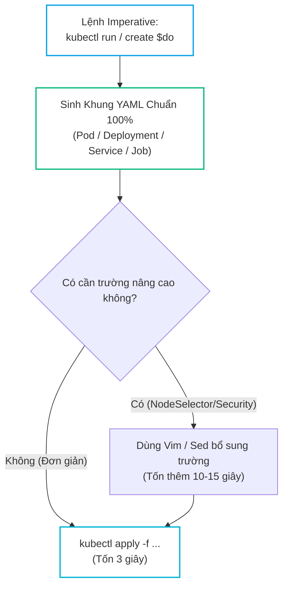
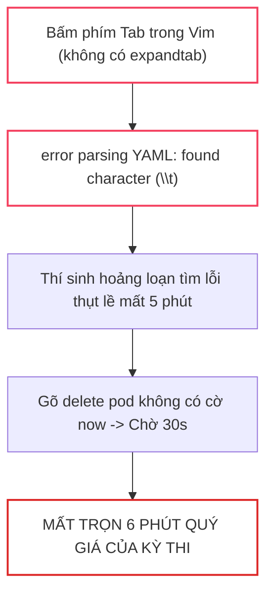
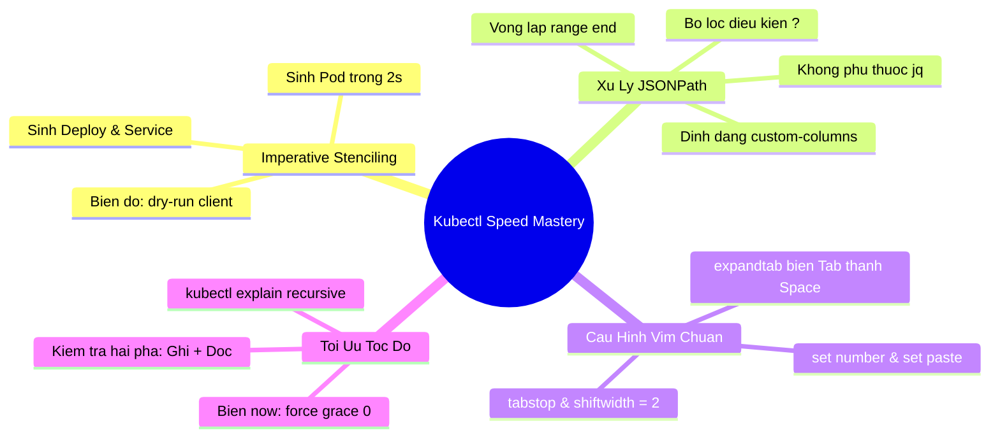


# [BÀI 04] KỸ THUẬT KUBECTL TỐC ĐỘ: IMPERATIVE COMMANDS, DRY-RUN, JSONPATH FILTERING & TỐI ƯU VIM KHẮC NGHIỆT

Trong các kỳ thi sát hạch thực hành khắc nghiệt của Linux Foundation / CNCF như **CKA**, **CKAD** hay **CKS**, kiến thức lý thuyết vững vàng chỉ đóng góp 50% khả năng đỗ. 50% còn lại được quyết định bởi **Tốc độ gõ phím và phản xạ xử lý dòng lệnh (Keystroke & Terminal Efficiency)** dưới áp lực đồng hồ đếm ngược 120 phút.

Một thí sinh trung bình mất từ 2 đến 4 phút để mở trình duyệt, tìm mẫu YAML trên trang tài liệu, sao chép về và nắn chỉnh bằng tay. Trong khi đó, một kỹ sư chuyên nghiệp chỉ mất **dưới 5 giây** để sinh ra một bản kê khai chuẩn xác bằng các cờ lệnh **Imperative kết hợp Dry-Run**, sử dụng **JSONPath** để trích xuất dữ liệu mảng phức tạp mà không cần cài đặt thêm `jq`, và hoàn thành bài thi 120 phút chỉ trong 75–80 phút.

Bài viết chuyên sâu này sẽ trang bị cho bạn bộ kỹ năng "tác chiến tốc độ cao" trên terminal: từ việc thiết lập cấu hình `.vimrc` tối ưu, làm chủ các mẫu lệnh Imperative phổ biến nhất, đến việc thuần thục cú pháp JSONPath lọc mảng đa tầng.

---

> [!IMPORTANT]
> **MỤC TIÊU KỸ THUẬT THEN CHỐT:**
> - **Tuyệt đối không gõ YAML từ con số 0**: Nắm vững kỹ thuật tạo khung mẫu tự động (Stenciling) qua biến môi trường `export do="--dry-run=client -o yaml"`.
> - **Xử lý dữ liệu không cần `jq`**: Làm chủ cú pháp `jsonpath` với vòng lặp `{range}`, bộ lọc điều kiện `[?(@.status.phase=="Running")]` và định dạng `custom-columns`.
> - **Chuẩn hóa môi trường soạn thảo**: Thiết lập `.vimrc` biến phím Tab thành 2 dấu cách chuẩn xác, loại bỏ 100% nguy cơ sập parser do Tab ngầm.
> - **Kỹ năng xóa tài nguyên tức thì**: Áp dụng cờ `export now="--force --grace-period=0"` để xóa Pod lập tức trong 0 giây thay vì phải chờ 30 giây mặc định.

---

## 1. Bản Chất Kiến Trúc & Tư Duy Cốt Lõi: Tối Ưu Hóa Dòng Lệnh & Xử Lý JSONPath

### 1.1. Kỹ Thuật Đúc Khung Mẫu Imperative (Imperative Stenciling)

Thay vì gõ tay từng dòng thụt lề trong trình soạn thảo, kỹ thuật **Imperative Stenciling** sử dụng chính client `kubectl` để sinh ra một bộ khung YAML hợp lệ 100% về cú pháp và schema trong 2 giây:



```bash
# ==============================================================================
# BỘ BIẾN MÔI TRƯỜNG TỐC ĐỘ CAO (THIẾT LẬP Ở PHÚT ĐẦU TIÊN CỦA KỲ THI)
# ==============================================================================
export do="--dry-run=client -o yaml"
export now="--force --grace-period=0"

# 1. Sinh khung Pod Nginx kèm biến môi trường và cổng trong 2 giây:
kubectl run web-app --image=nginx:alpine --port=80 --env="ENV=prod" $do > pod.yaml

# 2. Sinh khung Deployment kèm số lượng bản sao:
kubectl create deployment redis-cluster --image=redis:7-alpine --replicas=3 $do > deploy.yaml

# 3. Sinh khung Service ClusterIP phơi cổng 80 -> 8080:
kubectl create service clusterip web-svc --tcp=80:8080 $do > svc.yaml

# 4. Sinh khung Job giới hạn số lần chạy lại:
kubectl create job backup-job --image=busybox $do -- echo "Backup complete" > job.yaml
```

---

### 1.2. Kiến Trúc Cú Pháp JSONPath: Phân Tích & Trích Xuất Dữ Liệu

Dữ liệu trả về từ API Server là một cấu trúc JSON lồng nhau nhiều tầng. Biểu thức `jsonpath` hoạt động như một ống dẫn lọc luồng dữ liệu theo đường dẫn cây:

```mermaid
graph TD
    API_RESPONSE["Khối Dữ Liệu JSON Thô (API Server Response)"] --> ROOT_ITEMS["Duyệt mảng gốc: .items[*]"]
    ROOT_ITEMS --> FILTER_COND{"Lọc Điều Kiện:<br/>[?(@.status.phase=='Running')]"}
    FILTER_COND --> EXTRACT_FIELD["Trích xuất trường:<br/>.metadata.name / .status.podIP"]
    EXTRACT_FIELD --> FORMAT_OUTPUT["Định dạng hiển thị:<br/>Tabs {\"\t\"} & Xuống dòng {\"\n\"}"]

    style API_RESPONSE fill:none,stroke:#334155,stroke-width:1.5px
    style ROOT_ITEMS fill:none,stroke:#6366f1,stroke-width:2px
    style FILTER_COND fill:none,stroke:#f59e0b,stroke-width:2px
    style FORMAT_OUTPUT fill:none,stroke:#10b981,stroke-width:2px
```

```bash
# ------------------------------------------------------------------------------
# CÁC MẪU TRUY VẤN JSONPATH KINH ĐIỂN TRONG KỲ THI CKA
# ------------------------------------------------------------------------------

# 1. Trích xuất danh sách tên Pod và IP trên từng dòng riêng biệt:
kubectl get pods -A -o jsonpath='{range .items[*]}{.metadata.name}{"\t"}{.status.podIP}{"\n"}{end}'

# 2. Lọc danh sách các Node đang ở trạng thái Ready:
kubectl get nodes -o jsonpath='{range .items[*]}{.metadata.name}{"\t"}{range .status.conditions[?(@.type=="Ready")]}{.status}{"\n"}{end}{end}'

# 3. Sắp xếp danh sách Pod theo thời gian khởi tạo:
kubectl get pods -A --sort-by=.metadata.creationTimestamp

# 4. Lấy tất cả container image đang chạy trong namespace default:
kubectl get pods -o jsonpath='{.items[*].spec.containers[*].image}'
```

---

### 1.3. Định Dạng Bảng Tùy Biến Với `custom-columns`

Khi đề bài yêu cầu xuất báo cáo thông tin nhiều cột dạng bảng mà không cần xử lý chuỗi phức tạp trong `jsonpath`, tùy chọn `-o custom-columns` là giải pháp trực quan và nhanh nhất:

```bash
# Xuất danh sách Pod với tiêu đề cột tự định nghĩa
kubectl get pods -A -o custom-columns=\
NAME:.metadata.name,\
NAMESPACE:.metadata.namespace,\
NODE:.spec.nodeName,\
IP:.status.podIP,\
STATUS:.status.phase
```

---

## 2. Bảng Ma Trận So Sánh Kỹ Thuật Toàn Diện (Engineering Matrix)

### 2.1. Ma Trận Kỹ Thuật Sinh Manifest Nhanh

| Loại Tài Nguyên | Lệnh Imperative Tạo Khung | Các Cờ Tùy Chọn Hữu Ích | Thời Gian Thực Hiện |
| :--- | :--- | :--- | :---: |
| **Pod** | `kubectl run <name> --image=` | `--port=80`, `--env="K=V"`, `--labels="app=v1"` | <b style="color: var(--accent-emerald);">~ 2 giây</b> |
| **Deployment** | `kubectl create deployment <name> --image=` | `--replicas=3`, `--port=8080` | <b style="color: var(--accent-emerald);">~ 2 giây</b> |
| **Service (ClusterIP)** | `kubectl create service clusterip <name> --tcp=80:80` | Nối với Deployment: `kubectl expose deployment ...` | <b style="color: var(--accent-emerald);">~ 3 giây</b> |
| **Service (NodePort)** | `kubectl create service nodeport <name> --tcp=80:80` | `--node-port=30080` | <b style="color: var(--accent-emerald);">~ 3 giây</b> |
| **ConfigMap** | `kubectl create configmap <name> --from-literal=k=v` | `--from-file=config.txt`, `--from-env-file=.env` | <b style="color: var(--accent-emerald);">~ 2 giây</b> |
| **Secret (Generic)** | `kubectl create secret generic <name> --from-literal=p=123` | `--type=generic`, `--from-file=key.pem` | <b style="color: var(--accent-emerald);">~ 2 giây</b> |
| **CronJob** | `kubectl create cronjob <name> --image= --schedule=""` | `--schedule="*/5 * * * *"`, `--restart=OnFailure` | <b style="color: var(--accent-emerald);">~ 4 giây</b> |

---

### 2.2. Ma Trận Các Ký Tự Điều Khiển Trong JSONPath

| Ký Hiệu Cú Pháp | Ý Nghĩa Kỹ Thuật | Ví Dụ Thực Chiến |
| :---: | :--- | :--- |
| `$` | Đối tượng gốc (Root Object) | `$.items` hoặc `.items` |
| `.` | Truy cập trường con (Child operator) | `.metadata.name` |
| `[*]` | Duyệt toàn bộ phần tử của mảng | `.spec.containers[*].image` |
| `[0]` | Lấy phần tử đầu tiên của mảng | `.spec.containers[0].name` |
| `[?(condition)]` | Bộ lọc điều kiện logic (Filter query) | `[?(@.status.phase=="Running")]` |
| `{range ...}{end}` | Vòng lặp duyệt danh sách | `{range .items[*]}{.metadata.name}{"\n"}{end}` |
| `{"\t"}` / `{"\n"}` | Ký tự khoảng cách tab và xuống dòng | Dùng để định dạng văn bản xuất ra terminal |

---

## 3. Kiến Trúc Cấu Hình Môi Trường Soạn Thảo Chuẩn SRE

Trong phòng thi, trình soạn thảo mặc định là `vim` hoặc `vi`. Một ký tự Tab vô tình lọt vào file YAML sẽ làm sập hoàn toàn parser của `kubectl` với lỗi `found character that cannot start any token`.

```bash
# ==============================================================================
# TỆP CẤU HÌNH ~/.vimrc TỐI ƯU HÓA SOẠN THẢO YAML
# ==============================================================================
cat << 'EOF' > ~/.vimrc
set tabstop=2        " 1 Tab hiển thị bằng 2 dấu cách
set shiftwidth=2     " Khi dùng >> hoặc << sẽ thụt vào 2 dấu cách
set expandtab        " TỰ ĐỘNG CHUYỂN PHÍM TAB THÀNH 2 DẤU CÁCH (CHỐNG LỖI YAML)
set autoindent       " Tự động thụt lề theo dòng trước đó
set smartindent      " Thụt lề thông minh theo khối lệnh
set number           " Hiển thị số dòng để dễ định vị lỗi parser
set paste            " Giữ nguyên định dạng khi paste code từ ngoài vào
EOF
```

---

## 4. Phân Tích Cạm Bẫy Thực Chiến: Thảm Họa Tab Ngầm & Xóa Tài Nguyên Chờ Đợi

### Tình Huống Sự Cố Thực Tế:
<span class="badge badge--rose">🕒 11:15 AM</span> Trong phòng thi CKA, thí sinh mở `vim` để bổ sung trường `resources.limits` cho file manifest Pod. Do môi trường chưa cấu hình `expandtab`, thí sinh bấm phím `Tab` để thụt lề. Khi chạy `kubectl apply -f pod.yaml`, lệnh liên tục báo lỗi cú pháp. Hoảng loạn, thí sinh cố gắng xóa Pod cũ đang bị treo bằng lệnh `kubectl delete pod web` mà không gắn cờ timeout, khiến terminal bị khóa cứng 30 giây để chờ Grace Period kết thúc.

---

### Hậu Quả & Log Lỗi Thực Tế:
```text
# LỖI 1: YAML PARSER SẬP VÌ KÝ TỰ TAB ẨN TRONG FILE
$ kubectl apply -f pod.yaml
error: error parsing pod.yaml: error converting YAML to JSON: 
yaml: line 9: found character that cannot start any token (\t)

# LỖI 2: LỆNH XÓA BỊ CHỜ 30 GIÂY GRACE PERIOD MẶC ĐỊNH
$ kubectl delete pod web-app
pod "web-app" deleted   <-- MẤT 30 GIÂY CHỜ ĐỢI TERMINAL GIẢI PHÓNG!
```



---

### 5-Whys Root Cause Analysis:
1. <span class="badge badge--primary">Why 1</span> **Tại sao lệnh kubectl apply bị từ chối?** $\rightarrow$ Do file YAML chứa ký tự Tab (`\t`) không hợp lệ theo chuẩn cú pháp YAML.
2. <span class="badge badge--primary">Why 2</span> **Tại sao lại có ký tự Tab trong file?** $\rightarrow$ Thí sinh bấm phím Tab trong `vim` mà chưa thiết lập cờ `set expandtab`.
3. <span class="badge badge--primary">Why 3</span> **Tại sao lại phải gõ tay cấu trúc YAML phức tạp?** $\rightarrow$ Do thí sinh không dùng `kubectl explain` và biến `$do` để sinh khung tự động.
4. <span class="badge badge--primary">Why 4</span> **Tại sao lệnh xóa Pod lại làm mất 30 giây?** $\rightarrow$ Vì Kubelet mặc định cấp 30 giây `terminationGracePeriodSeconds` để container dọn dẹp trước khi gửi `SIGKILL`.
5. <span class="badge badge--emerald">Root Cause Remedy</span> **Biện pháp khắc phục chuẩn SRE:**
   - <span class="badge badge--emerald">Vim Profile Setup</span> Luôn cấu hình `.vimrc` với `expandtab` ngay ở phút đầu tiên.
   - <span class="badge badge--cyan">Force Deletion Alias</span> Luôn sử dụng alias `export now="--force --grace-period=0"` khi cần xóa nhanh tài nguyên trong phòng thi.

---

## 5. Hands-on Lab: Khảo Sát Tốc Độ Dòng Lệnh & Luyện Phản Xạ JSONPath (8 Bước)

Bảng tóm tắt các bước thực hành trong bài Lab:

| Bước | Lệnh CLI / Cấu Hình | Mục Đích Kỹ Thuật |
| :---: | :--- | :--- |
| <span class="badge badge--primary">01</span> | `cat << 'EOF' > ~/.vimrc ...` | Cấu hình Vim tối ưu chống lỗi Tab thụt lề |
| <span class="badge badge--cyan">02</span> | `export do="--dry-run=client -o yaml"` | Nạp biến sinh khung YAML siêu tốc |
| <span class="badge badge--emerald">03</span> | `k run nginx-speed --image=nginx:alpine --port=80 $do > pod.yaml` | Sinh file Pod hoàn chỉnh trong 2 giây |
| <span class="badge badge--primary">04</span> | `k create deployment web-cluster --image=redis:alpine --replicas=3` | Khởi tạo Deployment để lấy dữ liệu thực hành |
| <span class="badge badge--cyan">05</span> | `k get pods -o jsonpath='{.items[*].metadata.name}'` | Thực hành trích xuất danh sách tên Pod |
| <span class="badge badge--emerald">06</span> | `k get pods -o jsonpath='{range .items[*]}{.metadata.name}{"\t"}{.status.podIP}{"\n"}{end}'` | Xuất bảng dữ liệu có định dạng dòng |
| <span class="badge badge--amber">07</span> | `k get pods -o custom-columns=NAME:.metadata.name,IP:.status.podIP` | Xuất bảng tùy biến bằng Custom-Columns |
| <span class="badge badge--rose">08</span> | `k delete pod,deployment -l app $now` | Xóa sạch toàn bộ tài nguyên trong 0 giây |

---

### Hướng Dẫn Thực Hành Chi Tiết Từng Bước:

#### Bước 1: Thiết lập cấu hình `.vimrc` chuẩn
```bash
cat << 'EOF' > ~/.vimrc
set tabstop=2
set shiftwidth=2
set expandtab
set number
set paste
EOF
```

#### Bước 2: Nạp các biến môi trường tốc độ cao
```bash
alias k=kubectl
export do="--dry-run=client -o yaml"
export now="--force --grace-period=0"
```

#### Bước 3: Sinh khung Pod kèm nhãn và biến môi trường
```bash
# Sinh file Pod chỉ trong 2 giây
k run speed-pod --image=nginx:alpine --port=80 --env="REGION=asia" --labels="app=speed,tier=frontend" $do > speed-pod.yaml

# Áp dụng cấu hình
k apply -f speed-pod.yaml
```

#### Bước 4: Tạo Deployment nhiều bản sao để chuẩn bị dữ liệu lọc
```bash
# Tạo Deployment 3 bản sao
k create deployment worker-cluster --image=redis:7-alpine --replicas=3
k wait --for=condition=Ready pod -l app=worker-cluster --timeout=30s
```

#### Bước 5: Thực hành trích xuất mảng cơ bản với JSONPath
```bash
# Lấy danh sách tên tất cả các Pod trong namespace default
k get pods -o jsonpath='{.items[*].metadata.name}'
echo ""
```

#### Bước 6: Trích xuất bảng dữ liệu chuẩn với vòng lặp `{range}`
```bash
# Trích xuất Tên Pod, Node gán và Pod IP
k get pods -o jsonpath='{range .items[*]}{.metadata.name}{"\t"}{.spec.nodeName}{"\t"}{.status.podIP}{"\n"}{end}'
```

#### Bước 7: Xuất dữ liệu chuyên nghiệp với `-o custom-columns`
```bash
# Định dạng bảng với tiêu đề rõ ràng
k get pods -o custom-columns=POD_NAME:.metadata.name,RUNNING_NODE:.spec.nodeName,IP_ADDR:.status.podIP
```

#### Bước 8: Xóa tài nguyên tức thì bằng cờ `$now`
```bash
# Xóa toàn bộ Pod và Deployment lập tức không chờ grace period
k delete pod speed-pod $now
k delete deployment worker-cluster $now
rm -f speed-pod.yaml
```

---

## 6. 10 Câu Hỏi Tự Kiểm Tra Chuyên Sâu (Self-Check Q&A Accordion)

<details class="qa-card">
<summary class="qa-summary">
  <div class="qa-summary-left">
    <span class="qa-num-badge">Q01</span>
    <span>Làm thế nào để tạo nhanh file manifest YAML cho một CronJob chạy định kỳ 5 phút một lần?</span>
  </div>
  <span class="qa-chevron">
    <svg width="18" height="18" fill="none" stroke="currentColor" stroke-width="2.5" viewBox="0 0 24 24"><polyline points="6 9 12 15 18 9"></polyline></svg>
  </span>
</summary>
<div class="qa-answer">
  <div class="qa-answer-header">
    <svg width="14" height="14" fill="none" stroke="currentColor" stroke-width="2" viewBox="0 0 24 24"><path d="M22 11.08V12a10 10 0 1 1-5.93-9.14"></path><polyline points="22 4 12 14.01 9 11.01"></polyline></svg>
    <span>Phân Tích &amp; Lời Giải Kỹ Thuật</span>
  </div>
  Sử dụng lệnh Imperative kết hợp cờ <code>$do</code>:
  <div style="margin-top: 6px;"><code>kubectl create cronjob my-job --image=busybox --schedule="*/5 * * * *" $do -- /bin/sh -c "date" &gt; cronjob.yaml</code></div>
  Lệnh này sinh toàn bộ cấu trúc <code>spec.jobTemplate.spec.template.spec</code> chuẩn xác trong 2 giây mà không cần tra cứu cú pháp lồng nhau phức tạp.
</div>
</details>

<details class="qa-card">
<summary class="qa-summary">
  <div class="qa-summary-left">
    <span class="qa-num-badge">Q02</span>
    <span>Cú pháp JSONPath nào cho phép lọc và chỉ hiển thị tên các Pod đang ở trạng thái 'Running'?</span>
  </div>
  <span class="qa-chevron">
    <svg width="18" height="18" fill="none" stroke="currentColor" stroke-width="2.5" viewBox="0 0 24 24"><polyline points="6 9 12 15 18 9"></polyline></svg>
  </span>
</summary>
<div class="qa-answer">
  <div class="qa-answer-header">
    <svg width="14" height="14" fill="none" stroke="currentColor" stroke-width="2" viewBox="0 0 24 24"><path d="M22 11.08V12a10 10 0 1 1-5.93-9.14"></path><polyline points="22 4 12 14.01 9 11.01"></polyline></svg>
    <span>Phân Tích &amp; Lời Giải Kỹ Thuật</span>
  </div>
  Sử dụng bộ lọc điều kiện <code>[?(...)]</code> trong JSONPath:
  <div style="margin-top: 6px;"><code>kubectl get pods -o jsonpath='{.items[?(@.status.phase=="Running")].metadata.name}'</code></div>
  Ký tự <code>@</code> đại diện cho phần tử hiện tại đang được duyệt trong mảng <code>.items</code>.
</div>
</details>

<details class="qa-card">
<summary class="qa-summary">
  <div class="qa-summary-left">
    <span class="qa-num-badge">Q03</span>
    <span>Tại sao cần thêm '{"\\n"}' vào cuối biểu thức vòng lặp range trong JSONPath?</span>
  </div>
  <span class="qa-chevron">
    <svg width="18" height="18" fill="none" stroke="currentColor" stroke-width="2.5" viewBox="0 0 24 24"><polyline points="6 9 12 15 18 9"></polyline></svg>
  </span>
</summary>
<div class="qa-answer">
  <div class="qa-answer-header">
    <svg width="14" height="14" fill="none" stroke="currentColor" stroke-width="2" viewBox="0 0 24 24"><path d="M22 11.08V12a10 10 0 1 1-5.93-9.14"></path><polyline points="22 4 12 14.01 9 11.01"></polyline></svg>
    <span>Phân Tích &amp; Lời Giải Kỹ Thuật</span>
  </div>
  Mặc định, JSONPath của <code>kubectl</code> sẽ nối liền toàn bộ các chuỗi kết quả trên cùng 1 dòng duy nhất (gây dính chữ và khó đọc). Khối <code style="color: var(--accent-primary);">{"\n"}</code> yêu cầu parser in ký tự xuống dòng sau mỗi vòng lặp, giúp kết quả hiển thị chuẩn từng dòng độc lập.
</div>
</details>

<details class="qa-card">
<summary class="qa-summary">
  <div class="qa-summary-left">
    <span class="qa-num-badge">Q04</span>
    <span>Làm thế nào để sắp xếp danh sách Pods theo dung lượng bộ nhớ hoặc thời gian khởi tạo?</span>
  </div>
  <span class="qa-chevron">
    <svg width="18" height="18" fill="none" stroke="currentColor" stroke-width="2.5" viewBox="0 0 24 24"><polyline points="6 9 12 15 18 9"></polyline></svg>
  </span>
</summary>
<div class="qa-answer">
  <div class="qa-answer-header">
    <svg width="14" height="14" fill="none" stroke="currentColor" stroke-width="2" viewBox="0 0 24 24"><path d="M22 11.08V12a10 10 0 1 1-5.93-9.14"></path><polyline points="22 4 12 14.01 9 11.01"></polyline></svg>
    <span>Phân Tích &amp; Lời Giải Kỹ Thuật</span>
  </div>
  Sử dụng cờ <code style="color: var(--accent-primary);">--sort-by=&lt;jsonpath-exp&gt;</code>:
  <div style="margin-top: 6px;"><code>kubectl get pods -A --sort-by=.metadata.creationTimestamp</code></div>
  Lệnh này giúp lọc nhanh các Pod mới tạo hoặc Pod cũ nhất trong toàn bộ cụm.
</div>
</details>

<details class="qa-card">
<summary class="qa-summary">
  <div class="qa-summary-left">
    <span class="qa-num-badge">Q05</span>
    <span>Cấu hình nào trong .vimrc giúp biến phím Tab thành 2 dấu cách để tránh lỗi thụt lề YAML?</span>
  </div>
  <span class="qa-chevron">
    <svg width="18" height="18" fill="none" stroke="currentColor" stroke-width="2.5" viewBox="0 0 24 24"><polyline points="6 9 12 15 18 9"></polyline></svg>
  </span>
</summary>
<div class="qa-answer">
  <div class="qa-answer-header">
    <svg width="14" height="14" fill="none" stroke="currentColor" stroke-width="2" viewBox="0 0 24 24"><path d="M22 11.08V12a10 10 0 1 1-5.93-9.14"></path><polyline points="22 4 12 14.01 9 11.01"></polyline></svg>
    <span>Phân Tích &amp; Lời Giải Kỹ Thuật</span>
  </div>
  Bộ ba thiết lập bắt buộc trong <code>~/.vimrc</code>:
  <div style="margin-top: 6px;"><code>set tabstop=2</code> (Độ rộng Tab hiển thị bằng 2 space)</div>
  <div style="margin-top: 4px;"><code>set shiftwidth=2</code> (Độ rộng thụt dòng khi indent)</div>
  <div style="margin-top: 4px;"><code style="color: var(--accent-primary);">set expandtab</code> (Tự động chuyển đổi phím Tab thành các dấu cách thực sự)</div>
</div>
</details>

<details class="qa-card">
<summary class="qa-summary">
  <div class="qa-summary-left">
    <span class="qa-num-badge">Q06</span>
    <span>Làm thế nào để tạo nhanh một Service NodePort phơi cổng 80 của Deployment nginx?</span>
  </div>
  <span class="qa-chevron">
    <svg width="18" height="18" fill="none" stroke="currentColor" stroke-width="2.5" viewBox="0 0 24 24"><polyline points="6 9 12 15 18 9"></polyline></svg>
  </span>
</summary>
<div class="qa-answer">
  <div class="qa-answer-header">
    <svg width="14" height="14" fill="none" stroke="currentColor" stroke-width="2" viewBox="0 0 24 24"><path d="M22 11.08V12a10 10 0 1 1-5.93-9.14"></path><polyline points="22 4 12 14.01 9 11.01"></polyline></svg>
    <span>Phân Tích &amp; Lời Giải Kỹ Thuật</span>
  </div>
  Sử dụng lệnh <code>kubectl expose</code> trực tiếp:
  <div style="margin-top: 6px;"><code>kubectl expose deployment nginx --name=nginx-np --type=NodePort --port=80 --target-port=80</code></div>
  Lệnh này sẽ tự động sao chép toàn bộ Label Selectors của Deployment sang Service mà không cần gõ file YAML.
</div>
</details>

<details class="qa-card">
<summary class="qa-summary">
  <div class="qa-summary-left">
    <span class="qa-num-badge">Q07</span>
    <span>Cờ '--force --grace-period=0' hoạt động như thế nào ở tầng thấp của Kubernetes?</span>
  </div>
  <span class="qa-chevron">
    <svg width="18" height="18" fill="none" stroke="currentColor" stroke-width="2.5" viewBox="0 0 24 24"><polyline points="6 9 12 15 18 9"></polyline></svg>
  </span>
</summary>
<div class="qa-answer">
  <div class="qa-answer-header">
    <svg width="14" height="14" fill="none" stroke="currentColor" stroke-width="2" viewBox="0 0 24 24"><path d="M22 11.08V12a10 10 0 1 1-5.93-9.14"></path><polyline points="22 4 12 14.01 9 11.01"></polyline></svg>
    <span>Phân Tích &amp; Lời Giải Kỹ Thuật</span>
  </div>
  Bỏ qua chu kỳ chờ đợi 30 giây mặc định (Grace Period). API Server lập tức xóa bản ghi Pod khỏi <code>etcd</code> ngay tức khắc, đồng thời Kubelet phát ngay tín hiệu <code>SIGKILL</code> để tiêu diệt container trong Linux mà không cần đợi gửi <code>SIGTERM</code>.
</div>
</details>

<details class="qa-card">
<summary class="qa-summary">
  <div class="qa-summary-left">
    <span class="qa-num-badge">Q08</span>
    <span>Khi nào nên sử dụng 'custom-columns' thay vì 'jsonpath'?</span>
  </div>
  <span class="qa-chevron">
    <svg width="18" height="18" fill="none" stroke="currentColor" stroke-width="2.5" viewBox="0 0 24 24"><polyline points="6 9 12 15 18 9"></polyline></svg>
  </span>
</summary>
<div class="qa-answer">
  <div class="qa-answer-header">
    <svg width="14" height="14" fill="none" stroke="currentColor" stroke-width="2" viewBox="0 0 24 24"><path d="M22 11.08V12a10 10 0 1 1-5.93-9.14"></path><polyline points="22 4 12 14.01 9 11.01"></polyline></svg>
    <span>Phân Tích &amp; Lời Giải Kỹ Thuật</span>
  </div>
  Nên dùng <code style="color: var(--accent-primary);">-o custom-columns</code> khi bạn cần xuất dữ liệu dưới dạng **Bảng có tiêu đề cột (Header Row)** rõ ràng để đọc hoặc ghi ra file báo cáo. Trong khi đó, dùng <code>-o jsonpath</code> khi cần trích xuất giá trị chuỗi đơn lẻ (ví dụ: chỉ lấy địa chỉ IP để gán vào biến bash script).
</div>
</details>

<details class="qa-card">
<summary class="qa-summary">
  <div class="qa-summary-left">
    <span class="qa-num-badge">Q09</span>
    <span>Làm thế nào để tạo nhanh một Secret chứa mật khẩu mà không để lộ chuỗi plain-text trong tệp cấu hình?</span>
  </div>
  <span class="qa-chevron">
    <svg width="18" height="18" fill="none" stroke="currentColor" stroke-width="2.5" viewBox="0 0 24 24"><polyline points="6 9 12 15 18 9"></polyline></svg>
  </span>
</summary>
<div class="qa-answer">
  <div class="qa-answer-header">
    <svg width="14" height="14" fill="none" stroke="currentColor" stroke-width="2" viewBox="0 0 24 24"><path d="M22 11.08V12a10 10 0 1 1-5.93-9.14"></path><polyline points="22 4 12 14.01 9 11.01"></polyline></svg>
    <span>Phân Tích &amp; Lời Giải Kỹ Thuật</span>
  </div>
  Sử dụng cờ <code>--from-literal</code>:
  <div style="margin-top: 6px;"><code>kubectl create secret generic db-secret --from-literal=password='SuperSecretPass123'</code></div>
  Client `kubectl` sẽ tự động mã hóa chuỗi thành Base64 trước khi gửi payload lên API Server.
</div>
</details>

<details class="qa-card">
<summary class="qa-summary">
  <div class="qa-summary-left">
    <span class="qa-num-badge">Q10</span>
    <span>Mẹo tra cứu nhanh một trường cấu hình chưa rõ cú pháp trong phòng thi mà không cần nhớ đường dẫn dài là gì?</span>
  </div>
  <span class="qa-chevron">
    <svg width="18" height="18" fill="none" stroke="currentColor" stroke-width="2.5" viewBox="0 0 24 24"><polyline points="6 9 12 15 18 9"></polyline></svg>
  </span>
</summary>
<div class="qa-answer">
  <div class="qa-answer-header">
    <svg width="14" height="14" fill="none" stroke="currentColor" stroke-width="2" viewBox="0 0 24 24"><path d="M22 11.08V12a10 10 0 1 1-5.93-9.14"></path><polyline points="22 4 12 14.01 9 11.01"></polyline></svg>
    <span>Phân Tích &amp; Lời Giải Kỹ Thuật</span>
  </div>
  Sử dụng <code>kubectl explain --recursive</code> kết hợp với <code>grep</code>:
  <div style="margin-top: 6px;"><code>kubectl explain pod.spec --recursive | grep -A 5 -B 2 -i "securityContext"</code></div>
  Cách này giúp bạn tìm thấy vị trí chính xác của trường trong cây cấu trúc chỉ sau 3 giây.
</div>
</details>

---

## 7. Tổng Kết & Lộ Trình Bài Học Tiếp Theo

### Tóm Tắt Các Điểm Cốt Lõi:
1. **Chiến Lược Imperative Stenciling**: Sử dụng `$do` để sinh khung YAML trong 2 giây, không bao giờ viết tay manifest từ đầu.
2. **Làm Chủ JSONPath & Custom-Columns**: Xử lý, lọc điều kiện và xuất bảng dữ liệu mảng phức tạp mà không phụ thuộc vào `jq`.
3. **Môi Trường Vim An Toàn**: Luôn kích hoạt `expandtab` để loại bỏ 100% nguy cơ sập cú pháp YAML do ký tự Tab ngầm.
4. **Giải Phóng Terminal Nhanh**: Áp dụng cờ `$now` để xóa tài nguyên tức thì trong 0 giây, bảo toàn quỹ thời gian thi.



---

> [!TIP]
> **BÀI HỌC TIẾP THEO:**
> Trong **[[Bài 05] Container Runtime Interface (CRI) & Kỹ Thuật Điều Khiển Crictl Chuyên Sâu](cka-05-05-container-runtime-va-crictl.html)**, chúng ta sẽ rời khỏi tầng trừu tượng của Kubernetes để bước xuống tầng thấp của máy chủ Worker Node: Khám phá giao tiếp CRI, tương tác trực tiếp với Containerd qua công cụ `crictl`, phân tích log tầng sâu và xử lý sự cố container khi Kubelet bị ngắt kết nối.


