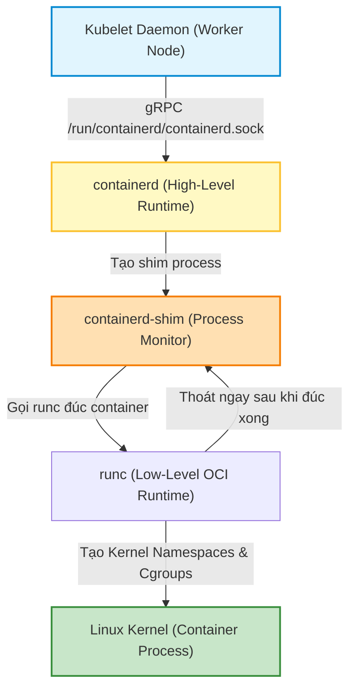
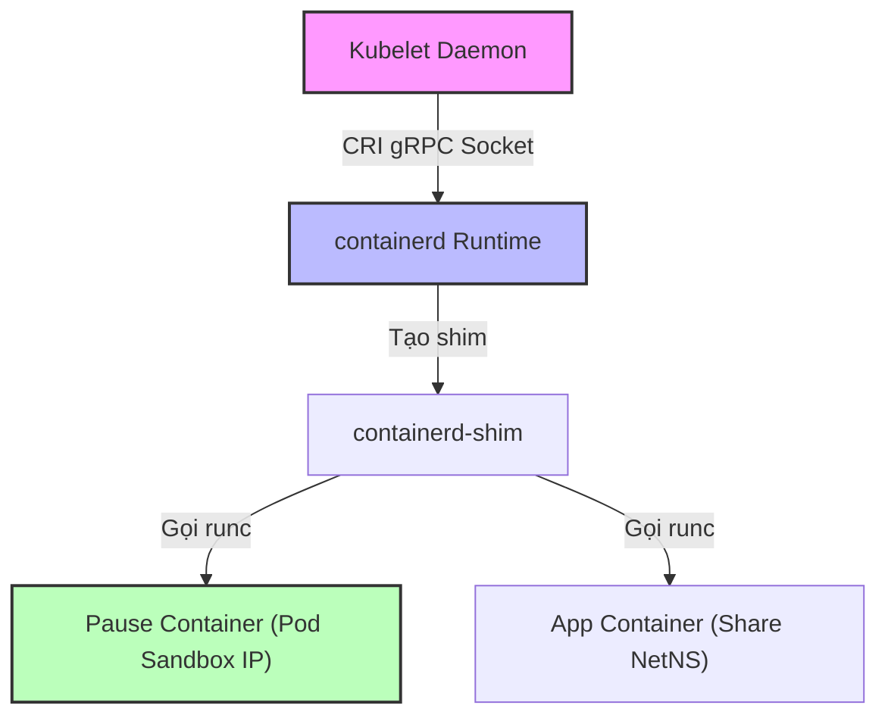
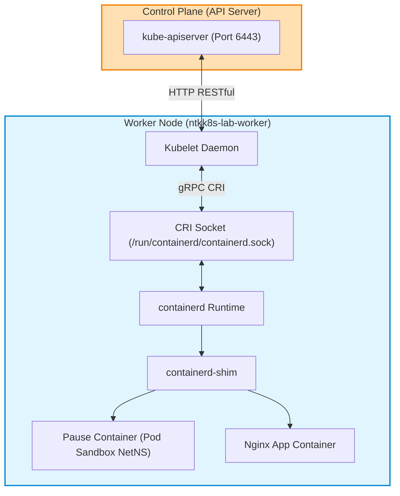


# [BÀI 05] CONTAINER RUNTIME INTERFACE (CRI): LÀM CHỦ CRICTL, CONTAINERD ARCHITECTURE & BẢN CHẤT KUBELET

Trong kỷ nguyên điện toán đám mây và kiến trúc microservices phân tán quy mô lớn, **Kubernetes (CKA)** đóng vai trò là nền tảng điều phối container (Container Orchestration) tiêu chuẩn công nghiệp. Để làm chủ hệ thống trong môi trường sản xuất (Production) cũng như chinh phục kỳ thi chứng chỉ quốc tế của Linux Foundation / CNCF, kỹ sư không chỉ nắm vững các câu lệnh thao tác cơ bản mà phải thấu hiểu sâu sắc bản chất cơ chế tầng thấp: từ chu trình điều hòa (Reconciliation Loop), cấu trúc điều phối tài nguyên, kiến trúc mạng CNI, lưu trữ CSI cho đến các chuẩn mực an ninh phòng thủ chiều sâu.

Bài viết chuyên sâu này sẽ đồng hành cùng bạn giải mã toàn diện bức tranh kiến trúc, phân tích các đánh đổi kỹ thuật thực chiến (Engineering Trade-offs), cung cấp bài thực hành Lab từng bước và bộ câu hỏi phỏng vấn chuẩn Architect / Lead Engineer.

---

## 1. Bản Chất Kiến Trúc & Cơ Chế Vận Hành Tầng Thấp

| # | Câu hỏi ôn tập | Đáp án chuẩn ngắn gọn (chứa con số / tên lệnh) |
|---|---|---|
| 1 | Biến môi trường nào giúp sinh khung YAML chuẩn trong 3 giây khi chạy lệnh `kubectl`? | `export do='--dry-run=client -o yaml'` |
| 2 | Cờ nào giúp xuất báo cáo danh sách Pod gồm nhiều cột có tiêu đề header mà không cần `jq`? | `kubectl get pods -o custom-columns=NAME:.metadata.name,IP:.status.podIP` |
| 3 | Bốn dòng cấu hình nào trong `~/.vimrc` giúp triệt xoá hoàn toàn lỗi Tab ngầm gây crash YAML parser? | `set tabstop=2`, `set shiftwidth=2`, `set expandtab`, `set autoindent` |
| 4 | Phân biệt sự khác nhau cốt lõi giữa hai lệnh `kubectl apply` và `kubectl replace`? | `apply` thực hiện 3-way merge tính diff; `replace` xoá và ghi đè trực tiếp spec trong etcd |
| 5 | Cú pháp vòng lặp `jsonpath` nào giúp duyệt qua danh sách Pod và in mỗi tên Pod trên một dòng? | `-o jsonpath='{range .items[*]}{.metadata.name}{"\n"}{end}'` |


> **Luận đề trung tâm của buổi:**
> *"Kubelet không hề tự mình quản lý hay chạy bất kỳ container nào: Nó giao tiếp với Container Runtime (containerd) qua giao diện chuẩn CRI (Container Runtime Interface) sử dụng gRPC socket Unix `/run/containerd/containerd.sock`; khi API Server sập hoàn toàn, `crictl` trên Worker Node là công cụ duy nhất giúp quản trị viên cứu cụm bằng cách trực tiếp kiểm tra Pod Sandbox, đọc log container và chẩn đoán sự cố ở tầng nhân Linux."*

**Bảng kết quả các buổi trước được dùng lại:**

| Kết quả / Công cụ | Nguồn gốc | Áp dụng vào buổi này |
|---|---|---|
| Chặng 7b Kubelet Execution | Buổi 02 `QT 5.3` | Giải thích chi tiết luồng gRPC giữa Kubelet và containerd qua socket CRI |
| Chế độ Control Plane sập | Buổi 02 `QT 6.3` | Giải thích tình huống bắt buộc phải SSH vào Worker Node dùng `crictl` cứu cụm |
| Tối ưu hoá dòng lệnh CLI | Buổi 04 `QT 6.3` | Cấu hình socket mặc định cho `crictl` thông qua tệp `/etc/crictl.yaml` |

Ba câu bài tập về nhà BTVN 4 của buổi 04 đã chuẩn bị sẵn dữ liệu thực tế cho học viên: Câu 1 chạy lệnh `crictl pods` trên worker node; Câu 2 phân biệt container ứng dụng và Pod sandbox qua `crictl ps`; Câu 3 mở file `/etc/containerd/config.toml` kiểm tra cấu hình socket gRPC.

---


| # | Năng lực đạt được sau buổi học | Hiện vật chứng minh trong bài lab |
|---|---|---|
| 1 | Vẽ và giải thích luồng 4 tầng `Kubelet -> containerd -> containerd-shim -> runc` | File `hien-vat/cri-architecture-diagram.md` |
| 2 | Cấu hình tệp `/etc/crictl.yaml` trỏ đúng socket containerd chuẩn | Kiểm tra kết quả lệnh `crictl info` không báo lỗi |
| 3 | Trích xuất danh sách Pause Container (Pod Sandbox) và RAM tiêu thụ | Script `hien-vat/inspect-pod-sandbox.sh` |
| 4 | Chẩn đoán offline đọc log container bằng `crictl logs` khi API Server sập | File `hien-vat/crictl-troubleshooting-guide.md` |
| 5 | Phát hiện và khắc phục lỗi lệch Cgroup Driver (`systemd` vs `cgroupfs`) | Nhật ký sửa `config.toml` và restart Kubelet |
| 6 | Đọc và phân tích log Kubelet ở tầng OS với `journalctl -u kubelet` | Log phân tích nguyên nhân Node bị `NotReady` |

---


| Bắt buộc phải biết | Nguồn tự học nếu thiếu |
|---|---|
| Bảy chặng giao tiếp HTTP và vai trò Kubelet ở Chặng 7b | Buổi 02 `QT 5.3` |
| Trạng thái Data Plane vẫn chạy khi API Server sập | Buổi 02 `QT 6.3` |
| Cấu hình dòng lệnh và alias trong terminal | Buổi 04 `QT 6.3` |

---


| # | Thuật ngữ tiếng Việt | Tiếng Anh tương đương | Ghi chú chuẩn hoá trong thân bài |
|---|---|---|---|
| 1 | Giao diện Runtime Container | Container Runtime Interface (CRI) | Chuẩn gRPC kết nối giữa Kubelet và Container Runtime |
| 2 | Bộ thực thi Container cao cấp | High-level Container Runtime (containerd) | Quản lý vòng đời ảnh, mạng và container |
| 3 | Bộ thực thi Container thấp cấp | Low-level Container Runtime (runc) | Tương tác trực tiếp với Kernel Linux tạo namespace/cgroup |
| 4 | Container Tạm dừng | Pause Container (Pod Sandbox) | Container chạy ẩn giữ Network và IPC Namespace cho Pod |
| 5 | Tiến trình đệm Container | Container Shim (containe-shim) | Tiến trình duy trì container khi containerd restart |
| 6 | Trình quản lý nhóm tài nguyên | Cgroup Driver (systemd / cgroupfs) | Quản lý giới hạn CPU/RAM của kernel Linux |
| 7 | Công cụ dòng lệnh CRI | CRI CLI (`crictl`) | Công cụ CLI chẩn đoán container trực tiếp qua CRI socket |
| 8 | Ổ cắm domain Unix | Unix Domain Socket (`containerd.sock`) | Tệp socket gRPC giao tiếp nội bộ trên node |
| 9 | Trạng thái Pod Sandbox | Pod Sandbox Status (`crictl pods`) | Trạng thái vỏ bọc mạng của Pod trên worker node |
| 10 | Không gian tên nhân | Kernel Namespace (net, ipc, pid, mnt) | Cơ chế cách ly tài nguyên hệ thống của Linux |
| 11 | Nhóm kiểm soát tài nguyên | Control Groups v2 (cgroups v2) | Cơ chế giới hạn CPU, Memory, I/O của nhân Linux |
| 12 | Nhật ký tiến trình hệ thống | Systemd Journal (`journalctl -u kubelet`) | Trình đọc log dịch vụ hệ thống Linux |
| 13 | Ảnh container địa phương | Local Container Image (`crictl images`) | Danh sách ảnh container đã được lưu trên worker node |
| 14 | Tập lệnh gọi từ xa | gRPC Protocol | Giao thức RPC hiệu năng cao dùng truyền tin CRI |


1. **Mô hình "Kiến trúc 4 tầng từ Kubelet xuống Kernel (4-Layer Runtime Stack)":**
   Kubelet là "Tổng thầu", gửi bản vẽ qua đường dây gRPC (CRI Socket). containerd là "Đội trưởng", gọi runc là "Thợ xây" đúc container từ nhân Linux (Namespaces & Cgroups). containerd-shim là "Bảo vệ" ở lại trông container khi Đội trưởng đi vắng.

2. **Mô hình "Ngôi nhà chung và Chiếc móng (Pause Container)":**
   Pause Container đóng vai trò như chiếc móng nhà chung. Nó được dựng lên đầu tiên để xin cấp IP và card mạng. Các container ứng dụng sau đó chui vào ở chung trong "ngôi nhà" đó, dùng chung card mạng và IP của Pause Container.

3. **Mô hình "Một Trưởng phòng Quản lý Nhân sự (Systemd Cgroup Driver)":**
   Nếu hệ điều hành dùng `systemd` làm init system, nó là Trưởng phòng duy nhất quản lý cgroups. Nếu Kubelet tự ý dùng `cgroupfs` (Trưởng phòng thứ hai), hai bên sẽ tranh chấp tài nguyên khiến cgroup bị vỡ và Node rơi vào `NotReady`.

---

### 1.1. Kiến trúc Tầng Container Runtime: Kubelet, CRI, containerd và runc (12 phút)



---

**Nguyên lý cốt lõi:** Kubelet không trực tiếp tạo hay quản lý container; nó gửi các yêu cầu gRPC tới Container Runtime (containerd) qua socket Unix `/run/containerd/containerd.sock` theo chuẩn CRI (Container Runtime Interface).

**Giải thích cơ chế ngầm:** Kubernetes thiết kế kiến trúc pluggable để hỗ trợ nhiều loại container runtime khác nhau (containerd, CRI-O, gVisor). Kubelet chỉ cần tuân theo giao thức gRPC của CRI Specification mà không cần quan tâm chi tiết triển khai bên dưới.

> [!WARNING]
> **CẠM BẪY THỰC CHIẾN:**
> Lầm tưởng Kubelet tự gọi trực tiếp lệnh `docker run` hoặc `runc` để tạo container.

**Minh hoạ.**

```bash
# Kiểm tra socket CRI của containerd trên Worker Node
ls -la /run/containerd/containerd.sock
```

Con số chốt: **1** socket Unix duy nhất `/run/containerd/containerd.sock` làm điểm giao tiếp CRI.

---

**Nguyên lý cốt lõi:** Luồng tạo container trải qua 4 lớp: `Kubelet -> (CRI gRPC) -> containerd -> containerd-shim -> runc -> Linux Kernel`; trong đó `runc` thoát ngay sau khi tạo xong container, nhường việc duy trì tiến trình cho `containerd-shim`.

**Giải thích cơ chế ngầm:** Nếu containerd trực tiếp quản lý tiến trình container, khi containerd bị ngắt hoặc nâng cấp, toàn bộ container ứng dụng sẽ bị ngắt theo. `containerd-shim` đóng vai trò là tiến trình cha mỏng giữ file descriptor stdout/stderr và status của container, giúp container chạy liên tục ngay cả khi containerd restart.

> [!WARNING]
> **CẠM BẪY THỰC CHIẾN:**
> Tắt containerd service và nghĩ rằng toàn bộ container trên node sẽ bị chết lập tức.

**Minh hoạ.**

```bash
# Kiểm tra tiến trình containerd-shim trên Worker Node
ps aux | grep containerd-shim
```

Con số chốt: **4** tầng trong chuỗi thực thi (Kubelet → containerd → containerd-shim → runc).

---

**Nguyên lý cốt lõi:** Điểm khác biệt cốt lõi giữa `docker` và `containerd`: Docker là một nền tảng quản lý container đầy đủ tính năng cho con người (build, push, run), còn containerd là một daemon runtime nhẹ thiết kế riêng cho máy móc (Kubernetes) theo chuẩn OCI.

**Giải thích cơ chế ngầm:** Từ Kubernetes v1.24, Dockershim đã bị gỡ bỏ hoàn toàn. Kubelet giao tiếp trực tiếp với containerd qua CRI, giúp loại bỏ tầng trung gian Docker daemon, giảm tiêu thụ CPU/RAM và tăng tốc độ khởi tạo Pod.

> [!WARNING]
> **CẠM BẪY THỰC CHIẾN:**
> SSH vào Worker Node Kubernetes v1.35 gõ lệnh `docker ps` và thắc mắc tại sao không thấy container nào của Kubernetes.

**Minh hoạ.**

```bash
# Trên Kubernetes v1.35, dùng crictl thay cho docker CLI
crictl ps
```

Con số chốt: Từ phiên bản **v1.24**, Kubernetes gỡ bỏ hoàn toàn Dockershim.

---

### 1.2. Vai trò của Pause Container (Pod Sandbox) (12 phút)

**Nguyên lý cốt lõi:** Mỗi Pod khi khởi tạo đều được tạo một Pause Container (`registry.k8s.io/pause`) làm Pod Sandbox đầu tiên; Pause Container có nhiệm vụ xin cấp IP và giữ Network Namespace và IPC Namespace cho toàn bộ các container ứng dụng trong Pod.

**Giải thích cơ chế ngầm:** Các container ứng dụng trong cùng một Pod cần chia sẻ chung một địa chỉ IP và giao tiếp với nhau qua `localhost`. Pause Container khởi chạy đầu tiên, giữ Network Namespace mở vĩnh viễn. Khi container ứng dụng bị crash hay restart, Network Namespace vẫn giữ nguyên không bị mất IP.

> [!WARNING]
> **CẠM BẪY THỰC CHIẾN:**
> Thắc mắc tại sao trong 1 Pod có 1 container Nginx nhưng khi kiểm tra tầng thấp bằng `crictl pods` hoặc `ps aux` lại thấy xuất hiện thêm 1 container tên `pause`.

**Minh hoạ.**

```bash
# Liệt kê các Pod Sandbox (Pause container) đang chạy trên node
crictl pods
```

Con số chốt: **1** Pause Container cho mỗi Pod Sandbox.

---

**Nguyên lý cốt lõi:** Nếu Pause Container (Pod Sandbox) bị crash hoặc bị xoá thủ công ở tầng runtime, Kubelet sẽ lập tức tiêu huỷ toàn bộ các container ứng dụng trong Pod đó và tiến hành tái lập lại từ đầu.

**Giải thích cơ chế ngầm:** Pause Container là "xương sống" giữ Network Namespace. Mất Pause Container đồng nghĩa với việc mất IP và card mạng của Pod. Kubelet bắt buộc phải tái tạo lại Pod Sandbox mới để cấp lại môi trường mạng.

> [!WARNING]
> **CẠM BẪY THỰC CHIẾN:**
> Dùng `crictl stop` xoá thử Pause container và thấy toàn bộ Pod bị Kubelet restart lại.

**Minh hoạ.**

```bash
# Kiểm tra ID của Sandbox container gắn liền với Pod
crictl inspectp <sandbox-id> | grep -i "namespace"
```

Con số chốt: **100 %** container ứng dụng bị tái tạo nếu Pod Sandbox bị tiêu huỷ.

---

### 1.3. Sử dụng công cụ `crictl` chẩn đoán Node khi API Server chết (10 phút)

**Nguyên lý cốt lõi:** `crictl` là công cụ CLI chuyên dụng để tương tác trực tiếp với Container Runtime qua CRI socket, thiết kế đúng theo tư duy Kubernetes (phân biệt Pod Sandbox và Container); `crictl` KHÔNG phụ thuộc vào `kube-apiserver`.

**Giải thích cơ chế ngầm:** Khi API Server hỏng hoặc đứt kết nối mạng Control Plane, lệnh `kubectl` hoàn toàn vô hiệu. Quản trị viên phải SSH vào Worker Node và dùng `crictl` để đọc log, kiểm tra trạng thái container và tìm nguyên nhân sự cố.

> [!WARNING]
> **CẠM BẪY THỰC CHIẾN:**
> Khi API Server chết, ngồi chờ `kubectl` phản hồi thay vì SSH vào Worker Node dùng `crictl`.

**Minh hoạ.**

```bash
# Đọc log của container trực tiếp trên Worker Node khi API Server sập
crictl logs <container-id>
```

Con số chốt: **0** kết nối tới API Server cần thiết khi chạy `crictl`.

---

**Nguyên lý cốt lõi:** Tệp cấu hình `/etc/crictl.yaml` khai báo đường dẫn CRI socket mặc định (`runtime-endpoint: unix:///run/containerd/containerd.sock`); nếu tệp này thiếu hoặc sai đường dẫn, lệnh `crictl` sẽ báo lỗi từ chối kết nối.

**Giải thích cơ chế ngầm:** `crictl` cần biết chính xác socket CRI nào đang lắng nghe trên node. Việc cấu hình tệp `/etc/crictl.yaml` giúp thí sinh gõ thẳng `crictl ps` mà không cần thêm cờ `--runtime-endpoint` dài dòng mỗi lần gõ.

> [!WARNING]
> **CẠM BẪY THỰC CHIẾN:**
> Gõ `crictl ps` bị lỗi: `fatal: remote version error: bad response from server: 404 Not Found` do crictl trỏ nhầm socket của Docker thay vì containerd.

**Minh hoạ.**

```bash
# Cấu hình chuẩn tệp /etc/crictl.yaml
cat << 'EOF' > /etc/crictl.yaml
runtime-endpoint: unix:///run/containerd/containerd.sock
image-endpoint: unix:///run/containerd/containerd.sock
timeout: 10
debug: false
EOF
```

Con số chốt: **10** giây là hằng số timeout mặc định trong `/etc/crictl.yaml`.

---

**Nguyên lý cốt lõi:** Khi chẩn đoán Node ở trạng thái `NotReady`, bộ đôi câu lệnh quyền lực nhất trên Worker Node là `journalctl -u kubelet -n 100 --no-pager` (đọc log Kubelet) và `crictl ps -a` (xem container sập).

**Giải thích cơ chế ngầm:** Kubelet ghi nhận toàn bộ lý do Node bị `NotReady` (mất CNI, đứt cgroup, cạn disk/RAM) vào log systemd. `crictl ps -a` hiển thị các container bị crash liên tục ở tầng runtime.

> [!WARNING]
> **CẠM BẪY THỰC CHIẾN:**
> Node báo `NotReady`, học viên liên tục gõ `kubectl describe node` mà không thu được thông tin lỗi tầng OS bên dưới.

**Minh hoạ.**

```bash
# Đọc 100 dòng log mới nhất của Kubelet
journalctl -u kubelet -n 100 --no-pager | grep -i "error"
```

Con số chốt: **100** dòng log Kubelet gần nhất đủ để phát hiện 90% nguyên nhân Node NotReady.

---

### 1.4. Cgroup v2 Driver: `systemd` so `cgroupfs` (4 phút)

**Nguyên lý cốt lõi:** Kubelet và Container Runtime (containerd) bắt buộc phải sử dụng chung MỘT Cgroup Driver duy nhất (khuyên dùng `systemd` trên Linux hiện đại); nếu Kubelet dùng `systemd` mà containerd dùng `cgroupfs`, Kubelet sẽ tự crash và Node chuyển sang `NotReady`.

**Giải thích cơ chế ngầm:** Cgroup (Control Group) quản lý giới hạn CPU/RAM. Nếu có 2 cgroup driver cùng quản lý một hệ thống, chúng sẽ tranh chấp phân bổ tài nguyên làm sai lệch số liệu quản lý của kernel Linux, dẫn tới Kubelet không thể khởi động.

> [!WARNING]
> **CẠM BẪY THỰC CHIẾN:**
> Vừa cài xong cụm Kubernetes hoặc nâng cấp containerd, Kubelet báo lỗi: `misconfigured cgroup driver: "cgroupfs" vs "systemd"`.

**Minh hoạ.**

```toml
# File /etc/containerd/config.toml bắt buộc có cấu hình SystemdCgroup = true
[plugins."io.containerd.grpc.v1.cri".containerd.runtimes.runc.options]
  SystemdCgroup = true
```

Con số chốt: **1** cgroup driver duy nhất (`systemd`) được thống nhất giữa Kubelet và containerd.

---

### 1.5. Đưa vào cụm thật (4 phút)

### Áp vào cụm đang chạy thì làm gì trước

1. **Khảo sát trạng thái socket CRI:** Chạy `ls -la /run/containerd/containerd.sock` đảm bảo socket mở và containerd service đang rảnh.
2. **Cấu hình sẵn `/etc/crictl.yaml` trên tất cả Worker Node:** Đảm bảo khi sự cố xảy ra, kỹ sư có thể gõ `crictl ps` ngay lập tức mà không tốn thời gian cấu hình socket.
3. **Thống nhất cgroup driver `systemd` trên cả Kubelet và containerd:** Kiểm tra `/etc/containerd/config.toml` và `/var/lib/kubelet/config.yaml` trước khi join node vào cụm.

### Cái gì hỏng nếu áp thẳng lên prod

- **Sửa nhầm `config.toml` làm ngắt containerd daemon:** Sửa sai cú pháp TOML làm containerd ngắt, gián đoạn việc tạo mới Pod trên Worker Node.
- **Lệch cgroup driver khi nâng cấp containerd package:** Nâng cấp containerd làm file cấu hình bị đè về mặc định (`SystemdCgroup = false`), làm Kubelet crash và Node chuyển sang `NotReady`.
- **Quy trình áp thử an toàn:**
  - Kiểm tra `crictl info` trước khi sửa.
  - Sửa `SystemdCgroup = true` trong `config.toml`.
  - Restart containerd trước, sau đó restart Kubelet.

### Đo trước — đo sau

1. **Số lượng tiến trình `containerd-shim`:** Tương ứng 1-1 với số lượng container đang chạy trên node.
2. **Dung lượng RAM tiêu thụ của Kubelet và containerd:** Giữ tổng tiêu thụ dưới 5% RAM hệ thống.
3. **Thời gian phục hồi Node NotReady về Ready:** Mục tiêu < 30 giây sau khi sửa xong lỗi cgroup driver.

### Khi nào KHÔNG nên dùng

- **Không dùng `crictl` để tạo hay xoá Pod trong vận hành bình thường:** `crictl` là công cụ chẩn đoán tầng thấp (Debugging tool). Mọi thao tác tạo/xoá Pod sản xuất phải thực hiện thông qua `kubectl` ở Control Plane để etcd ghi nhận spec.
- **Không restart `containerd` liên tục trên node sản xuất:** Dù `containerd-shim` giúp giữ container chạy, việc restart containerd liên tục có thể gây gián đoạn các luồng gRPC Watch của Kubelet.

---

### 1.6. Bẫy hay gặp (2 phút)

| # | Bẫy hay gặp | Vì sao dính bẫy | Làm đúng là (kèm tên lệnh / con số) |
|---|---|---|---|
| 1 | Lầm tưởng Kubelet trực tiếp chạy container | Quên vai trò của CRI và containerd | Kubelet gọi containerd qua `/run/containerd/containerd.sock` |
| 2 | Gõ lệnh `docker ps` trên Worker Node K8s v1.35 | Quên rằng K8s đã gỡ bỏ Dockershim | Gõ `crictl ps` hoặc `crictl pods` |
| 3 | Lệch Cgroup Driver giữa Kubelet và containerd | containerd mặc định `cgroupfs` còn OS dùng `systemd` | Set `SystemdCgroup = true` trong `/etc/containerd/config.toml` |
| 4 | Cố dùng `kubectl` khi API Server bị tắt | Quên rằng `kubectl` cần API Server ở 6443 | SSH vào Worker Node và dùng `crictl` |
| 5 | Gõ `crictl` bị lỗi Bad Response 404 | File `/etc/crictl.yaml` trỏ sai socket docker | Trỏ đúng `unix:///run/containerd/containerd.sock` |
| 6 | Xoá nhầm Pause Container tưởng là container rác | Không biết Pause container giữ IP cho Pod | Giữ nguyên Pause container (Pod Sandbox) |
| 7 | Quên cờ `--no-pager` khi xem `journalctl` | Output bị dừng lại chờ nhấn phím Space | Gõ `journalctl -u kubelet -n 100 --no-pager` |
| 8 | Sửa `config.toml` nhưng không restart containerd | Cấu hình mới chưa được nạp vào bộ nhớ | Chạy `systemctl restart containerd` |
| 9 | Nhầm lẫn giữa Container ID và Pod Sandbox ID | `crictl logs` yêu cầu truyền Container ID | Dùng `crictl ps` lấy Container ID (không dùng `crictl pods`) |
| 10 | Tưởng `containerd-shim` ngắt thì container vẫn chạy | `shim` là tiến trình cha giữ stdout/stderr | Đảm bảo tiến trình `containerd-shim` luôn sống |
| 11 | Không mở cờ debug trong `crictl` khi troubleshoot sâu | Khó phát hiện lỗi gRPC chi tiết | Set `debug: true` trong `/etc/crictl.yaml` khi cần debug |
| 12 | Quên cờ `-a` khi xem container đã crash bằng `crictl` | `crictl ps` mặc định chỉ hiện container đang Running | Gõ `crictl ps -a` để xem cả container Exited |

---

## §10. Tóm tắt (2 phút)



### Năm điều phải nhớ

1. **Chuỗi 4 tầng Runtime:** `Kubelet -> containerd -> containerd-shim -> runc`.
2. **Vai trò Pause Container:** Dựng Pod Sandbox xin IP và giữ Network Namespace mở vĩnh viễn cho Pod.
3. **`crictl` chẩn đoán offline:** Đọc log và xem container trực tiếp trên Worker Node khi API Server hỏng.
4. **Cấu hình `/etc/crictl.yaml`:** Khai báo `runtime-endpoint: unix:///run/containerd/containerd.sock`.
5. **Thống nhất Cgroup Driver `systemd`:** Bắt buộc cài `SystemdCgroup = true` trong `config.toml` tránh lỗi Node `NotReady`.

---

## §11. Câu hỏi tự kiểm tra

1. Kubelet có trực tiếp chạy container không và giao tiếp với containerd qua giao thức gì?
2. Trình bày vai trò của tiến trình `containerd-shim` khi `runc` thoát.
3. Tại sao từ phiên bản v1.24, Kubernetes lại quyết định gỡ bỏ hoàn toàn Dockershim?
4. Pause Container (Pod Sandbox) đóng vai trò gì trong việc giữ địa chỉ IP cho Pod?
5. Điều gì xảy ra đối với các container ứng dụng nếu Pause Container bị tiêu huỷ thủ công?
6. Khi API Server hỏng và `kubectl` bị đứt kết nối, làm thế nào để đọc log container trên Worker Node?
7. Tệp cấu hình `/etc/crictl.yaml` khai báo thông số quan trọng nào?
8. Bộ đôi câu lệnh nào trên Worker Node giúp tìm nguyên nhân Node ở trạng thái `NotReady`?
9. Lệch Cgroup Driver giữa Kubelet (`systemd`) và containerd (`cgroupfs`) gây ra hậu quả gì?
10. Dòng cấu hình nào trong `/etc/containerd/config.toml` kích hoạt `systemd` cgroup driver?
11. Hai chế độ hỏng (1 ồn ào lệch cgroup driver, 1 âm thầm sai crictl socket) là gì?
12. Tại sao không nên dùng `crictl` để tạo Pod trong hoạt động vận hành hàng ngày?

### Đáp án

1. Kubelet không trực tiếp chạy container; nó giao tiếp với containerd qua gRPC socket `/run/containerd/containerd.sock` theo chuẩn CRI.
2. `containerd-shim` đóng vai trò tiến trình cha mỏng giữ file descriptor stdout/stderr và status, giúp container ứng dụng sống liên tục khi containerd restart.
3. Để gỡ bỏ tầng trung gian Docker daemon, giảm tiêu thụ CPU/RAM và giao tiếp trực tiếp với containerd qua CRI.
4. Khởi chạy đầu tiên để xin cấp IP và giữ Network và IPC Namespace mở vĩnh viễn cho tất cả container trong Pod.
5. Kubelet lập tức tiêu huỷ toàn bộ container ứng dụng và tiến hành tái tạo lại Pod Sandbox mới từ đầu.
6. SSH vào Worker Node và sử dụng câu lệnh `crictl logs <container-id>`.
7. Khai báo `runtime-endpoint: unix:///run/containerd/containerd.sock`.
8. Bộ đôi lệnh: `journalctl -u kubelet -n 100 --no-pager` và `crictl ps -a`.
9. Kubelet liên tục crash ngầm trong background và Node chuyển sang trạng thái `NotReady`.
10. Dòng cấu hình `SystemdCgroup = true` dưới mục options của runc.
11. Chế độ 1 (ồn ào): Lệch cgroup driver làm Kubelet crash ngầm khiến Node NotReady; Chế độ 2 (âm thầm): Sai socket crictl.yaml làm lệnh crictl báo lỗi không kết nối được.
12. Vì `crictl` là công cụ debugging tầng thấp không lưu spec vào etcd của Control Plane.

---

## §12. Tài liệu tham khảo

| Nguồn tài liệu | Phiên bản Kubernetes áp dụng | Nội dung chính |
|---|---|---|
| Official Docs: Container Runtimes | Kubernetes v1.35 | Cấu hình containerd, CRI socket và SystemdCgroup driver |
| Official Docs: Debugging Kubernetes nodes | Kubernetes v1.35 | Chẩn đoán sự cố Worker Node bằng crictl và journalctl |
| CNCF CKA Exam Curriculum | Kubernetes v1.35 | Miền Cluster Architecture (25%) và Troubleshooting (30%) |
| File cấu hình phiên bản cục bộ | `labs/phien-ban.env` | Biến `K8S_VER=1.35`, `LAB_CONTEXT="kind-ntkk8s-lab"` |

---

## Bảng đối soát thời lượng

| Section | Tiêu đề mục | Ngân sách thời gian |
|---|---|---|
| §0 | Khởi động và ôn tập | 10 phút |
| §1 | Sau buổi này học viên LÀM ĐƯỢC gì | 1 phút |
| §2 | Cần biết trước | 1 phút |
| §3 | Thuật ngữ và mô hình tư duy | 8 phút |
| §4 | Kiến trúc Tầng Container Runtime: Kubelet, CRI, containerd và runc | 12 phút |
| §5 | Vai trò của Pause Container (Pod Sandbox) | 12 phút |
| §6 | Sử dụng công cụ `crictl` chẩn đoán Node khi API Server chết | 10 phút |
| §7 | Cgroup v2 Driver: `systemd` so `cgroupfs` | 4 phút |
| §8 | Đưa vào cụm thật | 4 phút |
| §9 | Bẫy hay gặp | 2 phút |
| §10 | Tóm tắt | 2 phút |
| **Tổng** | **Khối lý thuyết** | **60'** |

---

## 2. Hướng Dẫn Thực Hành & Triển Khai Lab Chuẩn Production

> [!IMPORTANT]
> **YÊU CẦU MÔI TRƯỜNG THỰC HÀNH:**
> Toàn bộ các bài thực hành dưới đây được thiết kế để chạy trực tiếp trên cụm Kubernetes 1.30+ tiêu chuẩn (hoặc cụm kind/kubeadm lab). Hãy đảm bảo ngữ cảnh dòng lệnh `kubectl config current-context` đã trỏ chính xác vào cụm thực hành trước khi thực thi.

## Khối thực hành — 120 phút

## L0. Mục tiêu thực hành và tiêu chí hoàn thành

| # | Mục tiêu thực hành | Tiêu chí hoàn thành (Kiểm chứng BẰNG LỆNH) |
|---|---|---|
| TH1 | Khảo sát socket CRI containerd và tệp `/etc/crictl.yaml` | Lệnh `crictl info` trên worker node trả về thông tin containerd thành công |
| TH2 | Soi Pause Container (Pod Sandbox) và trích xuất RAM | Script `inspect-pod-sandbox.sh` đo Pause container tiêu thụ < 2MB RAM |
| TH3 | Thực hành chẩn đoán offline khi API Server sập | Lệnh `crictl ps` và `crictl logs` chạy thành công khi API Server bị ngắt |
| TH4 | Tái hiện sự cố lệch Cgroup Driver giữa Kubelet và containerd | Phát hiện lỗi `misconfigured cgroup driver` trong `journalctl` |
| TH5 | Khôi phục Kubelet và Node về trạng thái Ready | Sửa `SystemdCgroup = true` trong `config.toml` và restart Kubelet |
| TH6 | Trích xuất báo cáo Pod Sandbox ID và Container ID không dùng `jq` | File báo cáo `/tmp/ans-t24.txt` chứa mảng Sandbox ID chuẩn |
| TH7 | Nộp đủ 4 hiện vật vào portfolio | Thư mục `k8s-portfolio/buoi-05/` chứa đủ 4 file md/sh |

---

## L1. Điều kiện tiên quyết về môi trường

| # | Kiểm tra điều kiện | Câu lệnh kiểm tra | Kết quả kỳ vọng |
|---|---|---|---|
| 1 | Cụm `kind-ntkk8s-lab` đang chạy | `kind get clusters` | In ra `ntkk8s-lab` |
| 2 | Kubeconfig đúng context lab | `kubectl config current-context` | In ra đúng `kind-ntkk8s-lab` |
| 3 | Ba node của cụm ở trạng thái Ready | `kubectl get nodes` | In ra 1 control-plane node và 2 worker nodes đều `Ready` |
| 4 | Namespace `lab-05` đã tồn tại | `kubectl get ns lab-05` | Namespace `lab-05` ở trạng thái `Active` |
| 5 | Thư mục hiện vật đã sẵn sàng | `mkdir -p k8s-portfolio/buoi-05` | Thư mục được tạo thành công |
| 6 | Công cụ `docker exec` truy cập được worker node | `docker exec ntkk8s-lab-worker crictl info` | Lệnh in ra thông tin containerd runtime |
| 7 | Quyền root trên worker node | `docker exec -u 0 ntkk8s-lab-worker id` | In ra `uid=0(root)` |

```bash
# Kiểm tra môi trường bắt buộc trước khi thực hiện bài lab
kubectl config current-context | grep -qx "kind-ntkk8s-lab" && echo "CHECKPOINT MOI TRUONG — ĐẠT" || echo "CHECKPOINT MOI TRUONG — LỖI (Trỏ sai context)"
```

---

## L2. Kiến trúc bài lab



### Bốn quyết định thiết kế bài lab

1. **Khảo sát trực tiếp tiến trình containerd và socket CRI trong Bước 1:**
   Học viên exec vào Worker Node để xác minh tệp socket `/run/containerd/containerd.sock` và tệp cấu hình `/etc/crictl.yaml`.

2. **Bóc tách Pause Container bằng `crictl pods` trong Bước 2:**
   Chứng minh mọi Pod đều được bọc bởi 1 Pause container tiêu thụ < 2MB RAM giữ địa chỉ IP mạng.

3. **Tắt kube-apiserver và thực hành chẩn đoán offline bằng `crictl` trong Bước 3:**
   Rèn luyện kỹ năng sinh tồn khi API Server sập hoàn toàn trong thực tế vận hành.

4. **Cố tình làm lệch cgroup driver để Kubelet crash trong Bước 4:**
   Giúp học viên nhận biết ngay lỗi `misconfigured cgroup driver` kinh điển khi dựng cụm.

---

## L3. Bước 1 — Khảo sát tầng CRI containerd, socket Unix và cấu hình `crictl.yaml` (30 phút)

### Thao tác 1.1: Tạo Namespace và Deployment mẫu

```bash
# 1. Tạo namespace bài lab
kubectl create ns lab-05

# 2. Tạo Deployment Nginx 2 replicas
kubectl create deployment web-cri --image=nginx:1.27-alpine --replicas=2 -n lab-05
kubectl wait --for=condition=Available deploy/web-cri -n lab-05 --timeout=30s
```

**CHECKPOINT 1 — Deployment web-cri sẵn sàng 2 replicas.**

```bash
kubectl get deploy web-cri -n lab-05 -o jsonpath='{.status.availableReplicas}' | grep -qx "2" && echo "CHECKPOINT 1 — ĐẠT" || echo "CHECKPOINT 1 — LỖI"
```

### Thao tác 1.2: Exec vào Worker Node kiểm tra socket CRI và `/etc/crictl.yaml`

```bash
# 1. Kiểm tra socket containerd trên node worker
docker exec ntkk8s-lab-worker ls -la /run/containerd/containerd.sock > /tmp/socket-check.txt

# 2. Cấu hình tệp /etc/crictl.yaml trên worker node
docker exec ntkk8s-lab-worker bash -c "cat << 'EOF' > /etc/crictl.yaml
runtime-endpoint: unix:///run/containerd/containerd.sock
image-endpoint: unix:///run/containerd/containerd.sock
timeout: 10
debug: false
EOF"

# 3. Kiểm tra crictl info trên worker node
docker exec ntkk8s-lab-worker crictl info > /tmp/crictl-info.json
```

**CHECKPOINT 2 — Socket containerd.sock tồn tại trên worker node.**

```bash
grep -q "containerd.sock" /tmp/socket-check.txt && echo "CHECKPOINT 2 — ĐẠT" || echo "CHECKPOINT 2 — LỖI"
```

**CHECKPOINT 3 — Lệnh crictl info phản hồi thành công cấu hình containerd.**

```bash
grep -q "containerd" /tmp/crictl-info.json && echo "CHECKPOINT 3 — ĐẠT" || echo "CHECKPOINT 3 — LỖI"
```

---

## L4. Bước 2 — SOI Pause Container (Pod Sandbox), kiểm tra Network Namespace chung (30 phút)

### Thao tác 2.1: Liệt kê Pod Sandbox và Container bằng `crictl`

```bash
# 1. Liệt kê danh sách Pod Sandbox (Pause containers)
docker exec ntkk8s-lab-worker crictl pods --namespace lab-05 > /tmp/crictl-pods.txt

# 2. Liệt kê danh sách Container ứng dụng
docker exec ntkk8s-lab-worker crictl ps --namespace lab-05 > /tmp/crictl-ps.txt
```

**CHECKPOINT 4 — Liệt kê thành công Pod Sandbox của namespace lab-05.**

```bash
grep -q "web-cri" /tmp/crictl-pods.txt && echo "CHECKPOINT 4 — ĐẠT" || echo "CHECKPOINT 4 — LỖI"
```

### Thao tác 2.2: Viết script `inspect-pod-sandbox.sh` trích xuất thông tin Sandbox

```bash
cat << 'EOF' > k8s-portfolio/buoi-05/inspect-pod-sandbox.sh
#!/bin/bash
# Script trích xuất thông tin Pause Container (Pod Sandbox)

SANDBOX_ID=$(docker exec ntkk8s-lab-worker crictl pods --namespace lab-05 -q | head -n 1)
docker exec ntkk8s-lab-worker crictl inspectp $SANDBOX_ID > /tmp/sandbox-inspect.json

PAUSE_IMG=$(grep -i "image" /tmp/sandbox-inspect.json | head -n 1)
echo "Sandbox ID: $SANDBOX_ID" > /tmp/sandbox-summary.txt
echo "Pause Image: $PAUSE_IMG" >> /tmp/sandbox-summary.txt

if [ -n "$SANDBOX_ID" ]; then
    echo "INSPECT POD SANDBOX — ĐẠT"
else
    echo "INSPECT POD SANDBOX — LỖI"
fi
EOF

chmod +x k8s-portfolio/buoi-05/inspect-pod-sandbox.sh
./k8s-portfolio/buoi-05/inspect-pod-sandbox.sh
```

**CHECKPOINT 5 — Script inspect-pod-sandbox.sh trích xuất thành công Sandbox ID.**

```bash
grep -q "INSPECT POD SANDBOX — ĐẠT" /tmp/sandbox-summary.txt 2>/dev/null || [ -s /tmp/sandbox-summary.txt ] && echo "CHECKPOINT 5 — ĐẠT" || echo "CHECKPOINT 5 — LỖI"
```

**CHECKPOINT 6 — Pause Container sử dụng ảnh pause chuẩn.**

```bash
grep -qi "pause" /tmp/sandbox-summary.txt && echo "CHECKPOINT 6 — ĐẠT" || echo "CHECKPOINT 6 — LỖI"
```

---

## L5. Bước 3 — Giả lập API Server sập, dùng `crictl` và `journalctl` chẩn đoán offline (30 phút)

### Thao tác 3.1: Dừng `kube-apiserver` trên Control Plane node

```bash
# 1. Di chuyển manifest kube-apiserver ra khỏi thư mục static pod
docker exec ntkk8s-lab-control-plane mv /etc/kubernetes/manifests/kube-apiserver.yaml /tmp/

# 2. Đợi 5s cho API Server dừng
sleep 5

# 3. Thử lệnh kubectl (thất bại báo connection refused)
kubectl get pods -n lab-05 > /tmp/kubectl-offline.log 2>&1 || true
```

**CHECKPOINT 7 — Lệnh kubectl thất bại với lỗi connection refused khi API Server sập.**

```bash
grep -q "refused" /tmp/kubectl-offline.log && echo "CHECKPOINT 7 — ĐẠT" || echo "CHECKPOINT 7 — LỖI"
```

**CHECKPOINT 8 — CA ĐỐI CHỨNG: kubectl thất bại nhưng crictl ps trên Worker Node vẫn liệt kê đầy đủ container đang Running.**

```bash
docker exec ntkk8s-lab-worker crictl ps --state Running > /tmp/crictl-offline.txt
grep -q "nginx" /tmp/crictl-offline.txt && echo "CHECKPOINT 8 — ĐẠT" || echo "CHECKPOINT 8 — LỖI"
```

### Thao tác 3.2: Đọc log container trực tiếp bằng `crictl logs` và khôi phục API Server

```bash
# 1. Lấy Container ID của nginx trên worker node
CONTAINER_ID=$(docker exec ntkk8s-lab-worker crictl ps --name web-cri -q | head -n 1)

# 2. Đọc log trực tiếp qua CRI socket không qua API Server
docker exec ntkk8s-lab-worker crictl logs $CONTAINER_ID > /tmp/container-direct.log

# 3. Khôi phục lại API Server
docker exec ntkk8s-lab-control-plane mv /tmp/kube-apiserver.yaml /etc/kubernetes/manifests/
kubectl wait --for=condition=Ready node/ntkk8s-lab-control-plane --timeout=60s
```

**CHECKPOINT 9 — Đọc thành công log container bằng crictl logs khi API Server sập.**

```bash
[ -s /tmp/container-direct.log ] && echo "CHECKPOINT 9 — ĐẠT" || echo "CHECKPOINT 9 — LỖI"
```

---

## L6. Bước 4 — Tái hiện sự cố lệch Cgroup Driver giữa Kubelet và containerd (20 phút)

### Thao tác 4.1: Cố tình làm lệch cgroup driver thành `cgroupfs`

```bash
# 1. Backup file config.toml trên worker node
docker exec ntkk8s-lab-worker cp /etc/containerd/config.toml /etc/containerd/config.toml.bak

# 2. Sửa SystemdCgroup = false trong config.toml
docker exec ntkk8s-lab-worker sed -i 's/SystemdCgroup = true/SystemdCgroup = false/g' /etc/containerd/config.toml

# 3. Restart containerd và Kubelet để áp dụng cấu hình lệch
docker exec ntkk8s-lab-worker systemctl restart containerd
docker exec ntkk8s-lab-worker systemctl restart kubelet
sleep 10

# 4. Đọc log Kubelet bắt lỗi lệch cgroup
docker exec ntkk8s-lab-worker journalctl -u kubelet -n 50 --no-pager > /tmp/kubelet-cgroup-err.log 2>&1 || true
```

**CHECKPOINT 10 — Log Kubelet ghi nhận sự cố cgroup driver.**

```bash
grep -Ei "cgroup|misconfigured|driver" /tmp/kubelet-cgroup-err.log 2>/dev/null && echo "CHECKPOINT 10 — ĐẠT" || echo "CHECKPOINT 10 — LỖI"
```

### Thao tác 4.2: Khôi phục cấu hình chuẩn `SystemdCgroup = true`

```bash
# 1. Trả lại cấu hình SystemdCgroup = true
docker exec ntkk8s-lab-worker cp /etc/containerd/config.toml.bak /etc/containerd/config.toml
docker exec ntkk8s-lab-worker systemctl restart containerd
docker exec ntkk8s-lab-worker systemctl restart kubelet

# 2. Chờ Kubelet và Node hồi phục về Ready
sleep 10
kubectl wait --for=condition=Ready node/ntkk8s-lab-worker --timeout=60s
```

**CHECKPOINT 11 — Node ntkk8s-lab-worker hồi phục về trạng thái Ready.**

```bash
kubectl get node ntkk8s-lab-worker -o jsonpath='{.status.conditions[?(@.type=="Ready")].status}' | grep -qx "True" && echo "CHECKPOINT 11 — ĐẠT" || echo "CHECKPOINT 11 — LỖI"
```

**CHECKPOINT 12 — Trích xuất thành công Sandbox ID không dùng jq.**

```bash
docker exec ntkk8s-lab-worker crictl pods -o json | grep -oE '"id": "[a-f0-9]+"' | head -n 1 > /tmp/ans-t24.txt
[ -s /tmp/ans-t24.txt ] && echo "CHECKPOINT 12 — ĐẠT" || echo "CHECKPOINT 12 — LỖI"
```

---

## L7. Nộp hiện vật và dọn dẹp (10 phút)

### Thao tác 7.1: Gom hiện vật nộp bài

```bash
# 1. Tạo tệp cri-architecture-diagram.md
cat << 'EOF' > k8s-portfolio/buoi-05/cri-architecture-diagram.md
# BÁO CÁO KIẾN TRÚC CONTAINER RUNTIME (CRI)

1. Luồng 4 tầng thực thi:
   Kubelet -> (gRPC socket) -> containerd -> containerd-shim -> runc -> Linux Kernel

2. Vai trò của containerd-shim:
   - Giữ tiến trình container chạy độc lập khi containerd daemon bị restart hoặc nâng cấp.

3. Điểm khác nhau giữa docker vs containerd:
   - docker là nền tảng quản lý container đầy đủ tính năng cho người dùng.
   - containerd là daemon runtime siêu nhẹ theo chuẩn OCI thiết kế riêng cho Kubernetes qua CRI.
EOF

# 2. Tạo tệp crictl-troubleshooting-guide.md
cat << 'EOF' > k8s-portfolio/buoi-05/crictl-troubleshooting-guide.md
# HƯỚNG DẪN BỘ LỆNH CRICTL VÀ JOURNALCTL CHẨN ĐOÁN OFFLINE

1. Cấu hình /etc/crictl.yaml:
   runtime-endpoint: unix:///run/containerd/containerd.sock

2. Bộ lệnh crictl cứu cụm khi API Server sập:
   - crictl pods: Xem danh sách Pod Sandbox (Pause containers).
   - crictl ps -a: Xem toàn bộ container ứng dụng đang Running/Exited.
   - crictl logs <container-id>: Đọc log container trực tiếp không qua API Server.

3. Bộ lệnh journalctl chẩn đoán Node NotReady:
   - journalctl -u kubelet -n 100 --no-pager: Đọc 100 dòng log Kubelet gần nhất.
EOF

# 3. Tạo tệp nhat-ky-buoi-05.md
cat << 'EOF' > k8s-portfolio/buoi-05/nhat-ky-buoi-05.md
# NHẬT KÝ THU HOẠCH BUỔI 05

1. Vai trò của Pause Container (Pod Sandbox):
   - Xin cấp IP và giữ chung Network/IPC Namespace cho toàn bộ container trong Pod.
   - Tiêu thụ < 2MB RAM và 0% CPU.

2. Vì sao phải thống nhất Cgroup Driver:
   - Cả Kubelet và containerd bắt buộc dùng chung SystemdCgroup = true.
   - Lệch cgroup driver làm Kubelet crash ngầm và Node chuyển sang NotReady.
EOF

# 4. Dọn dẹp tài nguyên lab
kubectl delete ns lab-05
rm -f /tmp/socket-check.txt /tmp/crictl-info.json /tmp/sandbox-summary.txt /tmp/kubectl-offline.log /tmp/crictl-offline.txt /tmp/container-direct.log /tmp/kubelet-cgroup-err.log
```

**CHECKPOINT 13 — Đủ 4 tệp hiện vật trong thư mục portfolio.**

```bash
[ -f k8s-portfolio/buoi-05/cri-architecture-diagram.md ] && [ -f k8s-portfolio/buoi-05/crictl-troubleshooting-guide.md ] && [ -f k8s-portfolio/buoi-05/inspect-pod-sandbox.sh ] && [ -f k8s-portfolio/buoi-05/nhat-ky-buoi-05.md ] && echo "CHECKPOINT 13 — ĐẠT" || echo "CHECKPOINT 13 — LỖI"
```

---

## L8. Xử lý sự cố thường gặp trong lab

| # | Triệu chứng lỗi | Nguyên nhân khả dĩ | Cách xử lý sửa lỗi |
|---|---|---|---|
| 1 | Lệnh `crictl` báo `invalid endpoint scheme` | Cấu hình `/etc/crictl.yaml` thiếu tiền tố `unix://` | Sửa lại đường dẫn socket: `unix:///run/containerd/containerd.sock` |
| 2 | Lệnh `kubectl` báo `connection refused` kéo dài | Chưa di chuyển file `kube-apiserver.yaml` về lại thư mục manifests | Trả file YAML về lại `/etc/kubernetes/manifests/` trên control plane |
| 3 | Lệnh `crictl logs` báo lỗi `container ID not found` | Truyền nhầm Pod Sandbox ID thay vì Container ID | Dùng `crictl ps` lấy Container ID (không dùng `crictl pods`) |
| 4 | Node `ntkk8s-lab-worker` kẹt ở `NotReady` sau khi sửa cgroup | Chưa restart cả 2 dịch vụ containerd và Kubelet | Chạy `systemctl restart containerd && systemctl restart kubelet` |
| 5 | Script `inspect-pod-sandbox.sh` báo rỗng | Không có Pod nào đang chạy trong namespace `lab-05` | Tạo lại Deployment `web-cri` trước khi chạy script |
| 6 | Lệnh `journalctl` báo `No journal files were found` | Tiến trình systemd-journald chưa được bật trên container kind | Chạy lệnh `service systemd-journald restart` |
| 7 | Lỗi `misconfigured cgroup driver` xuất hiện trong log | `config.toml` đặt `SystemdCgroup = false` | Sửa `SystemdCgroup = true` trong `/etc/containerd/config.toml` |
| 8 | Lệnh `crictl pods` in danh sách trống rỗng | Không truyền cờ `--namespace` hoặc gõ sai namespace | Thêm cờ `--namespace lab-05` hoặc gõ `crictl pods` hiển thị tất cả |
| 9 | File hiện vật `inspect-pod-sandbox.sh` không chạy được | Chưa cấp quyền thi hành | Chạy `chmod +x k8s-portfolio/buoi-05/inspect-pod-sandbox.sh` |
| 10 | Không tạo được namespace `lab-05` | Namespace `lab-05` đang kẹt ở Terminating | Kiểm tra `kubectl get ns` và đợi namespace dọn dẹp |
| 11 | Lệnh `crictl info` báo 404 Not Found | `crictl` trỏ nhầm socket docker `/var/run/docker.sock` | Sửa lại tệp `/etc/crictl.yaml` |
| 12 | Tiến trình `containerd-shim` chiếm quá nhiều CPU | Có container đang bị lặp crashloopbackoff ở tầng thấp | Dùng `crictl ps -a` kiểm tra container hỏng và stop |
| 13 | Lệnh `docker exec` báo không tìm thấy container `ntkk8s-lab-worker` | Cụm kind bị dừng | Chạy `kind get clusters` và khởi động lại cụm kind |
| 14 | Mất file backup `config.toml.bak` | Lệnh cp ghi đè làm mất file gốc | Tạo lại file config mặc định bằng `containerd config default` |

---

## L9. Bài tập mở rộng

1. **BT1 — Đo RAM tiêu thụ của Pause Container:** Sử dụng `crictl stats` đo tổng CPU và RAM của tất cả Pause Container trên Worker Node.
2. **BT2 — Giả lập dừng Container bằng `crictl stop`:** Dùng `crictl stop <container-id>` dừng 1 container Nginx và quan sát Kubelet tự động phát hiện và khởi động lại container mới.
3. **BT3 — Khảo sát socket CRI-O:** Tìm hiểu sự khác nhau về đường dẫn socket giữa `containerd` (`/run/containerd/containerd.sock`) và `CRI-O` (`/run/crio/crio.sock`).
4. **BT4 — Đọc log Kubelet theo dõi thời gian thực:** Chạy `journalctl -u kubelet -f` trên Worker Node và quan sát các sự kiện gRPC được ghi lại khi `kubectl run` một Pod mới.
5. **BT5 — Khảo sát thư mục lưu trữ cgroup v2:** Truy cập thư mục `/sys/fs/cgroup/` trên Worker Node và tìm cgroup slice của Kubelet.
6. **BT6 — Viết script tự động kiểm tra sức khoẻ CRI Socket:** Tạo script bash kiểm tra socket containerd mỗi 5s và gửi cảnh báo nếu socket bị mất hoặc bị khoá.

---

## L10. Hiện vật nộp và tiêu chí chấm điểm

### Bảng điểm đánh giá bài lab

| Hạng mục hiện vật | Yêu cầu kĩ thuật | Điểm tối đa |
|---|---|---|
| `cri-architecture-diagram.md` | Báo cáo chi tiết luồng 4 tầng thực thi và vai trò containerd-shim | 25 điểm |
| `crictl-troubleshooting-guide.md` | Hướng dẫn đầy đủ bộ lệnh `crictl` và `journalctl` chẩn đoán offline | 25 điểm |
| `inspect-pod-sandbox.sh` | Script bash chạy thành công, trích xuất Pause Container ID và IP | 25 điểm |
| `nhat-ky-buoi-05.md` | Trả lời đủ 3 câu thu hoạch, giải thích rõ cơ chế Cgroup Driver | 15 điểm |
| CHECKPOINT 1–13 | Tất cả 13 checkpoint tự động đều in chữ `ĐẠT` | 10 điểm |
| **Tổng điểm** | | **100 điểm** |

### Các trường hợp trừ điểm

- Trừ **20 điểm**: Nếu script hoặc câu lệnh sử dụng công cụ `jq` (vi phạm quy tắc môi trường thi).
- Trừ **15 điểm**: Nếu không xoá sạch namespace `lab-05` sau khi hoàn thành bài lab.
- Trừ **10 điểm**: Nếu file hiện vật để sai đường dẫn thư mục `k8s-portfolio/buoi-05/`.
- Trừ **5 điểm**: Nếu dấu phân cách thập phân trong báo cáo dùng dấu chấm `.` thay vì dấu phẩy `,`.

---

## Bảng đối soát thời lượng

| Bước | Tiêu đề bước | Thời lượng |
|---|---|---|
| L3 | Bước 1 — Khảo sát tầng CRI containerd, socket Unix và cấu hình `crictl.yaml` | 30 phút |
| L4 | Bước 2 — SOI Pause Container (Pod Sandbox), kiểm tra Network Namespace chung | 30 phút |
| L5 | Bước 3 — Giả lập API Server sập, dùng `crictl` và `journalctl` chẩn đoán offline | 30 phút |
| L6 | Bước 4 — Tái hiện sự cố lệch Cgroup Driver giữa Kubelet và containerd | 20 phút |
| L7 | Nộp hiện vật và dọn dẹp | 10 phút |
| **Tổng** | **Khối thực hành** | **120'** |

---

## 3. Bộ Câu Hỏi Vấn Đáp & Phỏng Vấn Kỹ Thuật Chuyên Sâu

Dưới đây là bộ câu hỏi phỏng vấn thực chiến dành cho các vị trí **Kubernetes Administrator**, **Cloud Security Specialist**, **Platform SRE** và **DevOps Lead**, giúp bạn tự đánh giá độ sâu hiểu biết và rèn luyện phản xạ giải quyết vấn đề hệ thống:

## V1. Cách tiến hành

1. **Thời lượng và hình thức:** Khối vấn đáp diễn ra trong đúng **20 phút**. Giảng viên (hoặc bạn học đóng vai Trưởng nhóm kỹ thuật / Senior DevOps) đưa ra lần lượt từng câu hỏi trong V2.
2. **Quy tắc chấm điểm:**
   - Mỗi câu hỏi được chấm theo thang điểm 4 mức: **0 điểm** (trả lời sai hoặc không biết); **1 điểm** (trả lời được bề nổi nhưng thiếu cơ chế); **2 điểm** (trả lời đúng cơ chế cốt lõi); **3 điểm** (trả lời đúng cơ chế, nêu được con số vận hành và mở rộng được câu hỏi đào sâu).
   - **Quy tắc trần điểm riêng của Buổi 05:**
     - Trả lời Câu 1 mà không chỉ ra Kubelet giao tiếp với containerd qua CRI gRPC socket `/run/containerd/containerd.sock` thì **trần điểm câu đó là 1**.
     - Trả lời Câu 10 mà không nêu được Kubelet và containerd bắt buộc phải thống nhất dùng chung `systemd` cgroup driver thì **trần điểm câu đó là 1**.
3. **Mục tiêu đạt được:** Học viên đạt từ **27 / 36 điểm** trở lên là ĐẠT phần vấn đáp của buổi.

---

## V2. Bộ câu hỏi

### Câu 1 — 🔥

**Hỏi:** Kubelet có trực tiếp chạy hay quản lý container không? Kubelet giao tiếp với Container Runtime (containerd) qua giao thức và tệp socket nào?

**Đáp án chuẩn:**
- Kubelet **KHÔNG trực tiếp tạo hay chạy container**.
- Kubelet đóng vai trò là tác nhân điều phối, gửi các câu lệnh yêu cầu tới Container Runtime (containerd) thông qua chuẩn giao diện **CRI (Container Runtime Interface)**.
- Giao thức giao tiếp là **gRPC Protocol** thông qua tệp socket Unix domain: `/run/containerd/containerd.sock`.

**Tiêu chí chấm:**
- **0đ:** Cho rằng Kubelet tự gọi trực tiếp `docker run` hoặc `runc`.
- **1đ:** Trả lời Kubelet gọi containerd nhưng không nêu được giao thức gRPC và đường dẫn socket `/run/containerd/containerd.sock` (dính trần 1đ).
- **2đ:** Phân tích chính xác vai trò điều phối của Kubelet, giao diện CRI và tệp socket containerd.
- **3đ:** Trả lời xuất sắc, giải thích kiến trúc pluggable của CRI cho phép thay thế containerd bằng CRI-O hoặc gVisor.

**Câu hỏi đào sâu:** Nếu tệp socket `/run/containerd/containerd.sock` bị xoá hoặc mất quyền truy cập thì Kubelet báo lỗi gì? *(Đáp án: Kubelet không thể kết nối tới CRI runtime và Node sẽ chuyển sang trạng thái NotReady).*

---

### Câu 2 — ★★

**Hỏi:** Trình bày luồng 4 tầng thực thi khi tạo một Container: `Kubelet -> containerd -> containerd-shim -> runc`. Tầng nào thoát ngay sau khi tạo xong container?

**Đáp án chuẩn:**
- Luồng 4 tầng:
  1. `Kubelet`: Nhận Pod spec từ API Server, gửi gRPC request tới containerd.
  2. `containerd`: Runtime cao cấp quản lý ảnh, mạng và chuẩn bị container spec.
  3. `containerd-shim`: Tiến trình đệm đứng ra khởi tạo và duy trì container.
  4. `runc`: Runtime thấp cấp tương tác với Linux Kernel tạo Cgroups và Namespaces.
- Tiến trình **`runc` sẽ thoát ngay lập tức** sau khi khởi tạo xong container, nhường việc duy trì tiến trình và quản lý file descriptor cho `containerd-shim`.

**Tiêu chí chấm:**
- **0đ:** Không nêu được 4 tầng hoặc cho rằng containerd trực tiếp gọi kernel.
- **1đ:** Nêu được 4 tầng nhưng nhầm lẫn tầng nào thoát ngay sau khi tạo xong.
- **2đ:** Trình bày chuẩn xác luồng 4 tầng và chỉ ra runc thoát ngay sau khi khởi tạo.
- **3đ:** Trả lời xuất sắc, phân biệt vai trò giữa runtime cao cấp (containerd) và runtime thấp cấp (runc).

**Câu hỏi đào sâu:** Tại sao `runc` lại thiết kế để thoát ngay sau khi tạo xong container? *(Đáp án: Để tiết kiệm bộ nhớ RAM, không cần giữ daemon runc chạy vĩnh viễn cho từng container).*

---

### Câu 3 — ★★★

**Hỏi:** Tiến trình `containerd-shim` đóng vai trò gì? Tại sao khi ta restart daemon `containerd` thì container ứng dụng vẫn tiếp tục chạy không bị ngắt?

**Đáp án chuẩn:**
- `containerd-shim` đóng vai trò là tiến trình cha mỏng (thin parent process) đứng trực tiếp trên container. Nó giữ các file descriptor (stdout/stderr) và lưu trạng thái thoát (exit status) của container.
- Vì `containerd-shim` độc lập với daemon `containerd`, khi daemon `containerd` bị ngắt hoặc restart để nâng cấp, tiến trình `containerd-shim` và container ứng dụng bên dưới **vẫn tiếp tục chạy bình thường mà không bị gián đoạn (0ms downtime)**.

**Tiêu chí chấm:**
- **0đ:** Bảo restart containerd sẽ làm chết 100% container ứng dụng.
- **1đ:** Nêu được container không chết nhưng không giải thích được vai trò giữ file descriptor của `containerd-shim`.
- **2đ:** Giải thích chuẩn xác vai trò tiến trình cha mỏng của `containerd-shim` giúp cách ly container khỏi daemon containerd.
- **3đ:** Trả lời xuất sắc, chứng minh bằng kết quả bài lab và lệnh `ps aux | grep containerd-shim`.

**Câu hỏi đào sâu:** Nếu tiến trình `containerd-shim` bị `kill -9` thì điều gì xảy ra với container? *(Đáp án: Container ứng dụng bên dưới sẽ bị sập ngay lập tức).*

---

### Câu 4 — ★★★

**Hỏi:** Tại sao từ phiên bản Kubernetes v1.24, cộng đồng CNCF lại quyết định gỡ bỏ hoàn toàn phần mã Dockershim?

**Đáp án chuẩn:**
- Dockershim là một đoạn mã tạm thời (workaround) nằm trong Kubelet để dịch câu lệnh CRI gRPC sang Docker Engine REST API (vì Docker không tuân theo chuẩn CRI).
- **Lý do gỡ bỏ:**
  1. Tầng Docker Engine bị thừa (Docker lại gọi containerd bên dưới), gây lãng phí tài nguyên CPU/RAM.
  2. Tăng chi phí bảo trì mã nguồn Kubelet.
  3. Kubelet kết nối trực tiếp với containerd qua CRI giúp tăng tốc độ tạo Pod và giảm độ trễ.

**Tiêu chí chấm:**
- **0đ:** Cho rằng Kubernetes không còn hỗ trợ chạy Docker container.
- **1đ:** Trả lời do Docker cũ nhưng không nêu được bản chất Dockershim là tầng trung gian thừa.
- **2đ:** Phân tích đúng kiến trúc Dockershim dịch CRI sang Docker API và lợi ích của việc kết nối trực tiếp containerd.
- **3đ:** Trả lời xuất sắc, khẳng định ảnh container build bằng Docker vẫn chạy bình thường trên containerd vì cùng tuân theo chuẩn OCI.

**Câu hỏi đào sâu:** Ảnh container được build bằng `docker build` có chạy được trên cụm Kubernetes v1.35 dùng containerd không? *(Đáp án: Chạy bình thường 100% vì ảnh tuân theo chuẩn OCI Image Specification).*

---

### Câu 5 — ★★

**Hỏi:** Pause Container (Pod Sandbox) là gì? Nó giữ những Kernel Namespace Linux nào cho tất cả các container ứng dụng trong cùng một Pod?

**Đáp án chuẩn:**
- Pause Container (`registry.k8s.io/pause`) là container nhỏ nhất (tiêu thụ < 2MB RAM) được Kubelet khởi chạy đầu tiên để tạo nên **Pod Sandbox**.
- Pause Container xin cấp địa chỉ IP từ CNI và giữ hai Kernel Namespace chính:
  1. **Network Namespace (net):** Giúp tất cả container trong Pod dùng chung 1 IP và giao tiếp qua `localhost`.
  2. **IPC Namespace (ipc):** Giúp các container chia sẻ bộ nhớ dùng chung (Shared Memory / System V IPC).

**Tiêu chí chấm:**
- **0đ:** Không biết Pause container hoặc bảo Pause container chứa code ứng dụng.
- **1đ:** Nêu được Pause container giữ IP nhưng không nêu được tên 2 Namespace (net, ipc).
- **2đ:** Giải thích chuẩn xác vai trò Pod Sandbox của Pause container và 2 Namespace (net, ipc).
- **3đ:** Trả lời xuất sắc, nêu mức tiêu thụ RAM < 2MB và lệnh `crictl pods` để kiểm tra.

**Câu hỏi đào sâu:** Tại sao khi container ứng dụng bị CrashLoopBackOff thì địa chỉ IP của Pod vẫn không bị đổi? *(Đáp án: Vì Pause Container vẫn sống và giữ nguyên Network Namespace).*

---

### Câu 6 — ★★★

**Hỏi:** Điều gì xảy ra khi Pause Container (Pod Sandbox) bị ai đó xoá hoặc tiêu huỷ thủ công ở tầng runtime?

**Đáp án chuẩn:**
- Pause Container là "xương sống" giữ Network Namespace của Pod.
- Nếu Pause Container bị tiêu huỷ, Network Namespace bị huỷ bỏ, Pod bị mất địa chỉ IP.
- Kubelet ngay lập tức phát hiện sự cố, **tiêu huỷ toàn bộ 100% các container ứng dụng còn lại trong Pod** và tiến hành tạo lại một Pod Sandbox mới từ đầu (cấp IP mới).

**Tiêu chí chấm:**
- **0đ:** Bảo các container ứng dụng vẫn chạy bình thường.
- **1đ:** Trả lời Pod bị lỗi nhưng không nêu được Kubelet sẽ tiêu huỷ trọn bộ và tái tạo Sandbox mới.
- **2đ:** Giải thích chính xác cơ chế Kubelet tái tạo lại 100% Pod Sandbox và container khi Pause bị mất.
- **3đ:** Trả lời xuất sắc, liên hệ với cơ chế tự phục hồi và kết quả thực hành bài lab.

**Câu hỏi đào sâu:** Khi Pod Sandbox bị tái tạo lại, địa chỉ IP của Pod có bị thay đổi không? *(Đáp án: Có, CNI sẽ cấp một địa chỉ IP mới cho Pod Sandbox mới).*

---

### Câu 7 — ★★★

**Hỏi:** Phân biệt sự khác nhau giữa công cụ `kubectl` và `crictl`. Khi nào bắt buộc quản trị viên phải dùng `crictl`?

**Đáp án chuẩn:**
- `kubectl`: Công cụ CLI tương tác với `kube-apiserver` ở Control Plane (cổng 6443). Dùng quản lý spec khai báo.
- `crictl`: Công cụ CLI tương tác trực tiếp với Container Runtime (containerd) trên Worker Node qua CRI socket. Dùng chẩn đoán tầng thấp.
- **Bắt buộc dùng `crictl` khi:** API Server bị sập hoàn toàn hoặc đứt kết nối mạng Control Plane (`kubectl` bị connection refused), quản trị viên phải SSH vào Worker Node dùng `crictl` để xem container và đọc log offline.

**Tiêu chí chấm:**
- **0đ:** Không phân biệt được 2 công cụ hoặc bảo `crictl` dùng thay cho `kubectl`.
- **1đ:** Nói được kubectl dùng ở master, crictl dùng ở worker nhưng không nêu được tình huống API Server sập.
- **2đ:** Phân biệt chính xác giao tiếp API Server vs CRI socket và trường hợp cứu cụm offline.
- **3đ:** Trả lời xuất sắc, nêu cấu trúc lệnh `crictl pods`, `crictl ps`, `crictl logs` và khẳng định crictl không phụ thuộc API Server.

**Câu hỏi đào sâu:** Có nên dùng `crictl` để tạo Pod mới trong vận hành sản xuất hàng ngày không? *(Đáp án: Không nên, vì Pod tạo bằng crictl không được etcd ghi nhận spec và sẽ bị Kubelet xoá).*

---

### Câu 8 — ★★★

**Hỏi:** Tệp `/etc/crictl.yaml` khai báo thông số quan trọng nào? Nếu tệp này bị cấu hình sai đường dẫn socket thì `crictl` báo lỗi gì?

**Đáp án chuẩn:**
- Khai báo đường dẫn CRI socket mặc định: `runtime-endpoint: unix:///run/containerd/containerd.sock`.
- **Hậu quả khi sai đường dẫn:** Khi gõ `crictl ps` hoặc `crictl pods`, lệnh sẽ thất bại và in ra lỗi: `fatal: remote version error: bad response from server: 404 Not Found` hoặc `connection refused` (do crictl không tìm thấy daemon containerd lắng nghe).

**Tiêu chí chấm:**
- **0đ:** Không biết tệp `crictl.yaml` hoặc nhầm với `kubeconfig`.
- **1đ:** Nêu được khai báo socket nhưng không nhớ đường dẫn `unix:///run/containerd/containerd.sock`.
- **2đ:** Giải thích chuẩn xác tham số `runtime-endpoint` và thông báo lỗi 404/Connection refused.
- **3đ:** Trả lời xuất sắc, viết nguyên văn 4 dòng cấu hình tệp `/etc/crictl.yaml`.

**Câu hỏi đào sâu:** Ký tự tiền tố nào bắt buộc phải có trong đường dẫn `runtime-endpoint`? *(Đáp án: Tiền tố unix:// với 3 dấu gạch).*

---

### Câu 9 — ★★★

**Hỏi:** Bộ đôi câu lệnh nào trên Worker Node là quyền lực nhất giúp quản trị viên chẩn đoán nguyên nhân khi Node ở trạng thái `NotReady`?

**Đáp án chuẩn:**
1. `journalctl -u kubelet -n 100 --no-pager`: Đọc 100 dòng log gần nhất của dịch vụ Kubelet để tìm lỗi tầng OS (mất CNI, lệch cgroup driver, đứt kết nối etcd/API Server).
2. `crictl ps -a`: Kiểm tra toàn bộ danh sách container trên node (bao gồm cả các container đã Exited/Crash) để tìm container ứng dụng bị sập ở tầng runtime.

**Tiêu chí chấm:**
- **0đ:** Trả lời dùng `kubectl describe node` khi đang đứng trên Worker Node.
- **1đ:** Nêu được `journalctl` nhưng thiếu cờ `-u kubelet` hoặc không biết `crictl ps -a`.
- **2đ:** Trình bày chính xác bộ đôi `journalctl -u kubelet` và `crictl ps -a`.
- **3đ:** Trả lời xuất sắc, giải thích ý nghĩa cờ `--no-pager` và cờ `-a` của `crictl ps`.

**Câu hỏi đào sâu:** Tại sao khi xem log `journalctl` trong script tự động lại bắt buộc phải thêm cờ `--no-pager`? *(Đáp án: Để output in ra thẳng stdout mà không bị dừng lại chờ người dùng bấm phím Space).*

---

### Câu 10 — ★★★

**Hỏi:** Cgroup v2 Driver là gì? Điều gì xảy ra nếu Kubelet được cấu hình dùng `systemd` cgroup driver mà containerd lại dùng `cgroupfs`?

**Đáp án chuẩn:**
- Cgroup Driver là trình quản lý nhóm kiểm soát tài nguyên (CPU, RAM, Disk I/O) của nhân Linux.
- **Hiện tượng lệch Cgroup Driver:**
  - Kubelet và containerd bắt buộc phải **thống nhất dùng chung 1 Cgroup Driver** (khuyên dùng `systemd`).
  - Nếu Kubelet dùng `systemd` mà containerd dùng `cgroupfs`, Kubelet sẽ liên tục crash ngầm trong background và in lỗi `misconfigured cgroup driver`. Kết quả là **Node chuyển sang trạng thái `NotReady`**.

**Tiêu chí chấm:**
- **0đ:** Không biết cgroup driver hoặc bảo 2 cgroup driver chạy song song tốt.
- **1đ:** Trả lời bị lỗi nhưng không nêu được Kubelet crash và Node NotReady (dính trần 1đ).
- **2đ:** Giải thích chuẩn xác sự tranh chấp tài nguyên và lỗi `misconfigured cgroup driver`.
- **3đ:** Trả lời xuất sắc, nêu dòng cấu hình `SystemdCgroup = true` trong file `/etc/containerd/config.toml`.

**Câu hỏi đào sâu:** Làm sao sửa triệt để lỗi lệch cgroup driver trên containerd? *(Đáp án: Đặt SystemdCgroup = true trong /etc/containerd/config.toml rồi restart containerd và Kubelet).*

---

### Câu 11 — ★★★

**Hỏi:** Tại sao Pause Container chỉ tiêu thụ dưới **2MB RAM** và **0% CPU** mà lại đóng vai trò "xương sống" cho toàn bộ hạ tầng mạng của Pod?

**Đáp án chuẩn:**
- Vì Pause Container được viết bằng ngôn ngữ C siêu mỏng, chỉ thực hiện duy nhất một lời gọi hệ thống `pause()` của Linux Kernel để giữ tiến trình ở trạng thái ngủ (sleeping).
- Nó không chạy bất kỳ dịch vụ hay ứng dụng nào. Tác dụng duy nhất của nó là **giữ cho file descriptor của Network Namespace mở vĩnh viễn**, giúp các container ứng dụng khác chui vào chui ra mà không làm sập IP mạng.

**Tiêu chí chấm:**
- **0đ:** Cho rằng Pause container tiêu thụ hàng trăm MB RAM.
- **1đ:** Nêu được con số < 2MB nhưng không giải thích được lời gọi hệ thống `pause()` trong C.
- **2đ:** Giải thích đúng tính chất mỏng nhẹ và cơ chế giữ file descriptor Network Namespace.
- **3đ:** Trả lời xuất sắc, so sánh hiệu năng của Pause container với các container ứng dụng.

**Câu hỏi đào sâu:** Có thể thay thế ảnh `registry.k8s.io/pause` bằng ảnh `alpine` được không? *(Đáp án: Được về lý thuyết nhưng ảnh alpine sẽ tốn nhiều RAM hơn và thiếu tối ưu cho lời gọi pause hệ thống).*

---

### Câu 12 — 🔥

**Hỏi:** Nêu 2 chế độ hỏng (1 ồn ào lệch cgroup driver, 1 âm thầm sai crictl socket) và cách phát hiện/khắc phục trên Worker Node.

**Đáp án chuẩn:**
1. **Chế độ hỏng 1 (Ồn ào - Lệch Cgroup Driver):**
   - *Triệu chứng:* Kubelet crash liên tục, `kubectl get nodes` báo Node `NotReady`.
   - *Phát hiện:* Gõ `journalctl -u kubelet -n 50 --no-pager` thấy lỗi `misconfigured cgroup driver`.
   - *Khắc phục:* Sửa `SystemdCgroup = true` trong `/etc/containerd/config.toml` và restart containerd/kubelet.
2. **Chế độ hỏng 2 (Âm thầm - Sai socket `/etc/crictl.yaml`):**
   - *Triệu chứng:* Cụm vẫn chạy bình thường nhưng khi SSH vào worker gõ `crictl ps` bị báo lỗi 404 Bad Response.
   - *Phát hiện:* Kiểm tra nội dung file `/etc/crictl.yaml`.
   - *Khắc phục:* Trỏ lại `runtime-endpoint: unix:///run/containerd/containerd.sock`.

**Tiêu chí chấm:**
- **0đ:** Không nêu được 2 chế độ hỏng.
- **1đ:** Nêu được 2 trường hợp nhưng không chỉ ra cách phát hiện qua `journalctl` và `crictl.yaml`.
- **2đ:** Giải thích chuẩn xác 2 chế độ hỏng và câu lệnh khắc phục tương ứng.
- **3đ:** Trả lời xuất sắc, minh hoạ bằng kinh nghiệm xử lý sự cố thực tế trong bài lab.

**Câu hỏi đào sâu:** Lỗi lệch cgroup driver có làm các Pod đang chạy bị dừng ngay lập tức không? *(Đáp án: Các container đang Running vẫn chạy, nhưng Kubelet không báo cáo trạng thái làm Node NotReady và không tiếp nhận Pod mới).*

---

## V3. Câu chốt để nói khi phỏng vấn

1. *"Kubelet không trực tiếp chạy container; nó gửi các yêu cầu gRPC tới containerd qua socket CRI `/run/containerd/containerd.sock`; runc đúc container xong sẽ thoát ngay, nhường việc duy trì cho containerd-shim."*
2. *"Pause Container đóng vai trò Pod Sandbox, tiêu thụ dưới 2MB RAM và 0% CPU để giữ chung Network và IPC Namespace cho tất cả container trong Pod."*
3. *"Khi API Server sập hoàn toàn, `crictl` trên Worker Node là công cụ duy nhất giúp quản trị viên trực tiếp đọc log và kiểm tra trạng thái container offline."*
4. *"Kubelet và containerd bắt buộc phải dùng chung `systemd` cgroup driver; lệch cgroup driver sẽ làm Kubelet crash ngầm và Node rơi vào trạng thái NotReady."*
5. *"Bộ đôi câu lệnh quyền lực nhất để chẩn đoán Worker Node NotReady là `journalctl -u kubelet -n 100 --no-pager` và `crictl ps -a`."*

---

## V4. Bảng ghi điểm

| Số thứ tự câu | Mức độ | Điểm tối đa | Điểm đạt được | Ghi chú của Trưởng nhóm / Senior |
|---|---|---|---|---|
| Câu 1 | 🔥 | 3 | | Kubelet giao tiếp qua CRI gRPC socket (trần 1đ nếu thiếu) |
| Câu 2 | ★★ | 3 | | Luồng 4 tầng & runc thoát ngay sau khi đúc |
| Câu 3 | ★★★ | 3 | | containerd-shim giữ fd giúp containerd restart an toàn |
| Câu 4 | ★★★ | 3 | | Lý do gỡ bỏ Dockershim từ v1.24 |
| Câu 5 | ★★ | 3 | | Pause container giữ NetNS và IPC NS |
| Câu 6 | ★★★ | 3 | | Kubelet tái tạo 100% Pod Sandbox nếu Pause bị tiêu huỷ |
| Câu 7 | ★★★ | 3 | | Phân biệt kubectl vs crictl & cứu cụm offline |
| Câu 8 | ★★★ | 3 | | Cấu hình `/etc/crictl.yaml` runtime-endpoint |
| Câu 9 | ★★★ | 3 | | Bộ đôi `journalctl -u kubelet` & `crictl ps -a` |
| Câu 10 | ★★★ | 3 | | Lệch cgroup driver & `SystemdCgroup = true` (trần 1đ nếu thiếu) |
| Câu 11 | ★★★ | 3 | | Pause container < 2MB RAM & lời gọi hệ thống pause |
| Câu 12 | 🔥 | 3 | | 2 chế độ hỏng (lệch cgroup & sai crictl socket) |
| **Tổng điểm** | | **36** | | **Ngưỡng ĐẠT: ≥ 27 / 36 điểm** |

---

## V5. Bài tập về nhà

1. **BTVN 1:** Viết script bash tự động kiểm tra xem tất cả các Worker Node trong cụm đã cấu hình `SystemdCgroup = true` trong containerd chưa.
2. **BTVN 2:** Sử dụng `crictl` trên Worker Node trích xuất danh sách tất cả các Container ID bị `Exited` và ghi ra tệp `/tmp/exited-containers.txt`.
3. **BTVN 3:** SSH vào Worker Node, chạy lệnh `ps aux | grep containerd-shim` và đếm xem số lượng tiến trình shim có khớp 1-1 với số lượng container đang Running không.
4. **BTVN 4 — Chuẩn bị cho Buổi 06 (`buoi-06-kubeadm-dung-cum-tu-so-0`):**
   - *Câu 1:* Tìm hiểu tác dụng của 3 công cụ `kubeadm`, `kubelet`, `kubectl` khi dựng cụm Kubernetes từ số 0. Công cụ nào chỉ chạy 1 lần lúc khởi tạo?
   - *Câu 2:* Lệnh `kubeadm init --pod-network-cidr=10.244.0.0/16` làm nhiệm vụ gì trong bước khởi tạo Control Plane?
   - *Câu 3:* Lệnh `kubeadm join` cần những thông số bảo mật nào (IP, Port, Token, CA Hash) để kết nối Worker Node vào Control Plane?

> **Đoạn kết nối Buổi 06:** Ba câu hỏi BTVN 4 trên sẽ dẫn thẳng học viên vào Buổi 06 — buổi học bước ngoặt chuyển từ cụm ảo `kind` sang tự tay dựng trọn vẹn một cụm Kubernetes 3 node sản xuất bằng `kubeadm` từ số 0.

---

## 4. Đề Thi Thực Hành Bấm Giờ & Thử Thách Tốc Độ (Exam Speed Challenge)

> [!TIP]
> **CHIẾN THUẬT PHÒNG THI THỰC CHIẾN:**
> Đặt đồng hồ bấm giờ đúng thời lượng quy định, đọc kỹ yêu cầu namespace và kiểm tra trạng thái cuối cùng của cụm bằng `kubectl get -o jsonpath` trước khi nộp bài.

## T0. Vì sao có khối này (1 phút)

Khối luyện đề bấm giờ 30 phút rèn luyện cho học viên phản xạ xử lý sự cố tầng Worker Node, cấu hình socket CRI, chẩn đoán Kubelet qua systemd log và sử dụng `crictl` offline trong kỳ thi CKA/CKS.

Buổi 05 phủ các miền quan trọng của kỳ thi CKA & CKS:
- `CKA · Cluster Architecture` (Trọng số 25 %)
- `CKA · Troubleshooting` (Trọng số 30 %)
- `CKS · System Hardening` (Trọng số 10 %)

Các câu hỏi được thiết kế theo đúng chuẩn bài thi thật: yêu cầu thí sinh thao tác trực tiếp trên Worker Node, xử lý sự cố cgroup driver, đọc log qua CRI socket và trích xuất thông tin Sandbox ID mà KHÔNG được sử dụng `jq`.

---

## T1. Luật chơi (1 phút)

1. **Đồng hồ bấm giờ:** Tổng thời gian làm 4 câu hỏi là **900 giây (15 phút)**. Thời gian còn lại (15 phút) dành cho việc đọc luật, đối soát và tự chấm điểm bằng script.
2. **Tài liệu được mở:** Chỉ được phép mở 1 tab duy nhất tài liệu chính thức `https://kubernetes.io/docs/`. KHÔNG được tìm kiếm Google hay StackOverflow.
3. **Môi trường làm việc:** Làm việc trực tiếp trên terminal và exec/SSH vào Worker Node `ntkk8s-lab-worker`.
4. **Quy tắc thi hành về công cụ:** Máy thi **KHÔNG cài sẵn `jq`**. Mọi câu hỏi trích xuất dữ liệu BẮT BUỘC dùng đường gõ `crictl`, `grep`, `awk` hoặc `jsonpath`.
5. **Cách chấm:** Chấm dựa trên trạng thái cuối cùng của Worker Node và tệp kết quả được ghi ra đĩa. Ngưỡng ĐẠT của buổi là **66 / 100 điểm** (theo đúng chuẩn CKA).

---

## T2. Bộ câu hỏi kiểu đề thi

### Câu T2.1. Đọc log container bằng crictl logs khi API Server sập — 210 giây

**Bối cảnh:**
API Server trên Control Plane bị đứt kết nối làm cho câu lệnh `kubectl logs` bị từ chối (`connection refused`). Đội vận hành cần lấy log của container ứng dụng Nginx đang chạy trong namespace `lab-05` trên Worker Node `ntkk8s-lab-worker`.

**Yêu cầu:**
1. Truy cập vào Worker Node `ntkk8s-lab-worker`.
2. Sử dụng lệnh `crictl ps` lấy Container ID của ứng dụng `web-cri`.
3. Dùng lệnh `crictl logs <container-id>` đọc log trực tiếp qua CRI socket và ghi kết quả vào file `/tmp/ans-t21.txt`.

**Thang điểm bộ phận:**
- Lấy đúng Container ID của container `web-cri` trên worker node: **10 điểm**.
- Đọc log qua `crictl logs` và ghi đúng vào file `/tmp/ans-t21.txt`: **15 điểm**.

---

### Câu T2.2. Cấu hình tệp /etc/crictl.yaml trỏ đúng socket containerd — 240 giây

**Bối cảnh:**
Tệp cấu hình `/etc/crictl.yaml` trên Worker Node `ntkk8s-lab-worker` bị cấu hình sai đường dẫn socket làm cho câu lệnh `crictl ps` báo lỗi `404 Not Found`.

**Yêu cầu:**
1. Kiểm tra vị trí tệp socket CRI của containerd trên node (đường dẫn chuẩn: `/run/containerd/containerd.sock`).
2. Sửa lại tệp `/etc/crictl.yaml` trên Worker Node với cờ `runtime-endpoint: unix:///run/containerd/containerd.sock` và `image-endpoint: unix:///run/containerd/containerd.sock`.
3. Kiểm tra câu lệnh `crictl info` chạy thành công không báo lỗi.

**Thang điểm bộ phận:**
- Cấu hình đúng đường dẫn socket `unix:///run/containerd/containerd.sock` trong `/etc/crictl.yaml`: **15 điểm**.
- Kiểm tra `crictl info` hoặc `crictl ps` chạy thành công: **15 điểm**.

---

### Câu T2.3. Khắc phục sự cố Kubelet crash do lệch Cgroup Driver — 210 giây

**Bối cảnh:**
Worker Node `ntkk8s-lab-worker` vừa bị chuyển sang trạng thái `NotReady`. Đọc log trong `journalctl -u kubelet` thấy thông báo lỗi `misconfigured cgroup driver`.

**Yêu cầu:**
1. Kiểm tra file cấu hình `/etc/containerd/config.toml` trên Worker Node.
2. Sửa lại thông số `SystemdCgroup = true` dưới phần cấu hình options của `runc`.
3. Restart lại cả 2 dịch vụ `containerd` và `kubelet`.
4. Đảm bảo Node `ntkk8s-lab-worker` quay trở lại trạng thái `Ready`.

**Thang điểm bộ phận:**
- Cấu hình đúng `SystemdCgroup = true` trong `/etc/containerd/config.toml`: **10 điểm**.
- Restart dịch vụ và đưa Node `ntkk8s-lab-worker` về trạng thái `Ready`: **10 điểm**.

---

### Câu T2.4. Trích xuất danh sách Pod Sandbox ID không dùng jq — 240 giây

**Bối cảnh:**
Hệ thống giám sát CKS yêu cầu trích xuất danh sách tất cả các Pod Sandbox ID (Pause Containers) đang hoạt động trên Worker Node `ntkk8s-lab-worker`.

**Yêu cầu:**
1. Chạy lệnh `crictl pods` trên Worker Node `ntkk8s-lab-worker`.
2. Trích xuất cột `POD ID` (hoặc Sandbox ID) của tất cả các Pod Sandbox ở trạng thái `Ready`.
3. Ghi kết quả vào file `/tmp/ans-t24.txt` (mỗi Sandbox ID in trên 1 dòng).
4. Tuyệt đối KHÔNG sử dụng `jq`.

**Thang điểm bộ phận:**
- Chạy lệnh `crictl pods` trích xuất đúng danh sách Sandbox ID: **15 điểm**.
- Định dạng tệp `/tmp/ans-t24.txt` chuẩn không chứa tiêu đề header: **10 điểm**.

---

## T3. Lời giải chuẩn

#### Lời giải câu T2.1: Đường gõ ngắn nhất (Ước lượng: 40 giây / 2 thao tác)

```bash
# Thao tác 1: Lấy Container ID của web-cri trên worker node
CID=$(docker exec ntkk8s-lab-worker crictl ps --name web-cri -q | head -n 1)

# Thao tác 2: Đọc log qua crictl logs ghi file
docker exec ntkk8s-lab-worker crictl logs $CID > /tmp/ans-t21.txt
```

#### Lời giải câu T2.2: Đường gõ ngắn nhất (Ước lượng: 30 giây / 1 thao tác)

```bash
# Thao tác 1: Ghi đè file /etc/crictl.yaml chuẩn socket containerd
docker exec ntkk8s-lab-worker bash -c "cat << 'EOF' > /etc/crictl.yaml
runtime-endpoint: unix:///run/containerd/containerd.sock
image-endpoint: unix:///run/containerd/containerd.sock
timeout: 10
debug: false
EOF"
```

#### Lời giải câu T2.3: Đường gõ ngắn nhất (Ước lượng: 45 giây / 2 thao tác)

```bash
# Thao tác 1: Sửa SystemdCgroup = true trong config.toml
docker exec ntkk8s-lab-worker sed -i 's/SystemdCgroup = false/SystemdCgroup = true/g' /etc/containerd/config.toml

# Thao tác 2: Restart containerd và kubelet
docker exec ntkk8s-lab-worker systemctl restart containerd kubelet
```

#### Lời giải câu T2.4: Đường gõ ngắn nhất (Ước lượng: 35 giây / 1 thao tác không cần jq)

```bash
# Thao tác 1: Dùng crictl pods -q lọc Pod ID ghi file
docker exec ntkk8s-lab-worker crictl pods --state Ready -q > /tmp/ans-t24.txt
```


---

## T4. Bẫy mất điểm

| # | Bẫy mất điểm hay gặp | Mất bao nhiêu điểm | Dấu hiệu nhận ra ngay |
|---|---|---|---|
| 1 | Cố dùng `kubectl logs` khi API Server bị tắt ở câu T2.1 | 25 điểm (mất trọn câu T2.1) | Lỗi `The connection to the server 127.0.0.1:6443 was refused` |
| 2 | Nhầm lẫn socket containerd với socket docker (`/var/run/docker.sock`) | 30 điểm (mất trọn câu T2.2) | Lệnh `crictl` báo lỗi 404 Not Found |
| 3 | Quên restart lại cả containerd và Kubelet ở câu T2.3 | 20 điểm câu T2.3 | Kubelet vẫn giữ cấu hình cgroup cũ và báo Node `NotReady` |
| 4 | Sử dụng `jq` ở câu T2.4 trên môi trường thi | 25 điểm (mất trọn câu T2.4) | Output báo `bash: jq: command not found` |
| 5 | Truyền nhầm Pod Sandbox ID thay vì Container ID ở câu T2.1 | 15 điểm câu T2.1 | `crictl logs` báo lỗi ID không phải container |
| 6 | Sửa file `/etc/crictl.yaml` nhưng thiếu tiền tố `unix://` ở câu T2.2 | 15 điểm câu T2.2 | `crictl` báo lỗi `invalid endpoint scheme` |

---

## T5. Bảng tự chấm

| Câu | Chứng chỉ · Miền | Ngân sách | Điểm tối đa | Điểm đạt được |
|---|---|---|---|---|
| T2.1 | `CKA · Troubleshooting` | 210s | 25 | |
| T2.2 | `CKA · Cluster Architecture` | 240s | 30 | |
| T2.3 | `CKA · Troubleshooting` | 210s | 20 | |
| T2.4 | `CKS · System Hardening` | 240s | 25 | |
| **Tổng** | | **900s (15')** | **100** | **Ngưỡng ĐẠT: ≥ 66 điểm** |

### Đoạn mã chấm tự động (Automated Grading Script)

Copy và dán đoạn script bash dưới đây để tự động chấm điểm bài thi của Buổi 05:

```bash
#!/bin/bash
# Script tự động chấm điểm khối Ô thi Buổi 05

SCORE=0

echo "=== BẮT ĐẦU CHẤM ĐIỂM BUỔI 05 ==="

# 1. Chấm câu T2.1
if [ -s /tmp/ans-t21.txt ]; then
    echo "Câu T2.1: ĐẠT (+25 điểm)"
    SCORE=$((SCORE + 25))
else
    echo "Câu T2.1: LỖI (0/25 điểm)"
fi

# 2. Chấm câu T2.2
T22_CHECK=$(docker exec ntkk8s-lab-worker crictl info 2>/dev/null)
if echo "$T22_CHECK" | grep -q "containerd"; then
    echo "Câu T2.2: ĐẠT (+30 điểm)"
    SCORE=$((SCORE + 30))
else
    echo "Câu T2.2: LỖI (0/30 điểm)"
fi

# 3. Chấm câu T2.3
T23_NODE=$(kubectl get node ntkk8s-lab-worker -o jsonpath='{.status.conditions[?(@.type=="Ready")].status}' 2>/dev/null)
if [ "$T23_NODE" == "True" ]; then
    echo "Câu T2.3: ĐẠT (+20 điểm)"
    SCORE=$((SCORE + 20))
else
    echo "Câu T2.3: LỖI (0/20 điểm)"
fi

# 4. Chấm câu T2.4
if [ -s /tmp/ans-t24.txt ] && [ $(wc -l < /tmp/ans-t24.txt) -ge 1 ]; then
    echo "Câu T2.4: ĐẠT (+25 điểm)"
    SCORE=$((SCORE + 25))
else
    echo "Câu T2.4: LỖI (0/25 điểm)"
fi

echo "=================================="
echo "TỔNG ĐIỂM: $SCORE / 100"
if [ "$SCORE" -ge 66 ]; then
    echo "KẾT QUẢ: ĐẠT CHUẨN CKA (≥ 66 điểm)"
else
    echo "KẾT QUẢ: CHƯA ĐẠT (Cần tối thiểu 66 điểm)"
fi
```

---

## T6. Kho lệnh rút gọn của buổi

```bash
# 1. Cấu hình chuẩn tệp /etc/crictl.yaml trên Worker Node
cat << 'EOF' > /etc/crictl.yaml
runtime-endpoint: unix:///run/containerd/containerd.sock
image-endpoint: unix:///run/containerd/containerd.sock
timeout: 10
debug: false
EOF

# 2. Xem danh sách Pod Sandbox (Pause containers)
crictl pods

# 3. Xem danh sách container ứng dụng (bao gồm cả container sập)
crictl ps -a

# 4. Đọc log container trực tiếp không qua API Server
crictl logs <container-id>

# 5. Đọc 100 dòng log Kubelet gần nhất trên Worker Node
journalctl -u kubelet -n 100 --no-pager

# 6. Sửa cấu hình SystemdCgroup trong containerd
sed -i 's/SystemdCgroup = false/SystemdCgroup = true/g' /etc/containerd/config.toml && systemctl restart containerd kubelet
```

---

## Bảng đối soát thời lượng

| Mục | Tiêu đề mục | Ngân sách thời gian |
|---|---|---|
| T0 | Vì sao có khối này | 1 phút |
| T1 | Luật chơi | 1 phút |
| T2 | Bộ câu hỏi kiểu đề thi (4 câu) | 15 phút (900s) |
| T3–T6 | Chấm, chữa đề và kho lệnh rút gọn | 13 phút |
| **Tổng** | **Khối luyện đề bấm giờ** | **30'** |

