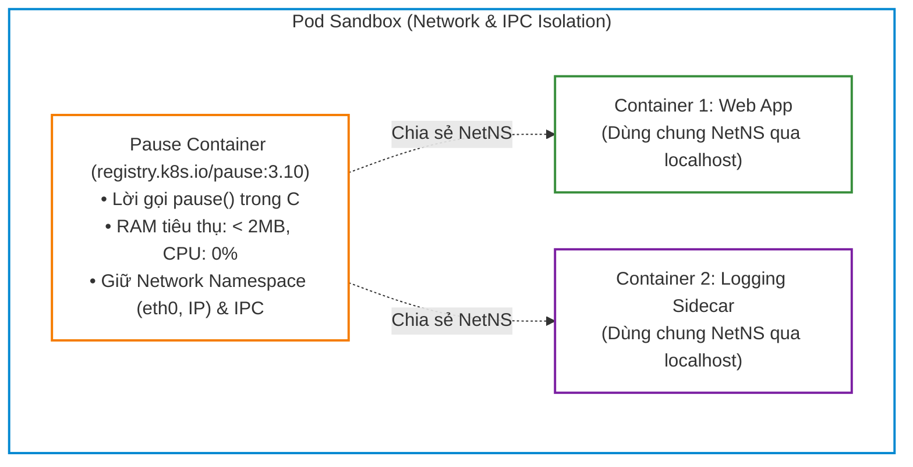
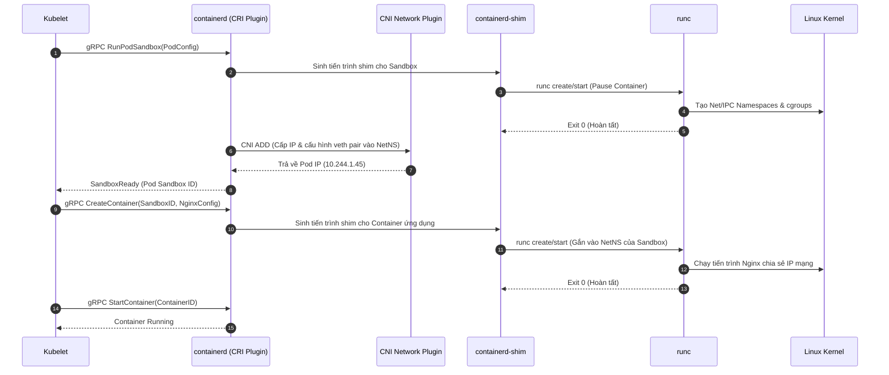
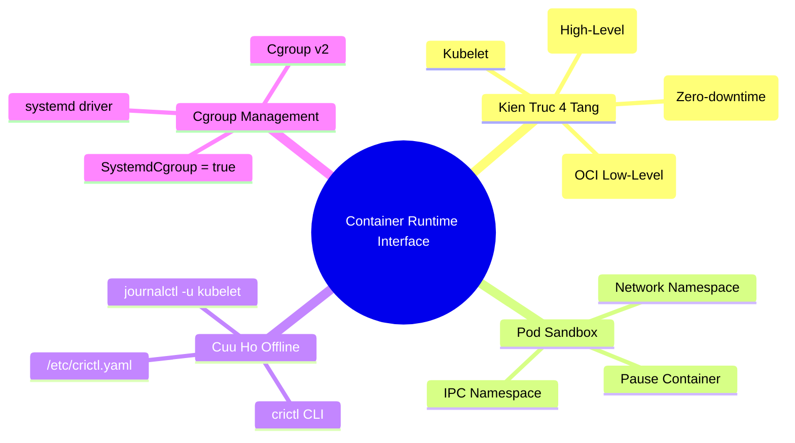


# [BÀI 05] CONTAINER RUNTIME INTERFACE (CRI): LÀM CHỦ CRICTL, KIẾN TRÚC CONTAINERD & BẢN CHẤT TẦNG THẤP KUBELET

Trong mô hình kiến trúc phân tán của **Kubernetes**, Kubelet đóng vai trò là "người thực thi" tối cao tại mỗi Worker Node. Tuy nhiên, một sự thật cốt lõi mà mọi kỹ sư Kubernetes & thí sinh CKA/CKS cần nắm vững: **Kubelet hoàn toàn không tự mình tạo hay quản lý tiến trình container nào**. Thay vào đó, Kubelet giao tiếp với Container Runtime thông qua một chuẩn giao tiếp mở gọi là **Container Runtime Interface (CRI)**.

Khi hệ thống gặp sự cố nghiêm trọng — ví dụ `kube-apiserver` bị sập, mạng Control Plane tê liệt hoặc Node rơi vào trạng thái `NotReady` do lệch Cgroup Driver — các công cụ quen thuộc như `kubectl` sẽ hoàn toàn vô hiệu. Lúc này, kỹ năng SSH trực tiếp vào Worker Node, sử dụng **`crictl`** và **`journalctl`** để chẩn đoán và khắc phục sự cố ở tầng nhân Linux chính là ranh giới giữa một quản trị viên bình thường và một chuyên gia vận hành hạ tầng cấp cao.

---

> [!IMPORTANT]
> **MỤC TIÊU KỸ THUẬT CỐT LÕI (TECHNICAL GOALS):**
> 1. **Bản chất kiến trúc 4 tầng:** Giải mã luồng thực thi `Kubelet -> containerd -> containerd-shim -> runc -> Linux Kernel`.
> 2. **Bóc tách Pod Sandbox & Pause Container:** Hiểu cách Kubernetes duy trì Network/IPC Namespace độc lập với vòng đời container ứng dụng.
> 3. **Làm chủ bộ công cụ `crictl`:** Cấu hình `/etc/crictl.yaml` và sử dụng trơn tru các thao tác cứu cụm offline.
> 4. **Chuẩn hóa Cgroup v2 Driver:** Thống nhất trình điều khiển tài nguyên `systemd` trên toàn cụm tránh lỗi xung đột tiến trình.
> 5. **Thực hành Lab thực chiến 8 bước:** Tái hiện sự cố sập Control Plane, lệch Cgroup Driver và phục hồi hệ thống hoàn toàn bằng dòng lệnh tầng thấp.

---

## 1. Bản Chất Kiến Trúc & Tư Duy Cốt Lõi: Tầng Thực Thi Container Runtime

### 1.1. Lịch Sử Tiến Hóa: Từ Dockershim Đến Chuẩn CRI Mở

Vào những ngày đầu của Kubernetes, Docker là công cụ duy nhất được hỗ trợ. Kubelet phải tích hợp sẵn một module trung gian nội bộ gọi là **Dockershim** để chuyển đổi các chỉ thị tạo Pod thành Docker REST API. Docker daemon sau đó lại gọi `containerd` bên dưới.

Kiến trúc này bộc lộ ba nhược điểm nghiêm trọng:
1. **Lãng phí tài nguyên:** Tầng Docker Engine tiêu tốn thêm CPU/RAM cho các tính năng không cần thiết trong cụm (như Docker CLI, Swarm, Volume plugins riêng).
2. **Chi phí bảo trì mã nguồn lớn:** Mỗi khi Docker cập nhật API, mã nguồn Kubelet phải sửa đổi.
3. **Thiếu linh hoạt:** Không thể dễ dàng thay thế bằng các runtime chuyên biệt khác (như CRI-O hoặc VM-based runtime như Kata Containers).

Từ Kubernetes **v1.24**, Dockershim chính thức bị loại bỏ hoàn toàn. Kubelet hiện nay giao tiếp trực tiếp với Container Runtime (như `containerd`, `CRI-O`) thông qua chuẩn **CRI** dựa trên giao thức **gRPC** qua Unix Domain Socket (`/run/containerd/containerd.sock`).

```mermaid
flowchart TD
    subgraph Old_Arch ["Kiến Trúc Cũ (Trước v1.24 - Dockershim)"]
        K1["Kubelet"] -->|"Internal Calls"| DS["Dockershim (Kubelet code)"]
        DS -->|"Docker REST API"| DD["Docker Daemon (dockerd)"]
        DD -->|"gRPC"| CD1["containerd"]
        CD1 --> R1["runc"]
    end

    subgraph Modern_Arch ["Kiến Trúc Hiện Đại (v1.24+ - Chuẩn CRI)"]
        K2["Kubelet Daemon"] -->|"gRPC CRI Socket (/run/containerd/containerd.sock)"| CD2["containerd (High-Level Runtime)"]
        CD2 -->|"Tạo tiến trình đệm"| SHIM["containerd-shim-runc-v2"]
        SHIM -->|"Gọi OCI CLI"| R2["runc (Low-Level OCI Runtime)"]
        R2 -->|"Cấu hình Namespaces / Cgroups"| KERNEL["Linux Kernel (Container Processes)"]
        R2 -.->|"Thoát ngay lập tức (Exit 0)"| SHIM
    end

    style Old_Arch fill:none,stroke:#d32f2f,stroke-width:2px
    style Modern_Arch fill:none,stroke:#388e3c,stroke-width:2px
    style K2 fill:none,stroke:#0288d1,stroke-width:2px
    style CD2 fill:none,stroke:#fbc02d,stroke-width:2px
    style SHIM fill:none,stroke:#f57c00,stroke-width:2px
    style R2 fill:none,stroke:#7b1fa2,stroke-width:2px
```



---

### 1.2. Chuỗi 4 Tầng Thực Thi (4-Layer Runtime Stack)

Khi một Pod được lập lịch đến Node, chuỗi xử lý diễn ra qua 4 tầng chuyên biệt:

1. **Tầng 1: Kubelet Daemon (Tổng thầu điều phối):**
   - Lắng nghe Pod Spec từ API Server (hoặc Static Pod manifest).
   - Đóng gói yêu cầu thành các lời gọi thủ tục từ xa (gRPC calls) như `RunPodSandbox`, `CreateContainer`, `StartContainer`.
   - Gửi yêu cầu qua Unix Domain Socket tới `/run/containerd/containerd.sock`.

2. **Tầng 2: containerd (High-Level Container Runtime):**
   - Chịu trách nhiệm quản lý toàn bộ vòng đời cấp cao: kéo ảnh (Image Pulling) từ Container Registry, giải nén snapshot filesystem, thiết lập cấu hình OCI spec.
   - Đối với mỗi container cần tạo, `containerd` sinh ra một tiến trình giám sát riêng biệt gọi là `containerd-shim`.

3. **Tầng 3: containerd-shim (Tiến trình đệm độc lập):**
   - Đóng vai trò là tiến trình cha mỏng (thin parent process) của container.
   - Giữ các File Descriptors (stdout, stderr, stdin) mở để thu thập log và cho phép `kubectl attach` / `kubectl exec`.
   - Lưu trữ mã thoát (Exit Code) khi container kết thúc và gửi thông báo về containerd.
   - **Tác dụng sống còn:** Cho phép daemon `containerd` restart hoặc nâng cấp phiên bản mà **không làm chết các container ứng dụng đang chạy** (Zero-downtime runtime upgrade).

4. **Tầng 4: runc (Low-Level OCI Runtime):**
   - Đọc tệp cấu hình `config.json` do containerd chuẩn bị theo chuẩn Open Container Initiative (OCI).
   - Thực hiện các system calls xuống Linux Kernel (`clone`, `unshare`, `setns`, `pivot_root`) để tạo các Kernel Namespaces và gán cgroups.
   - **Đặc tính then chốt:** Ngay sau khi nhân Linux sinh ra tiến trình container và bàn giao quyền kiểm soát cho `containerd-shim`, `runc` sẽ **thoát ngay lập tức (Exit 0)** để tiết kiệm bộ nhớ RAM.

---

### 1.3. Bản Chất Của Pause Container & Pod Sandbox

Trong Kubernetes, đơn vị triển khai nhỏ nhất không phải là một Container đơn lẻ mà là một **Pod**. Một Pod có thể chứa nhiều container cùng chia sẻ tài nguyên mạng (IP, Port) và bộ nhớ dùng chung. Để hiện thực hóa điều này, Kubernetes sử dụng cơ chế **Pod Sandbox** thông qua **Pause Container**.



#### Cơ Chế Hoạt Động Của Pause Container:
1. Khi tạo Pod, Kubelet gọi lệnh CRI `RunPodSandbox`. `containerd` sẽ khởi chạy một container siêu nhẹ có tên `registry.k8s.io/pause`.
2. Pause Container được viết bằng ngôn ngữ C tối giản (chỉ gồm một vòng lặp gọi system call `pause()`), tiêu thụ **dưới 2MB RAM** và **0% CPU**.
3. CNI Plugin sẽ cấu hình card mạng ảo (`veth pair`) và gán địa chỉ IP duy nhất cho Network Namespace của Pause Container này.
4. Khi các container ứng dụng (`nginx`, `sidecar`) được khởi tạo, Kubelet yêu cầu runtime gán chúng vào **cùng Network Namespace và IPC Namespace** của Pause Container.
5. Nhờ đó, các container trong cùng một Pod có thể gọi nhau qua `localhost` và chia sẻ cổng mạng mà không bị xung đột.
6. **Hậu quả khi Pause Container bị tiêu huỷ:** Nếu tiến trình Pause Container bị dừng hoặc xóa thủ công, Network Namespace sẽ bị hủy. Kubelet sẽ lập tức phát hiện mất Sandbox, hủy toàn bộ các container ứng dụng trong Pod và tiến hành tạo lại Pod Sandbox mới từ đầu (được cấp IP mới).

---

### 1.4. Trình Điều Khiển Nhóm Tài Nguyên: `systemd` so với `cgroupfs`

Control Groups (cgroups) là tính năng của Linux Kernel cho phép giới hạn, đo lường và cô lập mức sử dụng tài nguyên (CPU, Memory, Disk I/O) của các nhóm tiến trình.

Trong hệ điều hành Linux hiện đại (Ubuntu 22.04+, RHEL 8+, Debian 11+), **systemd** đóng vai trò là init system và đồng thời là trình quản lý cgroup chính của toàn bộ OS.

| Tiêu chí | `systemd` Cgroup Driver (Khuyên dùng) | `cgroupfs` Cgroup Driver (Legacy) |
|---|---|---|
| **Cơ chế quản lý** | `systemd` là thực thể duy nhất quản lý cây phân cấp cgroup (`/sys/fs/cgroup`). Kubelet và containerd gửi chỉ thị qua D-Bus API. | Kubelet và containerd tự ý ghi đè trực tiếp vào hệ thống tệp ảo `/sys/fs/cgroup`. |
| **Xung đột tài nguyên** | **Không có xung đột**. Toàn bộ dịch vụ OS và container đều nằm trong các `slices` phân cấp rõ ràng. | **Tranh chấp dữ dội** giữa `systemd` và `cgroupfs` khi hệ thống chịu tải cao hoặc cạn RAM. |
| **Tương thích cgroup v2** | Hỗ trợ 100% và là tiêu chuẩn bắt buộc cho Cgroup v2. | Hạn chế, dễ gây rò rỉ bộ nhớ và sai lệch số liệu giám sát. |
| **Hậu quả khi lệch Driver** | Khi Kubelet dùng `systemd` mà containerd dùng `cgroupfs`, Kubelet sẽ **crash liên tục** và Node rơi vào `NotReady`. | Không thể khởi động cụm đồng nhất. |

> [!WARNING]
> **CẠM BẪY LỆCH DRIVER KINH ĐIỂN:**
> Kubelet từ v1.22+ mặc định kích hoạt `systemd` làm cgroup driver. Tuy nhiên, nếu tệp cấu hình `/etc/containerd/config.toml` không được kích hoạt `SystemdCgroup = true`, containerd sẽ chạy với `cgroupfs`. Sự không khớp này sẽ khiến Kubelet ghi nhận lỗi `misconfigured cgroup driver` trong log `journalctl` và từ chối khởi động.

---

## 2. Bảng Ma Trận So Sánh Kỹ Thuật Toàn Diện (Engineering Matrix)

### 2.1. Ma Trận Các Công Cụ Dòng Lệnh: `kubectl` vs `crictl` vs `ctr` vs `docker`

| Công cụ CLI | Tầng giao tiếp | Điểm cuối (Endpoint) kết nối | Phạm vi đối tượng quản lý | Tình huống sử dụng thực tế |
|---|---|---|---|---|
| **`kubectl`** | Control Plane | `kube-apiserver` (HTTPS port 6443) | Toàn bộ cụm (Deployment, Service, Pod spec, CRD) | Quản lý vòng đời ứng dụng khai báo hàng ngày. Vô hiệu hóa khi API Server sập. |
| **`crictl`** | Worker Node CRI | CRI Socket (`unix:///run/containerd/containerd.sock`) | Pod Sandbox, Container, Images ở tầng CRI trên Node | **Cứu cụm offline**, debug container khi API Server hỏng, kiểm tra trạng thái Kubelet. |
| **`ctr`** | containerd Internal | containerd Socket (`unix:///run/containerd/containerd.sock`) | containerd Namespaces (`k8s.io`, `default`, `moby`) | Debug nội bộ containerd, kiểm tra plugin tầng thấp. Không hiểu khái niệm Pod Sandbox. |
| **`docker`** | Docker Engine | Docker Socket (`unix:///var/run/docker.sock`) | Docker Containers, Networks, Swarm | Máy tính cá nhân của lập trình viên. Không dùng trên Worker Node Kubernetes v1.24+. |

---

### 2.2. Ma Trận Các Tùy Chọn Container Runtime

| Tùy chọn Runtime | Loại kiến trúc | Khả năng cách ly an ninh | Độ trễ khởi tạo | Trường hợp sử dụng tối ưu |
|---|---|---|---|---|
| **containerd + runc** | Standard High-Level + OCI | Namespace & Cgroup mức Kernel | **Cực nhanh** (~100ms) | **Tiêu chuẩn công nghiệp mặc định** cho hầu hết các cụm Kubernetes Production. |
| **CRI-O + runc** | Lightweight Kubernetes-only | Namespace & Cgroup mức Kernel | **Rất nhanh** (~90ms) | Cụm Red Hat OpenShift, môi trường thuần Kubernetes không cần daemon phụ trợ. |
| **gVisor (runsc)** | Sandbox User-space Kernel | Đánh chặn System Calls qua Sentry/Gofer | **Trung bình** (~400ms) | Môi trường Multi-tenant chạy code không tin cậy của khách hàng (SaaS). |
| **Kata Containers** | MicroVM-based Runtime | Phần cứng ảo hóa nhẹ (QEMU / Cloud-Hypervisor) | **Chậm hơn** (~1-2s) | Yêu cầu cô lập an ninh tuyệt đối ở mức phần cứng nhân máy ảo. |

---

## 3. Kiến Trúc Môi Trường & Luồng Thực Thi Mẫu

### 3.1. Cấu Hình Chuẩn `/etc/crictl.yaml` và `/etc/containerd/config.toml`

Để các công cụ vận hành đồng bộ và trơn tru, hai tệp cấu hình cốt lõi trên mọi Worker Node phải được thiết lập theo chuẩn:

#### 1. Cấu hình `/etc/crictl.yaml`:
```yaml
runtime-endpoint: "unix:///run/containerd/containerd.sock"
image-endpoint: "unix:///run/containerd/containerd.sock"
timeout: 10
debug: false
pull-image-on-create: false
```

#### 2. Cấu hình phân đoạn Cgroup trong `/etc/containerd/config.toml`:
```toml
version = 2
[plugins."io.containerd.grpc.v1.cri".containerd.runtimes.runc]
  runtime_type = "io.containerd.runc.v2"
  [plugins."io.containerd.grpc.v1.cri".containerd.runtimes.runc.options]
    SystemdCgroup = true
```

---

### 3.2. Sơ Đồ Luồng Khởi Tạo Pod Sandbox & Gắn Kết Mạng Chi Tiết



---

## 4. Phân Tích Cạm Bẫy Thực Chiến: Khắc Phục Sự Cố Lệch Cgroup Driver & Sập API Server

### Tình Huống Sự Cố Thực Tế:
Sau khi thực hiện nâng cấp gói phần mềm hệ điều hành và khởi động lại Worker Node `k8s-worker-02`, cụm Kubernetes ghi nhận Node rơi vào trạng thái `NotReady`. Các Pod mới được lập lịch tới Node đều bị kẹt ở trạng thái `Pending`. Đồng thời, các kỹ sư phát hiện lệnh `kubectl logs` và `kubectl exec` tới các Pod cũ trên Node này đều báo lỗi mất kết nối. Khi kiểm tra sâu hơn, quản trị viên phát hiện tệp cấu hình containerd bị ghi đè về mặc định sau khi package nâng cấp.

---

### Hậu Quả & Log Lỗi Thực Tế:
```text
Sep 12 21:15:32 k8s-worker-02 kubelet[18452]: E0912 21:15:32.410921   18452 server.go:302] "Failed to run kubelet" err="failed to run Kubelet: misconfigured cgroup driver: kubelet cgroup driver: \"systemd\" is different from docker/runtime cgroup driver: \"cgroupfs\""
Sep 12 21:15:32 k8s-worker-02 systemd[1]: kubelet.service: Main process exited, code=exited, status=1/FAILURE
Sep 12 21:15:32 k8s-worker-02 systemd[1]: kubelet.service: Failed with result 'exit-code'.
Sep 12 21:15:42 k8s-worker-02 systemd[1]: kubelet.service: Scheduled restart job, restart counter is at 14.
```

Đồng thời, khi kỹ sư SSH vào Worker Node và cố gắng chạy lệnh `crictl ps`, terminal trả về lỗi:

```bash
$ crictl ps
fatal: remote version error: bad response from server: 404 Not Found
```

---

### 5-Whys Root Cause Analysis:

1. **Tại sao Node `k8s-worker-02` bị `NotReady`?**
   - Vì tiến trình `kubelet` bị dừng liên tục và không gửi được tín hiệu Heartbeat NodeStatus về Control Plane.
2. **Tại sao Kubelet bị crash khi khởi động?**
   - Vì Kubelet phát hiện Cgroup Driver khai báo trong cấu hình nội bộ (`systemd`) không khớp với Cgroup Driver được báo cáo bởi CRI Runtime (`cgroupfs`).
3. **Tại sao containerd lại sử dụng `cgroupfs` thay vì `systemd`?**
   - Vì khi tiến hành cập nhật gói phần mềm qua `apt-get upgrade`, tệp `/etc/containerd/config.toml` bị khôi phục về file mẫu mặc định với tham số `SystemdCgroup = false`.
4. **Tại sao lệnh `crictl ps` lại trả về lỗi 404 Not Found?**
   - Vì tệp `/etc/crictl.yaml` đang trỏ nhầm vào socket legacy của Docker (`/var/run/docker.sock`) thay vì socket chuẩn của containerd (`/run/containerd/containerd.sock`).
5. **Root Cause cốt lõi là gì?**
   - Thiếu quy trình chuẩn hóa cấu hình tự động (IaC/Ansible) để khóa file cấu hình runtime và thiếu tệp cấu hình mặc định `/etc/crictl.yaml` trên Worker Node khi dựng cụm.

---

## 5. Hands-on Lab: Khảo Sát CRI, Bóc Tách Pod Sandbox & Xử Lý Sự Cố Offline Bằng crictl (8 Bước)

| Bước | Tên nhiệm vụ | Tiêu chí kỹ thuật hoàn thành |
|---|---|---|
| **Bước 1** | Chuẩn bị môi trường & Namespace `lab-cri` | Tạo Deployment Nginx 2 replicas sẵn sàng trên cụm. |
| **Bước 2** | Cấu hình tệp `/etc/crictl.yaml` chuẩn trên Worker Node | `crictl info` chạy thành công và in ra thông tin containerd. |
| **Bước 3** | Khảo sát tiến trình `containerd-shim` & OCI Stack | Xác minh sự tồn tại của tiến trình shim và sự biến mất của `runc`. |
| **Bước 4** | Bóc tách Pod Sandbox (Pause Container) bằng `crictl` | Trích xuất ID, Image và chỉ số RAM (< 2MB) của Pause Container. |
| **Bước 5** | Tái hiện kịch bản sập API Server (Control Plane Offline) | `kubectl` bị connection refused nhưng ứng dụng vẫn xử lý request. |
| **Bước 6** | Cứu hộ cụm & Đọc log Container trực tiếp bằng `crictl` | Trích xuất log container trực tiếp qua CRI socket không qua API Server. |
| **Bước 7** | Tái hiện & Khắc phục lỗi lệch Cgroup Driver | Sửa `SystemdCgroup = true` trong `config.toml`, đưa Node về `Ready`. |
| **Bước 8** | Dọn dẹp tài nguyên & Kiểm chứng toàn diện | Hệ thống phục hồi hoàn toàn, không còn tài nguyên rác. |

---

### Bước 1: Chuẩn bị môi trường & Namespace `lab-cri`

Tạo một namespace thử nghiệm và triển khai một ứng dụng web Nginx 2 bản sao để tạo tải container thực tế trên Worker Node:

```bash
# 1. Tạo namespace bài lab
kubectl create namespace lab-cri

# 2. Tạo Deployment Nginx với 2 replicas
kubectl create deployment web-app --image=nginx:1.27-alpine --replicas=2 -n lab-cri

# 3. Chờ cho các Pod sẵn sàng
kubectl wait --for=condition=Available deployment/web-app -n lab-cri --timeout=60s

# 4. Xác định tên Worker Node đang chứa Pod
kubectl get pods -n lab-cri -o wide
```

---

### Bước 2: Cấu hình tệp `/etc/crictl.yaml` chuẩn trên Worker Node

Truy cập trực tiếp vào Worker Node (hoặc exec vào container node nếu dùng cụm kind) và cấu hình điểm cuối CRI socket:

```bash
# Giả sử tên Worker Node là ntkk8s-lab-worker
# Cấu hình tệp /etc/crictl.yaml
cat << 'EOF' | sudo tee /etc/crictl.yaml
runtime-endpoint: unix:///run/containerd/containerd.sock
image-endpoint: unix:///run/containerd/containerd.sock
timeout: 10
debug: false
EOF

# Kiểm tra kết nối CRI socket thành công
sudo crictl info | grep -E "runtimeName|runtimeVersion"
```

---

### Bước 3: Khảo sát tiến trình `containerd-shim` & OCI Stack

Quan sát cây tiến trình trên Worker Node để chứng minh mô hình hoạt động của `containerd-shim`:

```bash
# Liệt kê tất cả các tiến trình containerd-shim đang chạy trên Node
ps aux | grep containerd-shim-runc-v2 | grep -v grep

# Kiểm tra xem có tiến trình runc nào đang chạy nền hay không (Kỳ vọng: Không có)
ps aux | grep runc | grep -v grep || echo "XÁC NHẬN: runc đã thoát ngay sau khi khởi tạo container!"
```

---

### Bước 4: Bóc tách Pod Sandbox (Pause Container) bằng `crictl`

Sử dụng `crictl` để quan sát sự khác biệt giữa Pod Sandbox (Pause Container) và Container ứng dụng thực tế:

```bash
# 1. Liệt kê các Pod Sandbox trong namespace lab-cri
sudo crictl pods --namespace lab-cri

# 2. Liệt kê các Container ứng dụng thực tế
sudo crictl ps --namespace lab-cri

# 3. Lấy Sandbox ID của một Pod bất kỳ
SANDBOX_ID=$(sudo crictl pods --namespace lab-cri -q | head -n 1)

# 4. Kiểm tra thông số chi tiết của Sandbox (Xem cấu hình Network Namespace)
sudo crictl inspectp "$SANDBOX_ID" | grep -i "namespace" -B 2 -A 5
```

---

### Bước 5: Tái hiện kịch bản sập API Server (Control Plane Offline)

Tạm dừng `kube-apiserver` bằng cách di chuyển tệp static pod manifest ra khỏi thư mục quản lý:

```bash
# Thực hiện trên Control Plane Node:
sudo mv /etc/kubernetes/manifests/kube-apiserver.yaml /tmp/kube-apiserver.yaml.bak

# Đợi 5 giây để tiến trình API Server dừng hẳn
sleep 5

# Thử nghiệm câu lệnh kubectl từ máy quản trị (Kỳ vọng: Báo lỗi connection refused)
kubectl get pods -n lab-cri || echo "CHECKPOINT: kubectl hoàn toàn vô hiệu khi API Server sập!"
```

---

### Bước 6: Cứu hộ cụm & Đọc log Container trực tiếp bằng `crictl`

Khi `kubectl logs` không thể hoạt động, quản trị viên sử dụng `crictl` trên Worker Node để lấy log ứng dụng phục vụ điều tra sự cố:

```bash
# 1. Lấy ID của container nginx trên Worker Node
CONTAINER_ID=$(sudo crictl ps --name web-app -q | head -n 1)

# 2. Đọc trực tiếp log qua CRI Socket
sudo crictl logs "$CONTAINER_ID"

# 3. Khôi phục lại kube-apiserver trên Control Plane Node
sudo mv /tmp/kube-apiserver.yaml.bak /etc/kubernetes/manifests/kube-apiserver.yaml
kubectl wait --for=condition=Ready nodes --all --timeout=60s
```

---

### Bước 7: Tái hiện & Khắc phục lỗi lệch Cgroup Driver

Mô phỏng sự cố lệch Cgroup Driver giữa Kubelet và containerd, sau đó khôi phục hệ thống:

```bash
# 1. Sao lưu cấu hình containerd hiện tại
sudo cp /etc/containerd/config.toml /etc/containerd/config.toml.bak

# 2. Cố tình sửa SystemdCgroup thành false (gây xung đột cgroupfs)
sudo sed -i 's/SystemdCgroup = true/SystemdCgroup = false/g' /etc/containerd/config.toml

# 3. Khởi động lại containerd và kubelet
sudo systemctl restart containerd kubelet
sleep 5

# 4. Đọc log Kubelet để bắt lỗi misconfigured cgroup driver
sudo journalctl -u kubelet -n 30 --no-pager | grep -Ei "cgroup|driver"

# 5. KHẮC PHỤC TRIỆT ĐỂ: Khôi phục lại SystemdCgroup = true
sudo cp /etc/containerd/config.toml.bak /etc/containerd/config.toml
sudo systemctl restart containerd kubelet

# 6. Kiểm tra Worker Node đã quay lại trạng thái Ready
kubectl get nodes
```

---

### Bước 8: Dọn dẹp tài nguyên & Kiểm chứng toàn diện

```bash
# Xóa namespace bài lab
kubectl delete namespace lab-cri

# Kiểm tra lại trạng thái các Node trong cụm
kubectl get nodes -o wide
```

---

## 6. 10 Câu Hỏi Tự Kiểm Tra Chuyên Sâu (Self-Check Q&A Accordion)

<details class="qa-card">
<summary class="qa-summary">
  <div class="qa-summary-left">
    <span class="qa-num-badge">Q01</span>
    <span>Trình bày luồng thực thi 4 tầng khi Kubelet nhận lệnh tạo Pod. Tầng nào thoát ngay sau khi hoàn thành nhiệm vụ?</span>
  </div>
  <span class="qa-chevron">
    <svg width="18" height="18" fill="none" stroke="currentColor" stroke-width="2.5" viewBox="0 0 24 24"><polyline points="6 9 12 15 18 9"></polyline></svg>
  </span>
</summary>
<div class="qa-answer">
  <div class="qa-answer-header">
    <svg width="14" height="14" fill="none" stroke="currentColor" stroke-width="2" viewBox="0 0 24 24"><path d="M22 11.08V12a10 10 0 1 1-5.93-9.14"></path><polyline points="22 4 12 14.01 9 11.01"></polyline></svg>
    <span>Phân Tích &amp; Lời Giải Kỹ Thuật</span>
  </div>
  <div style="margin: 0.35rem 0; padding-left: 1rem; border-left: 2px solid var(--accent-primary);">• <b>Luồng 4 tầng:</b> <code>Kubelet</code> (gửi gRPC CRI request) &rarr; <code>containerd</code> (chuẩn bị OCI spec, kéo ảnh) &rarr; <code>containerd-shim</code> (sinh tiến trình giám sát) &rarr; <code>runc</code> (gọi Linux system calls cấu hình namespaces/cgroups).</div>
  <div style="margin: 0.35rem 0; padding-left: 1rem; border-left: 2px solid var(--accent-primary);">• <b>Tiến trình thoát ngay:</b> <code>runc</code> sẽ thoát ngay lập tức (Exit 0) sau khi khởi tạo xong container để tiết kiệm RAM. Quyền quản lý file descriptor và theo dõi tiến trình được bàn giao lại cho <code>containerd-shim</code>.</div>
  <div style="margin-top: 0.75rem;"><b style="color: var(--accent-primary);">Tiêu chí chấm điểm &amp; Phân tầng năng lực:</b></div>
  <div style="margin: 0.25rem 0; padding-left: 1rem; border-left: 2px solid var(--accent-primary);">• <b>0đ:</b> Không nêu được 4 tầng hoặc cho rằng containerd trực tiếp gọi Linux Kernel.</div>
  <div style="margin: 0.25rem 0; padding-left: 1rem; border-left: 2px solid var(--accent-primary);">• <b>1đ:</b> Liệt kê được 4 tầng nhưng không giải thích được vai trò của runc và containerd-shim.</div>
  <div style="margin: 0.25rem 0; padding-left: 1rem; border-left: 2px solid var(--accent-primary);">• <b>2đ:</b> Nêu chính xác luồng 4 tầng và chỉ ra runc thoát ngay sau khi khởi tạo.</div>
  <div style="margin: 0.25rem 0; padding-left: 1rem; border-left: 2px solid var(--accent-primary);">• <b>3đ:</b> Trả lời xuất sắc, phân tích sâu cơ chế bàn giao file descriptor giữa runc và containerd-shim.</div>
  <div style="margin-top: 0.75rem; padding: 0.5rem 0.75rem; background: rgba(var(--accent-primary-rgb, 59, 130, 246), 0.08); border-radius: 4px;"><b style="color: var(--accent-primary);">Câu hỏi mở rộng:</b> Tại sao runc không ở lại làm tiến trình cha vĩnh viễn cho container? <i>(Đáp án: Để tiết kiệm tài nguyên bộ nhớ hệ thống, tránh lãng phí RAM khi chạy hàng trăm container trên một Node).</i></div>
</div>
</details>

<details class="qa-card">
<summary class="qa-summary">
  <div class="qa-summary-left">
    <span class="qa-num-badge">Q02</span>
    <span>Tiến trình <code>containerd-shim</code> đóng vai trò gì? Tại sao restart daemon <code>containerd</code> không làm gián đoạn container đang chạy?</span>
  </div>
  <span class="qa-chevron">
    <svg width="18" height="18" fill="none" stroke="currentColor" stroke-width="2.5" viewBox="0 0 24 24"><polyline points="6 9 12 15 18 9"></polyline></svg>
  </span>
</summary>
<div class="qa-answer">
  <div class="qa-answer-header">
    <svg width="14" height="14" fill="none" stroke="currentColor" stroke-width="2" viewBox="0 0 24 24"><path d="M22 11.08V12a10 10 0 1 1-5.93-9.14"></path><polyline points="22 4 12 14.01 9 11.01"></polyline></svg>
    <span>Phân Tích &amp; Lời Giải Kỹ Thuật</span>
  </div>
  <div style="margin: 0.35rem 0; padding-left: 1rem; border-left: 2px solid var(--accent-primary);">• <code>containerd-shim</code> là tiến trình cha mỏng (thin parent process) đứng trực tiếp trên container ứng dụng, giữ stdout/stderr pipes và lưu trữ exit status.</div>
  <div style="margin: 0.35rem 0; padding-left: 1rem; border-left: 2px solid var(--accent-primary);">• Vì <code>containerd-shim</code> hoạt động độc lập với daemon <code>containerd</code>, khi daemon <code>containerd</code> bị restart hoặc nâng cấp, các tiến trình shim và container ứng dụng <b>vẫn tiếp tục thực thi bình thường mà không bị ngắt kết nối (Zero-downtime)</b>.</div>
  <div style="margin-top: 0.75rem;"><b style="color: var(--accent-primary);">Tiêu chí chấm điểm &amp; Phân tầng năng lực:</b></div>
  <div style="margin: 0.25rem 0; padding-left: 1rem; border-left: 2px solid var(--accent-primary);">• <b>0đ:</b> Cho rằng restart containerd sẽ làm toàn bộ container bị tắt.</div>
  <div style="margin: 0.25rem 0; padding-left: 1rem; border-left: 2px solid var(--accent-primary);">• <b>1đ:</b> Biết container không bị tắt nhưng không giải thích được vai trò của shim.</div>
  <div style="margin: 0.25rem 0; padding-left: 1rem; border-left: 2px solid var(--accent-primary);">• <b>2đ:</b> Giải thích chính xác vai trò giữ pipe stdout/stderr và cô lập vòng đời của containerd-shim.</div>
  <div style="margin: 0.25rem 0; padding-left: 1rem; border-left: 2px solid var(--accent-primary);">• <b>3đ:</b> Trình bày xuất sắc, minh họa bằng lệnh kiểm tra quan hệ tiến trình cha-con trong hệ thống Linux.</div>
  <div style="margin-top: 0.75rem; padding: 0.5rem 0.75rem; background: rgba(var(--accent-primary-rgb, 59, 130, 246), 0.08); border-radius: 4px;"><b style="color: var(--accent-primary);">Câu hỏi mở rộng:</b> Điều gì xảy ra nếu tiến trình <code>containerd-shim</code> bị <code>kill -9</code>? <i>(Đáp án: Container ứng dụng bên dưới sẽ bị sập ngay lập tức vì mất tiến trình cha quản lý).</i></div>
</div>
</details>

<details class="qa-card">
<summary class="qa-summary">
  <div class="qa-summary-left">
    <span class="qa-num-badge">Q03</span>
    <span>Tại sao Kubernetes chính thức loại bỏ Dockershim từ phiên bản v1.24?</span>
  </div>
  <span class="qa-chevron">
    <svg width="18" height="18" fill="none" stroke="currentColor" stroke-width="2.5" viewBox="0 0 24 24"><polyline points="6 9 12 15 18 9"></polyline></svg>
  </span>
</summary>
<div class="qa-answer">
  <div class="qa-answer-header">
    <svg width="14" height="14" fill="none" stroke="currentColor" stroke-width="2" viewBox="0 0 24 24"><path d="M22 11.08V12a10 10 0 1 1-5.93-9.14"></path><polyline points="22 4 12 14.01 9 11.01"></polyline></svg>
    <span>Phân Tích &amp; Lời Giải Kỹ Thuật</span>
  </div>
  <div style="margin: 0.35rem 0; padding-left: 1rem; border-left: 2px solid var(--accent-primary);">• <b>Bản chất Dockershim:</b> Là đoạn mã trung gian nằm trong Kubelet để chuyển đổi gRPC CRI sang REST API của Docker Engine.</div>
  <div style="margin: 0.35rem 0; padding-left: 1rem; border-left: 2px solid var(--accent-primary);">• <b>Lý do loại bỏ:</b> Docker Engine là tầng thừa (Docker lại gọi containerd bên dưới), gây lãng phí CPU/RAM, làm tăng độ trễ khởi tạo Pod và tăng gánh nặng bảo trì mã nguồn cho Kubelet. Giao tiếp trực tiếp qua CRI gRPC giúp hệ thống nhẹ, nhanh và chuẩn hóa hơn.</div>
  <div style="margin-top: 0.75rem;"><b style="color: var(--accent-primary);">Tiêu chí chấm điểm &amp; Phân tầng năng lực:</b></div>
  <div style="margin: 0.25rem 0; padding-left: 1rem; border-left: 2px solid var(--accent-primary);">• <b>0đ:</b> Nghĩ rằng Kubernetes không còn chạy được các container build từ Docker.</div>
  <div style="margin: 0.25rem 0; padding-left: 1rem; border-left: 2px solid var(--accent-primary);">• <b>1đ:</b> Trả lời chung chung là do Docker nặng mà không phân tích cấu trúc trung gian của Dockershim.</div>
  <div style="margin: 0.25rem 0; padding-left: 1rem; border-left: 2px solid var(--accent-primary);">• <b>2đ:</b> Phân tích rõ việc Dockershim là tầng chuyển đổi dư thừa và lợi ích khi Kubelet kết nối trực tiếp containerd.</div>
  <div style="margin: 0.25rem 0; padding-left: 1rem; border-left: 2px solid var(--accent-primary);">• <b>3đ:</b> Trả lời toàn diện, khẳng định container image theo chuẩn OCI vẫn hoạt động hoàn hảo 100% trên containerd.</div>
  <div style="margin-top: 0.75rem; padding: 0.5rem 0.75rem; background: rgba(var(--accent-primary-rgb, 59, 130, 246), 0.08); border-radius: 4px;"><b style="color: var(--accent-primary);">Câu hỏi mở rộng:</b> Ảnh container đóng gói bằng <code>docker build</code> có chạy được trên Kubernetes v1.35 không? <i>(Đáp án: Chạy hoàn toàn bình thường vì cùng tuân thủ chuẩn OCI Image Specification).</i></div>
</div>
</details>

<details class="qa-card">
<summary class="qa-summary">
  <div class="qa-summary-left">
    <span class="qa-num-badge">Q04</span>
    <span>Pause Container (Pod Sandbox) là gì và nó giữ những Kernel Namespaces nào cho Pod?</span>
  </div>
  <span class="qa-chevron">
    <svg width="18" height="18" fill="none" stroke="currentColor" stroke-width="2.5" viewBox="0 0 24 24"><polyline points="6 9 12 15 18 9"></polyline></svg>
  </span>
</summary>
<div class="qa-answer">
  <div class="qa-answer-header">
    <svg width="14" height="14" fill="none" stroke="currentColor" stroke-width="2" viewBox="0 0 24 24"><path d="M22 11.08V12a10 10 0 1 1-5.93-9.14"></path><polyline points="22 4 12 14.01 9 11.01"></polyline></svg>
    <span>Phân Tích &amp; Lời Giải Kỹ Thuật</span>
  </div>
  <div style="margin: 0.35rem 0; padding-left: 1rem; border-left: 2px solid var(--accent-primary);">• <b>Định nghĩa:</b> Pause Container (<code>registry.k8s.io/pause</code>) là container siêu mỏng (&lt; 2MB RAM) được Kubelet khởi chạy đầu tiên để tạo lập <b>Pod Sandbox</b>.</div>
  <div style="margin: 0.35rem 0; padding-left: 1rem; border-left: 2px solid var(--accent-primary);">• <b>Các Kernel Namespaces được giữ:</b></div>
  <div style="margin: 0.35rem 0; padding-left: 1rem; border-left: 2px solid var(--accent-primary);">  1. <b>Network Namespace (net):</b> Giữ địa chỉ IP của Pod và cho phép các container giao tiếp qua <code>localhost</code>.</div>
  <div style="margin: 0.35rem 0; padding-left: 1rem; border-left: 2px solid var(--accent-primary);">  2. <b>IPC Namespace (ipc):</b> Cho phép các container trong Pod chia sẻ bộ nhớ dùng chung (POSIX/SysV Shared Memory).</div>
  <div style="margin-top: 0.75rem;"><b style="color: var(--accent-primary);">Tiêu chí chấm điểm &amp; Phân tầng năng lực:</b></div>
  <div style="margin: 0.25rem 0; padding-left: 1rem; border-left: 2px solid var(--accent-primary);">• <b>0đ:</b> Không biết Pause container hoặc cho rằng Pause container là container chứa mã nguồn ứng dụng.</div>
  <div style="margin: 0.25rem 0; padding-left: 1rem; border-left: 2px solid var(--accent-primary);">• <b>1đ:</b> Nêu được Pause container giữ IP nhưng không kể tên được các Namespace (net, ipc).</div>
  <div style="margin: 0.25rem 0; padding-left: 1rem; border-left: 2px solid var(--accent-primary);">• <b>2đ:</b> Phân tích chuẩn xác vai trò Pod Sandbox và 2 Kernel Namespace chính (Network, IPC).</div>
  <div style="margin: 0.25rem 0; padding-left: 1rem; border-left: 2px solid var(--accent-primary);">• <b>3đ:</b> Trình bày xuất sắc, nêu rõ cơ chế gọi system call <code>pause()</code> trong C và mức tiêu thụ RAM tối ưu.</div>
  <div style="margin-top: 0.75rem; padding: 0.5rem 0.75rem; background: rgba(var(--accent-primary-rgb, 59, 130, 246), 0.08); border-radius: 4px;"><b style="color: var(--accent-primary);">Câu hỏi mở rộng:</b> Tại sao khi container ứng dụng bị CrashLoopBackOff thì Pod IP vẫn không bị thay đổi? <i>(Đáp án: Vì Pause Container vẫn sống và tiếp tục giữ Network Namespace).</i></div>
</div>
</details>

<details class="qa-card">
<summary class="qa-summary">
  <div class="qa-summary-left">
    <span class="qa-num-badge">Q05</span>
    <span>Điều gì xảy ra đối với các container ứng dụng nếu Pause Container (Pod Sandbox) bị xóa thủ công ở tầng runtime?</span>
  </div>
  <span class="qa-chevron">
    <svg width="18" height="18" fill="none" stroke="currentColor" stroke-width="2.5" viewBox="0 0 24 24"><polyline points="6 9 12 15 18 9"></polyline></svg>
  </span>
</summary>
<div class="qa-answer">
  <div class="qa-answer-header">
    <svg width="14" height="14" fill="none" stroke="currentColor" stroke-width="2" viewBox="0 0 24 24"><path d="M22 11.08V12a10 10 0 1 1-5.93-9.14"></path><polyline points="22 4 12 14.01 9 11.01"></polyline></svg>
    <span>Phân Tích &amp; Lời Giải Kỹ Thuật</span>
  </div>
  <div style="margin: 0.35rem 0; padding-left: 1rem; border-left: 2px solid var(--accent-primary);">• Pause Container là "xương sống" giữ Network Namespace của toàn bộ Pod.</div>
  <div style="margin: 0.35rem 0; padding-left: 1rem; border-left: 2px solid var(--accent-primary);">• Khi Pause Container bị dừng hoặc xóa, Network Namespace bị phá hủy, dẫn tới mất địa chỉ IP và card mạng ảo.</div>
  <div style="margin: 0.35rem 0; padding-left: 1rem; border-left: 2px solid var(--accent-primary);">• Kubelet ngay lập tức phát hiện Pod Sandbox không còn hợp lệ, <b>tiêu hủy 100% tất cả các container ứng dụng còn lại trong Pod</b> và tạo lại một Pod Sandbox mới hoàn toàn (được CNI cấp IP mới).</div>
  <div style="margin-top: 0.75rem;"><b style="color: var(--accent-primary);">Tiêu chí chấm điểm &amp; Phân tầng năng lực:</b></div>
  <div style="margin: 0.25rem 0; padding-left: 1rem; border-left: 2px solid var(--accent-primary);">• <b>0đ:</b> Nghĩ rằng container ứng dụng vẫn tiếp tục chạy độc lập không bị ảnh hưởng.</div>
  <div style="margin: 0.25rem 0; padding-left: 1rem; border-left: 2px solid var(--accent-primary);">• <b>1đ:</b> Trả lời Pod bị lỗi nhưng không giải thích được cơ chế Kubelet tiêu hủy toàn bộ và tái tạo Sandbox.</div>
  <div style="margin: 0.25rem 0; padding-left: 1rem; border-left: 2px solid var(--accent-primary);">• <b>2đ:</b> Trình bày chính xác chu trình Kubelet xóa sạch container cũ và khởi tạo Sandbox mới kèm cấp IP mới.</div>
  <div style="margin: 0.25rem 0; padding-left: 1rem; border-left: 2px solid var(--accent-primary);">• <b>3đ:</b> Trả lời xuất sắc, liên hệ chặt chẽ với cơ chế Reconciliation Loop của Kubelet.</div>
  <div style="margin-top: 0.75rem; padding: 0.5rem 0.75rem; background: rgba(var(--accent-primary-rgb, 59, 130, 246), 0.08); border-radius: 4px;"><b style="color: var(--accent-primary);">Câu hỏi mở rộng:</b> Khi Pod Sandbox được tái tạo, dữ liệu trong <code>emptyDir</code> volume của Pod có bị mất không? <i>(Đáp án: Có, vì toàn bộ vòng đời Pod trên Node đã bị tái lập lại).</i></div>
</div>
</details>

<details class="qa-card">
<summary class="qa-summary">
  <div class="qa-summary-left">
    <span class="qa-num-badge">Q06</span>
    <span>Phân biệt vai trò giữa <code>kubectl</code> và <code>crictl</code>. Trong trường hợp nào kỹ sư bắt buộc phải dùng <code>crictl</code>?</span>
  </div>
  <span class="qa-chevron">
    <svg width="18" height="18" fill="none" stroke="currentColor" stroke-width="2.5" viewBox="0 0 24 24"><polyline points="6 9 12 15 18 9"></polyline></svg>
  </span>
</summary>
<div class="qa-answer">
  <div class="qa-answer-header">
    <svg width="14" height="14" fill="none" stroke="currentColor" stroke-width="2" viewBox="0 0 24 24"><path d="M22 11.08V12a10 10 0 1 1-5.93-9.14"></path><polyline points="22 4 12 14.01 9 11.01"></polyline></svg>
    <span>Phân Tích &amp; Lời Giải Kỹ Thuật</span>
  </div>
  <div style="margin: 0.35rem 0; padding-left: 1rem; border-left: 2px solid var(--accent-primary);">• <code>kubectl</code>: Tương tác với <code>kube-apiserver</code> qua HTTPS REST API để quản lý trạng thái khai báo (Declarative State) trên etcd.</div>
  <div style="margin: 0.35rem 0; padding-left: 1rem; border-left: 2px solid var(--accent-primary);">• <code>crictl</code>: Tương tác trực tiếp với Container Runtime trên Worker Node qua gRPC Unix Socket để chẩn đoán trạng thái thực tế tầng thấp.</div>
  <div style="margin: 0.35rem 0; padding-left: 1rem; border-left: 2px solid var(--accent-primary);">• <b>Bắt buộc dùng <code>crictl</code> khi:</b> Control Plane sập, API Server không phản hồi (<code>kubectl connection refused</code>), hoặc khi Node bị <code>NotReady</code> cần điều tra log và trạng thái container offline trực tiếp trên Node.</div>
  <div style="margin-top: 0.75rem;"><b style="color: var(--accent-primary);">Tiêu chí chấm điểm &amp; Phân tầng năng lực:</b></div>
  <div style="margin: 0.25rem 0; padding-left: 1rem; border-left: 2px solid var(--accent-primary);">• <b>0đ:</b> Không phân biệt được 2 công cụ hoặc cho rằng crictl thay thế hoàn toàn kubectl.</div>
  <div style="margin: 0.25rem 0; padding-left: 1rem; border-left: 2px solid var(--accent-primary);">• <b>1đ:</b> Phân biệt được nhưng không chỉ ra được kịch bản cứu cụm offline khi API Server sập.</div>
  <div style="margin: 0.25rem 0; padding-left: 1rem; border-left: 2px solid var(--accent-primary);">• <b>2đ:</b> Phân tích chuẩn xác kiến trúc giao tiếp (API Server vs CRI Socket) và kịch bản sử dụng crictl.</div>
  <div style="margin: 0.25rem 0; padding-left: 1rem; border-left: 2px solid var(--accent-primary);">• <b>3đ:</b> Trả lời xuất sắc, nêu rõ các cú pháp <code>crictl pods</code>, <code>crictl ps</code>, <code>crictl logs</code> và lưu ý crictl không ghi trạng thái vào etcd.</div>
  <div style="margin-top: 0.75rem; padding: 0.5rem 0.75rem; background: rgba(var(--accent-primary-rgb, 59, 130, 246), 0.08); border-radius: 4px;"><b style="color: var(--accent-primary);">Câu hỏi mở rộng:</b> Có nên dùng <code>crictl run</code> để tạo container sản xuất không? <i>(Đáp án: Tuyệt đối không, vì Kubelet không nhận biết được spec này và sẽ coi đó là container lạ để xóa bỏ).</i></div>
</div>
</details>

<details class="qa-card">
<summary class="qa-summary">
  <div class="qa-summary-left">
    <span class="qa-num-badge">Q07</span>
    <span>Tệp cấu hình <code>/etc/crictl.yaml</code> chứa những thông số quan trọng nào và xử lý ra sao khi bị lỗi kết nối 404?</span>
  </div>
  <span class="qa-chevron">
    <svg width="18" height="18" fill="none" stroke="currentColor" stroke-width="2.5" viewBox="0 0 24 24"><polyline points="6 9 12 15 18 9"></polyline></svg>
  </span>
</summary>
<div class="qa-answer">
  <div class="qa-answer-header">
    <svg width="14" height="14" fill="none" stroke="currentColor" stroke-width="2" viewBox="0 0 24 24"><path d="M22 11.08V12a10 10 0 1 1-5.93-9.14"></path><polyline points="22 4 12 14.01 9 11.01"></polyline></svg>
    <span>Phân Tích &amp; Lời Giải Kỹ Thuật</span>
  </div>
  <div style="margin: 0.35rem 0; padding-left: 1rem; border-left: 2px solid var(--accent-primary);">• <b>Thông số quan trọng:</b> <code>runtime-endpoint</code> và <code>image-endpoint</code> (đường dẫn chuẩn: <code>unix:///run/containerd/containerd.sock</code>), cùng với <code>timeout: 10</code>.</div>
  <div style="margin: 0.35rem 0; padding-left: 1rem; border-left: 2px solid var(--accent-primary);">• <b>Xử lý lỗi 404:</b> Lỗi xảy ra do crictl trỏ nhầm vào socket không hỗ trợ CRI (như Docker socket <code>/var/run/docker.sock</code>). Cách xử lý là chỉnh sửa lại <code>/etc/crictl.yaml</code> trỏ chính xác về socket của containerd kèm tiền tố <code>unix://</code>.</div>
  <div style="margin-top: 0.75rem;"><b style="color: var(--accent-primary);">Tiêu chí chấm điểm &amp; Phân tầng năng lực:</b></div>
  <div style="margin: 0.25rem 0; padding-left: 1rem; border-left: 2px solid var(--accent-primary);">• <b>0đ:</b> Không biết cấu trúc tệp crictl.yaml hoặc nhầm với kubeconfig.</div>
  <div style="margin: 0.25rem 0; padding-left: 1rem; border-left: 2px solid var(--accent-primary);">• <b>1đ:</b> Nhớ được runtime-endpoint nhưng thiếu tiền tố <code>unix://</code>.</div>
  <div style="margin: 0.25rem 0; padding-left: 1rem; border-left: 2px solid var(--accent-primary);">• <b>2đ:</b> Trình bày đầy đủ cấu hình chuẩn và giải thích nguyên nhân lỗi trỏ sai socket.</div>
  <div style="margin: 0.25rem 0; padding-left: 1rem; border-left: 2px solid var(--accent-primary);">• <b>3đ:</b> Trả lời hoàn hảo, viết nguyên văn cú pháp YAML cấu hình 4 dòng chuẩn.</div>
  <div style="margin-top: 0.75rem; padding: 0.5rem 0.75rem; background: rgba(var(--accent-primary-rgb, 59, 130, 246), 0.08); border-radius: 4px;"><b style="color: var(--accent-primary);">Câu hỏi mở rộng:</b> Nếu không có tệp <code>/etc/crictl.yaml</code>, làm thế nào để thực thi lệnh <code>crictl ps</code>? <i>(Đáp án: Thêm cờ <code>--runtime-endpoint unix:///run/containerd/containerd.sock</code> trực tiếp vào câu lệnh).</i></div>
</div>
</details>

<details class="qa-card">
<summary class="qa-summary">
  <div class="qa-summary-left">
    <span class="qa-num-badge">Q08</span>
    <span>Bộ đôi câu lệnh quyền lực nhất trên Worker Node để tìm nguyên nhân gốc khi Node ở trạng thái <code>NotReady</code> là gì?</span>
  </div>
  <span class="qa-chevron">
    <svg width="18" height="18" fill="none" stroke="currentColor" stroke-width="2.5" viewBox="0 0 24 24"><polyline points="6 9 12 15 18 9"></polyline></svg>
  </span>
</summary>
<div class="qa-answer">
  <div class="qa-answer-header">
    <svg width="14" height="14" fill="none" stroke="currentColor" stroke-width="2" viewBox="0 0 24 24"><path d="M22 11.08V12a10 10 0 1 1-5.93-9.14"></path><polyline points="22 4 12 14.01 9 11.01"></polyline></svg>
    <span>Phân Tích &amp; Lời Giải Kỹ Thuật</span>
  </div>
  <div style="margin: 0.35rem 0; padding-left: 1rem; border-left: 2px solid var(--accent-primary);">• <code>journalctl -u kubelet -n 100 --no-pager</code>: Đọc 100 dòng log gần nhất của dịch vụ Kubelet ở tầng OS để tìm lỗi khởi động, lỗi chứng chỉ TLS, lỗi CNI mạng hoặc lệch Cgroup Driver.</div>
  <div style="margin: 0.35rem 0; padding-left: 1rem; border-left: 2px solid var(--accent-primary);">• <code>crictl ps -a</code>: Xem toàn bộ danh sách container trên Node (bao gồm cả các container đã Exited/Crash) để kiểm tra các container hạ tầng hệ thống bị sập ở tầng runtime.</div>
  <div style="margin-top: 0.75rem;"><b style="color: var(--accent-primary);">Tiêu chí chấm điểm &amp; Phân tầng năng lực:</b></div>
  <div style="margin: 0.25rem 0; padding-left: 1rem; border-left: 2px solid var(--accent-primary);">• <b>0đ:</b> Trả lời dùng <code>kubectl describe node</code> khi đang đứng trên Worker Node độc lập.</div>
  <div style="margin: 0.25rem 0; padding-left: 1rem; border-left: 2px solid var(--accent-primary);">• <b>1đ:</b> Nêu được journalctl nhưng thiếu cờ <code>-u kubelet</code> hoặc không biết kiểm tra crictl ps.</div>
  <div style="margin: 0.25rem 0; padding-left: 1rem; border-left: 2px solid var(--accent-primary);">• <b>2đ:</b> Nêu chuẩn xác bộ đôi <code>journalctl -u kubelet</code> và <code>crictl ps -a</code>.</div>
  <div style="margin: 0.25rem 0; padding-left: 1rem; border-left: 2px solid var(--accent-primary);">• <b>3đ:</b> Trả lời xuất sắc, giải thích tác dụng của cờ <code>--no-pager</code> tránh kẹt terminal trong script tự động.</div>
  <div style="margin-top: 0.75rem; padding: 0.5rem 0.75rem; background: rgba(var(--accent-primary-rgb, 59, 130, 246), 0.08); border-radius: 4px;"><b style="color: var(--accent-primary);">Câu hỏi mở rộng:</b> Làm sao để theo dõi log Kubelet thời gian thực dạng stream? <i>(Đáp án: Thêm cờ <code>-f</code>: <code>journalctl -u kubelet -f</code>).</i></div>
</div>
</details>

<details class="qa-card">
<summary class="qa-summary">
  <div class="qa-summary-left">
    <span class="qa-num-badge">Q09</span>
    <span>Tại sao Kubelet và containerd bắt buộc phải thống nhất dùng Cgroup Driver là <code>systemd</code>? Lệch driver gây ra hậu quả gì?</span>
  </div>
  <span class="qa-chevron">
    <svg width="18" height="18" fill="none" stroke="currentColor" stroke-width="2.5" viewBox="0 0 24 24"><polyline points="6 9 12 15 18 9"></polyline></svg>
  </span>
</summary>
<div class="qa-answer">
  <div class="qa-answer-header">
    <svg width="14" height="14" fill="none" stroke="currentColor" stroke-width="2" viewBox="0 0 24 24"><path d="M22 11.08V12a10 10 0 1 1-5.93-9.14"></path><polyline points="22 4 12 14.01 9 11.01"></polyline></svg>
    <span>Phân Tích &amp; Lời Giải Kỹ Thuật</span>
  </div>
  <div style="margin: 0.35rem 0; padding-left: 1rem; border-left: 2px solid var(--accent-primary);">• <b>Nguyên lý:</b> Trên Linux hiện đại, <code>systemd</code> là trình quản lý cgroup duy nhất của toàn hệ thống. Nếu Kubelet hoặc containerd dùng <code>cgroupfs</code>, hai bên sẽ tự ý ghi đè trực tiếp vào <code>/sys/fs/cgroup</code>, gây tranh chấp và mất đồng bộ cấu trúc cgroup.</div>
  <div style="margin: 0.35rem 0; padding-left: 1rem; border-left: 2px solid var(--accent-primary);">• <b>Hậu quả:</b> Kubelet sẽ crash ngay khi khởi động với thông báo lỗi <code>misconfigured cgroup driver</code>, khiến Node bị rơi vào trạng thái <code>NotReady</code>.</div>
  <div style="margin-top: 0.75rem;"><b style="color: var(--accent-primary);">Tiêu chí chấm điểm &amp; Phân tầng năng lực:</b></div>
  <div style="margin: 0.25rem 0; padding-left: 1rem; border-left: 2px solid var(--accent-primary);">• <b>0đ:</b> Cho rằng hai Cgroup Driver khác nhau vẫn có thể cùng chạy bình thường.</div>
  <div style="margin: 0.25rem 0; padding-left: 1rem; border-left: 2px solid var(--accent-primary);">• <b>1đ:</b> Biết bị lỗi nhưng không giải thích được cơ chế tranh chấp quyền quản lý tài nguyên.</div>
  <div style="margin: 0.25rem 0; padding-left: 1rem; border-left: 2px solid var(--accent-primary);">• <b>2đ:</b> Phân tích chính xác vai trò duy nhất của systemd và chỉ ra Kubelet crash làm Node NotReady.</div>
  <div style="margin: 0.25rem 0; padding-left: 1rem; border-left: 2px solid var(--accent-primary);">• <b>3đ:</b> Trả lời xuất sắc, nêu rõ cách sửa <code>SystemdCgroup = true</code> trong <code>/etc/containerd/config.toml</code>.</div>
  <div style="margin-top: 0.75rem; padding: 0.5rem 0.75rem; background: rgba(var(--accent-primary-rgb, 59, 130, 246), 0.08); border-radius: 4px;"><b style="color: var(--accent-primary);">Câu hỏi mở rộng:</b> Khi sửa xong <code>SystemdCgroup = true</code>, cần restart những dịch vụ nào? <i>(Đáp án: Restart cả containerd và Kubelet: <code>systemctl restart containerd kubelet</code>).</i></div>
</div>
</details>

<details class="qa-card">
<summary class="qa-summary">
  <div class="qa-summary-left">
    <span class="qa-num-badge">Q10</span>
    <span>Tại sao lệnh <code>crictl logs</code> yêu cầu truyền vào Container ID mà không phải Pod ID? Làm sao lấy nhanh Container ID không dùng <code>jq</code>?</span>
  </div>
  <span class="qa-chevron">
    <svg width="18" height="18" fill="none" stroke="currentColor" stroke-width="2.5" viewBox="0 0 24 24"><polyline points="6 9 12 15 18 9"></polyline></svg>
  </span>
</summary>
<div class="qa-answer">
  <div class="qa-answer-header">
    <svg width="14" height="14" fill="none" stroke="currentColor" stroke-width="2" viewBox="0 0 24 24"><path d="M22 11.08V12a10 10 0 1 1-5.93-9.14"></path><polyline points="22 4 12 14.01 9 11.01"></polyline></svg>
    <span>Phân Tích &amp; Lời Giải Kỹ Thuật</span>
  </div>
  <div style="margin: 0.35rem 0; padding-left: 1rem; border-left: 2px solid var(--accent-primary);">• <b>Bản chất:</b> Một Pod Sandbox có thể chứa nhiều Container ứng dụng khác nhau. Log (stdout/stderr) gắn liền với từng tiến trình container cụ thể chứ không thuộc về Pod Sandbox chung. Do đó <code>crictl logs</code> bắt buộc nhận Container ID.</div>
  <div style="margin: 0.35rem 0; padding-left: 1rem; border-left: 2px solid var(--accent-primary);">• <b>Cách lấy nhanh không dùng <code>jq</code>:</b> Sử dụng cờ <code>-q</code> (quiet) kết hợp lọc theo tên: <code>crictl ps --name &lt;app-name&gt; -q | head -n 1</code>.</div>
  <div style="margin-top: 0.75rem;"><b style="color: var(--accent-primary);">Tiêu chí chấm điểm &amp; Phân tầng năng lực:</b></div>
  <div style="margin: 0.25rem 0; padding-left: 1rem; border-left: 2px solid var(--accent-primary);">• <b>0đ:</b> Không phân biệt được Container ID và Pod Sandbox ID trong crictl.</div>
  <div style="margin: 0.25rem 0; padding-left: 1rem; border-left: 2px solid var(--accent-primary);">• <b>1đ:</b> Giải thích được lý do nhưng không biết cách lấy ID bằng cờ <code>-q</code> mà phải nhìn bảng thủ công.</div>
  <div style="margin: 0.25rem 0; padding-left: 1rem; border-left: 2px solid var(--accent-primary);">• <b>2đ:</b> Trình bày chính xác bản chất đa container trong Pod và câu lệnh <code>crictl ps --name &lt;name&gt; -q</code>.</div>
  <div style="margin: 0.25rem 0; padding-left: 1rem; border-left: 2px solid var(--accent-primary);">• <b>3đ:</b> Trả lời xuất sắc, làm chủ các kỹ thuật lọc output nhanh đáp ứng yêu cầu thi cử thực chiến.</div>
  <div style="margin-top: 0.75rem; padding: 0.5rem 0.75rem; background: rgba(var(--accent-primary-rgb, 59, 130, 246), 0.08); border-radius: 4px;"><b style="color: var(--accent-primary);">Câu hỏi mở rộng:</b> Muốn xem cả log của container vừa bị sập thì thêm cờ gì vào <code>crictl ps</code>? <i>(Đáp án: Thêm cờ <code>-a</code>: <code>crictl ps -a</code> để liệt kê cả container đã Exited).</i></div>
</div>
</details>

---

## 7. Tổng Kết & Lộ Trình Bài Học Tiếp Theo



Làm chủ kiến trúc tầng thấp Container Runtime Interface (CRI), hiểu rõ vai trò của tiến trình `containerd-shim`, Pause Container và nắm vững bộ công cụ `crictl` giúp kỹ sư tự tin xử lý mọi tình huống sự cố phức tạp nhất trên Worker Node khi Control Plane gặp sự cố.

> [!TIP]
> **BÀI TIẾP THEO TRONG CHUỖI BÀI HỌC:**
> Tiếp tục hành trình nâng cao năng lực Kubernetes với bài học tiếp theo: [[Bài 06] Tự Dựng Cụm Kubernetes Đa Node Bằng Kubeadm: Khởi Tạo Control Plane, Join Worker & Preflight Checks](cka-06-06-kubeadm-dung-cum-tu-so-0.html).


