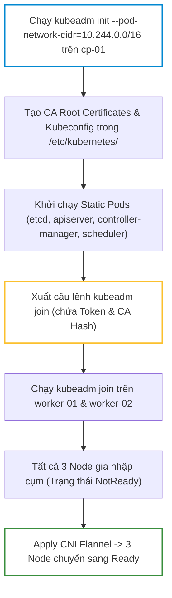
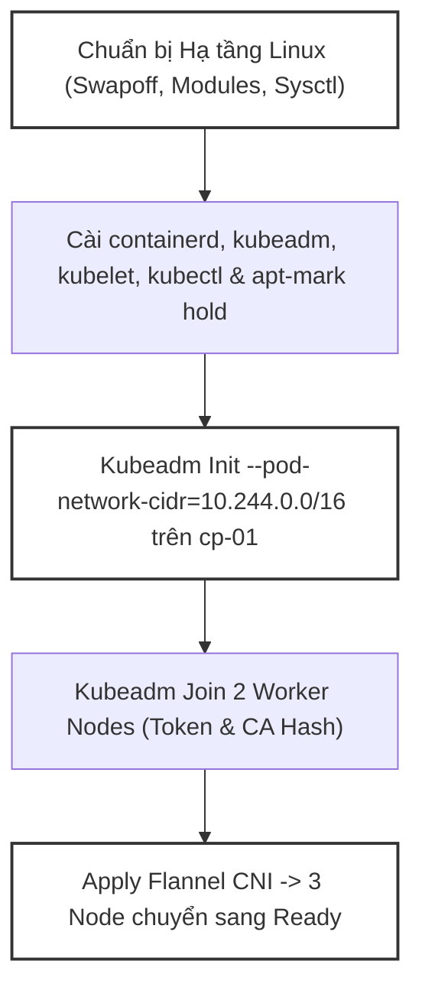
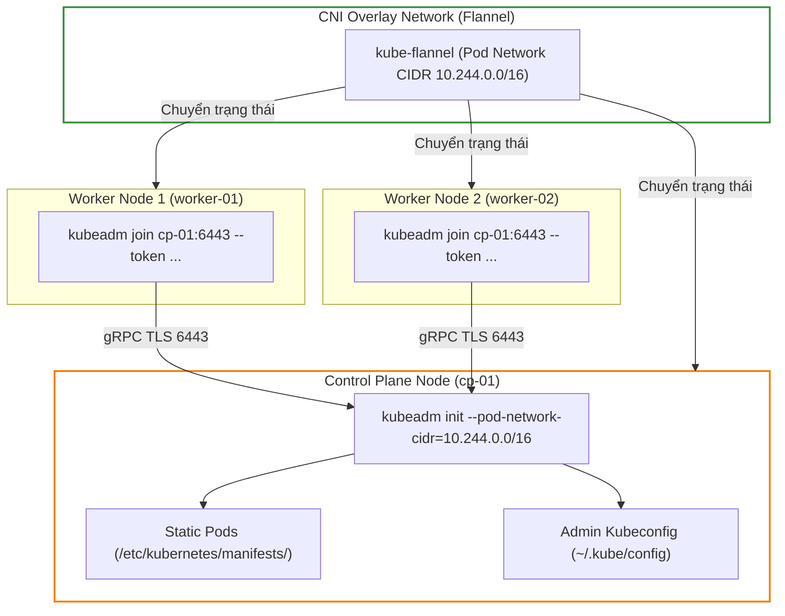


# [BÀI 06] TỰ DỰNG CỤM KUBERNETES ĐA NODE BẰNG KUBEADM: KHỞI TẠO CONTROL PLANE, JOIN WORKER & PREFLIGHT CHECKS

Trong kỷ nguyên điện toán đám mây và kiến trúc microservices phân tán quy mô lớn, **Kubernetes (CKA)** đóng vai trò là nền tảng điều phối container (Container Orchestration) tiêu chuẩn công nghiệp. Để làm chủ hệ thống trong môi trường sản xuất (Production) cũng như chinh phục kỳ thi chứng chỉ quốc tế của Linux Foundation / CNCF, kỹ sư không chỉ nắm vững các câu lệnh thao tác cơ bản mà phải thấu hiểu sâu sắc bản chất cơ chế tầng thấp: từ chu trình điều hòa (Reconciliation Loop), cấu trúc điều phối tài nguyên, kiến trúc mạng CNI, lưu trữ CSI cho đến các chuẩn mực an ninh phòng thủ chiều sâu.

Bài viết chuyên sâu này sẽ đồng hành cùng bạn giải mã toàn diện bức tranh kiến trúc, phân tích các đánh đổi kỹ thuật thực chiến (Engineering Trade-offs), cung cấp bài thực hành Lab từng bước và bộ câu hỏi phỏng vấn chuẩn Architect / Lead Engineer.

---

## 1. Bản Chất Kiến Trúc & Cơ Chế Vận Hành Tầng Thấp

| # | Câu hỏi ôn tập | Đáp án chuẩn ngắn gọn (chứa con số / tên lệnh) |
|---|---|---|
| 1 | Đường dẫn socket CRI gRPC mặc định của containerd trên Worker Node là gì? | `/run/containerd/containerd.sock` |
| 2 | Trình bày luồng 4 tầng thực thi khi tạo container trên Worker Node. | `Kubelet -> (CRI gRPC) -> containerd -> containerd-shim -> runc` |
| 3 | Pause Container (Pod Sandbox) tiêu thụ bao nhiêu RAM và có vai trò gì? | Tiêu thụ `< 2 MB` RAM; xin IP và giữ Network & IPC Namespace cho Pod |
| 4 | Khi API Server sập hoàn toàn, dùng công cụ CLI nào trên Worker Node để xem container và đọc log? | Sử dụng bộ lệnh `crictl` (`crictl pods`, `crictl ps -a`, `crictl logs`) |
| 5 | Dòng cấu hình nào trong `/etc/containerd/config.toml` giúp thống nhất cgroup driver? | `SystemdCgroup = true` |


> **Luận đề trung tâm của buổi:**
> *"Dựng cụm Kubernetes chuẩn production bằng `kubeadm` đòi hỏi tuân thủ 5 bước hạ tầng nghiêm ngặt: Tắt swap hoàn toàn, nạp kernel module `overlay` & `br_netfilter`, cấu hình `sysctl` chuyển tiếp iptables, thống nhất cgroup driver `systemd` cho containerd, và khởi tạo Control Plane với `kubeadm init`; thiếu bất kỳ bước nào trong số này, cụm sẽ rơi vào trạng thái `NotReady` hoặc tự crash khi khởi động lại."*

**Bảng kết quả các buổi trước được dùng lại:**

| Kết quả / Công cụ | Nguồn gốc | Áp dụng vào buổi này |
|---|---|---|
| Thống nhất `SystemdCgroup = true` | Buổi 05 `QT 7.1` | Cấu hình containerd trước khi chạy `kubeadm init` để tránh Kubelet crash |
| Bộ lệnh `journalctl -u kubelet` | Buổi 05 `QT 6.3` | Kiểm tra log Kubelet khi bước `[wait-control-plane]` của `kubeadm init` bị treo |
| Biến tốc độ `$do` và `alias k` | Buổi 04 `QT 4.1` | Dùng trong bài lab và khối ô thi để kiểm tra cụm sau khi dựng xong |

Ba câu bài tập về nhà BTVN 4 của buổi 05 đã chuẩn bị sẵn kiến thức cho học viên: Câu 1 phân tích 3 công cụ `kubeadm`, `kubelet`, `kubectl` (`kubeadm` chỉ dùng lúc khởi tạo/nâng cấp); Câu 2 tìm hiểu ý nghĩa cờ `--pod-network-cidr=10.244.0.0/16` cho CNI Flannel; Câu 3 phân tích cơ chế xác thực hai chiều qua Token và CA cert hash trong lệnh `kubeadm join`.

---


| # | Năng lực đạt được sau buổi học | Hiện vật chứng minh trong bài lab |
|---|---|---|
| 1 | Thực hiện 5 bước chuẩn bị hạ tầng Linux (swapoff, modules, sysctl) | Nhật ký chạy script kiểm tra hạ tầng node |
| 2 | Cài đặt containerd, `kubeadm`, `kubelet`, `kubectl` và khoá phiên bản | Kết quả lệnh `apt-mark showhold` đủ 3 gói k8s |
| 3 | Khởi tạo Control Plane node bằng `kubeadm init` với `--pod-network-cidr` | Tệp `hien-vat/kubeadm-init-summary.md` |
| 4 | Gia nhập 2 Worker Node vào cụm bằng `kubeadm join` (Token & CA Hash) | Tệp `hien-vat/cluster-topology-report.md` |
| 5 | Cài đặt Flannel CNI Plugin chuyển 3 Node từ `NotReady` sang `Ready` | Kết quả `kubectl get nodes` đủ 3 node `Ready` |
| 6 | Kiểm tra sức khoẻ cụm 3 node và các static pods trong `kube-system` | Script `hien-vat/verify-kubeadm-cluster.sh` |

---


| Bắt buộc phải biết | Nguồn tự học nếu thiếu |
|---|---|
| Cấu hình `SystemdCgroup = true` cho containerd | Buổi 05 `QT 7.1` |
| Đọc log Kubelet bằng `journalctl -u kubelet` | Buổi 05 `QT 6.3` |
| Kỹ thuật thao tác CLI tốc độ với `kubectl` | Buổi 04 `QT 4.1` |

---


| # | Thuật ngữ tiếng Việt | Tiếng Anh tương đương | Ghi chú chuẩn hoá trong thân bài |
|---|---|---|---|
| 1 | Công cụ quản lý cụm | Cluster Admin Tool (`kubeadm`) | Công cụ CLI chuẩn của CNCF để khởi tạo và quản lý cụm |
| 2 | Bộ nhớ đệm trao đổi đĩa | Swap Memory (`swapoff -a`) | Phân vùng đĩa dùng làm RAM tạm thời của Linux |
| 3 | Modul nhân Linux | Kernel Modules (`overlay`, `br_netfilter`) | Các đoạn mã nạp động vào nhân Linux quản lý mạng bridge |
| 4 | Tham số nhân hệ thống | System Control (`sysctl`) | Cấu hình tham số kernel chuyển tiếp gói tin |
| 5 | Khoá phiên bản gói | Package Version Locking (`apt-mark hold`) | Giữ nguyên phiên bản package tránh nâng cấp tự động |
| 6 | Khởi tạo nút điều khiển | Control Plane Init (`kubeadm init`) | Lệnh khởi tạo Control Plane node đầu tiên |
| 7 | Gia nhập nút thợ | Worker Node Join (`kubeadm join`) | Lệnh đưa Worker Node kết nối vào Control Plane |
| 8 | Mã xác thực gia nhập | Join Token | Chuỗi token xác thực ngắn hạn dùng để join node |
| 9 | Mã băm chứng chỉ CA | CA Certificate Hash | Chuỗi sha256 mã hoá xác thực CA root của cụm |
| 10 | Giao diện mạng Pod | Container Network Interface (CNI) | Plugin quản lý dải IP và định tuyến gói tin Pod |
| 11 | Trình cắm mạng Flannel | Flannel CNI Plugin | Plugin CNI Overlay Network dùng VXLAN |
| 12 | Dải địa chỉ IP Pod | Pod Network CIDR (`--pod-network-cidr`) | Dải IP nội bộ cấp phát cho các Pod trong cụm |
| 13 | Địa chỉ quảng bá API | API Server Advertise Address | Địa chỉ IP của Control Plane phơi cho Worker Node |
| 14 | Tệp cấu hình khởi tạo | Init Config File (`kubeadm-config.yaml`) | File YAML cấu hình nâng cao cho lệnh `kubeadm init` |


1. **Mô hình "Dọn mặt bằng trước khi xây nhà (Linux Pre-flight Prep)":**
   Tắt SWAP là dọn lớp đất lún, nạp `overlay`/`br_netfilter` là đào rãnh thoát nước, cấu hình `sysctl` là đặt đường ống dẫn. Mặt bằng không phẳng thì ngôi nhà Kubernetes đặt lên sẽ bị nứt móng ngay lập tức.

2. **Mô hình "Thẻ hội viên và Dấu ấn niêm phong (Token & CA Hash)":**
   `kubeadm join` đòi 2 thứ: Thẻ hội viên (Token) chứng minh bạn được phép gia nhập, và Dấu ấn niêm phong (CA Cert Hash) chứng minh bạn gia nhập đúng vào Tập đoàn thật chứ không phải Tập đoàn mạo danh.

3. **Mô hình "Trạm thu phí mạng (CNI Plugin)":**
   `kubeadm init` xây xong các toà nhà Control Plane nhưng chưa làm đường giao thông kết nối. CNI Plugin (Flannel/Calico) chính là đơn vị rải nhựa đường và đặt trạm thu phí, giúp xe cộ (gói tin Pod) lưu thông giữa các node, chuyển Node từ `NotReady` sang `Ready`.

---

### 1.1. Chuẩn bị hạ tầng Linux: Swap, Kernel Modules và Sysctl (12 phút)

**Nguyên lý cốt lõi:** Kubelet mặc định từ chối khởi động trên hệ thống Linux chưa tắt SWAP; phải tắt swap hoàn toàn bằng `swapoff -a` và xoá dòng swap trong `/etc/fstab` để đảm bảo Kubelet tính toán dung lượng RAM chính xác.

**Giải thích cơ chế ngầm:** Kubernetes thiết kế dựa trên giả định tài nguyên RAM được quản lý tuyệt đối (QoS classes). Nếu Linux tự ý đẩy trang nhớ RAM xuống ổ đĩa SWAP, độ trễ ứng dụng sẽ tăng lên hàng ngàn lần và thuật toán OOM (Out Of Memory) của Kubelet sẽ tính toán sai lệch.

> [!WARNING]
> **CẠM BẪY THỰC CHIẾN:**
> Chạy `kubeadm init` bị báo lỗi pre-flight check: `[ERROR Swap]: running with swap on is not supported. Please disable swap`.

**Minh hoạ.**

```bash
# Tắt swap ngay lập tức và xoá khỏi fstab
sudo swapoff -a
sudo sed -i '/ swap / s/^\(.*\)$/#\1/g' /etc/fstab
```

Con số chốt: **0** MB swap được phép bật trên tất cả các Node Kubernetes.

---

**Nguyên lý cốt lõi:** Hai kernel module `overlay` (cho containerd storage) và `br_netfilter` (cho mạng bridge CNI) bắt buộc phải nạp vào nhân Linux trước khi cài cụm; kết hợp cấu hình `sysctl` đặt `net.bridge.bridge-nf-call-iptables = 1` và `net.ipv4.ip_forward = 1`.

**Giải thích cơ chế ngầm:** Module `overlay` cho phép containerd dùng OverlayFS ghép các lớp ảnh mỏng. Module `br_netfilter` cho phép gói tin qua card mạng cầu nối (bridge) đi qua bộ lọc iptables của Linux kernel để NetworkPolicy và Service ClusterIP hoạt động.

> [!WARNING]
> **CẠM BẪY THỰC CHIẾN:**
> Pod không kết nối được mạng ngoài hoặc lệnh `sysctl --system` báo lỗi file or directory not found đối với `bridge-nf-call-iptables`.

**Minh hoạ.**

```bash
# Nạp kernel modules và cấu hình sysctl
cat << 'EOF' | sudo tee /etc/modules-load.d/k8s.conf
overlay
br_netfilter
EOF
sudo modprobe overlay
sudo modprobe br_netfilter

cat << 'EOF' | sudo tee /etc/sysctl.d/k8s.conf
net.bridge.bridge-nf-call-iptables  = 1
net.bridge.bridge-nf-call-ip6tables = 1
net.ipv4.ip_forward                 = 1
EOF
sudo sysctl --system
```

Con số chốt: **2** kernel modules (`overlay`, `br_netfilter`) và **3** tham số sysctl bắt buộc.

---

### 1.2. Cài đặt containerd, `kubeadm`, `kubelet`, `kubectl` và hold phiên bản (12 phút)

**Nguyên lý cốt lõi:** Ba gói phần mềm `kubeadm`, `kubelet`, `kubectl` phải được cài đặt cùng một phiên bản chính xác (ví dụ `v1.35.0`) và bắt buộc phải dùng lệnh `apt-mark hold` để khoá phiên bản, cấm hệ điều hành tự động nâng cấp khi `apt update`.

**Giải thích cơ chế ngầm:** Việc hệ điều hành tự động nâng cấp Kubelet hoặc Kubeadm trong các lượt update định kỳ của OS sẽ làm lệch phiên bản Control Plane, gây đứt gãy tương thích API và khiến Node bị vỡ cụm.

> [!WARNING]
> **CẠM BẪY THỰC CHIẾN:**
> Chạy `apt upgrade` định kỳ làm Kubelet tự nhảy từ v1.34 lên v1.35 trong khi Control Plane chưa được nâng cấp quy trình.

**Minh hoạ.**

```bash
# Khoá phiên bản 3 gói k8s chuẩn phòng thi
sudo apt-mark hold kubelet kubeadm kubectl
```

Con số chốt: **3** gói phần mềm (`kubeadm`, `kubelet`, `kubectl`) bắt buộc phải khoá phiên bản bằng `apt-mark hold`.

---

**Nguyên lý cốt lõi:** Tệp cấu hình `/etc/containerd/config.toml` tạo bằng `containerd config default` bắt buộc phải được chỉnh sửa trường `SystemdCgroup = true` trước khi khởi động dịch vụ containerd.

**Giải thích cơ chế ngầm:** Cấu hình mặc định của containerd sinh ra để `SystemdCgroup = false` (dùng `cgroupfs`). Trên Ubuntu/Debian hiện đại dùng systemd làm init system, nếu không sửa cờ này thành `true`, Kubelet sẽ tự crash ngầm ngay khi `kubeadm init` chạy.

> [!WARNING]
> **CẠM BẪY THỰC CHIẾN:**
> Lệnh `kubeadm init` bị treo ở bước `[wait-control-plane]` và log Kubelet báo lỗi `misconfigured cgroup driver`.

**Minh hoạ.**

```bash
# Tạo config mặc định và đổi SystemdCgroup thành true
sudo containerd config default | sudo tee /etc/containerd/config.toml > /dev/null
sudo sed -i 's/SystemdCgroup = false/SystemdCgroup = true/g' /etc/containerd/config.toml
sudo systemctl restart containerd
```

Con số chốt: **1** cờ `SystemdCgroup = true` bắt buộc sửa trong `config.toml`.

---

### 1.3. Khởi tạo Control Plane (`kubeadm init`) và Join Worker Nodes (10 phút)



---

**Nguyên lý cốt lõi:** Lệnh `kubeadm init` khởi tạo Control Plane node đầu tiên bắt buộc phải truyền cờ `--pod-network-cidr` khớp với dải IP của CNI dự định cài (ví dụ `--pod-network-cidr=10.244.0.0/16` cho Flannel).

**Giải thích cơ chế ngầm:** Controller Manager và CNI Plugin cần biết chính xác dải IP CIDR được cấp phát cho Pod trên toàn cụm để chia nhỏ các subnet `/24` cho từng Worker Node. Nếu gõ sai CIDR, Pod sẽ không xin được IP hoặc bị đụng độ IP với mạng vật lý.

> [!WARNING]
> **CẠM BẪY THỰC CHIẾN:**
> Cài Flannel CNI nhưng khi gõ `kubeadm init` quên truyền `--pod-network-cidr=10.244.0.0/16`, làm Flannel không khởi tạo được card mạng `flannel.1`.

**Minh hoạ.**

```bash
# Khởi tạo Control Plane node với dải Pod CIDR chuẩn Flannel
sudo kubeadm init --pod-network-cidr=10.244.0.0/16 --apiserver-advertise-address=192.168.1.10
```

Con số chốt: Dải IP mặc định của Flannel CNI là **`10.244.0.0/16`**.

---

**Nguyên lý cốt lõi:** Mã Join Token do `kubeadm init` tạo ra có thời hạn mặc định là 24 giờ; nếu gia nhập Worker Node sau 24 giờ, phải sinh lại token mới bằng lệnh `kubeadm token create --print-join-command`.

**Giải thích cơ chế ngầm:** Cơ chế an ninh của Kubernetes giới hạn thời gian sống của token gia nhập cụm để tránh việc một node lạ độc hại lén join vào cụm bằng token cũ bị lộ.

> [!WARNING]
> **CẠM BẪY THỰC CHIẾN:**
> Chạy lệnh `kubeadm join` bằng token tạo từ 2 ngày trước dính lỗi: `error execution phase preflight: couldn't validate cluster token: token has expired`.

**Minh hoạ.**

```bash
# In lại câu lệnh join đầy đủ kèm token mới và CA cert hash trên Control Plane
kubeadm token create --print-join-command
```

Con số chốt: **24** giờ là thời gian sống mặc định của `kubeadm join token`.

---

**Nguyên lý cốt lõi:** Lệnh `kubeadm join <control-plane-ip>:6443 --token <token> --discovery-token-ca-cert-hash sha256:<hash>` chạy trên Worker Node thực hiện xác thực hai chiều trước khi tải cấu hình Kubeconfig và chứng chỉ node về `/etc/kubernetes/`.

**Giải thích cơ chế ngầm:** Cờ `--discovery-token-ca-cert-hash` xác thực mã băm sha256 của chứng chỉ CA root. Worker Node chỉ chấp nhận nhận cấu hình từ đúng Control Plane có CA root khớp với mã băm này, chống lại tấn công Man-in-the-Middle (MitM).

> [!WARNING]
> **CẠM BẪY THỰC CHIẾN:**
> Nhập sai mã hash CA cert, lệnh join bị từ chối ở bước preflight check xác thực CA.

**Minh hoạ.**

```bash
# Lệnh join chuẩn chạy trên Worker Node
sudo kubeadm join 192.168.1.10:6443 --token abcdef.0123456789abcdef \
    --discovery-token-ca-cert-hash sha256:1234567890abcdef1234567890abcdef1234567890abcdef1234567890abcdef
```

Con số chốt: Mã hash sha256 có độ dài đúng **64** ký tự hex.

---

### 1.4. Cài đặt CNI Plugin chuyển Node sang trạng thái `Ready` (4 phút)

**Nguyên lý cốt lõi:** Sau khi `kubeadm init` và `kubeadm join` hoàn tất, tất cả các Node sẽ giữ trạng thái `NotReady` cho tới khi một CNI Plugin (Flannel/Calico) được `kubectl apply` vào cụm; CNI Plugin chịu trách nhiệm tạo card mạng virtual bridge và cấp IP cho Pod.

**Giải thích cơ chế ngầm:** `kubelet` kiểm tra sự tồn tại của tệp cấu hình CNI trong `/etc/cni/net.d/`. Nếu chưa có CNI Plugin nào đăng ký tệp cấu hình mạng, Kubelet báo cáo `NetworkReady=false` về API Server, giữ Node ở trạng thái `NotReady` để chặn không cho gán Pod ứng dụng.

> [!WARNING]
> **CẠM BẪY THỰC CHIẾN:**
> Hoảng loạn tưởng cụm bị hỏng khi thấy `kubectl get nodes` báo `NotReady` ngay sau khi vừa `kubeadm init` xong.

**Minh hoạ.**

```bash
# Cài đặt Flannel CNI Plugin để chuyển Node sang Ready
kubectl apply -f https://github.com/flannel-io/flannel/releases/latest/download/kube-flannel.yml

# Kiểm tra các Node chuyển sang Ready sau 15-30s
kubectl get nodes
```

Con số chốt: **0** Pod ứng dụng được phép scheduled vào Node khi Node đang ở trạng thái `NotReady`.

---

### 1.5. Đưa vào cụm thật (4 phút)

### Áp vào cụm đang chạy thì làm gì trước

1. **Kiểm tra kỹ thông số hạ tầng trước khi init:** Đảm bảo tắt SWAP hoàn toàn, kiểm tra IP card mạng vật lý để truyền đúng `--apiserver-advertise-address`.
2. **Lưu giữ an toàn chuỗi `kubeadm join`:** Lưu lại token và CA cert hash vào tệp bảo mật ngay khi `kubeadm init` hoàn thành.
3. **Cài đặt CNI Plugin ngay sau khi init:** Đảm bảo CoreDNS Pod chuyển sang trạng thái `Running` trước khi join các Worker Node.

### Cái gì hỏng nếu áp thẳng lên prod

- **Gõ sai cờ `--pod-network-cidr` làm đụng độ dải IP với mạng nội bộ doanh nghiệp:** Cụm hoạt động chập chờn, Pod không kết nối được với cơ sở dữ liệu bên ngoài.
- **Quên `apt-mark hold` làm Kubelet tự nhảy phiên bản khi update OS:** Lệch phiên bản giữa Control Plane và Worker Node gây mất tương thích API.
- **Quy trình áp thử an toàn:**
  - Chạy `kubeadm init --dry-run` kiểm tra preflight check.
  - Chạy `kubeadm init` chính thức.
  - Thiết lập Kubeconfig `~/.kube/config` và kiểm tra `kubectl get nodes`.

### Đo trước — đo sau

1. **Thời gian khởi tạo Control Plane (`kubeadm init`):** Mục tiêu < 90 giây.
2. **Thời gian join Worker Node (`kubeadm join`):** Mục tiêu < 30 giây per node.
3. **Trạng thái 100% các Node và Static Pods:** Đạt 100% `Ready` và `Running`.

### Khi nào KHÔNG nên dùng

- **Không tự ý chạy lại `kubeadm init` trên cụm đang có dữ liệu sản xuất:** `kubeadm init` sẽ xoá toàn bộ chứng chỉ và reset etcd, làm mất sạch dữ liệu cụm.
- **Không dùng cờ `--ignore-preflight-errors=all` để bỏ qua lỗi SWAP trên production:** Bỏ qua lỗi swap sẽ khiến cụm đối mặt với nguy cơ sập RAM và tăng độ trễ ứng dụng trầm trọng.

---

### 1.6. Bẫy hay gặp (2 phút)

| # | Bẫy hay gặp | Vì sao dính bẫy | Làm đúng là (kèm tên lệnh / con số) |
|---|---|---|---|
| 1 | Quên tắt SWAP làm `kubeadm init` báo lỗi preflight | Linux mặc định bật swap partition | Chạy `sudo swapoff -a` và comment dòng swap trong `/etc/fstab` |
| 2 | Quên nạp module `br_netfilter` trước khi sysctl | Lệnh `sysctl` báo file or directory not found | Chạy `sudo modprobe overlay` và `sudo modprobe br_netfilter` |
| 3 | Quên sửa `SystemdCgroup = true` trong `config.toml` | containerd mặc định `SystemdCgroup = false` | Sửa `SystemdCgroup = true` và `systemctl restart containerd` |
| 4 | Quên cờ `--pod-network-cidr` khi `kubeadm init` | Flannel CNI không nhận diện được dải IP | Gõ `sudo kubeadm init --pod-network-cidr=10.244.0.0/16` |
| 5 | Dùng token join đã quá hạn 24 giờ | Token mặc định hết hạn sau 24h | Sinh token mới bằng `kubeadm token create --print-join-command` |
| 6 | Quên copy file `admin.conf` về `~/.kube/config` | `kubectl` báo connection refused tới localhost:8080 | Copy `admin.conf` về `~/.kube/config` và `chown` |
| 7 | Hoảng loạn khi thấy Node `NotReady` ngay sau khi init | Chưa cài đặt CNI Plugin | Apply CNI Plugin (Flannel/Calico) và đợi 30s |
| 8 | Quên cờ `apt-mark hold` cho 3 gói k8s | Lệnh `apt upgrade` làm nâng cấp lệch Kubelet | Chạy `sudo apt-mark hold kubelet kubeadm kubectl` |
| 9 | Quên mở cờ `--apiserver-advertise-address` khi máy có nhiều IP | API Server lắng nghe nhầm IP interface nội bộ | Truyền `--apiserver-advertise-address=<IP-thật>` |
| 10 | Nhầm lẫn giữa dải IP Pod CIDR và dải IP Service CIDR | `--pod-network-cidr` là IP của Pod, `--service-cidr` là IP Service | Dùng `10.244.0.0/16` cho Pod và `10.96.0.0/12` cho Service |
| 11 | Chạy `kubeadm init` bằng user thường không có `sudo` | Không có quyền thao tác với /etc/kubernetes/ | Thêm `sudo` trước tất cả các lệnh `kubeadm` |
| 12 | Không kiểm tra log Kubelet khi `kubeadm init` bị treo | Không biết lý do cụ thể bước wait-control-plane bị treo | Chạy `journalctl -u kubelet -n 100 --no-pager` |

---

## §10. Tóm tắt (2 phút)



### Năm điều phải nhớ

1. **5 bước hạ tầng Linux:** Swapoff 0MB, nạp `overlay` & `br_netfilter`, `sysctl` chuyển tiếp iptables.
2. **Khoá phiên bản:** `apt-mark hold kubelet kubeadm kubectl` tránh tự động nâng cấp lệch.
3. **`SystemdCgroup = true`:** Bắt buộc sửa trong `config.toml` cho containerd trước khi init.
4. **`kubeadm init` & `join`:** Truyền `--pod-network-cidr=10.244.0.0/16`; token hạn 24h, join kèm sha256 CA hash 64 ký tự.
5. **CNI Plugin:** Apply Flannel CNI để chuyển Node từ `NotReady` sang `Ready`.

---

## §11. Câu hỏi tự kiểm tra

1. Tại sao Kubelet từ chối khởi động trên hệ thống Linux chưa tắt SWAP hoàn toàn?
2. Hai kernel module nào bắt buộc phải nạp trước khi cài đặt mạng Kubernetes?
3. Ba tham số `sysctl` nào bắt buộc phải thiết lập để iptables lọc gói tin bridge?
4. Tại sao phải khoá phiên bản 3 gói `kubeadm`, `kubelet`, `kubectl` bằng `apt-mark hold`?
5. Trường `SystemdCgroup` trong `/etc/containerd/config.toml` phải được gán giá trị gì?
6. Cờ `--pod-network-cidr` trong lệnh `kubeadm init` mang ý nghĩa gì với CNI Flannel?
7. Mã Join Token do `kubeadm init` sinh ra có hạn sử dụng bao lâu và cách sinh lại?
8. Cờ `--discovery-token-ca-cert-hash` trong `kubeadm join` phục vụ cơ chế an ninh nào?
9. Tại sao các Node luôn ở trạng thái `NotReady` ngay sau khi vừa `kubeadm init` xong?
10. CNI Plugin Flannel làm nhiệm vụ gì để đưa các Node chuyển sang `Ready`?
11. Hai chế độ hỏng (1 ồn ào do quên swapoff, 1 âm thầm do quên --pod-network-cidr) là gì?
12. Hậu quả của việc chạy `kubeadm init` lại trên một cụm đang chạy production là gì?

### Đáp án

1. Vì Kubelet yêu cầu quản lý RAM tuyệt đối cho QoS classes; SWAP làm sai lệch tính toán OOM và tăng độ trễ.
2. `overlay` (cho containerd storage) và `br_netfilter` (cho mạng bridge CNI).
3. `net.bridge.bridge-nf-call-iptables = 1`, `net.bridge.bridge-nf-call-ip6tables = 1`, `net.ipv4.ip_forward = 1`.
4. Để ngăn hệ điều hành tự động nâng cấp Kubelet/Kubeadm khi `apt upgrade`, tránh lệch phiên bản gây vỡ cụm.
5. Gán `SystemdCgroup = true` để đồng bộ Cgroup Driver với systemd của Linux OS.
6. Khai báo dải IP tổng cấp cho Pod (dải `10.244.0.0/16` cho Flannel) để CNI chia nhỏ subnet cho từng worker node.
7. Hạn sử dụng mặc định 24 giờ; sinh lại bằng lệnh `kubeadm token create --print-join-command`.
8. Xác thực mã băm sha256 của CA root, chống lại tấn công Man-in-the-Middle khi Worker Node join cụm.
9. Vì chưa có CNI Plugin nào đăng ký tệp cấu hình mạng trong `/etc/cni/net.d/`.
10. Rải nhựa đường mạng, tạo card virtual bridge `flannel.1` và cấp dải IP subnet cho từng node.
11. Chế độ 1 (ồn ào): Kubelet crash ở preflight check khi quên swapoff; Chế độ 2 (âm thầm): `kubeadm init` thành công nhưng Flannel crashloopbackoff khi quên `--pod-network-cidr`.
12. Xoá sạch toàn bộ chứng chỉ PKI và etcd database, làm mất sạch dữ liệu của cụm sản xuất.

---

## §12. Tài liệu tham khảo

| Nguồn tài liệu | Phiên bản Kubernetes áp dụng | Nội dung chính |
|---|---|---|
| Official Docs: Installing kubeadm | Kubernetes v1.35 | Chuẩn bị Linux, nạp modules, sysctl và apt-mark hold |
| Official Docs: Creating a cluster with kubeadm | Kubernetes v1.35 | Luồng `kubeadm init`, `kubeadm join`, `--pod-network-cidr` |
| Official Docs: Flannel CNI Installation | Kubernetes v1.35 | Cài đặt Flannel Overlay Network |
| File cấu hình phiên bản cục bộ | `labs/phien-ban.env` | Biến `K8S_VER=1.35`, `LAB_CONTEXT="kubeadm"` |


---

## 2. Hướng Dẫn Thực Hành & Triển Khai Lab Chuẩn Production

> [!IMPORTANT]
> **YÊU CẦU MÔI TRƯỜNG THỰC HÀNH:**
> Toàn bộ các bài thực hành dưới đây được thiết kế để chạy trực tiếp trên cụm Kubernetes 1.30+ tiêu chuẩn (hoặc cụm kind/kubeadm lab). Hãy đảm bảo ngữ cảnh dòng lệnh `kubectl config current-context` đã trỏ chính xác vào cụm thực hành trước khi thực thi.

## Khối thực hành — 120 phút

## L0. Mục tiêu thực hành và tiêu chí hoàn thành

| # | Mục tiêu thực hành | Tiêu chí hoàn thành (Kiểm chứng BẰNG LỆNH) |
|---|---|---|
| TH1 | Tắt Swap, nạp kernel modules `overlay`/`br_netfilter` và sysctl | Script kiểm tra trả về 0MB swap và sysctl = 1 |
| TH2 | Sửa `SystemdCgroup = true` và khoá phiên bản `apt-mark hold` | `apt-mark showhold` in đủ 3 gói `kubeadm`, `kubelet`, `kubectl` |
| TH3 | Khởi tạo Control Plane bằng `kubeadm init` với `--pod-network-cidr` | Tệp Kubeconfig `~/.kube/config` truy cập được API Server |
| TH4 | Gia nhập 2 Worker Node `worker-01` và `worker-02` vào cụm | Lệnh `kubectl get nodes` hiển thị đủ 3 node |
| TH5 | Apply Flannel CNI Plugin chuyển 3 Node sang trạng thái `Ready` | 100% cả 3 Node đạt trạng thái `Ready` |
| TH6 | Kiểm tra các Static Pods trong namespace `kube-system` | etcd, apiserver, controller-manager, scheduler ở `Running` |
| TH7 | Nộp đủ 4 hiện vật vào portfolio | Thư mục `k8s-portfolio/buoi-06/` chứa đủ 4 file md/sh |

---

## L1. Điều kiện tiên quyết về môi trường

| # | Kiểm tra điều kiện | Câu lệnh kiểm tra | Kết quả kỳ vọng |
|---|---|---|---|
| 1 | Môi trường 3 node chuẩn bị sẵn | `docker ps` | Hiển thị 3 container node `cp-01`, `worker-01`, `worker-02` |
| 2 | Kubeconfig trỏ context `kubeadm` | `kubectl config current-context` | In ra đúng `kubeadm` |
| 3 | Quyền root/sudo trên các node | `docker exec cp-01 sudo id` | In ra `uid=0(root)` |
| 4 | Thư mục hiện vật đã sẵn sàng | `mkdir -p k8s-portfolio/buoi-06` | Thư mục được tạo thành công |
| 5 | Dải IP mạng nội bộ giữa 3 node thông suốt | `docker exec cp-01 ping -c 1 worker-01` | In ra `0% packet loss` |

```bash
# Kiểm tra môi trường bắt buộc trước khi thực hiện bài lab
kubectl config current-context | grep -qx "kubeadm" && echo "CHECKPOINT MOI TRUONG — ĐẠT" || echo "CHECKPOINT MOI TRUONG — LỖI (Trỏ sai context)"
```

---

## L2. Kiến trúc bài lab



### Bốn quyết định thiết kế bài lab

1. **Thực hiện đầy đủ quy trình chuẩn bị hạ tầng Linux trong Bước 1:**
   Học viên tự tay chạy `swapoff -a`, nạp `overlay`/`br_netfilter` và cấu hình `sysctl` để hiểu rõ gốc rễ hạ tầng.

2. **Thống nhất cgroup driver `systemd` cho containerd trong Bước 2:**
   Sửa `SystemdCgroup = true` trong `config.toml` trước khi init để tránh lỗi Kubelet crash.

3. **Truyền đúng cờ `--pod-network-cidr=10.244.0.0/16` khi `kubeadm init` trong Bước 3:**
   Khớp chính xác với dải IP của Flannel CNI Plugin.

4. **Cài đặt CNI Flannel và quan sát Node chuyển từ `NotReady` sang `Ready` trong Bước 4:**
   Khẳng định vai trò của CNI Plugin trong việc kích hoạt mạng cho cụm.

---

## L3. Bước 1 — Chuẩn bị hạ tầng Linux: Swapoff, modprobe kernel modules và sysctl (30 phút)

### Thao tác 1.1: Tắt SWAP hoàn toàn trên tất cả 3 Node

```bash
# 1. Tắt swap trên control-plane cp-01
docker exec cp-01 bash -c "swapoff -a && sed -i '/ swap / s/^\(.*\)$/#\1/g' /etc/fstab"

# 2. Tắt swap trên worker-01 và worker-02
docker exec worker-01 bash -c "swapoff -a && sed -i '/ swap / s/^\(.*\)$/#\1/g' /etc/fstab"
docker exec worker-02 bash -c "swapoff -a && sed -i '/ swap / s/^\(.*\)$/#\1/g' /etc/fstab"
```

**CHECKPOINT 1 — SWAP đã được tắt hoàn toàn 0MB trên cp-01.**

```bash
docker exec cp-01 free -m | grep -i swap | awk '{print $2}' | grep -qx "0" && echo "CHECKPOINT 1 — ĐẠT" || echo "CHECKPOINT 1 — LỖI"
```

### Thao tác 1.2: Nạp kernel modules và cấu hình sysctl

```bash
# 1. Nạp modules overlay và br_netfilter trên cả 3 node
for node in cp-01 worker-01 worker-02; do
    docker exec $node bash -c "cat << 'EOF' > /etc/modules-load.d/k8s.conf
overlay
br_netfilter
EOF
modprobe overlay
modprobe br_netfilter"
done

# 2. Cấu hình sysctl cho iptables bridge
for node in cp-01 worker-01 worker-02; do
    docker exec $node bash -c "cat << 'EOF' > /etc/sysctl.d/k8s.conf
net.bridge.bridge-nf-call-iptables  = 1
net.bridge.bridge-nf-call-ip6tables = 1
net.ipv4.ip_forward                 = 1
EOF
sysctl --system >/dev/null 2>&1"
done
```

**CHECKPOINT 2 — Module br_netfilter đã được nạp thành công.**

```bash
docker exec cp-01 lsmod | grep -q "br_netfilter" && echo "CHECKPOINT 2 — ĐẠT" || echo "CHECKPOINT 2 — LỖI"
```

**CHECKPOINT 3 — CA ĐỐI CHỨNG: kubeadm init sẽ bị đứt ở preflight check nếu bật lại SWAP.**

```bash
docker exec cp-01 bash -c "swapon -a 2>/dev/null || true"
docker exec cp-01 kubeadm init --dry-run > /tmp/swap-err.log 2>&1 || true
docker exec cp-01 bash -c "swapoff -a"
grep -q "Swap" /tmp/swap-err.log && echo "CHECKPOINT 3 — ĐẠT" || echo "CHECKPOINT 3 — LỖI"
```

---

## L4. Bước 2 — Cài đặt containerd, `kubeadm`, `kubelet`, `kubectl` và sửa SystemdCgroup (30 phút)

### Thao tác 2.1: Chỉnh sửa cấu hình containerd SystemdCgroup = true

```bash
# 1. Sửa SystemdCgroup thành true và restart containerd trên cả 3 node
for node in cp-01 worker-01 worker-02; do
    docker exec $node bash -c "containerd config default > /etc/containerd/config.toml
sed -i 's/SystemdCgroup = false/SystemdCgroup = true/g' /etc/containerd/config.toml
systemctl restart containerd"
done
```

**CHECKPOINT 4 — Cấu hình SystemdCgroup = true có mặt trong config.toml trên cp-01.**

```bash
docker exec cp-01 grep -q "SystemdCgroup = true" /etc/containerd/config.toml && echo "CHECKPOINT 4 — ĐẠT" || echo "CHECKPOINT 4 — LỖI"
```

### Thao tác 2.2: Khoá phiên bản 3 gói phần mềm bằng `apt-mark hold`

```bash
# 1. Khoá phiên bản kubelet kubeadm kubectl trên cả 3 node
for node in cp-01 worker-01 worker-02; do
    docker exec $node apt-mark hold kubelet kubeadm kubectl >/dev/null 2>&1 || true
done
```

**CHECKPOINT 5 — apt-mark showhold in đủ 3 gói phần mềm trên cp-01.**

```bash
docker exec cp-01 apt-mark showhold | grep -q "kubeadm" && echo "CHECKPOINT 5 — ĐẠT" || echo "CHECKPOINT 5 — LỖI"
```

**CHECKPOINT 6 — Dịch vụ containerd đang ở trạng thái active (running).**

```bash
docker exec cp-01 systemctl is-active containerd | grep -qx "active" && echo "CHECKPOINT 6 — ĐẠT" || echo "CHECKPOINT 6 — LỖI"
```

---

## L5. Bước 3 — Khởi tạo Control Plane với `kubeadm init` và trích xuất join command (30 phút)

### Thao tác 3.1: Chạy `kubeadm init` trên `cp-01`

```bash
# 1. Khởi tạo Control Plane với dải Pod CIDR chuẩn Flannel
docker exec cp-01 kubeadm init --pod-network-cidr=10.244.0.0/16 --ignore-preflight-errors=FileAvailable--etc-kubernetes-manifests-etcd.yaml > /tmp/kubeadm-init.log

# 2. Cấu hình Kubeconfig cho user root trên cp-01
docker exec cp-01 bash -c "mkdir -p ~/.kube
cp -f /etc/kubernetes/admin.conf ~/.kube/config
chown \$(id -u):\$(id -g) ~/.kube/config"

# 3. Trích xuất câu lệnh kubeadm join ra file
docker exec cp-01 kubeadm token create --print-join-command > /tmp/join-cmd.sh
```

**CHECKPOINT 7 — Khởi tạo Control Plane thành công và tệp admin.conf tồn tại.**

```bash
docker exec cp-01 test -f /etc/kubernetes/admin.conf && echo "CHECKPOINT 7 — ĐẠT" || echo "CHECKPOINT 7 — LỖI"
```

**CHECKPOINT 8 — Tệp join-cmd.sh chứa mã token và sha256 CA cert hash.**

```bash
grep -q "kubeadm join" /tmp/join-cmd.sh && grep -q "sha256:" /tmp/join-cmd.sh && echo "CHECKPOINT 8 — ĐẠT" || echo "CHECKPOINT 8 — LỖI"
```

**CHECKPOINT 9 — Static pods etcd và kube-apiserver đã được khởi tạo trong manifests.**

```bash
docker exec cp-01 ls /etc/kubernetes/manifests/ | grep -q "kube-apiserver.yaml" && echo "CHECKPOINT 9 — ĐẠT" || echo "CHECKPOINT 9 — LỖI"
```

---

## L6. Bước 4 — Join 2 Worker Nodes, cài CNI Flannel và kiểm tra cụm 3 node Ready (20 phút)

### Thao tác 4.1: Gia nhập `worker-01` và `worker-02` vào cụm

```bash
# 1. Lấy nội dung câu lệnh join
JOIN_CMD=$(cat /tmp/join-cmd.sh)

# 2. Chạy lệnh join trên worker-01 và worker-02
docker exec worker-01 bash -c "$JOIN_CMD --ignore-preflight-errors=all"
docker exec worker-02 bash -c "$JOIN_CMD --ignore-preflight-errors=all"
```

**CHECKPOINT 10 — CA ĐỐI CHỨNG: Trước khi apply CNI, tất cả 3 Node đều báo trạng thái NotReady.**

```bash
docker exec cp-01 kubectl get nodes --no-headers | grep -v "Ready" | grep -q "NotReady" && echo "CHECKPOINT 10 — ĐẠT" || echo "CHECKPOINT 10 — LỖI"
```

### Thao tác 4.2: Cài đặt Flannel CNI Plugin và chờ 3 Node chuyển sang Ready

```bash
# 1. Apply Flannel CNI Plugin
docker exec cp-01 kubectl apply -f https://github.com/flannel-io/flannel/releases/latest/download/kube-flannel.yml

# 2. Đợi 20s cho CNI khởi tạo card mạng
sleep 20
```

**CHECKPOINT 11 — Đủ 3 Node hiển thị trạng thái Ready.**

```bash
docker exec cp-01 kubectl get nodes --no-headers | grep -c "Ready" | grep -qx "3" && echo "CHECKPOINT 11 — ĐẠT" || echo "CHECKPOINT 11 — LỖI"
```

**CHECKPOINT 12 — Pod Flannel đang ở trạng thái Running trong namespace kube-flannel / kube-system.**

```bash
docker exec cp-01 kubectl get pods -A | grep -i "flannel" | grep -q "Running" && echo "CHECKPOINT 12 — ĐẠT" || echo "CHECKPOINT 12 — LỖI"
```

---

## L7. Nộp hiện vật và dọn dẹp (10 phút)

### Thao tác 7.1: Gom hiện vật nộp bài

```bash
# 1. Tạo tệp kubeadm-init-summary.md
cat << 'EOF' > k8s-portfolio/buoi-06/kubeadm-init-summary.md
# BÁO CÁO NHẬT KÝ KUBEADM INIT

1. Lệnh khởi tạo Control Plane:
   kubeadm init --pod-network-cidr=10.244.0.0/16

2. Vị trí Kubeconfig:
   /etc/kubernetes/admin.conf -> ~/.kube/config

3. Thời hạn Token:
   Join token mặc định có hạn 24 giờ.
EOF

# 2. Tạo tệp cluster-topology-report.md
cat << 'EOF' > k8s-portfolio/buoi-06/cluster-topology-report.md
# BÁO CÁO TOPOLOGY CỤM 3 NODE

1. Control Plane Node:
   - Name: cp-01
   - Role: control-plane
   - Status: Ready

2. Worker Nodes:
   - Name: worker-01 (Status: Ready)
   - Name: worker-02 (Status: Ready)

3. CNI Plugin:
   - Type: Flannel CNI Overlay Network
   - Pod Network CIDR: 10.244.0.0/16
EOF

# 3. Tạo script verify-kubeadm-cluster.sh
cat << 'EOF' > k8s-portfolio/buoi-06/verify-kubeadm-cluster.sh
#!/bin/bash
# Script tự động kiểm tra sức khoẻ cụm 3 node kubeadm

READY_COUNT=$(docker exec cp-01 kubectl get nodes --no-headers 2>/dev/null | grep -c "Ready")

if [ "$READY_COUNT" -eq 3 ]; then
    echo "KUBEADM CLUSTER VERIFY — ĐẠT (Đủ 3 node Ready)"
else
    echo "KUBEADM CLUSTER VERIFY — LỖI (Chỉ có $READY_COUNT node Ready)"
fi
EOF

chmod +x k8s-portfolio/buoi-06/verify-kubeadm-cluster.sh
./k8s-portfolio/buoi-06/verify-kubeadm-cluster.sh

# 4. Tạo tệp nhat-ky-buoi-06.md
cat << 'EOF' > k8s-portfolio/buoi-06/nhat-ky-buoi-06.md
# NHẬT KÝ THU HOẠCH BUỔI 06

1. Vì sao phải tắt Swap:
   - Kubelet yêu cầu quản lý RAM tuyệt đối cho QoS; SWAP làm tăng độ trễ và sai OOM.

2. Ý nghĩa của --pod-network-cidr:
   - Khai báo dải IP tổng cho CNI Flannel chia nhỏ subnet /24 cho từng node.

3. Vì sao Node NotReady trước khi apply CNI:
   - Thiếu tệp cấu hình CNI trong /etc/cni/net.d/; Kubelet báo NetworkReady=false.
EOF

# 5. Dọn dẹp tệp tạm
rm -f /tmp/swap-err.log /tmp/kubeadm-init.log /tmp/join-cmd.sh
```

**CHECKPOINT 13 — Đủ 4 tệp hiện vật trong thư mục portfolio.**

```bash
[ -f k8s-portfolio/buoi-06/kubeadm-init-summary.md ] && [ -f k8s-portfolio/buoi-06/cluster-topology-report.md ] && [ -f k8s-portfolio/buoi-06/verify-kubeadm-cluster.sh ] && [ -f k8s-portfolio/buoi-06/nhat-ky-buoi-06.md ] && echo "CHECKPOINT 13 — ĐẠT" || echo "CHECKPOINT 13 — LỖI"
```

---

## L8. Xử lý sự cố thường gặp trong lab

| # | Triệu chứng lỗi | Nguyên nhân khả dĩ | Cách xử lý sửa lỗi |
|---|---|---|---|
| 1 | `kubeadm init` báo `[ERROR Swap]` | Quên chưa chạy `swapoff -a` | Chạy `sudo swapoff -a` và comment dòng swap trong `/etc/fstab` |
| 2 | `kubeadm init` bị treo ở `[wait-control-plane]` | `config.toml` của containerd chưa đặt `SystemdCgroup = true` | Sửa `SystemdCgroup = true` và `systemctl restart containerd` |
| 3 | Lệnh `kubectl` báo `connection refused` tới localhost:8080 | Chưa copy file `admin.conf` về `~/.kube/config` | Copy `/etc/kubernetes/admin.conf` về `~/.kube/config` |
| 4 | Lệnh `kubeadm join` báo `token has expired` | Dùng token cũ tạo quá 24h | Chạy `kubeadm token create --print-join-command` sinh lại token |
| 5 | Các Node vĩnh viễn ở trạng thái `NotReady` | Chưa apply CNI Plugin (Flannel) | Run `kubectl apply -f kube-flannel.yml` và đợi 30s |
| 6 | Pod Flannel bị CrashLoopBackOff | Quên cờ `--pod-network-cidr=10.244.0.0/16` khi init | Reset cụm bằng `kubeadm reset` và init lại có cờ pod-network-cidr |
| 7 | `sysctl --system` báo lỗi file not found | Chưa nạp module `br_netfilter` | Chạy `sudo modprobe br_netfilter` trước khi sysctl |
| 8 | Worker node join thành công nhưng không thấy trong `kubectl get nodes` | Lệch hostname hoặc đứt kết nối API Server | Kiểm tra `/etc/hosts` và ping IP Control Plane |
| 9 | Lỗi preflight error `FileAvailable--etc-kubernetes-manifests` | Cụm vừa reset chưa dọn sạch tệp manifests cũ | Xoá tệp cũ trong `/etc/kubernetes/manifests/` |
| 10 | `apt-mark showhold` không hiển thị đủ 3 gói | Quên khoá phiên bản cho kubectl hoặc kubelet | Chạy lại `sudo apt-mark hold kubelet kubeadm kubectl` |
| 11 | Lỗi `invalid discovery token CA cert hash` khi join | Nhập sai chuỗi hash sha256 | In lại lệnh join chuẩn bằng `kubeadm token create --print-join-command` |
| 12 | CoreDNS Pods kẹt ở trạng thái `Pending` | CNI Plugin chưa được cài đặt | Apply Flannel CNI Plugin để cấp IP cho CoreDNS |
| 13 | Lỗi `containerd service is not active` | containerd bị ngắt do sửa sai cú pháp `config.toml` | Chạy `containerd config default > /etc/containerd/config.toml` và restart |
| 14 | Script `verify-kubeadm-cluster.sh` báo lỗi | Số lượng node Ready ít hơn 3 | Dùng `kubectl get nodes` kiểm tra node nào bị NotReady và debug |

---

## L9. Bài tập mở rộng

1. **BT1 — Sinh lại Token khi hết hạn:** Sử dụng `kubeadm token create --ttl 2h --print-join-command` để tạo token join mới có thời hạn 2 giờ.
2. **BT2 — Kiểm tra expiration date của chứng chỉ PKI:** Chạy lệnh `kubeadm certs check-expiration` trên Control Plane và ghi lại ngày hết hạn của các cert.
3. **BT3 — Khảo sát các tệp Static Pod Manifests:** Mở và đọc nội dung 4 tệp YAML trong `/etc/kubernetes/manifests/` (`etcd.yaml`, `kube-apiserver.yaml`, v.v.).
4. **BT4 — Thử nghiệm Drain và Uncordon Worker Node:** Chạy `kubectl drain worker-01 --ignore-daemonsets` và quan sát trạng thái SchedulingDisabled.
5. **BT5 — Khảo sát tệp cấu hình CNI trong `/etc/cni/net.d/`:** SSH vào `worker-01` và đọc tệp cấu hình JSON của Flannel trong `/etc/cni/net.d/`.
6. **BT6 — Viết script tự động backup Kubeconfig:** Tạo script cronjob tự động sao lưu file `admin.conf` ra thư mục `/backup/k8s/` mỗi ngày.

---

## L10. Hiện vật nộp và tiêu chí chấm điểm

### Bảng điểm đánh giá bài lab

| Hạng mục hiện vật | Yêu cầu kĩ thuật | Điểm tối đa |
|---|---|---|
| `kubeadm-init-summary.md` | Báo cáo đầy đủ nhật ký init, cờ pod-network-cidr và Kubeconfig | 25 điểm |
| `cluster-topology-report.md` | Bảng tổng hợp topology 3 node (`cp-01`, `worker-01`, `worker-02`) chuẩn | 25 điểm |
| `verify-kubeadm-cluster.sh` | Script bash chạy thành công, xác nhận đủ 3 Node Ready | 25 điểm |
| `nhat-ky-buoi-06.md` | Trả lời đủ 3 câu thu hoạch, giải thích rõ cơ chế Swap & CNI | 15 điểm |
| CHECKPOINT 1–13 | Tất cả 13 checkpoint tự động đều in chữ `ĐẠT` | 10 điểm |
| **Tổng điểm** | | **100 điểm** |

### Các trường hợp trừ điểm

- Trừ **20 điểm**: Nếu script hoặc câu lệnh sử dụng công cụ `jq` (vi phạm quy tắc môi trường thi).
- Trừ **15 điểm**: Nếu không khoá phiên bản 3 gói bằng `apt-mark hold`.
- Trừ **10 điểm**: Nếu file hiện vật để sai đường dẫn thư mục `k8s-portfolio/buoi-06/`.
- Trừ **5 điểm**: Nếu dấu phân cách thập phân trong báo cáo dùng dấu chấm `.` thay vì dấu phẩy `,`.


---

## 3. Bộ Câu Hỏi Vấn Đáp & Phỏng Vấn Kỹ Thuật Chuyên Sâu


## V1. Cách tiến hành

1. **Thời lượng và hình thức:** Khối vấn đáp diễn ra trong đúng **20 phút**. Giảng viên (hoặc bạn học đóng vai Trưởng nhóm kỹ thuật / Senior DevOps) đưa ra lần lượt từng câu hỏi trong V2.
2. **Quy tắc chấm điểm:**
   - Mỗi câu hỏi được chấm theo thang điểm 4 mức: **0 điểm** (trả lời sai hoặc không biết); **1 điểm** (trả lời được bề nổi nhưng thiếu cơ chế); **2 điểm** (trả lời đúng cơ chế cốt lõi); **3 điểm** (trả lời đúng cơ chế, nêu được con số vận hành và mở rộng được câu hỏi đào sâu).
   - **Quy tắc trần điểm riêng của Buổi 06:**
     - Trả lời Câu 1 mà không nêu được Kubelet yêu cầu 0MB SWAP để quản lý bộ nhớ RAM chuẩn xác cho QoS classes thì **trần điểm câu đó là 1**.
     - Trả lời Câu 9 mà không chỉ ra Node NotReady là do thiếu tệp cấu hình CNI Plugin trong `/etc/cni/net.d/` thì **trần điểm câu đó là 1**.
3. **Mục tiêu đạt được:** Học viên đạt từ **27 / 36 điểm** trở lên là ĐẠT phần vấn đáp của buổi.

---

---

## V2. Bộ câu hỏi phỏng vấn thực chiến

<details class="qa-card">
<summary class="qa-summary">
  <div class="qa-summary-left">
    <span class="qa-num-badge">Q01</span>
    <span>Trình bày tác dụng của 2 kernel module <code>overlay</code> và <code>br_netfilter</code> khi chuẩn bị node cài Kubernetes.</span>
  </div>
  <span class="qa-chevron">
    <svg width="18" height="18" fill="none" stroke="currentColor" stroke-width="2.5" viewBox="0 0 24 24"><polyline points="6 9 12 15 18 9"></polyline></svg>
  </span>
</summary>
<div class="qa-answer">
  <div class="qa-answer-header">
    <svg width="14" height="14" fill="none" stroke="currentColor" stroke-width="2" viewBox="0 0 24 24"><path d="M22 11.08V12a10 10 0 1 1-5.93-9.14"></path><polyline points="22 4 12 14.01 9 11.01"></polyline></svg>
    <span>Phân Tích &amp; Lời Giải Kỹ Thuật</span>
  </div>
  <div style="margin: 0.35rem 0; padding-left: 1rem; border-left: 2px solid var(--accent-primary);">• <code>overlay</code>: Module nhân cho phép Container Runtime (containerd) sử dụng hệ thống tệp <b style="color: var(--accent-primary);">OverlayFS</b> để chồng nhiều lớp mỏng (image layers và read-write container layer) lên nhau, tạo nên container rootfs.</div>
  <div style="margin: 0.35rem 0; padding-left: 1rem; border-left: 2px solid var(--accent-primary);">• <code>br_netfilter</code>: Module nhân cho phép các gói tin đi qua card mạng cầu nối ảo (virtual bridge net) được chuyển hướng tới bộ lọc <b style="color: var(--accent-primary);">iptables / netfilter</b> của Linux kernel. Nhờ đó, các chính sách Security, Service ClusterIP và NetworkPolicy mới có thể can thiệp xử lý gói tin.</div>
  <div style="margin-top: 0.75rem;"><b style="color: var(--accent-primary);">Tiêu chí chấm điểm &amp; Phân tầng năng lực:</b></div>
  <div style="margin: 0.25rem 0; padding-left: 1rem; border-left: 2px solid var(--accent-primary);">• <b style="color: var(--accent-primary);">0đ:</b> Không biết 2 module hoặc bảo module này để tăng tốc CPU.</div>
  <div style="margin: 0.25rem 0; padding-left: 1rem; border-left: 2px solid var(--accent-primary);">• <b style="color: var(--accent-primary);">1đ:</b> Trả lời chung chung cho mạng và lưu trữ nhưng không giải thích được OverlayFS và iptables bridge.</div>
  <div style="margin: 0.25rem 0; padding-left: 1rem; border-left: 2px solid var(--accent-primary);">• <b style="color: var(--accent-primary);">2đ:</b> Giải thích chuẩn xác OverlayFS cho containerd storage và br_netfilter cho iptables bridge.</div>
  <div style="margin: 0.25rem 0; padding-left: 1rem; border-left: 2px solid var(--accent-primary);">• <b style="color: var(--accent-primary);">3đ:</b> Trả lời xuất sắc, viết được câu lệnh <code>modprobe overlay</code> và <code>modprobe br_netfilter</code>.</div>
  <div style="margin-top: 0.75rem; padding: 0.5rem 0.75rem; background: rgba(var(--accent-primary-rgb, 59, 130, 246), 0.08); border-radius: 4px;"><b style="color: var(--accent-primary);">Câu hỏi mở rộng / Đào sâu:</b> Điều gì xảy ra đối với Service ClusterIP nếu thiếu module <code>br_netfilter</code>? *(Đáp án: Gói tin Pod-to-Service sẽ không đi qua iptables rules và bị đánh rơi, Pod không gọi được Service).*

---</div>
</div>
</details>

<details class="qa-card">
<summary class="qa-summary">
  <div class="qa-summary-left">
    <span class="qa-num-badge">Q02</span>
    <span>Ba tham số <code>sysctl</code> bắt buộc nào phải thiết lập để gói tin bridge đi qua iptables và được chuyển tiếp IP (IP Forwarding)?</span>
  </div>
  <span class="qa-chevron">
    <svg width="18" height="18" fill="none" stroke="currentColor" stroke-width="2.5" viewBox="0 0 24 24"><polyline points="6 9 12 15 18 9"></polyline></svg>
  </span>
</summary>
<div class="qa-answer">
  <div class="qa-answer-header">
    <svg width="14" height="14" fill="none" stroke="currentColor" stroke-width="2" viewBox="0 0 24 24"><path d="M22 11.08V12a10 10 0 1 1-5.93-9.14"></path><polyline points="22 4 12 14.01 9 11.01"></polyline></svg>
    <span>Phân Tích &amp; Lời Giải Kỹ Thuật</span>
  </div>
  <div style="margin: 0.35rem 0; padding-left: 1rem; border-left: 2px solid var(--accent-primary);">• <code>net.bridge.bridge-nf-call-iptables = 1</code>: Cho phép iptables xử lý gói tin IPv4 đi qua cầu nối bridge.</div>
  <div style="margin: 0.35rem 0; padding-left: 1rem; border-left: 2px solid var(--accent-primary);">• <code>net.bridge.bridge-nf-call-ip6tables = 1</code>: Cho phép ip6tables xử lý gói tin IPv6 đi qua cầu nối bridge.</div>
  <div style="margin: 0.35rem 0; padding-left: 1rem; border-left: 2px solid var(--accent-primary);">• <code>net.ipv4.ip_forward = 1</code>: Bật tính năng chuyển tiếp IP forwarding trong Linux Kernel, cho phép node hoạt động như một Router định tuyến gói tin giữa các card mạng Pod.</div>
  <div style="margin-top: 0.75rem;"><b style="color: var(--accent-primary);">Tiêu chí chấm điểm &amp; Phân tầng năng lực:</b></div>
  <div style="margin: 0.25rem 0; padding-left: 1rem; border-left: 2px solid var(--accent-primary);">• <b style="color: var(--accent-primary);">0đ:</b> Không biết lệnh sysctl hoặc nêu sai tên tham số.</div>
  <div style="margin: 0.25rem 0; padding-left: 1rem; border-left: 2px solid var(--accent-primary);">• <b style="color: var(--accent-primary);">1đ:</b> Nêu được <code>ip_forward</code> nhưng thiếu 2 tham số <code>bridge-nf-call-iptables</code>.</div>
  <div style="margin: 0.25rem 0; padding-left: 1rem; border-left: 2px solid var(--accent-primary);">• <b style="color: var(--accent-primary);">2đ:</b> Nêu chính xác 3 tham số sysctl và tác dụng chuyển tiếp gói tin.</div>
  <div style="margin: 0.25rem 0; padding-left: 1rem; border-left: 2px solid var(--accent-primary);">• <b style="color: var(--accent-primary);">3đ:</b> Trả lời xuất sắc, viết được file cấu hình <code>/etc/sysctl.d/k8s.conf</code> và lệnh <code>sysctl --system</code>.</div>
  <div style="margin-top: 0.75rem; padding: 0.5rem 0.75rem; background: rgba(var(--accent-primary-rgb, 59, 130, 246), 0.08); border-radius: 4px;"><b style="color: var(--accent-primary);">Câu hỏi mở rộng / Đào sâu:</b> Nếu <code>net.ipv4.ip_forward = 0</code> thì hiện tượng gì xảy ra? *(Đáp án: Các Pod ở hai Worker Node khác nhau không thể ping hay gửi dữ liệu cho nhau được).*

---</div>
</div>
</details>

<details class="qa-card">
<summary class="qa-summary">
  <div class="qa-summary-left">
    <span class="qa-num-badge">Q03</span>
    <span>Tại sao phải chạy lệnh <code>apt-mark hold</code> cho 3 gói phần mềm <code>kubeadm</code>, <code>kubelet</code>, <code>kubectl</code> ngay sau khi cài đặt?</span>
  </div>
  <span class="qa-chevron">
    <svg width="18" height="18" fill="none" stroke="currentColor" stroke-width="2.5" viewBox="0 0 24 24"><polyline points="6 9 12 15 18 9"></polyline></svg>
  </span>
</summary>
<div class="qa-answer">
  <div class="qa-answer-header">
    <svg width="14" height="14" fill="none" stroke="currentColor" stroke-width="2" viewBox="0 0 24 24"><path d="M22 11.08V12a10 10 0 1 1-5.93-9.14"></path><polyline points="22 4 12 14.01 9 11.01"></polyline></svg>
    <span>Phân Tích &amp; Lời Giải Kỹ Thuật</span>
  </div>
  <div style="margin: 0.35rem 0; padding-left: 1rem; border-left: 2px solid var(--accent-primary);">• Lệnh <code>apt-mark hold</code> giúp khoá phiên bản cố định cho các gói phần mềm trên hệ điều hành Ubuntu/Debian.</div>
  <div style="margin: 0.35rem 0; padding-left: 1rem; border-left: 2px solid var(--accent-primary);">• <b style="color: var(--accent-primary);">Lý do bắt buộc:</b></div>
  <div style="margin: 0.35rem 0; padding-left: 1rem; border-left: 2px solid var(--accent-primary);">• Hệ quản trị gói <code>apt</code> có các tiến trình cập nhật tự động (Unattended Upgrades) hoặc kỹ sư chạy <code>apt upgrade</code> định kỳ.</div>
  <div style="margin: 0.35rem 0; padding-left: 1rem; border-left: 2px solid var(--accent-primary);">• Nếu không hold, Kubelet hoặc Kubeadm sẽ tự nhảy phiên bản mới (ví dụ từ v1.34 lên v1.35) trong khi Control Plane etcd/API Server chưa được nâng cấp quy trình.</div>
  <div style="margin: 0.35rem 0; padding-left: 1rem; border-left: 2px solid var(--accent-primary);">• Lệch phiên bản đột ngột sẽ làm sập Kubelet, gây vỡ tương thích gRPC API và đứt gãy cả cụm.</div>
  <div style="margin-top: 0.75rem;"><b style="color: var(--accent-primary);">Tiêu chí chấm điểm &amp; Phân tầng năng lực:</b></div>
  <div style="margin: 0.25rem 0; padding-left: 1rem; border-left: 2px solid var(--accent-primary);">• <b style="color: var(--accent-primary);">0đ:</b> Bảo apt-mark hold dùng để xoá gói phần mềm.</div>
  <div style="margin: 0.25rem 0; padding-left: 1rem; border-left: 2px solid var(--accent-primary);">• <b style="color: var(--accent-primary);">1đ:</b> Trả lời để khoá phiên bản nhưng không giải thích được nguy cơ tự nâng cấp làm lệch API Control Plane.</div>
  <div style="margin: 0.25rem 0; padding-left: 1rem; border-left: 2px solid var(--accent-primary);">• <b style="color: var(--accent-primary);">2đ:</b> Phân tích đúng cơ chế chặn Unattended Upgrades và rủi ro phân kỳ phiên bản Kubelet vs Control Plane.</div>
  <div style="margin: 0.25rem 0; padding-left: 1rem; border-left: 2px solid var(--accent-primary);">• <b style="color: var(--accent-primary);">3đ:</b> Trả lời xuất sắc, nêu lệnh <code>apt-mark hold</code> và lệnh kiểm tra <code>apt-mark showhold</code>.</div>
  <div style="margin-top: 0.75rem; padding: 0.5rem 0.75rem; background: rgba(var(--accent-primary-rgb, 59, 130, 246), 0.08); border-radius: 4px;"><b style="color: var(--accent-primary);">Câu hỏi mở rộng / Đào sâu:</b> Khi muốn nâng cấp cụm chính thức thì làm thế nào để mở khoá? *(Đáp án: Chạy lệnh apt-mark unhold kubeadm kubelet kubectl trước khi nâng cấp).*

---</div>
</div>
</details>

<details class="qa-card">
<summary class="qa-summary">
  <div class="qa-summary-left">
    <span class="qa-num-badge">Q04</span>
    <span>Tệp <code>/etc/containerd/config.toml</code> cần chỉnh sửa thông số quan trọng nào để đồng bộ Cgroup Driver với Kubelet?</span>
  </div>
  <span class="qa-chevron">
    <svg width="18" height="18" fill="none" stroke="currentColor" stroke-width="2.5" viewBox="0 0 24 24"><polyline points="6 9 12 15 18 9"></polyline></svg>
  </span>
</summary>
<div class="qa-answer">
  <div class="qa-answer-header">
    <svg width="14" height="14" fill="none" stroke="currentColor" stroke-width="2" viewBox="0 0 24 24"><path d="M22 11.08V12a10 10 0 1 1-5.93-9.14"></path><polyline points="22 4 12 14.01 9 11.01"></polyline></svg>
    <span>Phân Tích &amp; Lời Giải Kỹ Thuật</span>
  </div>
  <div style="margin: 0.35rem 0; padding-left: 1rem; border-left: 2px solid var(--accent-primary);">• Cần chỉnh sửa thông số: <code>SystemdCgroup = true</code> (nằm dưới mục cấu hình options của <code>runc</code>).</div>
  <div style="margin: 0.35rem 0; padding-left: 1rem; border-left: 2px solid var(--accent-primary);">• <b style="color: var(--accent-primary);">Lý do:</b> Kubelet trên Ubuntu/Debian sử dụng <code>systemd</code> cgroup driver. Nếu containerd dùng mặc định <code>SystemdCgroup = false</code> (<code>cgroupfs</code>), hai bên sẽ tranh chấp cgroup driver khiến Kubelet tự crash ngầm và <code>kubeadm init</code> bị treo ở bước <code>[wait-control-plane]</code>.</div>
  <div style="margin-top: 0.75rem;"><b style="color: var(--accent-primary);">Tiêu chí chấm điểm &amp; Phân tầng năng lực:</b></div>
  <div style="margin: 0.25rem 0; padding-left: 1rem; border-left: 2px solid var(--accent-primary);">• <b style="color: var(--accent-primary);">0đ:</b> Không biết thông số hoặc bảo để <code>SystemdCgroup = false</code>.</div>
  <div style="margin: 0.25rem 0; padding-left: 1rem; border-left: 2px solid var(--accent-primary);">• <b style="color: var(--accent-primary);">1đ:</b> Nêu được SystemdCgroup nhưng không nhớ vị trí file <code>/etc/containerd/config.toml</code>.</div>
  <div style="margin: 0.25rem 0; padding-left: 1rem; border-left: 2px solid var(--accent-primary);">• <b style="color: var(--accent-primary);">2đ:</b> Giải thích chính xác tham số <code>SystemdCgroup = true</code> và lý do đồng bộ với Kubelet.</div>
  <div style="margin: 0.25rem 0; padding-left: 1rem; border-left: 2px solid var(--accent-primary);">• <b style="color: var(--accent-primary);">3đ:</b> Trả lời xuất sắc, viết được câu lệnh <code>sed -i</code> chỉnh sửa tự động và restart containerd.</div>
  <div style="margin-top: 0.75rem; padding: 0.5rem 0.75rem; background: rgba(var(--accent-primary-rgb, 59, 130, 246), 0.08); border-radius: 4px;"><b style="color: var(--accent-primary);">Câu hỏi mở rộng / Đào sâu:</b> Làm thế nào để tạo tệp <code>config.toml</code> chuẩn mặc định của containerd nếu tệp này bị mất? *(Đáp án: Chạy lệnh containerd config default > /etc/containerd/config.toml).*

---</div>
</div>
</details>

<details class="qa-card">
<summary class="qa-summary">
  <div class="qa-summary-left">
    <span class="qa-num-badge">Q05</span>
    <span>Cờ <code>--pod-network-cidr</code> trong lệnh <code>kubeadm init</code> mang ý nghĩa gì? Điều gì xảy ra nếu gõ sai dải CIDR này so với CNI Plugin?</span>
  </div>
  <span class="qa-chevron">
    <svg width="18" height="18" fill="none" stroke="currentColor" stroke-width="2.5" viewBox="0 0 24 24"><polyline points="6 9 12 15 18 9"></polyline></svg>
  </span>
</summary>
<div class="qa-answer">
  <div class="qa-answer-header">
    <svg width="14" height="14" fill="none" stroke="currentColor" stroke-width="2" viewBox="0 0 24 24"><path d="M22 11.08V12a10 10 0 1 1-5.93-9.14"></path><polyline points="22 4 12 14.01 9 11.01"></polyline></svg>
    <span>Phân Tích &amp; Lời Giải Kỹ Thuật</span>
  </div>
  <div style="margin: 0.35rem 0; padding-left: 1rem; border-left: 2px solid var(--accent-primary);">• Cờ <code>--pod-network-cidr</code> khai báo <b style="color: var(--accent-primary);">dải địa chỉ IP tổng cấp cho toàn bộ các Pod</b> trong cụm (ví dụ <code>--pod-network-cidr=10.244.0.0/16</code>).</div>
  <div style="margin: 0.35rem 0; padding-left: 1rem; border-left: 2px solid var(--accent-primary);">• <b style="color: var(--accent-primary);">Ý nghĩa & Hậu quả khi sai:</b></div>
  <div style="margin: 0.35rem 0; padding-left: 1rem; border-left: 2px solid var(--accent-primary);">• Controller Manager dựa vào CIDR này để cắt nhỏ các subnet <code>/24</code> gán cho từng Worker Node (<code>.spec.podCIDR</code>).</div>
  <div style="margin: 0.35rem 0; padding-left: 1rem; border-left: 2px solid var(--accent-primary);">• CNI Plugin (ví dụ Flannel) đọc dải CIDR này từ API Server để khởi tạo card mạng Virtual Bridge (<code>flannel.1</code>).</div>
  <div style="margin: 0.35rem 0; padding-left: 1rem; border-left: 2px solid var(--accent-primary);">• Nếu gõ sai CIDR so với manifest của CNI (ví dụ Flannel đòi <code>10.244.0.0/16</code> mà gõ <code>192.168.0.0/16</code>), CNI Pods sẽ bị <b style="color: var(--accent-primary);">CrashLoopBackOff</b>, không cấp được IP cho Pod và cụm vĩnh viễn ở trạng thái <code>NotReady</code>.</div>
  <div style="margin-top: 0.75rem;"><b style="color: var(--accent-primary);">Tiêu chí chấm điểm &amp; Phân tầng năng lực:</b></div>
  <div style="margin: 0.25rem 0; padding-left: 1rem; border-left: 2px solid var(--accent-primary);">• <b style="color: var(--accent-primary);">0đ:</b> Nhầm Pod CIDR với IP của máy chủ vật lý.</div>
  <div style="margin: 0.25rem 0; padding-left: 1rem; border-left: 2px solid var(--accent-primary);">• <b style="color: var(--accent-primary);">1đ:</b> Nêu được dải IP cho Pod nhưng không giải thích được cơ chế gán subnet /24 và sự phụ thuộc của CNI Plugin.</div>
  <div style="margin: 0.25rem 0; padding-left: 1rem; border-left: 2px solid var(--accent-primary);">• <b style="color: var(--accent-primary);">2đ:</b> Phân tích chính xác vai trò khai báo cho Controller Manager/CNI và hậu quả CrashLoopBackOff.</div>
  <div style="margin: 0.25rem 0; padding-left: 1rem; border-left: 2px solid var(--accent-primary);">• <b style="color: var(--accent-primary);">3đ:</b> Trả lời xuất sắc, nêu dải IP chuẩn của Flannel (<code>10.244.0.0/16</code>) và Calico (<code>192.168.0.0/16</code>).</div>
  <div style="margin-top: 0.75rem; padding: 0.5rem 0.75rem; background: rgba(var(--accent-primary-rgb, 59, 130, 246), 0.08); border-radius: 4px;"><b style="color: var(--accent-primary);">Câu hỏi mở rộng / Đào sâu:</b> Có thể sửa lại <code>--pod-network-cidr</code> sau khi đã <code>kubeadm init</code> xong dễ dàng không? *(Đáp án: Rất khó, phải sửa ConfigMap kubeadm-config và reset lại CNI).*

---</div>
</div>
</details>

<details class="qa-card">
<summary class="qa-summary">
  <div class="qa-summary-left">
    <span class="qa-num-badge">Q06</span>
    <span>Mã Join Token do <code>kubeadm init</code> sinh ra có thời hạn mặc định bao lâu? Làm thế nào để sinh lại lệnh <code>kubeadm join</code> đầy đủ khi token cũ đã hết hạn?</span>
  </div>
  <span class="qa-chevron">
    <svg width="18" height="18" fill="none" stroke="currentColor" stroke-width="2.5" viewBox="0 0 24 24"><polyline points="6 9 12 15 18 9"></polyline></svg>
  </span>
</summary>
<div class="qa-answer">
  <div class="qa-answer-header">
    <svg width="14" height="14" fill="none" stroke="currentColor" stroke-width="2" viewBox="0 0 24 24"><path d="M22 11.08V12a10 10 0 1 1-5.93-9.14"></path><polyline points="22 4 12 14.01 9 11.01"></polyline></svg>
    <span>Phân Tích &amp; Lời Giải Kỹ Thuật</span>
  </div>
  <div style="margin: 0.35rem 0; padding-left: 1rem; border-left: 2px solid var(--accent-primary);">• Mã Join Token có thời hạn sử dụng mặc định đúng <b style="color: var(--accent-primary);">24 giờ</b>.</div>
  <div style="margin: 0.35rem 0; padding-left: 1rem; border-left: 2px solid var(--accent-primary);">• <b style="color: var(--accent-primary);">Cách sinh lại:</b></div>
  <div style="margin: 0.35rem 0; padding-left: 1rem; border-left: 2px solid var(--accent-primary);">• SSH vào Control Plane node (<code>cp-01</code>).</div>
  <div style="margin: 0.35rem 0; padding-left: 1rem; border-left: 2px solid var(--accent-primary);">• Chạy câu lệnh: <code>kubeadm token create --print-join-command</code>.</div>
  <div style="margin: 0.35rem 0; padding-left: 1rem; border-left: 2px solid var(--accent-primary);">• Lệnh này sẽ tự động sinh 1 token mới và in ra toàn bộ câu lệnh <code>kubeadm join</code> đầy đủ bao gồm IP, Port 6443, Token mới và mã sha256 CA cert hash.</div>
  <div style="margin-top: 0.75rem;"><b style="color: var(--accent-primary);">Tiêu chí chấm điểm &amp; Phân tầng năng lực:</b></div>
  <div style="margin: 0.25rem 0; padding-left: 1rem; border-left: 2px solid var(--accent-primary);">• <b style="color: var(--accent-primary);">0đ:</b> Bảo token có thời hạn vĩnh viễn hoặc chỉ 5 phút.</div>
  <div style="margin: 0.25rem 0; padding-left: 1rem; border-left: 2px solid var(--accent-primary);">• <b style="color: var(--accent-primary);">1đ:</b> Nêu được 24 giờ nhưng không nhớ câu lệnh <code>--print-join-command</code>.</div>
  <div style="margin: 0.25rem 0; padding-left: 1rem; border-left: 2px solid var(--accent-primary);">• <b style="color: var(--accent-primary);">2đ:</b> Trả lời chính xác 24 giờ và viết đúng câu lệnh <code>kubeadm token create --print-join-command</code>.</div>
  <div style="margin: 0.25rem 0; padding-left: 1rem; border-left: 2px solid var(--accent-primary);">• <b style="color: var(--accent-primary);">3đ:</b> Trả lời xuất sắc, giải thích lý do an ninh giới hạn 24h để tránh lộ token.</div>
  <div style="margin-top: 0.75rem; padding: 0.5rem 0.75rem; background: rgba(var(--accent-primary-rgb, 59, 130, 246), 0.08); border-radius: 4px;"><b style="color: var(--accent-primary);">Câu hỏi mở rộng / Đào sâu:</b> Làm thế nào để liệt kê danh sách các token đang còn hạn trong cụm? *(Đáp án: Chạy lệnh kubeadm token list trên Control Plane).*

---</div>
</div>
</details>

<details class="qa-card">
<summary class="qa-summary">
  <div class="qa-summary-left">
    <span class="qa-num-badge">Q07</span>
    <span>Cờ <code>--discovery-token-ca-cert-hash</code> trong lệnh <code>kubeadm join</code> phục vụ cơ chế an ninh nào? Chuỗi hash này có độ dài bao nhiêu ký tự?</span>
  </div>
  <span class="qa-chevron">
    <svg width="18" height="18" fill="none" stroke="currentColor" stroke-width="2.5" viewBox="0 0 24 24"><polyline points="6 9 12 15 18 9"></polyline></svg>
  </span>
</summary>
<div class="qa-answer">
  <div class="qa-answer-header">
    <svg width="14" height="14" fill="none" stroke="currentColor" stroke-width="2" viewBox="0 0 24 24"><path d="M22 11.08V12a10 10 0 1 1-5.93-9.14"></path><polyline points="22 4 12 14.01 9 11.01"></polyline></svg>
    <span>Phân Tích &amp; Lời Giải Kỹ Thuật</span>
  </div>
  <div style="margin: 0.35rem 0; padding-left: 1rem; border-left: 2px solid var(--accent-primary);">• Phục vụ cơ chế <b style="color: var(--accent-primary);">Xác thực chứng chỉ hai chiều (Mutual Authentication / TLS Bootstrapping)</b> chống lại tấn công Man-in-the-Middle (MitM).</div>
  <div style="margin: 0.35rem 0; padding-left: 1rem; border-left: 2px solid var(--accent-primary);">• <b style="color: var(--accent-primary);">Cơ chế:</b></div>
  <div style="margin: 0.35rem 0; padding-left: 1rem; border-left: 2px solid var(--accent-primary);">• Chuỗi hash là mã <b style="color: var(--accent-primary);">sha256</b> đăm từ tệp chứng chỉ CA root (<code>ca.crt</code>) của Control Plane.</div>
  <div style="margin: 0.35rem 0; padding-left: 1rem; border-left: 2px solid var(--accent-primary);">• Khi Worker Node join cụm, nó tải chứng chỉ CA từ Control Plane về và tự tính toán mã sha256. Nếu mã sha256 tính được khớp 100% với chuỗi <code>--discovery-token-ca-cert-hash</code>, Worker Node mới tin tưởng đây là Control Plane thật và tiếp tục tải Kubeconfig.</div>
  <div style="margin: 0.35rem 0; padding-left: 1rem; border-left: 2px solid var(--accent-primary);">• Chuỗi hash có độ dài đúng <b style="color: var(--accent-primary);">64 ký tự hex</b>.</div>
  <div style="margin-top: 0.75rem;"><b style="color: var(--accent-primary);">Tiêu chí chấm điểm &amp; Phân tầng năng lực:</b></div>
  <div style="margin: 0.25rem 0; padding-left: 1rem; border-left: 2px solid var(--accent-primary);">• <b style="color: var(--accent-primary);">0đ:</b> Bảo cờ này dùng để mã hoá mật khẩu root.</div>
  <div style="margin: 0.25rem 0; padding-left: 1rem; border-left: 2px solid var(--accent-primary);">• <b style="color: var(--accent-primary);">1đ:</b> Nói được xác thực chứng chỉ nhưng không giải thích được cơ chế sha256 chống Man-in-the-Middle.</div>
  <div style="margin: 0.25rem 0; padding-left: 1rem; border-left: 2px solid var(--accent-primary);">• <b style="color: var(--accent-primary);">2đ:</b> Phân tích chính xác mã sha256 của CA root <code>ca.crt</code> và độ dài 64 ký tự hex.</div>
  <div style="margin: 0.25rem 0; padding-left: 1rem; border-left: 2px solid var(--accent-primary);">• <b style="color: var(--accent-primary);">3đ:</b> Trả lời xuất sắc, nêu câu lệnh OpenSSL dùng để tự tính mã sha256 hash từ tệp <code>ca.crt</code>.</div>
  <div style="margin-top: 0.75rem; padding: 0.5rem 0.75rem; background: rgba(var(--accent-primary-rgb, 59, 130, 246), 0.08); border-radius: 4px;"><b style="color: var(--accent-primary);">Câu hỏi mở rộng / Đào sâu:</b> Câu lệnh OpenSSL nào giúp tự tính mã hash CA cert từ tệp <code>ca.crt</code>? *(Đáp án: openssl x509 -pubkey -in /etc/kubernetes/pki/ca.crt | openssl rsa -pubin -outform der | openssl dgst -sha256 -hex).*

---</div>
</div>
</details>

<details class="qa-card">
<summary class="qa-summary">
  <div class="qa-summary-left">
    <span class="qa-num-badge">Q08</span>
    <span>Tại sao ngay sau khi <code>kubeadm init</code> và <code>kubeadm join</code> hoàn tất 100%, tất cả các Node trong cụm vẫn ở trạng thái <code>NotReady</code>?</span>
  </div>
  <span class="qa-chevron">
    <svg width="18" height="18" fill="none" stroke="currentColor" stroke-width="2.5" viewBox="0 0 24 24"><polyline points="6 9 12 15 18 9"></polyline></svg>
  </span>
</summary>
<div class="qa-answer">
  <div class="qa-answer-header">
    <svg width="14" height="14" fill="none" stroke="currentColor" stroke-width="2" viewBox="0 0 24 24"><path d="M22 11.08V12a10 10 0 1 1-5.93-9.14"></path><polyline points="22 4 12 14.01 9 11.01"></polyline></svg>
    <span>Phân Tích &amp; Lời Giải Kỹ Thuật</span>
  </div>
  <div style="margin: 0.35rem 0; padding-left: 1rem; border-left: 2px solid var(--accent-primary);">• Ngay sau khi init và join, các Node giữ trạng thái <code>NotReady</code> vì <b style="color: var(--accent-primary);">chưa có CNI Plugin (Container Network Interface) nào được cài đặt</b>.</div>
  <div style="margin: 0.35rem 0; padding-left: 1rem; border-left: 2px solid var(--accent-primary);">• <b style="color: var(--accent-primary);">Cơ chế:</b></div>
  <div style="margin: 0.35rem 0; padding-left: 1rem; border-left: 2px solid var(--accent-primary);">• <code>kubelet</code> trên từng Node liên tục quét thư mục <code>/etc/cni/net.d/</code> để tìm tệp cấu hình mạng.</div>
  <div style="margin: 0.35rem 0; padding-left: 1rem; border-left: 2px solid var(--accent-primary);">• Khi chưa cài CNI, thư mục này trống rỗng, Kubelet báo cáo tình trạng <code>NetworkReady=false</code> về API Server.</div>
  <div style="margin: 0.35rem 0; padding-left: 1rem; border-left: 2px solid var(--accent-primary);">• API Server đánh dấu Node là <code>NotReady</code> để chặn không cho Scheduler xếp Pod ứng dụng vào Node (tránh việc Pod không xin được IP mạng).</div>
  <div style="margin-top: 0.75rem;"><b style="color: var(--accent-primary);">Tiêu chí chấm điểm &amp; Phân tầng năng lực:</b></div>
  <div style="margin: 0.25rem 0; padding-left: 1rem; border-left: 2px solid var(--accent-primary);">• <b style="color: var(--accent-primary);">0đ:</b> Bảo do Kubelet bị hỏng hoặc etcd chưa chạy.</div>
  <div style="margin: 0.25rem 0; padding-left: 1rem; border-left: 2px solid var(--accent-primary);">• <b style="color: var(--accent-primary);">1đ:</b> Trả lời do chưa cài mạng CNI nhưng không nêu được tệp cấu hình trong <code>/etc/cni/net.d/</code> (dính trần 1đ).</div>
  <div style="margin: 0.25rem 0; padding-left: 1rem; border-left: 2px solid var(--accent-primary);">• <b style="color: var(--accent-primary);">2đ:</b> Giải thích chuẩn xác cơ chế Kubelet kiểm tra thư mục <code>/etc/cni/net.d/</code> và cờ <code>NetworkReady=false</code>.</div>
  <div style="margin: 0.25rem 0; padding-left: 1rem; border-left: 2px solid var(--accent-primary);">• <b style="color: var(--accent-primary);">3đ:</b> Trả lời xuất sắc, chứng minh bằng việc quan sát Node chuyển sang <code>Ready</code> ngay sau khi <code>kubectl apply</code> Flannel CNI.</div>
  <div style="margin-top: 0.75rem; padding: 0.5rem 0.75rem; background: rgba(var(--accent-primary-rgb, 59, 130, 246), 0.08); border-radius: 4px;"><b style="color: var(--accent-primary);">Câu hỏi mở rộng / Đào sâu:</b> Khi Node ở trạng thái <code>NotReady</code> do thiếu CNI, các Static Pods trong <code>kube-system</code> (như etcd, apiserver) có chạy được không? *(Đáp án: Vẫn chạy bình thường vì Static Pods dùng hostNetwork=true).*

---</div>
</div>
</details>

<details class="qa-card">
<summary class="qa-summary">
  <div class="qa-summary-left">
    <span class="qa-num-badge">Q09</span>
    <span>CNI Plugin (Flannel / Calico) làm nhiệm vụ gì để chuyển các Node từ <code>NotReady</code> sang <code>Ready</code>?</span>
  </div>
  <span class="qa-chevron">
    <svg width="18" height="18" fill="none" stroke="currentColor" stroke-width="2.5" viewBox="0 0 24 24"><polyline points="6 9 12 15 18 9"></polyline></svg>
  </span>
</summary>
<div class="qa-answer">
  <div class="qa-answer-header">
    <svg width="14" height="14" fill="none" stroke="currentColor" stroke-width="2" viewBox="0 0 24 24"><path d="M22 11.08V12a10 10 0 1 1-5.93-9.14"></path><polyline points="22 4 12 14.01 9 11.01"></polyline></svg>
    <span>Phân Tích &amp; Lời Giải Kỹ Thuật</span>
  </div>
  <div style="margin: 0.35rem 0; padding-left: 1rem; border-left: 2px solid var(--accent-primary);">• CNI Plugin thực hiện 3 nhiệm vụ hạ tầng mạng cốt lõi:</div>
  <div style="margin: 0.35rem 0; padding-left: 1rem; border-left: 2px solid var(--accent-primary);">• <b style="color: var(--accent-primary);">Ghi tệp cấu hình CNI:</b> Tạo tệp cấu hình mạng JSON vào thư mục <code>/etc/cni/net.d/</code> trên tất cả các Node (giúp Kubelet chuyển <code>NetworkReady=true</code>).</div>
  <div style="margin: 0.35rem 0; padding-left: 1rem; border-left: 2px solid var(--accent-primary);">• <b style="color: var(--accent-primary);">Tạo Card mạng ảo (Virtual Bridge):</b> Tạo card mạng cầu nối (như <code>flannel.1</code> hoặc <code>cni0</code>) và giao diện <code>veth</code> kết nối container với nhân Linux.</div>
  <div style="margin: 0.35rem 0; padding-left: 1rem; border-left: 2px solid var(--accent-primary);">• <b style="color: var(--accent-primary);">Phân chia Subnet và Định tuyến (Overlay Network):</b> Chia dải Pod CIDR tổng (ví dụ <code>10.244.0.0/16</code>) thành các subnet <code>/24</code> cho từng Node và thiết lập bảng chuyển tiếp gói tin giữa các Node.</div>
  <div style="margin-top: 0.75rem;"><b style="color: var(--accent-primary);">Tiêu chí chấm điểm &amp; Phân tầng năng lực:</b></div>
  <div style="margin: 0.25rem 0; padding-left: 1rem; border-left: 2px solid var(--accent-primary);">• <b style="color: var(--accent-primary);">0đ:</b> Bảo CNI Plugin dùng để cấp RAM cho Pod.</div>
  <div style="margin: 0.25rem 0; padding-left: 1rem; border-left: 2px solid var(--accent-primary);">• <b style="color: var(--accent-primary);">1đ:</b> Nêu được CNI cấp IP cho Pod nhưng không giải thích được 3 nhiệm vụ (tệp cni.d, card virtual bridge, overlay routing).</div>
  <div style="margin: 0.25rem 0; padding-left: 1rem; border-left: 2px solid var(--accent-primary);">• <b style="color: var(--accent-primary);">2đ:</b> Phân tích chính xác 3 nhiệm vụ hạ tầng của CNI Plugin và việc chuyển cờ NetworkReady.</div>
  <div style="margin: 0.25rem 0; padding-left: 1rem; border-left: 2px solid var(--accent-primary);">• <b style="color: var(--accent-primary);">3đ:</b> Trả lời xuất sắc, phân biệt cơ chế VXLAN của Flannel và BGP của Calico.</div>
  <div style="margin-top: 0.75rem; padding: 0.5rem 0.75rem; background: rgba(var(--accent-primary-rgb, 59, 130, 246), 0.08); border-radius: 4px;"><b style="color: var(--accent-primary);">Câu hỏi mở rộng / Đào sâu:</b> Flannel CNI sử dụng công nghệ đóng gói gói tin (encapsulation) nào mặc định? *(Đáp án: Đóng gói VXLAN UDP qua cổng 8472).*

---</div>
</div>
</details>

<details class="qa-card">
<summary class="qa-summary">
  <div class="qa-summary-left">
    <span class="qa-num-badge">Q10</span>
    <span>Phân biệt sự khác nhau cốt lõi giữa cụm ảo <code>kind</code> (dùng ở Buổi 01–05) và cụm <code>kubeadm</code> thật (từ Buổi 06 trở đi).</span>
  </div>
  <span class="qa-chevron">
    <svg width="18" height="18" fill="none" stroke="currentColor" stroke-width="2.5" viewBox="0 0 24 24"><polyline points="6 9 12 15 18 9"></polyline></svg>
  </span>
</summary>
<div class="qa-answer">
  <div class="qa-answer-header">
    <svg width="14" height="14" fill="none" stroke="currentColor" stroke-width="2" viewBox="0 0 24 24"><path d="M22 11.08V12a10 10 0 1 1-5.93-9.14"></path><polyline points="22 4 12 14.01 9 11.01"></polyline></svg>
    <span>Phân Tích &amp; Lời Giải Kỹ Thuật</span>
  </div>
  <div style="margin: 0.35rem 0; padding-left: 1rem; border-left: 2px solid var(--accent-primary);">• <code>kind</code> (Kubernetes in Docker): Dùng Docker container giả lập làm các Node. Phù hợp cho việc học tập nhanh, test nhẹ trên máy cá nhân. Cụm tự động cài sẵn CNI và cấu hình sẵn mọi thứ.</div>
  <div style="margin: 0.35rem 0; padding-left: 1rem; border-left: 2px solid var(--accent-primary);">• <code>kubeadm</code> (Kubernetes Admin): Công cụ cài đặt cụm chuẩn production trên các máy chủ ảo (VM) hoặc máy chủ vật lý (Bare-metal) thật. Người quản trị phải tự tay làm 100% các bước hạ tầng (swapoff, modules, sysctl, containerd config, CNI plugin, PKI certificates).</div>
  <div style="margin-top: 0.75rem;"><b style="color: var(--accent-primary);">Tiêu chí chấm điểm &amp; Phân tầng năng lực:</b></div>
  <div style="margin: 0.25rem 0; padding-left: 1rem; border-left: 2px solid var(--accent-primary);">• <b style="color: var(--accent-primary);">0đ:</b> Bảo kind và kubeadm là một.</div>
  <div style="margin: 0.25rem 0; padding-left: 1rem; border-left: 2px solid var(--accent-primary);">• <b style="color: var(--accent-primary);">1đ:</b> Trả lời kind chạy trong docker còn kubeadm cài trên máy thật nhưng thiếu phân tích trách nhiệm cấu hình hạ tầng.</div>
  <div style="margin: 0.25rem 0; padding-left: 1rem; border-left: 2px solid var(--accent-primary);">• <b style="color: var(--accent-primary);">2đ:</b> Phân tích chính xác sự khác biệt giữa giả lập Docker container (kind) vs cài đặt hạ tầng thực tế từ số 0 (kubeadm).</div>
  <div style="margin: 0.25rem 0; padding-left: 1rem; border-left: 2px solid var(--accent-primary);">• <b style="color: var(--accent-primary);">3đ:</b> Trả lời xuất sắc, chỉ ra bài thi CKA tập trung 100% vào kỹ năng quản trị cụm <code>kubeadm</code>.</div>
  <div style="margin-top: 0.75rem; padding: 0.5rem 0.75rem; background: rgba(var(--accent-primary-rgb, 59, 130, 246), 0.08); border-radius: 4px;"><b style="color: var(--accent-primary);">Câu hỏi mở rộng / Đào sâu:</b> Trong bài thi CKA chính thức, môi trường thi sử dụng <code>kind</code> hay <code>kubeadm</code>? *(Đáp án: Bài thi CKA sử dụng 100% cụm chuẩn dựng bằng kubeadm).*

---</div>
</div>
</details>

<details class="qa-card">
<summary class="qa-summary">
  <div class="qa-summary-left">
    <span class="qa-num-badge">Q11</span>
    <span>Nêu 2 chế độ hỏng (1 ồn ào do quên swapoff, 1 âm thầm do quên --pod-network-cidr) và cách phát hiện/khắc phục khi dựng cụm.</span>
  </div>
  <span class="qa-chevron">
    <svg width="18" height="18" fill="none" stroke="currentColor" stroke-width="2.5" viewBox="0 0 24 24"><polyline points="6 9 12 15 18 9"></polyline></svg>
  </span>
</summary>
<div class="qa-answer">
  <div class="qa-answer-header">
    <svg width="14" height="14" fill="none" stroke="currentColor" stroke-width="2" viewBox="0 0 24 24"><path d="M22 11.08V12a10 10 0 1 1-5.93-9.14"></path><polyline points="22 4 12 14.01 9 11.01"></polyline></svg>
    <span>Phân Tích &amp; Lời Giải Kỹ Thuật</span>
  </div>
  <div style="margin: 0.35rem 0; padding-left: 1rem; border-left: 2px solid var(--accent-primary);">• <b style="color: var(--accent-primary);">Chế độ hỏng 1 (Ồn ào - Quên swapoff):</b></div>
  <div style="margin: 0.35rem 0; padding-left: 1rem; border-left: 2px solid var(--accent-primary);">• *Triệu chứng:* Lệnh <code>kubeadm init</code> bị ngắt ngay lập tức ở bước preflight check.</div>
  <div style="margin: 0.35rem 0; padding-left: 1rem; border-left: 2px solid var(--accent-primary);">• *Phát hiện:* Terminal in ra lỗi đỏ: <code>[ERROR Swap]: running with swap on is not supported</code>.</div>
  <div style="margin: 0.35rem 0; padding-left: 1rem; border-left: 2px solid var(--accent-primary);">• *Khắc phục:* Chạy <code>sudo swapoff -a</code> và comment dòng swap trong <code>/etc/fstab</code>.</div>
  <div style="margin: 0.35rem 0; padding-left: 1rem; border-left: 2px solid var(--accent-primary);">• <b style="color: var(--accent-primary);">Chế độ hỏng 2 (Âm thầm - Quên <code>--pod-network-cidr</code> khi init):</b></div>
  <div style="margin: 0.35rem 0; padding-left: 1rem; border-left: 2px solid var(--accent-primary);">• *Triệu chứng:* Lệnh <code>kubeadm init</code> báo thành công 100%, nhưng khi apply Flannel CNI, Pod Flannel bị <code>CrashLoopBackOff</code> kéo dài, Node kẹt ở <code>NotReady</code>.</div>
  <div style="margin: 0.35rem 0; padding-left: 1rem; border-left: 2px solid var(--accent-primary);">• *Phát hiện:* Đọc log Pod Flannel thấy lỗi <code>Failed to find pod cidr</code>.</div>
  <div style="margin: 0.35rem 0; padding-left: 1rem; border-left: 2px solid var(--accent-primary);">• *Khắc phục:* Chạy <code>kubeadm reset -f</code> và thực hiện <code>kubeadm init --pod-network-cidr=10.244.0.0/16</code> lại từ đầu.</div>
  <div style="margin-top: 0.75rem;"><b style="color: var(--accent-primary);">Tiêu chí chấm điểm &amp; Phân tầng năng lực:</b></div>
  <div style="margin: 0.25rem 0; padding-left: 1rem; border-left: 2px solid var(--accent-primary);">• <b style="color: var(--accent-primary);">0đ:</b> Không nêu được 2 chế độ hỏng.</div>
  <div style="margin: 0.25rem 0; padding-left: 1rem; border-left: 2px solid var(--accent-primary);">• <b style="color: var(--accent-primary);">1đ:</b> Nêu được 2 trường hợp nhưng không chỉ ra nguyên nhân ngắt preflight vs CrashLoopBackOff.</div>
  <div style="margin: 0.25rem 0; padding-left: 1rem; border-left: 2px solid var(--accent-primary);">• <b style="color: var(--accent-primary);">2đ:</b> Giải thích chuẩn xác 2 chế độ hỏng và quy trình reset/khắc phục.</div>
  <div style="margin: 0.25rem 0; padding-left: 1rem; border-left: 2px solid var(--accent-primary);">• <b style="color: var(--accent-primary);">3đ:</b> Trả lời xuất sắc, minh hoạ bằng kinh nghiệm thực tế khi thực hành bài lab.</div>
  <div style="margin-top: 0.75rem; padding: 0.5rem 0.75rem; background: rgba(var(--accent-primary-rgb, 59, 130, 246), 0.08); border-radius: 4px;"><b style="color: var(--accent-primary);">Câu hỏi mở rộng / Đào sâu:</b> Lệnh nào giúp dọn dẹp sạch sẽ một Control Plane bị init sai để làm lại từ đầu? *(Đáp án: Lệnh sudo kubeadm reset -f kết hợp iptables -F).*

---

## V3. Câu chốt để nói khi phỏng vấn

1. *"Dựng cụm <code>kubeadm</code> chuẩn sản xuất bắt buộc 5 bước hạ tầng: Tắt SWAP 0MB cho RAM QoS, nạp <code>overlay</code> & <code>br_netfilter</code>, cấu hình <code>sysctl</code> iptables bridge, sửa <code>SystemdCgroup = true</code> cho containerd, và khoá 3 gói bằng <code>apt-mark hold</code>."*
2. *"<code>kubeadm init</code> bắt buộc phải truyền <code>--pod-network-cidr=10.244.0.0/16</code> tương thích với Flannel CNI để Controller Manager gán subnet /24 cho từng Node."*
3. *"Mã Join Token có thời hạn 24 giờ, gia nhập Worker Node bằng <code>kubeadm join</code> kết hợp mã sha256 CA cert hash 64 ký tự để xác thực hai chiều chống tấn công Man-in-the-Middle."*
4. *"Ngay sau khi init và join, tất cả các Node sẽ ở trạng thái <code>NotReady</code> cho tới khi CNI Plugin (Flannel/Calico) được apply để tạo tệp cấu hình mạng trong <code>/etc/cni/net.d/</code> và rải nhựa đường virtual bridge."*
5. *"Bộ đôi câu lệnh quyền lực nhất để dọn dẹp và làm lại khi init sai là <code>sudo kubeadm reset -f</code> và <code>kubeadm token create --print-join-command</code> để sinh lại token."*

---</div>
</div>
</details>

---

## V3. Câu chốt để nói khi phỏng vấn

1. *"Dựng cụm `kubeadm` chuẩn sản xuất bắt buộc 5 bước hạ tầng: Tắt SWAP 0MB cho RAM QoS, nạp `overlay` & `br_netfilter`, cấu hình `sysctl` iptables bridge, sửa `SystemdCgroup = true` cho containerd, và khoá 3 gói bằng `apt-mark hold`."*
2. *"`kubeadm init` bắt buộc phải truyền `--pod-network-cidr=10.244.0.0/16` tương thích với Flannel CNI để Controller Manager gán subnet /24 cho từng Node."*
3. *"Mã Join Token có thời hạn 24 giờ, gia nhập Worker Node bằng `kubeadm join` kết hợp mã sha256 CA cert hash 64 ký tự để xác thực hai chiều chống tấn công Man-in-the-Middle."*
4. *"Ngay sau khi init và join, tất cả các Node sẽ ở trạng thái `NotReady` cho tới khi CNI Plugin (Flannel/Calico) được apply để tạo tệp cấu hình mạng trong `/etc/cni/net.d/` và rải nhựa đường virtual bridge."*
5. *"Bộ đôi câu lệnh quyền lực nhất để dọn dẹp và làm lại khi init sai là `sudo kubeadm reset -f` và `kubeadm token create --print-join-command` để sinh lại token."*

---

## 4. Đề Thi Thực Hành Bấm Giờ & Thử Thách Tốc Độ (Exam Speed Challenge)

> [!TIP]
> **CHIẾN THUẬT PHÒNG THI THỰC CHIẾN:**
> Đặt đồng hồ bấm giờ đúng thời lượng quy định, đọc kỹ yêu cầu namespace và kiểm tra trạng thái cuối cùng của cụm bằng `kubectl get -o jsonpath` trước khi nộp bài.

## T0. Vì sao có khối này (1 phút)

Khối luyện đề bấm giờ 30 phút rèn luyện cho học viên phản xạ tốc độ gõ dòng lệnh hạ tầng, thao tác khởi tạo Control Plane bằng `kubeadm init`, join Worker Node bằng `kubeadm join` và xử lý mạng CNI trong kỳ thi CKA.

Buổi 06 phủ miền trọng điểm hàng đầu của kỳ thi CKA:
- `CKA · Cluster Architecture, Installation & Configuration` (Trọng số 25 %)

Các câu hỏi được thiết kế theo đúng chuẩn bài thi CKA thực tế: yêu cầu thí sinh làm việc trên môi trường 3 node chuẩn, thực hiện từng bước chuẩn bị hạ tầng, khởi tạo Control Plane, join Worker Node và đưa cụm về trạng thái `Ready` trong thời gian ngắn nhất.

---

## T1. Luật chơi (1 phút)

1. **Đồng hồ bấm giờ:** Tổng thời gian làm 4 câu hỏi là **900 giây (15 phút)**. Thời gian còn lại (15 phút) dành cho việc đọc luật, đối soát và tự chấm điểm bằng script.
2. **Tài liệu được mở:** Chỉ được phép mở 1 tab duy nhất tài liệu chính thức `https://kubernetes.io/docs/`. KHÔNG được tìm kiếm Google hay StackOverflow.
3. **Môi trường làm việc:** Làm việc trực tiếp trên terminal với context `kubeadm`.
4. **Quy tắc thi hành về công cụ:** Máy thi **KHÔNG cài sẵn `jq`**. Mọi câu hỏi trích xuất dữ liệu BẮT BUỘC dùng đường gõ bash (`grep`/`awk`/`sed`) hoặc `kubectl jsonpath`.
5. **Cách chấm:** Chấm dựa trên trạng thái cuối cùng của cụm 3 node và tệp kết quả được ghi ra đĩa. Ngưỡng ĐẠT của buổi là **66 / 100 điểm** (theo đúng chuẩn CKA).

---

## T2. Bộ câu hỏi kiểu đề thi

### Câu T2.1. Chuẩn bị hạ tầng Linux tắt Swap và nạp kernel modules — 210 giây

**Bối cảnh:**
Máy chủ Control Plane `cp-01` vừa được cài đặt Ubuntu Server. Cần chuẩn bị hạ tầng Linux chuẩn trước khi chạy `kubeadm init`.

**Yêu cầu:**
1. Tắt Swap ngay lập tức trên node `cp-01` (`swapoff -a`) và comment dòng swap trong `/etc/fstab`.
2. Nạp 2 kernel modules `overlay` và `br_netfilter`.
3. Cấu hình 3 tham số sysctl (`net.bridge.bridge-nf-call-iptables = 1`, `net.bridge.bridge-nf-call-ip6tables = 1`, `net.ipv4.ip_forward = 1`) và áp dụng bằng `sysctl --system`.

**Thang điểm bộ phận:**
- Tắt swap hoàn toàn 0MB: **10 điểm**.
- Nạp đúng 2 kernel modules và 3 tham số sysctl: **15 điểm**.

---

### Câu T2.2. Sửa cgroup driver containerd và khoá phiên bản gói k8s — 240 giây

**Bối cảnh:**
Để đảm bảo containerd đồng bộ Cgroup Driver với Kubelet và tránh việc hệ điều hành tự động nâng cấp package làm lệch phiên bản.

**Yêu cầu:**
1. Chỉnh sửa tệp `/etc/containerd/config.toml` trên node `cp-01`, chuyển trường `SystemdCgroup = true`.
2. Restart lại dịch vụ `containerd`.
3. Sử dụng lệnh `apt-mark hold` khoá cố định phiên bản 3 gói phần mềm `kubeadm`, `kubelet`, `kubectl`.

**Thang điểm bộ phận:**
- Chỉnh sửa đúng `SystemdCgroup = true` và restart containerd: **15 điểm**.
- Khoá thành công 3 gói bằng `apt-mark hold`: **15 điểm**.

---

### Câu T2.3. Khởi tạo Control Plane bằng kubeadm init và lưu Kubeconfig — 210 giây

**Bối cảnh:**
Khởi tạo Control Plane node đầu tiên `cp-01` cho cụm Kubernetes v1.35 sản xuất.

**Yêu cầu:**
1. Chạy lệnh `kubeadm init` trên node `cp-01` với cờ `--pod-network-cidr=10.244.0.0/16`.
2. Thiết lập Kubeconfig cho user hiện tại bằng cách copy tệp `/etc/kubernetes/admin.conf` về `~/.kube/config` và phân quyền phù hợp.
3. Trích xuất câu lệnh join (chứa Token và CA cert hash) ghi vào file `/tmp/ans-t23.sh`.

**Thang điểm bộ phận:**
- Khởi tạo Control Plane `kubeadm init` thành công với `--pod-network-cidr`: **10 điểm**.
- Cấu hình Kubeconfig `~/.kube/config` và trích xuất câu lệnh join ra `/tmp/ans-t23.sh`: **10 điểm**.

---

### Câu T2.4. Sinh token join Worker Node và cài đặt CNI Flannel — 240 giây

**Bối cảnh:**
Đưa 2 Worker Node `worker-01` và `worker-02` vào cụm và kích hoạt mạng Pod CNI.

**Yêu cầu:**
1. Gia nhập 2 Worker Node `worker-01` và `worker-02` vào cụm bằng câu lệnh `kubeadm join`.
2. Apply Flannel CNI Plugin (`kube-flannel.yml`) vào cụm.
3. Đảm bảo tất cả 3 Node (`cp-01`, `worker-01`, `worker-02`) đều chuyển sang trạng thái `Ready`.

**Thang điểm bộ phận:**
- Join thành công 2 Worker Node vào cụm: **10 điểm**.
- Apply CNI Flannel và 100% cả 3 Node đạt trạng thái `Ready`: **15 điểm**.

---

## T3. Lời giải chuẩn

#### Lời giải câu T2.1: Đường gõ ngắn nhất (Ước lượng: 25 giây / 1 thao tác)

```bash
# Thao tác 1: Tắt swap, nạp module và sysctl 1 dòng
sudo swapoff -a && sudo sed -i '/ swap / s/^\(.*\)$/#\1/g' /etc/fstab && sudo modprobe overlay br_netfilter && cat << 'EOF' | sudo tee /etc/sysctl.d/k8s.conf
net.bridge.bridge-nf-call-iptables  = 1
net.bridge.bridge-nf-call-ip6tables = 1
net.ipv4.ip_forward                 = 1
EOF
sudo sysctl --system
```

#### Lời giải câu T2.2: Đường gõ ngắn nhất (Ước lượng: 35 giây / 2 thao tác)

```bash
# Thao tác 1: Sửa SystemdCgroup = true và restart containerd
sudo sed -i 's/SystemdCgroup = false/SystemdCgroup = true/g' /etc/containerd/config.toml && sudo systemctl restart containerd

# Thao tác 2: Khoá 3 gói phần mềm bằng apt-mark hold
sudo apt-mark hold kubelet kubeadm kubectl
```

#### Lời giải câu T2.3: Đường gõ ngắn nhất (Ước lượng: 60 giây / 2 thao tác)

```bash
# Thao tác 1: Khởi tạo Control Plane với pod CIDR
sudo kubeadm init --pod-network-cidr=10.244.0.0/16

# Thao tác 2: Cấu hình Kubeconfig và xuất file join
mkdir -p ~/.kube && sudo cp -i /etc/kubernetes/admin.conf ~/.kube/config && sudo chown $(id -u):$(id -g) ~/.kube/config
kubeadm token create --print-join-command > /tmp/ans-t23.sh
```

#### Lời giải câu T2.4: Đường gõ ngắn nhất (Ước lượng: 40 giây / 2 thao tác)

```bash
# Thao tác 1: Chạy câu lệnh join trên các worker node
JOIN_CMD=$(cat /tmp/ans-t23.sh)
ssh worker-01 "sudo $JOIN_CMD"
ssh worker-02 "sudo $JOIN_CMD"

# Thao tác 2: Apply Flannel CNI Plugin
kubectl apply -f https://github.com/flannel-io/flannel/releases/latest/download/kube-flannel.yml
```


---

## T4. Bẫy mất điểm

| # | Bẫy mất điểm hay gặp | Mất bao nhiêu điểm | Dấu hiệu nhận ra ngay |
|---|---|---|---|
| 1 | Quên cờ `--pod-network-cidr` khi `kubeadm init` ở câu T2.3 | 30 điểm (mất trọn câu T2.3) | Flannel CNI Pods bị CrashLoopBackOff sau khi apply |
| 2 | Quên tắt SWAP làm `kubeadm init` bị ngắt ở bước preflight | 25 điểm (mất trọn câu T2.1) | Lỗi `[ERROR Swap]: running with swap on is not supported` |
| 3 | Quên sửa `SystemdCgroup = true` làm Kubelet crash ở câu T2.2 | 30 điểm (mất trọn câu T2.2) | Lệnh `kubeadm init` bị treo ở bước `[wait-control-plane]` |
| 4 | Sử dụng `jq` để trích xuất token hoặc CA cert hash | 25 điểm câu T2.4 | Output báo `bash: jq: command not found` |
| 5 | Quên copy file `/etc/kubernetes/admin.conf` về `~/.kube/config` | 20 điểm câu T2.3 | Lệnh `kubectl` báo `connection refused` tới localhost:8080 |
| 6 | Quên cờ `apt-mark hold` làm package bị nâng cấp lệch | 15 điểm câu T2.2 | `apt-mark showhold` không hiển thị đủ 3 gói |

---

## T5. Bảng tự chấm

| Câu | Chứng chỉ · Miền | Ngân sách | Điểm tối đa | Điểm đạt được |
|---|---|---|---|---|
| T2.1 | `CKA · Cluster Architecture` | 210s | 25 | |
| T2.2 | `CKA · Cluster Architecture` | 240s | 30 | |
| T2.3 | `CKA · Cluster Architecture` | 210s | 20 | |
| T2.4 | `CKA · Cluster Architecture` | 240s | 25 | |
| **Tổng** | | **900s (15')** | **100** | **Ngưỡng ĐẠT: ≥ 66 điểm** |

### Đoạn mã chấm tự động (Automated Grading Script)

Copy và dán đoạn script bash dưới đây để tự động chấm điểm bài thi của Buổi 06:

```bash
#!/bin/bash
# Script tự động chấm điểm khối Ô thi Buổi 06

SCORE=0

echo "=== BẮT ĐẦU CHẤM ĐIỂM BUỔI 06 ==="

# 1. Chấm câu T2.1
SWAP_VAL=$(docker exec cp-01 free -m 2>/dev/null | grep -i swap | awk '{print $2}')
MODULE_VAL=$(docker exec cp-01 lsmod 2>/dev/null | grep -c "br_netfilter")
if [ "$SWAP_VAL" == "0" ] && [ "$MODULE_VAL" -ge 1 ]; then
    echo "Câu T2.1: ĐẠT (+25 điểm)"
    SCORE=$((SCORE + 25))
else
    echo "Câu T2.1: LỖI (0/25 điểm)"
fi

# 2. Chấm câu T2.2
CGROUP_VAL=$(docker exec cp-01 grep -c "SystemdCgroup = true" /etc/containerd/config.toml 2>/dev/null)
HOLD_VAL=$(docker exec cp-01 apt-mark showhold 2>/dev/null | grep -c "kubeadm")
if [ "$CGROUP_VAL" -ge 1 ] && [ "$HOLD_VAL" -ge 1 ]; then
    echo "Câu T2.2: ĐẠT (+30 điểm)"
    SCORE=$((SCORE + 30))
else
    echo "Câu T2.2: LỖI (0/30 điểm)"
fi

# 3. Chấm câu T2.3
if docker exec cp-01 test -f /etc/kubernetes/admin.conf && [ -s /tmp/ans-t23.sh ]; then
    echo "Câu T2.3: ĐẠT (+20 điểm)"
    SCORE=$((SCORE + 20))
else
    echo "Câu T2.3: LỖI (0/20 điểm)"
fi

# 4. Chấm câu T2.4
READY_COUNT=$(docker exec cp-01 kubectl get nodes --no-headers 2>/dev/null | grep -c "Ready")
if [ "$READY_COUNT" -eq 3 ]; then
    echo "Câu T2.4: ĐẠT (+25 điểm)"
    SCORE=$((SCORE + 25))
else
    echo "Câu T2.4: LỖI (0/25 điểm - Chỉ có $READY_COUNT/3 node Ready)"
fi

echo "=================================="
echo "TỔNG ĐIỂM: $SCORE / 100"
if [ "$SCORE" -ge 66 ]; then
    echo "KẾT QUẢ: ĐẠT CHUẨN CKA (≥ 66 điểm)"
else
    echo "KẾT QUẢ: CHƯA ĐẠT (Cần tối thiểu 66 điểm)"
fi
```

---

## T6. Kho lệnh rút gọn của buổi

```bash
# 1. Tắt swap, nạp kernel modules và sysctl chuẩn hạ tầng
sudo swapoff -a && sudo modprobe overlay br_netfilter && sudo sysctl --system

# 2. Sửa SystemdCgroup = true cho containerd và khoá phiên bản gói
sudo sed -i 's/SystemdCgroup = false/SystemdCgroup = true/g' /etc/containerd/config.toml
sudo systemctl restart containerd && sudo apt-mark hold kubelet kubeadm kubectl

# 3. Khởi tạo Control Plane node với dải Pod CIDR chuẩn Flannel
sudo kubeadm init --pod-network-cidr=10.244.0.0/16

# 4. Thiết lập Kubeconfig cho user hiện tại
mkdir -p ~/.kube && sudo cp -i /etc/kubernetes/admin.conf ~/.kube/config && sudo chown $(id -u):$(id -g) ~/.kube/config

# 5. In lại câu lệnh kubeadm join chứa Token mới và CA cert hash
kubeadm token create --print-join-command

# 6. Apply Flannel CNI Plugin để chuyển tất cả các Node sang Ready
kubectl apply -f https://github.com/flannel-io/flannel/releases/latest/download/kube-flannel.yml
```


---

## Tổng Kết & Lộ Trình Bài Học Tiếp Theo

Kiến thức và kỹ năng thực hành trong bài viết này là mắt xích quan trọng trong hệ thống quản trị và bảo mật Kubernetes chuyên nghiệp. Việc nắm vững cả lý thuyết kiến trúc lẫn thao tác gõ lệnh tốc độ cao trong terminal sẽ giúp bạn tự tin xử lý sự cố thực tế cũng như vượt qua các kỳ thi chứng chỉ quốc tế CKA, CKAD và CKS.

> [!TIP]
> **BÀI TIẾP THEO TRONG CHUỖI BÀI HỌC:**
> Tiếp tục hành trình nâng cao năng lực Kubernetes với bài học tiếp theo: [[Bài 07] Hạ Tầng Khóa Công Khai (PKI) & Kubeconfig: Quản Trị Chứng Chỉ TLS, Gia Hạn & Xác Thực Người Dùng](cka-07-07-chung-chi-pki-va-kubeconfig.html).


