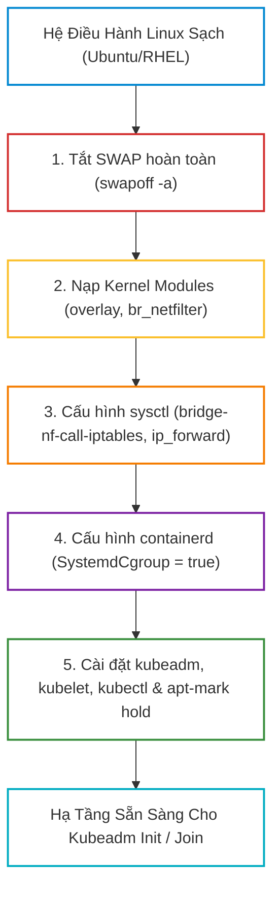
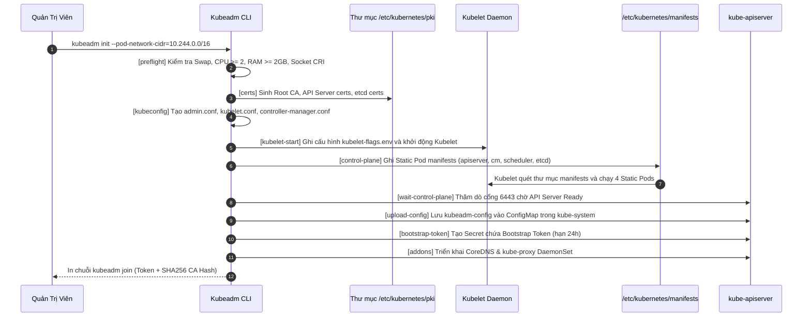
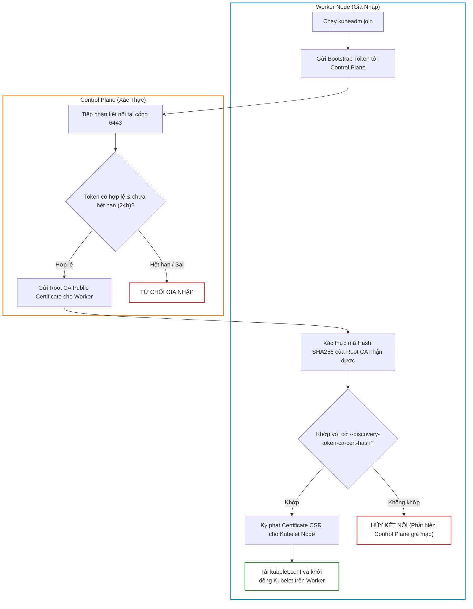
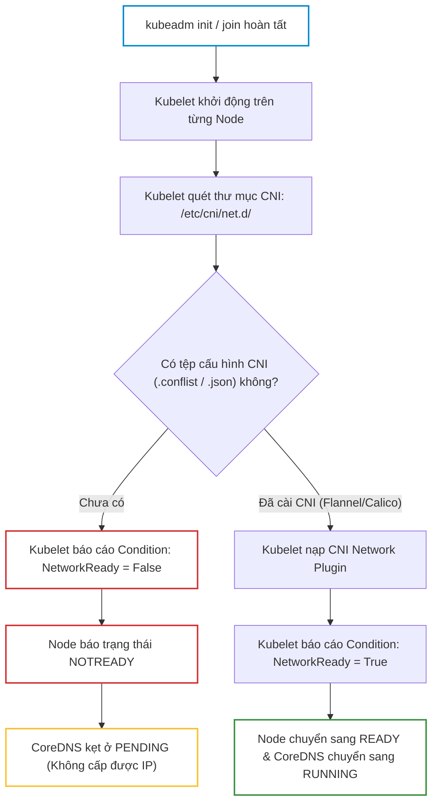
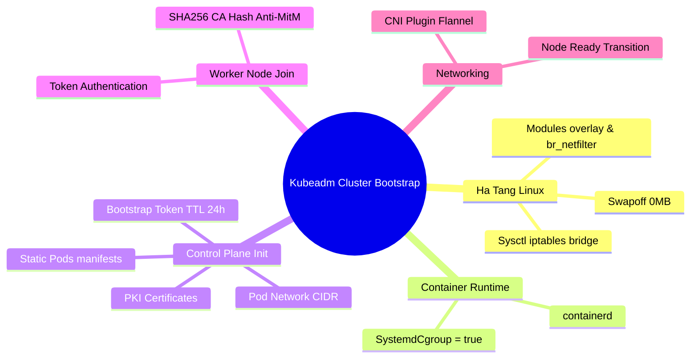


# [BÀI 06] TỰ DỰNG CỤM KUBERNETES ĐA NODE BẰNG KUBEADM: KHỞI TẠO CONTROL PLANE, JOIN WORKER & PREFLIGHT CHECKS

Việc sử dụng các dịch vụ Kubernetes được quản lý sẵn (Managed Kubernetes) như AWS EKS, Google GKE hay Azure AKS giúp đơn giản hóa việc khởi tạo hạ tầng. Tuy nhiên, để thực sự hiểu sâu sắc kiến trúc nội tại của Kubernetes và làm chủ các kỹ năng quản trị thực chiến trong kỳ thi **CKA (Certified Kubernetes Administrator)**, mọi kỹ sư bắt buộc phải có năng lực **tự tay xây dựng một cụm Kubernetes đa Node từ con số 0 bằng công cụ tiêu chuẩn `kubeadm`**.

Khởi tạo một cụm Kubernetes không đơn thuần là gõ một câu lệnh `kubeadm init`. Đó là một chuỗi các quyết định kỹ thuật từ tầng nhân Linux (Kernel Modules, Virtual Memory/Swap, iptables/sysctl), đồng bộ Cgroup Driver trên Container Runtime, sinh các cặp chứng chỉ TLS cho hệ thống PKI, cho đến thiết lập mạng Overlay CNI để liên kết các Node thành một thể thống nhất.

---

> [!IMPORTANT]
> **MỤC TIÊU KỸ THUẬT CỐT LÕI (TECHNICAL GOALS):**
> 1. **Chuẩn bị hạ tầng Linux chuẩn Production:** Thực hiện đúng 5 bước tiên quyết (Swapoff, `overlay`, `br_netfilter`, `sysctl` bridge iptables).
> 2. **Giải mã chuỗi nội bộ của `kubeadm init`:** Thấu hiểu các phase khởi tạo chứng chỉ, sinh Kubeconfig, tạo Static Pods và Bootstrap Token.
> 3. **Bảo mật luồng gia nhập Worker Node:** Cơ chế xác thực hai chiều giữa Worker và Control Plane qua Token và SHA256 CA Hash.
> 4. **Kích hoạt mạng cụm bằng CNI:** Giải thích bản chất vì sao Node luôn giữ trạng thái `NotReady` cho tới khi cài đặt CNI Plugin.
> 5. **Hands-on Lab 8 bước thực chiến:** Tự tay thiết lập cụm 3 Node, khoá phiên bản gói phần mềm và khắc phục sự cố kẹt Preflight Checks.

---

## 1. Bản Chất Kiến Trúc & Tư Duy Cốt Lõi: Tự Dựng Cụm Bằng Kubeadm

### 1.1. Năm Bước Chuẩn Bị Hạ Tầng Linux Bắt Buộc (Linux Preflight Prep)

Trước khi cài đặt bất kỳ thành phần Kubernetes nào, hệ điều hành Linux trên tất cả các Node (Control Plane lẫn Worker) phải được thiết lập theo các tiêu chuẩn kỹ thuật nghiêm ngặt:



#### 1. Tắt bộ nhớ hoán đổi (Swap Memory):
- **Bản chất kỹ thuật:** Kubelet được thiết kế để quản lý tài nguyên bộ nhớ với mức độ dự đoán chính xác tuyệt đối (Quality of Service - QoS classes: *Guaranteed*, *Burstable*, *BestEffort*). 
- **Hậu quả nếu bật Swap:** Nếu kernel Linux tự ý di chuyển các trang nhớ của container xuống đĩa cứng (Swap space), hiệu năng xử lý sẽ giảm sút nghiêm trọng (độ trễ tăng hàng nghìn lần), đồng thời thuật toán tính toán Out-Of-Memory (OOM) của Kubelet bị sai lệch hoàn toàn. Mặc định, `kubeadm` sẽ chặn tiến trình cài đặt nếu phát hiện Swap đang bật.
- **Thao tác:** Chạy `swapoff -a` và ghi chú (comment out) dòng swap trong `/etc/fstab`.

#### 2. Nạp các Kernel Modules (`overlay`, `br_netfilter`):
- **`overlay`:** Cung cấp cơ chế OverlayFS giúp Container Runtime (`containerd`) quản lý các lớp image phân tầng hiệu quả.
- **`br_netfilter`:** Bắt buộc phải có để các gói tin mạng đi qua các card mạng cầu nối (Linux bridge) được định tuyến và lọc qua bộ quy tắc `iptables` của nhân hệ điều hành.

#### 3. Cấu hình tham số nhân mạng qua `sysctl`:
- `net.bridge.bridge-nf-call-iptables = 1`: Đảm bảo các gói tin IPv4 đi qua bridge được xử lý bởi iptables (phục vụ Service ClusterIP và NetworkPolicy).
- `net.bridge.bridge-nf-call-ip6tables = 1`: Tương tự cho IPv6.
- `net.ipv4.ip_forward = 1`: Cho phép Linux chuyển tiếp các gói tin giữa các interface mạng (chuyển tiếp gói tin giữa Pod và mạng ngoài).

#### 4. Khóa phiên bản gói phần mềm (`apt-mark hold`):
- Khi cập nhật hệ điều hành qua `apt upgrade`, nếu không khóa phiên bản, `kubelet` hoặc `kubeadm` có thể tự ý nâng cấp lên phiên bản mới hơn, gây ra hiện tượng không tương thích API giữa Control Plane và Worker Node.

---

### 1.2. Giải Mã Chuỗi Các Phase Khởi Tạo Của `kubeadm init`

Khi lệnh `sudo kubeadm init --pod-network-cidr=10.244.0.0/16` được thực thi trên Control Plane, `kubeadm` tự động thực hiện một chuỗi các giai đoạn (phases) được thiết kế khép kín:



---

### 1.3. Cơ Chế Xác Thực Hai Chiều Trong `kubeadm join`

Lệnh `kubeadm join` thực hiện trên Worker Node là một quy trình bảo mật nghiêm ngặt nhằm đảm bảo không có Node giả mạo gia nhập cụm, đồng thời Worker Node không kết nối nhầm vào Control Plane giả mạo (chống tấn công Man-in-the-Middle - MitM):

```bash
sudo kubeadm join 192.168.1.10:6443 \
    --token abcdef.0123456789abcdef \
    --discovery-token-ca-cert-hash sha256:4a8b...64_hex_chars...
```



1. **Bootstrap Token (`abcdef.0123456789abcdef`):** Dùng để xác thực Worker Node với Control Plane. Token này có cấu trúc 6 ký tự `[a-z0-9]`, dấu chấm, và 16 ký tự `[a-z0-9]`. Mặc định token **hết hạn sau 24 giờ**.
2. **Discovery CA Cert Hash (`sha256:xxxx...`):** Dùng để Worker Node xác thực Control Plane. Worker Node băm (hash) chứng chỉ CA mà nó nhận được từ Control Plane và đối chiếu với mã hash cung cấp trong câu lệnh. Nếu trùng khớp, Worker mới tin tưởng đây là Control Plane hợp lệ.

---

### 1.4. Vì Sao Node Ở Trạng Thái `NotReady` Cho Đến Khi Cài Đặt CNI?

Sau khi hoàn tất `kubeadm init` và `kubeadm join`, khi gõ `kubectl get nodes`, toàn bộ các Node sẽ hiển thị trạng thái `NotReady`. Đồng thời, các Pod của `coredns` trong namespace `kube-system` sẽ kẹt ở trạng thái `Pending`.



- **Bản chất:** `kubeadm` chỉ dựng hạ tầng điều phối (Control Plane và Kubelet), nó **cố tình không tích hợp sẵn CNI Network Plugin** để người quản trị tự do lựa chọn giải pháp mạng phù hợp (Flannel, Calico, Cilium).
- **Cơ chế:** Kubelet liên tục thăm dò thư mục `/etc/cni/net.d/`. Chừng nào chưa có plugin CNI nào ghi tệp cấu hình mạng vào thư mục này, Kubelet sẽ ghi nhận `NetworkReady=false`, giữ Node ở trạng thái `NotReady` để ngăn không cho Scheduler gán Pod ứng dụng vào.
- Khi ta chạy `kubectl apply -f kube-flannel.yml`, Flannel DaemonSet sẽ chạy trên từng Node, tạo card mạng ảo `flannel.1`, ghi tệp cấu hình vào `/etc/cni/net.d/10-flannel.conflist`, và lập tức Node chuyển sang `Ready`.

---

## 2. Bảng Ma Trận So Sánh Kỹ Thuật Toàn Diện (Engineering Matrix)

### 2.1. Ma Trận Các Phương Pháp Triển Khai Kubernetes

| Phương pháp | Mức độ kiểm soát hạ tầng | Độ phức tạp cài đặt | Mục đích sử dụng tối ưu | Hỗ trợ trong kỳ thi CKA |
|---|---|---|---|---|
| **`kubeadm`** | **Rất cao** (Tự quản lý OS, Runtime, PKI, Static Pods) | **Trung bình** (Tự động hóa sinh certs & static pods) | **Môi trường Production On-Premise, Bare-metal, Chuẩn thi CKA** | **100% (Công cụ chuẩn của đề thi)** |
| **`Kubernetes The Hard Way`** | **Tuyệt đối** (Tự sinh từng cert bằng cfssl, cấu hình systemd từng service) | **Rất cao** (Làm thủ công từng bước) | Học tập nghiên cứu chuyên sâu về cấu trúc bên trong | Dùng để củng cố kiến thức nền tảng |
| **`k3s` / `MicroK8s`** | **Thấp - Trung bình** (Đóng gói all-in-one nhúng SQLite/etcd) | **Rất thấp** (1 câu lệnh cài đặt) | Edge Computing, IoT, CI/CD runners nhẹ | Không dùng trong bài thi CKA |
| **`kind` / `minikube`** | **Thấp** (Chạy các Node dưới dạng Docker container) | **Rất thấp** | Phát triển ứng dụng cục bộ trên laptop của Dev | Dùng để làm lab cá nhân |
| **Cloud Managed (EKS/GKE)** | **Thấp ở Control Plane** (Cloud Provider che giấu Master nodes) | **Thấp** | Doanh nghiệp ưu tiên giảm tải vận hành hạ tầng | Không thi các phần quản trị Master tầng sâu |

---

### 2.2. Ma Trận Các Cờ Khởi Tạo Cốt Lõi Của `kubeadm init`

| Tham số / Cờ CLI | Giá trị mẫu | Ý nghĩa kỹ thuật | Hậu quả nếu cấu hình sai |
|---|---|---|---|
| `--pod-network-cidr` | `10.244.0.0/16` (Flannel)<br/>`192.168.0.0/16` (Calico) | Xác định dải IP nội bộ cấp phát cho toàn bộ Pod trong cụm | CNI không khởi tạo được card mạng ảo; CoreDNS crashloop |
| `--apiserver-advertise-address` | `192.168.1.10` | Địa chỉ IP của card mạng mà API Server phơi ra cho Worker Node kết nối | Worker Node không thể join cụm do API Server lắng nghe nhầm interface nội bộ |
| `--control-plane-endpoint` | `k8s-api.domain.internal:6443` | Địa chỉ IP/DNS của Load Balancer khi triển khai cụm High Availability (HA) | Không thể mở rộng thêm nhiều Control Plane node trong tương lai |
| `--cri-socket` | `unix:///run/containerd/containerd.sock` | Đường dẫn socket giao tiếp với Container Runtime | Báo lỗi preflight nếu trên node cài đặt song song nhiều runtime |
| `--image-repository` | `registry.k8s.io` | Địa chỉ Container Registry để tải các ảnh tĩnh (etcd, apiserver, pause) | Cụm bị treo ở bước kéo ảnh nếu Node nằm trong mạng đóng (Air-gapped) |

---

## 3. Kiến Trúc Môi Trường & Luồng Thực Thi Mẫu

### 3.1. Tệp Cấu Hình Khởi Tạo Nâng Cao `kubeadm-config.yaml`

Thay vì truyền nhiều cờ CLI dài dòng, phương pháp chuẩn trong môi trường Production là sử dụng tệp khai báo `kubeadm-config.yaml`:

```yaml
apiVersion: kubeadm.k8s.io/v1beta3
kind: InitConfiguration
localAPIEndpoint:
  advertiseAddress: 192.168.1.10
  bindPort: 6443
nodeRegistration:
  criSocket: unix:///run/containerd/containerd.sock
  imagePullPolicy: IfNotPresent
  name: cp-01
  taints:
  - effect: NoSchedule
    key: node-role.kubernetes.io/control-plane
---
apiVersion: kubeadm.k8s.io/v1beta3
kind: ClusterConfiguration
kubernetesVersion: v1.35.0
clusterName: production-cluster
controlPlaneEndpoint: "192.168.1.10:6443"
networking:
  dnsDomain: cluster.local
  podSubnet: "10.244.0.0/16"
  serviceSubnet: "10.96.0.0/12"
apiServer:
  certSANs:
  - "192.168.1.10"
  - "k8s-master.domain.local"
  extraArgs:
    authorization-mode: "Node,RBAC"
```

Khởi tạo cụm bằng tệp cấu hình:
```bash
sudo kubeadm init --config kubeadm-config.yaml --upload-certs
```

---

## 4. Phân Tích Cạm Bẫy Thực Chiến: Kubeadm Init Treo & Lỗi Token Hết Hạn

### Tình Huống Sự Cố Thực Tế:
Một kỹ sư DevOps thực hiện cài đặt cụm Kubernetes trên 3 máy ảo Ubuntu 22.04. Sau khi chạy lệnh `kubeadm init`, tiến trình terminal bị treo vĩnh viễn ở thông báo:
`[wait-control-plane] Waiting for the kubelet to boot up the control plane as static Pods from directory "/etc/kubernetes/manifests"`. 
Sau 4 phút, câu lệnh kết thúc với mã lỗi timeout. 

Đồng thời, trên một cụm khác đã chạy 2 ngày, khi kỹ sư dùng lại câu lệnh `kubeadm join` cũ để bổ sung một Worker Node mới thì bị từ chối kết nối ngay từ bước Preflight check.

---

### Hậu Quả & Log Lỗi Thực Tế:
```text
[wait-control-plane] Waiting for the kubelet to boot up the control plane as static Pods from directory "/etc/kubernetes/manifests"
[wait-control-plane] This might take a minute or two, depending on the speed of your internet connection
[wait-control-plane] Control plane did not appear to be ready within 4m0s: timed out waiting for the condition
error execution phase wait-control-plane: couldn't initialize a Kubernetes cluster
```

Kiểm tra log của Kubelet bằng `journalctl -u kubelet -n 50 --no-pager` cho thấy nguyên nhân gốc:

```text
Sep 12 20:45:12 cp-01 kubelet[12450]: E0912 20:45:12.102345 12450 server.go:302] "Failed to run kubelet" err="failed to run Kubelet: misconfigured cgroup driver: kubelet cgroup driver: \"systemd\" is different from docker/runtime cgroup driver: \"cgroupfs\""
```

Đối với lỗi join Worker Node sau 2 ngày:

```text
error execution phase preflight: couldn't validate cluster token: token has expired or is invalid
```

---

### 5-Whys Root Cause Analysis:

1. **Tại sao `kubeadm init` bị timeout ở bước `[wait-control-plane]`?**
   - Vì API Server Static Pod không thể khởi động thành công trên cổng 6443 để phản hồi `kubeadm`.
2. **Tại sao API Server Static Pod không khởi động được?**
   - Vì tiến trình `kubelet` trên máy chủ bị sập liên tục (CrashLoop) nên không thể quét thư mục `/etc/kubernetes/manifests` để chạy các Static Pods.
3. **Tại sao Kubelet bị crash liên tục?**
   - Vì Kubelet phát hiện cấu hình Cgroup Driver nội bộ (`systemd`) không khớp với Cgroup Driver của containerd (`cgroupfs`).
4. **Tại sao containerd lại chạy `cgroupfs`?**
   - Vì tệp `/etc/containerd/config.toml` chưa được chỉnh sửa tham số `SystemdCgroup = true` trước khi khởi động dịch vụ.
5. **Tại sao lệnh `kubeadm join` bị lỗi token expired trên Worker Node?**
   - Vì Bootstrap Token do `kubeadm init` tạo ra có thời gian sống (TTL) mặc định là 24 giờ; sau 24h token sẽ tự động bị xóa khỏi cluster Secrets.

---

## 5. Hands-on Lab: Khởi Tạo Cụm Kubernetes 3 Node Bằng Kubeadm (8 Bước)

| Bước | Tên nhiệm vụ | Tiêu chí kỹ thuật hoàn thành |
|---|---|---|
| **Bước 1** | Tắt Swap & Cấu hình Kernel Modules trên tất cả các Node | `swapoff -a`, nạp `overlay` và `br_netfilter` thành công trên cả 3 Node. |
| **Bước 2** | Thiết lập thông số mạng `sysctl` cho iptables | Các tham số `bridge-nf-call-iptables` và `ip_forward` đạt giá trị `1`. |
| **Bước 3** | Cấu hình containerd `SystemdCgroup = true` & khởi động dịch vụ | Dịch vụ containerd đạt trạng thái `active (running)`. |
| **Bước 4** | Khóa phiên bản các gói `kubeadm`, `kubelet`, `kubectl` | Lệnh `apt-mark showhold` hiển thị đầy đủ cả 3 gói k8s. |
| **Bước 5** | Khởi tạo Control Plane Node bằng `kubeadm init` | `kubeadm init` hoàn tất, sinh tệp `/etc/kubernetes/admin.conf`. |
| **Bước 6** | Thiết lập Kubeconfig cho quản trị viên | `kubectl get nodes` truy cập thành công API Server (Node báo `NotReady`). |
| **Bước 7** | Gia nhập 2 Worker Node bằng `kubeadm join` | `kubectl get nodes` hiển thị đầy đủ 3 Node (1 Control Plane, 2 Workers). |
| **Bước 8** | Cài đặt Flannel CNI & Xác nhận cụm 100% `Ready` | Toàn bộ 3 Node và các Pods hệ thống chuyển sang trạng thái `Ready` / `Running`. |

---

### Bước 1: Tắt Swap & Cấu hình Kernel Modules trên tất cả các Node

Thực hiện đồng thời trên cả 3 máy chủ (`cp-01`, `worker-01`, `worker-02`):

```bash
# 1. Tắt swap ngay lập tức và vô hiệu hóa vĩnh viễn trong fstab
sudo swapoff -a
sudo sed -i '/ swap / s/^\(.*\)$/#\1/g' /etc/fstab

# 2. Khai báo nạp tự động 2 kernel modules khi khởi động hệ thống
cat << 'EOF' | sudo tee /etc/modules-load.d/k8s.conf
overlay
br_netfilter
EOF

# 3. Nạp ngay các module vào kernel hiện tại
sudo modprobe overlay
sudo modprobe br_netfilter

# 4. Kiểm tra module đã hoạt động
lsmod | grep -E "overlay|br_netfilter"
```

---

### Bước 2: Thiết lập thông số mạng `sysctl` cho iptables

```bash
# Cấu hình các tham số mạng chuyển tiếp gói tin
cat << 'EOF' | sudo tee /etc/sysctl.d/k8s.conf
net.bridge.bridge-nf-call-iptables  = 1
net.bridge.bridge-nf-call-ip6tables = 1
net.ipv4.ip_forward                 = 1
EOF

# Áp dụng cấu hình sysctl không cần khởi động lại máy
sudo sysctl --system
```

---

### Bước 3: Cấu hình containerd `SystemdCgroup = true` & Khởi động dịch vụ

```bash
# 1. Tạo tệp cấu hình mặc định của containerd
sudo mkdir -p /etc/containerd
sudo containerd config default | sudo tee /etc/containerd/config.toml > /dev/null

# 2. Sửa cờ SystemdCgroup thành true
sudo sed -i 's/SystemdCgroup = false/SystemdCgroup = true/g' /etc/containerd/config.toml

# 3. Khởi động lại và kích hoạt containerd tự chạy cùng OS
sudo systemctl restart containerd
sudo systemctl enable containerd
sudo systemctl is-active containerd
```

---

### Bước 4: Khóa phiên bản các gói `kubeadm`, `kubelet`, `kubectl`

```bash
# Khóa phiên bản để ngăn apt tự động nâng cấp làm lệch cụm
sudo apt-mark hold kubelet kubeadm kubectl

# Kiểm tra danh sách các gói đang bị khóa
apt-mark showhold
```

---

### Bước 5: Khởi tạo Control Plane Node bằng `kubeadm init`

Chỉ thực hiện trên Node Master (`cp-01`):

```bash
# Khởi tạo cụm với dải Pod CIDR chuẩn cho Flannel CNI
sudo kubeadm init \
  --pod-network-cidr=10.244.0.0/16 \
  --apiserver-advertise-address=192.168.1.10
```

---

### Bước 6: Thiết lập Kubeconfig cho quản trị viên

Thực hiện trên `cp-01` sau khi lệnh `kubeadm init` hoàn thành:

```bash
# Thiết lập cấu hình truy cập cho user hiện tại
mkdir -p $HOME/.kube
sudo cp -i /etc/kubernetes/admin.conf $HOME/.kube/config
sudo chown $(id -u):$(id -g) $HOME/.kube/config

# Kiểm tra trạng thái Control Plane ban đầu (Kỳ vọng: Node NotReady, CoreDNS Pending)
kubectl get nodes
kubectl get pods -n kube-system
```

---

### Bước 7: Gia nhập 2 Worker Node bằng `kubeadm join`

Trích xuất câu lệnh join từ `cp-01` và thực thi trên `worker-01`, `worker-02`:

```bash
# Trên cp-01: Nếu cần lấy lại câu lệnh join kèm token mới
kubeadm token create --print-join-command

# Trên worker-01 và worker-02: Chạy lệnh join với quyền sudo
sudo kubeadm join 192.168.1.10:6443 \
  --token <token-cua-ban> \
  --discovery-token-ca-cert-hash sha256:<hash-cua-ban>
```

---

### Bước 8: Cài đặt Flannel CNI & Xác nhận cụm 100% `Ready`

Thực hiện từ `cp-01`:

```bash
# 1. Triển khai Flannel CNI Overlay Network
kubectl apply -f https://github.com/flannel-io/flannel/releases/latest/download/kube-flannel.yml

# 2. Theo dõi các Node chuyển sang trạng thái Ready (sau khoảng 15-30 giây)
kubectl get nodes -o wide

# 3. Xác nhận toàn bộ Pods hệ thống trong kube-system và kube-flannel đều Running
kubectl get pods -A
```

---

## 6. 10 Câu Hỏi Tự Kiểm Tra Chuyên Sâu (Self-Check Q&A Accordion)

<details class="qa-card">
<summary class="qa-summary">
  <div class="qa-summary-left">
    <span class="qa-num-badge">Q01</span>
    <span>Tại sao Kubelet mặc định từ chối khởi động trên hệ thống Linux chưa tắt SWAP hoàn toàn?</span>
  </div>
  <span class="qa-chevron">
    <svg width="18" height="18" fill="none" stroke="currentColor" stroke-width="2.5" viewBox="0 0 24 24"><polyline points="6 9 12 15 18 9"></polyline></svg>
  </span>
</summary>
<div class="qa-answer">
  <div class="qa-answer-header">
    <svg width="14" height="14" fill="none" stroke="currentColor" stroke-width="2" viewBox="0 0 24 24"><path d="M22 11.08V12a10 10 0 1 1-5.93-9.14"></path><polyline points="22 4 12 14.01 9 11.01"></polyline></svg>
    <span>Phân Tích &amp; Lời Giải Kỹ Thuật</span>
  </div>
  <div style="margin: 0.35rem 0; padding-left: 1rem; border-left: 2px solid var(--accent-primary);">• <b>Nguyên lý cốt lõi:</b> Kubelet quản lý bộ nhớ dựa trên mô hình QoS phân cấp nghiêm ngặt. Nếu OS tự ý chuyển các trang RAM của container xuống ổ đĩa SWAP, độ trễ xử lý tăng vọt hàng ngàn lần và thuật toán OOM-killer của Kubelet bị sai lệch hoàn toàn.</div>
  <div style="margin: 0.35rem 0; padding-left: 1rem; border-left: 2px solid var(--accent-primary);">• <b>Cách xử lý:</b> Tắt swap tạm thời bằng <code>swapoff -a</code> và vô hiệu hóa vĩnh viễn trong <code>/etc/fstab</code>.</div>
  <div style="margin-top: 0.75rem;"><b style="color: var(--accent-primary);">Tiêu chí chấm điểm &amp; Phân tầng năng lực:</b></div>
  <div style="margin: 0.25rem 0; padding-left: 1rem; border-left: 2px solid var(--accent-primary);">• <b>0đ:</b> Không biết lý do hoặc cho rằng tắt swap để tiết kiệm dung lượng đĩa cứng.</div>
  <div style="margin: 0.25rem 0; padding-left: 1rem; border-left: 2px solid var(--accent-primary);">• <b>1đ:</b> Nêu được swap làm chậm hệ thống nhưng không giải thích được cơ chế QoS/OOM của Kubelet.</div>
  <div style="margin: 0.25rem 0; padding-left: 1rem; border-left: 2px solid var(--accent-primary);">• <b>2đ:</b> Giải thích chính xác nguyên lý QoS bộ nhớ và sự xung đột giữa Kubelet và Linux Swap.</div>
  <div style="margin: 0.25rem 0; padding-left: 1rem; border-left: 2px solid var(--accent-primary);">• <b>3đ:</b> Trả lời xuất sắc, nêu rõ cờ bỏ qua preflight check nếu dùng cờ <code>--fail-swap-on=false</code> (không khuyên dùng).</div>
  <div style="margin-top: 0.75rem; padding: 0.5rem 0.75rem; background: rgba(var(--accent-primary-rgb, 59, 130, 246), 0.08); border-radius: 4px;"><b style="color: var(--accent-primary);">Câu hỏi mở rộng:</b> Từ Kubernetes v1.28+, tính năng NodeSwap có được hỗ trợ thử nghiệm không? <i>(Đáp án: Có, qua Feature Gate NodeSwap nhưng yêu cầu cgroup v2 và cấu hình phức tạp).</i></div>
</div>
</details>

<details class="qa-card">
<summary class="qa-summary">
  <div class="qa-summary-left">
    <span class="qa-num-badge">Q02</span>
    <span>Hai kernel module nào bắt buộc phải nạp trước khi cài đặt mạng Kubernetes và vai trò của từng module là gì?</span>
  </div>
  <span class="qa-chevron">
    <svg width="18" height="18" fill="none" stroke="currentColor" stroke-width="2.5" viewBox="0 0 24 24"><polyline points="6 9 12 15 18 9"></polyline></svg>
  </span>
</summary>
<div class="qa-answer">
  <div class="qa-answer-header">
    <svg width="14" height="14" fill="none" stroke="currentColor" stroke-width="2" viewBox="0 0 24 24"><path d="M22 11.08V12a10 10 0 1 1-5.93-9.14"></path><polyline points="22 4 12 14.01 9 11.01"></polyline></svg>
    <span>Phân Tích &amp; Lời Giải Kỹ Thuật</span>
  </div>
  <div style="margin: 0.35rem 0; padding-left: 1rem; border-left: 2px solid var(--accent-primary);">• <b><code>overlay</code>:</b> Cho phép Container Runtime sử dụng OverlayFS để quản lý các lớp file phân tầng (image layers) của container.</div>
  <div style="margin: 0.35rem 0; padding-left: 1rem; border-left: 2px solid var(--accent-primary);">• <b><code>br_netfilter</code>:</b> Cho phép các gói tin mạng đi qua card mạng cầu nối (Linux bridge) được chuyển tiếp và xử lý bởi bộ lọc quy tắc <code>iptables</code> của nhân Linux.</div>
  <div style="margin-top: 0.75rem;"><b style="color: var(--accent-primary);">Tiêu chí chấm điểm &amp; Phân tầng năng lực:</b></div>
  <div style="margin: 0.25rem 0; padding-left: 1rem; border-left: 2px solid var(--accent-primary);">• <b>0đ:</b> Không nhớ tên hai module.</div>
  <div style="margin: 0.25rem 0; padding-left: 1rem; border-left: 2px solid var(--accent-primary);">• <b>1đ:</b> Kể tên được 2 module nhưng không giải thích được vai trò mạng bridge của br_netfilter.</div>
  <div style="margin: 0.25rem 0; padding-left: 1rem; border-left: 2px solid var(--accent-primary);">• <b>2đ:</b> Trình bày chuẩn xác vai trò OverlayFS và cơ chế lọc iptables của br_netfilter.</div>
  <div style="margin: 0.25rem 0; padding-left: 1rem; border-left: 2px solid var(--accent-primary);">• <b>3đ:</b> Trả lời xuất sắc, nêu cú pháp nạp tự động qua <code>/etc/modules-load.d/k8s.conf</code>.</div>
  <div style="margin-top: 0.75rem; padding: 0.5rem 0.75rem; background: rgba(var(--accent-primary-rgb, 59, 130, 246), 0.08); border-radius: 4px;"><b style="color: var(--accent-primary);">Câu hỏi mở rộng:</b> Nếu thiếu <code>br_netfilter</code>, tính năng nào của Kubernetes sẽ bị tê liệt? <i>(Đáp án: NetworkPolicy và việc điều hướng gói tin Service qua iptables sẽ không hoạt động đối với mạng bridge nội bộ).</i></div>
</div>
</details>

<details class="qa-card">
<summary class="qa-summary">
  <div class="qa-summary-left">
    <span class="qa-num-badge">Q03</span>
    <span>Ba tham số <code>sysctl</code> bắt buộc phải thiết lập trên các Node Kubernetes là gì?</span>
  </div>
  <span class="qa-chevron">
    <svg width="18" height="18" fill="none" stroke="currentColor" stroke-width="2.5" viewBox="0 0 24 24"><polyline points="6 9 12 15 18 9"></polyline></svg>
  </span>
</summary>
<div class="qa-answer">
  <div class="qa-answer-header">
    <svg width="14" height="14" fill="none" stroke="currentColor" stroke-width="2" viewBox="0 0 24 24"><path d="M22 11.08V12a10 10 0 1 1-5.93-9.14"></path><polyline points="22 4 12 14.01 9 11.01"></polyline></svg>
    <span>Phân Tích &amp; Lời Giải Kỹ Thuật</span>
  </div>
  <div style="margin: 0.35rem 0; padding-left: 1rem; border-left: 2px solid var(--accent-primary);">• <code>net.bridge.bridge-nf-call-iptables = 1</code>: Bật kiểm tra gói tin IPv4 đi qua bridge qua iptables.</div>
  <div style="margin: 0.35rem 0; padding-left: 1rem; border-left: 2px solid var(--accent-primary);">• <code>net.bridge.bridge-nf-call-ip6tables = 1</code>: Bật kiểm tra gói tin IPv6 đi qua bridge qua ip6tables.</div>
  <div style="margin: 0.35rem 0; padding-left: 1rem; border-left: 2px solid var(--accent-primary);">• <code>net.ipv4.ip_forward = 1</code>: Cho phép Linux kernel chuyển tiếp gói tin giữa các interface mạng khác nhau.</div>
  <div style="margin-top: 0.75rem;"><b style="color: var(--accent-primary);">Tiêu chí chấm điểm &amp; Phân tầng năng lực:</b></div>
  <div style="margin: 0.25rem 0; padding-left: 1rem; border-left: 2px solid var(--accent-primary);">• <b>0đ:</b> Không nêu được các tham số.</div>
  <div style="margin: 0.25rem 0; padding-left: 1rem; border-left: 2px solid var(--accent-primary);">• <b>1đ:</b> Nhớ được <code>ip_forward</code> nhưng quên hai tham số <code>bridge-nf-call</code>.</div>
  <div style="margin: 0.25rem 0; padding-left: 1rem; border-left: 2px solid var(--accent-primary);">• <b>2đ:</b> Liệt kê đầy đủ 3 tham số và gán giá trị bằng 1.</div>
  <div style="margin: 0.25rem 0; padding-left: 1rem; border-left: 2px solid var(--accent-primary);">• <b>3đ:</b> Trình bày xuất sắc, nêu tệp cấu hình <code>/etc/sysctl.d/k8s.conf</code> và lệnh áp dụng <code>sysctl --system</code>.</div>
  <div style="margin-top: 0.75rem; padding: 0.5rem 0.75rem; background: rgba(var(--accent-primary-rgb, 59, 130, 246), 0.08); border-radius: 4px;"><b style="color: var(--accent-primary);">Câu hỏi mở rộng:</b> Nếu <code>ip_forward = 0</code> thì Pod trên Node có gọi được ra ngoài Internet không? <i>(Đáp án: Không, gói tin từ dải Pod CIDR sẽ bị kernel chặn không cho chuyển tiếp ra card mạng vật lý eth0).</i></div>
</div>
</details>

<details class="qa-card">
<summary class="qa-summary">
  <div class="qa-summary-left">
    <span class="qa-num-badge">Q04</span>
    <span>Tại sao cần chạy lệnh <code>apt-mark hold kubelet kubeadm kubectl</code> trên toàn bộ các Node?</span>
  </div>
  <span class="qa-chevron">
    <svg width="18" height="18" fill="none" stroke="currentColor" stroke-width="2.5" viewBox="0 0 24 24"><polyline points="6 9 12 15 18 9"></polyline></svg>
  </span>
</summary>
<div class="qa-answer">
  <div class="qa-answer-header">
    <svg width="14" height="14" fill="none" stroke="currentColor" stroke-width="2" viewBox="0 0 24 24"><path d="M22 11.08V12a10 10 0 1 1-5.93-9.14"></path><polyline points="22 4 12 14.01 9 11.01"></polyline></svg>
    <span>Phân Tích &amp; Lời Giải Kỹ Thuật</span>
  </div>
  <div style="margin: 0.35rem 0; padding-left: 1rem; border-left: 2px solid var(--accent-primary);">• <b>Bản chất:</b> <code>apt-mark hold</code> đánh dấu khóa phiên bản gói trong trình quản lý gói của Ubuntu/Debian.</div>
  <div style="margin: 0.35rem 0; padding-left: 1rem; border-left: 2px solid var(--accent-primary);">• <b>Mục đích:</b> Ngăn chặn việc quản trị viên hoặc các tác vụ bảo trì tự động chạy <code>apt upgrade</code> vô tình nâng cấp Kubelet/Kubeadm lên phiên bản mới không theo kế hoạch, gây lệch phiên bản API (Skew Version) và phá vỡ tính ổn định của cụm.</div>
  <div style="margin-top: 0.75rem;"><b style="color: var(--accent-primary);">Tiêu chí chấm điểm &amp; Phân tầng năng lực:</b></div>
  <div style="margin: 0.25rem 0; padding-left: 1rem; border-left: 2px solid var(--accent-primary);">• <b>0đ:</b> Cho rằng lệnh này để kích hoạt dịch vụ chạy nền.</div>
  <div style="margin: 0.25rem 0; padding-left: 1rem; border-left: 2px solid var(--accent-primary);">• <b>1đ:</b> Biết là để khóa phiên bản nhưng không giải thích được rủi ro khi chạy <code>apt upgrade</code>.</div>
  <div style="margin: 0.25rem 0; padding-left: 1rem; border-left: 2px solid var(--accent-primary);">• <b>2đ:</b> Giải thích chính xác nguyên lý bảo vệ phiên bản và phòng ngừa sự cố lệch API Control Plane.</div>
  <div style="margin: 0.25rem 0; padding-left: 1rem; border-left: 2px solid var(--accent-primary);">• <b>3đ:</b> Trả lời xuất sắc, nêu cách mở khóa khi cần nâng cấp có chủ đích bằng lệnh <code>apt-mark unhold</code>.</div>
  <div style="margin-top: 0.75rem; padding: 0.5rem 0.75rem; background: rgba(var(--accent-primary-rgb, 59, 130, 246), 0.08); border-radius: 4px;"><b style="color: var(--accent-primary);">Câu hỏi mở rộng:</b> Trên RHEL / CentOS thì câu lệnh tương đương để khóa phiên bản là gì? <i>(Đáp án: Sử dụng plugin <code>yum versionlock</code>: <code>yum versionlock add kubelet kubeadm kubectl</code>).</i></div>
</div>
</details>

<details class="qa-card">
<summary class="qa-summary">
  <div class="qa-summary-left">
    <span class="qa-num-badge">Q05</span>
    <span>Dải IP khai báo trong cờ <code>--pod-network-cidr</code> có ý nghĩa gì đối với CNI Flannel?</span>
  </div>
  <span class="qa-chevron">
    <svg width="18" height="18" fill="none" stroke="currentColor" stroke-width="2.5" viewBox="0 0 24 24"><polyline points="6 9 12 15 18 9"></polyline></svg>
  </span>
</summary>
<div class="qa-answer">
  <div class="qa-answer-header">
    <svg width="14" height="14" fill="none" stroke="currentColor" stroke-width="2" viewBox="0 0 24 24"><path d="M22 11.08V12a10 10 0 1 1-5.93-9.14"></path><polyline points="22 4 12 14.01 9 11.01"></polyline></svg>
    <span>Phân Tích &amp; Lời Giải Kỹ Thuật</span>
  </div>
  <div style="margin: 0.35rem 0; padding-left: 1rem; border-left: 2px solid var(--accent-primary);">• Cờ <code>--pod-network-cidr</code> xác định không gian địa chỉ IP tổng thể được phân bổ cho tất cả các Pod trong cụm.</div>
  <div style="margin: 0.35rem 0; padding-left: 1rem; border-left: 2px solid var(--accent-primary);">• Đối với Flannel, cấu hình mặc định yêu cầu dải <b><code>10.244.0.0/16</code></b>. Khi khởi tạo, Kubernetes Controller Manager sẽ chia dải <code>/16</code> này thành các dải con <code>/24</code> (254 IP) gán riêng cho từng Worker Node (lưu trong trường <code>spec.podCIDR</code> của Node Object).</div>
  <div style="margin-top: 0.75rem;"><b style="color: var(--accent-primary);">Tiêu chí chấm điểm &amp; Phân tầng năng lực:</b></div>
  <div style="margin: 0.25rem 0; padding-left: 1rem; border-left: 2px solid var(--accent-primary);">• <b>0đ:</b> Nhầm lẫn giữa Pod CIDR và Service CIDR.</div>
  <div style="margin: 0.25rem 0; padding-left: 1rem; border-left: 2px solid var(--accent-primary);">• <b>1đ:</b> Nhớ được dải 10.244.0.0/16 nhưng không hiểu cơ chế chia subnet /24 cho từng Node.</div>
  <div style="margin: 0.25rem 0; padding-left: 1rem; border-left: 2px solid var(--accent-primary);">• <b>2đ:</b> Giải thích chính xác vai trò của Pod CIDR và mối quan hệ với Flannel CNI.</div>
  <div style="margin: 0.25rem 0; padding-left: 1rem; border-left: 2px solid var(--accent-primary);">• <b>3đ:</b> Trả lời xuất sắc, chỉ ra hậu quả nếu quên cờ này sẽ khiến Flannel DaemonSet bị CrashLoopBackOff.</div>
  <div style="margin-top: 0.75rem; padding: 0.5rem 0.75rem; background: rgba(var(--accent-primary-rgb, 59, 130, 246), 0.08); border-radius: 4px;"><b style="color: var(--accent-primary);">Câu hỏi mở rộng:</b> Dải CIDR mặc định của CNI Calico là bao nhiêu? <i>(Đáp án: Calico mặc định sử dụng <code>192.168.0.0/16</code>).</i></div>
</div>
</details>

<details class="qa-card">
<summary class="qa-summary">
  <div class="qa-summary-left">
    <span class="qa-num-badge">Q06</span>
    <span>Mã Bootstrap Token do <code>kubeadm init</code> tạo ra có thời hạn bao lâu? Làm thế nào để sinh lại câu lệnh join khi token hết hạn?</span>
  </div>
  <span class="qa-chevron">
    <svg width="18" height="18" fill="none" stroke="currentColor" stroke-width="2.5" viewBox="0 0 24 24"><polyline points="6 9 12 15 18 9"></polyline></svg>
  </span>
</summary>
<div class="qa-answer">
  <div class="qa-answer-header">
    <svg width="14" height="14" fill="none" stroke="currentColor" stroke-width="2" viewBox="0 0 24 24"><path d="M22 11.08V12a10 10 0 1 1-5.93-9.14"></path><polyline points="22 4 12 14.01 9 11.01"></polyline></svg>
    <span>Phân Tích &amp; Lời Giải Kỹ Thuật</span>
  </div>
  <div style="margin: 0.35rem 0; padding-left: 1rem; border-left: 2px solid var(--accent-primary);">• <b>Thời hạn:</b> Bootstrap Token có thời gian sống (TTL) mặc định chính xác là <b>24 giờ</b>.</div>
  <div style="margin: 0.35rem 0; padding-left: 1rem; border-left: 2px solid var(--accent-primary);">• <b>Lệnh sinh lại:</b> Chạy lệnh sau trên Control Plane Node: <code>kubeadm token create --print-join-command</code>. Lệnh này sẽ tạo token mới và in ra đầy đủ câu lệnh <code>kubeadm join</code> kèm token và CA hash.</div>
  <div style="margin-top: 0.75rem;"><b style="color: var(--accent-primary);">Tiêu chí chấm điểm &amp; Phân tầng năng lực:</b></div>
  <div style="margin: 0.25rem 0; padding-left: 1rem; border-left: 2px solid var(--accent-primary);">• <b>0đ:</b> Không nhớ thời hạn hoặc không biết lệnh sinh lại.</div>
  <div style="margin: 0.25rem 0; padding-left: 1rem; border-left: 2px solid var(--accent-primary);">• <b>1đ:</b> Nhớ được 24 giờ nhưng gõ sai cú pháp lệnh <code>kubeadm token</code>.</div>
  <div style="margin: 0.25rem 0; padding-left: 1rem; border-left: 2px solid var(--accent-primary);">• <b>2đ:</b> Nêu chính xác con số 24h và câu lệnh <code>kubeadm token create --print-join-command</code>.</div>
  <div style="margin: 0.25rem 0; padding-left: 1rem; border-left: 2px solid var(--accent-primary);">• <b>3đ:</b> Trả lời xuất sắc, giải thích thêm cách liệt kê token hiện có bằng <code>kubeadm token list</code>.</div>
  <div style="margin-top: 0.75rem; padding: 0.5rem 0.75rem; background: rgba(var(--accent-primary-rgb, 59, 130, 246), 0.08); border-radius: 4px;"><b style="color: var(--accent-primary);">Câu hỏi mở rộng:</b> Làm sao để tạo một Bootstrap Token vĩnh viễn không bao giờ hết hạn? <i>(Đáp án: Sử dụng cờ <code>--ttl 0</code>: <code>kubeadm token create --ttl 0</code>).</i></div>
</div>
</details>

<details class="qa-card">
<summary class="qa-summary">
  <div class="qa-summary-left">
    <span class="qa-num-badge">Q07</span>
    <span>Cờ <code>--discovery-token-ca-cert-hash</code> trong <code>kubeadm join</code> giải quyết bài toán an ninh nào?</span>
  </div>
  <span class="qa-chevron">
    <svg width="18" height="18" fill="none" stroke="currentColor" stroke-width="2.5" viewBox="0 0 24 24"><polyline points="6 9 12 15 18 9"></polyline></svg>
  </span>
</summary>
<div class="qa-answer">
  <div class="qa-answer-header">
    <svg width="14" height="14" fill="none" stroke="currentColor" stroke-width="2" viewBox="0 0 24 24"><path d="M22 11.08V12a10 10 0 1 1-5.93-9.14"></path><polyline points="22 4 12 14.01 9 11.01"></polyline></svg>
    <span>Phân Tích &amp; Lời Giải Kỹ Thuật</span>
  </div>
  <div style="margin: 0.35rem 0; padding-left: 1rem; border-left: 2px solid var(--accent-primary);">• <b>Mục đích:</b> Xác thực Root CA của Control Plane để chống lại tấn công giả mạo <b>Man-in-the-Middle (MitM)</b>.</div>
  <div style="margin: 0.35rem 0; padding-left: 1rem; border-left: 2px solid var(--accent-primary);">• <b>Cơ chế:</b> Khi Worker Node kết nối tới địa chỉ IP của Control Plane lần đầu tiên, Control Plane gửi về chứng chỉ Root CA. Worker Node tính toán mã băm SHA256 của chứng chỉ này và so sánh với giá trị trong cờ <code>--discovery-token-ca-cert-hash</code>. Nếu khớp, Worker mới xác nhận đang kết nối đúng cụm thật.</div>
  <div style="margin-top: 0.75rem;"><b style="color: var(--accent-primary);">Tiêu chí chấm điểm &amp; Phân tầng năng lực:</b></div>
  <div style="margin: 0.25rem 0; padding-left: 1rem; border-left: 2px solid var(--accent-primary);">• <b>0đ:</b> Nghĩ rằng cờ này dùng để mã hóa mật khẩu người dùng.</div>
  <div style="margin: 0.25rem 0; padding-left: 1rem; border-left: 2px solid var(--accent-primary);">• <b>1đ:</b> Biết là để bảo mật nhưng không giải thích được cơ chế kiểm tra Root CA.</div>
  <div style="margin: 0.25rem 0; padding-left: 1rem; border-left: 2px solid var(--accent-primary);">• <b>2đ:</b> Phân tích chính xác cơ chế đối chiếu mã hash SHA256 để chống tấn công MitM.</div>
  <div style="margin: 0.25rem 0; padding-left: 1rem; border-left: 2px solid var(--accent-primary);">• <b>3đ:</b> Trình bày xuất sắc, nêu lệnh openssl trích xuất SHA256 hash từ file <code>ca.crt</code> thủ công.</div>
  <div style="margin-top: 0.75rem; padding: 0.5rem 0.75rem; background: rgba(var(--accent-primary-rgb, 59, 130, 246), 0.08); border-radius: 4px;"><b style="color: var(--accent-primary);">Câu hỏi mở rộng:</b> Chuỗi hash SHA256 có độ dài bao nhiêu ký tự hex? <i>(Đáp án: 64 ký tự hex).</i></div>
</div>
</details>

<details class="qa-card">
<summary class="qa-summary">
  <div class="qa-summary-left">
    <span class="qa-num-badge">Q08</span>
    <span>Tại sao ngay sau khi chạy <code>kubeadm init</code> thành công, lệnh <code>kubectl get nodes</code> vẫn báo Node ở trạng thái <code>NotReady</code>?</span>
  </div>
  <span class="qa-chevron">
    <svg width="18" height="18" fill="none" stroke="currentColor" stroke-width="2.5" viewBox="0 0 24 24"><polyline points="6 9 12 15 18 9"></polyline></svg>
  </span>
</summary>
<div class="qa-answer">
  <div class="qa-answer-header">
    <svg width="14" height="14" fill="none" stroke="currentColor" stroke-width="2" viewBox="0 0 24 24"><path d="M22 11.08V12a10 10 0 1 1-5.93-9.14"></path><polyline points="22 4 12 14.01 9 11.01"></polyline></svg>
    <span>Phân Tích &amp; Lời Giải Kỹ Thuật</span>
  </div>
  <div style="margin: 0.35rem 0; padding-left: 1rem; border-left: 2px solid var(--accent-primary);">• <b>Lý do:</b> Vì cụm chưa được cài đặt <b>CNI Network Plugin</b> (như Flannel, Calico).</div>
  <div style="margin: 0.35rem 0; padding-left: 1rem; border-left: 2px solid var(--accent-primary);">• <b>Cơ chế ngầm:</b> Kubelet kiểm tra thư mục <code>/etc/cni/net.d/</code> để tìm tệp cấu hình mạng CNI. Khi chưa có plugin nào được cài, Kubelet báo cáo Condition <code>NetworkReady=false</code> về API Server, giữ Node ở trạng thái <code>NotReady</code> để ngăn chặn việc gán Pod ứng dụng.</div>
  <div style="margin-top: 0.75rem;"><b style="color: var(--accent-primary);">Tiêu chí chấm điểm &amp; Phân tầng năng lực:</b></div>
  <div style="margin: 0.25rem 0; padding-left: 1rem; border-left: 2px solid var(--accent-primary);">• <b>0đ:</b> Tưởng rằng cài đặt bị lỗi hoặc do thiếu RAM/CPU.</div>
  <div style="margin: 0.25rem 0; padding-left: 1rem; border-left: 2px solid var(--accent-primary);">• <b>1đ:</b> Trả lời do chưa cài mạng nhưng không nêu được cơ chế kiểm tra file trong <code>/etc/cni/net.d/</code>.</div>
  <div style="margin: 0.25rem 0; padding-left: 1rem; border-left: 2px solid var(--accent-primary);">• <b>2đ:</b> Phân tích chuẩn xác việc Kubelet thiếu CNI config và báo cáo <code>NetworkReady=false</code>.</div>
  <div style="margin: 0.25rem 0; padding-left: 1rem; border-left: 2px solid var(--accent-primary);">• <b>3đ:</b> Trả lời xuất sắc, chỉ ra thêm tình trạng Pod <code>coredns</code> kẹt ở <code>Pending</code> cùng thời điểm.</div>
  <div style="margin-top: 0.75rem; padding: 0.5rem 0.75rem; background: rgba(var(--accent-primary-rgb, 59, 130, 246), 0.08); border-radius: 4px;"><b style="color: var(--accent-primary);">Câu hỏi mở rộng:</b> Khi apply Flannel CNI, file cấu hình mạng nào được sinh ra trong <code>/etc/cni/net.d/</code>? <i>(Đáp án: File <code>10-flannel.conflist</code>).</i></div>
</div>
</details>

<details class="qa-card">
<summary class="qa-summary">
  <div class="qa-summary-left">
    <span class="qa-num-badge">Q09</span>
    <span>Bốn Static Pods cốt lõi nào của Control Plane được Kubelet khởi chạy tự động từ thư mục <code>/etc/kubernetes/manifests/</code>?</span>
  </div>
  <span class="qa-chevron">
    <svg width="18" height="18" fill="none" stroke="currentColor" stroke-width="2.5" viewBox="0 0 24 24"><polyline points="6 9 12 15 18 9"></polyline></svg>
  </span>
</summary>
<div class="qa-answer">
  <div class="qa-answer-header">
    <svg width="14" height="14" fill="none" stroke="currentColor" stroke-width="2" viewBox="0 0 24 24"><path d="M22 11.08V12a10 10 0 1 1-5.93-9.14"></path><polyline points="22 4 12 14.01 9 11.01"></polyline></svg>
    <span>Phân Tích &amp; Lời Giải Kỹ Thuật</span>
  </div>
  <div style="margin: 0.35rem 0; padding-left: 1rem; border-left: 2px solid var(--accent-primary);">• 1. <b><code>kube-apiserver.yaml</code>:</b> Cổng giao tiếp REST API của toàn bộ cụm.</div>
  <div style="margin: 0.35rem 0; padding-left: 1rem; border-left: 2px solid var(--accent-primary);">• 2. <b><code>etcd.yaml</code>:</b> Cơ sở dữ liệu phân tán lưu trữ trạng thái cụm.</div>
  <div style="margin: 0.35rem 0; padding-left: 1rem; border-left: 2px solid var(--accent-primary);">• 3. <b><code>kube-controller-manager.yaml</code>:</b> Chạy các bộ điều khiển điều hòa trạng thái (Node, Deployment, Endpoint).</div>
  <div style="margin: 0.35rem 0; padding-left: 1rem; border-left: 2px solid var(--accent-primary);">• 4. <b><code>kube-scheduler.yaml</code>:</b> Lập lịch phân bổ Pod vào các Worker Node phù hợp.</div>
  <div style="margin-top: 0.75rem;"><b style="color: var(--accent-primary);">Tiêu chí chấm điểm &amp; Phân tầng năng lực:</b></div>
  <div style="margin: 0.25rem 0; padding-left: 1rem; border-left: 2px solid var(--accent-primary);">• <b>0đ:</b> Không liệt kê đủ 4 thành phần hoặc kể nhầm CoreDNS/kube-proxy là static pods.</div>
  <div style="margin: 0.25rem 0; padding-left: 1rem; border-left: 2px solid var(--accent-primary);">• <b>1đ:</b> Liệt kê được 4 thành phần nhưng không nhớ đường dẫn thư mục manifests.</div>
  <div style="margin: 0.25rem 0; padding-left: 1rem; border-left: 2px solid var(--accent-primary);">• <b>2đ:</b> Liệt kê chính xác 4 static pods và đường dẫn <code>/etc/kubernetes/manifests/</code>.</div>
  <div style="margin: 0.25rem 0; padding-left: 1rem; border-left: 2px solid var(--accent-primary);">• <b>3đ:</b> Trả lời xuất sắc, phân biệt rõ Static Pods (do Kubelet chạy trực tiếp) với DaemonSets (kube-proxy do DaemonSet Controller quản lý).</div>
  <div style="margin-top: 0.75rem; padding: 0.5rem 0.75rem; background: rgba(var(--accent-primary-rgb, 59, 130, 246), 0.08); border-radius: 4px;"><b style="color: var(--accent-primary);">Câu hỏi mở rộng:</b> Muốn thay đổi tham số cấu hình của API Server sau khi dựng cụm thì sửa ở đâu? <i>(Đáp án: Sửa trực tiếp tệp manifest <code>/etc/kubernetes/manifests/kube-apiserver.yaml</code>, Kubelet sẽ tự động restart pod).</i></div>
</div>
</details>

<details class="qa-card">
<summary class="qa-summary">
  <div class="qa-summary-left">
    <span class="qa-num-badge">Q10</span>
    <span>Khi muốn xóa bỏ hoàn toàn cụm và làm sạch Node để khởi tạo lại từ đầu, quy trình lệnh chuẩn gồm những bước nào?</span>
  </div>
  <span class="qa-chevron">
    <svg width="18" height="18" fill="none" stroke="currentColor" stroke-width="2.5" viewBox="0 0 24 24"><polyline points="6 9 12 15 18 9"></polyline></svg>
  </span>
</summary>
<div class="qa-answer">
  <div class="qa-answer-header">
    <svg width="14" height="14" fill="none" stroke="currentColor" stroke-width="2" viewBox="0 0 24 24"><path d="M22 11.08V12a10 10 0 1 1-5.93-9.14"></path><polyline points="22 4 12 14.01 9 11.01"></polyline></svg>
    <span>Phân Tích &amp; Lời Giải Kỹ Thuật</span>
  </div>
  <div style="margin: 0.35rem 0; padding-left: 1rem; border-left: 2px solid var(--accent-primary);">• <b>Bước 1:</b> Chạy <code>sudo kubeadm reset -f</code> trên tất cả các Node để dọn sạch iptables rules, xóa Static Pod manifests và chứng chỉ tạm.</div>
  <div style="margin: 0.35rem 0; padding-left: 1rem; border-left: 2px solid var(--accent-primary);">• <b>Bước 2:</b> Dọn dẹp thư mục CNI và cấu hình mạng: <code>sudo rm -rf /etc/cni/net.d /var/lib/kubelet /var/lib/etcd ~/.kube</code>.</div>
  <div style="margin: 0.35rem 0; padding-left: 1rem; border-left: 2px solid var(--accent-primary);">• <b>Bước 3:</b> Xóa các card mạng ảo do CNI tạo ra: <code>sudo ip link delete cni0; sudo ip link delete flannel.1</code>.</div>
  <div style="margin: 0.35rem 0; padding-left: 1rem; border-left: 2px solid var(--accent-primary);">• <b>Bước 4:</b> Khởi động lại dịch vụ <code>containerd</code> và <code>kubelet</code> trước khi thực hiện <code>kubeadm init</code> lại.</div>
  <div style="margin-top: 0.75rem;"><b style="color: var(--accent-primary);">Tiêu chí chấm điểm &amp; Phân tầng năng lực:</b></div>
  <div style="margin: 0.25rem 0; padding-left: 1rem; border-left: 2px solid var(--accent-primary);">• <b>0đ:</b> Chỉ biết cài lại toàn bộ hệ điều hành.</div>
  <div style="margin: 0.25rem 0; padding-left: 1rem; border-left: 2px solid var(--accent-primary);">• <b>1đ:</b> Biết lệnh <code>kubeadm reset</code> nhưng quên dọn dẹp card mạng CNI và <code>/var/lib/etcd</code>.</div>
  <div style="margin: 0.25rem 0; padding-left: 1rem; border-left: 2px solid var(--accent-primary);">• <b>2đ:</b> Nêu chính xác quy trình <code>kubeadm reset</code> và xóa các thư mục cấu hình.</div>
  <div style="margin: 0.25rem 0; padding-left: 1rem; border-left: 2px solid var(--accent-primary);">• <b>3đ:</b> Trả lời hoàn hảo, chỉ ra cách xóa sạch card mạng ảo <code>cni0</code> và <code>flannel.1</code> để tránh xung đột IP.</div>
  <div style="margin-top: 0.75rem; padding: 0.5rem 0.75rem; background: rgba(var(--accent-primary-rgb, 59, 130, 246), 0.08); border-radius: 4px;"><b style="color: var(--accent-primary);">Câu hỏi mở rộng:</b> Nếu không xóa thư mục <code>/var/lib/etcd</code> thì khi init lại cụm sẽ gặp lỗi gì? <i>(Đáp án: Báo lỗi Preflight: <code>[ERROR DirAvailable--var-lib-etcd]: /var/lib/etcd is not empty</code>).</i></div>
</div>
</details>

---

## 7. Tổng Kết & Lộ Trình Bài Học Tiếp Theo



Làm chủ quy trình dựng cụm bằng `kubeadm` giúp kỹ sư thấu hiểu trọn vẹn mối liên kết giữa hệ điều hành Linux, Container Runtime và các dịch vụ cốt lõi của Kubernetes.

> [!TIP]
> **BÀI TIẾP THEO TRONG CHUỖI BÀI HỌC:**
> Tiếp tục hành trình nâng cao năng lực Kubernetes với bài học tiếp theo: [[Bài 07] Quản Trị Hệ Thống Chứng Chỉ PKI & Cấu Hình Kubeconfig Đa Cụm: Khởi Tạo User, TLS Rotation & Context Switching](cka-07-07-chung-chi-pki-va-kubeconfig.html).


