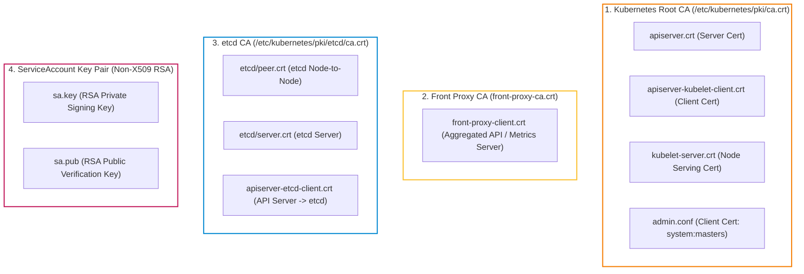
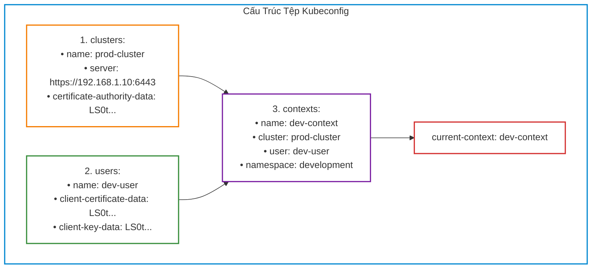
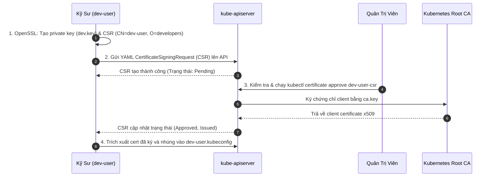
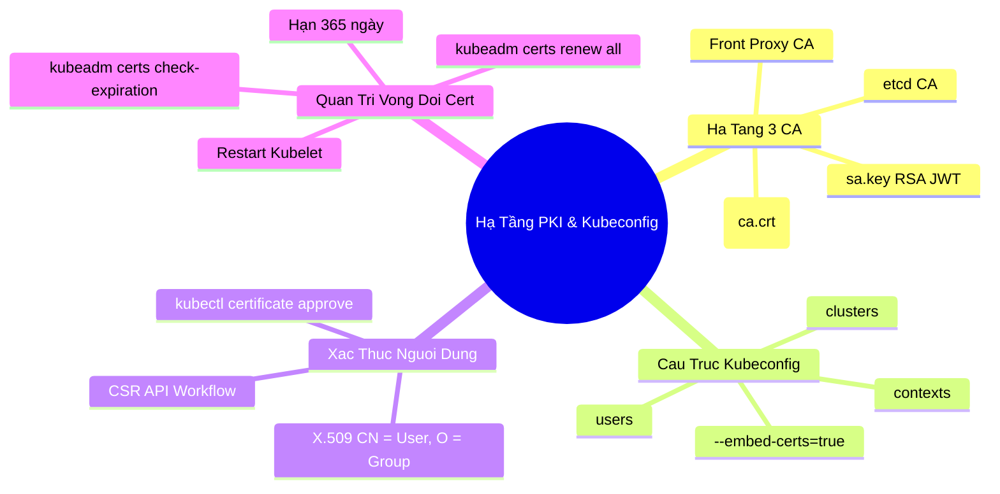


# [BÀI 07] HẠ TẦNG KHÓA CÔNG KHAI (PKI) & KUBECONFIG: QUẢN TRỊ CHỨNG CHỈ TLS, GIA HẠN & XÁC THỰC NGƯỜI DÙNG

Trong Kubernetes, bảo mật không phải là một lớp vỏ bọc bên ngoài mà được tích hợp sâu vào tận tế bào của hệ thống: **100% mọi giao tiếp giữa các thành phần nội bộ (API Server, etcd, Kubelet, Scheduler, Controller Manager) và người dùng đều bắt buộc phải được mã hóa và xác thực hai chiều qua mTLS (Mutual TLS)**.

Nền tảng của cơ chế này là **Hạ tầng khóa công khai (Public Key Infrastructure - PKI)** nằm trong thư mục `/etc/kubernetes/pki/` và tệp cấu hình kết nối **`kubeconfig`**. Đối với kỹ sư quản trị hệ thống và thí sinh thi chứng chỉ **CKA**, việc làm chủ cấu trúc 3 cây CA độc lập, hiểu rõ cách ánh xạ trường `CN`/`O` của chứng chỉ x509 sang danh tính người dùng qua **CSR API**, và thực hiện gia hạn chứng chỉ 1 năm mà không làm gián đoạn hệ thống chính là kỹ năng bắt buộc phải thành thạo.

---

> [!IMPORTANT]
> **MỤC TIÊU KỸ THUẬT CỐT LÕI (TECHNICAL GOALS):**
> 1. **Bản chất 3 cây CA độc lập:** Phân tích Root CA, Front Proxy CA, etcd CA và vai trò của cặp khóa RSA ServiceAccount (`sa.key`/`sa.pub`).
> 2. **Giải phẫu cấu trúc Kubeconfig:** Nắm vững mối liên kết `clusters + users -> contexts` và kỹ thuật nhúng base64 với `--embed-certs=true`.
> 3. **Cấp quyền người dùng bằng CSR API:** Thực hiện quy trình 4 bước tạo khóa OpenSSL, nộp `CertificateSigningRequest`, approve và xuất Kubeconfig.
> 4. **Xoay vòng & Gia hạn chứng chỉ 365 ngày:** Kiểm tra hạn sử dụng bằng `kubeadm certs check-expiration` và gia hạn bằng `kubeadm certs renew all`.
> 5. **Hands-on Lab 8 bước thực chiến:** Tự tay cấp tài khoản kỹ sư phát triển, duyệt CSR, cấu hình context và gia hạn chứng chỉ toàn cụm.

---

## 1. Bản Chất Kiến Trúc & Tư Duy Cốt Lõi: Hạ Tầng Khóa Công Khai (PKI) & Kubeconfig

### 1.1. Kiến Trúc 3 Cây CA Độc Lập Trong `/etc/kubernetes/pki/`

Nhằm cô lập rủi ro an ninh theo nguyên lý "Phòng thủ chiều sâu" (Defense in Depth), Kubernetes không dùng chung 1 Certificate Authority (CA) duy nhất mà tách thành **3 cây CA hoàn toàn độc lập**:



1. **Kubernetes Root CA (`ca.crt` & `ca.key`):**
   - Ký phát chứng chỉ Server cho `kube-apiserver` và các chứng chỉ Client cho `kube-controller-manager`, `kube-scheduler`, `kubelet` và tài khoản quản trị `admin.conf`.
   - Thời hạn sử dụng mặc định: **10 năm (3650 ngày)**.
   - **Mức độ nghiêm trọng:** Nếu lộ tệp `ca.key`, kẻ tấn công có thể tự ký chứng chỉ với quyền `system:masters` để chiếm toàn quyền kiểm soát cụm.

2. **Front Proxy CA (`front-proxy-ca.crt` & `front-proxy-ca.key`):**
   - Dùng riêng cho tính năng **API Aggregation Layer** (ví dụ khi cài đặt `metrics-server` hoặc custom API servers như Prometheus Adapter).
   - Cho phép API Server đóng vai trò proxy xác thực người dùng trước khi chuyển tiếp request tới Extension API Server.

3. **etcd CA (`etcd/ca.crt` & `etcd/ca.key`):**
   - Nằm riêng trong thư mục `/etc/kubernetes/pki/etcd/`.
   - Bảo vệ toàn bộ giao tiếp giữa các node etcd với nhau (Peer communication) và giữa `kube-apiserver` với cơ sở dữ liệu `etcd`.
   - **Tính cô lập:** Ngay cả khi Root CA của API Server bị tấn công, kẻ tấn công vẫn không thể đọc trực tiếp dữ liệu từ etcd nếu không có chứng chỉ do `etcd/ca.crt` ký.

4. **Cặp khóa ServiceAccount (`sa.key` & `sa.pub`):**
   - **Bản chất đặc biệt:** Đây **KHÔNG phải là chứng chỉ x509**. Đây là một cặp khóa RSA 2048-bit tiêu chuẩn.
   - `sa.key` (Private key) được Controller Manager dùng để ký chữ ký số vào các token JWT cấp phát cho ServiceAccount.
   - `sa.pub` (Public key) được `kube-apiserver` dùng để giải mã và xác thực token JWT khi Pod gửi request đến API.

---

### 1.2. Giải Mã Cấu Trúc Kubeconfig: Mối Ghép 3 Thành Phần

Tệp Kubeconfig (mặc định tại `~/.kube/config` hoặc `/etc/kubernetes/admin.conf`) được thiết kế theo cấu trúc module linh hoạt, bao gồm 3 mảng dữ liệu chính:



- **`clusters`:** Khai báo danh sách các cụm Kubernetes đích, bao gồm URL của API Server và chứng chỉ Root CA (`certificate-authority-data`) để client xác thực server.
- **`users`:** Khai báo danh tính và thông tin chứng thực (Client Certificate, Client Private Key hoặc Token).
- **`contexts`:** Là **chiếc cầu nối** kết hợp 1 Cluster cụ thể + 1 User cụ thể + 1 Namespace mặc định thành một môi trường làm việc độc lập.
- **`current-context`:** Con trỏ chỉ định ngữ cảnh nào đang được kích hoạt khi gõ lệnh `kubectl`.

> [!WARNING]
> **CẠM BẪY ĐƯỜNG DẪN TỆP TRONG KUBECONFIG:**
> Nếu cấu hình Kubeconfig sử dụng đường dẫn tệp (`client-certificate: /tmp/user.crt`), khi copy tệp Kubeconfig sang laptop hoặc máy chủ khác, đường dẫn sẽ bị gãy và `kubectl` báo lỗi `unable to read client-cert`. Luôn sử dụng cờ **`--embed-certs=true`** để nhúng trực tiếp dữ liệu dạng chuỗi Base64 (`client-certificate-data`).

---

### 1.3. Cơ Chế Xác Thực Người Dùng: X.509 Client Cert & CSR API

Một sự thật kiến trúc quan trọng: **Kubernetes hoàn toàn không có đối tượng API `User` hay `Group` lưu trữ trong cơ sở dữ liệu etcd**.

Khi một người dùng gửi request đến API Server kèm Client Certificate:
1. API Server giải mã chứng chỉ bằng Root CA (`ca.crt`).
2. API Server trích xuất trường **Common Name (`CN`)** làm **Username**.
3. API Server trích xuất tất cả các trường **Organization (`O`)** làm danh sách các **Groups**.
4. Các trường này sau đó được chuyển tiếp sang bộ máy phân quyền RBAC (Role-Based Access Control) để kiểm tra quyền hạn.



---

### 1.4. Quản Lý Vòng Đời Chứng Chỉ: Kiểm Tra & Gia Hạn Bằng `kubeadm certs`

Tất cả các chứng chỉ lá (Leaf certificates) của Control Plane do `kubeadm` tạo ra đều có thời hạn sử dụng chính xác là **1 năm (365 ngày)**.

- **Kiểm tra thời hạn:** Sử dụng lệnh `sudo kubeadm certs check-expiration` để liệt kê danh sách toàn bộ chứng chỉ và số ngày còn lại (Residual Time).
- **Gia hạn chứng chỉ:** Sử dụng lệnh `sudo kubeadm certs renew all`.
- **Cơ chế nạp chứng chỉ trong RAM:** Lệnh `kubeadm certs renew` chỉ ghi đè tệp chứng chỉ mới trên đĩa cứng. Tiến trình `kubelet`, `kube-apiserver` và `containerd` đang chạy trong bộ nhớ RAM vẫn giữ chứng chỉ cũ. Do đó, **bắt buộc phải restart `kubelet` và `containerd`** ngay sau khi gia hạn để các tiến trình nạp chứng chỉ mới vào bộ nhớ.

---

## 2. Bảng Ma Trận So Sánh Kỹ Thuật Toàn Diện (Engineering Matrix)

### 2.1. Ma Trận 3 Cây CA Trong Thư Mục `/etc/kubernetes/pki/`

| Tên Cây CA | Tệp Chứng Chỉ / Khóa | Mục đích bảo vệ | Thời hạn mặc định | Thành phần sử dụng |
|---|---|---|---|---|
| **Root CA** | `ca.crt`<br/>`ca.key` | Bảo vệ toàn bộ giao tiếp nội bộ Control Plane và Kubelet | **10 năm (3650 ngày)** | API Server, Kubelet, Controller Manager, Scheduler |
| **Front Proxy CA** | `front-proxy-ca.crt`<br/>`front-proxy-ca.key` | Bảo vệ Aggregated API Layers (Extension API) | **10 năm (3650 ngày)** | API Server front-proxy client, Metrics Server |
| **etcd CA** | `etcd/ca.crt`<br/>`etcd/ca.key` | Bảo vệ lưu trữ dữ liệu etcd nội bộ và peer cluster | **10 năm (3650 ngày)** | Các node etcd, `apiserver-etcd-client` |
| **ServiceAccount Key** | `sa.key`<br/>`sa.pub` | Ký và xác thực chữ ký số JWT cho ServiceAccount Tokens | Không có hạn (Cặp khóa RSA) | Controller Manager (ký), API Server (xác thực) |

---

### 2.2. Ma Trận So Sánh Các Cơ Chế Xác Thực Người Dùng (Authentication Mechanisms)

| Phương thức xác thực | Loại đối tượng | Khả năng thu hồi (Revocation) | Ưu điểm cốt lõi | Trường hợp sử dụng tối ưu |
|---|---|---|---|---|
| **X.509 Client Cert** | File Cert / Key | Khó khăn (Không hỗ trợ CRL/OCSP trực tiếp) | Không phụ thuộc hệ thống ngoài, bảo mật cao | **Quản trị viên hạ tầng, kỹ sư nội bộ, chuẩn thi CKA** |
| **ServiceAccount Token** | K8s Secret / JWT | Dễ dàng (Xóa hoặc xoay vòng Token) | Tự động gắn vào Pod, tích hợp sẵn K8s | **Ứng dụng chạy trong Pod, CI/CD pipelines** |
| **OIDC (OpenID Connect)** | External ID Token | Tức thì (Quản lý tại IdP như Keycloak, Okta) | Quản lý người dùng tập trung, hỗ trợ SSO/MFA | **Doanh nghiệp quy mô lớn, nhiều đội ngũ phát triển** |
| **Webhook Token Auth** | Remote HTTP Verify | Tức thì (Xử lý tại Webhook Backend) | Tùy biến logic xác thực linh hoạt | Tích hợp hệ thống phân quyền nội bộ riêng biệt |

---

## 3. Kiến Trúc Môi Trường & Luồng Thực Thi Mẫu

### 3.1. Cấu Hình Mẫu `CertificateSigningRequest` Chuẩn

Khi tạo User mới bằng CSR API, đối tượng YAML gửi lên API Server có cấu trúc chuẩn như sau:

```yaml
apiVersion: certificates.k8s.io/v1
kind: CertificateSigningRequest
metadata:
  name: dev-user-csr
spec:
  request: LS0tLS1CRUdJTiBDRVJUSUZJQ0FURS... # Chuỗi CSR mã hóa Base64
  signerName: kubernetes.io/kube-apiserver-client
  expirationSeconds: 864000 # Thời hạn 10 ngày (tuỳ chọn)
  usages:
  - client auth
```

> [!NOTE]
> **Ý NGHĨA SIGNER NAME:**
> Tham số `signerName: kubernetes.io/kube-apiserver-client` chỉ định rằng chứng chỉ sau khi ký sẽ được sử dụng để xác thực Client kết nối tới `kube-apiserver`.

---

## 4. Phân Tích Cạm Bẫy Thực Chiến: Chứng Chỉ Hết Hạn 365 Ngày & Lỗi Gãy Đường Dẫn Kubeconfig

### Tình Huống Sự Cố Thực Tế:
Một cụm Kubernetes Production hoạt động ổn định liên tục trong 1 năm đột ngột tê liệt vào lúc nửa đêm. Mọi lệnh `kubectl` từ máy quản trị viên đều thất bại. Các ứng dụng đang chạy bên trong cụm vẫn phản hồi request người dùng, nhưng toàn bộ hệ thống giám sát Prometheus, tác vụ CI/CD và Kubelet đều báo lỗi mất kết nối tới API Server. 

Đồng thời, một kỹ sư mới gia nhập đội ngũ được gửi tệp `dev.kubeconfig`, nhưng khi chạy `kubectl get pods` trên máy cá nhân thì nhận được thông báo lỗi không tìm thấy tệp chứng chỉ.

---

### Hậu Quả & Log Lỗi Thực Tế:
Lệnh `kubectl` từ chối kết nối do chứng chỉ TLS của Control Plane đã hết hạn 365 ngày:

```text
Unable to connect to the server: x509: certificate has expired or is not yet valid: current time 2026-09-12T20:30:00Z is after 2026-09-11T20:30:00Z
```

Kiểm tra log của API Server trên Control Plane:

```text
E0912 20:30:15.112049 1 server.go:285] "Failed to serve HTTPS" err="tls: failed to verify client certificate: x509: certificate has expired or is not yet valid"
```

Đối với lỗi Kubeconfig của kỹ sư mới:

```text
error: unable to read client-cert /tmp/dev-user.crt for dev-user due to open /tmp/dev-user.crt: no such file or directory
```

---

### 5-Whys Root Cause Analysis:

1. **Tại sao lệnh `kubectl` bị từ chối kết nối TLS Handshake?**
   - Vì chứng chỉ máy chủ `apiserver.crt` và chứng chỉ client của quản trị viên đã vượt quá thời hạn 365 ngày.
2. **Tại sao chứng chỉ bị hết hạn mà không được tự động làm mới?**
   - Vì `kubeadm` chỉ cấp chứng chỉ tĩnh có hạn đúng 1 năm khi chạy `kubeadm init`, không tự động gia hạn nếu quản trị viên không thiết lập quy trình bảo trì.
3. **Tại sao Kubelet trên Worker Node cũng bị mất kết nối tới API Server?**
   - Vì chứng chỉ client của Kubelet (`/etc/kubernetes/kubelet.conf`) cũng bị hết hạn cùng thời điểm.
4. **Tại sao kỹ sư mới không dùng được file Kubeconfig được bàn giao?**
   - Vì tệp Kubeconfig được tạo bằng đường dẫn tuyệt đối cục bộ thay vì nhúng dữ liệu chứng chỉ bằng cờ `--embed-certs=true`.
5. **Root Cause cốt lõi là gì?**
   - Thiếu quy trình giám sát ngày hết hạn chứng chỉ bằng `kubeadm certs check-expiration` trong hệ thống Alerting, và thiếu chuẩn hóa quy trình xuất file Kubeconfig di động.

---

## 5. Hands-on Lab: Quản Trị Chứng Chỉ PKI, Cấp User Mới & Gia Hạn Cert Bằng Kubeadm (8 Bước)

| Bước | Tên nhiệm vụ | Tiêu chí kỹ thuật hoàn thành |
|---|---|---|
| **Bước 1** | Khảo sát thư mục `/etc/kubernetes/pki/` & 3 cây CA | Xác minh đầy đủ các tệp `ca.crt`, `front-proxy-ca.crt`, `etcd/ca.crt` và `sa.key`. |
| **Bước 2** | Kiểm tra thông số x509 của Root CA & API Server | Đọc thông tin Issuer, Subject, Validity bằng OpenSSL. |
| **Bước 3** | Tạo cặp khóa OpenSSL & CSR cho kỹ sư `dev-user` | File `dev-user.csr` chứa đúng `CN=dev-user` và `O=developers`. |
| **Bước 4** | Nộp đối tượng API `CertificateSigningRequest` | Đối tượng CSR xuất hiện trên cụm ở trạng thái `Pending`. |
| **Bước 5** | Phê duyệt CSR & Trích xuất Client Certificate | Chạy `kubectl certificate approve`, lấy về file `dev-user.crt`. |
| **Bước 6** | Tạo file Kubeconfig di động với `--embed-certs=true` | Tệp `dev-user.kubeconfig` chứa dữ liệu `client-certificate-data` dạng Base64. |
| **Bước 7** | Kiểm tra hạn chứng chỉ bằng `kubeadm certs` | Liệt kê bảng thời hạn chứng chỉ còn lại của cụm. |
| **Bước 8** | Thực hiện gia hạn toàn bộ chứng chỉ & Restart Kubelet | Lệnh `kubeadm certs renew all` thành công, cụm hoạt động 100% bình thường. |

---

### Bước 1: Khảo sát thư mục `/etc/kubernetes/pki/` & 3 cây CA

Thực hiện trên Control Plane Node (`cp-01`):

```bash
# 1. Liệt kê toàn bộ chứng chỉ và khóa trong thư mục PKI
sudo ls -la /etc/kubernetes/pki/

# 2. Liệt kê chứng chỉ riêng biệt của etcd
sudo ls -la /etc/kubernetes/pki/etcd/

# 3. Kiểm tra phân quyền các tệp khóa riêng tư (Kỳ vọng: 0600 - chỉ root đọc được)
sudo stat -c "%a %n" /etc/kubernetes/pki/*.key
```

---

### Bước 2: Kiểm tra thông số x509 của Root CA & API Server

```bash
# 1. Xem thông tin thời hạn của Root CA (Thời hạn: 10 năm)
sudo openssl x509 -in /etc/kubernetes/pki/ca.crt -noout -dates -issuer -subject

# 2. Xem thông tin Subject Alternative Names (SANs) của API Server
sudo openssl x509 -in /etc/kubernetes/pki/apiserver.crt -noout -text | grep -A 2 "Subject Alternative Name"
```

---

### Bước 3: Tạo cặp khóa OpenSSL & CSR cho kỹ sư `dev-user`

```bash
# 1. Tạo thư mục làm việc tạm
mkdir -p /tmp/dev-pki && cd /tmp/dev-pki

# 2. Tạo khóa riêng RSA 2048-bit cho dev-user
openssl genrsa -out dev-user.key 2048

# 3. Tạo Certificate Signing Request (CSR) với CN=dev-user và O=developers
openssl req -new -key dev-user.key -out dev-user.csr -subj "/CN=dev-user/O=developers"
```

---

### Bước 4: Nộp đối tượng API `CertificateSigningRequest`

```bash
# 1. Mã hóa nội dung tệp CSR thành chuỗi Base64
CSR_BASE64=$(cat dev-user.csr | base64 | tr -d '\n')

# 2. Tạo đối tượng CertificateSigningRequest trên cụm
cat << EOF | kubectl apply -f -
apiVersion: certificates.k8s.io/v1
kind: CertificateSigningRequest
metadata:
  name: dev-user-csr
spec:
  request: $CSR_BASE64
  signerName: kubernetes.io/kube-apiserver-client
  expirationSeconds: 864000
  usages:
  - client auth
EOF

# 3. Kiểm tra trạng thái CSR (Kỳ vọng: Pending)
kubectl get csr dev-user-csr
```

---

### Bước 5: Phê duyệt CSR & Trích xuất Client Certificate

```bash
# 1. Administrator tiến hành phê duyệt CSR
kubectl certificate approve dev-user-csr

# 2. Kiểm tra trạng thái CSR đã chuyển sang Approved, Issued
kubectl get csr dev-user-csr

# 3. Trích xuất Client Certificate đã ký và giải mã Base64
kubectl get csr dev-user-csr -o jsonpath='{.status.certificate}' | base64 -d > dev-user.crt

# 4. Kiểm tra thông tin chứng chỉ vừa được cấp
openssl x509 -in dev-user.crt -noout -subject -dates
```

---

### Bước 6: Tạo file Kubeconfig di động với `--embed-certs=true`

```bash
# 1. Lấy thông tin URL API Server và Certificate Authority từ cụm hiện tại
API_SERVER=$(kubectl config view --raw -o jsonpath='{.clusters[0].cluster.server}')
kubectl config view --raw -o jsonpath='{.clusters[0].cluster.certificate-authority-data}' | base64 -d > ca.crt

# 2. Thiết lập Cluster trong file Kubeconfig mới
kubectl config set-cluster production-cluster \
  --server="$API_SERVER" \
  --certificate-authority=ca.crt \
  --embed-certs=true \
  --kubeconfig=dev-user.kubeconfig

# 3. Thiết lập User Credentials nhúng trực tiếp chứng chỉ và khóa
kubectl config set-credentials dev-user \
  --client-certificate=dev-user.crt \
  --client-key=dev-user.key \
  --embed-certs=true \
  --kubeconfig=dev-user.kubeconfig

# 4. Thiết lập Context ghép nối Cluster + User + Default Namespace
kubectl config set-context dev-context \
  --cluster=production-cluster \
  --user=dev-user \
  --namespace=default \
  --kubeconfig=dev-user.kubeconfig

# 5. Kích hoạt Context mặc định
kubectl config use-context dev-context --kubeconfig=dev-user.kubeconfig

# 6. Kiểm tra nội dung Kubeconfig hoàn chỉnh
cat dev-user.kubeconfig
```

---

### Bước 7: Kiểm tra hạn chứng chỉ bằng `kubeadm certs`

Thực hiện trên Control Plane Node:

```bash
# Kiểm tra thời hạn còn lại của toàn bộ chứng chỉ trong cụm
sudo kubeadm certs check-expiration
```

---

### Bước 8: Thực hiện gia hạn toàn bộ chứng chỉ & Restart Kubelet

```bash
# 1. Gia hạn toàn bộ chứng chỉ thêm 1 năm (365 ngày)
sudo kubeadm certs renew all

# 2. Khởi động lại dịch vụ Kubelet và containerd để nạp chứng chỉ mới vào RAM
sudo systemctl restart containerd kubelet

# 3. Kiểm tra lại thời hạn chứng chỉ đã được gia hạn thành công
sudo kubeadm certs check-expiration

# 4. Xác nhận cụm Kubernetes vẫn phản hồi bình thường
kubectl get nodes -o wide
```

---

## 6. 10 Câu Hỏi Tự Kiểm Tra Chuyên Sâu (Self-Check Q&A Accordion)

<details class="qa-card">
<summary class="qa-summary">
  <div class="qa-summary-left">
    <span class="qa-num-badge">Q01</span>
    <span>Thư mục <code>/etc/kubernetes/pki/</code> chứa mấy cây CA độc lập và tên các tệp CA đó là gì?</span>
  </div>
  <span class="qa-chevron">
    <svg width="18" height="18" fill="none" stroke="currentColor" stroke-width="2.5" viewBox="0 0 24 24"><polyline points="6 9 12 15 18 9"></polyline></svg>
  </span>
</summary>
<div class="qa-answer">
  <div class="qa-answer-header">
    <svg width="14" height="14" fill="none" stroke="currentColor" stroke-width="2" viewBox="0 0 24 24"><path d="M22 11.08V12a10 10 0 1 1-5.93-9.14"></path><polyline points="22 4 12 14.01 9 11.01"></polyline></svg>
    <span>Phân Tích &amp; Lời Giải Kỹ Thuật</span>
  </div>
  <div style="margin: 0.35rem 0; padding-left: 1rem; border-left: 2px solid var(--accent-primary);">• Thư mục PKI chứa <b>3 cây CA hoàn toàn độc lập</b>:</div>
  <div style="margin: 0.35rem 0; padding-left: 1rem; border-left: 2px solid var(--accent-primary);">  1. <b>Kubernetes Root CA:</b> <code>ca.crt</code> &amp; <code>ca.key</code> (Ký phát chứng chỉ cho API Server, Kubelet, Admin).</div>
  <div style="margin: 0.35rem 0; padding-left: 1rem; border-left: 2px solid var(--accent-primary);">  2. <b>Front Proxy CA:</b> <code>front-proxy-ca.crt</code> &amp; <code>front-proxy-ca.key</code> (Dùng cho Aggregated API Server như Metrics Server).</div>
  <div style="margin: 0.35rem 0; padding-left: 1rem; border-left: 2px solid var(--accent-primary);">  3. <b>etcd CA:</b> <code>etcd/ca.crt</code> &amp; <code>etcd/ca.key</code> (Bảo vệ lưu trữ cơ sở dữ liệu etcd).</div>
  <div style="margin-top: 0.75rem;"><b style="color: var(--accent-primary);">Tiêu chí chấm điểm &amp; Phân tầng năng lực:</b></div>
  <div style="margin: 0.25rem 0; padding-left: 1rem; border-left: 2px solid var(--accent-primary);">• <b>0đ:</b> Cho rằng cụm chỉ có 1 CA duy nhất.</div>
  <div style="margin: 0.25rem 0; padding-left: 1rem; border-left: 2px solid var(--accent-primary);">• <b>1đ:</b> Nêu được Root CA và etcd CA nhưng quên Front Proxy CA.</div>
  <div style="margin: 0.25rem 0; padding-left: 1rem; border-left: 2px solid var(--accent-primary);">• <b>2đ:</b> Liệt kê chính xác cả 3 cây CA và đường dẫn tệp tương ứng.</div>
  <div style="margin: 0.25rem 0; padding-left: 1rem; border-left: 2px solid var(--accent-primary);">• <b>3đ:</b> Trả lời xuất sắc, phân tích nguyên lý phân tách để cô lập bề mặt tấn công giữa API và etcd.</div>
  <div style="margin-top: 0.75rem; padding: 0.5rem 0.75rem; background: rgba(var(--accent-primary-rgb, 59, 130, 246), 0.08); border-radius: 4px;"><b style="color: var(--accent-primary);">Câu hỏi mở rộng:</b> Thời hạn sử dụng mặc định của các chứng chỉ Root CA này là bao lâu? <i>(Đáp án: 10 năm - 3650 ngày).</i></div>
</div>
</details>

<details class="qa-card">
<summary class="qa-summary">
  <div class="qa-summary-left">
    <span class="qa-num-badge">Q02</span>
    <span>Cặp khóa <code>sa.key</code> và <code>sa.pub</code> phục vụ mục đích gì và có phải chứng chỉ x509 không?</span>
  </div>
  <span class="qa-chevron">
    <svg width="18" height="18" fill="none" stroke="currentColor" stroke-width="2.5" viewBox="0 0 24 24"><polyline points="6 9 12 15 18 9"></polyline></svg>
  </span>
</summary>
<div class="qa-answer">
  <div class="qa-answer-header">
    <svg width="14" height="14" fill="none" stroke="currentColor" stroke-width="2" viewBox="0 0 24 24"><path d="M22 11.08V12a10 10 0 1 1-5.93-9.14"></path><polyline points="22 4 12 14.01 9 11.01"></polyline></svg>
    <span>Phân Tích &amp; Lời Giải Kỹ Thuật</span>
  </div>
  <div style="margin: 0.35rem 0; padding-left: 1rem; border-left: 2px solid var(--accent-primary);">• <b>Bản chất:</b> Cặp khóa <code>sa.key/sa.pub</code> <b>KHÔNG phải là chứng chỉ x509</b> (không có CA ký, không có Subject/Issuer). Đây là cặp khóa RSA tiêu chuẩn.</div>
  <div style="margin: 0.35rem 0; padding-left: 1rem; border-left: 2px solid var(--accent-primary);">• <b>Mục đích:</b> Được ServiceAccount Token Controller sử dụng để ký chữ ký số vào các token JWT cấp phát cho ServiceAccount (qua <code>sa.key</code>), và API Server sử dụng <code>sa.pub</code> để giải mã, xác thực tính hợp lệ của token khi Pod gửi request.</div>
  <div style="margin-top: 0.75rem;"><b style="color: var(--accent-primary);">Tiêu chí chấm điểm &amp; Phân tầng năng lực:</b></div>
  <div style="margin: 0.25rem 0; padding-left: 1rem; border-left: 2px solid var(--accent-primary);">• <b>0đ:</b> Nghĩ rằng sa.key là chứng chỉ TLS cho Pod.</div>
  <div style="margin: 0.25rem 0; padding-left: 1rem; border-left: 2px solid var(--accent-primary);">• <b>1đ:</b> Biết dùng cho ServiceAccount nhưng nhầm lẫn là chứng chỉ x509.</div>
  <div style="margin: 0.25rem 0; padding-left: 1rem; border-left: 2px solid var(--accent-primary);">• <b>2đ:</b> Giải thích chính xác vai trò ký/xác thực JWT của cặp khóa RSA.</div>
  <div style="margin: 0.25rem 0; padding-left: 1rem; border-left: 2px solid var(--accent-primary);">• <b>3đ:</b> Trình bày xuất sắc, phân tích cơ chế Bound ServiceAccount Token trong các phiên bản Kubernetes mới.</div>
  <div style="margin-top: 0.75rem; padding: 0.5rem 0.75rem; background: rgba(var(--accent-primary-rgb, 59, 130, 246), 0.08); border-radius: 4px;"><b style="color: var(--accent-primary);">Câu hỏi mở rộng:</b> Lệnh OpenSSL nào dùng để kiểm tra tính hợp lệ của tệp <code>sa.key</code>? <i>(Đáp án: <code>openssl rsa -in /etc/kubernetes/pki/sa.key -check -noout</code>).</i></div>
</div>
</details>

<details class="qa-card">
<summary class="qa-summary">
  <div class="qa-summary-left">
    <span class="qa-num-badge">Q03</span>
    <span>Trình bày 3 mảng dữ liệu chính cấu thành nên tệp Kubeconfig và ý nghĩa của từng mảng.</span>
  </div>
  <span class="qa-chevron">
    <svg width="18" height="18" fill="none" stroke="currentColor" stroke-width="2.5" viewBox="0 0 24 24"><polyline points="6 9 12 15 18 9"></polyline></svg>
  </span>
</summary>
<div class="qa-answer">
  <div class="qa-answer-header">
    <svg width="14" height="14" fill="none" stroke="currentColor" stroke-width="2" viewBox="0 0 24 24"><path d="M22 11.08V12a10 10 0 1 1-5.93-9.14"></path><polyline points="22 4 12 14.01 9 11.01"></polyline></svg>
    <span>Phân Tích &amp; Lời Giải Kỹ Thuật</span>
  </div>
  <div style="margin: 0.35rem 0; padding-left: 1rem; border-left: 2px solid var(--accent-primary);">• 1. <b><code>clusters</code>:</b> Khai báo danh sách các cụm Kubernetes đích (URL Endpoint và CA Certificate Data).</div>
  <div style="margin: 0.35rem 0; padding-left: 1rem; border-left: 2px solid var(--accent-primary);">• 2. <b><code>users</code>:</b> Khai báo thông tin danh tính và dữ liệu chứng thực của người dùng (Client Certificate Data, Client Key Data hoặc Bearer Token).</div>
  <div style="margin: 0.35rem 0; padding-left: 1rem; border-left: 2px solid var(--accent-primary);">• 3. <b><code>contexts</code>:</b> Mối ghép nối liên kết 1 Cluster cụ thể + 1 User cụ thể + 1 Namespace mặc định thành một ngữ cảnh làm việc.</div>
  <div style="margin-top: 0.75rem;"><b style="color: var(--accent-primary);">Tiêu chí chấm điểm &amp; Phân tầng năng lực:</b></div>
  <div style="margin: 0.25rem 0; padding-left: 1rem; border-left: 2px solid var(--accent-primary);">• <b>0đ:</b> Không kể tên được 3 phần.</div>
  <div style="margin: 0.25rem 0; padding-left: 1rem; border-left: 2px solid var(--accent-primary);">• <b>1đ:</b> Kể được tên nhưng không giải thích được vai trò ghép nối của contexts.</div>
  <div style="margin: 0.25rem 0; padding-left: 1rem; border-left: 2px solid var(--accent-primary);">• <b>2đ:</b> Trình bày chuẩn xác 3 mảng và tham số con trỏ <code>current-context</code>.</div>
  <div style="margin: 0.25rem 0; padding-left: 1rem; border-left: 2px solid var(--accent-primary);">• <b>3đ:</b> Trả lời xuất sắc, giải thích cách quản lý đa cụm (Multi-cluster) bằng 1 tệp Kubeconfig duy nhất.</div>
  <div style="margin-top: 0.75rem; padding: 0.5rem 0.75rem; background: rgba(var(--accent-primary-rgb, 59, 130, 246), 0.08); border-radius: 4px;"><b style="color: var(--accent-primary);">Câu hỏi mở rộng:</b> Làm sao để chuyển đổi nhanh sang context có tên <code>prod-ctx</code>? <i>(Đáp án: <code>kubectl config use-context prod-ctx</code>).</i></div>
</div>
</details>

<details class="qa-card">
<summary class="qa-summary">
  <div class="qa-summary-left">
    <span class="qa-num-badge">Q04</span>
    <span>Tại sao khi xuất file Kubeconfig di động bắt buộc phải sử dụng cờ <code>--embed-certs=true</code>?</span>
  </div>
  <span class="qa-chevron">
    <svg width="18" height="18" fill="none" stroke="currentColor" stroke-width="2.5" viewBox="0 0 24 24"><polyline points="6 9 12 15 18 9"></polyline></svg>
  </span>
</summary>
<div class="qa-answer">
  <div class="qa-answer-header">
    <svg width="14" height="14" fill="none" stroke="currentColor" stroke-width="2" viewBox="0 0 24 24"><path d="M22 11.08V12a10 10 0 1 1-5.93-9.14"></path><polyline points="22 4 12 14.01 9 11.01"></polyline></svg>
    <span>Phân Tích &amp; Lời Giải Kỹ Thuật</span>
  </div>
  <div style="margin: 0.35rem 0; padding-left: 1rem; border-left: 2px solid var(--accent-primary);">• Mặc định nếu không có cờ này, <code>kubectl config</code> chỉ ghi đường dẫn tệp cục bộ (ví dụ <code>client-certificate: /tmp/dev.crt</code>) vào Kubeconfig.</div>
  <div style="margin: 0.35rem 0; padding-left: 1rem; border-left: 2px solid var(--accent-primary);">• Khi chuyển tệp Kubeconfig sang máy khác hoặc máy cá nhân của kỹ sư, đường dẫn file cert cũ sẽ không tồn tại, khiến <code>kubectl</code> báo lỗi không đọc được cert.</div>
  <div style="margin: 0.35rem 0; padding-left: 1rem; border-left: 2px solid var(--accent-primary);">• Cờ <code>--embed-certs=true</code> tự động chuyển toàn bộ nội dung tệp cert và key thành chuỗi mã hóa <b>Base64 nhúng trực tiếp</b> vào các trường <code>client-certificate-data</code> và <code>client-key-data</code>, giúp tệp Kubeconfig hoàn toàn độc lập và di động.</div>
  <div style="margin-top: 0.75rem;"><b style="color: var(--accent-primary);">Tiêu chí chấm điểm &amp; Phân tầng năng lực:</b></div>
  <div style="margin: 0.25rem 0; padding-left: 1rem; border-left: 2px solid var(--accent-primary);">• <b>0đ:</b> Không hiểu tác dụng của cờ --embed-certs.</div>
  <div style="margin: 0.25rem 0; padding-left: 1rem; border-left: 2px solid var(--accent-primary);">• <b>1đ:</b> Biết là để nhúng dữ liệu nhưng không giải thích được sự cố gãy đường dẫn file cert.</div>
  <div style="margin: 0.25rem 0; padding-left: 1rem; border-left: 2px solid var(--accent-primary);">• <b>2đ:</b> Phân tích chính xác việc chuyển đổi sang base64 data và tính di động của Kubeconfig.</div>
  <div style="margin: 0.25rem 0; padding-left: 1rem; border-left: 2px solid var(--accent-primary);">• <b>3đ:</b> Trả lời xuất sắc, minh họa bằng cú pháp lệnh <code>kubectl config set-credentials</code>.</div>
  <div style="margin-top: 0.75rem; padding: 0.5rem 0.75rem; background: rgba(var(--accent-primary-rgb, 59, 130, 246), 0.08); border-radius: 4px;"><b style="color: var(--accent-primary);">Câu hỏi mở rộng:</b> Tên trường trong Kubeconfig khi nhúng CA cert là gì? <i>(Đáp án: <code>certificate-authority-data</code>).</i></div>
</div>
</details>

<details class="qa-card">
<summary class="qa-summary">
  <div class="qa-summary-left">
    <span class="qa-num-badge">Q05</span>
    <span>Kubernetes ánh xạ các trường thông tin nào trong chứng chỉ X.509 Client Certificate thành Username và Group để phân quyền RBAC?</span>
  </div>
  <span class="qa-chevron">
    <svg width="18" height="18" fill="none" stroke="currentColor" stroke-width="2.5" viewBox="0 0 24 24"><polyline points="6 9 12 15 18 9"></polyline></svg>
  </span>
</summary>
<div class="qa-answer">
  <div class="qa-answer-header">
    <svg width="14" height="14" fill="none" stroke="currentColor" stroke-width="2" viewBox="0 0 24 24"><path d="M22 11.08V12a10 10 0 1 1-5.93-9.14"></path><polyline points="22 4 12 14.01 9 11.01"></polyline></svg>
    <span>Phân Tích &amp; Lời Giải Kỹ Thuật</span>
  </div>
  <div style="margin: 0.35rem 0; padding-left: 1rem; border-left: 2px solid var(--accent-primary);">• Trường <b>Common Name (<code>CN</code>)</b> trong Subject được ánh xạ thành <b>Username</b>.</div>
  <div style="margin: 0.35rem 0; padding-left: 1rem; border-left: 2px solid var(--accent-primary);">• Trường <b>Organization (<code>O</code>)</b> trong Subject được ánh xạ thành <b>Group</b>. (Nếu có nhiều trường <code>O</code>, người dùng sẽ thuộc nhiều Group tương ứng).</div>
  <div style="margin style="margin: 0.35rem 0; padding-left: 1rem; border-left: 2px solid var(--accent-primary);">• Ví dụ Subject: <code>/CN=john/O=developers/O=qa</code> &rarr; User: <code>john</code>, Groups: <code>[developers, qa]</code>.</div>
  <div style="margin-top: 0.75rem;"><b style="color: var(--accent-primary);">Tiêu chí chấm điểm &amp; Phân tầng năng lực:</b></div>
  <div style="margin: 0.25rem 0; padding-left: 1rem; border-left: 2px solid var(--accent-primary);">• <b>0đ:</b> Không nhớ các trường CN và O.</div>
  <div style="margin: 0.25rem 0; padding-left: 1rem; border-left: 2px solid var(--accent-primary);">• <b>1đ:</b> Nhớ CN là user nhưng quên vai trò của Organization.</div>
  <div style="margin: 0.25rem 0; padding-left: 1rem; border-left: 2px solid var(--accent-primary);">• <b>2đ:</b> Nêu chính xác CN = Username và O = Group.</div>
  <div style="margin: 0.25rem 0; padding-left: 1rem; border-left: 2px solid var(--accent-primary);">• <b>3đ:</b> Trình bày xuất sắc, liên hệ trực tiếp với cú pháp tạo CSR của OpenSSL <code>-subj "/CN=.../O=..."</code>.</div>
  <div style="margin-top: 0.75rem; padding: 0.5rem 0.75rem; background: rgba(var(--accent-primary-rgb, 59, 130, 246), 0.08); border-radius: 4px;"><b style="color: var(--accent-primary);">Câu hỏi mở rộng:</b> Nhóm đặc quyền tối cao mặc định trong Kubernetes gắn liền với chứng chỉ admin là gì? <i>(Đáp án: Group <code>system:masters</code>).</i></div>
</div>
</details>

<details class="qa-card">
<summary class="qa-summary">
  <div class="qa-summary-left">
    <span class="qa-num-badge">Q06</span>
    <span>Trình bày quy trình 4 bước chuẩn để cấp tài khoản User mới thông qua Kubernetes CSR API.</span>
  </div>
  <span class="qa-chevron">
    <svg width="18" height="18" fill="none" stroke="currentColor" stroke-width="2.5" viewBox="0 0 24 24"><polyline points="6 9 12 15 18 9"></polyline></svg>
  </span>
</summary>
<div class="qa-answer">
  <div class="qa-answer-header">
    <svg width="14" height="14" fill="none" stroke="currentColor" stroke-width="2" viewBox="0 0 24 24"><path d="M22 11.08V12a10 10 0 1 1-5.93-9.14"></path><polyline points="22 4 12 14.01 9 11.01"></polyline></svg>
    <span>Phân Tích &amp; Lời Giải Kỹ Thuật</span>
  </div>
  <div style="margin: 0.35rem 0; padding-left: 1rem; border-left: 2px solid var(--accent-primary);">• <b>Bước 1:</b> Kỹ sư dùng OpenSSL tạo Private Key và tệp CSR với <code>CN=username</code>, <code>O=group</code>.</div>
  <div style="margin: 0.35rem 0; padding-left: 1rem; border-left: 2px solid var(--accent-primary);">• <b>Bước 2:</b> Mã hóa Base64 tệp CSR và nộp đối tượng API <code>CertificateSigningRequest</code> lên Kubernetes.</div>
  <div style="margin: 0.35rem 0; padding-left: 1rem; border-left: 2px solid var(--accent-primary);">• <b>Bước 3:</b> Quản trị viên kiểm tra và duyệt yêu cầu bằng lệnh <code>kubectl certificate approve &lt;csr-name&gt;</code>.</div>
  <div style="margin: 0.35rem 0; padding-left: 1rem; border-left: 2px solid var(--accent-primary);">• <b>Bước 4:</b> Trích xuất Client Certificate đã ký từ trường <code>status.certificate</code> và tạo file Kubeconfig.</div>
  <div style="margin-top: 0.75rem;"><b style="color: var(--accent-primary);">Tiêu chí chấm điểm &amp; Phân tầng năng lực:</b></div>
  <div style="margin: 0.25rem 0; padding-left: 1rem; border-left: 2px solid var(--accent-primary);">• <b>0đ:</b> Không nắm được quy trình CSR API.</div>
  <div style="margin: 0.25rem 0; padding-left: 1rem; border-left: 2px solid var(--accent-primary);">• <b>1đ:</b> Nêu được việc tạo key và approve nhưng thiếu các bước trung gian.</div>
  <div style="margin: 0.25rem 0; padding-left: 1rem; border-left: 2px solid var(--accent-primary);">• <b>2đ:</b> Trình bày đầy đủ 4 bước logic của CSR API.</div>
  <div style="margin: 0.25rem 0; padding-left: 1rem; border-left: 2px solid var(--accent-primary);">• <b>3đ:</b> Trả lời xuất sắc, nêu rõ lợi ích bảo mật khi người dùng không cần tiếp xúc với <code>ca.key</code>.</div>
  <div style="margin-top: 0.75rem; padding: 0.5rem 0.75rem; background: rgba(var(--accent-primary-rgb, 59, 130, 246), 0.08); border-radius: 4px;"><b style="color: var(--accent-primary);">Câu hỏi mở rộng:</b> Tham số <code>signerName</code> chuẩn dùng để cấp chứng chỉ client cho API Server là gì? <i>(Đáp án: <code>kubernetes.io/kube-apiserver-client</code>).</i></div>
</div>
</details>

<details class="qa-card">
<summary class="qa-summary">
  <div class="qa-summary-left">
    <span class="qa-num-badge">Q07</span>
    <span>Lệnh nào dùng để kiểm tra thời hạn hết hạn của tất cả chứng chỉ Control Plane trong cụm Kubernetes?</span>
  </div>
  <span class="qa-chevron">
    <svg width="18" height="18" fill="none" stroke="currentColor" stroke-width="2.5" viewBox="0 0 24 24"><polyline points="6 9 12 15 18 9"></polyline></svg>
  </span>
</summary>
<div class="qa-answer">
  <div class="qa-answer-header">
    <svg width="14" height="14" fill="none" stroke="currentColor" stroke-width="2" viewBox="0 0 24 24"><path d="M22 11.08V12a10 10 0 1 1-5.93-9.14"></path><polyline points="22 4 12 14.01 9 11.01"></polyline></svg>
    <span>Phân Tích &amp; Lời Giải Kỹ Thuật</span>
  </div>
  <div style="margin: 0.35rem 0; padding-left: 1rem; border-left: 2px solid var(--accent-primary);">• Câu lệnh chuẩn: <code>sudo kubeadm certs check-expiration</code>.</div>
  <div style="margin: 0.35rem 0; padding-left: 1rem; border-left: 2px solid var(--accent-primary);">• Lệnh này quét toàn bộ các tệp chứng chỉ trong <code>/etc/kubernetes/pki/</code> và các tệp Kubeconfig trong <code>/etc/kubernetes/</code>, sau đó xuất ra bảng báo cáo chi tiết gồm: Tên chứng chỉ, Ngày hết hạn (Expires), Thời gian còn lại (Residual Time) và Cơ quan chứng thực (CA).</div>
  <div style="margin-top: 0.75rem;"><b style="color: var(--accent-primary);">Tiêu chí chấm điểm &amp; Phân tầng năng lực:</b></div>
  <div style="margin: 0.25rem 0; padding-left: 1rem; border-left: 2px solid var(--accent-primary);">• <b>0đ:</b> Không biết lệnh hoặc nhầm với kubectl.</div>
  <div style="margin: 0.25rem 0; padding-left: 1rem; border-left: 2px solid var(--accent-primary);">• <b>1đ:</b> Nhớ kubeadm nhưng gõ sai cú pháp subcommand.</div>
  <div style="margin: 0.25rem 0; padding-left: 1rem; border-left: 2px solid var(--accent-primary);">• <b>2đ:</b> Nêu chính xác cú pháp <code>kubeadm certs check-expiration</code>.</div>
  <div style="margin: 0.25rem 0; padding-left: 1rem; border-left: 2px solid var(--accent-primary);">• <b>3đ:</b> Trình bày xuất sắc, phân tích các cột thông tin trong bảng output của lệnh.</div>
  <div style="margin-top: 0.75rem; padding: 0.5rem 0.75rem; background: rgba(var(--accent-primary-rgb, 59, 130, 246), 0.08); border-radius: 4px;"><b style="color: var(--accent-primary);">Câu hỏi mở rộng:</b> Chứng chỉ nào trong cụm KHÔNG được quản lý bởi lệnh kubeadm certs? <i>(Đáp án: Chứng chỉ client của Kubelet trên Worker Node - được quản lý bởi cơ chế Kubelet TLS bootstrapping).</i></div>
</div>
</details>

<details class="qa-card">
<summary class="qa-summary">
  <div class="qa-summary-left">
    <span class="qa-num-badge">Q08</span>
    <span>Lệnh nào dùng để gia hạn toàn bộ chứng chỉ Control Plane và tại sao bắt buộc phải restart Kubelet sau đó?</span>
  </div>
  <span class="qa-chevron">
    <svg width="18" height="18" fill="none" stroke="currentColor" stroke-width="2.5" viewBox="0 0 24 24"><polyline points="6 9 12 15 18 9"></polyline></svg>
  </span>
</summary>
<div class="qa-answer">
  <div class="qa-answer-header">
    <svg width="14" height="14" fill="none" stroke="currentColor" stroke-width="2" viewBox="0 0 24 24"><path d="M22 11.08V12a10 10 0 1 1-5.93-9.14"></path><polyline points="22 4 12 14.01 9 11.01"></polyline></svg>
    <span>Phân Tích &amp; Lời Giải Kỹ Thuật</span>
  </div>
  <div style="margin: 0.35rem 0; padding-left: 1rem; border-left: 2px solid var(--accent-primary);">• <b>Lệnh gia hạn:</b> <code>sudo kubeadm certs renew all</code>.</div>
  <div style="margin: 0.35rem 0; padding-left: 1rem; border-left: 2px solid var(--accent-primary);">• <b>Lý do bắt buộc restart Kubelet:</b> Lệnh renew chỉ cập nhật tệp chứng chỉ mới trên đĩa cứng. Tiến trình Kubelet và các Static Pods (apiserver, etcd) đang chạy trong bộ nhớ RAM vẫn giữ nguyên các kết nối TLS cũ với chứng chỉ đã nạp trước đó. Restart dịch vụ sẽ buộc tiến trình đọc lại chứng chỉ mới từ đĩa cứng vào bộ nhớ RAM.</div>
  <div style="margin-top: 0.75rem;"><b style="color: var(--accent-primary);">Tiêu chí chấm điểm &amp; Phân tầng năng lực:</b></div>
  <div style="margin: 0.25rem 0; padding-left: 1rem; border-left: 2px solid var(--accent-primary);">• <b>0đ:</b> Không biết lệnh hoặc cho rằng Kubelet tự động cập nhật ngay lập tức mà không cần restart.</div>
  <div style="margin: 0.25rem 0; padding-left: 1rem; border-left: 2px solid var(--accent-primary);">• <b>1đ:</b> Nêu được lệnh renew nhưng không giải thích được cơ chế RAM/Disk của Kubelet.</div>
  <div style="margin: 0.25rem 0; padding-left: 1rem; border-left: 2px solid var(--accent-primary);">• <b>2đ:</b> Trình bày chính xác câu lệnh và lý do cần nạp lại chứng chỉ vào RAM.</div>
  <div style="margin: 0.25rem 0; padding-left: 1rem; border-left: 2px solid var(--accent-primary);">• <b>3đ:</b> Trả lời hoàn hảo, nêu thêm việc cập nhật lại tệp <code>~/.kube/config</code> của user sau khi renew <code>admin.conf</code>.</div>
  <div style="margin-top: 0.75rem; padding: 0.5rem 0.75rem; background: rgba(var(--accent-primary-rgb, 59, 130, 246), 0.08); border-radius: 4px;"><b style="color: var(--accent-primary);">Câu hỏi mở rộng:</b> Có thể gia hạn riêng một chứng chỉ đơn lẻ (ví dụ chỉ apiserver) được không? <i>(Đáp án: Được, bằng lệnh <code>sudo kubeadm certs renew apiserver</code>).</i></div>
</div>
</details>

<details class="qa-card">
<summary class="qa-summary">
  <div class="qa-summary-left">
    <span class="qa-num-badge">Q09</span>
    <span>Tại sao trong môi trường Production, tuyệt đối không được cấp phát tệp <code>admin.conf</code> cho các kỹ sư phát triển?</span>
  </div>
  <span class="qa-chevron">
    <svg width="18" height="18" fill="none" stroke="currentColor" stroke-width="2.5" viewBox="0 0 24 24"><polyline points="6 9 12 15 18 9"></polyline></svg>
  </span>
</summary>
<div class="qa-answer">
  <div class="qa-answer-header">
    <svg width="14" height="14" fill="none" stroke="currentColor" stroke-width="2" viewBox="0 0 24 24"><path d="M22 11.08V12a10 10 0 1 1-5.93-9.14"></path><polyline points="22 4 12 14.01 9 11.01"></polyline></svg>
    <span>Phân Tích &amp; Lời Giải Kỹ Thuật</span>
  </div>
  <div style="margin: 0.35rem 0; padding-left: 1rem; border-left: 2px solid var(--accent-primary);">• Tệp <code>admin.conf</code> chứa chứng chỉ Client Certificate có Subject: <code>/CN=kubernetes-admin/O=system:masters</code>.</div>
  <div style="margin: 0.35rem 0; padding-left: 1rem; border-left: 2px solid var(--accent-primary);">• Trong cơ chế RBAC của Kubernetes, nhóm <b><code>system:masters</code></b> được hardcode liên kết với ClusterRole <code>cluster-admin</code>, có quyền năng tối cao tuyệt đối (Superuser) trên mọi tài nguyên, bỏ qua mọi chính sách giới hạn và không thể bị thu hồi quyền bằng RoleBinding.</div>
  <div style="margin: 0.35rem 0; padding-left: 1rem; border-left: 2px solid var(--accent-primary);">• Chia sẻ tệp này vi phạm nghiêm trọng nguyên tắc đặc quyền tối thiểu (Principle of Least Privilege) và tạo ra lỗ hổng bảo mật nghiêm trọng.</div>
  <div style="margin-top: 0.75rem;"><b style="color: var(--accent-primary);">Tiêu chí chấm điểm &amp; Phân tầng năng lực:</b></div>
  <div style="margin: 0.25rem 0; padding-left: 1rem; border-left: 2px solid var(--accent-primary);">• <b>0đ:</b> Cho rằng chia sẻ admin.conf là bình thường.</div>
  <div style="margin: 0.25rem 0; padding-left: 1rem; border-left: 2px solid var(--accent-primary);">• <b>1đ:</b> Biết là có nhiều quyền nhưng không chỉ ra được nhóm <code>system:masters</code>.</div>
  <div style="margin: 0.25rem 0; padding-left: 1rem; border-left: 2px solid var(--accent-primary);">• <b>2đ:</b> Phân tích chuẩn xác quyền lực của group <code>system:masters</code> và vi phạm Least Privilege.</div>
  <div style="margin: 0.25rem 0; padding-left: 1rem; border-left: 2px solid var(--accent-primary);">• <b>3đ:</b> Trả lời xuất sắc, đề xuất giải pháp thay thế bằng CSR API kết hợp RBAC RoleBinding giới hạn theo Namespace.</div>
  <div style="margin-top: 0.75rem; padding: 0.5rem 0.75rem; background: rgba(var(--accent-primary-rgb, 59, 130, 246), 0.08); border-radius: 4px;"><b style="color: var(--accent-primary);">Câu hỏi mở rộng:</b> Có cách nào xóa quyền của group <code>system:masters</code> trong cụm không? <i>(Đáp án: Không thể, quyền này được nhúng cứng trong mã nguồn API Server).</i></div>
</div>
</details>

<details class="qa-card">
<summary class="qa-summary">
  <div class="qa-summary-left">
    <span class="qa-num-badge">Q10</span>
    <span>Khi một kỹ sư nghỉ việc, làm cách nào để thu hồi quyền truy cập nếu kỹ sư đó được cấp chứng chỉ X.509 Client Certificate?</span>
  </div>
  <span class="qa-chevron">
    <svg width="18" height="18" fill="none" stroke="currentColor" stroke-width="2.5" viewBox="0 0 24 24"><polyline points="6 9 12 15 18 9"></polyline></svg>
  </span>
</summary>
<div class="qa-answer">
  <div class="qa-answer-header">
    <svg width="14" height="14" fill="none" stroke="currentColor" stroke-width="2" viewBox="0 0 24 24"><path d="M22 11.08V12a10 10 0 1 1-5.93-9.14"></path><polyline points="22 4 12 14.01 9 11.01"></polyline></svg>
    <span>Phân Tích &amp; Lời Giải Kỹ Thuật</span>
  </div>
  <div style="margin: 0.35rem 0; padding-left: 1rem; border-left: 2px solid var(--accent-primary);">• <b>Thách thức kỹ thuật:</b> Kubernetes API Server mặc định <b>không hỗ trợ danh sách thu hồi chứng chỉ (CRL) hoặc giao thức kiểm tra trực tuyến (OCSP)</b>. Do đó, một chứng chỉ X.509 đã được ký bởi Root CA sẽ có hiệu lực cho đến khi hết hạn (Expiration date).</div>
  <div style="margin: 0.35rem 0; padding-left: 1rem; border-left: 2px solid var(--accent-primary);">• <b>Các giải pháp thu hồi quyền thực tế:</b></div>
  <div style="margin: 0.35rem 0; padding-left: 1rem; border-left: 2px solid var(--accent-primary);">  1. <b>Xóa bỏ RBAC RoleBinding:</b> Xóa các RoleBinding/ClusterRoleBinding gắn với Username hoặc Group của kỹ sư đó. (Chứng chỉ vẫn hợp lệ nhưng không còn quyền làm gì).</div>
  <div style="margin: 0.35rem 0; padding-left: 1rem; border-left: 2px solid var(--accent-primary);">  2. <b>Cấp chứng chỉ có hạn ngắn:</b> Khi ký CSR, thiết lập <code>expirationSeconds</code> ngắn (ví dụ 8-24 giờ).</div>
  <div style="margin: 0.35rem 0; padding-left: 1rem; border-left: 2px solid var(--accent-primary);">  3. <b>Chuyển sang OIDC:</b> Sử dụng IdP (Okta, Keycloak) để vô hiệu hóa tài khoản ngay lập tức tại cổng đăng nhập tập trung.</div>
  <div style="margin-top: 0.75rem;"><b style="color: var(--accent-primary);">Tiêu chí chấm điểm &amp; Phân tầng năng lực:</b></div>
  <div style="margin: 0.25rem 0; padding-left: 1rem; border-left: 2px solid var(--accent-primary);">• <b>0đ:</b> Bảo chạy lệnh xóa chứng chỉ trong Kubernetes.</div>
  <div style="margin: 0.25rem 0; padding-left: 1rem; border-left: 2px solid var(--accent-primary);">• <b>1đ:</b> Biết K8s không thu hồi được cert nhưng không đưa ra được giải pháp khắc phục.</div>
  <div style="margin: 0.25rem 0; padding-left: 1rem; border-left: 2px solid var(--accent-primary);">• <b>2đ:</b> Phân tích rõ hạn chế không có CRL và đưa ra giải pháp xóa RBAC RoleBinding.</div>
  <div style="margin: 0.25rem 0; padding-left: 1rem; border-left: 2px solid var(--accent-primary);">• <b>3đ:</b> Trả lời xuất sắc, so sánh ưu nhược điểm giữa Client Cert và OIDC trong quản trị danh tính doanh nghiệp.</div>
  <div style="margin-top: 0.75rem; padding: 0.5rem 0.75rem; background: rgba(var(--accent-primary-rgb, 59, 130, 246), 0.08); border-radius: 4px;"><b style="color: var(--accent-primary);">Câu hỏi mở rộng:</b> Nếu kỹ sư thuộc nhóm <code>system:masters</code> nghỉ việc thì làm sao thu hồi? <i>(Đáp án: Buộc phải xoay vòng toàn bộ Root CA của cụm - Rotate Cluster CA).</i></div>
</div>
</details>

---

## 7. Tổng Kết & Lộ Trình Bài Học Tiếp Theo



Nắm vững hạ tầng PKI và cơ chế Kubeconfig giúp kỹ sư thiết lập hệ thống phòng thủ vững chắc cho cụm Kubernetes, đảm bảo tính toàn vẹn danh tính và chủ động quản lý vòng đời chứng chỉ số trong môi trường Production.

> [!TIP]
> **BÀI TIẾP THEO TRONG CHUỖI BÀI HỌC:**
> Tiếp tục hành trình nâng cao năng lực Kubernetes với bài học tiếp theo: [[Bài 08] Nâng Cấp Cụm Kubernetes Bằng Kubeadm Không Gián Đoạn: Quy Trình Cordon, Drain, Uncordon & Nâng Cấp Từng Node](cka-08-08-nang-cap-cum-va-node.html).


