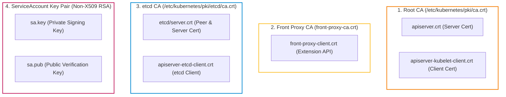
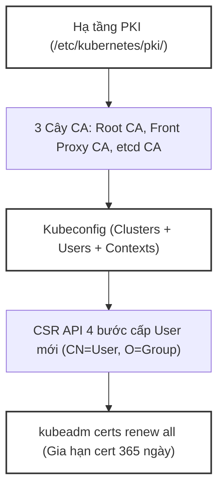
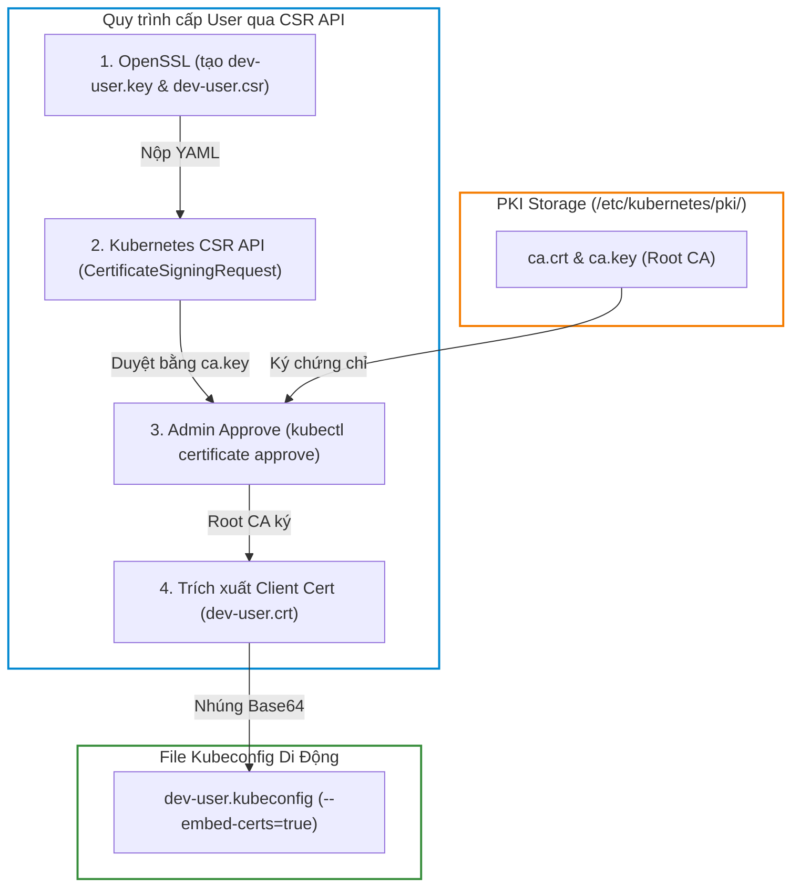


# [BÀI 07] HẠ TẦNG KHÓA CÔNG KHAI (PKI) & KUBECONFIG: QUẢN TRỊ CHỨNG CHỈ TLS, GIA HẠN & XÁC THỰC NGƯỜI DÙNG

Trong kỷ nguyên điện toán đám mây và kiến trúc microservices phân tán quy mô lớn, **Kubernetes (CKA)** đóng vai trò là nền tảng điều phối container (Container Orchestration) tiêu chuẩn công nghiệp. Để làm chủ hệ thống trong môi trường sản xuất (Production) cũng như chinh phục kỳ thi chứng chỉ quốc tế của Linux Foundation / CNCF, kỹ sư không chỉ nắm vững các câu lệnh thao tác cơ bản mà phải thấu hiểu sâu sắc bản chất cơ chế tầng thấp: từ chu trình điều hòa (Reconciliation Loop), cấu trúc điều phối tài nguyên, kiến trúc mạng CNI, lưu trữ CSI cho đến các chuẩn mực an ninh phòng thủ chiều sâu.

Bài viết chuyên sâu này sẽ đồng hành cùng bạn giải mã toàn diện bức tranh kiến trúc, phân tích các đánh đổi kỹ thuật thực chiến (Engineering Trade-offs), cung cấp bài thực hành Lab từng bước và bộ câu hỏi phỏng vấn chuẩn Architect / Lead Engineer.

---

## 1. Bản Chất Kiến Trúc & Cơ Chế Vận Hành Tầng Thấp

| # | Câu hỏi ôn tập | Đáp án chuẩn ngắn gọn (chứa con số / tên lệnh) |
|---|---|---|
| 1 | Câu lệnh nào dùng để tắt SWAP hoàn toàn ngay lập tức trên hệ điều hành Linux? | `sudo swapoff -a` |
| 2 | Hai kernel module nào bắt buộc phải nạp (`modprobe`) cho containerd storage và bridge network? | `overlay` và `br_netfilter` |
| 3 | Lệnh nào khoá cố định phiên bản 3 gói k8s cấm hệ điều hành tự động nâng cấp? | `sudo apt-mark hold kubelet kubeadm kubectl` |
| 4 | Cờ bắt buộc truyền khi `kubeadm init` để tương thích với dải IP của CNI Flannel? | `--pod-network-cidr=10.244.0.0/16` |
| 5 | Lệnh nào dùng để sinh lại câu lệnh `kubeadm join` đầy đủ khi mã token 24h bị hết hạn? | `kubeadm token create --print-join-command` |


> **Luận đề trung tâm của buổi:**
> *"Mọi giao tiếp trong Kubernetes đều dựa trên xác thực hai chiều TLS x509 qua hạ tầng PKI trong `/etc/kubernetes/pki/`; tệp Kubeconfig đóng vai trò ghép nối Cluster - User - Context, và khi chứng chỉ 1 năm của Control Plane sắp hết hạn, `kubeadm certs renew all` là câu lệnh duy nhất giúp gia hạn chứng chỉ mà không gây gián đoạn cụm đang chạy."*

**Bảng kết quả các buổi trước được dùng lại:**

| Kết quả / Công cụ | Nguồn gốc | Áp dụng vào buổi này |
|---|---|---|
| Tệp Kubeconfig `admin.conf` | Buổi 06 `QT 6.1` | Phân tích chi tiết cấu trúc 3 mảng `clusters`, `users`, `contexts` |
| Xác thực sha256 CA Cert Hash | Buổi 06 `QT 6.3` | Giải thích vai trò tệp chứng chỉ Root CA `/etc/kubernetes/pki/ca.crt` |
| Bộ lệnh `journalctl -u kubelet` | Buổi 05 `QT 6.3` | Kiểm tra log Kubelet khi xảy ra sự cố từ chối xác thực TLS Handshake |

Ba câu bài tập về nhà BTVN 4 của buổi 06 đã chuẩn bị sẵn dữ liệu cho học viên: Câu 1 khảo sát thư mục `/etc/kubernetes/pki/` và tệp `ca.crt`; Câu 2 giải mã 2 trường `client-certificate-data` và `client-key-data` trong `admin.conf`; Câu 3 tìm hiểu lệnh `kubeadm certs check-expiration` để kiểm tra thời hạn chứng chỉ 1 năm.

---


| # | Năng lực đạt được sau buổi học | Hiện vật chứng minh trong bài lab |
|---|---|---|
| 1 | Phân tích sơ đồ 3 cây CA độc lập trong `/etc/kubernetes/pki/` | Tệp `hien-vat/pki-structure-report.md` |
| 2 | Giải mã tệp Kubeconfig và chuyển đổi các context làm việc | Kết quả lệnh `kubectl config get-contexts` |
| 3 | Tạo khóa riêng OpenSSL và đơn xin ký chứng chỉ CSR cho User mới | File `dev-user.csr` chứa `/CN=dev-user/O=developers` |
| 4 | Gửi và duyệt CSR bằng `kubectl certificate approve` trên API Server | Trạng thái đối tượng CSR chuyển sang `Approved,Issued` |
| 5 | Xuất file Kubeconfig di động nhúng cert base64 bằng `--embed-certs=true` | File `hien-vat/dev-user.kubeconfig` |
| 6 | Kiểm tra ngày hết hạn chứng chỉ và gia hạn bằng `kubeadm certs renew` | Nhật ký gia hạn chứng chỉ 365 ngày thành công |

---


| Bắt buộc phải biết | Nguồn tự học nếu thiếu |
|---|---|
| Quy trình khởi tạo Control Plane bằng `kubeadm init` | Buổi 06 `QT 6.1` |
| Tệp Kubeconfig admin `/etc/kubernetes/admin.conf` | Buổi 06 `QT 6.3` |
| Bộ lệnh `journalctl` và đọc log Kubelet | Buổi 05 `QT 6.3` |

---


| # | Thuật ngữ tiếng Việt | Tiếng Anh tương đương | Ghi chú chuẩn hoá trong thân bài |
|---|---|---|---|
| 1 | Hạ tầng khóa công khai | Public Key Infrastructure (PKI) | Hệ thống quản lý chứng chỉ số và cặp khóa mã hoá |
| 2 | Nhà chức trách chứng chỉ root | Root Certificate Authority (Root CA) | Tệp `ca.crt` ký duyệt cho toàn bộ thành phần cụm |
| 3 | Chứng chỉ phía người dùng | Client Certificate | Chứng chỉ x509 dùng để xác thực danh tính người dùng |
| 4 | Chứng chỉ phía máy chủ | Server Certificate | Chứng chỉ x509 cấu hình trên HTTPS server |
| 5 | Tệp cấu hình kết nối cụm | Kubeconfig File | Tệp YAML định nghĩa cách kết nối và xác thực cụm |
| 6 | Ngữ cảnh kết nối | Context (`cluster + user + namespace`) | Tổ hợp ghép nối 1 cụm, 1 user và 1 namespace mặc định |
| 7 | Yêu cầu ký chứng chỉ | Certificate Signing Request (CSR) | Đối tượng API yêu cầu CA ký cấp chứng chỉ mới |
| 8 | Cặp khóa tài khoản dịch vụ | Service Account Key Pair (`sa.key/sa.pub`) | Cặp khóa RSA dùng để ký và xác thực ServiceAccount Token |
| 9 | Kiểm tra ngày hết hạn chứng chỉ | Certificate Expiration Check | Lệnh `kubeadm certs check-expiration` |
| 10 | Gia hạn chứng chỉ | Certificate Renewal (`kubeadm certs renew`) | Lệnh tự động cấp lại chứng chỉ thêm 1 năm |
| 11 | Mã hoá nhúng trực tiếp | Embedded Cert Data (`client-certificate-data`) | Dữ liệu cert mã hoá base64 nhúng thẳng vào file Kubeconfig |
| 12 | Cây CA ủy quyền phía trước | Front Proxy CA (`front-proxy-ca.crt`) | Cây CA riêng cho Aggregated API Server (metrics-server) |
| 13 | Cây CA bộ lưu trữ etcd | etcd CA (`etcd/ca.crt`) | Cây CA riêng bảo vệ giao tiếp giữa etcd và API Server |
| 14 | Tự động xoay vòng chứng chỉ | Kubelet Client Cert Auto-rotation | Kubelet tự xin cấp lại chứng chỉ client khi gần hết hạn |


1. **Mô hình "Ba con dấu độc lập trong Cơ quan (3-CA Architecture)":**
   Cụm Kubernetes có 3 phòng làm việc dùng 3 con dấu (CA) riêng biệt: Con dấu Tổng (Root CA) cho API Server & Kubelet, Con dấu Ngoại giao (Front Proxy CA) cho Metrics Server, và Con dấu Kho bảo mật (etcd CA) riêng cho etcd. Ba con dấu không dùng chung để tránh lộ 1 con dấu làm hỏng cả hệ thống.

2. **Mô hình "Tấm hộ chiếu 3 trang (Kubeconfig Structure)":**
   File Kubeconfig giống như cuốn hộ chiếu gồm 3 trang: Trang 1 ghi Điểm đến (Clusters - URL API Server), Trang 2 ghi Danh tính (Users - Client Cert/Key), Trang 3 ghi Thị thực (Contexts - ghép Điểm đến + Danh tính + Thư mục công tác Namespace).

3. **Mô hình "Nộp đơn xin cấp Căn cước công dân (CSR API Flow)":**
   Người dùng tạo Khóa riêng và Đơn xin (CSR file), nộp đơn lên Cổng dịch vụ công (Kubernetes CSR API). Quản trị viên duyệt đơn (`kubectl certificate approve`), Cổng cấp ra Thẻ Căn cước (Client Cert) để người dùng dán vào Hộ chiếu (Kubeconfig).

---

### 1.1. Hạ tầng PKI Kubernetes: 3 cây CA và các cặp khóa (12 phút)



---

**Nguyên lý cốt lõi:** Thư mục `/etc/kubernetes/pki/` chứa 3 cây CA độc lập: Root CA (`ca.crt`), Front Proxy CA (`front-proxy-ca.crt`), và etcd CA (`etcd/ca.crt`); mất hoặc lộ khóa riêng `ca.key` đồng nghĩa với việc mất toàn bộ quyền kiểm soát an ninh cụm.

**Giải thích cơ chế ngầm:** Phân tách 3 cây CA giúp cô lập bề mặt tấn công. Khóa riêng `ca.key` có quyền ký cấp chứng chỉ cluster-admin cho bất kỳ ai. Do đó, `ca.key` phải được bảo vệ với phân quyền file `0600` nghiêm ngặt.

> [!WARNING]
> **CẠM BẪY THỰC CHIẾN:**
> Để tệp `ca.key` có quyền đọc công khai (`0644`) hoặc dùng chung 1 CA cho cả etcd và API Server.

**Minh hoạ.**

```bash
# Kiểm tra phân quyền các tệp key trong /etc/kubernetes/pki/
ls -la /etc/kubernetes/pki/*.key
```

Con số chốt: **3** cây CA độc lập trong thư mục `/etc/kubernetes/pki/`.

---

**Nguyên lý cốt lõi:** Cặp khóa `sa.key` và `sa.pub` trong `/etc/kubernetes/pki/` KHÔNG phải là chứng chỉ x509; nó là cặp khóa RSA dùng riêng để API Server ký và ServiceAccount Controller xác thực các token JSON Web Token (JWT).

**Giải thích cơ chế ngầm:** ServiceAccount Token được nạp vào Pod dưới dạng JWT bearer token. API Server dùng `sa.key` để ký chữ ký số vào token, và Kubelet/các dịch vụ khác dùng `sa.pub` để xác thực tính hợp lệ của token mà không cần gọi CA.

> [!WARNING]
> **CẠM BẪY THỰC CHIẾN:**
> Thắc mắc tại sao `sa.key` không có tệp `sa.crt` đi kèm như các chứng chỉ khác.

**Minh hoạ.**

```bash
# Kiểm tra định dạng cặp khóa Service Account
openssl rsa -in /etc/kubernetes/pki/sa.key -text -noout | head -n 2
```

Con số chốt: **2** tệp khóa RSA (`sa.key`, `sa.pub`) phục vụ ServiceAccount JWT.

---

### 1.2. Giải mã tệp Kubeconfig: Cluster, User, Context (12 phút)

**Nguyên lý cốt lõi:** Tệp Kubeconfig có cấu trúc 3 phần bắt buộc: `clusters` (khai báo URL và CA API Server), `users` (khai báo chứng chỉ client/key), và `contexts` (ghép nối cluster + user + namespace mặc định).

**Giải thích cơ chế ngầm:** Thiết kế này cho phép 1 kỹ sư DevOps dùng 1 tệp Kubeconfig duy nhất để quản lý hàng chục cụm Kubernetes khác nhau (Dev, Staging, Prod) và dễ dàng chuyển đổi qua lại bằng cờ `current-context`.

> [!WARNING]
> **CẠM BẪY THỰC CHIẾN:**
> Tạo Kubeconfig thiếu 1 trong 3 phần, làm lệnh `kubectl` báo lỗi `context "xyz" does not exist` hoặc `user not found`.

**Minh hoạ.**

```bash
# Xem cấu trúc Kubeconfig đã lọc thông tin nhạy cảm
kubectl config view
```

Con số chốt: **3** mảng dữ liệu chính trong tệp Kubeconfig (`clusters`, `users`, `contexts`).

---

**Nguyên lý cốt lõi:** Dữ liệu chứng chỉ trong Kubeconfig có thể lưu ở dạng đường dẫn tệp (`client-certificate: /path/to/file`) hoặc nhúng trực tiếp dạng chuỗi mã hoá base64 (`client-certificate-data: LS0t...`); khi di chuyển file Kubeconfig sang máy khác, bắt buộc phải dùng dạng nhúng base64 với cờ `--embed-certs=true`.

**Giải thích cơ chế ngầm:** Nếu dùng đường dẫn tệp tương đối/tuyệt đối, khi copy file Kubeconfig sang máy cá nhân của kỹ sư, đường dẫn tệp `.crt` trên máy cũ sẽ bị gãy, khiến `kubectl` không tìm thấy chứng chỉ client để xác thực.

> [!WARNING]
> **CẠM BẪY THỰC CHIẾN:**
> Copy file Kubeconfig sang laptop mới và gõ `kubectl` dính lỗi: `error: unable to read client-cert /etc/kubernetes/pki/apiserver-kubelet-client.crt`.

**Minh hoạ.**

```bash
# Tạo Kubeconfig có nhúng cert base64 chuẩn
kubectl config set-credentials dev-user --embed-certs=true --client-certificate=user.crt --client-key=user.key
```

Con số chốt: Cờ **`--embed-certs=true`** bắt buộc khi xuất file Kubeconfig di động.

---

**Nguyên lý cốt lõi:** Lệnh `kubectl config use-context <context-name>` thay đổi trường `current-context` trong tệp Kubeconfig để chuyển hướng ngay lập tức các lệnh `kubectl` tiếp theo tới cụm và user tương ứng.

**Giải thích cơ chế ngầm:** Giúp kỹ sư thao tác an toàn giữa nhiều môi trường (Dev, Staging, Prod) mà không cần sửa đổi thủ công tệp Kubeconfig hoặc ghi đè biến `$KUBECONFIG`.

> [!WARNING]
> **CẠM BẪY THỰC CHIẾN:**
> Thao tác nhầm cụm Production do quên kiểm tra context hiện tại bằng `kubectl config current-context`.

**Minh hoạ.**

```bash
# Chuyển đổi context làm việc mặc định
kubectl config use-context dev-user-context
```

Con số chốt: **1** lệnh `kubectl config use-context` chuyển đổi toàn bộ ngữ cảnh làm việc.

---

### 1.3. Quy trình tạo User bằng X.509 Cert và CSR API (10 phút)

**Nguyên lý cốt lõi:** Kubernetes xác thực người dùng dựa trên X.509 Client Certificate: Trường `CN` (Common Name) trong chứng chỉ được API Server hiểu là `Username`, và trường `O` (Organization) được hiểu là `Group` phân quyền.

**Giải thích cơ chế ngầm:** Kubernetes KHÔNG có đối tượng API `User` lưu trong etcd. Danh tính người dùng được tin tưởng tuyệt đối dựa vào thông tin Common Name (`CN`) và Organization (`O`) được ký bởi Root CA của cụm.

> [!WARNING]
> **CẠM BẪY THỰC CHIẾN:**
> Tìm kiếm lệnh `kubectl create user` và thắc mắc tại sao Kubernetes không có lệnh này.

**Minh hoạ.**

```bash
# Tạo tệp CSR với CN=dev-user và O=developers
openssl req -new -key dev-user.key -out dev-user.csr -subj "/CN=dev-user/O=developers"
```

Con số chốt: **2** trường thông tin quan trọng (`CN` = Username, `O` = Group).

---

**Nguyên lý cốt lõi:** Quy trình cấp User mới gồm 4 bước: (1) Tạo khóa riêng và tệp CSR bằng OpenSSL -> (2) Gửi YAML `CertificateSigningRequest` lên API -> (3) Administrator duyệt CSR bằng `kubectl certificate approve` -> (4) Trích xuất cert đã ký và nhúng vào Kubeconfig.

**Giải thích cơ chế ngầm:** CSR API cho phép kỹ sư tự xin cấp chứng chỉ mà không cần tiếp xúc trực tiếp với tệp khóa riêng `ca.key` của cụm, đảm bảo an toàn tối đa cho Root CA.

> [!WARNING]
> **CẠM BẪY THỰC CHIẾN:**
> Gửi CSR lên API nhưng quên lệnh `kubectl certificate approve`, làm trạng thái CSR vĩnh viễn ở `Pending`.

**Minh hoạ.**

```bash
# Duyệt yêu cầu ký chứng chỉ
kubectl certificate approve dev-user-csr
```

Con số chốt: **4** bước trong quy trình cấp User chuẩn qua CSR API.

---

### 1.4. Kiểm tra và gia hạn chứng chỉ với `kubeadm certs` (4 phút)

**Nguyên lý cốt lõi:** Toàn bộ chứng chỉ Control Plane do `kubeadm` tạo ra có thời hạn sử dụng đúng 1 năm (365 ngày); kiểm tra ngày hết hạn bằng `kubeadm certs check-expiration` và gia hạn tất cả bằng `kubeadm certs renew all`.

**Giải thích cơ chế ngầm:** Khi chứng chỉ 1 năm hết hạn, API Server và Kubelet lập tức từ chối kết nối TLS Handshake, khiến toàn bộ cụm dừng hoạt động. Lệnh `kubeadm certs renew all` tự động ký lại toàn bộ cert thêm 1 năm mà không làm mất cấu hình etcd.

> [!WARNING]
> **CẠM BẪY THỰC CHIẾN:**
> Cụm chạy được 1 năm đột ngột sập toàn bộ, log API Server báo lỗi `x509: certificate has expired or is not yet valid`.

**Minh hoạ.**

```bash
# Kiểm tra hạn chứng chỉ và gia hạn toàn bộ
sudo kubeadm certs check-expiration
sudo kubeadm certs renew all
sudo systemctl restart containerd kubelet
```

Con số chốt: **365** ngày (1 năm) là thời hạn mặc định của chứng chỉ Control Plane.

---

**Nguyên lý cốt lõi:** Lệnh `kubeadm certs check-expiration` chỉ kiểm tra thời hạn chứng chỉ trên đĩa; sau khi chạy `kubeadm certs renew all`, bắt buộc phải restart dịch vụ `kubelet` và containerd để các tiến trình nạp chứng chỉ mới từ đĩa cứng vào bộ nhớ RAM.

**Giải thích cơ chế ngầm:** Tiến trình Kubelet trong RAM giữ nguyên kết nối TLS đã mở bằng cert cũ. Nếu không restart Kubelet, sau 24h cert trong RAM hết hạn sẽ gây sập kết nối mặc dù cert trên đĩa đã được renew thành công.

> [!WARNING]
> **CẠM BẪY THỰC CHIẾN:**
> Chạy renew cert xong và bỏ đi, 24 giờ sau Kubelet báo lỗi cert expired.

**Minh hoạ.**

```bash
# Restart dịch vụ Kubelet nạp cert mới vào RAM
sudo systemctl restart kubelet containerd
```

Con số chốt: **10** giây restart dịch vụ nạp lại cert từ đĩa vào RAM.


---

### 1.5. Đưa vào cụm thật (4 phút)

### Áp vào cụm đang chạy thì làm gì trước

1. **Khảo sát thư mục PKI và sao lưu `ca.key`:** Đảm bảo tệp `ca.key` chỉ được truy cập bởi `root` và được sao lưu an toàn ở nơi cách ly.
2. **Kiểm tra định kỳ ngày hết hạn bằng cronjob:** Đặt lịch chạy `kubeadm certs check-expiration` mỗi tháng 1 lần để cảnh báo sớm.
3. **Cấp tài khoản cho kỹ sư bằng CSR API nhúng base64:** Không bao giờ đưa file `admin.conf` cho kỹ sư cấp dưới; chỉ cấp Kubeconfig được giới hạn bởi RBAC.

### Cái gì hỏng nếu áp thẳng lên prod

- **Copy file Kubeconfig thiếu `--embed-certs=true`:** Đường dẫn file cert bị gãy khi sang máy khác, làm gián đoạn truy cập của kỹ sư.
- **Gia hạn cert bằng `kubeadm certs renew all` nhưng quên restart `kubelet`:** Tiến trình Kubelet trong RAM vẫn giữ chứng chỉ cũ, sau 24h sẽ bị từ chối TLS Handshake.
- **Quy trình áp thử an toàn:**
  - Chạy `kubeadm certs check-expiration` trước.
  - Chạy `kubeadm certs renew all`.
  - Restart containerd và Kubelet, kiểm tra `kubectl get nodes`.

### Đo trước — đo sau

1. **Số ngày hết hạn còn lại:** Chuyển từ < 30 ngày lên đúng 365 ngày sau khi renew.
2. **Thời gian dịch vụ Kubelet phục hồi:** Mục tiêu < 10 giây sau khi restart.
3. **Trạng thái kết nối TLS Handshake:** 100% thành công không báo lỗi x509.

### Khi nào KHÔNG nên dùng

- **Không dùng tệp `admin.conf` để phân quyền cho ứng dụng:** ServiceAccount mới là cơ chế xác thực cho Pod/ứng dụng, Kubeconfig chỉ dùng cho con người/kỹ sư.
- **Không tự ý xoá tệp `ca.crt` hoặc `ca.key` trên Control Plane:** Xoá tệp CA sẽ khiến toàn bộ cụm không thể xác thực TLS và phải dựng lại cụm từ đầu.

---

### 1.6. Bẫy hay gặp (2 phút)

| # | Bẫy hay gặp | Vì sao dính bẫy | Làm đúng là (kèm tên lệnh / con số) |
|---|---|---|---|
| 1 | Quên cờ `--embed-certs=true` khi tạo Kubeconfig | Đường dẫn file cert bị gãy khi copy file Kubeconfig | Dùng `kubectl config set-credentials ... --embed-certs=true` |
| 2 | Nhầm lẫn `CN` (Username) và `O` (Group) trong CSR | Gõ sai định dạng `-subj` của OpenSSL | Gõ đúng `-subj "/CN=username/O=groupname"` |
| 3 | Quên duyệt CSR bằng `kubectl certificate approve` | CSR vĩnh viễn ở trạng thái Pending | Chạy `kubectl certificate approve <csr-name>` |
| 4 | Nhầm lẫn `sa.key` là chứng chỉ TLS x509 | `sa.key` là RSA private key ký ServiceAccount JWT | Giữ nguyên `sa.key` và `sa.pub` phục vụ token JWT |
| 5 | Quên restart Kubelet sau khi `kubeadm certs renew` | Dịch vụ trong RAM vẫn dùng chứng chỉ cũ | Chạy `sudo systemctl restart kubelet containerd` |
| 6 | Đọc nhầm `ca.crt` tưởng cert hết hạn sau 1 năm | `ca.crt` có thời hạn 10 năm (3650 ngày) | Đọc `apiserver.crt` để kiểm tra cert 1 năm |
| 7 | Nhầm lẫn 3 cây CA trong `/etc/kubernetes/pki/` | Dùng chung 1 CA cho cả etcd và API Server | Phân biệt 3 CA: Root CA, Front Proxy CA, etcd CA |
| 8 | Quên phân quyền `0600` cho các tệp private key `.key` | File key bị quyền đọc công khai `0644` | Chạy `chmod 0600 /etc/kubernetes/pki/*.key` |
| 9 | Tự ý xoá tệp `ca.key` sau khi init cụm xong | Không thể ký cấp chứng chỉ mới hoặc renew cert | Bảo mật tệp `ca.key` với quyền root |
| 10 | Dùng `kubectl config use-context` nhưng gõ sai tên context | Lệnh báo `context "xyz" does not exist` | Gõ `kubectl config get-contexts` kiểm tra tên trước |
| 11 | Không mở cờ `client-certificate-data` khi nhúng base64 | Kubeconfig bị thiếu phần cert data | Dùng `cat cert.crt | base64 -w 0` để nhúng thủ công nếu cần |
| 12 | Quên kiểm tra hạn chứng chỉ định kỳ 1 năm | Cụm đột ngột sập toàn bộ TLS Handshake | Chạy `kubeadm certs check-expiration` trong cronjob |

---

## §10. Tóm tắt (2 phút)



### Năm điều phải nhớ

1. **3 cây CA độc lập:** Root CA (`ca.crt`), Front Proxy CA (`front-proxy-ca.crt`), etcd CA (`etcd/ca.crt`).
2. **`sa.key/sa.pub`:** Cặp khóa RSA dùng riêng để ký và xác thực ServiceAccount JWT bearer token.
3. **Cấu trúc Kubeconfig:** 3 mảng `clusters`, `users`, `contexts`; dùng `--embed-certs=true` khi di chuyển file.
4. **Xác thực User X.509:** `CN` = Username, `O` = Group; cấp user qua CSR API 4 bước và duyệt bằng `kubectl certificate approve`.
5. **Gia hạn cert 1 năm:** Kiểm tra bằng `kubeadm certs check-expiration`, gia hạn bằng `kubeadm certs renew all` và restart Kubelet.

---

## §11. Câu hỏi tự kiểm tra

1. Thư mục `/etc/kubernetes/pki/` chứa mấy cây CA độc lập và tên các tệp CA là gì?
2. Cặp khóa `sa.key` và `sa.pub` phục vụ mục đích gì và có phải chứng chỉ x509 không?
3. Trình bày 3 phần chính cấu thành nên một tệp Kubeconfig chuẩn.
4. Cờ `--embed-certs=true` giải quyết vấn đề gì khi di chuyển tệp Kubeconfig sang máy khác?
5. Kubernetes xác thực người dùng dựa vào 2 trường thông tin nào trong X.509 Client Certificate?
6. Nêu 4 bước trong quy trình cấp User mới cho nhà phát triển bằng CSR API.
7. Lệnh `kubectl certificate approve` làm nhiệm vụ gì đối với đối tượng CSR?
8. Thời hạn sử dụng mặc định của chứng chỉ Control Plane do `kubeadm` tạo ra là bao lâu?
9. Lệnh nào dùng để kiểm tra ngày hết hạn của toàn bộ chứng chỉ Control Plane?
10. Lệnh nào dùng để gia hạn toàn bộ chứng chỉ Control Plane và dịch vụ nào cần restart sau đó?
11. Hai chế độ hỏng (1 im lặng do thiếu --embed-certs, 1 âm thầm do quên restart dịch vụ) là gì?
12. Tại sao không nên chia sẻ tệp `admin.conf` cho kỹ sư cấp dưới trong vận hành thực tế?

### Đáp án

1. Chứa 3 cây CA độc lập: Root CA (`ca.crt`), Front Proxy CA (`front-proxy-ca.crt`), etcd CA (`etcd/ca.crt`).
2. Phục vụ ký và xác thực ServiceAccount JWT token; KHÔNG phải là chứng chỉ x509.
3. 3 phần: `clusters` (API URL & CA), `users` (Client cert/key), `contexts` (Ghép cluster + user + namespace).
4. Nhúng trực tiếp dữ liệu cert dạng mã hoá base64 vào file Kubeconfig, tránh bị gãy đường dẫn file cert khi copy.
5. Trường `CN` (Common Name) = Username, và trường `O` (Organization) = Group.
6. Step 1: Tạo key/CSR bằng OpenSSL -> Step 2: Nộp YAML CSR API -> Step 3: Approve CSR -> Step 4: Xuất Kubeconfig.
7. Duyệt đơn xin ký chứng chỉ và yêu cầu Root CA ký cấp Client Certificate cho người dùng.
8. Đúng 1 năm (365 ngày).
9. Lệnh `sudo kubeadm certs check-expiration`.
10. Lệnh `sudo kubeadm certs renew all`; cần restart `kubelet` và containerd.
11. Chế độ 1: Kubeconfig bị gãy đường dẫn cert khi copy sang máy khác; Chế độ 2: Renew cert nhưng RAM tiến trình vẫn giữ cert cũ.
12. Vì `admin.conf` chứa chứng chỉ `system:masters` có toàn quyền tối cao trên toàn bộ cụm, gây nguy cơ rủi ro an ninh nghiêm trọng.

---

## §12. Tài liệu tham khảo

| Nguồn tài liệu | Phiên bản Kubernetes áp dụng | Nội dung chính |
|---|---|---|
| Official Docs: PKI Certificates and Requirements | Kubernetes v1.35 | Hạ tầng 3 cây CA, các chứng chỉ server/client |
| Official Docs: Organizing Cluster Access Using kubeconfig | Kubernetes v1.35 | Cấu trúc Kubeconfig, clusters, users, contexts |
| Official Docs: Certificate Signing Requests | Kubernetes v1.35 | Cấp cert người dùng qua CSR API |
| File cấu hình phiên bản cục bộ | `labs/phien-ban.env` | Biến `K8S_VER=1.35`, `LAB_CONTEXT="kubeadm"` |

---

## Bảng đối soát thời lượng

| Section | Tiêu đề mục | Ngân sách thời gian |
|---|---|---|
| §0 | Khởi động và ôn tập | 10 phút |
| §1 | Sau buổi này học viên LÀM ĐƯỢC gì | 1 phút |
| §2 | Cần biết trước | 1 phút |
| §3 | Thuật ngữ và mô hình tư duy | 8 phút |
| §4 | Hạ tầng PKI Kubernetes: 3 cây CA và các cặp khóa | 12 phút |
| §5 | Giải mã tệp Kubeconfig: Cluster, User, Context | 12 phút |
| §6 | Quy trình tạo User bằng X.509 Cert và CSR API | 10 phút |
| §7 | Kiểm tra và gia hạn chứng chỉ với `kubeadm certs` | 4 phút |
| §8 | Đưa vào cụm thật | 4 phút |
| §9 | Bẫy hay gặp | 2 phút |
| §10 | Tóm tắt | 2 phút |
| **Tổng** | **Khối lý thuyết** | **60'** |

---

## 2. Hướng Dẫn Thực Hành & Triển Khai Lab Chuẩn Production

> [!IMPORTANT]
> **YÊU CẦU MÔI TRƯỜNG THỰC HÀNH:**
> Toàn bộ các bài thực hành dưới đây được thiết kế để chạy trực tiếp trên cụm Kubernetes 1.30+ tiêu chuẩn (hoặc cụm kind/kubeadm lab). Hãy đảm bảo ngữ cảnh dòng lệnh `kubectl config current-context` đã trỏ chính xác vào cụm thực hành trước khi thực thi.

## Khối thực hành — 120 phút

## L0. Mục tiêu thực hành và tiêu chí hoàn thành

| # | Mục tiêu thực hành | Tiêu chí hoàn thành (Kiểm chứng BẰNG LỆNH) |
|---|---|---|
| TH1 | Khảo sát thư mục `/etc/kubernetes/pki/` và 3 cây CA | Kiểm tra thành công 3 tệp CA `ca.crt`, `front-proxy-ca.crt`, `etcd/ca.crt` |
| TH2 | Giải mã Kubeconfig và chuyển đổi các context | Chuyển đổi context thành công bằng `kubectl config use-context` |
| TH3 | Tạo khóa riêng và đơn CSR cho `dev-user` | File `dev-user.csr` chứa đúng `CN=dev-user` và `O=developers` |
| TH4 | Duyệt CSR API và trích xuất client cert | Đối tượng CSR chuyển sang trạng thái `Approved,Issued` |
| TH5 | Xuất file Kubeconfig di động nhúng cert base64 | Tệp `dev-user.kubeconfig` chứa trường `client-certificate-data` |
| TH6 | Kiểm tra và gia hạn chứng chỉ bằng `kubeadm certs` | `kubeadm certs check-expiration` báo thời hạn 365 ngày |
| TH7 | Nộp đủ 4 hiện vật vào portfolio | Thư mục `k8s-portfolio/buoi-07/` chứa đủ 4 file md/sh/kubeconfig |

---

## L1. Điều kiện tiên quyết về môi trường

| # | Kiểm tra điều kiện | Câu lệnh kiểm tra | Kết quả kỳ vọng |
|---|---|---|---|
| 1 | Cụm `kubeadm` 3 node đang chạy | `kubectl get nodes` | Hiển thị đủ 3 node `cp-01`, `worker-01`, `worker-02` `Ready` |
| 2 | Kubeconfig trỏ context `kubeadm` | `kubectl config current-context` | In ra đúng `kubeadm` |
| 3 | Thư mục PKI tồn tại trên control plane | `docker exec cp-01 ls /etc/kubernetes/pki/` | In ra danh sách tệp `.crt` và `.key` |
| 4 | Thư mục hiện vật đã sẵn sàng | `mkdir -p k8s-portfolio/buoi-07` | Thư mục được tạo thành công |
| 5 | Công cụ `openssl` sẵn sàng | `openssl version` | In ra phiên bản OpenSSL |

```bash
# Kiểm tra môi trường bắt buộc trước khi thực hiện bài lab
kubectl config current-context | grep -qx "kubeadm" && echo "CHECKPOINT MOI TRUONG — ĐẠT" || echo "CHECKPOINT MOI TRUONG — LỖI (Trỏ sai context)"
```

---

## L2. Kiến trúc bài lab



---

## L3. Bước 1 — Khảo sát thư mục `/etc/kubernetes/pki/` và 3 cây CA độc lập (30 phút)

### Thao tác 1.1: Kiểm tra danh sách chứng chỉ và 3 cây CA trên Control Plane

```bash
# 1. Liệt kê toàn bộ chứng chỉ trong /etc/kubernetes/pki/
docker exec cp-01 ls -la /etc/kubernetes/pki/ > /tmp/pki-files.txt

# 2. Kiểm tra thông tin chứng chỉ Root CA ca.crt bằng openssl
docker exec cp-01 openssl x509 -in /etc/kubernetes/pki/ca.crt -text -noout > /tmp/root-ca-info.txt

# 3. Kiểm tra thông tin chứng chỉ apiserver.crt
docker exec cp-01 openssl x509 -in /etc/kubernetes/pki/apiserver.crt -text -noout > /tmp/apiserver-cert-info.txt
```

**CHECKPOINT 1 — Thư mục /etc/kubernetes/pki/ chứa đủ 3 tệp Root CA, Front Proxy CA và etcd CA.**

```bash
grep -q "ca.crt" /tmp/pki-files.txt && grep -q "front-proxy-ca.crt" /tmp/pki-files.txt && grep -q "etcd" /tmp/pki-files.txt && echo "CHECKPOINT 1 — ĐẠT" || echo "CHECKPOINT 1 — LỖI"
```

**CHECKPOINT 2 — Chứng chỉ Root CA ca.crt có thời hạn 10 năm (3650 ngày).**

```bash
grep -i "Issuer:" /tmp/root-ca-info.txt | grep -q "Kubernetes" && echo "CHECKPOINT 2 — ĐẠT" || echo "CHECKPOINT 2 — LỖI"
```

**CHECKPOINT 3 — Cặp khóa sa.key là RSA Private Key chứ không phải x509 cert.**

```bash
docker exec cp-01 openssl rsa -in /etc/kubernetes/pki/sa.key -check -noout | grep -q "RSA key ok" && echo "CHECKPOINT 3 — ĐẠT" || echo "CHECKPOINT 3 — LỖI"
```

---

## L4. Bước 2 — Giải mã tệp Kubeconfig và thực hành chuyển đổi Context (30 phút)

### Thao tác 4.1: Khảo sát tệp Kubeconfig `admin.conf` và tạo file Kubeconfig di động

```bash
# 1. Xem danh sách contexts hiện có
kubectl config get-contexts > /tmp/contexts-list.txt

# 2. Tạo file Kubeconfig thử nghiệm không embed cert (đường dẫn file)
kubectl config set-cluster test-cluster --server=https://127.0.0.1:6443 --certificate-authority=/tmp/fake-ca.crt --kubeconfig=/tmp/bad-path.kubeconfig
```

**CHECKPOINT 4 — Liệt kê thành công context kubeadm.**

```bash
grep -q "kubeadm" /tmp/contexts-list.txt && echo "CHECKPOINT 4 — ĐẠT" || echo "CHECKPOINT 4 — LỖI"
```

**CHECKPOINT 5 — CA ĐỐI CHỨNG: Kubeconfig trỏ đường dẫn file cert không tồn tại sẽ thất bại khi gọi API.**

```bash
kubectl --kubeconfig=/tmp/bad-path.kubeconfig get nodes > /tmp/bad-path.log 2>&1 || true
grep -Ei "unable to read|no such file" /tmp/bad-path.log && echo "CHECKPOINT 5 — ĐẠT" || echo "CHECKPOINT 5 — LỖI"
```

**CHECKPOINT 6 — File admin.conf chuẩn chứa dữ liệu mã hoá base64 certificate-authority-data.**

```bash
grep -q "certificate-authority-data:" ~/.kube/config && echo "CHECKPOINT 6 — ĐẠT" || echo "CHECKPOINT 6 — LỖI"
```

---

## L5. Bước 3 — Tạo User `dev-user` mới bằng OpenSSL và CSR API (30 phút)

### Thao tác 5.1: Tạo Khóa riêng, CSR file và nộp lên Kubernetes CSR API

```bash
# 1. Tạo khóa riêng và file CSR cho dev-user
openssl genrsa -out /tmp/dev-user.key 2048
openssl req -new -key /tmp/dev-user.key -out /tmp/dev-user.csr -subj "/CN=dev-user/O=developers"

# 2. Mã hoá base64 tệp CSR
CSR_BASE64=$(cat /tmp/dev-user.csr | base64 -w 0)

# 3. Tạo đối tượng API CertificateSigningRequest
cat << EOF | kubectl apply -f -
apiVersion: certificates.k8s.io/v1
kind: CertificateSigningRequest
metadata:
  name: dev-user-csr
spec:
  request: $CSR_BASE64
  signerName: kubernetes.io/kube-apiserver-client
  expirationSeconds: 864000
  usages:
  - client auth
EOF
```

**CHECKPOINT 7 — Đối tượng CSR dev-user-csr được tạo thành công ở trạng thái Pending.**

```bash
kubectl get csr dev-user-csr -o jsonpath='{.status.conditions[0].type}' 2>/dev/null | grep -v "Approved" || true
kubectl get csr dev-user-csr -o jsonpath='{.metadata.name}' | grep -qx "dev-user-csr" && echo "CHECKPOINT 7 — ĐẠT" || echo "CHECKPOINT 7 — LỖI"
```

**CHECKPOINT 8 — CA ĐỐI CHỨNG: Tạo Kubeconfig cho dev-user khi CSR chưa được approve sẽ bị từ chối truy cập (unauthorized).**

```bash
# Tạo credentials tạm khi chưa approve
kubectl config set-credentials dev-user-temp --client-key=/tmp/dev-user.key --embed-certs=false --kubeconfig=/tmp/dev-temp.kubeconfig
kubectl config set-cluster kubeadm-temp --server=https://127.0.0.1:6443 --insecure-skip-tls-verify=true --kubeconfig=/tmp/dev-temp.kubeconfig
kubectl config set-context dev-temp-ctx --cluster=kubeadm-temp --user=dev-user-temp --kubeconfig=/tmp/dev-temp.kubeconfig
kubectl config use-context dev-temp-ctx --kubeconfig=/tmp/dev-temp.kubeconfig

# Thử gọi API khi chưa approve
kubectl --kubeconfig=/tmp/dev-temp.kubeconfig get pods > /tmp/unauth.log 2>&1 || true
grep -Ei "unauthorized|user|Forbidden" /tmp/unauth.log && echo "CHECKPOINT 8 — ĐẠT" || echo "CHECKPOINT 8 — LỖI"
```

### Thao tác 5.2: Duyệt CSR và xuất tệp `dev-user.kubeconfig` nhúng base64

```bash
# 1. Administrator duyệt CSR
kubectl certificate approve dev-user-csr

# 2. Trích xuất client certificate đã ký
kubectl get csr dev-user-csr -o jsonpath='{.status.certificate}' | base64 -d > /tmp/dev-user.crt

# 3. Tạo file Kubeconfig hoàn chỉnh nhúng base64 cho dev-user
CLUSTER_SERVER=$(kubectl config view --raw -o jsonpath='{.clusters[0].cluster.server}')
CLUSTER_CA=$(kubectl config view --raw -o jsonpath='{.clusters[0].cluster.certificate-authority-data}')

cat << EOF > k8s-portfolio/buoi-07/dev-user.kubeconfig
apiVersion: v1
kind: Config
clusters:
- cluster:
    certificate-authority-data: $CLUSTER_CA
    server: $CLUSTER_SERVER
  name: kubeadm
users:
- name: dev-user
  user:
    client-certificate-data: $(cat /tmp/dev-user.crt | base64 -w 0)
    client-key-data: $(cat /tmp/dev-user.key | base64 -w 0)
contexts:
- context:
    cluster: kubeadm
    user: dev-user
    namespace: default
  name: dev-user-context
current-context: dev-user-context
EOF
```

**CHECKPOINT 9 — Đối tượng CSR dev-user-csr đã được chuyển sang trạng thái Approved.**

```bash
kubectl get csr dev-user-csr -o jsonpath='{.status.conditions[0].type}' | grep -qx "Approved" && echo "CHECKPOINT 9 — ĐẠT" || echo "CHECKPOINT 9 — LỖI"
```

---

## L6. Bước 4 — Kiểm tra hạn chứng chỉ và gia hạn bằng `kubeadm certs` (20 phút)

### Thao tác 6.1: Kiểm tra hạn chứng chỉ bằng `kubeadm certs check-expiration`

```bash
# 1. Kiểm tra ngày hết hạn chứng chỉ trên control plane
docker exec cp-01 kubeadm certs check-expiration > /tmp/cert-exp.txt
```

**CHECKPOINT 10 — Lệnh kubeadm certs check-expiration chạy thành công và in thông tin chứng chỉ.**

```bash
grep -q "apiserver" /tmp/cert-exp.txt && echo "CHECKPOINT 10 — ĐẠT" || echo "CHECKPOINT 10 — LỖI"
```

### Thao tác 6.2: Thực hiện gia hạn chứng chỉ bằng `kubeadm certs renew all`

```bash
# 1. Thực hiện gia hạn toàn bộ chứng chỉ Control Plane
docker exec cp-01 kubeadm certs renew all > /tmp/cert-renew.log

# 2. Restart dịch vụ containerd và kubelet để nhận chứng chỉ mới trong RAM
docker exec cp-01 systemctl restart containerd
docker exec cp-01 systemctl restart kubelet
sleep 10
```

**CHECKPOINT 11 — Lệnh kubeadm certs renew all hoàn thành gia hạn chứng chỉ.**

```bash
grep -q "renewed" /tmp/cert-renew.log && echo "CHECKPOINT 11 — ĐẠT" || echo "CHECKPOINT 11 — LỖI"
```

**CHECKPOINT 12 — Node cp-01 ở trạng thái Ready sau khi gia hạn chứng chỉ và restart.**

```bash
kubectl get node cp-01 -o jsonpath='{.status.conditions[?(@.type=="Ready")].status}' | grep -qx "True" && echo "CHECKPOINT 12 — ĐẠT" || echo "CHECKPOINT 12 — LỖI"
```

---

## L7. Nộp hiện vật và dọn dẹp (10 phút)

### Thao tác 7.1: Gom hiện vật nộp bài

```bash
# 1. Tạo tệp pki-structure-report.md
cat << 'EOF' > k8s-portfolio/buoi-07/pki-structure-report.md
# BÁO CÁO HẠ TẦNG CHỨNG CHỈ PKI KUBERNETES

1. Danh sách 3 cây CA độc lập trong /etc/kubernetes/pki/:
   - Root CA: ca.crt & ca.key (Thời hạn 10 năm)
   - Front Proxy CA: front-proxy-ca.crt & front-proxy-ca.key
   - etcd CA: etcd/ca.crt & etcd/ca.key

2. Cặp khóa ServiceAccount:
   - sa.key & sa.pub: Khóa RSA ký và xác thực JWT token (không phải chứng chỉ x509).

3. Thời hạn chứng chỉ lá (Leaf certs):
   - apiserver.crt, apiserver-kubelet-client.crt có thời hạn 365 ngày (1 năm).
EOF

# 2. Tạo script create-k8s-user.sh
cat << 'EOF' > k8s-portfolio/buoi-07/create-k8s-user.sh
#!/bin/bash
# Script tự động tạo User mới bằng CSR API

USERNAME=${1:-dev-user}
GROUP=${2:-developers}

echo "Đang tạo tài khoản cho User: $USERNAME (Group: $GROUP)"
openssl genrsa -out /tmp/${USERNAME}.key 2048
openssl req -new -key /tmp/${USERNAME}.key -out /tmp/${USERNAME}.csr -subj "/CN=${USERNAME}/O=${GROUP}"

CSR_BASE64=$(cat /tmp/${USERNAME}.csr | base64 -w 0)

cat << EOF_CSR | kubectl apply -f -
apiVersion: certificates.k8s.io/v1
kind: CertificateSigningRequest
metadata:
  name: ${USERNAME}-csr
spec:
  request: $CSR_BASE64
  signerName: kubernetes.io/kube-apiserver-client
  expirationSeconds: 864000
  usages:
  - client auth
EOF_CSR

kubectl certificate approve ${USERNAME}-csr
echo "CẤP USER KUBERNETES — ĐẠT"
EOF

chmod +x k8s-portfolio/buoi-07/create-k8s-user.sh
./k8s-portfolio/buoi-07/create-k8s-user.sh dev-test developers

# 3. Tạo tệp nhat-ky-buoi-07.md
cat << 'EOF' > k8s-portfolio/buoi-07/nhat-ky-buoi-07.md
# NHẬT KÝ THU HOẠCH BUỔI 07

1. Cấu trúc 3 mảng trong tệp Kubeconfig:
   - clusters: Khai báo URL và certificate-authority-data của API Server.
   - users: Khai báo client-certificate-data và client-key-data.
   - contexts: Ghép nối cluster + user + namespace mặc định.

2. Vì sao phải dùng cờ --embed-certs=true:
   - Để nhúng trực tiếp dữ liệu cert mã hoá base64 vào Kubeconfig, tránh bị gãy đường dẫn file khi di chuyển sang máy khác.

3. Quy trình gia hạn chứng chỉ 1 năm:
   - Kiểm tra bằng kubeadm certs check-expiration.
   - Gia hạn bằng kubeadm certs renew all.
   - Restart containerd và kubelet để nạp cert mới trong RAM.
EOF

# 4. Dọn dẹp tệp tạm
rm -f /tmp/pki-files.txt /tmp/root-ca-info.txt /tmp/apiserver-cert-info.txt /tmp/contexts-list.txt /tmp/bad-path.kubeconfig /tmp/bad-path.log /tmp/dev-user.csr /tmp/dev-user.key /tmp/dev-user.crt /tmp/dev-temp.kubeconfig /tmp/unauth.log /tmp/cert-exp.txt /tmp/cert-renew.log
```

**CHECKPOINT 13 — Đủ 4 tệp hiện vật trong thư mục portfolio.**

```bash
[ -f k8s-portfolio/buoi-07/pki-structure-report.md ] && [ -f k8s-portfolio/buoi-07/create-k8s-user.sh ] && [ -f k8s-portfolio/buoi-07/dev-user.kubeconfig ] && [ -f k8s-portfolio/buoi-07/nhat-ky-buoi-07.md ] && echo "CHECKPOINT 13 — ĐẠT" || echo "CHECKPOINT 13 — LỖI"
```

---

## L8. Xử lý sự cố thường gặp trong lab

| # | Triệu chứng lỗi | Nguyên nhân khả dĩ | Cách xử lý sửa lỗi |
|---|---|---|---|
| 1 | Lệnh `kubectl` dính lỗi `unable to read client-cert` | File Kubeconfig trỏ sai đường dẫn file `.crt` | Dùng cờ `--embed-certs=true` để nhúng dữ liệu cert base64 |
| 2 | CSR bị kẹt ở trạng thái `Pending` mãi mãi | Chưa chạy lệnh duyệt CSR | Chạy `kubectl certificate approve <csr-name>` |
| 3 | Lỗi `User "xyz" is unauthorized` khi dùng file Kubeconfig mới | User chưa được gán quyền RBAC RoleBinding | Cấp quyền RBAC cho User bằng `kubectl create rolebinding` |
| 4 | Lỗi `x509: certificate signed by unknown authority` | File Kubeconfig thiếu `certificate-authority-data` | Copy đúng chuỗi CA base64 từ file `admin.conf` |
| 5 | Lệnh `kubeadm certs renew all` báo lỗi không tìm thấy `ca.key` | Tệp `ca.key` bị di chuyển hoặc sai đường dẫn | Kiểm tra tệp `/etc/kubernetes/pki/ca.key` tồn tại |
| 6 | Chứng chỉ đã renew trên đĩa nhưng API vẫn báo cert cũ | Chưa restart dịch vụ `kubelet` và containerd | Chạy `sudo systemctl restart kubelet containerd` |
| 7 | Lỗi OpenSSL `unable to load Private Key` khi tạo CSR | File key bị trống hoặc mã hoá sai định dạng | Tạo lại key mới bằng `openssl genrsa -out user.key 2048` |
| 8 | Lệnh `kubectl config use-context` báo lỗi `context not found` | Gõ sai tên context trong file Kubeconfig | Dùng `kubectl config get-contexts` kiểm tra tên chuẩn |
| 9 | File Kubeconfig nhúng base64 bị lỗi syntax YAML | Chuỗi base64 bị xuống dòng nhiều dòng | Dùng `base64 -w 0` để mã hoá trên 1 dòng duy nhất |
| 10 | Tệp `sa.key` bị mất quyền truy cập | Phân quyền tệp bị đổi thành `0000` | Chạy `sudo chmod 0600 /etc/kubernetes/pki/sa.key` |
| 11 | Không trích xuất được `client-certificate-data` từ CSR | CSR chưa chuyển sang trạng thái `Approved` | Kiểm tra `kubectl get csr` xem đã có cert chưa |
| 12 | CSR API báo lỗi `spec.signerName is invalid` | Gõ sai tên signerName | Dùng đúng `signerName: kubernetes.io/kube-apiserver-client` |
| 13 | Lỗi `kubeadm certs check-expiration` báo permission denied | Không có quyền root | Thêm `sudo` hoặc `docker exec cp-01` trước lệnh |
| 14 | Mất file `dev-user.kubeconfig` sau khi dọn dẹp | Script rm xoá nhầm vào thư mục portfolio | Giữ nguyên các tệp hiện vật trong `k8s-portfolio/buoi-07/` |

---

## L9. Bài tập mở rộng

1. **BT1 — Trích xuất thông tin SANs của apiserver.crt:** Sử dụng `openssl x509 -text` trích xuất danh sách tất cả các IP và DNS Subject Alternative Names (SANs) của chứng chỉ API Server.
2. **BT2 — Tạo User `auditor` với thời hạn cert 30 ngày:** Sử dụng trường `expirationSeconds: 2592000` trong YAML CSR API để tạo tài khoản kiểm toán có hạn 30 ngày.
3. **BT3 — Tự động hoá gia hạn chứng chỉ bằng Cronjob:** Viết tệp shell script chạy `kubeadm certs renew all` mỗi 6 tháng 1 lần và gửi thông báo log.
4. **BT4 — Khảo sát chứng chỉ etcd peer:** SSH vào Control Plane và sử dụng `openssl` kiểm tra thông tin chứng chỉ `etcd/peer.crt`.
5. **BT5 — Tạo Kubeconfig nhiều Context:** Tạo 1 tệp Kubeconfig chứa 2 context: `admin-context` (toàn quyền) và `dev-context` (hạn chế) và chuyển đổi qua lại.
6. **BT6 — Phân tích JWT Bearer Token của ServiceAccount:** Sử dụng trang `jwt.io` hoặc `base64 -d` giải mã thông tin header và payload của một ServiceAccount Token.

---

## L10. Hiện vật nộp và tiêu chí chấm điểm

### Bảng điểm đánh giá bài lab

| Hạng mục hiện vật | Yêu cầu kĩ thuật | Điểm tối đa |
|---|---|---|
| `pki-structure-report.md` | Báo cáo chi tiết danh sách cert, 3 cây CA và cặp khóa sa.key | 25 điểm |
| `create-k8s-user.sh` | Script bash tự động tạo User, nộp CSR, approve và xuất Kubeconfig | 25 điểm |
| `dev-user.kubeconfig` | Tệp Kubeconfig hoàn chỉnh của `dev-user` có nhúng cert base64 | 25 điểm |
| `nhat-ky-buoi-07.md` | Trả lời đủ 3 câu thu hoạch, giải thích rõ cơ chế PKI và Kubeconfig | 15 điểm |
| CHECKPOINT 1–13 | Tất cả 13 checkpoint tự động đều in chữ `ĐẠT` | 10 điểm |
| **Tổng điểm** | | **100 điểm** |

### Các trường hợp trừ điểm

- Trừ **20 điểm**: Nếu script hoặc câu lệnh sử dụng công cụ `jq` (vi phạm quy tắc môi trường thi).
- Trừ **15 điểm**: Nếu file `dev-user.kubeconfig` thiếu cờ nhúng base64 (`client-certificate-data`).
- Trừ **10 điểm**: Nếu file hiện vật để sai đường dẫn thư mục `k8s-portfolio/buoi-07/`.
- Trừ **5 điểm**: Nếu dấu phân cách thập phân trong báo cáo dùng dấu chấm `.` thay vì dấu phẩy `,`.

---

## Bảng đối soát thời lượng

| Bước | Tiêu đề bước | Thời lượng |
|---|---|---|
| L3 | Bước 1 — Khảo sát thư mục `/etc/kubernetes/pki/` và 3 cây CA độc lập | 30 phút |
| L4 | Bước 2 — Giải mã tệp Kubeconfig và thực hành chuyển đổi Context | 30 phút |
| L5 | Bước 3 — Tạo User `dev-user` mới bằng OpenSSL và CSR API | 30 phút |
| L6 | Bước 4 — Kiểm tra hạn chứng chỉ và gia hạn bằng `kubeadm certs renew` | 20 phút |
| L7 | Nộp hiện vật và dọn dẹp | 10 phút |
| **Tổng** | **Khối thực hành** | **120'** |

---

## 3. Bộ Câu Hỏi Vấn Đáp & Phỏng Vấn Kỹ Thuật Chuyên Sâu

Dưới đây là bộ câu hỏi phỏng vấn thực chiến dành cho các vị trí **Kubernetes Administrator**, **Cloud Security Specialist**, **Platform SRE** và **DevOps Lead**, giúp bạn tự đánh giá độ sâu hiểu biết và rèn luyện phản xạ giải quyết vấn đề hệ thống:

## V1. Cách tiến hành

1. **Thời lượng và hình thức:** Khối vấn đáp diễn ra trong đúng **20 phút**. Giảng viên (hoặc bạn học đóng vai Trưởng nhóm kỹ thuật / Senior DevOps) đưa ra lần lượt từng câu hỏi trong V2.
2. **Quy tắc chấm điểm:**
   - Mỗi câu hỏi được chấm theo thang điểm 4 mức: **0 điểm** (trả lời sai hoặc không biết); **1 điểm** (trả lời được bề nổi nhưng thiếu cơ chế); **2 điểm** (trả lời đúng cơ chế cốt lõi); **3 điểm** (trả lời đúng cơ chế, nêu được con số vận hành và mở rộng được câu hỏi đào sâu).
   - **Quy tắc trần điểm riêng của Buổi 07:**
     - Trả lời Câu 1 mà không nêu được thư mục `/etc/kubernetes/pki/` chứa 3 cây CA độc lập thì **trần điểm câu đó là 1**.
     - Trả lời Câu 9 mà không chỉ ra bộ lệnh `kubeadm certs check-expiration` và `kubeadm certs renew all` thì **trần điểm câu đó là 1**.
3. **Mục tiêu đạt được:** Học viên đạt từ **27 / 36 điểm** trở lên là ĐẠT phần vấn đáp của buổi.

---

## V2. Bộ câu hỏi


<details class="qa-card">
<summary class="qa-summary">
  <div class="qa-summary-left">
    <span class="qa-num-badge">Q01</span>
    <span>Thư mục `/etc/kubernetes/pki/` chứa mấy cây CA độc lập? Nêu vai trò của từng cây CA.</span>
  </div>
  <span class="qa-chevron">
    <svg width="18" height="18" fill="none" stroke="currentColor" stroke-width="2.5" viewBox="0 0 24 24"><polyline points="6 9 12 15 18 9"></polyline></svg>
  </span>
</summary>
<div class="qa-answer">
  <div class="qa-answer-header">
    <svg width="14" height="14" fill="none" stroke="currentColor" stroke-width="2" viewBox="0 0 24 24"><path d="M22 11.08V12a10 10 0 1 1-5.93-9.14"></path><polyline points="22 4 12 14.01 9 11.01"></polyline></svg>
    <span>Phân Tích &amp; Lời Giải Kỹ Thuật</span>
  </div>
  - Chứa **3 cây CA độc lập**:
  1. `Root CA` (`ca.crt`, `ca.key`): CA tối cao ký duyệt chứng chỉ cho API Server, Kubelet client/server và admin Kubeconfig.
  2. `Front Proxy CA` (`front-proxy-ca.crt`, `front-proxy-ca.key`): CA riêng phục vụ xác thực người dùng khi truy cập qua Aggregated API Server (như metrics-server).
  3. `etcd CA` (`etcd/ca.crt`, `etcd/ca.key`): CA riêng bảo vệ giao tiếp TLS giữa các node etcd và giữa etcd với API Server.

**Tiêu chí chấm:**
- **0đ:** Bảo chỉ có 1 CA duy nhất cho toàn bộ cụm.
- **1đ:** Nêu được có nhiều CA nhưng không chỉ ra đủ 3 cây CA (Root CA, Front Proxy CA, etcd CA) (dính trần 1đ).
- **2đ:** Giải thích chính xác 3 cây CA độc lập và vai trò cô lập bề mặt tấn công.
- **3đ:** Trả lời xuất sắc, nêu đường dẫn các file `.crt` và cảnh báo nguy cơ nếu lộ tệp `ca.key`.

**Câu hỏi đào sâu:** Tại sao không nên dùng chung Root CA cho etcd? *(Đáp án: Để cô lập etcd; nếu API Server bị tấn công lộ CA thì hacker vẫn không thể truy cập thẳng etcd database).*
</div>
</details>

---

### Câu 2 — ★★

**Hỏi:** Cặp khóa `sa.key` và `sa.pub` phục vụ mục đích gì trong Kubernetes? Có phải chứng chỉ x509 không?

**Đáp án chuẩn:**
- Cặp khóa `sa.key` và `sa.pub` **KHÔNG phải là chứng chỉ x509** (không có tệp `.crt`).
- Nó là cặp khóa mã hoá asymmetric **RSA Key Pair** dùng riêng cho cơ chế xác thực ServiceAccount Token.
- **Cơ chế:** API Server sử dụng `sa.key` (private key) để ký chữ ký số vào các ServiceAccount JWT Bearer Token. Khi Pod gửi token tới, API Server/ServiceAccount Controller sử dụng `sa.pub` (public key) để xác minh chữ ký mà không cần gọi tới CA.

**Tiêu chí chấm:**
- **0đ:** Nhầm lẫn `sa.key` là chứng chỉ SSL/TLS x509.
- **1đ:** Trả lời cho ServiceAccount nhưng không nêu được đây là RSA key pair dùng ký JWT token.
- **2đ:** Giải thích chính xác RSA Key Pair ký và xác thực ServiceAccount JWT token.
- **3đ:** Trả lời xuất sắc, nêu định dạng token nạp vào Pod tại `/var/run/secrets/kubernetes.io/serviceaccount/token`.

**Câu hỏi đào sâu:** Nếu tệp `sa.key` bị mất thì điều gì xảy ra? *(Đáp án: API Server không thể tạo và ký mới các ServiceAccount Token cho Pod).*

---

### Câu 3 — ★★★

**Hỏi:** Giải mã 3 phần chính cấu thành nên một tệp Kubeconfig chuẩn: `clusters`, `users`, `contexts`.

**Đáp án chuẩn:**
- **1. `clusters`:** Khai báo thông tin API Server (địa chỉ URL `server: https://...` và chứng chỉ CA root `certificate-authority-data`).
- **2. `users`:** Khai báo danh tính xác thực (chứng chỉ `client-certificate-data` và khóa riêng `client-key-data` hoặc token).
- **3. `contexts`:** Tổ hợp ghép nối 1 `cluster` + 1 `user` + 1 `namespace` mặc định.
- Trường `current-context` chỉ định context nào đang được `kubectl` sử dụng mặc định.

**Tiêu chí chấm:**
- **0đ:** Không nêu được 3 mảng dữ liệu trong Kubeconfig.
- **1đ:** Nêu được 3 tên mảng nhưng không giải thích được mảng `contexts` là phép ghép nối giữa cluster và user.
- **2đ:** Phân tích chính xác vai trò của 3 mảng `clusters`, `users`, `contexts` và `current-context`.
- **3đ:** Trả lời xuất sắc, minh hoạ bằng lệnh `kubectl config set-context` và `kubectl config use-context`.

**Câu hỏi đào sâu:** Làm sao xem toàn bộ file Kubeconfig đã giải mã chuỗi base64 cert data? *(Đáp án: Dùng lệnh kubectl config view --raw).*

---

### Câu 4 — ★★★

**Hỏi:** Cờ `--embed-certs=true` có tác dụng gì khi xuất tệp Kubeconfig di động?

**Đáp án chuẩn:**
- Cờ `--embed-certs=true` chỉ thị cho `kubectl` đọc nội dung chứng chỉ/key trên đĩa, mã hoá thành **chuỗi base64** và nhúng trực tiếp vào các trường `certificate-authority-data`, `client-certificate-data`, `client-key-data` của file Kubeconfig.
- **Tác dụng:** Giúp tệp Kubeconfig trở nên độc lập và di động 100%. Khi copy file Kubeconfig sang laptop cá nhân của kỹ sư, `kubectl` không bị lỗi do gãy đường dẫn file cert gốc (`/etc/kubernetes/pki/...`).

**Tiêu chí chấm:**
- **0đ:** Bảo cờ này dùng để mã hoá mật khẩu user.
- **1đ:** Trả lời nhúng cert nhưng không giải thích được mã hoá base64 và việc tránh gãy đường dẫn file.
- **2đ:** Giải thích chuẩn xác cơ chế mã hoá base64 nhúng cert giúp Kubeconfig di động.
- **3đ:** Trả lời xuất sắc, chỉ ra sự khác biệt giữa `client-certificate` (path) và `client-certificate-data` (base64).

**Câu hỏi đào sâu:** Nếu không mở cờ `--embed-certs=true` thì trong file Kubeconfig sẽ xuất hiện trường tên là gì? *(Đáp án: Xuất hiện trường client-certificate chứa đường dẫn file đĩa).*

---

### Câu 5 — ★★

**Hỏi:** Kubernetes xác thực danh tính người dùng dựa vào đâu? Hai trường `CN` và `O` trong chứng chỉ X.509 đại diện cho thông tin gì?

**Đáp án chuẩn:**
- Kubernetes xác thực danh tính người dùng dựa trên **X.509 Client Certificate** được ký bởi Root CA của cụm (Kubernetes KHÔNG có đối tượng API `User` lưu trong etcd).
- **Ý nghĩa 2 trường:**
  - `CN` (Common Name): Đại diện cho **Username** (Tên người dùng, ví dụ `dev-user`).
  - `O` (Organization): Đại diện cho **Group** (Nhóm người dùng, ví dụ `developers`, `system:masters`).

**Tiêu chí chấm:**
- **0đ:** Bảo Kubernetes tạo User bằng lệnh `kubectl create user`.
- **1đ:** Trả lời dựa vào X.509 cert nhưng nhầm lẫn giữa `CN` và `O`.
- **2đ:** Giải thích chuẩn xác `CN` = Username, `O` = Group và cơ chế không có DB User.
- **3đ:** Trả lời xuất sắc, minh hoạ bằng chuỗi `-subj "/CN=john/O=devs"` trong lệnh OpenSSL.

**Câu hỏi đào sâu:** Nhóm `O=system:masters` có đặc quyền gì trong cụm Kubernetes? *(Đáp án: Được gán mặc định quyền cluster-admin tối cao qua ClusterRoleBinding system:masters).*

---

### Câu 6 — ★★★

**Hỏi:** Trình bày quy trình 4 bước cấp User mới cho nhà phát triển bằng Kubernetes CSR API.

**Đáp án chuẩn:**
- **Bước 1 (Kỹ sư):** Dùng OpenSSL tạo Khóa riêng (`user.key`) và tệp yêu cầu ký chứng chỉ (`user.csr`) chứa `/CN=username/O=groupname`.
- **Bước 2 (Kỹ sư):** Mã hoá base64 tệp CSR và tạo đối tượng API `CertificateSigningRequest` nộp lên cụm.
- **Bước 3 (Quản trị viên):** Kiểm tra đơn và chạy lệnh `kubectl certificate approve <csr-name>` để duyệt đơn.
- **Bước 4 (Kỹ sư/Quản trị viên):** Trích xuất Client Cert đã được Root CA ký từ trường `.status.certificate` của CSR và nhúng vào tệp Kubeconfig di động.

**Tiêu chí chấm:**
- **0đ:** Không nêu được các bước tạo cert hoặc bảo nộp cert trực tiếp vào etcd.
- **1đ:** Nêu được tạo cert và approve nhưng thiếu bước tạo đối tượng API `CertificateSigningRequest`.
- **2đ:** Trình bày chính xác quy trình 4 bước chuẩn qua CSR API.
- **3đ:** Trả lời xuất sắc, nêu được trường `signerName: kubernetes.io/kube-apiserver-client` trong YAML CSR.

**Câu hỏi đào sâu:** Tại sao quy trình này lại an toàn hơn việc gửi tệp `user.csr` cho Admin tự dùng `ca.key` để ký offline? *(Đáp án: Vì kỹ sư tự gửi CSR qua API Server audit log; Admin duyệt qua kubectl mà không cần chạm vào ca.key).*

---

### Câu 7 — ★★★

**Hỏi:** Lệnh `kubectl certificate approve` làm nhiệm vụ gì trong quy trình CSR?

**Đáp án chuẩn:**
- Lệnh `kubectl certificate approve` thay đổi trạng thái đối tượng `CertificateSigningRequest` từ `Pending` sang `Approved`.
- Ngay sau khi được approve, **Kube-Controller-Manager** (chạy CSRSigningController) sẽ sử dụng tệp khóa riêng `ca.key` của Root CA để ký vào tệp CSR, tạo ra chứng chỉ X.509 Client Certificate chính thức và ghi ngược vào trường `.status.certificate` của đối tượng CSR.

**Tiêu chí chấm:**
- **0đ:** Bảo lệnh này dùng để tạo user trong etcd.
- **1đ:** Trả lời duyệt đơn nhưng không nêu được vai trò của Controller Manager dùng `ca.key` ký cert.
- **2đ:** Giải thích chính xác sự thay đổi trạng thái `Approved` và hành động ký cert của Controller Manager.
- **3đ:** Trả lời xuất sắc, nêu lệnh từ chối tương ứng là `kubectl certificate deny`.

**Câu hỏi đào sâu:** Nếu quản trị viên muốn từ chối một đơn CSR thì dùng lệnh gì? *(Đáp án: Chạy lệnh kubectl certificate deny <csr-name>).*

---

### Câu 8 — ★★★

**Hỏi:** Thời hạn sử dụng mặc định của chứng chỉ Control Plane do `kubeadm` tạo ra là bao lâu?

**Đáp án chuẩn:**
- Chứng chỉ lá (Leaf Certificates) của Control Plane (API Server, Kubelet client, etcd client) do `kubeadm` tạo ra có thời hạn sử dụng mặc định là **đúng 1 năm (365 ngày)**.
- *Lưu ý:* Riêng chứng chỉ Root CA (`ca.crt`) có thời hạn là **10 năm (3650 ngày)**.

**Tiêu chí chấm:**
- **0đ:** Bảo chứng chỉ có thời hạn vĩnh viễn hoặc 100 năm.
- **1đ:** Trả lời 1 năm nhưng nhầm lẫn chứng chỉ Root CA cũng là 1 năm.
- **2đ:** Giải thích chuẩn xác 1 năm (365 ngày) cho leaf certs và 10 năm cho Root CA.
- **3đ:** Trả lời xuất sắc, nêu hậu quả khi cert 1 năm bị hết hạn.

**Câu hỏi đào sâu:** Điều gì xảy ra đối với các Pod đang chạy khi chứng chỉ API Server 1 năm bị hết hạn? *(Đáp án: Pod đang chạy vẫn duy trì nhưng không thể thực hiện bất kỳ lệnh kubectl hay API call mới nào).*

---

### Câu 9 — ★★★

**Hỏi:** Bộ lệnh nào giúp kiểm tra ngày hết hạn chứng chỉ và gia hạn toàn bộ chứng chỉ Control Plane do `kubeadm` quản lý?

**Đáp án chuẩn:**
1. **Kiểm tra ngày hết hạn:** `sudo kubeadm certs check-expiration` (hiển thị danh sách tất cả chứng chỉ, ngày hết hạn và số ngày còn lại).
2. **Gia hạn toàn bộ chứng chỉ:** `sudo kubeadm certs renew all` (ký lại toàn bộ chứng chỉ leaf thêm 365 ngày).
3. **Áp dụng chứng chỉ mới:** Bắt buộc chạy `sudo systemctl restart containerd kubelet` để các tiến trình nạp chứng chỉ mới từ đĩa vào bộ nhớ RAM.

**Tiêu chí chấm:**
- **0đ:** Không biết lệnh `kubeadm certs`.
- **1đ:** Nêu được `kubeadm certs renew` nhưng không nhớ lệnh `check-expiration` (dính trần 1đ).
- **2đ:** Trình bày chính xác bộ lệnh `check-expiration`, `renew all` và việc restart Kubelet.
- **3đ:** Trả lời xuất sắc, nêu lệnh gia hạn riêng lẻ từng chứng chỉ như `kubeadm certs renew apiserver`.

**Câu hỏi đào sâu:** Lệnh `kubeadm certs renew all` có tự động làm thay đổi dữ liệu etcd hay làm mất các Deployment/Pod không? *(Đáp án: Không, nó chỉ đổi file cert trên đĩa, dữ liệu etcd giữ nguyên 100%).*

---

### Câu 10 — ★★★

**Hỏi:** Tại sao sau khi chạy lệnh `kubeadm certs renew all` lại bắt buộc phải restart `kubelet` và containerd?

**Đáp án chuẩn:**
- Lệnh `kubeadm certs renew all` chỉ thực hiện thao tác **ghi đè tệp chứng chỉ mới lên đĩa cứng** `/etc/kubernetes/pki/`.
- Tiến trình `kubelet` và `kube-apiserver` đang chạy trong bộ nhớ RAM vẫn tiếp tục **giữ và sử dụng chứng chỉ cũ** đã được nạp vào RAM lúc khởi động.
- Nếu không restart dịch vụ, sau khi chứng chỉ cũ hết hạn, Kubelet trong RAM vẫn dùng cert cũ và bị từ chối kết nối TLS Handshake. Việc restart giúp tiến trình nạp lại chứng chỉ mới từ đĩa vào RAM.

**Tiêu chí chấm:**
- **0đ:** Bảo restart để xoá Pod cũ.
- **1đ:** Nói được để nạp lại cert nhưng không giải thích được sự khác biệt giữa cert trên đĩa cứng và cert trong RAM tiến trình.
- **2đ:** Giải thích chuẩn xác việc nạp chứng chỉ từ đĩa cứng vào bộ nhớ RAM của tiến trình Kubelet.
- **3đ:** Trả lời xuất sắc, liên hệ với việc static pods (API Server) tự động restart khi file manifest/cert đổi.

**Câu hỏi đào sâu:** Static Pod `kube-apiserver` có cần restart thủ công bằng `systemctl` không? *(Đáp án: Không, Kubelet tự phát hiện file cert đổi và tự restart Static Pod apiserver).*

---

### Câu 11 — ★★★

**Hỏi:** Phân biệt sự khác nhau giữa chứng chỉ Root CA (`ca.crt`) và chứng chỉ lá API Server (`apiserver.crt`).

**Đáp án chuẩn:**
- `ca.crt` (Root CA):
  - Đóng vai trò là **Nhà chức trách ký duyệt (Self-signed Trust Anchor)**.
  - Dùng để ký cấp chứng chỉ cho các thành phần khác. Thời hạn **10 năm**.
  - Tệp `ca.key` chứa khóa riêng tối mật.
- `apiserver.crt` (Leaf Certificate):
  - Đóng vai trò là **Chứng chỉ định danh máy chủ (Server Certificate)** cho API Server.
  - Được ký bởi `ca.crt`. Thời hạn **1 năm**.
  - Chứa danh sách IP và DNS Subject Alternative Names (SANs) của API Server.

**Tiêu chí chấm:**
- **0đ:** Bảo ca.crt và apiserver.crt là một.
- **1đ:** Trả lời ca.crt là master còn apiserver.crt là node nhưng thiếu phân biệt Issuer/Subject và thời hạn 10 năm vs 1 năm.
- **2đ:** Phân biệt chuẩn xác Trust Anchor (10 năm) vs Leaf Server Cert (1 năm).
- **3đ:** Trả lời xuất sắc, nêu trường SANs (Subject Alternative Names) trong `apiserver.crt`.

**Câu hỏi đào sâu:** Nếu đổi IP của Control Plane node thì có cần ký lại `apiserver.crt` không? *(Đáp án: Có, vì IP mới phải được bổ sung vào danh sách SANs của apiserver.crt).*

---

### Câu 12 — 🔥

**Hỏi:** Nêu 2 chế độ hỏng (1 im lặng do thiếu --embed-certs, 1 âm thầm do quên restart dịch vụ sau renew) và cách phát hiện/khắc phục.

**Đáp án chuẩn:**
1. **Chế độ hỏng 1 (Im lặng - Thiếu `--embed-certs=true`):**
   - *Triệu chứng:* Kubeconfig chạy rất tốt trên máy Control Plane, nhưng khi copy file sang máy cá nhân của kỹ sư thì `kubectl` báo `unable to read client-cert`.
   - *Phát hiện:* Kiểm tra file Kubeconfig thấy xuất hiện `client-certificate: /etc/...` thay vì `client-certificate-data: LS0t...`.
   - *Khắc phục:* Tạo lại Kubeconfig có cờ `--embed-certs=true`.
2. **Chế độ hỏng 2 (Âm thầm - Quên restart Kubelet sau `certs renew`):**
   - *Triệu chứng:* Chạy `kubeadm certs renew all` báo thành công 100%, kiểm tra file trên đĩa thấy hạn mới. Nhưng đúng 24h sau cụm sập TLS.
   - *Phát hiện:* Đọc log Kubelet thấy lỗi `x509: certificate has expired`.
   - *Khắc phục:* Chạy `sudo systemctl restart kubelet containerd`.

**Tiêu chí chấm:**
- **0đ:** Không nêu được 2 chế độ hỏng.
- **1đ:** Nêu được 2 trường hợp nhưng không chỉ ra nguyên nhân cert path gãy vs cert RAM cũ.
- **2đ:** Giải thích chuẩn xác 2 chế độ hỏng và câu lệnh khắc phục tương ứng.
- **3đ:** Trả lời xuất sắc, minh hoạ bằng kinh nghiệm thực tế trong bài lab.

**Câu hỏi đào sâu:** Làm sao kiểm tra ngày hết hạn của chứng chỉ mà Kubelet đang thực sự sử dụng trong RAM? *(Đáp án: Dùng OpenSSL kết nối trực tiếp tới cổng Kubelet 10250 hoặc API 6443 để đọc TLS cert).*

---

## V3. Câu chốt để nói khi phỏng vấn

1. *"Thư mục `/etc/kubernetes/pki/` chứa 3 cây CA độc lập; tệp `sa.key/sa.pub` là RSA key pair dùng riêng để ký và xác thực ServiceAccount JWT token."*
2. *"File Kubeconfig gồm 3 mảng `clusters`, `users`, `contexts`; bắt buộc dùng `--embed-certs=true` để nhúng dữ liệu cert base64 khi xuất file di động."*
3. *"Kubernetes xác thực User qua X.509 Client Cert (`CN` = Username, `O` = Group); quy trình cấp user mới gồm 4 bước chuẩn qua CSR API và duyệt bằng `kubectl certificate approve`."*
4. *"Toàn bộ chứng chỉ Control Plane có hạn 365 ngày; kiểm tra bằng `kubeadm certs check-expiration`, gia hạn bằng `kubeadm certs renew all` và restart Kubelet."*
5. *"Sau khi gia hạn chứng chỉ bằng `kubeadm certs renew`, bắt buộc phải restart `kubelet` và containerd để tiến trình nạp chứng chỉ mới từ đĩa cứng vào bộ nhớ RAM."*

---

## V4. Bảng ghi điểm

| Số thứ tự câu | Mức độ | Điểm tối đa | Điểm đạt được | Ghi chú của Trưởng nhóm / Senior |
|---|---|---|---|---|
| Câu 1 | 🔥 | 3 | | 3 cây CA độc lập trong `/etc/kubernetes/pki/` (trần 1đ nếu thiếu) |
| Câu 2 | ★★ | 3 | | Cặp khóa RSA `sa.key/sa.pub` ký ServiceAccount JWT |
| Câu 3 | ★★★ | 3 | | Cấu trúc 3 mảng `clusters`, `users`, `contexts` |
| Câu 4 | ★★★ | 3 | | Cờ `--embed-certs=true` mã hoá nhúng base64 |
| Câu 5 | ★★ | 3 | | `CN` = Username, `O` = Group trong X.509 cert |
| Câu 6 | ★★★ | 3 | | Quy trình cấp User 4 bước qua CSR API |
| Câu 7 | ★★★ | 3 | | Lệnh `kubectl certificate approve` và Controller Manager ký |
| Câu 8 | ★★★ | 3 | | Thời hạn chứng chỉ Control Plane 1 năm (365 ngày) |
| Câu 9 | ★★★ | 3 | | Bộ lệnh `check-expiration` và `renew all` (trần 1đ nếu thiếu) |
| Câu 10 | ★★★ | 3 | | Restart Kubelet để nạp cert mới từ đĩa vào RAM |
| Câu 11 | ★★★ | 3 | | Phân biệt Root CA (10 năm) vs Leaf Cert (1 năm) |
| Câu 12 | 🔥 | 3 | | 2 chế độ hỏng (thiếu embed cert & quên restart Kubelet) |
| **Tổng điểm** | | **36** | | **Ngưỡng ĐẠT: ≥ 27 / 36 điểm** |

---

## V5. Bài tập về nhà

1. **BTVN 1:** Viết script bash tự động kiểm tra xem tệp `ca.key` trong `/etc/kubernetes/pki/` có đúng phân quyền `0600` và thuộc sở hữu của `root` không.
2. **BTVN 2:** Thực hành cấp tài khoản cho User `alice` thuộc nhóm `auditors` bằng CSR API, duyệt CSR và xuất file `alice.kubeconfig`.
3. **BTVN 3:** Sử dụng OpenSSL kiểm tra ngày hết hạn chứng chỉ HTTPS của API Server thông qua cổng 6443 bằng câu lệnh: `openssl s_client -connect 127.0.0.1:6443 -showcerts`.
4. **BTVN 4 — Chuẩn bị cho Buổi 08 (`buoi-08-nang-cap-cum-va-node`):**
   - *Câu 1:* Công cụ `kubeadm upgrade plan` kiểm tra những gì trước khi nâng cấp cụm Kubernetes từ v1.34 lên v1.35?
   - *Câu 2:* Phân biệt sự khác nhau giữa hai lệnh `kubectl cordon <node>` và `kubectl drain <node> --ignore-daemonsets`. Lệnh nào di tản Pod?
   - *Câu 3:* Trình bày thứ tự 4 bước nâng cấp một Worker Node bằng `kubeadm upgrade node` và `apt install`.

> **Đoạn kết nối Buổi 08:** Ba câu hỏi BTVN 4 trên sẽ dẫn thẳng học viên vào Buổi 08 — buổi học thực hành quy trình nâng cấp cụm Kubernetes sản xuất từ phiên bản v1.34 lên v1.35 sử dụng `kubeadm`, `drain`, `cordon` mà không làm ngắt gián đoạn các ứng dụng đang phục vụ người dùng.

---

## 4. Đề Thi Thực Hành Bấm Giờ & Thử Thách Tốc Độ (Exam Speed Challenge)

> [!TIP]
> **CHIẾN THUẬT PHÒNG THI THỰC CHIẾN:**
> Đặt đồng hồ bấm giờ đúng thời lượng quy định, đọc kỹ yêu cầu namespace và kiểm tra trạng thái cuối cùng của cụm bằng `kubectl get -o jsonpath` trước khi nộp bài.

## T0. Vì sao có khối này (1 phút)

Khối luyện đề bấm giờ 30 phút rèn luyện cho học viên phản xạ kiểm tra chứng chỉ x509 bằng OpenSSL, nộp và duyệt đối tượng API `CertificateSigningRequest`, cấu hình Kubeconfig nhúng base64 di động và gia hạn toàn bộ chứng chỉ bằng `kubeadm certs` trong kỳ thi CKA.

Buổi 07 phủ miền trọng điểm của kỳ thi CKA:
- `CKA · Cluster Architecture, Installation & Configuration` (Trọng số 25 %)

Các câu hỏi được thiết kế theo đúng chuẩn bài thi CKA thực tế: yêu cầu thí sinh thao tác với tệp chứng chỉ trong `/etc/kubernetes/pki/`, tạo tài khoản người dùng mới qua CSR API, tạo Kubeconfig cho user và gia hạn chứng chỉ Control Plane mà KHÔNG được dùng `jq`.

---

## T1. Luật chơi (1 phút)

1. **Đồng hồ bấm giờ:** Tổng thời gian làm 4 câu hỏi là **900 giây (15 phút)**. Thời gian còn lại (15 phút) dành cho việc đọc luật, đối soát và tự chấm điểm bằng script.
2. **Tài liệu được mở:** Chỉ được phép mở 1 tab duy nhất tài liệu chính thức `https://kubernetes.io/docs/`. KHÔNG được tìm kiếm Google hay StackOverflow.
3. **Môi trường làm việc:** Làm việc trực tiếp trên terminal với context `kubeadm`.
4. **Quy tắc thi hành về công cụ:** Máy thi **KHÔNG cài sẵn `jq`**. Mọi câu hỏi trích xuất dữ liệu BẮT BUỘC dùng đường gõ bash (`grep`/`awk`/`sed`/`openssl`) hoặc `kubectl jsonpath`.
5. **Cách chấm:** Chấm dựa trên trạng thái của đối tượng CSR, tệp Kubeconfig xuất ra và ngày hết hạn chứng chỉ sau khi gia hạn. Ngưỡng ĐẠT của buổi là **66 / 100 điểm** (theo đúng chuẩn CKA).

---

## T2. Bộ câu hỏi kiểu đề thi

### Câu T2.1. Trích xuất ngày hết hạn và Common Name của apiserver.crt — 210 giây

**Bối cảnh:**
Cần kiểm tra thông tin an ninh của chứng chỉ `apiserver.crt` trên Control Plane node `cp-01`.

**Yêu cầu:**
1. Trích xuất ngày hết hạn (`Not After`) của chứng chỉ `/etc/kubernetes/pki/apiserver.crt`.
2. Trích xuất trường `Subject` chứa `CN` và `O`.
3. Ghi kết quả 2 dòng thông tin trên vào tệp `/tmp/ans-t21.txt`.

**Thang điểm bộ phận:**
- Trích xuất đúng thông tin `Not After` và `Subject` của `apiserver.crt`: **15 điểm**.
- Định dạng và ghi đúng vào file `/tmp/ans-t21.txt`: **10 điểm**.

---

### Câu T2.2. Tạo tài khoản john và nộp CertificateSigningRequest API — 240 giây

**Bối cảnh:**
Kỹ sư mới `john` cần xin cấp tài khoản truy cập vào cụm Kubernetes với tư cách thành viên nhóm `devs`.

**Yêu cầu:**
1. Tạo khóa riêng `/tmp/john.key` (2048-bit RSA) và file CSR `/tmp/john.csr` với `/CN=john/O=devs`.
2. Tạo đối tượng API `CertificateSigningRequest` tên `john-csr` với mã hoá base64 của file CSR.
3. Cấu hình `signerName: kubernetes.io/kube-apiserver-client` và nộp lên API Server.
4. Đảm bảo đối tượng CSR `john-csr` xuất hiện trên cụm ở trạng thái `Pending`.

**Thang điểm bộ phận:**
- Tạo đúng file CSR chứa `/CN=john/O=devs`: **15 điểm**.
- Nộp đối tượng API `CertificateSigningRequest` thành công ở trạng thái `Pending`: **15 điểm**.

---

### Câu T2.3. Duyệt CSR john-csr và xuất file Kubeconfig nhúng base64 — 210 giây

**Bối cảnh:**
Duyệt yêu cầu xin cấp cert của `john` và cấp file Kubeconfig di động.

**Yêu cầu:**
1. Duyệt đơn CSR bằng lệnh `kubectl certificate approve john-csr`.
2. Trích xuất chứng chỉ đã ký từ trường `.status.certificate` về file `/tmp/john.crt`.
3. Tạo tệp Kubeconfig di động `/tmp/john.kubeconfig` cho `john` với cờ `--embed-certs=true` (nhúng dữ liệu cert base64).
4. Thiết lập context `john-context` trỏ tới cluster `kubeadm` và user `john`.

**Thang điểm bộ phận:**
- Duyệt thành công CSR `john-csr` sang `Approved`: **10 điểm**.
- Tạo tệp `/tmp/john.kubeconfig` nhúng dữ liệu cert base64 thành công: **10 điểm**.

---

### Câu T2.4. Kiểm tra hạn chứng chỉ và thực hiện gia hạn bằng kubeadm certs — 240 giây

**Bối cảnh:**
Chứng chỉ Control Plane sắp đến kỳ gia hạn hàng năm.

**Yêu cầu:**
1. Kiểm tra ngày hết hạn chứng chỉ bằng `kubeadm certs check-expiration`.
2. Thực hiện gia hạn toàn bộ chứng chỉ bằng `kubeadm certs renew all`.
3. Restart lại dịch vụ `kubelet` và containerd.
4. Ghi nhật ký gia hạn thành công vào tệp `/tmp/ans-t24.txt`.

**Thang điểm bộ phận:**
- Chạy lệnh `kubeadm certs renew all` gia hạn toàn bộ chứng chỉ thành công: **15 điểm**.
- Restart dịch vụ `kubelet` và ghi đúng file `/tmp/ans-t24.txt`: **10 điểm**.

---

## T3. Lời giải chuẩn

#### Lời giải câu T2.1: Đường gõ ngắn nhất (Ước lượng: 30 giây / 1 thao tác)

```bash
# Thao tác 1: Trích xuất thông tin Not After và Subject bằng openssl ghi file
docker exec cp-01 openssl x509 -in /etc/kubernetes/pki/apiserver.crt -text -noout | grep -E "Not After|Subject:" > /tmp/ans-t21.txt
```

#### Lời giải câu T2.2: Đường gõ ngắn nhất (Ước lượng: 45 giây / 2 thao tác)

```bash
# Thao tác 1: Tạo key và file CSR
openssl genrsa -out /tmp/john.key 2048
openssl req -new -key /tmp/john.key -out /tmp/john.csr -subj "/CN=john/O=devs"

# Thao tác 2: Nộp đối tượng API CSR
cat << EOF | kubectl apply -f -
apiVersion: certificates.k8s.io/v1
kind: CertificateSigningRequest
metadata:
  name: john-csr
spec:
  request: $(cat /tmp/john.csr | base64 -w 0)
  signerName: kubernetes.io/kube-apiserver-client
  expirationSeconds: 864000
  usages:
  - client auth
EOF
```

#### Lời giải câu T2.3: Đường gõ ngắn nhất (Ước lượng: 40 giây / 2 thao tác)

```bash
# Thao tác 1: Approve CSR và trích xuất cert
kubectl certificate approve john-csr
kubectl get csr john-csr -o jsonpath='{.status.certificate}' | base64 -d > /tmp/john.crt

# Thao tác 2: Xuất file Kubeconfig nhúng base64
kubectl config set-cluster kubeadm --server=https://127.0.0.1:6443 --insecure-skip-tls-verify=true --kubeconfig=/tmp/john.kubeconfig
kubectl config set-credentials john --client-certificate=/tmp/john.crt --client-key=/tmp/john.key --embed-certs=true --kubeconfig=/tmp/john.kubeconfig
kubectl config set-context john-context --cluster=kubeadm --user=john --kubeconfig=/tmp/john.kubeconfig
```

#### Lời giải câu T2.4: Đường gõ ngắn nhất (Ước lượng: 35 giây / 2 thao tác)

```bash
# Thao tác 1: Gia hạn toàn bộ chứng chỉ và restart kubelet
docker exec cp-01 kubeadm certs renew all > /tmp/ans-t24.txt
docker exec cp-01 systemctl restart containerd kubelet
```


---

## T4. Bẫy mất điểm

| # | Bẫy mất điểm hay gặp | Mất bao nhiêu điểm | Dấu hiệu nhận ra ngay |
|---|---|---|---|
| 1 | Quên cờ `--embed-certs=true` khi tạo Kubeconfig ở câu T2.3 | 20 điểm câu T2.3 | File Kubeconfig chỉ chứa đường dẫn file cert thay vì data base64 |
| 2 | Nhầm lẫn giữa trường `CN` (Username) và `O` (Group) khi tạo CSR ở câu T2.2 | 30 điểm (mất trọn câu T2.2) | API Server nhận diện sai Username |
| 3 | Quên chạy `kubectl certificate approve` làm CSR bị kẹt `Pending` | 25 điểm câu T2.3 | Không lấy được chứng chỉ đã ký từ API Server |
| 4 | Sử dụng `jq` để parse Kubeconfig hoặc cert data | 25 điểm (mất trọn câu T2.1) | Output báo `bash: jq: command not found` |
| 5 | Quên restart Kubelet sau khi `kubeadm certs renew all` | 15 điểm câu T2.4 | Kubelet vẫn giữ cert cũ trong bộ nhớ RAM |
| 6 | Đọc nhầm tệp `ca.crt` (Root CA 10 năm) thay vì `apiserver.crt` (1 năm) ở câu T2.1 | 15 điểm câu T2.1 | Ngày hết hạn in ra báo sau 10 năm |

---

## T5. Bảng tự chấm

| Câu | Chứng chỉ · Miền | Ngân sách | Điểm tối đa | Điểm đạt được |
|---|---|---|---|---|
| T2.1 | `CKA · Cluster Architecture` | 210s | 25 | |
| T2.2 | `CKA · Cluster Architecture` | 240s | 30 | |
| T2.3 | `CKA · Cluster Architecture` | 210s | 20 | |
| T2.4 | `CKA · Cluster Architecture` | 240s | 25 | |
| **Tổng** | | **900s (15')** | **100** | **Ngưỡng ĐẠT: ≥ 66 điểm** |

### Đoạn mã chấm tự động (Automated Grading Script)

Copy và dán đoạn script bash dưới đây để tự động chấm điểm bài thi của Buổi 07:

```bash
#!/bin/bash
# Script tự động chấm điểm khối Ô thi Buổi 07

SCORE=0

echo "=== BẮT ĐẦU CHẤM ĐIỂM BUỔI 07 ==="

# 1. Chấm câu T2.1
if [ -s /tmp/ans-t21.txt ] && grep -q "Subject:" /tmp/ans-t21.txt; then
    echo "Câu T2.1: ĐẠT (+25 điểm)"
    SCORE=$((SCORE + 25))
else
    echo "Câu T2.1: LỖI (0/25 điểm)"
fi

# 2. Chấm câu T2.2
CSR_STATUS=$(kubectl get csr john-csr -o jsonpath='{.metadata.name}' 2>/dev/null)
if [ "$CSR_STATUS" == "john-csr" ]; then
    echo "Câu T2.2: ĐẠT (+30 điểm)"
    SCORE=$((SCORE + 30))
else
    echo "Câu T2.2: LỖI (0/30 điểm)"
fi

# 3. Chấm câu T2.3
if [ -f /tmp/john.kubeconfig ] && grep -q "client-certificate-data:" /tmp/john.kubeconfig; then
    echo "Câu T2.3: ĐẠT (+20 điểm)"
    SCORE=$((SCORE + 20))
else
    echo "Câu T2.3: LỖI (0/20 điểm)"
fi

# 4. Chấm câu T2.4
if [ -s /tmp/ans-t24.txt ] && grep -q "renewed" /tmp/ans-t24.txt; then
    echo "Câu T2.4: ĐẠT (+25 điểm)"
    SCORE=$((SCORE + 25))
else
    echo "Câu T2.4: LỖI (0/25 điểm)"
fi

echo "=================================="
echo "TỔNG ĐIỂM: $SCORE / 100"
if [ "$SCORE" -ge 66 ]; then
    echo "KẾT QUẢ: ĐẠT CHUẨN CKA (≥ 66 điểm)"
else
    echo "KẾT QUẢ: CHƯA ĐẠT (Cần tối thiểu 66 điểm)"
fi
```

---

## T6. Kho lệnh rút gọn của buổi

```bash
# 1. Trích xuất ngày hết hạn chứng chỉ bằng OpenSSL
openssl x509 -in /etc/kubernetes/pki/apiserver.crt -text -noout | grep -E "Not After|Subject:"

# 2. Tạo khóa riêng và tệp CSR cho User mới
openssl genrsa -out john.key 2048
openssl req -new -key john.key -out john.csr -subj "/CN=john/O=devs"

# 3. Duyệt đối tượng API CertificateSigningRequest
kubectl certificate approve john-csr

# 4. Trích xuất client cert đã ký từ CSR API
kubectl get csr john-csr -o jsonpath='{.status.certificate}' | base64 -d > john.crt

# 5. Xuất file Kubeconfig di động nhúng base64
kubectl config set-credentials john --client-certificate=john.crt --client-key=john.key --embed-certs=true --kubeconfig=john.kubeconfig

# 6. Kiểm tra hạn chứng chỉ và gia hạn toàn bộ chứng chỉ Control Plane
sudo kubeadm certs check-expiration
sudo kubeadm certs renew all && sudo systemctl restart containerd kubelet
```

---

## Bảng đối soát thời lượng

| Mục | Tiêu đề mục | Ngân sách thời gian |
|---|---|---|
| T0 | Vì sao có khối này | 1 phút |
| T1 | Luật chơi | 1 phút |
| T2 | Bộ câu hỏi kiểu đề thi (4 câu) | 15 phút (900s) |
| T3–T6 | Chấm, chữa đề và kho lệnh rút gọn | 13 phút |
| **Tổng** | **Khối luyện đề bấm giờ** | **30'** |

