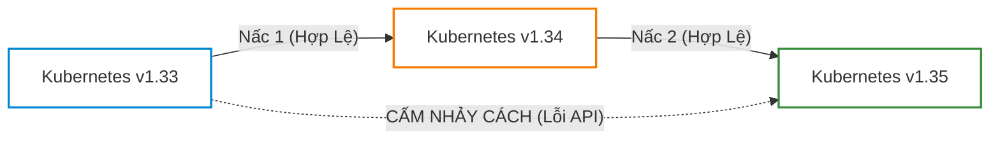
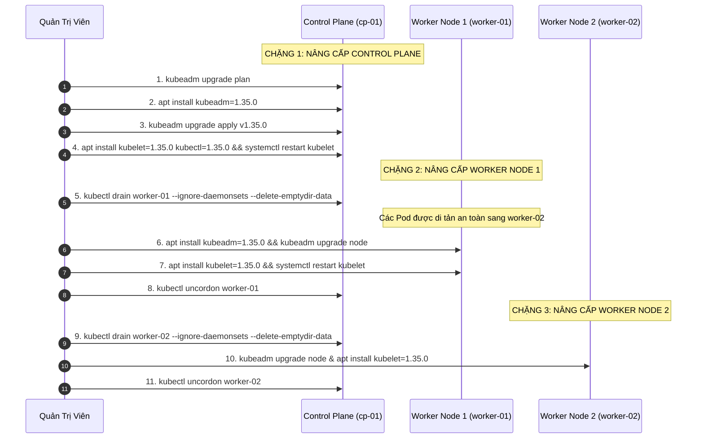
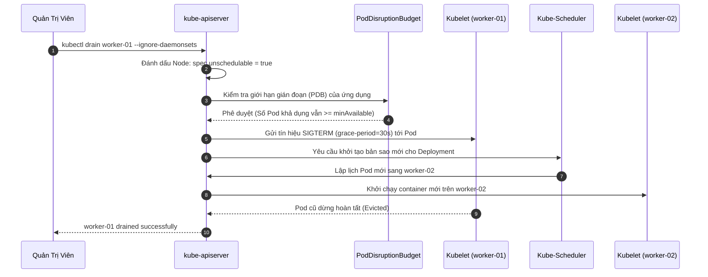
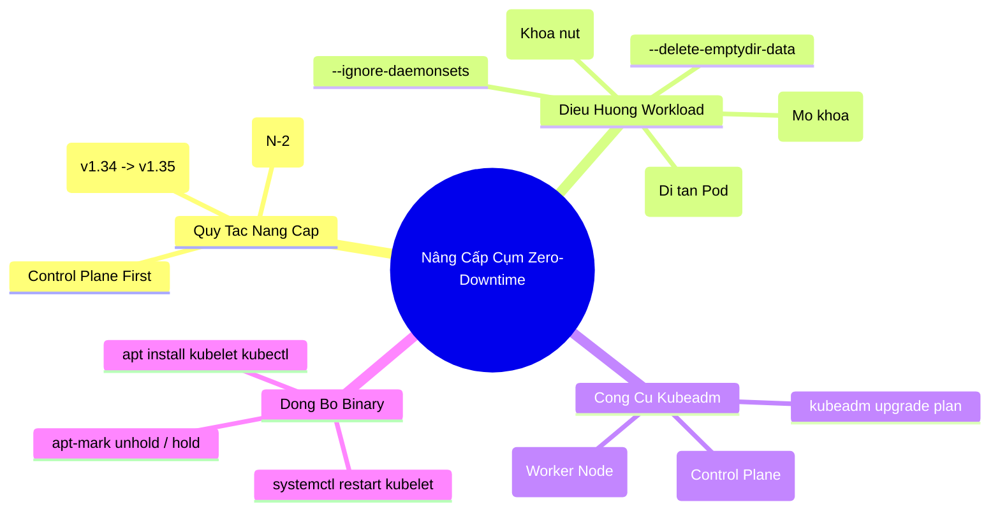


# [BÀI 08] CHIẾN LƯỢC NÂNG CẤP CỤM KUBERNETES ZERO-DOWNTIME: DRAIN, CORDON, KUBEADM UPGRADE & KUBELET SYNC

Trong môi trường điện toán đám mây và microservices phân tán, chu kỳ phát hành của Kubernetes diễn ra rất nhanh: **mỗi năm cộng đồng CNCF phát hành 3 phiên bản Minor mới (khoảng 4 tháng/lần)**. Việc duy trì cụm Kubernetes ở các phiên bản được hỗ trợ (N-2 support policy) là nhiệm vụ bắt buộc của kỹ sư vận hành hạ tầng nhằm đảm bảo các bản vá an ninh (Security Patches) và tối ưu hiệu năng.

Tuy nhiên, nâng cấp một hệ thống phân tán đang xử lý hàng triệu request trực tiếp từ người dùng mà **không gây ra bất kỳ giây ngưng trệ dịch vụ nào (Zero-Downtime)** đòi hỏi một quy trình kỹ thuật chuẩn xác tuyệt đối. Bài thi chứng chỉ **CKA (Certified Kubernetes Administrator)** luôn dành một trọng số lớn cho kỹ năng nâng cấp cụm bằng `kubeadm`, di tản workload an toàn qua `kubectl drain` và khôi phục trạng thái Node bằng `kubectl uncordon`.

---

> [!IMPORTANT]
> **MỤC TIÊU KỸ THUẬT CỐT LÕI (TECHNICAL GOALS):**
> 1. **Quy tắc độ lệch phiên bản (Version Skew Policy):** Thấu hiểu giới hạn tương thích API giữa `kube-apiserver`, Kubelet, `kube-proxy` và `kubectl`.
> 2. **Chuỗi nâng cấp chuẩn mực:** Nâng cấp Control Plane (`kubeadm upgrade apply`) &rarr; CNI Addons &rarr; Từng Worker Node (`kubeadm upgrade node`).
> 3. **Làm chủ bộ 3 lệnh bảo trì:** Phân biệt và sử dụng thành thạo `kubectl cordon`, `kubectl drain` (kèm các cờ an toàn) và `kubectl uncordon`.
> 4. **Đồng bộ mã nguồn nhị phân Kubelet:** Mở khóa gói `apt-mark unhold`, nâng cấp binary và khởi động lại Kubelet daemon.
> 5. **Hands-on Lab 8 bước thực chiến:** Tự tay thực hiện quy trình nâng cấp toàn bộ cụm 3 Node từ v1.34 lên v1.35 đạt 0ms downtime.

---

## 1. Bản Chất Kiến Trúc & Tư Duy Cốt Lõi: Chiến Lược Nâng Cấp Cụm Zero-Downtime

### 1.1. Chính Sách Độ Lệch Phiên Bản (Version Skew Policy) & Quy Tắc 1 Minor Version

Kubernetes phân chia phiên bản theo chuẩn Semantic Versioning: `vX.Y.Z` trong đó `X` là Major, `Y` là Minor và `Z` là Patch.



#### Hai Quy Tắc Cốt Tử:
1. **Tuyệt đối cấm nâng cấp nhảy cóc 2 Minor Versions:**
   - Bạn **không thể** nâng cấp trực tiếp từ `v1.33` lên `v1.35`. Mỗi phiên bản Minor mới có thể xóa bỏ hoàn toàn (deprecate & remove) các trường API cũ.
   - Nếu muốn từ `v1.33` lên `v1.35`, bạn bắt buộc phải thực hiện tuần tự 2 bước: `v1.33 -> v1.34` rồi mới từ `v1.34 -> v1.35`.

2. **Quy tắc Kubelet Skew Policy:**
   - `kube-apiserver` là thành phần trung tâm, luôn phải được nâng cấp **đầu tiên**.
   - `kubelet` trên các Worker Node được phép **chậm hơn tối đa 2 Minor Versions** so với `kube-apiserver` (ví dụ API Server là `v1.35` thì Kubelet có thể là `v1.35`, `v1.34` hoặc `v1.33`).
   - `kubelet` **tuyệt đối không bao giờ được phép chạy phiên bản cao hơn** `kube-apiserver` (Kubelet v1.35 kết nối vào API Server v1.34 sẽ bị từ chối kết nối).

---

### 1.2. Chuỗi Quy Trình Nâng Cấp Cụm Tổng Thể

Quy trình nâng cấp cụm Kubernetes sản xuất bắt buộc phải tuân theo chuỗi 3 chặng nghiêm ngặt:



---

### 1.3. Giải Phẫu Cơ Chế `cordon`, `drain` và `uncordon`

Để nâng cấp hoặc bảo trì phần cứng một Worker Node mà không làm gián đoạn các ứng dụng đang chạy, Kubernetes cung cấp bộ công cụ điều hướng luồng Pod:

```mermaid
graph TD
    subgraph State_Cordon ["1. Trạng Thái Cordon (Chặn Gán Mới)"]
        C_IN["kubectl cordon node-01"] --> C_STATE["Node Condition: SchedulingDisabled<br/>• 0 Pod đang chạy bị di tản<br/>• Scheduler không gán Pod mới vào đây"]
    end

    subgraph State_Drain ["2. Trạng Thái Drain (Di Tản Workload)"]
        D_IN["kubectl drain node-01"] --> D_STEP1["Tự động kích hoạt cordon"]
        D_STEP1 --> D_STEP2["Gọi Eviction API xóa nhẹ nhàng từng Pod ứng dụng"]
        D_STEP2 --> D_STEP3["Deployment / ReplicaSet tự tạo lại Pod trên Node khác"]
    end

    subgraph State_Uncordon ["3. Trạng Thái Uncordon (Mở Khóa Hoạt Động)"]
        U_IN["kubectl uncordon node-01"] --> U_STATE["Gỡ bỏ SchedulingDisabled<br/>Node sẵn sàng nhận Pod mới"]
    end

    style State_Cordon fill:none,stroke:#fbc02d,stroke-width:2px
    style State_Drain fill:none,stroke:#d32f2f,stroke-width:2px
    style State_Uncordon fill:none,stroke:#388e3c,stroke-width:2px
```



#### Các Cờ Bắt Buộc Khi Sử Dụng `kubectl drain`:
1. **`--ignore-daemonsets`:**
   - **Bản chất:** DaemonSet là loại Pod được thiết kế để chạy trên mọi Node trong cụm (như `kube-flannel`, `kube-proxy`, `prom-node-exporter`). 
   - Nếu bạn cố tình xóa DaemonSet Pod, DaemonSet Controller sẽ lập tức khởi tạo lại Pod đó trên Node ngay tức khắc, khiến lệnh `drain` bị kẹt vô hạn. Cờ này ra lệnh cho `drain` bỏ qua việc di tản DaemonSet.
2. **`--delete-emptydir-data`:**
   - Nếu Pod có gắn volume kiểu `emptyDir` (bộ nhớ đệm tạm trên đĩa Node), `drain` sẽ từ chối di tản vì sợ làm mất dữ liệu tạm của người dùng. Cờ này xác nhận bạn đồng ý xóa dữ liệu tạm này để tiếp tục di tản.
3. **`--force`:**
   - Cho phép di tản các **Unmanaged Pods** (những Pod đơn lẻ chạy trực tiếp từ `kubectl run` mà không được quản lý bởi Deployment hay ReplicaSet). Lưu ý: Các Unmanaged Pods này sẽ **bị xóa vĩnh viễn và không tự tạo lại**.

---

### 1.4. Phân Biệt `kubeadm upgrade apply` và `kubeadm upgrade node`

| Tiêu chí | `kubeadm upgrade apply v1.35.x` | `kubeadm upgrade node` |
|---|---|---|
| **Vị trí thực thi** | **Chỉ chạy trên Control Plane đầu tiên (`cp-01`)** | **Chạy trên tất cả các Worker Nodes** (và các Control Plane phụ trong cụm HA) |
| **Nhiệm vụ kỹ thuật** | • Cập nhật Static Pod manifests (`/etc/kubernetes/manifests/`)<br/>• Nâng cấp phiên bản CoreDNS DaemonSet & kube-proxy<br/>• Gia hạn chứng chỉ PKI nếu sắp hết hạn | • Tải cấu hình Kubelet Configuration (`/var/lib/kubelet/config.yaml`) mới từ API Server về Node |
| **Tác động tới Kubelet binary** | **Không** nâng cấp file nhị phân `/usr/bin/kubelet` | **Không** nâng cấp file nhị phân `/usr/bin/kubelet` |
| **Bước kế tiếp bắt buộc** | `apt install kubelet kubectl` & restart service | `apt install kubelet kubectl` & restart service |

---

## 2. Bảng Ma Trận So Sánh Kỹ Thuật Toàn Diện (Engineering Matrix)

### 2.1. Ma Trận Các Lệnh Quản Trị Vòng Đời Node

| Câu lệnh CLI | Tác động tới Pod đang chạy | Tác động tới việc lập lịch Pod mới | Trường hợp sử dụng tối ưu |
|---|---|---|---|
| **`kubectl cordon <node>`** | **Không ảnh hưởng** (Pod giữ nguyên vị trí) | **Chặn hoàn toàn** (`SchedulingDisabled`) | Kiểm tra sơ bộ Node, bảo trì nhẹ không cần tắt máy |
| **`kubectl drain <node>`** | **Di tản toàn bộ** (Evict sang Node khác) | **Chặn hoàn toàn** (`SchedulingDisabled`) | **Nâng cấp OS Kernel, nâng cấp Kubelet, thay thế phần cứng** |
| **`kubectl uncordon <node>`** | **Không ảnh hưởng** (Không tự kéo Pod về) | **Mở lại bình thường** (Nhận Pod mới) | **Hoàn tất bảo trì, đưa Node trở lại hoạt động** |
| **`kubectl delete node <node>`** | Pod bị coi là Dead sau timeout | Xóa hoàn toàn Node khỏi etcd | Loại bỏ vĩnh viễn Node hỏng ra khỏi cụm |

---

### 2.2. Ma Trận Các Phase Của Lệnh `kubeadm upgrade`

| Lệnh / Subcommand | Mục đích kiểm tra | Yêu cầu kết nối mạng | Thao tác can thiệp hệ thống |
|---|---|---|---|
| **`kubeadm upgrade plan`** | Quét toàn bộ cụm, đối chiếu version matrix và kiểm tra tính hợp lệ của certs | Cần kết nối Container Registry để kiểm tra image mới | Hoàn toàn Read-only (Không làm thay đổi cấu hình cụm) |
| **`kubeadm upgrade apply`** | Áp dụng cấu hình mới cho toàn bộ Control Plane manifests | Cần kéo các Container Image mới (`registry.k8s.io`) | Ghi đè tệp manifests và cập nhật Cluster Configuration |
| **`kubeadm upgrade node`** | Cập nhật cấu hình Kubelet cục bộ của Worker Node | Kết nối nội bộ tới `kube-apiserver:6443` | Ghi đè `/var/lib/kubelet/config.yaml` |

---

## 3. Kiến Trúc Môi Trường & Luồng Thực Thi Mẫu

### 3.1. Luồng Di Tản Pod An Toàn Qua Eviction API Của `kubectl drain`



---

## 4. Phân Tích Cạm Bẫy Thực Chiến: Kẹt Drain Do DaemonSet & Lỗi Lệch Kubelet Version

### Tình Huống Sự Cố Thực Tế:
Trong ca trực bảo trì định kỳ, kỹ sư DevOps nhận nhiệm vụ nâng cấp cụm Kubernetes từ v1.34 lên v1.35. Khi gõ lệnh `kubectl drain worker-01`, terminal lập tức bị từ chối với thông báo lỗi liên quan đến DaemonSet. Kỹ sư tiếp tục thực hiện nâng cấp trực tiếp gói `kubelet` trên Worker Node lên v1.35 khi Control Plane vẫn đang ở phiên bản v1.34, dẫn tới toàn bộ các kết nối từ Worker Node bị từ chối và Node chuyển sang `NotReady`.

---

### Hậu Quả & Log Lỗi Thực Tế:
Khi chạy lệnh `kubectl drain` không kèm cờ bỏ qua DaemonSet:

```text
error: cannot delete DaemonSet-managed Pods (use --ignore-daemonsets to ignore): kube-system/kube-flannel-ds-7x9qk, kube-system/kube-proxy-8lm4p
```

Khi Kubelet trên Worker Node được nâng cấp lên phiên bản cao hơn API Server:

```text
Sep 12 20:25:30 worker-01 kubelet[19450]: E0912 20:25:30.412019 19450 server.go:302] "Failed to run kubelet" err="cannot register node with api-server: Kubelet version v1.35.0 is higher than API server version v1.34.2 (unsupported version skew)"
Sep 12 20:25:30 worker-01 systemd[1]: kubelet.service: Main process exited, code=exited, status=1/FAILURE
```

---

### 5-Whys Root Cause Analysis:

1. **Tại sao lệnh `kubectl drain worker-01` bị từ chối?**
   - Vì trên Node có các Pod thuộc quản lý của DaemonSet (`kube-flannel`, `kube-proxy`) mà `drain` không thể tự ý xóa nếu không có xác nhận.
2. **Tại sao Kubelet trên `worker-01` bị crash sau khi nâng cấp?**
   - Vì Kubelet v1.35.0 cố gắng kết nối tới `kube-apiserver` v1.34.2.
3. **Tại sao Kubelet lại có phiên bản cao hơn API Server?**
   - Vì kỹ sư đã thực hiện nâng cấp Worker Node trước khi nâng cấp Control Plane, vi phạm nguyên tắc Version Skew Policy của Kubernetes.
4. **Tại sao lệnh `apt install kubelet` lại tự động chạy mà không bị chặn?**
   - Vì kỹ sư đã mở khóa gói `apt-mark unhold` nhưng không đối soát phiên bản Control Plane hiện hành.
5. **Root Cause cốt lõi là gì?**
   - Thiếu tài liệu quy trình vận hành chuẩn (SOP) về thứ tự nâng cấp cụm (Control Plane First) và thiếu các cờ an toàn khi thực thi `kubectl drain`.

---

## 5. Hands-on Lab: Nâng Cấp Cụm Kubernetes 3 Node Chuẩn Production (8 Bước)

| Bước | Tên nhiệm vụ | Tiêu chí kỹ thuật hoàn thành |
|---|---|---|
| **Bước 1** | Kiểm tra kế hoạch nâng cấp bằng `kubeadm upgrade plan` | Đọc danh sách phiên bản có thể nâng cấp trên Control Plane. |
| **Bước 2** | Nâng cấp gói công cụ `kubeadm` trên Control Plane | `kubeadm version` hiển thị phiên bản mới `v1.35.0`. |
| **Bước 3** | Áp dụng nâng cấp Control Plane bằng `kubeadm upgrade apply` | Nâng cấp static pods và core addons thành công. |
| **Bước 4** | Nâng cấp nhị phân `kubelet` & `kubectl` trên Control Plane | `kubectl get nodes` hiển thị Control Plane đạt phiên bản `v1.35.0`. |
| **Bước 5** | Di tản workload khỏi `worker-01` bằng `kubectl drain` | `worker-01` ở trạng thái `SchedulingDisabled`, Pods chuyển sang `worker-02`. |
| **Bước 6** | Nâng cấp `worker-01` bằng `kubeadm upgrade node` & Kubelet binary | Kubelet trên `worker-01` nâng cấp lên `v1.35.0` và khởi động lại. |
| **Bước 7** | Mở khóa `worker-01` bằng `kubectl uncordon` | `worker-01` trở lại trạng thái `Ready` và sẵn sàng nhận Pod mới. |
| **Bước 8** | Thực hiện Rolling Upgrade cho `worker-02` & Xác nhận toàn cụm | 100% cả 3 Node đạt phiên bản `v1.35.0` và trạng thái `Ready`. |

---

### Bước 1: Kiểm tra kế hoạch nâng cấp bằng `kubeadm upgrade plan`

Thực hiện trên Control Plane Node (`cp-01`):

```bash
# 1. Kiểm tra trạng thái và phiên bản các Node hiện tại
kubectl get nodes -o wide

# 2. Chạy kế hoạch kiểm tra tương thích nâng cấp
sudo kubeadm upgrade plan
```

---

### Bước 2: Nâng cấp gói công cụ `kubeadm` trên Control Plane

```bash
# 1. Mở khóa gói kubeadm
sudo apt-mark unhold kubeadm

# 2. Cập nhật danh sách gói và cài đặt kubeadm phiên bản mới
sudo apt-get update && sudo apt-get install -y kubeadm=1.35.0-1.1

# 3. Khóa lại phiên bản kubeadm
sudo apt-mark hold kubeadm

# 4. Xác nhận phiên bản kubeadm đã nâng cấp
kubeadm version
```

---

### Bước 3: Áp dụng nâng cấp Control Plane bằng `kubeadm upgrade apply`

```bash
# Áp dụng nâng cấp Control Plane lên v1.35.0 (tự động cập nhật manifests etcd, apiserver)
sudo kubeadm upgrade apply v1.35.0 -y
```

---

### Bước 4: Nâng cấp nhị phân `kubelet` & `kubectl` trên Control Plane

```bash
# 1. Mở khóa kubelet và kubectl
sudo apt-mark unhold kubelet kubectl

# 2. Cài đặt phiên bản mới
sudo apt-get install -y kubelet=1.35.0-1.1 kubectl=1.35.0-1.1

# 3. Khóa lại phiên bản
sudo apt-mark hold kubelet kubectl

# 4. Nạp lại cấu hình systemd và khởi động lại Kubelet
sudo systemctl daemon-reload
sudo systemctl restart kubelet

# 5. Kiểm tra phiên bản Control Plane đã cập nhật
kubectl get nodes
```

---

### Bước 5: Di tản workload khỏi `worker-01` bằng `kubectl drain`

Thực hiện từ Control Plane (`cp-01`):

```bash
# Di tản toàn bộ Pods ứng dụng khỏi worker-01 một cách an toàn
kubectl drain worker-01 --ignore-daemonsets --delete-emptydir-data --force

# Kiểm tra trạng thái worker-01 đã bị khoá (SchedulingDisabled)
kubectl get nodes
```

---

### Bước 6: Nâng cấp `worker-01` bằng `kubeadm upgrade node` & Kubelet binary

SSH / Truy cập vào máy chủ `worker-01`:

```bash
# 1. Mở khóa và nâng cấp gói kubeadm trên Worker
sudo apt-mark unhold kubeadm
sudo apt-get update && sudo apt-get install -y kubeadm=1.35.0-1.1
sudo apt-mark hold kubeadm

# 2. Nâng cấp cấu hình Kubelet cục bộ từ Control Plane
sudo kubeadm upgrade node

# 3. Nâng cấp nhị phân kubelet và kubectl
sudo apt-mark unhold kubelet kubectl
sudo apt-get install -y kubelet=1.35.0-1.1 kubectl=1.35.0-1.1
sudo apt-mark hold kubelet kubectl

# 4. Khởi động lại dịch vụ Kubelet
sudo systemctl daemon-reload
sudo systemctl restart kubelet
```

---

### Bước 7: Mở khóa `worker-01` bằng `kubectl uncordon`

Thực hiện từ Control Plane (`cp-01`):

```bash
# Mở khóa cho worker-01 tiếp nhận Pod trở lại
kubectl uncordon worker-01

# Kiểm tra worker-01 đã về trạng thái Ready ở phiên bản v1.35.0
kubectl get nodes
```

---

### Bước 8: Thực hiện Rolling Upgrade cho `worker-02` & Xác nhận toàn cụm

Lặp lại quy trình tương tự cho `worker-02`:

```bash
# 1. Drain worker-02 từ Control Plane
kubectl drain worker-02 --ignore-daemonsets --delete-emptydir-data --force

# 2. Trên worker-02: Nâng cấp kubeadm, chạy kubeadm upgrade node, nâng cấp kubelet
sudo apt-mark unhold kubeadm kubelet kubectl
sudo apt-get update && sudo apt-get install -y kubeadm=1.35.0-1.1 kubelet=1.35.0-1.1 kubectl=1.35.0-1.1
sudo apt-mark hold kubeadm kubelet kubectl
sudo kubeadm upgrade node
sudo systemctl daemon-reload && sudo systemctl restart kubelet

# 3. Trên Control Plane: Mở khóa worker-02
kubectl uncordon worker-02

# 4. KIỂM TRA CUỐI CÙNG: Toàn bộ 3 Node đều đạt v1.35.0 và trạng thái Ready
kubectl get nodes -o wide
```

---

## 6. 10 Câu Hỏi Tự Kiểm Tra Chuyên Sâu (Self-Check Q&A Accordion)

<details class="qa-card">
<summary class="qa-summary">
  <div class="qa-summary-left">
    <span class="qa-num-badge">Q01</span>
    <span>Tại sao Kubernetes nghiêm cấm việc nâng cấp nhảy cóc 2 Minor Versions (ví dụ từ v1.33 lên thẳng v1.35)?</span>
  </div>
  <span class="qa-chevron">
    <svg width="18" height="18" fill="none" stroke="currentColor" stroke-width="2.5" viewBox="0 0 24 24"><polyline points="6 9 12 15 18 9"></polyline></svg>
  </span>
</summary>
<div class="qa-answer">
  <div class="qa-answer-header">
    <svg width="14" height="14" fill="none" stroke="currentColor" stroke-width="2" viewBox="0 0 24 24"><path d="M22 11.08V12a10 10 0 1 1-5.93-9.14"></path><polyline points="22 4 12 14.01 9 11.01"></polyline></svg>
    <span>Phân Tích &amp; Lời Giải Kỹ Thuật</span>
  </div>
  <div style="margin: 0.35rem 0; padding-left: 1rem; border-left: 2px solid var(--accent-primary);">• <b>Nguyên nhân cốt lõi:</b> Chu kỳ loại bỏ API (API Deprecation Policy) của Kubernetes yêu cầu các API bị gỡ bỏ phải trải qua ít nhất 1 phiên bản Minor cảnh báo trước khi bị xóa hẳn.</div>
  <div style="margin: 0.35rem 0; padding-left: 1rem; border-left: 2px solid var(--accent-primary);">• Nếu nâng cấp nhảy cóc 2 Minor versions, các đối tượng lưu trữ trong etcd hoặc tệp cấu hình Kubelet thuộc schema cũ sẽ không có giai đoạn chuyển đổi (Migration phase), dẫn đến việc API Server từ chối khởi động và làm hỏng cơ sở dữ liệu cụm.</div>
  <div style="margin-top: 0.75rem;"><b style="color: var(--accent-primary);">Tiêu chí chấm điểm &amp; Phân tầng năng lực:</b></div>
  <div style="margin: 0.25rem 0; padding-left: 1rem; border-left: 2px solid var(--accent-primary);">• <b>0đ:</b> Cho rằng có thể nâng cấp nhảy cách bình thường.</div>
  <div style="margin: 0.25rem 0; padding-left: 1rem; border-left: 2px solid var(--accent-primary);">• <b>1đ:</b> Nêu được do lỗi không tương thích nhưng không giải thích được cơ chế API Deprecation.</div>
  <div style="margin: 0.25rem 0; padding-left: 1rem; border-left: 2px solid var(--accent-primary);">• <b>2đ:</b> Giải thích chính xác chu kỳ xóa API và quy trình nâng cấp tuần tự từng Minor version.</div>
  <div style="margin: 0.25rem 0; padding-left: 1rem; border-left: 2px solid var(--accent-primary);">• <b>3đ:</b> Trả lời xuất sắc, nêu rõ các bước nâng cấp trung gian (v1.33 &rarr; v1.34 &rarr; v1.35).</div>
  <div style="margin-top: 0.75rem; padding: 0.5rem 0.75rem; background: rgba(var(--accent-primary-rgb, 59, 130, 246), 0.08); border-radius: 4px;"><b style="color: var(--accent-primary);">Câu hỏi mở rộng:</b> Đối với Patch version (ví dụ v1.35.0 lên v1.35.4) có được phép nâng cấp nhảy cách không? <i>(Đáp án: Được phép nhảy cách giữa các bản vá Patch trong cùng 1 Minor version).</i></div>
</div>
</details>

<details class="qa-card">
<summary class="qa-summary">
  <div class="qa-summary-left">
    <span class="qa-num-badge">Q02</span>
    <span>Trình bày thứ tự nâng cấp chuẩn giữa Control Plane và các Worker Node trong cụm.</span>
  </div>
  <span class="qa-chevron">
    <svg width="18" height="18" fill="none" stroke="currentColor" stroke-width="2.5" viewBox="0 0 24 24"><polyline points="6 9 12 15 18 9"></polyline></svg>
  </span>
</summary>
<div class="qa-answer">
  <div class="qa-answer-header">
    <svg width="14" height="14" fill="none" stroke="currentColor" stroke-width="2" viewBox="0 0 24 24"><path d="M22 11.08V12a10 10 0 1 1-5.93-9.14"></path><polyline points="22 4 12 14.01 9 11.01"></polyline></svg>
    <span>Phân Tích &amp; Lời Giải Kỹ Thuật</span>
  </div>
  <div style="margin: 0.35rem 0; padding-left: 1rem; border-left: 2px solid var(--accent-primary);">• <b>Thứ tự chuẩn:</b></div>
  <div style="margin: 0.35rem 0; padding-left: 1rem; border-left: 2px solid var(--accent-primary);">  1. <b>Control Plane (cp-01):</b> Luôn phải được nâng cấp đầu tiên để nạp các API schemas mới.</div>
  <div style="margin: 0.35rem 0; padding-left: 1rem; border-left: 2px solid var(--accent-primary);">  2. <b>CNI &amp; Addons (Flannel/Calico, CoreDNS):</b> Nâng cấp để tương thích với API Server mới.</div>
  <div style="margin: 0.35rem 0; padding-left: 1rem; border-left: 2px solid var(--accent-primary);">  3. <b>Worker Nodes (worker-01, worker-02):</b> Thực hiện nâng cấp rolling (từng Node một) sau cùng.</div>
  <div style="margin-top: 0.75rem;"><b style="color: var(--accent-primary);">Tiêu chí chấm điểm &amp; Phân tầng năng lực:</b></div>
  <div style="margin: 0.25rem 0; padding-left: 1rem; border-left: 2px solid var(--accent-primary);">• <b>0đ:</b> Cho rằng nâng cấp Worker Node trước Control Plane.</div>
  <div style="margin: 0.25rem 0; padding-left: 1rem; border-left: 2px solid var(--accent-primary);">• <b>1đ:</b> Nhớ Control Plane trước nhưng không nêu được vai trò của CNI Addons.</div>
  <div style="margin: 0.25rem 0; padding-left: 1rem; border-left: 2px solid var(--accent-primary);">• <b>2đ:</b> Trình bày chính xác thứ tự 3 chặng Control Plane &rarr; Addons &rarr; Worker Nodes.</div>
  <div style="margin: 0.25rem 0; padding-left: 1rem; border-left: 2px solid var(--accent-primary);">• <b>3đ:</b> Trả lời xuất sắc, phân tích nguyên lý tương thích lùi (Backward compatibility) của API Server.</div>
  <div style="margin-top: 0.75rem; padding: 0.5rem 0.75rem; background: rgba(var(--accent-primary-rgb, 59, 130, 246), 0.08); border-radius: 4px;"><b style="color: var(--accent-primary);">Câu hỏi mở rộng:</b> Kubelet trên Worker Node có được phép chạy phiên bản cao hơn API Server không? <i>(Đáp án: Tuyệt đối không, Kubelet version &le; API Server version).</i></div>
</div>
</details>

<details class="qa-card">
<summary class="qa-summary">
  <div class="qa-summary-left">
    <span class="qa-num-badge">Q03</span>
    <span>Theo Kubernetes Version Skew Policy, Kubelet trên Worker Node được phép chậm hơn API Server tối đa bao nhiêu phiên bản?</span>
  </div>
  <span class="qa-chevron">
    <svg width="18" height="18" fill="none" stroke="currentColor" stroke-width="2.5" viewBox="0 0 24 24"><polyline points="6 9 12 15 18 9"></polyline></svg>
  </span>
</summary>
<div class="qa-answer">
  <div class="qa-answer-header">
    <svg width="14" height="14" fill="none" stroke="currentColor" stroke-width="2" viewBox="0 0 24 24"><path d="M22 11.08V12a10 10 0 1 1-5.93-9.14"></path><polyline points="22 4 12 14.01 9 11.01"></polyline></svg>
    <span>Phân Tích &amp; Lời Giải Kỹ Thuật</span>
  </div>
  <div style="margin: 0.35rem 0; padding-left: 1rem; border-left: 2px solid var(--accent-primary);">• Kubelet được phép chậm hơn <code>kube-apiserver</code> tối đa <b>2 Minor Versions (N-2)</b>. (Từ Kubernetes v1.28+, chính sách này được nới rộng lên N-3 trong một số thành phần, nhưng N-2 vẫn là chuẩn khuyến nghị vàng).</div>
  <div style="margin: 0.35rem 0; padding-left: 1rem; border-left: 2px solid var(--accent-primary);">• Ví dụ: Nếu API Server đang ở <code>v1.35</code>, các Worker Node chạy Kubelet <code>v1.35</code>, <code>v1.34</code>, hoặc <code>v1.33</code> vẫn được hỗ trợ và giao tiếp bình thường.</div>
  <div style="margin-top: 0.75rem;"><b style="color: var(--accent-primary);">Tiêu chí chấm điểm &amp; Phân tầng năng lực:</b></div>
  <div style="margin: 0.25rem 0; padding-left: 1rem; border-left: 2px solid var(--accent-primary);">• <b>0đ:</b> Không nhớ con số quy định.</div>
  <div style="margin: 0.25rem 0; padding-left: 1rem; border-left: 2px solid var(--accent-primary);">• <b>1đ:</b> Nhầm lẫn giữa Minor Version và Patch Version.</div>
  <div style="margin: 0.25rem 0; padding-left: 1rem; border-left: 2px solid var(--accent-primary);">• <b>2đ:</b> Nêu chính xác con số 2 Minor Versions (N-2).</div>
  <div style="margin: 0.25rem 0; padding-left: 1rem; border-left: 2px solid var(--accent-primary);">• <b>3đ:</b> Trình bày hoàn hảo, phân tích sự khác biệt Skew Policy giữa Kubelet, kubectl và kube-proxy.</div>
  <div style="margin-top: 0.75rem; padding: 0.5rem 0.75rem; background: rgba(var(--accent-primary-rgb, 59, 130, 246), 0.08); border-radius: 4px;"><b style="color: var(--accent-primary);">Câu hỏi mở rộng:</b> Công cụ <code>kubectl</code> được phép lệch bao nhiêu Minor version so với API Server? <i>(Đáp án: Được phép lệch +/- 1 Minor version so với API Server).</i></div>
</div>
</details>

<details class="qa-card">
<summary class="qa-summary">
  <div class="qa-summary-left">
    <span class="qa-num-badge">Q04</span>
    <span>Lệnh <code>kubeadm upgrade plan</code> thực hiện những nhiệm vụ gì trước khi quản trị viên chạy lệnh nâng cấp chính thức?</span>
  </div>
  <span class="qa-chevron">
    <svg width="18" height="18" fill="none" stroke="currentColor" stroke-width="2.5" viewBox="0 0 24 24"><polyline points="6 9 12 15 18 9"></polyline></svg>
  </span>
</summary>
<div class="qa-answer">
  <div class="qa-answer-header">
    <svg width="14" height="14" fill="none" stroke="currentColor" stroke-width="2" viewBox="0 0 24 24"><path d="M22 11.08V12a10 10 0 1 1-5.93-9.14"></path><polyline points="22 4 12 14.01 9 11.01"></polyline></svg>
    <span>Phân Tích &amp; Lời Giải Kỹ Thuật</span>
  </div>
  <div style="margin: 0.35rem 0; padding-left: 1rem; border-left: 2px solid var(--accent-primary);">• 1. Quét phiên bản hiện tại của toàn bộ các thành phần Control Plane (API Server, Controller Manager, Scheduler, etcd, CoreDNS, kube-proxy).</div>
  <div style="margin: 0.35rem 0; padding-left: 1rem; border-left: 2px solid var(--accent-primary);">• 2. Kiểm tra tính khả dụng của phiên bản nâng cấp hợp lệ tiếp theo từ container registry.</div>
  <div style="margin: 0.35rem 0; padding-left: 1rem; border-left: 2px solid var(--accent-primary);">• 3. Kiểm tra ngày hết hạn của toàn bộ chứng chỉ PKI Control Plane.</div>
  <div style="margin: 0.35rem 0; padding-left: 1rem; border-left: 2px solid var(--accent-primary);">• 4. In ra câu lệnh chính xác <code>kubeadm upgrade apply vX.Y.Z</code> cần thực thi.</div>
  <div style="margin-top: 0.75rem;"><b style="color: var(--accent-primary);">Tiêu chí chấm điểm &amp; Phân tầng năng lực:</b></div>
  <div style="margin: 0.25rem 0; padding-left: 1rem; border-left: 2px solid var(--accent-primary);">• <b>0đ:</b> Nghĩ rằng lệnh plan tự động nâng cấp cụm.</div>
  <div style="margin: 0.25rem 0; padding-left: 1rem; border-left: 2px solid var(--accent-primary);">• <b>1đ:</b> Nêu được việc kiểm tra version nhưng quên tính năng kiểm tra hạn certs.</div>
  <div style="margin: 0.25rem 0; padding-left: 1rem; border-left: 2px solid var(--accent-primary);">• <b>2đ:</b> Liệt kê đầy đủ 4 nhiệm vụ của lệnh <code>kubeadm upgrade plan</code>.</div>
  <div style="margin: 0.25rem 0; padding-left: 1rem; border-left: 2px solid var(--accent-primary);">• <b>3đ:</b> Trả lời xuất sắc, nhấn mạnh tính chất Read-only không gây ảnh hưởng tới cụm đang chạy.</div>
  <div style="margin-top: 0.75rem; padding: 0.5rem 0.75rem; background: rgba(var(--accent-primary-rgb, 59, 130, 246), 0.08); border-radius: 4px;"><b style="color: var(--accent-primary);">Câu hỏi mở rộng:</b> Lệnh <code>kubeadm upgrade plan</code> có cần quyền <code>sudo</code> không? <i>(Đáp án: Có, vì cần đọc các tệp cấu hình và chứng chỉ trong <code>/etc/kubernetes/</code>).</i></div>
</div>
</details>

<details class="qa-card">
<summary class="qa-summary">
  <div class="qa-summary-left">
    <span class="qa-num-badge">Q05</span>
    <span>Phân biệt sự khác nhau cốt lõi giữa hai lệnh <code>kubectl cordon</code> và <code>kubectl drain</code>.</span>
  </div>
  <span class="qa-chevron">
    <svg width="18" height="18" fill="none" stroke="currentColor" stroke-width="2.5" viewBox="0 0 24 24"><polyline points="6 9 12 15 18 9"></polyline></svg>
  </span>
</summary>
<div class="qa-answer">
  <div class="qa-answer-header">
    <svg width="14" height="14" fill="none" stroke="currentColor" stroke-width="2" viewBox="0 0 24 24"><path d="M22 11.08V12a10 10 0 1 1-5.93-9.14"></path><polyline points="22 4 12 14.01 9 11.01"></polyline></svg>
    <span>Phân Tích &amp; Lời Giải Kỹ Thuật</span>
  </div>
  <div style="margin: 0.35rem 0; padding-left: 1rem; border-left: 2px solid var(--accent-primary);">• <b><code>kubectl cordon &lt;node&gt;</code>:</b> Chỉ đánh dấu Node là <code>SchedulingDisabled</code> để ngăn không cho Scheduler gán Pod mới vào. <b>Không có bất kỳ Pod nào đang chạy bị xóa hay di tản</b>.</div>
  <div style="margin: 0.35rem 0; padding-left: 1rem; border-left: 2px solid var(--accent-primary);">• <b><code>kubectl drain &lt;node&gt;</code>:</b> Tự động thực hiện <code>cordon</code> trước, sau đó gọi Eviction API để <b>xóa nhẹ nhàng và di tản toàn bộ các Pod đang chạy</b> sang các Node khác trong cụm để giải phóng Node.</div>
  <div style="margin-top: 0.75rem;"><b style="color: var(--accent-primary);">Tiêu chí chấm điểm &amp; Phân tầng năng lực:</b></div>
  <div style="margin: 0.25rem 0; padding-left: 1rem; border-left: 2px solid var(--accent-primary);">• <b>0đ:</b> Cho rằng hai lệnh này có tác dụng giống hệt nhau.</div>
  <div style="margin: 0.25rem 0; padding-left: 1rem; border-left: 2px solid var(--accent-primary);">• <b>1đ:</b> Phân biệt được nhưng không giải thích được cơ chế di tản Pod của drain.</div>
  <div style="margin: 0.25rem 0; padding-left: 1rem; border-left: 2px solid var(--accent-primary);">• <b>2đ:</b> Phân tích chuẩn xác sự khác biệt về số lượng Pod bị tác động (0 Pod vs Tất cả Pod).</div>
  <div style="margin: 0.25rem 0; padding-left: 1rem; border-left: 2px solid var(--accent-primary);">• <b>3đ:</b> Trả lời xuất sắc, nêu trường hợp sử dụng tối ưu của từng lệnh trong bảo trì thực tế.</div>
  <div style="margin-top: 0.75rem; padding: 0.5rem 0.75rem; background: rgba(var(--accent-primary-rgb, 59, 130, 246), 0.08); border-radius: 4px;"><b style="color: var(--accent-primary);">Câu hỏi mở rộng:</b> Khi chạy <code>kubectl uncordon</code>, các Pod đã bị di tản trước đó có tự động chuyển ngược về Node cũ không? <i>(Đáp án: Không, Scheduler không tự rebalance Pods trừ khi có Pod mới được tạo).</i></div>
</div>
</details>

<details class="qa-card">
<summary class="qa-summary">
  <div class="qa-summary-left">
    <span class="qa-num-badge">Q06</span>
    <span>Tại sao khi chạy <code>kubectl drain</code> trên Worker Node thường bắt buộc phải kèm 2 cờ <code>--ignore-daemonsets</code> và <code>--delete-emptydir-data</code>?</span>
  </div>
  <span class="qa-chevron">
    <svg width="18" height="18" fill="none" stroke="currentColor" stroke-width="2.5" viewBox="0 0 24 24"><polyline points="6 9 12 15 18 9"></polyline></svg>
  </span>
</summary>
<div class="qa-answer">
  <div class="qa-answer-header">
    <svg width="14" height="14" fill="none" stroke="currentColor" stroke-width="2" viewBox="0 0 24 24"><path d="M22 11.08V12a10 10 0 1 1-5.93-9.14"></path><polyline points="22 4 12 14.01 9 11.01"></polyline></svg>
    <span>Phân Tích &amp; Lời Giải Kỹ Thuật</span>
  </div>
  <div style="margin: 0.35rem 0; padding-left: 1rem; border-left: 2px solid var(--accent-primary);">• <b><code>--ignore-daemonsets</code>:</b> Pod DaemonSet (như CNI, kube-proxy) chạy cố định trên mọi Node. Nếu cố xóa DaemonSet, controller sẽ tạo lại ngay lập tức làm lệnh drain kẹt vô hạn. Cờ này bảo drain bỏ qua các Pod này.</div>
  <div style="margin: 0.35rem 0; padding-left: 1rem; border-left: 2px solid var(--accent-primary);">• <b><code>--delete-emptydir-data</code>:</b> Mặc định drain từ chối di tản Pod có gắn volume tạm <code>emptyDir</code> vì dữ liệu trên đĩa local của Pod đó sẽ bị xóa. Cờ này xác nhận người quản trị chấp nhận xóa dữ liệu tạm để hoàn tất di tản.</div>
  <div style="margin-top: 0.75rem;"><b style="color: var(--accent-primary);">Tiêu chí chấm điểm &amp; Phân tầng năng lực:</b></div>
  <div style="margin: 0.25rem 0; padding-left: 1rem; border-left: 2px solid var(--accent-primary);">• <b>0đ:</b> Không biết ý nghĩa của 2 cờ này.</div>
  <div style="margin: 0.25rem 0; padding-left: 1rem; border-left: 2px solid var(--accent-primary);">• <b>1đ:</b> Giải thích được cờ DaemonSet nhưng quên cờ emptyDir.</div>
  <div style="margin: 0.25rem 0; padding-left: 1rem; border-left: 2px solid var(--accent-primary);">• <b>2đ:</b> Trình bày chuẩn xác nguyên nhân và tác dụng bảo vệ an toàn dữ liệu của 2 cờ.</div>
  <div style="margin: 0.25rem 0; padding-left: 1rem; border-left: 2px solid var(--accent-primary);">• <b>3đ:</b> Trả lời xuất sắc, nêu thêm cờ <code>--force</code> đối với Unmanaged Pods trong phòng thi CKA.</div>
  <div style="margin-top: 0.75rem; padding: 0.5rem 0.75rem; background: rgba(var(--accent-primary-rgb, 59, 130, 246), 0.08); border-radius: 4px;"><b style="color: var(--accent-primary);">Câu hỏi mở rộng:</b> Đối với PersistentVolume (PV) mạng (NFS/EBS), khi drain node thì dữ liệu có bị mất không? <i>(Đáp án: Không mất, volume mạng sẽ được unmount khỏi Node cũ và re-attach vào Node mới).</i></div>
</div>
</details>

<details class="qa-card">
<summary class="qa-summary">
  <div class="qa-summary-left">
    <span class="qa-num-badge">Q07</span>
    <span>Phân biệt sự khác nhau giữa câu lệnh <code>kubeadm upgrade apply</code> và <code>kubeadm upgrade node</code>.</span>
  </div>
  <span class="qa-chevron">
    <svg width="18" height="18" fill="none" stroke="currentColor" stroke-width="2.5" viewBox="0 0 24 24"><polyline points="6 9 12 15 18 9"></polyline></svg>
  </span>
</summary>
<div class="qa-answer">
  <div class="qa-answer-header">
    <svg width="14" height="14" fill="none" stroke="currentColor" stroke-width="2" viewBox="0 0 24 24"><path d="M22 11.08V12a10 10 0 1 1-5.93-9.14"></path><polyline points="22 4 12 14.01 9 11.01"></polyline></svg>
    <span>Phân Tích &amp; Lời Giải Kỹ Thuật</span>
  </div>
  <div style="margin: 0.35rem 0; padding-left: 1rem; border-left: 2px solid var(--accent-primary);">• <b><code>kubeadm upgrade apply &lt;version&gt;</code>:</b> Chỉ chạy trên <b>Control Plane Node đầu tiên</b>. Nhiệm vụ: Nâng cấp các Static Pods manifests, nâng cấp CoreDNS/kube-proxy DaemonSets và gia hạn chứng chỉ toàn cụm.</div>
  <div style="margin: 0.35rem 0; padding-left: 1rem; border-left: 2px solid var(--accent-primary);">• <b><code>kubeadm upgrade node</code>:</b> Chạy trên <b>tất cả các Worker Nodes</b> (và các Control Plane phụ). Nhiệm vụ: Chỉ tải về tệp cấu hình Kubelet mới (<code>/var/lib/kubelet/config.yaml</code>) từ API Server.</div>
  <div style="margin-top: 0.75rem;"><b style="color: var(--accent-primary);">Tiêu chí chấm điểm &amp; Phân tầng năng lực:</b></div>
  <div style="margin: 0.25rem 0; padding-left: 1rem; border-left: 2px solid var(--accent-primary);">• <b>0đ:</b> Dùng nhầm kubeadm upgrade apply trên Worker Node.</div>
  <div style="margin: 0.25rem 0; padding-left: 1rem; border-left: 2px solid var(--accent-primary);">• <b>1đ:</b> Biết lệnh chạy ở đâu nhưng không phân biệt được đối tượng cấu hình được cập nhật.</div>
  <div style="margin: 0.25rem 0; padding-left: 1rem; border-left: 2px solid var(--accent-primary);">• <b>2đ:</b> Phân tích chuẩn xác vai trò Control Plane vs Worker Node của 2 lệnh.</div>
  <div style="margin: 0.25rem 0; padding-left: 1rem; border-left: 2px solid var(--accent-primary);">• <b>3đ:</b> Trả lời hoàn hảo, nhấn mạnh cả 2 lệnh đều không tự nâng cấp file thực thi nhị phân kubelet.</div>
  <div style="margin-top: 0.75rem; padding: 0.5rem 0.75rem; background: rgba(var(--accent-primary-rgb, 59, 130, 246), 0.08); border-radius: 4px;"><b style="color: var(--accent-primary);">Câu hỏi mở rộng:</b> Nếu chạy <code>kubeadm upgrade apply</code> trên Worker Node thì điều gì xảy ra? <i>(Đáp án: Báo lỗi vì Worker Node không chứa thư mục manifests của static pods).</i></div>
</div>
</details>

<details class="qa-card">
<summary class="qa-summary">
  <div class="qa-summary-left">
    <span class="qa-num-badge">Q08</span>
    <span>Tại sao sau khi chạy <code>kubeadm upgrade node</code> trên Worker Node, lệnh <code>kubectl get nodes</code> vẫn hiển thị phiên bản cũ?</span>
  </div>
  <span class="qa-chevron">
    <svg width="18" height="18" fill="none" stroke="currentColor" stroke-width="2.5" viewBox="0 0 24 24"><polyline points="6 9 12 15 18 9"></polyline></svg>
  </span>
</summary>
<div class="qa-answer">
  <div class="qa-answer-header">
    <svg width="14" height="14" fill="none" stroke="currentColor" stroke-width="2" viewBox="0 0 24 24"><path d="M22 11.08V12a10 10 0 1 1-5.93-9.14"></path><polyline points="22 4 12 14.01 9 11.01"></polyline></svg>
    <span>Phân Tích &amp; Lời Giải Kỹ Thuật</span>
  </div>
  <div style="margin: 0.35rem 0; padding-left: 1rem; border-left: 2px solid var(--accent-primary);">• <b>Bản chất kỹ thuật:</b> Cột <code>VERSION</code> trong <code>kubectl get nodes</code> phản ánh phiên bản nhị phân của tiến trình <b>Kubelet Daemon</b> đang chạy trên Node đó.</div>
  <div style="margin: 0.35rem 0; padding-left: 1rem; border-left: 2px solid var(--accent-primary);">• Lệnh <code>kubeadm upgrade node</code> chỉ cập nhật tệp cấu hình Kubelet (config file), nó **không tự nâng cấp gói phần mềm OS chứa file nhị phân `/usr/bin/kubelet`**.</div>
  <div style="margin: 0.35rem 0; padding-left: 1rem; border-left: 2px solid var(--accent-primary);">• <b>Cách xử lý:</b> Bắt buộc phải chạy <code>apt install -y kubelet=vX.Y.Z</code> và <code>systemctl restart kubelet</code> để hoàn tất việc cập nhật phiên bản.</div>
  <div style="margin-top: 0.75rem;"><b style="color: var(--accent-primary);">Tiêu chí chấm điểm &amp; Phân tầng năng lực:</b></div>
  <div style="margin: 0.25rem 0; padding-left: 1rem; border-left: 2px solid var(--accent-primary);">• <b>0đ:</b> Tưởng rằng hệ thống bị lỗi cache.</div>
  <div style="margin: 0.25rem 0; padding-left: 1rem; border-left: 2px solid var(--accent-primary);">• <b>1đ:</b> Biết cần cài lại kubelet nhưng không giải thích được sự tách biệt giữa config và binary.</div>
  <div style="margin: 0.25rem 0; padding-left: 1rem; border-left: 2px solid var(--accent-primary);">• <b>2đ:</b> Phân tích chính xác vai trò của apt install kubelet và restart systemd.</div>
  <div style="margin: 0.25rem 0; padding-left: 1rem; border-left: 2px solid var(--accent-primary);">• <b>3đ:</b> Trả lời xuất sắc, chỉ ra thêm việc cần <code>systemctl daemon-reload</code> trước khi restart kubelet.</div>
  <div style="margin-top: 0.75rem; padding: 0.5rem 0.75rem; background: rgba(var(--accent-primary-rgb, 59, 130, 246), 0.08); border-radius: 4px;"><b style="color: var(--accent-primary);">Câu hỏi mở rộng:</b> Nếu quên chạy <code>apt-mark hold kubelet</code> sau khi nâng cấp thì có rủi ro gì? <i>(Đáp án: Kubelet có thể bị tự động nâng cấp ngoài ý muốn trong các lượt chạy apt upgrade định kỳ).</i></div>
</div>
</details>

<details class="qa-card">
<summary class="qa-summary">
  <div class="qa-summary-left">
    <span class="qa-num-badge">Q09</span>
    <span>Đối tượng <code>PodDisruptionBudget</code> (PDB) đóng vai trò gì trong việc bảo vệ ứng dụng khi thực hiện <code>kubectl drain</code>?</span>
  </div>
  <span class="qa-chevron">
    <svg width="18" height="18" fill="none" stroke="currentColor" stroke-width="2.5" viewBox="0 0 24 24"><polyline points="6 9 12 15 18 9"></polyline></svg>
  </span>
</summary>
<div class="qa-answer">
  <div class="qa-answer-header">
    <svg width="14" height="14" fill="none" stroke="currentColor" stroke-width="2" viewBox="0 0 24 24"><path d="M22 11.08V12a10 10 0 1 1-5.93-9.14"></path><polyline points="22 4 12 14.01 9 11.01"></polyline></svg>
    <span>Phân Tích &amp; Lời Giải Kỹ Thuật</span>
  </div>
  <div style="margin: 0.35rem 0; padding-left: 1rem; border-left: 2px solid var(--accent-primary);">• <b>Bản chất:</b> <code>PodDisruptionBudget</code> (PDB) là chính sách giới hạn số lượng bản sao Pod tối thiểu (<code>minAvailable</code>) hoặc tối đa bị gián đoạn (<code>maxUnavailable</code>) trong các sự kiện bảo trì tự nguyện (Voluntary Disruptions như drain node).</div>
  <div style="margin: 0.35rem 0; padding-left: 1rem; border-left: 2px solid var(--accent-primary);">• <b>Cơ chế hoạt động:</b> Khi chạy <code>kubectl drain</code>, Eviction API sẽ kiểm tra PDB. Nếu việc xóa Pod làm số lượng bản sao còn sống thấp hơn <code>minAvailable</code>, lệnh drain sẽ tạm dừng và chờ cho đến khi bản sao trên Node mới sẵn sàng trước khi xóa tiếp Pod cũ, ngăn ngừa sập dịch vụ do thiếu Pod phục vụ.</div>
  <div style="margin-top: 0.75rem;"><b style="color: var(--accent-primary);">Tiêu chí chấm điểm &amp; Phân tầng năng lực:</b></div>
  <div style="margin: 0.25rem 0; padding-left: 1rem; border-left: 2px solid var(--accent-primary);">• <b>0đ:</b> Không biết khái niệm PodDisruptionBudget.</div>
  <div style="margin: 0.25rem 0; padding-left: 1rem; border-left: 2px solid var(--accent-primary);">• <b>1đ:</b> Biết PDB để bảo vệ ứng dụng nhưng không nêu được cơ chế phối hợp với Eviction API.</div>
  <div style="margin: 0.25rem 0; padding-left: 1rem; border-left: 2px solid var(--accent-primary);">• <b>2đ:</b> Giải thích chính xác các tham số <code>minAvailable</code>, <code>maxUnavailable</code> và cơ chế bảo vệ Zero-downtime.</div>
  <div style="margin: 0.25rem 0; padding-left: 1rem; border-left: 2px solid var(--accent-primary);">• <b>3đ:</b> Trả lời xuất sắc, phân biệt rõ Voluntary Disruptions (drain) với Involuntary Disruptions (mất điện, cháy ổ cứng).</div>
  <div style="margin-top: 0.75rem; padding: 0.5rem 0.75rem; background: rgba(var(--accent-primary-rgb, 59, 130, 246), 0.08); border-radius: 4px;"><b style="color: var(--accent-primary);">Câu hỏi mở rộng:</b> Nếu PDB đặt <code>minAvailable: 100%</code> và Deployment có 1 replica thì lệnh drain sẽ ra sao? <i>(Đáp án: Lệnh drain sẽ bị kẹt vĩnh viễn vì không thể xóa Pod duy nhất đang chạy).</i></div>
</div>
</details>

<details class="qa-card">
<summary class="qa-summary">
  <div class="qa-summary-left">
    <span class="qa-num-badge">Q10</span>
    <span>Tại sao sau khi hoàn tất bảo trì hoặc nâng cấp Node, bắt buộc phải chạy lệnh <code>kubectl uncordon</code>? Hậu quả nếu quên là gì?</span>
  </div>
  <span class="qa-chevron">
    <svg width="18" height="18" fill="none" stroke="currentColor" stroke-width="2.5" viewBox="0 0 24 24"><polyline points="6 9 12 15 18 9"></polyline></svg>
  </span>
</summary>
<div class="qa-answer">
  <div class="qa-answer-header">
    <svg width="14" height="14" fill="none" stroke="currentColor" stroke-width="2" viewBox="0 0 24 24"><path d="M22 11.08V12a10 10 0 1 1-5.93-9.14"></path><polyline points="22 4 12 14.01 9 11.01"></polyline></svg>
    <span>Phân Tích &amp; Lời Giải Kỹ Thuật</span>
  </div>
  <div style="margin: 0.35rem 0; padding-left: 1rem; border-left: 2px solid var(--accent-primary);">• <b>Bản chất:</b> Lệnh <code>kubectl uncordon &lt;node&gt;</code> xóa bỏ trạng thái <code>SchedulingDisabled</code> (đặt trường <code>spec.unschedulable = false</code>) trên đối tượng Node Object.</div>
  <div style="margin: 0.35rem 0; padding-left: 1rem; border-left: 2px solid var(--accent-primary);">• <b>Hậu quả nếu quên:</b> Node sẽ mãi mãi bị khóa và không tiếp nhận bất kỳ Pod mới nào. Điều này làm giảm tổng năng lực chịu tải của cụm, gây lãng phí tài nguyên CPU/RAM đã trả tiền của Node đó, và có thể khiến các Node còn lại bị quá tải (dẫn tới OOMKilled hàng loạt) khi lưu lượng truy cập tăng cao.</div>
  <div style="margin-top: 0.75rem;"><b style="color: var(--accent-primary);">Tiêu chí chấm điểm &amp; Phân tầng năng lực:</b></div>
  <div style="margin: 0.25rem 0; padding-left: 1rem; border-left: 2px solid var(--accent-primary);">• <b>0đ:</b> Cho rằng Node tự động uncordon sau khi restart.</div>
  <div style="margin: 0.25rem 0; padding-left: 1rem; border-left: 2px solid var(--accent-primary);">• <b>1đ:</b> Nêu được việc quên uncordon làm Node không nhận Pod nhưng không phân tích được rủi ro dồn tải.</div>
  <div style="margin: 0.25rem 0; padding-left: 1rem; border-left: 2px solid var(--accent-primary);">• <b>2đ:</b> Phân tích chính xác cơ chế SchedulingDisabled và rủi ro quá tải cụm.</div>
  <div style="margin: 0.25rem 0; padding-left: 1rem; border-left: 2px solid var(--accent-primary);">• <b>3đ:</b> Trả lời hoàn hảo, chỉ ra câu lệnh kiểm tra trạng thái uncordon bằng <code>kubectl get nodes</code>.</div>
  <div style="margin-top: 0.75rem; padding: 0.5rem 0.75rem; background: rgba(var(--accent-primary-rgb, 59, 130, 246), 0.08); border-radius: 4px;"><b style="color: var(--accent-primary);">Câu hỏi mở rộng:</b> Dấu hiệu nhận biết một Node đang bị cordon trong output của <code>kubectl get nodes</code> là gì? <i>(Đáp án: Cột STATUS hiển thị thêm chuỗi <code>SchedulingDisabled</code>, ví dụ <code>Ready,SchedulingDisabled</code>).</i></div>
</div>
</details>

---

## 7. Tổng Kết & Lộ Trình Bài Học Tiếp Theo



Nắm vững chiến lược nâng cấp cụm bằng `kubeadm` và các kỹ thuật điều phối `drain`/`uncordon` giúp kỹ sư tự tin duy trì hạ tầng Kubernetes luôn được cập nhật an toàn, bảo vệ tính liên tục của hoạt động kinh doanh.

> [!TIP]
> **BÀI TIẾP THEO TRONG CHUỖI BÀI HỌC:**
> Tiếp tục hành trình nâng cao năng lực Kubernetes với bài học tiếp theo: [[Bài 09] Sao Lưu & Phục Hồi Dữ Liệu etcd Toàn Diện: ETCDCTL Snapshot, TLS Authentication & Khôi Phục Thảm Họa Control Plane](cka-09-09-etcd-sao-luu-va-phuc-hoi.html).


