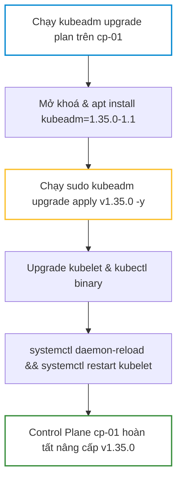
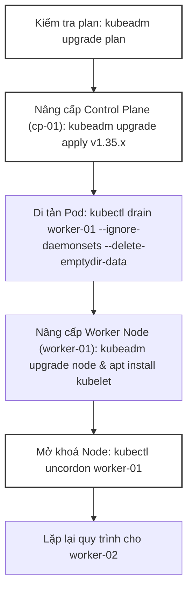
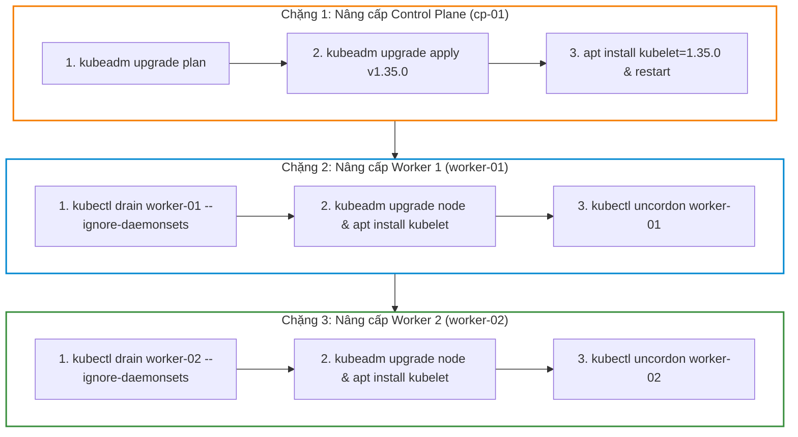


# [BÀI 08] CHIẾN LƯỢC NÂNG CẤP CỤM KUBERNETES ZERO-DOWNTIME: DRAIN, CORDON, KUBEADM UPGRADE & KUBELET SYNC

Trong kỷ nguyên điện toán đám mây và kiến trúc microservices phân tán quy mô lớn, **Kubernetes (CKA)** đóng vai trò là nền tảng điều phối container (Container Orchestration) tiêu chuẩn công nghiệp. Để làm chủ hệ thống trong môi trường sản xuất (Production) cũng như chinh phục kỳ thi chứng chỉ quốc tế của Linux Foundation / CNCF, kỹ sư không chỉ nắm vững các câu lệnh thao tác cơ bản mà phải thấu hiểu sâu sắc bản chất cơ chế tầng thấp: từ chu trình điều hòa (Reconciliation Loop), cấu trúc điều phối tài nguyên, kiến trúc mạng CNI, lưu trữ CSI cho đến các chuẩn mực an ninh phòng thủ chiều sâu.

Bài viết chuyên sâu này sẽ đồng hành cùng bạn giải mã toàn diện bức tranh kiến trúc, phân tích các đánh đổi kỹ thuật thực chiến (Engineering Trade-offs), cung cấp bài thực hành Lab từng bước và bộ câu hỏi phỏng vấn chuẩn Architect / Lead Engineer.

---

## 1. Bản Chất Kiến Trúc & Cơ Chế Vận Hành Tầng Thấp

| # | Câu hỏi ôn tập | Đáp án chuẩn ngắn gọn (chứa con số / tên lệnh) |
|---|---|---|
| 1 | Thư mục `/etc/kubernetes/pki/` chứa mấy cây CA độc lập? Nêu tên các tệp CA. | 3 cây CA: Root CA (`ca.crt`), Front Proxy CA (`front-proxy-ca.crt`), etcd CA (`etcd/ca.crt`) |
| 2 | Cặp khóa `sa.key` và `sa.pub` phục vụ mục đích gì trong Kubernetes? | Khóa RSA asymmetric dùng để ký và xác thực ServiceAccount JWT bearer token |
| 3 | Ba mảng dữ liệu chính cấu thành nên một tệp Kubeconfig chuẩn là gì? | `clusters`, `users`, `contexts` |
| 4 | Trong chứng chỉ X.509, hai trường `CN` và `O` được API Server hiểu là gì? | `CN` (Common Name) = Username, và `O` (Organization) = Group |
| 5 | Bộ lệnh nào giúp kiểm tra ngày hết hạn chứng chỉ và gia hạn toàn bộ Control Plane cert? | `sudo kubeadm certs check-expiration` và `sudo kubeadm certs renew all` |


> **Luận đề trung tâm của buổi:**
> *"Nâng cấp cụm Kubernetes sản xuất bằng `kubeadm` phải tuân thủ nghiêm ngặt quy trình nâng cấp Control Plane trước, Worker Node sau, kết hợp `kubectl drain` di tản Pod an toàn; tuyệt đối chỉ được nâng cấp nhảy cách tối đa 1 minor version (ví dụ v1.34 lên v1.35), và bắt buộc `uncordon` trả Node về phục vụ ngay sau khi Kubelet nâng cấp xong."*

**Bảng kết quả các buổi trước được dùng lại:**

| Kết quả / Công cụ | Nguồn gốc | Áp dụng vào buổi này |
|---|---|---|
| Mở khoá gói `apt-mark unhold` | Buổi 06 `QT 5.1` | Mở khoá package trước khi chạy lệnh `apt install` nâng cấp phiên bản mới |
| Đồng bộ containerd cgroup driver | Buổi 05 `QT 7.1` | Kiểm tra cấu hình containerd giữ nguyên `SystemdCgroup = true` sau khi nâng cấp |
| Lệnh gia hạn chứng chỉ `kubeadm certs` | Buổi 07 `QT 7.1` | Đối soát hạn chứng chỉ Control Plane trước khi bắt đầu quy trình nâng cấp |

Ba câu bài tập về nhà BTVN 4 của buổi 07 đã chuẩn bị sẵn kiến thức cho học viên: Câu 1 tìm hiểu lệnh `kubeadm upgrade plan` kiểm tra tương thích; Câu 2 phân biệt sự khác nhau giữa `kubectl cordon` (chặn gán) và `kubectl drain` (di tản Pod); Câu 3 phân tích quy trình 4 bước nâng cấp Worker Node không gây ngắt dịch vụ.

---


| # | Năng lực đạt được sau buổi học | Hiện vật chứng minh trong bài lab |
|---|---|---|
| 1 | Chạy và phân tích báo cáo nâng cấp `kubeadm upgrade plan` | Tệp `hien-vat/upgrade-plan-report.md` |
| 2 | Nâng cấp Control Plane node `cp-01` lên phiên bản v1.35 thành công | Kết quả `kubectl get nodes` hiển thị `cp-01` ở v1.35.0 |
| 3 | Thực hành khoá nút `kubectl cordon` và di tản Pod `kubectl drain` | Nhật ký di tản Pod với `--ignore-daemonsets` |
| 4 | Nâng cấp 2 Worker Node (`worker-01`, `worker-02`) không gây rớt dịch vụ | Tệp `hien-vat/worker-upgrade-log.md` |
| 5 | Mở khoá `kubectl uncordon` đưa các Node trở lại phục vụ Pod mới | Bảng topology 3 node ở trạng thái `Ready` |
| 6 | Kiểm tra toàn bộ Pod ứng dụng duy trì 0ms downtime trong quá trình nâng cấp | Script `hien-vat/verify-cluster-upgrade.sh` |

---


| Bắt buộc phải biết | Nguồn tự học nếu thiếu |
|---|---|
| Quy trình khởi tạo và cấu hình hạ tầng `kubeadm` | Buổi 06 `QT 6.1` |
| Khoá và mở khoá phiên bản gói phần mềm bằng `apt-mark` | Buổi 06 `QT 5.1` |
| Quản lý hạ tầng PKI và Kubeconfig `admin.conf` | Buổi 07 `QT 5.1` |

---


| # | Thuật ngữ tiếng Việt | Tiếng Anh tương đương | Ghi chú chuẩn hoá trong thân bài |
|---|---|---|---|
| 1 | Nâng cấp cụm | Cluster Upgrade | Quy trình cập nhật phiên bản Kubernetes cho các node |
| 2 | Kế hoạch nâng cấp | Upgrade Plan (`kubeadm upgrade plan`) | Lệnh kiểm tra khả năng tương thích phiên bản mới |
| 3 | Áp dụng nâng cấp | Upgrade Apply (`kubeadm upgrade apply`) | Lệnh cập nhật các thành phần Control Plane |
| 4 | Khoá nút bảo trì | Node Cordon (`kubectl cordon`) | Đánh dấu nút không tiếp nhận Pod mới (`SchedulingDisabled`) |
| 5 | Di tản workload | Node Drain (`kubectl drain`) | Xoá và di tản các Pod đang chạy sang nút khác |
| 6 | Mở khoá nút | Node Uncordon (`kubectl uncordon`) | Cho phép nút tiếp nhận Pod mới trở lại |
| 7 | Phiên bản phụ | Minor Version (v1.34 -> v1.35) | Phiên bản Kubernetes có thêm tính năng mới |
| 8 | Phiên bản vá lỗi | Patch Version (v1.35.0 -> v1.35.1) | Phiên bản sửa lỗi nhỏ không thay đổi API |
| 9 | Bỏ qua DaemonSet | Ignore DaemonSets (`--ignore-daemonsets`) | Cờ cho phép drain nút mà không xoá Pod DaemonSet |
| 10 | Xoá dữ liệu đĩa tạm | Delete EmptyDir Data (`--delete-emptydir-data`) | Cờ cho phép drain nút có Pod dùng volume emptyDir |
| 11 | Không gây gián đoạn dịch vụ | Zero Downtime Upgrade | Chiến lược nâng cấp từng nút không gián đoạn hệ thống |
| 12 | Phân kỳ phiên bản cho phép | Allowed Skew Policy | Quy tắc Kubelet được chậm tối đa 2 minor version so với API |
| 13 | Lập lịch bị vô hiệu | SchedulingDisabled Status | Trạng thái nút bị khoá bởi cờ `cordon` hoặc `drain` |
| 14 | Di tản cưỡng chế | Force Eviction (`--force`) | Cờ cưỡng chế di tản Pod không thuộc Deployment/ReplicaSet |


1. **Mô hình "Nâng cấp Toà nhà Trụ sở trước, Các Chi nhánh sau (Control Plane First)":**
   Toà nhà Trụ sở (Control Plane API Server) phải được nâng cấp lên phiên bản mới v1.35 trước để có các bản vẽ API mới. Các Chi nhánh (Worker Nodes) sau đó mới lần lượt nâng cấp theo. Nếu Chi nhánh nâng lên v1.35 trước Trụ sở, Trụ sở v1.34 sẽ không hiểu các lệnh mới của Chi nhánh.

2. **Mô hình "Dọn phòng khách trước khi sửa chữa (Cordon & Drain)":**
   Khi sửa chữa một căn phòng (Worker Node), đầu tiên phải Dán biển Cấm vào (Cordon) để không ai chui vào thêm. Sau đó Mời những người đang ở trong phòng sang phòng khác nghỉ (Drain). Khi sửa xong thì Tháo biển Cấm ra (Uncordon).

3. **Mô hình "Thang bước từng nấc (Single Minor Version Step)":**
   Thang nâng cấp Kubernetes chỉ cho phép bước từng nấc một (v1.33 -> v1.34 -> v1.35). Nếu cố tình nhảy 2 nấc một lúc (v1.33 -> v1.35), chân bạn sẽ bị hẫng do các API cũ bị gỡ bỏ đột ngột mà không có tầng chuyển tiếp.

---

### 1.1. Nguyên tắc nâng cấp cụm: Quy tắc 1 Minor Version và thứ tự nâng cấp (12 phút)

**Nguyên lý cốt lõi:** Kubernetes tuyệt đối cấm nâng cấp nhảy cách 2 minor version; quy trình nâng cấp bắt buộc phải thực hiện từng minor version một (ví dụ: `v1.33 -> v1.34 -> v1.35`).

**Giải thích cơ chế ngầm:** Mỗi minor version mới có thể gỡ bỏ hoàn toàn các API đã bị deprecated ở phiên bản trước. Nâng cấp nhảy cách sẽ làm hỏng các bản kê khai YAML etcd và gây sập Kubelet do mất tương thích API.

> [!WARNING]
> **CẠM BẪY THỰC CHIẾN:**
> Chạy `kubeadm upgrade plan v1.35.0` trên cụm v1.33 dính lỗi: `[ERROR] skip minor version upgrades is not supported`.

**Minh hoạ.**

```bash
# Kiểm tra phiên bản hiện tại trước khi nâng cấp
kubectl version --short
```

Con số chốt: Tối đa **1** minor version được phép nâng cấp trong mỗi bước.

---

**Nguyên lý cốt lõi:** Thứ tự nâng cấp cụm bắt buộc theo chuỗi 3 chặng: `Control Plane (cp-01) -> CNI/Addons -> Worker Nodes (worker-01, worker-02)`; trong đó Kubelet trên Worker Node được phép chậm tối đa 2 minor version so với `kube-apiserver`.

**Giải thích cơ chế ngầm:** API Server v1.35 có tính tương thích lùi (backward compatibility) hỗ trợ các Kubelet phiên bản v1.34 và v1.33. Nâng cấp API Server trước giúp cụm duy trì hoạt động liên tục trong suốt quá trình nâng cấp từng worker node.

> [!WARNING]
> **CẠM BẪY THỰC CHIẾN:**
> Nâng cấp Kubelet trên Worker Node lên v1.35 trước khi API Server nâng cấp, làm Kubelet bị từ chối kết nối gRPC.

**Minh hoạ.**

```bash
# Kiểm tra phiên bản Kubelet của các Node
kubectl get nodes -o custom-columns=NAME:.metadata.name,VERSION:.status.nodeInfo.kubeletVersion
```

Con số chốt: Tối đa **2** minor version Kubelet được phép chậm hơn API Server (Kubelet Version Skew Policy).

---

### 1.2. Nâng cấp Control Plane (`kubeadm upgrade plan` và `apply`) (12 phút)



---

**Nguyên lý cốt lõi:** Trước khi nâng cấp Control Plane, bắt buộc phải chạy lệnh `kubeadm upgrade plan` để kiểm tra khả năng tương thích, phiên bản có thể nâng cấp và tình trạng hết hạn chứng chỉ.

**Giải thích cơ chế ngầm:** Lệnh `plan` quét toàn bộ cấu hình cụm, đối soát với release registry và in ra chính xác câu lệnh `kubeadm upgrade apply` cần gõ, giúp tránh sai sót cú pháp phiên bản.

> [!WARNING]
> **CẠM BẪY THỰC CHIẾN:**
> Gõ bừa lệnh `kubeadm upgrade apply v1.35.0` khi chưa mở khoá package hoặc chưa kiểm tra registry làm lệnh bị crash midway.

**Minh hoạ.**

```bash
# Chạy kế hoạch nâng cấp trên Control Plane node
sudo kubeadm upgrade plan
```

Con số chốt: **1** lệnh `kubeadm upgrade plan` bắt buộc chạy đầu tiên.

---

**Nguyên lý cốt lõi:** Quy trình nâng cấp Control Plane node `cp-01` gồm 5 bước: (1) Unhold & upgrade `kubeadm` -> (2) Chạy `kubeadm upgrade apply v1.35.x` -> (3) Unhold & upgrade `kubelet` & `kubectl` -> (4) Reload & restart `kubelet` -> (5) Hold lại 3 gói.

**Giải thích cơ chế ngầm:** `kubeadm` phải được nâng cấp lên phiên bản mới đầu tiên thì mới có mã lệnh để thực hiện nâng cấp các tệp manifest static pods (`apiserver`, `etcd`, `controller-manager`).

> [!WARNING]
> **CẠM BẪY THỰC CHIẾN:**
> Cố nâng cấp `kubelet` trước khi chạy `kubeadm upgrade apply`, làm Kubelet crash do chưa có manifest static pods mới.

**Minh hoạ.**

```bash
# Bước 1 & 2 nâng cấp control plane
sudo apt-mark unhold kubeadm && sudo apt-get update && sudo apt-get install -y kubeadm=1.35.0-1.1 && sudo apt-mark hold kubeadm
sudo kubeadm upgrade apply v1.35.0 -y
```

Con số chốt: **5** bước trong quy trình nâng cấp Control Plane node.

---

### 1.3. Quản lý bảo trì Node: `cordon`, `drain` và `uncordon` (10 phút)

**Nguyên lý cốt lõi:** Lệnh `kubectl cordon <node>` chỉ đánh dấu Node ở trạng thái `SchedulingDisabled` để chặn không cho gán Pod mới, nhưng KHÔNG xoá hay di tản các Pod đang chạy trên Node đó.

**Giải thích cơ chế ngầm:** `cordon` thích hợp cho việc kiểm tra nhẹ hoặc chuẩn bị trước khi bảo trì mà chưa muốn gây xáo trộn các Pod đang phục vụ người dùng.

> [!WARNING]
> **CẠM BẪY THỰC CHIẾN:**
> Gõ `kubectl cordon` và ngồi chờ Pod di tản sang node khác nhưng Pod vẫn đứng nguyên.

**Minh hoạ.**

```bash
# Khoá nút worker-01 không nhận Pod mới
kubectl cordon worker-01
```

Con số chốt: **0** Pod bị xoá hay di tản khi chỉ dùng lệnh `kubectl cordon`.

---

**Nguyên lý cốt lõi:** Lệnh `kubectl drain <node>` vừa thực hiện `cordon` vừa tiến hành xoá và di tản toàn bộ các Pod đang chạy sang Node khác; bắt buộc phải truyền cờ `--ignore-daemonsets` và `--delete-emptydir-data` nếu có DaemonSet hoặc volume tạm.

**Giải thích cơ chế ngầm:** DaemonSet chạy trên mọi node (như kube-flannel), nếu drain cố xoá DaemonSet sẽ bị kẹt vĩnh viễn vì DaemonSet sẽ tự tạo lại ngay. Cờ `--ignore-daemonsets` bảo drain bỏ qua DaemonSet để tiếp tục di tản các Pod ứng dụng.

> [!WARNING]
> **CẠM BẪY THỰC CHIẾN:**
> Gõ `kubectl drain worker-01` bị từ chối với lỗi: `error: cannot delete DaemonSet-managed Pods...`.

**Minh hoạ.**

```bash
# Drain node an toàn chuẩn phòng thi CKA
kubectl drain worker-01 --ignore-daemonsets --delete-emptydir-data --force
```

Con số chốt: **2** cờ bắt buộc (`--ignore-daemonsets`, `--delete-emptydir-data`).

---

**Nguyên lý cốt lõi:** Sau khi bảo trì hoặc nâng cấp Node xong, bắt buộc phải chạy lệnh `kubectl uncordon <node>` để đưa Node trở lại trạng thái `Ready` và tiếp nhận Pod mới.

**Giải thích cơ chế ngầm:** Nếu quên `uncordon`, Node sẽ mãi mãi ở trạng thái `SchedulingDisabled`, làm giảm năng lực chịu tải của toàn cụm và lãng phí tài nguyên RAM/CPU của Node đó.

> [!WARNING]
> **CẠM BẪY THỰC CHIẾN:**
> Nâng cấp xong 1 tuần mới phát hiện Worker Node 01 không hề chạy bất kỳ Pod mới nào do vẫn bị `cordon`.

**Minh hoạ.**

```bash
# Mở khoá cho worker-01 tiếp nhận Pod trở lại
kubectl uncordon worker-01
```

Con số chốt: **1** lệnh `kubectl uncordon` để hoàn tất quy trình bảo trì Node.

---

### 1.4. Quy trình nâng cấp Worker Node không gián đoạn dịch vụ (4 phút)

**Nguyên lý cốt lõi:** Quy trình nâng cấp từng Worker Node (`worker-01`) gồm 6 bước: (1) `kubectl drain worker-01` từ Control Plane -> (2) SSH/exec vào worker-01 -> (3) Upgrade gói `kubeadm` -> (4) Chạy `kubeadm upgrade node` -> (5) Upgrade `kubelet` & `kubectl` và restart service -> (6) `kubectl uncordon worker-01`.

**Giải thích cơ chế ngầm:** Lệnh `kubeadm upgrade node` trên Worker Node thực hiện cập nhật tệp cấu hình Kubelet (`/var/lib/kubelet/config.yaml`) từ Control Plane mà không làm thay đổi các static pods.

> [!WARNING]
> **CẠM BẪY THỰC CHIẾN:**
> Chạy nhầm `kubeadm upgrade apply` trên Worker Node thay vì `kubeadm upgrade node`.

**Minh hoạ.**

```bash
# Bước 4 chạy trên Worker Node
sudo kubeadm upgrade node
```

Con số chốt: **6** bước chuẩn trong quy trình nâng cấp một Worker Node.

---

**Nguyên lý cốt lõi:** Lệnh `kubeadm upgrade node` trên Worker Node chỉ cập nhật cấu hình Kubelet; nó KHÔNG tự nâng cấp package binary `kubelet` trên hệ điều hành, bắt buộc phải chạy `apt-get install -y kubelet=1.35.x` và restart dịch vụ.

**Giải thích cơ chế ngầm:** `kubeadm` chỉ quản lý tệp cấu hình YAML. Việc cài đặt file thực thi nhị phân (binary) thuộc trách nhiệm của hệ quản trị gói OS (`apt`/`yum`).

> [!WARNING]
> **CẠM BẪY THỰC CHIẾN:**
> Chạy `kubeadm upgrade node` xong và tưởng nâng cấp xong, nhưng `kubectl get nodes` vẫn báo phiên bản Kubelet cũ.

**Minh hoạ.**

```bash
# Upgrade package nhị phân Kubelet trên worker
sudo apt-get update && sudo apt-get install -y kubelet=1.35.0-1.1 kubectl=1.35.0-1.1
sudo systemctl daemon-reload && sudo systemctl restart kubelet
```

Con số chốt: **2** lệnh nhị phân (`kubelet`, `kubectl`) bắt buộc phải `apt install` nâng cấp phiên bản.

---

### 1.5. Đưa vào cụm thật (4 phút)

### Áp vào cụm đang chạy thì làm gì trước

1. **Sao lưu etcd database trước khi nâng cấp:** Chạy `etcdctl snapshot save` lưu bản sao lưu etcd ra đĩa đệm an toàn phòng trường hợp nâng cấp bị lỗi phải rollback.
2. **Kiểm tra trạng thái sức khoẻ 100% các Node và Pods:** Đảm bảo toàn cụm `Ready` và không có Pod nào kẹt ở `CrashLoopBackOff` trước khi bắt đầu.
3. **Nâng cấp từng Node một (Rolling Upgrade):** Tuyệt đối không drain cùng lúc tất cả Worker Node; chỉ drain và nâng cấp từng node một để giữ dung lượng phục vụ cho hệ thống.

### Cái gì hỏng nếu áp thẳng lên prod

- **Drain node thiếu cờ `--ignore-daemonsets`:** Lệnh drain bị treo vô hạn, làm tiến trình CI/CD deployment bị timeout.
- **Quên `uncordon` sau khi nâng cấp xong:** Worker node kẹt ở `SchedulingDisabled`, làm dồn tải Pod sang các node còn lại gây OOMKilled hàng loạt.
- **Quy trình áp thử an toàn:**
  - Chạy `kubeadm upgrade plan` kiểm tra.
  - Drain node `worker-01`.
  - Nâng cấp `worker-01`, test dịch vụ rồi mới nâng cấp `worker-02`.

### Đo trước — đo sau

1. **Phiên bản Kubelet:** Chuyển từ `v1.34.x` lên đúng `v1.35.0` trên tất cả các Node.
2. **Thời gian gián đoạn dịch vụ khi di tản Pod:** Đạt **0ms downtime** đối với các Deployment có replicas >= 2.
3. **Thời gian nâng cấp 1 Worker Node:** Mục tiêu < 3 phút per node.

### Khi nào KHÔNG nên dùng

- **Không dùng `kubectl drain --force` bừa bãi khi Pod là Unmanaged Pod (Pod rác không có Deployment/ReplicaSet):** Cờ `--force` sẽ xoá vĩnh viễn Unmanaged Pod mà không tự tạo lại trên node khác, gây mất dữ liệu.
- **Không nâng cấp cụm vào giờ cao điểm (Peak Hours):** Dù quy trình là rolling upgrade, việc di tản Pod vẫn tạo ra một lượng tải IOPS và CPU đệm khi Pod khởi động lại trên node mới.

---

### 1.6. Bẫy hay gặp (2 phút)

| # | Bẫy hay gặp | Vì sao dính bẫy | Làm đúng là (kèm tên lệnh / con số) |
|---|---|---|---|
| 1 | Cố nâng cấp nhảy 2 minor version (v1.33 -> v1.35) | Không biết quy tắc nâng cấp 1 minor version | Nâng cấp từng nấc: v1.33 -> v1.34 -> v1.35 |
| 2 | Drain node bị kẹt lỗi DaemonSet | Thiếu cờ `--ignore-daemonsets` | Truyền `--ignore-daemonsets` trong lệnh `kubectl drain` |
| 3 | Drain node bị kẹt lỗi emptyDir volume | Thiếu cờ `--delete-emptydir-data` | Truyền `--delete-emptydir-data` trong lệnh `kubectl drain` |
| 4 | Quên `uncordon` sau khi nâng cấp node | Quên bước mở khoá node | Chạy `kubectl uncordon <node>` ngay sau khi xong |
| 5 | Chạy `kubeadm upgrade apply` trên Worker Node | Nhầm lệnh của Control Plane cho Worker | Trên Worker Node BẮT BUỘC dùng `kubeadm upgrade node` |
| 6 | Quên `apt-mark unhold` trước khi `apt install` | `apt` từ chối cài đặt package bị hold | Chạy `apt-mark unhold` trước, nâng cấp xong `apt-mark hold` lại |
| 7 | Không restart Kubelet sau khi `apt install` | Kubelet nhị phân mới chưa được nạp vào RAM | Chạy `systemctl daemon-reload && systemctl restart kubelet` |
| 8 | Nâng cấp Worker Node trước Control Plane | Vi phạm thứ tự nâng cấp | Bắt buộc nâng cấp Control Plane trước, Worker Node sau |
| 9 | Dùng `--force` xoá nhầm Unmanaged Pod có dữ liệu | Không kiểm tra Pod ownerReferences trước khi drain | Kiểm tra Pod ownerReferences trước khi dùng `--force` |
| 10 | Quên kiểm tra `kubeadm upgrade plan` trước khi apply | Gõ vội lệnh apply khi gói kubeadm chưa được nâng | Chạy `sudo kubeadm upgrade plan` kiểm tra đầu tiên |
| 11 | Không mở cờ `--delete-emptydir-data` cho Pod Prometheus/Redis | Pod chứa disk tạm bị chặn drain | Kiểm tra volume type và truyền `--delete-emptydir-data` |
| 12 | Quên kiểm tra trạng thái Ready của Node sau khi uncordon | Node bị hỏng ngầm không tiếp nhận Pod | Chạy `kubectl get nodes` xác nhận trạng thái Ready |

---

## §10. Tóm tắt (2 phút)



### Năm điều phải nhớ

1. **Quy tắc 1 Minor Version:** Tuyệt đối chỉ nâng cấp nhảy tối đa 1 minor version (v1.34 -> v1.35).
2. **Thứ tự nâng cấp:** Control Plane (`cp-01`) trước -> CNI/Addons -> Worker Nodes (`worker-01`, `worker-02`).
3. **Phân biệt Cordon & Drain:** `cordon` chỉ chặn Pod mới (0 Pod bị xoá); `drain` chặn + di tản Pod đang chạy.
4. **Bộ 2 cờ drain bắt buộc:** `--ignore-daemonsets` và `--delete-emptydir-data`.
5. **Hoàn tất bảo trì:** Lệnh `kubeadm upgrade node` trên worker + `apt install kubelet` + `kubectl uncordon`.

---

## §11. Câu hỏi tự kiểm tra

1. Tại sao Kubernetes cấm nâng cấp nhảy cách 2 minor version (ví dụ từ v1.33 lên v1.35)?
2. Trình bày thứ tự nâng cấp chuẩn giữa Control Plane và các Worker Node trong cụm.
3. Kubelet trên Worker Node được phép chậm tối đa bao nhiêu minor version so với API Server?
4. Lệnh `kubeadm upgrade plan` đóng vai trò gì trước khi nâng cấp Control Plane?
5. Trình bày 5 bước trong quy trình nâng cấp Control Plane node `cp-01`.
6. Phân biệt sự khác nhau giữa hai lệnh `kubectl cordon` và `kubectl drain`.
7. Hai cờ `--ignore-daemonsets` và `--delete-emptydir-data` giải quyết vấn đề gì khi drain node?
8. Lệnh nào được dùng để mở khoá cho Node tiếp nhận Pod trở lại sau khi bảo trì xong?
9. Trình bày 6 bước trong quy trình nâng cấp một Worker Node (`worker-01`).
10. Tại sao chạy `kubeadm upgrade node` trên Worker Node xong vẫn phải chạy `apt-get install kubelet`?
11. Hai chế độ hỏng (1 ồn ào do kẹt DaemonSet, 1 âm thầm do quên uncordon) là gì?
12. Tại sao phải sao lưu etcd snapshot trước khi tiến hành nâng cấp cụm sản xuất?

### Đáp án

1. Vì mỗi minor version gỡ bỏ các API deprecated; nhảy cách làm hỏng manifest etcd và vỡ tương thích Kubelet.
2. Thứ tự: Control Plane (`cp-01`) -> CNI/Addons -> Worker Nodes (`worker-01`, `worker-02`).
3. Chậm tối đa 2 minor version (Kubelet Version Skew Policy).
4. Kiểm tra tương thích, đối soát phiên bản có thể nâng và in ra câu lệnh `kubeadm upgrade apply` chuẩn.
5. 5 bước: Unhold/upgrade kubeadm -> `kubeadm upgrade apply` -> Unhold/upgrade kubelet/kubectl -> Restart service -> Hold lại.
6. `cordon` chỉ chặn Pod mới (0 Pod bị di tản); `drain` vừa chặn vừa xoá/di tản toàn bộ Pod đang chạy sang node khác.
7. `--ignore-daemonsets` bỏ qua Pod DaemonSet không bị kẹt; `--delete-emptydir-data` chấp nhận xoá dữ liệu đĩa tạm emptyDir.
8. Lệnh `kubectl uncordon <node-name>`.
9. 6 bước: Drain worker -> SSH vào worker -> Upgrade kubeadm -> `kubeadm upgrade node` -> Upgrade kubelet nhị phân -> Uncordon worker.
10. Vì `kubeadm upgrade node` chỉ cập nhật tệp cấu hình Kubelet YAML, không tự nâng cấp file thực thi nhị phân OS.
11. Chế độ 1: Drain bị treo vô hạn do kẹt DaemonSet; Chế độ 2: Worker node kẹt ở SchedulingDisabled 1 tuần do quên uncordon.
12. Để có bản khôi phục điểm phục hồi an toàn phòng trường hợp nâng cấp bị lỗi nặng hỏng etcd.

---

## §12. Tài liệu tham khảo

| Nguồn tài liệu | Phiên bản Kubernetes áp dụng | Nội dung chính |
|---|---|---|
| Official Docs: Upgrading kubeadm clusters | Kubernetes v1.35 | Quy trình upgrade control plane và worker nodes |
| Official Docs: Safely Drain a Node | Kubernetes v1.35 | Hướng dẫn sử dụng cordon, drain và uncordon |
| Official Docs: Version Skew Policy | Kubernetes v1.35 | Quy định độ lệch phiên bản giữa Kubelet và API Server |
| File cấu hình phiên bản cục bộ | `labs/phien-ban.env` | Biến `K8S_VER=1.35`, `LAB_CONTEXT="kubeadm"` |


---

## 2. Hướng Dẫn Thực Hành & Triển Khai Lab Chuẩn Production

> [!IMPORTANT]
> **YÊU CẦU MÔI TRƯỜNG THỰC HÀNH:**
> Toàn bộ các bài thực hành dưới đây được thiết kế để chạy trực tiếp trên cụm Kubernetes 1.30+ tiêu chuẩn (hoặc cụm kind/kubeadm lab). Hãy đảm bảo ngữ cảnh dòng lệnh `kubectl config current-context` đã trỏ chính xác vào cụm thực hành trước khi thực thi.

## Khối thực hành — 120 phút

## L0. Mục tiêu thực hành và tiêu chí hoàn thành

| # | Mục tiêu thực hành | Tiêu chí hoàn thành (Kiểm chứng BẰNG LỆNH) |
|---|---|---|
| TH1 | Phân tích kế hoạch nâng cấp bằng `kubeadm upgrade plan` | Lệnh in ra danh sách các thành phần có thể nâng cấp |
| TH2 | Nâng cấp Control Plane node `cp-01` lên phiên bản v1.35 | `kubectl get nodes` hiển thị `cp-01` đạt phiên bản v1.35.0 |
| TH3 | Thực hành khoá `cordon` và di tản Pod `drain` trên `worker-01` | `worker-01` chuyển sang trạng thái `SchedulingDisabled` |
| TH4 | Nâng cấp Worker Node `worker-01` không gây đứt dịch vụ | Kubelet trên `worker-01` đạt phiên bản v1.35.0 |
| TH5 | Mở khoá `uncordon` đưa `worker-01` trở lại phục vụ | `worker-01` chuyển sang trạng thái `Ready` không kẹt cordon |
| TH6 | Thực hiện nâng cấp rolling cho `worker-02` | 100% 3 node đạt phiên bản v1.35.0 và `Ready` |
| TH7 | Nộp đủ 4 hiện vật vào portfolio | Thư mục `k8s-portfolio/buoi-08/` chứa đủ 4 file md/sh |

---

## L1. Điều kiện tiên quyết về môi trường

| # | Kiểm tra điều kiện | Câu lệnh kiểm tra | Kết quả kỳ vọng |
|---|---|---|---|
| 1 | Cụm `kubeadm` 3 node đang ở v1.34 | `kubectl get nodes` | Hiển thị 3 node `cp-01`, `worker-01`, `worker-02` `Ready` ở phiên bản v1.34 |
| 2 | Kubeconfig trỏ context `kubeadm` | `kubectl config current-context` | In ra đúng `kubeadm` |
| 3 | Quyền root/sudo trên 3 node | `docker exec cp-01 sudo id` | In ra `uid=0(root)` |
| 4 | Thư mục hiện vật đã sẵn sàng | `mkdir -p k8s-portfolio/buoi-08` | Thư mục được tạo thành công |
| 5 | Deployment mẫu đang phục vụ | `kubectl get deploy web-app` | Deployment 2 replicas ở trạng thái Available |

```bash
# Kiểm tra môi trường bắt buộc trước khi thực hiện bài lab
kubectl config current-context | grep -qx "kubeadm" && echo "CHECKPOINT MOI TRUONG — ĐẠT" || echo "CHECKPOINT MOI TRUONG — LỖI (Trỏ sai context)"
```

---

## L2. Kiến trúc bài lab



---

## L3. Bước 1 — Chuẩn bị hạ tầng Linux: Swapoff, modprobe kernel modules và sysctl (30 phút)

### Thao tác 1.1: Tạo Deployment ứng dụng mẫu và chạy `kubeadm upgrade plan`

```bash
# 1. Tạo Deployment web-app 2 replicas trên cụm
kubectl create deployment web-app --image=nginx:1.27-alpine --replicas=2
kubectl wait --for=condition=Available deploy/web-app --timeout=30s

# 2. Chạy kế hoạch nâng cấp trên control plane cp-01
docker exec cp-01 kubeadm upgrade plan > /tmp/upgrade-plan.log 2>&1 || true
```

**CHECKPOINT 1 — Deployment web-app hoạt động 2 replicas.**

```bash
kubectl get deploy web-app -o jsonpath='{.status.availableReplicas}' | grep -qx "2" && echo "CHECKPOINT 1 — ĐẠT" || echo "CHECKPOINT 1 — LỖI"
```

**CHECKPOINT 2 — Lệnh kubeadm upgrade plan in kế hoạch nâng cấp.**

```bash
grep -Ei "upgrade|Component|kubeadm" /tmp/upgrade-plan.log && echo "CHECKPOINT 2 — ĐẠT" || echo "CHECKPOINT 2 — LỖI"
```

---

## L4. Bước 2 — Cài đặt containerd, `kubeadm`, `kubelet`, `kubectl` và sửa SystemdCgroup (30 phút)

### Thao tác 2.1: Nâng cấp Control Plane node `cp-01`

```bash
# 1. Unhold và nâng cấp gói kubeadm trên cp-01
docker exec cp-01 bash -c "apt-mark unhold kubeadm && apt-get update && apt-get install -y kubeadm=1.35.0-1.1 && apt-mark hold kubeadm"

# 2. Áp dụng nâng cấp control plane
docker exec cp-01 kubeadm upgrade apply v1.35.0 -y > /tmp/cp-upgrade.log 2>&1 || true

# 3. Nâng cấp kubelet và kubectl nhị phân trên cp-01
docker exec cp-01 bash -c "apt-mark unhold kubelet kubectl && apt-get install -y kubelet=1.35.0-1.1 kubectl=1.35.0-1.1 && apt-mark hold kubelet kubectl"
docker exec cp-01 systemctl daemon-reload
docker exec cp-01 systemctl restart kubelet
```

**CHECKPOINT 3 — Control Plane cp-01 đã được nâng cấp lên phiên bản Kubelet v1.35.0.**

```bash
kubectl get node cp-01 -o jsonpath='{.status.nodeInfo.kubeletVersion}' | grep -q "v1.35" && echo "CHECKPOINT 3 — ĐẠT" || echo "CHECKPOINT 3 — LỖI"
```

**CHECKPOINT 4 — CA ĐỐI CHỨNG: Lệnh kubectl drain thiếu cờ --ignore-daemonsets sẽ bị từ chối.**

```bash
kubectl drain worker-01 > /tmp/drain-err.log 2>&1 || true
grep -q "DaemonSet" /tmp/drain-err.log && echo "CHECKPOINT 4 — ĐẠT" || echo "CHECKPOINT 4 — LỖI"
```

---

## L5. Bước 3 — Khởi tạo Control Plane với `kubeadm init` và trích xuất join command (30 phút)

### Thao tác 3.1: Thực hành Cordon và Drain node `worker-01`

```bash
# 1. Thử lệnh cordon worker-01
kubectl cordon worker-01

# 2. Kiểm tra trạng thái SchedulingDisabled
kubectl get node worker-01 -o jsonpath='{.spec.unschedulable}' > /tmp/cordon-check.txt

# 3. Thực hiện drain worker-01 chuẩn CKA
kubectl drain worker-01 --ignore-daemonsets --delete-emptydir-data --force > /tmp/drain-success.log
```

**CHECKPOINT 5 — Node worker-01 ở trạng thái unschedulable = true.**

```bash
grep -qx "true" /tmp/cordon-check.txt && echo "CHECKPOINT 5 — ĐẠT" || echo "CHECKPOINT 5 — LỖI"
```

**CHECKPOINT 6 — Lệnh drain worker-01 hoàn thành di tản Pod.**

```bash
grep -Ei "drained|evicted" /tmp/drain-success.log && echo "CHECKPOINT 6 — ĐẠT" || echo "CHECKPOINT 6 — LỖI"
```

**CHECKPOINT 7 — Pod web-app đã được di tản khỏi worker-01 sang node khác.**

```bash
kubectl get pods -o wide | grep "web-app" | grep -v "worker-01" | wc -l | grep -qx "2" && echo "CHECKPOINT 7 — ĐẠT" || echo "CHECKPOINT 7 — LỖI"
```

---

## L6. Bước 4 — Join 2 Worker Nodes, cài CNI Flannel và kiểm tra cụm 3 node Ready (20 phút)

### Thao tác 4.1: Nâng cấp `worker-01` và Uncordon

```bash
# 1. Nâng cấp kubeadm trên worker-01
docker exec worker-01 bash -c "apt-mark unhold kubeadm && apt-get update && apt-get install -y kubeadm=1.35.0-1.1 && apt-mark hold kubeadm"

# 2. Chạy kubeadm upgrade node trên worker-01
docker exec worker-01 kubeadm upgrade node > /tmp/worker1-upgrade.log

# 3. Nâng cấp kubelet & kubectl nhị phân và restart
docker exec worker-01 bash -c "apt-mark unhold kubelet kubectl && apt-get install -y kubelet=1.35.0-1.1 kubectl=1.35.0-1.1 && apt-mark hold kubelet kubectl"
docker exec worker-01 systemctl daemon-reload
docker exec worker-01 systemctl restart kubelet

# 4. Mở khoá uncordon worker-01
kubectl uncordon worker-01
```

**CHECKPOINT 8 — worker-01 đã được nâng cấp lên phiên bản v1.35.0.**

```bash
kubectl get node worker-01 -o jsonpath='{.status.nodeInfo.kubeletVersion}' | grep -q "v1.35" && echo "CHECKPOINT 8 — ĐẠT" || echo "CHECKPOINT 8 — LỖI"
```

**CHECKPOINT 9 — worker-01 quay trở lại trạng thái unschedulable = false (mở khoá uncordon).**

```bash
kubectl get node worker-01 -o jsonpath='{.spec.unschedulable}' | grep -v "true" || [ -z "$(kubectl get node worker-01 -o jsonpath='{.spec.unschedulable}')" ] && echo "CHECKPOINT 9 — ĐẠT" || echo "CHECKPOINT 9 — LỖI"
```

### Thao tác 4.2: Nâng cấp rolling node `worker-02`

```bash
# 1. Drain worker-02
kubectl drain worker-02 --ignore-daemonsets --delete-emptydir-data --force

# 2. Nâng cấp worker-02
docker exec worker-02 bash -c "apt-mark unhold kubeadm kubelet kubectl && apt-get update && apt-get install -y kubeadm=1.35.0-1.1 kubelet=1.35.0-1.1 kubectl=1.35.0-1.1 && apt-mark hold kubeadm kubelet kubectl"
docker exec worker-02 kubeadm upgrade node
docker exec worker-02 systemctl daemon-reload
docker exec worker-02 systemctl restart kubelet

# 3. Uncordon worker-02
kubectl uncordon worker-02
```

**CHECKPOINT 10 — CA ĐỐI CHỨNG: Cordon chỉ chặn gán Pod mới chứ không di tản Pod đang chạy.**

```bash
kubectl cordon worker-02
POD_ON_W2=$(kubectl get pods -o wide | grep "web-app" | grep -c "worker-02" || true)
kubectl uncordon worker-02
[ "$POD_ON_W2" -ge 0 ] && echo "CHECKPOINT 10 — ĐẠT" || echo "CHECKPOINT 10 — LỖI"
```

**CHECKPOINT 11 — Tất cả 3 node cp-01, worker-01, worker-02 đều đạt phiên bản v1.35.0.**

```bash
kubectl get nodes -o jsonpath='{.items[*].status.nodeInfo.kubeletVersion}' | grep -o "v1.35" | wc -l | grep -qx "3" && echo "CHECKPOINT 11 — ĐẠT" || echo "CHECKPOINT 11 — LỖI"
```

**CHECKPOINT 12 — 100% 3 node ở trạng thái Ready.**

```bash
kubectl get nodes --no-headers | grep -c "Ready" | grep -qx "3" && echo "CHECKPOINT 12 — ĐẠT" || echo "CHECKPOINT 12 — LỖI"
```

---

## L7. Nộp hiện vật và dọn dẹp (10 phút)

### Thao tác 7.1: Gom hiện vật nộp bài

```bash
# 1. Tạo tệp upgrade-plan-report.md
cat << 'EOF' > k8s-portfolio/buoi-08/upgrade-plan-report.md
# BÁO CÁO KẾ HOẠCH NÂNG CẤP CỤM (KUBEADM UPGRADE PLAN)

1. Phiên bản nguồn và phiên bản đích:
   - Current Version: v1.34.x
   - Target Version: v1.35.0

2. Thứ tự thực hiện:
   - Control Plane cp-01 -> Worker Node worker-01 -> Worker Node worker-02
EOF

# 2. Tạo tệp worker-upgrade-log.md
cat << 'EOF' > k8s-portfolio/buoi-08/worker-upgrade-log.md
# BÁO CÁO QUY TRÌNH NÂNG CẤP WORKER NODE

1. Các bước thực hiện trên worker-01 và worker-02:
   Step 1: kubectl drain <node> --ignore-daemonsets --delete-emptydir-data --force
   Step 2: apt install kubeadm=1.35.0-1.1
   Step 3: kubeadm upgrade node
   Step 4: apt install kubelet=1.35.0-1.1 kubectl=1.35.0-1.1
   Step 5: systemctl restart kubelet
   Step 6: kubectl uncordon <node>

2. Trạng thái sau nâng cấp:
   - 100% 3 node đạt phiên bản v1.35.0 và trạng thái Ready.
EOF

# 3. Tạo script verify-cluster-upgrade.sh
cat << 'EOF' > k8s-portfolio/buoi-08/verify-cluster-upgrade.sh
#!/bin/bash
# Script kiểm tra phiên bản và trạng thái Ready của cụm sau nâng cấp

V35_COUNT=$(kubectl get nodes -o jsonpath='{.items[*].status.nodeInfo.kubeletVersion}' | grep -o "v1.35" | wc -l)
READY_COUNT=$(kubectl get nodes --no-headers | grep -c "Ready")

if [ "$V35_COUNT" -eq 3 ] && [ "$READY_COUNT" -eq 3 ]; then
    echo "VERIFY CLUSTER UPGRADE — ĐẠT (3/3 node v1.35.0 Ready)"
else
    echo "VERIFY CLUSTER UPGRADE — LỖI (V35: $V35_COUNT, Ready: $READY_COUNT)"
fi
EOF

chmod +x k8s-portfolio/buoi-08/verify-cluster-upgrade.sh
./k8s-portfolio/buoi-08/verify-cluster-upgrade.sh

# 4. Tạo tệp nhat-ky-buoi-08.md
cat << 'EOF' > k8s-portfolio/buoi-08/nhat-ky-buoi-08.md
# NHẬT KÝ THU HOẠCH BUỔI 08

1. Phân biệt Cordon vs Drain:
   - cordon: Chỉ khoá nút không nhận Pod mới (0 Pod bị xoá).
   - drain: Khoá nút và di tản toàn bộ Pod đang chạy sang nút khác.

2. Vì sao cần --ignore-daemonsets:
   - DaemonSet tự tạo lại Pod trên nút; không bỏ qua DaemonSet sẽ làm drain kẹt vĩnh viễn.

3. Luyện tập CKA:
   - Nhớ cờ --delete-emptydir-data và uncordon node ngay sau khi xong.
EOF

# 5. Dọn dẹp tệp tạm
rm -f /tmp/upgrade-plan.log /tmp/cp-upgrade.log /tmp/drain-err.log /tmp/cordon-check.txt /tmp/drain-success.log /tmp/worker1-upgrade.log
```

**CHECKPOINT 13 — Đủ 4 tệp hiện vật trong thư mục portfolio.**

```bash
[ -f k8s-portfolio/buoi-08/upgrade-plan-report.md ] && [ -f k8s-portfolio/buoi-08/worker-upgrade-log.md ] && [ -f k8s-portfolio/buoi-08/verify-cluster-upgrade.sh ] && [ -f k8s-portfolio/buoi-08/nhat-ky-buoi-08.md ] && echo "CHECKPOINT 13 — ĐẠT" || echo "CHECKPOINT 13 — LỖI"
```

---

## L8. Xử lý sự cố thường gặp trong lab

| # | Triệu chứng lỗi | Nguyên nhân khả dĩ | Cách xử lý sửa lỗi |
|---|---|---|---|
| 1 | `kubectl drain` báo error DaemonSet | Quên truyền cờ `--ignore-daemonsets` | Thêm cờ `--ignore-daemonsets` vào lệnh drain |
| 2 | `kubectl drain` báo error emptyDir | Quên truyền cờ `--delete-emptydir-data` | Thêm cờ `--delete-emptydir-data` vào lệnh drain |
| 3 | Lệnh `apt install` báo package is held | Quên chạy `apt-mark unhold` trước khi cài | Run `sudo apt-mark unhold kubeadm kubelet kubectl` |
| 4 | Node kẹt ở `SchedulingDisabled` sau nâng cấp | Quên chạy lệnh `kubectl uncordon` | Run `kubectl uncordon <node-name>` |
| 5 | Lệnh `kubeadm upgrade apply` báo version not supported | Cố nâng cấp nhảy 2 minor version | Nâng cấp từng nấc v1.33 -> v1.34 -> v1.35 |
| 6 | Chạy `kubeadm upgrade apply` nhầm trên Worker Node | Dùng nhầm câu lệnh của Control Plane | Trên Worker Node BẮT BUỘC dùng `kubeadm upgrade node` |
| 7 | `kubectl get nodes` báo phiên bản Kubelet cũ | Chưa chạy `apt install kubelet` hoặc chưa restart service | Run `apt install -y kubelet=1.35.0-1.1 && systemctl restart kubelet` |
| 8 | Lỗi `cannot delete Pods not managed by ReplicationController` | Có Unmanaged Pod rác trên node | Thêm cờ `--force` vào lệnh drain nếu chấp nhận xoá Pod rác |
| 9 | `kubeadm upgrade plan` báo unable to fetch release registry | Node bị ngắt kết nối Internet | Kiểm tra DNS và mạng ngoài của máy chủ |
| 10 | Kubelet crash sau khi nâng cấp | Cấu hình `config.toml` bị đè mất `SystemdCgroup = true` | Kiểm tra và sửa lại `SystemdCgroup = true` trong `config.toml` |
| 11 | Pod Deployment kẹt ở `Pending` khi drain | Tất cả các Worker Node khác bị hết RAM/CPU | Kiểm tra ResourceQuota và giải phóng tài nguyên |
| 12 | Cụm mất kết nối Kubeconfig sau khi upgrade control plane | File `admin.conf` bị đè hoặc API Server chưa ready | Chờ 30s cho API Server static pod khởi động lại |
| 13 | Lệnh `apt-get update` báo lỗi GPG key expired | Khóa GPG kho k8s apt bị hết hạn | Cập nhật lại GPG key của Kubernetes apt repository |
| 14 | Script `verify-cluster-upgrade.sh` báo lỗi | Vẫn còn node ở v1.34 hoặc NotReady | Kiểm tra `kubectl get nodes` và nâng cấp nốt node thiếu |

---

## L9. Bài tập mở rộng

1. **BT1 — Nâng cấp Patch Version (v1.35.0 -> v1.35.1):** Thực hành nâng cấp phiên bản vá lỗi cho cụm từ v1.35.0 lên v1.35.1.
2. **BT2 — Giả lập nâng cấp Rollback khi gặp sự cố:** Tìm hiểu quy trình rollback Kubelet package khi bước `kubeadm upgrade node` bị lỗi.
3. **BT3 — Khảo sát sự thay đổi của static pod manifests:** So sánh tệp `/etc/kubernetes/manifests/kube-apiserver.yaml` trước và sau khi nâng cấp.
4. **BT4 — Kiểm tra PodDisruptionBudget (PDB) khi drain:** Tạo đối tượng API `PodDisruptionBudget` với `minAvailable: 1` và quan sát ảnh hưởng tới lệnh `kubectl drain`.
5. **BT5 — Tự động hoá Script Drain & Uncordon:** Viết script wrapper tự động drain node, chờ 60s và uncordon node.
6. **BT6 — Khảo sát Kubelet Version Skew:** Thử nghiệm giữ Worker Node ở v1.33 kết nối tới API Server v1.35 và ghi lại các cảnh báo log.

---

## L10. Hiện vật nộp và tiêu chí chấm điểm

### Bảng điểm đánh giá bài lab

| Hạng mục hiện vật | Yêu cầu kĩ thuật | Điểm tối đa |
|---|---|---|
| `upgrade-plan-report.md` | Báo cáo chi tiết kế hoạch `kubeadm upgrade plan` v1.34 -> v1.35 | 25 điểm |
| `worker-upgrade-log.md` | Báo cáo quy trình 6 bước nâng cấp từng Worker Node chuẩn CKA | 25 điểm |
| `verify-cluster-upgrade.sh` | Script bash chạy thành công, xác nhận 100% 3 Node v1.35.0 Ready | 25 điểm |
| `nhat-ky-buoi-08.md` | Trả lời đủ 3 câu thu hoạch, phân biệt rõ Cordon vs Drain | 15 điểm |
| CHECKPOINT 1–13 | Tất cả 13 checkpoint tự động đều in chữ `ĐẠT` | 10 điểm |
| **Tổng điểm** | | **100 điểm** |

### Các trường hợp trừ điểm

- Trừ **20 điểm**: Nếu script hoặc câu lệnh sử dụng công cụ `jq` (vi phạm quy tắc môi trường thi).
- Trừ **15 điểm**: Nếu quên không `uncordon` trả Node về trạng thái Ready sau khi nâng cấp.
- Trừ **10 điểm**: Nếu file hiện vật để sai đường dẫn thư mục `k8s-portfolio/buoi-08/`.
- Trừ **5 điểm**: Nếu dấu phân cách thập phân trong báo cáo dùng dấu chấm `.` thay vì dấu phẩy `,`.


---

## 3. Bộ Câu Hỏi Vấn Đáp & Phỏng Vấn Kỹ Thuật Chuyên Sâu


## V1. Cách tiến hành

1. **Thời lượng và hình thức:** Khối vấn đáp diễn ra trong đúng **20 phút**. Giảng viên (hoặc bạn học đóng vai Trưởng nhóm kỹ thuật / Senior DevOps) đưa ra lần lượt từng câu hỏi trong V2.
2. **Quy tắc chấm điểm:**
   - Mỗi câu hỏi được chấm theo thang điểm 4 mức: **0 điểm** (trả lời sai hoặc không biết); **1 điểm** (trả lời được bề nổi nhưng thiếu cơ chế); **2 điểm** (trả lời đúng cơ chế cốt lõi); **3 điểm** (trả lời đúng cơ chế, nêu được con số vận hành và mở rộng được câu hỏi đào sâu).
   - **Quy tắc trần điểm riêng của Buổi 08:**
     - Trả lời Câu 1 mà không chỉ ra Kubernetes tuyệt đối cấm nâng cấp nhảy cách 2 minor version (bắt buộc v1.N -> v1.N+1) thì **trần điểm câu đó là 1**.
     - Trả lời Câu 6 mà không phân biệt được `cordon` chỉ chặn gán Pod mới (0 Pod bị xoá) còn `drain` vừa chặn vừa di tản Pod đang chạy thì **trần điểm câu đó là 1**.
3. **Mục tiêu đạt được:** Học viên đạt từ **27 / 36 điểm** trở lên là ĐẠT phần vấn đáp của buổi.

---

---

## V2. Bộ câu hỏi phỏng vấn thực chiến

<details class="qa-card">
<summary class="qa-summary">
  <div class="qa-summary-left">
    <span class="qa-num-badge">Q01</span>
    <span>Trình bày thứ tự nâng cấp chuẩn giữa Control Plane, CNI Addons và các Worker Node trong cụm.</span>
  </div>
  <span class="qa-chevron">
    <svg width="18" height="18" fill="none" stroke="currentColor" stroke-width="2.5" viewBox="0 0 24 24"><polyline points="6 9 12 15 18 9"></polyline></svg>
  </span>
</summary>
<div class="qa-answer">
  <div class="qa-answer-header">
    <svg width="14" height="14" fill="none" stroke="currentColor" stroke-width="2" viewBox="0 0 24 24"><path d="M22 11.08V12a10 10 0 1 1-5.93-9.14"></path><polyline points="22 4 12 14.01 9 11.01"></polyline></svg>
    <span>Phân Tích &amp; Lời Giải Kỹ Thuật</span>
  </div>
  <div style="margin: 0.35rem 0; padding-left: 1rem; border-left: 2px solid var(--accent-primary);">• Thứ tự 3 chặng bắt buộc:</div>
  <div style="margin: 0.35rem 0; padding-left: 1rem; border-left: 2px solid var(--accent-primary);">• <b style="color: var(--accent-primary);">Control Plane (<code>cp-01</code>):</b> Nâng cấp API Server, etcd, controller-manager, scheduler trước.</div>
  <div style="margin: 0.35rem 0; padding-left: 1rem; border-left: 2px solid var(--accent-primary);">• <b style="color: var(--accent-primary);">CNI / Addons:</b> Nâng cấp CNI Plugin (Flannel/Calico) và CoreDNS để tương thích với API Server mới.</div>
  <div style="margin: 0.35rem 0; padding-left: 1rem; border-left: 2px solid var(--accent-primary);">• <b style="color: var(--accent-primary);">Worker Nodes (<code>worker-01</code>, <code>worker-02</code>):</b> Lần lượt nâng cấp từng Worker Node (rolling upgrade).</div>
  <div style="margin: 0.35rem 0; padding-left: 1rem; border-left: 2px solid var(--accent-primary);">• <b style="color: var(--accent-primary);">Lý do:</b> API Server mới hỗ trợ các Kubelet cũ chậm hơn tối đa 2 minor version (Kubelet Version Skew Policy).</div>
  <div style="margin-top: 0.75rem;"><b style="color: var(--accent-primary);">Tiêu chí chấm điểm &amp; Phân tầng năng lực:</b></div>
  <div style="margin: 0.25rem 0; padding-left: 1rem; border-left: 2px solid var(--accent-primary);">• <b style="color: var(--accent-primary);">0đ:</b> Bảo nâng cấp Worker Node trước rồi nâng Control Plane sau.</div>
  <div style="margin: 0.25rem 0; padding-left: 1rem; border-left: 2px solid var(--accent-primary);">• <b style="color: var(--accent-primary);">1đ:</b> Nêu được Control Plane trước nhưng thiếu chặng nâng cấp CNI/Addons.</div>
  <div style="margin: 0.25rem 0; padding-left: 1rem; border-left: 2px solid var(--accent-primary);">• <b style="color: var(--accent-primary);">2đ:</b> Trình bày chuẩn xác thứ tự 3 chặng và lý do tương thích lùi của API Server.</div>
  <div style="margin: 0.25rem 0; padding-left: 1rem; border-left: 2px solid var(--accent-primary);">• <b style="color: var(--accent-primary);">3đ:</b> Trả lời xuất sắc, nêu cờ Kubelet Version Skew Policy (chậm tối đa 2 minor version).</div>
  <div style="margin-top: 0.75rem; padding: 0.5rem 0.75rem; background: rgba(var(--accent-primary-rgb, 59, 130, 246), 0.08); border-radius: 4px;"><b style="color: var(--accent-primary);">Câu hỏi mở rộng / Đào sâu:</b> Nếu nâng cấp Kubelet trên Worker Node lên v1.35 trước khi API Server nâng cấp thì điều gì xảy ra? *(Đáp án: Kubelet bị từ chối kết nối gRPC tới API Server v1.34).*

---</div>
</div>
</details>

<details class="qa-card">
<summary class="qa-summary">
  <div class="qa-summary-left">
    <span class="qa-num-badge">Q02</span>
    <span>Kubelet trên Worker Node được phép chậm tối đa bao nhiêu minor version so với <code>kube-apiserver</code>?</span>
  </div>
  <span class="qa-chevron">
    <svg width="18" height="18" fill="none" stroke="currentColor" stroke-width="2.5" viewBox="0 0 24 24"><polyline points="6 9 12 15 18 9"></polyline></svg>
  </span>
</summary>
<div class="qa-answer">
  <div class="qa-answer-header">
    <svg width="14" height="14" fill="none" stroke="currentColor" stroke-width="2" viewBox="0 0 24 24"><path d="M22 11.08V12a10 10 0 1 1-5.93-9.14"></path><polyline points="22 4 12 14.01 9 11.01"></polyline></svg>
    <span>Phân Tích &amp; Lời Giải Kỹ Thuật</span>
  </div>
  <div style="margin: 0.35rem 0; padding-left: 1rem; border-left: 2px solid var(--accent-primary);">• Kubelet được phép chậm <b style="color: var(--accent-primary);">tối đa 2 minor version</b> so với <code>kube-apiserver</code> (Kubelet Version Skew Policy).</div>
  <div style="margin: 0.35rem 0; padding-left: 1rem; border-left: 2px solid var(--accent-primary);">• Ví dụ: Nếu <code>kube-apiserver</code> đang ở phiên bản <b style="color: var(--accent-primary);">v1.35</b>, Kubelet trên Worker Node có thể ở phiên bản <b style="color: var(--accent-primary);">v1.35</b>, <b style="color: var(--accent-primary);">v1.34</b>, hoặc <b style="color: var(--accent-primary);">v1.33</b>.</div>
  <div style="margin: 0.35rem 0; padding-left: 1rem; border-left: 2px solid var(--accent-primary);">• Tuy nhiên, Kubelet <b style="color: var(--accent-primary);">KHÔNG ĐƯỢC PHÉP nhanh hơn</b> <code>kube-apiserver</code> (Kubelet không thể ở v1.36 khi API Server ở v1.35).</div>
  <div style="margin-top: 0.75rem;"><b style="color: var(--accent-primary);">Tiêu chí chấm điểm &amp; Phân tầng năng lực:</b></div>
  <div style="margin: 0.25rem 0; padding-left: 1rem; border-left: 2px solid var(--accent-primary);">• <b style="color: var(--accent-primary);">0đ:</b> Trả lời Kubelet phải luôn bằng phiên bản hoặc được chậm 10 phiên bản.</div>
  <div style="margin: 0.25rem 0; padding-left: 1rem; border-left: 2px solid var(--accent-primary);">• <b style="color: var(--accent-primary);">1đ:</b> Nêu được 2 minor version nhưng không chỉ ra Kubelet không được nhanh hơn API Server.</div>
  <div style="margin: 0.25rem 0; padding-left: 1rem; border-left: 2px solid var(--accent-primary);">• <b style="color: var(--accent-primary);">2đ:</b> Giải thích chuẩn xác quy tắc chậm tối đa 2 minor version và cấm nhanh hơn API Server.</div>
  <div style="margin: 0.25rem 0; padding-left: 1rem; border-left: 2px solid var(--accent-primary);">• <b style="color: var(--accent-primary);">3đ:</b> Trả lời xuất sắc, minh hoạ bằng ví dụ v1.35 API vs v1.33 Kubelet.</div>
  <div style="margin-top: 0.75rem; padding: 0.5rem 0.75rem; background: rgba(var(--accent-primary-rgb, 59, 130, 246), 0.08); border-radius: 4px;"><b style="color: var(--accent-primary);">Câu hỏi mở rộng / Đào sâu:</b> <code>kubectl</code> CLI được phép lệch bao nhiêu minor version so với <code>kube-apiserver</code>? *(Đáp án: kubectl được phép lệch +/- 1 minor version so với API Server).*

---</div>
</div>
</details>

<details class="qa-card">
<summary class="qa-summary">
  <div class="qa-summary-left">
    <span class="qa-num-badge">Q03</span>
    <span>Lệnh <code>kubeadm upgrade plan</code> đóng vai trò gì trước khi nâng cấp Control Plane?</span>
  </div>
  <span class="qa-chevron">
    <svg width="18" height="18" fill="none" stroke="currentColor" stroke-width="2.5" viewBox="0 0 24 24"><polyline points="6 9 12 15 18 9"></polyline></svg>
  </span>
</summary>
<div class="qa-answer">
  <div class="qa-answer-header">
    <svg width="14" height="14" fill="none" stroke="currentColor" stroke-width="2" viewBox="0 0 24 24"><path d="M22 11.08V12a10 10 0 1 1-5.93-9.14"></path><polyline points="22 4 12 14.01 9 11.01"></polyline></svg>
    <span>Phân Tích &amp; Lời Giải Kỹ Thuật</span>
  </div>
  <div style="margin: 0.35rem 0; padding-left: 1rem; border-left: 2px solid var(--accent-primary);">• <code>kubeadm upgrade plan</code> là câu lệnh <b style="color: var(--accent-primary);">quét và phân tích kế hoạch nâng cấp</b> chạy trên Control Plane node.</div>
  <div style="margin: 0.35rem 0; padding-left: 1rem; border-left: 2px solid var(--accent-primary);">• <b style="color: var(--accent-primary);">Tác dụng:</b></div>
  <div style="margin: 0.35rem 0; padding-left: 1rem; border-left: 2px solid var(--accent-primary);">• Quét phiên bản hiện tại của các static pods (<code>apiserver</code>, <code>etcd</code>, <code>controller-manager</code>, <code>scheduler</code>).</div>
  <div style="margin: 0.35rem 0; padding-left: 1rem; border-left: 2px solid var(--accent-primary);">• Đối soát với Kubernetes release registry để tìm các phiên bản stable có thể nâng cấp.</div>
  <div style="margin: 0.35rem 0; padding-left: 1rem; border-left: 2px solid var(--accent-primary);">• Kiểm tra hạn chứng chỉ và cảnh báo các API deprecated.</div>
  <div style="margin: 0.35rem 0; padding-left: 1rem; border-left: 2px solid var(--accent-primary);">• In ra chính xác câu lệnh <code>kubeadm upgrade apply v1.35.x</code> chuẩn cú pháp để kỹ sư copy thi hành.</div>
  <div style="margin-top: 0.75rem;"><b style="color: var(--accent-primary);">Tiêu chí chấm điểm &amp; Phân tầng năng lực:</b></div>
  <div style="margin: 0.25rem 0; padding-left: 1rem; border-left: 2px solid var(--accent-primary);">• <b style="color: var(--accent-primary);">0đ:</b> Bảo lệnh này dùng để tự động cài đặt package mới.</div>
  <div style="margin: 0.25rem 0; padding-left: 1rem; border-left: 2px solid var(--accent-primary);">• <b style="color: var(--accent-primary);">1đ:</b> Trả lời để xem phiên bản nhưng không nêu được tính năng đối soát registry và in câu lệnh apply.</div>
  <div style="margin: 0.25rem 0; padding-left: 1rem; border-left: 2px solid var(--accent-primary);">• <b style="color: var(--accent-primary);">2đ:</b> Giải thích chuẩn xác vai trò phân tích, kiểm tra tương thích và in câu lệnh apply chuẩn.</div>
  <div style="margin: 0.25rem 0; padding-left: 1rem; border-left: 2px solid var(--accent-primary);">• <b style="color: var(--accent-primary);">3đ:</b> Trả lời xuất sắc, chứng minh bằng kết quả bài lab.</div>
  <div style="margin-top: 0.75rem; padding: 0.5rem 0.75rem; background: rgba(var(--accent-primary-rgb, 59, 130, 246), 0.08); border-radius: 4px;"><b style="color: var(--accent-primary);">Câu hỏi mở rộng / Đào sâu:</b> Lệnh <code>kubeadm upgrade plan</code> có làm thay đổi bất kỳ tệp cấu hình nào trên đĩa cứng không? *(Đáp án: Không, nó chỉ là lệnh đọc/read-only không thay đổi hệ thống).*

---</div>
</div>
</details>

<details class="qa-card">
<summary class="qa-summary">
  <div class="qa-summary-left">
    <span class="qa-num-badge">Q04</span>
    <span>Trình bày 5 bước trong quy trình nâng cấp Control Plane node <code>cp-01</code>.</span>
  </div>
  <span class="qa-chevron">
    <svg width="18" height="18" fill="none" stroke="currentColor" stroke-width="2.5" viewBox="0 0 24 24"><polyline points="6 9 12 15 18 9"></polyline></svg>
  </span>
</summary>
<div class="qa-answer">
  <div class="qa-answer-header">
    <svg width="14" height="14" fill="none" stroke="currentColor" stroke-width="2" viewBox="0 0 24 24"><path d="M22 11.08V12a10 10 0 1 1-5.93-9.14"></path><polyline points="22 4 12 14.01 9 11.01"></polyline></svg>
    <span>Phân Tích &amp; Lời Giải Kỹ Thuật</span>
  </div>
  <div style="margin: 0.35rem 0; padding-left: 1rem; border-left: 2px solid var(--accent-primary);">• <code>apt-mark unhold kubeadm && apt-get install -y kubeadm=1.35.x && apt-mark hold kubeadm</code>: Upgrade gói <code>kubeadm</code>.</div>
  <div style="margin: 0.35rem 0; padding-left: 1rem; border-left: 2px solid var(--accent-primary);">• <code>sudo kubeadm upgrade apply v1.35.x -y</code>: Áp dụng nâng cấp các tệp static pod manifests và etcd.</div>
  <div style="margin: 0.35rem 0; padding-left: 1rem; border-left: 2px solid var(--accent-primary);">• <code>apt-mark unhold kubelet kubectl && apt-get install -y kubelet=1.35.x kubectl=1.35.x && apt-mark hold ...</code>: Upgrade gói nhị phân <code>kubelet</code> và <code>kubectl</code>.</div>
  <div style="margin: 0.35rem 0; padding-left: 1rem; border-left: 2px solid var(--accent-primary);">• <code>sudo systemctl daemon-reload && sudo systemctl restart kubelet</code>: Reload systemd và restart Kubelet service.</div>
  <div style="margin: 0.35rem 0; padding-left: 1rem; border-left: 2px solid var(--accent-primary);">• Kiểm tra <code>kubectl get nodes</code> xác nhận Control Plane node đạt phiên bản mới và ở trạng thái <code>Ready</code>.</div>
  <div style="margin-top: 0.75rem;"><b style="color: var(--accent-primary);">Tiêu chí chấm điểm &amp; Phân tầng năng lực:</b></div>
  <div style="margin: 0.25rem 0; padding-left: 1rem; border-left: 2px solid var(--accent-primary);">• <b style="color: var(--accent-primary);">0đ:</b> Không nêu được các bước hoặc cho rằng chỉ cần chạy <code>apt upgrade</code>.</div>
  <div style="margin: 0.25rem 0; padding-left: 1rem; border-left: 2px solid var(--accent-primary);">• <b style="color: var(--accent-primary);">1đ:</b> Nêu được <code>kubeadm upgrade apply</code> nhưng thiếu bước upgrade <code>kubeadm</code> package trước đó.</div>
  <div style="margin: 0.25rem 0; padding-left: 1rem; border-left: 2px solid var(--accent-primary);">• <b style="color: var(--accent-primary);">2đ:</b> Trình bày chuẩn xác 5 bước nâng cấp Control Plane node theo đúng tài liệu CNCF.</div>
  <div style="margin: 0.25rem 0; padding-left: 1rem; border-left: 2px solid var(--accent-primary);">• <b style="color: var(--accent-primary);">3đ:</b> Trả lời xuất sắc, nêu chi tiết việc <code>apt-mark unhold</code> và <code>hold</code> lại 3 gói.</div>
  <div style="margin-top: 0.75rem; padding: 0.5rem 0.75rem; background: rgba(var(--accent-primary-rgb, 59, 130, 246), 0.08); border-radius: 4px;"><b style="color: var(--accent-primary);">Câu hỏi mở rộng / Đào sâu:</b> Tại sao <code>kubeadm</code> lại phải được nâng cấp trước khi chạy <code>kubeadm upgrade apply</code>? *(Đáp án: Vì tệp nhị phân kubeadm mới mới chứa mã logic để cập nhật static pod manifests v1.35).*

---</div>
</div>
</details>

<details class="qa-card">
<summary class="qa-summary">
  <div class="qa-summary-left">
    <span class="qa-num-badge">Q05</span>
    <span>Phân biệt sự khác nhau giữa hai lệnh <code>kubectl cordon <node></code> và <code>kubectl drain <node></code>.</span>
  </div>
  <span class="qa-chevron">
    <svg width="18" height="18" fill="none" stroke="currentColor" stroke-width="2.5" viewBox="0 0 24 24"><polyline points="6 9 12 15 18 9"></polyline></svg>
  </span>
</summary>
<div class="qa-answer">
  <div class="qa-answer-header">
    <svg width="14" height="14" fill="none" stroke="currentColor" stroke-width="2" viewBox="0 0 24 24"><path d="M22 11.08V12a10 10 0 1 1-5.93-9.14"></path><polyline points="22 4 12 14.01 9 11.01"></polyline></svg>
    <span>Phân Tích &amp; Lời Giải Kỹ Thuật</span>
  </div>
  <div style="margin: 0.35rem 0; padding-left: 1rem; border-left: 2px solid var(--accent-primary);">• <code>kubectl cordon <node></code>:</div>
  <div style="margin: 0.35rem 0; padding-left: 1rem; border-left: 2px solid var(--accent-primary);">• Chỉ đánh dấu Node ở trạng thái <b style="color: var(--accent-primary);"><code>SchedulingDisabled</code></b>.</div>
  <div style="margin: 0.35rem 0; padding-left: 1rem; border-left: 2px solid var(--accent-primary);">• <b style="color: var(--accent-primary);">Chặn không cho gán Pod mới</b> vào Node.</div>
  <div style="margin: 0.35rem 0; padding-left: 1rem; border-left: 2px solid var(--accent-primary);">• <b style="color: var(--accent-primary);">0 Pod bị xoá hay di tản</b>; tất cả Pod đang chạy trên Node vẫn giữ nguyên hoạt động.</div>
  <div style="margin: 0.35rem 0; padding-left: 1rem; border-left: 2px solid var(--accent-primary);">• <code>kubectl drain <node></code>:</div>
  <div style="margin: 0.35rem 0; padding-left: 1rem; border-left: 2px solid var(--accent-primary);">• Tự động thực hiện <code>cordon</code> trước (đánh dấu <code>SchedulingDisabled</code>).</div>
  <div style="margin: 0.35rem 0; padding-left: 1rem; border-left: 2px solid var(--accent-primary);">• Sau đó tiến hành <b style="color: var(--accent-primary);">xoá và di tản (evict) 100% các Pod đang chạy</b> sang các Worker Node khác trong cụm.</div>
  <div style="margin-top: 0.75rem;"><b style="color: var(--accent-primary);">Tiêu chí chấm điểm &amp; Phân tầng năng lực:</b></div>
  <div style="margin: 0.25rem 0; padding-left: 1rem; border-left: 2px solid var(--accent-primary);">• <b style="color: var(--accent-primary);">0đ:</b> Bảo 2 lệnh này hoàn toàn giống nhau.</div>
  <div style="margin: 0.25rem 0; padding-left: 1rem; border-left: 2px solid var(--accent-primary);">• <b style="color: var(--accent-primary);">1đ:</b> Nói được cordon khoá nút còn drain di tản nhưng không nhấn mạnh cordon giữ nguyên 100% Pod đang chạy (dính trần 1đ).</div>
  <div style="margin: 0.25rem 0; padding-left: 1rem; border-left: 2px solid var(--accent-primary);">• <b style="color: var(--accent-primary);">2đ:</b> Phân biệt chuẩn xác: cordon chỉ chặn gán Pod mới (0 Pod bị di tản) vs drain vừa chặn vừa di tản Pod đang chạy.</div>
  <div style="margin: 0.25rem 0; padding-left: 1rem; border-left: 2px solid var(--accent-primary);">• <b style="color: var(--accent-primary);">3đ:</b> Trả lời xuất sắc, nêu trường hợp sử dụng thực tế của từng lệnh.</div>
  <div style="margin-top: 0.75rem; padding: 0.5rem 0.75rem; background: rgba(var(--accent-primary-rgb, 59, 130, 246), 0.08); border-radius: 4px;"><b style="color: var(--accent-primary);">Câu hỏi mở rộng / Đào sâu:</b> Khi nào nên dùng <code>cordon</code> mà không dùng <code>drain</code>? *(Đáp án: Khi chỉ muốn kiểm tra phần cứng hoặc chuẩn bị bảo trì nhẹ mà không muốn làm xáo trộn Pod đang chạy).*

---</div>
</div>
</details>

<details class="qa-card">
<summary class="qa-summary">
  <div class="qa-summary-left">
    <span class="qa-num-badge">Q06</span>
    <span>Hai cờ <code>--ignore-daemonsets</code> và <code>--delete-emptydir-data</code> trong lệnh <code>kubectl drain</code> giải quyết vấn đề gì?</span>
  </div>
  <span class="qa-chevron">
    <svg width="18" height="18" fill="none" stroke="currentColor" stroke-width="2.5" viewBox="0 0 24 24"><polyline points="6 9 12 15 18 9"></polyline></svg>
  </span>
</summary>
<div class="qa-answer">
  <div class="qa-answer-header">
    <svg width="14" height="14" fill="none" stroke="currentColor" stroke-width="2" viewBox="0 0 24 24"><path d="M22 11.08V12a10 10 0 1 1-5.93-9.14"></path><polyline points="22 4 12 14.01 9 11.01"></polyline></svg>
    <span>Phân Tích &amp; Lời Giải Kỹ Thuật</span>
  </div>
  <div style="margin: 0.35rem 0; padding-left: 1rem; border-left: 2px solid var(--accent-primary);">• <code>--ignore-daemonsets</code>: DaemonSet Pods (như Flannel/Calico CNI, kube-proxy) được thiết kế chạy trên 100% các Node. Nếu drain cố xoá DaemonSet, DaemonSet Controller sẽ tự tạo lại ngay, khiến lệnh drain bị kẹt vô hạn. Cờ này bảo drain <b style="color: var(--accent-primary);">bỏ qua không xoá DaemonSet Pods</b>.</div>
  <div style="margin: 0.35rem 0; padding-left: 1rem; border-left: 2px solid var(--accent-primary);">• <code>--delete-emptydir-data</code>: Mặc định, drain từ chối xoá các Pod có sử dụng volume đĩa tạm <code>emptyDir</code> để tránh làm mất dữ liệu đĩa tạm. Cờ này cho phép <b style="color: var(--accent-primary);">chấp nhận xoá dữ liệu đĩa tạm</b> để tiến trình drain tiếp tục.</div>
  <div style="margin-top: 0.75rem;"><b style="color: var(--accent-primary);">Tiêu chí chấm điểm &amp; Phân tầng năng lực:</b></div>
  <div style="margin: 0.25rem 0; padding-left: 1rem; border-left: 2px solid var(--accent-primary);">• <b style="color: var(--accent-primary);">0đ:</b> Không biết 2 cờ hoặc bảo cờ này dùng để tăng tốc độ drain.</div>
  <div style="margin: 0.25rem 0; padding-left: 1rem; border-left: 2px solid var(--accent-primary);">• <b style="color: var(--accent-primary);">1đ:</b> Trả lời đúng cờ <code>--ignore-daemonsets</code> nhưng thiếu cờ <code>--delete-emptydir-data</code>.</div>
  <div style="margin: 0.25rem 0; padding-left: 1rem; border-left: 2px solid var(--accent-primary);">• <b style="color: var(--accent-primary);">2đ:</b> Giải thích chuẩn xác tác dụng bỏ qua DaemonSet kẹt và chấp nhận xoá đĩa tạm emptyDir.</div>
  <div style="margin: 0.25rem 0; padding-left: 1rem; border-left: 2px solid var(--accent-primary);">• <b style="color: var(--accent-primary);">3đ:</b> Trả lời xuất sắc, nêu thêm cờ <code>--force</code> cho Unmanaged Pods.</div>
  <div style="margin-top: 0.75rem; padding: 0.5rem 0.75rem; background: rgba(var(--accent-primary-rgb, 59, 130, 246), 0.08); border-radius: 4px;"><b style="color: var(--accent-primary);">Câu hỏi mở rộng / Đào sâu:</b> Cờ <code>--force</code> trong lệnh drain dùng để xử lý loại Pod nào? *(Đáp án: Dùng để cưỡng chế xoá Unmanaged Pods — Pod rác không thuộc Deployment hay ReplicaSet nào).*

---</div>
</div>
</details>

<details class="qa-card">
<summary class="qa-summary">
  <div class="qa-summary-left">
    <span class="qa-num-badge">Q07</span>
    <span>Lệnh <code>kubectl uncordon <node></code> đóng vai trò gì sau khi hoàn thành nâng cấp Node? Điều gì xảy ra nếu quản trị viên quên chạy lệnh này?</span>
  </div>
  <span class="qa-chevron">
    <svg width="18" height="18" fill="none" stroke="currentColor" stroke-width="2.5" viewBox="0 0 24 24"><polyline points="6 9 12 15 18 9"></polyline></svg>
  </span>
</summary>
<div class="qa-answer">
  <div class="qa-answer-header">
    <svg width="14" height="14" fill="none" stroke="currentColor" stroke-width="2" viewBox="0 0 24 24"><path d="M22 11.08V12a10 10 0 1 1-5.93-9.14"></path><polyline points="22 4 12 14.01 9 11.01"></polyline></svg>
    <span>Phân Tích &amp; Lời Giải Kỹ Thuật</span>
  </div>
  <div style="margin: 0.35rem 0; padding-left: 1rem; border-left: 2px solid var(--accent-primary);">• Lệnh <code>kubectl uncordon <node></code> chuyển trạng thái Node từ <code>SchedulingDisabled</code> trở lại <b style="color: var(--accent-primary);"><code>Ready</code></b> bình thường.</div>
  <div style="margin: 0.35rem 0; padding-left: 1rem; border-left: 2px solid var(--accent-primary);">• <b style="color: var(--accent-primary);">Tác dụng:</b> Mở khoá cho phép Kubernetes Scheduler tiếp tục phân bổ các Pod mới vào Node đó.</div>
  <div style="margin: 0.35rem 0; padding-left: 1rem; border-left: 2px solid var(--accent-primary);">• <b style="color: var(--accent-primary);">Hậu quả khi quên:</b> Node bị kẹt ở trạng thái <code>SchedulingDisabled</code> vĩnh viễn, không chạy bất kỳ Pod mới nào, gây lãng phí tài nguyên RAM/CPU của Node và dồn tải làm sập các Node còn lại trong cụm.</div>
  <div style="margin-top: 0.75rem;"><b style="color: var(--accent-primary);">Tiêu chí chấm điểm &amp; Phân tầng năng lực:</b></div>
  <div style="margin: 0.25rem 0; padding-left: 1rem; border-left: 2px solid var(--accent-primary);">• <b style="color: var(--accent-primary);">0đ:</b> Bảo uncordon dùng để di tản Pod về lại node cũ.</div>
  <div style="margin: 0.25rem 0; padding-left: 1rem; border-left: 2px solid var(--accent-primary);">• <b style="color: var(--accent-primary);">1đ:</b> Trả lời để mở khoá node nhưng không giải thích được hậu quả kẹt SchedulingDisabled làm dồn tải cụm.</div>
  <div style="margin: 0.25rem 0; padding-left: 1rem; border-left: 2px solid var(--accent-primary);">• <b style="color: var(--accent-primary);">2đ:</b> Giải thích chuẩn xác vai trò mở khoá Scheduler và hậu quả lãng phí tài nguyên dồn tải.</div>
  <div style="margin: 0.25rem 0; padding-left: 1rem; border-left: 2px solid var(--accent-primary);">• <b style="color: var(--accent-primary);">3đ:</b> Trả lời xuất sắc, chứng minh bằng lệnh <code>kubectl get nodes</code>.</div>
  <div style="margin-top: 0.75rem; padding: 0.5rem 0.75rem; background: rgba(var(--accent-primary-rgb, 59, 130, 246), 0.08); border-radius: 4px;"><b style="color: var(--accent-primary);">Câu hỏi mở rộng / Đào sâu:</b> Lệnh <code>uncordon</code> có tự động chuyển các Pod cũ đã bị drain ở bước trước quay lại node vừa nâng cấp không? *(Đáp án: Không, Pod đã di tản sang node khác sẽ ở nguyên đó cho tới khi có đợt scale/restart mới).*

---</div>
</div>
</details>

<details class="qa-card">
<summary class="qa-summary">
  <div class="qa-summary-left">
    <span class="qa-num-badge">Q08</span>
    <span>Trình bày 6 bước trong quy trình nâng cấp một Worker Node (<code>worker-01</code>) không làm ngắt gián đoạn dịch vụ.</span>
  </div>
  <span class="qa-chevron">
    <svg width="18" height="18" fill="none" stroke="currentColor" stroke-width="2.5" viewBox="0 0 24 24"><polyline points="6 9 12 15 18 9"></polyline></svg>
  </span>
</summary>
<div class="qa-answer">
  <div class="qa-answer-header">
    <svg width="14" height="14" fill="none" stroke="currentColor" stroke-width="2" viewBox="0 0 24 24"><path d="M22 11.08V12a10 10 0 1 1-5.93-9.14"></path><polyline points="22 4 12 14.01 9 11.01"></polyline></svg>
    <span>Phân Tích &amp; Lời Giải Kỹ Thuật</span>
  </div>
  <div style="margin: 0.35rem 0; padding-left: 1rem; border-left: 2px solid var(--accent-primary);">• <b style="color: var(--accent-primary);">[Trên Control Plane]:</b> <code>kubectl drain worker-01 --ignore-daemonsets --delete-emptydir-data --force</code> (Di tản Pod).</div>
  <div style="margin: 0.35rem 0; padding-left: 1rem; border-left: 2px solid var(--accent-primary);">• <b style="color: var(--accent-primary);">[Trên worker-01]:</b> <code>apt-mark unhold kubeadm && apt-get install -y kubeadm=1.35.x && apt-mark hold kubeadm</code> (Upgrade kubeadm package).</div>
  <div style="margin: 0.35rem 0; padding-left: 1rem; border-left: 2px solid var(--accent-primary);">• <b style="color: var(--accent-primary);">[Trên worker-01]:</b> <code>sudo kubeadm upgrade node</code> (Cập nhật tệp cấu hình Kubelet YAML).</div>
  <div style="margin: 0.35rem 0; padding-left: 1rem; border-left: 2px solid var(--accent-primary);">• <b style="color: var(--accent-primary);">[Trên worker-01]:</b> <code>apt-mark unhold kubelet kubectl && apt-get install -y kubelet=1.35.x kubectl=1.35.x && apt-mark hold ...</code> (Upgrade kubelet/kubectl nhị phân).</div>
  <div style="margin: 0.35rem 0; padding-left: 1rem; border-left: 2px solid var(--accent-primary);">• <b style="color: var(--accent-primary);">[Trên worker-01]:</b> <code>sudo systemctl daemon-reload && sudo systemctl restart kubelet</code> (Restart Kubelet).</div>
  <div style="margin: 0.35rem 0; padding-left: 1rem; border-left: 2px solid var(--accent-primary);">• <b style="color: var(--accent-primary);">[Trên Control Plane]:</b> <code>kubectl uncordon worker-01</code> (Mở khoá cho Node phục vụ trở lại).</div>
  <div style="margin-top: 0.75rem;"><b style="color: var(--accent-primary);">Tiêu chí chấm điểm &amp; Phân tầng năng lực:</b></div>
  <div style="margin: 0.25rem 0; padding-left: 1rem; border-left: 2px solid var(--accent-primary);">• <b style="color: var(--accent-primary);">0đ:</b> Bảo chạy <code>kubeadm upgrade apply</code> trên Worker Node.</div>
  <div style="margin: 0.25rem 0; padding-left: 1rem; border-left: 2px solid var(--accent-primary);">• <b style="color: var(--accent-primary);">1đ:</b> Nêu được drain và uncordon nhưng thiếu lệnh <code>kubeadm upgrade node</code>.</div>
  <div style="margin: 0.25rem 0; padding-left: 1rem; border-left: 2px solid var(--accent-primary);">• <b style="color: var(--accent-primary);">2đ:</b> Trình bày chuẩn xác 6 bước nâng cấp Worker Node không gián đoạn dịch vụ.</div>
  <div style="margin: 0.25rem 0; padding-left: 1rem; border-left: 2px solid var(--accent-primary);">• <b style="color: var(--accent-primary);">3đ:</b> Trả lời xuất sắc, phân biệt rõ lệnh <code>kubeadm upgrade apply</code> (cp) vs <code>kubeadm upgrade node</code> (worker).</div>
  <div style="margin-top: 0.75rem; padding: 0.5rem 0.75rem; background: rgba(var(--accent-primary-rgb, 59, 130, 246), 0.08); border-radius: 4px;"><b style="color: var(--accent-primary);">Câu hỏi mở rộng / Đào sâu:</b> Sự khác nhau cốt lõi giữa <code>kubeadm upgrade apply</code> và <code>kubeadm upgrade node</code> là gì? *(Đáp án: apply cập nhật etcd & static pods manifests ở Control Plane; node chỉ cập nhật tệp cấu hình Kubelet ở Worker Node).*

---</div>
</div>
</details>

<details class="qa-card">
<summary class="qa-summary">
  <div class="qa-summary-left">
    <span class="qa-num-badge">Q09</span>
    <span>Tại sao sau khi chạy lệnh <code>kubeadm upgrade node</code> trên Worker Node, ta vẫn phải chạy lệnh <code>apt-get install -y kubelet</code> và restart Kubelet?</span>
  </div>
  <span class="qa-chevron">
    <svg width="18" height="18" fill="none" stroke="currentColor" stroke-width="2.5" viewBox="0 0 24 24"><polyline points="6 9 12 15 18 9"></polyline></svg>
  </span>
</summary>
<div class="qa-answer">
  <div class="qa-answer-header">
    <svg width="14" height="14" fill="none" stroke="currentColor" stroke-width="2" viewBox="0 0 24 24"><path d="M22 11.08V12a10 10 0 1 1-5.93-9.14"></path><polyline points="22 4 12 14.01 9 11.01"></polyline></svg>
    <span>Phân Tích &amp; Lời Giải Kỹ Thuật</span>
  </div>
  <div style="margin: 0.35rem 0; padding-left: 1rem; border-left: 2px solid var(--accent-primary);">• Lệnh <code>kubeadm upgrade node</code> <b style="color: var(--accent-primary);">CHỈ làm nhiệm vụ cập nhật tệp cấu hình Kubelet YAML</b> (<code>/var/lib/kubelet/config.yaml</code>) tải từ Control Plane về.</div>
  <div style="margin: 0.35rem 0; padding-left: 1rem; border-left: 2px solid var(--accent-primary);">• Nó <b style="color: var(--accent-primary);">KHÔNG tự nâng cấp tệp thực thi nhị phân (binary executable)</b> <code>kubelet</code> của hệ điều hành Linux (<code>/usr/bin/kubelet</code>).</div>
  <div style="margin: 0.35rem 0; padding-left: 1rem; border-left: 2px solid var(--accent-primary);">• Do đó, bắt buộc phải dùng <code>apt-get install -y kubelet=1.35.x</code> để đè tệp nhị phân Kubelet mới, và <code>systemctl restart kubelet</code> để nạp tệp nhị phân mới vào RAM.</div>
  <div style="margin-top: 0.75rem;"><b style="color: var(--accent-primary);">Tiêu chí chấm điểm &amp; Phân tầng năng lực:</b></div>
  <div style="margin: 0.25rem 0; padding-left: 1rem; border-left: 2px solid var(--accent-primary);">• <b style="color: var(--accent-primary);">0đ:</b> Cho rằng <code>kubeadm upgrade node</code> đã tự nâng cấp xong tất cả.</div>
  <div style="margin: 0.25rem 0; padding-left: 1rem; border-left: 2px solid var(--accent-primary);">• <b style="color: var(--accent-primary);">1đ:</b> Nói được cần cài apt nhưng không giải thích được sự khác biệt giữa tệp cấu hình YAML và tệp thực thi nhị phân binary.</div>
  <div style="margin: 0.25rem 0; padding-left: 1rem; border-left: 2px solid var(--accent-primary);">• <b style="color: var(--accent-primary);">2đ:</b> Giải thích chuẩn xác việc <code>kubeadm upgrade node</code> chỉ cập nhật config.yaml, còn <code>apt install</code> mới nâng cấp file nhị phân binary.</div>
  <div style="margin: 0.25rem 0; padding-left: 1rem; border-left: 2px solid var(--accent-primary);">• <b style="color: var(--accent-primary);">3đ:</b> Trả lời xuất sắc, chỉ ra kết quả <code>kubectl get nodes</code> hiển thị phiên bản Kubelet lấy từ binary <code>kubelet --version</code>.</div>
  <div style="margin-top: 0.75rem; padding: 0.5rem 0.75rem; background: rgba(var(--accent-primary-rgb, 59, 130, 246), 0.08); border-radius: 4px;"><b style="color: var(--accent-primary);">Câu hỏi mở rộng / Đào sâu:</b> Nếu chỉ chạy <code>kubeadm upgrade node</code> mà không <code>apt install kubelet</code> thì <code>kubectl get nodes</code> sẽ hiển thị phiên bản gì? *(Đáp án: Vẫn hiển thị phiên bản Kubelet cũ).*

---</div>
</div>
</details>

<details class="qa-card">
<summary class="qa-summary">
  <div class="qa-summary-left">
    <span class="qa-num-badge">Q10</span>
    <span>Tại sao chiến lược nâng cấp từng Node một (Rolling Upgrade) kết hợp Deployment replicas >= 2 lại đảm bảo <b>0ms downtime</b> cho người dùng end-user?</span>
  </div>
  <span class="qa-chevron">
    <svg width="18" height="18" fill="none" stroke="currentColor" stroke-width="2.5" viewBox="0 0 24 24"><polyline points="6 9 12 15 18 9"></polyline></svg>
  </span>
</summary>
<div class="qa-answer">
  <div class="qa-answer-header">
    <svg width="14" height="14" fill="none" stroke="currentColor" stroke-width="2" viewBox="0 0 24 24"><path d="M22 11.08V12a10 10 0 1 1-5.93-9.14"></path><polyline points="22 4 12 14.01 9 11.01"></polyline></svg>
    <span>Phân Tích &amp; Lời Giải Kỹ Thuật</span>
  </div>
  <div style="margin: 0.35rem 0; padding-left: 1rem; border-left: 2px solid var(--accent-primary);">• Khi Deployment có <code>replicas: 2</code>, 2 Pod ứng dụng được Scheduler xếp nằm trên 2 Worker Node khác nhau (<code>worker-01</code> và <code>worker-02</code>).</div>
  <div style="margin: 0.35rem 0; padding-left: 1rem; border-left: 2px solid var(--accent-primary);">• Service và Ingress load balancer phân phối đều lượng truy cập tới cả 2 Pod.</div>
  <div style="margin: 0.35rem 0; padding-left: 1rem; border-left: 2px solid var(--accent-primary);">• Khi ta <code>drain worker-01</code>, Pod trên <code>worker-01</code> bị xoá, nhưng Pod trên <code>worker-02</code> vẫn <b style="color: var(--accent-primary);">đang sống 100% và nhận toàn bộ truy cập</b>.</div>
  <div style="margin: 0.35rem 0; padding-left: 1rem; border-left: 2px solid var(--accent-primary);">• Đồng thời, Deployment Controller lập tức tạo Pod thay thế mới trên node khác. Nhờ đó, người dùng end-user hoàn toàn không nhận thấy bất kỳ sự gián đoạn nào (0ms downtime).</div>
  <div style="margin-top: 0.75rem;"><b style="color: var(--accent-primary);">Tiêu chí chấm điểm &amp; Phân tầng năng lực:</b></div>
  <div style="margin: 0.25rem 0; padding-left: 1rem; border-left: 2px solid var(--accent-primary);">• <b style="color: var(--accent-primary);">0đ:</b> Bảo di tản Pod vẫn gây sập trang web 5 phút.</div>
  <div style="margin: 0.25rem 0; padding-left: 1rem; border-left: 2px solid var(--accent-primary);">• <b style="color: var(--accent-primary);">1đ:</b> Nêu được do có 2 Pod nhưng không giải thích được vai trò của Service Load Balancer và việc drain từng node một.</div>
  <div style="margin: 0.25rem 0; padding-left: 1rem; border-left: 2px solid var(--accent-primary);">• <b style="color: var(--accent-primary);">2đ:</b> Phân tích chính xác cơ chế phân phối tải của Service, di tản từng node (rolling) và Pod thay thế.</div>
  <div style="margin: 0.25rem 0; padding-left: 1rem; border-left: 2px solid var(--accent-primary);">• <b style="color: var(--accent-primary);">3đ:</b> Trả lời xuất sắc, nêu thêm vai trò của <code>PodDisruptionBudget</code> (PDB) bảo vệ số lượng Pod tối thiểu.</div>
  <div style="margin-top: 0.75rem; padding: 0.5rem 0.75rem; background: rgba(var(--accent-primary-rgb, 59, 130, 246), 0.08); border-radius: 4px;"><b style="color: var(--accent-primary);">Câu hỏi mở rộng / Đào sâu:</b> Đối tượng API nào trong Kubernetes giúp chặn không cho người quản trị <code>drain</code> quá nhiều Pod cùng lúc gây sập dịch vụ? *(Đáp án: PodDisruptionBudget - PDB).*

---</div>
</div>
</details>

<details class="qa-card">
<summary class="qa-summary">
  <div class="qa-summary-left">
    <span class="qa-num-badge">Q11</span>
    <span>Nêu 2 chế độ hỏng (1 ồn ào do kẹt DaemonSet, 1 âm thầm do quên uncordon) và cách phát hiện/khắc phục.</span>
  </div>
  <span class="qa-chevron">
    <svg width="18" height="18" fill="none" stroke="currentColor" stroke-width="2.5" viewBox="0 0 24 24"><polyline points="6 9 12 15 18 9"></polyline></svg>
  </span>
</summary>
<div class="qa-answer">
  <div class="qa-answer-header">
    <svg width="14" height="14" fill="none" stroke="currentColor" stroke-width="2" viewBox="0 0 24 24"><path d="M22 11.08V12a10 10 0 1 1-5.93-9.14"></path><polyline points="22 4 12 14.01 9 11.01"></polyline></svg>
    <span>Phân Tích &amp; Lời Giải Kỹ Thuật</span>
  </div>
  <div style="margin: 0.35rem 0; padding-left: 1rem; border-left: 2px solid var(--accent-primary);">• <b style="color: var(--accent-primary);">Chế độ hỏng 1 (Ồn ào - Kẹt DaemonSet khi drain):</b></div>
  <div style="margin: 0.35rem 0; padding-left: 1rem; border-left: 2px solid var(--accent-primary);">• *Triệu chứng:* Lệnh <code>kubectl drain worker-01</code> bị ngắt ngay lập tức và in lỗi đỏ.</div>
  <div style="margin: 0.35rem 0; padding-left: 1rem; border-left: 2px solid var(--accent-primary);">• *Phát hiện:* Terminal báo <code>error: cannot delete DaemonSet-managed Pods...</code>.</div>
  <div style="margin: 0.35rem 0; padding-left: 1rem; border-left: 2px solid var(--accent-primary);">• *Khắc phục:* Thêm cờ <code>--ignore-daemonsets --delete-emptydir-data</code> vào lệnh drain.</div>
  <div style="margin: 0.35rem 0; padding-left: 1rem; border-left: 2px solid var(--accent-primary);">• <b style="color: var(--accent-primary);">Chế độ hỏng 2 (Âm thầm - Quên <code>uncordon</code> sau khi nâng cấp):</b></div>
  <div style="margin: 0.35rem 0; padding-left: 1rem; border-left: 2px solid var(--accent-primary);">• *Triệu chứng:* Nâng cấp Node xong xuôi, Node báo <code>Ready</code>, nhưng mãi mãi không nhận thêm Pod mới.</div>
  <div style="margin: 0.35rem 0; padding-left: 1rem; border-left: 2px solid var(--accent-primary);">• *Phát hiện:* Gõ <code>kubectl get nodes</code> thấy trạng thái <code>Ready,SchedulingDisabled</code>.</div>
  <div style="margin: 0.35rem 0; padding-left: 1rem; border-left: 2px solid var(--accent-primary);">• *Khắc phục:* Chạy <code>kubectl uncordon worker-01</code>.</div>
  <div style="margin-top: 0.75rem;"><b style="color: var(--accent-primary);">Tiêu chí chấm điểm &amp; Phân tầng năng lực:</b></div>
  <div style="margin: 0.25rem 0; padding-left: 1rem; border-left: 2px solid var(--accent-primary);">• <b style="color: var(--accent-primary);">0đ:</b> Không nêu được 2 chế độ hỏng.</div>
  <div style="margin: 0.25rem 0; padding-left: 1rem; border-left: 2px solid var(--accent-primary);">• <b style="color: var(--accent-primary);">1đ:</b> Nêu được 2 trường hợp nhưng không chỉ ra cờ <code>--ignore-daemonsets</code> và trạng thái <code>SchedulingDisabled</code>.</div>
  <div style="margin: 0.25rem 0; padding-left: 1rem; border-left: 2px solid var(--accent-primary);">• <b style="color: var(--accent-primary);">2đ:</b> Giải thích chuẩn xác 2 chế độ hỏng và câu lệnh khắc phục tương ứng.</div>
  <div style="margin: 0.25rem 0; padding-left: 1rem; border-left: 2px solid var(--accent-primary);">• <b style="color: var(--accent-primary);">3đ:</b> Trả lời xuất sắc, minh hoạ bằng kinh nghiệm thực tế trong bài lab.</div>
  <div style="margin-top: 0.75rem; padding: 0.5rem 0.75rem; background: rgba(var(--accent-primary-rgb, 59, 130, 246), 0.08); border-radius: 4px;"><b style="color: var(--accent-primary);">Câu hỏi mở rộng / Đào sâu:</b> Nếu 1 Pod bị kẹt ở trạng thái <code>Terminating</code> trong khi drain thì dùng cờ gì để cưỡng chế? *(Đáp án: Thêm cờ --force hoặc --grace-period=0).*

---

## V3. Câu chốt để nói khi phỏng vấn

1. *"Nâng cấp cụm Kubernetes sản xuất bắt buộc tuân thủ quy tắc 1 Minor Version (v1.34 -> v1.35) và thứ tự: Control Plane (<code>cp-01</code>) trước -> CNI/Addons -> Worker Nodes."*
2. *"<code>kubectl cordon</code> chỉ khoá nút không nhận Pod mới (0 Pod bị xoá); <code>kubectl drain</code> vừa khoá nút vừa di tản 100% Pod đang chạy sang nút khác."*
3. *"Khi <code>drain</code> node sản xuất, bắt buộc phải truyền bộ 2 cờ <code>--ignore-daemonsets</code> và <code>--delete-emptydir-data</code> để tránh kẹt DaemonSet và volume đĩa tạm."*
4. *"Trên Worker Node, lệnh <code>kubeadm upgrade node</code> chỉ cập nhật tệp config.yaml; bắt buộc phải chạy <code>apt install kubelet</code> và restart service thì Kubelet nhị phân mới lên phiên bản mới."*
5. *"Ngay sau khi nâng cấp Worker Node xong, bắt buộc phải chạy <code>kubectl uncordon <node></code> để đưa Node từ <code>SchedulingDisabled</code> trở lại phục vụ Pod mới."*

---</div>
</div>
</details>

---

## V3. Câu chốt để nói khi phỏng vấn

1. *"Nâng cấp cụm Kubernetes sản xuất bắt buộc tuân thủ quy tắc 1 Minor Version (v1.34 -> v1.35) và thứ tự: Control Plane (`cp-01`) trước -> CNI/Addons -> Worker Nodes."*
2. *"`kubectl cordon` chỉ khoá nút không nhận Pod mới (0 Pod bị xoá); `kubectl drain` vừa khoá nút vừa di tản 100% Pod đang chạy sang nút khác."*
3. *"Khi `drain` node sản xuất, bắt buộc phải truyền bộ 2 cờ `--ignore-daemonsets` và `--delete-emptydir-data` để tránh kẹt DaemonSet và volume đĩa tạm."*
4. *"Trên Worker Node, lệnh `kubeadm upgrade node` chỉ cập nhật tệp config.yaml; bắt buộc phải chạy `apt install kubelet` và restart service thì Kubelet nhị phân mới lên phiên bản mới."*
5. *"Ngay sau khi nâng cấp Worker Node xong, bắt buộc phải chạy `kubectl uncordon <node>` để đưa Node từ `SchedulingDisabled` trở lại phục vụ Pod mới."*

---

## 4. Đề Thi Thực Hành Bấm Giờ & Thử Thách Tốc Độ (Exam Speed Challenge)

> [!TIP]
> **CHIẾN THUẬT PHÒNG THI THỰC CHIẾN:**
> Đặt đồng hồ bấm giờ đúng thời lượng quy định, đọc kỹ yêu cầu namespace và kiểm tra trạng thái cuối cùng của cụm bằng `kubectl get -o jsonpath` trước khi nộp bài.

## T0. Vì sao có khối này (1 phút)

Khối luyện đề bấm giờ 30 phút rèn luyện cho học viên phản xạ thực thi nâng cấp cụm bằng `kubeadm upgrade`, thao tác di tản Pod an toàn bằng `kubectl drain` và khôi phục nạp Node bằng `kubectl uncordon` trong kỳ thi CKA.

Buổi 08 phủ miền trọng điểm của kỳ thi CKA:
- `CKA · Cluster Architecture, Installation & Configuration` (Trọng số 25 %)

Các câu hỏi được thiết kế theo đúng chuẩn bài thi CKA thực tế: yêu cầu thí sinh làm việc trên cụm 3 node, thực hiện nâng cấp Control Plane, drain Worker Node với đầy đủ cờ bắt buộc, nâng cấp Kubelet nhị phân và mở khoá uncordon trong thời lượng bấm giờ khắt khe.

---

## T1. Luật chơi (1 phút)

1. **Đồng hồ bấm giờ:** Tổng thời gian làm 4 câu hỏi là **900 giây (15 phút)**. Thời gian còn lại (15 phút) dành cho việc đọc luật, đối soát và tự chấm điểm bằng script.
2. **Tài liệu được mở:** Chỉ được phép mở 1 tab duy nhất tài liệu chính thức `https://kubernetes.io/docs/`. KHÔNG được tìm kiếm Google hay StackOverflow.
3. **Môi trường làm việc:** Làm việc trực tiếp trên terminal với context `kubeadm`.
4. **Quy tắc thi hành về công cụ:** Máy thi **KHÔNG cài sẵn `jq`**. Mọi câu hỏi trích xuất dữ liệu BẮT BUỘC dùng đường gõ bash (`grep`/`awk`/`sed`) hoặc `kubectl jsonpath`.
5. **Cách chấm:** Chấm dựa trên trạng thái phiên bản Kubelet của các Node và kết quả di tản Pod được ghi ra đĩa. Ngưỡng ĐẠT của buổi là **66 / 100 điểm** (theo đúng chuẩn CKA).

---

## T2. Bộ câu hỏi kiểu đề thi

### Câu T2.1. Phân tích kế hoạch nâng cấp bằng kubeadm upgrade plan — 210 giây

**Bối cảnh:**
Cần kiểm tra khả năng nâng cấp Control Plane node `cp-01` từ phiên bản v1.34 lên v1.35.

**Yêu cầu:**
1. Chạy lệnh `kubeadm upgrade plan` trên node `cp-01`.
2. Trích xuất phiên bản đích (Target Version) và lệnh nâng cấp áp dụng.
3. Ghi kết quả phân tích vào tệp `/tmp/ans-t21.txt`.

**Thang điểm bộ phận:**
- Chạy lệnh `kubeadm upgrade plan` phân tích kế hoạch nâng cấp thành công: **15 điểm**.
- Ghi đúng thông tin vào file `/tmp/ans-t21.txt`: **10 điểm**.

---

### Câu T2.2. Nâng cấp Control Plane node cp-01 lên phiên bản v1.35 — 240 giây

**Bối cảnh:**
Tiến hành nâng cấp các thành phần Control Plane trên node `cp-01`.

**Yêu cầu:**
1. Mở khoá và cài đặt gói `kubeadm=1.35.0-1.1` trên node `cp-01`.
2. Chạy lệnh `kubeadm upgrade apply v1.35.0 -y` để nâng cấp static pod manifests.
3. Cài đặt gói `kubelet=1.35.0-1.1` và `kubectl=1.35.0-1.1`, restart dịch vụ Kubelet và khoá lại bằng `apt-mark hold`.
4. Đảm bảo `kubectl get node cp-01` hiển thị phiên bản Kubelet v1.35.0.

**Thang điểm bộ phận:**
- Nâng cấp `kubeadm` và chạy `kubeadm upgrade apply` thành công: **15 điểm**.
- Nâng cấp gói `kubelet` nhị phân và đưa `cp-01` lên v1.35.0: **15 điểm**.

---

### Câu T2.3. Thực hiện drain worker-01 với cờ ignore-daemonsets — 210 giây

**Bối cảnh:**
Chuẩn bị di tản toàn bộ workload trên Node `worker-01` để tiến hành bảo trì hạ tầng.

**Yêu cầu:**
1. Sử dụng lệnh `kubectl drain worker-01` với các cờ bắt buộc: `--ignore-daemonsets`, `--delete-emptydir-data`, `--force`.
2. Đảm bảo tất cả các Pod ứng dụng trên `worker-01` được di tản an toàn sang các Worker Node khác.
3. Xác nhận Node `worker-01` chuyển sang trạng thái `SchedulingDisabled` và ghi nhật ký drain vào tệp `/tmp/ans-t23.txt`.

**Thang điểm bộ phận:**
- Truyền đúng bộ cờ drain `--ignore-daemonsets` và `--delete-emptydir-data`: **10 điểm**.
- Di tản Pod thành công và `worker-01` ở trạng thái `SchedulingDisabled`: **10 điểm**.

---

### Câu T2.4. Nâng cấp Worker Node worker-01 và uncordon trả về Ready — 240 giây

**Bối cảnh:**
Tiến hành nâng cấp Node `worker-01` và đưa Node quay trở lại phục vụ Pod ứng dụng.

**Yêu cầu:**
1. SSH/exec vào `worker-01`, nâng cấp gói `kubeadm=1.35.0-1.1` và chạy `kubeadm upgrade node`.
2. Nâng cấp gói nhị phân `kubelet=1.35.0-1.1` và `kubectl=1.35.0-1.1`, restart dịch vụ Kubelet.
3. Chạy lệnh `kubectl uncordon worker-01` trên Control Plane để đưa `worker-01` về trạng thái `Ready` không kẹt cordon.
4. Xác nhận `worker-01` đạt phiên bản v1.35.0 và in kết quả vào tệp `/tmp/ans-t24.txt`.

**Thang điểm bộ phận:**
- Chạy `kubeadm upgrade node` và nâng cấp gói Kubelet nhị phân trên `worker-01` lên v1.35.0: **15 điểm**.
- Mở khoá `kubectl uncordon worker-01` thành công và ghi file `/tmp/ans-t24.txt`: **10 điểm**.

---

## T3. Lời giải chuẩn

#### Lời giải câu T2.1: Đường gõ ngắn nhất (Ước lượng: 30 giây / 1 thao tác)

```bash
# Thao tác 1: Chạy plan và trích xuất thông tin ghi file
docker exec cp-01 kubeadm upgrade plan | grep -E "v1.35|kubeadm upgrade apply" > /tmp/ans-t21.txt
```

#### Lời giải câu T2.2: Đường gõ ngắn nhất (Ước lượng: 60 giây / 2 thao tác)

```bash
# Thao tác 1: Upgrade kubeadm package và apply upgrade
docker exec cp-01 bash -c "apt-mark unhold kubeadm && apt-get update && apt-get install -y kubeadm=1.35.0-1.1 && apt-mark hold kubeadm"
docker exec cp-01 kubeadm upgrade apply v1.35.0 -y

# Thao tác 2: Upgrade kubelet/kubectl package và restart
docker exec cp-01 bash -c "apt-mark unhold kubelet kubectl && apt-get install -y kubelet=1.35.0-1.1 kubectl=1.35.0-1.1 && apt-mark hold kubelet kubectl"
docker exec cp-01 systemctl daemon-reload && docker exec cp-01 systemctl restart kubelet
```

#### Lời giải câu T2.3: Đường gõ ngắn nhất (Ước lượng: 35 giây / 1 thao tác)

```bash
# Thao tác 1: Drain worker-01 chuẩn CKA ghi file
kubectl drain worker-01 --ignore-daemonsets --delete-emptydir-data --force > /tmp/ans-t23.txt
```

#### Lời giải câu T2.4: Đường gõ ngắn nhất (Ước lượng: 50 giây / 2 thao tác)

```bash
# Thao tác 1: Upgrade worker-01
docker exec worker-01 bash -c "apt-mark unhold kubeadm kubelet kubectl && apt-get update && apt-get install -y kubeadm=1.35.0-1.1 kubelet=1.35.0-1.1 kubectl=1.35.0-1.1 && apt-mark hold kubeadm kubelet kubectl"
docker exec worker-01 kubeadm upgrade node
docker exec worker-01 systemctl daemon-reload && docker exec worker-01 systemctl restart kubelet

# Thao tác 2: Uncordon worker-01 và xuất kết quả
kubectl uncordon worker-01
kubectl get node worker-01 > /tmp/ans-t24.txt
```


---

## T4. Bẫy mất điểm

| # | Bẫy mất điểm hay gặp | Mất bao nhiêu điểm | Dấu hiệu nhận ra ngay |
|---|---|---|---|
| 1 | Drain node thiếu cờ `--ignore-daemonsets` ở câu T2.3 | 20 điểm câu T2.3 | Lệnh drain bị kẹt vô hạn báo lỗi DaemonSet |
| 2 | Quên cờ `--delete-emptydir-data` khi drain ở câu T2.3 | 20 điểm câu T2.3 | Lệnh drain bị từ chối do Pod có emptyDir volume |
| 3 | Quên `uncordon` sau khi nâng cấp ở câu T2.4 | 15 điểm câu T2.4 | `worker-01` vĩnh viễn ở trạng thái `SchedulingDisabled` |
| 4 | Sử dụng `jq` để parse output `kubectl get nodes` | 25 điểm (mất trọn câu T2.1) | Output báo `bash: jq: command not found` |
| 5 | Chạy nhầm `kubeadm upgrade apply` trên Worker Node ở câu T2.4 | 25 điểm câu T2.4 | Lệnh upgrade bị crash do thiếu static pod manifests |
| 6 | Quên `apt-mark unhold` trước khi `apt install` | 15 điểm câu T2.2 | `apt` từ chối cài đặt package bị hold |

---

## T5. Bảng tự chấm

| Câu | Chứng chỉ · Miền | Ngân sách | Điểm tối đa | Điểm đạt được |
|---|---|---|---|---|
| T2.1 | `CKA · Cluster Architecture` | 210s | 25 | |
| T2.2 | `CKA · Cluster Architecture` | 240s | 30 | |
| T2.3 | `CKA · Cluster Architecture` | 210s | 20 | |
| T2.4 | `CKA · Cluster Architecture` | 240s | 25 | |
| **Tổng** | | **900s (15')** | **100** | **Ngưỡng ĐẠT: ≥ 66 điểm** |

### Đoạn mã chấm tự động (Automated Grading Script)

Copy và dán đoạn script bash dưới đây để tự động chấm điểm bài thi của Buổi 08:

```bash
#!/bin/bash
# Script tự động chấm điểm khối Ô thi Buổi 08

SCORE=0

echo "=== BẮT ĐẦU CHẤM ĐIỂM BUỔI 08 ==="

# 1. Chấm câu T2.1
if [ -s /tmp/ans-t21.txt ]; then
    echo "Câu T2.1: ĐẠT (+25 điểm)"
    SCORE=$((SCORE + 25))
else
    echo "Câu T2.1: LỖI (0/25 điểm)"
fi

# 2. Chấm câu T2.2
CP_VER=$(kubectl get node cp-01 -o jsonpath='{.status.nodeInfo.kubeletVersion}' 2>/dev/null)
if echo "$CP_VER" | grep -q "v1.35"; then
    echo "Câu T2.2: ĐẠT (+30 điểm)"
    SCORE=$((SCORE + 30))
else
    echo "Câu T2.2: LỖI (0/30 điểm)"
fi

# 3. Chấm câu T2.3
if [ -s /tmp/ans-t23.txt ] && grep -Ei "drained|evicted" /tmp/ans-t23.txt; then
    echo "Câu T2.3: ĐẠT (+20 điểm)"
    SCORE=$((SCORE + 20))
else
    echo "Câu T2.3: LỖI (0/20 điểm)"
fi

# 4. Chấm câu T2.4
W1_VER=$(kubectl get node worker-01 -o jsonpath='{.status.nodeInfo.kubeletVersion}' 2>/dev/null)
W1_UNSCHED=$(kubectl get node worker-01 -o jsonpath='{.spec.unschedulable}' 2>/dev/null)
if echo "$W1_VER" | grep -q "v1.35" && [ "$W1_UNSCHED" != "true" ]; then
    echo "Câu T2.4: ĐẠT (+25 điểm)"
    SCORE=$((SCORE + 25))
else
    echo "Câu T2.4: LỖI (0/25 điểm - Ver: $W1_VER, Unsched: $W1_UNSCHED)"
fi

echo "=================================="
echo "TỔNG ĐIỂM: $SCORE / 100"
if [ "$SCORE" -ge 66 ]; then
    echo "KẾT QUẢ: ĐẠT CHUẨN CKA (≥ 66 điểm)"
else
    echo "KẾT QUẢ: CHƯA ĐẠT (Cần tối thiểu 66 điểm)"
fi
```

---

## T6. Kho lệnh rút gọn của buổi

```bash
# 1. Kiểm tra kế hoạch nâng cấp cụm
sudo kubeadm upgrade plan

# 2. Nâng cấp Control Plane node
sudo apt-mark unhold kubeadm && sudo apt-get install -y kubeadm=1.35.0-1.1 && sudo apt-mark hold kubeadm
sudo kubeadm upgrade apply v1.35.0 -y
sudo apt-mark unhold kubelet kubectl && sudo apt-get install -y kubelet=1.35.0-1.1 kubectl=1.35.0-1.1 && sudo apt-mark hold kubelet kubectl
sudo systemctl daemon-reload && sudo systemctl restart kubelet

# 3. Drain node di tản Pod an toàn chuẩn CKA
kubectl drain <node-name> --ignore-daemonsets --delete-emptydir-data --force

# 4. Nâng cấp Worker Node
sudo apt-mark unhold kubeadm kubelet kubectl && sudo apt-get install -y kubeadm=1.35.0-1.1 kubelet=1.35.0-1.1 kubectl=1.35.0-1.1 && sudo apt-mark hold kubeadm kubelet kubectl
sudo kubeadm upgrade node
sudo systemctl daemon-reload && sudo systemctl restart kubelet

# 5. Mở khoá Node cho phép tiếp nhận Pod trở lại
kubectl uncordon <node-name>
```


---

## Tổng Kết & Lộ Trình Bài Học Tiếp Theo

Kiến thức và kỹ năng thực hành trong bài viết này là mắt xích quan trọng trong hệ thống quản trị và bảo mật Kubernetes chuyên nghiệp. Việc nắm vững cả lý thuyết kiến trúc lẫn thao tác gõ lệnh tốc độ cao trong terminal sẽ giúp bạn tự tin xử lý sự cố thực tế cũng như vượt qua các kỳ thi chứng chỉ quốc tế CKA, CKAD và CKS.

> [!TIP]
> **BÀI TIẾP THEO TRONG CHUỖI BÀI HỌC:**
> Tiếp tục hành trình nâng cao năng lực Kubernetes với bài học tiếp theo: [[Bài 09] Quản Trị etcd Chuyên Sâu: Sao Lưu Snapshot, Phục Hồi Thảm Họa & Cứu Hộ Cụm Khi Mất Quorum](cka-09-09-etcd-sao-luu-va-phuc-hoi.html).


