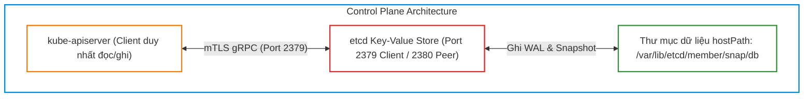
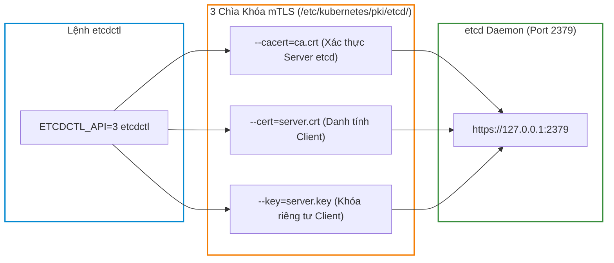
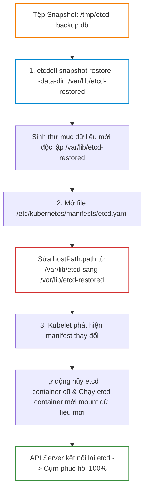


# [BÀI 09] QUẢN TRỊ ETCD CHUYÊN SÂU: SAO LƯU SNAPSHOT, PHỤC HỒI THẢM HỌA & CỨU HỘ CỤM KHI MẤT QUORUM

Trong kiến trúc tổng thể của **Kubernetes**, mọi thành phần trong Control Plane như `kube-apiserver`, `kube-scheduler`, `kube-controller-manager` đều được thiết kế theo mô hình phi trạng thái (Stateless). Nơi duy nhất nắm giữ "linh hồn" và toàn bộ dữ liệu của cụm — từ thông tin Pod, Service, ConfigMap, Secret cho đến các chính sách bảo mật RBAC — chính là **`etcd`**, cơ sở dữ liệu phân tán dạng Key-Value hoạt động dựa trên thuật toán đồng thuận Raft.

Nếu một Worker Node gặp sự cố phần cứng, Kubernetes có thể tự động lập lịch lại Pod sang Node khác. Nhưng nếu cơ sở dữ liệu `etcd` bị hư hỏng hoặc mất dữ liệu mà không có bản sao lưu dự phòng, toàn bộ cụm Kubernetes sẽ sụp đổ hoàn toàn. Trong kỳ thi chứng chỉ **CKA (Certified Kubernetes Administrator)**, câu hỏi về **sao lưu snapshot etcd và khôi phục thảm họa (Disaster Recovery)** là một trong những bài thi bắt buộc với trọng số điểm tuyệt đối.

---

> [!IMPORTANT]
> **MỤC TIÊU KỸ THUẬT CỐT LÕI (TECHNICAL GOALS):**
> 1. **Bản chất kiến trúc etcd:** Hiểu rõ thuật toán Raft, cổng Client `2379`, cổng Peer `2380` và công thức Quorum `(N/2) + 1`.
> 2. **Bảo mật mTLS với `etcdctl`:** Trích xuất chính xác 3 tệp chứng chỉ (`ca.crt`, `server.crt`, `server.key`) từ static pod manifest.
> 3. **Quy trình sao lưu Snapshot toàn vẹn:** Thực thi lệnh `ETCDCTL_API=3 etcdctl snapshot save` và đối soát mã băm tính toàn vẹn bằng `snapshot status`.
> 4. **Chiến lược khôi phục dữ liệu an toàn:** Phục hồi snapshot ra thư mục mới `--data-dir` và kỹ thuật hoán đổi volume `hostPath` trong `etcd.yaml`.
> 5. **Hands-on Lab 8 bước thực chiến:** Tự tay tạo dữ liệu mẫu, chụp snapshot, giả lập thảm họa xóa sạch dữ liệu và phục hồi cụm 100% thành công.

---

## 1. Bản Chất Kiến Trúc & Tư Duy Cốt Lõi: Sao Lưu Snapshot & Phục Hồi Thảm Họa etcd

### 1.1. Kiến Trúc etcd, Thuật Toán Đồng Thuận Raft & Quorum

`etcd` là một hệ thống lưu trữ phân tán đảm bảo tính nhất quán mạnh (Strong Consistency) theo định lý CAP (Consistency - Availability - Partition Tolerance).



#### Các Đặc Tính Kỹ Thuật Then Chốt Của etcd:
1. **Điểm truy cập duy nhất:** Trong cụm Kubernetes chuẩn, **chỉ duy nhất `kube-apiserver` được phép giao tiếp trực tiếp với etcd**. Tất cả các thành phần khác (Kubelet, Scheduler, Controller Manager) đều phải đi qua API Server.
2. **Cơ chế phân định 2 cổng mạng:**
   - **Port `2379` (Client Port):** Nhận các câu lệnh đọc/ghi dữ liệu từ `kube-apiserver` và các lệnh quản trị từ `etcdctl`.
   - **Port `2380` (Peer Port):** Dùng riêng cho các node etcd giao tiếp nội bộ với nhau để bầu chọn Leader và nhân bản nhật ký giao dịch (Log Replication).
3. **Công thức Quorum (Đa số quá bán):**
   - Để cụm etcd đa node duy trì khả năng ghi dữ liệu, số node sống sót tối thiểu phải đạt: $\text{Quorum} = \lfloor \frac{N}{2} \rfloor + 1$.
   - Cụm 3 node chịu được tối đa 1 node sập ($\text{Quorum} = 2$). Cụm 5 node chịu được tối đa 2 node sập ($\text{Quorum} = 3$). Đó là lý do số lượng node etcd luôn luôn là số lẻ ($3, 5, 7$).

---

### 1.2. Xác Thực Hai Chiều mTLS & Cấu Hình Biến Môi Trường `ETCDCTL_API=3`

Trong Kubernetes dựng bằng `kubeadm`, etcd chạy dưới dạng một **Static Pod** trên Control Plane và được bảo vệ nghiêm ngặt bằng Mutual TLS (mTLS).



- **Biến môi trường `ETCDCTL_API=3`:** Mặc định công cụ `etcdctl` có thể sử dụng API v2 (không hỗ trợ subcommand `snapshot`). Bắt buộc phải khai báo `ETCDCTL_API=3` trước câu lệnh.
- **Trích xuất thông số mTLS từ `etcd.yaml`:** Trong phòng thi CKA, thay vì cố nhớ đường dẫn chứng chỉ, hãy mở tệp `/etc/kubernetes/manifests/etcd.yaml` để lấy chính xác:
  - `--trusted-ca-file` &rarr; truyền vào `--cacert=/etc/kubernetes/pki/etcd/ca.crt`
  - `--cert-file` &rarr; truyền vào `--cert=/etc/kubernetes/pki/etcd/server.crt`
  - `--key-file` &rarr; truyền vào `--key=/etc/kubernetes/pki/etcd/server.key`

---

### 1.3. Quy Trình Khôi Phục Thảm Họa: Tại Sao Bắt Buộc Dùng Thư Mục `--data-dir` Mới?

Quy trình khôi phục snapshot etcd là thao tác có độ rủi ro cao nhất trong quản trị Kubernetes. Nếu thực hiện sai phương pháp, cơ sở dữ liệu sẽ bị hỏng khóa tệp (File Lock) và cụm không thể phục hồi.



#### Nguyên Tắc Cốt Tử:
1. **Tuyệt đối không restore đè vào thư mục cũ (`/var/lib/etcd`):**
   - Khi etcd đang chạy hoặc vừa bị crash, tiến trình vẫn có thể giữ file descriptor hoặc lock tệp `member/snap/db`.
   - Nếu bạn chạy `snapshot restore` trực tiếp vào `/var/lib/etcd`, lệnh sẽ bị từ chối với lỗi `data-dir location exists` hoặc gây hỏng cấu trúc phân mảnh.
2. **Kỹ thuật hoán đổi Static Pod Manifest (`hostPath` Swap):**
   - Khi ta chỉ định `--data-dir=/var/lib/etcd-restored`, `etcdctl` tạo ra một cây thư mục cơ sở dữ liệu hoàn chỉnh mới.
   - Khi ta chỉnh sửa trường `volumes[name=etcd-data].hostPath.path` trong tệp `/etc/kubernetes/manifests/etcd.yaml` trỏ sang `/var/lib/etcd-restored`, Kubelet sẽ tự động phát hiện mã băm (hash) của tệp manifest thay đổi, tiến hành restart container etcd và gắn kết vào thư mục dữ liệu đã khôi phục.

---

## 2. Bảng Ma Trận So Sánh Kỹ Thuật Toàn Diện (Engineering Matrix)

### 2.1. Ma Trận Các Lệnh Quản Trị etcd Cốt Lõi (`etcdctl`)

| Subcommand | Mục đích kỹ thuật | Cờ tham số bắt buộc | Tác động hệ thống |
|---|---|---|---|
| **`snapshot save <file>`** | Trích xuất toàn bộ dữ liệu etcd tại thời điểm hiện tại ra 1 tệp nhị phân duy nhất | `--endpoints`, `--cacert`, `--cert`, `--key` | Hoàn toàn Read-only, không gây gián đoạn cụm |
| **`snapshot status <file>`** | Đọc header của tệp backup để kiểm tra Total Keys, Revision và Hash | `-w table` hoặc `-w json` | Read-only trên tệp đĩa, dùng kiểm tra tính toàn vẹn |
| **`snapshot restore <file>`** | Giải nén snapshot và tái cấu trúc cây thư mục database etcd | `--data-dir=<duong-dan-moi>` | Ghi ra thư mục đĩa mới, không tương tác với etcd đang chạy |
| **`endpoint health`** | Kiểm tra trạng thái sẵn sàng phản hồi của các node etcd | `--endpoints`, mTLS certs | Read-only kiểm tra kết nối mạng và độ trễ |
| **`defrag`** | Chống phân mảnh đĩa cứng và thu hồi dung lượng bộ nhớ etcd | `--endpoints`, mTLS certs | Tạm thời khóa ghi (lock) node etcd trong vài mili-giây |

---

### 2.2. Ma Trận So Sánh Hai Kiến Trúc Triển Khai etcd

| Tiêu chí | Stacked etcd Topology (Mặc định kubeadm) | External etcd Topology (Tách biệt) |
|---|---|---|
| **Vị trí chạy** | Chạy dưới dạng Static Pod trên cùng máy chủ Control Plane | Chạy trên cụm máy chủ chuyên dụng riêng biệt ngoài cụm K8s |
| **Tiêu tốn tài nguyên** | Tiết kiệm máy chủ (Tối thiểu 3 máy cho cụm HA) | Tốn kém hơn (Cần tối thiểu 3 Control Plane + 3 etcd nodes = 6 máy) |
| **Mức độ cô lập an ninh** | Trung bình (Chung CPU/RAM/Disk IOPS với API Server) | **Rất cao** (Tách biệt hoàn toàn phần cứng và mạng) |
| **Độ phức tạp khôi phục** | Đơn giản (Chỉnh sửa trực tiếp file `etcd.yaml` trên node) | Phức tạp hơn (Cần quản trị viên SSH vào từng etcd VM riêng) |
| **Phạm vi thi CKA** | **100% bài thi CKA sử dụng mô hình Stacked etcd** | Thường gặp trong các kiến trúc Enterprise quy mô lớn |

---

## 3. Kiến Trúc Môi Trường & Luồng Thực Thi Mẫu

### 3.1. Cấu Hình Tệp Manifest Static Pod `/etc/kubernetes/manifests/etcd.yaml`

Dưới đây là các trường cốt lõi cần quan sát và chỉnh sửa khi thao tác sao lưu/phục hồi etcd:

```yaml
apiVersion: v1
kind: Pod
metadata:
  name: etcd-cp-01
  namespace: kube-system
spec:
  containers:
  - name: etcd
    image: registry.k8s.io/etcd:3.5.15-0
    command:
    - etcd
    - --advertise-client-urls=https://192.168.1.10:2379
    - --cert-file=/etc/kubernetes/pki/etcd/server.crt
    - --key-file=/etc/kubernetes/pki/etcd/server.key
    - --trusted-ca-file=/etc/kubernetes/pki/etcd/ca.crt
    - --client-cert-auth=true
    - --data-dir=/var/lib/etcd
    - --listen-client-urls=https://127.0.0.1:2379,https://192.168.1.10:2379
    volumeMounts:
    - mountPath: /var/lib/etcd
      name: etcd-data
    - mountPath: /etc/kubernetes/pki/etcd
      name: etcd-certs
  volumes:
  - name: etcd-data
    hostPath:
      path: /var/lib/etcd # <<< SỬA TRƯỜNG NÀY THÀNH /var/lib/etcd-restored KHI RESTORE
      type: DirectoryOrCreate
  - name: etcd-certs
    hostPath:
      path: /etc/kubernetes/pki/etcd
      type: DirectoryOrCreate
```

---

## 4. Phân Tích Cạm Bẫy Thực Chiến: Phục Hồi Trực Tiếp Gây Hỏng Lock File & Lỗi Thiếu mTLS

### Tình Huống Sự Cố Thực Tế:
Sau một sự cố mất điện đột ngột tại trung tâm dữ liệu, cơ sở dữ liệu etcd trên Control Plane bị hỏng bảng chỉ mục (Index corruption), khiến `kube-apiserver` liên tục báo lỗi `500 Internal Server Error` và không thể khởi động. 

Kỹ sư vận hành tiến hành chạy lệnh khôi phục snapshot từ bản sao lưu đêm hôm trước nhưng mắc phải 2 sai lầm nghiêm trọng:
1. Gõ lệnh `etcdctl snapshot save` mà không khai báo biến `ETCDCTL_API=3` và các cờ mTLS dẫn tới lệnh bị từ chối.
2. Khi chạy lệnh `snapshot restore`, kỹ sư chỉ định trực tiếp `--data-dir=/var/lib/etcd` (thư mục cũ đang có tệp lock), làm tiến trình etcd bị kẹt vĩnh viễn trong vòng lặp CrashLoop.

---

### Hậu Quả & Log Lỗi Thực Tế:
Khi chạy `etcdctl` thiếu cấu hình chứng chỉ bảo mật:

```text
{"level":"warn","msg":"failed to connect","error":"remote error: tls: bad certificate"}
Error: context deadline exceeded
```

Khi chạy `snapshot restore` đè lên thư mục dữ liệu cũ:

```text
Error: data-dir location exists (/var/lib/etcd)
```

Log Kubelet khi Static Pod etcd bị chỉ định sai quyền thư mục:

```text
Sep 12 20:12:45 cp-01 kubelet[11250]: E0912 20:12:45.102941 11250 pod_workers.go:1290] "Error syncing pod" pod="kube-system/etcd-cp-01" err="failed to "StartContainer" for "etcd" with CrashLoopBackOff: "open /var/lib/etcd-restored/member/snap/db: permission denied""
```

---

### 5-Whys Root Cause Analysis:

1. **Tại sao cụm Kubernetes không thể khởi động lại sau sự cố mất điện?**
   - Vì file database etcd (`/var/lib/etcd/member/snap/db`) bị hỏng do tiến trình ghi đĩa bị ngắt đột ngột.
2. **Tại sao lệnh `etcdctl` ban đầu bị lỗi `tls: bad certificate`?**
   - Vì etcd bắt buộc xác thực hai chiều mTLS nhưng kỹ sư quên truyền 3 tham số chứng chỉ `--cacert`, `--cert`, `--key`.
3. **Tại sao lệnh `snapshot restore` bị dừng ngay lập tức?**
   - Vì `etcdctl` có cơ chế an toàn từ chối giải nén đè lên thư mục đã tồn tại dữ liệu (`/var/lib/etcd`).
4. **Tại sao sau khi restore ra thư mục mới, etcd container vẫn bị CrashLoop?**
   - Vì thư mục mới `/var/lib/etcd-restored` được tạo bởi user root nhưng container etcd chạy dưới quyền UID non-root mà chưa được phân quyền `chmod 700`.
5. **Root Cause cốt lõi là gì?**
   - Kỹ sư không nắm vững quy trình 3 bước chuẩn của Disaster Recovery: Trích xuất cert từ manifest &rarr; Restore ra thư mục `--data-dir` mới &rarr; Hoán đổi `hostPath` trong `etcd.yaml`.

---

## 5. Hands-on Lab: Sao Lưu & Phục Hồi Thảm Họa etcd Chuẩn CKA (8 Bước)

| Bước | Tên nhiệm vụ | Tiêu chí kỹ thuật hoàn thành |
|---|---|---|
| **Bước 1** | Tạo tài nguyên kiểm thử `critical-db` | Deployment 2 replicas sẵn sàng trên cụm làm dữ liệu đối chứng. |
| **Bước 2** | Trích xuất thông số mTLS từ manifest `etcd.yaml` | Lấy chính xác đường dẫn 3 tệp cert trong `/etc/kubernetes/pki/etcd/`. |
| **Bước 3** | Kiểm tra sức khỏe etcd endpoint | Lệnh `etcdctl endpoint health` trả về `healthy`. |
| **Bước 4** | Thực hiện sao lưu `etcdctl snapshot save` | Tệp `/tmp/etcd-backup.db` được tạo thành công trên đĩa. |
| **Bước 5** | Xác thực tính toàn vẹn của tệp backup | Lệnh `etcdctl snapshot status` in ra bảng chứa Revision và Hash. |
| **Bước 6** | Giả lập thảm họa: Xóa sạch tài nguyên kiểm thử | Deployment `critical-db` biến mất hoàn toàn khỏi cụm. |
| **Bước 7** | Phục hồi snapshot ra thư mục mới `/var/lib/etcd-restored` | Thư mục dữ liệu mới được giải nén hoàn chỉnh. |
| **Bước 8** | Hoán đổi `hostPath` trong `etcd.yaml` & Xác nhận cụm | Kubelet restart etcd, Deployment `critical-db` xuất hiện trở lại 100%. |

---

### Bước 1: Tạo tài nguyên kiểm thử `critical-db`

Tạo một Deployment ứng dụng đóng vai trò là dữ liệu quan trọng của doanh nghiệp:

```bash
# 1. Tạo Deployment kiểm thử
kubectl create deployment critical-db --image=nginx:1.27-alpine --replicas=2

# 2. Chờ Deployment sẵn sàng
kubectl wait --for=condition=Available deploy/critical-db --timeout=30s

# 3. Xác nhận Pod đang hoạt động
kubectl get pods -l app=critical-db -o wide
```

---

### Bước 2: Trích xuất thông số mTLS từ manifest `etcd.yaml`

Thực hiện trên Control Plane Node (`cp-01`):

```bash
# Trích xuất 3 đường dẫn chứng chỉ và endpoint từ manifest của etcd
grep -E "cert-file|key-file|trusted-ca-file|advertise-client-urls" /etc/kubernetes/manifests/etcd.yaml
```

---

### Bước 3: Kiểm tra sức khỏe etcd endpoint

```bash
# Kiểm tra kết nối mTLS an toàn tới etcd
sudo ETCDCTL_API=3 etcdctl \
  --endpoints=https://127.0.0.1:2379 \
  --cacert=/etc/kubernetes/pki/etcd/ca.crt \
  --cert=/etc/kubernetes/pki/etcd/server.crt \
  --key=/etc/kubernetes/pki/etcd/server.key \
  endpoint health
```

---

### Bước 4: Thực hiện sao lưu `etcdctl snapshot save`

```bash
# Thực hiện chụp snapshot toàn bộ dữ liệu etcd
sudo ETCDCTL_API=3 etcdctl \
  --endpoints=https://127.0.0.1:2379 \
  --cacert=/etc/kubernetes/pki/etcd/ca.crt \
  --cert=/etc/kubernetes/pki/etcd/server.crt \
  --key=/etc/kubernetes/pki/etcd/server.key \
  snapshot save /tmp/etcd-backup.db
```

---

### Bước 5: Xác thực tính toàn vẹn của tệp backup

```bash
# Kiểm tra bảng trạng thái snapshot (Kiểm tra Hash, Total Keys, Revision)
sudo ETCDCTL_API=3 etcdctl snapshot status /tmp/etcd-backup.db -w table
```

---

### Bước 6: Giả lập thảm họa: Xóa sạch tài nguyên kiểm thử

```bash
# Giả lập sự cố con người: Xóa vĩnh viễn Deployment critical-db
kubectl delete deploy critical-db

# Xác nhận tài nguyên đã hoàn toàn biến mất
kubectl get deploy critical-db || echo "XÁC NHẬN: Dữ liệu critical-db đã bị xóa sạch khỏi cụm!"
```

---

### Bước 7: Phục hồi snapshot ra thư mục mới `/var/lib/etcd-restored`

```bash
# Phục hồi snapshot ra thư mục dữ liệu mới độc lập
sudo ETCDCTL_API=3 etcdctl snapshot restore /tmp/etcd-backup.db \
  --data-dir=/var/lib/etcd-restored

# Phân quyền truy cập an toàn cho thư mục dữ liệu mới
sudo chmod -R 700 /var/lib/etcd-restored
```

---

### Bước 8: Hoán đổi `hostPath` trong `etcd.yaml` & Xác nhận cụm

```bash
# 1. Sửa đường dẫn hostPath volume trong static pod manifest
sudo sed -i 's|path: /var/lib/etcd|path: /var/lib/etcd-restored|g' /etc/kubernetes/manifests/etcd.yaml

# 2. Đợi 20-30 giây để Kubelet tự động phát hiện manifest đổi và restart etcd pod
sleep 25

# 3. KIỂM CHỨNG PHỤC HỒI: Xác nhận Deployment critical-db đã được hồi sinh 100%
kubectl get deploy critical-db
kubectl get pods -l app=critical-db
```

---

## 6. 10 Câu Hỏi Tự Kiểm Tra Chuyên Sâu (Self-Check Q&A Accordion)

<details class="qa-card">
<summary class="qa-summary">
  <div class="qa-summary-left">
    <span class="qa-num-badge">Q01</span>
    <span>etcd đóng vai trò gì trong kiến trúc cụm Kubernetes và tại sao mất etcd là mất toàn bộ cụm?</span>
  </div>
  <span class="qa-chevron">
    <svg width="18" height="18" fill="none" stroke="currentColor" stroke-width="2.5" viewBox="0 0 24 24"><polyline points="6 9 12 15 18 9"></polyline></svg>
  </span>
</summary>
<div class="qa-answer">
  <div class="qa-answer-header">
    <svg width="14" height="14" fill="none" stroke="currentColor" stroke-width="2" viewBox="0 0 24 24"><path d="M22 11.08V12a10 10 0 1 1-5.93-9.14"></path><polyline points="22 4 12 14.01 9 11.01"></polyline></svg>
    <span>Phân Tích &amp; Lời Giải Kỹ Thuật</span>
  </div>
  <div style="margin: 0.35rem 0; padding-left: 1rem; border-left: 2px solid var(--accent-primary);">• <b>Vai trò cốt lõi:</b> <code>etcd</code> là cơ sở dữ liệu phân tán Key-Value duy nhất lưu giữ 100% trạng thái mong muốn (Desired State) và trạng thái thực tế (Actual State) của toàn bộ cụm.</div>
  <div style="margin: 0.35rem 0; padding-left: 1rem; border-left: 2px solid var(--accent-primary);">• Toàn bộ các thành phần Control Plane khác (API Server, Controller Manager, Scheduler) đều là Stateless. Nếu mất etcd, toàn bộ thông tin về Pods, Services, Deployments, Secrets, ConfigMaps và quyền RBAC sẽ biến mất vĩnh viễn và không thể tái tạo lại nếu không có bản sao lưu snapshot.</div>
  <div style="margin-top: 0.75rem;"><b style="color: var(--accent-primary);">Tiêu chí chấm điểm &amp; Phân tầng năng lực:</b></div>
  <div style="margin: 0.25rem 0; padding-left: 1rem; border-left: 2px solid var(--accent-primary);">• <b>0đ:</b> Không biết vai trò của etcd hoặc cho rằng etcd lưu mã nguồn ứng dụng.</div>
  <div style="margin: 0.25rem 0; padding-left: 1rem; border-left: 2px solid var(--accent-primary);">• <b>1đ:</b> Nêu được etcd là database nhưng không giải thích được tính chất Stateless của các master components.</div>
  <div style="margin: 0.25rem 0; padding-left: 1rem; border-left: 2px solid var(--accent-primary);">• <b>2đ:</b> Phân tích chuẩn xác vai trò lưu trữ trạng thái duy nhất và tính chất sống còn của etcd.</div>
  <div style="margin: 0.25rem 0; padding-left: 1rem; border-left: 2px solid var(--accent-primary);">• <b>3đ:</b> Trả lời xuất sắc, phân tích sâu cơ chế đồng thuận Raft và đảm bảo tính nhất quán dữ liệu.</div>
  <div style="margin-top: 0.75rem; padding: 0.5rem 0.75rem; background: rgba(var(--accent-primary-rgb, 59, 130, 246), 0.08); border-radius: 4px;"><b style="color: var(--accent-primary);">Câu hỏi mở rộng:</b> etcd lưu trữ dữ liệu dạng cấu trúc gì? <i>(Đáp án: Dạng cây Key-Value nhị phân phân cấp phân tầng bbolt).</i></div>
</div>
</details>

<details class="qa-card">
<summary class="qa-summary">
  <div class="qa-summary-left">
    <span class="qa-num-badge">Q02</span>
    <span>Hai cổng mạng mặc định <code>2379</code> và <code>2380</code> của etcd phục vụ hai mục đích khác nhau như thế nào?</span>
  </div>
  <span class="qa-chevron">
    <svg width="18" height="18" fill="none" stroke="currentColor" stroke-width="2.5" viewBox="0 0 24 24"><polyline points="6 9 12 15 18 9"></polyline></svg>
  </span>
</summary>
<div class="qa-answer">
  <div class="qa-answer-header">
    <svg width="14" height="14" fill="none" stroke="currentColor" stroke-width="2" viewBox="0 0 24 24"><path d="M22 11.08V12a10 10 0 1 1-5.93-9.14"></path><polyline points="22 4 12 14.01 9 11.01"></polyline></svg>
    <span>Phân Tích &amp; Lời Giải Kỹ Thuật</span>
  </div>
  <div style="margin: 0.35rem 0; padding-left: 1rem; border-left: 2px solid var(--accent-primary);">• <b>Cổng <code>2379</code> (Client Communication Port):</b> Tiếp nhận các yêu cầu đọc/ghi dữ liệu từ <code>kube-apiserver</code> và các lệnh quản trị từ công cụ CLI <code>etcdctl</code>.</div>
  <div style="margin: 0.35rem 0; padding-left: 1rem; border-left: 2px solid var(--accent-primary);">• <b>Cổng <code>2380</code> (Peer Communication Port):</b> Dùng riêng cho việc đồng bộ trạng thái nội bộ giữa các node etcd trong cụm phân tán (Heartbeat, Bầu chọn Leader, Đồng bộ Raft Log).</div>
  <div style="margin-top: 0.75rem;"><b style="color: var(--accent-primary);">Tiêu chí chấm điểm &amp; Phân tầng năng lực:</b></div>
  <div style="margin: 0.25rem 0; padding-left: 1rem; border-left: 2px solid var(--accent-primary);">• <b>0đ:</b> Không nhớ 2 cổng 2379 và 2380.</div>
  <div style="margin: 0.25rem 0; padding-left: 1rem; border-left: 2px solid var(--accent-primary);">• <b>1đ:</b> Nhớ số cổng nhưng nhầm lẫn vai trò Client vs Peer.</div>
  <div style="margin: 0.25rem 0; padding-left: 1rem; border-left: 2px solid var(--accent-primary);">• <b>2đ:</b> Phân biệt chính xác cổng 2379 (Client) và 2380 (Peer).</div>
  <div style="margin: 0.25rem 0; padding-left: 1rem; border-left: 2px solid var(--accent-primary);">• <b>3đ:</b> Trình bày xuất sắc, nêu các cờ cấu hình tương ứng trong manifest (<code>--listen-client-urls</code> và <code>--listen-peer-urls</code>).</div>
  <div style="margin-top: 0.75rem; padding: 0.5rem 0.75rem; background: rgba(var(--accent-primary-rgb, 59, 130, 246), 0.08); border-radius: 4px;"><b style="color: var(--accent-primary);">Câu hỏi mở rộng:</b> Khi chạy lệnh <code>etcdctl snapshot save</code>, ta truyền cờ <code>--endpoints</code> trỏ vào cổng nào? <i>(Đáp án: Cổng 2379: <code>https://127.0.0.1:2379</code>).</i></div>
</div>
</details>

<details class="qa-card">
<summary class="qa-summary">
  <div class="qa-summary-left">
    <span class="qa-num-badge">Q03</span>
    <span>Cần đặt biến môi trường nào và truyền đủ 3 cờ mTLS nào khi giao tiếp với etcd bằng công cụ <code>etcdctl</code>?</span>
  </div>
  <span class="qa-chevron">
    <svg width="18" height="18" fill="none" stroke="currentColor" stroke-width="2.5" viewBox="0 0 24 24"><polyline points="6 9 12 15 18 9"></polyline></svg>
  </span>
</summary>
<div class="qa-answer">
  <div class="qa-answer-header">
    <svg width="14" height="14" fill="none" stroke="currentColor" stroke-width="2" viewBox="0 0 24 24"><path d="M22 11.08V12a10 10 0 1 1-5.93-9.14"></path><polyline points="22 4 12 14.01 9 11.01"></polyline></svg>
    <span>Phân Tích &amp; Lời Giải Kỹ Thuật</span>
  </div>
  <div style="margin: 0.35rem 0; padding-left: 1rem; border-left: 2px solid var(--accent-primary);">• <b>Biến môi trường:</b> <code>ETCDCTL_API=3</code> (kích hoạt giao diện API phiên bản 3).</div>
  <div style="margin: 0.35rem 0; padding-left: 1rem; border-left: 2px solid var(--accent-primary);">• <b>3 cờ mTLS bắt buộc:</b></div>
  <div style="margin: 0.35rem 0; padding-left: 1rem; border-left: 2px solid var(--accent-primary);">  1. <code>--cacert=/etc/kubernetes/pki/etcd/ca.crt</code> (Root CA chứng thực server).</div>
  <div style="margin: 0.35rem 0; padding-left: 1rem; border-left: 2px solid var(--accent-primary);">  2. <code>--cert=/etc/kubernetes/pki/etcd/server.crt</code> (Client certificate chứng thực danh tính).</div>
  <div style="margin: 0.35rem 0; padding-left: 1rem; border-left: 2px solid var(--accent-primary);">  3. <code>--key=/etc/kubernetes/pki/etcd/server.key</code> (Client private key mã hóa phiên làm việc).</div>
  <div style="margin-top: 0.75rem;"><b style="color: var(--accent-primary);">Tiêu chí chấm điểm &amp; Phân tầng năng lực:</b></div>
  <div style="margin: 0.25rem 0; padding-left: 1rem; border-left: 2px solid var(--accent-primary);">• <b>0đ:</b> Không biết biến ETCDCTL_API hoặc thiếu cờ certs.</div>
  <div style="margin: 0.25rem 0; padding-left: 1rem; border-left: 2px solid var(--accent-primary);">• <b>1đ:</b> Nhớ 3 cờ certs nhưng quên biến <code>ETCDCTL_API=3</code>.</div>
  <div style="margin: 0.25rem 0; padding-left: 1rem; border-left: 2px solid var(--accent-primary);">• <b>2đ:</b> Liệt kê chính xác biến môi trường và đủ 3 cờ mTLS.</div>
  <div style="margin: 0.25rem 0; padding-left: 1rem; border-left: 2px solid var(--accent-primary);">• <b>3đ:</b> Trả lời hoàn hảo, chỉ ra đường dẫn tệp cert có thể dùng <code>healthcheck-client.crt</code> thay thế.</div>
  <div style="margin-top: 0.75rem; padding: 0.5rem 0.75rem; background: rgba(var(--accent-primary-rgb, 59, 130, 246), 0.08); border-radius: 4px;"><b style="color: var(--accent-primary);">Câu hỏi mở rộng:</b> Nếu không đặt <code>ETCDCTL_API=3</code> thì khi gõ <code>etcdctl snapshot save</code> sẽ nhận thông báo lỗi gì? <i>(Đáp án: Báo lỗi command not found hoặc invalid command vì API v2 không hỗ trợ lệnh snapshot).</i></div>
</div>
</details>

<details class="qa-card">
<summary class="qa-summary">
  <div class="qa-summary-left">
    <span class="qa-num-badge">Q04</span>
    <span>Đâu là nơi nhanh nhất và chính xác nhất để tìm thấy đường dẫn các tệp chứng chỉ của etcd trong phòng thi CKA?</span>
  </div>
  <span class="qa-chevron">
    <svg width="18" height="18" fill="none" stroke="currentColor" stroke-width="2.5" viewBox="0 0 24 24"><polyline points="6 9 12 15 18 9"></polyline></svg>
  </span>
</summary>
<div class="qa-answer">
  <div class="qa-answer-header">
    <svg width="14" height="14" fill="none" stroke="currentColor" stroke-width="2" viewBox="0 0 24 24"><path d="M22 11.08V12a10 10 0 1 1-5.93-9.14"></path><polyline points="22 4 12 14.01 9 11.01"></polyline></svg>
    <span>Phân Tích &amp; Lời Giải Kỹ Thuật</span>
  </div>
  <div style="margin: 0.35rem 0; padding-left: 1rem; border-left: 2px solid var(--accent-primary);">• <b>Nơi chuẩn xác nhất:</b> Đọc trực tiếp tệp Static Pod Manifest tại đường dẫn <b><code>/etc/kubernetes/manifests/etcd.yaml</code></b>.</div>
  <div style="margin: 0.35rem 0; padding-left: 1rem; border-left: 2px solid var(--accent-primary);">• Câu lệnh trích xuất nhanh trong 3 giây: <code>grep -E "trusted-ca-file|cert-file|key-file" /etc/kubernetes/manifests/etcd.yaml</code>.</div>
  <div style="margin-top: 0.75rem;"><b style="color: var(--accent-primary);">Tiêu chí chấm điểm &amp; Phân tầng năng lực:</b></div>
  <div style="margin: 0.25rem 0; padding-left: 1rem; border-left: 2px solid var(--accent-primary);">• <b>0đ:</b> Tìm kiếm mò thủ công trong toàn bộ ổ đĩa.</div>
  <div style="margin: 0.25rem 0; padding-left: 1rem; border-left: 2px solid var(--accent-primary);">• <b>1đ:</b> Biết tìm trong thư mục /etc/kubernetes/pki nhưng không nhớ tên tệp cụ thể.</div>
  <div style="margin: 0.25rem 0; padding-left: 1rem; border-left: 2px solid var(--accent-primary);">• <b>2đ:</b> Chỉ ra ngay tệp manifest <code>/etc/kubernetes/manifests/etcd.yaml</code>.</div>
  <div style="margin: 0.25rem 0; padding-left: 1rem; border-left: 2px solid var(--accent-primary);">• <b>3đ:</b> Trả lời xuất sắc, viết ngay lệnh grep một dòng để trích xuất cả cert và endpoint IP.</div>
  <div style="margin-top: 0.75rem; padding: 0.5rem 0.75rem; background: rgba(var(--accent-primary-rgb, 59, 130, 246), 0.08); border-radius: 4px;"><b style="color: var(--accent-primary);">Câu hỏi mở rộng:</b> Tệp manifest này do thành phần nào trong Kubernetes quản lý? <i>(Đáp án: Kubelet Daemon trên Control Plane quét và quản lý trực tiếp).</i></div>
</div>
</details>

<details class="qa-card">
<summary class="qa-summary">
  <div class="qa-summary-left">
    <span class="qa-num-badge">Q05</span>
    <span>Trình bày câu lệnh chuẩn để sao lưu etcd snapshot ra tệp <code>/tmp/etcd-backup.db</code>.</span>
  </div>
  <span class="qa-chevron">
    <svg width="18" height="18" fill="none" stroke="currentColor" stroke-width="2.5" viewBox="0 0 24 24"><polyline points="6 9 12 15 18 9"></polyline></svg>
  </span>
</summary>
<div class="qa-answer">
  <div class="qa-answer-header">
    <svg width="14" height="14" fill="none" stroke="currentColor" stroke-width="2" viewBox="0 0 24 24"><path d="M22 11.08V12a10 10 0 1 1-5.93-9.14"></path><polyline points="22 4 12 14.01 9 11.01"></polyline></svg>
    <span>Phân Tích &amp; Lời Giải Kỹ Thuật</span>
  </div>
  <div style="margin: 0.35rem 0; padding-left: 1rem; border-left: 2px solid var(--accent-primary);">• <b>Cú pháp chuẩn:</b></div>
  <div style="margin: 0.35rem 0; padding-left: 1rem; border-left: 2px solid var(--accent-primary);"><code>ETCDCTL_API=3 etcdctl --endpoints=https://127.0.0.1:2379 \</code><br/>
  <code>&nbsp;&nbsp;--cacert=/etc/kubernetes/pki/etcd/ca.crt \</code><br/>
  <code>&nbsp;&nbsp;--cert=/etc/kubernetes/pki/etcd/server.crt \</code><br/>
  <code>&nbsp;&nbsp;--key=/etc/kubernetes/pki/etcd/server.key \</code><br/>
  <code>&nbsp;&nbsp;snapshot save /tmp/etcd-backup.db</code></div>
  <div style="margin-top: 0.75rem;"><b style="color: var(--accent-primary);">Tiêu chí chấm điểm &amp; Phân tầng năng lực:</b></div>
  <div style="margin: 0.25rem 0; padding-left: 1rem; border-left: 2px solid var(--accent-primary);">• <b>0đ:</b> Viết sai cú pháp hoặc thiếu các cờ mTLS.</div>
  <div style="margin: 0.25rem 0; padding-left: 1rem; border-left: 2px solid var(--accent-primary);">• <b>1đ:</b> Đúng lệnh snapshot save nhưng thiếu tiền tố <code>ETCDCTL_API=3</code>.</div>
  <div style="margin: 0.25rem 0; padding-left: 1rem; border-left: 2px solid var(--accent-primary);">• <b>2đ:</b> Viết chuẩn xác toàn bộ câu lệnh với đầy đủ tham số.</div>
  <div style="margin: 0.25rem 0; padding-left: 1rem; border-left: 2px solid var(--accent-primary);">• <b>3đ:</b> Trả lời hoàn hảo, nêu thêm thao tác kiểm tra tính toàn vẹn ngay sau khi lưu.</div>
  <div style="margin-top: 0.75rem; padding: 0.5rem 0.75rem; background: rgba(var(--accent-primary-rgb, 59, 130, 246), 0.08); border-radius: 4px;"><b style="color: var(--accent-primary);">Câu hỏi mở rộng:</b> Lệnh <code>snapshot save</code> có làm gián đoạn các request đọc/ghi của API Server không? <i>(Đáp án: Không, lệnh chỉ tạo một transaction snapshot đọc point-in-time mà không lock database).</i></div>
</div>
</details>

<details class="qa-card">
<summary class="qa-summary">
  <div class="qa-summary-left">
    <span class="qa-num-badge">Q06</span>
    <span>Lệnh <code>etcdctl snapshot status</code> giúp kiểm tra những thông số kỹ thuật nào của tệp backup?</span>
  </div>
  <span class="qa-chevron">
    <svg width="18" height="18" fill="none" stroke="currentColor" stroke-width="2.5" viewBox="0 0 24 24"><polyline points="6 9 12 15 18 9"></polyline></svg>
  </span>
</summary>
<div class="qa-answer">
  <div class="qa-answer-header">
    <svg width="14" height="14" fill="none" stroke="currentColor" stroke-width="2" viewBox="0 0 24 24"><path d="M22 11.08V12a10 10 0 1 1-5.93-9.14"></path><polyline points="22 4 12 14.01 9 11.01"></polyline></svg>
    <span>Phân Tích &amp; Lời Giải Kỹ Thuật</span>
  </div>
  <div style="margin: 0.35rem 0; padding-left: 1rem; border-left: 2px solid var(--accent-primary);">• <b>HASH:</b> Mã băm kiểm tra tính toàn vẹn của tệp dữ liệu (phát hiện file bị bẩn hoặc ghi dở).</div>
  <div style="margin: 0.35rem 0; padding-left: 1rem; border-left: 2px solid var(--accent-primary);">• <b>REVISION:</b> Số thứ tự phiên bản giao dịch cuối cùng được ghi nhận trong snapshot.</div>
  <div style="margin: 0.35rem 0; padding-left: 1rem; border-left: 2px solid var(--accent-primary);">• <b>TOTAL KEYS:</b> Tổng số lượng khóa đối tượng Kubernetes được lưu trữ trong tệp.</div>
  <div style="margin: 0.35rem 0; padding-left: 1rem; border-left: 2px solid var(--accent-primary);">• <b>TOTAL SIZE:</b> Dung lượng thực tế của cơ sở dữ liệu.</div>
  <div style="margin-top: 0.75rem;"><b style="color: var(--accent-primary);">Tiêu chí chấm điểm &amp; Phân tầng năng lực:</b></div>
  <div style="margin: 0.25rem 0; padding-left: 1rem; border-left: 2px solid var(--accent-primary);">• <b>0đ:</b> Không biết lệnh snapshot status.</div>
  <div style="margin: 0.25rem 0; padding-left: 1rem; border-left: 2px solid var(--accent-primary);">• <b>1đ:</b> Nêu được kiểm tra kích thước file nhưng không biết Revision và Hash.</div>
  <div style="margin: 0.25rem 0; padding-left: 1rem; border-left: 2px solid var(--accent-primary);">• <b>2đ:</b> Liệt kê đầy đủ 4 thông số kỹ thuật chính.</div>
  <div style="margin: 0.25rem 0; padding-left: 1rem; border-left: 2px solid var(--accent-primary);">• <b>3đ:</b> Trả lời xuất sắc, nêu cờ định dạng bảng <code>-w table</code> giúp dễ đọc thông tin.</div>
  <div style="margin-top: 0.75rem; padding: 0.5rem 0.75rem; background: rgba(var(--accent-primary-rgb, 59, 130, 246), 0.08); border-radius: 4px;"><b style="color: var(--accent-primary);">Câu hỏi mở rộng:</b> Lệnh <code>snapshot status</code> có cần truyền các cờ mTLS và endpoints không? <i>(Đáp án: Không cần, lệnh này đọc trực tiếp tệp file cục bộ trên đĩa).</i></div>
</div>
</details>

<details class="qa-card">
<summary class="qa-summary">
  <div class="qa-summary-left">
    <span class="qa-num-badge">Q07</span>
    <span>Tại sao khi thực hiện <code>etcdctl snapshot restore</code>, tuyệt đối không được khôi phục trực tiếp vào thư mục gốc <code>/var/lib/etcd</code>?</span>
  </div>
  <span class="qa-chevron">
    <svg width="18" height="18" fill="none" stroke="currentColor" stroke-width="2.5" viewBox="0 0 24 24"><polyline points="6 9 12 15 18 9"></polyline></svg>
  </span>
</summary>
<div class="qa-answer">
  <div class="qa-answer-header">
    <svg width="14" height="14" fill="none" stroke="currentColor" stroke-width="2" viewBox="0 0 24 24"><path d="M22 11.08V12a10 10 0 1 1-5.93-9.14"></path><polyline points="22 4 12 14.01 9 11.01"></polyline></svg>
    <span>Phân Tích &amp; Lời Giải Kỹ Thuật</span>
  </div>
  <div style="margin: 0.35rem 0; padding-left: 1rem; border-left: 2px solid var(--accent-primary);">• <b>Cơ chế an toàn:</b> <code>etcdctl</code> mặc định từ chối giải nén đè lên một thư mục đã tồn tại dữ liệu để tránh làm hỏng cấu trúc tệp dữ liệu cũ (chặn lỗi vô ý ghi đè).</div>
  <div style="margin: 0.35rem 0; padding-left: 1rem; border-left: 2px solid var(--accent-primary);">• <b>Tránh xung đột File Lock:</b> Nếu tiến trình etcd cũ vẫn đang mở file lock trên <code>/var/lib/etcd</code>, việc ghi đè trực tiếp sẽ gây lỗi phân mảnh dữ liệu (Corruption). Khôi phục ra thư mục mới như <code>/var/lib/etcd-restored</code> đảm bảo việc giải nén diễn ra hoàn toàn cô lập và an toàn 100%.</div>
  <div style="margin-top: 0.75rem;"><b style="color: var(--accent-primary);">Tiêu chí chấm điểm &amp; Phân tầng năng lực:</b></div>
  <div style="margin: 0.25rem 0; padding-left: 1rem; border-left: 2px solid var(--accent-primary);">• <b>0đ:</b> Cho rằng restore trực tiếp là cách làm chuẩn.</div>
  <div style="margin: 0.25rem 0; padding-left: 1rem; border-left: 2px solid var(--accent-primary);">• <b>1đ:</b> Biết bị lỗi nhưng không giải thích được cơ chế khóa tệp và an toàn dữ liệu.</div>
  <div style="margin: 0.25rem 0; padding-left: 1rem; border-left: 2px solid var(--accent-primary);">• <b>2đ:</b> Phân tích chính xác cơ chế từ chối ghi đè và yêu cầu thư mục <code>--data-dir</code> mới.</div>
  <div style="margin: 0.25rem 0; padding-left: 1rem; border-left: 2px solid var(--accent-primary);">• <b>3đ:</b> Trả lời hoàn hảo, nêu rõ bước tiếp theo là hoán đổi đường dẫn trong tệp manifest.</div>
  <div style="margin-top: 0.75rem; padding: 0.5rem 0.75rem; background: rgba(var(--accent-primary-rgb, 59, 130, 246), 0.08); border-radius: 4px;"><b style="color: var(--accent-primary);">Câu hỏi mở rộng:</b> Tên cờ chỉ định thư mục dữ liệu mới trong lệnh restore là gì? <i>(Đáp án: <code>--data-dir=&lt;path&gt;</code>).</i></div>
</div>
</details>

<details class="qa-card">
<summary class="qa-summary">
  <div class="qa-summary-left">
    <span class="qa-num-badge">Q08</span>
    <span>Trình bày 3 bước kỹ thuật chuẩn để hoàn tất quy trình khôi phục etcd từ tệp snapshot trên Control Plane.</span>
  </div>
  <span class="qa-chevron">
    <svg width="18" height="18" fill="none" stroke="currentColor" stroke-width="2.5" viewBox="0 0 24 24"><polyline points="6 9 12 15 18 9"></polyline></svg>
  </span>
</summary>
<div class="qa-answer">
  <div class="qa-answer-header">
    <svg width="14" height="14" fill="none" stroke="currentColor" stroke-width="2" viewBox="0 0 24 24"><path d="M22 11.08V12a10 10 0 1 1-5.93-9.14"></path><polyline points="22 4 12 14.01 9 11.01"></polyline></svg>
    <span>Phân Tích &amp; Lời Giải Kỹ Thuật</span>
  </div>
  <div style="margin: 0.35rem 0; padding-left: 1rem; border-left: 2px solid var(--accent-primary);">• <b>Bước 1:</b> Chạy <code>ETCDCTL_API=3 etcdctl snapshot restore &lt;backup.db&gt; --data-dir=/var/lib/etcd-restored</code>.</div>
  <div style="margin: 0.35rem 0; padding-left: 1rem; border-left: 2px solid var(--accent-primary);">• <b>Bước 2:</b> Mở tệp manifest Static Pod <code>/etc/kubernetes/manifests/etcd.yaml</code>, sửa trường <code>hostPath.path</code> của volume <code>etcd-data</code> từ <code>/var/lib/etcd</code> thành <code>/var/lib/etcd-restored</code>.</div>
  <div style="margin: 0.35rem 0; padding-left: 1rem; border-left: 2px solid var(--accent-primary);">• <b>Bước 3:</b> Chờ Kubelet tự động phát hiện manifest thay đổi, hủy container etcd cũ và khởi chạy container etcd mới mount vào thư mục phục hồi.</div>
  <div style="margin-top: 0.75rem;"><b style="color: var(--accent-primary);">Tiêu chí chấm điểm &amp; Phân tầng năng lực:</b></div>
  <div style="margin: 0.25rem 0; padding-left: 1rem; border-left: 2px solid var(--accent-primary);">• <b>0đ:</b> Không nắm được quy trình khôi phục.</div>
  <div style="margin: 0.25rem 0; padding-left: 1rem; border-left: 2px solid var(--accent-primary);">• <b>1đ:</b> Nêu được restore nhưng quên bước sửa manifest <code>etcd.yaml</code>.</div>
  <div style="margin: 0.25rem 0; padding-left: 1rem; border-left: 2px solid var(--accent-primary);">• <b>2đ:</b> Trình bày chính xác 3 bước logic của Disaster Recovery.</div>
  <div style="margin: 0.25rem 0; padding-left: 1rem; border-left: 2px solid var(--accent-primary);">• <b>3đ:</b> Trả lời xuất sắc, chỉ ra thêm việc phân quyền <code>chmod 700</code> cho thư mục restore.</div>
  <div style="margin-top: 0.75rem; padding: 0.5rem 0.75rem; background: rgba(var(--accent-primary-rgb, 59, 130, 246), 0.08); border-radius: 4px;"><b style="color: var(--accent-primary);">Câu hỏi mở rộng:</b> Có cần chạy lệnh <code>systemctl restart kubelet</code> sau khi sửa <code>etcd.yaml</code> không? <i>(Đáp án: Không bắt buộc, Kubelet tự động theo dõi file inotify và restart pod sau vài giây).</i></div>
</div>
</details>

<details class="qa-card">
<summary class="qa-summary">
  <div class="qa-summary-left">
    <span class="qa-num-badge">Q09</span>
    <span>Điều gì xảy ra với các Pod hoặc Deployment được tạo ra SAU thời điểm chụp snapshot khi ta tiến hành khôi phục cụm?</span>
  </div>
  <span class="qa-chevron">
    <svg width="18" height="18" fill="none" stroke="currentColor" stroke-width="2.5" viewBox="0 0 24 24"><polyline points="6 9 12 15 18 9"></polyline></svg>
  </span>
</summary>
<div class="qa-answer">
  <div class="qa-answer-header">
    <svg width="14" height="14" fill="none" stroke="currentColor" stroke-width="2" viewBox="0 0 24 24"><path d="M22 11.08V12a10 10 0 1 1-5.93-9.14"></path><polyline points="22 4 12 14.01 9 11.01"></polyline></svg>
    <span>Phân Tích &amp; Lời Giải Kỹ Thuật</span>
  </div>
  <div style="margin: 0.35rem 0; padding-left: 1rem; border-left: 2px solid var(--accent-primary);">• <b>Bản chất phục hồi Point-in-Time:</b> Toàn bộ trạng thái cụm sẽ quay trở lại đúng thời điểm tệp snapshot được tạo ra.</div>
  <div style="margin: 0.35rem 0; padding-left: 1rem; border-left: 2px solid var(--accent-primary);">• Bất kỳ Pod, Service, Deployment, Secret hay ConfigMap nào được tạo ra <b>sau thời điểm chụp snapshot sẽ biến mất hoàn toàn khỏi etcd</b>. Kubelet khi đồng bộ trạng thái mới từ API Server sẽ tiến hành dừng và xóa bỏ các container đó trên các Worker Node.</div>
  <div style="margin-top: 0.75rem;"><b style="color: var(--accent-primary);">Tiêu chí chấm điểm &amp; Phân tầng năng lực:</b></div>
  <div style="margin: 0.25rem 0; padding-left: 1rem; border-left: 2px solid var(--accent-primary);">• <b>0đ:</b> Cho rằng các Pod mới tạo vẫn tồn tại song song.</div>
  <div style="margin: 0.25rem 0; padding-left: 1rem; border-left: 2px solid var(--accent-primary);">• <b>1đ:</b> Biết dữ liệu mới bị mất nhưng không giải thích được hành vi của Kubelet.</div>
  <div style="margin: 0.25rem 0; padding-left: 1rem; border-left: 2px solid var(--accent-primary);">• <b>2đ:</b> Giải thích chính xác nguyên lý Point-in-Time recovery và việc Kubelet xóa bỏ container thừa.</div>
  <div style="margin: 0.25rem 0; padding-left: 1rem; border-left: 2px solid var(--accent-primary);">• <b>3đ:</b> Trả lời xuất sắc, liên hệ tới chỉ số RPO (Recovery Point Objective) trong thiết kế kiến trúc sao lưu doanh nghiệp.</div>
  <div style="margin-top: 0.75rem; padding: 0.5rem 0.75rem; background: rgba(var(--accent-primary-rgb, 59, 130, 246), 0.08); border-radius: 4px;"><b style="color: var(--accent-primary);">Câu hỏi mở rộng:</b> Làm sao để giảm thiểu tối đa lượng dữ liệu bị mất (RPO)? <i>(Đáp án: Tăng tần suất sao lưu snapshot etcd, ví dụ chụp tự động mỗi 15-30 phút).</i></div>
</div>
</details>

<details class="qa-card">
<summary class="qa-summary">
  <div class="qa-summary-left">
    <span class="qa-num-badge">Q10</span>
    <span>Tại sao trong môi trường Production, tuyệt đối không được lưu trữ tệp snapshot etcd trên cùng ổ đĩa cứng của Control Plane Node?</span>
  </div>
  <span class="qa-chevron">
    <svg width="18" height="18" fill="none" stroke="currentColor" stroke-width="2.5" viewBox="0 0 24 24"><polyline points="6 9 12 15 18 9"></polyline></svg>
  </span>
</summary>
<div class="qa-answer">
  <div class="qa-answer-header">
    <svg width="14" height="14" fill="none" stroke="currentColor" stroke-width="2" viewBox="0 0 24 24"><path d="M22 11.08V12a10 10 0 1 1-5.93-9.14"></path><polyline points="22 4 12 14.01 9 11.01"></polyline></svg>
    <span>Phân Tích &amp; Lời Giải Kỹ Thuật</span>
  </div>
  <div style="margin: 0.35rem 0; padding-left: 1rem; border-left: 2px solid var(--accent-primary);">• <b>Rủi ro thảm họa phần cứng (Single Point of Failure):</b> Nếu máy chủ Control Plane bị hỏng phần cứng vật lý, cháy ổ đĩa hoặc máy ảo bị xóa nhầm, cả cơ sở dữ liệu etcd đang chạy VÀ tệp backup snapshot đều sẽ bị mất vĩnh viễn cùng một lúc.</div>
  <div style="margin: 0.35rem 0; padding-left: 1rem; border-left: 2px solid var(--accent-primary);">• <b>Quy chuẩn lưu trữ an toàn:</b> Ngay sau khi chạy <code>snapshot save</code>, tệp backup phải được mã hóa và tự động đẩy sang hệ thống lưu trữ đối tượng độc lập (như AWS S3, Google Cloud Storage, Azure Blob hoặc máy chủ NFS tách biệt).</div>
  <div style="margin-top: 0.75rem;"><b style="color: var(--accent-primary);">Tiêu chí chấm điểm &amp; Phân tầng năng lực:</b></div>
  <div style="margin: 0.25rem 0; padding-left: 1rem; border-left: 2px solid var(--accent-primary);">• <b>0đ:</b> Cho rằng lưu trên máy local là đủ an toàn.</div>
  <div style="margin: 0.25rem 0; padding-left: 1rem; border-left: 2px solid var(--accent-primary);">• <b>1đ:</b> Nêu được nguy cơ hỏng máy nhưng không đề xuất được giải pháp lưu trữ từ xa.</div>
  <div style="margin: 0.25rem 0; padding-left: 1rem; border-left: 2px solid var(--accent-primary);">• <b>2đ:</b> Phân tích chuẩn xác rủi ro Single Point of Failure và giải pháp đẩy lên Object Storage.</div>
  <div style="margin: 0.25rem 0; padding-left: 1rem; border-left: 2px solid var(--accent-primary);">• <b>3đ:</b> Trả lời hoàn hảo, nêu quy tắc sao lưu 3-2-1 trong quản trị hạ tầng doanh nghiệp.</div>
  <div style="margin-top: 0.75rem; padding: 0.5rem 0.75rem; background: rgba(var(--accent-primary-rgb, 59, 130, 246), 0.08); border-radius: 4px;"><b style="color: var(--accent-primary);">Câu hỏi mở rộng:</b> Quy tắc sao lưu 3-2-1 là gì? <i>(Đáp án: 3 bản sao dữ liệu, trên 2 loại phương tiện lưu trữ khác nhau, với 1 bản đặt tại vị trí offsite từ xa).</i></div>
</div>
</details>

---

## 7. Tổng Kết & Lộ Trình Bài Học Tiếp Theo

```mermaid
mindmap
  root((Quản Trị etcd Chuyên Sâu))
    Kien Truc etcd
      Raft Consensus
      Port 2379 (Client) / 2380 (Peer)
      Quorum (N/2) + 1
    Bao Mat mTLS
      ca.crt
      server.crt
      server.key
      ETCDCTL_API=3
    Sao Luu Snapshot
      snapshot save <file.db>
      snapshot status (Verify Hash & Keys)
    Phuc Hoi Tham Hoa
      snapshot restore --data-dir=/var/lib/etcd-restored
      Hoan doi hostPath trong etcd.yaml
      Kubelet auto reconciliation
```

Làm chủ kỹ năng sao lưu và phục hồi dữ liệu `etcd` là "bảo hiểm sinh mạng" cho toàn bộ hạ tầng Kubernetes của bạn, giúp bạn hoàn toàn chủ động ứng phó trước mọi kịch bản thảm họa mất mát dữ liệu trong môi trường Production.

> [!TIP]
> **BÀI TIẾP THEO TRONG CHUỖI BÀI HỌC:**
> Tiếp tục hành trình nâng cao năng lực Kubernetes với bài học tiếp theo: [[Bài 10] Kiểm Soát Quyền Truy Cập Dựa Trên Vai Trò (RBAC): Role, ClusterRole, RoleBinding & Phân Quyền Đa Dự Án](cka-10-10-rbac-vai-va-rang-buoc.html).


