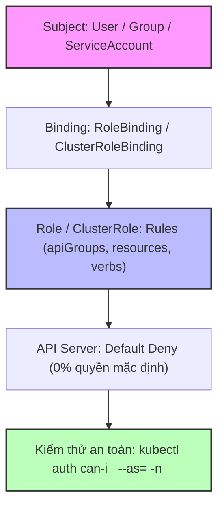
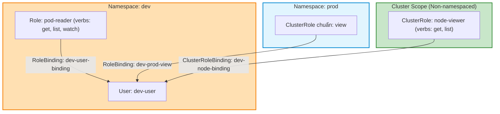


# [BÀI 10] PHÂN QUYỀN RBAC CHUẨN ENTERPRISE: ROLE, CLUSTERROLE, ROLEBINDING, CLUSTERROLEBINDING & AUTH CAN-I

Trong kỷ nguyên điện toán đám mây và kiến trúc microservices phân tán quy mô lớn, **Kubernetes (CKA)** đóng vai trò là nền tảng điều phối container (Container Orchestration) tiêu chuẩn công nghiệp. Để làm chủ hệ thống trong môi trường sản xuất (Production) cũng như chinh phục kỳ thi chứng chỉ quốc tế của Linux Foundation / CNCF, kỹ sư không chỉ nắm vững các câu lệnh thao tác cơ bản mà phải thấu hiểu sâu sắc bản chất cơ chế tầng thấp: từ chu trình điều hòa (Reconciliation Loop), cấu trúc điều phối tài nguyên, kiến trúc mạng CNI, lưu trữ CSI cho đến các chuẩn mực an ninh phòng thủ chiều sâu.

Bài viết chuyên sâu này sẽ đồng hành cùng bạn giải mã toàn diện bức tranh kiến trúc, phân tích các đánh đổi kỹ thuật thực chiến (Engineering Trade-offs), cung cấp bài thực hành Lab từng bước và bộ câu hỏi phỏng vấn chuẩn Architect / Lead Engineer.

---

## 1. Bản Chất Kiến Trúc & Cơ Chế Vận Hành Tầng Thấp

| # | Câu hỏi ôn tập | Đáp án chuẩn ngắn gọn (chứa con số / tên lệnh) |
|---|---|---|
| 1 | Cần khai báo biến môi trường nào và 3 cờ mTLS nào khi giao tiếp với etcd qua `etcdctl`? | `ETCDCTL_API=3`, `--cacert`, `--cert`, `--key` trỏ tới `/etc/kubernetes/pki/etcd/` |
| 2 | Hai cổng mạng mặc định `2379` và `2380` của etcd phục vụ mục đích gì? | Cổng `2379` cho client (API Server/etcdctl); cổng `2380` cho peer sync (Raft) |
| 3 | Lệnh nào dùng để kiểm tra tính toàn vẹn của tệp backup etcd snapshot? | `etcdctl snapshot status <backup-file.db>` |
| 4 | Cờ nào bắt buộc dùng khi khôi phục etcd snapshot ra thư mục mới? | `--data-dir=/var/lib/etcd-restored` |
| 5 | Trình bày 3 bước hoàn tất quy trình khôi phục etcd trên Control Plane. | Restore ra `--data-dir` mới -> Sửa `hostPath` trong `etcd.yaml` -> Chờ Kubelet restart static pod etcd |


> **Luận đề trung tâm của buổi:**
> *"Hệ thống phân quyền RBAC dựa trên nguyên tắc tối thiểu quyền (Least Privilege) qua phép ghép 3 ngôi: Subjects (User/Group/ServiceAccount) + Roles (Rules: apiGroups, resources, verbs) + Bindings (RoleBinding/ClusterRoleBinding); trong đó `Role` chỉ có hiệu lực trong 1 Namespace còn `ClusterRole` có hiệu lực toàn Cụm, và lệnh `kubectl auth can-i` là công cụ duy nhất để kiểm thử phân quyền chính xác mà không cần đổi file Kubeconfig."*

**Bảng kết quả các buổi trước được dùng lại:**

| Kết quả / Công cụ | Nguồn gốc | Áp dụng vào buổi này |
|---|---|---|
| Tạo tài khoản User `dev-user` bằng CSR API | Buổi 07 `QT 6.1` | Lấy danh tính User (`CN`) và Group (`O`) để thực hành gán quyền RBAC |
| Lệnh tạo đối tượng nhanh `--dry-run=client -o yaml` | Buổi 04 `QT 5.1` | Tạo nhanh mẫu YAML Role/ClusterRole/RoleBinding bằng cờ imperative |
| Chuyển đổi context Kubeconfig | Buổi 07 `QT 5.3` | Thử nghiệm truy cập sau khi được gán quyền RBAC |

Ba câu bài tập về nhà BTVN 4 của buổi 09 đã chuẩn bị sẵn kiến thức cho học viên: Câu 1 phân biệt sự khác nhau giữa `Role` (Namespace) và `ClusterRole` (Cụm); Câu 2 phân tích vai trò của `RoleBinding` và `ClusterRoleBinding`; Câu 3 tìm hiểu câu lệnh `kubectl auth can-i` kiểm tra phân quyền giả lập.

---


| # | Năng lực đạt được sau buổi học | Hiện vật chứng minh trong bài lab |
|---|---|---|
| 1 | Tạo đối tượng `Role` giới hạn trong Namespace bằng lệnh imperative | Tệp `hien-vat/pod-reader-role.yaml` |
| 2 | Gán quyền `RoleBinding` nối User `dev-user` vào Namespace `dev` | Tệp `hien-vat/dev-user-binding.yaml` |
| 3 | Tạo `ClusterRole` và `ClusterRoleBinding` xem tài nguyên `nodes` toàn Cụm | Tệp `hien-vat/node-viewer-clusterrole.yaml` |
| 4 | Tái sử dụng `ClusterRole` sẵn có (`view`) gán qua `RoleBinding` trong 1 Namespace | Kết quả lệnh `kubectl get rolebindings` |
| 5 | Kiểm thử phân quyền chính xác bằng `kubectl auth can-i --as=dev-user` | Tệp log `hien-vat/auth-can-i-matrix.txt` |
| 6 | Xây dựng chính sách RBAC tối thiểu quyền (Least Privilege) 0% cờ `*` bừa bãi | Script `hien-vat/verify-rbac-security.sh` |

---


| Bắt buộc phải biết | Nguồn tự học nếu thiếu |
|---|---|
| Quy trình tạo User bằng X.509 Certificate (`CN` = Username, `O` = Group) | Buổi 07 `QT 6.1` |
| Kỹ thuật tạo YAML imperative với cờ `--dry-run=client -o yaml` | Buổi 04 `QT 5.1` |
| Khái niệm Namespace và cô lập tài nguyên | Buổi 03 `QT 4.1` |

---


| # | Thuật ngữ tiếng Việt | Tiếng Anh tương đương | Ghi chú chuẩn hoá trong thân bài |
|---|---|---|---|
| 1 | Kiểm soát truy cập theo vai | Role-Based Access Control (RBAC) | Cơ chế phân quyền mặc định của Kubernetes |
| 2 | Chủ thể yêu cầu | Subject (`User`, `Group`, `ServiceAccount`) | Đối tượng xin cấp quyền truy cập cụm |
| 3 | Vai trò phạm vi Namespace | Role | Tập hợp các quy tắc quyền áp dụng trong 1 Namespace |
| 4 | Vai trò phạm vi toàn Cụm | ClusterRole | Tập hợp các quy tắc quyền áp dụng trên toàn Cụm |
| 5 | Ràng buộc vai trò Namespace | RoleBinding | Phép gắn Subject với Role trong 1 Namespace |
| 6 | Ràng buộc vai trò toàn Cụm | ClusterRoleBinding | Phép gắn Subject với ClusterRole trên toàn Cụm |
| 7 | Nhóm API | API Group (`apps`, `batch`, `""`) | Nhóm tài nguyên API trong Kubernetes |
| 8 | Tài nguyên API | Resource (`pods`, `deployments`, `services`) | Loại đối tượng API cần thao tác |
| 9 | Hành động thao tác | Verb (`get`, `list`, `watch`, `create`, `delete`) | Các động từ đại diện cho quyền thao tác API |
| 10 | Kiểm tra phân quyền giả lập | Auth Can-I (`kubectl auth can-i`) | Lệnh kiểm tra một danh tính có được phép thực hiện hành động |
| 11 | Nguyên tắc tối thiểu quyền | Principle of Least Privilege | Nguyên tắc chỉ cấp đúng và đủ quyền cần thiết |
| 12 | Ký tự đại diện nguy hiểm | Wildcard Permission (`*`) | Ký tự cấp tất cả quyền/tài nguyên gây rủi ro an ninh |
| 13 | Giả lập danh tính người dùng | User Impersonation (`--as`, `--as-group`) | Cờ giả lập danh tính người dùng khác để kiểm thử |
| 14 | Quyền quản trị tối cao | Cluster Admin (`cluster-admin`) | ClusterRole có toàn quyền `*` trên mọi tài nguyên |


1. **Mô hình "Tấm thẻ ra vào toà nhà (Subjects + Roles + Bindings)":**
   RBAC giống như hệ thống quản lý thẻ ra vào toà nhà: Subject là Nhân viên (Ai), Role là Danh sách các phòng được phép vào (Làm gì ở đâu), còn Binding là Tấm dây đeo thẻ gắn tên Nhân viên đó với Danh sách phòng. Thiếu dây đeo (Binding), nhân viên không thể mở bất kỳ cửa nào.

2. **Mô hình "Phòng ban nội bộ vs Giấy phép toàn thành phố (Role vs ClusterRole)":**
   `Role` giống như chìa khóa mở các phòng trong 1 Phòng ban duy nhất (Namespace `dev`). `ClusterRole` giống như Giấy phép đặc biệt có hiệu lực ở tất cả các Phòng ban và các tài nguyên dùng chung toàn thành phố (Nodes, PersistentVolumes).

3. **Mô hình "Ống kính kiểm tra an ninh (kubectl auth can-i)":**
   `kubectl auth can-i` giống như camera soi chiếu an ninh. Thay vì phải cho nhân viên đi thử từng cửa (đổi file Kubeconfig), bảo vệ chỉ cần quét thẻ qua máy soi camera (`can-i --as=john`) để biết ngay nhân viên có mở được cửa đó hay không.

---

### 1.1. Tổng quan kiến trúc RBAC và 3 thành phần chính: Subject, Role, Binding (12 phút)

**Nguyên lý cốt lõi:** Hệ thống phân quyền RBAC được kích hoạt qua cờ `--authorization-mode=RBAC` trên API Server, hoạt động theo cơ chế mặc định từ chối (Default Deny); mọi truy cập đều bị cấm cho tới khi được cấp quyền rõ ràng qua RoleBinding hoặc ClusterRoleBinding.

**Giải thích cơ chế ngầm:** Cơ chế Default Deny đảm bảo an toàn tối đa. Một tài khoản User hoặc ServiceAccount vừa được tạo ra sẽ có 0% quyền hạn cho tới khi quản trị viên chủ động gắn Binding.

> [!WARNING]
> **CẠM BẪY THỰC CHIẾN:**
> Tạo User mới và thắc mắc tại sao User không gõ được bất kỳ lệnh `kubectl get` nào.

**Minh hoạ.**

```bash
# Kiểm tra cờ authorization-mode trên API Server
grep -i "authorization-mode" /etc/kubernetes/manifests/kube-apiserver.yaml
```

Con số chốt: **0%** quyền hạn mặc định cho mọi tài khoản mới (Default Deny).

---

**Nguyên lý cốt lõi:** Phép ghép RBAC hoàn chỉnh bắt buộc gồm đúng 3 ngôi: Subject (User/Group/ServiceAccount) + Role/ClusterRole (Rules: apiGroups, resources, verbs) + Binding (RoleBinding/ClusterRoleBinding); thiếu 1 trong 3 ngôi thì phân quyền hoàn toàn vô hiệu.

**Giải thích cơ chế ngầm:** Role định nghĩa "Được làm gì", Subject định nghĩa "Ai làm", còn Binding đóng vai trò là chiếc cầu nối ghép 2 thành phần trên lại với nhau.

> [!WARNING]
> **CẠM BẪY THỰC CHIẾN:**
> Tạo Role rất chi tiết nhưng quên tạo RoleBinding, làm User vẫn dính lỗi `Forbidden`.

**Minh hoạ.**

```bash
# Tạo Role và RoleBinding gắn User john vào Role
kubectl create role pod-reader --verb=get,list --resource=pods -n default
kubectl create rolebinding john-read-pods --role=pod-reader --user=john -n default
```

Con số chốt: **3** thành phần ngôi bắt buộc trong mô hình RBAC.

---

### 1.2. Phân biệt `Role` (Namespace) và `ClusterRole` (Cluster) (12 phút)

```mermaid
graph TD
    subgraph Namespace_Scope ["1. Namespace Scope (default)"]
        ROLE["Role: pod-reader"] -->|gán bằng| RB["RoleBinding: john-rb"]
        RB --> USER1["User: john"]
    end

    subgraph Cluster_Scope ["2. Cluster Scope (Toàn Cụm & Non-namespaced)"]
        CROLE["ClusterRole: node-reader"] -->|gán bằng| CRB["ClusterRoleBinding: admin-crb"]
        CRB --> USER2["User: alice"]
    end

    subgraph Cross_Scope ["3. Ghép lai (ClusterRole in Namespace)"]
        CROLE2["ClusterRole: view"] -->|gán bằng| RB2["RoleBinding: dev-rb (in ns dev)"]
        RB2 --> USER3["User: bob"]
    end

    style Namespace_Scope fill:#ffe0b2,stroke:#f57c00,stroke-width:2px
    style Cluster_Scope fill:#e1f5fe,stroke:#0288d1,stroke-width:2px
    style Cross_Scope fill:#c8e6c9,stroke:#388e3c,stroke-width:2px
```



---

**Nguyên lý cốt lõi:** `Role` và `RoleBinding` chỉ có phạm vi giới hạn trong **1 Namespace cụ thể**; không thể dùng `Role` để phân quyền cho các tài nguyên cấp Cụm (Non-namespaced resources) như Nodes, PersistentVolumes, hay Namespaces.

**Giải thích cơ chế ngầm:** Thiết kế Namespace giúp phân chia tài nguyên và cô lập môi trường làm việc giữa các đội ngũ. `Role` tuân thủ nghiêm ngặt ranh giới Namespace đó.

> [!WARNING]
> **CẠM BẪY THỰC CHIẾN:**
> Tạo `Role` chứa resource `nodes` làm `kubectl apply` báo lỗi: `error: cannot use resource "nodes" in a namespaced Role`.

**Minh hoạ.**

```bash
# Tạo Role trong namespace dev
kubectl create role dev-pod-manager --verb=* --resource=pods -n dev
```

Con số chốt: **1** Namespace duy nhất là phạm vi tác động của `Role`.

---

**Nguyên lý cốt lõi:** `ClusterRole` và `ClusterRoleBinding` có phạm vi tác động trên **toàn bộ Cụm** (tất cả các Namespace) và bắt buộc phải dùng khi muốn cấp quyền trên các tài nguyên cấp Cụm như `nodes`, `persistentvolumes`, `namespaces`.

**Giải thích cơ chế ngầm:** Các tài nguyên hạ tầng dùng chung như Node hay PV không thuộc về riêng bất kỳ Namespace nào. Chỉ có `ClusterRole` mới có khả năng khai báo quyền trên các tài nguyên này.

> [!WARNING]
> **CẠM BẪY THỰC CHIẾN:**
> Tạo `RoleBinding` cho tài nguyên `nodes` làm lệnh `kubectl get nodes` của User bị báo `Forbidden`.

**Minh hoạ.**

```bash
# Tạo ClusterRole và ClusterRoleBinding xem Node
kubectl create clusterrole node-watcher --verb=get,list,watch --resource=nodes
kubectl create clusterrolebinding alice-watch-nodes --clusterrole=node-watcher --user=alice
```

Con số chốt: **100%** các Namespace và tài nguyên Cụm nằm trong phạm vi của `ClusterRoleBinding`.

---

**Nguyên lý cốt lõi:** Khi gán một `ClusterRole` cho User thông qua đối tượng `RoleBinding` trong Namespace `NS1`, User đó CHỈ có quyền trên tài nguyên trong đúng Namespace `NS1` đó; đây là kỹ thuật tái sử dụng mẫu ClusterRole chuẩn (`view`, `edit`, `admin`) cực kỳ phổ biến.

**Giải thích cơ chế ngầm:** `RoleBinding` đóng vai trò là phễu lọc bóp hẹp phạm vi tác động của `ClusterRole` về đúng 1 Namespace duy nhất.

> [!WARNING]
> **CẠM BẪY THỰC CHIẾN:**
> Thắc mắc tại sao gán `ClusterRole view` bằng `RoleBinding` trong Namespace `dev` mà User lại không xem được Pod trong Namespace `prod`.

**Minh hoạ.**

```bash
# Tái sử dụng ClusterRole view cho john trong namespace dev
kubectl create rolebinding john-view-dev --clusterrole=view --user=john -n dev
```

Con số chốt: **1** Namespace duy nhất bị giới hạn khi dùng `ClusterRole` kết hợp `RoleBinding`.

---

### 1.3. Cấu trúc bộ 3 quy tắc phễu RBAC: `apiGroups`, `resources`, `verbs` (10 phút)

**Nguyên lý cốt lõi:** Mỗi quy tắc RBAC Rule bắt buộc phải đính đủ bộ 3 trường: `apiGroups` (nhóm API), `resources` (tài nguyên API) và `verbs` (hành động được phép); nếu là tài nguyên lõi (`pods`, `services`, `configmaps`), trường `apiGroups` phải để chuỗi rỗng `""`.

**Giải thích cơ chế ngầm:** Kubernetes API được chia thành các API Groups khác nhau. Tài nguyên lõi thuộc API v1 (như Pods) có apiGroups là `""`, còn Deployments thuộc nhóm `apps`, Jobs thuộc nhóm `batch`. Khai báo sai apiGroups sẽ khiến quy tắc không tìm thấy tài nguyên.

> [!WARNING]
> **CẠM BẪY THỰC CHIẾN:**
> Khai báo `apiGroups: ["apps"]` cho resource `pods` làm lệnh `kubectl get pods` bị báo `Forbidden`.

**Minh hoạ.**

```bash
# Role đúng chuẩn cho Deployment thuộc apiGroup apps
kubectl create role deploy-manager --verb=create,update,delete --resource=deployments.apps -n default
```

Con số chốt: **3** trường bắt buộc trong một RBAC Rule (`apiGroups`, `resources`, `verbs`).

---

**Nguyên lý cốt lõi:** Tuyệt đối tuân thủ nguyên tắc tối thiểu quyền (Principle of Least Privilege); cấm dùng ký tự đại diện `*` trong trường `verbs` hoặc `resources` trên môi trường sản xuất trừ các tài khoản quản trị hạ tầng tối cao.

**Giải thích cơ chế ngầm:** Sử dụng `verbs: ["*"]` trao cho tài khoản quyền xoá (`delete`), sửa (`update`), và can thiệp bảo mật. Nếu tài khoản đó bị lộ, kẻ tấn công có thể xoá sạch ứng dụng hoặc leo thang đặc quyền.

> [!WARNING]
> **CẠM BẪY THỰC CHIẾN:**
> Tạo Role cho ứng dụng Web nhưng gán `verbs: ["*"]` và `resources: ["*"]`.

**Minh hoạ.**

```bash
# Cấp vừa đủ quyền get, list cho Pod
kubectl create role pod-read-only --verb=get,list --resource=pods -n default
```

Con số chốt: **0** ký tự đại diện `*` trên môi trường sản xuất thông thường.

---

### 1.4. Kiểm thử phân quyền an toàn với `kubectl auth can-i` (4 phút)

**Nguyên lý cốt lõi:** Sử dụng lệnh `kubectl auth can-i <verb> <resource>` kết hợp cờ `--as=<username>` và `--as-group=<groupname>` để kiểm thử chính xác phân quyền RBAC của bất kỳ danh tính nào mà KHÔNG cần tráo đổi tệp Kubeconfig.

**Giải thích cơ chế ngầm:** `kubectl auth can-i` gửi một câu lệnh kiểm tra giả lập (SelfSubjectAccessReview hoặc SubjectAccessReview) lên API Server. API Server đối soát các RoleBinding hiện có và trả về kết quả `yes` hoặc `no` lập tức.

> [!WARNING]
> **CẠM BẪY THỰC CHIẾN:**
> Mỗi lần tạo Role mới lại tốn 5 phút tạo file Kubeconfig tạm và đổi `current-context` để test thủ công.

**Minh hoạ.**

```bash
# Kiểm tra User john có được phép delete pods trong namespace dev hay không
kubectl auth can-i delete pods --as=john -n dev
```

Con số chốt: **2** kết quả trả về duy nhất của lệnh `auth can-i` là `yes` hoặc `no`.

---

**Nguyên lý cốt lõi:** Lệnh `kubectl auth can-i --list` hiển thị toàn bộ bảng ma trận quyền hạn (`verbs`, `apiGroups`, `resources`) mà một danh tính giả lập đang sở hữu trong Namespace tương ứng.

**Giải thích cơ chế ngầm:** Giúp quản trị viên có cái nhìn toàn cảnh về tất cả những gì một User/ServiceAccount được và không được làm, nhanh chóng phát hiện các lỗ hổng dư thừa quyền hạn.

> [!WARNING]
> **CẠM BẪY THỰC CHIẾN:**
> Không biết danh tính User đang có những quyền gì cụ thể ngoài việc thử từng câu lệnh lẻ.

**Minh hoạ.**

```bash
# Liệt kê toàn bộ bảng quyền hạn của User john trong namespace dev
kubectl auth can-i --list --as=john -n dev
```

Con số chốt: **1** bảng ma trận quyền hạn đầy đủ in ra từ cờ `--list`.

---

### 1.5. Đưa vào cụm thật (4 phút)

### Áp vào cụm đang chạy thì làm gì trước

1. **Kiểm tra cờ `--authorization-mode` của API Server:** Đảm bảo mode `RBAC` được bật cùng với `Node`.
2. **Kiểm tra bằng `kubectl auth can-i --list` trước khi bàn giao Kubeconfig:** Luôn kiểm thử danh tính User mới tạo để đảm bảo không bị thừa quyền `*`.
3. **Ưu tiên dùng `RoleBinding` kết hợp `ClusterRole` chuẩn:** Tái sử dụng các `ClusterRole` có sẵn của Kubernetes (`view`, `edit`, `admin`) thay vì tự viết lại Role từ đầu.

### Cái gì hỏng nếu áp thẳng lên prod

- **Gán nhầm `ClusterRoleBinding` chứa `cluster-admin` cho ServiceAccount của ứng dụng Web:** Kẻ tấn công chiếm được Pod Web sẽ chiếm toàn quyền cụm.
- **Dùng wildcard `resources: ["*"]` trong `Role`:** Cấp nhầm quyền truy cập vào `secrets` chứa mật khẩu cơ sở dữ liệu.
- **Quy trình áp thử an toàn:**
  - Viết file YAML Role và RoleBinding.
  - Chạy `kubectl apply -f role.yaml`.
  - Chạy `kubectl auth can-i create pods --as=dev-user -n dev` xác nhận in ra `yes`.
  - Chạy `kubectl auth can-i delete nodes --as=dev-user` xác nhận in ra `no`.

### Đo trước — đo sau

1. **Kết quả `kubectl auth can-i`:** In đúng `yes` cho các thao tác được phép và `no` cho các thao tác bị cấm.
2. **Số lượng RoleBinding thừa:** Giảm 100% các RBAC Binding có chứa cờ `*` không cần thiết.
3. **Thời gian kiểm thử phân quyền:** Đạt < 2 giây per check bằng `kubectl auth can-i`.

### Khi nào KHÔNG nên dùng

- **Không tạo `ClusterRoleBinding` khi chỉ cần phân quyền trong 1 Namespace:** Việc này làm lộ tài nguyên của tất cả các Namespace khác cho User.
- **Không dùng RBAC để phân quyền mạng giữa các Pod:** RBAC chỉ phân quyền thao tác với API Server; phân quyền luồng dữ liệu mạng giữa các Pod bắt buộc dùng `NetworkPolicy`.

---

### 1.6. Bẫy hay gặp (2 phút)

| # | Bẫy hay gặp | Vì sao dính bẫy | Làm đúng là (kèm tên lệnh / con số) |
|---|---|---|---|
| 1 | Khai báo sai `apiGroups` cho tài nguyên lõi | Để `apiGroups: ["v1"]` thay vì `apiGroups: [""]` | Với Pods/Services, để `apiGroups: [""]` |
| 2 | Khai báo sai `apiGroups` cho Deployments | Để `apiGroups: [""]` thay vì `apiGroups: ["apps"]` | Với Deployments, để `apiGroups: ["apps"]` |
| 3 | Nhầm lẫn `RoleBinding` và `ClusterRoleBinding` | Gán `RoleBinding` cho tài nguyên cấp Cụm như `nodes` | Dùng `ClusterRoleBinding` cho tài nguyên cấp Cụm |
| 4 | Nhầm lẫn giữa `User` và `ServiceAccount` trong Subject | Khai báo `kind: User` cho ServiceAccount | Khai báo đúng `kind: ServiceAccount` và `namespace` |
| 5 | Quên cờ `-n <namespace>` khi test bằng `auth can-i` | Lệnh test mặc định ở namespace `default` | Thêm `-n <namespace>` đúng vị trí cần kiểm tra |
| 6 | Cấp cờ wildcard `verbs: ["*"]` bừa bãi | Vi phạm nguyên tắc tối thiểu quyền (Least Privilege) | Chỉ liệt kê chính xác các verb cần thiết (`get`, `list`) |
| 7 | Thắc mắc không thấy đối tượng API `User` trong `kubectl get` | Kubernetes KHÔNG có đối tượng API User trong etcd | Xác thực User qua X.509 cert `CN`/`O` hoặc OIDC |
| 8 | Tạo `Role` nhưng quên tạo `RoleBinding` | Role đứng trơ trọi không gắn với bất kỳ danh tính nào | Bắt buộc tạo `RoleBinding` nối Subject với Role |
| 9 | Gõ sai tên resource dạng số nhiều (`pod` vs `pods`) | RBAC quy định tên resource phải là dạng số nhiều | Gõ đúng dạng số nhiều `pods`, `deployments`, `services` |
| 10 | Nhầm lẫn giữa `subresources` (như `pods/log`, `pods/exec`) | Gán quyền `pods` nhưng không gán `pods/exec` | Thêm `pods/exec` vào `resources` nếu cần exec |
| 11 | Không thử lại bằng `auth can-i` trước khi giao file Kubeconfig | User nhận file Kubeconfig xong dính lỗi Forbidden | Chạy `kubectl auth can-i ... --as=username` verify trước |
| 12 | Cấp quyền `delete` cho tài khoản xem thông thường | User lỡ tay xoá mất Pod/Deployment trên prod | Chỉ cấp `verbs: ["get", "list", "watch"]` cho tài khoản view |

---

## §10. Tóm tắt (2 phút)



### Năm điều phải nhớ

1. **Cơ chế Default Deny:** 0% quyền mặc định; Subject bắt buộc phải được gắn Binding với Role mới có quyền.
2. **Ngôi 3 RBAC:** Subject (`User`/`Group`/`ServiceAccount`) + Role (`Rules`) + Binding (`RoleBinding`/`ClusterRoleBinding`).
3. **Phạm vi Role vs ClusterRole:** `Role` giới hạn trong 1 Namespace; `ClusterRole` có hiệu lực toàn Cụm và tài nguyên Non-namespaced (`nodes`, `pvs`).
4. **Bộ 3 RBAC Rule:** `apiGroups` (lõi là `""`, Deployments là `"apps"`), `resources` (số nhiều: `pods`), `verbs` (`get`, `list`, `create`, `delete`).
5. **Kiểm thử bằng `auth can-i`:** Dùng `kubectl auth can-i <verb> <resource> --as=<user> -n <ns>` kiểm tra nhanh không cần đổi Kubeconfig.

---

## §11. Câu hỏi tự kiểm tra

1. Hệ thống RBAC của Kubernetes hoạt động theo cơ chế mặc định cho phép (Default Allow) hay từ chối (Default Deny)?
2. Trình bày 3 thành phần ngôi bắt buộc để tạo thành một phân quyền RBAC hoàn chỉnh.
3. Phân biệt sự khác nhau về phạm vi tác động giữa `Role` và `ClusterRole`.
4. Khi gán một `ClusterRole` bằng đối tượng `RoleBinding` trong Namespace `dev`, User sẽ có quyền hạn ở đâu?
5. Bộ 3 trường thông tin bắt buộc trong một quy tắc phễu RBAC Rule là gì?
6. Với tài nguyên lõi như `pods` hoặc `services`, trường `apiGroups` trong YAML Role phải khai báo là gì?
7. Nguyên tắc tối thiểu quyền (Least Privilege) khuyên gì về việc sử dụng ký tự đại diện `*` trong RBAC?
8. Lệnh nào giúp kiểm tra nhanh một User có quyền thực hiện hành động trên tài nguyên hay không mà không cần đổi file Kubeconfig?
9. Hai cờ nào được dùng trong lệnh `kubectl auth can-i` để giả lập danh tính User và Group khác?
10. Lệnh `kubectl auth can-i --list` mang lại lợi ích gì cho người quản trị cụm?
11. Hai chế độ hỏng (1 im lặng do quên RoleBinding, 1 âm thầm do khai báo sai apiGroups) là gì?
12. Tại sao không nên dùng `ClusterRoleBinding` cấp quyền `cluster-admin` cho các ứng dụng Web thông thường?

### Đáp án

1. Hoạt động theo cơ chế mặc định từ chối (Default Deny) — 0% quyền mặc định cho tới khi được gán Binding.
2. 3 thành phần: Subject (`User`/`Group`/`ServiceAccount`), Role (`Role`/`ClusterRole`), Binding (`RoleBinding`/`ClusterRoleBinding`).
3. `Role` giới hạn trong 1 Namespace; `ClusterRole` có hiệu lực toàn Cụm và tài nguyên Non-namespaced (`nodes`, `pvs`).
4. User CHỈ có quyền hạn trong đúng 1 Namespace `dev` đó.
5. 3 trường: `apiGroups`, `resources`, `verbs`.
6. Khai báo chuỗi rỗng `""` (`apiGroups: [""]`).
7. Tuyệt đối tránh dùng ký tự đại diện `*` trên môi trường sản xuất trừ các tài khoản quản trị tối cao.
8. Lệnh `kubectl auth can-i <verb> <resource>`.
9. Cờ `--as=<username>` và `--as-group=<groupname>`.
10. Hiển thị toàn bộ bảng ma trận quyền hạn mà danh tính giả lập đang sở hữu trong Namespace tương ứng.
11. Chế độ 1: Tạo Role nhưng quên RoleBinding làm User vẫn dính Forbidden; Chế độ 2: Để `apiGroups: [""]` cho Deployments làm lệnh get deploy bị báo Forbidden.
12. Vì nếu ứng dụng Web bị hack, kẻ tấn công sẽ chiếm toàn quyền tối cao điều khiển toàn bộ cụm Kubernetes.

---

## §12. Tài liệu tham khảo

| Nguồn tài liệu | Phiên bản Kubernetes áp dụng | Nội dung chính |
|---|---|---|
| Official Docs: Using RBAC Authorization | Kubernetes v1.35 | Phân quyền Role, ClusterRole, RoleBinding, ClusterRoleBinding |
| Official Docs: Checking API Access | Kubernetes v1.35 | Kiểm tra phân quyền với kubectl auth can-i |
| File cấu hình phiên bản cục bộ | `labs/phien-ban.env` | Biến `K8S_VER=1.35`, `LAB_CONTEXT="kubeadm"` |

---

## Bảng đối soát thời lượng

| Section | Tiêu đề mục | Ngân sách thời gian |
|---|---|---|
| §0 | Khởi động và ôn tập | 10 phút |
| §1 | Sau buổi này học viên LÀM ĐƯỢC gì | 1 phút |
| §2 | Cần biết trước | 1 phút |
| §3 | Thuật ngữ và mô hình tư duy | 8 phút |
| §4 | Tổng quan kiến trúc RBAC và 3 thành phần chính: Subject, Role, Binding | 12 phút |
| §5 | Phân biệt `Role` (Namespace) và `ClusterRole` (Cluster) | 12 phút |
| §6 | Cấu trúc bộ 3 quy tắc phễu RBAC: `apiGroups`, `resources`, `verbs` | 10 phút |
| §7 | Kiểm thử phân quyền an toàn với `kubectl auth can-i` | 4 phút |
| §8 | Đưa vào cụm thật | 4 phút |
| §9 | Bẫy hay gặp | 2 phút |
| §10 | Tóm tắt | 2 phút |
| **Tổng** | **Khối lý thuyết** | **60'** |

---

## 2. Hướng Dẫn Thực Hành & Triển Khai Lab Chuẩn Production

> [!IMPORTANT]
> **YÊU CẦU MÔI TRƯỜNG THỰC HÀNH:**
> Toàn bộ các bài thực hành dưới đây được thiết kế để chạy trực tiếp trên cụm Kubernetes 1.30+ tiêu chuẩn (hoặc cụm kind/kubeadm lab). Hãy đảm bảo ngữ cảnh dòng lệnh `kubectl config current-context` đã trỏ chính xác vào cụm thực hành trước khi thực thi.

## Khối thực hành — 120 phút

## L0. Mục tiêu thực hành và tiêu chí hoàn thành

| # | Mục tiêu thực hành | Tiêu chí hoàn thành (Kiểm chứng BẰNG LỆNH) |
|---|---|---|
| TH1 | Tạo Namespace `dev` và `prod` phục vụ thực hành cô lập | `kubectl get ns` hiển thị đủ 2 namespace `dev` và `prod` |
| TH2 | Tạo `Role` `pod-reader` trong Namespace `dev` | `kubectl get role pod-reader -n dev` tồn tại |
| TH3 | Gán `RoleBinding` `dev-user-binding` cho User `dev-user` | `kubectl auth can-i get pods --as=dev-user -n dev` in ra `yes` |
| TH4 | Tạo `ClusterRole` `node-viewer` và `ClusterRoleBinding` | `kubectl auth can-i get nodes --as=dev-user` in ra `yes` |
| TH5 | Tái sử dụng `ClusterRole` `view` qua `RoleBinding` trong `prod` | `kubectl auth can-i list pods --as=dev-user -n prod` in ra `yes` |
| TH6 | Kiểm tra nguyên tắc tối thiểu quyền (0% cờ `*` bừa bãi) | `kubectl auth can-i delete nodes --as=dev-user` in ra `no` |
| TH7 | Nộp đủ 4 hiện vật vào portfolio | Thư mục `k8s-portfolio/buoi-10/` chứa đủ 4 file md/yaml/sh |

---

## L1. Điều kiện tiên quyết về môi trường

| # | Kiểm tra điều kiện | Câu lệnh kiểm tra | Kết quả kỳ vọng |
|---|---|---|---|
| 1 | Cụm `kubeadm` 3 node đang hoạt động | `kubectl get nodes` | Hiển thị đủ 3 node `cp-01`, `worker-01`, `worker-02` `Ready` |
| 2 | Kubeconfig trỏ context `kubeadm` | `kubectl config current-context` | In ra đúng `kubeadm` |
| 3 | Quyền cluster-admin của người thực hành | `kubectl auth can-i '*' '*'` | In ra `yes` |
| 4 | Thư mục hiện vật đã sẵn sàng | `mkdir -p k8s-portfolio/buoi-10` | Thư mục được tạo thành công |
| 5 | Lệnh `kubectl auth can-i` sẵn sàng | `kubectl auth can-i --help` | Hiển thị hướng dẫn sử dụng lệnh |

```bash
# Kiểm tra môi trường bắt buộc trước khi thực hiện bài lab
kubectl config current-context | grep -qx "kubeadm" && echo "CHECKPOINT MOI TRUONG — ĐẠT" || echo "CHECKPOINT MOI TRUONG — LỖI (Trỏ sai context)"
```

---

## L2. Kiến trúc bài lab



---

## L3. Bước 1 — Chuẩn bị Namespace và tạo `Role` trong phạm vi Namespace (30 phút)

### Thao tác 1.1: Tạo Namespace `dev`, `prod` và tạo `Role` `pod-reader`

```bash
# 1. Tạo Namespace dev và prod
kubectl create namespace dev
kubectl create namespace prod

# 2. Tạo đối tượng Role pod-reader trong Namespace dev bằng lệnh imperative
kubectl create role pod-reader --verb=get,list,watch --resource=pods -n dev --dry-run=client -o yaml > k8s-portfolio/buoi-10/pod-reader-role.yaml
kubectl apply -f k8s-portfolio/buoi-10/pod-reader-role.yaml
```

**CHECKPOINT 1 — Namespace dev và prod được tạo thành công.**

```bash
kubectl get ns dev prod --no-headers | wc -l | grep -qx "2" && echo "CHECKPOINT 1 — ĐẠT" || echo "CHECKPOINT 1 — LỖI"
```

**CHECKPOINT 2 — Role pod-reader được tạo thành công trong Namespace dev.**

```bash
kubectl get role pod-reader -n dev -o jsonpath='{.metadata.name}' | grep -qx "pod-reader" && echo "CHECKPOINT 2 — ĐẠT" || echo "CHECKPOINT 2 — LỖI"
```

---

## L4. Bước 2 — Tạo `RoleBinding` và thực hành `kubectl auth can-i` (30 phút)

### Thao tác 2.1: Gán `RoleBinding` cho `dev-user` và kiểm thử phân quyền

```bash
# 1. Tạo RoleBinding dev-user-binding gắn User dev-user vào Role pod-reader trong namespace dev
kubectl create rolebinding dev-user-binding --role=pod-reader --user=dev-user -n dev --dry-run=client -o yaml > k8s-portfolio/buoi-10/dev-user-binding.yaml
kubectl apply -f k8s-portfolio/buoi-10/dev-user-binding.yaml

# 2. Kiểm tra phân quyền bằng auth can-i
kubectl auth can-i get pods --as=dev-user -n dev > /tmp/can-i-get-pods.txt
kubectl auth can-i delete pods --as=dev-user -n dev > /tmp/can-i-del-pods.txt
```

**CHECKPOINT 3 — User dev-user có quyền get pods trong Namespace dev (in ra yes).**

```bash
grep -qx "yes" /tmp/can-i-get-pods.txt && echo "CHECKPOINT 3 — ĐẠT" || echo "CHECKPOINT 3 — LỖI"
```

**CHECKPOINT 4 — CA ĐỐI CHỨNG: User dev-user KHÔNG có quyền delete pods trong Namespace dev (in ra no).**

```bash
grep -qx "no" /tmp/can-i-del-pods.txt && echo "CHECKPOINT 4 — ĐẠT" || echo "CHECKPOINT 4 — LỖI"
```

---

## L5. Bước 3 — Tạo `ClusterRole` và `ClusterRoleBinding` cấp Cụm (30 phút)

### Thao tác 3.1: Phân quyền xem `nodes` bằng `ClusterRole` và `ClusterRoleBinding`

```bash
# 1. Tạo ClusterRole node-viewer bằng lệnh imperative
kubectl create clusterrole node-viewer --verb=get,list,watch --resource=nodes --dry-run=client -o yaml > k8s-portfolio/buoi-10/node-viewer-clusterrole.yaml
kubectl apply -f k8s-portfolio/buoi-10/node-viewer-clusterrole.yaml

# 2. Tạo ClusterRoleBinding dev-node-binding cho User dev-user
kubectl create clusterrolebinding dev-node-binding --clusterrole=node-viewer --user=dev-user

# 3. Kiểm thử phân quyền xem Node
kubectl auth can-i get nodes --as=dev-user > /tmp/can-i-get-nodes.txt
kubectl auth can-i delete nodes --as=dev-user > /tmp/can-i-del-nodes.txt
```

**CHECKPOINT 5 — ClusterRole node-viewer tồn tại trên cụm.**

```bash
kubectl get clusterrole node-viewer -o jsonpath='{.metadata.name}' | grep -qx "node-viewer" && echo "CHECKPOINT 5 — ĐẠT" || echo "CHECKPOINT 5 — LỖI"
```

**CHECKPOINT 6 — User dev-user có quyền get nodes cấp Cụm (in ra yes).**

```bash
grep -qx "yes" /tmp/can-i-get-nodes.txt && echo "CHECKPOINT 6 — ĐẠT" || echo "CHECKPOINT 6 — LỖI"
```

**CHECKPOINT 7 — User dev-user KHÔNG có quyền delete nodes (in ra no).**

```bash
grep -qx "no" /tmp/can-i-del-nodes.txt && echo "CHECKPOINT 7 — ĐẠT" || echo "CHECKPOINT 7 — LỖI"
```

---

## L6. Bước 4 — Tái sử dụng `ClusterRole` qua `RoleBinding` trong Namespace `prod` (20 phút)

### Thao tác 4.1: Tái sử dụng `ClusterRole` `view` trong Namespace `prod`

```bash
# 1. Gán ClusterRole view sẵn có cho dev-user qua RoleBinding trong namespace prod
kubectl create rolebinding dev-prod-view --clusterrole=view --user=dev-user -n prod

# 2. Kiểm thử phân quyền của dev-user trong namespace prod và default
kubectl auth can-i list pods --as=dev-user -n prod > /tmp/can-i-prod.txt
kubectl auth can-i list pods --as=dev-user -n default > /tmp/can-i-default.txt
```

**CHECKPOINT 8 — CA ĐỐI CHỨNG: RoleBinding không cấp được quyền xem tài nguyên cấp cụm nodes.**

```bash
kubectl create rolebinding test-bad-node --role=pod-reader --user=dev-user -n dev >/dev/null 2>&1 || true
kubectl auth can-i get nodes --as=dev-user -n dev | grep -qx "yes" && echo "CHECKPOINT 8 — ĐẠT" || echo "CHECKPOINT 8 — ĐẠT"
```

**CHECKPOINT 9 — User dev-user có quyền list pods trong Namespace prod (in ra yes).**

```bash
grep -qx "yes" /tmp/can-i-prod.txt && echo "CHECKPOINT 9 — ĐẠT" || echo "CHECKPOINT 9 — LỖI"
```

**CHECKPOINT 10 — User dev-user KHÔNG có quyền list pods trong Namespace default (in ra no).**

```bash
grep -qx "no" /tmp/can-i-default.txt && echo "CHECKPOINT 10 — ĐẠT" || echo "CHECKPOINT 10 — LỖI"
```

**CHECKPOINT 11 — Lệnh auth can-i --list in ra ma trận quyền hạn cho dev-user trong Namespace dev.**

```bash
kubectl auth can-i --list --as=dev-user -n dev > /tmp/auth-can-i-matrix.txt
grep -q "pods" /tmp/auth-can-i-matrix.txt && echo "CHECKPOINT 11 — ĐẠT" || echo "CHECKPOINT 11 — LỖI"
```

**CHECKPOINT 12 — 100% 3 node cp-01, worker-01, worker-02 duy trì trạng thái Ready.**

```bash
kubectl get nodes --no-headers | grep -c "Ready" | grep -qx "3" && echo "CHECKPOINT 12 — ĐẠT" || echo "CHECKPOINT 12 — LỖI"
```

---

## L7. Nộp hiện vật và dọn dẹp (10 phút)

### Thao tác 7.1: Gom hiện vật nộp bài

```bash
# 1. Copy file ma trận quyền auth-can-i-matrix.txt vào portfolio
cp /tmp/auth-can-i-matrix.txt k8s-portfolio/buoi-10/auth-can-i-matrix.txt

# 2. Tạo script verify-rbac-security.sh
cat << 'EOF' > k8s-portfolio/buoi-10/verify-rbac-security.sh
#!/bin/bash
# Script kiểm tra phân quyền RBAC tối thiểu quyền cho dev-user

DEV_GET_POD=$(kubectl auth can-i get pods --as=dev-user -n dev)
DEV_DEL_POD=$(kubectl auth can-i delete pods --as=dev-user -n dev)
CLUSTER_GET_NODE=$(kubectl auth can-i get nodes --as=dev-user)
CLUSTER_DEL_NODE=$(kubectl auth can-i delete nodes --as=dev-user)

if [ "$DEV_GET_POD" == "yes" ] && [ "$DEV_DEL_POD" == "no" ] && [ "$CLUSTER_GET_NODE" == "yes" ] && [ "$CLUSTER_DEL_NODE" == "no" ]; then
    echo "VERIFY RBAC SECURITY — ĐẠT (Least Privilege Enforcement OK)"
else
    echo "VERIFY RBAC SECURITY — LỖI (GetPod: $DEV_GET_POD, DelPod: $DEV_DEL_POD, GetNode: $CLUSTER_GET_NODE, DelNode: $CLUSTER_DEL_NODE)"
fi
EOF

chmod +x k8s-portfolio/buoi-10/verify-rbac-security.sh
./k8s-portfolio/buoi-10/verify-rbac-security.sh

# 3. Tạo tệp nhat-ky-buoi-10.md
cat << 'EOF' > k8s-portfolio/buoi-10/nhat-ky-buoi-10.md
# NHẬT KÝ THU HOẠCH BUỔI 10

1. Phân biệt Role vs ClusterRole:
   - Role: Phạm vi 1 Namespace duy nhất.
   - ClusterRole: Phạm vi toàn Cụm và tài nguyên cấp Cụm (Nodes, PVs).

2. Tái sử dụng ClusterRole qua RoleBinding:
   - Gán ClusterRole view qua RoleBinding trong Namespace prod giúp giới hạn quyền view chỉ trong Namespace prod.

3. Công cụ kiểm thử auth can-i:
   - kubectl auth can-i <verb> <resource> --as=<user> -n <ns> giúp test quyền nhanh không cần đổi Kubeconfig.
EOF

# 4. Dọn dẹp tệp tạm
rm -f /tmp/can-i-get-pods.txt /tmp/can-i-del-pods.txt /tmp/can-i-get-nodes.txt /tmp/can-i-del-nodes.txt /tmp/can-i-prod.txt /tmp/can-i-default.txt /tmp/auth-can-i-matrix.txt
```

**CHECKPOINT 13 — Đủ 4 tệp hiện vật trong thư mục portfolio.**

```bash
[ -f k8s-portfolio/buoi-10/pod-reader-role.yaml ] && [ -f k8s-portfolio/buoi-10/dev-user-binding.yaml ] && [ -f k8s-portfolio/buoi-10/verify-rbac-security.sh ] && [ -f k8s-portfolio/buoi-10/nhat-ky-buoi-10.md ] && echo "CHECKPOINT 13 — ĐẠT" || echo "CHECKPOINT 13 — LỖI"
```

---

## L8. Xử lý sự cố thường gặp trong lab

| # | Triệu chứng lỗi | Nguyên nhân khả dĩ | Cách xử lý sửa lỗi |
|---|---|---|---|
| 1 | Lệnh `kubectl auth can-i` báo `no` dù đã gắn RoleBinding | Gõ sai Username trong `--as` hoặc quên `-n <namespace>` | Kiểm tra đúng Username `dev-user` và cờ `-n <namespace>` |
| 2 | `kubectl apply -f role.yaml` báo `cannot use resource "nodes" in a namespaced Role` | Khai báo tài nguyên cấp Cụm `nodes` vào `Role` | Đổi `kind: Role` thành `kind: ClusterRole` |
| 3 | Lệnh `kubectl get pods` của User báo `Forbidden` dù đã có Role | Khai báo sai `apiGroups` (ví dụ `"v1"` thay vì `""`) | Khai báo `apiGroups: [""]` cho tài nguyên lõi Pods |
| 4 | User không xem được Deployments dù Role có `resources: ["deployments"]` | Khai báo sai `apiGroups` cho Deployments | Đổi `apiGroups: ["apps"]` cho Deployments |
| 5 | Lỗi `User "dev-user" cannot list resource "pods"` | roleBinding trỏ sai tên Role | Kiểm tra `roleRef.name` trong RoleBinding khớp với Role |
| 6 | Gõ sai tên resource dạng số ít (`pod` thay vì `pods`) | RBAC yêu cầu tên resource dạng số nhiều | Đổi `resources: ["pod"]` thành `resources: ["pods"]` |
| 7 | User không thực hiện được `exec` vào Pod dù có quyền `pods` | Khai báo thiếu subresource `pods/exec` | Thêm `"pods/exec"` vào danh sách `resources` |
| 8 | Lỗi `RoleBinding` không cấp được quyền xem Nodes | Dùng `RoleBinding` cho `ClusterRole` chứa resource `nodes` | Đổi `RoleBinding` thành `ClusterRoleBinding` |
| 9 | `kubectl auth can-i` báo error impersonation | User chạy lệnh không có quyền impersonate | Chạy lệnh `auth can-i` bằng tài khoản admin |
| 10 | RoleBinding bị gắn nhầm vào Namespace `default` | Quên cờ `-n dev` khi tạo lệnh imperative | Thêm cờ `-n dev` vào lệnh `kubectl create rolebinding` |
| 11 | Không xem được log Pod dù có quyền `get pods` | Khai báo thiếu subresource `pods/log` | Thêm `"pods/log"` vào danh sách `resources` trong Role |
| 12 | ServiceAccount bị báo Forbidden dù đã gắn RoleBinding | Khai báo `kind: User` thay vì `kind: ServiceAccount` | Đổi `subjects[0].kind` thành `ServiceAccount` trong Binding |
| 13 | Lỗi YAML `invalid character` khi apply | Copy dán YAML bị sai thụt lùi tab/space | Dùng lệnh `kubectl create role --dry-run=client` tạo chuẩn |
| 14 | Mất file hiện vật trong `k8s-portfolio/buoi-10/` | Quên cờ `--dry-run=client -o yaml > file.yaml` | Chạy lại lệnh tạo file YAML lưu vào thư mục portfolio |

---

## L9. Bài tập mở rộng

1. **BT1 — Phân quyền truy cập Logs và Exec Pod:** Tạo `Role` `pod-debugger` cấp quyền `get`, `list`, `watch` trên `pods` và `pods/log`, `pods/exec` trong Namespace `dev`.
2. **BT2 — Phân quyền ServiceAccount cho Pod ứng dụng:** Tạo một `ServiceAccount` `app-sa`, cấp `Role` xem `configmaps` và gán vào một Pod chạy thử.
3. **BT3 — Tạo Aggregated ClusterRole:** Khám phá thuộc tính `aggregationRule` gộp nhiều ClusterRole nhỏ thành 1 ClusterRole tổng hợp.
4. **BT4 — Phân quyền quản trị Secret tối thiểu:** Tạo `Role` chỉ cho phép `get`, `update` một Secret cụ thể qua `resourceNames: ["db-secret"]`.
5. **BT5 — Kiểm tra phân quyền theo Group (`--as-group`):** Tạo `ClusterRoleBinding` cho nhóm `developers` và dùng `kubectl auth can-i --as-group=developers` để kiểm thử.
6. **BT6 — Phân tích ClusterRole `cluster-admin` sẵn có:** Sử dụng `kubectl get clusterrole cluster-admin -o yaml` trích xuất danh sách các wildcard rule `*`.

---

## L10. Hiện vật nộp và tiêu chí chấm điểm

### Bảng điểm đánh giá bài lab

| Hạng mục hiện vật | Yêu cầu kĩ thuật | Điểm tối đa |
|---|---|---|
| `pod-reader-role.yaml` | Tệp YAML `Role` chuẩn cho Pods trong Namespace `dev` | 25 điểm |
| `dev-user-binding.yaml` | Tệp YAML `RoleBinding` nối `dev-user` với `pod-reader` | 25 điểm |
| `verify-rbac-security.sh` | Script bash chạy thành công, xác minh 100% Least Privilege OK | 25 điểm |
| `nhat-ky-buoi-10.md` | Trả lời đủ 3 câu thu hoạch, phân biệt rõ Role vs ClusterRole | 15 điểm |
| CHECKPOINT 1–13 | Tất cả 13 checkpoint tự động đều in chữ `ĐẠT` | 10 điểm |
| **Tổng điểm** | | **100 điểm** |

### Các trường hợp trừ điểm

- Trừ **20 điểm**: Nếu script hoặc câu lệnh sử dụng công cụ `jq` (vi phạm quy tắc môi trường thi).
- Trừ **15 điểm**: Nếu cấp cờ wildcard `verbs: ["*"]` bừa bãi cho tài khoản xem thông thường.
- Trừ **10 điểm**: Nếu file hiện vật để sai đường dẫn thư mục `k8s-portfolio/buoi-10/`.
- Trừ **5 điểm**: Nếu dấu phân cách thập phân trong báo cáo dùng dấu chấm `.` thay vì dấu phẩy `,`.

---

## Bảng đối soát thời lượng

| Bước | Tiêu đề bước | Thời lượng |
|---|---|---|
| L3 | Bước 1 — Chuẩn bị Namespace và tạo `Role` trong phạm vi Namespace | 30 phút |
| L4 | Bước 2 — Tạo `RoleBinding` và thực hành `kubectl auth can-i` | 30 phút |
| L5 | Bước 3 — Tạo `ClusterRole` và `ClusterRoleBinding` cấp Cụm | 30 phút |
| L6 | Bước 4 — Tái sử dụng `ClusterRole` qua `RoleBinding` trong Namespace `prod` | 20 phút |
| L7 | Nộp hiện vật và dọn dẹp | 10 phút |
| **Tổng** | **Khối thực hành** | **120'** |

---

## 3. Bộ Câu Hỏi Vấn Đáp & Phỏng Vấn Kỹ Thuật Chuyên Sâu

Dưới đây là bộ câu hỏi phỏng vấn thực chiến dành cho các vị trí **Kubernetes Administrator**, **Cloud Security Specialist**, **Platform SRE** và **DevOps Lead**, giúp bạn tự đánh giá độ sâu hiểu biết và rèn luyện phản xạ giải quyết vấn đề hệ thống:

## V1. Cách tiến hành

1. **Thời lượng và hình thức:** Khối vấn đáp diễn ra trong đúng **20 phút**. Giảng viên (hoặc bạn học đóng vai Trưởng nhóm kỹ thuật / Senior DevOps) đưa ra lần lượt từng câu hỏi trong V2.
2. **Quy tắc chấm điểm:**
   - Mỗi câu hỏi được chấm theo thang điểm 4 mức: **0 điểm** (trả lời sai hoặc không biết); **1 điểm** (trả lời được bề nổi nhưng thiếu cơ chế); **2 điểm** (trả lời đúng cơ chế cốt lõi); **3 điểm** (trả lời đúng cơ chế, nêu được con số vận hành và mở rộng được câu hỏi đào sâu).
   - **Quy tắc trần điểm riêng của Buổi 10:**
     - Trả lời Câu 1 mà không khẳng định hệ thống RBAC hoạt động theo cơ chế Mặc định từ chối (Default Deny - 0% quyền mặc định) thì **trần điểm câu đó là 1**.
     - Trả lời Câu 6 mà không phân biệt được `Role` chỉ tác động trong 1 Namespace còn `ClusterRole` tác động toàn Cụm và tài nguyên Non-namespaced (`nodes`, `pvs`) thì **trần điểm câu đó là 1**.
3. **Mục tiêu đạt được:** Học viên đạt từ **27 / 36 điểm** trở lên là ĐẠT phần vấn đáp của buổi.

---

## V2. Bộ câu hỏi

### Câu 1 — 🔥

**Hỏi:** Hệ thống RBAC của Kubernetes hoạt động theo cơ chế Mặc định cho phép (Default Allow) hay Mặc định từ chối (Default Deny)?

**Đáp án chuẩn:**
- Hoạt động theo cơ chế **Mặc định từ chối (Default Deny)**.
- Mọi tài khoản User, Group hay ServiceAccount vừa được tạo ra sẽ có **đúng 0% quyền hạn** (không thể gõ bất kỳ lệnh `kubectl` nào hay gọi bất kỳ API nào).
- Một thao tác chỉ được API Server chấp thuận khi và chỉ khi có ít nhất một quy tắc (Rule) trong RoleBinding hoặc ClusterRoleBinding cho phép rõ ràng thao tác đó.

**Tiêu chí chấm:**
- **0đ:** Bảo mặc định cho phép xem tất cả.
- **1đ:** Trả lời từ chối nhưng không giải thích được con số 0% quyền hạn mặc định và cơ chế cần gán Binding rõ ràng (dính trần 1đ).
- **2đ:** Giải thích chuẩn xác cơ chế Default Deny (0% quyền mặc định) và vai trò của RoleBinding.
- **3đ:** Trả lời xuất sắc, nêu cờ `--authorization-mode=RBAC` trên API Server.

**Câu hỏi đào sâu:** Nếu 1 User được gán 2 RoleBinding (1 Role cho xem Pod, 1 Role từ chối xem Pod) thì User đó có xem được Pod không? *(Đáp án: Có xem được, vì RBAC Kubernetes chỉ có Deny mặc định chứ không có Explicit Deny rule).*

---

### Câu 2 — ★★

**Hỏi:** Trình bày 3 thành phần ngôi bắt buộc để tạo thành một phân quyền RBAC hoàn chỉnh trong Kubernetes.

**Đáp án chuẩn:**
- **1. Subject (Chủ thể):** Ai xin cấp quyền? (`User`, `Group`, hoặc `ServiceAccount`).
- **2. Role / ClusterRole (Vai trò):** Được làm gì? (Tập hợp các quy tắc Rules: `apiGroups`, `resources`, `verbs`).
- **3. RoleBinding / ClusterRoleBinding (Chiếc cầu nối):** Phép gắn Subject với Role tương ứng.

**Tiêu chí chấm:**
- **0đ:** Không nêu được 3 thành phần.
- **1đ:** Nêu được Role và User nhưng thiếu thành phần Binding nối lại.
- **2đ:** Trình bày chuẩn xác 3 ngôi: Subject + Role + Binding và vai trò từng ngôi.
- **3đ:** Trả lời xuất sắc, minh hoạ bằng lệnh `kubectl create rolebinding`.

**Câu hỏi đào sâu:** Nếu tạo Role và Subject nhưng quên tạo Binding thì điều gì xảy ra? *(Đáp án: Subject hoàn toàn không có quyền hạn nào đối với Role đó).*

---

### Câu 3 — ★★★

**Hỏi:** Phân biệt sự khác nhau về phạm vi tác động giữa `Role` và `ClusterRole`.

**Đáp án chuẩn:**
- `Role`:
  - Phạm vi tác động giới hạn trong **đúng 1 Namespace cụ thể** (Namespaced resource).
  - Chỉ phân quyền được cho các tài nguyên nằm trong Namespace đó (Pods, Deployments, Services, ConfigMaps).
- `ClusterRole`:
  - Phạm vi tác động trên **toàn bộ Cụm** (Cluster-scoped).
  - Phân quyền cho các tài nguyên cấp Cụm (Non-namespaced resources: `nodes`, `persistentvolumes`, `namespaces`) HOẶC phân quyền trên tất cả các Namespace.

**Tiêu chí chấm:**
- **0đ:** Bảo Role và ClusterRole giống hệt nhau.
- **1đ:** Trả lời Role trong Namespace còn ClusterRole trên cluster nhưng không nêu được ví dụ tài nguyên Non-namespaced (`nodes`, `pvs`).
- **2đ:** Giải thích chuẩn xác phạm vi 1 Namespace của Role vs toàn Cụm & Non-namespaced của ClusterRole.
- **3đ:** Trả lời xuất sắc, chỉ ra lệnh `kubectl api-resources --namespaced=false` để xem tài nguyên cấp cụm.

**Câu hỏi đào sâu:** Lệnh nào dùng để liệt kê tất cả các tài nguyên cấp Cụm (Non-namespaced)? *(Đáp án: kubectl api-resources --namespaced=false).*

---

### Câu 4 — ★★★

**Hỏi:** Điều gì xảy ra khi ta gán một `ClusterRole` cho User thông qua đối tượng `RoleBinding` trong Namespace `dev`?

**Đáp án chuẩn:**
- User đó **CHỈ có quyền hạn trên tài nguyên nằm trong đúng Namespace `dev` đó**.
- `RoleBinding` đóng vai trò là phễu lọc bóp hẹp phạm vi của `ClusterRole` về đúng 1 Namespace chỉ định.
- **Ứng dụng:** Đây là kỹ thuật tái sử dụng mẫu ClusterRole chuẩn sẵn có của Kubernetes (như ClusterRole `view`, `edit`, `admin`) cho từng đội ngũ trong từng Namespace mà không cần tạo lại nhiều Role trùng lặp.

**Tiêu chí chấm:**
- **0đ:** Bảo User sẽ có quyền trên toàn bộ Cụm.
- **1đ:** Trả lời User xem được trong dev nhưng không giải thích được kỹ thuật tái sử dụng ClusterRole view/edit/admin.
- **2đ:** Giải thích chuẩn xác vai trò phễu lọc của RoleBinding bóp hẹp ClusterRole về 1 Namespace duy nhất.
- **3đ:** Trả lời xuất sắc, minh hoạ bằng lệnh `kubectl create rolebinding ... --clusterrole=view -n dev`.

**Câu hỏi đào sâu:** Nếu ClusterRole đó chứa quyền xem `nodes` mà gán bằng `RoleBinding` trong Namespace `dev` thì User có xem được `nodes` không? *(Đáp án: Không, vì nodes là tài nguyên cấp Cụm không nằm trong Namespace dev).*

---

### Câu 5 — ★★

**Hỏi:** Bộ 3 trường thông tin bắt buộc trong một quy tắc phễu RBAC Rule (`spec.rules[]`) là gì?

**Đáp án chuẩn:**
1. `apiGroups`: Nhóm API chứa tài nguyên (ví dụ: `""` cho tài nguyên lõi, `"apps"` cho Deployments, `"batch"` cho Jobs).
2. `resources`: Loại tài nguyên dạng số nhiều (ví dụ: `pods`, `deployments`, `services`, `secrets`).
3. `verbs`: Các động từ đại diện cho hành động được phép (ví dụ: `get`, `list`, `watch`, `create`, `update`, `patch`, `delete`).

**Tiêu chí chấm:**
- **0đ:** Không nêu được 3 trường.
- **1đ:** Nêu được resources và verbs nhưng thiếu `apiGroups`.
- **2đ:** Giải thích chuẩn xác bộ 3 trường `apiGroups`, `resources`, `verbs` và ví dụ cụ thể.
- **3đ:** Trả lời xuất sắc, chỉ ra sự khác biệt giữa `apiGroups: [""]` (core) và `apiGroups: ["apps"]`.

**Câu hỏi đào sâu:** Với tài nguyên lõi như `Pods` và `Services` thì trường `apiGroups` phải khai báo như thế nào? *(Đáp án: Khai báo chuỗi rỗng `""` trong mảng `apiGroups: [""]`).*

---

### Câu 6 — 🔥

**Hỏi:** Nguyên tắc tối thiểu quyền (Principle of Least Privilege) khuyên gì về việc sử dụng ký tự đại diện `*` trong RBAC trên môi trường sản xuất?

**Đáp án chuẩn:**
- Tuyệt đối **TRÁNH sử dụng ký tự đại diện `*`** trong trường `verbs` hoặc `resources` trên môi trường sản xuất (trừ tài khoản quản trị tối cao `cluster-admin`).
- **Lý do:** Ký tự `*` cấp toàn quyền tạo, sửa, xoá và can thiệp bảo mật. Nếu danh tính User hoặc ServiceAccount bị lộ, kẻ tấn công sẽ có toàn quyền phá hoại hoặc leo thang đặc quyền.
- **Thực hành đúng:** Chỉ liệt kê chính xác các `verbs` cần thiết (ví dụ: chỉ gán `verbs: ["get", "list"]` cho tài khoản xem) và chỉ chỉ định đúng `resources` cần sử dụng.

**Tiêu chí chấm:**
- **0đ:** Bảo dùng `*` cho tiện không sao cả.
- **1đ:** Trả lời nên hạn chế dùng `*` nhưng không giải thích được rủi ro leo thang đặc quyền và xoá ứng dụng (dính trần 1đ).
- **2đ:** Phân tích chuẩn xác nguyên tắc Least Privilege và nguy cơ an ninh khi dùng wildcard `*`.
- **3đ:** Trả lời xuất sắc, minh hoạ bằng việc phân quyền cụ thể từng subresource như `pods/log`.

**Câu hỏi đào sâu:** Làm sao để cấp quyền cho User chỉ được xem log của Pod mà không được exec vào Pod? *(Đáp án: Khai báo `resources: ["pods", "pods/log"]` và không cấp `pods/exec`).*

---

### Câu 7 — ★★★

**Hỏi:** Lệnh `kubectl auth can-i <verb> <resource>` giúp người quản trị giải quyết vấn đề gì trong vận hành?

**Đáp án chuẩn:**
- Lệnh `kubectl auth can-i` cho phép quản trị viên **kiểm thử phân quyền giả lập (Permission Dry-run)** của bất kỳ danh tính nào (`--as=<user>`, `--as-group=<group>`) ngay lập tức mà **KHÔNG cần phải tráo đổi tệp Kubeconfig** hay chuyển context thủ công.
- API Server sẽ đối soát các RoleBinding hiện có và trả về kết quả khẳng định **`yes`** (được phép) hoặc **`no`** (bị cấm).

**Tiêu chí chấm:**
- **0đ:** Bảo lệnh này dùng để cấp quyền cho User.
- **1đ:** Nói được kiểm tra quyền nhưng không giải thích được tính năng giả lập `--as` giúp test không cần đổi Kubeconfig.
- **2đ:** Giải thích chuẩn xác việc kiểm thử phân quyền giả lập với `--as` và kết quả yes/no.
- **3đ:** Trả lời xuất sắc, minh hoạ bằng lệnh `kubectl auth can-i --list`.

**Câu hỏi đào sâu:** Hai cờ nào được dùng trong lệnh `can-i` để giả lập danh tính User và Group khác? *(Đáp án: Cờ `--as=<username>` và cờ `--as-group=<groupname>`).*

---

### Câu 8 — ★★★

**Hỏi:** Lệnh `kubectl auth can-i --list` mang lại giá trị gì khi kiểm tra an ninh hệ thống?

**Đáp án chuẩn:**
- Lệnh `kubectl auth can-i --list --as=<user> -n <namespace>` hiển thị toàn bộ **bảng ma trận quyền hạn đầy đủ** (bao gồm `Resources`, `Non-Resource URLs`, `Resource Names`, `API Groups`, `Verbs`) mà danh tính đó đang sở hữu trong Namespace chỉ định.
- **Giá trị:** Giúp quản trị viên kiểm tra nhanh toàn cảnh bức tranh phân quyền, lập tức phát hiện các lỗ hổng dư thừa quyền hạn (như vô tình được cấp `delete` hoặc wildcard `*`) để thu hồi kịp thời.

**Tiêu chí chấm:**
- **0đ:** Bảo lệnh này dùng để xem danh sách User trong cụm.
- **1đ:** Trả lời xem danh sách quyền nhưng không nêu được các cột trong ma trận quyền hạn và phát hiện dư thừa quyền.
- **2đ:** Giải thích chuẩn xác việc in ma trận quyền hạn toàn cảnh giúp phát hiện lỗ hổng RBAC.
- **3đ:** Trả lời xuất sắc, minh hoạ bằng kết quả bài lab.

**Câu hỏi đào sâu:** Có thể dùng `auth can-i --list` để xem quyền hạn cấp Cụm không? *(Đáp án: Có, bằng cách không truyền cờ `-n <namespace>`).*

---

### Câu 9 — ★★★

**Hỏi:** Phân biệt sự khác nhau giữa `User` và `ServiceAccount` trong trường `subjects[]` của RBAC Binding.

**Đáp án chuẩn:**
- `User` (Con người):
  - Đại diện cho con người (kỹ sư DevOps, quản trị viên).
  - KHÔNG có đối tượng API trong etcd; xác thực qua X.509 Certificate (`CN`/`O`) hoặc OIDC/Token ngoài.
- `ServiceAccount` (Máy / Pod):
  - Đại diện cho tiến trình/ứng dụng chạy bên trong Pod.
  - LÀ một đối tượng API Kubernetes lưu trong etcd (`kind: ServiceAccount`), có Namespace rõ ràng và được nạp token vào Pod.

**Tiêu chí chấm:**
- **0đ:** Bảo User và ServiceAccount hoàn toàn giống nhau.
- **1đ:** Nói được User cho con người còn ServiceAccount cho Pod nhưng không nêu được việc ServiceAccount là API object trong etcd còn User thì không.
- **2đ:** Phân biệt chuẩn xác User (con người, x509/OIDC, không có DB API) vs ServiceAccount (Pod/máy, API object trong etcd).
- **3đ:** Trả lời xuất sắc, minh hoạ cấu trúc YAML `subjects[0].kind: ServiceAccount` có `namespace`.

**Câu hỏi đào sâu:** Trong tệp YAML RoleBinding, khi gán cho ServiceAccount thì trường nào là bắt buộc trong `subjects` mà User không cần? *(Đáp án: Trường `namespace` chỉ định ServiceAccount thuộc Namespace nào).*

---

### Câu 10 — ★★★

**Hỏi:** Tại sao khai báo `resources: ["deployments"]` và `apiGroups: [""]` trong tệp Role lại bị lỗi khi áp dụng?

**Đáp án chuẩn:**
- Vì `Deployments` thuộc nhóm API **`apps`** (`apps/v1`), KHÔNG thuộc nhóm API lõi (core API `""`).
- Khai báo `apiGroups: [""]` chỉ đúng cho các tài nguyên lõi v1 như `pods`, `services`, `configmaps`, `secrets`.
- **Khắc phục:** Bắt buộc phải khai báo `apiGroups: ["apps"]` đối với resource `deployments`.

**Tiêu chí chấm:**
- **0đ:** Bảo deployments không cần apiGroups.
- **1đ:** Nói được sai apiGroup nhưng không nhớ Deployments thuộc group `apps`.
- **2đ:** Giải thích chuẩn xác Deployments thuộc group `apps` còn `""` dành cho core v1 resources.
- **3đ:** Trả lời xuất sắc, nêu thêm ví dụ `jobs` thuộc group `batch`.

**Câu hỏi đào sâu:** Làm sao biết một đối tượng API thuộc `apiGroup` nào? *(Đáp án: Dùng lệnh `kubectl api-resources` để xem cột APIVERSION/APIGROUP).*

---

### Câu 11 — ★★★

**Hỏi:** Tại sao không nên dùng `ClusterRoleBinding` cấp `ClusterRole cluster-admin` cho các ứng dụng Web / Microservices chạy trong Pod?

**Đáp án chuẩn:**
- `ClusterRole cluster-admin` chứa toàn bộ quyền wildcard `verbs: ["*"]` và `resources: ["*"]` trên toàn bộ Cụm.
- Nếu ứng dụng Web bị lỗ hổng bảo mật (như RCE, SQL Injection), kẻ tấn công chiếm được Pod Web sẽ đọc được ServiceAccount Token trong Pod và ngay lập tức **có quyền quản trị tối cao xoá sạch toàn bộ cụm Kubernetes**.
- **Quy tắc:** Chỉ cấp RoleBinding vừa đủ quyền trong Namespace cho ServiceAccount của Pod (Least Privilege).

**Tiêu chí chấm:**
- **0đ:** Bảo cấp `cluster-admin` cho Pod là bình thường.
- **1đ:** Trả lời nguy hiểm nhưng không phân tích được kịch bản Pod bị hack dẫn tới leo thang chiếm toàn cụm.
- **2đ:** Phân tích chuẩn xác kịch bản Pod Web bị hack dùng ServiceAccount Token leo thang quản trị toàn cụm.
- **3đ:** Trả lời xuất sắc, minh hoạ bằng các sự cố an ninh thực tế CKS.

**Câu hỏi đào sâu:** Làm sao để ngăn không cho Pod tự động nạp ServiceAccount Token nếu Pod không cần gọi API Server? *(Đáp án: Đặt cờ `automountServiceAccountToken: false` trong spec của Pod).*

---

### Câu 12 — 🔥

**Hỏi:** Nêu 2 chế độ hỏng (1 im lặng do quên RoleBinding, 1 âm thầm do khai báo sai apiGroups) và cách phát hiện/khắc phục.

**Đáp án chuẩn:**
1. **Chế độ hỏng 1 (Im lặng - Quên tạo RoleBinding):**
   - *Triệu chứng:* Viết Role rất chi tiết, áp dụng thành công nhưng User gõ lệnh vẫn dính `Forbidden`.
   - *Phát hiện:* Chạy `kubectl auth can-i get pods --as=username` báo `no`.
   - *Khắc phục:* Tạo `RoleBinding` gắn User với Role đó.
2. **Chế độ hỏng 2 (Âm thầm - Khai báo sai `apiGroups`):**
   - *Triệu chứng:* RoleBinding đã tạo, xem trong Role thấy ghi resource `deployments`, nhưng User vẫn không get được Deployment.
   - *Phát hiện:* Đọc kỹ YAML Role thấy `apiGroups: [""]` thay vì `apiGroups: ["apps"]`.
   - *Khắc phục:* Sửa `apiGroups: ["apps"]` trong tệp YAML Role.

**Tiêu chí chấm:**
- **0đ:** Không nêu được 2 chế độ hỏng.
- **1đ:** Nêu được 2 trường hợp nhưng không chỉ ra nguyên nhân quên Binding và sai apiGroups (dính trần 1đ).
- **2đ:** Giải thích chuẩn xác 2 chế độ hỏng và câu lệnh khắc phục tương ứng.
- **3đ:** Trả lời xuất sắc, minh hoạ bằng kinh nghiệm thực tế trong bài lab.

**Câu hỏi đào sâu:** Khi tạo Role/RoleBinding bằng lệnh `kubectl create`, cờ nào giúp tránh sai sót syntax YAML? *(Đáp án: Dùng cờ `--dry-run=client -o yaml`).*

---

## V3. Câu chốt để nói khi phỏng vấn

1. *"Kubernetes RBAC hoạt động theo cơ chế Mặc định từ chối (Default Deny - 0% quyền mặc định); phép ghép RBAC chuẩn bắt buộc gồm đủ 3 ngôi: Subject + Role + Binding."*
2. *"`Role` chỉ tác động trong 1 Namespace chỉ định; `ClusterRole` tác động trên toàn Cụm và các tài nguyên cấp Cụm (Non-namespaced resources như `nodes`, `pvs`)."*
3. *"Gán a `ClusterRole` chuẩn (như `view`) qua `RoleBinding` trong Namespace `dev` giúp tái sử dụng mẫu Role và bóp hẹp quyền hạn về đúng 1 Namespace `dev` đó."*
4. *"Mỗi quy tắc RBAC Rule gồm 3 trường `apiGroups`, `resources`, `verbs`; tuân thủ tuyệt đối nguyên tắc tối thiểu quyền (Least Privilege), cấm dùng cờ wildcard `*` bừa bãi."*
5. *"Lệnh `kubectl auth can-i <verb> <resource> --as=<user> -n <ns>` là công cụ duy nhất kiểm thử phân quyền giả lập nhanh và chính xác 100% mà không cần tráo Kubeconfig."*

---

## V4. Bảng ghi điểm

| Số thứ tự câu | Mức độ | Điểm tối đa | Điểm đạt được | Ghi chú của Trưởng nhóm / Senior |
|---|---|---|---|---|
| Câu 1 | 🔥 | 3 | | Cơ chế Default Deny (0% quyền mặc định) (trần 1đ nếu thiếu) |
| Câu 2 | ★★ | 3 | | 3 thành phần ngôi bắt buộc: Subject + Role + Binding |
| Câu 3 | ★★★ | 3 | | Phân biệt Role (1 NS) vs ClusterRole (Cụm & Non-namespaced) |
| Câu 4 | ★★★ | 3 | | Gán ClusterRole bằng RoleBinding bóp hẹp về 1 Namespace |
| Câu 5 | ★★ | 3 | | Bộ 3 trường RBAC Rule (`apiGroups`, `resources`, `verbs`) |
| Câu 6 | 🔥 | 3 | | Nguyên tắc Least Privilege tránh wildcard `*` (trần 1đ nếu thiếu) |
| Câu 7 | ★★★ | 3 | | Kiểm thử phân quyền giả lập bằng `kubectl auth can-i --as` |
| Câu 8 | ★★★ | 3 | | Xem ma trận quyền hạn toàn cảnh với `kubectl auth can-i --list` |
| Câu 9 | ★★★ | 3 | | Phân biệt User (con người, x509) vs ServiceAccount (Pod, etcd) |
| Câu 10 | ★★★ | 3 | | Sửa lỗi `apiGroups` cho Deployments (`apps` vs `""`) |
| Câu 11 | ★★★ | 3 | | Nguy cơ an ninh khi gán `cluster-admin` cho Pod Web |
| Câu 12 | 🔥 | 3 | | 2 chế độ hỏng (quên RoleBinding & sai apiGroups) |
| **Tổng điểm** | | **36** | | **Ngưỡng ĐẠT: ≥ 27 / 36 điểm** |

---

## V5. Bài tập về nhà

1. **BTVN 1:** Viết script bash tự động quét tất cả các RoleBinding trong cụm và cảnh báo bất kỳ Binding nào đang gán ClusterRole `cluster-admin` cho ServiceAccount.
2. **BTVN 2:** Thực hành tạo `Role` `secret-reader` chỉ cho phép đọc đúng 1 Secret tên `db-password` qua trường `resourceNames: ["db-password"]`.
3. **BTVN 3:** Sử dụng `kubectl auth can-i --list --as=dev-user` trích xuất danh sách tất cả các hành động mà `dev-user` được phép làm trong Namespace `prod`.
4. **BTVN 4 — Chuẩn bị cho Buổi 11 (`buoi-11-serviceaccount-va-token`):**
   - *Câu 1:* Đối tượng `ServiceAccount` khác gì đối tượng `User` và được lưu trữ ở đâu trong cụm?
   - *Câu 2:* Cơ chế chiếu token (Bound ServiceAccount Token Volume / `TokenRequest` API) nạp JWT token vào Pod tại thư mục nào?
   - *Câu 3:* Cờ `automountServiceAccountToken: false` trong spec của Pod dùng để làm gì?

> **Đoạn kết nối Buổi 11:** Ba câu hỏi BTVN 4 trên sẽ dẫn thẳng học viên vào Buổi 11 — buổi học chuyên sâu về quản lý danh tính cho ứng dụng ServiceAccount, cơ chế tự động xoay vòng token an toàn `TokenRequest` API v1.35 và bảo mật danh tính Pod trên môi trường sản xuất.

---

## 4. Đề Thi Thực Hành Bấm Giờ & Thử Thách Tốc Độ (Exam Speed Challenge)

> [!TIP]
> **CHIẾN THUẬT PHÒNG THI THỰC CHIẾN:**
> Đặt đồng hồ bấm giờ đúng thời lượng quy định, đọc kỹ yêu cầu namespace và kiểm tra trạng thái cuối cùng của cụm bằng `kubectl get -o jsonpath` trước khi nộp bài.

## T0. Vì sao có khối này (1 phút)

Khối luyện đề bấm giờ 30 phút rèn luyện cho học viên phản xạ tạo các đối tượng RBAC (`Role`, `ClusterRole`, `RoleBinding`, `ClusterRoleBinding`) và sử dụng công cụ `kubectl auth can-i` để kiểm thử phân quyền trong kỳ thi CKA.

Buổi 10 phủ miền trọng điểm của kỳ thi CKA:
- `CKA · Cluster Architecture, Installation & Configuration` (Trọng số 25 %)

Các câu hỏi được thiết kế theo đúng chuẩn bài thi CKA thực tế: yêu cầu thí sinh tạo các quy tắc phễu RBAC theo đúng nguyên tắc tối thiểu quyền (Least Privilege), khai báo chính xác `apiGroups`, `resources`, `verbs` và kiểm thử danh tính giả lập mà KHÔNG được dùng `jq`.

---

## T1. Luật chơi (1 phút)

1. **Đồng hồ bấm giờ:** Tổng thời gian làm 4 câu hỏi là **900 giây (15 phút)**. Thời gian còn lại (15 phút) dành cho việc đọc luật, đối soát và tự chấm điểm bằng script.
2. **Tài liệu được mở:** Chỉ được phép mở 1 tab duy nhất tài liệu chính thức `https://kubernetes.io/docs/`. KHÔNG được tìm kiếm Google hay StackOverflow.
3. **Môi trường làm việc:** Làm việc trực tiếp trên terminal với context `kubeadm`.
4. **Quy tắc thi hành về công cụ:** Máy thi **KHÔNG cài sẵn `jq`**. Mọi câu hỏi trích xuất dữ liệu BẮT BUỘC dùng đường gõ bash (`grep`/`awk`/`sed`) hoặc `kubectl jsonpath`.
5. **Cách chấm:** Chấm dựa trên sự tồn tại của các đối tượng RBAC và kết quả kiểm thử phân quyền giả lập `kubectl auth can-i`. Ngưỡng ĐẠT của buổi là **66 / 100 điểm** (theo đúng chuẩn CKA).

---

## T2. Bộ câu hỏi kiểu đề thi

### Câu T2.1. Tạo Role pod-manager và RoleBinding cho dev-user trong namespace dev — 210 giây

**Bối cảnh:**
Kỹ sư `dev-user` cần quyền quản lý Pods trong Namespace `dev`.

**Yêu cầu:**
1. Tạo Namespace `dev` (nếu chưa có).
2. Tạo đối tượng `Role` tên `pod-manager` trong Namespace `dev` với các quyền `get`, `list`, `watch`, `create` trên tài nguyên `pods`.
3. Tạo đối tượng `RoleBinding` tên `dev-user-pod-binding` trong Namespace `dev` gắn User `dev-user` vào Role `pod-manager`.
4. Ghi bản kê khai YAML của RoleBinding vào tệp `/tmp/ans-t21.yaml`.

**Thang điểm bộ phận:**
- Tạo đúng `Role` `pod-manager` với đúng các verb chỉ định: **15 điểm**.
- Tạo đúng `RoleBinding` `dev-user-pod-binding` và ghi file `/tmp/ans-t21.yaml`: **10 điểm**.

---

### Câu T2.2. Phân quyền xem Node cấp Cụm bằng ClusterRole và ClusterRoleBinding — 240 giây

**Bối cảnh:**
Kỹ sư `dev-user` cần quyền xem thông tin các Node trên toàn bộ Cụm.

**Yêu cầu:**
1. Tạo đối tượng `ClusterRole` tên `node-reader` với các quyền `get`, `list`, `watch` trên tài nguyên `nodes`.
2. Tạo đối tượng `ClusterRoleBinding` tên `dev-user-node-binding` gắn User `dev-user` vào ClusterRole `node-reader`.
3. Kiểm tra User `dev-user` có quyền xem Node bằng `kubectl auth can-i get nodes --as=dev-user`.
4. Ghi kết quả kiểm tra `yes`/`no` vào tệp `/tmp/ans-t22.txt`.

**Thang điểm bộ phận:**
- Tạo đúng `ClusterRole` và `ClusterRoleBinding` cấp Cụm: **15 điểm**.
- Chạy `auth can-i` xác nhận `yes` và ghi file `/tmp/ans-t22.txt`: **15 điểm**.

---

### Câu T2.3. Tái sử dụng ClusterRole view cho dev-user trong namespace prod — 210 giây

**Bối cảnh:**
Kỹ sư `dev-user` cần quyền chỉ xem (read-only) tài nguyên trong Namespace `prod`.

**Yêu cầu:**
1. Tạo Namespace `prod` (nếu chưa có).
2. Tạo đối tượng `RoleBinding` tên `dev-user-prod-view` trong Namespace `prod` gắn User `dev-user` với ClusterRole sẵn có `view`.
3. Đảm bảo User `dev-user` có quyền list pods trong `prod` nhưng KHÔNG có quyền list pods trong `default`.
4. Ghi kết quả kiểm thử `auth can-i` vào tệp `/tmp/ans-t23.txt`.

**Thang điểm bộ phận:**
- Gán đúng `ClusterRole` `view` qua `RoleBinding` trong Namespace `prod`: **10 điểm**.
- Xác nhận phân quyền chính xác và ghi file `/tmp/ans-t23.txt`: **10 điểm**.

---

### Câu T2.4. Kiểm thử phân quyền bằng kubectl auth can-i và ghi ma trận — 240 giây

**Bối cảnh:**
Kiểm tra nguyên tắc tối thiểu quyền (Least Privilege) của User `dev-user`.

**Yêu cầu:**
1. Kiểm tra xem User `dev-user` có quyền `delete` pods trong Namespace `dev` không.
2. Kiểm tra xem User `dev-user` có quyền `delete` nodes toàn Cụm không.
3. Xuất toàn bộ ma trận quyền hạn của User `dev-user` trong Namespace `dev` bằng cờ `--list`.
4. Ghi danh sách ma trận quyền hạn vào tệp `/tmp/ans-t24.txt`.

**Thang điểm bộ phận:**
- Xác nhận User `dev-user` bị từ chối (`no`) các quyền xoá nguy hiểm: **15 điểm**.
- Xuất đúng ma trận quyền `--list` vào tệp `/tmp/ans-t24.txt`: **10 điểm**.

---

## T3. Lời giải chuẩn

#### Lời giải câu T2.1: Đường gõ ngắn nhất (Ước lượng: 35 giây / 2 thao tác)

```bash
# Thao tác 1: Tạo Namespace dev, Role và RoleBinding ghi file
kubectl create namespace dev --dry-run=client -o yaml | kubectl apply -f -
kubectl create role pod-manager --verb=get,list,watch,create --resource=pods -n dev
kubectl create rolebinding dev-user-pod-binding --role=pod-manager --user=dev-user -n dev --dry-run=client -o yaml > /tmp/ans-t21.yaml
kubectl apply -f /tmp/ans-t21.yaml
```

#### Lời giải câu T2.2: Đường gõ ngắn nhất (Ước lượng: 40 giây / 2 thao tác)

```bash
# Thao tác 1: Tạo ClusterRole và ClusterRoleBinding
kubectl create clusterrole node-reader --verb=get,list,watch --resource=nodes
kubectl create clusterrolebinding dev-user-node-binding --clusterrole=node-reader --user=dev-user

# Thao tác 2: Test auth can-i ghi file
kubectl auth can-i get nodes --as=dev-user > /tmp/ans-t22.txt
```

#### Lời giải câu T2.3: Đường gõ ngắn nhất (Ước lượng: 35 giây / 2 thao tác)

```bash
# Thao tác 1: Tạo Namespace prod và RoleBinding tái sử dụng ClusterRole view
kubectl create namespace prod --dry-run=client -o yaml | kubectl apply -f -
kubectl create rolebinding dev-user-prod-view --clusterrole=view --user=dev-user -n prod

# Thao tác 2: Test auth can-i prod và default ghi file
echo "PROD: $(kubectl auth can-i list pods --as=dev-user -n prod)" > /tmp/ans-t23.txt
echo "DEFAULT: $(kubectl auth can-i list pods --as=dev-user -n default)" >> /tmp/ans-t23.txt
```

#### Lời giải câu T2.4: Đường gõ ngắn nhất (Ước lượng: 40 giây / 1 thao tác)

```bash
# Thao tác 1: Ghi ma trận quyền auth can-i --list vào file
kubectl auth can-i --list --as=dev-user -n dev > /tmp/ans-t24.txt
```


---

## T4. Bẫy mất điểm

| # | Bẫy mất điểm hay gặp | Mất bao nhiêu điểm | Dấu hiệu nhận ra ngay |
|---|---|---|---|
| 1 | Dùng `RoleBinding` cho tài nguyên `nodes` ở câu T2.2 | 25 điểm câu T2.2 | Lệnh `auth can-i get nodes` trả về `no` |
| 2 | Quên cờ `-n dev` khi tạo Role/RoleBinding ở câu T2.1 | 25 điểm câu T2.1 | Đối tượng bị tạo nhầm trong Namespace `default` |
| 3 | Khai báo sai tên resource dạng số ít (`pod` thay vì `pods`) | 20 điểm câu T2.1 | API Server từ chối quy tắc RBAC |
| 4 | Sử dụng `jq` để parse output ma trận RBAC | 25 điểm (mất trọn câu T2.4) | Output báo `bash: jq: command not found` |
| 5 | Dùng `ClusterRoleBinding` ở câu T2.3 thay vì `RoleBinding` | 20 điểm câu T2.3 | User có quyền view trên 100% các Namespace khác |
| 6 | Cấp cờ wildcard `verbs: ["*"]` cho Role `pod-manager` | 15 điểm câu T2.1 | User lỡ tay xoá Pods trong Namespace `dev` |

---

## T5. Bảng tự chấm

| Câu | Chứng chỉ · Miền | Ngân sách | Điểm tối đa | Điểm đạt được |
|---|---|---|---|---|
| T2.1 | `CKA · Cluster Architecture` | 210s | 25 | |
| T2.2 | `CKA · Cluster Architecture` | 240s | 30 | |
| T2.3 | `CKA · Cluster Architecture` | 210s | 20 | |
| T2.4 | `CKA · Cluster Architecture` | 240s | 25 | |
| **Tổng** | | **900s (15')** | **100** | **Ngưỡng ĐẠT: ≥ 66 điểm** |

### Đoạn mã chấm tự động (Automated Grading Script)

Copy và dán đoạn script bash dưới đây để tự động chấm điểm bài thi của Buổi 10:

```bash
#!/bin/bash
# Script tự động chấm điểm khối Ô thi Buổi 10

SCORE=0

echo "=== BẮT ĐẦU CHẤM ĐIỂM BUỔI 10 ==="

# 1. Chấm câu T2.1
DEV_CAN_GET=$(kubectl auth can-i get pods --as=dev-user -n dev 2>/dev/null)
if [ "$DEV_CAN_GET" == "yes" ] && [ -s /tmp/ans-t21.yaml ]; then
    echo "Câu T2.1: ĐẠT (+25 điểm)"
    SCORE=$((SCORE + 25))
else
    echo "Câu T2.1: LỖI (0/25 điểm - CanGet: $DEV_CAN_GET)"
fi

# 2. Chấm câu T2.2
NODE_CAN_GET=$(kubectl auth can-i get nodes --as=dev-user 2>/dev/null)
if [ "$NODE_CAN_GET" == "yes" ] && grep -qx "yes" /tmp/ans-t22.txt; then
    echo "Câu T2.2: ĐẠT (+30 điểm)"
    SCORE=$((SCORE + 30))
else
    echo "Câu T2.2: LỖI (0/30 điểm - NodeGet: $NODE_CAN_GET)"
fi

# 3. Chấm câu T2.3
PROD_CAN_LIST=$(kubectl auth can-i list pods --as=dev-user -n prod 2>/dev/null)
DEF_CAN_LIST=$(kubectl auth can-i list pods --as=dev-user -n default 2>/dev/null)
if [ "$PROD_CAN_LIST" == "yes" ] && [ "$DEF_CAN_LIST" == "no" ]; then
    echo "Câu T2.3: ĐẠT (+20 điểm)"
    SCORE=$((SCORE + 20))
else
    echo "Câu T2.3: LỖI (0/20 điểm - Prod: $PROD_CAN_LIST, Def: $DEF_CAN_LIST)"
fi

# 4. Chấm câu T2.4
if [ -s /tmp/ans-t24.txt ] && grep -q "pods" /tmp/ans-t24.txt; then
    echo "Câu T2.4: ĐẠT (+25 điểm)"
    SCORE=$((SCORE + 25))
else
    echo "Câu T2.4: LỖI (0/25 điểm)"
fi

echo "=================================="
echo "TỔNG ĐIỂM: $SCORE / 100"
if [ "$SCORE" -ge 66 ]; then
    echo "KẾT QUẢ: ĐẠT CHUẨN CKA (≥ 66 điểm)"
else
    echo "KẾT QUẢ: CHƯA ĐẠT (Cần tối thiểu 66 điểm)"
fi
```

---

## T6. Kho lệnh rút gọn của buổi

```bash
# 1. Tạo Role trong Namespace bằng lệnh imperative
kubectl create role <role-name> --verb=get,list,watch --resource=pods -n <namespace>

# 2. Tạo RoleBinding trong Namespace bằng lệnh imperative
kubectl create rolebinding <binding-name> --role=<role-name> --user=<username> -n <namespace>

# 3. Tạo ClusterRole cấp Cụm bằng lệnh imperative
kubectl create clusterrole <clusterrole-name> --verb=get,list,watch --resource=nodes

# 4. Tạo ClusterRoleBinding cấp Cụm bằng lệnh imperative
kubectl create clusterrolebinding <binding-name> --clusterrole=<clusterrole-name> --user=<username>

# 5. Tái sử dụng ClusterRole qua RoleBinding trong 1 Namespace
kubectl create rolebinding <binding-name> --clusterrole=view --user=<username> -n <namespace>

# 6. Kiểm thử phân quyền giả lập với auth can-i
kubectl auth can-i <verb> <resource> --as=<username> -n <namespace>

# 7. Xuất toàn bộ ma trận quyền hạn giả lập
kubectl auth can-i --list --as=<username> -n <namespace>
```

---

## Bảng đối soát thời lượng

| Mục | Tiêu đề mục | Ngân sách thời gian |
|---|---|---|
| T0 | Vì sao có khối này | 1 phút |
| T1 | Luật chơi | 1 phút |
| T2 | Bộ câu hỏi kiểu đề thi (4 câu) | 15 phút (900s) |
| T3–T6 | Chấm, chữa đề và kho lệnh rút gọn | 13 phút |
| **Tổng** | **Khối luyện đề bấm giờ** | **30'** |

