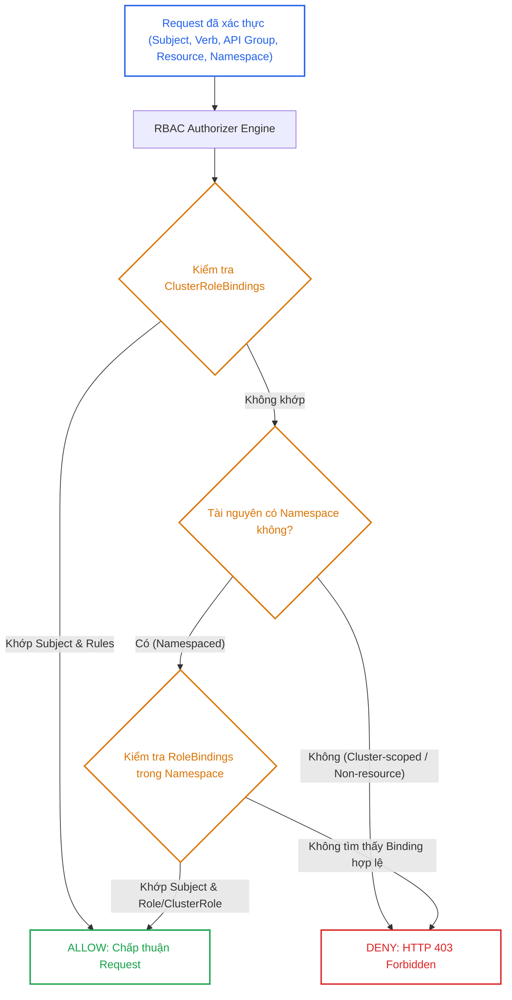
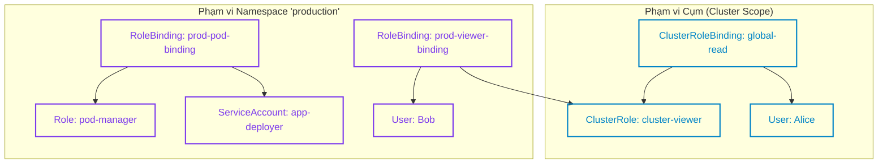
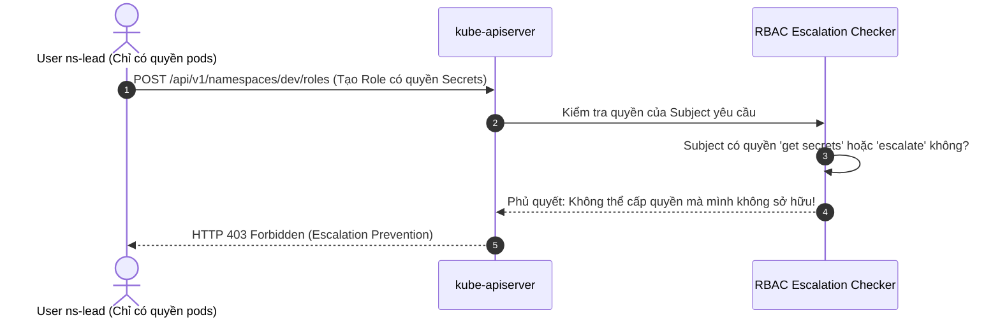
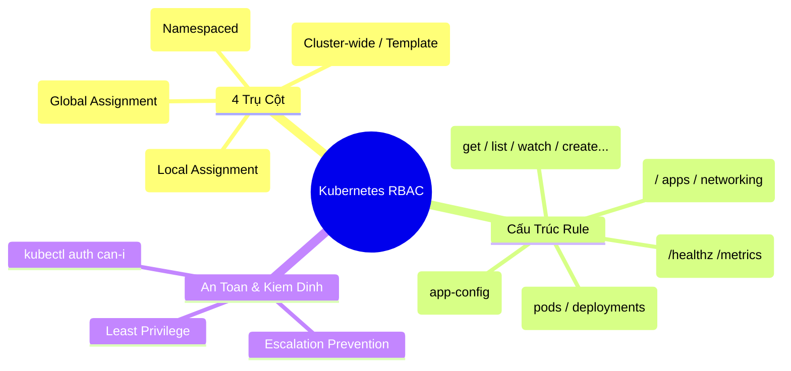


> [!IMPORTANT]
> **Mục tiêu kỹ thuật & Trọng tâm CKA**:
> - Hiểu rõ cấu trúc 4 trụ cột phân quyền: `Role`, `ClusterRole`, `RoleBinding`, `ClusterRoleBinding` và ma trận tương tác giữa chúng.
> - Nắm vững cấu trúc Rules: `apiGroups`, `resources`, `resourceNames`, `verbs`, `nonResourceURLs`.
> - Thành thạo kỹ năng gán quyền cho User, Group, và ServiceAccount tuân thủ nguyên tắc đặc quyền tối thiểu (Least Privilege).
> - Làm chủ lệnh kiểm tra ủy quyền `kubectl auth can-i` và xử lý cạm bẫy RBAC Escalation trong môi trường thực tế.

---

## 1. Bản Chất Kiến Trúc & Tư Duy Cốt Lõi: Mô Hình Ủy Quyền RBAC

Trong chuỗi xử lý request của `kube-apiserver`, sau khi request vượt qua bước **Authentication (Xác thực danh tính)**, nó lập tức được đưa vào tầng **Authorization (Ủy quyền)**. Kubernetes hỗ trợ nhiều Authorization Mode (`Node`, `RBAC`, `ABAC`, `Webhook`), trong đó **RBAC (Role-Based Access Control)** là cơ chế chuẩn mực và mạnh mẽ nhất được kích hoạt mặc định qua cờ `--authorization-mode=Node,RBAC`.

RBAC xác định xem một chủ thể (**Subject**: User, Group hoặc ServiceAccount) có quyền thực thi một hành động (**Verb**) trên một tập hợp tài nguyên (**Resource**) trong một phạm vi không gian tên (**Namespace**) hoặc toàn bộ cụm (**Cluster-wide**) hay không.

### 1.1. Sơ đồ Luồng Đánh Giá Ủy Quyền RBAC trong kube-apiserver



### 1.2. Bốn Đối Tượng Cốt Lõi Của RBAC

1. **Role**: Tập hợp các quy tắc cấp quyền (Rules) chỉ áp dụng trong phạm vi một **Namespace** cụ thể. Role quản lý các tài nguyên Namespaced như `pods`, `services`, `configmaps`, `deployments`.
2. **ClusterRole**: Tập hợp các quy tắc cấp quyền áp dụng trên toàn bộ cụm (**Cluster-wide**). ClusterRole có thể quản lý:
   - Tài nguyên Cluster-scoped: `nodes`, `namespaces`, `persistentvolumes`, `storageclasses`.
   - Non-resource URLs: `/healthz`, `/metrics`, `/version`, `/api`, `/openapi/v2`.
   - Tài nguyên Namespaced (được dùng như khuôn mẫu Role Template để gán cho từng Namespace thông qua `RoleBinding`).
3. **RoleBinding**: Cầu nối liên kết một danh sách Subject (Users, Groups, ServiceAccounts) với một `Role` (trong cùng Namespace) HOẶC một `ClusterRole` (nhưng chỉ cấp quyền trong phạm vi Namespace chứa RoleBinding đó).
4. **ClusterRoleBinding**: Cầu nối liên kết Subject với một `ClusterRole` trên phạm vi toàn cụm. Mọi tài nguyên thuộc phạm vi ClusterRole đều được mở quyền trên mọi Namespace và Cluster-level.



---

## 2. Bảng Ma Trận So Sánh Kỹ Thuật Toàn Diện (Engineering Matrix)

Bảng đối chiếu chi tiết 4 đối tượng phân quyền cùng các kịch bản sử dụng thực tế:

| Tiêu Chí So Sánh | Role | ClusterRole | RoleBinding | ClusterRoleBinding |
| :--- | :--- | :--- | :--- | :--- |
| **Phạm vi (Scope)** | Cố định trong 1 Namespace | Toàn cụm (Cluster-wide) | Cố định trong 1 Namespace | Toàn cụm (Cluster-wide) |
| **Tài nguyên Namespaced** | Quản lý được (`pods`, `svc`...) | Quản lý được (mọi NS) | Gán quyền trong NS đó | Gán quyền trên mọi NS |
| **Tài nguyên Cluster-scoped** | Không thể | Quản lý được (`nodes`, `pv`...) | Không thể | Quản lý được |
| **Non-Resource URLs** | Không thể | Hỗ trợ (`/healthz`, `/metrics`)| Không thể | Hỗ trợ |
| **Tham chiếu Role (roleRef)**| Không áp dụng | Không áp dụng | Trỏ tới `Role` hoặc `ClusterRole`| Chỉ trỏ tới `ClusterRole` |
| **Tính bất biến (Immutability)**| Metadata/Rules sửa được | Metadata/Rules sửa được | `roleRef` không thể sửa sau tạo | `roleRef` không thể sửa sau tạo |
| **Tái sử dụng (Reusability)**| Chỉ trong NS định nghĩa | Làm Template cho nhiều NS qua RB | Chỉ có giá trị trong NS | Có giá trị toàn bộ cụm |
| **Mục đích chính** | Phân quyền hẹp cho App Team | Quản trị viên, Infra, Monitoring | Cấp quyền cục bộ cho dev/SA | Cấp quyền Cluster Admin / SRE |

---

## 3. Cấu Trúc Khai Báo Manifest & Chi Tiết API Groups / Verbs

### 3.1. Cấu Trúc Khai Báo Role & RoleBinding

Manifest mẫu định nghĩa Role quản lý Pods và ConfigMaps trong namespace `engineering`:

```yaml
apiVersion: rbac.authorization.k8s.io/v1
kind: Role
metadata:
  namespace: engineering
  name: pod-config-manager
rules:
  # Core API Group (apiGroups: [""])
  - apiGroups: [""]
    resources: ["pods", "pods/log", "pods/exec"]
    verbs: ["get", "list", "watch", "create", "update", "delete"]
  - apiGroups: [""]
    resources: ["configmaps"]
    resourceNames: ["app-config", "db-config"] # Giới hạn tên cụ thể
    verbs: ["get", "update", "patch"]
---
apiVersion: rbac.authorization.k8s.io/v1
kind: RoleBinding
metadata:
  name: bind-pod-config-manager
  namespace: engineering
subjects:
  - kind: User
    name: "developer-john"
    apiGroup: rbac.authorization.k8s.io
  - kind: ServiceAccount
    name: "deployer-sa"
    namespace: engineering
roleRef:
  kind: Role
  name: pod-config-manager
  apiGroup: rbac.authorization.k8s.io
```

### 3.2. Cấu Trúc Khai Báo ClusterRole & ClusterRoleBinding

Manifest mẫu định nghĩa ClusterRole quản lý Nodes và đọc Ingress, gán quyền toàn cụm cho nhóm SRE:

```yaml
apiVersion: rbac.authorization.k8s.io/v1
kind: ClusterRole
metadata:
  name: node-ingress-admin
rules:
  - apiGroups: [""]
    resources: ["nodes", "nodes/status"]
    verbs: ["get", "list", "watch", "patch"]
  - apiGroups: ["networking.k8s.io"]
    resources: ["ingresses", "ingressclasses"]
    verbs: ["get", "list", "watch", "create", "update", "delete"]
  - nonResourceURLs: ["/metrics", "/healthz"]
    verbs: ["get"]
---
apiVersion: rbac.authorization.k8s.io/v1
kind: ClusterRoleBinding
metadata:
  name: bind-node-ingress-sre
subjects:
  - kind: Group
    name: "sre-leads"
    apiGroup: rbac.authorization.k8s.io
roleRef:
  kind: ClusterRole
  name: node-ingress-admin
  apiGroup: rbac.authorization.k8s.io
```

---

## 4. Phân Tích Cạm Bẫy Thực Chiến: Lỗi Sai RBAC & Leo Thang Đặc Quyền

### Tình huống 1: Nhầm lẫn API Group khiến quyền không có hiệu lực

Developer yêu cầu quyền quản lý `Deployments` và `CronJobs`. Quản trị viên cấu hình `apiGroups: [""]` (Core Group). Kết quả: User vẫn bị lỗi `403 Forbidden` khi thao tác với Deployments.

### Hậu Quả & Log Lỗi Thực Tế:

```text
Error from server (Forbidden): deployments.apps is forbidden: 
User "dev-user" cannot list resource "deployments" in API group "apps" at the cluster scope
```

### 5-Whys Root Cause Analysis:
1. **Tại sao user không list được deployments?** -> Server trả về HTTP 403 Forbidden.
2. **Tại sao 403 khi Role đã khai báo resource "deployments"?** -> Role khai báo `apiGroups: [""]`.
3. **Tại sao `apiGroups: [""]` không nhận deployments?** -> `deployments` thuộc API Group `apps`, không phải Core API Group `""`.
4. **Tại sao quản trị viên nhầm lẫn?** -> Cho rằng mọi tài nguyên mặc định đều nằm trong group rỗng `""`.
5. **Giải pháp triệt để là gì?** -> Sử dụng lệnh `kubectl api-resources` để tra cứu chính xác API Group trước khi viết manifest RBAC.

```diff
 rules:
-- apiGroups: [""]
+- apiGroups: ["apps"]
   resources: ["deployments", "statefulsets"]
   verbs: ["get", "list", "watch", "create", "update", "patch", "delete"]
```

---

### Tình huống 2: Cố tình sửa đổi `roleRef` trên RoleBinding đã tồn tại

Một kỹ sư muốn đổi Role được gán trong `RoleBinding` từ `view-only` sang `admin-role` bằng cách chạy `kubectl edit rolebinding my-binding`.

### Hậu Quả & Log Lỗi Thực Tế:

```text
The RoleBinding "my-binding" is invalid: roleRef: Invalid value: 
rbac.RoleRef{APIGroup:"rbac.authorization.k8s.io", Kind:"Role", Name:"admin-role"}: 
field is immutable
```

> [!WARNING]
> Trường `roleRef` trong cả `RoleBinding` và `ClusterRoleBinding` là **bất biến (immutable)** sau khi tạo. Để thay đổi Role được bind, bạn bắt buộc phải xóa Binding cũ (`kubectl delete rolebinding <name>`) và tạo một Binding mới hoàn toàn.

---

### Tình huống 3: Cơ chế Escalation Prevention chặn gán quyền vượt cấp

Một User có quyền quản trị Namespace cố gắng tạo một Role cấp quyền `secrets` cho một ServiceAccount khác, nhưng chính User đó lại không có quyền truy cập `secrets`.

### Hậu Quả & Log Lỗi Thực Tế:

```text
Error from server (Forbidden): roles.rbac.authorization.k8s.io "secret-accessor" is forbidden: 
user "ns-lead" cannot grant permissions outside of its own role: 
[User "ns-lead" cannot get resource "secrets" in API group ""]
```



---

## 5. Hands-on Lab: Triển Khai & Kiểm Định RBAC Chuyên Sâu (8 Bước)

Bảng tổng hợp 8 bước thực hành:

| Bước | Thao Tác | Mục Tiêu Kỹ Thuật | Lệnh / Công Cụ |
| :--- | :--- | :--- | :--- |
| **1** | Chuẩn bị Namespace & User Context | Khởi tạo môi trường lab cô lập | `kubectl create ns rbac-lab` |
| **2** | Tra cứu API Group & Resources | Xác định đúng API Group và Resource plural | `kubectl api-resources` |
| **3** | Tạo Role với Imperative Command | Tạo Role quản lý Pods & Deployments | `kubectl create role` |
| **4** | Tạo ServiceAccount | Tạo đối tượng danh tính ứng dụng | `kubectl create sa` |
| **5** | Gán quyền qua RoleBinding | Liên kết ServiceAccount với Role | `kubectl create rolebinding` |
| **6** | Tạo ClusterRole tái sử dụng | Tạo khuôn mẫu Node Reader & Metric viewer | `kubectl create clusterrole` |
| **7** | Gán ClusterRole vào Namespace | Sử dụng RoleBinding trỏ ClusterRole | `kubectl create rolebinding --clusterrole` |
| **8** | Kiểm định toàn diện với can-i | Xác thực ma trận phân quyền thực tế | `kubectl auth can-i --as` |

---

### Bước 1: Khởi tạo Namespace làm việc

Tạo không gian tên riêng biệt cho bài lab phân quyền:

```bash
kubectl create namespace rbac-lab
```

---

### Bước 2: Tra cứu chính xác API Group & Resource Name

Trước khi soạn thảo bất kỳ RBAC manifest nào, luôn kiểm tra tên API group và verbs hỗ trợ:

```bash
# Tra cứu API Group của deployment và pod
kubectl api-resources | grep -E "deployments|pods|services|configmaps"
```

Output xác nhận:
```text
configmaps        cm   v1             true   ConfigMap
pods              po   v1             true   Pod
services          svc  v1             true   Service
deployments       deploy apps/v1      true   Deployment
```

---

### Bước 3: Tạo Role với lệnh Imperative

Tạo Role `developer-role` trong namespace `rbac-lab` cho phép đọc/ghi Pods và Deployments:

```bash
kubectl create role developer-role \
  --namespace=rbac-lab \
  --verb=get,list,watch,create,update,delete \
  --resource=pods,deployments.apps
```

Kiểm tra manifest vừa tạo:

```bash
kubectl get role developer-role -n rbac-lab -o yaml
```

---

### Bước 4: Tạo ServiceAccount thử nghiệm

Tạo ServiceAccount đại diện cho ứng dụng CD pipeline:

```bash
kubectl create serviceaccount cd-bot -n rbac-lab
```

---

### Bước 5: Tạo RoleBinding gán quyền cho ServiceAccount

Liên kết ServiceAccount `cd-bot` với `developer-role`:

```bash
kubectl create rolebinding cd-bot-binding \
  --namespace=rbac-lab \
  --role=developer-role \
  --serviceaccount=rbac-lab:cd-bot
```

---

### Bước 6: Tạo ClusterRole dùng làm khuôn mẫu (Template)

Tạo một `ClusterRole` có tên `global-pod-reader` chỉ có quyền xem Pods và Logs:

```bash
kubectl create clusterrole global-pod-reader \
  --verb=get,list,watch \
  --resource=pods,pods/log
```

---

### Bước 7: Gán ClusterRole vào Namespace thông qua RoleBinding

Tạo RoleBinding sử dụng `ClusterRole` nhưng giới hạn phạm vi chỉ trong namespace `rbac-lab`:

```bash
kubectl create rolebinding reader-binding \
  --namespace=rbac-lab \
  --clusterrole=global-pod-reader \
  --serviceaccount=rbac-lab:cd-bot
```

> [!TIP]
> Đây là Best Practice hàng đầu trong Kubernetes: Khai báo ClusterRole một lần (ví dụ: `view`, `edit`, `admin`) và sử dụng `RoleBinding` trong từng Namespace để tái sử dụng mà không cần định nghĩa lại Role ở từng nơi.

---

### Bước 8: Kiểm định phân quyền với `kubectl auth can-i`

Sử dụng cờ `--as=system:serviceaccount:<namespace>:<sa-name>` để giả lập quyền của ServiceAccount:

```bash
# Kiểm tra quyền tạo Pod trong rbac-lab (Kỳ vọng: yes)
kubectl auth can-i create pods -n rbac-lab --as=system:serviceaccount:rbac-lab:cd-bot

# Kiểm tra quyền xóa Deployment trong rbac-lab (Kỳ vọng: yes)
kubectl auth can-i delete deployments.apps -n rbac-lab --as=system:serviceaccount:rbac-lab:cd-bot

# Kiểm tra quyền đọc Secret trong rbac-lab (Kỳ vọng: no)
kubectl auth can-i get secrets -n rbac-lab --as=system:serviceaccount:rbac-lab:cd-bot

# Kiểm tra quyền tạo Pod ở namespace default (Kỳ vọng: no)
kubectl auth can-i create pods -n default --as=system:serviceaccount:rbac-lab:cd-bot
```

Kết quả phản hồi chuẩn mực:
```text
yes
yes
no
no
```

---

## 6. 10 Câu Hỏi Tự Kiểm Tra Chuyên Sâu (Self-Check Q&A Accordion)

<details class="qa-card">
  <summary><b>Câu 1: Điểm khác biệt mấu chốt giữa RoleBinding trỏ tới Role và RoleBinding trỏ tới ClusterRole là gì?</b></summary>
  <div class="qa-answer">
    <b>Trả lời:</b><br>
    <ul>
      <li><b>RoleBinding trỏ tới Role:</b> Cấp các quyền được định nghĩa trong Role đó (Role phải nằm cùng Namespace với RoleBinding).</li>
      <li><b>RoleBinding trỏ tới ClusterRole:</b> Cấp các quyền được định nghĩa trong ClusterRole nhưng <i>chỉ có hiệu lực trong Namespace chứa RoleBinding đó</i>. Điều này cho phép tạo các ClusterRole khuôn mẫu dùng chung (như <code>read-only-template</code>) và tái sử dụng trên nhiều Namespace mà không cần tạo lặp lại Role ở từng Namespace.</li>
    </ul>
  </div>
</details>

<details class="qa-card">
  <summary><b>Câu 2: Tại sao trường roleRef trong RoleBinding không thể chỉnh sửa sau khi tạo?</b></summary>
  <div class="qa-answer">
    <b>Trả lời:</b><br>
    <code>roleRef</code> được thiết kế là trường bất biến (immutable) để ngăn ngừa lỗ hổng bảo mật leo thang đặc quyền ngoài ý muốn. Nếu muốn thay đổi quyền tham chiếu của Binding, quản trị viên bắt buộc phải xóa Binding cũ và khởi tạo Binding mới.
  </div>
</details>

<details class="qa-card">
  <summary><b>Câu 3: Làm thế nào để cấp quyền cho một User có thể xem Node list mà không cho phép họ xem thông tin trên các Namespace khác?</b></summary>
  <div class="qa-answer">
    <b>Trả lời:</b><br>
    Vì tài nguyên <code>Node</code> là <b>Cluster-scoped</b> (không thuộc bất kỳ Namespace nào), bạn bắt buộc phải tạo một <code>ClusterRole</code> chứa quyền <code>verbs: ["get", "list"]</code> trên tài nguyên <code>nodes</code>, và liên kết User đó bằng một <code>ClusterRoleBinding</code>. Không thể dùng <code>Role</code> hoặc <code>RoleBinding</code> cho tài nguyên Cluster-scoped.
  </div>
</details>

<details class="qa-card">
  <summary><b>Câu 4: Cú pháp apiGroups cho tài nguyên Core API (như Pods, Services, Secrets) được khai báo như thế nào trong manifest?</b></summary>
  <div class="qa-answer">
    <b>Trả lời:</b><br>
    Core API Group được biểu diễn bằng một chuỗi rỗng: <code>apiGroups: [""]</code>. Đối với các group khác như Apps, Batch, Networking, phải ghi rõ tên đầy đủ: <code>apiGroups: ["apps"]</code>, <code>apiGroups: ["batch"]</code>, <code>apiGroups: ["networking.k8s.io"]</code>.
  </div>
</details>

<details class="qa-card">
  <summary><b>Câu 5: Cơ chế Escalation Prevention trong RBAC ngăn chặn rủi ro gì?</b></summary>
  <div class="qa-answer">
    <b>Trả lời:</b><br>
    Cơ chế Escalation Prevention ngăn chặn một người dùng có quyền tạo/sửa Role tự cấp cho bản thân hoặc người khác những quyền hạn vượt quá quyền hạn hiện có của chính họ. Một chủ thể chỉ có thể tạo hoặc gán một Role nếu chủ thể đó đã sở hữu toàn bộ các quyền nằm trong Role đó (hoặc sở hữu quyền <code>escalate</code> / <code>bind</code> tương ứng).
  </div>
</details>

<details class="qa-card">
  <summary><b>Câu 6: Làm thế nào để giới hạn quyền truy cập chỉ vào một hoặc một vài ConfigMap / Secret cụ thể theo tên?</b></summary>
  <div class="qa-answer">
    <b>Trả lời:</b><br>
    Sử dụng trường <code>resourceNames</code> trong Rule của Role. Ví dụ:<br>
    <div style="background-color:#1e1e1e; color:#d4d4d4; padding:8px; border-radius:4px; font-family:monospace; margin-top:4px;">
    apiGroups: [""]<br>
    resources: ["configmaps"]<br>
    resourceNames: ["app-config", "db-config"]<br>
    verbs: ["get", "update"]
    </div>
    <p><i>Lưu ý:</i> <code>resourceNames</code> không thể áp dụng cho hành động <code>create</code> hoặc <code>list</code> vì tại thời điểm yêu cầu, đối tượng chưa tồn tại hoặc áp dụng cho cả danh sách.</p>
  </div>
</details>

<details class="qa-card">
  <summary><b>Câu 7: Làm sao để kiểm tra nhanh trong terminal xem một ServiceAccount có quyền xóa Pod trong namespace staging không?</b></summary>
  <div class="qa-answer">
    <b>Trả lời:</b><br>
    Sử dụng lệnh:<br>
    <code>kubectl auth can-i delete pods -n staging --as=system:serviceaccount:staging:my-sa</code>
  </div>
</details>

<details class="qa-card">
  <summary><b>Câu 8: Cú pháp gán quyền cho một Group (nhóm người dùng từ OIDC/IdP) trong RoleBinding là gì?</b></summary>
  <div class="qa-answer">
    <b>Trả lời:</b><br>
    Trong phần <code>subjects</code>, đặt <code>kind: Group</code> và <code>name: "&amp;lt;group-name&amp;gt;"</code>:<br>
    <div style="background-color:#1e1e1e; color:#d4d4d4; padding:8px; border-radius:4px; font-family:monospace; margin-top:4px;">
    subjects:<br>
    kind: Group<br>
    name: "frontend-devs"<br>
    apiGroup: rbac.authorization.k8s.io
    </div>
  </div>
</details>

<details class="qa-card">
  <summary><b>Câu 9: Sub-resource trong Kubernetes RBAC là gì và cho ví dụ khai báo quyền xem log Pod và exec vào Pod?</b></summary>
  <div class="qa-answer">
    <b>Trả lời:</b><br>
    Sub-resource là các endpoint phụ trực thuộc một tài nguyên chính, được phân tách bằng dấu gạch chéo <code>/</code>. Ví dụ: <code>pods/log</code>, <code>pods/exec</code>, <code>pods/portforward</code>, <code>nodes/status</code>. Khai báo:<br>
    <div style="background-color:#1e1e1e; color:#d4d4d4; padding:8px; border-radius:4px; font-family:monospace; margin-top:4px;">
    apiGroups: [""]<br>
    resources: ["pods/log", "pods/exec"]<br>
    verbs: ["get", "create"]
    </div>
  </div>
</details>

<details class="qa-card">
  <summary><b>Câu 10: Non-resource URLs là gì và chúng chỉ có thể được khai báo trong Role hay ClusterRole?</b></summary>
  <div class="qa-answer">
    <b>Trả lời:</b><br>
    Non-resource URLs là các đường dẫn API không đại diện cho tài nguyên Kubernetes cụ thể (như <code>/healthz</code>, <code>/metrics</code>, <code>/api</code>, <code>/version</code>). Chúng <b>chỉ có thể được khai báo trong ClusterRole</b> và phải được liên kết thông qua <code>ClusterRoleBinding</code>.
  </div>
</details>

---

## 7. Tổng Kết & Lộ Trình Bài Học Tiếp Theo



Mô hình phân quyền RBAC là chốt chặn quan trọng nhất bảo vệ sự toàn vẹn của cụm Kubernetes. Hiểu rõ sự kết hợp linh hoạt giữa Role, ClusterRole, RoleBinding và ClusterRoleBinding giúp bạn tự tin thiết lập kiến trúc Multi-tenancy an toàn và vượt qua các câu hỏi hóc búa nhất trong kỳ thi CKA.

> [!TIP]
> **Bài học tiếp theo**: Trong [Bài 11: ServiceAccount, Token & Workload Identity](cka-11-11-serviceaccount-va-token.html), chúng ta sẽ phân tích chuyên sâu cơ chế Projected ServiceAccount Token, cơ chế xác thực nội bộ của Pod và cách quản lý bảo mật danh tính workload trong môi trường production.

