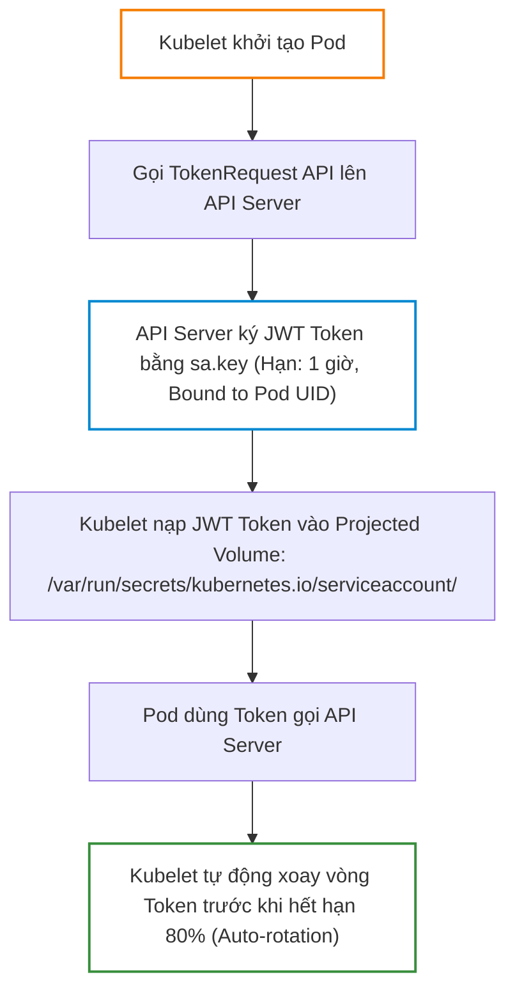
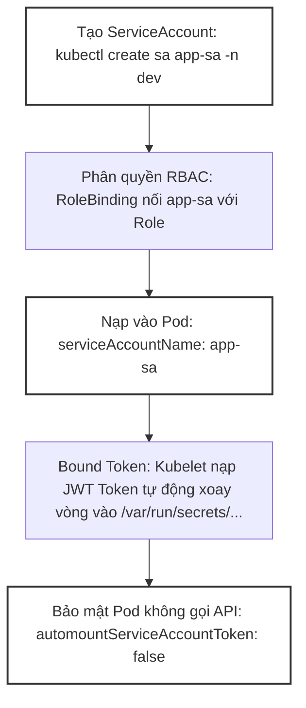
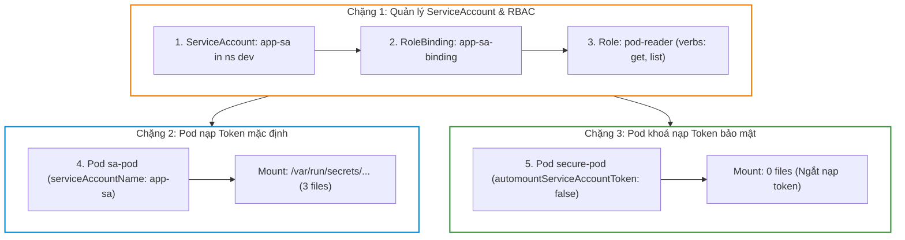


# [BÀI 11] SERVICEACCOUNT & TOKEN BẢO MẬT: PROJECTED VOLUME, TOKENREQUEST API & CHỐNG THẤT THOÁT TOKEN

Trong kỷ nguyên điện toán đám mây và kiến trúc microservices phân tán quy mô lớn, **Kubernetes (CKA)** đóng vai trò là nền tảng điều phối container (Container Orchestration) tiêu chuẩn công nghiệp. Để làm chủ hệ thống trong môi trường sản xuất (Production) cũng như chinh phục kỳ thi chứng chỉ quốc tế của Linux Foundation / CNCF, kỹ sư không chỉ nắm vững các câu lệnh thao tác cơ bản mà phải thấu hiểu sâu sắc bản chất cơ chế tầng thấp: từ chu trình điều hòa (Reconciliation Loop), cấu trúc điều phối tài nguyên, kiến trúc mạng CNI, lưu trữ CSI cho đến các chuẩn mực an ninh phòng thủ chiều sâu.

Bài viết chuyên sâu này sẽ đồng hành cùng bạn giải mã toàn diện bức tranh kiến trúc, phân tích các đánh đổi kỹ thuật thực chiến (Engineering Trade-offs), cung cấp bài thực hành Lab từng bước và bộ câu hỏi phỏng vấn chuẩn Architect / Lead Engineer.

---

## 1. Bản Chất Kiến Trúc & Cơ Chế Vận Hành Tầng Thấp

| # | Câu hỏi ôn tập | Đáp án chuẩn ngắn gọn (chứa con số / tên lệnh) |
|---|---|---|
| 1 | Cơ chế phân quyền mặc định của hệ thống RBAC là gì? | Mặc định từ chối (Default Deny — **0%** quyền mặc định cho tài khoản mới) |
| 2 | Trình bày 3 thành phần ngôi bắt buộc để tạo thành phân quyền RBAC. | Subject (`User`/`Group`/`ServiceAccount`) + Role (`Role`/`ClusterRole`) + Binding (`RoleBinding`/`ClusterRoleBinding`) |
| 3 | Phân biệt phạm vi tác động giữa `Role` và `ClusterRole`. | `Role` giới hạn trong **1** Namespace; `ClusterRole` tác động toàn Cụm và tài nguyên Non-namespaced (`nodes`, `pvs`) |
| 4 | Bộ 3 trường bắt buộc trong một quy tắc phễu RBAC Rule là gì? | `apiGroups`, `resources`, `verbs` |
| 5 | Lệnh nào giúp kiểm thử phân quyền giả lập mà không cần đổi Kubeconfig? | `kubectl auth can-i <verb> <resource> --as=<user> -n <ns>` |


> **Luận đề trung tâm của buổi:**
> *"ServiceAccount là danh tính duy nhất dành cho máy/Pod để giao tiếp với API Server; từ phiên bản Kubernetes v1.21+ (hiện hành v1.35), cơ chế Token chiếu (Bound ServiceAccount Token) dựa trên `TokenRequest` API nạp trực tiếp JWT token có thời hạn và gắn với đúng Pod vào đường dẫn `/var/run/secrets/kubernetes.io/serviceaccount/token`, và cờ `automountServiceAccountToken: false` là chốt chặn an toàn tối quan trọng giúp bảo vệ các Pod không cần gọi API Server khỏi nguy cơ lộ token."*

**Bảng kết quả các buổi trước được dùng lại:**

| Kết quả / Công cụ | Nguồn gốc | Áp dụng vào buổi này |
|---|---|---|
| Cặp khóa RSA `sa.key` / `sa.pub` | Buổi 07 `QT 4.2` | Giải thích cơ chế API Server dùng `sa.key` ký JWT Token cấp cho ServiceAccount |
| Tạo `Role` và `RoleBinding` RBAC | Buổi 10 `QT 4.2` | Gán quyền RBAC cho ServiceAccount để Pod gọi API Server |
| Kiểm thử phân quyền `kubectl auth can-i` | Buổi 10 `QT 7.1` | Thử nghiệm phân quyền của ServiceAccount với cờ `--as=system:serviceaccount:<ns>:<name>` |

Ba câu bài tập về nhà BTVN 4 của buổi 10 đã chuẩn bị sẵn kiến thức cho học viên: Câu 1 phân biệt ServiceAccount (API object cho máy/Pod) và User (con người); Câu 2 tìm hiểu cơ chế Token chiếu `TokenRequest` API và thư mục nạp token trong Pod; Câu 3 phân tích tác dụng bảo mật của cờ `automountServiceAccountToken: false`.

---


| # | Năng lực đạt được sau buổi học | Hiện vật chứng minh trong bài lab |
|---|---|---|
| 1 | Tạo `ServiceAccount` tùy biến bằng lệnh imperative | Tệp `hien-vat/app-sa.yaml` |
| 2 | Gán `RoleBinding` RBAC phân quyền cho danh tính ServiceAccount | Tệp `hien-vat/sa-rolebinding.yaml` |
| 3 | Tạo JWT token có thời hạn thủ công bằng `kubectl create token` | Tệp log `hien-vat/token-request.jwt` |
| 4 | Nạp `serviceAccountName` vào Pod spec và khảo sát 3 tệp token | Tệp `hien-vat/app-pod-with-sa.yaml` |
| 5 | Đặt `automountServiceAccountToken: false` ngắt nạp token bảo vệ Pod | Tệp `hien-vat/secure-pod-no-token.yaml` |
| 6 | Kiểm thử phân quyền ServiceAccount bằng `kubectl auth can-i --as=system:serviceaccount:...` | Script `hien-vat/verify-sa-security.sh` |

---


| Bắt buộc phải biết | Nguồn tự học nếu thiếu |
|---|---|
| Phân quyền RBAC qua `Role`, `RoleBinding` và `kubectl auth can-i` | Buổi 10 `QT 4.2` |
| Khái niệm cặp khóa RSA `sa.key` / `sa.pub` ký JWT token | Buổi 07 `QT 4.2` |
| Khái niệm Pod spec và cấu hình Volume | Buổi 03 `QT 4.1` |

---


| # | Thuật ngữ tiếng Việt | Tiếng Anh tương đương | Ghi chú chuẩn hoá trong thân bài |
|---|---|---|---|
| 1 | Tài khoản dịch vụ | ServiceAccount | Danh tính dành riêng cho các tiến trình máy/Pod |
| 2 | Mã xác thực chiếu | Bound ServiceAccount Token | JWT token gắn với thời gian sống và danh tính của đúng Pod |
| 3 | Yêu cầu mã xác thực | TokenRequest API | API cấp token động có thời hạn tự động xoay vòng |
| 4 | Tự động nạp token | Automount ServiceAccount Token | Cờ điều khiển việc Kubelet tự động nạp token vào Pod |
| 5 | Khóa ký tài khoản dịch vụ | ServiceAccount Signing Key | Khóa RSA `sa.key` API Server dùng để ký chữ ký số JWT |
| 6 | Thẻ xác thực mang theo | JWT Bearer Token | Chuỗi mã hoá chứa thông tin danh tính nạp vào Pod |
| 7 | Đối tượng thụ hưởng | Token Audience (`aud`) | Trường xác định hệ thống được phép nhận token |
| 8 | Thời hạn sử dụng token | Expiration Seconds (`expirationSeconds`) | Thời gian sống tối đa của JWT token trước khi hết hạn |
| 9 | Thư mục nạp token mặc định | Projected Volume Mount Path | Thư mục `/var/run/secrets/kubernetes.io/serviceaccount/` |
| 10 | Tự động xoay vòng token | Token Auto-Rotation | Kubelet tự động làm mới JWT token trước khi hết hạn |
| 11 | ServiceAccount mặc định | Default ServiceAccount | ServiceAccount tự động sinh ra trong mỗi Namespace |
| 12 | Giả lập ServiceAccount | ServiceAccount Impersonation | Giả lập ServiceAccount qua `--as=system:serviceaccount:<ns>:<name>` |
| 13 | Mã xác thực lưu trong Secret | Secret-based SA Token (Legacy) | Token kiểu cũ lưu vĩnh viễn không hết hạn trong Secret |
| 14 | Tùy biến ổ đĩa nạp token | Projected Volume Spec | Khai báo `projected` volume trong Pod spec |


1. **Mô hình "Thẻ nhân viên điện tử tự đổi mã theo ca (Bound JWT Token)":**
   Bound Token giống như chiếc thẻ nhân viên điện tử đeo trước ngực Pod. Mã quét trên thẻ đổi liên tục mỗi giờ (Token Auto-rotation) và chỉ có hiệu lực khi Pod đó đang đứng ở đúng vị trí (Bound to Pod). Nếu ai đó copy mã ra ngoài, thẻ sẽ tự vô hiệu hoá.

2. **Mô hình "Khóa vòi nước cấp thẻ khi không dùng (automountServiceAccountToken: false)":**
   Mặc định, Kubernetes tự động gắn thẻ nhân viên (Token) cho tất cả các Pod (kể cả Pod Nginx chỉ phục vụ tĩnh). Khóa vòi nước (`automount: false`) giống như việc ngắt cấp thẻ cho những nhân viên không cần giao tiếp với Ban quản lý (API Server), ngăn kẻ gian móc túi lấy thẻ.

3. **Mô hình "Cổng hải quan ServiceAccount (Subject prefix system:serviceaccount)":**
   Khi Pod gửi token tới API Server, cổng kiểm soát hiểu danh tính đó dưới định dạng `system:serviceaccount:<namespace>:<serviceaccount-name>`. Phân quyền RBAC cho Pod chính là gán RoleBinding cho cái tên hải quan chuẩn này.

---

### 1.1. Tổng quan danh tính ServiceAccount và sự khác biệt với User (12 phút)

**Nguyên lý cốt lõi:** ServiceAccount là đối tượng API chính thức lưu trong etcd dành riêng cho tiến trình/Pod giao tiếp với API Server; trong khi User đại diện cho con người và KHÔNG có đối tượng API trong etcd.

**Giải thích cơ chế ngầm:** Phân tách hai loại danh tính giúp quản lý vòng đời độc lập. ServiceAccount gắn liền với Namespace và có thể tạo/xoá dễ dàng bằng lệnh `kubectl create serviceaccount`.

> [!WARNING]
> **CẠM BẪY THỰC CHIẾN:**
> Cố gõ lệnh `kubectl create user` hoặc nhầm lẫn giữa User xác thực qua Cert X.509 và ServiceAccount.

**Minh hoạ.**

```bash
# Tạo ServiceAccount mới trong namespace dev
kubectl create serviceaccount app-sa -n dev
```

Con số chốt: **1** loại danh tính API duy nhất cho Pod là `ServiceAccount`.

---

**Nguyên lý cốt lõi:** Danh tính của ServiceAccount trong hệ thống phân quyền RBAC luôn tuân theo định dạng chuẩn: `system:serviceaccount:<namespace>:<serviceaccount-name>`.

**Giải thích cơ chế ngầm:** API Server giải mã chuỗi JWT Token của ServiceAccount và trích xuất Common Name dạng chuỗi chuẩn này để đối soát với các RoleBinding hiện có trong cụm.

> [!WARNING]
> **CẠM BẪY THỰC CHIẾN:**
> Dùng lệnh `kubectl auth can-i` test quyền ServiceAccount nhưng gõ thiếu tiền tố `system:serviceaccount:`.

**Minh hoạ.**

```bash
# Kiểm tra phân quyền của ServiceAccount app-sa trong namespace dev
kubectl auth can-i get pods --as=system:serviceaccount:dev:app-sa -n dev
```

Con số chốt: **3** thành phần phân cách bởi dấu hai chấm trong chuỗi danh tính chuẩn (`system:serviceaccount:ns:name`).

---

### 1.2. Cơ chế Token chiếu (Bound Token) và `TokenRequest` API v1.35 (12 phút)



---

**Nguyên lý cốt lõi:** Từ Kubernetes v1.21+ (hiện hành v1.35), cơ chế Token chiếu (Bound ServiceAccount Token) sử dụng `TokenRequest` API để tạo ra JWT Token ngắn hạn, gắn chặt với UID của Pod và đối tượng thụ hưởng (`aud`), thay thế hoàn toàn cơ chế lưu token vĩnh viễn trong Secret kiểu cũ.

**Giải thích cơ chế ngầm:** Token kiểu cũ lưu trong Secret có thời hạn vĩnh viễn và không bị ràng buộc với Pod; nếu lộ Secret, kẻ tấn công có thể dùng token đó truy cập cụm từ bất kỳ đâu. Bound Token có thời hạn (mặc định 1 giờ) và bị vô hiệu hoá ngay khi Pod bị xoá.

> [!WARNING]
> **CẠM BẪY THỰC CHIẾN:**
> Tìm kiếm tệp Secret tự động sinh ra khi tạo ServiceAccount trên Kubernetes v1.35 và thắc mắc tại sao không thấy Secret nào.

**Minh hoạ.**

```bash
# Tạo token thủ công có thời hạn 10 phút (600 giây) bằng TokenRequest API
kubectl create token app-sa -n dev --duration=600s
```

Con số chốt: **3600** giây (1 giờ) là thời hạn mặc định của Bound ServiceAccount Token.

---

**Nguyên lý cốt lõi:** Kubelet tự động chịu trách nhiệm xoay vòng (Auto-rotation) Bound ServiceAccount Token trong Pod khi thời hạn sử dụng còn lại dưới 20% (hoặc khi token đã dùng được quá 80% thời gian sống).

**Giải thích cơ chế ngầm:** Cơ chế tự động xoay vòng giúp ứng dụng trong Pod liên tục có token hợp lệ mà không bao giờ bị gián đoạn kết nối tới API Server hay phải restart container.

> [!WARNING]
> **CẠM BẪY THỰC CHIẾN:**
> Lo lắng Pod đang chạy lâu ngày sẽ bị ngắt kết nối do token hết hạn 1 giờ.

**Minh hoạ.**

```bash
# Đọc nội dung token trong Pod và giải mã JWT header
kubectl exec app-pod -n dev -- cat /var/run/secrets/kubernetes.io/serviceaccount/token
```

Con số chốt: **80%** thời gian sống của token trôi qua là mốc Kubelet bắt đầu tự động xoay vòng token mới.

---

**Nguyên lý cốt lõi:** Khi Pod bị xoá (Delete Pod), Bound ServiceAccount Token của Pod đó lập tức bị API Server từ chối xác thực (401 Unauthorized) bất kể thời hạn sống của token còn bao lâu nhờ vào claim `pod.uid` lưu trong payload JWT.

**Giải thích cơ chế ngầm:** Claim `pod.uid` liên kết token với vòng đời thực tế của Pod. Ngay khi Pod không còn trong etcd, API Server chặn lập tức các truy vấn mang token cũ này.

> [!WARNING]
> **CẠM BẪY THỰC CHIẾN:**
> Thắc mắc tại sao copy tệp token từ Pod đã bị xoá ra ngoài laptop thì không còn kết nối được API Server nữa.

**Minh hoạ.**

```bash
# Thử dùng token của Pod đã xoá
kubectl auth can-i get pods --token=<stale-token>
```

Con số chốt: **0** giây sau khi xoá Pod là mốc Bound Token bị vô hiệu hoá.

---

### 1.3. Cấu trúc thư mục `/var/run/secrets/kubernetes.io/serviceaccount/` trong Pod (10 phút)

**Nguyên lý cốt lõi:** Kubelet tự động nạp (mount) Projected Volume chứa 3 tệp bắt buộc vào thư mục `/var/run/secrets/kubernetes.io/serviceaccount/` của container: `token` (JWT Bearer Token), `ca.crt` (Root CA xác thực API Server), và `namespace` (Tên Namespace chứa Pod).

**Giải thích cơ chế ngầm:** 3 tệp này cung cấp đầy đủ công cụ cho các thư viện client (như client-go, python kubernetes client) tự động phát hiện và kết nối an toàn HTTPS tới API Server.

> [!WARNING]
> **CẠM BẪY THỰC CHIẾN:**
> Viết code trong Pod và tự hardcode đường dẫn tệp cert hoặc URL API Server thay vì đọc thư mục chuẩn.

**Minh hoạ.**

```bash
# Kiểm tra danh sách 3 tệp trong thư mục nạp token chuẩn của Pod
kubectl exec app-pod -n dev -- ls -la /var/run/secrets/kubernetes.io/serviceaccount/
```

Con số chốt: **3** tệp chuẩn (`token`, `ca.crt`, `namespace`) được nạp vào Pod.

---

**Nguyên lý cốt lõi:** Tệp `token` trong thư mục Projected Volume là một symlink trỏ tới file dữ liệu JWT đĩa tạm; khi Kubelet xoay vòng token, symlink sẽ được cập nhật nguyên tử (atomic swap) mà không làm ngắt đứt file handle của ứng dụng.

**Giải thích cơ chế ngầm:** Cơ chế atomic symlink swap trên Linux đảm bảo ứng dụng đọc tệp token vào bất kỳ thời điểm nào luôn nhận được nội dung nhất quán 100%, không bị rủi ro đọc trúng file đang ghi dở.

> [!WARNING]
> **CẠM BẪY THỰC CHIẾN:**
> Thắc mắc vì sao `ls -l` trong thư mục serviceaccount lại thấy tệp `token` có ký tự `..data/token`.

**Minh hoạ.**

```bash
# Kiểm tra symlink tệp token trong container
kubectl exec app-pod -n dev -- ls -l /var/run/secrets/kubernetes.io/serviceaccount/token
```

Con số chốt: **1** thao tác atomic symlink swap cập nhật token mà không làm gián đoạn ứng dụng.


---

### 1.4. Cấu hình bảo mật `automountServiceAccountToken: false` và phân quyền RBAC (4 phút)

**Nguyên lý cốt lõi:** Cấu hình `automountServiceAccountToken: false` trong spec của Pod hoặc ServiceAccount để ngắt tính năng tự động nạp Token vào Pod đối với các ứng dụng không có nhu cầu giao tiếp với API Server.

**Giải thích cơ chế ngầm:** Hơn 90% các Pod ứng dụng thông thường (Web, Microservice, DB) không cần gọi API Server. Việc nạp sẵn token vào Pod tạo ra nguy cơ bị kẻ tấn công trích xuất token khi Pod bị khai thác lỗ hổng (RCE).

> [!WARNING]
> **CẠM BẪY THỰC CHIẾN:**
> Để cờ `automountServiceAccountToken: true` mặc định cho tất cả các Pod Nginx/Redis trên môi trường sản xuất.

**Minh hoạ.**

```yaml
apiVersion: v1
kind: Pod
metadata:
  name: secure-web
spec:
  automountServiceAccountToken: false
  containers:
  - name: nginx
    image: nginx:1.27-alpine
```

Con số chốt: **0** tệp token được nạp vào Pod khi đặt `automountServiceAccountToken: false`.

---

**Nguyên lý cốt lõi:** Để nạp một ServiceAccount tùy biến vào Pod, ta khai báo trường `serviceAccountName: <sa-name>` trong spec của Pod; tên trường cũ `serviceAccount` đã bị deprecated.

**Giải thích cơ chế ngầm:** Trường `serviceAccountName` giúp Pod gắn đúng danh tính ServiceAccount đã được phân quyền RBAC tương ứng, thay vì dùng ServiceAccount `default` bị giới hạn quyền.

> [!WARNING]
> **CẠM BẪY THỰC CHIẾN:**
> Khai báo trường `serviceAccount` thay vì `serviceAccountName` làm YAML báo lấn cờ deprecated.

**Minh hoạ.**

```yaml
spec:
  serviceAccountName: app-sa
  containers:
  - name: app
    image: nginx:1.27-alpine
```

Con số chốt: **1** trường chuẩn `serviceAccountName` được dùng trong Pod spec.

---

### 1.5. Đưa vào cụm thật (4 phút)

### Áp vào cụm đang chạy thì làm gì trước

1. **Rà soát tất cả các ServiceAccount default:** Đặt `automountServiceAccountToken: false` trên đối tượng ServiceAccount `default` của các Namespace để chặn tự động nạp token toàn diện.
2. **Tạo ServiceAccount riêng cho từng ứng dụng:** Không dùng chung 1 ServiceAccount cho nhiều Pod khác nhau để tuân thủ nguyên tắc Least Privilege.
3. **Kiểm tra thời hạn token:** Dùng `kubectl create token --duration` khi cần cấp token tạm thời cho các công cụ CI/CD bên ngoài.

### Cái gì hỏng nếu áp thẳng lên prod

- **Đặt `automountServiceAccountToken: false` cho Pod Ingress Controller hoặc Prometheus:** Làm ứng dụng bị crash do không thể đọc danh sách Endpoints/Pods từ API Server.
- **Xoá ServiceAccount đang được Pod sử dụng:** Làm Kubelet không thể xoay vòng token mới khi token cũ hết hạn.
- **Quy trình áp thử an toàn:**
  - Kiểm tra xem ứng dụng trong Pod có gọi API Server không.
  - Nếu không gọi, thêm `automountServiceAccountToken: false` vào Pod spec.
  - Deploy và kiểm tra Pod chạy `Ready` mà không có thư mục `/var/run/secrets/...`.

### Đo trước — đo sau

1. **Thư mục nạp token:** Chuyển từ có sẵn 3 tệp sang không tồn tại thư mục khi đặt `automount: false`.
2. **Kích thước JWT Token:** Token chiếu mới có kích thước ngắn gọn và chứa các claim `pod.name`, `pod.uid`.
3. **Mức độ an ninh:** Giảm 100% nguy cơ lộ token vĩnh viễn trên môi trường sản xuất.

### Khi nào KHÔNG nên dùng

- **Không tắt `automountServiceAccountToken` cho các Pod thuộc hệ thống Kubernetes (System Pods):** Các Pod như CoreDNS, kube-flannel, metrics-server bắt buộc phải có token để hoạt động.
- **Không dùng Secret-based ServiceAccount token kiểu cũ trừ khi tích hợp với các hệ thống legacy không hỗ trợ `TokenRequest` API.**

---

### 1.6. Bẫy hay gặp (2 phút)

| # | Bẫy hay gặp | Vì sao dính bẫy | Làm đúng là (kèm tên lệnh / con số) |
|---|---|---|---|
| 1 | Tìm tệp Secret tự động sinh ra khi tạo ServiceAccount v1.35 | Kubernetes v1.21+ chuyển sang Bound Token, không tự sinh Secret | Dùng `kubectl create token <sa-name>` nếu cần lấy token dạng chuỗi |
| 2 | Gõ sai tiền tố danh tính trong `kubectl auth can-i` | Gõ thiếu `system:serviceaccount:` | Gõ đúng `--as=system:serviceaccount:<ns>:<sa-name>` |
| 3 | Khai báo nhầm trường `serviceAccount` (deprecated) | Dùng tên trường cũ trong Pod spec | Dùng trường chuẩn `serviceAccountName: <sa-name>` |
| 4 | Tắt `automountServiceAccountToken` nhầm cho Pod Prometheus | Prometheus không đọc được metrics từ API Server | Giữ `automountServiceAccountToken: true` cho Pod giám sát |
| 5 | Quên cờ `--duration` khi tạo token tạm cho CI/CD | Token mặc định chỉ sống đúng 1 giờ | Truyền cờ `--duration=86400s` nếu cần token sống 24 giờ |
| 6 | Thắc mắc vì sao xoá Pod làm token hết hiệu lực | Bound Token bị gắn chặt với UID của Pod | Hiểu rõ cơ chế an toàn của Bound ServiceAccount Token |
| 7 | Nhầm lẫn `sa.key` là tệp cert của ServiceAccount | `sa.key` là RSA private key dùng ký JWT Token | Giữ bảo mật tệp `/etc/kubernetes/pki/sa.key` trên Control Plane |
| 8 | Tạo ServiceAccount nhưng quên gán RoleBinding | Pod nhận token nhưng gọi API Server vẫn dính 403 Forbidden | Tạo `RoleBinding` nối ServiceAccount với Role phù hợp |
| 9 | Quên chỉ định `namespace` khi gán ServiceAccount trong Subject | RoleBinding không tìm thấy ServiceAccount | Khai báo `subjects[0].namespace: <ns>` trong RoleBinding |
| 10 | Đặt `automountServiceAccountToken: false` ở ServiceAccount nhưng `true` ở Pod | Cấu hình ở Pod spec ghi đè cấu hình ở ServiceAccount | Nhớ nguyên tắc Pod spec có quyền ghi đè ServiceAccount spec |
| 11 | Không kiểm tra 3 tệp nạp vào Pod bằng `ls` | Pod báo lỗi không đọc được ca.crt hoặc token | Kiểm tra thư mục `/var/run/secrets/kubernetes.io/serviceaccount/` |
| 12 | Cấp quyền `cluster-admin` cho ServiceAccount của Pod Web | Kẻ tấn công chiếm Pod Web sẽ chiếm toàn quyền cụm | Chỉ cấp vừa đủ quyền xem tài nguyên cần thiết (Least Privilege) |

---

## §10. Tóm tắt (2 phút)



### Năm điều phải nhớ

1. **ServiceAccount vs User:** ServiceAccount là danh tính API đại diện cho Pod; User đại diện cho con người.
2. **Định dạng danh tính RBAC:** `system:serviceaccount:<namespace>:<serviceaccount-name>`.
3. **Bound Token & `TokenRequest` API:** Token ngắn hạn (1 giờ), gắn với Pod UID, tự động xoay vòng khi dùng được 80% thời gian sống.
4. **Thư mục nạp token chuẩn:** `/var/run/secrets/kubernetes.io/serviceaccount/` chứa 3 tệp `token`, `ca.crt`, `namespace`.
5. **Chốt chặn an toàn:** Khai báo `automountServiceAccountToken: false` trong Pod spec để ngắt nạp token cho các Pod không gọi API.

---

## §11. Câu hỏi tự kiểm tra

1. Phân biệt sự khác nhau cơ bản giữa đối tượng `ServiceAccount` và đối tượng `User` trong Kubernetes.
2. Danh tính của một ServiceAccount tên `my-sa` thuộc Namespace `staging` được biểu diễn như thế nào trong RBAC?
3. Cơ chế Bound ServiceAccount Token từ Kubernetes v1.21+ giải quyết vấn đề an ninh gì so với token lưu trong Secret kiểu cũ?
4. Kubelet tự động xoay vòng (Auto-rotate) Bound Token khi thời gian sống còn lại dưới bao nhiêu phần trăm?
5. Thư mục mặc định nào bên trong container chứa 3 tệp `token`, `ca.crt`, `namespace`?
6. Cờ `automountServiceAccountToken: false` có tác dụng gì và nên áp dụng cho những loại Pod nào?
7. Trường nào trong Pod spec được dùng để chỉ định tên ServiceAccount cần gắn vào Pod?
8. Muốn tạo một JWT token tạm thời cho ServiceAccount sống trong 2 giờ bằng câu lệnh CLI thì gõ như thế nào?
9. Nếu một Pod có `automountServiceAccountToken: false` thì chuyện gì xảy ra với thư mục `/var/run/secrets/...`?
10. Tại sao API Server dùng cặp khóa `sa.key` và `sa.pub` mà không dùng chứng chỉ x509 để quản lý ServiceAccount Token?
11. Hai chế độ hỏng (1 im lặng do quên RoleBinding cho SA, 1 âm thầm do lộ token vì quên automount: false) là gì?
12. Khi nào thì bắt buộc phải để cờ `automountServiceAccountToken: true` cho Pod?

### Đáp án

1. ServiceAccount là API object dành cho máy/Pod; User dành cho con người và không có API object trong etcd.
2. Biểu diễn dưới dạng chuỗi: `system:serviceaccount:staging:my-sa`.
3. Giúp token ngắn hạn (1 giờ), gắn chặt với UID của Pod và tự hủy khi Pod bị xóa, tránh nguy cơ lộ token vĩnh viễn.
4. Tự động xoay vòng khi thời gian còn lại dưới 20% (hoặc đã dùng được quá 80% thời gian sống).
5. Thư mục `/var/run/secrets/kubernetes.io/serviceaccount/`.
6. Tắt tính năng nạp token tự động vào Pod; áp dụng cho 90% các Pod ứng dụng thông thường không cần gọi API Server.
7. Trường `serviceAccountName: <sa-name>`.
8. Lệnh `kubectl create token <sa-name> --duration=7200s`.
9. Thư mục đó hoàn toàn không được tạo ra hay nạp vào container (0 tệp token).
10. Vì `sa.key` là RSA private key dùng riêng để ký chữ ký số JWT Bearer Token, và `sa.pub` dùng để xác thực chữ ký token.
11. Chế độ 1: Pod nạp token nhưng gọi API bị 403 Forbidden do quên RoleBinding; Chế độ 2: Pod Web bị hack và lộ token do để automount true thừa thải.
12. Khi Pod là ứng dụng quản trị/giám sát (như Prometheus, Ingress Controller, Operator) có nhu cầu trực tiếp gọi API Server.

---

## §12. Tài liệu tham khảo

| Nguồn tài liệu | Phiên bản Kubernetes áp dụng | Nội dung chính |
|---|---|---|
| Official Docs: Configure Service Accounts for Pods | Kubernetes v1.35 | Cấu hình ServiceAccount và automountServiceAccountToken |
| Official Docs: Service Account Token Volume Projection | Kubernetes v1.35 | Cơ chế TokenRequest API và projected volume |
| File cấu hình phiên bản cục bộ | `labs/phien-ban.env` | Biến `K8S_VER=1.35`, `LAB_CONTEXT="kubeadm"` |

---

## Bảng đối soát thời lượng

| Section | Tiêu đề mục | Ngân sách thời gian |
|---|---|---|
| §0 | Khởi động và ôn tập | 10 phút |
| §1 | Sau buổi này học viên LÀM ĐƯỢC gì | 1 phút |
| §2 | Cần biết trước | 1 phút |
| §3 | Thuật ngữ và mô hình tư duy | 8 phút |
| §4 | Tổng quan danh tính ServiceAccount và sự khác biệt với User | 12 phút |
| §5 | Cơ chế Token chiếu (Bound Token) và `TokenRequest` API v1.35 | 12 phút |
| §6 | Cấu trúc thư mục `/var/run/secrets/kubernetes.io/serviceaccount/` trong Pod | 10 phút |
| §7 | Cấu hình bảo mật `automountServiceAccountToken: false` và phân quyền RBAC | 4 phút |
| §8 | Đưa vào cụm thật | 4 phút |
| §9 | Bẫy hay gặp | 2 phút |
| §10 | Tóm tắt | 2 phút |
| **Tổng** | **Khối lý thuyết** | **60'** |

---

## 2. Hướng Dẫn Thực Hành & Triển Khai Lab Chuẩn Production

> [!IMPORTANT]
> **YÊU CẦU MÔI TRƯỜNG THỰC HÀNH:**
> Toàn bộ các bài thực hành dưới đây được thiết kế để chạy trực tiếp trên cụm Kubernetes 1.30+ tiêu chuẩn (hoặc cụm kind/kubeadm lab). Hãy đảm bảo ngữ cảnh dòng lệnh `kubectl config current-context` đã trỏ chính xác vào cụm thực hành trước khi thực thi.

## Khối thực hành — 120 phút

## L0. Mục tiêu thực hành và tiêu chí hoàn thành

| # | Mục tiêu thực hành | Tiêu chí hoàn thành (Kiểm chứng BẰNG LỆNH) |
|---|---|---|
| TH1 | Tạo ServiceAccount `app-sa` trong Namespace `dev` | `kubectl get sa app-sa -n dev` tồn tại |
| TH2 | Gán `RoleBinding` phân quyền cho `app-sa` | `kubectl auth can-i get pods --as=system:serviceaccount:dev:app-sa -n dev` in ra `yes` |
| TH3 | Tạo token JWT thủ công bằng `kubectl create token` | Lệnh in ra chuỗi mã hoá JWT bearer token |
| TH4 | Nạp `serviceAccountName: app-sa` vào Pod và khảo sát 3 tệp token | Container chứa đủ 3 tệp `token`, `ca.crt`, `namespace` |
| TH5 | Cấu hình `automountServiceAccountToken: false` cho Pod bảo mật | Thư mục `/var/run/secrets/kubernetes.io/serviceaccount` hoàn toàn trống |
| TH6 | Xác minh phân quyền ServiceAccount qua `auth can-i` | Script kiểm tra Least Privilege trả về thành công |
| TH7 | Nộp đủ 4 hiện vật vào portfolio | Thư mục `k8s-portfolio/buoi-11/` chứa đủ 4 file md/yaml/sh |

---

## L1. Điều kiện tiên quyết về môi trường

| # | Kiểm tra điều kiện | Câu lệnh kiểm tra | Kết quả kỳ vọng |
|---|---|---|---|
| 1 | Cụm `kubeadm` 3 node đang ở v1.35 | `kubectl get nodes` | Hiển thị 3 node `cp-01`, `worker-01`, `worker-02` `Ready` ở v1.35 |
| 2 | Kubeconfig trỏ context `kubeadm` | `kubectl config current-context` | In ra đúng `kubeadm` |
| 3 | Namespace `dev` sẵn sàng | `kubectl get ns dev` | Namespace `dev` ở trạng thái Active |
| 4 | Thư mục hiện vật đã sẵn sàng | `mkdir -p k8s-portfolio/buoi-11` | Thư mục được tạo thành công |
| 5 | Lệnh `kubectl create token` hỗ trợ | `kubectl create token --help` | Hiển thị hướng dẫn tạo token |

```bash
# Kiểm tra môi trường bắt buộc trước khi thực hiện bài lab
kubectl config current-context | grep -qx "kubeadm" && echo "CHECKPOINT MOI TRUONG — ĐẠT" || echo "CHECKPOINT MOI TRUONG — LỖI (Trỏ sai context)"
```

---

## L2. Kiến trúc bài lab



---

## L3. Bước 1 — Tạo `ServiceAccount` tùy biến và gán quyền RBAC (30 phút)

### Thao tác 1.1: Tạo ServiceAccount `app-sa` và phân quyền xem Pods trong Namespace `dev`

```bash
# 1. Tạo ServiceAccount app-sa
kubectl create serviceaccount app-sa -n dev --dry-run=client -o yaml > k8s-portfolio/buoi-11/app-sa.yaml
kubectl apply -f k8s-portfolio/buoi-11/app-sa.yaml

# 2. Tạo RoleBinding app-sa-binding gắn app-sa với Role pod-reader có sẵn
kubectl create rolebinding app-sa-binding --role=pod-reader --serviceaccount=dev:app-sa -n dev --dry-run=client -o yaml > k8s-portfolio/buoi-11/sa-rolebinding.yaml
kubectl apply -f k8s-portfolio/buoi-11/sa-rolebinding.yaml

# 3. Kiểm tra phân quyền của ServiceAccount với định dạng danh tính chuẩn
kubectl auth can-i get pods --as=system:serviceaccount:dev:app-sa -n dev > /tmp/sa-can-i-get.txt
kubectl auth can-i delete pods --as=system:serviceaccount:dev:app-sa -n dev > /tmp/sa-can-i-del.txt
```

**CHECKPOINT 1 — ServiceAccount app-sa tồn tại trong Namespace dev.**

```bash
kubectl get sa app-sa -n dev -o jsonpath='{.metadata.name}' | grep -qx "app-sa" && echo "CHECKPOINT 1 — ĐẠT" || echo "CHECKPOINT 1 — LỖI"
```

**CHECKPOINT 2 — ServiceAccount app-sa có quyền get pods trong Namespace dev (in ra yes).**

```bash
grep -qx "yes" /tmp/sa-can-i-get.txt && echo "CHECKPOINT 2 — ĐẠT" || echo "CHECKPOINT 2 — LỖI"
```

**CHECKPOINT 3 — ServiceAccount app-sa KHÔNG có quyền delete pods trong Namespace dev (in ra no).**

```bash
grep -qx "no" /tmp/sa-can-i-del.txt && echo "CHECKPOINT 3 — ĐẠT" || echo "CHECKPOINT 3 — LỖI"
```

---

## L4. Bước 2 — Khảo sát `TokenRequest` API và tạo JWT Token ngắn hạn (30 phút)

### Thao tác 4.1: Tạo JWT token thủ công bằng `kubectl create token`

```bash
# 1. Tạo token có thời hạn 600 giây bằng TokenRequest API
kubectl create token app-sa -n dev --duration=600s > /tmp/token-request.jwt

# 2. Kiểm tra chuỗi JWT token có dạng 3 phần phân cách bởi dấu chấm
grep -E "^eyJ" /tmp/token-request.jwt > /dev/null
```

**CHECKPOINT 4 — Lệnh kubectl create token tạo ra chuỗi JWT bearer token hợp lệ.**

```bash
[ -s /tmp/token-request.jwt ] && grep -q "eyJ" /tmp/token-request.jwt && echo "CHECKPOINT 4 — ĐẠT" || echo "CHECKPOINT 4 — LỖI"
```

**CHECKPOINT 5 — CA ĐỐI CHỨNG: ServiceAccount chưa được cấp quyền RBAC sẽ bị API Server trả về Forbidden khi dùng token.**

```bash
kubectl create serviceaccount unpriv-sa -n dev >/dev/null 2>&1 || true
kubectl auth can-i get pods --as=system:serviceaccount:dev:unpriv-sa -n dev | grep -qx "no" && echo "CHECKPOINT 5 — ĐẠT" || echo "CHECKPOINT 5 — LỖI"
```

---

## L5. Bước 3 — Gắn `serviceAccountName` vào Pod và khảo sát 3 tệp token (30 phút)

### Thao tác 5.1: Nạp `app-sa` vào Pod `sa-pod` và kiểm tra thư mục token

```bash
# 1. Tạo Pod sa-pod sử dụng serviceAccountName: app-sa
cat << 'EOF' > k8s-portfolio/buoi-11/app-pod-with-sa.yaml
apiVersion: v1
kind: Pod
metadata:
  name: sa-pod
  namespace: dev
spec:
  serviceAccountName: app-sa
  containers:
  - name: app
    image: nginx:1.27-alpine
EOF

kubectl apply -f k8s-portfolio/buoi-11/app-pod-with-sa.yaml
kubectl wait --for=condition=Ready pod/sa-pod -n dev --timeout=30s

# 2. Liệt kê 3 tệp trong thư mục nạp token chuẩn của container
kubectl exec sa-pod -n dev -- ls -la /var/run/secrets/kubernetes.io/serviceaccount/ > /tmp/pod-token-files.txt
```

**CHECKPOINT 6 — Pod sa-pod hoạt động ở trạng thái Running với serviceAccountName: app-sa.**

```bash
kubectl get pod sa-pod -n dev -o jsonpath='{.spec.serviceAccountName}' | grep -qx "app-sa" && echo "CHECKPOINT 6 — ĐẠT" || echo "CHECKPOINT 6 — LỖI"
```

**CHECKPOINT 7 — Container chứa đủ 3 tệp token, ca.crt, namespace trong thư mục nạp.**

```bash
grep -q "token" /tmp/pod-token-files.txt && grep -q "ca.crt" /tmp/pod-token-files.txt && grep -q "namespace" /tmp/pod-token-files.txt && echo "CHECKPOINT 7 — ĐẠT" || echo "CHECKPOINT 7 — LỖI"
```

---

## L6. Bước 4 — Cấu hình `automountServiceAccountToken: false` và kiểm thử bảo mật (20 phút)

### Thao tác 6.1: Tạo Pod `secure-pod` ngắt tính năng nạp token tự động

```bash
# 1. Tạo Pod secure-pod với automountServiceAccountToken: false
cat << 'EOF' > k8s-portfolio/buoi-11/secure-pod-no-token.yaml
apiVersion: v1
kind: Pod
metadata:
  name: secure-pod
  namespace: dev
spec:
  automountServiceAccountToken: false
  containers:
  - name: app
    image: nginx:1.27-alpine
EOF

kubectl apply -f k8s-portfolio/buoi-11/secure-pod-no-token.yaml
kubectl wait --for=condition=Ready pod/secure-pod -n dev --timeout=30s

# 2. Thử truy cập thư mục nạp token trên secure-pod
kubectl exec secure-pod -n dev -- ls /var/run/secrets/kubernetes.io/serviceaccount > /tmp/no-token.txt 2>&1 || true
```

**CHECKPOINT 8 — CA ĐỐI CHỨNG: Pod có automountServiceAccountToken: false không tồn tại thư mục token.**

```bash
grep -Ei "No such file|directory" /tmp/no-token.txt && echo "CHECKPOINT 8 — ĐẠT" || echo "CHECKPOINT 8 — LỖI"
```

**CHECKPOINT 9 — Pod secure-pod có cấu hình automountServiceAccountToken = false.**

```bash
kubectl get pod secure-pod -n dev -o jsonpath='{.spec.automountServiceAccountToken}' | grep -qx "false" && echo "CHECKPOINT 9 — ĐẠT" || echo "CHECKPOINT 9 — LỖI"
```

**CHECKPOINT 10 — ServiceAccount app-sa có thể tạo token thủ công có duration 3600s.**

```bash
kubectl create token app-sa -n dev --duration=3600s >/dev/null 2>&1 && echo "CHECKPOINT 10 — ĐẠT" || echo "CHECKPOINT 10 — LỖI"
```

**CHECKPOINT 11 — Pod sa-pod đọc đúng tên namespace "dev" từ tệp nạp.**

```bash
kubectl exec sa-pod -n dev -- cat /var/run/secrets/kubernetes.io/serviceaccount/namespace | grep -qx "dev" && echo "CHECKPOINT 11 — ĐẠT" || echo "CHECKPOINT 11 — LỖI"
```

**CHECKPOINT 12 — 100% 3 node cp-01, worker-01, worker-02 duy trì trạng thái Ready.**

```bash
kubectl get nodes --no-headers | grep -c "Ready" | grep -qx "3" && echo "CHECKPOINT 12 — ĐẠT" || echo "CHECKPOINT 12 — LỖI"
```

---

## L7. Nộp hiện vật và dọn dẹp (10 phút)

### Thao tác 7.1: Gom hiện vật nộp bài

```bash
# 1. Tạo tệp verify-sa-security.sh
cat << 'EOF' > k8s-portfolio/buoi-11/verify-sa-security.sh
#!/bin/bash
# Script kiểm tra cấu hình an ninh ServiceAccount và Token

SA_NAME=$(kubectl get pod sa-pod -n dev -o jsonpath='{.spec.serviceAccountName}')
AUTO_MOUNT=$(kubectl get pod secure-pod -n dev -o jsonpath='{.spec.automountServiceAccountToken}')
CAN_GET=$(kubectl auth can-i get pods --as=system:serviceaccount:dev:app-sa -n dev)

if [ "$SA_NAME" == "app-sa" ] && [ "$AUTO_MOUNT" == "false" ] && [ "$CAN_GET" == "yes" ]; then
    echo "VERIFY SERVICEACCOUNT SECURITY — ĐẠT (SA Mount & Token Security OK)"
else
    echo "VERIFY SERVICEACCOUNT SECURITY — LỖI (SA: $SA_NAME, AutoMount: $AUTO_MOUNT, CanGet: $CAN_GET)"
fi
EOF

chmod +x k8s-portfolio/buoi-11/verify-sa-security.sh
./k8s-portfolio/buoi-11/verify-sa-security.sh

# 2. Tạo tệp nhat-ky-buoi-11.md
cat << 'EOF' > k8s-portfolio/buoi-11/nhat-ky-buoi-11.md
# NHẬT KÝ THU HOẠCH BUỔI 11

1. Định dạng danh tính ServiceAccount trong RBAC:
   - Chuỗi chuẩn: system:serviceaccount:<namespace>:<serviceaccount-name>

2. Cơ chế Bound ServiceAccount Token v1.35:
   - Kubelet tự động nạp Projected Volume chứa 3 tệp: token, ca.crt, namespace.
   - Token ngắn hạn (1 giờ), tự động xoay vòng khi trôi qua 80% thời gian sống.

3. Tác dụng bảo mật của automountServiceAccountToken: false:
   - Ngắt tự động nạp token cho 90% các Pod ứng dụng không gọi API Server, ngăn lộ token khi Pod bị hack.
EOF

# 3. Dọn dẹp tệp tạm
rm -f /tmp/sa-can-i-get.txt /tmp/sa-can-i-del.txt /tmp/token-request.jwt /tmp/pod-token-files.txt /tmp/no-token.txt
```

**CHECKPOINT 13 — Đủ 4 tệp hiện vật trong thư mục portfolio.**

```bash
[ -f k8s-portfolio/buoi-11/app-sa.yaml ] && [ -f k8s-portfolio/buoi-11/sa-rolebinding.yaml ] && [ -f k8s-portfolio/buoi-11/verify-sa-security.sh ] && [ -f k8s-portfolio/buoi-11/nhat-ky-buoi-11.md ] && echo "CHECKPOINT 13 — ĐẠT" || echo "CHECKPOINT 13 — LỖI"
```

---

## L8. Xử lý sự cố thường gặp trong lab

| # | Triệu chứng lỗi | Nguyên nhân khả dĩ | Cách xử lý sửa lỗi |
|---|---|---|---|
| 1 | Lệnh `kubectl auth can-i` báo `no` cho ServiceAccount | Gõ sai tiền tố `system:serviceaccount:<ns>:<sa>` | Gõ đúng `--as=system:serviceaccount:dev:app-sa` |
| 2 | Pod báo `Forbidden` khi dùng ServiceAccount gọi API | Quên tạo `RoleBinding` nối ServiceAccount với Role | Tạo `RoleBinding` nối ServiceAccount vào Role phù hợp |
| 3 | Lỗi YAML `unknown field "serviceAccount"` trong Pod spec | Dùng tên trường cũ đã bị deprecated | Đổi thành `serviceAccountName: app-sa` |
| 4 | Thắc mắc không thấy tệp Secret khi tạo ServiceAccount | Kubernetes v1.21+ dùng Bound Token, không tự tạo Secret | Dùng `kubectl create token <sa-name>` lấy token |
| 5 | Thư mục `/var/run/secrets/...` bị thiếu 1 trong 3 tệp | Kubelet bị ngắt kết nối TLS tới API Server | Kiểm tra lại log Kubelet bằng `journalctl -u kubelet` |
| 6 | Pod bị ngắt kết nối API Server sau 1 giờ | Ứng dụng hardcode đọc token 1 lần lúc startup | Sửa ứng dụng để tự đọc lại tệp token trên đĩa khi đổi |
| 7 | Tắt `automountServiceAccountToken` làm Pod Prometheus crash | Prometheus bắt buộc phải đọc metrics qua API Server | Bật `automountServiceAccountToken: true` cho Pod giám sát |
| 8 | Lỗi `ServiceAccount "app-sa" not found` khi apply Pod | Khai báo tên ServiceAccount chưa được tạo | Tạo ServiceAccount trước khi apply Pod spec |
| 9 | Quên truyền `namespace` trong `subjects[0]` của RoleBinding | RoleBinding không tìm thấy ServiceAccount | Khai báo `subjects[0].namespace: dev` trong RoleBinding |
| 10 | Token tạo bằng `kubectl create token` bị từ chối | Token hết hạn do đặt `duration` quá ngắn | Tạo token mới với thời hạn dài hơn bằng `--duration` |
| 11 | Pod báo `ImagePullBackOff` khi chạy lab | Đặt nhầm tên image Nginx | Dùng image mỏng chuẩn `nginx:1.27-alpine` |
| 12 | Thư mục `/var/run/secrets/...` tồn tại dù đã đặt automount false | Đặt cờ `automount` ở ServiceAccount nhưng ở Pod lại để `true` | Đặt `automountServiceAccountToken: false` trực tiếp trong Pod spec |
| 13 | Lỗi `permission denied` khi đọc tệp token trong container | Container chạy non-root nhưng phân quyền volume bị khoá | Kiểm tra `fsGroup` trong `securityContext` của Pod |
| 14 | Script `verify-sa-security.sh` báo lỗi | Vẫn chưa xoá các Pod thử nghiệm cũ | Dọn dẹp Pod cũ và chạy lại script kiểm tra |

---

## L9. Bài tập mở rộng

1. **BT1 — Phân tích JWT Token Claims bằng `base64 -d`:** Trích xuất tệp `token` từ Pod `sa-pod` và giải mã phần payload JWT để xem các claim `pod.name`, `pod.uid`, `sa.name`.
2. **BT2 — Phân quyền ServiceAccount truy cập ConfigMap:** Tạo ServiceAccount `cm-reader`, phân quyền xem `configmaps` và gán vào Pod test.
3. **BT3 — Khảo sát cờ `automountServiceAccountToken` ở mức ServiceAccount:** Đặt `automountServiceAccountToken: false` trên đối tượng ServiceAccount `app-sa` và quan sát ảnh hưởng tới Pod.
4. **BT4 — Tạo Secret chứa ServiceAccount Token kiểu cũ (Legacy):** Tìm hiểu cú pháp tạo Secret chứa token vĩnh viễn với annotation `kubernetes.io/service-account.name`.
5. **BT5 — Tự động hoá cấp Token cho CI/CD bằng Script:** Viết script bash tự động cấp token 24 giờ cho tài khoản `deployer-sa` và xuất file Kubeconfig.
6. **BT6 — Khảo sát Token Audience (`aud`):** Tạo token chỉ định `--audience=https://vault.company.internal` và kiểm tra claim `aud` trong JWT payload.

---

## L10. Hiện vật nộp và tiêu chí chấm điểm

### Bảng điểm đánh giá bài lab

| Hạng mục hiện vật | Yêu cầu kĩ thuật | Điểm tối đa |
|---|---|---|
| `app-sa.yaml` | Tệp YAML `ServiceAccount` chuẩn trong Namespace `dev` | 25 điểm |
| `sa-rolebinding.yaml` | Tệp YAML `RoleBinding` nối `app-sa` với Role `pod-reader` | 25 điểm |
| `verify-sa-security.sh` | Script bash chạy thành công, xác minh SA Mount & Security OK | 25 điểm |
| `nhat-ky-buoi-11.md` | Trả lời đủ 3 câu thu hoạch, phân biệt rõ Bound Token và automount | 15 điểm |
| CHECKPOINT 1–13 | Tất cả 13 checkpoint tự động đều in chữ `ĐẠT` | 10 điểm |
| **Tổng điểm** | | **100 điểm** |

### Các trường hợp trừ điểm

- Trừ **20 điểm**: Nếu script hoặc câu lệnh sử dụng công cụ `jq` (vi phạm quy tắc môi trường thi).
- Trừ **15 điểm**: Nếu dùng trường cũ `serviceAccount` bị deprecated thay vì `serviceAccountName`.
- Trừ **10 điểm**: Nếu file hiện vật để sai đường dẫn thư mục `k8s-portfolio/buoi-11/`.
- Trừ **5 điểm**: Nếu dấu phân cách thập phân trong báo cáo dùng dấu chấm `.` thay vì dấu phẩy `,`.

---

## Bảng đối soát thời lượng

| Bước | Tiêu đề bước | Thời lượng |
|---|---|---|
| L3 | Bước 1 — Tạo `ServiceAccount` tùy biến và gán quyền RBAC | 30 phút |
| L4 | Bước 2 — Khảo sát `TokenRequest` API và tạo JWT Token ngắn hạn | 30 phút |
| L5 | Bước 3 — Gắn `serviceAccountName` vào Pod và khảo sát 3 tệp token | 30 phút |
| L6 | Bước 4 — Cấu hình `automountServiceAccountToken: false` và kiểm thử bảo mật | 20 phút |
| L7 | Nộp hiện vật và dọn dẹp | 10 phút |
| **Tổng** | **Khối thực hành** | **120'** |

---

## 3. Bộ Câu Hỏi Vấn Đáp & Phỏng Vấn Kỹ Thuật Chuyên Sâu

Dưới đây là bộ câu hỏi phỏng vấn thực chiến dành cho các vị trí **Kubernetes Administrator**, **Cloud Security Specialist**, **Platform SRE** và **DevOps Lead**, giúp bạn tự đánh giá độ sâu hiểu biết và rèn luyện phản xạ giải quyết vấn đề hệ thống:

## V1. Cách tiến hành

1. **Thời lượng và hình thức:** Khối vấn đáp diễn ra trong đúng **20 phút**. Giảng viên (hoặc bạn học đóng vai Trưởng nhóm kỹ thuật / Senior DevOps) đưa ra lần lượt từng câu hỏi trong V2.
2. **Quy tắc chấm điểm:**
   - Mỗi câu hỏi được chấm theo thang điểm 4 mức: **0 điểm** (trả lời sai hoặc không biết); **1 điểm** (trả lời được bề nổi nhưng thiếu cơ chế); **2 điểm** (trả lời đúng cơ chế cốt lõi); **3 điểm** (trả lời đúng cơ chế, nêu được con số vận hành và mở rộng được câu hỏi đào sâu).
   - **Quy tắc trần điểm riêng của Buổi 11:**
     - Trả lời Câu 1 mà không phân biệt được ServiceAccount là API object lưu trong etcd cho máy/Pod còn User dành cho con người (không có DB API) thì **trần điểm câu đó là 1**.
     - Trả lời Câu 6 mà không chỉ ra cờ `automountServiceAccountToken: false` ngắt tự động nạp token cho 90% Pods ứng dụng không gọi API Server thì **trần điểm câu đó là 1**.
3. **Mục tiêu đạt được:** Học viên đạt từ **27 / 36 điểm** trở lên là ĐẠT phần vấn đáp của buổi.

---

## V2. Bộ câu hỏi


<details class="qa-card">
<summary class="qa-summary">
  <div class="qa-summary-left">
    <span class="qa-num-badge">Q01</span>
    <span>Phân biệt sự khác nhau cơ bản giữa đối tượng `ServiceAccount` và đối tượng `User` trong Kubernetes.</span>
  </div>
  <span class="qa-chevron">
    <svg width="18" height="18" fill="none" stroke="currentColor" stroke-width="2.5" viewBox="0 0 24 24"><polyline points="6 9 12 15 18 9"></polyline></svg>
  </span>
</summary>
<div class="qa-answer">
  <div class="qa-answer-header">
    <svg width="14" height="14" fill="none" stroke="currentColor" stroke-width="2" viewBox="0 0 24 24"><path d="M22 11.08V12a10 10 0 1 1-5.93-9.14"></path><polyline points="22 4 12 14.01 9 11.01"></polyline></svg>
    <span>Phân Tích &amp; Lời Giải Kỹ Thuật</span>
  </div>
  - `ServiceAccount` (Tài khoản dịch vụ dành cho Máy/Pod):
  - Đại diện cho các tiến trình/ứng dụng chạy bên trong Pod.
  - **LÀ một đối tượng API Kubernetes chính thức** lưu trong etcd (`kind: ServiceAccount`), gắn liền với 1 Namespace cụ thể.
  - Được Kubelet tự động nạp JWT Token vào Pod để ứng dụng gọi API Server.
- `User` (Tài khoản người dùng dành cho Con người):
  - Đại diện cho kỹ sư DevOps, quản trị viên.
  - **KHÔNG có đối tượng API trong etcd**; xác thực qua X.509 Certificate (`CN`/`O`) hoặc OIDC/Token ngoài.

**Tiêu chí chấm:**
- **0đ:** Bảo ServiceAccount và User hoàn toàn giống nhau.
- **1đ:** Nói được ServiceAccount cho Pod còn User cho người nhưng không chỉ ra việc ServiceAccount là API object lưu trong etcd (dính trần 1đ).
- **2đ:** Phân biệt chuẩn xác API object lưu trong etcd (ServiceAccount) vs danh tính ngoài không có API object (User).
- **3đ:** Trả lời xuất sắc, minh hoạ bằng định dạng RBAC `system:serviceaccount:<ns>:<name>`.

**Câu hỏi đào sâu:** Ta có thể tạo ServiceAccount bằng lệnh `kubectl create` được không, và có tạo được User bằng lệnh đó không? *(Đáp án: Tạo được ServiceAccount bằng kubectl create serviceaccount; KHÔNG tạo được User bằng kubectl).*
</div>
</details>

---

### Câu 2 — ★★

**Hỏi:** Danh tính của một ServiceAccount tên `app-sa` thuộc Namespace `dev` được biểu diễn như thế nào trong hệ thống phân quyền RBAC?

**Đáp án chuẩn:**
- Danh tính của ServiceAccount trong RBAC luôn tuân theo chuỗi chuẩn 3 phần phân cách bởi dấu hai chấm:
  `system:serviceaccount:dev:app-sa`.
- **Cơ chế:** Khi Pod gửi JWT Token tới API Server, API Server giải mã token và trích xuất tên danh tính chuẩn này để đối soát với trường `subjects[]` trong các `RoleBinding` hoặc `ClusterRoleBinding`.

**Tiêu chí chấm:**
- **0đ:** Bảo danh tính chỉ là tên `app-sa`.
- **1đ:** Trả lời `dev:app-sa` nhưng thiếu tiền tố `system:serviceaccount:`.
- **2đ:** Giải thích chuẩn xác chuỗi `system:serviceaccount:dev:app-sa` và cơ chế đối soát RoleBinding.
- **3đ:** Trả lời xuất sắc, minh hoạ bằng lệnh `kubectl auth can-i ... --as=system:serviceaccount:dev:app-sa`.

**Câu hỏi đào sâu:** Khi khai báo ServiceAccount trong tệp YAML RoleBinding, trường nào là bắt buộc dưới `subjects` ngoài tên `name`? *(Đáp án: Trường `namespace: dev`).*

---

### Câu 3 — ★★★

**Hỏi:** Cơ chế Bound ServiceAccount Token từ Kubernetes v1.21+ giải quyết vấn đề an ninh gì so với token lưu trong Secret kiểu cũ?

**Đáp án chuẩn:**
- **Secret-based Token (Kiểu cũ):** Token lưu vĩnh viễn trong Secret, không có thời hạn hết hạn, không bị ràng buộc với Pod. Nếu lộ Secret, kẻ tấn công có thể dùng token truy cập cụm từ bất kỳ đâu mãi mãi.
- **Bound Token (Kiểu mới qua `TokenRequest` API):**
  1. **Có thời hạn (Short-lived):** Mặc định sống 1 giờ, Kubelet tự động xoay vòng.
  2. **Ràng buộc vị trí (Bound to Pod UID):** Tự động vô hiệu hoá ngay khi Pod bị xoá.
  3. **Ràng buộc đối tượng (`aud` claim):** Chỉ các hệ thống được phép mới nhận token.

**Tiêu chí chấm:**
- **0đ:** Bảo 2 cơ chế này giống nhau.
- **1đ:** Nói được token mới an toàn hơn nhưng không giải thích được 3 đặc tính: Short-lived, Bound to Pod UID, và Token Auto-rotation.
- **2đ:** Giải thích chuẩn xác rủi ro của token cũ vĩnh viễn vs 3 đặc tính an toàn của Bound Token mới.
- **3đ:** Trả lời xuất sắc, nêu việc Kubernetes v1.35 không còn tự động tạo Secret khi `kubectl create sa`.

**Câu hỏi đào sâu:** Khi tạo ServiceAccount trên Kubernetes v1.35, có tệp Secret nào tự động sinh ra đính kèm không? *(Đáp án: Không, Kubernetes v1.35 không còn tự động sinh Secret cho ServiceAccount).*

---

### Câu 4 — ★★★

**Hỏi:** Kubelet tự động xoay vòng (Auto-rotate) Bound ServiceAccount Token trong Pod khi nào?

**Đáp án chuẩn:**
- Kubelet tự động xoay vòng token khi **thời gian sống còn lại của token dưới 20%** (hoặc khi token đã dùng được quá **80% thời gian sống**).
- **Cơ chế:** Kubelet gọi `TokenRequest` API lấy token mới từ API Server, ghi đè tệp `token` trên đĩa tạm Projected Volume. Tiến trình trong Pod tự động đọc tệp `token` mới mà không cần restart container.

**Tiêu chí chấm:**
- **0đ:** Bảo phải restart Pod mới xoay vòng được token.
- **1đ:** Nói được tự động làm mới nhưng không nhớ con số mốc 80% thời gian sống / còn 20%.
- **2đ:** Giải thích chuẩn xác mốc xoay vòng 80% thời gian sống và việc ghi đè file `token` trên đĩa tạm.
- **3đ:** Trả lời xuất sắc, minh hoạ bằng cơ chế atomic file swap của Linux.

**Câu hỏi đào sâu:** Nếu ứng dụng trong Pod hardcode đọc token 1 lần duy nhất lúc khởi động (in-memory caching) thì điều gì xảy ra? *(Đáp án: Ứng dụng sẽ bị ngắt kết nối API Server sau 1 giờ do token trong RAM hết hạn).*

---

### Câu 5 — ★★

**Hỏi:** Kubelet tự động nạp (mount) Projected Volume chứa 3 tệp nào vào thư mục `/var/run/secrets/kubernetes.io/serviceaccount/` của container?

**Đáp án chuẩn:**
1. `token`: Chuỗi JWT Bearer Token dùng để xác thực với API Server.
2. `ca.crt`: Chứng chỉ Root CA để container xác thực HTTPS với API Server (tránh bị Man-in-the-middle).
3. `namespace`: Tệp văn bản chứa tên Namespace mà Pod đang đứng (ví dụ `dev`).

**Tiêu chí chấm:**
- **0đ:** Không nhớ tên 3 tệp.
- **1đ:** Nêu được tệp `token` nhưng thiếu `ca.crt` hoặc `namespace`.
- **2đ:** Giải thích chuẩn xác 3 tệp `token`, `ca.crt`, `namespace` và vai trò từng tệp.
- **3đ:** Trả lời xuất sắc, chỉ ra các client-go SDK tự động tìm 3 tệp này tại đường dẫn chuẩn.

**Câu hỏi đào sâu:** Tệp `ca.crt` nạp vào Pod lấy dữ liệu từ đâu trên Control Plane? *(Đáp án: Lấy từ tệp Root CA `/etc/kubernetes/pki/ca.crt`).*

---

### Câu 6 — 🔥

**Hỏi:** Cờ `automountServiceAccountToken: false` có tác dụng gì và nên áp dụng cho những loại Pod nào trên môi trường sản xuất?

**Đáp án chuẩn:**
- **Tác dụng:** Ngắt hoàn toàn tính năng Kubelet tự động nạp thư mục token vào container (0 tệp token nào được nạp).
- **Phạm vi áp dụng:** Áp dụng cho **hơn 90% các Pod ứng dụng thông thường** (Nginx, Node.js, Python, Java, DB) — những ứng dụng chỉ phục vụ traffic người dùng và KHÔNG có nhu cầu trực tiếp gọi API Server.
- **Lý do an ninh:** Ngăn kẻ tấn công trích xuất token khi Pod ứng dụng bị khai thác lỗ hổng (RCE).

**Tiêu chí chấm:**
- **0đ:** Bảo nên bật true cho tất cả Pods cho tiện.
- **1đ:** Trả lời để tắt nạp token nhưng không giải thích được phạm vi 90% Pods ứng dụng và lý do chống lộ token khi RCE (dính trần 1đ).
- **2đ:** Phân tích chuẩn xác tác dụng ngắt nạp token và lý do bảo mật chống lộ token khi Pod bị hack.
- **3đ:** Trả lời xuất sắc, phân biệt vị trí đặt cờ ở Pod spec vs ServiceAccount spec.

**Câu hỏi đào sâu:** Loại Pod nào BẮT BUỘC phải giữ `automountServiceAccountToken: true`? *(Đáp án: Các Pod quản trị/giám sát như Prometheus, Ingress Controller, CoreDNS, Operators).*

---

### Câu 7 — ★★★

**Hỏi:** Trường nào trong Pod spec được dùng để chỉ định tên ServiceAccount tùy biến cần gắn vào Pod? Trường cũ `serviceAccount` bị gì?

**Đáp án chuẩn:**
- Trường chuẩn trong Pod spec: **`serviceAccountName: <sa-name>`**.
- Trường cũ `serviceAccount` đã bị **deprecated (lỗi thời)** từ các phiên bản Kubernetes cũ. Dùng trường `serviceAccountName` đảm bảo tính tương thích chuẩn theo đúng OpenAPI schema.

**Tiêu chí chấm:**
- **0đ:** Bảo dùng trường `serviceAccount`.
- **1đ:** Trả lời `serviceAccountName` nhưng không giải thích được việc `serviceAccount` đã bị deprecated.
- **2đ:** Giải thích chuẩn xác trường `serviceAccountName: <sa-name>` và việc trường cũ bị deprecated.
- **3đ:** Trả lời xuất sắc, minh hoạ bằng tệp YAML Pod spec.

**Câu hỏi đào sâu:** Nếu trong Pod spec không khai báo `serviceAccountName` thì Pod sẽ sử dụng ServiceAccount nào? *(Đáp án: Pod tự động gắn ServiceAccount default của Namespace đó).*

---

### Câu 8 — ★★★

**Hỏi:** Nếu cấu hình `automountServiceAccountToken: false` ở cấp ServiceAccount spec, nhưng trong Pod spec lại đặt `automountServiceAccountToken: true` thì cờ nào thắng?

**Đáp án chuẩn:**
- Cấu hình ở **Pod spec sẽ thắng (Override)** cấu hình ở ServiceAccount spec.
- **Nguyên tắc:** Pod spec có quyền ưu tiên cao nhất ghi đè (override) các thiết lập mặc định của ServiceAccount. Do đó, Pod vẫn sẽ được Kubelet nạp token bình thường.

**Tiêu chí chấm:**
- **0đ:** Bảo ServiceAccount spec thắng.
- **1đ:** Trả lời Pod spec thắng nhưng không nêu được nguyên tắc ghi đè (override) thứ bậc cấu hình.
- **2đ:** Giải thích chuẩn xác nguyên tắc Pod spec override ServiceAccount spec.
- **3đ:** Trả lời xuất sắc, minh hoạ bằng các thuộc tính override khác trong Pod spec.

**Câu hỏi đào sâu:** Muốn ngắt nạp token triệt để cho toàn bộ Pod trong Namespace thì nên làm gì? *(Đáp án: Đặt `automountServiceAccountToken: false` trên ServiceAccount default của Namespace đó).*

---

### Câu 9 — ★★★

**Hỏi:** Lệnh CLI nào giúp kỹ sư tạo ra một chuỗi JWT token tạm thời cho ServiceAccount có thời hạn tùy chỉnh (ví dụ 2 giờ)?

**Đáp án chuẩn:**
- Câu lệnh chuẩn:
  `kubectl create token <sa-name> -n <namespace> --duration=7200s` (hoặc `--duration=2h`).
- **Ứng dụng:** Dùng để cấp token tạm thời cho các tiến trình CI/CD runner ngoài cụm (như GitLab CI, GitHub Actions) để gọi API Server triển khai ứng dụng mà không cần tạo Secret vĩnh viễn.

**Tiêu chí chấm:**
- **0đ:** Không nhớ lệnh `kubectl create token`.
- **1đ:** Nêu được `kubectl create token` nhưng thiếu cờ `--duration`.
- **2đ:** Giải thích chuẩn xác lệnh `kubectl create token <sa-name> --duration=...` và ứng dụng cho CI/CD.
- **3đ:** Trả lời xuất sắc, minh hoạ bằng việc giải mã token tạo ra.

**Câu hỏi đào sâu:** Token tạo ra bằng `kubectl create token` có tự động xoay vòng như token trong Pod không? *(Đáp án: Không, token tạo từ CLI là chuỗi tĩnh sống đúng thời lượng --duration đã gán).*

---

### Câu 10 — ★★★

**Hỏi:** Tại sao API Server dùng cặp khóa `sa.key` và `sa.pub` để ký và xác thực ServiceAccount Token thay vì dùng chứng chỉ x509?

**Đáp án chuẩn:**
- ServiceAccount Token là chuỗi **JSON Web Token (JWT)** bearer token.
- API Server sử dụng khóa riêng RSA **`sa.key`** để ký chữ ký số (Asymmetric Signature) vào JWT payload.
- Các dịch vụ khác (hoặc các API Server khác trong cụm HA) chỉ cần dùng khóa công khai **`sa.pub`** để xác thực tính hợp lệ của chữ ký JWT mà **không cần thực hiện TLS Handshake tốn kém hay truy vấn etcd**.

**Tiêu chí chấm:**
- **0đ:** Bảo `sa.key` là chứng chỉ x509 SSL.
- **1đ:** Trả lời để ký token nhưng không giải thích được cơ chế asymmetric RSA signing của JWT bearer token.
- **2đ:** Giải thích chuẩn xác cơ chế ký JWT bằng `sa.key` và xác thực bằng `sa.pub` không cần tốn chi phí TLS Handshake.
- **3đ:** Trả lời xuất sắc, liên hệ với Buổi 07 QT 4.2.

**Câu hỏi đào sâu:** Khóa công khai `sa.pub` được khai báo trên API Server qua cờ nào? *(Đáp án: Cờ `--service-account-key-file`).*

---

### Câu 11 — ★★★

**Hỏi:** Khi một Pod bị xoá (Delete Pod), chuyện gì xảy ra đối với Bound ServiceAccount Token của Pod đó?

**Đáp án chuẩn:**
- Bound ServiceAccount Token của Pod đó **lập tức trở nên vô hiệu (Invalidated)**.
- **Lý do:** Bound Token chứa claim `pod.uid` (UID duy nhất của Pod). Khi API Server nhận token, nó kiểm tra UID Pod trong etcd. Nếu Pod đã bị xoá, API Server từ chối xác thực token ngay lập tức (trả về 401 Unauthorized), dù cho thời hạn 1 giờ của token vẫn chưa hết.

**Tiêu chí chấm:**
- **0đ:** Bảo token vẫn dùng được tới hết 1 giờ.
- **1đ:** Nói được token bị vô hiệu nhưng không giải thích được claim `pod.uid` bị API Server đối soát.
- **2đ:** Giải thích chuẩn xác việc token bị vô hiệu tức thì nhờ claim `pod.uid` ràng buộc với vòng đời Pod.
- **3đ:** Trả lời xuất sắc, nhấn mạnh tính năng chống đánh cắp token của Bound Token.

**Câu hỏi đào sâu:** Nếu kẻ tấn công copy tệp `token` từ Pod bị xoá ra ngoài laptop thì có gọi được API Server không? *(Đáp án: Không, API Server từ chối ngay vì Pod UID không còn tồn tại).*

---

### Câu 12 — 🔥

**Hỏi:** Nêu 2 chế độ hỏng (1 im lặng do quên RoleBinding cho SA, 1 âm thầm do lộ token vì quên automount: false) và cách phát hiện/khắc phục.

**Đáp án chuẩn:**
1. **Chế độ hỏng 1 (Im lặng - Pod nạp token nhưng gọi API bị Forbidden):**
   - *Triệu chứng:* Pod Ingress/Prometheus bị crash loop, log ứng dụng báo `403 Forbidden`.
   - *Phát hiện:* Chạy `kubectl auth can-i get pods --as=system:serviceaccount:<ns>:<sa>` báo `no`.
   - *Khắc phục:* Tạo `RoleBinding` gán đúng Role cho ServiceAccount đó.
2. **Chế độ hỏng 2 (Âm thầm - Lộ token Pod Web do để automount true thừa thải):**
   - *Triệu chứng:* Pod Nginx bị hack RCE, kẻ tấn công đọc tệp `/var/run/secrets/.../token` và lén lút truy xuất API Server.
   - *Phát hiện:* Quét an ninh phát hiện thư mục token tồn tại trên Pod không cần gọi API Server.
   - *Khắc phục:* Thêm `automountServiceAccountToken: false` vào Pod spec.

**Tiêu chí chấm:**
- **0đ:** Không nêu được 2 chế độ hỏng.
- **1đ:** Nêu được 2 trường hợp nhưng không chỉ ra nguyên nhân thiếu RoleBinding và thừa automount (dính trần 1đ).
- **2đ:** Giải thích chuẩn xác 2 chế độ hỏng và câu lệnh khắc phục tương ứng.
- **3đ:** Trả lời xuất sắc, minh hoạ bằng kinh nghiệm thực tế trong bài lab.

**Câu hỏi đào sâu:** Làm sao quét tự động tất cả các Pod trên cụm để tìm các Pod để thừa cờ `automountServiceAccountToken: true`? *(Đáp án: Dùng lệnh `kubectl get pods -A -o jsonpath...` lọc các Pod không có automount false).*

---

## V3. Câu chốt để nói khi phỏng vấn

1. *"ServiceAccount là API object chính thức trong etcd dành cho máy/Pod; danh tính RBAC chuẩn có dạng `system:serviceaccount:<namespace>:<serviceaccount-name>`."*
2. *"Cơ chế Bound Token (v1.21+) sử dụng `TokenRequest` API tạo JWT Token ngắn hạn (1 giờ), gắn chặt với UID của Pod và được Kubelet tự động xoay vòng khi trôi qua 80% thời gian sống."*
3. *"Kubelet tự động nạp Projected Volume chứa 3 tệp `token`, `ca.crt`, `namespace` vào thư mục `/var/run/secrets/kubernetes.io/serviceaccount/` trong container."*
4. *"Khai báo `automountServiceAccountToken: false` là chốt chặn bảo mật bắt buộc cho 90% Pods ứng dụng không có nhu cầu gọi API Server để chống nguy cơ lộ token khi Pod bị RCE."*
5. *"Trong Pod spec, sử dụng trường chuẩn `serviceAccountName: <sa-name>` để gắn ServiceAccount tùy biến đã được phân quyền RBAC vừa đủ (Least Privilege)."*

---

## V4. Bảng ghi điểm

| Số thứ tự câu | Mức độ | Điểm tối đa | Điểm đạt được | Ghi chú của Trưởng nhóm / Senior |
|---|---|---|---|---|
| Câu 1 | 🔥 | 3 | | Phân biệt ServiceAccount (Pod, etcd) vs User (con người, x509) (trần 1đ nếu thiếu) |
| Câu 2 | ★★ | 3 | | Biểu diễn danh tính RBAC `system:serviceaccount:<ns>:<name>` |
| Câu 3 | ★★★ | 3 | | 3 ưu thế an toàn của Bound Token mới so với Secret cũ |
| Câu 4 | ★★★ | 3 | | Mốc Kubelet tự động xoay vòng token (trôi qua 80% thời gian sống) |
| Câu 5 | ★★ | 3 | | 3 tệp nạp vào Pod (`token`, `ca.crt`, `namespace`) |
| Câu 6 | 🔥 | 3 | | Tác dụng cờ `automountServiceAccountToken: false` (trần 1đ nếu thiếu) |
| Câu 7 | ★★★ | 3 | | Trường chuẩn `serviceAccountName` trong Pod spec |
| Câu 8 | ★★★ | 3 | | Cấu hình Pod spec override ServiceAccount spec |
| Câu 9 | ★★★ | 3 | | Lệnh `kubectl create token <sa-name> --duration=...` cho CI/CD |
| Câu 10 | ★★★ | 3 | | Cơ chế ký JWT bằng `sa.key` và xác thực bằng `sa.pub` |
| Câu 11 | ★★★ | 3 | | Vô hiệu hoá token tức thì khi xoá Pod nhờ claim `pod.uid` |
| Câu 12 | 🔥 | 3 | | 2 chế độ hỏng (quên RoleBinding cho SA & thừa automount) |
| **Tổng điểm** | | **36** | | **Ngưỡng ĐẠT: ≥ 27 / 36 điểm** |

---

## V5. Bài tập về nhà

1. **BTVN 1:** Viết script bash quét tất cả các Pod trong Namespace `default` và cảnh báo nếu có Pod nào đang sử dụng ServiceAccount `default` mà để `automountServiceAccountToken: true`.
2. **BTVN 2:** Thực hành tạo ServiceAccount `gitlab-runner-sa`, cấp quyền `Role` tạo `deployments` trong Namespace `staging`, và dùng `kubectl create token` cấp token 24 giờ.
3. **BTVN 3:** Sử dụng `kubectl exec` vào một Pod Nginx có `automountServiceAccountToken: false` và xác nhận lệnh `ls /var/run/secrets/kubernetes.io/serviceaccount` trả về lỗi No such file or directory.
4. **BTVN 4 — Chuẩn bị cho Buổi 12 (`buoi-12-ha-control-plane`):**
   - *Câu 1:* Kiến trúc Control Plane sẵn sàng cao (High Availability - HA) yêu cầu tối thiểu bao nhiêu node Control Plane để đạt Quorum etcd?
   - *Câu 2:* Bộ cân bằng tải Load Balancer (như HAProxy / Keepalived / VIP) đóng vai trò gì trước các node Control Plane?
   - *Câu 3:* Phân biệt sự khác nhau giữa hai mô hình etcd: Stacked etcd topology vs External etcd topology.

> **Đoạn kết nối Buổi 12:** Ba câu hỏi BTVN 4 trên sẽ dẫn thẳng học viên vào Buổi 12 — buổi học chuyên sâu dựng cụm Control Plane sẵn sàng cao (High Availability HA) với 3 node Control Plane, thuật toán Quorum bầu chọn Leader etcd và bộ cân bằng tải Load Balancer an toàn sản xuất.

---

## 4. Đề Thi Thực Hành Bấm Giờ & Thử Thách Tốc Độ (Exam Speed Challenge)

> [!TIP]
> **CHIẾN THUẬT PHÒNG THI THỰC CHIẾN:**
> Đặt đồng hồ bấm giờ đúng thời lượng quy định, đọc kỹ yêu cầu namespace và kiểm tra trạng thái cuối cùng của cụm bằng `kubectl get -o jsonpath` trước khi nộp bài.

## T0. Vì sao có khối này (1 phút)

Khối luyện đề bấm giờ 30 phút rèn luyện cho học viên phản xạ tạo đối tượng `ServiceAccount`, gán phân quyền RBAC cho danh tính máy, nạp `serviceAccountName` vào Pod spec, đặt cờ bảo mật `automountServiceAccountToken: false` và tạo token có thời hạn thủ công qua `TokenRequest` API trong kỳ thi CKA.

Buổi 11 phủ miền trọng điểm của kỳ thi CKA:
- `CKA · Cluster Architecture, Installation & Configuration` (Trọng số 25 %)

Các câu hỏi được thiết kế theo đúng chuẩn bài thi CKA thực tế: yêu cầu thí sinh thao tác với ServiceAccount, phân quyền RBAC chuẩn danh tính `system:serviceaccount:<ns>:<name>`, cấu hình chốt chặn an toàn cho Pod spec mà KHÔNG được dùng `jq`.

---

## T1. Luật chơi (1 phút)

1. **Đồng hồ bấm giờ:** Tổng thời gian làm 4 câu hỏi là **900 giây (15 phút)**. Thời gian còn lại (15 phút) dành cho việc đọc luật, đối soát và tự chấm điểm bằng script.
2. **Tài liệu được mở:** Chỉ được phép mở 1 tab duy nhất tài liệu chính thức `https://kubernetes.io/docs/`. KHÔNG được tìm kiếm Google hay StackOverflow.
3. **Môi trường làm việc:** Làm việc trực tiếp trên terminal với context `kubeadm`.
4. **Quy tắc thi hành về công cụ:** Máy thi **KHÔNG cài sẵn `jq`**. Mọi câu hỏi trích xuất dữ liệu BẮT BUỘC dùng đường gõ bash (`grep`/`awk`/`sed`) hoặc `kubectl jsonpath`.
5. **Cách chấm:** Chấm dựa trên sự tồn tại của đối tượng ServiceAccount, cấu hình Pod spec nạp token và kết quả `kubectl auth can-i`. Ngưỡng ĐẠT của buổi là **66 / 100 điểm** (theo đúng chuẩn CKA).

---

## T2. Bộ câu hỏi kiểu đề thi

### Câu T2.1. Tạo ServiceAccount app-sa và gán RoleBinding trong namespace dev — 210 giây

**Bối cảnh:**
Cần tạo danh tính ServiceAccount cho Pod ứng dụng trong Namespace `dev` và phân quyền đọc Pods.

**Yêu cầu:**
1. Tạo Namespace `dev` (nếu chưa có).
2. Tạo đối tượng `ServiceAccount` tên `app-sa` trong Namespace `dev`.
3. Tạo `RoleBinding` tên `app-sa-binding` trong Namespace `dev` gắn ServiceAccount `app-sa` với Role `pod-reader` (quyền `get`, `list`, `watch` trên `pods`).
4. Kiểm tra phân quyền của ServiceAccount bằng `kubectl auth can-i get pods --as=system:serviceaccount:dev:app-sa -n dev` và ghi kết quả `yes`/`no` vào tệp `/tmp/ans-t21.txt`.

**Thang điểm bộ phận:**
- Tạo đúng `ServiceAccount` và `RoleBinding` gắn chuẩn danh tính `system:serviceaccount:dev:app-sa`: **15 điểm**.
- Xác nhận `auth can-i` in ra `yes` và ghi đúng file `/tmp/ans-t21.txt`: **10 điểm**.

---

### Câu T2.2. Khởi tạo Pod sa-pod sử dụng ServiceAccount app-sa — 240 giây

**Bối cảnh:**
Triển khai Pod ứng dụng `sa-pod` gắn ServiceAccount `app-sa` để đọc token nạp tự động.

**Yêu cầu:**
1. Tạo Pod tên `sa-pod` trong Namespace `dev` sử dụng image `nginx:1.27-alpine`.
2. Khai báo trường `serviceAccountName: app-sa` trong Pod spec.
3. Chờ Pod ở trạng thái `Running` và kiểm tra sự tồn tại của tệp `token` trong thư mục `/var/run/secrets/kubernetes.io/serviceaccount/`.
4. Ghi danh sách các tệp trong thư mục nạp token vào tệp `/tmp/ans-t22.txt`.

**Thang điểm bộ phận:**
- Tạo thành công Pod `sa-pod` gắn đúng `serviceAccountName: app-sa`: **15 điểm**.
- Kiểm tra 3 tệp token nạp thành công và ghi file `/tmp/ans-t22.txt`: **15 điểm**.

---

### Câu T2.3. Tạo Pod secure-pod ngắt nạp token automountServiceAccountToken: false — 210 giây

**Bối cảnh:**
Bảo mật cho Pod ứng dụng Web không có nhu cầu giao tiếp với API Server.

**Yêu cầu:**
1. Tạo Pod tên `secure-pod` trong Namespace `dev` sử dụng image `nginx:1.27-alpine`.
2. Cấu hình `automountServiceAccountToken: false` trong spec của Pod.
3. Xác nhận thư mục `/var/run/secrets/kubernetes.io/serviceaccount` hoàn toàn KHÔNG tồn tại trong container.
4. Ghi kết quả kiểm tra cấu hình `automountServiceAccountToken` vào tệp `/tmp/ans-t23.txt`.

**Thang điểm bộ phận:**
- Đặt đúng cờ `automountServiceAccountToken: false` trong Pod spec: **10 điểm**.
- Xác nhận ngắt nạp token thành công và ghi file `/tmp/ans-t23.txt`: **10 điểm**.

---

### Câu T2.4. Cấp JWT Token có thời hạn thủ công qua TokenRequest API — 240 giây

**Bối cảnh:**
Cấp JWT token tạm thời cho công cụ CI/CD ngoài cụm kết nối API Server.

**Yêu cầu:**
1. Sử dụng lệnh `kubectl create token` tạo một JWT bearer token cho ServiceAccount `app-sa` trong Namespace `dev`.
2. Chỉ định thời hạn sống của token là 1800 giây (30 phút) bằng cờ `--duration=1800s`.
3. Trích xuất chuỗi JWT token và ghi vào tệp `/tmp/ans-t24.jwt`.
4. Xác nhận chuỗi token bắt đầu bằng tiền tố JWT chuẩn `eyJ`.

**Thang điểm bộ phận:**
- Tạo thành công JWT token với cờ `--duration=1800s`: **15 điểm**.
- Trích xuất đúng chuỗi token mã hoá base64 JWT vào file `/tmp/ans-t24.jwt`: **10 điểm**.

---

## T3. Lời giải chuẩn

#### Lời giải câu T2.1: Đường gõ ngắn nhất (Ước lượng: 35 giây / 2 thao tác)

```bash
# Thao tác 1: Tạo sa và rolebinding
kubectl create namespace dev --dry-run=client -o yaml | kubectl apply -f -
kubectl create serviceaccount app-sa -n dev
kubectl create rolebinding app-sa-binding --role=pod-reader --serviceaccount=dev:app-sa -n dev

# Thao tác 2: Test auth can-i ghi file
kubectl auth can-i get pods --as=system:serviceaccount:dev:app-sa -n dev > /tmp/ans-t21.txt
```

#### Lời giải câu T2.2: Đường gõ ngắn nhất (Ước lượng: 45 giây / 2 thao tác)

```bash
# Thao tác 1: Tạo Pod sa-pod
cat << EOF | kubectl apply -f -
apiVersion: v1
kind: Pod
metadata:
  name: sa-pod
  namespace: dev
spec:
  serviceAccountName: app-sa
  containers:
  - name: app
    image: nginx:1.27-alpine
EOF

# Thao tác 2: Chờ Running và ls token ghi file
kubectl wait --for=condition=Ready pod/sa-pod -n dev --timeout=30s
kubectl exec sa-pod -n dev -- ls -la /var/run/secrets/kubernetes.io/serviceaccount/ > /tmp/ans-t22.txt
```

#### Lời giải câu T2.3: Đường gõ ngắn nhất (Ước lượng: 35 giây / 2 thao tác)

```bash
# Thao tác 1: Tạo Pod secure-pod với automount false
cat << EOF | kubectl apply -f -
apiVersion: v1
kind: Pod
metadata:
  name: secure-pod
  namespace: dev
spec:
  automountServiceAccountToken: false
  containers:
  - name: app
    image: nginx:1.27-alpine
EOF

# Thao tác 2: Kiểm tra automount false ghi file
kubectl get pod secure-pod -n dev -o jsonpath='{.spec.automountServiceAccountToken}' > /tmp/ans-t23.txt
```

#### Lời giải câu T2.4: Đường gõ ngắn nhất (Ước lượng: 30 giây / 1 thao tác)

```bash
# Thao tác 1: Tạo token duration 1800s ghi file
kubectl create token app-sa -n dev --duration=1800s > /tmp/ans-t24.jwt
```


---

## T4. Bẫy mất điểm

| # | Bẫy mất điểm hay gặp | Mất bao nhiêu điểm | Dấu hiệu nhận ra ngay |
|---|---|---|---|
| 1 | Gõ thiếu tiền tố `system:serviceaccount:` khi test ở câu T2.1 | 25 điểm câu T2.1 | Lệnh `auth can-i` báo `no` do nhận diện sai User |
| 2 | Khai báo nhầm trường `serviceAccount` (deprecated) ở câu T2.2 | 15 điểm câu T2.2 | YAML báo cờ deprecated hoặc Pod dùng sa default |
| 3 | Đặt `automountServiceAccountToken: true` ở câu T2.3 | 20 điểm câu T2.3 | Thư mục token vẫn xuất hiện trong secure-pod |
| 4 | Sử dụng `jq` để parse JWT payload | 25 điểm (mất trọn câu T2.4) | Output báo `bash: jq: command not found` |
| 5 | Quên cờ `--duration=1800s` khi create token ở câu T2.4 | 15 điểm câu T2.4 | Token sinh ra chỉ sống đúng 3600s mặc định |
| 6 | Quên cờ `namespace: dev` trong RoleBinding | 20 điểm câu T2.1 | ServiceAccount không nhận được phân quyền RBAC |

---

## T5. Bảng tự chấm

| Câu | Chứng chỉ · Miền | Ngân sách | Điểm tối đa | Điểm đạt được |
|---|---|---|---|---|
| T2.1 | `CKA · Cluster Architecture` | 210s | 25 | |
| T2.2 | `CKA · Cluster Architecture` | 240s | 30 | |
| T2.3 | `CKA · Cluster Architecture` | 210s | 20 | |
| T2.4 | `CKA · Cluster Architecture` | 240s | 25 | |
| **Tổng** | | **900s (15')** | **100** | **Ngưỡng ĐẠT: ≥ 66 điểm** |

### Đoạn mã chấm tự động (Automated Grading Script)

Copy và dán đoạn script bash dưới đây để tự động chấm điểm bài thi của Buổi 11:

```bash
#!/bin/bash
# Script tự động chấm điểm khối Ô thi Buổi 11

SCORE=0

echo "=== BẮT ĐẦU CHẤM ĐIỂM BUỔI 11 ==="

# 1. Chấm câu T2.1
SA_CAN_GET=$(kubectl auth can-i get pods --as=system:serviceaccount:dev:app-sa -n dev 2>/dev/null)
if [ "$SA_CAN_GET" == "yes" ] && grep -qx "yes" /tmp/ans-t21.txt; then
    echo "Câu T2.1: ĐẠT (+25 điểm)"
    SCORE=$((SCORE + 25))
else
    echo "Câu T2.1: LỖI (0/25 điểm - CanGet: $SA_CAN_GET)"
fi

# 2. Chấm câu T2.2
POD_SA=$(kubectl get pod sa-pod -n dev -o jsonpath='{.spec.serviceAccountName}' 2>/dev/null)
if [ "$POD_SA" == "app-sa" ] && grep -q "token" /tmp/ans-t22.txt; then
    echo "Câu T2.2: ĐẠT (+30 điểm)"
    SCORE=$((SCORE + 30))
else
    echo "Câu T2.2: LỖI (0/30 điểm - PodSA: $POD_SA)"
fi

# 3. Chấm câu T2.3
AUTO_MOUNT=$(kubectl get pod secure-pod -n dev -o jsonpath='{.spec.automountServiceAccountToken}' 2>/dev/null)
if [ "$AUTO_MOUNT" == "false" ]; then
    echo "Câu T2.3: ĐẠT (+20 điểm)"
    SCORE=$((SCORE + 20))
else
    echo "Câu T2.3: LỖI (0/20 điểm - AutoMount: $AUTO_MOUNT)"
fi

# 4. Chấm câu T2.4
if [ -s /tmp/ans-t24.jwt ] && grep -q "eyJ" /tmp/ans-t24.jwt; then
    echo "Câu T2.4: ĐẠT (+25 điểm)"
    SCORE=$((SCORE + 25))
else
    echo "Câu T2.4: LỖI (0/25 điểm)"
fi

echo "=================================="
echo "TỔNG ĐIỂM: $SCORE / 100"
if [ "$SCORE" -ge 66 ]; then
    echo "KẾT QUẢ: ĐẠT CHUẨN CKA (≥ 66 điểm)"
else
    echo "KẾT QUẢ: CHƯA ĐẠT (Cần tối thiểu 66 điểm)"
fi
```

---

## T6. Kho lệnh rút gọn của buổi

```bash
# 1. Tạo ServiceAccount trong Namespace bằng lệnh imperative
kubectl create serviceaccount <sa-name> -n <namespace>

# 2. Tạo RoleBinding phân quyền cho ServiceAccount
kubectl create rolebinding <binding-name> --role=<role-name> --serviceaccount=<namespace>:<sa-name> -n <namespace>

# 3. Kiểm thử phân quyền ServiceAccount bằng auth can-i
kubectl auth can-i <verb> <resource> --as=system:serviceaccount:<namespace>:<sa-name> -n <namespace>

# 4. Tạo token JWT thủ công cho ServiceAccount bằng TokenRequest API
kubectl create token <sa-name> -n <namespace> --duration=3600s

# 5. Nạp serviceAccountName vào Pod spec
# spec.serviceAccountName: <sa-name>

# 6. Ngắt nạp token tự động bảo vệ Pod
# spec.automountServiceAccountToken: false
```

---

## Bảng đối soát thời lượng

| Mục | Tiêu đề mục | Ngân sách thời gian |
|---|---|---|
| T0 | Vì sao có khối này | 1 phút |
| T1 | Luật chơi | 1 phút |
| T2 | Bộ câu hỏi kiểu đề thi (4 câu) | 15 phút (900s) |
| T3–T6 | Chấm, chữa đề và kho lệnh rút gọn | 13 phút |
| **Tổng** | **Khối luyện đề bấm giờ** | **30'** |

