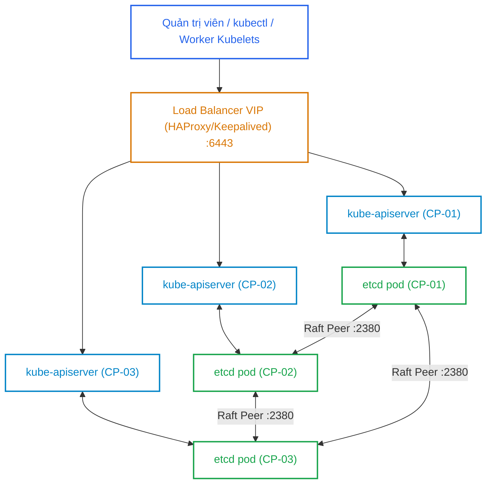
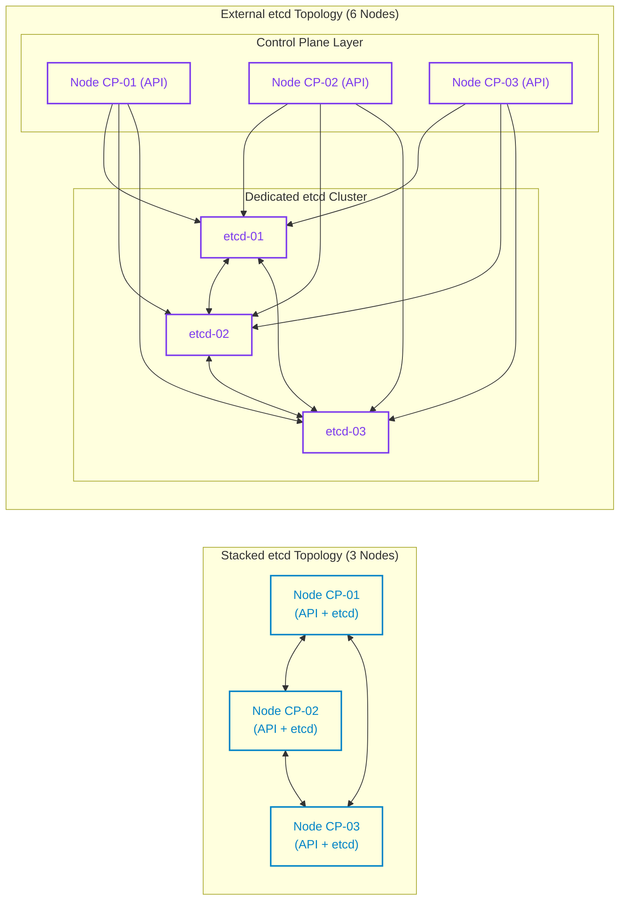
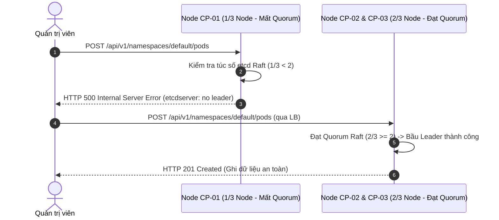
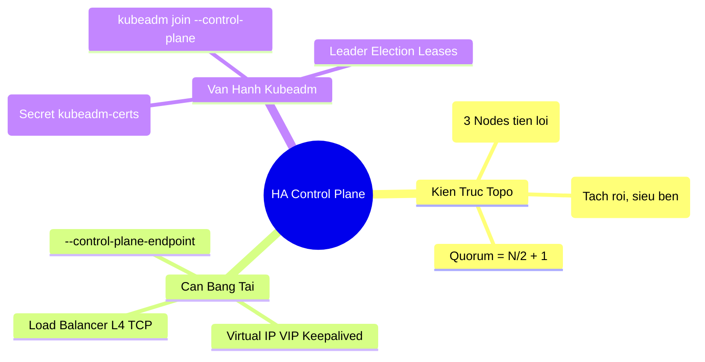


> [!IMPORTANT]
> **Mục tiêu kỹ thuật & Trọng tâm CKA**:
> - Nắm vững bản chất kiến trúc Multi-Control Plane: Stacked etcd vs External etcd.
> - Thiết lập và cấu hình Load Balancer layer 4 (TCP) cân bằng tải cho các `kube-apiserver`.
> - Thành thạo quy trình khởi tạo cụm HA với `--control-plane-endpoint` và thêm node master bằng `kubeadm join --control-plane`.
> - Kiểm tra và giám sát cơ chế Leader Election thông qua Kubernetes Leases API.
> - Xử lý các tình huống sự cố rớt Quorum etcd và lỗi chia cắt mạng (Split-brain).

---

## 1. Bản Chất Kiến Trúc & Tư Duy Cốt Lõi: High Availability Control Plane

Trong một cụm Kubernetes đơn node Control Plane (Single Master), nếu node điều khiển gặp sự cố phần cứng, toàn bộ hệ thống API Server, Controller Manager, Scheduler và etcd sẽ ngừng hoạt động. Mặc dù các Worker Node và Container đang chạy vẫn duy trì luồng dữ liệu (Data Plane), nhưng người quản trị không thể triển khai mới, tự động phục hồi hay scale ứng dụng (Control Plane bị tê liệt).

Để đạt chuẩn sẵn sàng cao (High Availability - HA), Kubernetes yêu cầu kiến trúc **Multi-Master Control Plane** với tối thiểu **3 node Control Plane**.



### 1.1. So Sánh Mô Hình Stacked etcd vs External etcd

1. **Stacked etcd Topology (Xếp chồng)**:
   - Các tiến trình `etcd` chạy dưới dạng Static Pods trực tiếp trên cùng các node Control Plane.
   - Mỗi `kube-apiserver` giao tiếp cục bộ qua `127.0.0.1:2379` với instance etcd trên cùng node.
   - **Ưu điểm**: Tiết kiệm tài nguyên hạ tầng, triển khai đơn giản qua `kubeadm`.
   - **Nhược điểm**: Rủi ro mất mát node kéo theo mất cả API Server lẫn thành viên etcd Quorum.
2. **External etcd Topology (Tách rời)**:
   - Cụm `etcd` gồm 3 hoặc 5 node chuyên dụng chạy trên các máy chủ hoàn toàn độc lập với Control Plane nodes.
   - Các `kube-apiserver` kết nối tới etcd cluster qua mạng nội bộ.
   - **Ưu điểm**: Phân tách tải I/O đĩa tối đa, rủi ro sập node Control Plane không ảnh hưởng tới etcd Quorum.
   - **Nhược điểm**: Đòi hỏi số lượng máy chủ gấp đôi (tối thiểu 3 CP nodes + 3 etcd nodes = 6 nodes), quản lý chứng chỉ PKI phức tạp hơn.



---

## 2. Bảng Ma Trận So Sánh Kỹ Thuật Toàn Diện (Engineering Matrix)

Bảng đối chiếu chuyên sâu giữa hai cấu trúc liên kết Control Plane HA:

| Tiêu Chí Kỹ Thuật | Single Master | Stacked etcd HA (3 Nodes) | External etcd HA (3 CP + 3 etcd) |
| :--- | :--- | :--- | :--- |
| **Số node tối thiểu** | 1 Node | 3 Nodes | 6 Nodes |
| **Khả năng chịu lỗi (Fault Tolerance)**| 0 Node (SPOF) | 1 Node sập (Quorum 2/3) | 1 CP sập + 1 etcd sập đồng thời |
| **Độ phức tạp vận hành** | Rất thấp | Trung bình (Kubeadm tự động) | Cao (Bảo trì 2 cụm riêng biệt) |
| **Tải Disk I/O** | Dồn chung trên 1 ổ đĩa | Chia sẻ giữa Kubelet & etcd | Đĩa chuyên dụng cao tốc cho etcd |
| **Điểm truy cập (Endpoint)** | IP trực tiếp của Master | Bắt buộc Load Balancer / VIP | Bắt buộc Load Balancer / VIP |
| **Quy trình Backup/Restore**| Đơn giản | Cần snapshot 1 node etcd | Snapshot trên external cluster |
| **Chi phí hạ tầng** | Rất thấp | Tối ưu cho Doanh nghiệp vừa | Dành cho Cụm quy mô lớn (>500 nodes) |

---

## 3. Kiến Trúc Load Balancer & Luồng Khởi Tạo Cụm HA

### 3.1. Cấu Hình HAProxy (TCP Layer 4 Load Balancing)

Tệp cấu hình `/etc/haproxy/haproxy.cfg` trên các node Load Balancer:

```haproxy
frontend k8s-apiserver
    bind *:6443
    mode tcp
    option tcplog
    default_backend k8s-apiserver-backend

backend k8s-apiserver-backend
    mode tcp
    option tcp-check
    balance roundrobin
    default-server inter 3s fall 2 rise 2 check
    server cp-01 192.168.10.11:6443 check
    server cp-02 192.168.10.12:6443 check
    server cp-03 192.168.10.13:6443 check
```

### 3.2. Cấu Hình Keepalived Virtual IP (VIP: 192.168.10.100)

Tệp cấu hình `/etc/keepalived/keepalived.conf` trên node Master LB:

```text
vrrp_script check_haproxy {
    script "killall -0 haproxy"
    interval 2
    weight 2
}

vrrp_instance VI_K8S {
    state MASTER
    interface eth0
    virtual_router_id 51
    priority 101
    advert_int 1
    authentication {
        auth_type PASS
        auth_pass Secr3tK8sHA
    }
    virtual_ipaddress {
        192.168.10.100/24
    }
    track_script {
        check_haproxy
    }
}
```

---

## 4. Phân Tích Cạm Bẫy Thực Chiến: Sự Cố Mất Quorum & Lỗi Join Master

### Tình huống 1: Quên cờ `--upload-certs` khiến `kubeadm join --control-plane` thất bại

Kỹ sư chạy `kubeadm init --control-plane-endpoint "192.168.10.100:6443"`. Khi sang node `cp-02` để join control plane thì hệ thống báo lỗi không tìm thấy chứng chỉ PKI.

### Hậu Quả & Log Lỗi Thực Tế:

```text
[check-etcd] Checking that the etcd cluster is healthy
error execution phase control-plane-prepare/certs: 
failed to get certificate authority key: couldn't load the private key file /etc/kubernetes/pki/ca.key: 
open /etc/kubernetes/pki/ca.key: no such file or directory
```

### 5-Whys Root Cause Analysis:
1. **Tại sao `cp-02` báo thiếu tệp `ca.key`?** -> Tệp chứng chỉ CA gốc chỉ nằm trên `cp-01`.
2. **Tại sao `cp-02` không tự động tải về?** -> Lệnh `kubeadm init` không có cờ `--upload-certs`.
3. **Tại sao `--upload-certs` quan trọng?** -> Nó mã hóa và tải PKI certificates tạm thời lên Secret `kubeadm-certs` trong namespace `kube-system` (tự hủy sau 2 giờ).
4. **Tại sao kỹ sư quên cờ này?** -> Dùng lệnh init mặc định của Single-Master.
5. **Giải pháp khắc phục là gì?** -> Chạy `kubeadm init phase upload-certs --upload-certs` trên `cp-01` để lấy mã `--certificate-key`, sau đó bổ sung vào lệnh join.

```bash
# Thực thi trên CP-01 để sinh Certificate Key mới:
kubeadm init phase upload-certs --upload-certs
# Output: [upload-certs] Using certificate key: 
# e62d8f80424561c1a969efd0616967be390195ec22cf294936d506045657ad56
```

---

### Tình huống 2: Cấu hình DNS Round-Robin thay vì Load Balancer thực thụ

Đội ngũ triển khai sử dụng DNS Record `k8s-api.company.local` trỏ về 3 IP của 3 Master Nodes. Khi node `cp-01` sập nguồn, 33% số request từ Kubelet và kubectl bị timeout do client cố gắng kết nối vào node đã chết.

### Hậu Quả & Log Lỗi Thực Tế:

```text
E0916 02:22:15.102391 1 memcache.go:265] couldn't get current server API group list: 
Get "https://k8s-api.company.local:6443/api?timeout=32s": dial tcp 192.168.10.11:6443: 
i/o timeout
```

> [!WARNING]
> Kubernetes API Server Client (bao gồm Kubelet, Kubectl và Controller Manager) **không tự động failover DNS** khi một IP trong bản ghi A bị chết. Bắt buộc phải sử dụng Load Balancer L4 có cơ chế Health Check (như HAProxy, NGINX Stream, AWS NLB, F5) hoặc VIP với Keepalived để lập tức loại bỏ node lỗi ra khỏi pool.

---

### Tình huống 3: Sự cố chia cắt mạng làm rớt Quorum etcd (Split-Brain Prevention)

Trong cụm 3 Control Plane, kết nối mạng giữa `cp-01` và 2 node còn lại (`cp-02`, `cp-03`) bị đứt. Phía `cp-01` chỉ còn 1 node (không đạt Quorum 2/3) nên tự động từ chối mọi thao tác ghi, bảo vệ dữ liệu cụm không bị phân mảnh.



---

## 5. Hands-on Lab: Khởi Tạo & Mở Rộng Cụm Multi-Master (8 Bước)

Bảng tổng hợp 8 bước thực hành:

| Bước | Thao Tác | Mục Tiêu Kỹ Thuật | Lệnh / Công Cụ |
| :--- | :--- | :--- | :--- |
| **1** | Cấu hình Load Balancer HAProxy | Thiết lập L4 TCP proxy cho API Server | `systemctl restart haproxy` |
| **2** | Cấu hình Keepalived Virtual IP | Tạo địa chỉ VIP 192.168.10.100 | `systemctl restart keepalived` |
| **3** | Khởi tạo Master đầu tiên (CP-01) | Init cụm với control-plane-endpoint | `kubeadm init --control-plane-endpoint` |
| **4** | Cài đặt CNI Plugin | Kích hoạt mạng Pod Flannel/Calico | `kubectl apply -f calico.yaml` |
| **5** | Trích xuất Certificate Key & Token | Chuẩn bị lệnh join cho Master tiếp theo | `kubeadm init phase upload-certs` |
| **6** | Gia nhập Node Master thứ 2 (CP-02) | Mở rộng Control Plane lên 2 node | `kubeadm join --control-plane` |
| **7** | Gia nhập Node Master thứ 3 (CP-03) | Hoàn tất Quorum 3 node etcd | `kubeadm join --control-plane` |
| **8** | Kiểm định Leader Election & Leases | Xác thực phân bổ Leader trong cụm | `kubectl get leases -n kube-system` |

---

### Bước 1 & 2: Xác nhận Load Balancer và VIP hoạt động

Trên máy chủ Load Balancer, kiểm tra trạng thái VIP:

```bash
ip addr show eth0 | grep "192.168.10.100"
```

Output:
```text
inet 192.168.10.100/24 scope global secondary eth0
```

---

### Bước 3: Khởi tạo Control Plane Node đầu tiên (CP-01)

Thực thi `kubeadm init` kèm tham số `--control-plane-endpoint` và `--upload-certs`:

```bash
sudo kubeadm init \
  --control-plane-endpoint "192.168.10.100:6443" \
  --upload-certs \
  --pod-network-cidr=10.244.0.0/16
```

Lưu lại thông báo lệnh join ở cuối output, đặc biệt là phần có cờ `--control-plane --certificate-key`.

---

### Bước 4: Thiết lập kubeconfig và cài đặt CNI

```bash
mkdir -p $HOME/.kube
sudo cp -i /etc/kubernetes/admin.conf $HOME/.kube/config
sudo chown $(id -u):$(id -g) $HOME/.kube/config

# Cài đặt Calico CNI
kubectl apply -f https://raw.githubusercontent.com/projectcalico/calico/v3.27.0/manifests/calico.yaml
```

---

### Bước 5: Sinh lại Token và Certificate Key nếu bị hết hạn

Trong trường hợp tham gia sau 2 giờ, trên `cp-01` chạy lệnh sau để sinh bộ thông số mới:

```bash
# 1. Tạo certificate-key mới
CERT_KEY=$(sudo kubeadm init phase upload-certs --upload-certs | tail -n 1)

# 2. Tạo token join mới
JOIN_CMD=$(kubeadm token create --print-join-command)

echo "$JOIN_CMD --control-plane --certificate-key $CERT_KEY"
```

---

### Bước 6 & 7: Gia nhập `cp-02` và `cp-03` vào Control Plane

Trên các node `cp-02` và `cp-03`, thực thi lệnh join vừa tạo:

```bash
sudo kubeadm join 192.168.10.100:6443 \
  --token abcdef.0123456789abcdef \
  --discovery-token-ca-cert-hash sha256:7b49f... \
  --control-plane \
  --certificate-key e62d8f80424561c1a969efd0616967be390195ec22cf294936d506045657ad56
```

---

### Bước 8: Kiểm tra trạng thái Nodes và Leader Election Leases

Quay lại `cp-01`, kiểm tra danh sách Control Plane nodes:

```bash
kubectl get nodes -l node-role.kubernetes.io/control-plane
```

Output chuẩn 3 node Master:
```text
NAME      STATUS   ROLES           AGE     VERSION
cp-01     Ready    control-plane   15m     v1.30.0
cp-02     Ready    control-plane   8m      v1.30.0
cp-03     Ready    control-plane   4m      v1.30.0
```

Kiểm tra đối tượng Leader Election Lease trong namespace `kube-system`:

```bash
kubectl get leases -n kube-system
```

Output xác nhận Leader đang nắm giữ quyền điều phối:
```text
NAME                      HOLDER   AGE
kube-controller-manager   cp-01    16m
kube-scheduler            cp-02    16m
```

---

## 6. 10 Câu Hỏi Tự Kiểm Tra Chuyên Sâu (Self-Check Q&A Accordion)

<details class="qa-card">
  <summary><b>Câu 1: Tại sao cụm etcd trong mô hình Control Plane HA luôn cần số lượng node lẻ (3, 5, 7)?</b></summary>
  <div class="qa-answer">
    <b>Trả lời:</b><br>
    etcd sử dụng thuật toán đồng thuận Raft yêu cầu đạt túc số đa số (Quorum) theo công thức <code>(N/2) + 1</code>. Một cụm 3 node chịu được 1 node sập (Quorum = 2), một cụm 4 node cũng chỉ chịu được 1 node sập (Quorum = 3) nhưng tốn thêm tài nguyên và tăng chi phí đồng bộ mạng. Do đó, số lượng lẻ là phương án tối ưu nhất về khả năng chịu lỗi và chi phí.
  </div>
</details>

<details class="qa-card">
  <summary><b>Câu 2: Tham số --control-plane-endpoint trong lệnh kubeadm init có vai trò gì?</b></summary>
  <div class="qa-answer">
    <b>Trả lời:</b><br>
    Tham số này xác định địa chỉ IP/DNS duy nhất và cổng của Load Balancer đứng trước toàn bộ cụm Control Plane. Địa chỉ này được nhúng trực tiếp vào chứng chỉ PKI (SANs) và các tệp cấu hình Kubeconfig của toàn bộ Worker Nodes và Master Nodes để đảm bảo liên lạc không bị phụ thuộc vào một IP Master đơn lẻ.
  </div>
</details>

<details class="qa-card">
  <summary><b>Câu 3: Cơ chế hoạt động của kube-scheduler và kube-controller-manager trong mô hình Multi-Master là Active-Active hay Active-Passive?</b></summary>
  <div class="qa-answer">
    <b>Trả lời:</b><br>
    Cả hai thành phần này hoạt động theo mô hình <b>Active-Passive (Lead-Follower)</b> thông qua cơ chế <b>Leader Election</b> (sử dụng tài nguyên <code>Lease</code> trong namespace <code>kube-system</code>). Tại một thời điểm chỉ có 1 instance thực thi điều phối/lập lịch để tránh xung đột quyết định, các instance còn lại ở chế độ Standby sẵn sàng tiếp quản khi Leader gặp sự cố.
  </div>
</details>

<details class="qa-card">
  <summary><b>Câu 4: Cờ --upload-certs trong kubeadm init thực hiện nhiệm vụ gì?</b></summary>
  <div class="qa-answer">
    <b>Trả lời:</b><br>
    Cờ này mã hóa toàn bộ chứng chỉ và khóa của Control Plane (như <code>ca.key</code>, <code>etcd/ca.key</code>, <code>sa.key</code>) bằng một khóa bí mật (Certificate Key) và tải lên lưu tạm trong đối tượng Secret <code>kubeadm-certs</code> tại namespace <code>kube-system</code>. Secret này tự động bị xóa sau 2 giờ để đảm bảo an toàn.
  </div>
</details>

<details class="qa-card">
  <summary><b>Câu 5: Khi một node Control Plane trong mô hình Stacked etcd 3 node bị hỏng vĩnh viễn, các bước khôi phục chuẩn là gì?</b></summary>
  <div class="qa-answer">
    <b>Trả lời:</b><br>
    <ul>
      <li>1. Sử dụng <code>etcdctl member remove &lt;member-id&gt;</code> để xóa node lỗi ra khỏi Quorum etcd.</li>
      <li>2. Xóa node khỏi Kubernetes API bằng <code>kubectl delete node &lt;node-name&gt;</code>.</li>
      <li>3. Chuẩn bị node mới, tạo certificate key mới bằng <code>kubeadm init phase upload-certs --upload-certs</code>.</li>
      <li>4. Thực thi <code>kubeadm join --control-plane</code> từ node mới để gia nhập lại cụm.</li>
    </ul>
  </div>
</details>

<details class="qa-card">
  <summary><b>Câu 6: Tại sao không nên cấu hình kube-apiserver theo mô hình Active-Passive?</b></summary>
  <div class="qa-answer">
    <b>Trả lời:</b><br>
    <code>kube-apiserver</code> là dịch vụ <b>Stateless (Không lưu trạng thái)</b>. Toàn bộ trạng thái của cụm được lưu trữ trong etcd. Do đó, tất cả các instance của API Server có thể và nên hoạt động đồng thời theo mô hình <b>Active-Active</b> đằng sau Load Balancer để chia tải và phản hồi song song.
  </div>
</details>

<details class="qa-card">
  <summary><b>Câu 7: Cần mở những cổng mạng (Firewall Ports) nào giữa các node Control Plane trong mô hình Stacked HA?</b></summary>
  <div class="qa-answer">
    <b>Trả lời:</b><br>
    <ul>
      <li><b>6443:</b> Kubernetes API Server</li>
      <li><b>2379-2380:</b> etcd server client API &amp; etcd peer communication</li>
      <li><b>10250:</b> Kubelet API</li>
      <li><b>10259:</b> kube-scheduler</li>
      <li><b>10257:</b> kube-controller-manager</li>
    </ul>
  </div>
</details>

<details class="qa-card">
  <summary><b>Câu 8: Đối tượng API nào trong Kubernetes quản lý việc chuyển giao Leader khi Controller Manager chính bị crash?</b></summary>
  <div class="qa-answer">
    <b>Trả lời:</b><br>
    Đối tượng <b>Lease</b> thuộc API Group <code>coordination.k8s.io/v1</code> nằm trong namespace <code>kube-system</code>. Leader định kỳ cập nhật trường <code>renewTime</code>. Nếu sau khoảng thời gian gia hạn (thường là 15 giây) không nhận được heartbeat, một instance khác sẽ cạnh tranh quyền và cập nhật trường <code>holderIdentity</code> để trở thành Leader mới.
  </div>
</details>

<details class="qa-card">
  <summary><b>Câu 9: Điểm khác biệt giữa HAProxy Layer 4 (TCP Mode) và Layer 7 (HTTP Mode) khi làm Load Balancer cho API Server là gì?</b></summary>
  <div class="qa-answer">
    <b>Trả lời:</b><br>
    <ul>
      <li><b>Layer 4 (TCP):</b> Chuyển tiếp trực tiếp gói tin TLS mã hóa nguyên vẹn đến API Server mà không cần giải mã SSL trên Load Balancer. Đây là cấu hình chuẩn bắt buộc để duy trì xác thực mTLS và Client Certificate.</li>
      <li><b>Layer 7 (HTTP):</b> Cần giải mã SSL Termination trên Load Balancer, làm phức tạp việc xác thực mTLS giữa Kubelet/Client và API Server.</li>
    </ul>
  </div>
</details>

<details class="qa-card">
  <summary><b>Câu 10: Nếu cụm 3 node Stacked etcd bị sập 2 node cùng lúc, cụm có còn ghi được dữ liệu mới không và cách khắc phục khẩn cấp là gì?</b></summary>
  <div class="qa-answer">
    <b>Trả lời:</b><br>
    Cụm <b>KHÔNG</b> thể ghi dữ liệu mới vì chỉ còn 1/3 node (mất Quorum 2/3). Để khắc phục khẩn cấp, quản trị viên phải can thiệp trực tiếp vào node còn sống duy nhất, chỉnh sửa cấu hình etcd bằng cờ <code>--force-new-cluster</code> để tái lập Quorum 1 node từ dữ liệu hiện tại, sau đó mới tiến hành join thêm các node mới.
  </div>
</details>

---

## 7. Tổng Kết & Lộ Trình Bài Học Tiếp Theo



Kiến trúc High Availability Control Plane là xương sống bảo đảm tính liên tục của hệ thống Kubernetes trước các sự cố phần cứng bất ngờ trong môi trường sản xuất.

> [!TIP]
> **Bài học tiếp theo**: Trong [Bài 13: Đóng Gói Ứng Dụng với Helm & Kustomize: So Sánh & Thực Chiến Triển Khai](cka-13-13-helm-va-kustomize.html), chúng ta sẽ phân tích chuyên sâu hai công cụ quản lý cấu hình và đóng gói ứng dụng phổ biến nhất trên Kubernetes, phương pháp viết Helm Chart chuẩn production và kỹ thuật Overlay trong Kustomize.

