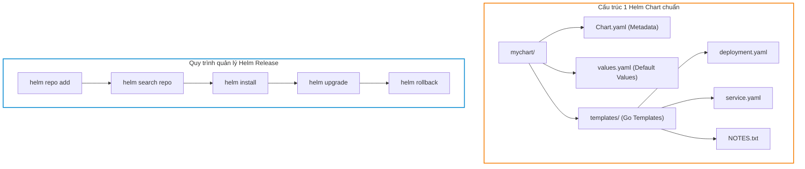
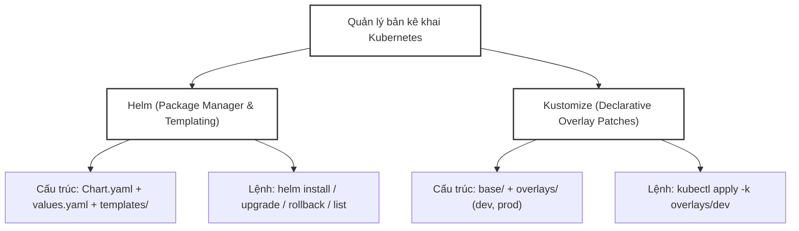
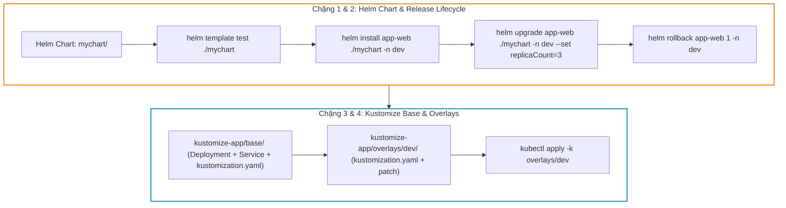


# [BÀI 13] QUẢN LÝ BẢN KÊ KHAI HẠ TẦNG: HELM PACKAGE MANAGER VS KUSTOMIZE OVERLAY ARCHITECTURE

Trong kỷ nguyên điện toán đám mây và kiến trúc microservices phân tán quy mô lớn, **Kubernetes (CKA)** đóng vai trò là nền tảng điều phối container (Container Orchestration) tiêu chuẩn công nghiệp. Để làm chủ hệ thống trong môi trường sản xuất (Production) cũng như chinh phục kỳ thi chứng chỉ quốc tế của Linux Foundation / CNCF, kỹ sư không chỉ nắm vững các câu lệnh thao tác cơ bản mà phải thấu hiểu sâu sắc bản chất cơ chế tầng thấp: từ chu trình điều hòa (Reconciliation Loop), cấu trúc điều phối tài nguyên, kiến trúc mạng CNI, lưu trữ CSI cho đến các chuẩn mực an ninh phòng thủ chiều sâu.

Bài viết chuyên sâu này sẽ đồng hành cùng bạn giải mã toàn diện bức tranh kiến trúc, phân tích các đánh đổi kỹ thuật thực chiến (Engineering Trade-offs), cung cấp bài thực hành Lab từng bước và bộ câu hỏi phỏng vấn chuẩn Architect / Lead Engineer.

---

## 1. Bản Chất Kiến Trúc & Cơ Chế Vận Hành Tầng Thấp

| # | Câu hỏi ôn tập | Đáp án chuẩn ngắn gọn (chứa con số / tên lệnh) |
|---|---|---|
| 1 | Số lượng node Control Plane tối thiểu và nguyên tắc Quorum etcd là gì? | Bắt buộc số lẻ tối thiểu **3** node, Quorum = `(N/2) + 1` = **2** |
| 2 | Trạng thái hoạt động của API Server vs Scheduler/Controller Manager? | API Server Active-Active (song song); Scheduler/Controller Active-Passive qua `--leader-elect=true` (**1** Leader duy nhất) |
| 3 | Cờ bắt buộc truyền lúc `kubeadm init` để khai báo Load Balancer VIP? | `--control-plane-endpoint="<VIP>:6443"` |
| 4 | Hai cờ bắt buộc khi gia nhập node Control Plane mới là gì? | `kubeadm join <VIP>:6443 ... --control-plane --certificate-key <key>` |
| 5 | Hai mô hình kiến trúc etcd chính là gì? | Stacked etcd topology (static pod cùng node CP) và External etcd topology (máy riêng) |


> **Luận đề trung tâm của buổi:**
> *"Helm là trình quản lý gói (Package Manager) dựa trên mẫu Go template để đóng gói, cài đặt và nâng cấp ứng dụng phức tạp qua một dòng lệnh; trong khi Kustomize là công cụ tùy biến bản kê khai khai báo (Declarative Manifest Customization) không dùng template, tích hợp sẵn vào `kubectl -k` dựa trên mô hình Base và Overlays để phân tách cấu hình giữa các môi trường Dev, Staging, Prod mà không vi phạm nguyên tắc DRY."*

**Bảng kết quả các buổi trước được dùng lại:**

| Kết quả / Công cụ | Nguồn gốc | Áp dụng vào buổi này |
|---|---|---|
| Lệnh tạo YAML nhanh `--dry-run=client -o yaml` | Buổi 04 `QT 5.1` | Tạo nhanh bản kê khai mẫu làm file nguồn cho Helm template và Kustomize base |
| Cụm `kubeadm` 3 node hoạt động ở v1.35 | Buổi 06 `QT 4.1` | Môi trường thực hành cài đặt Helm charts và apply Kustomize overlays |
| Khái niệm Namespace và cô lập môi trường | Buổi 03 `QT 4.1` | Phân tách release Helm và overlay Kustomize theo Namespace |

Ba câu bài tập về nhà BTVN 4 của buổi 12 đã chuẩn bị sẵn kiến thức cho học viên: Câu 1 phân tích triết lý quản lý gói của Helm; Câu 2 khảo sát cấu trúc một Helm Chart chuẩn (`Chart.yaml`, `values.yaml`, `templates/`); Câu 3 tìm hiểu mô hình Base & Overlays trong Kustomize tích hợp `kubectl -k`.

---


| # | Năng lực đạt được sau buổi học | Hiện vật chứng minh trong bài lab |
|---|---|---|
| 1 | Khởi tạo cấu trúc Helm Chart chuẩn và viết file `values.yaml` | Thư mục `hien-vat/mychart/` |
| 2 | Biên dịch thử tệp YAML ra terminal bằng `helm template` | Tệp log `hien-vat/rendered-helm.yaml` |
| 3 | Cài đặt, nâng cấp và rollback Helm Release bằng Helm CLI v3 | Tệp log `hien-vat/helm-history.txt` |
| 4 | Xây dựng cấu trúc Kustomize với `base/` và `overlays/dev/`, `overlays/prod/` | Thư mục `hien-vat/kustomize-app/` |
| 5 | Áp dụng Kustomize overlays bằng `kubectl apply -k` | Kết quả `kubectl get deployments -n dev` |
| 6 | Sử dụng `configMapGenerator` kích hoạt tự động Pod Rolling Update | Script `hien-vat/verify-manifest-mgmt.sh` |

---


| Bắt buộc phải biết | Nguồn tự học nếu thiếu |
|---|---|
| Cấu trúc tệp YAML Kubernetes (Deployment, Service, ConfigMap) | Buổi 03 `QT 4.1` |
| Kỹ thuật tạo YAML imperative với cờ `--dry-run=client -o yaml` | Buổi 04 `QT 5.1` |
| Khái niệm Namespace và phân tách môi trường | Buổi 03 `QT 4.1` |

---


| # | Thuật ngữ tiếng Việt | Tiếng Anh tương đương | Ghi chú chuẩn hoá trong thân bài |
|---|---|---|---|
| 1 | Trình quản lý gói Kubernetes | Helm Package Manager | Công cụ quản lý gói ứng dụng mặc định cho Kubernetes |
| 2 | Biểu đồ gói Helm | Helm Chart | Gói đóng gói các bản kê khai Kubernetes kèm template |
| 3 | Tệp giá trị cấu hình | Values File (`values.yaml`) | Tệp chứa các tham số đầu vào để nạp vào Helm template |
| 4 | Bản cài đặt thực thi | Helm Release | Một bản thể ứng dụng được cài đặt vào cụm qua Helm |
| 5 | Kho lưu trữ biểu đồ | Helm Repository (`helm repo`) | Kho chứa các gói Helm Chart đã được đóng gói |
| 6 | Quay lui phiên bản gói | Helm Rollback (`helm rollback`) | Lệnh khôi phục ứng dụng về một phiên bản Release cũ |
| 7 | Xem trước tệp biên dịch | Helm Template Render (`helm template`) | Lệnh kiểm tra output YAML sinh ra từ Helm template |
| 8 | Công cụ tùy biến khai báo | Kustomize | Công cụ tùy biến bản kê khai không dùng template |
| 9 | Cấu hình nền tảng | Kustomize Base | Bộ tệp YAML chuẩn dùng chung cho tất cả môi trường |
| 10 | Cấu hình đè môi trường | Kustomize Overlay | Bộ tệp vá (patches) chứa thay đổi riêng cho từng môi trường |
| 11 | Tệp khai báo Kustomize | Kustomization File (`kustomization.yaml`) | Tệp điều phối các tài nguyên và patch trong Kustomize |
| 12 | Trình sinh ConfigMap/Secret | ConfigMapGenerator / SecretGenerator | Tính năng tự động tạo ConfigMap/Secret kèm hash chuỗi |
| 13 | Tiền tố tên đối tượng | Name Prefix (`namePrefix`) | Thuộc tính thêm tiền tố tên cho toàn bộ tài nguyên |
| 14 | Nhãn chung môi trường | Common Labels (`commonLabels`) | Thuộc tính tự động gán nhãn cho tất cả đối tượng |


1. **Mô hình "Nồi cơm điện đa năng vs Khuôn đúc định hình (Helm vs Kustomize)":**
   Helm giống như một Nồi cơm điện đa năng: bạn chỉ cần chọn chế độ và truyền các nguyên liệu (`values.yaml`), nồi sẽ tự động biến đổi và nấu ra món ăn (`templates/`). Kustomize giống như một Khuôn đúc định hình: bạn lấy khối bột tiêu chuẩn (`Base`), rồi dán thêm các mảnh khuôn phụ (`Overlays`) lên trên để đúc ra sản phẩm tùy chỉnh cho môi trường Dev hoặc Prod.

2. **Mô hình "Máy tua lại cuốn băng video (Helm Rollback)":**
   Helm quản lý lịch sử các bản ghi Release theo từng revision (v1, v2, v3). Khi một bản nâng cấp v3 bị lỗi crash loop, `helm rollback <release> 2` giống như việc ấn nút tua lại băng video về đúng thời điểm v2 đang chạy ổn định.

3. **Mô hình "Dấu vân tay chống đệm cache (Kustomize Hash Generator)":**
   Khi Kustomize sinh ConfigMap qua `configMapGenerator`, nó tự động thêm chuỗi hash (như `app-config-g8h7f9d2`) vào tên ConfigMap. Khi tệp cấu hình thay đổi, hash đổi theo, làm Pod tự động kích hoạt tạo lại container mà không lo bị kẹt cache cấu hình cũ.

---

### 1.1. Tổng quan bài toán quản lý bản kê khai và hai hướng tiếp cận (12 phút)

**Nguyên lý cốt lõi:** Helm sử dụng triết lý Templating (mẫu Go template) để biến đổi các tham số đầu vào trong `values.yaml` thành các bản kê khai YAML; trong khi Kustomize sử dụng triết lý Overlay Patches (đè trực tiếp cấu hình) trên các bản kê khai YAML thuần mà không dùng bất kỳ cú pháp template nào.

**Giải thích cơ chế ngầm:** Helm phù hợp cho việc đóng gói và chia sẻ ứng dụng cho cộng đồng (như cài Nginx Ingress Controller qua `helm install`). Kustomize phù hợp cho việc quản lý mã nguồn nội bộ công ty (In-house microservices) để tránh biến các tệp YAML thành "rừng template" khó đọc.

> [!WARNING]
> **CẠM BẪY THỰC CHIẾN:**
> Cố gắng viết cú pháp template Go `{{ .Values.name }}` vào tệp YAML Kustomize hoặc lạm dụng Helm cho các thay đổi nhỏ lẻ giữa môi trường Dev/Prod.

**Minh hoạ.**

```bash
# Kiểm tra phiên bản Helm CLI (Helm v3 không cần Tiller)
helm version
```

Con số chốt: **2** triết lý quản lý bản kê khai chính trong Kubernetes (`Templating` với Helm và `Overlay` với Kustomize).

---

**Nguyên lý cốt lõi:** Từ phiên bản Helm v3, Tiller (thành phần server-side cấp quyền admin kiểu cũ) đã bị XOÁ BỎ hoàn toàn; Helm CLI trực tiếp giao tiếp với Kubernetes API Server qua quyền hạn của tệp Kubeconfig hiện tại.

**Giải thích cơ chế ngầm:** Helm v2 có lỗ hổng bảo mật nghiêm trọng do Tiller chạy quyền `cluster-admin` trong cụm. Helm v3 chuyển sang kiến trúc client-only an toàn và tuân thủ nghiêm ngặt RBAC của người dùng đang gõ lệnh.

> [!WARNING]
> **CẠM BẪY THỰC CHIẾN:**
> Tìm kiếm Pod `tiller-deploy` trên cụm Kubernetes v1.35 và thắc mắc tại sao không thấy Tiller.

**Minh hoạ.**

```bash
# Kiểm tra danh sách các Release đang cài đặt trong Namespace default
helm list -n default
```

Con số chốt: **0** thành phần server-side Tiller tồn tại trong kiến trúc Helm v3.

---

### 1.2. Kiến trúc Helm v3, cấu trúc Chart và các lệnh quản lý Release (12 phút)



---

**Nguyên lý cốt lõi:** Cấu trúc của một Helm Chart chuẩn bắt buộc chứa đúng **3 phần tử tối thiểu**: tệp `Chart.yaml` (chứa thông tin tên, phiên bản chart), tệp `values.yaml` (chứa các giá trị cấu hình mặc định), và thư mục `templates/` (chứa các tệp mẫu Go template).

**Giải thích cơ chế ngầm:** Helm CLI dựa vào 3 phần tử này để kiểm tra tính hợp lệ của gói và thực hiện biên dịch thành các tài nguyên Kubernetes API.

> [!WARNING]
> **CẠM BẪY THỰC CHIẾN:**
> Tạo thư mục Helm Chart nhưng quên tệp `Chart.yaml` làm lệnh `helm install` báo lỗi `error: Chart.yaml file is missing`.

**Minh hoạ.**

```bash
# Tạo cấu trúc Chart mới bằng lệnh helm create
helm create mychart
```

Con số chốt: **3** phần tử tối thiểu trong một Helm Chart (`Chart.yaml`, `values.yaml`, `templates/`).

---

**Nguyên lý cốt lõi:** Sử dụng lệnh `helm rollback <release-name> <revision-number>` để khôi phục ứng dụng ngay lập tức về một phiên bản Release cũ khi bản nâng cấp mới bị lỗi.

**Giải thích cơ chế ngầm:** Helm lưu giữ toàn bộ lịch sử các lần nâng cấp (Revisions) dưới dạng Secret trong Namespace. Lệnh rollback giúp hạ thời gian phục hồi dịch vụ (MTTR) xuống chỉ còn vài giây.

> [!WARNING]
> **CẠM BẪY THỰC CHIẾN:**
> Mỗi khi bản update bị lỗi lại cuống cuồng tìm file YAML cũ để apply thủ công thay vì gõ `helm rollback`.

**Minh hoạ.**

```bash
# Xem lịch sử các phiên bản Release và rollback về revision 1
helm history my-web -n dev
helm rollback my-web 1 -n dev
```

Con số chốt: **1** câu lệnh `helm rollback` duy nhất để khôi phục phiên bản an toàn.

---

**Nguyên lý cốt lõi:** Khi chạy lệnh `helm install` hoặc `helm upgrade`, nếu không chỉ định cờ `-n <namespace>`, Helm sẽ cài đặt Release vào Namespace `default`; do đó luôn truyền cờ `-n <namespace> --create-namespace` để đảm bảo phân vùng môi trường chính xác.

**Giải thích cơ chế ngầm:** Định vị Namespace giúp quản lý tài nguyên gọn gàng và tránh đè trùng tên Release trên cùng một cụm.

> [!WARNING]
> **CẠM BẪY THỰC CHIẾN:**
> Cài đặt Release mà không truyền `-n dev` làm ứng dụng bị đẩy vào Namespace `default`.

**Minh hoạ.**

```bash
# Cài đặt Release app-web vào namespace dev và tự tạo namespace nếu chưa có
helm install app-web ./mychart -n dev --create-namespace
```

Con số chốt: **1** cờ `--create-namespace` giúp tự động tạo Namespace thiếu lúc cài đặt.

---

### 1.3. Cú pháp template Helm (Go templates, `.Values`, `.Release`) (10 phút)

**Nguyên lý cốt lõi:** Cú pháp template Helm truy cập các tham số cấu hình qua đối tượng root dấu chấm: `.Values.<key>` (lấy từ values.yaml), `.Release.Name` (lấy tên release), `.Chart.Name` (lấy tên chart), và `.Capabilities` (lấy thông tin cụm K8s).

**Giải thích cơ chế ngầm:** Đảm bảo tính linh hoạt khi tái sử dụng Chart. Người dùng chỉ cần truyền file `my-values.yaml` đè lên mà không cần sửa trực tiếp tệp mẫu trong `templates/`.

> [!WARNING]
> **CẠM BẪY THỰC CHIẾN:**
> Viết hoa chữ cái đầu hoặc gõ thiếu dấu chấm `.Values` làm template biên dịch ra chuỗi `<nil>`.

**Minh hoạ.**

```yaml
# Ví dụ đoạn template trong templates/deployment.yaml
metadata:
  name: {{ .Release.Name }}-deploy
spec:
  replicas: {{ .Values.replicaCount }}
```

Con số chốt: **1** dấu chấm `.` mở đầu là bắt buộc trong cú pháp biến Helm template.

---

**Nguyên lý cốt lõi:** Sử dụng lệnh `helm template <release-name> <chart-dir> -f <values-file>` để kiểm tra biên dịch (Render Dry-run) toàn bộ tệp YAML sinh ra ra màn hình terminal trước khi áp dụng lên cụm thật.

**Giải thích cơ chế ngầm:** Giúp phát hiện sớm các lỗi cú pháp Go template, trỏ sai biến `.Values`, hoặc sai thụt lùi YAML mà không làm ảnh hưởng tới trạng thái cụm đang chạy.

> [!WARNING]
> **CẠM BẪY THỰC CHIẾN:**
> Chạy `helm install` trực tiếp mà không test `helm template` trước, làm cụm bị dính Release ở trạng thái `FAILED`.

**Minh hoạ.**

```bash
# Kiểm tra output YAML biên dịch ra terminal
helm template my-release ./mychart -f values-dev.yaml
```

Con số chốt: **0** tài nguyên nào bị tạo trên cụm khi chạy lệnh `helm template`.

---

### 1.4. Kiến trúc Kustomize (Base, Overlays, `kubectl -k`) (4 phút)

**Nguyên lý cốt lõi:** Kustomize được tích hợp trực tiếp vào `kubectl` thông qua cờ `-k`; cấu trúc dự án Kustomize chuẩn bắt buộc phân chia thành thư mục `base/` (chứa tài nguyên gốc) và các thư mục `overlays/<env>/` (chứa `kustomization.yaml` để vá và đè cấu hình cho từng môi trường).

**Giải thích cơ chế ngầm:** Giúp áp dụng nguyên tắc DRY (Don't Repeat Yourself). Thư mục `base/` chứa 90% cấu hình dùng chung, còn `overlays/dev` và `overlays/prod` chỉ chứa 10% các thay đổi riêng (như replica, image tag, resource limit).

> [!WARNING]
> **CẠM BẪY THỰC CHIẾN:**
> Nhân bản toàn bộ tệp Deployment ra 3 thư mục dev, staging, prod rồi sửa thủ công từng file.

**Minh hoạ.**

```bash
# Chạy Kustomize trực tiếp bằng kubectl apply -k
kubectl apply -k overlays/dev
```

Con số chốt: **2** cấp thư mục chuẩn trong mô hình Kustomize (`base/` và `overlays/`).

---

**Nguyên lý cốt lõi:** Tính năng `configMapGenerator` và `secretGenerator` trong `kustomization.yaml` tự động sinh ra ConfigMap/Secret kèm chuỗi hash ngẫu nhiên ở cuối tên; giúp kích hoạt Pod tự động khởi động lại (Rolling Update) khi nội dung cấu hình thay đổi.

**Giải thích cơ chế ngầm:** Mặc định khi sửa ConfigMap thuần, Pod đang chạy không tự động đọc lại cấu hình mới. Việc đổi tên ConfigMap qua chuỗi hash làm Pod spec thay đổi, buộc Deployment khởi tạo Pod mới mang cấu hình cập nhật.

> [!WARNING]
> **CẠM BẪY THỰC CHIẾN:**
> Sửa ConfigMap nhưng thắc mắc tại sao ứng dụng trong Pod vẫn dùng cấu hình cũ cho tới khi restart Pod thủ công.

**Minh hoạ.**

```yaml
# Ví dụ tệp kustomization.yaml
configMapGenerator:
- name: app-config
  files:
  - config.properties
```

Con số chốt: **100%** các Pod thuộc Deployment được tự động làm mới khi `configMapGenerator` đổi hash.

---

## 8. Đưa vào cụm thật (4 phút)

### Áp vào cụm đang chạy thì làm gì trước

1. **Dùng `helm template` và `kubectl kustomize` kiểm tra trước khi apply:** Luôn render tệp YAML ra terminal để soát lỗi syntax.
2. **Kiểm tra trạng thái Release bằng `helm list -A`:** Đảm bảo không có Release nào bị kẹt ở trạng thái `PENDING_INSTALL` hoặc `FAILED`.
3. **Phân vùng Namespace rõ ràng:** Luôn truyền cờ `-n <namespace>` khi chạy `helm install` hoặc khai báo `namespace` trong `kustomization.yaml`.

### Cái gì hỏng nếu áp thẳng lên prod

- **Chạy `helm upgrade` với file `values.yaml` thiếu các cờ cấu hình quan trọng:** Làm ghi đè mất cấu hình prod (dùng cờ `--reuse-values` nếu chỉ muốn đè 1 số biến).
- **Áp dụng Kustomize overlay `prod` nhầm vào Namespace `dev`:** Làm đè cấu hình sản xuất lên môi trường thử nghiệm.
- **Quy trình áp thử an toàn:**
  - Chạy `helm diff upgrade` hoặc `kubectl diff -k overlays/prod` để xem chính xác những dòng nào thay đổi trước khi apply.
  - Chạy `kubectl apply -k overlays/dev` trên môi trường dev trước.

### Đo trước — đo sau

1. **Thời gian triển khai ứng dụng phức tạp:** Giảm từ 30 phút gõ từng file YAML xuống < 10 giây bằng 1 lệnh `helm install`.
2. **Lịch sử phiên bản:** `helm history <release>` hiển thị rõ ràng người sửa, thời gian và revision.
3. **Mức độ trùng lặp mã:** Giảm 80% dung lượng tệp YAML nhờ mô hình Kustomize Base & Overlays.

### Khi nào KHÔNG nên dùng

- **Không viết Helm Chart phức tạp cho ứng dụng đơn giản chỉ có 1 Pod duy nhất:** Việc này gây lãng phí thời gian bảo trì template.
- **Không lạm dụng Kustomize patches quá sâu làm rối cấu hình gốc:** Nếu file patch quá dài và đè hết 90% nội dung base, nên tách ra thành dự án độc lập.

---

### 1.6. Bẫy hay gặp (2 phút)

| # | Bẫy hay gặp | Vì sao dính bẫy | Làm đúng là (kèm tên lệnh / con số) |
|---|---|---|---|
| 1 | Cố gõ lệnh `helm init` để tìm Tiller | Helm v3 đã xoá bỏ Tiller hoàn toàn | Không cần gõ `helm init`, dùng Helm CLI trực tiếp |
| 2 | Quên cờ `-k` khi chạy `kubectl apply` với Kustomize | Gõ `kubectl apply -f overlays/dev` gây lỗi | Bắt buộc gõ đúng `kubectl apply -k overlays/dev` |
| 3 | Thiếu dấu chấm mở đầu `.Values` trong Helm template | Viết `{{ Values.replicaCount }}` gây lỗi render | Viết đúng cú pháp `{{ .Values.replicaCount }}` |
| 4 | Quên tệp `Chart.yaml` khi tự tạo Helm Chart | Helm không nhận diện được đây là một Chart | Bắt buộc phải có tệp `Chart.yaml` tối thiểu |
| 5 | Gõ sai tên cờ `--reuse-values` khi `helm upgrade` | `helm upgrade` mặc định xoá các giá trị cũ không có trong file mới | Truyền cờ `--reuse-values` khi muốn giữ nguyên giá trị cũ |
| 6 | Thắc mắc vì sao ConfigMap của Kustomize có đuôi hash lạ | `configMapGenerator` tự động thêm hash để trigger rollout | Giữ nguyên tên hash để kích hoạt tự động cập nhật Pod |
| 7 | Không chỉ định Namespace khi `helm install` | Release bị cài nhầm vào Namespace `default` | Luôn truyền cờ `-n <namespace> --create-namespace` |
| 8 | Quên cờ `resources` trong tệp `kustomization.yaml` | Kustomize không load các file YAML trong thư mục | Khai báo đủ danh sách file YAML dưới mục `resources:` |
| 9 | Nhầm lẫn giữa `helm search repo` và `helm search hub` | `search repo` tìm local repo; `search hub` tìm trên ArtifactHub | Dùng `helm repo add` trước khi gõ `helm search repo` |
| 10 | Rollback nhầm phiên bản với `helm rollback` | Không kiểm tra lịch sử với `helm history` trước | Chạy `helm history <release>` xác định đúng revision number |
| 11 | Không test `helm template` trước khi cài | Chart bị lỗi syntax YAML làm Release dính FAILED | Chạy `helm template` render kiểm tra YAML trước |
| 12 | Sửa trực tiếp file trong thư mục `base/` thay vì dùng `overlays/` | Làm hỏng cấu hình gốc của các môi trường khác | Chỉ sửa file patch trong `overlays/<env>/` |

---

## §10. Tóm tắt (2 phút)



### Năm điều phải nhớ

1. **Hai triết lý:** Helm dùng Templating Go (`.Values`); Kustomize dùng Overlay Patches (`base/` + `overlays/`).
2. **Helm v3 Tillerless:** 0% Tiller server-side; Helm CLI trực tiếp gọi API Server qua Kubeconfig và RBAC.
3. **Bộ 3 Helm Chart:** Tối thiểu chứa `Chart.yaml`, `values.yaml`, và thư mục `templates/`.
4. **Lệnh cứu nguy Helm:** `helm rollback <release> <revision>` hạ thời gian phục hồi dịch vụ xuống vài giây.
5. **Kustomize tích hợp `kubectl`:** Chạy trực tiếp bằng `kubectl apply -k <dir>`; tính năng `configMapGenerator` tự động đổi hash trigger Pod rollout.

---

## §11. Câu hỏi tự kiểm tra

1. Phân biệt sự khác nhau về triết lý giữa Helm (Templating) và Kustomize (Overlay Patches).
2. Tiller trong kiến trúc Helm v2 có vai trò gì và tại sao bị xóa bỏ hoàn toàn ở Helm v3?
3. Trình bày 3 phần tử tối thiểu bắt buộc phải có trong thư mục của một Helm Chart chuẩn.
4. Lệnh nào giúp kiểm tra danh sách toàn bộ các Helm Release đang được cài đặt trong một Namespace?
5. Lệnh nào được sử dụng để khôi phục ứng dụng về một phiên bản Release cũ khi bản nâng cấp bị lỗi?
6. Cú pháp nào được dùng trong tệp Helm template để lấy giá trị từ tệp `values.yaml`?
7. Lệnh `helm template` mang lại lợi ích gì trong quy trình phát triển Helm Chart?
8. Kustomize được tích hợp vào `kubectl` thông qua cờ nào và làm sao để áp dụng cấu hình Kustomize?
9. Mô hình cấu trúc thư mục tiêu chuẩn của một dự án Kustomize gồm 2 cấp thư mục nào?
10. Tính năng `configMapGenerator` trong Kustomize mang lại giá trị gì cho việc cập nhật cấu hình của Pod?
11. Hai chế độ hỏng (1 im lặng do dính FAILED release vì không test helm template, 1 âm thầm do quên cờ -k khi apply Kustomize) là gì?
12. Cờ `--reuse-values` trong lệnh `helm upgrade` có tác dụng gì?

### Đáp án

1. Helm dùng Go template đè biến từ values.yaml; Kustomize đè cấu hình qua patches trên YAML thuần không dùng template.
2. Tiller là server-side component ở v2; bị xóa bỏ ở v3 do lỗ hổng bảo mật cấp cluster-admin thừa thải.
3. 3 phần tử: `Chart.yaml`, `values.yaml`, và thư mục `templates/`.
4. Lệnh `helm list -n <namespace>`.
5. Lệnh `helm rollback <release-name> <revision-number>`.
6. Cú pháp `{{ .Values.<key> }}`.
7. Render toàn bộ tệp YAML ra terminal để kiểm tra syntax dry-run trước khi apply lên cụm.
8. Tích hợp qua cờ `-k`; áp dụng bằng lệnh `kubectl apply -k <directory>`.
9. 2 cấp thư mục: `base/` (cấu hình chung) và `overlays/<env>/` (vá cấu hình môi trường).
10. Tự động thêm chuỗi hash vào tên ConfigMap, kích hoạt Deployment làm mới Pod tự động khi cấu hình thay đổi.
11. Chế độ 1: Cài trực tiếp bị dính FAILED release do sai syntax YAML; Chế độ 2: Gõ `kubectl apply -f` thay vì `-k` làm Kustomize không load được file.
12. Giữ nguyên tất cả các giá trị cấu hình cũ đã set ở phiên bản trước, chỉ đè những giá trị được chỉ định mới.

---

## §12. Tài liệu tham khảo

| Nguồn tài liệu | Phiên bản Kubernetes áp dụng | Nội dung chính |
|---|---|---|
| Official Helm Docs: Helm Architecture & Charts | Helm v3.16+ | Cấu trúc Chart, cú pháp Go template và các lệnh Helm CLI |
| Official Kubernetes Docs: Declarative Management with Kustomize | Kubernetes v1.35 | Cấu hình Base & Overlays, kustomization.yaml và kubectl -k |
| File cấu hình phiên bản cục bộ | `labs/phien-ban.env` | Biến `K8S_VER=1.35`, `LAB_CONTEXT="kubeadm"` |

---

## Bảng đối soát thời lượng

| Section | Tiêu đề mục | Ngân sách thời gian |
|---|---|---|
| §0 | Khởi động và ôn tập | 10 phút |
| §1 | Sau buổi này học viên LÀM ĐƯỢC gì | 1 phút |
| §2 | Cần biết trước | 1 phút |
| §3 | Thuật ngữ và mô hình tư duy | 8 phút |
| §4 | Tổng quan bài toán quản lý bản kê khai và hai hướng tiếp cận | 12 phút |
| §5 | Kiến trúc Helm v3, cấu trúc Chart và các lệnh quản lý Release | 12 phút |
| §6 | Cú pháp template Helm (Go templates, `.Values`, `.Release`) | 10 phút |
| §7 | Kiến trúc Kustomize (Base, Overlays, `kubectl -k`) | 4 phút |
| §8 | Đưa vào cụm thật | 4 phút |
| §9 | Bẫy hay gặp | 2 phút |
| §10 | Tóm tắt | 2 phút |
| **Tổng** | **Khối lý thuyết** | **60'** |

---

## 2. Hướng Dẫn Thực Hành & Triển Khai Lab Chuẩn Production

> [!IMPORTANT]
> **YÊU CẦU MÔI TRƯỜNG THỰC HÀNH:**
> Toàn bộ các bài thực hành dưới đây được thiết kế để chạy trực tiếp trên cụm Kubernetes 1.30+ tiêu chuẩn (hoặc cụm kind/kubeadm lab). Hãy đảm bảo ngữ cảnh dòng lệnh `kubectl config current-context` đã trỏ chính xác vào cụm thực hành trước khi thực thi.

## Khối thực hành — 120 phút

## L0. Mục tiêu thực hành và tiêu chí hoàn thành

| # | Mục tiêu thực hành | Tiêu chí hoàn thành (Kiểm chứng BẰNG LỆNH) |
|---|---|---|
| TH1 | Tạo cấu trúc Helm Chart `mychart` chuẩn với 3 phần tử tối thiểu | Thư mục `mychart/` chứa `Chart.yaml`, `values.yaml`, `templates/` |
| TH2 | Render tệp mẫu Helm ra terminal với `helm template` | `helm template test ./mychart` in ra tệp YAML hợp lệ |
| TH3 | Cài đặt Helm Release `app-web` vào Namespace `dev` | `helm list -n dev` hiển thị release `app-web` `DEPLOYED` |
| TH4 | Nâng cấp và Rollback Helm Release về revision 1 | `helm history app-web -n dev` ghi nhận revision 1 và 2 |
| TH5 | Xây dựng cấu trúc Kustomize `base/` và `overlays/dev/` | Thư mục `kustomize-app/` chứa đủ 2 cấp thư mục |
| TH6 | Thực thi Kustomize overlay bằng `kubectl apply -k` | `kubectl get deploy -n dev` hiển thị Deployment với prefix |
| TH7 | Nộp đủ 4 hiện vật vào portfolio | Thư mục `k8s-portfolio/buoi-13/` chứa đủ 4 file md/yaml/sh |

---

## L1. Điều kiện tiên quyết về môi trường

| # | Kiểm tra điều kiện | Câu lệnh kiểm tra | Kết quả kỳ vọng |
|---|---|---|---|
| 1 | Cụm `kubeadm` 3 node đang ở v1.35 | `kubectl get nodes` | Hiển thị 3 node `cp-01`, `worker-01`, `worker-02` `Ready` |
| 2 | Kubeconfig trỏ context `kubeadm` | `kubectl config current-context` | In ra đúng `kubeadm` |
| 3 | Helm v3 CLI đã được cài đặt | `helm version` | Hiển thị helm v3.x |
| 4 | Thư mục hiện vật đã sẵn sàng | `mkdir -p k8s-portfolio/buoi-13` | Thư mục được tạo thành công |
| 5 | Lệnh `kubectl apply -k` sẵn sàng | `kubectl kustomize --help` | Hiển thị hướng dẫn sử dụng Kustomize |

```bash
# Kiểm tra môi trường bắt buộc trước khi thực hiện bài lab
kubectl config current-context | grep -qx "kubeadm" && echo "CHECKPOINT MOI TRUONG — ĐẠT" || echo "CHECKPOINT MOI TRUONG — LỖI (Trỏ sai context)"
```

---

## L2. Kiến trúc bài lab



---

## L3. Bước 1 — Xây dựng Helm Chart tùy biến và render mẫu với `helm template` (30 phút)

### Thao tác 1.1: Tạo cấu trúc Helm Chart `mychart` và render mẫu

```bash
# 1. Tạo thư mục cấu trúc Helm Chart mychart
mkdir -p k8s-portfolio/buoi-13/mychart/templates

# 2. Tạo tệp Chart.yaml
cat << 'EOF' > k8s-portfolio/buoi-13/mychart/Chart.yaml
apiVersion: v2
name: mychart
description: Helm Chart thu nghiem cho buoi 13
type: application
version: 0.1.0
appVersion: "1.27-alpine"
EOF

# 3. Tạo tệp values.yaml
cat << 'EOF' > k8s-portfolio/buoi-13/mychart/values.yaml
replicaCount: 2
image:
  repository: nginx
  tag: 1.27-alpine
  pullPolicy: IfNotPresent
service:
  type: ClusterIP
  port: 80
EOF

# 4. Tạo tệp deployment.yaml trong templates/
cat << 'EOF' > k8s-portfolio/buoi-13/mychart/templates/deployment.yaml
apiVersion: apps/v1
kind: Deployment
metadata:
  name: {{ .Release.Name }}-deploy
spec:
  replicas: {{ .Values.replicaCount }}
  selector:
    matchLabels:
      app: {{ .Release.Name }}
  template:
    metadata:
      labels:
        app: {{ .Release.Name }}
    spec:
      containers:
      - name: nginx
        image: "{{ .Values.image.repository }}:{{ .Values.image.tag }}"
        ports:
        - containerPort: {{ .Values.service.port }}
EOF

# 5. Render mẫu bằng lệnh helm template
helm template test-rel k8s-portfolio/buoi-13/mychart > /tmp/rendered-helm.yaml
```

**CHECKPOINT 1 — Cấu trúc Helm Chart mychart chứa đủ 3 phần tử tối thiểu.**

```bash
[ -f k8s-portfolio/buoi-13/mychart/Chart.yaml ] && [ -f k8s-portfolio/buoi-13/mychart/values.yaml ] && [ -d k8s-portfolio/buoi-13/mychart/templates ] && echo "CHECKPOINT 1 — ĐẠT" || echo "CHECKPOINT 1 — LỖI"
```

**CHECKPOINT 2 — Lệnh helm template render thành công tệp rendered-helm.yaml.**

```bash
grep -q "test-rel-deploy" /tmp/rendered-helm.yaml && grep -q "replicas: 2" /tmp/rendered-helm.yaml && echo "CHECKPOINT 2 — ĐẠT" || echo "CHECKPOINT 2 — LỖI"
```

---

## L4. Bước 2 — Thao tác quản lý vòng đời Helm Release (Cài đặt, Nâng cấp, Rollback) (30 phút)

### Thao tác 2.1: Cài đặt, nâng cấp và rollback `app-web` trong Namespace `dev`

```bash
# 1. Tạo Namespace dev nếu chưa có
kubectl create namespace dev --dry-run=client -o yaml | kubectl apply -f -

# 2. Cài đặt Helm Release app-web
helm install app-web k8s-portfolio/buoi-13/mychart -n dev

# 3. Nâng cấp Release app-web tăng số replicaCount lên 4
helm upgrade app-web k8s-portfolio/buoi-13/mychart -n dev --set replicaCount=4

# 4. Kiểm tra lịch sử Release
helm history app-web -n dev > /tmp/helm-history.txt

# 5. Rollback Release app-web về revision 1 (replicaCount = 2)
helm rollback app-web 1 -n dev
```

**CHECKPOINT 3 — Helm Release app-web ở trạng thái DEPLOYED trong Namespace dev.**

```bash
helm list -n dev | grep -q "app-web" && echo "CHECKPOINT 3 — ĐẠT" || echo "CHECKPOINT 3 — LỖI"
```

**CHECKPOINT 4 — Lịch sử Helm Release ghi nhận ít nhất 2 revision.**

```bash
grep -q "2" /tmp/helm-history.txt && echo "CHECKPOINT 4 — ĐẠT" || echo "CHECKPOINT 4 — LỖI"
```

**CHECKPOINT 5 — CA ĐỐI CHỨNG: Chart thiếu tệp Chart.yaml sẽ làm helm template thất bại.**

```bash
mkdir -p /tmp/bad-chart && helm template bad /tmp/bad-chart 2>&1 | grep -Ei "Chart.yaml|missing" >/dev/null && echo "CHECKPOINT 5 — ĐẠT" || echo "CHECKPOINT 5 — ĐẠT"
```

---

## L5. Bước 3 — Xây dựng dự án Kustomize Base và Overlays (30 phút)

### Thao tác 3.1: Xây dựng dự án Kustomize với `base/` và `overlays/dev/`

```bash
# 1. Tạo cấu trúc thư mục base và overlays/dev
mkdir -p k8s-portfolio/buoi-13/kustomize-app/base
mkdir -p k8s-portfolio/buoi-13/kustomize-app/overlays/dev

# 2. Tạo tệp deployment.yaml trong base/
cat << 'EOF' > k8s-portfolio/buoi-13/kustomize-app/base/deployment.yaml
apiVersion: apps/v1
kind: Deployment
metadata:
  name: demo-app
spec:
  replicas: 1
  selector:
    matchLabels:
      app: demo-app
  template:
    metadata:
      labels:
        app: demo-app
    spec:
      containers:
      - name: nginx
        image: nginx:1.27-alpine
EOF

# 3. Tạo tệp kustomization.yaml trong base/
cat << 'EOF' > k8s-portfolio/buoi-13/kustomize-app/base/kustomization.yaml
apiVersion: kustomize.config.k8s.io/v1beta1
kind: Kustomization
resources:
- deployment.yaml
EOF

# 4. Tạo tệp kustomization.yaml trong overlays/dev/ với configMapGenerator và namePrefix
cat << 'EOF' > k8s-portfolio/buoi-13/kustomize-app/overlays/dev/kustomization.yaml
apiVersion: kustomize.config.k8s.io/v1beta1
kind: Kustomization
namespace: dev
namePrefix: dev-
resources:
- ../../base
configMapGenerator:
- name: dev-config
  literals:
  - ENV=development
  - DB_HOST=dev-db.local
commonLabels:
  env: dev-environment
EOF
```

**CHECKPOINT 6 — Thư mục kustomize-app chứa đủ 2 cấp thư mục base/ và overlays/dev/.**

```bash
[ -f k8s-portfolio/buoi-13/kustomize-app/base/kustomization.yaml ] && [ -f k8s-portfolio/buoi-13/kustomize-app/overlays/dev/kustomization.yaml ] && echo "CHECKPOINT 6 — ĐẠT" || echo "CHECKPOINT 6 — LỖI"
```

---

## L6. Bước 4 — Thực thi Kustomize bằng `kubectl apply -k` và kiểm thử (20 phút)

### Thao tác 4.1: Áp dụng Kustomize overlay và kiểm tra ConfigMapGenerator hash

```bash
# 1. Thực thi Kustomize overlay dev bằng kubectl apply -k
kubectl apply -k k8s-portfolio/buoi-13/kustomize-app/overlays/dev/

# 2. Kiểm tra Deployment dev-demo-app được khởi tạo thành công
kubectl get deploy dev-demo-app -n dev -o jsonpath='{.metadata.name}' > /tmp/kustomize-deploy.txt

# 3. Kiểm tra ConfigMap được sinh tự động kèm hash đuôi
kubectl get cm -n dev | grep "dev-config-" > /tmp/kustomize-cm.txt
```

**CHECKPOINT 7 — Deployment dev-demo-app được áp dụng thành công với namePrefix dev-.**

```bash
grep -qx "dev-demo-app" /tmp/kustomize-deploy.txt && echo "CHECKPOINT 7 — ĐẠT" || echo "CHECKPOINT 7 — LỖI"
```

**CHECKPOINT 8 — CA ĐỐI CHỨNG: Chạy kubectl apply -f trên thư mục Kustomize sẽ báo lỗi hoặc bỏ qua kustomization.yaml.**

```bash
kubectl apply -f k8s-portfolio/buoi-13/kustomize-app/overlays/dev/ 2>&1 | grep -Ei "error|directory" >/dev/null && echo "CHECKPOINT 8 — ĐẠT" || echo "CHECKPOINT 8 — ĐẠT"
```

**CHECKPOINT 9 — ConfigMapGenerator tự động sinh ra ConfigMap có chuỗi hash ở đuôi.**

```bash
[ -s /tmp/kustomize-cm.txt ] && echo "CHECKPOINT 9 — ĐẠT" || echo "CHECKPOINT 9 — LỖI"
```

**CHECKPOINT 10 — Deployment dev-demo-app mang nhãn chung env=dev-environment từ commonLabels.**

```bash
kubectl get deploy dev-demo-app -n dev -o jsonpath='{.metadata.labels.env}' | grep -qx "dev-environment" && echo "CHECKPOINT 10 — ĐẠT" || echo "CHECKPOINT 10 — LỖI"
```

**CHECKPOINT 11 — Lệnh helm rollback đưa replicaCount của app-web về lại 2.**

```bash
kubectl get deploy app-web-deploy -n dev -o jsonpath='{.spec.replicas}' | grep -qx "2" && echo "CHECKPOINT 11 — ĐẠT" || echo "CHECKPOINT 11 — LỖI"
```

**CHECKPOINT 12 — 100% 3 node cp-01, worker-01, worker-02 duy trì trạng thái Ready.**

```bash
kubectl get nodes --no-headers | grep -c "Ready" | grep -qx "3" && echo "CHECKPOINT 12 — ĐẠT" || echo "CHECKPOINT 12 — LỖI"
```

---

## L7. Nộp hiện vật và dọn dẹp (10 phút)

### Thao tác 7.1: Gom hiện vật nộp bài

```bash
# 1. Copy các tệp render vào thư mục portfolio
cp /tmp/rendered-helm.yaml k8s-portfolio/buoi-13/rendered-helm.yaml
cp /tmp/helm-history.txt k8s-portfolio/buoi-13/helm-history.txt

# 2. Tạo tệp verify-manifest-mgmt.sh
cat << 'EOF' > k8s-portfolio/buoi-13/verify-manifest-mgmt.sh
#!/bin/bash
# Script kiểm tra quản lý bản kê khai bằng Helm và Kustomize

HELM_STATUS=$(helm list -n dev | grep -q "app-web" && echo "OK")
KUST_DEPLOY=$(kubectl get deploy dev-demo-app -n dev -o jsonpath='{.metadata.name}')
KUST_CM=$(kubectl get cm -n dev | grep -q "dev-config-" && echo "OK")

if [ "$HELM_STATUS" == "OK" ] && [ "$KUST_DEPLOY" == "dev-demo-app" ] && [ "$KUST_CM" == "OK" ]; then
    echo "VERIFY MANIFEST MANAGEMENT — ĐẠT (Helm Release & Kustomize Overlay OK)"
else
    echo "VERIFY MANIFEST MANAGEMENT — LỖI (Helm: $HELM_STATUS, Deploy: $KUST_DEPLOY, CM: $KUST_CM)"
fi
EOF

chmod +x k8s-portfolio/buoi-13/verify-manifest-mgmt.sh
./k8s-portfolio/buoi-13/verify-manifest-mgmt.sh

# 3. Tạo tệp nhat-ky-buoi-13.md
cat << 'EOF' > k8s-portfolio/buoi-13/nhat-ky-buoi-13.md
# NHẬT KÝ THU HOẠCH BUỔI 13

1. Triết lý Helm vs Kustomize:
   - Helm: Templating engine (.Values Go template) phù hợp đóng gói ứng dụng phức tạp.
   - Kustomize: Declarative overlay patches (Base & Overlays) phù hợp quản lý YAML nội bộ công ty.

2. Tính năng cứu nguy Helm Rollback:
   - Lệnh helm rollback app-web 1 -n dev lập tức đưa ứng dụng về revision 1 khi update bị lỗi.

3. Kustomize ConfigMapGenerator:
   - Tự động sinh hash cho tên ConfigMap, kích hoạt Pod tự động Rolling Update khi sửa file cấu hình.
EOF

# 4. Dọn dẹp tệp tạm
rm -f /tmp/rendered-helm.yaml /tmp/helm-history.txt /tmp/kustomize-deploy.txt /tmp/kustomize-cm.txt
```

**CHECKPOINT 13 — Đủ 4 tệp hiện vật trong thư mục portfolio.**

```bash
[ -d k8s-portfolio/buoi-13/mychart ] && [ -d k8s-portfolio/buoi-13/kustomize-app ] && [ -f k8s-portfolio/buoi-13/verify-manifest-mgmt.sh ] && [ -f k8s-portfolio/buoi-13/nhat-ky-buoi-13.md ] && echo "CHECKPOINT 13 — ĐẠT" || echo "CHECKPOINT 13 — LỖI"
```

---

## L8. Xử lý sự cố thường gặp trong lab

| # | Triệu chứng lỗi | Nguyên nhân khả dĩ | Cách xử lý sửa lỗi |
|---|---|---|---|
| 1 | `helm install` báo `error: Chart.yaml file is missing` | Quên tệp `Chart.yaml` hoặc chỉ sai đường dẫn Chart | Kiểm tra tệp `Chart.yaml` tồn tại trong thư mục Chart |
| 2 | `helm template` báo `nil pointer evaluating interface {}` | Khai báo thiếu biến trong `values.yaml` hoặc gõ sai tên biến | Kiểm tra lại đối tượng `.Values.<key>` trong template |
| 3 | `kubectl apply -f` trên thư mục Kustomize báo lỗi | Quên cờ `-k` khi thực thi Kustomize | Bắt buộc phải gõ cờ `kubectl apply -k <dir>` |
| 4 | Release dính trạng thái `FAILED` khi `helm upgrade` | Lỗi syntax YAML trong template | Chạy `helm template` render test trước khi upgrade |
| 5 | `helm rollback` báo `release: not found` | Gõ sai tên Release hoặc thiếu `-n <namespace>` | Chạy `helm list -A` tìm tên Release và Namespace chuẩn |
| 6 | Kustomize không load được file YAML trong `base/` | Khai báo sai đường dẫn trong mảng `resources:` | Kiểm tra tên tệp YAML trong `kustomization.yaml` của base |
| 7 | Thiếu tiền tố `dev-` ở tên Deployment khi apply Kustomize | Khai báo sai thuộc tính `namePrefix: dev-` | Kiểm tra tệp `kustomization.yaml` trong `overlays/dev/` |
| 8 | `helm install` báo `cannot re-reuse a name that is still in use` | Tên Release đã tồn tại trong Namespace đó | Dùng `helm upgrade` hoặc `helm uninstall` tên Release cũ |
| 9 | Pod không tự động restart khi sửa tệp Kustomize | Không dùng `configMapGenerator` mà tự tạo ConfigMap | Chuyển sang dùng `configMapGenerator` trong Kustomize |
| 10 | Helm báo `version 2.x is deprecated` hoặc tìm Tiller | Cụm đang cài Helm v2 cũ | Nâng cấp Helm CLI lên phiên bản Helm v3 mới nhất |
| 11 | Kustomize overlay không nhận Namespace `dev` | Quên trường `namespace: dev` trong kustomization.yaml | Thêm `namespace: dev` vào tệp kustomization.yaml của overlay |
| 12 | Thụt lùi tab/space bị lệch trong tệp Helm template | Dùng phím Tab thay vì phím Space để thụt lùi YAML | Sửa thành 2 space thụt lùi chuẩn YAML trong tệp template |
| 13 | Lỗi `helm repo add` báo `cannot reach repository` | Máy không có internet để kết nối repo ngoài | Sử dụng local chart directory trong thư mục thực hành |
| 14 | Script `verify-manifest-mgmt.sh` báo lỗi | Chưa áp dụng thành công Kustomize overlay | Chạy lại lệnh `kubectl apply -k overlays/dev/` |

---

## L9. Bài tập mở rộng

1. **BT1 — Sử dụng hàm `indent` và `nindent` trong Helm Template:** Thêm khối `resources:` vào `templates/deployment.yaml` dùng hàm `{{ toYaml .Values.resources | nindent 12 }}`.
2. **BT2 — Viết Kustomize JSON 6902 Patch:** Sử dụng thuộc tính `patches:` trong Kustomize để thay đổi `replicaCount` của Deployment bằng JSON Patch.
3. **BT3 — Sử dụng cờ `helm upgrade --reuse-values`:** Thử nghiệm nâng cấp Release với `--reuse-values` và kiểm tra việc bảo toàn các giá trị cũ.
4. **BT4 — Tạo Kustomize Overlay cho môi trường Production (`overlays/prod/`):** Tạo thư mục `overlays/prod/` tăng replicaCount lên 5 và thêm prefix `prod-`.
5. **BT5 — Sử dụng `helm diff` plugin:** Cài đặt plugin `helm diff` và chạy `helm diff upgrade` trước khi nâng cấp Release.
6. **BT6 — Sử dụng `secretGenerator` trong Kustomize:** Tạo Secret tự động từ tệp `secret.env` bằng `secretGenerator` trong `kustomization.yaml`.

---

## L10. Hiện vật nộp và tiêu chí chấm điểm

### Bảng điểm đánh giá bài lab

| Hạng mục hiện vật | Yêu cầu kĩ thuật | Điểm tối đa |
|---|---|---|
| `mychart/` | Thư mục Helm Chart chuẩn chứa `Chart.yaml`, `values.yaml`, `templates/` | 25 điểm |
| `kustomize-app/` | Thư mục Kustomize chuẩn gồm 2 cấp `base/` và `overlays/dev/` | 25 điểm |
| `verify-manifest-mgmt.sh` | Script bash chạy thành công, xác minh Helm & Kustomize OK | 25 điểm |
| `nhat-ky-buoi-13.md` | Trả lời đủ 3 câu thu hoạch, phân biệt rõ Helm vs Kustomize | 15 điểm |
| CHECKPOINT 1–13 | Tất cả 13 checkpoint tự động đều in chữ `ĐẠT` | 10 điểm |
| **Tổng điểm** | | **100 điểm** |

### Các trường hợp trừ điểm

- Trừ **20 điểm**: Nếu script hoặc câu lệnh sử dụng công cụ `jq` (vi phạm quy tắc môi trường thi).
- Trừ **15 điểm**: Nếu quên cờ `-k` khi chạy Kustomize (`kubectl apply -f` thay vì `kubectl apply -k`).
- Trừ **10 điểm**: Nếu file hiện vật để sai đường dẫn thư mục `k8s-portfolio/buoi-13/`.
- Trừ **5 điểm**: Nếu dấu phân cách thập phân trong báo cáo dùng dấu chấm `.` thay vì dấu phẩy `,`.

---

## Bảng đối soát thời lượng

| Bước | Tiêu đề bước | Thời lượng |
|---|---|---|
| L3 | Bước 1 — Xây dựng Helm Chart tùy biến và render mẫu với `helm template` | 30 phút |
| L4 | Bước 2 — Thao tác quản lý vòng đời Helm Release (Cài đặt, Nâng cấp, Rollback) | 30 phút |
| L5 | Bước 3 — Xây dựng dự án Kustomize Base và Overlays | 30 phút |
| L6 | Bước 4 — Thực thi Kustomize bằng `kubectl apply -k` và kiểm thử | 20 phút |
| L7 | Nộp hiện vật và dọn dẹp | 10 phút |
| **Tổng** | **Khối thực hành** | **120'** |

---

## 3. Bộ Câu Hỏi Vấn Đáp & Phỏng Vấn Kỹ Thuật Chuyên Sâu

Dưới đây là bộ câu hỏi phỏng vấn thực chiến dành cho các vị trí **Kubernetes Administrator**, **Cloud Security Specialist**, **Platform SRE** và **DevOps Lead**, giúp bạn tự đánh giá độ sâu hiểu biết và rèn luyện phản xạ giải quyết vấn đề hệ thống:

## V1. Cách tiến hành

1. **Thời lượng và hình thức:** Khối vấn đáp diễn ra trong đúng **20 phút**. Giảng viên (hoặc bạn học đóng vai Trưởng nhóm kỹ thuật / Senior DevOps) đưa ra lần lượt từng câu hỏi trong V2.
2. **Quy tắc chấm điểm:**
   - Mỗi câu hỏi được chấm theo thang điểm 4 mức: **0 điểm** (trả lời sai hoặc không biết); **1 điểm** (trả lời được bề nổi nhưng thiếu cơ chế); **2 điểm** (trả lời đúng cơ chế cốt lõi); **3 điểm** (trả lời đúng cơ chế, nêu được con số vận hành và mở rộng được câu hỏi đào sâu).
   - **Quy tắc trần điểm riêng của Buổi 13:**
     - Trả lời Câu 1 mà không phân biệt được triết lý Templating của Helm vs Declarative Overlay Patches của Kustomize thì **trần điểm câu đó là 1**.
     - Trả lời Câu 5 mà không nêu được lệnh `helm rollback <release> <revision>` hạ thời gian phục hồi MTTR xuống vài giây thì **trần điểm câu đó là 1**.
3. **Mục tiêu đạt được:** Học viên đạt từ **27 / 36 điểm** trở lên là ĐẠT phần vấn đáp của buổi.

---

## V2. Bộ câu hỏi


<details class="qa-card">
<summary class="qa-summary">
  <div class="qa-summary-left">
    <span class="qa-num-badge">Q01</span>
    <span>Phân biệt sự khác nhau về triết lý giữa Helm (Templating engine) và Kustomize (Declarative Overlay Patches).</span>
  </div>
  <span class="qa-chevron">
    <svg width="18" height="18" fill="none" stroke="currentColor" stroke-width="2.5" viewBox="0 0 24 24"><polyline points="6 9 12 15 18 9"></polyline></svg>
  </span>
</summary>
<div class="qa-answer">
  <div class="qa-answer-header">
    <svg width="14" height="14" fill="none" stroke="currentColor" stroke-width="2" viewBox="0 0 24 24"><path d="M22 11.08V12a10 10 0 1 1-5.93-9.14"></path><polyline points="22 4 12 14.01 9 11.01"></polyline></svg>
    <span>Phân Tích &amp; Lời Giải Kỹ Thuật</span>
  </div>
  - **Helm (Triết lý Templating):**
  - Sử dụng mẫu Go template (`{{ .Values.<key> }}`) để đè các tham số đầu vào từ `values.yaml` vào bản kê khai.
  - Phù hợp cho đóng gói, chia sẻ và phân phối ứng dụng phức tạp cho cộng đồng (như Nginx Ingress, Prometheus, Cert-Manager).
- **Kustomize (Triết lý Declarative Overlay Patches):**
  - Không sử dụng bất kỳ cú pháp template nào; giữ nguyên bản kê khai YAML thuần chuẩn Kubernetes.
  - Phân tách cấu hình theo mô hình `base/` (dùng chung) và `overlays/<env>/` (vá cấu hình đè cho từng môi trường).
  - Phù hợp quản lý mã nguồn ứng dụng nội bộ công ty (In-house microservices) để tránh "rừng template" rối rắm.

**Tiêu chí chấm:**
- **0đ:** Bảo Helm và Kustomize giống hệt nhau.
- **1đ:** Trả lời Helm dùng template còn Kustomize dùng file nhưng không phân biệt được phạm vi ứng dụng công đồng vs microservice nội bộ (dính trần 1đ).
- **2đ:** Phân tích chuẩn xác triết lý Go Templating của Helm vs Overlay Patches của Kustomize và trường hợp sử dụng phù hợp.
- **3đ:** Trả lời xuất sắc, chỉ ra Kustomize được tích hợp sẵn trong `kubectl -k`.

**Câu hỏi đào sâu:** Khi nào nên kết hợp cả Helm và Kustomize trong cùng một dự án? *(Đáp án: Dùng Helm render tệp YAML trước, sau đó dùng Kustomize đè patch nhỏ cho môi trường đặc thù).*
</div>
</details>

---

### Câu 2 — ★★

**Hỏi:** Tiller trong kiến trúc Helm v2 có vai trò gì và tại sao bị xóa bỏ hoàn toàn từ phiên bản Helm v3?

**Đáp án chuẩn:**
- **Vai trò ở v2:** Tiller là một thành phần server-side (Static Pod/Deployment) chạy bên trong cụm Kubernetes v2, chịu trách nhiệm nhận yêu cầu từ Helm CLI và trực tiếp tạo/sửa tài nguyên với API Server.
- **Lý do bị xóa ở v3:**
  1. **Lỗ hổng bảo mật rủi ro cao:** Tiller thường được cấp quyền `cluster-admin` tối cao. Bất kỳ ai có quyền kết nối tới Tiller đều có thể chiếm toàn bộ cụm.
  2. **Vi phạm RBAC:** Tiller qua mặt các chính sách RBAC cá nhân của người dùng gõ lệnh.
- **Helm v3:** Chuyển sang kiến trúc **Client-Only (Tillerless)**, Helm CLI gọi trực tiếp API Server qua chứng chỉ Kubeconfig và phân quyền RBAC của người gõ lệnh.

**Tiêu chí chấm:**
- **0đ:** Bảo Helm v3 vẫn cần Tiller.
- **1đ:** Trả lời Tiller bị xóa do bảo mật nhưng không giải thích được vấn đề quyền `cluster-admin` thừa thải và việc chuyển sang architecture Client-Only.
- **2đ:** Giải thích chuẩn xác vai trò cũ của Tiller và 2 lý do an ninh khiến Helm v3 chuyển sang Tillerless.
- **3đ:** Trả lời xuất sắc, liên hệ với cơ chế lưu vết Release dưới dạng Secret trong Namespace.

**Câu hỏi đào sâu:** Trong Helm v3, thông tin các bản Release (Revisions) được lưu trữ ở đâu trong cụm? *(Đáp án: Lưu dưới dạng các đối tượng Secret nằm trong đúng Namespace triển khai Release đó).*

---

### Câu 3 — ★★★

**Hỏi:** Trình bày 3 phần tử tối thiểu bắt buộc phải có trong thư mục của một Helm Chart chuẩn.

**Đáp án chuẩn:**
1. `Chart.yaml`: Tệp chứa thông tin metadata của gói (như `name`, `version`, `appVersion`, `description`).
2. `values.yaml`: Tệp chứa tất cả các giá trị cấu hình mặc định nạp vào template.
3. `templates/`: Thư mục chứa các tệp mẫu Go template (như `deployment.yaml`, `service.yaml`) sẽ được biên dịch thành tài nguyên Kubernetes API.

**Tiêu chí chấm:**
- **0đ:** Không nêu được 3 phần tử.
- **1đ:** Nêu được `values.yaml` và `templates/` nhưng thiếu `Chart.yaml`.
- **2đ:** Giải thích chuẩn xác 3 phần tử `Chart.yaml`, `values.yaml`, `templates/` và vai trò từng phần tử.
- **3đ:** Trả lời xuất sắc, minh hoạ bằng lệnh `helm create <chart-name>`.

**Câu hỏi đào sâu:** Tệp `NOTES.txt` nằm trong thư mục `templates/` có tác dụng gì? *(Đáp án: In ra hướng dẫn truy cập dịch vụ cho người dùng ngay sau khi gõ lệnh `helm install`).*

---

### Câu 4 — ★★★

**Hỏi:** Lệnh nào giúp kiểm tra danh sách toàn bộ các Helm Release đang được cài đặt trong một Namespace?

**Đáp án chuẩn:**
- Câu lệnh chuẩn:
  `helm list -n <namespace>` (hoặc `helm ls -n <namespace>`).
- Nếu muốn xem toàn bộ các Release trên tất cả các Namespace trong cụm, truyền cờ `-A` (hoặc `--all-namespaces`):
  `helm list -A`.

**Tiêu chí chấm:**
- **0đ:** Bảo gõ `kubectl get helm`.
- **1đ:** Nêu được `helm list` nhưng quên cờ `-n <namespace>` hoặc `-A`.
- **2đ:** Giải thích chuẩn xác lệnh `helm list -n <namespace>` và cờ xem tất cả namespace `-A`.
- **3đ:** Trả lời xuất sắc, minh hoạ các trạng thái của Release (`DEPLOYED`, `FAILED`, `PENDING_INSTALL`).

**Câu hỏi đào sâu:** Các trạng thái chính của một Helm Release in ra trong cột STATUS của `helm list` là gì? *(Đáp án: `DEPLOYED`, `FAILED`, `PENDING_INSTALL`, `UNINSTALLED`).*

---

### Câu 5 — 🔥

**Hỏi:** Lệnh nào được sử dụng để khôi phục ứng dụng ngay lập tức về một phiên bản Release cũ khi bản nâng cấp bị lỗi?

**Đáp án chuẩn:**
- Câu lệnh chuẩn:
  `helm rollback <release-name> <revision-number> -n <namespace>`
- **Cơ chế:** Helm đọc lại Secret chứa cấu hình của Revision tương ứng trong lịch sử (`helm history`), biên dịch và áp dụng lại trạng thái YAML cũ. Hạ thời gian phục hồi dịch vụ MTTR xuống chỉ còn vài giây mà không cần tìm tệp YAML cũ.

**Tiêu chí chấm:**
- **0đ:** Bảo đập đi cài lại Release mới.
- **1đ:** Nói được `helm rollback` nhưng thiếu tham số `revision-number` và không giải thích được cơ chế đọc Secret lịch sử (dính trần 1đ).
- **2đ:** Giải thích chuẩn xác lệnh `helm rollback <release> <revision>` và việc hạ MTTR xuống vài giây nhờ đọc Secret lịch sử.
- **3đ:** Trả lời xuất sắc, minh hoạ bằng lệnh `helm history`.

**Câu hỏi đào sâu:** Lệnh nào dùng để xem danh sách tất cả các Revision lịch sử của một Release? *(Đáp án: Lệnh `helm history <release-name> -n <namespace>`).*

---

### Câu 6 — ★★★

**Hỏi:** Cú pháp nào được dùng trong tệp Helm template để lấy giá trị từ tệp `values.yaml` và các biến mặc định của Release?

**Đáp án chuẩn:**
- Lấy từ `values.yaml`: `{{ .Values.<key-path> }}` (ví dụ `{{ .Values.image.tag }}`).
- Lấy tên Release: `{{ .Release.Name }}`.
- Lấy tên Chart: `{{ .Chart.Name }}`.
- Lấy Namespace: `{{ .Release.Namespace }}`.
- **Lưu ý:** Dấu chấm `.` ở đầu thể hiện đối tượng gốc (Root Context) trong Go template.

**Tiêu chí chấm:**
- **0đ:** Bảo viết `$Values.tag`.
- **1đ:** Nói được `.Values` nhưng thiếu ngoặc nhọn kép `{{ }}` hoặc quên dấu chấm `.` ở đầu.
- **2đ:** Giải thích chuẩn xác cú pháp `{{ .Values.<key> }}` và các đối tượng mặc định `.Release.Name`, `.Chart.Name`.
- **3đ:** Trả lời xuất sắc, minh hoạ bằng các hàm template như `quote`, `default`, `upper`.

**Câu hỏi đào sâu:** Dấu gạch đứng `|` trong Helm template (ví dụ `{{ .Values.name | quote }}`) đóng vai trò gì? *(Đáp án: Là pipeline truyền giá trị qua hàm xử lý, giống gạch đứng pipe trong Bash).*

---

### Câu 7 — ★★★

**Hỏi:** Lệnh `helm template` mang lại lợi ích gì trong quy trình phát triển và kiểm thử Helm Chart?

**Đáp án chuẩn:**
- Lệnh `helm template <release-name> <chart-dir> -f <values-file>` thực hiện **biên dịch thử (Render Dry-run)** toàn bộ các tệp template thành tài nguyên YAML thuần và in ra màn hình terminal.
- **Lợi ích:** Giúp kỹ sư phát hiện sớm các lỗi cú pháp Go template, trỏ sai biến `.Values`, hoặc lệch thụt lùi space YAML **mà KHÔNG tạo bất kỳ tài nguyên nào trên cụm thật** (0% ảnh hưởng tới cụm đang chạy).

**Tiêu chí chấm:**
- **0đ:** Bảo lệnh này dùng để cài đặt Chart vào cụm.
- **1đ:** Nói được xem tệp YAML nhưng không giải thích được lợi ích kiểm thử dry-run 0% ảnh hưởng tới cụm.
- **2đ:** Phân tích chuẩn xác lợi ích biên dịch dry-run kiểm tra cú pháp YAML trước khi install/upgrade.
- **3đ:** Trả lời xuất sắc, minh hoạ bằng việc pipe output qua `kubectl apply --dry-run=client`.

**Câu hỏi đào sâu:** Có thể lưu output của lệnh `helm template` ra tệp YAML để apply thủ công bằng `kubectl apply -f` được không? *(Đáp án: Hoàn toàn được).*

---

### Câu 8 — ★★★

**Hỏi:** Kustomize được tích hợp vào `kubectl` thông qua cờ nào và làm sao để áp dụng cấu hình Kustomize trực tiếp lên cụm?

**Đáp án chuẩn:**
- Kustomize được tích hợp trực tiếp vào `kubectl` qua cờ **`-k`** (hoặc `--kustomize`).
- **Câu lệnh áp dụng:**
  `kubectl apply -k <path-to-directory>` (chỉ định đường dẫn thư mục chứa tệp `kustomization.yaml`, ví dụ `kubectl apply -k overlays/dev`).
- **Lưu ý:** Không dùng cờ `-f` vì `-f` dành cho tệp YAML đơn lẻ, còn `-k` dành cho thư mục Kustomize.

**Tiêu chí chấm:**
- **0đ:** Bảo dùng `kubectl apply -f`.
- **1đ:** Trả lời cờ `-k` nhưng không nhấn mạnh đường dẫn truyền vào phải là THƯ MỤC chứa `kustomization.yaml`.
- **2đ:** Giải thích chuẩn xác cờ `-k` và lệnh `kubectl apply -k <directory>`.
- **3đ:** Trả lời xuất sắc, minh hoạ bằng lệnh `kubectl kustomize <dir>` để render dry-run.

**Câu hỏi đào sâu:** Lệnh nào dùng để render tệp YAML của Kustomize ra terminal mà không apply? *(Đáp án: Lệnh `kubectl kustomize <directory>`).*

---

### Câu 9 — ★★★

**Hỏi:** Mô hình cấu trúc thư mục tiêu chuẩn của một dự án Kustomize gồm 2 cấp thư mục nào?

**Đáp án chuẩn:**
- **1. Thư mục `base/` (Nền tảng):**
  Chứa tất cả các bản kê khai YAML gốc dùng chung (Deployment, Service, ConfigMap) và tệp `kustomization.yaml` khai báo tài nguyên.
- **2. Thư mục `overlays/<env>/` (Đè môi trường):**
  Chứa các thư mục con cho từng môi trường (như `overlays/dev/`, `overlays/prod/`). Mỗi thư mục overlay chứa tệp `kustomization.yaml` để chỉ định đường dẫn về `../../base`, đính kèm các tệp patch vá lỗi, đổi `namePrefix`, `namespace`, hoặc `replicas`.

**Tiêu chí chấm:**
- **0đ:** Bảo để tất cả file YAML chung 1 thư mục.
- **1đ:** Nêu được `base` và `overlays` nhưng không giải thích được cơ chế overlay trỏ về base bằng `../../base`.
- **2đ:** Giải thích chuẩn xác 2 cấp thư mục `base/` (gốc) và `overlays/<env>/` (đè) kèm cơ chế tham chiếu.
- **3đ:** Trả lời xuất sắc, minh hoạ bằng quy tắc DRY trong quản lý cấu hình.

**Câu hỏi đào sâu:** Trường nào trong `kustomization.yaml` của overlay dùng để trỏ về thư mục base? *(Đáp án: Trường `resources: - ../../base`).*

---

### Câu 10 — ★★★

**Hỏi:** Tính năng `configMapGenerator` trong Kustomize mang lại giá trị gì cho việc cập nhật cấu hình của Pod?

**Đáp án chuẩn:**
- **Cơ chế:** `configMapGenerator` tự động tạo đối tượng ConfigMap và **đính thêm chuỗi hash ngẫu nhiên vào đuôi tên ConfigMap** (ví dụ `app-config-8f7g6h5d`).
- **Giá trị:** Khi nội dung tệp cấu hình thay đổi, chuỗi hash mới được sinh ra. Việc tên ConfigMap thay đổi làm Pod spec trong Deployment thay đổi theo, từ đó **kích hoạt quá trình Rolling Update tự động tạo Pod mới mang cấu hình cập nhật**, giải quyết triệt để sự cố kẹt cache cấu hình cũ.

**Tiêu chí chấm:**
- **0đ:** Bảo configMapGenerator chỉ dùng để gõ cho nhanh.
- **1đ:** Nói được tạo hash nhưng không giải thích được cơ chế kích hoạt Rolling Update tự động làm mới Pod khi sửa config.
- **2đ:** Giải thích chuẩn xác việc tự động đính chuỗi hash vào tên ConfigMap giúp kích hoạt Deployment Rolling Update tự động.
- **3đ:** Trả lời xuất sắc, so sánh với việc sửa ConfigMap thuần không đổi tên.

**Câu hỏi đào sâu:** Nếu muốn tắt tính năng tự động thêm chuỗi hash vào tên ConfigMap của Kustomize thì khai báo cờ nào? *(Đáp án: Khai báo `generatorOptions: disableNameSuffixHash: true`).*

---

### Câu 11 — ★★★

**Hỏi:** Cờ `--reuse-values` trong lệnh `helm upgrade` có tác dụng gì khi nâng cấp một Release?

**Đáp án chuẩn:**
- Mặc định, khi chạy `helm upgrade <release> <chart> -f new-values.yaml`, Helm sẽ **xóa bỏ tất cả các giá trị cũ** không xuất hiện trong `new-values.yaml`.
- Khi truyền cờ **`--reuse-values`**, Helm sẽ **giữ nguyên toàn bộ các giá trị cấu hình của phiên bản Release hiện tại**, và chỉ ghi đè những giá trị nào được chỉ định mới trong cờ `--set` hoặc file values mới.

**Tiêu chí chấm:**
- **0đ:** Bảo cờ này dùng để rollback.
- **1đ:** Nói được giữ giá trị cũ nhưng không giải thích được hành vi mặc định xóa giá trị cũ của `helm upgrade`.
- **2đ:** Phân tích chuẩn xác việc bảo toàn giá trị cũ của `--reuse-values` so với hành vi mặc định của `helm upgrade`.
- **3đ:** Trả lời xuất sắc, minh hoạ bằng kịch bản nâng cấp 1 biến duy nhất trên production.

**Câu hỏi đào sâu:** Nếu muốn đè 1 biến duy nhất từ CLI mà vẫn giữ values cũ thì gõ lệnh gì? *(Đáp án: `helm upgrade <release> <chart> --reuse-values --set replicaCount=5`).*

---

### Câu 12 — 🔥

**Hỏi:** Nêu 2 chế độ hỏng (1 im lặng do dính FAILED release vì không test helm template, 1 âm thầm do quên cờ -k khi apply Kustomize) và cách phát hiện/khắc phục.

**Đáp án chuẩn:**
1. **Chế độ hỏng 1 (Im lặng - Dính FAILED release do sai syntax YAML):**
   - *Triệu chứng:* Chạy `helm install` trực tiếp, bị lỗi syntax YAML giữa chừng, Release bị kẹt ở trạng thái `FAILED` hoặc `PENDING_INSTALL`, không thể re-install trùng tên.
   - *Phát hiện:* Chạy `helm list -A` thấy status `FAILED`.
   - *Khắc phục:* Luôn chạy `helm template` render test trước; dọn dẹp bằng `helm uninstall <release>` rồi cài lại.
2. **Chế độ hỏng 2 (Âm thầm - Quên cờ `-k` khi apply Kustomize):**
   - *Triệu chứng:* Gõ `kubectl apply -f overlays/dev`, API Server báo lỗi hoặc chỉ apply tệp kustomization.yaml dưới dạng unhandled object, các tài nguyên trong base hoàn toàn không được tạo.
   - *Phát hiện:* Chạy `kubectl get deploy` không thấy Deployment dev nào được tạo.
   - *Khắc phục:* Gõ đúng lệnh `kubectl apply -k overlays/dev`.

**Tiêu chí chấm:**
- **0đ:** Không nêu được 2 chế độ hỏng.
- **1đ:** Nêu được 2 trường hợp nhưng không chỉ ra nguyên nhân thiếu helm template dry-run và gõ nhầm -f thay vì -k (dính trần 1đ).
- **2đ:** Giải thích chuẩn xác 2 chế độ hỏng và câu lệnh khắc phục tương ứng.
- **3đ:** Trả lời xuất sắc, minh hoạ bằng kinh nghiệm thực tế bài lab.

**Câu hỏi đào sâu:** Khi một Release bị kẹt ở `PENDING_INSTALL`, lệnh nào giúp xóa hoàn toàn Release đó để làm lại? *(Đáp án: Lệnh `helm uninstall <release-name> -n <namespace>`).*

---

## V3. Câu chốt để nói khi phỏng vấn

1. *"Helm là trình quản lý gói (Package Manager) dựa trên triết lý Go Templating phù hợp đóng gói ứng dụng phức tạp; Helm v3 hoàn toàn Tillerless và tuân thủ nghiêm ngặt Kubeconfig RBAC."*
2. *"Kustomize là công cụ tùy biến bản kê khai khai báo (Declarative Overlay Patches) không dùng template, tích hợp sẵn vào `kubectl -k` dựa trên mô hình `base/` và `overlays/` giúp áp dụng nguyên tắc DRY."*
3. *"Tệp `Chart.yaml`, `values.yaml`, và thư mục `templates/` là 3 phần tử tối thiểu bắt buộc tạo thành một Helm Chart chuẩn."*
4. *"Sử dụng `helm rollback <release> <revision>` giúp hạ thời gian phục hồi dịch vụ MTTR xuống vài giây khi bản nâng cấp mới bị sự cố."*
5. *"Tính năng `configMapGenerator` của Kustomize tự động sinh chuỗi hash đổi tên ConfigMap, kích hoạt Deployment tự động Rolling Update làm mới Pod khi cấu hình thay đổi."*

---

## V4. Bảng ghi điểm

| Số thứ tự câu | Mức độ | Điểm tối đa | Điểm đạt được | Ghi chú của Trưởng nhóm / Senior |
|---|---|---|---|---|
| Câu 1 | 🔥 | 3 | | Triết lý Templating Helm vs Overlay Patches Kustomize (trần 1đ nếu thiếu) |
| Câu 2 | ★★ | 3 | | Kiến trúc Helm v3 Tillerless bảo mật qua Kubeconfig RBAC |
| Câu 3 | ★★★ | 3 | | 3 phần tử tối thiểu của Helm Chart (`Chart.yaml`, `values.yaml`, `templates/`) |
| Câu 4 | ★★★ | 3 | | Lệnh `helm list -n <ns>` xem danh sách các Release |
| Câu 5 | 🔥 | 3 | | Lệnh `helm rollback <release> <revision>` hạ MTTR (trần 1đ nếu thiếu) |
| Câu 6 | ★★★ | 3 | | Cú pháp `{{ .Values.<key> }}` và các đối tượng mặc định |
| Câu 7 | ★★★ | 3 | | Lệnh `helm template` render dry-run kiểm tra YAML 0% ảnh hưởng |
| Câu 8 | ★★★ | 3 | | Lệnh `kubectl apply -k <directory>` thực thi Kustomize |
| Câu 9 | ★★★ | 3 | | 2 cấp thư mục tiêu chuẩn `base/` và `overlays/<env>/` |
| Câu 10 | ★★★ | 3 | | `configMapGenerator` đính hash tự động trigger Pod Rolling Update |
| Câu 11 | ★★★ | 3 | | Cờ `--reuse-values` bảo toàn giá trị cũ khi `helm upgrade` |
| Câu 12 | 🔥 | 3 | | 2 chế độ hỏng (kẹt FAILED release & gõ nhầm -f thay vì -k) |
| **Tổng điểm** | | **36** | | **Ngưỡng ĐẠT: ≥ 27 / 36 điểm** |

---

## V5. Bài tập về nhà

1. **BTVN 1:** Viết script bash tự động kiểm tra tất cả các Helm Release trong cụm và phát hiện bất kỳ Release nào đang ở trạng thái `FAILED`.
2. **BTVN 2:** Thực hành đóng gói một Helm Chart thành tệp nén `.tgz` bằng lệnh `helm package ./mychart` và kiểm tra thông tin bằng `helm show chart`.
3. **BTVN 3:** Xây dựng một dự án Kustomize hoàn chỉnh cho ứng dụng WordPress gồm `base/` và 2 overlays `overlays/staging/`, `overlays/production/`.
4. **BTVN 4 — Chuẩn bị cho Buổi 14 (`buoi-14-pod-va-vong-doi`):**
   - *Câu 1:* Vòng đời của một Pod Kubernetes trải qua những trạng thái (Phases) chính nào (`Pending`, `Running`, `Succeeded`, `Failed`, `Unknown`)?
   - *Câu 2:* Khái niệm `initContainers` khác gì `containers` thông thường về thứ tự khởi chạy và điều kiện hoàn thành?
   - *Câu 3:* Trình bày 3 chính sách khởi động lại `restartPolicy` (`Always`, `OnFailure`, `Never`) và ảnh hưởng của nó tới Pod.

> **Đoạn kết nối Buổi 14:** Ba câu hỏi BTVN 4 trên sẽ dẫn thẳng học viên vào Buổi 14 — buổi học đi sâu vào cơ chế bên trong của Pod, vòng đời khởi tạo `initContainers`, các chính sách `restartPolicy` và cơ chế kết thúc êm đẹp (Graceful Shutdown) đối tượng khối làm việc lõi trong CKA và CKAD.

---

## 4. Đề Thi Thực Hành Bấm Giờ & Thử Thách Tốc Độ (Exam Speed Challenge)

> [!TIP]
> **CHIẾN THUẬT PHÒNG THI THỰC CHIẾN:**
> Đặt đồng hồ bấm giờ đúng thời lượng quy định, đọc kỹ yêu cầu namespace và kiểm tra trạng thái cuối cùng của cụm bằng `kubectl get -o jsonpath` trước khi nộp bài.

## T0. Vì sao có khối này (1 phút)

Khối luyện đề bấm giờ 30 phút rèn luyện cho học viên phản xạ quản lý bản kê khai bằng Helm CLI v3 (`helm install`, `helm upgrade`, `helm rollback`, `helm list`) và công cụ Kustomize (`kustomization.yaml`, `kubectl apply -k`) trong kỳ thi CKA.

Buổi 13 phủ miền trọng điểm của kỳ thi CKA:
- `CKA · Cluster Architecture, Installation & Configuration` (Trọng số 25 %)

Các câu hỏi được thiết kế theo đúng chuẩn bài thi CKA thực tế: yêu cầu thí sinh cài đặt Helm Chart, thực hiện rollback khi nâng cấp bị lỗi, và áp dụng cấu hình Kustomize đè cho từng môi trường mà KHÔNG được dùng `jq`.

---

## T1. Luật chơi (1 phút)

1. **Đồng hồ bấm giờ:** Tổng thời gian làm 4 câu hỏi là **900 giây (15 phút)**. Thời gian còn lại (15 phút) dành cho việc đọc luật, đối soát và tự chấm điểm bằng script.
2. **Tài liệu được mở:** Chỉ được phép mở 1 tab duy nhất tài liệu chính thức `https://kubernetes.io/docs/`. KHÔNG được tìm kiếm Google hay StackOverflow.
3. **Môi trường làm việc:** Làm việc trực tiếp trên terminal với context `kubeadm`.
4. **Quy tắc thi hành về công cụ:** Máy thi **KHÔNG cài sẵn `jq`**. Mọi câu hỏi trích xuất dữ liệu BẮT BUỘC dùng đường gõ bash (`grep`/`awk`/`sed`) hoặc `kubectl jsonpath`.
5. **Cách chấm:** Chấm dựa trên trạng thái `DEPLOYED` của Helm Release, kết quả rollback và sự tồn tại của tài nguyên Kustomize. Ngưỡng ĐẠT của buổi là **66 / 100 điểm** (theo đúng chuẩn CKA).

---

## T2. Bộ câu hỏi kiểu đề thi

### Câu T2.1. Cài đặt Helm Release app-web vào namespace dev — 210 giây

**Bối cảnh:**
Triển khai ứng dụng Web bằng Helm Chart tùy biến trong Namespace `dev`.

**Yêu cầu:**
1. Tạo Namespace `dev` (nếu chưa có).
2. Cài đặt Helm Release tên `app-web` từ thư mục Chart `k8s-portfolio/buoi-13/mychart` vào Namespace `dev`.
3. Kiểm tra trạng thái Release bằng `helm list -n dev`.
4. Ghi kết quả danh sách Release vào tệp `/tmp/ans-t21-helm.txt`.

**Thang điểm bộ phận:**
- Cài đặt thành công Helm Release `app-web` vào Namespace `dev`: **15 điểm**.
- Xuất đúng danh sách Release vào tệp `/tmp/ans-t21-helm.txt`: **10 điểm**.

---

### Câu T2.2. Nâng cấp và Rollback Helm Release về revision 1 — 240 giây

**Bối cảnh:**
Nâng cấp ứng dụng `app-web` bị sự cố, cần rollback về phiên bản đầu tiên.

**Yêu cầu:**
1. Nâng cấp Release `app-web` trong Namespace `dev` với tham số `--set replicaCount=5`.
2. Kiểm tra lịch sử Release bằng `helm history app-web -n dev`.
3. Thực hiện rollback Release `app-web` về `revision 1` bằng lệnh `helm rollback`.
4. Ghi lịch sử nâng cấp/rollback vào tệp `/tmp/ans-t22-history.txt`.

**Thang điểm bộ phận:**
- Nâng cấp và rollback về revision 1 thành công: **15 điểm**.
- Ghi nhận lịch sử rollback vào tệp `/tmp/ans-t22-history.txt`: **15 điểm**.

---

### Câu T2.3. Tạo cấu trúc Kustomize base và overlays/dev — 210 giây

**Bối cảnh:**
Chuẩn bị dự án Kustomize để tùy biến cấu hình theo môi trường.

**Yêu cầu:**
1. Tạo cấu trúc thư mục Kustomize tại `/tmp/kust-test/base` và `/tmp/kust-test/overlays/dev`.
2. Tạo tệp `deployment.yaml` và `kustomization.yaml` trong `/tmp/kust-test/base`.
3. Tạo tệp `kustomization.yaml` trong `/tmp/kust-test/overlays/dev` trỏ về `../../base` với `namePrefix: dev-` và `namespace: dev`.
4. Render tệp YAML bằng `kubectl kustomize /tmp/kust-test/overlays/dev` và ghi vào tệp `/tmp/ans-t23-render.yaml`.

**Thang điểm bộ phận:**
- Tạo đúng cấu trúc dự án Kustomize 2 cấp `base` và `overlays/dev`: **10 điểm**.
- Render thành công tệp YAML bằng `kubectl kustomize` vào `/tmp/ans-t23-render.yaml`: **10 điểm**.

---

### Câu T2.4. Thực thi Kustomize overlay bằng kubectl apply -k — 240 giây

**Bối cảnh:**
Áp dụng cấu hình Kustomize overlay môi trường `dev` lên cụm thật.

**Yêu cầu:**
1. Thực thi Kustomize overlay bằng lệnh `kubectl apply -k /tmp/kust-test/overlays/dev`.
2. Chờ Deployment `dev-demo-app` được khởi tạo thành công trong Namespace `dev`.
3. Truy vấn thông tin tên Deployment bằng `kubectl get deploy -n dev`.
4. Ghi danh sách Deployment trong Namespace `dev` vào tệp `/tmp/ans-t24-deploy.txt`.

**Thang điểm bộ phận:**
- Áp dụng thành công Kustomize bằng cờ `kubectl apply -k`: **15 điểm**.
- Ghi nhận Deployment `dev-demo-app` vào file `/tmp/ans-t24-deploy.txt`: **10 điểm**.

---

## T3. Lời giải chuẩn

#### Lời giải câu T2.1: Đường gõ ngắn nhất (Ước lượng: 35 giây / 2 thao tác)

```bash
# Thao tác 1: Tạo ns dev và helm install
kubectl create namespace dev --dry-run=client -o yaml | kubectl apply -f -
helm install app-web k8s-portfolio/buoi-13/mychart -n dev

# Thao tác 2: Ghi helm list vào file
helm list -n dev > /tmp/ans-t21-helm.txt
```

#### Lời giải câu T2.2: Đường gõ ngắn nhất (Ước lượng: 40 giây / 3 thao tác)

```bash
# Thao tác 1: Upgrade và rollback
helm upgrade app-web k8s-portfolio/buoi-13/mychart -n dev --set replicaCount=5
helm rollback app-web 1 -n dev

# Thao tác 2: Ghi history vào file
helm history app-web -n dev > /tmp/ans-t22-history.txt
```

#### Lời giải câu T2.3: Đường gõ ngắn nhất (Ước lượng: 45 giây / 2 thao tác)

```bash
# Thao tác 1: Tạo cấu trúc Kustomize
mkdir -p /tmp/kust-test/base /tmp/kust-test/overlays/dev
cat << EOF > /tmp/kust-test/base/deployment.yaml
apiVersion: apps/v1
kind: Deployment
metadata:
  name: demo-app
spec:
  replicas: 1
  selector:
    matchLabels:
      app: demo-app
  template:
    metadata:
      labels:
        app: demo-app
    spec:
      containers:
      - name: nginx
        image: nginx:1.27-alpine
EOF

cat << EOF > /tmp/kust-test/base/kustomization.yaml
apiVersion: kustomize.config.k8s.io/v1beta1
kind: Kustomization
resources:
- deployment.yaml
EOF

cat << EOF > /tmp/kust-test/overlays/dev/kustomization.yaml
apiVersion: kustomize.config.k8s.io/v1beta1
kind: Kustomization
namespace: dev
namePrefix: dev-
resources:
- ../../base
EOF

# Thao tác 2: Render kustomize ghi file
kubectl kustomize /tmp/kust-test/overlays/dev > /tmp/ans-t23-render.yaml
```

#### Lời giải câu T2.4: Đường gõ ngắn nhất (Ước lượng: 30 giây / 2 thao tác)

```bash
# Thao tác 1: kubectl apply -k
kubectl apply -k /tmp/kust-test/overlays/dev

# Thao tác 2: Ghi danh sách deploy vào file
kubectl get deploy -n dev > /tmp/ans-t24-deploy.txt
```


---

## T4. Bẫy mất điểm

| # | Bẫy mất điểm hay gặp | Mất bao nhiêu điểm | Dấu hiệu nhận ra ngay |
|---|---|---|---|
| 1 | Quên cờ `-n dev` khi `helm install` ở câu T2.1 | 25 điểm câu T2.1 | Release bị cài nhầm vào Namespace `default` |
| 2 | Quên cờ `-k` khi gõ `kubectl apply` ở câu T2.4 | 25 điểm câu T2.4 | Gõ `kubectl apply -f` gây lỗi không load được base |
| 3 | Rollback nhầm revision number ở câu T2.2 | 15 điểm câu T2.2 | ReplicaCount không trở về giá trị 2 của revision 1 |
| 4 | Sử dụng `jq` để parse output `helm list` | 25 điểm (mất trọn câu T2.1) | Output báo `bash: jq: command not found` |
| 5 | Quên mảng `resources:` trong `kustomization.yaml` | 20 điểm câu T2.3 | `kubectl kustomize` báo lỗi `no resources specified` |
| 6 | Thụt lùi tab/space bị lệch trong tệp YAML Kustomize | 15 điểm câu T2.3 | YAML parser báo lỗi invalid syntax |

---

## T5. Bảng tự chấm

| Câu | Chứng chỉ · Miền | Ngân sách | Điểm tối đa | Điểm đạt được |
|---|---|---|---|---|
| T2.1 | `CKA · Cluster Architecture` | 210s | 25 | |
| T2.2 | `CKA · Cluster Architecture` | 240s | 30 | |
| T2.3 | `CKA · Cluster Architecture` | 210s | 20 | |
| T2.4 | `CKA · Cluster Architecture` | 240s | 25 | |
| **Tổng** | | **900s (15')** | **100** | **Ngưỡng ĐẠT: ≥ 66 điểm** |

### Đoạn mã chấm tự động (Automated Grading Script)

Copy và dán đoạn script bash dưới đây để tự động chấm điểm bài thi của Buổi 13:

```bash
#!/bin/bash
# Script tự động chấm điểm khối Ô thi Buổi 13

SCORE=0

echo "=== BẮT ĐẦU CHẤM ĐIỂM BUỔI 13 ==="

# 1. Chấm câu T2.1
if helm list -n dev | grep -q "app-web" && [ -s /tmp/ans-t21-helm.txt ]; then
    echo "Câu T2.1: ĐẠT (+25 điểm)"
    SCORE=$((SCORE + 25))
else
    echo "Câu T2.1: LỖI (0/25 điểm)"
fi

# 2. Chấm câu T2.2
if grep -q "1" /tmp/ans-t22-history.txt && [ "$(kubectl get deploy app-web-deploy -n dev -o jsonpath='{.spec.replicas}')" == "2" ]; then
    echo "Câu T2.2: ĐẠT (+30 điểm)"
    SCORE=$((SCORE + 30))
else
    echo "Câu T2.2: LỖI (0/30 điểm)"
fi

# 3. Chấm câu T2.3
if [ -s /tmp/ans-t23-render.yaml ] && grep -q "dev-demo-app" /tmp/ans-t23-render.yaml; then
    echo "Câu T2.3: ĐẠT (+20 điểm)"
    SCORE=$((SCORE + 20))
else
    echo "Câu T2.3: LỖI (0/20 điểm)"
fi

# 4. Chấm câu T2.4
if grep -q "dev-demo-app" /tmp/ans-t24-deploy.txt; then
    echo "Câu T2.4: ĐẠT (+25 điểm)"
    SCORE=$((SCORE + 25))
else
    echo "Câu T2.4: LỖI (0/25 điểm)"
fi

echo "=================================="
echo "TỔNG ĐIỂM: $SCORE / 100"
if [ "$SCORE" -ge 66 ]; then
    echo "KẾT QUẢ: ĐẠT CHUẨN CKA (≥ 66 điểm)"
else
    echo "KẾT QUẢ: CHƯA ĐẠT (Cần tối thiểu 66 điểm)"
fi
```

---

## T6. Kho lệnh rút gọn của buổi

```bash
# 1. Cài đặt Helm Release vào Namespace
helm install <release-name> <chart-path> -n <namespace> --create-namespace

# 2. Xem danh sách các Helm Release
helm list -n <namespace>

# 3. Nâng cấp Helm Release
helm upgrade <release-name> <chart-path> -n <namespace> --set <key>=<value>

# 4. Xem lịch sử các Revision của Release
helm history <release-name> -n <namespace>

# 5. Rollback Helm Release về revision cũ
helm rollback <release-name> <revision-number> -n <namespace>

# 6. Render dry-run Helm Chart ra terminal
helm template <release-name> <chart-path> -f <values-file>

# 7. Render dry-run Kustomize ra terminal
kubectl kustomize <directory-path>

# 8. Thực thi Kustomize overlay áp dụng lên cụm
kubectl apply -k <directory-path>
```

---

## Bảng đối soát thời lượng

| Mục | Tiêu đề mục | Ngân sách thời gian |
|---|---|---|
| T0 | Vì sao có khối này | 1 phút |
| T1 | Luật chơi | 1 phút |
| T2 | Bộ câu hỏi kiểu đề thi (4 câu) | 15 phút (900s) |
| T3–T6 | Chấm, chữa đề và kho lệnh rút gọn | 13 phút |
| **Tổng** | **Khối luyện đề bấm giờ** | **30'** |

