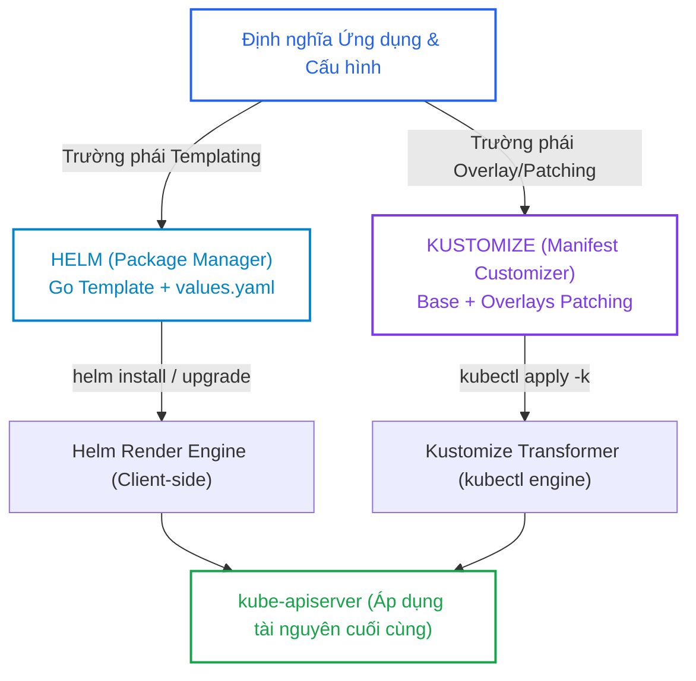
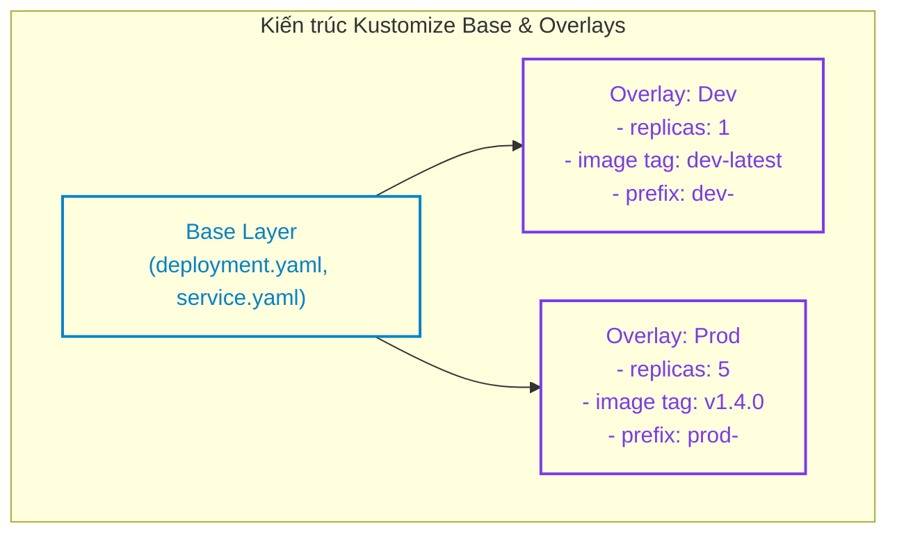
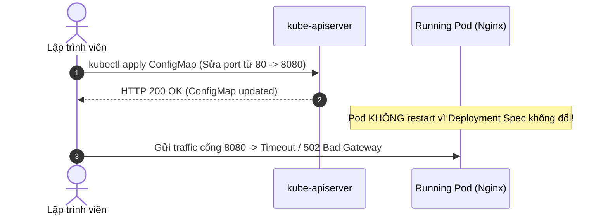
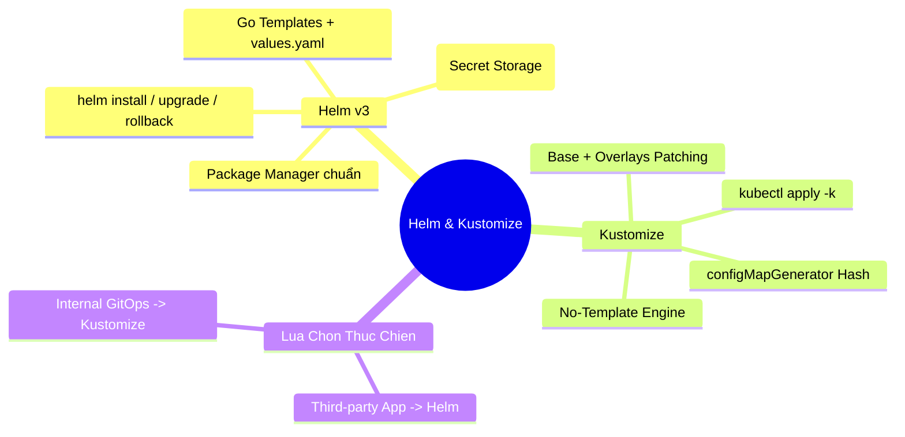


> [!IMPORTANT]
> **Mục tiêu kỹ thuật & Trọng tâm CKA**:
> - Hiểu rõ sự khác biệt bản chất giữa mô hình Templating (Helm) và mô hình Patching/Overlays (Kustomize).
> - Nắm vững cấu trúc một Helm Chart: `Chart.yaml`, `values.yaml`, `templates/`, `_helpers.tpl`.
> - Làm chủ các thao tác Helm CLI cốt lõi: `helm install`, `upgrade`, `rollback`, `list`, `uninstall`, `template`.
> - Thiết kế cấu trúc thư mục Kustomize chuẩn gồm `base/` và các thư mục `overlays/` (dev, prod).
> - Sử dụng thành thạo `kubectl apply -k` và xử lý cạm bẫy xung đột cấu hình trong thực tế.

---

## 1. Bản Chất Kiến Trúc & Tư Duy Cốt Lõi: Helm vs Kustomize

Khi quản lý hàng chục hoặc hàng trăm microservices trên nhiều môi trường khác nhau (Development, Staging, Production), việc duy trì các tệp YAML thô (Raw Manifests) dẫn đến trùng lặp mã nguồn nghiêm trọng, khó kiểm soát phiên bản và dễ gây ra sai sót khi triển khai.

Cộng đồng Kubernetes đã phát triển hai trường phái tiếp cận chính để giải quyết bài toán này:



### 1.1. Kiến Trúc Helm v3: Client-Only & Secret Release Storage

Trong Helm v3, kiến trúc máy chủ Tiller (vốn tồn tại trong Helm v2 và gây nhiều rủi ro bảo mật) đã bị loại bỏ hoàn toàn.
- **Client-only**: Helm chạy trực tiếp trên máy kỹ sư hoặc CI/CD pipeline, sử dụng quyền hạn từ file `kubeconfig`.
- **Release Tracking**: Mọi thông tin trạng thái, phiên bản release và giá trị values của một lần cài đặt được lưu trữ dưới dạng một **Secret** có nhãn `owner: helm` ngay trong namespace cài đặt.
- **Three-way Merge Patch**: Khi thực hiện `helm upgrade`, Helm so sánh giữa: (1) Manifest cũ của Release trước, (2) Trạng thái trực tiếp trên cụm (Live State), và (3) Manifest mới được render để đưa ra bản cập nhật chính xác nhất mà không ghi đè các thay đổi tự động (như HPA replicas).

### 1.2. Kiến Trúc Kustomize: Pure Declarative & GitOps Native

Kustomize tuân thủ triết lý **"No Templates"**:
- Bản kê khai gốc (`base/`) luôn là các file YAML Kubernetes hợp lệ và hoàn chỉnh 100%.
- Các môi trường cụ thể (`overlays/dev/`, `overlays/prod/`) chỉ chứa các file vá lỗi (**Patches**) và tệp điều phối `kustomization.yaml`.
- Kustomize thực hiện các phép biến đổi (Transformers): thay đổi số lượng replicas, cập nhật tag hình ảnh (`images`), thêm tiền tố tên (`namePrefix`), gán nhãn chung (`commonLabels`) hoặc nạp biến môi trường từ file qua `configMapGenerator`.



---

## 2. Bảng Ma Trận So Sánh Kỹ Thuật Toàn Diện (Engineering Matrix)

Bảng đối chiếu chuyên sâu giữa Helm, Kustomize và Raw Manifests:

| Tiêu Chí So Sánh | Raw Manifests | Helm v3 | Kustomize |
| :--- | :--- | :--- | :--- |
| **Cơ chế cốt lõi** | Tĩnh (Static YAML) | Go Templating Engine | Declarative Overlays & Patches |
| **Công cụ yêu cầu** | `kubectl` | `helm` CLI | Tích hợp sẵn trong `kubectl` (`-k`) |
| **Quản lý Vòng đời / Rollback**| Không có (Dựa vào Git/K8s)| Có sẵn (`helm rollback <rel> <rev>`)| Dựa vào Git Commit History (GitOps) |
| **Tính hợp lệ của YAML nguồn**| YAML chuẩn | Phá vỡ chuẩn YAML bởi Go tags `{{ }}` | 100% YAML Kubernetes chuẩn |
| **Quản lý Dependencies** | Thủ công | Hỗ trợ qua `Chart.yaml` (Subcharts) | Ghép nối qua `resources` URLs |
| **Quản lý Secret/ConfigMap Hash**| Không hỗ trợ | Phụ thuộc checksum annotation | Tự động sinh Content Hash Suffix |
| **Phù hợp nhất cho** | Học tập, kiểm thử nhanh | Phân phối thư viện/app bên thứ 3 | Quản lý hạ tầng nội bộ đa môi trường |

---

## 3. Cấu Trúc Khai Báo Dự Án Thực Tế

### 3.1. Cấu Trúc Một Helm Chart Chuẩn

```text
my-app/
├── Chart.yaml          # Thông tin định danh Chart (name, version, appVersion)
├── values.yaml         # Giá trị mặc định có thể ghi đè
├── templates/
│   ├── _helpers.tpl    # Định nghĩa Named Templates tái sử dụng
│   ├── deployment.yaml # Go template sinh Deployment
│   ├── service.yaml    # Go template sinh Service
│   └── NOTES.txt       # Thông báo hiển thị sau khi cài đặt
```

Tệp `templates/deployment.yaml` minh họa Go Template:

```yaml
apiVersion: apps/v1
kind: Deployment
metadata:
  name: {{ include "my-app.fullname" . }}
  labels:
    {{- include "my-app.labels" . | nindent 4 }}
spec:
  replicas: {{ .Values.replicaCount }}
  selector:
    matchLabels:
      app: {{ include "my-app.name" . }}
  template:
    metadata:
      labels:
        app: {{ include "my-app.name" . }}
    spec:
      containers:
        - name: {{ .Chart.Name }}
          image: "{{ .Values.image.repository }}:{{ .Values.image.tag | default .Chart.AppVersion }}"
          ports:
            - containerPort: {{ .Values.service.port }}
          resources:
            {{- toYaml .Values.resources | nindent 12 }}
```

### 3.2. Cấu Trúc Dự Án Kustomize Chuẩn

```text
kustomize-app/
├── base/
│   ├── deployment.yaml
│   ├── service.yaml
│   └── kustomization.yaml
└── overlays/
    ├── dev/
    │   ├── kustomization.yaml
    │   └── patch-replicas.yaml
    └── prod/
        ├── kustomization.yaml
        └── patch-resources.yaml
```

Tệp `overlays/prod/kustomization.yaml`:

```yaml
apiVersion: kustomize.config.k8s.io/v1beta1
kind: Kustomization

resources:
  - ../../base

namePrefix: prod-
namespace: production

commonLabels:
  environment: production

images:
  - name: nginx
    newTag: 1.25-alpine

patches:
  - path: patch-resources.yaml
```

---

## 4. Phân Tích Cạm Bẫy Thực Chiến: Sự Cố Triển Khai & Khắc Phục

### Tình huống 1: Lỗi `another operation (install/upgrade/rollback) is in progress` trong Helm

Trong quá trình chạy CI/CD pipeline, tiến trình `helm upgrade` bị ngắt đột ngột (do runner bị kill hoặc network timeout). Các lần chạy tiếp theo đều bị khóa với thông báo lỗi.

### Hậu Quả & Log Lỗi Thực Tế:

```text
Error: UPGRADE FAILED: another operation (install/upgrade/rollback) is in progress 
for release my-app
```

### 5-Whys Root Cause Analysis:
1. **Tại sao Helm từ chối nâng cấp?** -> Trạng thái của Release Secret hiện tại đang ở trạng thái `pending-upgrade` hoặc `pending-install`.
2. **Tại sao nó bị kẹt ở trạng thái pending?** -> Lần chạy trước bị ngắt bất ngờ trước khi Helm kịp cập nhật trạng thái `deployed` hoặc `failed`.
3. **Helm lưu trữ trạng thái này ở đâu?** -> Trong Secret có tên dạng `sh.helm.release.v1.my-app.vX` trong namespace đích.
4. **Tại sao Helm không tự động unlock?** -> Helm bảo vệ tính toàn vẹn để tránh hai tiến trình cùng sửa đổi một Release song song.
5. **Giải pháp khắc phục là gì?** -> Tìm Secret của bản revision đang bị pending và xóa đi, hoặc rollback về revision thành công gần nhất.

```bash
# Tìm Secret bị kẹt
kubectl get secrets -n production -l owner=helm,name=my-app
# Xóa Secret revision bị lỗi pending
kubectl delete secret sh.helm.release.v1.my-app.v3 -n production
# Thực hiện lại lệnh upgrade
helm upgrade my-app ./my-app -n production
```

---

### Tình huống 2: Kustomize Patch không khớp định danh tài nguyên (Target Not Found)

Một patch trong Kustomize cố gắng tăng `replicas` nhưng tệp patch khai báo sai `apiVersion` hoặc `name` so với tài nguyên trong `base/`.

### Hậu Quả & Log Lỗi Thực Tế:

```text
Error: failed to find an match for id apps_v1_Deployment|production|non-existent-app in base
```

> [!WARNING]
> Kustomize định danh tài nguyên dựa trên bộ 4 thuộc tính: `Group`, `Version`, `Kind`, và `Name` (GVKN). Khi viết patch, phần `metadata.name` trong patch phải khớp chính xác với tên tài nguyên trong base trước khi áp dụng `namePrefix`.

---

### Tình huống 3: Quên cập nhật Content Hash trong Pod khi sửa đổi ConfigMap thuần

Khi sử dụng Raw YAML hoặc Helm không cấu hình reload, lập trình viên sửa đổi nội dung ConfigMap nhưng Pods không tự khởi động lại, dẫn đến ứng dụng vẫn chạy với cấu hình cũ.



**Giải pháp với Kustomize `configMapGenerator`**: Kustomize tự động sinh tên `app-config-g8h9f2k`. Khi nội dung đổi, tên ConfigMap đổi -> Pod Template Spec đổi -> Kích hoạt Rolling Update tức thì!

---

## 5. Hands-on Lab: Thực Chiến Helm & Kustomize (8 Bước)

Bảng tổng hợp 8 bước thực hành:

| Bước | Thao Tác | Mục Tiêu Kỹ Thuật | Lệnh / Công Cụ |
| :--- | :--- | :--- | :--- |
| **1** | Cài đặt Helm Repository | Thêm repo Bitnami chính thức | `helm repo add bitnami` |
| **2** | Cài đặt Release với giá trị tùy biến | Override values từ dòng lệnh | `helm install --set` |
| **3** | Nâng cấp & Kiểm tra Lịch sử Release | Quản lý các revisions | `helm upgrade`, `helm history` |
| **4** | Thực hiện Rollback Release | Khôi phục phiên bản ổn định trước | `helm rollback` |
| **5** | Khởi tạo Cấu trúc Kustomize Base | Tạo manifests nền tảng Nginx | `mkdir base`, viết YAML |
| **6** | Xây dựng Kustomize Overlays | Thiết lập cấu hình dev và prod riêng biệt | `mkdir overlays/dev overlays/prod` |
| **7** | Render & Kiểm tra Manifest Kustomize | Build YAML mà không apply | `kubectl kustomize` |
| **8** | Triển khai trực tiếp với `kubectl -k` | Áp dụng cấu hình hoàn chỉnh lên cụm | `kubectl apply -k` |

---

### Bước 1: Thêm Repository và cập nhật Chart Index

```bash
helm repo add bitnami https://charts.bitnami.com/bitnami
helm repo update
```

---

### Bước 2: Triển khai Nginx qua Helm với cấu hình tùy chỉnh

Cài đặt Nginx release vào namespace `web-lab` với 2 replicas:

```bash
kubectl create namespace web-lab

helm install my-web bitnami/nginx \
  --namespace web-lab \
  --set replicaCount=2 \
  --set service.type=ClusterIP
```

Kiểm tra trạng thái triển khai:

```bash
helm list -n web-lab
kubectl get pods -n web-lab
```

---

### Bước 3: Nâng cấp Release lên 3 Replicas

```bash
helm upgrade my-web bitnami/nginx \
  --namespace web-lab \
  --set replicaCount=3 \
  --set service.type=ClusterIP
```

Kiểm tra lịch sử các bản sửa đổi (Revisions):

```bash
helm history my-web -n web-lab
```

Output hiển thị Revision 1 và 2:
```text
REVISION    UPDATED                     STATUS        CHART          APP VERSION    DESCRIPTION
1           Tue Sep 16 02:00:00 2026    superseded    nginx-15.4.0   1.25.3         Install complete
2           Tue Sep 16 02:05:00 2026    deployed      nginx-15.4.0   1.25.3         Upgrade complete
```

---

### Bước 4: Rollback về Revision 1

Giả lập sự cố và quay lại cấu hình ban đầu:

```bash
helm rollback my-web 1 -n web-lab
```

Kiểm tra số lượng Pod đã trở về 2:

```bash
kubectl get deployment my-web-nginx -n web-lab -o jsonpath='{.spec.replicas}'
# Output: 2
```

---

### Bước 5: Tạo cấu trúc thư mục Kustomize Base

```bash
mkdir -p ~/kustomize-lab/base ~/kustomize-lab/overlays/dev ~/kustomize-lab/overlays/prod
cd ~/kustomize-lab/base
```

Tạo `deployment.yaml`:

```yaml
apiVersion: apps/v1
kind: Deployment
metadata:
  name: demo-app
spec:
  replicas: 1
  selector:
    matchLabels:
      app: demo-app
  template:
    metadata:
      labels:
        app: demo-app
    spec:
      containers:
        - name: web
          image: nginx:1.24
          ports:
            - containerPort: 80
```

Tạo `kustomization.yaml` cho Base:

```yaml
apiVersion: kustomize.config.k8s.io/v1beta1
kind: Kustomization
resources:
  - deployment.yaml
```

---

### Bước 6: Xây dựng Kustomize Overlays cho Production

Chuyển tới thư mục `overlays/prod/` và tạo `kustomization.yaml`:

```yaml
apiVersion: kustomize.config.k8s.io/v1beta1
kind: Kustomization

resources:
  - ../../base

namePrefix: prod-

commonLabels:
  env: production

patches:
  - target:
      kind: Deployment
      name: demo-app
    patch: |-
      - op: replace
        path: /spec/replicas
        value: 4
```

---

### Bước 7: Kiểm tra bản kê khai được render (Dry-run Build)

Sử dụng `kubectl kustomize` để xem YAML đầu ra mà không tác động tới cụm:

```bash
kubectl kustomize ~/kustomize-lab/overlays/prod
```

Output xác nhận `replicas: 4`, tên đổi thành `prod-demo-app` và có gắn nhãn `env: production`.

---

### Bước 8: Áp dụng Kustomize Overlay trực tiếp

```bash
kubectl apply -k ~/kustomize-lab/overlays/prod
```

Kiểm tra kết quả trên cụm:

```bash
kubectl get deployments -l env=production
```

Output:
```text
NAME            READY   UP-TO-DATE   AVAILABLE   AGE
prod-demo-app   4/4     4            4           20s
```

---

## 6. 10 Câu Hỏi Tự Kiểm Tra Chuyên Sâu (Self-Check Q&A Accordion)

<details class="qa-card">
  <summary><b>Câu 1: Điểm khác biệt căn bản trong việc lưu trữ trạng thái giữa Helm v2 và Helm v3 là gì?</b></summary>
  <div class="qa-answer">
    <b>Trả lời:</b><br>
    Trong Helm v2, trạng thái được quản lý tập trung qua máy chủ Tiller (thường lưu dưới dạng ConfigMaps/Secrets trong namespace kube-system). Trong Helm v3, Tiller bị loại bỏ hoàn toàn; trạng thái của từng Release được lưu trữ phân tán trực tiếp dưới dạng các đối tượng <b>Secret</b> (mặc định) có nhãn <code>owner: helm</code> ngay trong Namespace mà Release đó được cài đặt.
  </div>
</details>

<details class="qa-card">
  <summary><b>Câu 2: Làm thế nào để render và kiểm tra toàn bộ YAML đầu ra của một Helm Chart mà không cần gửi request lên API Server?</b></summary>
  <div class="qa-answer">
    <b>Trả lời:</b><br>
    Sử dụng lệnh:<br>
    <code>helm template &lt;release-name&gt; &lt;chart-path&gt; [-f values.yaml] [--set key=value]</code>
  </div>
</details>

<details class="qa-card">
  <summary><b>Câu 3: Khái niệm Base và Overlay trong Kustomize hoạt động theo nguyên lý nào?</b></summary>
  <div class="qa-answer">
    <b>Trả lời:</b><br>
    <ul>
      <li><b>Base:</b> Chứa các tài nguyên khai báo gốc chuẩn mực, độc lập với môi trường và hoàn toàn có thể chạy được độc lập.</li>
      <li><b>Overlay:</b> Kế thừa Base và định nghĩa các điểm khác biệt (Patches, namePrefix, namespace, commonLabels, images, configMapGenerators) dành riêng cho từng môi trường cụ thể (như Dev, Staging, Prod) mà không cần sao chép lặp lại toàn bộ mã nguồn.</li>
    </ul>
  </div>
</details>

<details class="qa-card">
  <summary><b>Câu 4: Kustomize configMapGenerator giải quyết triệt để vấn đề gì so với việc khai báo ConfigMap thông thường?</b></summary>
  <div class="qa-answer">
    <b>Trả lời:</b><br>
    <code>configMapGenerator</code> tự động tính toán mã băm SHA256 từ nội dung của file cấu hình và gắn vào đuôi tên của ConfigMap (ví dụ: <code>app-config-7k8f2m9b4g</code>). Khi nội dung file thay đổi, tên ConfigMap thay đổi, kéo theo trường tham chiếu trong Deployment thay đổi, từ đó tự động kích hoạt tiến trình <b>Rolling Update</b> cho Pods mà không cần can thiệp thủ công.
  </div>
</details>

<details class="qa-card">
  <summary><b>Câu 5: Lệnh nào giúp khôi phục một Helm release về phiên bản cụ thể trong quá khứ khi bản nâng cấp mới gặp lỗi?</b></summary>
  <div class="qa-answer">
    <b>Trả lời:</b><br>
    Sử dụng lệnh:<br>
    <code>helm rollback &lt;release-name&gt; &lt;revision-number&gt; -n &lt;namespace&gt;</code>
  </div>
</details>

<details class="qa-card">
  <summary><b>Câu 6: Cờ nào trong kubectl cho phép thực thi trực tiếp thư mục chứa tệp kustomization.yaml?</b></summary>
  <div class="qa-answer">
    <b>Trả lời:</b><br>
    Cờ <code>-k</code> hoặc <code>--kustomize</code>. Ví dụ:<br>
    <code>kubectl apply -k ./overlays/production</code> hoặc <code>kubectl delete -k ./overlays/dev</code>
  </div>
</details>

<details class="qa-card">
  <summary><b>Câu 7: Tệp _helpers.tpl trong thư mục templates của Helm Chart đóng vai trò gì?</b></summary>
  <div class="qa-answer">
    <b>Trả lời:</b><br>
    Tệp <code>_helpers.tpl</code> chứa các <b>Named Templates</b> (được định nghĩa bằng từ khóa <code>{{- define "name" -}}</code>). Đây là nơi viết các hàm tiện ích sinh tên chuẩn, label chuẩn hoặc khối cấu hình tái sử dụng trên nhiều tệp manifest khác nhau trong Chart thông qua hàm <code>{{ include "name" . }}</code>.
  </div>
</details>

<details class="qa-card">
  <summary><b>Câu 8: Khi áp dụng Helm upgrade với cờ --reuse-values và truyền thêm --set, hành vi ghi đè dữ liệu diễn ra như thế nào?</b></summary>
  <div class="qa-answer">
    <b>Trả lời:</b><br>
    Helm sẽ giữ lại toàn bộ các giá trị values đã được thiết lập từ lần cài đặt/nâng cấp trước đó (trong Release Secret), đồng thời chỉ ghi đè hoặc bổ sung các giá trị mới được chỉ định qua cờ <code>--set</code> hoặc <code>-f</code> trong lần chạy hiện tại.
  </div>
</details>

<details class="qa-card">
  <summary><b>Câu 9: Trong Kustomize, có những phương thức nào để áp dụng Patch lên tài nguyên gốc?</b></summary>
  <div class="qa-answer">
    <b>Trả lời:</b><br>
    <ul>
      <li><b>Strategic Merge Patch:</b> Ghi đè hoặc bổ sung các trường cấu hình dưới dạng YAML rút gọn.</li>
      <li><b>JSON 6902 Patch:</b> Chỉ định chính xác đường dẫn và thao tác (<code>add</code>, <code>remove</code>, <code>replace</code>) theo chuẩn RFC 6902.</li>
    </ul>
  </div>
</details>

<details class="qa-card">
  <summary><b>Câu 10: Tại sao Helm Chart lại cần tệp Chart.lock khi sử dụng Subcharts (Dependencies)?</b></summary>
  <div class="qa-answer">
    <b>Trả lời:</b><br>
    Tệp <code>Chart.lock</code> ghi lại chính xác phiên bản cụ thể (exact version) và mã băm toàn vẹn của tất cả các Subcharts được khai báo trong phần <code>dependencies</code> của <code>Chart.yaml</code>. Điều này đảm bảo tính nhất quán (deterministic build) khi nhiều lập trình viên hoặc CI/CD pipeline cùng chạy lệnh <code>helm dependency build</code>.
  </div>
</details>

---

## 7. Tổng Kết & Lộ Trình Bài Học Tiếp Theo



Việc thành thạo cả Helm và Kustomize mang lại sự linh hoạt tối đa cho kỹ sư DevOps/SRE: sử dụng Helm để triển khai nhanh các gói dịch vụ nguồn mở tiêu chuẩn và dùng Kustomize để tùy biến tinh chỉnh cấu hình microservices theo mô hình GitOps.

> [!TIP]
> **Bài học tiếp theo**: Trong [Bài 14: Vòng Đời Pod Chuyên Sâu: Phase, Conditions, Probes, Init Containers & Graceful Shutdown](cka-14-14-pod-va-vong-doi.html), chúng ta sẽ giải phẫu chi tiết vòng đời của đơn vị tính toán nguyên tử trong Kubernetes: các giai đoạn chuyển trạng thái, cơ chế kiểm tra sức khỏe Liveness/Readiness/Startup Probes và quy trình dừng Pod an toàn không gián đoạn dịch vụ (Zero-downtime).

