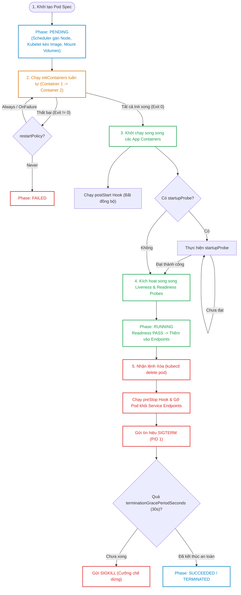
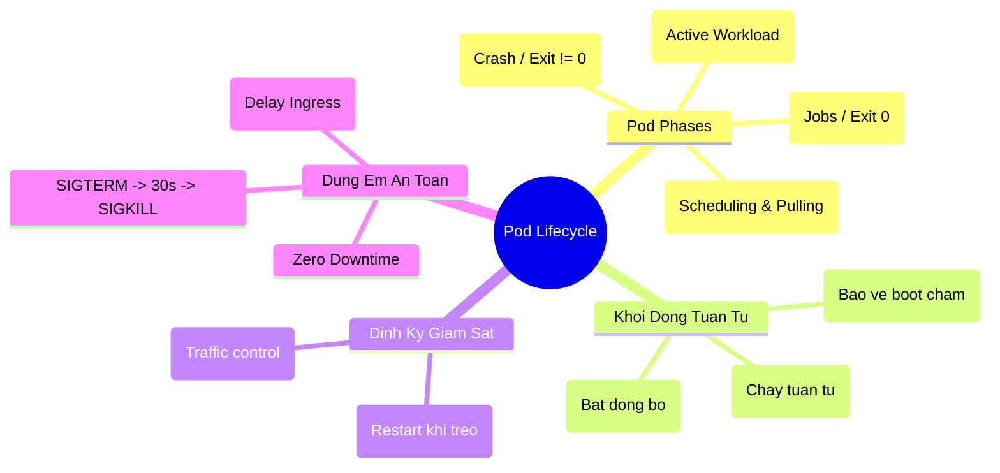


> [!IMPORTANT]
> **Mục tiêu kỹ thuật & Trọng tâm CKA**:
> - Nắm vững 5 trạng thái `PodPhase` và 4 điều kiện cốt lõi `PodConditions` (`PodScheduled`, `Initialized`, `ContainersReady`, `Ready`).
> - Cấu hình và debug chuỗi `initContainers` khởi tạo môi trường (chờ DB, tải assets).
> - Phân biệt chính xác và cấu hình chuẩn xác bộ 3 Probes: `startupProbe`, `livenessProbe`, `readinessProbe`.
> - Hiểu rõ sự khác biệt giữa các phương thức probe: `httpGet`, `tcpSocket`, `exec`, `grpc`.
> - Thiết kế quy trình dừng êm không rớt request (Zero Downtime) bằng `preStop` hook và `terminationGracePeriodSeconds`.

---

## 1. Bản Chất Kiến Trúc & Tư Duy Cốt Lõi: Vòng Đời Của Pod

Pod không phải là một tiến trình đơn lẻ mà là một môi trường thực thi nguyên tử (Atomic Execution Unit) đóng gói một hoặc nhiều container chia sẻ chung Network Namespace (cùng IP, port space) và Storage Volumes.

Vòng đời của Pod được điều phối bởi **Kubelet** trên Node và được phản ánh liên tục về `kube-apiserver` thông qua chu trình điều hòa (Reconciliation).

### 1.1. Sơ Đồ Toàn Cảnh Vòng Đời Khởi Động & Dừng Của Pod



### 1.2. Giải Mã 4 Điều Kiện Cốt Lõi (Pod Conditions)

Khi chạy `kubectl describe pod <name>`, mục `Conditions` thể hiện tiến trình vượt qua các cột mốc kỹ thuật:

1. **PodScheduled**: Pod đã được `kube-scheduler` gán thành công vào một Node cụ thể.
2. **Initialized**: Toàn bộ các `initContainers` đã chạy xong thành công (Exit Code 0).
3. **ContainersReady**: Tất cả các app containers trong Pod đã vượt qua kỳ kiểm tra `startupProbe` và sẵn sàng.
4. **Ready**: Pod đã vượt qua `readinessProbe` và được phép nhận lưu lượng mạng từ Kubernetes Service / Ingress.

---

## 2. Bảng Ma Trận So Sánh Kỹ Thuật Toàn Diện (Engineering Matrix)

Bảng phân biệt chi tiết giữa 3 loại Probe trong Kubernetes:

| Tiêu Chí Kỹ Thuật | Startup Probe | Liveness Probe | Readiness Probe |
| :--- | :--- | :--- | :--- |
| **Mục đích chính** | Chờ ứng dụng khởi động xong (Booting) | Phát hiện Deadlock/Treo ứng dụng | Xác định ứng dụng sẵn sàng nhận traffic |
| **Hành động khi Thất bại**| Giết và khởi động lại Container | Giết và khởi động lại Container | **KHÔNG** giết Pod; Chỉ gỡ khỏi Service Endpoints |
| **Tần suất kiểm tra** | Chạy liên tục lúc boot; Tự tắt khi PASS | Chạy định kỳ trong suốt vòng đời Pod | Chạy định kỳ trong suốt vòng đời Pod |
| **Tác động tới Probe khác**| Vô hiệu hóa Liveness/Readiness đến khi PASS| Chờ Startup Probe pass mới bắt đầu | Chờ Startup Probe pass mới bắt đầu |
| **Cơ chế kiểm tra** | `httpGet`, `tcpSocket`, `exec`, `grpc` | `httpGet`, `tcpSocket`, `exec`, `grpc` | `httpGet`, `tcpSocket`, `exec`, `grpc` |
| **Tham số then chốt** | `failureThreshold * periodSeconds` | `failureThreshold`, `periodSeconds` | `failureThreshold`, `successThreshold` |
| **Kịch bản điển hình** | Java/Spring Boot tải cache lúc boot (2-3 phút)| Ứng dụng bị leak memory, CPU thread lock| Ứng dụng đang quá tải (DB connection pool đầy) |

---

## 3. Cấu Trúc Khai Báo Manifest & Chi Tiết Vòng Đời

### 3.1. Pod Manifest Hoàn Chỉnh với InitContainer, Probes & Graceful Shutdown

```yaml
apiVersion: v1
kind: Pod
metadata:
  name: enterprise-web-app
  namespace: production
  labels:
    app: web
spec:
  terminationGracePeriodSeconds: 60 # Cho phép tối đa 60 giây để xử lý xong request
  restartPolicy: Always

  # 1. Khối InitContainers: Chạy tuần tự kiểm tra Database trước khi app chạy
  initContainers:
    - name: wait-for-db
      image: busybox:1.36
      command: ['sh', '-c', 'until nc -z -w 2 postgres-service.production.svc.cluster.local 5432; do echo "Waiting for DB..."; sleep 2; done']

  # 2. Khối Containers Chính
  containers:
    - name: web-server
      image: myorg/payment-api:v2.1.0
      ports:
        - containerPort: 8080

      # Lifecycle Hooks
      lifecycle:
        postStart:
          exec:
            command: ["/bin/sh", "-c", "echo App Started at $(date) >> /var/log/app.log"]
        preStop:
          exec:
            command: ["/bin/sh", "-c", "sleep 15"] # Cho phép EndpointSlice gỡ IP trước khi ngắt tiến trình

      # Bộ 3 Probes
      startupProbe:
        httpGet:
          path: /healthz/startup
          port: 8080
        initialDelaySeconds: 5
        periodSeconds: 5
        failureThreshold: 20 # Cho phép tối đa 5 + 20*5 = 105 giây để boot

      livenessProbe:
        httpGet:
          path: /healthz/liveness
          port: 8080
        periodSeconds: 10
        timeoutSeconds: 2
        failureThreshold: 3

      readinessProbe:
        httpGet:
          path: /healthz/readiness
          port: 8080
        periodSeconds: 5
        successThreshold: 1
        failureThreshold: 2
```

---

## 4. Phân Tích Cạm Bẫy Thực Chiến: Sự Cố Probes & CrashLoopBackOff

### Tình huống 1: Liveness Probe sai cấu hình gây khởi động lại vô tận (Liveness Cascade Failure)

Hệ thống Backend bị quá tải lưu lượng (Spike Traffic). CPU chạm ngưỡng 100%, endpoint `/healthz` phản hồi chậm 2.5 giây. Liveness Probe có `timeoutSeconds: 1` coi đây là thất bại và lập tức gửi tín hiệu giết container. Container mới sinh ra lại tiếp tục bị nghẽn và bị giết tiếp, tạo ra chuỗi sụp đổ dây chuyền (Cascading Failure).

### Hậu Quả & Log Lỗi Thực Tế:

```text
Events:
  Type     Reason     Age                From               Message
  ----     ------     ----               ----               -------
  Warning  Unhealthy  12s (x3 over 32s)  kubelet            Liveness probe failed: Get "http://10.244.1.45:8080/healthz": context deadline exceeded (Client.Timeout exceeded while awaiting headers)
  Normal   Killing    12s                kubelet            Container web-server failed liveness probe, will be restarted
```

### 5-Whys Root Cause Analysis:
1. **Tại sao Kubelet liên tục restart Pod?** -> Liveness probe thất bại 3 lần liên tiếp.
2. **Tại sao Liveness probe thất bại?** -> Timeout request vượt quá 1 giây do CPU bận xử lý request người dùng.
3. **Ứng dụng có thực sự bị deadlock hay crash không?** -> Không, ứng dụng chỉ đang xử lý chậm do tải cao.
4. **Tại sao lại dùng Liveness Probe để đo tải?** -> Lập trình viên nhầm lẫn giữa Liveness (sống/chết) và Readiness (có tải nổi hay không).
5. **Giải pháp khắc phục là gì?** -> Tách biệt endpoint: Liveness Probe chỉ kiểm tra internal thread/memory nhẹ nhàng, Readiness Probe kiểm tra kết nối DB và tải. Tăng `timeoutSeconds` và `periodSeconds`.

```diff
       livenessProbe:
         httpGet:
-          path: /api/v1/deep-health-check # Endpoint nặng truy vấn DB
+          path: /healthz/live             # Endpoint nhẹ trả về HTTP 200 tức thì
-        timeoutSeconds: 1
+        timeoutSeconds: 3
-        periodSeconds: 5
+        periodSeconds: 15
```

---

### Tình huống 2: Mất kết nối khách hàng (HTTP 502 Bad Gateway) khi Scale Down Pod

Khi Deployment giảm số lượng replicas hoặc thực hiện Rolling Update, Pod bị xóa ngay lập tức. Client đang gửi request nhận mã lỗi HTTP 502 hoặc kết nối bị Reset đột ngột (Connection Reset by Peer).

### Hậu Quả & Log Lỗi Thực Tế:

```text
# Log NGINX Ingress Controller:
2026/09/16 02:40:15 [error] 1421#1421: *89121 connect() failed (111: Connection refused) 
while connecting to upstream, client: 203.0.113.195, server: api.company.com, 
request: "POST /v1/checkout HTTP/2.0", upstream: "http://10.244.2.88:8080/v1/checkout"
```

> [!WARNING]
> Bản chất vấn đề: Việc gửi tín hiệu `SIGTERM` dừng Container trên Node và việc gỡ Endpoint IP trên `kube-proxy`/`Ingress` là **hai luồng bất đồng bộ song song**. Nếu ứng dụng dừng ngay trong khi Ingress chưa kịp cập nhật bảng định tuyến iptables, Ingress vẫn chuyển request đến Pod đã chết!
> **Giải pháp**: Luôn khai báo `preStop: exec: command: ["sleep", "15"]` để trì hoãn việc gửi `SIGTERM`, đảm bảo Ingress có đủ thời gian gỡ IP ra khỏi upstream pool.

---

### Tình huống 3: Lỗi Exit Code 137 (OOMKilled) trong InitContainer

Một `initContainer` thực hiện giải nén tệp zip lớn vào Shared Volume nhưng bị giới hạn bộ nhớ `resources.limits.memory: 64Mi`.

### Hậu Quả & Log Lỗi Thực Tế:

```text
State:          Waiting
  Reason:       CrashLoopBackOff
Last State:     Terminated
  Reason:       OOMKilled
  Exit Code:    137
```

Nguyên nhân: Mã thoát 137 = 128 + 9 (`SIGKILL`), chứng minh Kubelet đã cưỡng chế tiêu diệt tiến trình do vi phạm vượt quá Memory Limit của cgroups.

---

## 5. Hands-on Lab: Triển Khai & Kiểm Định Vòng Đời Pod (8 Bước)

Bảng tổng hợp 8 bước thực hành:

| Bước | Thao Tác | Mục Tiêu Kỹ Thuật | Lệnh / Công Cụ |
| :--- | :--- | :--- | :--- |
| **1** | Tạo Namespace thử nghiệm | Cô lập môi trường thực hành | `kubectl create ns lifecycle-lab` |
| **2** | Triển khai Pod có InitContainer | Kiểm tra cơ chế chờ tuần tự | `kubectl apply -f init-pod.yaml` |
| **3** | Quan sát trạng thái Init:0/1 | Kiểm tra Pod bị block bởi InitContainer | `kubectl get pods -w` |
| **4** | Mở khóa InitContainer | Tạo điều kiện thỏa mãn để Init pass | `kubectl run mock-db ...` |
| **5** | Triển khai Pod với Probes | Cấu hình Startup, Liveness, Readiness | `kubectl apply -f probe-pod.yaml` |
| **6** | Giả lập lỗi Readiness Probe | Quan sát Pod bị gỡ khỏi Endpoints | `kubectl exec -- rm /tmp/ready` |
| **7** | Giả lập lỗi Liveness Probe | Quan sát Kubelet tự động restart container | `kubectl exec -- rm /tmp/healthy` |
| **8** | Kiểm định Graceful Shutdown | Theo dõi tiến trình preStop và SIGTERM | `kubectl delete pod --now` |

---

### Bước 1: Khởi tạo Namespace

```bash
kubectl create namespace lifecycle-lab
```

---

### Bước 2 & 3: Triển khai Pod có InitContainer phụ thuộc Database

Tạo Pod chờ Service `database-svc` xuất hiện:

```bash
cat <<EOF | kubectl apply -f -
apiVersion: v1
kind: Pod
metadata:
  name: app-with-init
  namespace: lifecycle-lab
spec:
  initContainers:
    - name: check-db-ready
      image: busybox:1.36
      command: ['sh', '-c', 'until nc -z -w 2 database-svc 3306; do echo "Chờ database..."; sleep 2; done']
  containers:
    - name: main-app
      image: nginx:1.24
EOF
```

Kiểm tra trạng thái Pod:

```bash
kubectl get pods -n lifecycle-lab
```

Output hiển thị Pod bị dừng ở giai đoạn Init:
```text
NAME            READY   STATUS     RESTARTS   AGE
app-with-init   0/1     Init:0/1   0          25s
```

---

### Bước 4: Khởi tạo Mock Database Service để giải phóng InitContainer

Tạo Pod và Service đại diện cho database:

```bash
kubectl run database-svc --image=nginx:alpine --port=3306 -n lifecycle-lab --expose
```

Quan sát Pod `app-with-init` tự động chuyển từ `Init:0/1` sang `PodInitializing` và đạt trạng thái `Running`:

```bash
kubectl get pods -n lifecycle-lab
```

Output:
```text
NAME            READY   STATUS    RESTARTS   AGE
app-with-init   1/1     Running   0          90s
database-svc    1/1     Running   0          15s
```

---

### Bước 5: Triển khai Pod với Liveness và Readiness Probes dựa trên tệp cờ

```bash
cat <<EOF | kubectl apply -f -
apiVersion: v1
kind: Pod
metadata:
  name: probe-test-app
  namespace: lifecycle-lab
  labels:
    app: probe-demo
spec:
  containers:
    - name: test-container
      image: busybox:1.36
      command:
        - /bin/sh
        - -c
        - touch /tmp/healthy /tmp/ready; sleep 3600
      livenessProbe:
        exec:
          command:
            - cat
            - /tmp/healthy
        initialDelaySeconds: 5
        periodSeconds: 5
      readinessProbe:
        exec:
          command:
            - cat
            - /tmp/ready
        initialDelaySeconds: 5
        periodSeconds: 5
EOF
```

---

### Bước 6: Giả lập lỗi Readiness Probe

Tạo Service liên kết với Pod và kiểm tra Endpoints:

```bash
kubectl expose pod probe-test-app --port=80 -n lifecycle-lab
kubectl get endpoints probe-test-app -n lifecycle-lab
```

Xóa tệp `/tmp/ready` để kích hoạt lỗi Readiness:

```bash
kubectl exec -n lifecycle-lab probe-test-app -- rm -f /tmp/ready
sleep 7
kubectl get pod probe-test-app -n lifecycle-lab
kubectl get endpoints probe-test-app -n lifecycle-lab
```

Output xác nhận Pod chuyển sang `0/1 READY` nhưng **KHÔNG** bị restart, và Endpoints trở thành `<none>`:
```text
NAME             READY   STATUS    RESTARTS   AGE
probe-test-app   0/1     Running   0          2m

NAME             ENDPOINTS   AGE
probe-test-app   <none>      45s
```

---

### Bước 7: Giả lập lỗi Liveness Probe

Xóa tệp `/tmp/healthy` để ép Kubelet tiêu diệt container:

```bash
kubectl exec -n lifecycle-lab probe-test-app -- rm -f /tmp/healthy
sleep 15
kubectl get pod probe-test-app -n lifecycle-lab
```

Output ghi nhận số lần RESTARTS tăng lên 1:
```text
NAME             READY   STATUS    RESTARTS     AGE
probe-test-app   1/1     Running   1 (10s ago)  3m
```

---

### Bước 8: Kiểm định Graceful Shutdown

Tạo Pod có `preStop` hook ghi log trước khi tắt:

```bash
cat <<EOF | kubectl apply -f -
apiVersion: v1
kind: Pod
metadata:
  name: graceful-app
  namespace: lifecycle-lab
spec:
  terminationGracePeriodSeconds: 30
  containers:
    - name: web
      image: nginx:1.24
      lifecycle:
        preStop:
          exec:
            command: ["/bin/sh", "-c", "echo PreStop executed at $(date) > /dev/null; sleep 10"]
EOF
```

Thực hiện xóa Pod và đo thời gian dừng:

```bash
time kubectl delete pod graceful-app -n lifecycle-lab
```

Lệnh thực thi mất chính xác ~10-12 giây (đúng thời gian sleep của preStop) thay vì bị ngắt đột ngột.

---

## 6. 10 Câu Hỏi Tự Kiểm Tra Chuyên Sâu (Self-Check Q&A Accordion)

<details class="qa-card">
  <summary><b>Câu 1: Năm trạng thái Pod Phase trong Kubernetes là gì và trạng thái nào cho biết Pod đã hoàn thành công việc thành công?</b></summary>
  <div class="qa-answer">
    <b>Trả lời:</b><br>
    Năm trạng thái Pod Phase bao gồm: <code>Pending</code>, <code>Running</code>, <code>Succeeded</code>, <code>Failed</code>, và <code>Unknown</code>.<br>
    Trạng thái <b>Succeeded</b> thể hiện toàn bộ các container trong Pod đã kết thúc thành công với Exit Code 0 (thường gặp trong đối tượng Job hoặc CronJob) và sẽ không được khởi động lại.
  </div>
</details>

<details class="qa-card">
  <summary><b>Câu 2: Các Init Container được thực thi theo cơ chế song song hay tuần tự? Nếu một Init Container bị lỗi thì điều gì xảy ra?</b></summary>
  <div class="qa-answer">
    <b>Trả lời:</b><br>
    Các Init Container luôn được thực thi <b>tuần tự từng container một</b> theo đúng thứ tự khai báo trong mảng <code>initContainers</code>. Nếu một Init Container bị lỗi (Exit Code != 0), Kubelet sẽ khởi động lại Init Container đó liên tục theo <code>restartPolicy</code> của Pod (trừ khi đặt <code>restartPolicy: Never</code> thì Pod sẽ chuyển sang trạng thái <code>Failed</code>). Các container chính sẽ không bao giờ được khởi động cho đến khi toàn bộ Init Containers hoàn tất thành công.
  </div>
</details>

<details class="qa-card">
  <summary><b>Câu 3: Điểm khác biệt quan trọng nhất giữa Liveness Probe và Readiness Probe là gì?</b></summary>
  <div class="qa-answer">
    <b>Trả lời:</b><br>
    <ul>
      <li><b>Liveness Probe:</b> Khi thất bại, Kubelet sẽ <b>tiêu diệt (kill)</b> và khởi động lại Container đó theo <code>restartPolicy</code>. Dùng để khắc phục sự cố treo ứng dụng/deadlock.</li>
      <li><b>Readiness Probe:</b> Khi thất bại, Kubelet <b>KHÔNG khởi động lại</b> Container mà chỉ thông báo gỡ địa chỉ IP của Pod ra khỏi bảng <b>Endpoints/EndpointSlice</b> của các Service liên quan, ngăn không cho gửi request mới vào Pod cho đến khi probe thành công trở lại.</li>
    </ul>
  </div>
</details>

<details class="qa-card">
  <summary><b>Câu 4: Startup Probe giải quyết bài toán gì cho các ứng dụng legacy hoặc ứng dụng khởi động chậm?</b></summary>
  <div class="qa-answer">
    <b>Trả lời:</b><br>
    Startup Probe tạo một khoảng đệm an toàn lúc khởi động. Trong suốt thời gian Startup Probe chưa thành công (được kiểm soát bởi <code>failureThreshold * periodSeconds</code>), toàn bộ các kiểm tra của Liveness Probe và Readiness Probe sẽ bị <b>tạm hoãn kích hoạt</b>. Điều này ngăn chặn việc Liveness Probe ngộ nhận ứng dụng bị treo và gửi lệnh giết sớm khi ứng dụng chỉ đơn thuần đang tải cấu hình hoặc nạp dữ liệu bộ nhớ.
  </div>
</details>

<details class="qa-card">
  <summary><b>Câu 5: Cơ chế CrashLoopBackOff hoạt động như thế nào khi container liên tục thoát với mã lỗi?</b></summary>
  <div class="qa-answer">
    <b>Trả lời:</b><br>
    Khi một container bị crash liên tục, Kubelet sẽ áp dụng cơ chế trì hoãn số mũ (Exponential Back-off Delay) trước mỗi lần khởi động lại tiếp theo: 10 giây, 20 giây, 40 giây, 80 giây, 160 giây và tối đa là <b>300 giây (5 phút)</b>. Nếu container chạy ổn định liên tục trong 10 phút, bộ đếm backoff sẽ được reset về 0.
  </div>
</details>

<details class="qa-card">
  <summary><b>Câu 6: Trình tự các bước diễn ra khi một Pod nhận lệnh xóa (Graceful Shutdown) là gì?</b></summary>
  <div class="qa-answer">
    <b>Trả lời:</b><br>
    <ul>
      <li>1. Pod chuyển sang trạng thái <code>Terminating</code> và bị gỡ khỏi Service Endpoints.</li>
      <li>2. Kubelet thực thi <code>preStop</code> hook (nếu có).</li>
      <li>3. Kubelet gửi tín hiệu <code>SIGTERM</code> tới tiến trình chính (PID 1) trong container.</li>
      <li>4. Kubelet đếm ngược khoảng thời gian <code>terminationGracePeriodSeconds</code> (mặc định 30 giây).</li>
      <li>5. Nếu tiến trình chưa kết thúc khi hết thời gian, Kubelet gửi tín hiệu cưỡng chế <code>SIGKILL</code>.</li>
    </ul>
  </div>
</details>

<details class="qa-card">
  <summary><b>Câu 7: Tại sao cần sử dụng preStop hook chứa lệnh sleep 10-15s trong môi trường Production?</b></summary>
  <div class="qa-answer">
    <b>Trả lời:</b><br>
    Do tính chất phân tán bất đồng bộ, việc gỡ IP của Pod khỏi bảng định tuyến của Ingress Controller và kube-proxy (iptables/IPVS) mất từ 1 đến vài giây. Việc chèn <code>preStop: exec: command: ["sleep", "15"]</code> giữ cho container vẫn phản hồi các request đang trên đường bay (in-flight requests) trong lúc chờ các thành phần mạng hoàn tất cập nhật, ngăn chặn hoàn toàn lỗi HTTP 502/Connection Refused đối với người dùng.
  </div>
</details>

<details class="qa-card">
  <summary><b>Câu 8: Ý nghĩa của mã thoát Exit Code 137 và Exit Code 143 khi xem trạng thái Container là gì?</b></summary>
  <div class="qa-answer">
    <b>Trả lời:</b><br>
    <ul>
      <li><b>Exit Code 137:</b> 128 + 9 = Nhận tín hiệu <code>SIGKILL</code> (Thường do OOMKilled - hết RAM hoặc do hết thời gian Grace Period bị Kubelet ép tắt).</li>
      <li><b>Exit Code 143:</b> 128 + 15 = Nhận tín hiệu <code>SIGTERM</code> và tiến trình đã dừng êm đẹp theo yêu cầu từ hệ điều hành/Kubelet.</li>
    </ul>
  </div>
</details>

<details class="qa-card">
  <summary><b>Câu 9: Bốn cơ chế kiểm tra (Probe Handlers) được hỗ trợ trong Kubernetes là gì?</b></summary>
  <div class="qa-answer">
    <b>Trả lời:</b><br>
    <ul>
      <li><b>httpGet:</b> Gửi request HTTP GET tới IP của Pod theo đường dẫn và cổng chỉ định (thành công nếu mã phản hồi từ 200 đến 399).</li>
      <li><b>tcpSocket:</b> Kiểm tra mở kết nối TCP tới cổng chỉ định trên Pod (thành công nếu port đang mở).</li>
      <li><b>exec:</b> Thực thi một lệnh shell bên trong Container (thành công nếu Exit Code bằng 0).</li>
      <li><b>grpc:</b> Gửi yêu cầu gRPC health checking theo chuẩn gRPC Health Checking Protocol.</li>
    </ul>
  </div>
</details>

<details class="qa-card">
  <summary><b>Câu 10: Tài nguyên CPU và Memory của Pod được tính toán như thế nào khi có sự hiện diện của nhiều Init Containers?</b></summary>
  <div class="qa-answer">
    <b>Trả lời:</b><br>
    Tài nguyên Effective Request/Limit của Pod bằng <b>giá trị lớn nhất</b> giữa:<br>
    1. Giá trị Request/Limit cao nhất trong số các <code>initContainers</code> riêng lẻ.<br>
    2. Tổng giá trị Request/Limit của tất cả các <code>app containers</code> chính chạy song song.<br>
    Vì Init Containers chạy tuần tự nên bộ nhớ của chúng không cộng dồn với nhau.
  </div>
</details>

---

## 7. Tổng Kết & Lộ Trình Bài Học Tiếp Theo



Hiểu sâu sắc vòng đời của Pod và làm chủ kỹ thuật thiết lập Probes cùng Graceful Shutdown là nền tảng sống còn để xây dựng các hệ thống dịch vụ có tính ổn định cao và không gây gián đoạn người dùng khi cập nhật phần mềm.

> [!TIP]
> **Bài học tiếp theo**: Trong [Bài 15: Quản Trị Workload Cấp Cao: Deployment, ReplicaSet & Chiến Lược Rollout / Rollback Không Downtime](cka-15-15-deployment-replicaset-rollout.html), chúng ta sẽ tìm hiểu cơ chế hoạt động của Deployment Controller, giải phẫu thuật toán RollingUpdate vs Recreate, và kỹ thuật rollback tức thì trong kỳ thi CKA.

