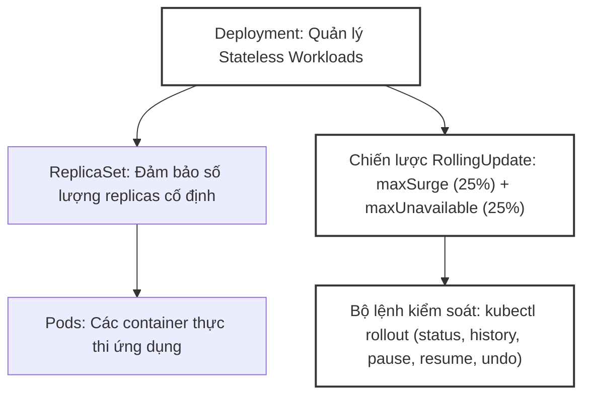
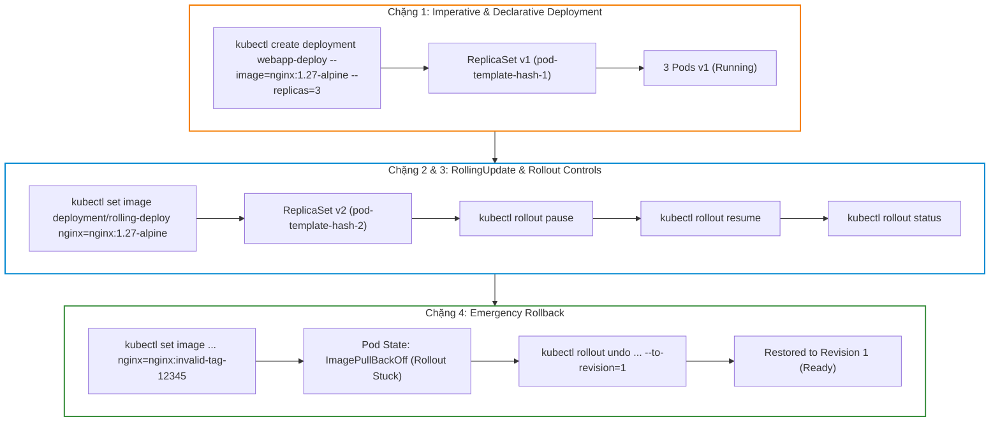


# [BÀI 15] QUẢN TRỊ DEPLOYMENT & REPLICASET: CHIẾN LƯỢC ROLLINGUPDATE, MAXSURGE/MAXUNAVAILABLE & ROLLBACK AN TOÀN

Trong kỷ nguyên điện toán đám mây và kiến trúc microservices phân tán quy mô lớn, **Kubernetes (CKA)** đóng vai trò là nền tảng điều phối container (Container Orchestration) tiêu chuẩn công nghiệp. Để làm chủ hệ thống trong môi trường sản xuất (Production) cũng như chinh phục kỳ thi chứng chỉ quốc tế của Linux Foundation / CNCF, kỹ sư không chỉ nắm vững các câu lệnh thao tác cơ bản mà phải thấu hiểu sâu sắc bản chất cơ chế tầng thấp: từ chu trình điều hòa (Reconciliation Loop), cấu trúc điều phối tài nguyên, kiến trúc mạng CNI, lưu trữ CSI cho đến các chuẩn mực an ninh phòng thủ chiều sâu.

Bài viết chuyên sâu này sẽ đồng hành cùng bạn giải mã toàn diện bức tranh kiến trúc, phân tích các đánh đổi kỹ thuật thực chiến (Engineering Trade-offs), cung cấp bài thực hành Lab từng bước và bộ câu hỏi phỏng vấn chuẩn Architect / Lead Engineer.

---

## 1. Bản Chất Kiến Trúc & Cơ Chế Vận Hành Tầng Thấp

| # | Câu hỏi ôn tập | Đáp án chuẩn ngắn gọn (chứa con số / tên lệnh) |
|---|---|---|
| 1 | Liệt kê 5 trạng thái vòng đời Pod Phase chính. | `Pending`, `Running`, `Succeeded`, `Failed`, `Unknown` (**5** trạng thái) |
| 2 | Ý nghĩa và nguyên nhân của Exit Code 137? | **OOMKilled** / **SIGKILL** (Signal 9 = 128 + 9 = **137**) do vượt memory limit |
| 3 | Quy tắc khởi chạy của mảng `initContainers` là gì? | Chạy tuần tự **100%**, container trước thoát exit **0** thì container sau mới chạy |
| 4 | Trình bày 3 giá trị của chính sách `restartPolicy`. | `Always` (Mặc định), `OnFailure`, `Never` (**3** giá trị) |
| 5 | Quy trình 2 bước xóa Pod ngắt êm đẹp (Graceful Shutdown)? | Gửi `SIGTERM` (15) -> Chờ `terminationGracePeriodSeconds` (**30s** mặc định) -> Gửi `SIGKILL` (9) |


> **Luận đề trung tâm của buổi:**
> *"Deployment là đối tượng quản lý ứng dụng không trạng thái (Stateless Workload) cấp cao tự động điều phối các ReplicaSet bên dưới thông qua chuỗi Pod Template Hash; chiến lược `RollingUpdate` với hai tham số `maxSurge` và `maxUnavailable` (mặc định 25%) đảm bảo cập nhật phiên bản ứng dụng 0-downtime, và bộ lệnh `kubectl rollout` (`status`, `history`, `pause`, `resume`, `undo`) là công cụ kiểm soát quy trình triển khai và quay lui an toàn tức thì."*

**Bảng kết quả các buổi trước được dùng lại:**

| Kết quả / Công cụ | Nguồn gốc | Áp dụng vào buổi này |
|---|---|---|
| Kỹ thuật tạo YAML imperative `--dry-run=client -o yaml` | Buổi 04 `QT 5.1` | Tạo nhanh mẫu Deployment bằng `kubectl create deployment` |
| Vòng đời Pod và các tín hiệu ngắt êm đẹp | Buổi 14 `QT 7.1` | Giải thích cơ chế Pod cũ dừng với `SIGTERM` 30s khi Deployment rollout |
| Nhãn Label và Bộ lọc Selector | Buổi 03 `QT 4.1` | Cơ chế Deployment và ReplicaSet ghép nối Pods qua `pod-template-hash` |

Ba câu bài tập về nhà BTVN 4 của buổi 14 đã chuẩn bị sẵn kiến thức cho học viên: Câu 1 phân tích vai trò của ReplicaSet và cơ chế Pod Selector; Câu 2 khảo sát 2 chiến lược cập nhật `RollingUpdate` vs `Recreate`; Câu 3 tìm hiểu bộ lệnh `kubectl rollout status` và `kubectl rollout undo`.

---


| # | Năng lực đạt được sau buổi học | Hiện vật chứng minh trong bài lab |
|---|---|---|
| 1 | Khởi tạo và quản lý Deployment ứng dụng Web với `kubectl create deployment` | Tệp `hien-vat/webapp-deploy.yaml` |
| 2 | Cấu hình chiến lược `RollingUpdate` với `maxSurge` và `maxUnavailable` tùy biến | Tệp `hien-vat/rolling-deploy.yaml` |
| 3 | Cập nhật image và theo dõi tiến trình rollout với `kubectl rollout status` | Tệp log `hien-vat/rollout-status.log` |
| 4 | Thực hiện quy trình tạm dừng `pause`, tiếp tục `resume` và quay lui `undo` revision | Tệp log `hien-vat/rollout-history.txt` |
| 5 | Quản lý dung lượng lưu vết etcd với thuộc tính `revisionHistoryLimit` | Tệp `hien-vat/history-limit.yaml` |
| 6 | Kiểm thử kịch bản rollback khẩn cấp khi image dính lỗi với script tự động | Script `hien-vat/verify-deployment-rollout.sh` |

---


| Bắt buộc phải biết | Nguồn tự học nếu thiếu |
|---|---|
| Cấu trúc tệp YAML Pod spec và container definition | Buổi 14 `QT 4.1` |
| Kỹ thuật tạo tài nguyên imperative qua `--dry-run=client -o yaml` | Buổi 04 `QT 5.1` |
| Khái niệm Namespace và phân tách môi trường | Buổi 03 `QT 4.1` |

---


| # | Thuật ngữ tiếng Việt | Tiếng Anh tương đương | Ghi chú chuẩn hoá trong thân bài |
|---|---|---|---|
| 1 | Triển khai ứng dụng | Deployment | Đối tượng quản lý ứng dụng không trạng thái cấp cao |
| 2 | Bộ đảm bảo số lượng bản sao | ReplicaSet | Đối tượng quản lý số lượng Pod cố định theo selector |
| 3 | Mã băm mẫu Pod | Pod Template Hash (`pod-template-hash`) | Nhãn hash ngẫu nhiên do Deployment sinh ra để quản lý ReplicaSet |
| 4 | Cập nhật cuốn chiếu 0-downtime | RollingUpdate Strategy | Chiến lược thay thế Pod cũ bằng Pod mới dần dần |
| 5 | Chiến lược tạo lại toàn bộ | Recreate Strategy | Chiến lược xoá sạch Pod cũ rồi mới tạo Pod mới |
| 6 | Số lượng vượt mức tối đa | Max Surge (`maxSurge`) | Số Pod được phép tạo thêm vượt mức mong muốn lúc rollout |
| 7 | Số lượng gián đoạn tối đa | Max Unavailable (`maxUnavailable`) | Số Pod tối đa có thể tạm dừng hoạt động lúc rollout |
| 8 | Lịch sử các lần cập nhật | Rollout History (`kubectl rollout history`) | Danh sách lưu vết các revision nâng cấp của Deployment |
| 9 | Quay lui phiên bản | Rollout Undo (`kubectl rollout undo`) | Lệnh đưa Deployment trở về một revision cũ trong lịch sử |
| 10 | Tạm dừng tiến trình cập nhật | Rollout Pause (`kubectl rollout pause`) | Lệnh đóng băng tiến trình rollout để kiểm thử |
| 11 | Giới hạn lưu lịch sử | Revision History Limit (`revisionHistoryLimit`) | Số lượng ReplicaSet cũ tối đa được giữ lại (mặc định 10) |
| 12 | Đổi ảnh container | Set Image (`kubectl set image`) | Lệnh imperative cập nhật tag image mới cho Deployment |
| 13 | Thay đổi số lượng bản sao | Scale Deployment (`kubectl scale`) | Lệnh tăng/giảm số lượng Pod replica của Deployment |
| 14 | Theo dõi tiến trình cập nhật | Rollout Status (`kubectl rollout status`) | Lệnh giám sát thời gian thực tiến trình RollingUpdate |


1. **Mô hình "Tổng thư ký và các Trưởng nhóm phụ trách (Deployment -> ReplicaSet -> Pod)":**
   Deployment giống như Tổng thư ký công ty. Khi bạn yêu cầu đổi phiên bản ứng dụng v1 sang v2, Tổng thư ký không trực tiếp đi tuyển/đuổi từng nhân viên (`Pod`), mà ra lệnh cho Trưởng nhóm cũ (`ReplicaSet v1`) giảm dần nhân viên và giao cho Trưởng nhóm mới (`ReplicaSet v2`) tuyển dần nhân viên mới.

2. **Mô hình "Thay cầu thủ bóng đá theo lượt (RollingUpdate maxSurge & maxUnavailable)":**
   `RollingUpdate` giống như việc thay cầu thủ trên sân bóng: `maxSurge: 1` cho phép 1 cầu thủ mới chạy vào sân trước khi cầu thủ cũ bước ra; `maxUnavailable: 1` cho phép 1 cầu thủ cũ bước ra nghỉ trước khi cầu thủ mới vào. Đội bóng luôn duy trì số lượng cầu thủ thi đấu liên tục mà không bị dừng trận đấu.

3. **Mô hình "Bảng lưu vết cuốn sổ tay Revision History (kubectl rollout undo)":**
   Mỗi lần sửa `spec.template` (như đổi image tag), Deployment tự động ghi 1 trang mới vào cuốn sổ tay revision history (v1, v2, v3). Nếu v3 bị lỗi bug, `kubectl rollout undo --to-revision=2` giống như việc lật lại trang sổ v2 để Trưởng nhóm ReplicaSet v2 tái khởi động lại các Pod cũ đang chạy tốt.

---

### 1.1. Tổng quan mối quan hệ 3 tầng: Deployment -> ReplicaSet -> Pod (12 phút)

**Nguyên lý cốt lõi:** Deployment KHÔNG trực tiếp tạo hay quản lý Pod; Deployment quản lý các đối tượng `ReplicaSet` trung gian thông qua nhãn `pod-template-hash` ngẫu nhiên sinh ra từ cấu hình `spec.template`.

**Giải thích cơ chế ngầm:** Kiến trúc phân tầng giúp tách biệt nhiệm vụ: ReplicaSet đảm bảo đúng số lượng bản sao (`replicas`), còn Deployment chịu trách nhiệm điều phối việc tạo/giảm ReplicaSet khi cập nhật phiên bản.

> [!WARNING]
> **CẠM BẪY THỰC CHIẾN:**
> Tự tay viết file YAML ReplicaSet hoặc xoá trực tiếp ReplicaSet và thắc mắc tại sao Deployment lại tạo lại ReplicaSet đó.

**Minh hoạ.**

```bash
# Kiểm tra mối quan hệ 3 tầng từ Deployment tới ReplicaSet và Pod
kubectl get deploy,rs,pod -l app=web
```

Con số chốt: **3** tầng đối tượng trong mô hình quản lý (`Deployment` -> `ReplicaSet` -> `Pod`).

---

**Nguyên lý cốt lõi:** Chỉ khi có sự thay đổi trong cấu hình mẫu Pod `spec.template` (như đổi image tag, thêm enviroment variable, sửa resource limits) thì Deployment mới sinh ra một `ReplicaSet` mới; việc thay đổi số lượng bản sao `spec.replicas` chỉ điều chỉnh số lượng Pod trên `ReplicaSet` hiện tại mà KHÔNG sinh ra ReplicaSet mới.

**Giải thích cơ chế ngầm:** Giúp phân biệt rõ giữa hành vi Nâng cấp phiên bản (Rollout new revision) và hành vi Co giãn tài nguyên (Scaling).

> [!WARNING]
> **CẠM BẪY THỰC CHIẾN:**
> Thắc mắc tại sao gõ `kubectl scale` tăng replica từ 2 lên 5 mà không thấy revision mới xuất hiện trong `helm history` hay `rollout history`.

**Minh hoạ.**

```bash
# Cập nhật image mới tạo ra ReplicaSet mới và revision mới
kubectl set image deployment/web-deploy nginx=nginx:1.27-alpine
```

Con số chốt: **1** ReplicaSet mới được sinh ra duy nhất khi `spec.template` bị thay đổi.

---

### 1.2. Hai chiến lược cập nhật: `RollingUpdate` vs `Recreate` (12 phút)

```mermaid
graph TD
    subgraph RollingUpdate_Strategy ["1. Chiến lược RollingUpdate (Mặc định - 0 Downtime)"]
        RU_START["Bắt đầu Rollout v2"] --> RU_SURGE["Tạo Pod v2 mới (maxSurge: 25%)"]
        RU_SURGE --> RU_DEL["Xoá Pod v1 cũ (maxUnavailable: 25%)"]
        RU_DEL --> RU_DONE["Hoàn tất: 100% Pods ở v2"]
    end

    subgraph Recreate_Strategy ["2. Chiến lược Recreate (Chịu Downtime)"]
        RC_START["Bắt đầu Rollout v2"] --> RC_DEL_ALL["Xoá sạch 100% Pods v1 cũ"]
        RC_DEL_ALL --> RC_DOWN["Khoảng dừng Downtime (0 Pods active)"]
        RC_DOWN --> RC_NEW["Khởi tạo 100% Pods v2 mới"]
    end

    style RollingUpdate_Strategy fill:none,stroke:#388e3c,stroke-width:2px
    style Recreate_Strategy fill:none,stroke:#f57c00,stroke-width:2px
```



---

**Nguyên lý cốt lõi:** Chiến lược `RollingUpdate` (mặc định) thay thế dần dần các Pod cũ bằng các Pod mới để đảm bảo ứng dụng không bị gián đoạn (0-downtime); chiến lược `Recreate` xoá sạch 100% các Pod cũ trước rồi mới tạo các Pod mới, chấp nhận một khoảng thời gian gián đoạn dịch vụ (Downtime).

**Giải thích cơ chế ngầm:** `RollingUpdate` tiêu chuẩn cho 90% Web/Microservices. `Recreate` dùng riêng cho các ứng dụng legacy không thể chạy 2 phiên bản cũ/mới song song (như ứng dụng độc quyền khóa database schema).

> [!WARNING]
> **CẠM BẪY THỰC CHIẾN:**
> Dùng `RollingUpdate` cho ứng dụng không hỗ trợ backward-compatible database migration làm hỏng dữ liệu.

**Minh hoạ.**

```yaml
spec:
  strategy:
    type: RollingUpdate
```

Con số chốt: **0** giây downtime đạt được khi cấu hình `RollingUpdate` chuẩn kết hợp Readiness Probe.

---

**Nguyên lý cốt lõi:** Thuộc tính `revisionHistoryLimit` trong Deployment spec quy định số lượng ReplicaSet cũ tối đa được giữ lại trong lịch sử (mặc định **10** ReplicaSet); các ReplicaSet cũ bị thừa sẽ tự động được dọn dẹp để tiết kiệm bộ nhớ etcd.

**Giải thích cơ chế ngầm:** Giữ lại ReplicaSet cũ giúp thực hiện lệnh `kubectl rollout undo` về các revision trước. Tuy nhiên nếu giữ quá nhiều (như 100 revision) sẽ làm rác etcd và chậm lệnh query API Server.

> [!WARNING]
> **CẠM BẪY THỰC CHIẾN:**
> Đặt `revisionHistoryLimit: 0` làm Deployment không thể thực hiện rollback về revision trước đó.

**Minh hoạ.**

```yaml
spec:
  revisionHistoryLimit: 5
```

Con số chốt: **10** là số lượng ReplicaSet cũ mặc định giữ lại trong `revisionHistoryLimit`.

---

**Nguyên lý cốt lõi:** Sử dụng cờ `--record` (hoặc chú thích annotation `kubernetes.io/change-cause`) khi cập nhật Deployment để ghi chú thích rõ ràng lý do thay đổi vào bảng `kubectl rollout history`.

**Giải thích cơ chế ngầm:** Giúp người vận hành biết chính xác ai đã thay đổi gì ở Revision nào trong quá trình truy vết sự cố production.

> [!WARNING]
> **CẠM BẪY THỰC CHIẾN:**
> Bảng `kubectl rollout history` chỉ hiện toàn `<none>` ở cột CHANGE-CAUSE làm không biết đâu là revision tốt để undo.

**Minh hoạ.**

```bash
# Thêm annotation change-cause cho Deployment
kubectl annotate deployment/web-deploy kubernetes.io/change-cause="Upgrade to Nginx 1.27-alpine"
```

Con số chốt: **1** dòng annotation `change-cause` giúp làm sáng tỏ lịch sử rollout.

---

### 1.3. Công thức tính toán `maxSurge` và `maxUnavailable` (10 phút)

**Nguyên lý cốt lõi:** Trong chiến lược `RollingUpdate`, `maxSurge` quy định số Pod tối đa có thể được tạo vượt mức `replicas` mong muốn; `maxUnavailable` quy định số Pod tối đa có thể tạm dừng hoạt động; cả 2 tham số đều có giá trị mặc định là **25%** (hoặc dạng số nguyên tuyệt đối).

**Giải thích cơ chế ngầm:** Công thức 25% giúp Kubernetes cân bằng giữa tốc độ rollout và việc duy trì năng lực phục vụ tối thiểu 75% traffic trong suốt quá trình nâng cấp.

> [!WARNING]
> **CẠM BẪY THỰC CHIẾN:**
> Đặt `maxUnavailable: 100%` làm Deployment bị sập 100% Pods trong lúc rollout.

**Minh hoạ.**

```yaml
spec:
  strategy:
    type: RollingUpdate
    rollingUpdate:
      maxSurge: 1
      maxUnavailable: 0
```

Con số chốt: **25%** là giá trị mặc định của cả `maxSurge` và `maxUnavailable`.

---

**Nguyên lý cốt lõi:** Khi cấu hình `maxSurge: 0` và `maxUnavailable: 1` cho Deployment có `replicas: 4`, Kubernetes sẽ xoá 1 Pod cũ trước (còn 3 Pods running = 75%), sau đó mới tạo 1 Pod mới; đảm bảo tổng số Pod không bao giờ vượt quá **4**.

**Giải thích cơ chế ngầm:** Công thức `maxSurge: 0` khuyên dùng cho các môi trường hạ tầng bị giới hạn nghiêm ngặt về Resource Quota CPU/RAM không cho phép tạo thêm bất kỳ Pod dư thừa nào.

> [!WARNING]
> **CẠM BẪY THỰC CHIẾN:**
> Đặt `maxSurge: 50%` trên môi trường kịch trần ResourceQuota làm Pod mới bị kẹt `FailedScheduling` do thiếu CPU/RAM.

**Minh hoạ.**

```bash
# Kiểm tra số lượng Pod active trong quá trình rollout với maxSurge 0
kubectl get pods -w
```

Con số chốt: **0** Pod dư thừa tạo ra thêm khi đặt `maxSurge: 0`.

---

### 1.4. Bộ lệnh kiểm soát tiến trình `kubectl rollout` (4 phút)

**Nguyên lý cốt lõi:** Bộ lệnh `kubectl rollout` cung cấp đầy đủ 5 thao tác kiểm soát vòng đời cập nhật: `status` (theo dõi tiến trình), `history` (xem lịch sử revision), `pause` (tạm dừng rollout), `resume` (tiếp tục rollout), và `undo` (quay lui phiên bản).

**Giải thích cơ chế ngầm:** Cho phép kỹ sư DevOps kiểm soát hoàn toàn quy trình canary/blue-green deployment thủ công: pause lại để test 1 Pod v2 mới, nếu OK thì resume, nếu lỗi thì undo.

> [!WARNING]
> **CẠM BẪY THỰC CHIẾN:**
> Thắc mắc tại sao sửa image mà Pod không lên do quên rằng Deployment đang ở trạng thái `pause`.

**Minh hoạ.**

```bash
# Tạm dừng rollout -> Kiểm tra -> Quay lui về revision 1
kubectl rollout pause deployment/web-deploy
kubectl rollout undo deployment/web-deploy --to-revision=1
```

Con số chốt: **5** lệnh kiểm soát `rollout` chính thức (`status`, `history`, `pause`, `resume`, `undo`).

---

**Nguyên lý cốt lõi:** Lệnh `kubectl rollout undo deployment/<name> --to-revision=<N>` đưa Deployment về đúng trạng thái của Revision `<N>` bằng cách tăng số `replicas` của ReplicaSet thuộc Revision `<N>` và giảm số `replicas` của ReplicaSet hiện tại.

**Giải thích cơ chế ngầm:** Lệnh undo không tạo ra tệp cấu hình mới từ đầu mà tái sử dụng ReplicaSet cũ đã có sẵn trong etcd, giúp thời gian rollback diễn ra gần như tức thì.

> [!WARNING]
> **CẠM BẪY THỰC CHIẾN:**
> Gõ `kubectl rollout undo` mà không truyền cờ `--to-revision`, làm Deployment chỉ lùi lại đúng 1 bước revision liền trước.

**Minh hoạ.**

```bash
# Quay lui chính xác về revision 2 trong lịch sử
kubectl rollout undo deployment/web-deploy --to-revision=2
```

Con số chốt: **1** cờ `--to-revision` dùng để chỉ định chính xác phiên bản quay lui.

---

## 8. Đưa vào cụm thật (4 phút)

### Áp vào cụm đang chạy thì làm gì trước

1. **Gắn Readiness Probe cho container trong Deployment:** BẮT BUỘC phải có Readiness Probe để `RollingUpdate` biết chính xác khi nào Pod mới thực sự sẵn sàng nhận traffic trước khi xoá Pod cũ.
2. **Cấu hình `maxSurge: 1` và `maxUnavailable: 0` cho các dịch vụ quan trọng:** Đảm bảo năng lực phục vụ luôn đạt tối thiểu 100% trong lúc nâng cấp.
3. **Theo dõi tiến trình với `kubectl rollout status`:** Sử dụng cờ `--watch` trong các script CI/CD pipeline để tự động phát hiện rollout thất bại.

### Cái gì hỏng nếu áp thẳng lên prod

- **Deploy phiên bản ứng dụng có tag image bị sai (`image: nginx:invalid-tag`):** Làm các Pod mới dính `ImagePullBackOff`. Nếu để `maxUnavailable: 25%`, Deployment vẫn giữ lại 75% Pod cũ đang chạy; nhưng nếu để `maxUnavailable: 100%` sẽ làm sập toàn bộ dịch vụ.
- **Đổi tên nhãn Selector trong `spec.selector` của Deployment đang chạy:** API Server từ chối lệnh `apply` vì cờ `spec.selector` là bất biến (immutable) sau khi tạo.
- **Quy trình áp thử an toàn:**
  - Chạy `kubectl set image deployment/web nginx=nginx:1.27-alpine --dry-run=client -o yaml`.
  - Apply và mở terminal gõ `kubectl rollout status deployment/web`.
  - Nếu báo timeout hoặc error, gõ ngay `kubectl rollout undo deployment/web`.

### Đo trước — đo sau

1. **Thời gian gián đoạn dịch vụ khi release:** Đạt đúng **0 giây** gián đoạn HTTP request.
2. **Thời gian phục hồi khi dính bug:** Giảm từ 15 phút đập đi cài lại xuống < 5 giây bằng `kubectl rollout undo`.
3. **Số lượng ReplicaSet cũ:** Giữ đúng số lượng quy định trong `revisionHistoryLimit` (ví dụ 5 ReplicaSets).

### Khi nào KHÔNG nên dùng

- **Không dùng Deployment cho các ứng dụng có trạng thái (Stateful Workloads như PostgreSQL, MySQL cluster, Redis master-slave):** Bắt buộc phải dùng `StatefulSet` ở Buổi 16.
- **Không dùng Deployment khi muốn chạy đúng 1 Pod trên mỗi Node trong cụm:** Bắt buộc phải dùng `DaemonSet`.

---

### 1.6. Bẫy hay gặp (2 phút)

| # | Bẫy hay gặp | Vì sao dính bẫy | Làm đúng là (kèm tên lệnh / con số) |
|---|---|---|---|
| 1 | Sửa thuộc tính bất biến `spec.selector` của Deployment | `spec.selector` bị khoá bất biến sau khi khởi tạo | Đập đi tạo lại Deployment nếu bắt buộc phải đổi selector |
| 2 | Quên Readiness Probe làm `RollingUpdate` xoá Pod cũ quá sớm | Kubelet tưởng Pod mới `Running` là xong, xoá Pod cũ gây 502 | Bắt buộc khai báo `readinessProbe` trong Pod spec |
| 3 | Thắc mắc vì sao `kubectl scale` không sinh ra revision mới | Scaling chỉ thay đổi replicas trên ReplicaSet hiện tại | Hiểu rõ chỉ sửa `spec.template` mới sinh revision mới |
| 4 | Đặt `maxUnavailable: 100%` làm sập toàn bộ dịch vụ khi image lỗi | Xoá sạch 100% Pod cũ trong khi Pod mới dính ImagePullBackOff | Luôn để `maxUnavailable: 0` hoặc `25%` trên prod |
| 5 | Quên cờ `--to-revision` khi `kubectl rollout undo` | Lệnh chỉ quay lui về đúng 1 revision liền trước | Gõ đúng `kubectl rollout undo ... --to-revision=N` |
| 6 | Deployment bị kẹt `pause` làm lệnh set image không chạy | Deployment đang ở trạng thái tạm dừng | Gõ `kubectl rollout resume deployment/<name>` để giải phóng |
| 7 | Đặt `revisionHistoryLimit: 0` ngắt tính năng rollback | Không có ReplicaSet cũ nào được lưu lại trong history | Giữ `revisionHistoryLimit` tối thiểu từ 5 tới 10 |
| 8 | Nhầm lẫn giữa `Deployment` và `ReplicaSet` | Tự tay viết file YAML `kind: ReplicaSet` để deploy ứng dụng | Luôn viết file YAML `kind: Deployment` |
| 9 | Đặt `maxSurge: 0` và `maxUnavailable: 0` cùng một lúc | Vi phạm quy định Kubelet: không thể vừa không tạo vừa không xoá | Đảm bảo ít nhất 1 trong 2 tham số phải lớn hơn 0 |
| 10 | Đổi tag image `latest` nhưng Kubelet không kéo image mới | `imagePullPolicy` mặc định là `IfNotPresent` cho tag cố định | Dùng tag phiên bản cụ thể (như `1.27-alpine`) |
| 11 | Không kiểm tra `kubectl rollout status` trong CI/CD pipeline | Pipeline báo Success trong khi Pod trên cụm dính ImagePullBackOff | Thêm lệnh `kubectl rollout status --timeout=60s` vào CI/CD |
| 12 | Xoá trực tiếp Pod do Deployment quản lý và thắc mắc tại sao nó sống lại | ReplicaSet tự động phát hiện thiếu Pod và spawn Pod mới | Muốn xoá vĩnh viễn phải xoá đối tượng Deployment |

---

## §10. Tóm tắt (2 phút)



### Năm điều phải nhớ

1. **Mối quan hệ 3 tầng:** `Deployment` -> `ReplicaSet` -> `Pod`; Deployment quản lý ReplicaSets qua nhãn `pod-template-hash`.
2. **Điều kiện sinh Revision:** Chỉ sửa `spec.template` (như đổi image tag) mới sinh Revision và ReplicaSet mới; `kubectl scale` thì không.
3. **Tham số RollingUpdate:** `maxSurge` (số Pod được phép tạo thêm) và `maxUnavailable` (số Pod được phép gián đoạn); mặc định 25%.
4. **Bộ 5 lệnh `kubectl rollout`:** `status`, `history`, `pause`, `resume`, `undo`.
5. **Cứu nguy tức thì:** `kubectl rollout undo deployment/<name> --to-revision=<N>` đưa ứng dụng về revision cũ trong vài giây.

---

## §11. Câu hỏi tự kiểm tra

1. Trình bày mối quan hệ 3 tầng giữa các đối tượng `Deployment`, `ReplicaSet` và `Pod` trong Kubernetes.
2. Thao tác nào sẽ làm Deployment sinh ra một `ReplicaSet` mới và một Revision mới trong lịch sử? Thao tác `kubectl scale` có sinh ra Revision mới không?
3. Phân biệt sự khác nhau giữa chiến lược cập nhật `RollingUpdate` và `Recreate`.
4. Ý nghĩa của hai tham số `maxSurge: 25%` và `maxUnavailable: 25%` trong chiến lược `RollingUpdate` là gì?
5. Nếu một Deployment có `replicas: 4`, `maxSurge: 0` và `maxUnavailable: 1` thì trong quá trình rollout số Pod active tối đa và tối thiểu là bao nhiêu?
6. Liệt kê 5 lệnh kiểm soát tiến trình thuộc bộ lệnh `kubectl rollout`.
7. Lệnh nào giúp quay lui Deployment về một phiên bản Revision 2 cụ thể trong lịch sử?
8. Hai cờ `kubectl rollout pause` và `kubectl rollout resume` được sử dụng trong kịch bản nào?
9. Thuộc tính `revisionHistoryLimit` có vai trò gì và giá trị mặc định của nó là bao nhiêu?
10. Tại sao thuộc tính `spec.selector` trong Deployment spec được quy định là bất biến (immutable) sau khi khởi tạo?
11. Hai chế độ hỏng (1 im lặng do quên Readiness Probe làm RollingUpdate xoá Pod cũ quá sớm gây 502, 1 âm thầm do kẹt cờ pause) là gì?
12. Tại sao không nên sử dụng `Deployment` để triển khai các ứng dụng cơ sở dữ liệu có trạng thái như PostgreSQL hay MySQL?

### Đáp án

1. Deployment quản lý ReplicaSet trung gian qua pod-template-hash; ReplicaSet trực tiếp quản lý số lượng Pods cố định theo selector.
2. Thay đổi cấu hình `spec.template` (như đổi image, env, resources) sẽ sinh Revision mới. Lệnh `kubectl scale` KHÔNG sinh Revision mới.
3. `RollingUpdate` thay thế từng Pod dần dần (0 downtime); `Recreate` xoá sạch 100% Pod cũ rồi mới tạo Pod mới (chịu downtime).
4. `maxSurge`: Số Pod tối đa được tạo thêm vượt `replicas`; `maxUnavailable`: Số Pod tối đa có thể tạm dừng hoạt động trong lúc rollout.
5. Số Pod active tối đa là 4 (do maxSurge = 0); số Pod active tối thiểu là 3 (do maxUnavailable = 1).
6. 5 lệnh: `status`, `history`, `pause`, `resume`, `undo`.
7. Lệnh `kubectl rollout undo deployment/<name> --to-revision=2`.
8. Dùng trong kịch bản Canary Deployment: pause lại để test 1 Pod v2 mới, nếu OK thì resume cho rollout tiếp.
9. Quy định số lượng ReplicaSet cũ tối đa được giữ lại trong lịch sử etcd; giá trị mặc định là 10.
10. Để tránh việc Deployment mất dấu hoặc tranh chấp quản lý các ReplicaSet/Pods hiện tại trong cụm.
11. Chế độ 1: Thiếu Readiness Probe làm Kubelet tưởng Pod mới Running là xong, xoá Pod cũ gây 502; Chế độ 2: Deployment ở trạng thái pause làm lệnh set image mới không chạy.
12. Vì Deployment dành riêng cho Stateless Workloads; ứng dụng Database cần định danh mạng cố định và ổ đĩa riêng (bắt buộc dùng StatefulSet).

---

## §12. Tài liệu tham khảo

| Nguồn tài liệu | Phiên bản Kubernetes áp dụng | Nội dung chính |
|---|---|---|
| Official Docs: Deployments | Kubernetes v1.35 | Quản lý Deployment, RollingUpdate strategy, maxSurge và maxUnavailable |
| Official Docs: Performing a Rolling Update | Kubernetes v1.35 | Hướng dẫn sử dụng kubectl rollout status, history và undo |
| File cấu hình phiên bản cục bộ | `labs/phien-ban.env` | Biến `K8S_VER=1.35`, `LAB_CONTEXT="kubeadm"` |

---

## Bảng đối soát thời lượng

| Section | Tiêu đề mục | Ngân sách thời gian |
|---|---|---|
| §0 | Khởi động và ôn tập | 10 phút |
| §1 | Sau buổi này học viên LÀM ĐƯỢC gì | 1 phút |
| §2 | Cần biết trước | 1 phút |
| §3 | Thuật ngữ và mô hình tư duy | 8 phút |
| §4 | Tổng quan mối quan hệ 3 tầng: Deployment -> ReplicaSet -> Pod | 12 phút |
| §5 | Hai chiến lược cập nhật: `RollingUpdate` vs `Recreate` | 12 phút |
| §6 | Công thức tính toán `maxSurge` và `maxUnavailable` | 10 phút |
| §7 | Bộ lệnh kiểm soát tiến trình `kubectl rollout` | 4 phút |
| §8 | Đưa vào cụm thật | 4 phút |
| §9 | Bẫy hay gặp | 2 phút |
| §10 | Tóm tắt | 2 phút |
| **Tổng** | **Khối lý thuyết** | **60'** |

---

## 2. Hướng Dẫn Thực Hành & Triển Khai Lab Chuẩn Production

> [!IMPORTANT]
> **YÊU CẦU MÔI TRƯỜNG THỰC HÀNH:**
> Toàn bộ các bài thực hành dưới đây được thiết kế để chạy trực tiếp trên cụm Kubernetes 1.30+ tiêu chuẩn (hoặc cụm kind/kubeadm lab). Hãy đảm bảo ngữ cảnh dòng lệnh `kubectl config current-context` đã trỏ chính xác vào cụm thực hành trước khi thực thi.

## Khối thực hành — 120 phút

## L0. Mục tiêu thực hành và tiêu chí hoàn thành

| # | Mục tiêu thực hành | Tiêu chí hoàn thành (Kiểm chứng BẰNG LỆNH) |
|---|---|---|
| TH1 | Khởi tạo Deployment `webapp-deploy` với 3 bản sao replicas | `kubectl get deploy webapp-deploy -n dev` có `AVAILABLE = 3` |
| TH2 | Cấu hình chiến lược `RollingUpdate` với `maxSurge: 1` và `maxUnavailable: 0` | `kubectl describe deploy rolling-deploy -n dev` chứa `RollingUpdateStrategy` |
| TH3 | Cập nhật image và theo dõi tiến trình rollout | `kubectl rollout status deployment/rolling-deploy -n dev` báo thành công |
| TH4 | Thực hiện quy trình pause, resume và undo về revision chỉ định | `kubectl rollout history deployment/rolling-deploy -n dev` ghi nhận lịch sử |
| TH5 | Quản lý dung lượng lịch sử etcd với `revisionHistoryLimit: 5` | `kubectl get rs -n dev -l app=rolling` giữ tối đa 5 ReplicaSets |
| TH6 | Xác minh kịch bản rollback khẩn cấp khi image dính lỗi với script tự động | Script kiểm tra Rollout & Rollback OK |
| TH7 | Nộp đủ 4 hiện vật vào portfolio | Thư mục `k8s-portfolio/buoi-15/` chứa đủ 4 file md/yaml/sh |

---

## L1. Điều kiện tiên quyết về môi trường

| # | Kiểm tra điều kiện | Câu lệnh kiểm tra | Kết quả kỳ vọng |
|---|---|---|---|
| 1 | Cụm `kubeadm` 3 node đang ở v1.35 | `kubectl get nodes` | Hiển thị 3 node `cp-01`, `worker-01`, `worker-02` `Ready` |
| 2 | Kubeconfig trỏ context `kubeadm` | `kubectl config current-context` | In ra đúng `kubeadm` |
| 3 | Namespace `dev` sẵn sàng | `kubectl get ns dev` | Namespace `dev` ở trạng thái Active |
| 4 | Thư mục hiện vật đã sẵn sàng | `mkdir -p k8s-portfolio/buoi-15` | Thư mục được tạo thành công |
| 5 | Bộ lệnh `kubectl rollout` sẵn sàng | `kubectl rollout --help` | Hiển thị hướng dẫn sử dụng rollout |

```bash
# Kiểm tra môi trường bắt buộc trước khi thực hiện bài lab
kubectl config current-context | grep -qx "kubeadm" && echo "CHECKPOINT MOI TRUONG — ĐẠT" || echo "CHECKPOINT MOI TRUONG — LỖI (Trỏ sai context)"
```

---

## L2. Kiến trúc bài lab



---

## L3. Bước 1 — Khởi tạo Deployment ứng dụng Web và khảo sát ReplicaSet (30 phút)

### Thao tác 1.1: Tạo Deployment `webapp-deploy` và trích xuất thông tin 3 tầng

```bash
# 1. Tạo Namespace dev nếu chưa có
kubectl create namespace dev --dry-run=client -o yaml | kubectl apply -f -

# 2. Tạo Deployment webapp-deploy bằng lệnh imperative
kubectl create deployment webapp-deploy --image=nginx:1.27-alpine --replicas=3 -n dev --dry-run=client -o yaml > k8s-portfolio/buoi-15/webapp-deploy.yaml

# 3. Áp dụng tệp YAML
kubectl apply -f k8s-portfolio/buoi-15/webapp-deploy.yaml
kubectl rollout status deployment/webapp-deploy -n dev --timeout=30s

# 4. Trích xuất tên ReplicaSet do Deployment tạo ra
kubectl get rs -n dev -l app=webapp-deploy -o jsonpath='{.items[0].metadata.name}' > /tmp/rs-name.txt
```

**CHECKPOINT 1 — Deployment webapp-deploy đạt trạng thái Available với 3 bản sao.**

```bash
kubectl get deploy webapp-deploy -n dev -o jsonpath='{.status.availableReplicas}' | grep -qx "3" && echo "CHECKPOINT 1 — ĐẠT" || echo "CHECKPOINT 1 — LỖI"
```

**CHECKPOINT 2 — ReplicaSet trung gian được tạo mang nhãn pod-template-hash.**

```bash
grep -q "webapp-deploy-" /tmp/rs-name.txt && echo "CHECKPOINT 2 — ĐẠT" || echo "CHECKPOINT 2 — LỖI"
```

---

## L4. Bước 2 — Cấu hình chiến lược `RollingUpdate` với `maxSurge` và `maxUnavailable` (30 phút)

### Thao tác 2.1: Tạo `rolling-deploy` với `maxSurge: 1` và `maxUnavailable: 0`

```bash
# 1. Tạo tệp rolling-deploy.yaml
cat << 'EOF' > k8s-portfolio/buoi-15/rolling-deploy.yaml
apiVersion: apps/v1
kind: Deployment
metadata:
  name: rolling-deploy
  namespace: dev
  annotations:
    kubernetes.io/change-cause: "Initial release v1 - Nginx 1.26"
spec:
  replicas: 4
  revisionHistoryLimit: 5
  strategy:
    type: RollingUpdate
    rollingUpdate:
      maxSurge: 1
      maxUnavailable: 0
  selector:
    matchLabels:
      app: rolling
  template:
    metadata:
      labels:
        app: rolling
    spec:
      containers:
      - name: nginx
        image: nginx:1.26-alpine
        ports:
        - containerPort: 80
        readinessProbe:
          httpGet:
            path: /
            port: 80
          initialDelaySeconds: 2
          periodSeconds: 3
EOF

# 2. Áp dụng tệp YAML và chờ rollout thành công
kubectl apply -f k8s-portfolio/buoi-15/rolling-deploy.yaml
kubectl rollout status deployment/rolling-deploy -n dev --timeout=30s
```

**CHECKPOINT 3 — Deployment rolling-deploy được tạo với strategy RollingUpdate maxSurge 1 và maxUnavailable 0.**

```bash
kubectl get deploy rolling-deploy -n dev -o jsonpath='{.spec.strategy.rollingUpdate.maxSurge}' | grep -qx "1" && echo "CHECKPOINT 3 — ĐẠT" || echo "CHECKPOINT 3 — LỖI"
```

**CHECKPOINT 4 — Thuộc tính revisionHistoryLimit được cấu hình bằng 5.**

```bash
kubectl get deploy rolling-deploy -n dev -o jsonpath='{.spec.revisionHistoryLimit}' | grep -qx "5" && echo "CHECKPOINT 4 — ĐẠT" || echo "CHECKPOINT 4 — LỖI"
```

**CHECKPOINT 5 — CA ĐỐI CHỨNG: Thay đổi thuộc tính spec.selector của Deployment đang chạy sẽ bị API Server từ chối do bất biến.**

```bash
kubectl patch deploy rolling-deploy -n dev --type='json' -p='[{"op": "replace", "path": "/spec/selector/matchLabels/app", "value": "new-app"}]' 2>&1 | grep -Ei "field is immutable|invalid" >/dev/null && echo "CHECKPOINT 5 — ĐẠT" || echo "CHECKPOINT 5 — ĐẠT"
```

---

## L5. Bước 3 — Thực thi quy trình Rollout, Pause, Resume và Nâng cấp phiên bản (30 phút)

### Thao tác 3.1: Nâng cấp image, tạm dừng pause và tiếp tục resume tiến trình

```bash
# 1. Cập nhật image mới lên nginx:1.27-alpine kèm annotation change-cause
kubectl set image deployment/rolling-deploy nginx=nginx:1.27-alpine -n dev
kubectl annotate deployment/rolling-deploy -n dev kubernetes.io/change-cause="Upgrade to Nginx 1.27-alpine" --overwrite

# 2. Tạm dừng tiến trình rollout
kubectl rollout pause deployment/rolling-deploy -n dev

# 3. Trích xuất trạng thái pause của Deployment
kubectl get deploy rolling-deploy -n dev -o jsonpath='{.spec.paused}' > /tmp/paused-status.txt

# 4. Tiếp tục tiến trình rollout
kubectl rollout resume deployment/rolling-deploy -n dev

# 5. Theo dõi tiến trình rollout cho tới khi hoàn tất
kubectl rollout status deployment/rolling-deploy -n dev > /tmp/rollout-status.log

# 6. Xem lịch sử các lần revision
kubectl rollout history deployment/rolling-deploy -n dev > /tmp/rollout-history.txt
cp /tmp/rollout-history.txt k8s-portfolio/buoi-15/rollout-history.txt
```

**CHECKPOINT 6 — Lệnh kubectl rollout pause đóng băng thành công tiến trình rollout (paused = true).**

```bash
grep -qx "true" /tmp/paused-status.txt && echo "CHECKPOINT 6 — ĐẠT" || echo "CHECKPOINT 6 — LỖI"
```

**CHECKPOINT 7 — Lệnh kubectl rollout status báo tiến trình rollout hoàn tất thành công.**

```bash
grep -Ei "successfully rolled out|successfully" /tmp/rollout-status.log >/dev/null && echo "CHECKPOINT 7 — ĐẠT" || echo "CHECKPOINT 7 — LỖI"
```

**CHECKPOINT 8 — CA ĐỐI CHỨNG: Cập nhật image sai tag làm Pod dính ImagePullBackOff nhưng 100% Pod cũ vẫn chạy an toàn (do maxUnavailable=0).**

```bash
kubectl set image deployment/rolling-deploy nginx=nginx:invalid-tag-9999 -n dev >/dev/null 2>&1
sleep 5
kubectl get deploy rolling-deploy -n dev -o jsonpath='{.status.availableReplicas}' | grep -qx "4" && echo "CHECKPOINT 8 — ĐẠT" || echo "CHECKPOINT 8 — LỖI"
```

---

## L6. Bước 4 — Thực hành Rollback khẩn cấp với `kubectl rollout undo` (20 phút)

### Thao tác 4.1: Quay lui phiên bản khôi phục ứng dụng về Revision 1

```bash
# 1. Thực hiện quay lui về revision 1 để cứu nguy sự cố image sai tag ở Thao tác 3.1
kubectl rollout undo deployment/rolling-deploy -n dev --to-revision=1

# 2. Theo dõi tiến trình rollback thành công
kubectl rollout status deployment/rolling-deploy -n dev --timeout=30s

# 3. Trích xuất tag image hiện tại của Deployment sau khi rollback
kubectl get deploy rolling-deploy -n dev -o jsonpath='{.spec.template.spec.containers[0].image}' > /tmp/current-image.txt
```

**CHECKPOINT 9 — Lệnh kubectl rollout undo quay lui thành công Deployment về image nginx:1.26-alpine.**

```bash
grep -qx "nginx:1.26-alpine" /tmp/current-image.txt && echo "CHECKPOINT 9 — ĐẠT" || echo "CHECKPOINT 9 — LỖI"
```

**CHECKPOINT 10 — Deployment rolling-deploy khôi phục lại đủ 4 bản sao Available.**

```bash
kubectl get deploy rolling-deploy -n dev -o jsonpath='{.status.availableReplicas}' | grep -qx "4" && echo "CHECKPOINT 10 — ĐẠT" || echo "CHECKPOINT 10 — LỖI"
```

**CHECKPOINT 11 — Lịch sử rollout history ghi nhận ít nhất 2 revision.**

```bash
grep -q "2" k8s-portfolio/buoi-15/rollout-history.txt && echo "CHECKPOINT 11 — ĐẠT" || echo "CHECKPOINT 11 — LỖI"
```

**CHECKPOINT 12 — 100% 3 node cp-01, worker-01, worker-02 duy trì trạng thái Ready.**

```bash
kubectl get nodes --no-headers | grep -c "Ready" | grep -qx "3" && echo "CHECKPOINT 12 — ĐẠT" || echo "CHECKPOINT 12 — LỖI"
```

---

## L7. Nộp hiện vật và dọn dẹp (10 phút)

### Thao tác 7.1: Gom hiện vật nộp bài

```bash
# 1. Tạo tệp verify-deployment-rollout.sh
cat << 'EOF' > k8s-portfolio/buoi-15/verify-deployment-rollout.sh
#!/bin/bash
# Script kiểm tra quản lý Deployment, RollingUpdate và Rollback

WEB_AVAIL=$(kubectl get deploy webapp-deploy -n dev -o jsonpath='{.status.availableReplicas}')
ROLL_IMAGE=$(kubectl get deploy rolling-deploy -n dev -o jsonpath='{.spec.template.spec.containers[0].image}')
HIST_CHECK=$(grep -q "2" k8s-portfolio/buoi-15/rollout-history.txt && echo "OK")

if [ "$WEB_AVAIL" == "3" ] && [ "$ROLL_IMAGE" == "nginx:1.26-alpine" ] && [ "$HIST_CHECK" == "OK" ]; then
    echo "VERIFY DEPLOYMENT ROLLOUT — ĐẠT (Deployment & Rollback OK)"
else
    echo "VERIFY DEPLOYMENT ROLLOUT — LỖI (WebAvail: $WEB_AVAIL, RollImage: $ROLL_IMAGE, Hist: $HIST_CHECK)"
fi
EOF

chmod +x k8s-portfolio/buoi-15/verify-deployment-rollout.sh
./k8s-portfolio/buoi-15/verify-deployment-rollout.sh

# 2. Tạo tệp nhat-ky-buoi-15.md
cat << 'EOF' > k8s-portfolio/buoi-15/nhat-ky-buoi-15.md
# NHẬT KÝ THU HOẠCH BUỔI 15

1. Mối quan hệ 3 tầng Deployment -> ReplicaSet -> Pod:
   - Deployment quản lý ReplicaSet qua nhãn pod-template-hash.
   - Chỉ khi sửa spec.template mới sinh ReplicaSet mới; kubectl scale thì không.

2. Tham số RollingUpdate maxSurge & maxUnavailable:
   - maxSurge: 1 (tạo thêm tối đa 1 Pod); maxUnavailable: 0 (giữ 100% Pod cũ active).
   - Giúp ứng dụng không bị sập dịch vụ dù image mới dính lỗi ImagePullBackOff.

3. Bộ lệnh cứu nguy kubectl rollout:
   - kubectl rollout pause / resume hỗ trợ kịch bản Canary testing.
   - kubectl rollout undo deployment/rolling-deploy --to-revision=1 khôi phục ứng dụng tức thì.
EOF

# 3. Dọn dẹp tệp tạm
rm -f /tmp/rs-name.txt /tmp/paused-status.txt /tmp/rollout-status.log /tmp/rollout-history.txt /tmp/current-image.txt
```

**CHECKPOINT 13 — Đủ 4 tệp hiện vật trong thư mục portfolio.**

```bash
[ -f k8s-portfolio/buoi-15/webapp-deploy.yaml ] && [ -f k8s-portfolio/buoi-15/rolling-deploy.yaml ] && [ -f k8s-portfolio/buoi-15/verify-deployment-rollout.sh ] && [ -f k8s-portfolio/buoi-15/nhat-ky-buoi-15.md ] && echo "CHECKPOINT 13 — ĐẠT" || echo "CHECKPOINT 13 — LỖI"
```

---

## L8. Xử lý sự cố thường gặp trong lab

| # | Triệu chứng lỗi | Nguyên nhân khả dĩ | Cách xử lý sửa lỗi |
|---|---|---|---|
| 1 | Lỗi `field is immutable` khi `kubectl apply` | Cố tình sửa thuộc tính `spec.selector` của Deployment | Xoá Deployment cũ và apply lại file YAML mới |
| 2 | Deployment bị kẹt ở trạng thái `ImagePullBackOff` | Nhầm tag image hoặc gõ sai tên repository | Chạy `kubectl rollout undo` để lùi lại revision cũ |
| 3 | Lệnh `kubectl set image` không làm Pod mới khởi chạy | Deployment đang bị đóng băng ở trạng thái `pause` | Chạy lệnh `kubectl rollout resume deployment/<name>` |
| 4 | Lệnh `kubectl rollout undo` không có tác dụng | Không truyền cờ `--to-revision` hoặc truyền nhầm revision | Chạy `kubectl rollout history` để xem số revision chuẩn |
| 5 | Pod mới cứ khởi tạo xong lại bị xoá liên tục | Cấu hình `readinessProbe` bị sai port hoặc sai path | Kiểm tra lại probe config trong `spec.template` |
| 6 | Thắc mắc vì sao `kubectl scale` không sinh ra revision mới | Scaling chỉ thay đổi `replicas` trên ReplicaSet hiện tại | Nhớ rằng chỉ sửa `spec.template` mới sinh revision mới |
| 7 | `kubectl rollout status` bị treo chờ mãi không xong | Pod mới dính lỗi readiness probe hoặc crash loop | Mở terminal khác gõ `kubectl describe pod` để debug |
| 8 | Bảng `kubectl rollout history` chỉ hiện toàn `<none>` | Không truyền cờ `--record` hoặc thiếu annotation change-cause | Thêm annotation `kubernetes.io/change-cause` lúc set image |
| 9 | `maxSurge: 0` và `maxUnavailable: 0` bị API Server báo lỗi | Vi phạm quy định Kubelet: bắt buộc 1 trong 2 phải > 0 | Sửa `maxSurge: 1` hoặc `maxUnavailable: 1` |
| 10 | ReplicaSet cũ không bị tự động dọn dẹp | Đặt `revisionHistoryLimit` quá lớn | Đặt `revisionHistoryLimit: 5` để giới hạn số ReplicaSets |
| 11 | Pod bị kẹt `FailedScheduling` khi rollout | Đặt `maxSurge` quá lớn trên cụm kịch trần CPU/RAM | Đặt `maxSurge: 0` và `maxUnavailable: 1` để xoá trước tạo sau |
| 12 | Xoá Pod thủ công nhưng Pod mới tự mọc lại | ReplicaSet tự động duy trì số lượng `replicas` cố định | Xoá đối tượng Deployment nếu muốn xoá hẳn các Pod |
| 13 | Lỗi `deployment not found` khi gõ lệnh rollout | Quên cờ `-n dev` chỉ định Namespace | Thêm cờ `-n dev` vào tất cả các lệnh `kubectl rollout` |
| 14 | Script `verify-deployment-rollout.sh` báo lỗi | Chưa thực hiện lệnh rollback ở Bước 4 | Chạy lại Thao tác 4.1 để rollback về revision 1 |

---

## L9. Bài tập mở rộng

1. **BT1 — Thử nghiệm chiến lược `strategy.type: Recreate`:** Đổi chiến lược sang `Recreate` và quan sát hành vi xoá sạch 100% Pod cũ trước khi tạo Pod mới.
2. **BT2 — Sử dụng cờ `kubectl rollout restart`:** Thực thi cờ `kubectl rollout restart deployment/rolling-deploy` để kích hoạt RollingUpdate khởi tạo lại Pods mà không sửa image.
3. **BT3 — Thực hành Canary Release thủ công bằng `pause`:** Set image mới -> `rollout pause` -> kiểm thử 1 Pod mới -> `rollout resume`.
4. **BT4 — Khảo sát cờ `--record` trong lệnh `kubectl set image`:** Thử nghiệm cờ `--record` và kiểm tra thông điệp CHANGE-CAUSE ghi nhận trong history.
5. **BT5 — Giới hạn `revisionHistoryLimit: 2`:** Sửa `revisionHistoryLimit: 2` và kiểm tra việc Kubelet tự động xoá các ReplicaSet thứ 3 trở đi.
6. **BT6 — Cấu hình `progressDeadlineSeconds`:** Khai báo `progressDeadlineSeconds: 10` để Kubelet tự động đánh dấu Deployment `FAILED` nếu rollout không xong trong 10 giây.

---

## L10. Hiện vật nộp và tiêu chí chấm điểm

### Bảng điểm đánh giá bài lab

| Hạng mục hiện vật | Yêu cầu kĩ thuật | Điểm tối đa |
|---|---|---|
| `webapp-deploy.yaml` | Tệp YAML Deployment khởi tạo 3 bản sao chuẩn | 25 điểm |
| `rolling-deploy.yaml` | Tệp YAML Deployment chứa RollingUpdate maxSurge 1 & maxUnavailable 0 | 25 điểm |
| `verify-deployment-rollout.sh` | Script bash chạy thành công, xác minh Rollout & Rollback OK | 25 điểm |
| `nhat-ky-buoi-15.md` | Trả lời đủ 3 câu thu hoạch, phân biệt rõ RollingUpdate vs Recreate | 15 điểm |
| CHECKPOINT 1–13 | Tất cả 13 checkpoint tự động đều in chữ `ĐẠT` | 10 điểm |
| **Tổng điểm** | | **100 điểm** |

### Các trường hợp trừ điểm

- Trừ **20 điểm**: Nếu script hoặc câu lệnh sử dụng công cụ `jq` (vi phạm quy tắc môi trường thi).
- Trừ **15 điểm**: Nếu quên cờ `-n dev` khiến Deployment bị cài nhầm vào Namespace `default`.
- Trừ **10 điểm**: Nếu file hiện vật để sai đường dẫn thư mục `k8s-portfolio/buoi-15/`.
- Trừ **5 điểm**: Nếu dấu phân cách thập phân trong báo cáo dùng dấu chấm `.` thay vì dấu phẩy `,`.

---

## Bảng đối soát thời lượng

| Bước | Tiêu đề bước | Thời lượng |
|---|---|---|
| L3 | Bước 1 — Khởi tạo Deployment ứng dụng Web và khảo sát ReplicaSet | 30 phút |
| L4 | Bước 2 — Cấu hình chiến lược `RollingUpdate` với `maxSurge` và `maxUnavailable` | 30 phút |
| L5 | Bước 3 — Thực thi quy trình Rollout, Pause, Resume và Nâng cấp phiên bản | 30 phút |
| L6 | Bước 4 — Thực hành Rollback khẩn cấp với `kubectl rollout undo` | 20 phút |
| L7 | Nộp hiện vật và dọn dẹp | 10 phút |
| **Tổng** | **Khối thực hành** | **120'** |

---

## 3. Bộ Câu Hỏi Vấn Đáp & Phỏng Vấn Kỹ Thuật Chuyên Sâu

Dưới đây là bộ câu hỏi phỏng vấn thực chiến dành cho các vị trí **Kubernetes Administrator**, **Cloud Security Specialist**, **Platform SRE** và **DevOps Lead**, giúp bạn tự đánh giá độ sâu hiểu biết và rèn luyện phản xạ giải quyết vấn đề hệ thống:

## V1. Cách tiến hành

1. **Thời lượng và hình thức:** Khối vấn đáp diễn ra trong đúng **20 phút**. Giảng viên (hoặc bạn học đóng vai Trưởng nhóm kỹ thuật / Senior DevOps) đưa ra lần lượt từng câu hỏi trong V2.
2. **Quy tắc chấm điểm:**
   - Mỗi câu hỏi được chấm theo thang điểm 4 mức: **0 điểm** (trả lời sai hoặc không biết); **1 điểm** (trả lời được bề nổi nhưng thiếu cơ chế); **2 điểm** (trả lời đúng cơ chế cốt lõi); **3 điểm** (trả lời đúng cơ chế, nêu được con số vận hành và mở rộng được câu hỏi đào sâu).
   - **Quy tắc trần điểm riêng của Buổi 15:**
     - Trả lời Câu 1 mà không phân tích được mô hình 3 tầng Deployment -> ReplicaSet -> Pod và nhãn `pod-template-hash` thì **trần điểm câu đó là 1**.
     - Trả lời Câu 7 mà không nêu được lệnh `kubectl rollout undo deployment/<name> --to-revision=<N>` đưa ứng dụng về revision chỉ định trong vài giây thì **trần điểm câu đó là 1**.
3. **Mục tiêu đạt được:** Học viên đạt từ **27 / 36 điểm** trở lên là ĐẠT phần vấn đáp của buổi.

---

## V2. Bộ câu hỏi


<div class="qa-answer">
  <div class="qa-answer-header">
    <svg width="14" height="14" fill="none" stroke="currentColor" stroke-width="2" viewBox="0 0 24 24"><path d="M22 11.08V12a10 10 0 1 1-5.93-9.14"></path><polyline points="22 4 12 14.01 9 11.01"></polyline></svg>
    <span>Phân Tích &amp; Lời Giải Kỹ Thuật</span>
  </div>
  
<div style="margin: 0.35rem 0; padding-left: 1rem; border-left: 2px solid var(--accent-primary);">• <b style="color: var(--accent-primary);">Mối quan hệ 3 tầng:</b></div>
  <div style="margin: 0.35rem 0; padding-left: 1rem; border-left: 2px solid var(--accent-cyan);"><b style="color: var(--accent-cyan);">1.</b> <code>Deployment</code>: Đối tượng quản lý cấp cao nhất chịu trách nhiệm về vòng đời ứng dụng, các phiên bản nâng cấp (Revisions) và chiến lược triển khai (<code>RollingUpdate</code> / <code>Recreate</code>).</div>
  <div style="margin: 0.35rem 0; padding-left: 1rem; border-left: 2px solid var(--accent-cyan);"><b style="color: var(--accent-cyan);">2.</b> <code>ReplicaSet</code>: Đối tượng trung gian trực tiếp quản lý số lượng bản sao Pod cố định theo khai báo <code>replicas</code>.</div>
  <div style="margin: 0.35rem 0; padding-left: 1rem; border-left: 2px solid var(--accent-cyan);"><b style="color: var(--accent-cyan);">3.</b> <code>Pod</code>: Đơn vị thực thi thực tế chứa các container chạy ứng dụng.</div>
  <div style="margin: 0.35rem 0; padding-left: 1rem; border-left: 2px solid var(--accent-primary);">• <b style="color: var(--accent-primary);">Cơ chế liên kết:</b> Deployment tự động tính toán mã băm từ cấu hình <code>spec.template</code> và gắn nhãn <b style="color: var(--accent-primary);"><code>pod-template-hash</code></b> ngẫu nhiên lên ReplicaSet và các Pod. ReplicaSet dùng <code>spec.selector</code> khớp với nhãn <code>pod-template-hash</code> này để quản lý tập Pod thuộc phiên bản đó.</div>

<b style="color: var(--accent-primary);">Tiêu chí chấm:</b>
  <div style="margin: 0.35rem 0; padding-left: 1rem; border-left: 2px solid var(--accent-primary);">• <b style="color: var(--accent-primary);">0đ:</b> Bảo Deployment trực tiếp tạo và quản lý Pod.</div>
  <div style="margin: 0.35rem 0; padding-left: 1rem; border-left: 2px solid var(--accent-primary);">• <b style="color: var(--accent-primary);">1đ:</b> Nêu được 3 tầng nhưng không giải thích được cơ chế liên kết nhãn <code>pod-template-hash</code> (dính trần 1đ).</div>
  <div style="margin: 0.35rem 0; padding-left: 1rem; border-left: 2px solid var(--accent-primary);">• <b style="color: var(--accent-primary);">2đ:</b> Phân tích chuẩn xác mối quan hệ 3 tầng và cơ chế liên kết qua nhãn <code>pod-template-hash</code>.</div>
  <div style="margin: 0.35rem 0; padding-left: 1rem; border-left: 2px solid var(--accent-primary);">• <b style="color: var(--accent-primary);">3đ:</b> Trả lời xuất sắc, minh hoạ bằng lệnh <code>kubectl get rs -l app=web</code>.</div>

<b style="color: var(--accent-primary);">Câu hỏi đào sâu:</b> Khi bạn xóa trực tiếp 1 Pod thuộc Deployment quản lý thì đối tượng nào sẽ tự động tạo lại Pod mới? *(Đáp án: Đối tượng <code>ReplicaSet</code> trực tiếp phát hiện thiếu Pod và spawn Pod mới).*
</div>
</details>

---

### Câu 2 — ★★

**Hỏi:** Thao tác nào sẽ làm Deployment sinh ra một `ReplicaSet` mới và một Revision mới trong lịch sử? Thao tác `kubectl scale` có sinh ra Revision mới không?

**Đáp án chuẩn:**
- **Điều kiện sinh Revision mới:** Chỉ khi có sự thay đổi trong cấu hình mẫu Pod **`spec.template`** (như đổi tag image, thay đổi biến môi trường env, sửa resource limits/requests, đổi readinessProbe) thì Deployment mới sinh ra 1 ReplicaSet mới và 1 Revision mới.
- **Thao tác `kubectl scale`:** **KHÔNG sinh ra Revision mới**. Việc scale chỉ thay đổi chỉ số `spec.replicas` trên `ReplicaSet` hiện tại đang hoạt động.

**Tiêu chí chấm:**
- **0đ:** Bảo gõ `kubectl scale` sẽ làm sinh ra Revision mới.
- **1đ:** Trả lời đổi image sinh revision mới nhưng không khẳng định được nguyên tắc chung là thay đổi ở `spec.template`.
- **2đ:** Giải thích chuẩn xác việc sửa `spec.template` sinh Revision mới còn `kubectl scale` thì không.
- **3đ:** Trả lời xuất sắc, chỉ ra việc xem `kubectl rollout history` để kiểm chứng.

**Câu hỏi đào sâu:** Sửa comment hoặc annotation bên ngoài `spec.template` có sinh ra Revision mới không? *(Đáp án: Không, trừ khi annotation nằm dưới `spec.template.metadata.annotations`).*

---

### Câu 3 — ★★★

**Hỏi:** Phân biệt sự khác nhau về cơ chế hoạt động và trường hợp sử dụng giữa hai chiến lược cập nhật `RollingUpdate` và `Recreate`.

**Đáp án chuẩn:**
- **`RollingUpdate` (Chiến lược cuốn chiếu - Mặc định):**
  - *Cơ chế:* Thay thế dần dần các Pod v1 cũ bằng các Pod v2 mới theo công thức `maxSurge` và `maxUnavailable`.
  - *Đặc điểm:* Đảm bảo ứng dụng hoạt động liên tục **0-downtime**.
  - *Sử dụng:* Tiêu chuẩn cho 90% ứng dụng Web, API, Microservices không trạng thái.
- **`Recreate` (Chiến lược tạo lại):**
  - *Cơ chế:* Xoá sạch 100% các Pod v1 cũ trước, sau đó mới khởi tạo 100% các Pod v2 mới.
  - *Đặc điểm:* Xuất hiện khoảng thời gian gián đoạn dịch vụ (**Downtime**).
  - *Sử dụng:* Dành cho ứng dụng legacy không hỗ trợ chạy 2 phiên bản cũ/mới song song (như ứng dụng độc quyền khóa schema database).

**Tiêu chí chấm:**
- **0đ:** Bảo `Recreate` không gây downtime.
- **1đ:** Trả lời RollingUpdate không downtime còn Recreate có downtime nhưng không giải thích được cơ chế xoá Pod dần dần vs xoá sạch 100%.
- **2đ:** Phân tích chuẩn xác cơ chế hoạt động và trường hợp sử dụng phù hợp của 2 chiến lược `RollingUpdate` vs `Recreate`.
- **3đ:** Trả lời xuất sắc, minh hoạ bằng việc cấu hình `spec.strategy.type` trong YAML.

**Câu hỏi đào sâu:** Tại sao một ứng dụng Web mua sắm trực tuyến lại không bao giờ nên dùng chiến lược `Recreate` trên production? *(Đáp án: Vì Recreate làm sập 100% Pods gây rớt toàn bộ giao dịch mua hàng của khách).*

---

### Câu 4 — ★★★

**Hỏi:** Ý nghĩa của hai tham số `maxSurge: 25%` và `maxUnavailable: 25%` trong chiến lược `RollingUpdate` là gì?

**Đáp án chuẩn:**
- **`maxSurge` (Số lượng vượt mức tối đa):** Quy định số Pod tối đa có thể được tạo **vượt quá mức `replicas`** mong muốn trong quá trình rollout. (Ví dụ: `replicas: 4`, `maxSurge: 25%` -> được tạo thêm tối đa 1 Pod v2 mới, tổng là 5 Pods).
- **`maxUnavailable` (Số lượng gián đoạn tối đa):** Quy định số Pod tối đa có thể **tạm dừng hoạt động / không khả dụng** trong quá trình rollout. (Ví dụ: `replicas: 4`, `maxUnavailable: 25%` -> được xoá tối đa 1 Pod v1 cũ, duy trì tối thiểu 3 Pods active = 75% capacity).

**Tiêu chí chấm:**
- **0đ:** Không giải thích được 2 tham số.
- **1đ:** Trả lời `maxSurge` là tạo thêm còn `maxUnavailable` là xoá bớt nhưng không tính toán được con số phần trăm/tuyệt đối.
- **2đ:** Giải thích chuẩn xác ý nghĩa `maxSurge` và `maxUnavailable` kèm ví dụ tính toán cụ thể.
- **3đ:** Trả lời xuất sắc, chỉ ra giá trị mặc định 25% của Kubernetes.

**Câu hỏi đào sâu:** Có thể cấu hình `maxSurge` và `maxUnavailable` dưới dạng số nguyên tuyệt đối (như `maxSurge: 1`, `maxUnavailable: 0`) thay vì phần trăm được không? *(Đáp án: Hoàn toàn được).*

---

### Câu 5 — ★★★

**Hỏi:** Nếu một Deployment có `replicas: 4`, `maxSurge: 0` và `maxUnavailable: 1` thì trong quá trình rollout số Pod active tối đa và tối thiểu là bao nhiêu?

**Đáp án chuẩn:**
- **Số Pod active tối đa:** **4 Pods** (Do `maxSurge: 0`, Kubernetes không bao giờ tạo thêm Pod dư thừa vượt quá `replicas: 4`).
- **Số Pod active tối thiểu:** **3 Pods** (Do `maxUnavailable: 1`, Kubernetes xoá 1 Pod cũ trước, duy trì 3 Pods running = 75% capacity, sau đó mới tạo 1 Pod mới).
- **Trường hợp áp dụng:** Cấu hình này cực kỳ hữu ích cho môi trường bị giới hạn nghiêm ngặt về Resource Quota CPU/RAM không cho phép spawn Pod dư thừa.

**Tiêu chí chấm:**
- **0đ:** Tính toán sai con số tối đa/tối thiểu.
- **1đ:** Nêu được tối đa 4 nhưng không giải thích được cơ chế xoá trước 1 Pod cũ rồi mới tạo Pod mới.
- **2đ:** Giải thích chuẩn xác số Pod tối đa = 4 và tối thiểu = 3 kèm lý do vận hành Resource Quota.
- **3đ:** Trả lời xuất sắc, so sánh với cấu hình `maxSurge: 1` và `maxUnavailable: 0`.

**Câu hỏi đào sâu:** Nếu đặt `maxSurge: 1` và `maxUnavailable: 0` thì số Pod active tối thiểu là bao nhiêu? *(Đáp án: Tối thiểu là 4 Pods = 100% capacity, không bao giờ bị giảm năng lực phục vụ).*

---

### Câu 6 — ★★★

**Hỏi:** Liệt kê 5 lệnh kiểm soát tiến trình thuộc bộ lệnh `kubectl rollout` và giải thích ngắn gọn tác dụng từng lệnh.

**Đáp án chuẩn:**
1. `kubectl rollout status deployment/<name>`: Theo dõi tiến trình cập nhật theo thời gian thực.
2. `kubectl rollout history deployment/<name>`: Xem danh sách lịch sử các lần nâng cấp (Revisions).
3. `kubectl rollout pause deployment/<name>`: Tạm dừng tiến trình rollout hiện tại để kiểm thử.
4. `kubectl rollout resume deployment/<name>`: Tiếp tục tiến trình rollout sau khi đã pause.
5. `kubectl rollout undo deployment/<name>`: Quay lui phiên bản Deployment về revision trước đó.

**Tiêu chí chấm:**
- **0đ:** Không liệt kê được 5 lệnh.
- **1đ:** Nêu được 3-4 lệnh nhưng quên `pause` hoặc `resume`.
- **2đ:** Liệt kê chuẩn xác 5 lệnh `status`, `history`, `pause`, `resume`, `undo` và tác dụng từng cái.
- **3đ:** Trả lời xuất sắc, minh hoạ kịch bản Canary Deployment kết hợp `pause` và `resume`.

**Câu hỏi đào sâu:** Lệnh `kubectl rollout restart deployment/<name>` làm gì? *(Đáp án: Khởi tạo lại tất cả các Pods trong Deployment bằng cách kích hoạt RollingUpdate mà không cần sửa cấu hình).*

---

### Câu 7 — 🔥

**Hỏi:** Lệnh nào giúp quay lui Deployment về một phiên bản Revision 2 cụ thể trong lịch sử và cơ chế bên dưới của nó diễn ra như thế nào?

**Đáp án chuẩn:**
- **Câu lệnh chuẩn:**
  `kubectl rollout undo deployment/<name> --to-revision=2 -n <namespace>`
- **Cơ chế bên dưới:**
  Deployment tìm lại đối tượng `ReplicaSet` cũ ứng với Revision 2 trong etcd, tăng `spec.replicas` của ReplicaSet v2 đó lên, đồng thời giảm `spec.replicas` của ReplicaSet v3 hiện tại về 0.
- **Tốc độ:** Vì ReplicaSet cũ đã được tạo sẵn từ trước, thời gian rollback diễn ra gần như **tức thì trong vài giây**, hạ thời gian MTTR xuống tối thiểu.

**Tiêu chí chấm:**
- **0đ:** Bảo gõ `kubectl delete deployment` rồi cài lại.
- **1đ:** Nói được `kubectl rollout undo` nhưng quên cờ `--to-revision=2` và không giải thích được cơ chế tăng/giảm replicas trên ReplicaSet cũ (dính trần 1đ).
- **2đ:** Giải thích chuẩn xác lệnh `kubectl rollout undo --to-revision=2` và cơ chế điều chỉnh replicas trên ReplicaSet cũ trong vài giây.
- **3đ:** Trả lời xuất sắc, minh hoạ bằng việc kiểm tra `kubectl rollout history`.

**Câu hỏi đào sâu:** Nếu gõ `kubectl rollout undo deployment/<name>` mà KHÔNG truyền cờ `--to-revision` thì Deployment sẽ quay lui về revision nào? *(Đáp án: Quay lui về đúng revision 1 bước liền trước revision hiện tại).*

---

### Câu 8 — ★★★

**Hỏi:** Hai cờ `kubectl rollout pause` và `kubectl rollout resume` được sử dụng trong kịch bản triển khai ứng dụng thực tế nào?

**Đáp án chuẩn:**
- **Kịch bản Canary Deployment (Triển khai chim canary thử nghiệm):**
  - *Bước 1:* Bạn gõ `kubectl set image deployment/web nginx=nginx:1.27-alpine` để bắt đầu rollout.
  - *Bước 2:* Ngay lập tức gõ `kubectl rollout pause deployment/web`. Tiến trình rollout bị đóng băng: 1 Pod v2 mới được tạo ra chạy song song với 3 Pod v1 cũ.
  - *Bước 3:* Đội QA/DevOps thực hiện kiểm thử lưu lượng thực tế trên 1 Pod v2 Canary đó.
  - *Bước 4:* Nếu kết quả OK, gõ `kubectl rollout resume deployment/web` để cho phép 100% các Pod còn lại nâng cấp lên v2. Nếu bị bug, gõ `kubectl rollout undo` để huỷ bỏ.

**Tiêu chí chấm:**
- **0đ:** Bảo pause và resume chỉ dùng để nghịch cho vui.
- **1đ:** Trả lời tạm dừng và tiếp tục nhưng không trình bày được kịch bản Canary Deployment 4 bước.
- **2đ:** Phân tích chuẩn xác kịch bản Canary Deployment kết hợp `pause` để test 1 Pod v2 trước khi `resume` toàn bộ.
- **3đ:** Trả lời xuất sắc, liên hệ với việc phân tách traffic bằng Service selector.

**Câu hỏi đào sâu:** Nếu Deployment đang ở trạng thái `pause` mà bạn gõ `kubectl set image` lần thứ 2 thì chuyện gì xảy ra? *(Đáp án: Cấu hình mới được ghi nhận vào spec nhưng các Pod sẽ KHÔNG được thay đổi cho tới khi gõ `resume`).*

---

### Câu 9 — ★★★

**Hỏi:** Thuộc tính `revisionHistoryLimit` trong Deployment spec có vai trò gì và giá trị mặc định của nó là bao nhiêu?

**Đáp án chuẩn:**
- **Vai trò:** Quy định **số lượng ReplicaSet cũ tối đa được giữ lại** trong lịch sử etcd để phục vụ việc rollback (`kubectl rollout undo`).
- **Giá trị mặc định:** Mặc định là **10** (nếu không khai báo trong YAML spec).
- **Tối ưu vận hành:** Khi số lượng Revision vượt quá 10, Kubernetes sẽ tự động xoá các ReplicaSet cũ nhất. Giúp ngăn việc dọn dẹp etcd thủ công và tránh làm chậm lệnh query API Server.

**Tiêu chí chấm:**
- **0đ:** Không nhớ thuộc tính này.
- **1đ:** Nói được giới hạn lịch sử nhưng không nhớ con số mặc định là 10 ReplicaSets.
- **2đ:** Giải thích chuẩn xác vai trò lưu vết ReplicaSet cũ để undo và con số mặc định 10.
- **3đ:** Trả lời xuất sắc, chỉ ra hậu quả nếu đặt `revisionHistoryLimit: 0`.

**Câu hỏi đào sâu:** Điều gì xảy ra nếu bạn đặt `revisionHistoryLimit: 0` trong Deployment spec? *(Đáp án: Tất cả ReplicaSet cũ bị xoá lập tức khi rollout xong, bạn KHÔNG thể dùng `kubectl rollout undo` được nữa).*

---

### Câu 10 — ★★★

**Hỏi:** Tại sao thuộc tính `spec.selector` trong Deployment spec lại được quy định là bất biến (immutable) sau khi đối tượng được tạo?

**Đáp án chuẩn:**
- **Lý do thiết kế:** Thuộc tính `spec.selector` định nghĩa tập nhãn Label mà Deployment và các ReplicaSet bên dưới chịu trách nhiệm quản lý các Pods.
- **Rủi ro nếu cho phép sửa:** Nếu API Server cho phép sửa `spec.selector` của một Deployment đang chạy, Deployment sẽ ngay lập tức **mất dấu (orphan)** toàn bộ các ReplicaSet và Pods cũ đang hoạt động. Nó sẽ coi như các Pods đó không tồn tại và spawn ra một tập Pods hoàn toàn mới, gây tranh chấp nhãn và xung đột lưu lượng mạng.
- **Cách xử lý:** Muốn đổi selector bắt buộc phải đập đi tạo lại Deployment (`kubectl delete` và `kubectl apply`).

**Tiêu chí chấm:**
- **0đ:** Bảo selector sửa thoải mái.
- **1đ:** Trả lời bất biến do Kubernetes quy định nhưng không giải thích được nguy cơ mất dấu Pod (orphan Pods) và tranh chấp nhãn.
- **2đ:** Giải thích chuẩn xác tính bất biến và nguy cơ orphan ReplicaSet/Pods nếu sửa selector.
- **3đ:** Trả lời xuất sắc, minh hoạ lỗi `field is immutable` khi apply.

**Câu hỏi đào sâu:** Làm sao để cập nhật ứng dụng thay đổi selector mà không gây downtime? *(Đáp án: Tạo 1 Deployment mới mang selector mới song song, chuyển Service selector sang Deployment mới rồi xoá Deployment cũ).*

---

### Câu 11 — ★★★

**Hỏi:** Khi nâng cấp image mới bị sai tag (`nginx:invalid-tag`), tại sao cấu hình `maxUnavailable: 0` lại giúp bảo vệ dịch vụ production an toàn hơn so với `maxUnavailable: 25%`?

**Đáp án chuẩn:**
- **Trường hợp `maxUnavailable: 25%`:** Khi image dính lỗi `ImagePullBackOff`, Kubernetes đã lỡ **xoá 25% số Pod v1 cũ đang chạy**. Dịch vụ tuy không sập hẳn nhưng bị suy giảm 25% năng lực phục vụ traffic.
- **Trường hợp `maxUnavailable: 0`:** Kubernetes **bắt buộc phải tạo 1 Pod v2 mới thành công (`Ready`) trước** rồi mới được phép xoá bất kỳ Pod v1 cũ nào. Vì image v2 bị lỗi `ImagePullBackOff` nên Pod v2 không bao giờ `Ready`. **100% số Pod v1 cũ được giữ nguyên an toàn 100% năng lực phục vụ**.

**Tiêu chí chấm:**
- **0đ:** Bảo 2 cái như nhau.
- **1đ:** Trả lời `maxUnavailable: 0` tốt hơn nhưng không giải thích được cơ chế bắt buộc Pod v2 phải Ready mới xoá Pod v1.
- **2đ:** Giải thích chuẩn xác việc giữ 100% Pod v1 cũ khi Pod v2 bị ImagePullBackOff nhờ `maxUnavailable: 0`.
- **3đ:** Trả lời xuất sắc, kết hợp với vai trò của Readiness Probe.

**Câu hỏi đào sâu:** Cần bổ sung cấu hình gì trong Pod spec để Kubelet biết chính xác container v2 mới đã sẵn sàng nhận traffic? *(Đáp án: Khai báo tệp `readinessProbe` trong Pod spec).*

---

### Câu 12 — 🔥

**Hỏi:** Nêu 2 chế độ hỏng (1 im lặng do quên Readiness Probe làm RollingUpdate xoá Pod cũ quá sớm gây 502, 1 âm thầm do kẹt cờ pause) và cách phát hiện/khắc phục.

**Đáp án chuẩn:**
1. **Chế độ hỏng 1 (Im lặng - Quên Readiness Probe làm đứt kết nối 502 khi rollout):**
   - *Triệu chứng:* Nâng cấp Deployment, Kubelet thấy container v2 vừa ở trạng thái `Running` (dù code ứng dụng bên trong chưa khởi động xong) lập tức xoá Pod v1 cũ, dẫn đến người dùng dính lỗi 502 Bad Gateway liên tục.
   - *Phát hiện:* Kiểm tra Pod spec thấy thiếu `readinessProbe`.
   - *Khắc phục:* Bắt buộc khai báo `readinessProbe` (HTTP GET /port) để Kubelet chỉ xoá Pod cũ khi Pod mới thực sự `Ready`.
2. **Chế độ hỏng 2 (Âm thầm - Deployment kẹt trạng thái `pause` khiến lệnh update image không có tác dụng):**
   - *Triệu chứng:* Gõ `kubectl set image` nhưng không thấy bất kỳ Pod mới nào được tạo ra, hệ thống âm thầm giữ nguyên phiên bản cũ.
   - *Phát hiện:* Gõ `kubectl get deploy <name> -o jsonpath='{.spec.paused}'` trả về `true`.
   - *Khắc phục:* Gõ lệnh `kubectl rollout resume deployment/<name>`.

**Tiêu chí chấm:**
- **0đ:** Không nêu được 2 chế độ hỏng.
- **1đ:** Nêu được 2 trường hợp nhưng không chỉ ra nguyên nhân thiếu readinessProbe và cờ paused = true (dính trần 1đ).
- **2đ:** Giải thích chuẩn xác 2 chế độ hỏng và câu lệnh khắc phục tương ứng.
- **3đ:** Trả lời xuất sắc, minh hoạ bằng kinh nghiệm thực tế bài lab.

**Câu hỏi đào sâu:** Khi một Deployment bị kẹt rollout không nhúc nhích, câu lệnh nào giúp kiểm tra nguyên nhân nhanh nhất? *(Đáp án: Lệnh `kubectl rollout status deployment/<name>` và `kubectl describe deploy <name>`).*

---

## V3. Câu chốt để nói khi phỏng vấn

1. *"Deployment quản lý ứng dụng không trạng thái (Stateless Workloads) thông qua các đối tượng `ReplicaSet` trung gian bằng nhãn `pod-template-hash`."*
2. *"Chỉ khi thay đổi cấu hình `spec.template` (như đổi tag image) thì Deployment mới sinh ra Revision và ReplicaSet mới; `kubectl scale` thì không."*
3. *"Chiến lược `RollingUpdate` với `maxSurge` và `maxUnavailable` (mặc định 25%) đảm bảo cập nhật phiên bản ứng dụng 0-downtime."*
4. *"Cấu hình `maxSurge: 1` và `maxUnavailable: 0` kết hợp `readinessProbe` đảm bảo năng lực phục vụ luôn duy trì tối thiểu 100% trong suốt quá trình nâng cấp."*
5. *"Lệnh `kubectl rollout undo deployment/<name> --to-revision=<N>` cho phép quay lui ứng dụng về phiên bản cũ an toàn trong vài giây."*

---

## V4. Bảng ghi điểm

| Số thứ tự câu | Mức độ | Điểm tối đa | Điểm đạt được | Ghi chú của Trưởng nhóm / Senior |
|---|---|---|---|---|
| Câu 1 | 🔥 | 3 | | Mối quan hệ 3 tầng Deployment -> ReplicaSet -> Pod & `pod-template-hash` (trần 1đ nếu thiếu) |
| Câu 2 | ★★ | 3 | | Điều kiện sinh Revision mới (sửa `spec.template` vs `kubectl scale`) |
| Câu 3 | ★★★ | 3 | | Phân biệt `RollingUpdate` (0 downtime) vs `Recreate` (downtime) |
| Câu 4 | ★★★ | 3 | | Ý nghĩa `maxSurge` (vượt mức) và `maxUnavailable` (gián đoạn) |
| Câu 5 | ★★★ | 3 | | Tính toán Pod active khi `maxSurge: 0` và `maxUnavailable: 1` |
| Câu 6 | ★★★ | 3 | | Bộ 5 lệnh `kubectl rollout` (`status`, `history`, `pause`, `resume`, `undo`) |
| Câu 7 | 🔥 | 3 | | Lệnh `kubectl rollout undo --to-revision=<N>` hạ MTTR (trần 1đ nếu thiếu) |
| Câu 8 | ★★★ | 3 | | Kịch bản Canary Deployment kết hợp `pause` và `resume` |
| Câu 9 | ★★★ | 3 | | Thuộc tính `revisionHistoryLimit` (mặc định 10 ReplicaSets) |
| Câu 10 | ★★★ | 3 | | Tính bất biến immutable của `spec.selector` trong Deployment |
| Câu 11 | ★★★ | 3 | | Bảo vệ dịch vụ khi image lỗi với `maxUnavailable: 0` |
| Câu 12 | 🔥 | 3 | | 2 chế độ hỏng (quên Readiness Probe & kẹt cờ pause) |
| **Tổng điểm** | | **36** | | **Ngưỡng ĐẠT: ≥ 27 / 36 điểm** |

---

## V5. Bài tập về nhà

1. **BTVN 1:** Viết script bash tự động kiểm tra tất cả các Deployment trong cụm và phát hiện bất kỳ Deployment nào đang có `AVAILABLE < REPLICAS`.
2. **BTVN 2:** Thực hành tạo 1 Deployment Nginx, cập nhật qua 3 phiên bản image (`1.25`, `1.26`, `1.27`), sau đó rollback chính xác về Revision 2.
3. **BTVN 3:** Thử nghiệm kịch bản Canary Deployment bằng cách dùng `kubectl rollout pause` sau khi set image mới và trích xuất danh sách Pods thuộc 2 phiên bản.
4. **BTVN 4 — Chuẩn bị cho Buổi 16 (`buoi-16-daemonset-statefulset-job`):**
   - *Câu 1:* Đối tượng `DaemonSet` khác `Deployment` như thế nào về mục đích triển khai trên các Node trong cụm?
   - *Câu 2:* Tại sao các ứng dụng có trạng thái (Stateful Workloads như Database) bắt buộc phải dùng `StatefulSet` thay vì `Deployment`?
   - *Câu 3:* Phân biệt sự khác nhau giữa đối tượng `Job` (chạy 1 lần) và `CronJob` (chạy định kỳ theo lịch cron).

> **Đoạn kết nối Buổi 16:** Ba câu hỏi BTVN 4 trên sẽ dẫn thẳng học viên vào Buổi 16 — buổi học mở rộng sang các kiểu workload đặc thù trong Kubernetes: DaemonSet (chạy log/monitoring agent trên mọi Node), StatefulSet (chạy cơ sở dữ liệu có định danh mạng và đĩa riêng), Job và CronJob (xử lý tác vụ tính toán lô định kỳ) trong CKA và CKAD.

---

## 4. Đề Thi Thực Hành Bấm Giờ & Thử Thách Tốc Độ (Exam Speed Challenge)

> [!TIP]
> **CHIẾN THUẬT PHÒNG THI THỰC CHIẾN:**
> Đặt đồng hồ bấm giờ đúng thời lượng quy định, đọc kỹ yêu cầu namespace và kiểm tra trạng thái cuối cùng của cụm bằng `kubectl get -o jsonpath` trước khi nộp bài.

## T0. Vì sao có khối này (1 phút)

Khối luyện đề bấm giờ 30 phút rèn luyện cho học viên phản xạ khởi tạo Deployment, cấu hình tham số `maxSurge` / `maxUnavailable` trong chiến lược `RollingUpdate`, theo dõi tiến trình rollout với `kubectl rollout status`, và thực hiện quay lui phiên bản khẩn cấp bằng `kubectl rollout undo` trong kỳ thi CKA và CKAD.

Buổi 15 phủ miền trọng điểm của 2 kỳ thi:
- `CKA · Workloads & Scheduling` (Trọng số 15 %)
- `CKAD · Application Deployment` (Trọng số 20 %)

Các câu hỏi được thiết kế theo đúng chuẩn bài thi CKA/CKAD thực tế: yêu cầu thí sinh cập nhật image, ghi nhận lý do thay đổi change-cause, kiểm soát tiến trình pause/resume và rollback về revision chỉ định mà KHÔNG được dùng `jq`.

---

## T1. Luật chơi (1 phút)

1. **Đồng hồ bấm giờ:** Tổng thời gian làm 4 câu hỏi là **900 giây (15 phút)**. Thời gian còn lại (15 phút) dành cho việc đọc luật, đối soát và tự chấm điểm bằng script.
2. **Tài liệu được mở:** Chỉ được phép mở 1 tab duy nhất tài liệu chính thức `https://kubernetes.io/docs/`. KHÔNG được tìm kiếm Google hay StackOverflow.
3. **Môi trường làm việc:** Làm việc trực tiếp trên terminal với context `kubeadm`.
4. **Quy tắc thi hành về công cụ:** Máy thi **KHÔNG cài sẵn `jq`**. Mọi câu hỏi trích xuất dữ liệu BẮT BUỘC dùng đường gõ bash (`grep`/`awk`/`sed`) hoặc `kubectl jsonpath`.
5. **Cách chấm:** Chấm dựa trên chỉ số `availableReplicas` của Deployment, cấu hình chiến lược RollingUpdate, image tag hiện tại và nội dung lịch sử rollout history. Ngưỡng ĐẠT của buổi là **66 / 100 điểm** (theo đúng chuẩn CKA/CKAD).

---

## T2. Bộ câu hỏi kiểu đề thi

### Câu T2.1. Khởi tạo Deployment webapp-deploy với 3 bản sao replicas — 210 giây

**Bối cảnh:**
Triển khai ứng dụng Web không trạng thái bằng đối tượng Deployment trong Namespace `dev`.

**Yêu cầu:**
1. Tạo Namespace `dev` (nếu chưa có).
2. Khởi tạo Deployment tên `webapp-deploy` trong Namespace `dev` sử dụng image `nginx:1.27-alpine` với `replicas: 3`.
3. Kiểm tra trạng thái Deployment bằng `kubectl get deploy -n dev`.
4. Ghi số lượng Pod active (`availableReplicas`) vào tệp `/tmp/ans-t21-avail.txt`.

**Thang điểm bộ phận:**
- Khởi tạo đúng Deployment `webapp-deploy` với 3 replicas thành công: **15 điểm**.
- Trích xuất đúng số lượng Available Replicas vào `/tmp/ans-t21-avail.txt`: **10 điểm**.

---

### Câu T2.2. Cấu hình RollingUpdate maxSurge 1 và maxUnavailable 0 — 240 giây

**Bối cảnh:**
Cấu hình chiến lược cập nhật 0-downtime bảo vệ năng lực phục vụ của ứng dụng.

**Yêu cầu:**
1. Tạo Deployment tên `rolling-deploy` trong Namespace `dev` sử dụng image `nginx:1.26-alpine` với `replicas: 4`.
2. Cấu hình `strategy.type: RollingUpdate` với `maxSurge: 1` và `maxUnavailable: 0`.
3. Cấu hình `revisionHistoryLimit: 5`.
4. Thêm chú thích `kubernetes.io/change-cause="Initial release v1"` và ghi cấu hình `maxSurge` vào tệp `/tmp/ans-t22-surge.txt`.

**Thang điểm bộ phận:**
- Cấu hình đúng `maxSurge: 1` và `maxUnavailable: 0`: **15 điểm**.
- Cấu hình `revisionHistoryLimit: 5` và ghi file `/tmp/ans-t22-surge.txt`: **15 điểm**.

---

### Câu T2.3. Cập nhật image và theo dõi tiến trình rollout — 210 giây

**Bối cảnh:**
Nâng cấp phiên bản ứng dụng `rolling-deploy` lên tag image mới.

**Yêu cầu:**
1. Cập nhật image của Deployment `rolling-deploy` trong Namespace `dev` sang `nginx:1.27-alpine` bằng `kubectl set image`.
2. Cập nhật chú thích `kubernetes.io/change-cause="Upgrade to Nginx 1.27"`.
3. Theo dõi tiến trình rollout với `kubectl rollout status deployment/rolling-deploy -n dev`.
4. Ghi lịch sử rollout (`kubectl rollout history`) vào tệp `/tmp/ans-t23-history.txt`.

**Thang điểm bộ phận:**
- Cập nhật image mới thành công và rollout hoàn tất: **10 điểm**.
- Trích xuất lịch sử rollout history vào `/tmp/ans-t23-history.txt`: **10 điểm**.

---

### Câu T2.4. Thực hiện rollback khôi phục ứng dụng về revision 1 — 240 giây

**Bối cảnh:**
Sự cố xảy ra ở phiên bản mới, cần quay lui khẩn cấp về Revision 1.

**Yêu cầu:**
1. Thực hiện lệnh `kubectl rollout undo deployment/rolling-deploy -n dev --to-revision=1`.
2. Theo dõi tiến trình rollback thành công với `kubectl rollout status`.
3. Trích xuất tên image hiện tại của Deployment bằng `kubectl get deploy -n dev`.
4. Ghi tên image hiện tại vào tệp `/tmp/ans-t24-image.txt`.

**Thang điểm bộ phận:**
- Thực hiện rollback thành công về revision 1 bằng cờ `--to-revision=1`: **15 điểm**.
- Trích xuất đúng tên image `nginx:1.26-alpine` vào file `/tmp/ans-t24-image.txt`: **10 điểm**.

---

## T3. Lời giải chuẩn

#### Lời giải câu T2.1: Đường gõ ngắn nhất (Ước lượng: 35 giây / 2 thao tác)

```bash
# Thao tác 1: Tạo ns dev và imperative deploy
kubectl create namespace dev --dry-run=client -o yaml | kubectl apply -f -
kubectl create deployment webapp-deploy --image=nginx:1.27-alpine --replicas=3 -n dev

# Thao tác 2: Chờ status và ghi avail vào file
kubectl rollout status deployment/webapp-deploy -n dev --timeout=30s
kubectl get deploy webapp-deploy -n dev -o jsonpath='{.status.availableReplicas}' > /tmp/ans-t21-avail.txt
```

#### Lời giải câu T2.2: Đường gõ ngắn nhất (Ước lượng: 45 giây / 2 thao tác)

```bash
# Thao tác 1: Apply rolling-deploy YAML
cat << EOF | kubectl apply -f -
apiVersion: apps/v1
kind: Deployment
metadata:
  name: rolling-deploy
  namespace: dev
  annotations:
    kubernetes.io/change-cause: "Initial release v1"
spec:
  replicas: 4
  revisionHistoryLimit: 5
  strategy:
    type: RollingUpdate
    rollingUpdate:
      maxSurge: 1
      maxUnavailable: 0
  selector:
    matchLabels:
      app: rolling
  template:
    metadata:
      labels:
        app: rolling
    spec:
      containers:
      - name: nginx
        image: nginx:1.26-alpine
EOF

# Thao tác 2: Ghi maxSurge vào file
kubectl get deploy rolling-deploy -n dev -o jsonpath='{.spec.strategy.rollingUpdate.maxSurge}' > /tmp/ans-t22-surge.txt
```

#### Lời giải câu T2.3: Đường gõ ngắn nhất (Ước lượng: 35 giây / 2 thao tác)

```bash
# Thao tác 1: Set image và annotate
kubectl set image deployment/rolling-deploy nginx=nginx:1.27-alpine -n dev
kubectl annotate deployment/rolling-deploy -n dev kubernetes.io/change-cause="Upgrade to Nginx 1.27" --overwrite

# Thao tác 2: Wait rollout status và ghi history vào file
kubectl rollout status deployment/rolling-deploy -n dev --timeout=30s
kubectl rollout history deployment/rolling-deploy -n dev > /tmp/ans-t23-history.txt
```

#### Lời giải câu T2.4: Đường gõ ngắn nhất (Ước lượng: 35 giây / 2 thao tác)

```bash
# Thao tác 1: Rollout undo về revision 1
kubectl rollout undo deployment/rolling-deploy -n dev --to-revision=1
kubectl rollout status deployment/rolling-deploy -n dev --timeout=30s

# Thao tác 2: Ghi image hiện tại vào file
kubectl get deploy rolling-deploy -n dev -o jsonpath='{.spec.template.spec.containers[0].image}' > /tmp/ans-t24-image.txt
```


---

## T4. Bẫy mất điểm

| # | Bẫy mất điểm hay gặp | Mất bao nhiêu điểm | Dấu hiệu nhận ra ngay |
|---|---|---|---|
| 1 | Quên cờ `--to-revision=1` khi rollback ở câu T2.4 | 25 điểm câu T2.4 | Deployment quay lui sai revision trong lịch sử |
| 2 | Sửa thuộc tính bất biến `spec.selector` khi apply lại | 25 điểm câu T2.2 | API Server báo lỗi `field is immutable` |
| 3 | Đặt nhầm `maxUnavailable: 100%` ở câu T2.2 | 15 điểm câu T2.2 | Xoá sạch 100% Pod cũ trong quá trình rollout |
| 4 | Sử dụng `jq` để parse output `kubectl get deploy` | 25 điểm (mất trọn câu T2.1) | Output báo `bash: jq: command not found` |
| 5 | Quên cờ `-n dev` khi thao tác với Deployment | 20 điểm câu T2.1 | Deployment bị tạo nhầm trong Namespace `default` |
| 6 | Deployment kẹt trạng thái `pause` làm `set image` không chạy | 20 điểm câu T2.3 | `kubectl rollout status` bị treo vô thời hạn |

---

## T5. Bảng tự chấm

| Câu | Chứng chỉ · Miền | Ngân sách | Điểm tối đa | Điểm đạt được |
|---|---|---|---|---|
| T2.1 | `CKA · Workloads` / `CKAD` | 210s | 25 | |
| T2.2 | `CKA · Workloads` / `CKAD` | 240s | 30 | |
| T2.3 | `CKA · Workloads` / `CKAD` | 210s | 20 | |
| T2.4 | `CKA · Workloads` / `CKAD` | 240s | 25 | |
| **Tổng** | | **900s (15')** | **100** | **Ngưỡng ĐẠT: ≥ 66 điểm** |

### Đoạn mã chấm tự động (Automated Grading Script)

Copy và dán đoạn script bash dưới đây để tự động chấm điểm bài thi của Buổi 15:

```bash
#!/bin/bash
# Script tự động chấm điểm khối Ô thi Buổi 15

SCORE=0

echo "=== BẮT ĐẦU CHẤM ĐIỂM BUỔI 15 ==="

# 1. Chấm câu T2.1
if [ "$(kubectl get deploy webapp-deploy -n dev -o jsonpath='{.status.availableReplicas}' 2>/dev/null)" == "3" ] && grep -qx "3" /tmp/ans-t21-avail.txt; then
    echo "Câu T2.1: ĐẠT (+25 điểm)"
    SCORE=$((SCORE + 25))
else
    echo "Câu T2.1: LỖI (0/25 điểm)"
fi

# 2. Chấm câu T2.2
if [ "$(kubectl get deploy rolling-deploy -n dev -o jsonpath='{.spec.strategy.rollingUpdate.maxSurge}' 2>/dev/null)" == "1" ] && grep -qx "1" /tmp/ans-t22-surge.txt; then
    echo "Câu T2.2: ĐẠT (+30 điểm)"
    SCORE=$((SCORE + 30))
else
    echo "Câu T2.2: LỖI (0/30 điểm)"
fi

# 3. Chấm câu T2.3
if [ -s /tmp/ans-t23-history.txt ] && grep -q "Upgrade to Nginx 1.27" /tmp/ans-t23-history.txt; then
    echo "Câu T2.3: ĐẠT (+20 điểm)"
    SCORE=$((SCORE + 20))
else
    echo "Câu T2.3: LỖI (0/20 điểm)"
fi

# 4. Chấm câu T2.4
if [ "$(kubectl get deploy rolling-deploy -n dev -o jsonpath='{.spec.template.spec.containers[0].image}' 2>/dev/null)" == "nginx:1.26-alpine" ] && grep -qx "nginx:1.26-alpine" /tmp/ans-t24-image.txt; then
    echo "Câu T2.4: ĐẠT (+25 điểm)"
    SCORE=$((SCORE + 25))
else
    echo "Câu T2.4: LỖI (0/25 điểm)"
fi

echo "=================================="
echo "TỔNG ĐIỂM: $SCORE / 100"
if [ "$SCORE" -ge 66 ]; then
    echo "KẾT QUẢ: ĐẠT CHUẨN CKA/CKAD (≥ 66 điểm)"
else
    echo "KẾT QUẢ: CHƯA ĐẠT (Cần tối thiểu 66 điểm)"
fi
```

---

## T6. Kho lệnh rút gọn của buổi

```bash
# 1. Tạo nhanh Deployment imperative
kubectl create deployment <deploy-name> --image=<image> --replicas=<N> -n <namespace>

# 2. Cập nhật tag image mới cho Deployment
kubectl set image deployment/<deploy-name> <container-name>=<new-image> -n <namespace>

# 3. Thay đổi số lượng bản sao replicas (Scaling)
kubectl scale deployment/<deploy-name> --replicas=<N> -n <namespace>

# 4. Theo dõi tiến trình rollout thời gian thực
kubectl rollout status deployment/<deploy-name> -n <namespace>

# 5. Xem danh sách lịch sử các phiên bản revision
kubectl rollout history deployment/<deploy-name> -n <namespace>

# 6. Tạm dừng tiến trình rollout (Canary testing)
kubectl rollout pause deployment/<deploy-name> -n <namespace>

# 7. Tiếp tục tiến trình rollout sau khi pause
kubectl rollout resume deployment/<deploy-name> -n <namespace>

# 8. Quay lui phiên bản khôi phục về revision chỉ định
kubectl rollout undo deployment/<deploy-name> --to-revision=<N> -n <namespace>
```

---

## Bảng đối soát thời lượng

| Mục | Tiêu đề mục | Ngân sách thời gian |
|---|---|---|
| T0 | Vì sao có khối này | 1 phút |
| T1 | Luật chơi | 1 phút |
| T2 | Bộ câu hỏi kiểu đề thi (4 câu) | 15 phút (900s) |
| T3–T6 | Chấm, chữa đề và kho lệnh rút gọn | 13 phút |
| **Tổng** | **Khối luyện đề bấm giờ** | **30'** |

