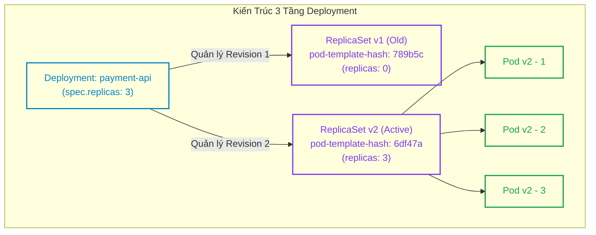
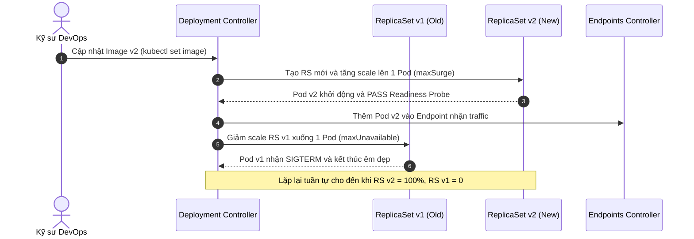
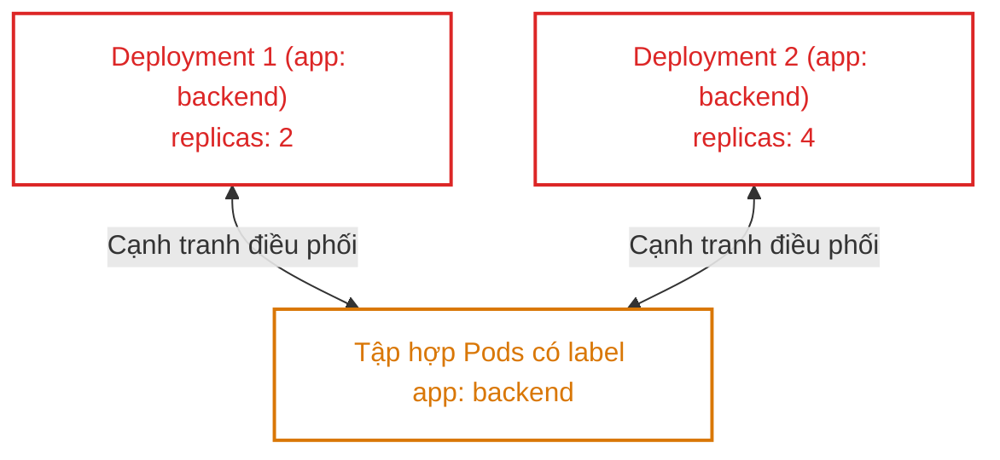
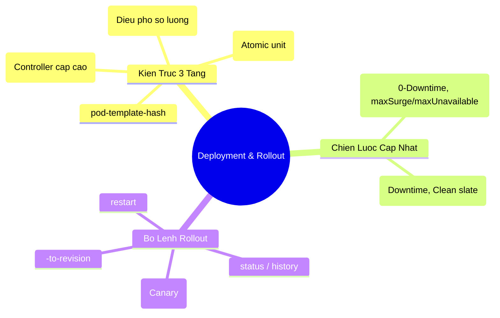


> [!IMPORTANT]
> **Mục tiêu kỹ thuật & Trọng tâm CKA**:
> - Hiểu rõ cơ chế điều hòa giữa `DeploymentController`, `ReplicaSetController` và `Kubelet`.
> - Tính toán chính xác số lượng Pod tối đa và tối thiểu trong quá trình Rolling Update dựa trên `maxSurge` và `maxUnavailable`.
> - Thực hiện nâng cấp phiên bản container không downtime và cập nhật ghi chú revision chuẩn xác.
> - Thành thạo kỹ thuật Canary Release thủ công với `kubectl rollout pause` và `resume`.
> - Thực hiện Rollback khẩn cấp về revision ổn định trước đó bằng `kubectl rollout undo`.

---

## 1. Bản Chất Kiến Trúc & Tư Duy Cốt Lõi: Mô Hình 3 Tầng Deployment

Trong Kubernetes, bạn hiếm khi tạo `Pod` hoặc `ReplicaSet` trực tiếp. **Deployment** là bộ điều khiển cấp cao (Higher-level Controller) cung cấp cơ chế khai báo cập nhật cho Pods và ReplicaSets.

Deployment không trực tiếp tạo ra Pods. Thay vào đó, nó sở hữu và quản lý một hoặc nhiều **ReplicaSets**, và chính ReplicaSet mới là thành phần trực tiếp đảm bảo số lượng Pods mong muốn (`spec.replicas`).



### 1.1. Cơ Chế `pod-template-hash` & Khởi Tạo Revision Mới

Mỗi khi trường `spec.template` của Deployment thay đổi (đổi image, biến môi trường, tài nguyên requests/limits, labels), `DeploymentController` sẽ:
1. Tính toán mã băm SHA256 của toàn bộ khối `spec.template` (ví dụ: `6df47a89b4`).
2. Tự động thêm nhãn `pod-template-hash=6df47a89b4` vào Pod Template và ReplicaSet Selector.
3. Tạo một **ReplicaSet mới** đại diện cho Revision mới.
4. Bắt đầu điều phối tăng dần `replicas` của ReplicaSet mới đồng thời giảm dần `replicas` của ReplicaSet cũ theo thuật toán `RollingUpdate`.

---

## 2. Bảng Ma Trận So Sánh Kỹ Thuật Toàn Diện (Engineering Matrix)

Bảng phân tích so sánh giữa 2 chiến lược cập nhật Deployment:

| Tiêu Chí So Sánh | RollingUpdate (Mặc định) | Recreate |
| :--- | :--- | :--- |
| **Hành vi cập nhật** | Tạo Pods mới song song với việc xóa Pods cũ | Xóa 100% Pods cũ trước, sau đó mới tạo Pods mới |
| **Thời gian Downtime** | **0 Giây (Zero-downtime)** | Có Downtime (Từ lúc xóa Pod cũ đến khi Pod mới Ready)|
| **Yêu cầu tài nguyên Node**| Cần dư thừa CPU/RAM trong lúc Rollout (do `maxSurge`)| Tiết kiệm (Không bao giờ vượt quá số `replicas` gốc) |
| **Khả năng tương thích phiên bản**| Yêu cầu Backend/DB tương thích cả 2 version song song | Thích hợp khi Version mới không tương thích dữ liệu cũ |
| **Tham số điều khiển** | `maxSurge`, `maxUnavailable` | Không có tham số phụ |
| **Tốc độ hoàn tất** | Phụ thuộc thời gian khởi động Pod và Probes | Nhanh hơn (Xóa hàng loạt, tạo hàng loạt) |
| **Ứng dụng điển hình** | Web API, Microservices, Stateless Web App | Batch Processing, Hệ thống chạy Database Migrations lớn |

### 2.1. Công Thức Tính Toán `maxSurge` và `maxUnavailable`

Giả sử `replicas = 10`, `maxSurge = 25%`, `maxUnavailable = 25%`:
- **Số Pod tối đa cùng tồn tại**: `replicas + maxSurge` = $10 + \lceil 10 \times 0.25 \rceil = 10 + 3 = \mathbf{13\text{ Pods}}$.
- **Số Pod tối thiểu luôn khả dụng**: `replicas - maxUnavailable` = $10 - \lfloor 10 \times 0.25 \rfloor = 10 - 2 = \mathbf{8\text{ Pods}}$.



---

## 3. Cấu Trúc Khai Báo Manifest & Chi Tiết Chiến Lược

### 3.1. Deployment Manifest Chuẩn Production với RollingUpdate

```yaml
apiVersion: apps/v1
kind: Deployment
metadata:
  name: order-service
  namespace: production
  labels:
    app: order-service
spec:
  replicas: 4
  revisionHistoryLimit: 5 # Giữ lại tối đa 5 ReplicaSet cũ trong lịch sử
  progressDeadlineSeconds: 300 # Đánh dấu lỗi nếu sau 5 phút không hoàn tất rollout
  strategy:
    type: RollingUpdate
    rollingUpdate:
      maxSurge: 1        # Cho phép tạo thêm tối đa 1 Pod vượt mức (4+1=5)
      maxUnavailable: 0  # Tuyệt đối không cho phép thiếu hụt Pod nào (<4)
  selector:
    matchLabels:
      app: order-service
  template:
    metadata:
      labels:
        app: order-service
    spec:
      containers:
        - name: app
          image: myregistry.io/order-service:v1.0.0
          ports:
            - containerPort: 8080
          readinessProbe:
            httpGet:
              path: /ready
              port: 8080
            initialDelaySeconds: 5
            periodSeconds: 5
          resources:
            requests:
              cpu: "100m"
              memory: "128Mi"
            limits:
              cpu: "500m"
              memory: "512Mi"
```

---

## 4. Phân Tích Cạm Bẫy Thực Chiến: Sự Cố Rollout Bị Treo & Khắc Phục

### Tình huống 1: Cập nhật nhầm Image Tag không tồn tại gây kẹt Rollout

Kỹ sư cập nhật tag image bị sai chính tả (`v2.0.0-typo`). Pod mới rơi vào trạng thái `ImagePullBackOff` hoặc `ErrImagePull`. Do có `maxUnavailable: 0` (hoặc 25%), hệ thống dừng cập nhật và giữ lại các Pod cũ đang chạy, nhưng tiến trình rollout bị kẹt vô tận.

### Hậu Quả & Log Lỗi Thực Tế:

```text
$ kubectl rollout status deployment/order-service -n production
Waiting for deployment "order-service" rollout to finish: 1 out of 4 new replicas have been updated...

$ kubectl get pods -n production
NAME                             READY   STATUS             RESTARTS   AGE
order-service-59d8c97594-8k2hx   0/1     ImagePullBackOff   0          2m
order-service-789b5c87f4-4n9j8   1/1     Running            0          12m
order-service-789b5c87f4-9lmx2   1/1     Running            0          12m
order-service-789b5c87f4-x7d1a   1/1     Running            0          12m
order-service-789b5c87f4-z89q1   1/1     Running            0          12m
```

### 5-Whys Root Cause Analysis:
1. **Tại sao rollout không hoàn tất?** -> 1 Pod mới không thể khởi động do lỗi kéo image.
2. **Tại sao Kubelet không kéo được image?** -> Tên tag `v2.0.0-typo` không tồn tại trên Container Registry.
3. **Tại sao các Pod cũ không bị xóa?** -> Vì `maxUnavailable` bảo vệ hệ thống: Pod mới chưa Ready thì không được xóa Pod cũ.
4. **Hệ thống có tự động báo lỗi không?** -> Nếu không có `progressDeadlineSeconds`, lệnh rollout status sẽ đợi mãi mãi.
5. **Giải pháp xử lý khẩn cấp là gì?** -> Thực thi `kubectl rollout undo deployment/order-service` để hủy bỏ bản cập nhật và quay về trạng thái ổn định.

---

### Tình huống 2: Cố gắng chỉnh sửa trường `spec.selector` của Deployment

Một kỹ sư muốn đổi selector từ `app: web` sang `app: frontend` bằng cách sửa trực tiếp manifest YAML.

### Hậu Quả & Log Lỗi Thực Tế:

```text
The Deployment "web-app" is invalid: spec.selector: Invalid value: 
v1.LabelSelector{MatchLabels:map[string]string{"app":"frontend"}}: 
field is immutable
```

> [!WARNING]
> Trường `spec.selector` trong Deployment là **bất biến (Immutable)**. Kubernetes không cho phép thay đổi selector vì việc này sẽ làm đứt gãy mối liên kết ownership với các ReplicaSet và Pods đang chạy. Muốn thay đổi selector, bắt buộc phải xóa Deployment (`kubectl delete deployment`) hoặc tạo Deployment mới với tên khác.

---

### Tình huống 3: Sự cố đè nhãn (Label Collision) giữa hai Deployments

Hai Deployment khác nhau trong cùng một namespace cùng sử dụng selector `app: backend`. Cả hai Deployment Controller cùng cạnh tranh quyền sở hữu các Pods, liên tục scale lên và scale xuống tạo ra vòng lặp điều hòa hỗn loạn.



---

## 5. Hands-on Lab: Điều Khiển Rollout, Canary & Rollback (8 Bước)

Bảng tổng hợp 8 bước thực hành:

| Bước | Thao Tác | Mục Tiêu Kỹ Thuật | Lệnh / Công Cụ |
| :--- | :--- | :--- | :--- |
| **1** | Tạo Deployment bằng lệnh Imperative | Khởi tạo ứng dụng Nginx v1.23 | `kubectl create deployment` |
| **2** | Scale số lượng Replicas | Mở rộng quy mô lên 4 Pods | `kubectl scale deployment` |
| **3** | Cập nhật Image & Ghi chú Revision | Thực hiện Rolling Update lên v1.24 | `kubectl set image`, `--record` |
| **4** | Theo dõi Tiến độ Rollout | Quan sát trạng thái hoàn tất | `kubectl rollout status` |
| **5** | Thực hiện Canary Release (Pause/Resume)| Tạm dừng rollout để thử nghiệm | `kubectl rollout pause / resume` |
| **6** | Giả lập lỗi Rollout kẹt Image | Nâng cấp lên image lỗi | `kubectl set image non-existent` |
| **7** | Quay lui an toàn với Rollout Undo | Rollback về revision ổn định | `kubectl rollout undo` |
| **8** | Kiểm tra Lịch sử Revisions | Xác nhận danh sách các bản sửa đổi | `kubectl rollout history` |

---

### Bước 1: Tạo Deployment Nginx phiên bản 1.23

```bash
kubectl create namespace rollout-lab

kubectl create deployment web-service \
  --image=nginx:1.23 \
  --replicas=2 \
  --namespace=rollout-lab
```

---

### Bước 2: Scale Deployment lên 4 Replicas

```bash
kubectl scale deployment web-service --replicas=4 -n rollout-lab
kubectl get pods -n rollout-lab -l app=web-service
```

---

### Bước 3: Nâng cấp lên Nginx 1.24 kèm ghi chú annotation

```bash
kubectl set image deployment/web-service nginx=nginx:1.24 -n rollout-lab

# Đặt ghi chú mô tả cho revision
kubectl annotate deployment/web-service -n rollout-lab \
  kubernetes.io/change-cause="Upgrade Nginx to 1.24 stable" --overwrite
```

---

### Bước 4: Theo dõi quá trình cập nhật Rolling Update

```bash
kubectl rollout status deployment/web-service -n rollout-lab
```

Output:
```text
Waiting for deployment "web-service" rollout to finish: 2 out of 4 new replicas have been updated...
Waiting for deployment "web-service" rollout to finish: 3 out of 4 new replicas have been updated...
deployment "web-service" successfully rolled out
```

---

### Bước 5: Thực hiện kỹ thuật Canary Release thủ công bằng `pause`

Cập nhật image lên Nginx 1.25 và lập tức tạm dừng:

```bash
kubectl set image deployment/web-service nginx=nginx:1.25 -n rollout-lab
kubectl rollout pause deployment/web-service -n rollout-lab

# Gán ghi chú
kubectl annotate deployment/web-service -n rollout-lab \
  kubernetes.io/change-cause="Canary deployment 1.25" --overwrite
```

Kiểm tra trạng thái Pods:

```bash
kubectl get pods -n rollout-lab -l app=web-service
```

Bạn sẽ thấy **1 Pod chạy image 1.25 (Canary)** và **3 Pod chạy image 1.24**.
Sau khi kiểm tra thấy Canary ổn định, tiếp tục giải phóng toàn bộ quá trình rollout:

```bash
kubectl rollout resume deployment/web-service -n rollout-lab
kubectl rollout status deployment/web-service -n rollout-lab
```

---

### Bước 6: Giả lập sự cố cập nhật nhầm Image không tồn tại

```bash
kubectl set image deployment/web-service nginx=nginx:invalid-tag-999 -n rollout-lab
kubectl annotate deployment/web-service -n rollout-lab \
  kubernetes.io/change-cause="Attempt bad upgrade" --overwrite
```

Kiểm tra trạng thái sau 15 giây:

```bash
kubectl get pods -n rollout-lab
```

Output ghi nhận Pod mới bị lỗi `ErrImagePull`:
```text
NAME                           READY   STATUS             RESTARTS   AGE
web-service-7df7c6b54b-d7k2p   0/1     ImagePullBackOff   0          30s
web-service-68d7547b7b-2k8nm   1/1     Running            0          3m
web-service-68d7547b7b-8jkl1   1/1     Running            0          3m
web-service-68d7547b7b-m5nx9   1/1     Running            0          3m
web-service-68d7547b7b-p9qw4   1/1     Running            0          3m
```

---

### Bước 7: Thực hiện Rollback khẩn cấp về Revision trước

```bash
kubectl rollout undo deployment/web-service -n rollout-lab
```

Output:
```text
deployment.apps/web-service rolled back
```

Pod lỗi bị xóa ngay lập tức và toàn bộ 4 Pod trở lại trạng thái Nginx 1.25 ổn định.

---

### Bước 8: Kiểm tra lịch sử Revisions hoàn chỉnh

```bash
kubectl rollout history deployment/web-service -n rollout-lab
```

Output hiển thị danh sách revisions kèm nguyên nhân thay đổi:
```text
REVISION  CHANGE-CAUSE
1         <none>
2         Upgrade Nginx to 1.24 stable
4         Canary deployment 1.25
```

---

## 6. 10 Câu Hỏi Tự Kiểm Tra Chuyên Sâu (Self-Check Q&A Accordion)

<details class="qa-card">
  <summary><b>Câu 1: Mối quan hệ cấu trúc giữa Deployment, ReplicaSet và Pod trong Kubernetes là gì?</b></summary>
  <div class="qa-answer">
    <b>Trả lời:</b><br>
    Đây là kiến trúc phân cấp 3 tầng:<br>
    1. <b>Deployment:</b> Là controller cấp cao nhất, quản lý phiên bản, chiến lược rollout và các ReplicaSet.<br>
    2. <b>ReplicaSet:</b> Được tạo bởi Deployment, trực tiếp đảm bảo số lượng bản sao Pod chạy đúng số lượng mong muốn.<br>
    3. <b>Pod:</b> Đơn vị tính toán nhỏ nhất do ReplicaSet tạo ra và gán nhãn <code>pod-template-hash</code>.
  </div>
</details>

<details class="qa-card">
  <summary><b>Câu 2: Ý nghĩa của hai tham số maxSurge và maxUnavailable trong chiến lược RollingUpdate là gì?</b></summary>
  <div class="qa-answer">
    <b>Trả lời:</b><br>
    <ul>
      <li><b>maxSurge:</b> Số lượng Pod tối đa được phép tạo vượt quá số lượng <code>replicas</code> mong muốn trong quá trình cập nhật (mặc định 25%).</li>
      <li><b>maxUnavailable:</b> Số lượng Pod tối đa được phép không khả dụng/tạm dừng so với số lượng <code>replicas</code> mong muốn trong quá trình cập nhật (mặc định 25%).</li>
    </ul>
  </div>
</details>

<details class="qa-card">
  <summary><b>Câu 3: Làm thế nào để cấu hình Deployment đảm bảo luôn có 100% số lượng Pod khả dụng trong suốt quá trình Rollout?</b></summary>
  <div class="qa-answer">
    <b>Trả lời:</b><br>
    Thiết lập tham số <code>maxUnavailable: 0</code> và <code>maxSurge: 1</code> (hoặc một tỷ lệ % dương). Khi đó, Kubernetes bắt buộc phải khởi tạo Pod mới và chờ Pod mới vượt qua Readiness Probe thành công trước khi xóa bất kỳ Pod cũ nào.
  </div>
</details>

<details class="qa-card">
  <summary><b>Câu 4: Nhãn pod-template-hash được sinh ra nhằm mục đích gì?</b></summary>
  <div class="qa-answer">
    <b>Trả lời:</b><br>
    <code>pod-template-hash</code> là chuỗi băm 32-bit từ khối <code>spec.template</code> của Deployment. Nhãn này giúp Deployment Controller phân biệt chính xác Pod nào thuộc về ReplicaSet của phiên bản cũ và Pod nào thuộc về ReplicaSet của phiên bản mới, tránh việc ReplicaSet này nhận nhầm Pod của ReplicaSet khác khi có cùng bộ label người dùng.
  </div>
</details>

<details class="qa-card">
  <summary><b>Câu 5: Lệnh nào giúp xem chi tiết cấu hình của một Revision cụ thể trong quá khứ mà không cần rollback?</b></summary>
  <div class="qa-answer">
    <b>Trả lời:</b><br>
    Sử dụng lệnh:<br>
    <code>kubectl rollout history deployment/&lt;name&gt; --revision=&lt;revision-number&gt; -n &lt;namespace&gt;</code>
  </div>
</details>

<details class="qa-card">
  <summary><b>Câu 6: Làm thế nào để rollback một Deployment về chính xác Revision số 2?</b></summary>
  <div class="qa-answer">
    <b>Trả lời:</b><br>
    Sử dụng lệnh:<br>
    <code>kubectl rollout undo deployment/&lt;name&gt; --to-revision=2 -n &lt;namespace&gt;</code>
  </div>
</details>

<details class="qa-card">
  <summary><b>Câu 7: Tham số progressDeadlineSeconds trong Deployment có ý nghĩa gì?</b></summary>
  <div class="qa-answer">
    <b>Trả lời:</b><br>
    Tham số này quy định khoảng thời gian tối đa (tính bằng giây, mặc định là 600s = 10 phút) mà Deployment Controller chờ đợi tiến trình rollout đạt trạng thái thành công. Nếu sau thời gian này mà quá trình rollout bị kẹt (do lỗi Image, CrashLoop, thiếu tài nguyên), Deployment sẽ được cập nhật Condition <code>Progressing: False (ProgressDeadlineExceeded)</code>.
  </div>
</details>

<details class="qa-card">
  <summary><b>Câu 8: Tại sao trường spec.selector trong Deployment không thể thay đổi sau khi đã tạo?</b></summary>
  <div class="qa-answer">
    <b>Trả lời:</b><br>
    Trường <code>spec.selector</code> được thiết kế bất biến (immutable) để đảm bảo tính toàn vẹn của chu trình điều hòa. Nếu thay đổi selector, Deployment Controller sẽ mất dấu các ReplicaSet và Pods cũ, dẫn đến việc các Pod cũ trở thành "mồ côi" (orphaned) tiếp tục tiêu tốn tài nguyên trên cụm.
  </div>
</details>

<details class="qa-card">
  <summary><b>Câu 9: Lệnh nào giúp restart toàn bộ Pods của một Deployment mà không cần thay đổi bất kỳ trường cấu hình nào trong Pod Spec?</b></summary>
  <div class="qa-answer">
    <b>Trả lời:</b><br>
    Sử dụng lệnh:<br>
    <code>kubectl rollout restart deployment/&lt;name&gt; -n &lt;namespace&gt;</code><br>
    Lệnh này tự động inject annotation thời gian <code>kubectl.kubernetes.io/restartedAt</code> vào Pod Template để kích hoạt Rolling Update mới.
  </div>
</details>

<details class="qa-card">
  <summary><b>Câu 10: Tham số revisionHistoryLimit kiểm soát điều gì và nếu đặt bằng 0 thì hậu quả là gì?</b></summary>
  <div class="qa-answer">
    <b>Trả lời:</b><br>
    <code>revisionHistoryLimit</code> (mặc định là 10) quy định số lượng ReplicaSet cũ không hoạt động (replicas = 0) được lưu lại trong etcd để phục vụ việc rollback. Nếu đặt bằng 0, Kubernetes sẽ xóa ngay lập tức các ReplicaSet cũ sau khi rollout xong, đồng nghĩa với việc bạn <b>hoàn toàn không thể sử dụng lệnh <code>kubectl rollout undo</code></b> để quay lui phiên bản.
  </div>
</details>

---

## 7. Tổng Kết & Lộ Trình Bài Học Tiếp Theo



Khả năng kiểm soát linh hoạt đối tượng Deployment và chiến lược Rolling Update là kỹ năng nền tảng quan trọng bậc nhất giúp bạn tự tin vận hành các ứng dụng doanh nghiệp quy mô lớn trên Kubernetes.

> [!TIP]
> **Bài học tiếp theo**: Trong [Bài 16: Quản Trị DaemonSet, StatefulSet & Job / CronJob Chuyên Sâu](cka-16-16-daemonset-statefulset-job.html), chúng ta sẽ nghiên cứu toàn diện các Workload Controllers chuyên biệt khác: duy trì agent trên từng node với DaemonSet, quản lý ứng dụng có trạng thái với StatefulSet và xử lý tác vụ theo lô với Job/CronJob.

