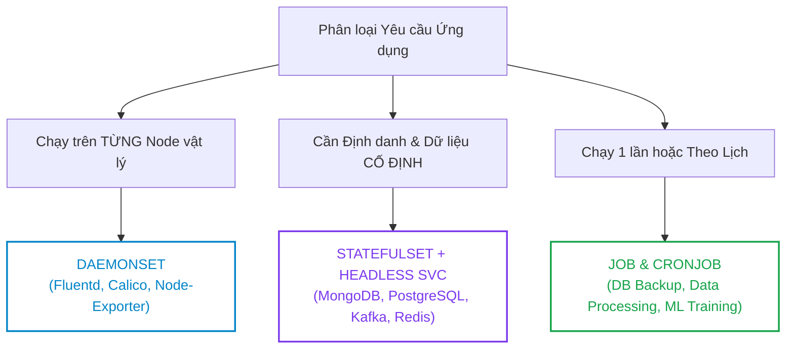
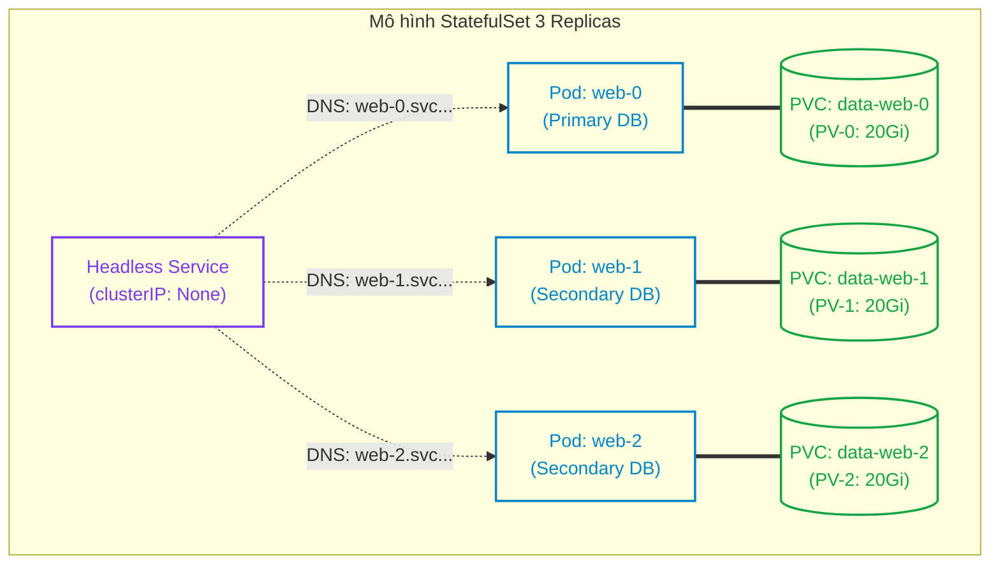
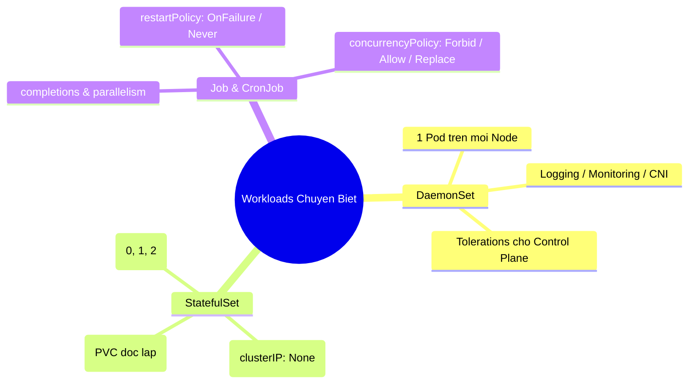


> [!IMPORTANT]
> **Mục tiêu kỹ thuật & Trọng tâm CKA**:
> - Hiểu rõ khi nào nên dùng DaemonSet, StatefulSet, Job thay cho Deployment thông thường.
> - Cấu hình DaemonSet chạy trên toàn bộ Node bao gồm cả Control Plane bằng kỹ thuật `tolerations`.
> - Thiết lập StatefulSet hoàn chỉnh liên kết với Headless Service và kiểm tra phân giải tên miền Pod DNS FQDN.
> - Quản lý vòng đời ổ đĩa `volumeClaimTemplates` khi mở rộng hoặc thu hẹp StatefulSet.
> - Viết manifest Job/CronJob với các ràng buộc `backoffLimit`, `activeDeadlineSeconds`, và `concurrencyPolicy`.

---

## 1. Bản Chất Kiến Trúc & Tư Duy Cốt Lõi: Bộ Ba Workload Chuyên Biệt

Bên cạnh **Deployment** (vốn được tối ưu hóa hoàn hảo cho các microservices Stateless có thể thay thế lẫn nhau bất kỳ lúc nào), Kubernetes cung cấp ba bộ điều khiển chuyên biệt để đáp ứng các mô hình điện toán phức tạp:



### 1.1. DaemonSet: Bộ Phân Phối Agent Cấp Node

`DaemonSetController` liên tục theo dõi danh sách Node trên cụm:
- Khi một Node mới gia nhập cụm (Worker Node được thêm vào), DaemonSet tự động lập lịch khởi chạy 1 Pod trên Node đó.
- Khi một Node bị gỡ bỏ khỏi cụm, Pod của DaemonSet trên Node đó tự động bị dọn dẹp bởi garbage collector.
- Sử dụng `tolerations` để cho phép DaemonSet chạy trên các Master / Control Plane Nodes (vốn có Taint `node-role.kubernetes.io/control-plane:NoSchedule`).

### 1.2. StatefulSet & Headless Service: Bộ Xương Sống Của Hệ Phân Tán

Các hệ quản trị cơ sở dữ liệu phân tán (như MySQL Primary-Replica, Kafka cluster, Elasticsearch) yêu cầu:
1. **Tên máy chủ ổn định**: Node Leader luôn có tên định danh `db-0`, các Node Follower là `db-1`, `db-2`.
2. **DNS phân giải riêng biệt cho từng Pod**: Thay vì cân bằng tải Round-robin qua một Virtual ClusterIP, Kubernetes sử dụng **Headless Service** (`spec.clusterIP: None`) để trả về trực tiếp IP của từng Pod theo định dạng:
   $$\text{<pod-name>.<service-name>.<namespace>.svc.cluster.local}$$
3. **Ổ đĩa chuyên biệt không chia sẻ**: `volumeClaimTemplates` tự sinh một PVC độc lập cho từng Pod theo mẫu `<template-name>-<pod-name>` (ví dụ: `data-db-0`, `data-db-1`).



---

## 2. Bảng Ma Trận So Sánh Kỹ Thuật Toàn Diện (Engineering Matrix)

Bảng đối chiếu tổng hợp 4 loại Workload Controllers:

| Tiêu Chí So Sánh | Deployment | DaemonSet | StatefulSet | Job / CronJob |
| :--- | :--- | :--- | :--- | :--- |
| **Mục đích chính** | Stateless Web / API | Node Agents / Infra | Distributed Databases / Queues | Batch processing / Cron tasks |
| **Định danh Pod (Identity)**| Ngẫu nhiên (`app-7f9b5c-k2j8x`)| Ngẫu nhiên theo Node | Số thứ tự cố định (`app-0, app-1`)| Ngẫu nhiên (`job-5d7fa-x9z1a`) |
| **Cơ chế Lưu trữ (Storage)**| Volume dùng chung (NFS/EFS)| HostPath / Node Storage | PVC riêng biệt (`volumeClaimTemplates`)| Tạm thời (EmptyDir / PVC) |
| **Thứ tự Khởi động** | Song song (Parallel) | Tùy theo sự xuất hiện Node | Tuần tự từ 0 đến N-1 (`OrderedReady`)| Song song theo `parallelism` |
| **Dịch vụ Mạng (Networking)**| ClusterIP Load Balancing | ClusterIP / HostPort / HostNetwork| Headless Service (`clusterIP: None`)| Thường không cần Service |
| **Chính sách Restart** | `Always` | `Always` | `Always` | Bắt buộc `OnFailure` / `Never` |
| **Hành vi khi Scale Down**| Xóa Pods bất kỳ | Xóa khi Node bị xóa | Xóa ngược từ N-1 về 0 (Giữ nguyên PVC)| Tự kết thúc khi đạt `completions` |

---

## 3. Cấu Trúc Khai Báo Manifest Chuẩn

### 3.1. StatefulSet Hoàn Chỉnh Kết Hợp Headless Service

```yaml
apiVersion: v1
kind: Service
metadata:
  name: cassandra-svc
  namespace: database
  labels:
    app: cassandra
spec:
  clusterIP: None # Bắt buộc: Headless Service
  ports:
    - port: 9042
      name: cql
  selector:
    app: cassandra
---
apiVersion: apps/v1
kind: StatefulSet
metadata:
  name: cassandra
  namespace: database
spec:
  serviceName: "cassandra-svc" # Khớp chính xác với tên Headless Service
  replicas: 3
  podManagementPolicy: OrderedReady # Khởi động tuần tự 0 -> 1 -> 2
  selector:
    matchLabels:
      app: cassandra
  template:
    metadata:
      labels:
        app: cassandra
    spec:
      containers:
        - name: cassandra
          image: cassandra:4.1
          ports:
            - containerPort: 9042
              name: cql
          volumeMounts:
            - name: cassandra-data
              mountPath: /var/lib/cassandra
  volumeClaimTemplates: # Tự động cấp phát PVC cho từng Pod
    - metadata:
        name: cassandra-data
      spec:
        accessModes: ["ReadWriteOnce"]
        storageClassName: "standard"
        resources:
          requests:
            storage: 10Gi
```

### 3.2. CronJob Manifest với `concurrencyPolicy: Forbid`

```yaml
apiVersion: batch/v1
kind: CronJob
metadata:
  name: nightly-database-backup
  namespace: database
spec:
  schedule: "0 2 * * *" # Chạy lúc 02:00 sáng hàng ngày
  concurrencyPolicy: Forbid # Cấm chạy song song nếu lần chạy trước chưa xong
  successfulJobsHistoryLimit: 3
  failedJobsHistoryLimit: 5
  jobTemplate:
    spec:
      backoffLimit: 4 # Thử lại tối đa 4 lần nếu lỗi
      activeDeadlineSeconds: 1800 # Timeout tối đa 30 phút
      template:
        spec:
          restartPolicy: OnFailure # Bắt buộc OnFailure hoặc Never
          containers:
            - name: db-backup
              image: postgres:15-alpine
              command: ["/bin/sh", "-c", "pg_dump -h db-primary -U admin myapp > /backup/db.sql"]
```

---

## 4. Phân Tích Cạm Bẫy Thực Chiến: Sự Cố Workloads & Khắc Phục

### Tình huống 1: DaemonSet không thể lập lịch lên Control Plane Node

Kỹ sư triển khai DaemonSet giám sát hạ tầng `promtail` để thu thập log, nhưng Pod chỉ chạy trên Worker Nodes, bỏ sót hoàn toàn 3 node Control Plane.

### Hậu Quả & Log Lỗi Thực Tế:

```text
$ kubectl get pods -n logging -o wide
NAME             READY   STATUS    NODE
promtail-8xk2p   1/1     Running   worker-01
promtail-9lmx4   1/1     Running   worker-02
# Không có Pod nào trên node cp-01, cp-02, cp-03!
```

### 5-Whys Root Cause Analysis:
1. **Tại sao DaemonSet không tạo Pod trên CP nodes?** -> Scheduler đánh giá CP nodes có Taint ngăn cản lập lịch.
2. **Taint trên Control Plane là gì?** -> `node-role.kubernetes.io/control-plane:NoSchedule`.
3. **Tại sao Pod DaemonSet không chạy được?** -> Manifest thiếu khối `tolerations` tương ứng với Taint này.
4. **Tại sao Worker nodes lại chạy được?** -> Worker nodes mặc định không có Taint `NoSchedule`.
5. **Giải pháp khắc phục là gì?** -> Bổ sung toleration chấp nhận mọi Taint của Control Plane vào Pod Template.

```diff
     spec:
+      tolerations:
+        - key: node-role.kubernetes.io/control-plane
+          operator: Exists
+          effect: NoSchedule
       containers:
         - name: promtail
```

---

### Tình huống 2: Scale Down StatefulSet nhưng dữ liệu không tự dọn dẹp (Storage Leak)

Quản trị viên scale StatefulSet từ 5 xuống 2 (`kubectl scale statefulset my-db --replicas=2`). Sau 1 tháng, hóa đơn lưu trữ đám mây vẫn tính tiền 5 ổ đĩa PV.

### Hậu Quả & Log Lỗi Thực Tế:

```text
$ kubectl get pvc -n database
NAME              STATUS   VOLUME                                     CAPACITY
data-my-db-0      Bound    pvc-11111111-2222-3333-4444-555555555555   50Gi
data-my-db-1      Bound    pvc-22222222-3333-4444-5555-666666666666   50Gi
data-my-db-2      Bound    pvc-33333333-4444-5555-6666-777777777777   50Gi  # Vẫn tồn tại!
data-my-db-3      Bound    pvc-44444444-5555-6666-7777-888888888888   50Gi  # Vẫn tồn tại!
data-my-db-4      Bound    pvc-55555555-6666-7777-8888-999999999999   50Gi  # Vẫn tồn tại!
```

> [!WARNING]
> **Đây là tính năng bảo vệ an toàn chủ đích của Kubernetes (Safety by Design)**. StatefulSet không bao giờ tự động xóa PVC khi thu hẹp số lượng Pods nhằm ngăn ngừa việc mất mát dữ liệu do thao tác nhầm. Nếu bạn thực sự muốn giải phóng dung lượng, bạn bắt buộc phải xóa thủ công các PVC không còn sử dụng: `kubectl delete pvc data-my-db-2 data-my-db-3 data-my-db-4`.

---

### Tình huống 3: Khai báo sai `restartPolicy: Always` trong đối tượng Job

Một kỹ sư viết manifest Job để chạy tác vụ Database Migration nhưng giữ nguyên cấu hình mặc định `restartPolicy: Always`.

### Hậu Quả & Log Lỗi Thực Tế:

```text
The Job "db-migration" is invalid: spec.template.spec.restartPolicy: 
Unsupported value: "Always": supported values: "OnFailure", "Never"
```

Lý do: Đối tượng Job được sinh ra để chạy tác vụ có điểm dừng (Run-to-completion). Nếu đặt `Always`, container sau khi chạy xong Exit Code 0 sẽ bị Kubelet khởi động lại vô hạn, vi phạm bản chất của Job.

---

## 5. Hands-on Lab: Triển Khai & Kiểm Định Workloads Chuyên Biệt (8 Bước)

Bảng tổng hợp 8 bước thực hành:

| Bước | Thao Tác | Mục Tiêu Kỹ Thuật | Lệnh / Công Cụ |
| :--- | :--- | :--- | :--- |
| **1** | Tạo Namespace riêng biệt | Chuẩn bị môi trường thực hành | `kubectl create ns workloads-lab` |
| **2** | Triển khai DaemonSet có Toleration | Chạy agent trên cả Master và Worker | `kubectl apply -f ds.yaml` |
| **3** | Kiểm tra phân bổ DaemonSet Pods | Xác nhận 1 Pod trên mỗi Node | `kubectl get pods -o wide` |
| **4** | Triển khai Headless Service & StatefulSet| Cấu hình cụm Stateful 2 replicas | `kubectl apply -f sts.yaml` |
| **5** | Kiểm định Phân giải DNS Nội bộ | Thử nghiệm FQDN của từng Pod | `kubectl exec -i -- nslookup` |
| **6** | Scale StatefulSet & Kiểm tra PVC | Xác minh cơ chế gắn đĩa tự động | `kubectl scale sts`, `get pvc` |
| **7** | Triển khai Job xử lý Song song | Chạy Job với completions & parallelism | `kubectl apply -f job.yaml` |
| **8** | Tạo CronJob & Kiểm tra Lịch sử | Xác thực chính sách Concurrency Forbid | `kubectl create cronjob` |

---

### Bước 1: Khởi tạo Namespace

```bash
kubectl create namespace workloads-lab
```

---

### Bước 2: Triển khai DaemonSet giám sát tài nguyên

Tạo DaemonSet Node-Monitor chạy trên toàn bộ các node:

```bash
cat <<EOF | kubectl apply -f -
apiVersion: apps/v1
kind: DaemonSet
metadata:
  name: node-monitor
  namespace: workloads-lab
spec:
  selector:
    matchLabels:
      app: node-monitor
  template:
    metadata:
      labels:
        app: node-monitor
    spec:
      tolerations:
        - key: node-role.kubernetes.io/control-plane
          operator: Exists
          effect: NoSchedule
      containers:
        - name: monitor
          image: registry.k8s.io/pause:3.9
EOF
```

---

### Bước 3: Xác nhận số lượng Pod khớp với tổng số Node

```bash
kubectl get nodes
kubectl get pods -n workloads-lab -l app=node-monitor -o wide
```

Output ghi nhận mỗi Node (kể cả Control Plane) có chính xác 1 Pod đang chạy `Running`.

---

### Bước 4: Triển khai Headless Service và StatefulSet

```bash
cat <<EOF | kubectl apply -f -
apiVersion: v1
kind: Service
metadata:
  name: web-headless
  namespace: workloads-lab
spec:
  clusterIP: None
  ports:
    - port: 80
      name: http
  selector:
    app: stateful-web
---
apiVersion: apps/v1
kind: StatefulSet
metadata:
  name: web-server
  namespace: workloads-lab
spec:
  serviceName: "web-headless"
  replicas: 2
  selector:
    matchLabels:
      app: stateful-web
  template:
    metadata:
      labels:
        app: stateful-web
    spec:
      containers:
        - name: nginx
          image: nginx:alpine
          ports:
            - containerPort: 80
              name: http
          volumeMounts:
            - name: web-storage
              mountPath: /usr/share/nginx/html
  volumeClaimTemplates:
    - metadata:
        name: web-storage
      spec:
        accessModes: ["ReadWriteOnce"]
        resources:
          requests:
            storage: 1Gi
EOF
```

---

### Bước 5: Kiểm tra DNS FQDN của từng StatefulSet Pod

Tạo một Pod DNS utils để truy vấn:

```bash
kubectl run dns-tester --image=curlimages/curl:8.4.0 -n workloads-lab -- sleep 3600

# Truy vấn trực tiếp Pod web-server-0
kubectl exec -it dns-tester -n workloads-lab -- nslookup web-server-0.web-headless.workloads-lab.svc.cluster.local
```

Output trả về chính xác IP nội bộ của Pod `web-server-0`:
```text
Name:   web-server-0.web-headless.workloads-lab.svc.cluster.local
Address: 10.244.1.65
```

---

### Bước 6: Scale StatefulSet và kiểm tra cơ chế PVC

Scale lên 3 Replicas:

```bash
kubectl scale statefulset web-server --replicas=3 -n workloads-lab
kubectl get pods -n workloads-lab -l app=stateful-web
kubectl get pvc -n workloads-lab
```

Output xác nhận PVC `web-storage-web-server-2` được tự động tạo và gắn vào `web-server-2`.

---

### Bước 7: Triển khai Job xử lý song song (Parallel Batch Job)

Tạo Job cần 4 lần hoàn tất thành công (`completions: 4`), chạy đồng thời tối đa 2 Pod (`parallelism: 2`):

```bash
cat <<EOF | kubectl apply -f -
apiVersion: batch/v1
kind: Job
metadata:
  name: batch-calculator
  namespace: workloads-lab
spec:
  completions: 4
  parallelism: 2
  backoffLimit: 2
  template:
    spec:
      restartPolicy: OnFailure
      containers:
        - name: worker
          image: busybox:1.36
          command: ["sh", "-c", "echo 'Calculating step...'; sleep 5; exit 0"]
EOF
```

Theo dõi tiến độ hoàn tất của Job:

```bash
kubectl get job batch-calculator -n workloads-lab -w
```

Output:
```text
NAME               COMPLETIONS   DURATION   AGE
batch-calculator   0/4           2s         2s
batch-calculator   2/4           8s         8s
batch-calculator   4/4           14s        14s
```

---

### Bước 8: Tạo CronJob và kiểm tra lịch sử thực thi

Tạo CronJob chạy mỗi phút một lần với chính sách Forbid:

```bash
kubectl create cronjob quick-reporter \
  --image=busybox:1.36 \
  --schedule="* * * * *" \
  --namespace=workloads-lab \
  -- /bin/sh -c "echo System Healthy at \$(date)"

# Chờ 2 phút và kiểm tra danh sách Job sinh ra
sleep 120
kubectl get cronjobs,jobs -n workloads-lab
```

Output ghi nhận CronJob tự động tạo ra các bản ghi Job theo lịch:
```text
NAME                                  COMPLETIONS   DURATION   AGE
job.batch/quick-reporter-28765431     1/1           4s         65s
job.batch/quick-reporter-28765432     1/1           3s         5s
```

---

## 6. 10 Câu Hỏi Tự Kiểm Tra Chuyên Sâu (Self-Check Q&A Accordion)

<details class="qa-card">
  <summary><b>Câu 1: Headless Service là gì và tại sao StatefulSet bắt buộc phải liên kết với một Headless Service?</b></summary>
  <div class="qa-answer">
    <b>Trả lời:</b><br>
    Headless Service là Service được khai báo với <code>spec.clusterIP: None</code>. Thay vì cấp phát một IP ảo duy nhất để load balance ngẫu nhiên, Headless Service cho phép CoreDNS trả về danh sách các bản ghi A record trỏ trực tiếp đến IP của từng Pod riêng biệt. StatefulSet bắt buộc cần Headless Service để thiết lập định danh mạng FQDN cố định cho từng thành viên trong cụm phân tán (ví dụ: <code>pod-0.service.ns.svc.cluster.local</code>).
  </div>
</details>

<details class="qa-card">
  <summary><b>Câu 2: Điểm khác biệt căn bản giữa việc khai báo Volume trong Deployment vs volumeClaimTemplates trong StatefulSet là gì?</b></summary>
  <div class="qa-answer">
    <b>Trả lời:</b><br>
    <ul>
      <li><b>Deployment:</b> Mọi bản sao Pod đều chia sẻ chung các PersistentVolumeClaim được khai báo trong <code>spec.template.spec.volumes</code> (yêu cầu storage class hỗ trợ ReadWriteMany nếu ghi song song).</li>
      <li><b>StatefulSet:</b> Khối <code>volumeClaimTemplates</code> tự động sinh ra một PVC hoàn toàn riêng biệt và độc lập cho từng Pod theo mẫu <code>&lt;pvc-name&gt;-&lt;pod-name&gt;-&lt;index&gt;</code>, đảm bảo mỗi instance sở hữu ổ đĩa trạng thái riêng.</li>
    </ul>
  </div>
</details>

<details class="qa-card">
  <summary><b>Câu 3: Khi xóa một StatefulSet thì các PersistentVolumeClaim và dữ liệu lưu trữ có bị xóa theo không?</b></summary>
  <div class="qa-answer">
    <b>Trả lời:</b><br>
    <b>KHÔNG</b>. Kubernetes bảo toàn nguyên vẹn toàn bộ các PVC và PV tương ứng khi StatefulSet bị xóa hoặc scale down. Đây là cơ chế an toàn nhằm bảo vệ dữ liệu nghiệp vụ quan trọng. Quản trị viên phải tự xóa PVC bằng lệnh <code>kubectl delete pvc</code> nếu muốn hủy bỏ dữ liệu.
  </div>
</details>

<details class="qa-card">
  <summary><b>Câu 4: Ba giá trị của chính sách concurrencyPolicy trong đối tượng CronJob là gì?</b></summary>
  <div class="qa-answer">
    <b>Trả lời:</b><br>
    <ul>
      <li><b>Allow (Mặc định):</b> Cho phép các Job mới khởi chạy đồng thời song song ngay cả khi Job cũ chưa kết thúc.</li>
      <li><b>Forbid:</b> Nghiêm cấm chạy song song; nếu Job cũ chưa hoàn tất khi đến lịch mới, lần chạy mới sẽ bị bỏ qua (Skip).</li>
      <li><b>Replace:</b> Nếu Job cũ chưa hoàn tất khi đến lịch mới, hệ thống sẽ hủy bỏ (kill) Job cũ và thay thế bằng Job mới.</li>
    </ul>
  </div>
</details>

<details class="qa-card">
  <summary><b>Câu 5: Ý nghĩa của hai tham số completions và parallelism trong đối tượng Job là gì?</b></summary>
  <div class="qa-answer">
    <b>Trả lời:</b><br>
    <ul>
      <li><b>completions:</b> Tổng số lượng Pod cần phải thực thi và kết thúc thành công (Exit Code 0) để Job được coi là hoàn tất toàn bộ.</li>
      <li><b>parallelism:</b> Số lượng Pod tối đa được phép khởi chạy và thực thi song song đồng thời tại một thời điểm.</li>
    </ul>
  </div>
</details>

<details class="qa-card">
  <summary><b>Câu 6: Tại sao trường restartPolicy trong Pod Spec của đối tượng Job không thể đặt là Always?</b></summary>
  <div class="qa-answer">
    <b>Trả lời:</b><br>
    Đối tượng Job đại diện cho các tác vụ xử lý theo lô có điểm dừng (Batch Process). Nếu đặt <code>restartPolicy: Always</code>, khi tiến trình bên trong container kết thúc thành công (Exit 0), Kubelet sẽ hiểu lầm là container bị tắt và khởi động lại nó vô hạn, khiến Job không bao giờ đạt được trạng thái hoàn tất (Completed). Do đó Job chỉ chấp nhận <code>OnFailure</code> hoặc <code>Never</code>.
  </div>
</details>

<details class="qa-card">
  <summary><b>Câu 7: Làm thế nào để cho phép một DaemonSet chạy được trên các Master / Control Plane Nodes?</b></summary>
  <div class="qa-answer">
    <b>Trả lời:</b><br>
    Cần khai báo khối <code>tolerations</code> trong Pod Template của DaemonSet để chấp nhận Taint mặc định của Control Plane:<br>
    <div style="background-color:#1e1e1e; color:#d4d4d4; padding:8px; border-radius:4px; font-family:monospace; margin-top:4px;">
    tolerations:<br>
    key: node-role.kubernetes.io/control-plane<br>
    &nbsp;&nbsp;operator: Exists<br>
    &nbsp;&nbsp;effect: NoSchedule
    </div>
  </div>
</details>

<details class="qa-card">
  <summary><b>Câu 8: Thứ tự khởi động và dừng của các Pod trong StatefulSet mặc định diễn ra như thế nào?</b></summary>
  <div class="qa-answer">
    <b>Trả lời:</b><br>
    <ul>
      <li><b>Khởi động (Scaling Up):</b> Diễn ra tuần tự nghiêm ngặt từ số thứ tự nhỏ đến lớn (<code>0 -&gt; 1 -&gt; 2</code>). Pod tiếp theo chỉ được khởi tạo khi Pod trước đó đã đạt trạng thái <code>Running</code> và <code>Ready</code>.</li>
      <li><b>Dừng lại (Scaling Down):</b> Diễn ra theo chiều ngược lại từ số thứ tự lớn về nhỏ (<code>2 -&gt; 1 -&gt; 0</code>), hoàn tất dừng Pod này mới bắt đầu dừng Pod kế tiếp.</li>
    </ul>
  </div>
</details>

<details class="qa-card">
  <summary><b>Câu 9: Tham số backoffLimit trong đối tượng Job có chức năng gì?</b></summary>
  <div class="qa-answer">
    <b>Trả lời:</b><br>
    <code>backoffLimit</code> (mặc định là 6) quy định số lần tối đa mà Job Controller cho phép thử lại (retry) khi các Pod con bị thất bại (Exit Code != 0). Nếu số lần lỗi vượt quá ngưỡng này, toàn bộ Job sẽ bị đánh dấu là Thất bại vĩnh viễn (Failed) và ngừng tạo Pod mới.
  </div>
</details>

<details class="qa-card">
  <summary><b>Câu 10: Tham số podManagementPolicy: Parallel trong StatefulSet thay đổi hành vi mặc định như thế nào?</b></summary>
  <div class="qa-answer">
    <b>Trả lời:</b><br>
    Khi đặt <code>podManagementPolicy: Parallel</code>, StatefulSet sẽ khởi tạo hoặc tiêu hủy tất cả các Pod đồng thời song song mà không cần chờ đợi từng Pod hoàn tất tuần tự. Tuy nhiên, các đặc tính về định danh mạng cố định và volumeClaimTemplates vẫn được giữ nguyên vẹn.
  </div>
</details>

---

## 7. Tổng Kết & Lộ Trình Bài Học Tiếp Theo



Việc lựa chọn chính xác giữa Deployment, DaemonSet, StatefulSet và Job là yếu tố cốt lõi quyết định tính ổn định, độ tin cậy và hiệu năng vận hành của toàn bộ hệ thống ứng dụng trên cụm Kubernetes.

> [!TIP]
> **Bài học tiếp theo**: Trong [Bài 17: Kubernetes Scheduler & Ràng Buộc Đặt Pod: NodeSelector, NodeAffinity, Taints & Tolerations, PodTopologySpread](cka-17-17-scheduler-va-rang-buoc-dat-pod.html), chúng ta sẽ khám phá chuyên sâu thuật toán lập lịch của `kube-scheduler`, các kỹ thuật điều phối Pod tới đúng máy chủ mong muốn và phân tán workload đảm bảo khả năng chịu lỗi cao nhất.

