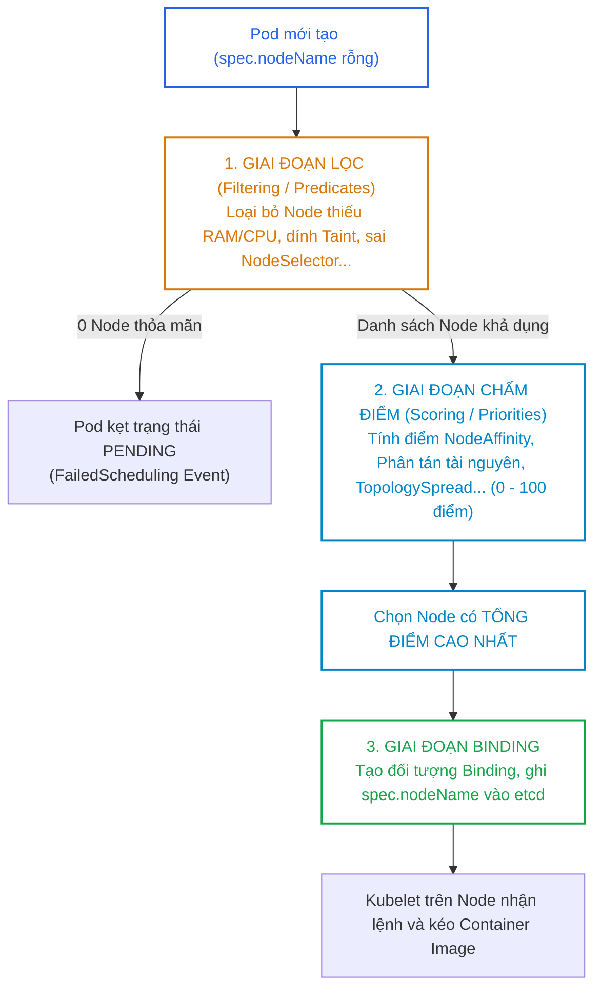
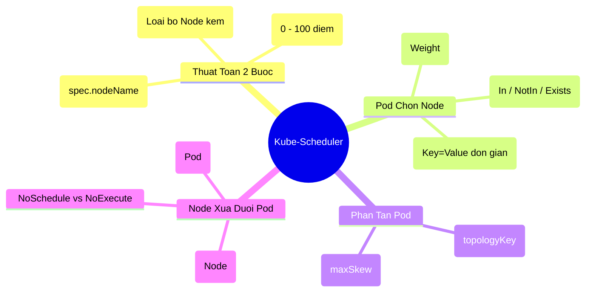


> [!IMPORTANT]
> **Mục tiêu kỹ thuật & Trọng tâm CKA**:
> - Hiểu sâu sắc thuật toán Filtering (Lọc) và Scoring (Chấm điểm) của `kube-scheduler`.
> - Thiết lập chính xác `nodeSelector` và `nodeAffinity` (cả Hard Rule và Soft Rule có gán trọng số `weight`).
> - Cấu hình `podAffinity` (đặt gần nhau) và `podAntiAffinity` (cô lập tránh chạy chung Node/Zone).
> - Thành thạo lệnh dán nhãn Node, dán Taint (`kubectl taint nodes`) và cấu hình `tolerations` tương ứng.
> - Phân biệt bản chất giữa `NoSchedule` (chỉ ảnh hưởng lúc lập lịch) và `NoExecute` (trục xuất Pod lập tức hoặc sau `tolerationSeconds`).

---

## 1. Bản Chất Kiến Trúc & Tư Duy Cốt Lõi: Thuật Toán Kube-Scheduler

Trong chu trình điều hòa của Kubernetes, sau khi Pod được tạo và lưu vào etcd với trạng thái `spec.nodeName: ""` (trống), **kube-scheduler** sẽ nhận diện Pod này thông qua API Watch và bắt đầu quy trình tìm kiếm Node tối ưu nhất.



---

## 2. Bảng Ma Trận So Sánh Kỹ Thuật Toàn Diện (Engineering Matrix)

Bảng đối chiếu các cơ chế điều phối và ràng buộc đặt Pod trong Kubernetes:

| Tiêu Chí Kỹ Thuật | nodeSelector | nodeAffinity | podAffinity / AntiAffinity | Taints & Tolerations | TopologySpread |
| :--- | :--- | :--- | :--- | :--- | :--- |
| **Bản chất hướng tác động** | Pod chủ động chọn Node | Pod chủ động chọn Node | Pod dựa vào vị trí Pod khác | **Node chủ động xua đuổi Pod** | Pod phân tán đều các miền |
| **Mức độ linh hoạt** | Rất thấp (Key=Value thuần) | Rất cao (Toán tử `In`, `NotIn`...)| Cao (Theo nhãn Pod + Topology) | Cao (Theo Key, Value, Effect) | Cực cao (Kiểm soát độ lệch `maxSkew`) |
| **Quy tắc Cứng (Hard)** | Bắt buộc phải khớp 100% | `requiredDuringScheduling...` | `requiredDuringScheduling...` | `NoSchedule`, `NoExecute` | `whenUnsatisfiable: DoNotSchedule` |
| **Quy tắc Mềm (Soft)** | Không hỗ trợ | `preferredDuringScheduling...` (Weight) | `preferredDuringScheduling...` (Weight) | `PreferNoSchedule` | `whenUnsatisfiable: ScheduleAnyway` |
| **Ảnh hưởng lúc chạy (Execution)**| Bỏ qua sau khi đã chạy | Bỏ qua (`IgnoredDuringExecution`)| Bỏ qua | `NoExecute` trục xuất Pod ngay | Bỏ qua sau khi đã chạy |
| **Ứng dụng điển hình** | Gán nhanh Pod vào Node SSD | Đặt Pod lên Node có GPU / Zone | Tách biệt các bản sao Pod (HA) | Dành riêng Node cho Infra / GPU | Rải đều Pods trên 3 Availability Zones |

---

## 3. Cấu Trúc Khai Báo Manifest & Chi Tiết Ràng Buộc

### 3.1. Manifest Kết Hợp NodeAffinity, PodAntiAffinity & TopologySpread

```yaml
apiVersion: apps/v1
kind: Deployment
metadata:
  name: resilient-payment-api
  namespace: production
spec:
  replicas: 6
  selector:
    matchLabels:
      app: payment-api
  template:
    metadata:
      labels:
        app: payment-api
    spec:
      # 1. NodeAffinity: Bắt buộc chạy trên Linux, ưu tiên Node gắn SSD
      affinity:
        nodeAffinity:
          requiredDuringSchedulingIgnoredDuringExecution:
            nodeSelectorTerms:
              - matchExpressions:
                  - key: kubernetes.io/os
                    operator: In
                    values: ["linux"]
          preferredDuringSchedulingIgnoredDuringExecution:
            - weight: 80
              preference:
                matchExpressions:
                  - key: disktype
                    operator: In
                    values: ["nvme-ssd"]

        # 2. PodAntiAffinity: Không bao giờ chạy 2 Pod cùng app trên cùng 1 máy chủ vật lý
        podAntiAffinity:
          requiredDuringSchedulingIgnoredDuringExecution:
            - labelSelector:
                matchExpressions:
                  - key: app
                    operator: In
                    values: ["payment-api"]
              topologyKey: "kubernetes.io/hostname"

      # 3. Topology Spread Constraints: Rải đều Pods giữa các Availability Zones (Độ lệch tối đa = 1)
      topologySpreadConstraints:
        - maxSkew: 1
          topologyKey: "topology.kubernetes.io/zone"
          whenUnsatisfiable: DoNotSchedule
          labelSelector:
            matchLabels:
              app: payment-api

      containers:
        - name: api
          image: nginx:alpine
          resources:
            requests:
              cpu: "100m"
              memory: "128Mi"
```

### 3.2. Cấu Trúc Taint trên Node & Toleration trên Pod

Cú pháp khai báo Taint trên Node:
$$\text{kubectl taint nodes <node-name> <key>=<value>:<effect>}$$

Manifest Pod chứa `tolerations` để chạy được trên Node bị Taint:

```yaml
apiVersion: v1
kind: Pod
metadata:
  name: gpu-ai-worker
  namespace: production
spec:
  tolerations:
    # Dung thứ Taint GPU chuyên dụng
    - key: "hardware"
      operator: "Equal"
      value: "nvidia-gpu"
      effect: "NoSchedule"
    # Dung thứ Taint bảo trì có thời hạn (nếu bị NoExecute thì chờ 300s mới bị trục xuất)
    - key: "node.kubernetes.io/unreachable"
      operator: "Exists"
      effect: "NoExecute"
      tolerationSeconds: 300
  containers:
    - name: ai-runner
      image: registry.k8s.io/pause:3.9
```

---

## 4. Phân Tích Cạm Bẫy Thực Chiến: Sự Cố Lập Lịch & Pod Bị Kẹt Pending

### Tình huống 1: PodAntiAffinity dạng Hard Rule khiến Pod không thể Scale Up

Đội ngũ DevOps cấu hình `podAntiAffinity` mức `requiredDuringSchedulingIgnoredDuringExecution` với `topologyKey: kubernetes.io/hostname`. Cụm chỉ có **3 Worker Nodes**, nhưng Deployment được cấu hình `replicas: 5`.

### Hậu Quả & Log Lỗi Thực Tế:

```text
$ kubectl get pods -l app=payment-api
NAME                           READY   STATUS    NODE
payment-api-68d7547b7b-2k8nm   1/1     Running   worker-01
payment-api-68d7547b7b-8jkl1   1/1     Running   worker-02
payment-api-68d7547b7b-m5nx9   1/1     Running   worker-03
payment-api-68d7547b7b-9x8qp   0/1     Pending   <none>
payment-api-68d7547b7b-v4m1a   0/1     Pending   <none>

$ kubectl describe pod payment-api-68d7547b7b-9x8qp
Events:
  Type     Reason            Age   From               Message
  ----     ------            ----  ----               -------
  Warning  FailedScheduling  30s   default-scheduler  0/3 nodes are available: 3 node(s) didn't match pod anti-affinity rules.
```

### 5-Whys Root Cause Analysis:
1. **Tại sao 2 Pod bị Pending?** -> Kube-scheduler không tìm thấy Node nào thỏa mãn điều kiện.
2. **Tại sao 3 Node bị từ chối?** -> Cả 3 Node đều đã chứa 1 Pod có nhãn `app=payment-api`.
3. **Tại sao scheduler không gán 2 Pod trên cùng 1 Node?** -> Cấu hình PodAntiAffinity sử dụng mức `required` (Hard Rule).
4. **Tại sao cụm chỉ có 3 Node mà lại scale 5 Pods?** -> Đội ngũ tăng replicas theo lưu lượng tải mà không tính đến giới hạn hạ tầng vật lý.
5. **Giải pháp khắc phục là gì?** -> Chuyển sang dùng `preferredDuringSchedulingIgnoredDuringExecution` (Soft Rule) hoặc bổ sung thêm Worker Nodes vào cụm.

```diff
       affinity:
         podAntiAffinity:
-          requiredDuringSchedulingIgnoredDuringExecution:
+          preferredDuringSchedulingIgnoredDuringExecution:
+            - weight: 100
+              podAffinityTerm:
                 labelSelector:
                   matchExpressions:
                     - key: app
                       operator: In
                       values: ["payment-api"]
                 topologyKey: "kubernetes.io/hostname"
```

---

### Tình huống 2: Dán Taint với Effect `NoExecute` làm sập hàng loạt Pods đang chạy

Một kỹ sư gán Taint `dedicated=infra:NoExecute` lên node `worker-01` để chuẩn bị bảo trì, nhưng quên rằng các Pods nghiệp vụ đang chạy trên node đó không có Toleration tương ứng.

### Hậu Quả & Log Lỗi Thực Tế:

```text
# Log Kubelet ngay lập tức tiêu diệt các Pods không có toleration:
Events:
  Type    Reason   Age   From     Message
  ----    ------   ----  ----     -------
  Normal  Killing  5s    kubelet  Stopping container payment-api: node has NoExecute taint
```

> [!WARNING]
> Phân biệt tuyệt đối giữa 3 hiệu ứng của Taint:
> - `NoSchedule`: Chỉ ngăn các Pod **mới** không được gán vào Node. Các Pod đang chạy bình thường **không bị ảnh hưởng**.
> - `PreferNoSchedule`: Scheduler cố gắng tránh đặt Pod mới lên Node, nhưng nếu không còn Node nào khác thì vẫn đặt.
> - `NoExecute`: Ngăn Pod mới VÀ **trục xuất (evict/kill) ngay lập tức** các Pod đang chạy nếu chúng không có toleration tương ứng!

---

## 5. Hands-on Lab: Thực Chiến Điều Phối Lập Lịch Pod (8 Bước)

Bảng tổng hợp 8 bước thực hành:

| Bước | Thao Tác | Mục Tiêu Kỹ Thuật | Lệnh / Công Cụ |
| :--- | :--- | :--- | :--- |
| **1** | Gán Nhãn (Label) cho Worker Nodes | Phân loại node theo disktype và tier | `kubectl label nodes` |
| **2** | Triển khai Pod dùng `nodeSelector` | Ràng buộc Pod vào đúng node chỉ định | `kubectl apply -f nodeselector.yaml` |
| **3** | Cấu hình `nodeAffinity` Hard & Soft | Áp dụng biểu thức so sánh linh hoạt | `kubectl apply -f affinity.yaml` |
| **4** | Kiểm tra phân bổ `podAntiAffinity` | Phân tán 1 Pod trên mỗi máy chủ | `kubectl get pods -o wide` |
| **5** | Đặt Vết Nhơ (Taint) `NoSchedule` | Khóa node chỉ dành cho GPU | `kubectl taint nodes` |
| **6** | Quan sát Pod bị chặn lập lịch | Xác nhận Pod không toleration bị Pending | `kubectl create deployment` |
| **7** | Thêm `tolerations` giải phóng Pod | Cho phép Pod chạy trên node bị Taint | `kubectl apply -f toleration.yaml` |
| **8** | Kiểm định `NoExecute` và Trục xuất | Thử nghiệm cơ chế Eviction tức thì | `kubectl taint ...:NoExecute` |

---

### Bước 1: Gán nhãn cho các Worker Nodes

```bash
kubectl label nodes worker-01 disktype=ssd tier=frontend --overwrite
kubectl label nodes worker-02 disktype=hdd tier=backend --overwrite

# Kiểm tra nhãn vừa gán
kubectl get nodes --show-labels | grep -E "disktype|tier"
```

---

### Bước 2: Triển khai Pod với `nodeSelector`

```bash
cat <<EOF | kubectl apply -f -
apiVersion: v1
kind: Pod
metadata:
  name: ssd-app
  namespace: default
spec:
  nodeSelector:
    disktype: ssd
  containers:
    - name: nginx
      image: nginx:alpine
EOF
```

Kiểm tra: Pod `ssd-app` chắc chắn 100% được gán vào `worker-01`:

```bash
kubectl get pod ssd-app -o wide
```

---

### Bước 3: Triển khai Pod với `nodeAffinity` (Biểu thức nâng cao)

```bash
cat <<EOF | kubectl apply -f -
apiVersion: v1
kind: Pod
metadata:
  name: affinity-app
  namespace: default
spec:
  affinity:
    nodeAffinity:
      requiredDuringSchedulingIgnoredDuringExecution:
        nodeSelectorTerms:
          - matchExpressions:
              - key: disktype
                operator: In
                values: ["ssd", "nvme"]
  containers:
    - name: nginx
      image: nginx:alpine
EOF
```

---

### Bước 4: Triển khai Deployment với `podAntiAffinity`

```bash
cat <<EOF | kubectl apply -f -
apiVersion: apps/v1
kind: Deployment
metadata:
  name: ha-web
  namespace: default
spec:
  replicas: 2
  selector:
    matchLabels:
      app: ha-web
  template:
    metadata:
      labels:
        app: ha-web
    spec:
      affinity:
        podAntiAffinity:
          requiredDuringSchedulingIgnoredDuringExecution:
            - labelSelector:
                matchExpressions:
                  - key: app
                    operator: In
                    values: ["ha-web"]
              topologyKey: "kubernetes.io/hostname"
      containers:
        - name: web
          image: nginx:alpine
EOF
```

Kiểm tra: 2 Pod được chia đều chính xác: 1 Pod trên `worker-01`, 1 Pod trên `worker-02`:

```bash
kubectl get pods -l app=ha-web -o wide
```

---

### Bước 5: Đặt Taint `NoSchedule` lên `worker-01`

```bash
kubectl taint nodes worker-01 dedicated=gpu:NoSchedule
```

Kiểm tra Taint trên node:

```bash
kubectl describe node worker-01 | grep Taints
```

Output:
```text
Taints:             dedicated=gpu:NoSchedule
```

---

### Bước 6: Tạo Deployment thông thường và quan sát

```bash
kubectl create deployment normal-app --image=nginx:alpine --replicas=3
kubectl get pods -l app=normal-app -o wide
```

Tất cả 3 Pods đều dồn sang `worker-02` vì `worker-01` đã bị khóa bởi Taint `NoSchedule`.

---

### Bước 7: Triển khai Pod có `tolerations` để vượt qua Taint

```bash
cat <<EOF | kubectl apply -f -
apiVersion: v1
kind: Pod
metadata:
  name: gpu-job
  namespace: default
spec:
  nodeName: "" # Để scheduler tự phân phối
  nodeSelector:
    disktype: ssd
  tolerations:
    - key: "dedicated"
      operator: "Equal"
      value: "gpu"
      effect: "NoSchedule"
  containers:
    - name: cuda-worker
      image: registry.k8s.io/pause:3.9
EOF
```

Kiểm tra: Pod `gpu-job` lập lịch thành công và chạy trên `worker-01`!

```bash
kubectl get pod gpu-job -o wide
```

---

### Bước 8: Dọn dẹp Taint sau bài lab

```bash
# Xóa Taint bằng cách thêm dấu trừ (-) vào cuối
kubectl taint nodes worker-01 dedicated:NoSchedule-
```

---

## 6. 10 Câu Hỏi Tự Kiểm Tra Chuyên Sâu (Self-Check Q&A Accordion)

<details class="qa-card">
  <summary><b>Câu 1: Hai giai đoạn chính trong chu trình quyết định lập lịch của kube-scheduler là gì?</b></summary>
  <div class="qa-answer">
    <b>Trả lời:</b><br>
    <ul>
      <li><b>Giai đoạn 1 - Lọc (Filtering / Predicates):</b> Duyệt qua tất cả các Node trong cụm và loại bỏ những Node không thỏa mãn các yêu cầu tối thiểu của Pod (thiếu CPU/RAM, cổng port bị trùng, không khớp nodeSelector/nodeAffinity, dính Taint mà không có Toleration).</li>
      <li><b>Giai đoạn 2 - Chấm điểm (Scoring / Priorities):</b> Xếp hạng các Node còn lại dựa trên các thuật toán tính điểm (độ cân bằng tài nguyên, ưu tiên nodeAffinity mềm, mức độ phân tán topology). Node có tổng điểm cao nhất sẽ được chọn để gán Pod.</li>
    </ul>
  </div>
</details>

<details class="qa-card">
  <summary><b>Câu 2: Điểm khác nhau căn bản giữa nodeSelector và nodeAffinity là gì?</b></summary>
  <div class="qa-answer">
    <b>Trả lời:</b><br>
    <ul>
      <li><b>nodeSelector:</b> Chỉ hỗ trợ so khớp nhãn dạng Key-Value chính xác tuyệt đối (phép toán AND đơn giản).</li>
      <li><b>nodeAffinity:</b> Hỗ trợ cú pháp biểu thức điều kiện linh hoạt với các toán tử (<code>In</code>, <code>NotIn</code>, <code>Exists</code>, <code>DoesNotExist</code>, <code>Gt</code>, <code>Lt</code>) và hỗ trợ cả quy tắc bắt buộc (Hard Rule) lẫn quy tắc ưu tiên mềm (Soft Rule kèm trọng số).</li>
    </ul>
  </div>
</details>

<details class="qa-card">
  <summary><b>Câu 3: Phân biệt 2 mệnh đề requiredDuringSchedulingIgnoredDuringExecution và preferredDuringSchedulingIgnoredDuringExecution trong NodeAffinity?</b></summary>
  <div class="qa-answer">
    <b>Trả lời:</b><br>
    <ul>
      <li><b>requiredDuringScheduling... (Hard Rule):</b> Quy tắc bắt buộc. Nếu không có bất kỳ Node nào thỏa mãn điều kiện, Pod sẽ rơi vào trạng thái <code>Pending</code> và không được lập lịch.</li>
      <li><b>preferredDuringScheduling... (Soft Rule):</b> Quy tắc ưu tiên. Scheduler sẽ cố gắng tìm Node thỏa mãn để cộng thêm điểm trọng số (weight từ 1 đến 100). Nếu không có Node nào thỏa mãn, Scheduler vẫn chọn một Node khả dụng khác để chạy Pod bình thường.</li>
    </ul>
  </div>
</details>

<details class="qa-card">
  <summary><b>Câu 4: Ý nghĩa của trường topologyKey trong cấu hình podAffinity và podAntiAffinity là gì?</b></summary>
  <div class="qa-answer">
    <b>Trả lời:</b><br>
    <code>topologyKey</code> xác định phạm vi miền địa lý/hạ tầng (Domain) mà Kubernetes dùng để nhóm các Node lại với nhau thông qua nhãn Node. Ví dụ: <code>kubernetes.io/hostname</code> đại diện cho phạm vi từng máy chủ vật lý riêng lẻ, còn <code>topology.kubernetes.io/zone</code> đại diện cho phạm vi Availability Zone.
  </div>
</details>

<details class="qa-card">
  <summary><b>Câu 5: Ba hiệu ứng (Effects) của Taint trong Kubernetes là gì và chúng khác nhau như thế nào?</b></summary>
  <div class="qa-answer">
    <b>Trả lời:</b><br>
    <ul>
      <li><b>NoSchedule:</b> Ngăn chặn các Pod mới không có toleration lập lịch lên Node. Các Pod đang chạy sẵn trên Node không bị ảnh hưởng.</li>
      <li><b>PreferNoSchedule:</b> Mức độ mềm; Scheduler cố gắng tránh đặt Pod mới lên Node này nhưng vẫn có thể đặt nếu cụm hết chỗ.</li>
      <li><b>NoExecute:</b> Ngăn Pod mới VÀ lập tức trục xuất (evict) các Pod đang chạy trên Node nếu chúng không có toleration tương ứng.</li>
    </ul>
  </div>
</details>

<details class="qa-card">
  <summary><b>Câu 6: Cú pháp lệnh kubectl để xóa một Taint đã đặt trên Node là gì?</b></summary>
  <div class="qa-answer">
    <b>Trả lời:</b><br>
    Thêm dấu trừ (<code>-</code>) vào cuối lệnh khai báo Taint:<br>
    <code>kubectl taint nodes &lt;node-name&gt; key[:effect]-</code><br>
    Ví dụ: <code>kubectl taint nodes worker-01 dedicated:NoSchedule-</code>
  </div>
</details>

<details class="qa-card">
  <summary><b>Câu 7: Tham số tolerationSeconds trong khối Toleration NoExecute có tác dụng gì?</b></summary>
  <div class="qa-answer">
    <b>Trả lời:</b><br>
    <code>tolerationSeconds</code> quy định khoảng thời gian (tính bằng giây) mà Pod được phép tiếp tục chạy trên Node sau khi Node đó bị gán Taint <code>NoExecute</code> (thường dùng khi Node bị mất mạng <code>node.kubernetes.io/unreachable</code>). Hết thời gian này, nếu Node chưa phục hồi, Pod mới chính thức bị Kubelet tiêu diệt để dời sang Node khác.
  </div>
</details>

<details class="qa-card">
  <summary><b>Câu 8: Khái niệm TopologySpreadConstraints giải quyết bài toán gì vượt trội hơn PodAntiAffinity?</b></summary>
  <div class="qa-answer">
    <b>Trả lời:</b><br>
    PodAntiAffinity chỉ xử lý theo kiểu nhị phân (có chạy chung hay không). Trong khi đó, <code>topologySpreadConstraints</code> cho phép kiểm soát <b>mức độ phân tán đồng đều</b> của các Pods giữa các Zones/Nodes thông qua tham số <code>maxSkew</code> (độ chênh lệch số lượng Pod tối đa giữa 2 zone bất kỳ), đảm bảo tải được chia đều hoàn hảo giữa các Availability Zones.
  </div>
</details>

<details class="qa-card">
  <summary><b>Câu 9: Nếu khai báo trực tiếp trường spec.nodeName trong Pod Spec thì điều gì sẽ xảy ra?</b></summary>
  <div class="qa-answer">
    <b>Trả lời:</b><br>
    Pod sẽ <b>bỏ qua hoàn toàn (Bypass) kube-scheduler</b>. Kubelet trên đúng Node có tên được chỉ định sẽ lập tức nhận diện Pod và khởi chạy Container mà không trải qua bất kỳ bước Lọc hay Chấm điểm nào, bất kể Node đó có đủ tài nguyên hay đang bị Taint hay không.
  </div>
</details>

<details class="qa-card">
  <summary><b>Câu 10: Sự khác nhau giữa toán tử Exists và Equal trong cấu hình Tolerations là gì?</b></summary>
  <div class="qa-answer">
    <b>Trả lời:</b><br>
    <ul>
      <li><b>Equal (Mặc định):</b> Yêu cầu cả <code>key</code>, <code>value</code> và <code>effect</code> của Toleration phải khớp chính xác tuyệt đối với Taint trên Node.</li>
      <li><b>Exists:</b> Chỉ cần khớp <code>key</code> (hoặc để trống key để khớp mọi Taint) mà không cần quan tâm đến giá trị <code>value</code> của Taint.</li>
    </ul>
  </div>
</details>

---

## 7. Tổng Kết & Lộ Trình Bài Học Tiếp Theo



Làm chủ Kube-Scheduler và các cơ chế ràng buộc đặt Pod giúp bạn tối ưu hóa hiệu năng phần cứng đắt đỏ (như GPU/SSD), đồng thời thiết kế các ứng dụng đạt chuẩn High Availability phân tán đa vùng miền.

> [!TIP]
> **Bài học tiếp theo**: Trong [Bài 18: Quản Lý Tài Nguyên Tính Toán: Requests, Limits, QoS Classes & Cơ Chế CPU Throttling (CFS Quotas)](cka-18-18-tai-nguyen-qos-va-throttling.html), chúng ta sẽ phân tích chuyên sâu cơ chế cấp phát tài nguyên của Linux cgroups, cách phân loại 3 lớp chất lượng dịch vụ QoS (Guaranteed, Burstable, BestEffort) và giải mã hiện tượng ứng dụng bị bóp nghẽn CPU (Throttling).

