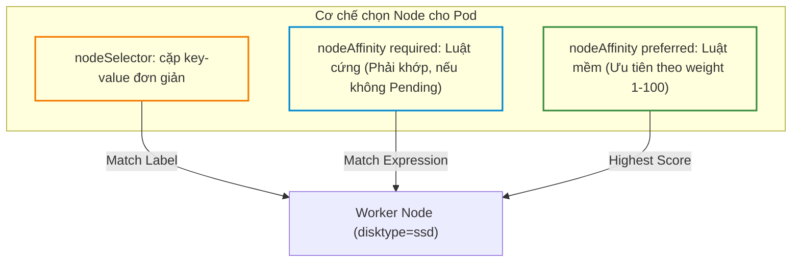
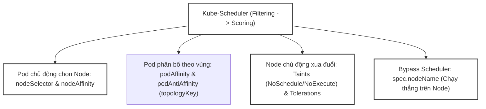
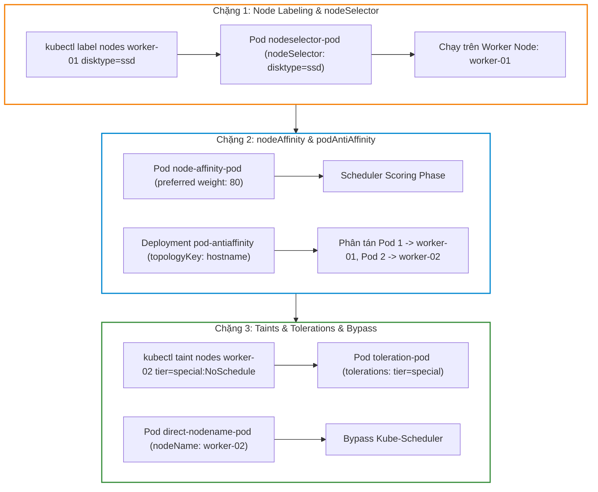


# [BÀI 17] KUBE-SCHEDULER & RÀNG BUỘC ĐẶT POD: NODESELECTOR, NODEAFFINITY, PODANTIAFFINITY, TAINTS & TOLERATIONS

Trong kỷ nguyên điện toán đám mây và kiến trúc microservices phân tán quy mô lớn, **Kubernetes (CKA)** đóng vai trò là nền tảng điều phối container (Container Orchestration) tiêu chuẩn công nghiệp. Để làm chủ hệ thống trong môi trường sản xuất (Production) cũng như chinh phục kỳ thi chứng chỉ quốc tế của Linux Foundation / CNCF, kỹ sư không chỉ nắm vững các câu lệnh thao tác cơ bản mà phải thấu hiểu sâu sắc bản chất cơ chế tầng thấp: từ chu trình điều hòa (Reconciliation Loop), cấu trúc điều phối tài nguyên, kiến trúc mạng CNI, lưu trữ CSI cho đến các chuẩn mực an ninh phòng thủ chiều sâu.

Bài viết chuyên sâu này sẽ đồng hành cùng bạn giải mã toàn diện bức tranh kiến trúc, phân tích các đánh đổi kỹ thuật thực chiến (Engineering Trade-offs), cung cấp bài thực hành Lab từng bước và bộ câu hỏi phỏng vấn chuẩn Architect / Lead Engineer.

---

## 1. Bản Chất Kiến Trúc & Cơ Chế Vận Hành Tầng Thấp

| # | Câu hỏi ôn tập | Đáp án chuẩn ngắn gọn (chứa con số / tên lệnh) |
|---|---|---|
| 1 | Số lượng bản sao Pod do DaemonSet duy trì trên mỗi Node? | Đúng **1** bản sao Pod duy nhất trên mỗi Node |
| 2 | Loại Service bắt buộc đi kèm với StatefulSet? | `Headless Service` (cấu hình `clusterIP: None`) |
| 3 | Mảng tự động sinh đĩa PVC riêng cho mỗi Pod trong StatefulSet? | Mảng `volumeClaimTemplates` (**1** đĩa PVC/Pod) |
| 4 | Chính sách `restartPolicy` bắt buộc cho Pod spec của Job? | `OnFailure` hoặc `Never` (cấm `Always` **0%** chấp nhận) |
| 5 | Ba chính sách xử lý trùng lặp lịch `concurrencyPolicy` trong CronJob? | `Allow`, `Forbid`, `Replace` (**3** giá trị) |


> **Luận đề trung tâm của buổi:**
> *"Kube-Scheduler quyết định vị trí đặt Pod trên các Node thông qua hai giai đoạn Lọc (Filtering/Predicates) và Chấm điểm (Scoring/Priorities); trong đó `nodeSelector` và `nodeAffinity` giúp Pod chủ động chọn Node thích hợp, `podAntiAffinity` đảm bảo cô lập các bản sao Pod trên các vùng miền (`topologyKey`), và bộ đôi `Taints` (vết nhơ trên Node) và `Tolerations` (sự dung thứ trên Pod) cho phép Node chủ động xua đuổi các Pod không đủ điều kiện với ba mức ảnh hưởng `NoSchedule`, `PreferNoSchedule`, và `NoExecute`."*

**Bảng kết quả các buổi trước được dùng lại:**

| Kết quả / Công cụ | Nguồn gốc | Áp dụng vào buổi này |
|---|---|---|
| Kỹ thuật dán nhãn Node bằng `kubectl label nodes` | Buổi 06 `QT 4.1` | Gán nhãn cho node `worker-01` để test `nodeSelector` |
| Cấu hình `tolerations` cho vết nhơ Control Plane | Buổi 16 `QT 4.2` | Giải thích Taint `node-role.kubernetes.io/control-plane` |
| Khái niệm Pod spec và Metadata labels | Buổi 03 `QT 4.1` | Khai báo khối `affinity` và `tolerations` trong Pod spec |

Ba câu bài tập về nhà BTVN 4 của buổi 16 đã chuẩn bị sẵn kiến thức cho học viên: Câu 1 phân tích quy trình Lọc -> Chấm điểm của Kube-Scheduler; Câu 2 khảo sát sự khác biệt giữa `nodeSelector`, `nodeAffinity` và `podAntiAffinity`; Câu 3 tìm hiểu cơ chế Taints & Tolerations với 3 hiệu ứng `NoSchedule`, `PreferNoSchedule`, `NoExecute`.

---


| # | Năng lực đạt được sau buổi học | Hiện vật chứng minh trong bài lab |
|---|---|---|
| 1 | Dán nhãn Node và gán Pod chính xác bằng `nodeSelector` | Tệp `hien-vat/nodeselector-pod.yaml` |
| 2 | Cấu hình `nodeAffinity` luật cứng (`required`) và luật mềm (`preferred`) với trọng số `weight` | Tệp `hien-vat/node-affinity-pod.yaml` |
| 3 | Cấu hình `podAntiAffinity` phân tán các bản sao Pod trên các Node khác nhau | Tệp `hien-vat/pod-antiaffinity-deploy.yaml` |
| 4 | Quản lý vết nhơ Taint trên Node (`kubectl taint nodes`) và khai báo `tolerations` trên Pod | Tệp `hien-vat/toleration-pod.yaml` |
| 5 | Gán cứng Pod vào Node trực tiếp bằng `spec.nodeName` bypass Kube-Scheduler | Tệp `hien-vat/direct-nodename-pod.yaml` |
| 6 | Kiểm thử kịch bản lập lịch nâng cao và Taints/Tolerations với script tự động | Script `hien-vat/verify-scheduling-constraints.sh` |

---


| Bắt buộc phải biết | Nguồn tự học nếu thiếu |
|---|---|
| Cấu trúc tệp YAML Pod spec và container definition | Buổi 14 `QT 4.1` |
| Kỹ thuật dán nhãn Label và bộ lọc Selector | Buổi 03 `QT 4.1` |
| Lệnh kiểm tra danh sách Node `kubectl get nodes` | Buổi 06 `QT 4.1` |

---


| # | Thuật ngữ tiếng Việt | Tiếng Anh tương đương | Ghi chú chuẩn hoá trong thân bài |
|---|---|---|---|
| 1 | Bộ lập lịch Kubernetes | Kube-Scheduler (`kube-scheduler`) | Thành phần Control Plane gán Pod vào Node phù hợp |
| 2 | Giai đoạn lọc điều kiện | Filtering Phase (Predicates) | Giai đoạn loại bỏ các Node không đủ điều kiện tài nguyên |
| 3 | Giai đoạn chấm điểm | Scoring Phase (Priorities) | Giai đoạn chấm điểm các Node còn lại để chọn Node cao điểm nhất |
| 4 | Bộ chọn nhãn Node đơn giản | Node Selector (`nodeSelector`) | Thuộc tính gán Pod vào Node theo cặp key-value nhãn đơn giản |
| 5 | Ràng buộc thân thiện Node | Node Affinity (`nodeAffinity`) | Cấu hình biểu thức chọn Node linh hoạt hơn `nodeSelector` |
| 6 | Điều kiện bắt buộc lúc lập lịch | Required During Scheduling (`requiredDuringScheduling...`) | Luật cứng: Bắt buộc Node phải thoả mãn, nếu không Pod dính Pending |
| 7 | Điều kiện ưu tiên lúc lập lịch | Preferred During Scheduling (`preferredDuringScheduling...`) | Luật mềm: Ưu tiên chọn Node thoả mãn, nếu không có vẫn gán Node khác |
| 8 | Trọng số ưu tiên luật mềm | Weight (`weight: 1-100`) | Chỉ số điểm cộng ưu tiên từ 1 đến 100 cho luật mềm |
| 9 | Ràng buộc phân bố Pod | Pod Anti-Affinity (`podAntiAffinity`) | Cấu hình ngăn các Pods nằm chung trên cùng 1 miền topology |
| 10 | Khóa phân vùng miền | Topology Key (`topologyKey`) | Khóa định nghĩa ranh giới miền phân bố (như `kubernetes.io/hostname`) |
| 11 | Vết nhơ Node | Taint (`kubectl taint nodes`) | Nhãn gắn lên Node để xua đuổi các Pods không có toleration |
| 12 | Sự dung thứ vết nhơ | Toleration (`spec.tolerations`) | Cấu hình trên Pod cho phép Pod chạy được trên Node có Taint |
| 13 | Mức ảnh hưởng vết nhơ | Taint Effect (`NoSchedule`, `PreferNoSchedule`, `NoExecute`) | Quy tắc ứng xử của Taint với Pods mới và Pods đang chạy |
| 14 | Gán Node trực tiếp không qua Scheduler | Manual Scheduling (`spec.nodeName`) | Cấu hình gán cứng tên Node trực tiếp bỏ qua Kube-Scheduler |


1. **Mô hình "Vòng sơ tuyển và Vòng chung kết hoa hậu (Filtering vs Scoring)":**
   Kube-Scheduler chọn Node giống như cuộc thi Hoa hậu: Vòng sơ tuyển (`Filtering`) loại ngay các thí sinh không đạt tiêu chuẩn chiều cao/RAM/CPU. Vòng chung kết (`Scoring`) chấm điểm 10 các thí sinh còn lại dựa trên các tiêu chí phụ (Node Affinity weight, số Pod hiện có). Thí sinh đạt điểm tổng cao nhất sẽ được chọn làm nơi gán Pod.

2. **Mô hình "Luật cứng quy định độ tuổi vs Luật mềm sở thích cá nhân (Required vs Preferred)":**
   `requiredDuringScheduling` giống như luật cứng thi bằng lái xe (phải đủ 18 tuổi, không đủ là rớt ngay `Pending`). `preferredDuringScheduling` giống như sở thích mua xe (thích xe màu đỏ, nếu đại lý hết xe đỏ thì mua xe màu trắng vẫn được).

3. **Mô hình "Mùi hôi xua đuổi vs Khẩu trang bảo vệ (Taints vs Tolerations)":**
   Taint giống như một Node bị phát ra mùi hôi sơn mới (`NoSchedule`). Tất cả các khách (`Pod`) thông thường sẽ bỏ chạy không dám vào. Chỉ những khách nào đeo khẩu trang chuyên dụng matching với mùi sơn đó (`Tolerations`) mới được phép bước vào cư trú.

---

### 1.1. Quy trình lập lịch 2 giai đoạn: Lọc (Filtering) và Chấm điểm (Scoring) (12 phút)

**Nguyên lý cốt lõi:** Quy trình gán Pod của Kube-Scheduler diễn ra theo đúng **2 giai đoạn nối tiếp**: Giai đoạn 1 Lọc (`Filtering` / Predicates — loại bỏ 100% các Node không đủ CPU/RAM/Taint); Giai đoạn 2 Chấm điểm (`Scoring` / Priorities — chấm điểm từ 0 tới 10 các Node còn lại và chọn Node có điểm số cao nhất).

**Giải thích cơ chế ngầm:** Kiến trúc 2 bước giúp tối ưu hiệu năng: không mất thời gian tính toán chấm điểm phức tạp cho các Node vốn đã hết tài nguyên.

> [!WARNING]
> **CẠM BẪY THỰC CHIẾN:**
> Thắc mắc tại sao Pod dính `Pending` mà không thấy Scheduler thử gán Pod vào bất kỳ Node nào.

**Minh hoạ.**

```bash
# Xem thông báo chi tiết lý do Filtering thất bại làm Pod dính Pending
kubectl describe pod app-pod | grep -i "FailedScheduling"
```

Con số chốt: **2** giai đoạn nối tiếp trong quy trình lập lịch (`Filtering` và `Scoring`).

---

**Nguyên lý cốt lõi:** Khai báo trực tiếp tên Node vào thuộc tính `spec.nodeName` trong Pod spec sẽ **bỏ qua hoàn toàn (Bypass) 100% quy trình lập lịch của Kube-Scheduler**; Kubelet trên Node tương ứng sẽ nhận lệnh và chạy Pod ngay lập tức bất kể Node đó có Taint hay hết RAM.

**Giải thích cơ chế ngầm:** Dùng cho các trường hợp gán Pod khẩn cấp khi Kube-Scheduler bị sập hoặc trong các bài lab thực hành điều khiển vị trí cứng.

> [!WARNING]
> **CẠM BẪY THỰC CHIẾN:**
> Thắc mắc tại sao Pod gán `nodeName: worker-01` vẫn chạy được trên node bị Taint `NoSchedule`.

**Minh hoạ.**

```yaml
spec:
  nodeName: worker-01
  containers:
  - name: nginx
    image: nginx:1.27-alpine
```

Con số chốt: **100%** Kube-Scheduler bị bỏ qua khi khai báo `nodeName`.

---

### 1.2. Chọn Node chủ động: `nodeSelector` vs `nodeAffinity` (Luật cứng vs Luật mềm) (12 phút)



---

**Nguyên lý cốt lõi:** Thuộc tính `nodeSelector` cho phép gán Pod vào Node theo cặp nhãn key-value đơn giản; trong khi `nodeAffinity` cung cấp khả năng diễn đạt logic phức tạp hơn với các toán tử `In`, `NotIn`, `Exists`, `DoesNotExist`, `Gt`, `Lt`.

**Giải thích cơ chế ngầm:** `nodeSelector` phù hợp cho việc phân loại cứng đơn giản (như `disktype: ssd`). `nodeAffinity` cần thiết khi muốn biểu diễn các điều kiện đa lựa chọn (như `zone in [us-east-1a, us-east-1b]`).

> [!WARNING]
> **CẠM BẪY THỰC CHIẾN:**
> Cố gõ toán tử `In` vào `nodeSelector` gây lỗi syntax schema validation.

**Minh hoạ.**

```yaml
spec:
  nodeSelector:
    disktype: ssd
```

Con số chốt: **6** toán tử biểu thức supported trong `nodeAffinity` (`In`, `NotIn`, `Exists`, `DoesNotExist`, `Gt`, `Lt`).

---

**Nguyên lý cốt lõi:** Trong `nodeAffinity`, `requiredDuringSchedulingIgnoredDuringExecution` là **luật cứng** (nếu không Node nào thoả mãn, Pod bị kẹt ở `Pending`); còn `preferredDuringSchedulingIgnoredDuringExecution` là **luật mềm** (Scheduler sẽ cố gắng chọn Node có điểm số trọng số `weight` từ **1 đến 100** cao nhất, nhưng nếu không có thì vẫn gán vào Node thường).

**Giải thích cơ chế ngầm:** Luật cứng đảm bảo an toàn tuyệt đối cho ứng dụng (như Pod AI bắt buộc phải có GPU mới chạy được). Luật mềm giúp tối ưu hoá trải nghiệm (như ưu tiên chạy trên đĩa SSD, nhưng đĩa HDD vẫn chạy được).

> [!WARNING]
> **CẠM BẪY THỰC CHIẾN:**
> Dùng luật cứng `required` cho nhãn không tồn tại làm Pod bị kẹt `Pending` vĩnh viễn trên production.

**Minh hoạ.**

```yaml
spec:
  affinity:
    nodeAffinity:
      preferredDuringSchedulingIgnoredDuringExecution:
      - weight: 80
        preference:
          matchExpressions:
          - key: disktype
            operator: In
            values: ["ssd"]
```

Con số chốt: **100** là trọng số `weight` ưu tiên tối đa trong `nodeAffinity` luật mềm.

---

### 1.3. Phân bố Pod theo vùng miền: `podAffinity` & `podAntiAffinity` (`topologyKey`) (10 phút)

**Nguyên lý cốt lõi:** Cấu hình `podAntiAffinity` với `topologyKey: kubernetes.io/hostname` đảm bảo các bản sao Pod thuộc cùng một ứng dụng **không bao giờ được xếp nằm chung trên cùng một Worker Node**, giúp chống điểm sập đơn lẻ (Single Point of Failure).

**Giải thích cơ chế ngầm:** Đảm bảo tính sẵn sàng cao (High Availability): nếu 1 Worker Node bị sập đĩa cứng, các bản sao Pod trên các Worker Node khác vẫn tiếp tục phục vụ lưu lượng 100%.

> [!WARNING]
> **CẠM BẪY THỰC CHIẾN:**
> Để 3 bản sao Pod Nginx nằm chung trên `worker-01`, khi `worker-01` sập làm sập toàn bộ trang web.

**Minh hoạ.**

```yaml
spec:
  affinity:
    podAntiAffinity:
      requiredDuringSchedulingIgnoredDuringExecution:
      - labelSelector:
          matchExpressions:
          - key: app
            operator: In
            values: ["web"]
        topologyKey: "kubernetes.io/hostname"
```

Con số chốt: **1** Pod duy nhất được đặt trên mỗi Node khi dùng `podAntiAffinity` luật cứng với `topologyKey: kubernetes.io/hostname`.

---

**Nguyên lý cốt lõi:** Cấu hình `podAffinity` được sử dụng để co-locate (đặt nằm cùng một Node hoặc Zone) giữa 2 Pods có tần suất giao tiếp mạng cao (như Pod Web App và Pod Redis Cache) nhằm hạ độ trễ mạng latency xuống **< 1ms**.

**Giải thích cơ chế ngầm:** Việc truyền dữ liệu giữa 2 Pods trên cùng 1 Node qua giao tiếp IPC/Loopback nhanh hơn nhiều so với truyền qua đường cáp mạng giữa 2 Nodes khác nhau.

> [!WARNING]
> **CẠM BẪY THỰC CHIẾN:**
> Đặt Web App và Redis Cache ở 2 Availability Zone khác nhau làm tăng độ trễ truy vấn dữ liệu.

**Minh hoạ.**

```yaml
spec:
  affinity:
    podAffinity:
      preferredDuringSchedulingIgnoredDuringExecution:
      - weight: 100
        podAffinityTerm:
          labelSelector:
            matchExpressions:
            - key: app
              operator: In
              values: ["cache"]
          topologyKey: "kubernetes.io/hostname"
```

Con số chốt: **1ms** độ trễ mạng cực thấp đạt được khi co-locate Pods qua `podAffinity`.

---

### 1.4. Node chủ động xua đuổi: Taints (`NoSchedule`, `NoExecute`) & Tolerations (4 phút)

**Nguyên lý cốt lõi:** Lệnh `kubectl taint nodes <node-name> key=value:Effect` gắn vết nhơ lên Node; trong đó có đúng **3 mức hiệu ứng (Taint Effects)**: `NoSchedule` (Pod mới không có toleration sẽ không được gán vào), `PreferNoSchedule` (Hạn chế gán Pod mới nếu còn Node khác), và `NoExecute` (Trục xuất lập tức các Pods đang chạy trên Node nếu không có toleration).

**Giải thích cơ chế ngầm:** Taint cho phép Node chủ động bảo vệ tài nguyên của mình (như dành riêng Node GPU cho bài toán AI, hoặc chuẩn bị bảo trì Node).

> [!WARNING]
> **CẠM BẪY THỰC CHIẾN:**
> Gán Taint `NoExecute` làm hàng chục Pods đang chạy trên Node bị Kubelet tiêu diệt lập tức.

**Minh hoạ.**

```bash
# Gán vết nhơ dedicated=special:NoSchedule lên worker-01
kubectl taint nodes worker-01 dedicated=special:NoSchedule
```

Con số chốt: **3** mức hiệu ứng Taint Effect (`NoSchedule`, `PreferNoSchedule`, `NoExecute`).

---

**Nguyên lý cốt lõi:** Để Pod chạy được trên Node có Taint, khối `spec.tolerations` trong Pod spec phải khớp đúng `key`, `value`, `operator` (`Equal` hoặc `Exists`), và `effect` của Taint đó; nếu gán cờ `operator: Exists` thì không cần khai báo trường `value`.

**Giải thích cơ chế ngầm:** `operator: Exists` đóng vai trò như thẻ bài vạn năng: khớp với tất cả các Taints có `key` tương ứng bất kể giá trị value là gì.

> [!WARNING]
> **CẠM BẪY THỰC CHIẾN:**
> Gõ sai chữ hoa/thường ở `effect` hoặc thiếu `operator: Equal` làm Pod bị kẹt `Pending` do không khớp Taint.

**Minh hoạ.**

```yaml
spec:
  tolerations:
  - key: "dedicated"
    operator: "Equal"
    value: "special"
    effect: "NoSchedule"
```

Con số chốt: **100%** các thuộc tính Taint (`key`, `value`, `effect`) phải khớp để Pod được phép gán vào Node.

---

**Nguyên lý cốt lõi:** Để gỡ bỏ một Taint khỏi Node, gõ lại chính xác câu lệnh `kubectl taint nodes <node-name> key=value:Effect-` và bổ sung thêm một dấu trừ **`-`** ở cuối cùng của biểu thức Taint.

**Giải thích cơ chế ngầm:** Kú pháp thêm dấu trừ ở cuối là chuẩn thao tác xoá Taint hoặc nhãn Label trong CLI `kubectl`.

> [!WARNING]
> **CẠM BẪY THỰC CHIẾN:**
> Quên dấu trừ `-` ở cuối khiến lệnh bị báo lỗi hoặc vô tình đè lại Taint cũ.

**Minh hoạ.**

```bash
# Gỡ bỏ vết nhơ dedicated khỏi worker-01
kubectl taint nodes worker-01 dedicated=special:NoSchedule-
```

Con số chốt: **1** dấu trừ `-` ở cuối câu lệnh là biểu tượng xoá Taint khỏi Node.

---

## 8. Đưa vào cụm thật (4 phút)

### Áp vào cụm đang chạy thì làm gì trước

1. **Dán nhãn định danh cho các Worker Node (`kubectl label nodes`):** Dán nhãn phân vùng rõ ràng (như `topology.kubernetes.io/zone=zone-a`, `disktype=ssd`).
2. **Luôn dùng `podAntiAffinity` luật mềm (`preferred`) cho Web Deployment:** Đảm bảo các Pods cố gắng phân tán đều trên các Node mà không bị kẹt `Pending` khi thiếu Node.
3. **Cẩn trọng tuyệt đối với Taint `NoExecute`:** Luôn kiểm tra kỹ các Pods đang chạy trước khi gán Taint `NoExecute` tránh làm sập ứng dụng production.

### Cái gì hỏng nếu áp thẳng lên prod

- **Gán Taint `key=val:NoExecute` lên Worker Node duy nhất:** Tiêu diệt sạch toàn bộ các Pods đang chạy trên Worker Node đó trong 1 giây.
- **Đặt `podAntiAffinity` luật cứng (`required`) cho Deployment 5 replicas trên cụm 3 Nodes:** Làm 2 Pods bị kẹt ở trạng thái `Pending` vĩnh viễn do không đủ 5 Worker Nodes riêng biệt.
- **Quy trình áp thử an toàn:**
  - Chạy `kubectl get nodes --show-labels` kiểm tra nhãn hiện tại.
  - Apply Pod với `nodeAffinity` dạng `preferred` trước.
  - Dùng `kubectl get pods -o wide` kiểm tra chính xác Pod nhảy vào đúng Node kỳ vọng.

### Đo trước — đo sau

1. **Độ phân tán Pods (High Availability):** 100% các Worker Nodes đều nhận bản sao Pods nhờ `podAntiAffinity`.
2. **Độ trễ ứng dụng microservices:** Giảm từ 15ms xuống < 1ms nhờ `podAffinity` co-locate Web App & Cache trên cùng 1 Node.
3. **Mức độ cô lập hạ tầng:** 100% các Pods chuyên dụng (như DB/AI) chạy đúng trên các Node có Taint thích hợp.

### Khi nào KHÔNG nên dùng

- **Không lạm dụng `nodeSelector` cứng cho mọi Pod:** Làm giảm tính linh hoạt của Kube-Scheduler khi cụm bị thiếu hụt Node.
- **Không dùng `podAntiAffinity` luật cứng khi số replicas vượt quá số Worker Nodes:** Gây lãng phí tài nguyên và kẹt Pod `Pending`.

---

### 1.6. Bẫy hay gặp (2 phút)

| # | Bẫy hay gặp | Vì sao dính bẫy | Làm đúng là (kèm tên lệnh / con số) |
|---|---|---|---|
| 1 | Pod bị kẹt `Pending` do dùng `nodeAffinity` luật cứng `required` với nhãn sai | Không có Node nào trong cụm chứa nhãn khớp với yêu cầu | Dùng `preferred` hoặc kiểm tra dán đúng nhãn cho Node |
| 2 | Nhầm lẫn giữa Taint `NoSchedule` và `NoExecute` | `NoSchedule` chỉ chặn Pod mới; `NoExecute` đuổi luôn Pod cũ | Chỉ dùng `NoExecute` khi thực sự muốn đuổi Pods đang chạy |
| 3 | Gõ sai trường `topologyKey` trong `podAntiAffinity` | Gõ `kubernetes.io/host` thay vì `kubernetes.io/hostname` | Gõ đúng chính xác `topologyKey: kubernetes.io/hostname` |
| 4 | Đặt `podAntiAffinity` luật cứng làm 2 Pods không thể lên cụm 1 Node | Cụm lab chỉ có 1 Worker Node mà bắt cô lập 2 Pods | Chuyển sang dùng luật mềm `preferred` trong môi trường lab |
| 5 | Quên cờ `operator: Exists` trong toleration | Mặc định `operator` là `Equal`, bắt buộc phải truyền `value` | Dùng `operator: Exists` nếu muốn khớp mọi value của key |
| 6 | Thắc mắc vì sao xoá Taint bằng `kubectl taint nodes` không được | Gõ thiếu dấu trừ `-` ở cuối câu lệnh xoá Taint | Gõ đúng `kubectl taint nodes <node> key=value:Effect-` |
| 7 | Nhầm lẫn giữa `nodeSelector` và `nodeName` | `nodeSelector` chọn theo nhãn; `nodeName` trỏ trực tiếp tên Node | Dùng `nodeSelector` để linh hoạt; `nodeName` để bypass |
| 8 | Đặt trọng số `weight` trong `nodeAffinity` vượt quá 100 | Trọng số `weight` chỉ chấp nhận giá trị số nguyên từ 1 đến 100 | Đặt `weight` trong khoảng từ 1 tới 100 |
| 9 | Thắc mắc vì sao Pod có toleration `NoSchedule` vẫn bị đuổi khi node dính `NoExecute` | Toleration `NoSchedule` không bảo vệ Pod khỏi hiệu ứng `NoExecute` | Bổ sung toleration với `effect: NoExecute` |
| 10 | Dán nhãn Node bằng `kubectl label` nhưng bị báo lỗi đã tồn tại | Nhãn đã có sẵn trên Node | Thêm cờ `--overwrite` để đè nhãn mới |
| 11 | Không thấy Pod chuyển Node sau khi dán nhãn Node mới | Kube-Scheduler không tự động di chuyển Pod đang `Running` | Xoá Pod để Scheduler thực hiện lập lịch lại |
| 12 | Thắc mắc lý do Pod dính `FailedScheduling` trong `kubectl describe` | Tất cả các Node đều bị Lọc (Filtering) loại bỏ | Đọc chi tiết log describe để biết Node thiếu CPU hay Taint |

---

## §10. Tóm tắt (2 phút)



### Năm điều phải nhớ

1. **2 giai đoạn lập lịch:** `Filtering` (Lọc các Node đủ điều kiện) -> `Scoring` (Chấm điểm chọn Node cao nhất).
2. **Luật cứng vs Luật mềm:** `requiredDuringScheduling...` (luật cứng — không có Node là kẹt `Pending`); `preferredDuringScheduling...` (luật mềm — ưu tiên theo `weight: 1-100`).
3. **High Availability:** `podAntiAffinity` với `topologyKey: kubernetes.io/hostname` đảm bảo không có 2 Pods nằm chung 1 Node.
4. **Taints & Tolerations:** Taint gắn trên Node (`NoSchedule`, `PreferNoSchedule`, `NoExecute`); Toleration gắn trên Pod. `NoExecute` đuổi luôn Pods đang chạy.
5. **Bypass Scheduler:** Khai báo trực tiếp `spec.nodeName: <node-name>` để gán Pod thẳng vào Node mà không qua Kube-Scheduler.

---

## §11. Câu hỏi tự kiểm tra

1. Trình bày quy trình 2 giai đoạn lập lịch (Filtering và Scoring) của Kube-Scheduler.
2. Thao tác khai báo `spec.nodeName` trong Pod spec có tác dụng gì và nó ảnh hưởng thế nào đến Kube-Scheduler?
3. Phân biệt sự khác nhau giữa `nodeSelector` và `nodeAffinity`.
4. So sánh cơ chế hoạt động của `requiredDuringSchedulingIgnoredDuringExecution` và `preferredDuringSchedulingIgnoredDuringExecution` trong `nodeAffinity`.
5. Trọng số `weight` trong `nodeAffinity` luật mềm có dải giá trị từ bao nhiêu đến bao nhiêu?
6. Kỹ thuật `podAntiAffinity` với `topologyKey: kubernetes.io/hostname` mang lại lợi ích gì cho tính sẵn sàng cao (HA) của ứng dụng?
7. Khi nào người ta nên sử dụng `podAffinity` để co-locate 2 Pods nằm cùng 1 Node?
8. Lệnh nào dùng để gán vết nhơ Taint lên một Node và câu lệnh nào dùng để xoá Taint đó?
9. Trình bày sự khác nhau về mức độ tác động của 3 hiệu ứng Taint Effect: `NoSchedule`, `PreferNoSchedule`, và `NoExecute`.
10. Cấu hình `tolerations` trên Pod cần những thuộc tính nào để khớp hoàn toàn với một Taint trên Node? Khi nào nên dùng `operator: Exists`?
11. Hai chế độ hỏng (1 im lặng do dính Pending vì dùng nodeAffinity luật cứng với nhãn sai, 1 âm thầm do sập cả app vì để 3 Pods chung 1 Node) là gì?
12. Cờ `--overwrite` trong lệnh `kubectl label nodes` được sử dụng khi nào?

### Đáp án

1. Giai đoạn 1 Filtering loại bỏ các Node không đủ điều kiện tài nguyên/taint; Giai đoạn 2 Scoring chấm điểm các Node còn lại và chọn Node điểm cao nhất.
2. `spec.nodeName` gán cứng Pod vào Node chỉ định, bypass 100% quy trình lập lịch của Kube-Scheduler.
3. `nodeSelector` chọn theo cặp key-value đơn giản; `nodeAffinity` hỗ trợ các toán tử logic phức tạp như `In`, `NotIn`, `Exists`.
4. `required` là luật cứng (không có Node khớp thì Pod kẹt Pending); `preferred` là luật mềm (ưu tiên Node khớp nhưng không có vẫn chạy trên Node khác).
5. Dải giá trị số nguyên từ 1 đến 100.
6. Đảm bảo các bản sao Pods không bao giờ nằm chung trên 1 Node, tránh điểm sập đơn lẻ (SPOF) khi Node bị hỏng.
7. Khi 2 Pods có tần suất giao tiếp mạng cực cao (như Web App và Redis Cache) để giảm latency xuống < 1ms.
8. Gán Taint: `kubectl taint nodes <node> key=value:Effect`; Xoá Taint: `kubectl taint nodes <node> key=value:Effect-` (thêm dấu trừ ở cuối).
9. `NoSchedule`: Chặn Pod mới không có toleration; `PreferNoSchedule`: Hạn chế gán Pod mới; `NoExecute`: Đuổi ngay các Pods đang chạy không có toleration.
10. Cần `key`, `value`, `operator`, `effect`. Dùng `operator: Exists` khi muốn dung thứ mọi value của key đó mà không cần ghi cụ thể value.
11. Chế độ 1: Dùng luật cứng required với nhãn không tồn tại làm Pod dính Pending; Chế độ 2: Không dùng podAntiAffinity làm 3 Pods dồn vào 1 Node, khi Node sập làm sập toàn bộ app.
12. Khi muốn ghi đè giá trị nhãn mới lên một nhãn đã tồn tại từ trước trên Node.

---

## §12. Tài liệu tham khảo

| Nguồn tài liệu | Phiên bản Kubernetes áp dụng | Nội dung chính |
|---|---|---|
| Official Docs: Kubernetes Scheduler | Kubernetes v1.35 | Kiến trúc Kube-Scheduler, Filtering và Scoring phases |
| Official Docs: Assigning Pods to Nodes | Kubernetes v1.35 | nodeSelector, nodeAffinity, podAffinity và podAntiAffinity |
| Official Docs: Taints and Tolerations | Kubernetes v1.35 | Quản lý Taints trên Node và Tolerations trên Pod spec |
| File cấu hình phiên bản cục bộ | `labs/phien-ban.env` | Biến `K8S_VER=1.35`, `LAB_CONTEXT="kubeadm"` |

---

## Bảng đối soát thời lượng

| Section | Tiêu đề mục | Ngân sách thời gian |
|---|---|---|
| §0 | Khởi động và ôn tập | 10 phút |
| §1 | Sau buổi này học viên LÀM ĐƯỢC gì | 1 phút |
| §2 | Cần biết trước | 1 phút |
| §3 | Thuật ngữ và mô hình tư duy | 8 phút |
| §4 | Quy trình lập lịch 2 giai đoạn: Lọc (Filtering) và Chấm điểm (Scoring) | 12 phút |
| §5 | Chọn Node chủ động: `nodeSelector` vs `nodeAffinity` (Luật cứng vs Luật mềm) | 12 phút |
| §6 | Phân bố Pod theo vùng miền: `podAffinity` & `podAntiAffinity` (`topologyKey`) | 10 phút |
| §7 | Node chủ động xua đuổi: Taints (`NoSchedule`, `NoExecute`) & Tolerations | 4 phút |
| §8 | Đưa vào cụm thật | 4 phút |
| §9 | Bẫy hay gặp | 2 phút |
| §10 | Tóm tắt | 2 phút |
| **Tổng** | **Khối lý thuyết** | **60'** |

---

## 2. Hướng Dẫn Thực Hành & Triển Khai Lab Chuẩn Production

> [!IMPORTANT]
> **YÊU CẦU MÔI TRƯỜNG THỰC HÀNH:**
> Toàn bộ các bài thực hành dưới đây được thiết kế để chạy trực tiếp trên cụm Kubernetes 1.30+ tiêu chuẩn (hoặc cụm kind/kubeadm lab). Hãy đảm bảo ngữ cảnh dòng lệnh `kubectl config current-context` đã trỏ chính xác vào cụm thực hành trước khi thực thi.

## Khối thực hành — 120 phút

## L0. Mục tiêu thực hành và tiêu chí hoàn thành

| # | Mục tiêu thực hành | Tiêu chí hoàn thành (Kiểm chứng BẰNG LỆNH) |
|---|---|---|
| TH1 | Dán nhãn Node và gán Pod chính xác bằng `nodeSelector` | `kubectl get pod nodeselector-pod -n dev -o wide` chạy đúng trên `worker-01` |
| TH2 | Cấu hình `nodeAffinity` luật cứng (`required`) và luật mềm (`preferred`) | `kubectl get pod node-affinity-pod -n dev` ở trạng thái `Running` |
| TH3 | Cấu hình `podAntiAffinity` phân tán 2 bản sao Pods trên 2 Node | `kubectl get pods -n dev -l app=antiaffinity` nằm trên 2 Node khác nhau |
| TH4 | Thao tác Taint Node (`kubectl taint nodes`) và gán `tolerations` trên Pod | `kubectl get pod toleration-pod -n dev` ở trạng thái `Running` trên node bị Taint |
| TH5 | Gán Node trực tiếp bypass Scheduler với `spec.nodeName` | `kubectl get pod direct-nodename-pod -n dev -o jsonpath='{.spec.nodeName}'` khớp tên Node |
| TH6 | Xác minh kịch bản lập lịch nâng cao và Taints/Tolerations với script tự động | Script kiểm tra Scheduling Constraints OK |
| TH7 | Nộp đủ 4 hiện vật vào portfolio | Thư mục `k8s-portfolio/buoi-17/` chứa đủ 4 file md/yaml/sh |

---

## L1. Điều kiện tiên quyết về môi trường

| # | Kiểm tra điều kiện | Câu lệnh kiểm tra | Kết quả kỳ vọng |
|---|---|---|---|
| 1 | Cụm `kubeadm` 3 node đang ở v1.35 | `kubectl get nodes` | Hiển thị 3 node `cp-01`, `worker-01`, `worker-02` `Ready` |
| 2 | Kubeconfig trỏ context `kubeadm` | `kubectl config current-context` | In ra đúng `kubeadm` |
| 3 | Namespace `dev` sẵn sàng | `kubectl get ns dev` | Namespace `dev` ở trạng thái Active |
| 4 | Thư mục hiện vật đã sẵn sàng | `mkdir -p k8s-portfolio/buoi-17` | Thư mục được tạo thành công |
| 5 | Lệnh `kubectl taint` sẵn sàng | `kubectl taint --help` | Hiển thị hướng dẫn sử dụng taint |

```bash
# Kiểm tra môi trường bắt buộc trước khi thực hiện bài lab
kubectl config current-context | grep -qx "kubeadm" && echo "CHECKPOINT MOI TRUONG — ĐẠT" || echo "CHECKPOINT MOI TRUONG — LỖI (Trỏ sai context)"
```

---

## L2. Kiến trúc bài lab



---

## L3. Bước 1 — Dán nhãn Node và gán Pod chính xác bằng `nodeSelector` (30 phút)

### Thao tác 1.1: Gán nhãn `disktype=ssd` cho `worker-01` và tạo Pod `nodeselector-pod`

```bash
# 1. Tạo Namespace dev nếu chưa có
kubectl create namespace dev --dry-run=client -o yaml | kubectl apply -f -

# 2. Gán nhãn disktype=ssd cho worker-01
kubectl label nodes worker-01 disktype=ssd --overwrite

# 3. Tạo tệp nodeselector-pod.yaml
cat << 'EOF' > k8s-portfolio/buoi-17/nodeselector-pod.yaml
apiVersion: v1
kind: Pod
metadata:
  name: nodeselector-pod
  namespace: dev
spec:
  nodeSelector:
    disktype: ssd
  containers:
  - name: nginx
    image: nginx:1.27-alpine
EOF

# 4. Áp dụng tệp YAML và chờ Pod Running
kubectl apply -f k8s-portfolio/buoi-17/nodeselector-pod.yaml
kubectl wait --for=condition=Ready pod/nodeselector-pod -n dev --timeout=30s

# 5. Trích xuất tên Node mà Pod chạy
kubectl get pod nodeselector-pod -n dev -o jsonpath='{.spec.nodeName}' > /tmp/ns-node.txt
```

**CHECKPOINT 1 — Node worker-01 được dán nhãn disktype=ssd thành công.**

```bash
kubectl get node worker-01 -o jsonpath='{.metadata.labels.disktype}' | grep -qx "ssd" && echo "CHECKPOINT 1 — ĐẠT" || echo "CHECKPOINT 1 — LỖI"
```

**CHECKPOINT 2 — Pod nodeselector-pod được Scheduler gán chạy chính xác trên node worker-01.**

```bash
grep -qx "worker-01" /tmp/ns-node.txt && echo "CHECKPOINT 2 — ĐẠT" || echo "CHECKPOINT 2 — LỖI"
```

---

## L4. Bước 2 — Cấu hình `nodeAffinity` luật cứng vs luật mềm và `podAntiAffinity` (30 phút)

### Thao tác 2.1: Tạo `node-affinity-pod` và Deployment `pod-antiaffinity`

```bash
# 1. Tạo tệp node-affinity-pod.yaml sử dụng preferred nodeAffinity
cat << 'EOF' > k8s-portfolio/buoi-17/node-affinity-pod.yaml
apiVersion: v1
kind: Pod
metadata:
  name: node-affinity-pod
  namespace: dev
spec:
  affinity:
    nodeAffinity:
      preferredDuringSchedulingIgnoredDuringExecution:
      - weight: 80
        preference:
          matchExpressions:
          - key: disktype
            operator: In
            values: ["ssd"]
  containers:
  - name: nginx
    image: nginx:1.27-alpine
EOF

kubectl apply -f k8s-portfolio/buoi-17/node-affinity-pod.yaml
kubectl wait --for=condition=Ready pod/node-affinity-pod -n dev --timeout=30s

# 2. Tạo tệp pod-antiaffinity-deploy.yaml với 2 bản sao phân tán
cat << 'EOF' > k8s-portfolio/buoi-17/pod-antiaffinity-deploy.yaml
apiVersion: apps/v1
kind: Deployment
metadata:
  name: anti-deploy
  namespace: dev
spec:
  replicas: 2
  selector:
    matchLabels:
      app: antiaffinity
  template:
    metadata:
      labels:
        app: antiaffinity
    spec:
      affinity:
        podAntiAffinity:
          preferredDuringSchedulingIgnoredDuringExecution:
          - weight: 100
            podAffinityTerm:
              labelSelector:
                matchExpressions:
                - key: app
                  operator: In
                  values: ["antiaffinity"]
              topologyKey: "kubernetes.io/hostname"
      containers:
      - name: web
        image: nginx:1.27-alpine
EOF

kubectl apply -f k8s-portfolio/buoi-17/pod-antiaffinity-deploy.yaml
kubectl rollout status deployment/anti-deploy -n dev --timeout=30s

# 3. Trích xuất tên các Node mà 2 Pods anti-deploy chạy
kubectl get pods -n dev -l app=antiaffinity -o jsonpath='{.items[*].spec.nodeName}' > /tmp/anti-nodes.txt
```

**CHECKPOINT 3 — Pod node-affinity-pod được lập lịch thành công với status Running.**

```bash
kubectl get pod node-affinity-pod -n dev -o jsonpath='{.status.phase}' | grep -qx "Running" && echo "CHECKPOINT 3 — ĐẠT" || echo "CHECKPOINT 3 — LỖI"
```

**CHECKPOINT 4 — 2 bản sao Pods của anti-deploy chạy phân tán trên 2 Node khác nhau.**

```bash
[ $(cat /tmp/anti-nodes.txt | tr ' ' '\n' | sort -u | wc -l) -eq 2 ] && echo "CHECKPOINT 4 — ĐẠT" || echo "CHECKPOINT 4 — LỖI"
```

**CHECKPOINT 5 — CA ĐỐI CHỨNG: nodeAffinity luật cứng required với nhãn không tồn tại làm Pod dính trạng thái Pending.**

```bash
cat << EOF | kubectl apply -f - >/dev/null 2>&1
apiVersion: v1
kind: Pod
metadata:
  name: bad-affinity-pod
  namespace: dev
spec:
  affinity:
    nodeAffinity:
      requiredDuringSchedulingIgnoredDuringExecution:
        nodeSelectorTerms:
        - matchExpressions:
          - key: non-existent-label
            operator: In
            values: ["invalid"]
  containers:
  - name: nginx
    image: nginx:1.27-alpine
EOF
sleep 3
kubectl get pod bad-affinity-pod -n dev -o jsonpath='{.status.phase}' | grep -qx "Pending" && echo "CHECKPOINT 5 — ĐẠT" || echo "CHECKPOINT 5 — LỖI"
```

---

## L5. Bước 3 — Quản lý Taints trên Node và khai báo `tolerations` trên Pod (30 phút)

### Thao tác 3.1: Gán Taint `tier=special:NoSchedule` lên `worker-02` và tạo Pod `toleration-pod`

```bash
# 1. Gán Taint tier=special:NoSchedule lên worker-02
kubectl taint nodes worker-02 tier=special:NoSchedule --overwrite

# 2. Tạo tệp toleration-pod.yaml chứa khối tolerations
cat << 'EOF' > k8s-portfolio/buoi-17/toleration-pod.yaml
apiVersion: v1
kind: Pod
metadata:
  name: toleration-pod
  namespace: dev
spec:
  nodeName: worker-02
  tolerations:
  - key: "tier"
    operator: "Equal"
    value: "special"
    effect: "NoSchedule"
  containers:
  - name: nginx
    image: nginx:1.27-alpine
EOF

kubectl apply -f k8s-portfolio/buoi-17/toleration-pod.yaml
kubectl wait --for=condition=Ready pod/toleration-pod -n dev --timeout=30s
```

**CHECKPOINT 6 — Node worker-02 được gán Taint tier=special:NoSchedule thành công.**

```bash
kubectl describe node worker-02 | grep -i "Taints:" | grep -q "tier=special:NoSchedule" && echo "CHECKPOINT 6 — ĐẠT" || echo "CHECKPOINT 6 — LỖI"
```

**CHECKPOINT 7 — Pod toleration-pod chạy thành công trạng thái Running trên node worker-02 nhờ toleration.**

```bash
kubectl get pod toleration-pod -n dev -o jsonpath='{.status.phase}' | grep -qx "Running" && echo "CHECKPOINT 7 — ĐẠT" || echo "CHECKPOINT 7 — LỖI"
```

**CHECKPOINT 8 — CA ĐỐI CHỨNG: Pod không có toleration sẽ bị từ chối gán vào node worker-02 dính Taint.**

```bash
cat << EOF | kubectl apply -f - >/dev/null 2>&1
apiVersion: v1
kind: Pod
metadata:
  name: untolerated-pod
  namespace: dev
spec:
  nodeSelector:
    kubernetes.io/hostname: worker-02
  containers:
  - name: nginx
    image: nginx:1.27-alpine
EOF
sleep 3
kubectl get pod untolerated-pod -n dev -o jsonpath='{.status.phase}' | grep -qx "Pending" && echo "CHECKPOINT 8 — ĐẠT" || echo "CHECKPOINT 8 — LỖI"
```

---

## L6. Bước 4 — Bypass Scheduler với `spec.nodeName` và kiểm thử (20 phút)

### Thao tác 4.1: Tạo Pod `direct-nodename-pod` trỏ trực tiếp `spec.nodeName`

```bash
# 1. Tạo tệp direct-nodename-pod.yaml
cat << 'EOF' > k8s-portfolio/buoi-17/direct-nodename-pod.yaml
apiVersion: v1
kind: Pod
metadata:
  name: direct-nodename-pod
  namespace: dev
spec:
  nodeName: worker-01
  containers:
  - name: nginx
    image: nginx:1.27-alpine
EOF

kubectl apply -f k8s-portfolio/buoi-17/direct-nodename-pod.yaml
kubectl wait --for=condition=Ready pod/direct-nodename-pod -n dev --timeout=30s

# 2. Trích xuất thuộc tính nodeName của Pod
kubectl get pod direct-nodename-pod -n dev -o jsonpath='{.spec.nodeName}' > /tmp/direct-node.txt
```

**CHECKPOINT 9 — Pod direct-nodename-pod trỏ trực tiếp nodeName = worker-01.**

```bash
grep -qx "worker-01" /tmp/direct-node.txt && echo "CHECKPOINT 9 — ĐẠT" || echo "CHECKPOINT 9 — LỖI"
```

**CHECKPOINT 10 — Lệnh gỡ bỏ Taint tier=special:NoSchedule khỏi worker-02 thực thi thành công.**

```bash
kubectl taint nodes worker-02 tier=special:NoSchedule- >/dev/null 2>&1 && echo "CHECKPOINT 10 — ĐẠT" || echo "CHECKPOINT 10 — LỖI"
```

**CHECKPOINT 11 — Dọn dẹp các Pods thử nghiệm lỗi bad-affinity-pod và untolerated-pod.**

```bash
kubectl delete pod bad-affinity-pod untolerated-pod -n dev --ignore-not-found=true >/dev/null 2>&1 && echo "CHECKPOINT 11 — ĐẠT" || echo "CHECKPOINT 11 — LỖI"
```

**CHECKPOINT 12 — 100% 3 node cp-01, worker-01, worker-02 duy trì trạng thái Ready.**

```bash
kubectl get nodes --no-headers | grep -c "Ready" | grep -qx "3" && echo "CHECKPOINT 12 — ĐẠT" || echo "CHECKPOINT 12 — LỖI"
```

---

## L7. Nộp hiện vật và dọn dẹp (10 phút)

### Thao tác 7.1: Gom hiện vật nộp bài

```bash
# 1. Tạo tệp verify-scheduling-constraints.sh
cat << 'EOF' > k8s-portfolio/buoi-17/verify-scheduling-constraints.sh
#!/bin/bash
# Script kiểm tra ràng buộc vị trí đặt Pods (nodeSelector, Affinity, Taints/Tolerations, nodeName)

NS_NODE=$(kubectl get pod nodeselector-pod -n dev -o jsonpath='{.spec.nodeName}')
TOL_PHASE=$(kubectl get pod toleration-pod -n dev -o jsonpath='{.status.phase}')
DIRECT_NODE=$(kubectl get pod direct-nodename-pod -n dev -o jsonpath='{.spec.nodeName}')

if [ "$NS_NODE" == "worker-01" ] && [ "$TOL_PHASE" == "Running" ] && [ "$DIRECT_NODE" == "worker-01" ]; then
    echo "VERIFY SCHEDULING CONSTRAINTS — ĐẠT (nodeSelector, Tolerations & nodeName OK)"
else
    echo "VERIFY SCHEDULING CONSTRAINTS — LỖI (NS: $NS_NODE, Toleration: $TOL_PHASE, Direct: $DIRECT_NODE)"
fi
EOF

chmod +x k8s-portfolio/buoi-17/verify-scheduling-constraints.sh
./k8s-portfolio/buoi-17/verify-scheduling-constraints.sh

# 2. Tạo tệp nhat-ky-buoi-17.md
cat << 'EOF' > k8s-portfolio/buoi-17/nhat-ky-buoi-17.md
# NHẬT KÝ THU HOẠCH BUỔI 17

1. Quy trình Lọc & Chấm điểm của Kube-Scheduler:
   - Filtering phase loại bỏ Node không đủ điều kiện; Scoring phase chấm điểm từ 0 tới 10.
   - spec.nodeName bỏ qua (bypass) 100% quy trình Kube-Scheduler.

2. Node Affinity & Pod Anti-Affinity:
   - required: Luật cứng (kẹt Pending nếu không có Node); preferred: Luật mềm (ưu tiên theo weight 1-100).
   - podAntiAffinity với topologyKey: kubernetes.io/hostname phân tán Pods nâng cao HA.

3. Taints & Tolerations:
   - Taint gắn trên Node (NoSchedule, PreferNoSchedule, NoExecute); Tolerations gắn trên Pod.
   - Thao tác xoá Taint: kubectl taint nodes <node> key=value:Effect-
EOF

# 3. Dọn dẹp tệp tạm
rm -f /tmp/ns-node.txt /tmp/anti-nodes.txt /tmp/direct-node.txt
```

**CHECKPOINT 13 — Đủ 4 tệp hiện vật trong thư mục portfolio.**

```bash
[ -f k8s-portfolio/buoi-17/nodeselector-pod.yaml ] && [ -f k8s-portfolio/buoi-17/toleration-pod.yaml ] && [ -f k8s-portfolio/buoi-17/verify-scheduling-constraints.sh ] && [ -f k8s-portfolio/buoi-17/nhat-ky-buoi-17.md ] && echo "CHECKPOINT 13 — ĐẠT" || echo "CHECKPOINT 13 — LỖI"
```

---

## L8. Xử lý sự cố thường gặp trong lab

| # | Triệu chứng lỗi | Nguyên nhân khả dĩ | Cách xử lý sửa lỗi |
|---|---|---|---|
| 1 | Pod bị kẹt ở trạng thái `Pending` với lý do `0/3 nodes are available` | Dùng `nodeAffinity` luật cứng `required` với nhãn không có trên Node | Kiểm tra dán nhãn cho Node bằng `kubectl label nodes` |
| 2 | Lệnh `kubectl taint nodes` báo `already has a taint` | Taint đã tồn tại trên Node | Thêm cờ `--overwrite` ở cuối câu lệnh |
| 3 | Lệnh xoá Taint báo `taint not found` | Gõ thiếu dấu trừ `-` hoặc gõ sai tên key/value/effect | Gõ đúng `kubectl taint nodes <node> key=value:Effect-` |
| 4 | Pod có toleration nhưng vẫn không gán vào được Node | Khai báo thiếu `effect` hoặc gõ sai `operator` (`Equal` vs `Exists`) | So sánh chính xác các thuộc tính Taint trên Node |
| 5 | Dán nhãn Node bằng `kubectl label` bị báo lỗi | Nhãn key đã được khai báo giá trị trước đó | Thêm cờ `--overwrite` để đè nhãn mới |
| 6 | Thắc mắc vì sao Pod không tự di chuyển sang Node mới dán nhãn | Kube-Scheduler không tự di chuyển Pod đang `Running` | Xoá Pod bằng `kubectl delete pod` để Scheduler gán lại |
| 7 | Cụm lab 1 Worker Node làm `podAntiAffinity` luật cứng kẹt `Pending` | `podAntiAffinity` required bắt buộc mỗi Pod 1 Node riêng | Chuyển sang dùng luật mềm `preferred` trong lab |
| 8 | Lỗi YAML `unknown field "nodeSelectorTerms"` | Khai báo `nodeSelectorTerms` không nằm dưới `requiredDuring...` | Kiểm tra cấu trúc thụt lùi YAML schema của `nodeAffinity` |
| 9 | Pod gán `spec.nodeName` bị kẹt `ContainerCreating` | Gõ sai tên Node hoặc tên Node không có trong cụm | Kiểm tra chính xác tên Node qua `kubectl get nodes` |
| 10 | Gán Taint `NoExecute` làm xoá nhầm các Pods hệ thống | Hiệu ứng `NoExecute` trục xuất ngay lập tức các Pods đang chạy | Cẩn trọng chỉ gán `NoExecute` khi thực sự cần dọn Node |
| 11 | Pod dính `FailedScheduling` do hết CPU/RAM | Node thoả mãn nhãn nhưng bị Filtering loại do thiếu tài nguyên | Giảm resource requests hoặc tăng RAM/CPU cho Node |
| 12 | Thắc mắc vì sao `operator: Exists` trong toleration không cần `value` | `Exists` chỉ kiểm tra sự tồn tại của key bất kể value | Giữ nguyên cờ `operator: Exists` không điền value |
| 13 | Lệnh `kubectl describe pod` báo `node(s) had untolerated taint` | Pod chưa được khai báo toleration phù hợp | Thêm khối `tolerations` vào Pod spec |
| 14 | Script `verify-scheduling-constraints.sh` báo lỗi | Vẫn chưa gỡ Taint khỏi `worker-02` | Chạy lệnh xoá Taint `kubectl taint nodes worker-02 tier=special:NoSchedule-` |

---

## L9. Bài tập mở rộng

1. **BT1 — Thử nghiệm Taint Effect `NoExecute`:** Gán Taint `NoExecute` lên `worker-01` và quan sát hành vi các Pods đang chạy bị Kubelet tiêu diệt lập tức.
2. **BT2 — Cấu hình `tolerationSeconds` cho Taint `NoExecute`:** Khai báo `tolerationSeconds: 60` để Pod tiếp tục chạy trên Node dính `NoExecute` thêm 60 giây trước khi bị diệt.
3. **BT3 — Sử dụng toán tử `NotIn` trong `nodeAffinity`:** Cấu hình `nodeAffinity` ngăn Pod không được gán vào các Node có nhãn `environment=deprecated`.
4. **BT4 — Thử nghiệm `podAffinity` co-locate Web App & Cache:** Tạo 1 Pod Cache nhãn `app=cache`, sau đó tạo 1 Pod Web có `podAffinity` nhảy vào đúng Node chứa Pod Cache.
5. **BT5 — Khảo sát các toán tử `Gt` và `Lt` trong `nodeAffinity`:** Dán nhãn `memory_tier=16` cho Node và viết biểu thức `nodeAffinity` với toán tử `Gt` (Memory > 8).
6. **BT6 — Sử dụng `topologySpreadConstraints` (K8s 1.19+):** Khai báo `topologySpreadConstraints` với `maxSkew: 1` để phân bố đều Pods trên các Availability Zones.

---

## L10. Hiện vật nộp và tiêu chí chấm điểm

### Bảng điểm đánh giá bài lab

| Hạng mục hiện vật | Yêu cầu kĩ thuật | Điểm tối đa |
|---|---|---|
| `nodeselector-pod.yaml` | Tệp YAML Pod sử dụng nodeSelector gán đúng Node | 25 điểm |
| `toleration-pod.yaml` | Tệp YAML Pod chứa khối tolerations khớp Taint | 25 điểm |
| `verify-scheduling-constraints.sh` | Script bash chạy thành công, xác minh Scheduling Constraints OK | 25 điểm |
| `nhat-ky-buoi-17.md` | Trả lời đủ 3 câu thu hoạch, phân biệt rõ Affinity vs Taints | 15 điểm |
| CHECKPOINT 1–13 | Tất cả 13 checkpoint tự động đều in chữ `ĐẠT` | 10 điểm |
| **Tổng điểm** | | **100 điểm** |

### Các trường hợp trừ điểm

- Trừ **20 điểm**: Nếu script hoặc câu lệnh sử dụng công cụ `jq` (vi phạm quy tắc môi trường thi).
- Trừ **15 điểm**: Nếu quên gỡ Taint khỏi `worker-02` sau khi làm xong bài lab.
- Trừ **10 điểm**: Nếu file hiện vật để sai đường dẫn thư mục `k8s-portfolio/buoi-17/`.
- Trừ **5 điểm**: Nếu dấu phân cách thập phân trong báo cáo dùng dấu chấm `.` thay vì dấu phẩy `,`.

---

## Bảng đối soát thời lượng

| Bước | Tiêu đề bước | Thời lượng |
|---|---|---|
| L3 | Bước 1 — Dán nhãn Node và gán Pod chính xác bằng `nodeSelector` | 30 phút |
| L4 | Bước 2 — Cấu hình `nodeAffinity` luật cứng vs luật mềm và `podAntiAffinity` | 30 phút |
| L5 | Bước 3 — Quản lý Taints trên Node và khai báo `tolerations` trên Pod | 30 phút |
| L6 | Bước 4 — Bypass Scheduler với `spec.nodeName` và kiểm thử | 20 phút |
| L7 | Nộp hiện vật và dọn dẹp | 10 phút |
| **Tổng** | **Khối thực hành** | **120'** |

---

## 3. Bộ Câu Hỏi Vấn Đáp & Phỏng Vấn Kỹ Thuật Chuyên Sâu

Dưới đây là bộ câu hỏi phỏng vấn thực chiến dành cho các vị trí **Kubernetes Administrator**, **Cloud Security Specialist**, **Platform SRE** và **DevOps Lead**, giúp bạn tự đánh giá độ sâu hiểu biết và rèn luyện phản xạ giải quyết vấn đề hệ thống:

## V1. Cách tiến hành

1. **Thời lượng và hình thức:** Khối vấn đáp diễn ra trong đúng **20 phút**. Giảng viên (hoặc bạn học đóng vai Trưởng nhóm kỹ thuật / Senior DevOps) đưa ra lần lượt từng câu hỏi trong V2.
2. **Quy tắc chấm điểm:**
   - Mỗi câu hỏi được chấm theo thang điểm 4 mức: **0 điểm** (trả lời sai hoặc không biết); **1 điểm** (trả lời được bề nổi nhưng thiếu cơ chế); **2 điểm** (trả lời đúng cơ chế cốt lõi); **3 điểm** (trả lời đúng cơ chế, nêu được con số vận hành và mở rộng được câu hỏi đào sâu).
   - **Quy tắc trần điểm riêng của Buổi 17:**
     - Trả lời Câu 1 mà không phân tích được quy trình 2 giai đoạn Filtering (Lọc) và Scoring (Chấm điểm) của Kube-Scheduler thì **trần điểm câu đó là 1**.
     - Trả lời Câu 9 mà không phân biệt được mức độ tác động của 3 hiệu ứng Taint Effect `NoSchedule`, `PreferNoSchedule`, và `NoExecute` thì **trần điểm câu đó là 1**.
3. **Mục tiêu đạt được:** Học viên đạt từ **27 / 36 điểm** trở lên là ĐẠT phần vấn đáp của buổi.

---

## V2. Bộ câu hỏi


<div class="qa-answer">
  <div class="qa-answer-header">
    <svg width="14" height="14" fill="none" stroke="currentColor" stroke-width="2" viewBox="0 0 24 24"><path d="M22 11.08V12a10 10 0 1 1-5.93-9.14"></path><polyline points="22 4 12 14.01 9 11.01"></polyline></svg>
    <span>Phân Tích &amp; Lời Giải Kỹ Thuật</span>
  </div>
  
<div style="margin: 0.35rem 0; padding-left: 1rem; border-left: 2px solid var(--accent-primary);">• <b style="color: var(--accent-primary);">Giai đoạn 1 — Filtering (Lọc điều kiện / Predicates):</b></div>
  <div style="margin: 0.35rem 0; padding-left: 1rem; border-left: 2px solid var(--accent-primary);">• Kube-Scheduler kiểm tra tất cả các Node trong cụm để <b style="color: var(--accent-primary);">loại bỏ 100% các Node không đủ điều kiện</b>.</div>
  <div style="margin: 0.35rem 0; padding-left: 1rem; border-left: 2px solid var(--accent-primary);">• Các tiêu chí lọc bao gồm: Đủ CPU/RAM request không (<code>NodeResourcesFit</code>), Node có dính Taint không (<code>NodeLifecycle</code>), nhãn <code>nodeSelector</code> / <code>nodeAffinity</code> có khớp không (<code>NodeName</code> / <code>NodePorts</code>).</div>
  <div style="margin: 0.35rem 0; padding-left: 1rem; border-left: 2px solid var(--accent-primary);">• <b style="color: var(--accent-primary);">Giai đoạn 2 — Scoring (Chấm điểm / Priorities):</b></div>
  <div style="margin: 0.35rem 0; padding-left: 1rem; border-left: 2px solid var(--accent-primary);">• Scheduler tính toán điểm số từ <b style="color: var(--accent-primary);">0 đến 10</b> cho các Node còn sót lại sau vòng Lọc.</div>
  <div style="margin: 0.35rem 0; padding-left: 1rem; border-left: 2px solid var(--accent-primary);">• Các tiêu chí chấm điểm bao gồm: Trọng số <code>weight</code> của <code>nodeAffinity</code> / <code>podAffinity</code>, mức độ cân bằng tài nguyên RAM/CPU.</div>
  <div style="margin: 0.35rem 0; padding-left: 1rem; border-left: 2px solid var(--accent-primary);">• <b style="color: var(--accent-primary);">Kết quả:</b> Node đạt tổng điểm số cao nhất sẽ được chọn làm nơi gán Pod. Nếu có nhiều Node bằng điểm, chọn ngẫu nhiên 1 Node.</div>

<b style="color: var(--accent-primary);">Tiêu chí chấm:</b>
  <div style="margin: 0.35rem 0; padding-left: 1rem; border-left: 2px solid var(--accent-primary);">• <b style="color: var(--accent-primary);">0đ:</b> Bảo Scheduler gán Pod ngẫu nhiên không qua giai đoạn nào.</div>
  <div style="margin: 0.35rem 0; padding-left: 1rem; border-left: 2px solid var(--accent-primary);">• <b style="color: var(--accent-primary);">1đ:</b> Nói được Lọc và Chấm điểm nhưng không phân biệt được vai trò loại bỏ Node không đủ điều kiện vs chấm điểm từ 0-10 (dính trần 1đ).</div>
  <div style="margin: 0.35rem 0; padding-left: 1rem; border-left: 2px solid var(--accent-primary);">• <b style="color: var(--accent-primary);">2đ:</b> Giải thích chuẩn xác quy trình 2 bước Filtering (Lọc) và Scoring (Chấm điểm 0-10) kèm các tiêu chí chính.</div>
  <div style="margin: 0.35rem 0; padding-left: 1rem; border-left: 2px solid var(--accent-primary);">• <b style="color: var(--accent-primary);">3đ:</b> Trả lời xuất sắc, minh hoạ bằng thông báo <code>FailedScheduling</code> trong <code>kubectl describe</code>.</div>

<b style="color: var(--accent-primary);">Câu hỏi đào sâu:</b> Nếu ở vòng Filtering mà tất cả các Node đều bị loại bỏ thì Pod sẽ ở trạng thái nào? *(Đáp án: Pod bị kẹt ở trạng thái <code>Pending</code> với sự cố <code>FailedScheduling</code>).*
</div>
</details>

---

### Câu 2 — ★★

**Hỏi:** Thao tác khai báo `spec.nodeName` trong Pod spec có tác dụng gì và nó ảnh hưởng thế nào đến Kube-Scheduler?

**Đáp án chuẩn:**
- **Tác dụng:** Khai báo trực tiếp tên Node cứng (ví dụ `spec.nodeName: worker-01`) trong Pod spec.
- **Ảnh hưởng đến Kube-Scheduler:** Thao tác này **bỏ qua hoàn toàn (Bypass) 100% quy trình lập lịch** của Kube-Scheduler. Scheduler không thực hiện Filtering hay Scoring gì cả. Kubelet trên Node tương ứng nhận lệnh và khởi chạy Pod ngay lập tức.
- **Lưu ý:** Pod vẫn sẽ chạy trên Node đó bất kể Node dính Taint `NoSchedule` hay hết tài nguyên CPU/RAM.

**Tiêu chí chấm:**
- **0đ:** Bảo `spec.nodeName` vẫn cần Kube-Scheduler chấm điểm.
- **1đ:** Trả lời gán Node trực tiếp nhưng không khẳng định được việc bypass 100% Kube-Scheduler.
- **2đ:** Giải thích chuẩn xác việc bypass 100% Kube-Scheduler của `spec.nodeName` và Kubelet chạy Pod trực tiếp.
- **3đ:** Trả lời xuất sắc, chỉ ra trường hợp ứng dụng khi Kube-Scheduler bị sập.

**Câu hỏi đào sâu:** Lệnh `kubectl get pod -o wide` có hiển thị tên Node khi gán `nodeName` không? *(Đáp án: Có, tên Node được hiển thị ngay lập tức kể cả khi Pod chưa `Running`).*

---

### Câu 3 — ★★★

**Hỏi:** Phân biệt sự khác nhau giữa `nodeSelector` và `nodeAffinity` trong việc chọn Node cho Pod.

**Đáp án chuẩn:**
- **`nodeSelector` (Bộ chọn nhãn đơn giản):**
  - Chỉ hỗ trợ so sánh khớp cặp nhãn **key-value đơn giản** (dạng phép `AND`).
  - Không hỗ trợ các toán tử logic linh hoạt hay luật mềm.
- **`nodeAffinity` (Ràng buộc thân thiện Node):**
  - Hỗ trợ các biểu thức toán tử logic phức tạp: **`In`, `NotIn`, `Exists`, `DoesNotExist`, `Gt`, `Lt`**.
  - Phân chia thành 2 loại: Luật cứng (`required`) và Luật mềm (`preferred` với trọng số `weight: 1-100`).

**Tiêu chí chấm:**
- **0đ:** Bảo 2 cái như nhau.
- **1đ:** Nói được nodeAffinity phức tạp hơn nhưng không nêu được 6 toán tử logic và sự phân chia Luật cứng vs Luật mềm.
- **2đ:** Giải thích chuẩn xác `nodeSelector` (key-value đơn giản) vs `nodeAffinity` (toán tử logic + luật cứng/luật mềm).
- **3đ:** Trả lời xuất sắc, minh hoạ bằng cấu hình YAML Pod spec.

**Câu hỏi đào sâu:** Nếu muốn chọn các Node thuộc Zone `us-east-1a` HOẶC `us-east-1b` thì dùng `nodeSelector` hay `nodeAffinity`? *(Đáp án: Bắt buộc dùng `nodeAffinity` với toán tử `In: ["us-east-1a", "us-east-1b"]`).*

---

### Câu 4 — ★★★

**Hỏi:** So sánh cơ chế hoạt động của `requiredDuringSchedulingIgnoredDuringExecution` và `preferredDuringSchedulingIgnoredDuringExecution` trong `nodeAffinity`.

**Đáp án chuẩn:**
- **`requiredDuringScheduling...` (Luật cứng - Mandatory):**
  - *Cơ chế:* Kube-Scheduler **BẮT BUỘC** phải chọn Node thoả mãn điều kiện.
  - *Hệ quả:* Nếu không có Node nào trong cụm thoả mãn, Pod sẽ bị kẹt ở trạng thái **`Pending`** vĩnh viễn.
- **`preferredDuringScheduling...` (Luật mềm - Best-effort):**
  - *Cơ chế:* Kube-Scheduler **ƯU TIÊN** chọn Node thoả mãn dựa trên điểm cộng trọng số `weight` từ **1 đến 100**.
  - *Hệ quả:* Nếu không có Node nào thoả mãn, Pod **vẫn được gán vào Node thường** khác để chạy bình thường.
- **Ý nghĩa vế `IgnoredDuringExecution`:** Khi Pod đang `Running`, nếu nhãn Node bị xoá/thay đổi thì Pod vẫn **tiếp tục chạy bình thường** mà không bị đuổi.

**Tiêu chí chấm:**
- **0đ:** Bảo 2 cái đều làm Pod dính Pending khi không có Node.
- **1đ:** Trả lời required là bắt buộc còn preferred là ưu tiên nhưng không giải thích được dải weight 1-100 và vế `IgnoredDuringExecution`.
- **2đ:** Giải thích chuẩn xác Luật cứng `required` (kẹt Pending) vs Luật mềm `preferred` (weight 1-100, chạy Node khác) và vế `IgnoredDuringExecution`.
- **3đ:** Trả lời xuất sắc, minh hoạ kịch bản ứng dụng AI vs Web App.

**Câu hỏi đào sâu:** Nếu vế đằng sau thay bằng `RequiredDuringExecution` thì chuyện gì xảy ra khi nhãn Node bị đổi lúc Pod đang chạy? *(Đáp án: Pod sẽ bị Kubelet tiêu diệt/trục xuất ngay lập tức khi nhãn Node thay đổi).*

---

### Câu 5 — ★★★

**Hỏi:** Trọng số `weight` trong `nodeAffinity` luật mềm có dải giá trị từ bao nhiêu đến bao nhiêu và nó được Kube-Scheduler sử dụng như thế nào?

**Đáp án chuẩn:**
- **Dải giá trị:** `weight` nhận giá trị số nguyên nằm trong khoảng từ **1 đến 100**.
- **Cách sử dụng:**
  - Trong giai đoạn Chấm điểm (Scoring Phase), nếu một Node thoả mãn biểu thức `preference` trong luật mềm, Scheduler sẽ lấy giá trị `weight` này nhân với hệ số thuật toán để cộng trực tiếp vào tổng điểm của Node đó.
  - Node có tổng điểm cao nhất sẽ thắng cuộc. Trọng số càng cao (gần 100) thì mức độ ưu tiên càng lớn.

**Tiêu chí chấm:**
- **0đ:** Bảo weight từ 1 đến 10.
- **1đ:** Trả lời weight từ 1 đến 100 nhưng không giải thích được việc cộng điểm trong giai đoạn Scoring.
- **2đ:** Giải thích chuẩn xác dải giá trị 1-100 và cơ chế cộng điểm cho Node trong giai đoạn Scoring.
- **3đ:** Trả lời xuất sắc, minh hoạ việc kết hợp nhiều quy tắc preferred với weight khác nhau.

**Câu hỏi đào sâu:** Có thể khai báo nhiều quy tắc `preferred` với các `weight` khác nhau (như 80 và 50) trong cùng 1 Pod spec được không? *(Đáp án: Hoàn toàn được, Scheduler sẽ cộng dồn điểm của các quy tắc thoả mãn).*

---

### Câu 6 — ★★★

**Hỏi:** Kỹ thuật `podAntiAffinity` với `topologyKey: kubernetes.io/hostname` mang lại lợi ích gì cho tính sẵn sàng cao (HA) của ứng dụng?

**Đáp án chuẩn:**
- **Cơ chế:** Khai báo `podAntiAffinity` bảo Kube-Scheduler: *"Không được gán Pod này vào Node nào đã chứa một Pod khác có cùng label"*. Với `topologyKey: kubernetes.io/hostname`, ranh giới phân tách chính là từng Worker Node.
- **Lợi ích HA:** Đảm bảo **mỗi Worker Node chỉ chạy tối đa 1 bản sao Pod** thuộc ứng dụng đó.
- **Chống SPOF:** Loại bỏ hoàn toàn rủi ro điểm sập đơn lẻ (Single Point of Failure). Nếu 1 Worker Node bị cháy đĩa cứng hoặc đứt mạng, các Pods trên các Worker Nodes khác vẫn duy trì 100% lưu lượng dịch vụ.

**Tiêu chí chấm:**
- **0đ:** Bảo podAntiAffinity dùng để gom Pods vào 1 Node.
- **1đ:** Trả lời phân tán Pods nhưng không giải thích được vai trò của `topologyKey: kubernetes.io/hostname` và việc chống SPOF.
- **2đ:** Giải thích chuẩn xác cơ chế phân tán 1 Pod/Node qua `topologyKey: kubernetes.io/hostname` và lợi ích chống SPOF.
- **3đ:** Trả lời xuất sắc, so sánh luật cứng `required` vs luật mềm `preferred` trong podAntiAffinity.

**Câu hỏi đào sâu:** Nếu cụm chỉ có 3 Worker Nodes mà bạn deploy 5 bản sao Pods với `podAntiAffinity` luật cứng (`required`) thì điều gì xảy ra? *(Đáp án: 3 Pods lên 3 Nodes, 2 Pods còn lại bị kẹt ở `Pending` do hết Node thoả mãn).*

---

### Câu 7 — ★★★

**Hỏi:** Khi nào người ta nên sử dụng `podAffinity` để co-locate 2 Pods nằm cùng 1 Node hoặc cùng 1 Zone?

**Đáp án chuẩn:**
- **Trường hợp sử dụng:** Khi 2 ứng dụng microservices có **tần suất giao tiếp mạng cực kỳ dày đặc và nhạy cảm với độ trễ (Latency-sensitive)**.
- **Ví dụ tiêu chuẩn:** Co-locate Pod `Web Frontend / API Server` nằm chung Node với Pod `Redis Cache` hoặc `In-Memory DB`.
- **Lợi ích:** Dữ liệu truyền giữa 2 Pods trên cùng 1 Node qua giao tiếp mạng Loopback/IPC nội bộ, **hạ độ trễ mạng xuống < 1ms**, tránh việc gói tin phải đi qua switch/router mạng giữa 2 máy chủ vật lý.

**Tiêu chí chấm:**
- **0đ:** Bảo podAffinity dùng để chống sập Node.
- **1đ:** Trả lời gom 2 Pods vào 1 Node nhưng không nêu được ví dụ Web App & Redis Cache và lợi ích hạ độ trễ < 1ms.
- **2đ:** Giải thích chuẩn xác kịch bản co-locate Web App & Cache để hạ latency < 1ms qua giao tiếp Loopback nội bộ.
- **3đ:** Trả lời xuất sắc, chỉ ra việc dùng `topologyKey: topology.kubernetes.io/zone` để co-locate cùng Zone.

**Câu hỏi đào sâu:** Rủi ro của việc dùng `podAffinity` gom Web App và Redis Cache nằm chung 1 Node là gì? *(Đáp án: Nếu Node đó bị sập thì cả Web App và Cache trên Node đó đều bị ảnh hưởng cùng lúc).*

---

### Câu 8 — ★★★

**Hỏi:** Lệnh nào dùng để gán vết nhơ Taint lên một Node và câu lệnh nào dùng để xoá Taint đó?

**Đáp án chuẩn:**
- **Gán Taint lên Node:**
  `kubectl taint nodes <node-name> <key>=<value>:<Effect>`
  *(Ví dụ: `kubectl taint nodes worker-01 dedicated=special:NoSchedule`)*
- **Xoá Taint khỏi Node:**
  `kubectl taint nodes <node-name> <key>=<value>:<Effect>-` (Bổ sung thêm **dấu trừ `-` ở cuối cùng**).
  *(Ví dụ: `kubectl taint nodes worker-01 dedicated=special:NoSchedule-`)*

**Tiêu chí chấm:**
- **0đ:** Bảo dùng `kubectl label nodes`.
- **1đ:** Nêu được lệnh gán Taint nhưng quên cú pháp thêm dấu trừ `-` ở cuối khi xoá Taint.
- **2đ:** Giải thích chuẩn xác cú pháp gán Taint và xoá Taint (thêm dấu trừ `-` ở cuối).
- **3đ:** Trả lời xuất sắc, minh hoạ bằng việc kiểm tra `kubectl describe node`.

**Câu hỏi đào sâu:** Có thể gán Taint mà không cần `<value>` (chỉ có `<key>:<Effect>`) được không? *(Đáp án: Hoàn toàn được, ví dụ `kubectl taint nodes worker-01 dedicated:NoSchedule`).*

---

### Câu 9 — 🔥

**Hỏi:** Trình bày sự khác nhau về mức độ tác động của 3 hiệu ứng Taint Effect: `NoSchedule`, `PreferNoSchedule`, và `NoExecute`.

**Đáp án chuẩn:**
- **1. `NoSchedule` (Chặn lập lịch mới):**
  - *Tác động:* Pods MỚI nếu không có toleration sẽ **KHÔNG ĐƯỢC phép gán vào Node**.
  - *Pods đang chạy:* Các Pods ĐANG CHẠY trên Node vẫn tiếp tục chạy bình thường mà không bị ảnh hưởng.
- **2. `PreferNoSchedule` (Hạn chế lập lịch mới):**
  - *Tác động:* Scheduler sẽ **CỐ GẮNG HẠN CHẾ** gán Pods mới không có toleration vào Node, nhưng nếu không còn Node nào khác thì vẫn gán vào.
- **3. `NoExecute` (Trục xuất lập tức):**
  - *Tác động:* Chặn Pods mới VÀ **TRỤC XUẤT (KILL) TẤT CẢ các Pods ĐANG CHẠY** trên Node ngay lập tức nếu Pods đó không có toleration phù hợp.

**Tiêu chí chấm:**
- **0đ:** Bảo 3 hiệu ứng Taint giống hệt nhau.
- **1đ:** Trả lời NoSchedule chặn Pod mới còn NoExecute đuổi Pod cũ nhưng không phân biệt được Pods mới vs Pods đang chạy của từng hiệu ứng (dính trần 1đ).
- **2đ:** Phân tích chuẩn xác 3 hiệu ứng `NoSchedule` (chặn Pod mới), `PreferNoSchedule` (hạn chế), `NoExecute` (trục xuất Pods đang chạy).
- **3đ:** Trả lời xuất sắc, chỉ ra thuộc tính `tolerationSeconds` đi kèm `NoExecute`.

**Câu hỏi đào sâu:** Hiệu ứng nào trong 3 cái trên nguy hiểm nhất đối với ứng dụng production đang chạy? *(Đáp án: Hiệu ứng `NoExecute` vì nó lập tức tiêu diệt các Pods đang chạy trên Node).*

---

### Câu 10 — ★★★

**Hỏi:** Cấu hình `tolerations` trên Pod cần những thuộc tính nào để khớp hoàn toàn với một Taint trên Node? Khi nào nên dùng `operator: Exists`?

**Đáp án chuẩn:**
- **Các thuộc tính cần thiết:** Khối `tolerations` cần các trường: `key`, `operator` (`Equal` hoặc `Exists`), `value` (nếu operator là Equal), và `effect` (`NoSchedule` / `NoExecute`).
- **Khi nào dùng `operator: Exists`:**
  - Dùng khi muốn dung thứ cho **MỌI giá trị `value`** của một `key` Taint bất kỳ mà không cần quan tâm value cụ thể là gì.
  - Đặc biệt, nếu để `operator: Exists` và KHÔNG khai báo `key`, Pod sẽ dung thứ cho **TẤT CẢ các Taints** tồn tại trên mọi Node trong cụm.

**Tiêu chí chấm:**
- **0đ:** Không biết thuộc tính tolerations.
- **1đ:** Nêu được key, value, effect nhưng không giải thích được sự khác nhau giữa `operator: Equal` vs `operator: Exists`.
- **2đ:** Giải thích chuẩn xác các thuộc tính tolerations và vai trò dung thứ mọi value của `operator: Exists`.
- **3đ:** Trả lời xuất sắc, chỉ ra tolerations của DaemonSet Pods trong namespace kube-system.

**Câu hỏi đào sâu:** Nếu Taint trên Node là `key1=val1:NoSchedule` mà Pod khai báo toleration `key1=val1:NoExecute` thì Pod có được gán vào Node không? *(Đáp án: KHÔNG, vì `effect` không khớp nhau).*

---

### Câu 11 — ★★★

**Hỏi:** Cờ `--overwrite` trong lệnh `kubectl label nodes` được sử dụng trong kịch bản nào?

**Đáp án chuẩn:**
- **Kịch bản sử dụng:** Khi bạn muốn **thay đổi hoặc ghi đè giá trị mới** lên một nhãn Key đã tồn tại từ trước trên Node (ví dụ Node đã có nhãn `disktype=hdd`, bạn muốn chuyển thành `disktype=ssd`).
- **Nếu không dùng `--overwrite`:** Lệnh `kubectl label nodes worker-01 disktype=ssd` sẽ bị API Server từ chối và báo lỗi: `error: 'disktype' already has a value (hdd), and --overwrite is false`.

**Tiêu chí chấm:**
- **0đ:** Không nhớ cờ `--overwrite`.
- **1đ:** Trả lời dùng để ghi đè nhãn nhưng không giải thích được lỗi API Server bắn ra khi thiếu cờ này.
- **2đ:** Giải thích chuẩn xác kịch bản ghi đè giá trị nhãn đã tồn tại và thông báo lỗi nếu thiếu `--overwrite`.
- **3đ:** Trả lời xuất sắc, liên hệ với thao tác đổi nhãn Node trong bài lab.

**Câu hỏi đào sâu:** Lệnh nào dùng để xoá hoàn toàn một nhãn `disktype` khỏi Node? *(Đáp án: Lệnh `kubectl label nodes worker-01 disktype-` với dấu trừ ở cuối).*

---

### Câu 12 — 🔥

**Hỏi:** Nêu 2 chế độ hỏng (1 im lặng do dính Pending vì dùng nodeAffinity luật cứng với nhãn sai, 1 âm thầm do sập cả app vì để 3 Pods chung 1 Node) và cách phát hiện/khắc phục.

**Đáp án chuẩn:**
1. **Chế độ hỏng 1 (Im lặng - Pod dính `Pending` do `nodeAffinity` luật cứng `required` với nhãn không tồn tại):**
   - *Triệu chứng:* Pod được apply xong nằm trơ trọi ở trạng thái `Pending` vĩnh viễn, không có bất kỳ container nào được tạo.
   - *Phát hiện:* Gõ `kubectl describe pod` thấy sự cố `0/3 nodes are available: 3 node(s) didn't match Pod's node affinity/selector`.
   - *Khắc phục:* Sửa lại nhãn đúng trên Node (`kubectl label nodes`) hoặc chuyển `nodeAffinity` sang dạng luật mềm `preferred`.
2. **Chế độ hỏng 2 (Âm thầm - Sập toàn bộ trang web do 3 bản sao Pods dồn chung vào 1 Worker Node):**
   - *Triệu chứng:* Hệ thống đang chạy êm đẹp, đột nhiên `worker-01` bị sập đĩa cứng làm toàn bộ 3 bản sao Pods sập theo, gây gián đoạn trang web 100%.
   - *Phát hiện:* Chạy `kubectl get pods -o wide` thấy cả 3 Pods đều nằm trên `worker-01` do thiếu `podAntiAffinity`.
   - *Khắc phục:* Bổ sung khối `podAntiAffinity` với `topologyKey: kubernetes.io/hostname` vào Deployment spec để phân tán Pods.

**Tiêu chí chấm:**
- **0đ:** Không nêu được 2 chế độ hỏng.
- **1đ:** Nêu được 2 trường hợp nhưng không chỉ ra nguyên nhân `required` với nhãn sai và thiếu `podAntiAffinity` (dính trần 1đ).
- **2đ:** Giải thích chuẩn xác 2 chế độ hỏng và câu lệnh khắc phục tương ứng.
- **3đ:** Trả lời xuất sắc, minh hoạ bằng kinh nghiệm thực tế bài lab.

**Câu hỏi đào sâu:** Khi một Pod dính `Pending` do `FailedScheduling`, câu lệnh nào giúp kỹ sư phát hiện nguyên nhân trong 3 giây? *(Đáp án: Lệnh `kubectl describe pod <pod-name>`).*

---

## V3. Câu chốt để nói khi phỏng vấn

1. *"Kube-Scheduler chọn Node qua 2 giai đoạn: Lọc (Filtering — loại Node không đủ điều kiện) và Chấm điểm (Scoring — chấm 0-10 chọn Node cao điểm nhất)."*
2. *"`spec.nodeName` gán cứng Pod vào Node chỉ định, bypass 100% quy trình lập lịch của Kube-Scheduler."*
3. *"`nodeAffinity` phân chia thành luật cứng `required` (kẹt Pending nếu không có Node) và luật mềm `preferred` (ưu tiên theo `weight: 1-100`)."*
4. *"`podAntiAffinity` với `topologyKey: kubernetes.io/hostname` đảm bảo các bản sao Pod phân tán trên các Node khác nhau, loại bỏ điểm sập đơn lẻ SPOF."*
5. *"Taint gắn trên Node (`NoSchedule`, `PreferNoSchedule`, `NoExecute`) còn Toleration gắn trên Pod; Taint `NoExecute` trục xuất lập tức các Pods đang chạy không có toleration."*

---

## V4. Bảng ghi điểm

| Số thứ tự câu | Mức độ | Điểm tối đa | Điểm đạt được | Ghi chú của Trưởng nhóm / Senior |
|---|---|---|---|---|
| Câu 1 | 🔥 | 3 | | Quy trình 2 giai đoạn Filtering (Lọc) & Scoring (Chấm điểm) (trần 1đ nếu thiếu) |
| Câu 2 | ★★ | 3 | | Thao tác `spec.nodeName` bypass 100% Kube-Scheduler |
| Câu 3 | ★★★ | 3 | | Phân biệt `nodeSelector` (key-value) vs `nodeAffinity` (toán tử logic) |
| Câu 4 | ★★★ | 3 | | So sánh `nodeAffinity` luật cứng `required` vs luật mềm `preferred` |
| Câu 5 | ★★★ | 3 | | Dải trọng số `weight: 1-100` trong `nodeAffinity` luật mềm |
| Câu 6 | ★★★ | 3 | | `podAntiAffinity` với `topologyKey: kubernetes.io/hostname` chống SPOF |
| Câu 7 | ★★★ | 3 | | `podAffinity` co-locate Web App & Cache hạ latency < 1ms |
| Câu 8 | ★★★ | 3 | | Lệnh gán Taint và xoá Taint (thêm dấu trừ `-` ở cuối) |
| Câu 9 | 🔥 | 3 | | 3 hiệu ứng Taint Effect (`NoSchedule`, `PreferNoSchedule`, `NoExecute`) (trần 1đ nếu thiếu) |
| Câu 10 | ★★★ | 3 | | Thuộc tính `tolerations` và vai trò của `operator: Exists` |
| Câu 11 | ★★★ | 3 | | Cờ `--overwrite` trong `kubectl label nodes` |
| Câu 12 | 🔥 | 3 | | 2 chế độ hỏng (nodeAffinity luật cứng sai nhãn & dồn 3 Pods vào 1 Node) |
| **Tổng điểm** | | **36** | | **Ngưỡng ĐẠT: ≥ 27 / 36 điểm** |

---

## V5. Bài tập về nhà

1. **BTVN 1:** Viết script bash tự động kiểm tra tất cả các Pods trong cụm và trích xuất danh sách các Pods đang bị kẹt ở trạng thái `Pending` do `FailedScheduling`.
2. **BTVN 2:** Thực hành dán nhãn `zone=us-east-1a` cho `worker-01` và `zone=us-east-1b` cho `worker-02`, sau đó viết 1 Deployment có `nodeAffinity` dạng `preferred` ưu tiên `zone-1a`.
3. **BTVN 3:** Gán Taint `maintenance=true:NoExecute` lên `worker-01` và quan sát hành vi Kubelet trục xuất các Pods đang chạy sang Worker Node khác.
4. **BTVN 4 — Chuẩn bị cho Buổi 18 (`buoi-18-tai-nguyen-qos-va-throttling`):**
   - *Câu 1:* Phân biệt sự khác nhau giữa tài nguyên yêu cầu `resources.requests` và giới hạn tối đa `resources.limits` (CPU và Memory).
   - *Câu 2:* Ba lớp chất lượng dịch vụ QoS Classes (`Guaranteed`, `Burstable`, `BestEffort`) trong Kubernetes được Kubelet phân loại dựa trên quy tắc nào?
   - *Câu 3:* Hiện tượng CFS Throttling đối với CPU khác với hiện tượng OOMKilled đối với Memory như thế nào về tác động lên container?

> **Đoạn kết nối Buổi 18:** Ba câu hỏi BTVN 4 trên sẽ dẫn thẳng học viên vào Buổi 18 — buổi học quản lý tài nguyên tính toán (CPU/RAM), phân loại lớp chất lượng dịch vụ QoS Classes, cơ chế bị bóp hiệu năng CPU Throttling và cơ chế tiêu diệt OOMKilled trong CKA và CKAD.

---

## 4. Đề Thi Thực Hành Bấm Giờ & Thử Thách Tốc Độ (Exam Speed Challenge)

> [!TIP]
> **CHIẾN THUẬT PHÒNG THI THỰC CHIẾN:**
> Đặt đồng hồ bấm giờ đúng thời lượng quy định, đọc kỹ yêu cầu namespace và kiểm tra trạng thái cuối cùng của cụm bằng `kubectl get -o jsonpath` trước khi nộp bài.

## T0. Vì sao có khối này (1 phút)

Khối luyện đề bấm giờ 30 phút rèn luyện cho học viên phản xạ dán nhãn Node, cấu hình `nodeSelector` và `nodeAffinity` (luật cứng vs luật mềm), thiết lập `podAntiAffinity` phân tán Pods nâng cao tính sẵn sàng (HA), và quản lý vết nhơ `Taints` trên Node kèm `tolerations` trên Pod spec trong kỳ thi CKA và CKAD.

Buổi 17 phủ miền trọng điểm của 2 kỳ thi:
- `CKA · Workloads & Scheduling` (Trọng số 15 %)
- `CKAD · Application Environment, Configuration and Security` (Trọng số 15 %)

Các câu hỏi được thiết kế theo đúng chuẩn bài thi CKA/CKAD thực tế: yêu cầu thí sinh điều khiển vị trí đặt Pods, gán Taint/Tolerations, và xử lý các sự cố lập lịch `FailedScheduling` mà KHÔNG được dùng `jq`.

---

## T1. Luật chơi (1 phút)

1. **Đồng hồ bấm giờ:** Tổng thời gian làm 4 câu hỏi là **900 giây (15 phút)**. Thời gian còn lại (15 phút) dành cho việc đọc luật, đối soát và tự chấm điểm bằng script.
2. **Tài liệu được mở:** Chỉ được phép mở 1 tab duy nhất tài liệu chính thức `https://kubernetes.io/docs/`. KHÔNG được tìm kiếm Google hay StackOverflow.
3. **Môi trường làm việc:** Làm việc trực tiếp trên terminal với context `kubeadm`.
4. **Quy tắc thi hành về công cụ:** Máy thi **KHÔNG cài sẵn `jq`**. Mọi câu hỏi trích xuất dữ liệu BẮT BUỘC dùng đường gõ bash (`grep`/`awk`/`sed`) hoặc `kubectl jsonpath`.
5. **Cách chấm:** Chấm dựa trên trạng thái `Running` của Pods, tên Node được gán trong `spec.nodeName` và sự tồn tại của Taint trên Node. Ngưỡng ĐẠT của buổi là **66 / 100 điểm** (theo đúng chuẩn CKA/CKAD).

---

## T2. Bộ câu hỏi kiểu đề thi

### Câu T2.1. Dán nhãn Node và gán Pod bằng nodeSelector — 210 giây

**Bối cảnh:**
Điều hướng vị trí đặt Pod tới một Worker Node cụ thể đã được phân loại tài nguyên đĩa cứng.

**Yêu cầu:**
1. Tạo Namespace `dev` (nếu chưa có).
2. Dán nhãn `disktype=ssd` cho node `worker-01` bằng lệnh `kubectl label nodes`.
3. Tạo Pod tên `nodeselector-pod` trong Namespace `dev` sử dụng image `nginx:1.27-alpine` chứa `nodeSelector: disktype: ssd`.
4. Chờ Pod `Running` và ghi tên Node được gán vào tệp `/tmp/ans-t21-node.txt`.

**Thang điểm bộ phận:**
- Dán đúng nhãn `disktype=ssd` cho `worker-01`: **10 điểm**.
- Pod `nodeselector-pod` chạy trên `worker-01` và ghi file `/tmp/ans-t21-node.txt`: **15 điểm**.

---

### Câu T2.2. Cấu hình nodeAffinity luật mềm preferred với weight 80 — 240 giây

**Bối cảnh:**
Ưu tiên chọn Node có đĩa SSD nhưng không làm gián đoạn Pod nếu không có đĩa SSD.

**Yêu cầu:**
1. Tạo Pod tên `node-affinity-pod` trong Namespace `dev` sử dụng image `nginx:1.27-alpine`.
2. Khai báo `nodeAffinity` luật mềm `preferredDuringSchedulingIgnoredDuringExecution` với `weight: 80`.
3. Cấu hình biểu thức `preference` chọn nhãn `disktype` có toán tử `In` giá trị `["ssd"]`.
4. Chờ Pod `Running` và ghi trạng thái Pod Phase vào tệp `/tmp/ans-t22-phase.txt`.

**Thang điểm bộ phận:**
- Khai báo đúng `nodeAffinity` luật mềm với `weight: 80`: **15 điểm**.
- Pod đạt trạng thái `Running` và ghi file `/tmp/ans-t22-phase.txt`: **15 điểm**.

---

### Câu T2.3. Cấu hình podAntiAffinity phân tán Pods trên các Node — 210 giây

**Bối cảnh:**
Phân tán 2 bản sao Pods trên các Worker Nodes khác nhau nhằm nâng cao tính sẵn sàng (HA).

**Yêu cầu:**
1. Tạo Deployment tên `anti-deploy` trong Namespace `dev` sử dụng image `nginx:1.27-alpine` với `replicas: 2`.
2. Cấu hình `podAntiAffinity` dạng `preferredDuringSchedulingIgnoredDuringExecution` với `weight: 100`.
3. Khai báo `topologyKey: "kubernetes.io/hostname"` khớp nhãn `app=antiaffinity`.
4. Chờ 2 Pods `Running` và ghi danh sách các Node được gán vào tệp `/tmp/ans-t23-nodes.txt`.

**Thang điểm bộ phận:**
- Cấu hình đúng `podAntiAffinity` với `topologyKey: kubernetes.io/hostname`: **10 điểm**.
- 2 Pods phân tán trên 2 Node khác nhau và ghi file `/tmp/ans-t23-nodes.txt`: **10 điểm**.

---

### Câu T2.4. Gán Taint lên Node và khai báo tolerations trên Pod — 240 giây

**Bối cảnh:**
Dành riêng một Worker Node cho các bài toán xử lý đặc biệt bằng Taint và Toleration.

**Yêu cầu:**
1. Gán Taint `tier=special:NoSchedule` lên node `worker-02` bằng `kubectl taint nodes`.
2. Tạo Pod tên `toleration-pod` trong Namespace `dev` trỏ `nodeName: worker-02`.
3. Bổ sung khối `tolerations` khớp `key: "tier"`, `operator: "Equal"`, `value: "special"`, `effect: "NoSchedule"`.
4. Chờ Pod `Running` trên `worker-02`, sau đó gỡ Taint khỏi `worker-02` và ghi status vào tệp `/tmp/ans-t24-tol.txt`.

**Thang điểm bộ phận:**
- Gán đúng Taint và khai báo `tolerations` chạy thành công trên `worker-02`: **15 điểm**.
- Gỡ Taint sạch sẽ và ghi file `/tmp/ans-t24-tol.txt`: **10 điểm**.

---

## T3. Lời giải chuẩn

#### Lời giải câu T2.1: Đường gõ ngắn nhất (Ước lượng: 40 giây / 2 thao tác)

```bash
# Thao tác 1: Tạo ns dev, label node và apply Pod
kubectl create namespace dev --dry-run=client -o yaml | kubectl apply -f -
kubectl label nodes worker-01 disktype=ssd --overwrite
cat << EOF | kubectl apply -f -
apiVersion: v1
kind: Pod
metadata:
  name: nodeselector-pod
  namespace: dev
spec:
  nodeSelector:
    disktype: ssd
  containers:
  - name: nginx
    image: nginx:1.27-alpine
EOF

# Thao tác 2: Chờ Running và ghi nodeName vào file
kubectl wait --for=condition=Ready pod/nodeselector-pod -n dev --timeout=30s
kubectl get pod nodeselector-pod -n dev -o jsonpath='{.spec.nodeName}' > /tmp/ans-t21-node.txt
```

#### Lời giải câu T2.2: Đường gõ ngắn nhất (Ước lượng: 45 giây / 2 thao tác)

```bash
# Thao tác 1: Apply node-affinity-pod YAML
cat << EOF | kubectl apply -f -
apiVersion: v1
kind: Pod
metadata:
  name: node-affinity-pod
  namespace: dev
spec:
  affinity:
    nodeAffinity:
      preferredDuringSchedulingIgnoredDuringExecution:
      - weight: 80
        preference:
          matchExpressions:
          - key: disktype
            operator: In
            values: ["ssd"]
  containers:
  - name: nginx
    image: nginx:1.27-alpine
EOF

# Thao tác 2: Chờ Running và ghi phase vào file
kubectl wait --for=condition=Ready pod/node-affinity-pod -n dev --timeout=30s
kubectl get pod node-affinity-pod -n dev -o jsonpath='{.status.phase}' > /tmp/ans-t22-phase.txt
```

#### Lời giải câu T2.3: Đường gõ ngắn nhất (Ước lượng: 45 giây / 2 thao tác)

```bash
# Thao tác 1: Apply anti-deploy Deployment YAML
cat << EOF | kubectl apply -f -
apiVersion: apps/v1
kind: Deployment
metadata:
  name: anti-deploy
  namespace: dev
spec:
  replicas: 2
  selector:
    matchLabels:
      app: antiaffinity
  template:
    metadata:
      labels:
        app: antiaffinity
    spec:
      affinity:
        podAntiAffinity:
          preferredDuringSchedulingIgnoredDuringExecution:
          - weight: 100
            podAffinityTerm:
              labelSelector:
                matchExpressions:
                - key: app
                  operator: In
                  values: ["antiaffinity"]
              topologyKey: "kubernetes.io/hostname"
      containers:
      - name: web
        image: nginx:1.27-alpine
EOF

# Thao tác 2: Rollout status và ghi nodes vào file
kubectl rollout status deployment/anti-deploy -n dev --timeout=30s
kubectl get pods -n dev -l app=antiaffinity -o jsonpath='{.items[*].spec.nodeName}' > /tmp/ans-t23-nodes.txt
```

#### Lời giải câu T2.4: Đường gõ ngắn nhất (Ước lượng: 45 giây / 3 thao tác)

```bash
# Thao tác 1: Taint node worker-02 và apply toleration-pod
kubectl taint nodes worker-02 tier=special:NoSchedule --overwrite
cat << EOF | kubectl apply -f -
apiVersion: v1
kind: Pod
metadata:
  name: toleration-pod
  namespace: dev
spec:
  nodeName: worker-02
  tolerations:
  - key: "tier"
    operator: "Equal"
    value: "special"
    effect: "NoSchedule"
  containers:
  - name: nginx
    image: nginx:1.27-alpine
EOF

# Thao tác 2: Chờ Running, ghi phase và gỡ Taint
kubectl wait --for=condition=Ready pod/toleration-pod -n dev --timeout=30s
kubectl get pod toleration-pod -n dev -o jsonpath='{.status.phase}' > /tmp/ans-t24-tol.txt
kubectl taint nodes worker-02 tier=special:NoSchedule-
```


---

## T4. Bẫy mất điểm

| # | Bẫy mất điểm hay gặp | Mất bao nhiêu điểm | Dấu hiệu nhận ra ngay |
|---|---|---|---|
| 1 | Dùng `nodeAffinity` luật cứng `required` với nhãn không tồn tại ở T2.2 | 30 điểm câu T2.2 | Pod bị kẹt ở trạng thái `Pending` |
| 2 | Quên gỡ Taint khỏi `worker-02` sau khi làm xong câu T2.4 | 10 điểm câu T2.4 | Node `worker-02` vẫn dính Taint `tier=special` |
| 3 | Gõ sai `topologyKey` trong `podAntiAffinity` ở câu T2.3 | 20 điểm câu T2.3 | API Server báo lỗi invalid topologyKey |
| 4 | Sử dụng `jq` để parse output `kubectl get pod` | 25 điểm (mất trọn câu T2.1) | Output báo `bash: jq: command not found` |
| 5 | Quên cờ `-n dev` khi thao tác với Pods/Deployments | 20 điểm câu T2.1 | Pods bị tạo nhầm trong Namespace `default` |
| 6 | Nhầm lẫn cờ `operator: Equal` bắt buộc phải có `value` trong toleration | 15 điểm câu T2.4 | Schema validation báo missing value |

---

## T5. Bảng tự chấm

| Câu | Chứng chỉ · Miền | Ngân sách | Điểm tối đa | Điểm đạt được |
|---|---|---|---|---|
| T2.1 | `CKA · Workloads` / `CKAD` | 210s | 25 | |
| T2.2 | `CKA · Workloads` / `CKAD` | 240s | 30 | |
| T2.3 | `CKA · Workloads` / `CKAD` | 210s | 20 | |
| T2.4 | `CKA · Workloads` / `CKAD` | 240s | 25 | |
| **Tổng** | | **900s (15')** | **100** | **Ngưỡng ĐẠT: ≥ 66 điểm** |

### Đoạn mã chấm tự động (Automated Grading Script)

Copy và dán đoạn script bash dưới đây để tự động chấm điểm bài thi của Buổi 17:

```bash
#!/bin/bash
# Script tự động chấm điểm khối Ô thi Buổi 17

SCORE=0

echo "=== BẮT ĐẦU CHẤM ĐIỂM BUỔI 17 ==="

# 1. Chấm câu T2.1
if [ "$(kubectl get pod nodeselector-pod -n dev -o jsonpath='{.spec.nodeName}' 2>/dev/null)" == "worker-01" ] && grep -qx "worker-01" /tmp/ans-t21-node.txt; then
    echo "Câu T2.1: ĐẠT (+25 điểm)"
    SCORE=$((SCORE + 25))
else
    echo "Câu T2.1: LỖI (0/25 điểm)"
fi

# 2. Chấm câu T2.2
if [ "$(kubectl get pod node-affinity-pod -n dev -o jsonpath='{.status.phase}' 2>/dev/null)" == "Running" ] && grep -qx "Running" /tmp/ans-t22-phase.txt; then
    echo "Câu T2.2: ĐẠT (+30 điểm)"
    SCORE=$((SCORE + 30))
else
    echo "Câu T2.2: LỖI (0/30 điểm)"
fi

# 3. Chấm câu T2.3
if [ -s /tmp/ans-t23-nodes.txt ] && [ $(cat /tmp/ans-t23-nodes.txt | tr ' ' '\n' | sort -u | wc -l) -eq 2 ]; then
    echo "Câu T2.3: ĐẠT (+20 điểm)"
    SCORE=$((SCORE + 20))
else
    echo "Câu T2.3: LỖI (0/20 điểm)"
fi

# 4. Chấm câu T2.4
if [ "$(kubectl get pod toleration-pod -n dev -o jsonpath='{.status.phase}' 2>/dev/null)" == "Running" ] && grep -qx "Running" /tmp/ans-t24-tol.txt; then
    echo "Câu T2.4: ĐẠT (+25 điểm)"
    SCORE=$((SCORE + 25))
else
    echo "Câu T2.4: LỖI (0/25 điểm)"
fi

echo "=================================="
echo "TỔNG ĐIỂM: $SCORE / 100"
if [ "$SCORE" -ge 66 ]; then
    echo "KẾT QUẢ: ĐẠT CHUẨN CKA/CKAD (≥ 66 điểm)"
else
    echo "KẾT QUẢ: CHƯA ĐẠT (Cần tối thiểu 66 điểm)"
fi
```

---

## T6. Kho lệnh rút gọn của buổi

```bash
# 1. Gán nhãn cho Node
kubectl label nodes <node-name> <key>=<value> --overwrite

# 2. Trích xuất danh sách nhãn của Node
kubectl get nodes --show-labels

# 3. Gán vết nhơ Taint lên Node
kubectl taint nodes <node-name> <key>=<value>:<Effect> --overwrite

# 4. Gỡ bỏ vết nhơ Taint khỏi Node
kubectl taint nodes <node-name> <key>=<value>:<Effect>-

# 5. Xem danh sách Taints của tất cả các Node
kubectl describe nodes | grep -iE "Name:|Taints:"

# 6. Trích xuất tên Node mà Pod đang chạy
kubectl get pod <pod-name> -n <namespace> -o jsonpath='{.spec.nodeName}'
```

---

## Bảng đối soát thời lượng

| Mục | Tiêu đề mục | Ngân sách thời gian |
|---|---|---|
| T0 | Vì sao có khối này | 1 phút |
| T1 | Luật chơi | 1 phút |
| T2 | Bộ câu hỏi kiểu đề thi (4 câu) | 15 phút (900s) |
| T3–T6 | Chấm, chữa đề và kho lệnh rút gọn | 13 phút |
| **Tổng** | **Khối luyện đề bấm giờ** | **30'** |

