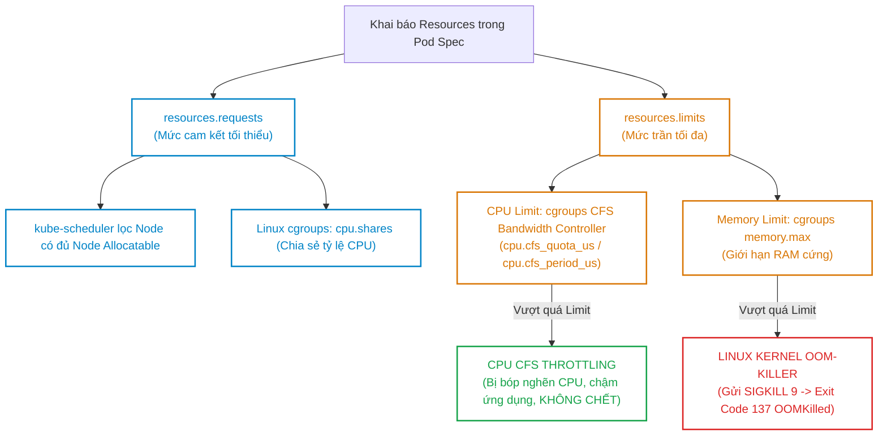
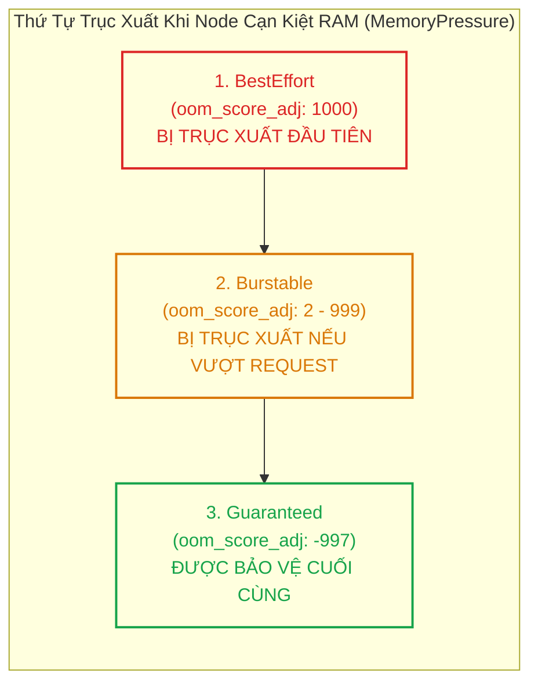
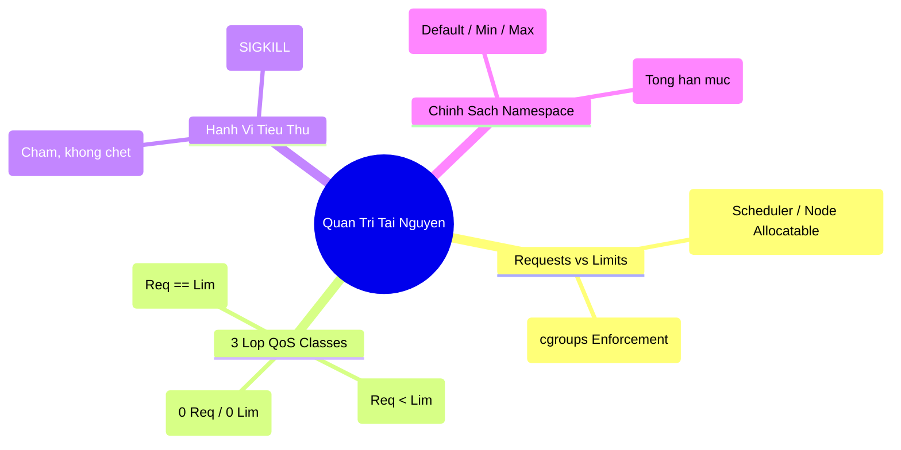


> [!IMPORTANT]
> **Mục tiêu kỹ thuật & Trọng tâm CKA**:
> - Hiểu rõ đơn vị tính toán CPU (Millicores `m`) và Memory (Mebibytes `Mi`, Gibibytes `Gi`).
> - Nắm vững thuật toán gán tự động 3 lớp QoS: `Guaranteed`, `Burstable`, `BestEffort`.
> - Phân tích cơ chế giới hạn tầng thấp của Linux cgroups: `cpu.shares`, `cpu.cfs_quota_us`, và `memory.max`.
> - Thiết lập `LimitRange` (giá trị mặc định/trần theo Pod) và `ResourceQuota` (tổng hạn mức theo Namespace).
> - Chẩn đoán và xử lý triệt để hai sự cố hiệu năng kinh điển: CPU Throttling và Memory OOMKilled 137.

---

## 1. Bản Chất Kiến Trúc & Tư Duy Cốt Lõi: Requests vs Limits & cgroups

Mỗi container trong Pod tiêu thụ hai loại tài nguyên tính toán chính: **CPU** (tính toán) và **Memory** (bộ nhớ RAM). Cách Kubernetes và Linux Kernel quản lý hai loại tài nguyên này có sự khác biệt bản chất:



### 1.1. Đơn Vị Đo Lường Chuẩn Trong Kubernetes

1. **CPU (Compressible Resource)**:
   - $1\text{ CPU Core} = 1000\text{m (Millicores)}$.
   - $250\text{m} = 0.25\text{ CPU core}$ (tương đương 25% thời gian xử lý của 1 core logic trên máy chủ).
   - CPU là tài nguyên **nén được**: Khi hệ thống thiếu hụt CPU, các tiến trình chỉ bị xếp hàng đợi (Throttled) chứ không bị hủy.
2. **Memory (Incompressible Resource)**:
   - Sử dụng tiền tố nhị phân: $1\text{ Ki} = 1024\text{ Bytes}$, $1\text{ Mi} = 1024\text{ Ki}$, $1\text{ Gi} = 1024\text{ Mi}$.
   - Tránh dùng tiền tố thập phân ($1\text{ M} = 1000\text{ K}$) để tránh sai số tính toán.
   - Memory là tài nguyên **không thể nén**: Khi đã cấp phát RAM cho một tiến trình, hệ điều hành không thể thu hồi lại mà không tiêu diệt tiến trình đó.

---

## 2. Bảng Ma Trận So Sánh Kỹ Thuật Toàn Diện (Engineering Matrix)

Bảng đối chiếu chi tiết 3 lớp chất lượng dịch vụ QoS Classes:

| Tiêu Chí Kỹ Thuật | Guaranteed | Burstable | BestEffort |
| :--- | :--- | :--- | :--- |
| **Điều kiện phân lớp** | 100% Containers có `requests == limits` cho cả CPU & RAM (>0)| Có ít nhất 1 Request/Limit nhưng không thỏa Guaranteed | Không khai báo bất kỳ Request hay Limit nào |
| **Giá trị oom_score_adj** | Cố định **-997** (Được bảo vệ tối đa) | Biến thiên từ **2 đến 999** (Tỷ lệ theo RAM request)| Cố định **1000** (Dễ bị diệt nhất) |
| **Độ ưu tiên giữ lại khi thiếu RAM**| Cao nhất (Chỉ bị kill khi không còn Pod nào khác)| Trung bình (Bị kill nếu xài vượt quá request) | Thấp nhất (Bị kill đầu tiên ngay khi Node thiếu RAM)|
| **Hiện tượng CFS Throttling** | Có thể xảy ra nếu CPU chạm Limit | Có thể xảy ra nếu CPU chạm Limit | Không bị Throttling (Ăn tối đa CPU nhàn rỗi)|
| **Độ ổn định hiệu năng (SLA)**| Rất cao, ổn định tuyệt đối | Khá, có thể bị biến động độ trễ | Không cam kết, hiệu năng trồi sụt |
| **Ứng dụng điển hình** | Production DB, Payment API, Core Gateway | Web App thông thường, Microservices, Worker| Batch Job thử nghiệm, Dev/Test sandbox |



---

## 3. Cấu Trúc Khai Báo Manifest & Chi Tiết Quản Trị Namespace

### 3.1. Pod Manifest Thuộc Lớp Guaranteed

```yaml
apiVersion: v1
kind: Pod
metadata:
  name: guaranteed-payment-engine
  namespace: production
spec:
  containers:
    - name: app
      image: registry.k8s.io/pause:3.9
      resources:
        requests:
          cpu: "500m"
          memory: "1Gi"
        limits:
          cpu: "500m"  # Khớp chính xác với request
          memory: "1Gi" # Khớp chính xác với request
```

### 3.2. Cấu Hình LimitRange & ResourceQuota Trong Namespace

```yaml
apiVersion: v1
kind: LimitRange
metadata:
  name: default-limits
  namespace: production
spec:
  limits:
    - type: Container
      default: # Giới hạn mặc định nếu không khai báo
        cpu: "500m"
        memory: "512Mi"
      defaultRequest: # Request mặc định nếu không khai báo
        cpu: "100m"
        memory: "128Mi"
      max: # Mức trần tối đa cho phép của 1 container
        cpu: "2"
        memory: "4Gi"
      min: # Mức sàn tối thiểu của 1 container
        cpu: "50m"
        memory: "64Mi"
---
apiVersion: v1
kind: ResourceQuota
metadata:
  name: namespace-quota
  namespace: production
spec:
  hard:
    requests.cpu: "10"
    requests.memory: "20Gi"
    limits.cpu: "20"
    limits.memory: "40Gi"
    pods: "30"
```

---

## 4. Phân Tích Cạm Bẫy Thực Chiến: CFS Throttling & Lỗi OOMKilled 137

### Tình huống 1: Ứng dụng phản hồi cực chậm (High Latency) do CPU CFS Throttling

Một ứng dụng Node.js/Java xử lý giao dịch thương mại điện tử được cấu hình `resources.limits.cpu: "500m"`. Khi lưu lượng tăng nhẹ, CPU tổng thể của Node chỉ ở mức 30%, nhưng thời gian phản hồi API (p99 latency) tăng vọt từ 50ms lên 2500ms mà không có bất kỳ log lỗi nào.

### Hậu Quả & Log Lỗi Thực Tế:

```text
# Kiểm tra số chu kỳ bị bóp nghẽn bên trong cgroups container:
$ kubectl exec -it payment-api -- cat /sys/fs/cgroup/cpu/cpu.stat
nr_periods 10240
nr_throttled 7820   # 76% số chu kỳ CPU bị bóp nghẽn!
throttled_time 452109823412 # Tổng thời gian tiến trình bị ép dừng xử lý
```

### 5-Whys Root Cause Analysis:
1. **Tại sao p99 latency tăng vọt?** -> Tiến trình ứng dụng bị dừng thực thi định kỳ bởi Kernel.
2. **Tại sao tiến trình bị dừng trong khi CPU của Node còn thừa?** -> CFS Bandwidth Controller của Linux cgroups áp đặt hạn ngạch theo chu kỳ (mỗi chu kỳ 100ms chỉ cho phép dùng 50ms CPU).
3. **Tại sao ứng dụng chạm trần trong chu kỳ ngắn?** -> Ứng dụng đa luồng (Multi-threaded) kích hoạt nhiều thread đồng thời lúc nhận request, tiêu thụ hết hạn ngạch quota 50ms trong 10ms đầu tiên của chu kỳ, và bị Kernel ép "đóng băng" 90ms còn lại của chu kỳ đó.
4. **Tại sao lại đặt CPU Limit quá sát?** -> Đội ngũ hiểu nhầm CPU limit hoạt động như một bộ điều tiết mềm.
5. **Giải pháp chuẩn ngành là gì?** -> Tăng CPU limits hoặc **bỏ hoàn toàn CPU Limits** (chỉ đặt CPU Requests) đối với các ứng dụng nhạy cảm về độ trễ, chỉ áp dụng Memory Limits.

---

### Tình huống 2: Pod bị tiêu diệt đột ngột với Exit Code 137 (OOMKilled)

Một tiến trình Python thực hiện báo cáo dữ liệu lớn vượt quá `resources.limits.memory: 256Mi`. Container bị giết lập tức giữa chừng.

### Hậu Quả & Log Lỗi Thực Tế:

```text
$ kubectl get pod report-worker
NAME            READY   STATUS      RESTARTS      AGE
report-worker   0/1     OOMKilled   1 (10s ago)   1m

$ kubectl describe pod report-worker
    State:          Waiting
      Reason:       CrashLoopBackOff
    Last State:     Terminated
      Reason:       OOMKilled
      Exit Code:    137
```

> [!WARNING]
> Khi gặp Exit Code 137, hãy kiểm tra hai khả năng:
> 1. `Last State Reason: OOMKilled` -> Container tiêu thụ vượt quá Memory Limit trong Pod Spec.
> 2. `Last State Reason: Error (hoặc không ghi OOMKilled)` nhưng Exit Code 137 -> Toàn bộ Node bị cạn kiệt RAM và Kubelet Eviction Manager đã can thiệp gửi `SIGKILL` để bảo vệ Node.

---

## 5. Hands-on Lab: Triển Khai & Kiểm Định QoS / Resources (8 Bước)

Bảng tổng hợp 8 bước thực hành:

| Bước | Thao Tác | Mục Tiêu Kỹ Thuật | Lệnh / Công Cụ |
| :--- | :--- | :--- | :--- |
| **1** | Khởi tạo Namespace Lab | Chuẩn bị môi trường thử nghiệm | `kubectl create ns qos-lab` |
| **2** | Áp dụng LimitRange & Quota | Ràng buộc trần tài nguyên namespace | `kubectl apply -f limits.yaml` |
| **3** | Triển khai Pod Guaranteed | Kiểm tra phân loại QoS Guaranteed | `kubectl apply -f guaranteed.yaml` |
| **4** | Triển khai Pod Burstable | Kiểm tra phân loại QoS Burstable | `kubectl apply -f burstable.yaml` |
| **5** | Triển khai Pod BestEffort | Kiểm tra phân loại QoS BestEffort | `kubectl apply -f besteffort.yaml` |
| **6** | Truy vấn QoS Class qua jsonpath | Xác minh tự động phân loại của K8s | `kubectl get pod -o jsonpath` |
| **7** | Giả lập rò rỉ RAM (OOMKilled 137)| Ép container tiêu thụ vượt RAM Limit | `kubectl run mem-stress` |
| **8** | Chẩn đoán Log Sự Cố OOM | Đọc sự kiện kernel và restart | `kubectl describe pod` |

---

### Bước 1 & 2: Khởi tạo Namespace và áp dụng LimitRange

```bash
kubectl create namespace qos-lab

cat <<EOF | kubectl apply -f -
apiVersion: v1
kind: LimitRange
metadata:
  name: qos-limits
  namespace: qos-lab
spec:
  limits:
    - type: Container
      defaultRequest:
        cpu: "100m"
        memory: "100Mi"
      default:
        cpu: "200m"
        memory: "200Mi"
EOF
```

---

### Bước 3: Triển khai Pod Guaranteed

```bash
cat <<EOF | kubectl apply -f -
apiVersion: v1
kind: Pod
metadata:
  name: pod-guaranteed
  namespace: qos-lab
spec:
  containers:
    - name: app
      image: registry.k8s.io/pause:3.9
      resources:
        requests:
          cpu: "150m"
          memory: "150Mi"
        limits:
          cpu: "150m"
          memory: "150Mi"
EOF
```

---

### Bước 4: Triển khai Pod Burstable

```bash
cat <<EOF | kubectl apply -f -
apiVersion: v1
kind: Pod
metadata:
  name: pod-burstable
  namespace: qos-lab
spec:
  containers:
    - name: app
      image: registry.k8s.io/pause:3.9
      resources:
        requests:
          cpu: "50m"
          memory: "50Mi"
        limits:
          cpu: "200m"
          memory: "150Mi"
EOF
```

---

### Bước 5: Triển khai Pod BestEffort (Vượt qua LimitRange bằng cách tạo ở namespace default)

```bash
cat <<EOF | kubectl apply -f -
apiVersion: v1
kind: Pod
metadata:
  name: pod-besteffort
  namespace: default
spec:
  containers:
    - name: app
      image: registry.k8s.io/pause:3.9
EOF
```

---

### Bước 6: Kiểm tra chính xác QoS Class được gán tự động

```bash
kubectl get pod pod-guaranteed -n qos-lab -o jsonpath='{.metadata.name}{": "}{.status.qosClass}{"\n"}'
kubectl get pod pod-burstable -n qos-lab -o jsonpath='{.metadata.name}{": "}{.status.qosClass}{"\n"}'
kubectl get pod pod-besteffort -n default -o jsonpath='{.metadata.name}{": "}{.status.qosClass}{"\n"}'
```

Output chuẩn mực:
```text
pod-guaranteed: Guaranteed
pod-burstable: Burstable
pod-besteffort: BestEffort
```

---

### Bước 7: Kích hoạt sự cố OOMKilled bằng công cụ `polinux/stress`

Khởi chạy container bị giới hạn RAM 50Mi nhưng ép phân bổ 150Mi RAM:

```bash
kubectl run mem-hog \
  --image=polinux/stress \
  --namespace=qos-lab \
  --limits='memory=50Mi,cpu=100m' \
  --requests='memory=50Mi,cpu=100m' \
  --restart=Never \
  -- stress --vm 1 --vm-bytes 150M --vm-hang 1
```

---

### Bước 8: Chẩn đoán trạng thái Pod và xác nhận mã Exit Code 137

```bash
sleep 5
kubectl get pod mem-hog -n qos-lab
kubectl describe pod mem-hog -n qos-lab | grep -E "Reason:|Exit Code:"
```

Output xác nhận sự can thiệp của Linux OOM-Killer:
```text
NAME      READY   STATUS      RESTARTS   AGE
mem-hog   0/1     OOMKilled   0          10s

    Reason:       OOMKilled
    Exit Code:    137
```

---

## 6. 10 Câu Hỏi Tự Kiểm Tra Chuyên Sâu (Self-Check Q&A Accordion)

<details class="qa-card">
  <summary><b>Câu 1: Điểm khác biệt cốt lõi trong mục đích sử dụng giữa resources.requests và resources.limits là gì?</b></summary>
  <div class="qa-answer">
    <b>Trả lời:</b><br>
    <ul>
      <li><b>resources.requests:</b> Là mức tài nguyên tối thiểu mà Pod cam kết cần để hoạt động. <code>kube-scheduler</code> sử dụng giá trị này để tìm Node còn đủ dung lượng (Node Allocatable) để lập lịch gán Pod.</li>
      <li><b>resources.limits:</b> Là mức trần tài nguyên tối đa mà container được phép tiêu thụ. Linux Kernel cgroups sẽ thực thi giới hạn này trong suốt quá trình container vận hành.</li>
    </ul>
  </div>
</details>

<details class="qa-card">
  <summary><b>Câu 2: Điều kiện chính xác để một Pod được Kubernetes phân loại vào lớp QoS Guaranteed là gì?</b></summary>
  <div class="qa-answer">
    <b>Trả lời:</b><br>
    Pod được xếp vào lớp <b>Guaranteed</b> khi và chỉ khi:<br>
    1. Mọi container trong Pod (bao gồm cả Init Containers) đều phải khai báo cả CPU và Memory.<br>
    2. Đối với từng container, giá trị <code>requests.cpu == limits.cpu</code> và <code>requests.memory == limits.memory</code> (và giá trị phải lớn hơn 0).
  </div>
</details>

<details class="qa-card">
  <summary><b>Câu 3: Điều gì xảy ra khi một container tiêu thụ CPU vượt quá giá trị CPU Limit đã khai báo?</b></summary>
  <div class="qa-answer">
    <b>Trả lời:</b><br>
    Do CPU là tài nguyên có thể nén được (Compressible), container <b>KHÔNG bị tiêu diệt hay khởi động lại</b>. Thay vào đó, Linux CFS Bandwidth Controller sẽ kích hoạt cơ chế <b>CFS Throttling</b> (bóp nghẽn thời gian CPU), khiến các luồng xử lý của ứng dụng bị trì hoãn, làm tăng thời gian phản hồi (latency) nhưng tiến trình vẫn tiếp tục sống.
  </div>
</details>

<details class="qa-card">
  <summary><b>Câu 4: Điều gì xảy ra khi một container tiêu thụ Memory vượt quá giá trị Memory Limit đã khai báo?</b></summary>
  <div class="qa-answer">
    <b>Trả lời:</b><br>
    Do Memory là tài nguyên không thể nén (Incompressible), Linux Kernel OOM-Killer sẽ lập tức can thiệp gửi tín hiệu <code>SIGKILL</code> (Signal 9) tiêu diệt tiến trình vi phạm, trả về trạng thái <b>OOMKilled</b> với mã thoát <b>Exit Code 137</b> (128 + 9). Kubelet sau đó sẽ khởi động lại container theo <code>restartPolicy</code>.
  </div>
</details>

<details class="qa-card">
  <summary><b>Câu 5: Khi một Node bị cạn kiệt RAM (MemoryPressure), Kubelet Eviction Manager sẽ lựa chọn Pod nào để trục xuất đầu tiên?</b></summary>
  <div class="qa-answer">
    <b>Trả lời:</b><br>
    Kubelet sẽ trục xuất các Pod theo thứ tự ưu tiên từ lớp bảo vệ thấp nhất đến cao nhất:<br>
    1. <b>BestEffort</b> (oom_score_adj: 1000) bị tiêu diệt đầu tiên.<br>
    2. <b>Burstable</b> (oom_score_adj từ 2 đến 999) đang tiêu thụ bộ nhớ vượt quá mức request đã cam kết.<br>
    3. <b>Guaranteed</b> (oom_score_adj: -997) được bảo vệ tối đa và chỉ bị tiêu diệt khi không còn Pod nào thuộc hai lớp trên.
  </div>
</details>

<details class="qa-card">
  <summary><b>Câu 6: Đơn vị 100m CPU trong Kubernetes tương đương với bao nhiêu tài nguyên vi xử lý?</b></summary>
  <div class="qa-answer">
    <b>Trả lời:</b><br>
    <code>100m</code> là 100 millicores, tương đương với <b>0.1 CPU core</b> (hay 10% năng lực tính toán của một core CPU logic trên máy chủ).
  </div>
</details>

<details class="qa-card">
  <summary><b>Câu 7: Đối tượng LimitRange đóng vai trò gì trong quản trị tài nguyên Namespace?</b></summary>
  <div class="qa-answer">
    <b>Trả lời:</b><br>
    <code>LimitRange</code> thiết lập các chính sách tài nguyên cho từng Pod/Container riêng lẻ trong một Namespace: tự động gán giá trị Request/Limit mặc định (<code>default</code>, <code>defaultRequest</code>) nếu người dùng quên khai báo, đồng thời áp đặt mức sàn tối thiểu (<code>min</code>) và mức trần tối đa (<code>max</code>) cho phép.
  </div>
</details>

<details class="qa-card">
  <summary><b>Câu 8: Đối tượng ResourceQuota đóng vai trò gì và nếu một Namespace có ResourceQuota thì người dùng bắt buộc phải làm gì khi tạo Pod?</b></summary>
  <div class="qa-answer">
    <b>Trả lời:</b><br>
    <code>ResourceQuota</code> giới hạn <b>tổng mức tiêu thụ tài nguyên gộp</b> (tổng CPU, tổng RAM, tổng số Pod/PVC) của toàn bộ Namespace. Khi một Namespace đã cấu hình ResourceQuota cho CPU/RAM, mọi Pod tạo trong Namespace đó <b>bắt buộc phải khai báo trường requests/limits tương ứng</b> (hoặc phải có LimitRange hỗ trợ gán mặc định), nếu không API Server sẽ từ chối tạo Pod.
  </div>
</details>

<details class="qa-card">
  <summary><b>Câu 9: Tại sao nhiều chuyên gia khuyến nghị KHÔNG NÊN đặt CPU Limits cho các ứng dụng Microservices nhạy cảm về độ trễ?</b></summary>
  <div class="qa-answer">
    <b>Trả lời:</b><br>
    Bởi vì thuật toán Linux CFS Bandwidth Controller phân chia hạn ngạch theo chu kỳ cố định 100ms. Các ứng dụng đa luồng (như Java, Node.js, Go) thường phát sinh các đợt tải đột biến ngắn hạn (CPU burst) trong vài mili-giây đầu của chu kỳ, làm cạn kiệt quota và bị Kernel ép đóng băng xử lý trong thời gian còn lại của chu kỳ, gây ra hiện tượng tăng đột biến độ trễ p99 dù CPU của cả máy chủ vẫn đang rất rảnh rỗi.
  </div>
</details>

<details class="qa-card">
  <summary><b>Câu 10: File hệ thống Linux nào trong cgroups cho phép kỹ sư kiểm tra trực tiếp số lần container bị bóp nghẽn CPU (Throttled)?</b></summary>
  <div class="qa-answer">
    <b>Trả lời:</b><br>
    <ul>
      <li>Với cgroups v1: <code>/sys/fs/cgroup/cpu/cpu.stat</code> (quan sát thông số <code>nr_throttled</code> và <code>throttled_time</code>).</li>
      <li>Với cgroups v2: <code>/sys/fs/cgroup/cpu.stat</code> (quan sát thông số <code>nr_throttled</code> và <code>throttled_usec</code>).</li>
    </ul>
  </div>
</details>

---

## 7. Tổng Kết & Lộ Trình Bài Học Tiếp Theo



Nắm vững cơ chế cấp phát tài nguyên tính toán và kiểm soát QoS Classes là chìa khóa then chốt để đảm bảo SLA dịch vụ, ngăn chặn hiện tượng lãng phí hạ tầng hoặc sập cụm do hiệu ứng lây lan tài nguyên (Noisy Neighbor).

> [!TIP]
> **Bài học tiếp theo**: Trong [Bài 19: Tự Động Co Giãn Ngang HPA, Metrics Server & Cluster Autoscaler](cka-19-19-autoscaling-hpa-va-cluster.html), chúng ta sẽ khám phá cơ chế tự động điều chỉnh quy mô hạ tầng: từ việc mở rộng Pods dựa trên CPU/Memory metrics qua HPA đến việc co giãn máy chủ vật lý qua Cluster Autoscaler.

