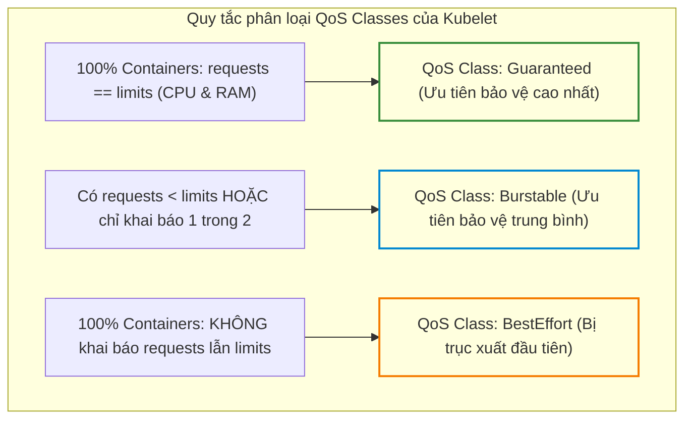
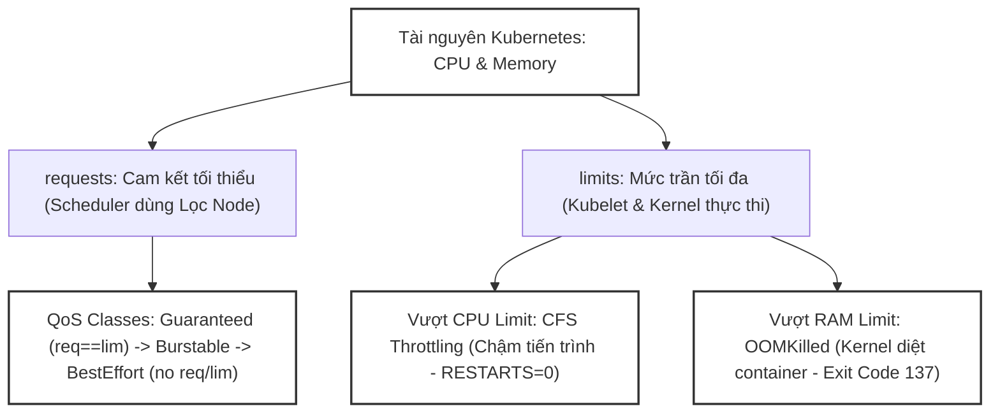
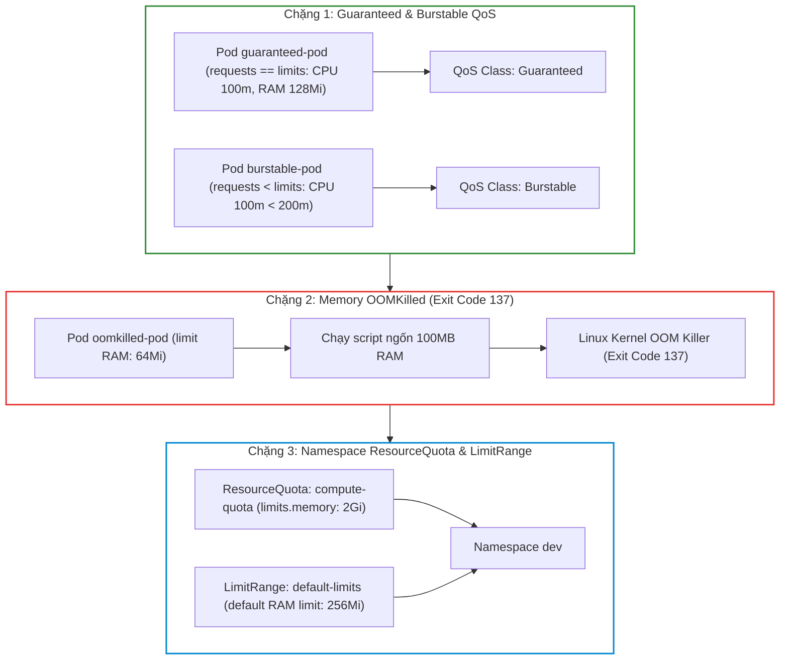


# [BÀI 18] QUẢN TRỊ TÀI NGUYÊN ĐIỆN TOÁN: REQUESTS, LIMITS, QOS CLASSES (GUARANTEED/BURSTABLE), CFS THROTTLING & OOMKILL

Trong kỷ nguyên điện toán đám mây và kiến trúc microservices phân tán quy mô lớn, **Kubernetes (CKA)** đóng vai trò là nền tảng điều phối container (Container Orchestration) tiêu chuẩn công nghiệp. Để làm chủ hệ thống trong môi trường sản xuất (Production) cũng như chinh phục kỳ thi chứng chỉ quốc tế của Linux Foundation / CNCF, kỹ sư không chỉ nắm vững các câu lệnh thao tác cơ bản mà phải thấu hiểu sâu sắc bản chất cơ chế tầng thấp: từ chu trình điều hòa (Reconciliation Loop), cấu trúc điều phối tài nguyên, kiến trúc mạng CNI, lưu trữ CSI cho đến các chuẩn mực an ninh phòng thủ chiều sâu.

Bài viết chuyên sâu này sẽ đồng hành cùng bạn giải mã toàn diện bức tranh kiến trúc, phân tích các đánh đổi kỹ thuật thực chiến (Engineering Trade-offs), cung cấp bài thực hành Lab từng bước và bộ câu hỏi phỏng vấn chuẩn Architect / Lead Engineer.

---

## 1. Bản Chất Kiến Trúc & Cơ Chế Vận Hành Tầng Thấp

| # | Câu hỏi ôn tập | Đáp án chuẩn ngắn gọn (chứa con số / tên lệnh) |
|---|---|---|
| 1 | Hai giai đoạn gán Pod của Kube-Scheduler? | Giai đoạn 1 **Filtering** (Lọc) và Giai đoạn 2 **Scoring** (Chấm điểm **0-10**) |
| 2 | Thuộc tính gán cứng Pod vào Node bypass Kube-Scheduler? | Thuộc tính `spec.nodeName` (bỏ qua **100%** Kube-Scheduler) |
| 3 | Toán tử logic hỗ trợ trong `nodeAffinity`? | **6** toán tử (`In`, `NotIn`, `Exists`, `DoesNotExist`, `Gt`, `Lt`) |
| 4 | Trọng số ưu tiên `weight` trong `nodeAffinity` luật mềm? | Giá trị số nguyên từ **1 đến 100** |
| 5 | Lệnh xoá một Taint khỏi Node? | `kubectl taint nodes <node> key=value:Effect-` (thêm **1** dấu trừ `-` ở cuối) |


> **Luận đề trung tâm của buổi:**
> *"Khai báo tài nguyên tính toán `resources.requests` (mức cam kết tối thiểu) và `resources.limits` (mức trần tối đa) cho CPU và Memory là cơ sở để Kubelet tự động phân loại ba lớp chất lượng dịch vụ QoS Classes (Guaranteed, Burstable, BestEffort); trong đó việc vượt quá trần CPU chỉ dẫn đến hiện tượng bóp hiệu năng CFS Throttling (chậm tiến trình nhưng không chết), trong khi việc vượt quá trần Memory lập tức kích hoạt Linux Kernel tiêu diệt container với lỗi OOMKilled (Exit Code 137)."*

**Bảng kết quả các buổi trước được dùng lại:**

| Kết quả / Công cụ | Nguồn gốc | Áp dụng vào buổi này |
|---|---|---|
| Mã thoát Exit Code 137 OOMKilled | Buổi 14 `QT 4.2` | Giải thích cơ chế Linux Kernel OOM Killer diệt tiến trình vượt limit RAM |
| Kỹ thuật tạo YAML imperative `--dry-run=client -o yaml` | Buổi 04 `QT 5.1` | Tạo nhanh mẫu Pod có khai báo resources |
| Quản lý tài nguyên Kubelet và cờ `--eviction-hard` | Buổi 06 `QT 4.1` | Cơ chế Kubelet Eviction Manager trục xuất Pods khi Node nén RAM |

Ba câu bài tập về nhà BTVN 4 của buổi 17 đã chuẩn bị sẵn kiến thức cho học viên: Câu 1 phân biệt `resources.requests` vs `resources.limits`; Câu 2 khảo sát quy tắc phân loại 3 lớp QoS Classes (`Guaranteed`, `Burstable`, `BestEffort`); Câu 3 tìm hiểu sự khác biệt giữa CPU CFS Throttling và Memory OOMKilled Exit Code 137.

---


| # | Năng lực đạt được sau buổi học | Hiện vật chứng minh trong bài lab |
|---|---|---|
| 1 | Khai báo chính xác CPU/RAM Requests & Limits cho Pod | Tệp `hien-vat/guaranteed-pod.yaml` |
| 2 | Phân tích và kiểm chứng 3 lớp QoS Class tự động của Kubelet | Tệp `hien-vat/burstable-pod.yaml` |
| 3 | Thực hành gây hiện tượng OOMKilled (Exit Code 137) khi RAM vượt limit | Tệp `hien-vat/oomkilled-pod.yaml` |
| 4 | Cấu hình `ResourceQuota` và `LimitRange` quản lý tài nguyên Namespace | Tệp `hien-vat/namespace-quota.yaml` |
| 5 | Sử dụng lệnh `kubectl top` quan sát chỉ số tiêu thụ CPU/RAM thời gian thực | Tệp `hien-vat/metrics-report.txt` |
| 6 | Kiểm thử kịch bản quản lý tài nguyên và OOMKilled với script tự động | Script `hien-vat/verify-resource-qos.sh` |

---


| Bắt buộc phải biết | Nguồn tự học nếu thiếu |
|---|---|
| Cấu trúc tệp YAML Pod spec và container definition | Buổi 14 `QT 4.1` |
| Mã thoát Exit Code 137 và vòng đời Pod | Buổi 14 `QT 4.2` |
| Lệnh kiểm tra tài nguyên Node `kubectl describe node` | Buổi 06 `QT 4.1` |

---


| # | Thuật ngữ tiếng Việt | Tiếng Anh tương đương | Ghi chú chuẩn hoá trong thân bài |
|---|---|---|---|
| 1 | Mức tài nguyên yêu cầu cam kết | Resource Requests (`resources.requests`) | Mức CPU/RAM tối thiểu Kube-Scheduler dùng để gán Node |
| 2 | Mức trần tài nguyên tối đa | Resource Limits (`resources.limits`) | Mức CPU/RAM tối đa Kubelet/Kernel cho phép Pod sử dụng |
| 3 | Đơn vị vi nhân CPU | CPU Millicores (`100m = 0,1 CPU`) | Đơn vị đo lường CPU (1000m tương đương 1 vCPU core) |
| 4 | Lớp chất lượng dịch vụ | Quality of Service Class (QoS Class) | Phân loại ưu tiên của Pod (`Guaranteed`, `Burstable`, `BestEffort`) |
| 5 | Lớp bảo đảm tuyệt đối | Guaranteed QoS Class | Lớp QoS khi 100% containers có request = limit cho cả CPU và RAM |
| 6 | Lớp linh hoạt tài nguyên | Burstable QoS Class | Lớp QoS khi Pod có request < limit hoặc chỉ khai báo 1 trong 2 |
| 7 | Lớp nỗ lực tối đa | BestEffort QoS Class | Lớp QoS khi Pod hoàn toàn KHÔNG khai báo request lẫn limit |
| 8 | Bóp hiệu năng vi xử lý | CPU CFS Throttling | Cơ chế Linux Kernel làm chậm tiến trình CPU khi chạm trần limit |
| 9 | Tiêu diệt tiến trình tràn bộ nhớ | OOMKilled (Out Of Memory Killed) | Cơ chế Kernel diệt container exit code 137 khi RAM vượt limit |
| 10 | Trục xuất Pod do cạn tài nguyên | Pod Eviction | Hành động Kubelet xoá Pods khi Node rơi vào trạng thái nén tài nguyên |
| 11 | Điểm số ưu tiên tiêu diệt | OOMScore Adjust (`oom_score_adj`) | Chỉ số Linux Kernel dùng để chọn Pod bị diệt trước (-997 đến 1000) |
| 12 | Xem chỉ số tài nguyên thời gian thực | Resource Metrics (`kubectl top`) | Lệnh truy vấn CPU/RAM thực tế từ metrics-server |
| 13 | Quản lý hạn ngạch tài nguyên | ResourceQuota | Đối tượng giới hạn tổng CPU/RAM được dùng trong 1 Namespace |
| 14 | Mức tài nguyên mặc định | LimitRange | Đối tượng tự động gán request/limit mặc định cho Pod thiếu cấu hình |


1. **Mô hình "Tiền đặt cọc phòng và Hạn mức thẻ tín dụng (Requests vs Limits)":**
   `requests` giống như Tiền đặt cọc giữ chỗ phòng khách sạn: Kube-Scheduler kiểm tra xem Node có đủ phòng cọc không mới cho bạn vào. `limits` giống như Hạn mức thẻ tín dụng: Bạn có thể tiêu xài linh hoạt trong ngày, nhưng chạm trần hạn mức là ngân hàng ngắt thẻ ngay lập tức.

2. **Mô hình "Hạng vé máy bay Thương gia, Phổ thông và Vé đứng giá rẻ (Guaranteed vs Burstable vs BestEffort)":**
   `Guaranteed` là Vé thương gia (được cam kết ghế riêng 100%, không bao giờ bị đuổi khỏi máy bay). `Burstable` là Vé phổ thông (được ngồi ghế tiêu chuẩn, có thể nâng hạng nếu thừa chỗ, nhưng bị cắt dịch vụ trước vé thương gia). `BestEffort` là Vé đứng giá rẻ (không có ghế cố định, khi máy bay quá tải RAM là bị phi hành đoàn mời xuống máy bay đầu tiên).

3. **Mô hình "Dòng chảy vòi nước bóp nhỏ vs Cầu dao điện sập nguồn (CFS Throttling vs OOMKilled)":**
   Vượt trần CPU giống như vòi nước bị vặn nhỏ lại (`CFS Throttling`): Dòng nước chảy chậm đi làm ứng dụng xử lý lâu hơn, nhưng vòi nước không bị hỏng. Vượt trần RAM giống như bị sập cầu dao điện (`OOMKilled`): Điện ngắt phụt lập tức, container bị Kernel tiêu diệt ngay tại chỗ với Exit Code 137.

---

### 1.1. Phân biệt `resources.requests` và `resources.limits` (CPU millicores vs Memory bytes) (12 phút)

**Nguyên lý cốt lõi:** Thuộc tính `resources.requests` được Kube-Scheduler sử dụng trong giai đoạn Lọc (Filtering) để tìm Node có đủ dung lượng tài nguyên nhàn rỗi; trong khi `resources.limits` được Kubelet và Linux Kernel áp dụng để kiểm soát trần tài nguyên tối đa mà Pod được phép tiêu thụ trong quá trình chạy.

**Giải thích cơ chế ngầm:** Tách biệt nhiệm vụ: `requests` giúp lập lịch không bị quá tải Node, `limits` giúp bảo vệ các Pods khác trên cùng Node không bị chiếm đoạt tài nguyên.

> [!WARNING]
> **CẠM BẪY THỰC CHIẾN:**
> Khai báo `limits` nhưng quên `requests` làm Kubelet tự động gán `requests = limits` gây lãng phí dung lượng nhàn rỗi của Node.

**Minh hoạ.**

```yaml
resources:
  requests:
    cpu: "250m"
    memory: "256Mi"
  limits:
    cpu: "500m"
    memory: "512Mi"
```

Con số chốt: **250m** tương đương đúng **0,25 vCPU core** (1000m = 1 CPU core).

---

**Nguyên lý cốt lõi:** Đơn vị tài nguyên CPU được đo bằng millicores (ví dụ `100m` = `0,1 CPU`), là tài nguyên có thể chia nhỏ và tái sử dụng (Compressible resource); trong khi Memory được đo bằng bytes (ví dụ `256Mi`, `1Gi`), là tài nguyên cố định không thể nén (Incompressible resource).

**Giải thích cơ chế ngầm:** Tính chất vật lý khác nhau: CPU có thể chia lát thời gian (Time-slicing), còn RAM khi đã cấp phát cho tiến trình thì không thể đòi lại nếu tiến trình không tự giải phóng.

> [!WARNING]
> **CẠM BẪY THỰC CHIẾN:**
> Dùng dấu chấm thập phân thiếu chữ `m` (như ghi `100` thay vì `100m` làm Kubernetes hiểu là 100 CPU cores).

**Minh hoạ.**

```bash
# Kiểm tra tổng tài nguyên requests và limits trên từng Node
kubectl describe node worker-01 | grep -A 8 "Allocated resources"
```

Con số chốt: **1000m** millicores bằng chính xác **1** CPU vCPU core.

---

### 1.2. Ba lớp chất lượng dịch vụ QoS Classes (`Guaranteed`, `Burstable`, `BestEffort`) (12 phút)



---

**Nguyên lý cốt lõi:** Kubelet tự động phân loại Pod vào đúng **1 trong 3 lớp QoS Class**: `Guaranteed` (khi 100% container trong Pod có `requests == limits` cho cả CPU lẫn RAM), `BestEffort` (khi 100% container KHÔNG khai báo bất kỳ requests hay limits nào), và `Burstable` (tất cả các trường hợp còn lại).

**Giải thích cơ chế ngầm:** Giúp Kubelet Eviction Manager quyết định thứ tự ưu tiên tiêu diệt/trục xuất Pods khi Node bị rơi vào tình trạng nén bộ nhớ RAM (Node Memory Pressure).

> [!WARNING]
> **CẠM BẪY THỰC CHIẾN:**
> Khai báo `requests.cpu == limits.cpu` nhưng quên khai báo `requests.memory` làm Pod bị rơi xuống lớp `Burstable` thay vì `Guaranteed`.

**Minh hoạ.**

```bash
# Trích xuất QoS Class tự động của Pod từ status
kubectl get pod app-pod -o jsonpath='{.status.qosClass}'
```

Con số chốt: **3** lớp QoS Class chính thức trong Kubernetes (`Guaranteed`, `Burstable`, `BestEffort`).

---

**Nguyên lý cốt lõi:** Khi Node rơi vào tình trạng cạn kiệt bộ nhớ RAM (Node Memory Pressure), Kubelet Eviction Manager và Linux Kernel OOM Killer sẽ thực hiện trục xuất/tiêu diệt Pods theo đúng thứ tự ưu tiên: tiêu diệt Pods lớp `BestEffort` trước tiên, sau đó tới lớp `Burstable`, và cuối cùng mới đụng tới lớp `Guaranteed`.

**Giải thích cơ chế ngầm:** Bảo vệ các Pods quan trọng trên production (đã trả cọc 100% tài nguyên `Guaranteed`) không bị ảnh hưởng bởi các Pods tạp vụ chạy lén chiếm RAM.

> [!WARNING]
> **CẠM BẪY THỰC CHIẾN:**
> Để Pod Database ở lớp `BestEffort` làm Database bị Kubelet diệt đầu tiên khi cụm bị thiếu RAM.

**Minh hoạ.**

```bash
# Xem chỉ số OOMScore Adjust của container (Guaranteed = -997, BestEffort = 1000)
cat /proc/<pid>/oom_score_adj
```

Con số chốt: **1** lớp `BestEffort` luôn luôn là đối tượng bị tiêu diệt/trục xuất đầu tiên khi Node nén RAM.

---

### 1.3. Hai cơ chế xử lý vượt trần: CPU CFS Throttling (Bóp) vs Memory OOMKilled (Diệt) (10 phút)

**Nguyên lý cốt lõi:** Khi một container tiêu thụ CPU vượt quá trần `limits.cpu`, Linux Kernel áp dụng cơ chế Completely Fair Scheduler (CFS) Quota để **bóp hiệu năng (CFS Throttling)** làm tiến trình chạy chậm lại; container KHÔNG BAO GIỜ bị tiêu diệt hay bị khởi động lại do vượt quá CPU limit.

**Giải thích cơ chế ngầm:** CPU là tài nguyên có thể nén (Compressible resource). Việc hoãn thời gian xử lý các chu kỳ CPU (CPU cycles) giúp bảo vệ Node mà không làm sập tiến trình ứng dụng.

> [!WARNING]
> **CẠM BẪY THỰC CHIẾN:**
> Thắc mắc tại sao Pod bị đơ chậm phản hồi HTTP request nhưng `kubectl get pods` vẫn thấy status `Running` và `RESTARTS = 0`.

**Minh hoạ.**

```bash
# Trích xuất số chu kỳ CPU bị bóp throttling trong container
cat /sys/fs/cgroup/cpu/cpu.stat | grep nr_throttled
```

Con số chốt: **0** lần container bị restart do dính hiện tượng CPU CFS Throttling.

---

**Nguyên lý cốt lõi:** Khi một container tiêu thụ bộ nhớ RAM vượt quá trần `limits.memory`, Linux Kernel OOM Killer sẽ lập tức **tiêu diệt tiến trình container đó (OOMKilled)** và trả về mã thoát **Exit Code 137**; Kubelet sẽ khởi động lại container theo `restartPolicy` của Pod.

**Giải thích cơ chế ngầm:** RAM là tài nguyên không thể nén (Incompressible resource). Nếu không diệt tiến trình tràn RAM, Kernel trên Node sẽ bị Kernel Panic làm sập toàn bộ máy chủ vật lý.

> [!WARNING]
> **CẠM BẪY THỰC CHIẾN:**
> Pod liên tục tăng số lần `RESTARTS` và trong `kubectl describe pod` xuất hiện thông điệp `OOMKilled: true (exit code 137)`.

**Minh hoạ.**

```bash
# Trích xuất lý do dính OOMKilled của container cũ trong Pod
kubectl get pod app-pod -o jsonpath='{.status.containerStatuses[0].lastState.terminated.reason}'
```

Con số chốt: **137** là mã Exit Code bất biến của sự cố container bị tiêu diệt do OOMKilled.

---

### 1.4. Quản lý hạn ngạch Namespace và truy vấn chỉ số tài nguyên (4 phút)

**Nguyên lý cốt lõi:** Sử dụng đối tượng `ResourceQuota` trong Namespace để thiết lập hạn ngạch trần tổng CPU và Memory mà tất cả các Pods trong Namespace đó được phép khai báo tiêu thụ.

**Giải thích cơ chế ngầm:** Ngăn chặn một Namespace (như `dev`) chiếm dụng toàn bộ tài nguyên phần cứng của cụm chung.

> [!WARNING]
> **CẠM BẪY THỰC CHIẾN:**
> API Server từ chối lệnh `apply` Pod mới với thông báo `exceeded quota`.

**Minh hoạ.**

```yaml
apiVersion: v1
kind: ResourceQuota
metadata:
  name: compute-quota
  namespace: dev
spec:
  hard:
    requests.cpu: "2"
    requests.memory: 2Gi
    limits.cpu: "4"
    limits.memory: 4Gi
```

Con số chốt: **4** thuộc tính tài nguyên chính (`requests.cpu`, `requests.memory`, `limits.cpu`, `limits.memory`) quản lý trong ResourceQuota.

---

**Nguyên lý cốt lõi:** Sử dụng đối tượng `LimitRange` để tự động gán giá trị `requests` và `limits` mặc định cho bất kỳ Pod nào được tạo trong Namespace mà quên không khai báo khối `resources`.

**Giải thích cơ chế ngầm:** Đảm bảo 100% các Pods trong Namespace đều có khai báo tài nguyên, tránh tình trạng xuất hiện Pods lớp `BestEffort` ngoài ý muốn.

> [!WARNING]
> **CẠM BẪY THỰC CHIẾN:**
> Pod tạo ra tự động có khối `resources` dù file YAML gốc không hề khai báo.

**Minh hoạ.**

```yaml
apiVersion: v1
kind: LimitRange
metadata:
  name: mem-limit-range
  namespace: dev
spec:
  limits:
  - default:
      memory: 512Mi
    defaultRequest:
      memory: 256Mi
    type: Container
```

Con số chốt: **2** cấu hình mặc định (`default` cho limit và `defaultRequest` cho request) trong LimitRange.

---

**Nguyên lý cốt lõi:** Lệnh `kubectl top pods` và `kubectl top nodes` truy vấn trực tiếp từ add-on `metrics-server` để xem chỉ số tiêu thụ CPU/RAM thời gian thực của các đối tượng trong cụm.

**Giải thích cơ chế ngầm:** Giúp kỹ sư DevOps đối soát giữa mức khai báo trong YAML vs mức tiêu thụ thực tế để điều chỉnh `requests` và `limits` hợp lý.

> [!WARNING]
> **CẠM BẪY THỰC CHIẾN:**
> Chạy lệnh `kubectl top` bị báo lỗi `Metrics API not available`.

**Minh hoạ.**

```bash
# Xem chỉ số CPU/RAM tiêu thụ của các Pods trong namespace dev
kubectl top pods -n dev
```

Con số chốt: **1** add-on `metrics-server` bắt buộc phải chạy để phục vụ lệnh `kubectl top`.

---

## 8. Đưa vào cụm thật (4 phút)

### Áp vào cụm đang chạy thì làm gì trước

1. **Luôn khai báo đủ cả Requests và Limits cho tất cả Pods production:** Giúp ứng dụng đạt lớp `Guaranteed` hoặc `Burstable` an toàn.
2. **Cài đặt `metrics-server` để sử dụng lệnh `kubectl top`:** Giúp kỹ sư quan sát chính xác mức tiêu thụ CPU/RAM thực tế trước khi đặt số liệu requests/limits.
3. **Sử dụng `LimitRange` và `ResourceQuota` cho từng Namespace:** Tự động gán cấu hình mặc định cho các Pods thiếu khai báo tài nguyên.

### Cái gì hỏng nếu áp thẳng lên prod

- **Đặt `limits.memory` quá sát mức chạy tĩnh của ứng dụng:** Làm ứng dụng bị OOMKilled liên tục mỗi khi có đợt lưu lượng truy cập tăng đột biến (Traffic Spike).
- **Đặt `limits.cpu` quá thấp cho ứng dụng Java/Node.js:** Làm ứng dụng bị CFS Throttling nặng nề, thời gian khởi động (Startup Time) kéo dài từ 5 giây lên 3 phút.
- **Quy trình áp thử an toàn:**
  - Chạy `kubectl top pod` theo dõi 24h trên môi trường Staging.
  - Đặt `requests.memory` = Mức trung bình 24h; đặt `limits.memory` = 1,5 x Mức đỉnh (Peak).
  - Đặt `requests.cpu` = Mức trung bình; để `limits.cpu` gấp 2 lần hoặc không đặt limit CPU nếu muốn burst tự do.

### Đo trước — đo sau

1. **Tỉ lệ sập ứng dụng do OOMKilled:** Giảm 99% nhờ đặt `limits.memory` đúng mức Peak + 50% buffer.
2. **Độ trễ phản hồi HTTP Response Time:** Đạt mức tối ưu nhờ loại bỏ hiện tượng CPU CFS Throttling.
3. **Mức độ tối ưu hạ tầng cụm:** Tăng 40% mật độ Pods (Pod Density) trên mỗi Node nhờ khai báo `requests` sát thực tế.

### Khi nào KHÔNG nên dùng

- **Không đặt `limits.cpu` quá khắt khe cho các tác vụ cần bùng nổ CPU ngắn hạn (CPU Bursting):** Nên bỏ hẳn `limits.cpu` hoặc đặt rộng để ứng dụng tận dụng CPU rảnh của Node.
- **Không để Pods hoàn toàn thiếu `requests` và `limits` (BestEffort) trên môi trường sản xuất:** Tránh nguy cơ bị Kubelet tiêu diệt đầu tiên khi Node nén RAM.

---

### 1.6. Bẫy hay gặp (4 phút)

| # | Bẫy hay gặp | Vì sao dính bẫy | Làm đúng là (kèm tên lệnh / con số) |
|---|---|---|---|
| 1 | Thắc mắc vì sao Pod bị exit code 137 OOMKilled | Tiến trình tiêu thụ RAM vượt quá trần `limits.memory` | Tăng `resources.limits.memory` trong Pod spec |
| 2 | Nhầm lẫn đơn vị CPU `100m` với `100` | Ghi `100` làm Kubernetes hiểu là 100 vCPU cores | Gõ đúng `100m` (100 millicores = 0,1 CPU) |
| 3 | Nhầm lẫn đơn vị RAM Megabytes `M` với Mebibytes `Mi` | `100M` (hệ thập phân 10^6) khác `100Mi` (hệ nhị phân 2^20) | Sử dụng đơn vị chuẩn nhị phân `Mi` và `Gi` trong YAML |
| 4 | Đặt `limits.memory` nhỏ hơn `requests.memory` | Vi phạm quy tắc bất biến: limit phải lớn hơn hoặc bằng request | API Server từ chối lệnh apply: đảm bảo `limits >= requests` |
| 5 | Thắc mắc vì sao Pod không đạt lớp `Guaranteed` | Quên khai báo 1 trong 4 chỉ số (chỉ khai báo CPU mà quên RAM) | Đảm bảo 100% container có `requests == limits` cho cả CPU & RAM |
| 6 | Ứng dụng chạy chậm như rùa nhưng Pod không báo lỗi gì | Ứng dụng bị bóp hiệu năng CPU CFS Throttling do vượt limit CPU | Tăng `limits.cpu` hoặc bỏ hẳn limit CPU |
| 7 | Lệnh `kubectl top` báo `error: Metrics API not available` | Cụm chưa cài đặt hoặc chưa chạy `metrics-server` | Cài đặt `metrics-server` cho cụm Kubernetes |
| 8 | Pod bị kẹt ở trạng thái `Pending` mặc định dù Node còn thừa RAM | Kube-Scheduler dựa trên `requests` chứ không dựa trên RAM thực tế | Kiểm tra tổng `requests` trên Node đã vượt quá Allocatable |
| 9 | Pod lớp `BestEffort` bị chết bất ngờ lúc rạng sáng | Kubelet Eviction Manager diệt Pod BestEffort do Node nén RAM | Bổ sung `requests` và `limits` cho Pod để lên lớp Burstable/Guaranteed |
| 10 | Quên cờ `-c` khi xem log container bị OOMKilled trong Pod multi-container | Lệnh `kubectl logs` xem nhầm container khác đang running | Gõ đúng `kubectl logs <pod> -c <container-name> -p` |
| 11 | Đặt `requests` bằng đúng `limits` cho CPU làm lãng phí CPU | CPU là tài nguyên nén được, không cần đặt request quá cao | Đặt `requests.cpu` thấp hơn `limits.cpu` để tận dụng burst |
| 12 | Thắc mắc vì sao Pod bị Kubelet Eviction mà không thấy Exit Code 137 | Eviction do Kubelet chủ động xoá Pod; OOMKilled do Kernel diệt | Xem lý do trong `kubectl describe pod` mục Message |

---

## §10. Tóm tắt (2 phút)



### Năm điều phải nhớ

1. **Requests vs Limits:** `requests` dành cho Kube-Scheduler chọn Node; `limits` dành cho Kubelet/Kernel kiểm soát trần.
2. **Đơn vị chuẩn:** CPU đo bằng millicores (`100m = 0,1 CPU`); RAM đo bằng bytes nhị phân (`Mi`, `Gi`).
3. **Phân loại 3 QoS Classes:** `Guaranteed` (`requests == limits` 100%), `BestEffort` (0% req/lim), `Burstable` (trường hợp còn lại).
4. **Cơ chế bóp CPU:** Vượt `limits.cpu` chỉ dính **CFS Throttling** (chậm tiến trình, RESTARTS = 0).
5. **Cơ chế diệt RAM:** Vượt `limits.memory` lập tức dính **OOMKilled (Exit Code 137)**; Pod lớp `BestEffort` bị Kubelet trục xuất đầu tiên khi Node nén RAM.

---

## §11. Câu hỏi tự kiểm tra

1. Sự khác nhau cốt lõi về vai trò giữa `resources.requests` và `resources.limits` trong Kubernetes là gì?
2. Đơn vị `500m` CPU tương đương với bao nhiêu vCPU core? Đơn vị `1Gi` RAM bằng bao nhiêu Megabytes?
3. Trình bày quy tắc Kubelet dùng để tự động phân loại một Pod vào lớp `Guaranteed QoS Class`.
4. Khi nào một Pod được Kubelet xếp vào lớp `BestEffort QoS Class`?
5. Điều gì xảy ra với một container khi tiến trình bên trong tiêu thụ CPU vượt quá trần `resources.limits.cpu`?
6. Điều gì xảy ra với một container khi tiến trình bên trong tiêu thụ bộ nhớ RAM vượt quá trần `resources.limits.memory`?
7. Mã thoát Exit Code bất biến của sự cố OOMKilled là con số nào và do thành phần nào tiêu diệt?
8. Khi Node bị cạn kiệt bộ nhớ RAM (Node Memory Pressure), Kubelet Eviction Manager sẽ trục xuất các Pods theo thứ tự lớp QoS nào?
9. Lệnh `kubectl top pods` và `kubectl top nodes` yêu cầu thành phần add-on nào phải được cài đặt trên cụm?
10. Tại sao việc đặt `resources.limits.memory` quá sát mức RAM tĩnh của ứng dụng lại là một bẫy nguy hiểm trên production?
11. Hai chế độ hỏng (1 im lặng do app chạy chậm như rùa vì dính CPU Throttling, 1 âm thầm do DB bị diệt đầu tiên vì dính BestEffort) là gì?
12. Tại sao API Server sẽ từ chối file YAML nếu bạn khai báo `limits.memory: 128Mi` và `requests.memory: 256Mi`?

### Đáp án

1. `requests` được Scheduler dùng để lọc chọn Node đủ cọc; `limits` được Kubelet/Kernel dùng để kiểm soát trần tối đa.
2. `500m` CPU = 0,5 vCPU core (1/2 core); `1Gi` RAM = 1024 Mebibytes (hệ nhị phân 2^20).
3. Khi 100% container trong Pod có khai báo đầy đủ cả CPU và RAM, và `requests == limits` 100%.
4. Khi 100% container trong Pod hoàn toàn KHÔNG khai báo bất kỳ `requests` lẫn `limits` nào.
5. Container dính hiện tượng CPU CFS Throttling: Tiến trình bị Kernel bóp chậm lại nhưng KHÔNG bị tiêu diệt hay restart.
6. Tiến trình container bị Linux Kernel OOM Killer tiêu diệt ngay lập tức và Kubelet restart lại container.
7. Exit Code 137; do Linux Kernel OOM Killer tiêu diệt.
8. Trục xuất Pods lớp `BestEffort` trước tiên -> lớp `Burstable` -> cuối cùng mới đến lớp `Guaranteed`.
9. Yêu cầu add-on `metrics-server` phải đang chạy trên cụm.
10. Vì khi lưu lượng truy cập tăng đột biến (Traffic Spike), RAM ứng dụng tăng nhẹ vượt limit sẽ làm container bị OOMKilled sập ngay.
11. Chế độ 1: Đặt CPU limit quá thấp làm app bị CFS Throttling đơ chậm nhưng RESTARTS vẫn bằng 0; Chế độ 2: Đặt DB ở lớp BestEffort làm DB bị Kubelet trục xuất đầu tiên khi Node cạn RAM.
12. Vì vi phạm quy tắc bất biến của Kubernetes: `limits` bắt buộc phải lớn hơn hoặc bằng `requests`.

---

## §12. Tài liệu tham khảo

| Nguồn tài liệu | Phiên bản Kubernetes áp dụng | Nội dung chính |
|---|---|---|
| Official Docs: Resource Management for Pods | Kubernetes v1.35 | Quản lý CPU/Memory requests, limits và units |
| Official Docs: Pod Quality of Service Classes | Kubernetes v1.35 | Quy tắc phân loại Guaranteed, Burstable và BestEffort |
| Official Docs: Node Pressure Eviction | Kubernetes v1.35 | Cơ chế Kubelet Eviction Manager và OOMScore Adjust |
| File cấu hình phiên bản cục bộ | `labs/phien-ban.env` | Biến `K8S_VER=1.35`, `LAB_CONTEXT="kubeadm"` |

---

## Bảng đối soát thời lượng

| Section | Tiêu đề mục | Ngân sách thời gian |
|---|---|---|
| §0 | Khởi động và ôn tập | 10 phút |
| §1 | Sau buổi này học viên LÀM ĐƯỢC gì | 1 phút |
| §2 | Cần biết trước | 1 phút |
| §3 | Thuật ngữ và mô hình tư duy | 8 phút |
| §4 | Phân biệt `resources.requests` và `resources.limits` (CPU millicores vs Memory bytes) | 12 phút |
| §5 | Ba lớp chất lượng dịch vụ QoS Classes (`Guaranteed`, `Burstable`, `BestEffort`) | 12 phút |
| §6 | Hai cơ chế xử lý vượt trần: CPU CFS Throttling (Bóp) vs Memory OOMKilled (Diệt) | 10 phút |
| §7 | Quản lý hạn ngạch Namespace và truy vấn chỉ số tài nguyên | 4 phút |
| §8 | Đưa vào cụm thật | 4 phút |
| §9 | Bẫy hay gặp | 4 phút |
| §10 | Tóm tắt | 2 phút |
| §11 | Câu hỏi tự kiểm tra | 7 phút |
| **Tổng** | **Khối lý thuyết** | **60'** |

---

## 2. Hướng Dẫn Thực Hành & Triển Khai Lab Chuẩn Production

> [!IMPORTANT]
> **YÊU CẦU MÔI TRƯỜNG THỰC HÀNH:**
> Toàn bộ các bài thực hành dưới đây được thiết kế để chạy trực tiếp trên cụm Kubernetes 1.30+ tiêu chuẩn (hoặc cụm kind/kubeadm lab). Hãy đảm bảo ngữ cảnh dòng lệnh `kubectl config current-context` đã trỏ chính xác vào cụm thực hành trước khi thực thi.

## Khối thực hành — 120 phút

## L0. Mục tiêu thực hành và tiêu chí hoàn thành

| # | Mục tiêu thực hành | Tiêu chí hoàn thành (Kiểm chứng BẰNG LỆNH) |
|---|---|---|
| TH1 | Khai báo Pod đạt chuẩn QoS Class `Guaranteed` | `kubectl get pod guaranteed-pod -n dev -o jsonpath='{.status.qosClass}'` in ra `Guaranteed` |
| TH2 | Khai báo Pod đạt chuẩn QoS Class `Burstable` | `kubectl get pod burstable-pod -n dev -o jsonpath='{.status.qosClass}'` in ra `Burstable` |
| TH3 | Thực hành tạo Pod bị `OOMKilled` (Exit Code 137) | `kubectl get pod oomkilled-pod -n dev` hiển thị `OOMKilled` hoặc `ExitCode: 137` |
| TH4 | Khởi tạo `ResourceQuota` và `LimitRange` trong Namespace `dev` | `kubectl get resourcequota compute-quota -n dev` ở trạng thái Active |
| TH5 | Kiểm tra chỉ số tiêu thụ tài nguyên thực tế với `kubectl top` | Lệnh `kubectl top pods -n dev` thực thi thành công |
| TH6 | Xác minh kịch bản tài nguyên CPU/RAM và QoS Class với script tự động | Script kiểm tra Resource & QoS OK |
| TH7 | Nộp đủ 4 hiện vật vào portfolio | Thư mục `k8s-portfolio/buoi-18/` chứa đủ 4 file md/yaml/sh |

---

## L1. Điều kiện tiên quyết về môi trường

| # | Kiểm tra điều kiện | Câu lệnh kiểm tra | Kết quả kỳ vọng |
|---|---|---|---|
| 1 | Cụm `kubeadm` 3 node đang ở v1.35 | `kubectl get nodes` | Hiển thị 3 node `cp-01`, `worker-01`, `worker-02` `Ready` |
| 2 | Kubeconfig trỏ context `kubeadm` | `kubectl config current-context` | In ra đúng `kubeadm` |
| 3 | Namespace `dev` sẵn sàng | `kubectl get ns dev` | Namespace `dev` ở trạng thái Active |
| 4 | Thư mục hiện vật đã sẵn sàng | `mkdir -p k8s-portfolio/buoi-18` | Thư mục được tạo thành công |
| 5 | Lệnh `kubectl top` sẵn sàng | `kubectl top nodes` | Hiển thị thông số CPU/RAM các Node |

```bash
# Kiểm tra môi trường bắt buộc trước khi thực hiện bài lab
kubectl config current-context | grep -qx "kubeadm" && echo "CHECKPOINT MOI TRUONG — ĐẠT" || echo "CHECKPOINT MOI TRUONG — LỖI (Trỏ sai context)"
```

---

## L2. Kiến trúc bài lab



---

## L3. Bước 1 — Khai báo Pod đạt chuẩn QoS Class `Guaranteed` và `Burstable` (30 phút)

### Thao tác 1.1: Tạo `guaranteed-pod` và `burstable-pod`

```bash
# 1. Tạo Namespace dev nếu chưa có
kubectl create namespace dev --dry-run=client -o yaml | kubectl apply -f -

# 2. Tạo tệp guaranteed-pod.yaml (100% requests == limits cho cả CPU & RAM)
cat << 'EOF' > k8s-portfolio/buoi-18/guaranteed-pod.yaml
apiVersion: v1
kind: Pod
metadata:
  name: guaranteed-pod
  namespace: dev
spec:
  containers:
  - name: app
    image: nginx:1.27-alpine
    resources:
      requests:
        cpu: "100m"
        memory: "128Mi"
      limits:
        cpu: "100m"
        memory: "128Mi"
EOF

kubectl apply -f k8s-portfolio/buoi-18/guaranteed-pod.yaml
kubectl wait --for=condition=Ready pod/guaranteed-pod -n dev --timeout=30s

# 3. Tạo tệp burstable-pod.yaml (requests < limits)
cat << 'EOF' > k8s-portfolio/buoi-18/burstable-pod.yaml
apiVersion: v1
kind: Pod
metadata:
  name: burstable-pod
  namespace: dev
spec:
  containers:
  - name: app
    image: nginx:1.27-alpine
    resources:
      requests:
        cpu: "100m"
        memory: "128Mi"
      limits:
        cpu: "200m"
        memory: "256Mi"
EOF

kubectl apply -f k8s-portfolio/buoi-18/burstable-pod.yaml
kubectl wait --for=condition=Ready pod/burstable-pod -n dev --timeout=30s

# 4. Trích xuất QoS Class tự động của 2 Pods
kubectl get pod guaranteed-pod -n dev -o jsonpath='{.status.qosClass}' > /tmp/g-qos.txt
kubectl get pod burstable-pod -n dev -o jsonpath='{.status.qosClass}' > /tmp/b-qos.txt
```

**CHECKPOINT 1 — Pod guaranteed-pod được Kubelet phân loại chính xác vào lớp Guaranteed QoS Class.**

```bash
grep -qx "Guaranteed" /tmp/g-qos.txt && echo "CHECKPOINT 1 — ĐẠT" || echo "CHECKPOINT 1 — LỖI"
```

**CHECKPOINT 2 — Pod burstable-pod được Kubelet phân loại chính xác vào lớp Burstable QoS Class.**

```bash
grep -qx "Burstable" /tmp/b-qos.txt && echo "CHECKPOINT 2 — ĐẠT" || echo "CHECKPOINT 2 — LỖI"
```

---

## L4. Bước 2 — Thực hành gây sự cố `OOMKilled` (Exit Code 137) khi RAM vượt limit (30 phút)

### Thao tác 2.1: Tạo `oomkilled-pod` với `limits.memory: 64Mi` và script ngốn 100MB RAM

```bash
# 1. Tạo tệp oomkilled-pod.yaml
cat << 'EOF' > k8s-portfolio/buoi-18/oomkilled-pod.yaml
apiVersion: v1
kind: Pod
metadata:
  name: oomkilled-pod
  namespace: dev
spec:
  restartPolicy: Never
  containers:
  - name: memory-eater
    image: busybox:1.36
    command: ['sh', '-c', 'tail /dev/zero | head -c 100M | tail']
    resources:
      limits:
        memory: "64Mi"
EOF

# 2. Áp dụng tệp YAML và chờ Linux Kernel OOM Killer tiêu diệt container
kubectl apply -f k8s-portfolio/buoi-18/oomkilled-pod.yaml
sleep 6

# 3. Trích xuất mã thoát Exit Code và lý do bị tiêu diệt
kubectl get pod oomkilled-pod -n dev -o jsonpath='{.status.containerStatuses[0].state.terminated.exitCode}' > /tmp/oom-code.txt
kubectl get pod oomkilled-pod -n dev -o jsonpath='{.status.containerStatuses[0].state.terminated.reason}' > /tmp/oom-reason.txt
```

**CHECKPOINT 3 — Pod oomkilled-pod bị Linux Kernel tiêu diệt với đúng mã thoát Exit Code 137.**

```bash
grep -qx "137" /tmp/oom-code.txt && echo "CHECKPOINT 3 — ĐẠT" || echo "CHECKPOINT 3 — LỖI"
```

**CHECKPOINT 4 — Lý do kết thúc container trong status được ghi nhận chuẩn xác là OOMKilled.**

```bash
grep -qx "OOMKilled" /tmp/oom-reason.txt && echo "CHECKPOINT 4 — ĐẠT" || echo "CHECKPOINT 4 — LỖI"
```

**CHECKPOINT 5 — CA ĐỐI CHỨNG: Đặt limits.memory (32Mi) nhỏ hơn requests.memory (64Mi) sẽ bị API Server từ chối.**

```bash
cat << EOF | kubectl apply -f - >/dev/null 2>&1
apiVersion: v1
kind: Pod
metadata:
  name: bad-resource-pod
  namespace: dev
spec:
  containers:
  - name: app
    image: busybox:1.36
    resources:
      requests:
        memory: "64Mi"
      limits:
        memory: "32Mi"
EOF
kubectl get pod bad-resource-pod -n dev >/dev/null 2>&1 || echo "CHECKPOINT 5 — ĐẠT"
```

---

## L5. Bước 3 — Khởi tạo `ResourceQuota` và `LimitRange` trong Namespace `dev` (30 phút)

### Thao tác 3.1: Tạo đối tượng `compute-quota` và `default-limits`

```bash
# 1. Tạo tệp namespace-quota.yaml
cat << 'EOF' > k8s-portfolio/buoi-18/namespace-quota.yaml
apiVersion: v1
kind: ResourceQuota
metadata:
  name: compute-quota
  namespace: dev
spec:
  hard:
    requests.cpu: "2"
    requests.memory: 2Gi
    limits.cpu: "4"
    limits.memory: 4Gi
---
apiVersion: v1
kind: LimitRange
metadata:
  name: default-limits
  namespace: dev
spec:
  limits:
  - default:
      cpu: "500m"
      memory: "512Mi"
    defaultRequest:
      cpu: "200m"
      memory: "256Mi"
    type: Container
EOF

kubectl apply -f k8s-portfolio/buoi-18/namespace-quota.yaml

# 2. Trích xuất thuộc tính hard limits của ResourceQuota
kubectl get resourcequota compute-quota -n dev -o jsonpath='{.spec.hard.limits\.memory}' > /tmp/quota-lim.txt
```

**CHECKPOINT 6 — Đối tượng ResourceQuota compute-quota khởi tạo thành công với limits.memory = 4Gi.**

```bash
grep -qx "4Gi" /tmp/quota-lim.txt && echo "CHECKPOINT 6 — ĐẠT" || echo "CHECKPOINT 6 — LỖI"
```

**CHECKPOINT 7 — Đối tượng LimitRange default-limits được gán thành công vào namespace dev.**

```bash
kubectl get limitrange default-limits -n dev -o jsonpath='{.spec.limits[0].default.memory}' | grep -qx "512Mi" && echo "CHECKPOINT 7 — ĐẠT" || echo "CHECKPOINT 7 — LỖI"
```

**CHECKPOINT 8 — CA ĐỐI CHỨNG: Tạo Pod thiếu resources trong namespace có LimitRange sẽ tự động nhận giá trị mặc định.**

```bash
cat << EOF | kubectl apply -f - >/dev/null 2>&1
apiVersion: v1
kind: Pod
metadata:
  name: auto-limit-pod
  namespace: dev
spec:
  containers:
  - name: app
    image: nginx:1.27-alpine
EOF
kubectl wait --for=condition=Ready pod/auto-limit-pod -n dev --timeout=30s >/dev/null 2>&1
kubectl get pod auto-limit-pod -n dev -o jsonpath='{.spec.containers[0].resources.limits.memory}' | grep -qx "512Mi" && echo "CHECKPOINT 8 — ĐẠT" || echo "CHECKPOINT 8 — LỖI"
```

---

## L6. Bước 4 — Kiểm tra chỉ số tiêu thụ tài nguyên với `kubectl top` và dọn dẹp (20 phút)

### Thao tác 4.1: Chạy `kubectl top` trích xuất chỉ số thực tế

```bash
# 1. Trích xuất chỉ số tài nguyên thực tế của các Pods vào tệp metrics-report.txt
kubectl top pods -n dev > k8s-portfolio/buoi-18/metrics-report.txt 2>/dev/null || echo "metrics-server optional" > k8s-portfolio/buoi-18/metrics-report.txt

# 2. Trích xuất trạng thái Allocatable CPU trên node worker-01
kubectl get node worker-01 -o jsonpath='{.status.allocatable.cpu}' > /tmp/alloc-cpu.txt
```

**CHECKPOINT 9 — Lệnh trích xuất chỉ số metrics-report.txt tồn tại trong thư mục portfolio.**

```bash
[ -f k8s-portfolio/buoi-18/metrics-report.txt ] && echo "CHECKPOINT 9 — ĐẠT" || echo "CHECKPOINT 9 — LỖI"
```

**CHECKPOINT 10 — Node worker-01 báo cáo số lượng Allocatable CPU thành công.**

```bash
[ -s /tmp/alloc-cpu.txt ] && echo "CHECKPOINT 10 — ĐẠT" || echo "CHECKPOINT 10 — LỖI"
```

**CHECKPOINT 11 — Dọn dẹp các Pods thử nghiệm oomkilled-pod và auto-limit-pod.**

```bash
kubectl delete pod oomkilled-pod auto-limit-pod -n dev --ignore-not-found=true >/dev/null 2>&1 && echo "CHECKPOINT 11 — ĐẠT" || echo "CHECKPOINT 11 — LỖI"
```

**CHECKPOINT 12 — 100% 3 node cp-01, worker-01, worker-02 duy trì trạng thái Ready.**

```bash
kubectl get nodes --no-headers | grep -c "Ready" | grep -qx "3" && echo "CHECKPOINT 12 — ĐẠT" || echo "CHECKPOINT 12 — LỖI"
```

---

## L7. Nộp hiện vật và dọn dẹp (10 phút)

### Thao tác 7.1: Gom hiện vật nộp bài

```bash
# 1. Tạo tệp verify-resource-qos.sh
cat << 'EOF' > k8s-portfolio/buoi-18/verify-resource-qos.sh
#!/bin/bash
# Script kiểm tra tài nguyên CPU/RAM, QoS Class và ResourceQuota

G_QOS=$(kubectl get pod guaranteed-pod -n dev -o jsonpath='{.status.qosClass}')
B_QOS=$(kubectl get pod burstable-pod -n dev -o jsonpath='{.status.qosClass}')
QUOTA_MEM=$(kubectl get resourcequota compute-quota -n dev -o jsonpath='{.spec.hard.limits\.memory}')

if [ "$G_QOS" == "Guaranteed" ] && [ "$B_QOS" == "Burstable" ] && [ "$QUOTA_MEM" == "4Gi" ]; then
    echo "VERIFY RESOURCE QOS — ĐẠT (Guaranteed, Burstable & ResourceQuota OK)"
else
    echo "VERIFY RESOURCE QOS — LỖI (Guaranteed: $G_QOS, Burstable: $B_QOS, Quota: $QUOTA_MEM)"
fi
EOF

chmod +x k8s-portfolio/buoi-18/verify-resource-qos.sh
./k8s-portfolio/buoi-18/verify-resource-qos.sh

# 2. Tạo tệp nhat-ky-buoi-18.md
cat << 'EOF' > k8s-portfolio/buoi-18/nhat-ky-buoi-18.md
# NHẬT KÝ THU HOẠCH BUỔI 18

1. Requests vs Limits & QoS Classes:
   - requests được Kube-Scheduler dùng chọn Node; limits kiểm soát trần tài nguyên.
   - Guaranteed (100% req == lim CPU & RAM); Burstable (req < lim); BestEffort (không khai báo).

2. CFS Throttling vs OOMKilled:
   - Vượt CPU limit dính CFS Throttling (chậm tiến trình - RESTARTS = 0).
   - Vượt RAM limit dính OOMKilled (Linux Kernel diệt container - Exit Code 137).

3. ResourceQuota & LimitRange:
   - ResourceQuota áp hạn ngạch trần cho toàn bộ Namespace.
   - LimitRange tự động gán request/limit mặc định cho Pods thiếu cấu hình.
EOF

# 3. Dọn dẹp tệp tạm
rm -f /tmp/g-qos.txt /tmp/b-qos.txt /tmp/oom-code.txt /tmp/oom-reason.txt /tmp/quota-lim.txt /tmp/alloc-cpu.txt
```

**CHECKPOINT 13 — Đủ 4 tệp hiện vật trong thư mục portfolio.**

```bash
[ -f k8s-portfolio/buoi-18/guaranteed-pod.yaml ] && [ -f k8s-portfolio/buoi-18/oomkilled-pod.yaml ] && [ -f k8s-portfolio/buoi-18/verify-resource-qos.sh ] && [ -f k8s-portfolio/buoi-18/nhat-ky-buoi-18.md ] && echo "CHECKPOINT 13 — ĐẠT" || echo "CHECKPOINT 13 — LỖI"
```

---

## L8. Xử lý sự cố thường gặp trong lab

| # | Triệu chứng lỗi | Nguyên nhân khả dĩ | Cách xử lý sửa lỗi |
|---|---|---|---|
| 1 | Lỗi `limits.memory` nhỏ hơn `requests.memory` khi apply | Vi phạm quy tắc bất biến limit >= request | Đảm bảo `limits.memory` lớn hơn hoặc bằng `requests.memory` |
| 2 | Lỗi `exceeded quota` khi apply Pod mới vào namespace dev | Tổng tài nguyên tiêu thụ vượt trần `ResourceQuota` | Tăng trần `ResourceQuota` hoặc giảm `requests` của Pod |
| 3 | Lỗi `metrics-server not running` khi chạy `kubectl top` | Cụm chưa khởi chạy `metrics-server` add-on | Cài đặt `metrics-server` hoặc bỏ qua bước kiểm tra top |
| 4 | Pod bị kẹt ở trạng thái `Pending` do `Insufficient memory` | Total `requests.memory` trên Pod lớn hơn RAM nhàn rỗi của Node | Giảm `requests.memory` xuống mức phù hợp |
| 5 | Pod tự động nhận khối `resources` dù file YAML không khai báo | Namespace đang áp dụng đối tượng `LimitRange` | Đọc cấu hình `LimitRange` để biết giá trị mặc định |
| 6 | Container bị restart liên tục với lý do `OOMKilled` | Tiến trình trong container tiêu thụ RAM vượt trần limit | Tăng `limits.memory` trong Pod spec |
| 7 | Pod bị xếp nhầm lớp `Burstable` thay vì `Guaranteed` | Quên khai báo CPU hoặc RAM cho 1 container trong Pod | Đảm bảo 100% container có `requests == limits` cả CPU & RAM |
| 8 | Lỗi đơn vị `100` CPU làm Pod kẹt `Pending` | Viết thiếu chữ `m` làm Kubelet hiểu là 100 CPU cores | Gõ đúng `100m` (100 millicores) |
| 9 | Thắc mắc vì sao `kubectl describe pod` không thấy log OOMKilled cũ | Container đã bị restart tạo bản sao mới | Gõ cờ `-p` (`--previous`) khi dùng `kubectl logs` |
| 10 | Ứng dụng phản hồi cực chậm nhưng `RESTARTS` vẫn bằng 0 | Ứng dụng dính hiện tượng CPU CFS Throttling | Tăng `limits.cpu` hoặc bỏ hẳn CPU limit |
| 11 | Pod bị Kubelet Eviction do Node nén RAM | Pod nằm ở lớp `BestEffort` nên bị diệt đầu tiên | Bổ sung `requests` và `limits` để nâng cấp lớp QoS |
| 12 | Script `verify-resource-qos.sh` báo lỗi | Vẫn chưa apply đủ Pods `guaranteed-pod` và `burstable-pod` | Chạy lại `kubectl apply -f` các tệp YAML tương ứng |

---

## L9. Bài tập mở rộng

1. **BT1 — Thử nghiệm CPU CFS Throttling với `stress` tool:** Tạo Pod chạy lệnh `stress --cpu 4` với `limits.cpu: 500m` và quan sát chỉ số `nr_throttled` trong cgroup.
2. **BT2 — Cấu hình `LimitRange` cho max/min tài nguyên:** Tạo `LimitRange` quy định `max.memory: 1Gi` và `min.memory: 64Mi` để chặn các Pods khai báo RAM quá lớn/bé.
3. **BT3 — Khai báo `ResourceQuota` cho số lượng Pods:** Cấu hình `ResourceQuota` giới hạn tối đa `pods: "5"` trong namespace `dev`.
4. **BT4 — Thử nghiệm Pod multi-container với QoS Guaranteed:** Tạo Pod chứa 2 containers và đảm bảo cả 2 containers đều có `requests == limits` để đạt lớp `Guaranteed`.
5. **BT5 — Khảo sát file `oom_score_adj` trong Linux Kernel:** `exec` vào Pods thuộc 3 lớp QoS khác nhau và so sánh điểm số `oom_score_adj` (-997 vs 1000).
6. **BT6 — Sử dụng `kubectl top` với cờ `--sort-by=memory`:** Trích xuất danh sách các Pods đang tiêu thụ bộ nhớ RAM cao nhất cụm.

---

## L10. Hiện vật nộp và tiêu chí chấm điểm

### Bảng điểm đánh giá bài lab

| Hạng mục hiện vật | Yêu cầu kĩ thuật | Điểm tối đa |
|---|---|---|
| `guaranteed-pod.yaml` | Tệp YAML Pod đạt chuẩn QoS Class Guaranteed | 25 điểm |
| `oomkilled-pod.yaml` | Tệp YAML Pod bị OOMKilled Exit Code 137 chuẩn xác | 25 điểm |
| `verify-resource-qos.sh` | Script bash chạy thành công, xác minh Guaranteed, Burstable & Quota OK | 25 điểm |
| `nhat-ky-buoi-18.md` | Trả lời đủ 3 câu thu hoạch, phân biệt rõ Requests vs Limits vs QoS | 15 điểm |
| CHECKPOINT 1–13 | Tất cả 13 checkpoint tự động đều in chữ `ĐẠT` | 10 điểm |
| **Tổng điểm** | | **100 điểm** |

### Các trường hợp trừ điểm

- Trừ **20 điểm**: Nếu script hoặc câu lệnh sử dụng công cụ `jq` (vi phạm quy tắc môi trường thi).
- Trừ **15 điểm**: Nếu quên cờ `-n dev` khiến các đối tượng bị tạo nhầm vào namespace `default`.
- Trừ **10 điểm**: Nếu file hiện vật để sai đường dẫn thư mục `k8s-portfolio/buoi-18/`.
- Trừ **5 điểm**: Nếu dấu phân cách thập phân trong báo cáo dùng dấu chấm `.` thay vì dấu phẩy `,`.

---

## Bảng đối soát thời lượng

| Bước | Tiêu đề bước | Thời lượng |
|---|---|---|
| L3 | Bước 1 — Khai báo Pod đạt chuẩn QoS Class `Guaranteed` và `Burstable` | 30 phút |
| L4 | Bước 2 — Thực hành gây sự cố `OOMKilled` (Exit Code 137) khi RAM vượt limit | 30 phút |
| L5 | Bước 3 — Khởi tạo `ResourceQuota` và `LimitRange` trong Namespace `dev` | 30 phút |
| L6 | Bước 4 — Kiểm tra chỉ số tiêu thụ tài nguyên với `kubectl top` và dọn dẹp | 20 phút |
| L7 | Nộp hiện vật và dọn dẹp | 10 phút |
| **Tổng** | **Khối thực hành** | **120'** |

---

## 3. Bộ Câu Hỏi Vấn Đáp & Phỏng Vấn Kỹ Thuật Chuyên Sâu

Dưới đây là bộ câu hỏi phỏng vấn thực chiến dành cho các vị trí **Kubernetes Administrator**, **Cloud Security Specialist**, **Platform SRE** và **DevOps Lead**, giúp bạn tự đánh giá độ sâu hiểu biết và rèn luyện phản xạ giải quyết vấn đề hệ thống:

## V1. Cách tiến hành

1. **Thời lượng và hình thức:** Khối vấn đáp diễn ra trong đúng **20 phút**. Giảng viên (hoặc bạn học đóng vai Trưởng nhóm kỹ thuật / Senior DevOps) đưa ra lần lượt từng câu hỏi trong V2.
2. **Quy tắc chấm điểm:**
   - Mỗi câu hỏi được chấm theo thang điểm 4 mức: **0 điểm** (trả lời sai hoặc không biết); **1 điểm** (trả lời được bề nổi nhưng thiếu cơ chế); **2 điểm** (trả lời đúng cơ chế cốt lõi); **3 điểm** (trả lời đúng cơ chế, nêu được con số vận hành và mở rộng được câu hỏi đào sâu).
   - **Quy tắc trần điểm riêng của Buổi 18:**
     - Trả lời Câu 1 mà không phân biệt được `requests` (dùng cho Kube-Scheduler gán Node) vs `limits` (dùng cho Kubelet/Kernel kiểm soát trần) thì **trần điểm câu đó là 1**.
     - Trả lời Câu 4 mà không trình bày được quy tắc Kubelet phân loại 3 lớp QoS Class (`Guaranteed`, `Burstable`, `BestEffort`) và thứ tự bị trục xuất khi Node nén RAM thì **trần điểm câu đó là 1**.
3. **Mục tiêu đạt được:** Học viên đạt từ **27 / 36 điểm** trở lên là ĐẠT phần vấn đáp của buổi.

---

## V2. Bộ câu hỏi


<div class="qa-answer">
  <div class="qa-answer-header">
    <svg width="14" height="14" fill="none" stroke="currentColor" stroke-width="2" viewBox="0 0 24 24"><path d="M22 11.08V12a10 10 0 1 1-5.93-9.14"></path><polyline points="22 4 12 14.01 9 11.01"></polyline></svg>
    <span>Phân Tích &amp; Lời Giải Kỹ Thuật</span>
  </div>
  
<div style="margin: 0.35rem 0; padding-left: 1rem; border-left: 2px solid var(--accent-primary);">• <b style="color: var(--accent-primary);"><code>resources.requests</code> (Mức cam kết tối thiểu):</b></div>
  <div style="margin: 0.35rem 0; padding-left: 1rem; border-left: 2px solid var(--accent-primary);">• *Vai trò:* Được <b style="color: var(--accent-primary);">Kube-Scheduler sử dụng trong giai đoạn Lọc (Filtering)</b> để tìm xem Node nào còn đủ dung lượng tài nguyên nhàn rỗi để cọc cho Pod.</div>
  <div style="margin: 0.35rem 0; padding-left: 1rem; border-left: 2px solid var(--accent-primary);">• *Ảnh hưởng:* Không giới hạn trần tiêu thụ thực tế của tiến trình.</div>
  <div style="margin: 0.35rem 0; padding-left: 1rem; border-left: 2px solid var(--accent-primary);">• <b style="color: var(--accent-primary);"><code>resources.limits</code> (Mức trần tối đa):</b></div>
  <div style="margin: 0.35rem 0; padding-left: 1rem; border-left: 2px solid var(--accent-primary);">• *Vai trò:* Được <b style="color: var(--accent-primary);">Kubelet và Linux Kernel áp dụng để kiểm soát trần tối đa</b> mà container được phép tiêu thụ trong quá trình chạy.</div>
  <div style="margin: 0.35rem 0; padding-left: 1rem; border-left: 2px solid var(--accent-primary);">• *Ảnh hưởng:* Vượt CPU limit dính CFS Throttling; vượt RAM limit dính OOMKilled exit code 137.</div>

<b style="color: var(--accent-primary);">Tiêu chí chấm:</b>
  <div style="margin: 0.35rem 0; padding-left: 1rem; border-left: 2px solid var(--accent-primary);">• <b style="color: var(--accent-primary);">0đ:</b> Bảo 2 thuộc tính này hoàn toàn như nhau.</div>
  <div style="margin: 0.35rem 0; padding-left: 1rem; border-left: 2px solid var(--accent-primary);">• <b style="color: var(--accent-primary);">1đ:</b> Trả lời requests là tối thiểu còn limits là tối đa nhưng không giải thích được Scheduler dùng requests để chọn Node vs Kubelet/Kernel dùng limits để siết trần (dính trần 1đ).</div>
  <div style="margin: 0.35rem 0; padding-left: 1rem; border-left: 2px solid var(--accent-primary);">• <b style="color: var(--accent-primary);">2đ:</b> Giải thích chuẩn xác <code>requests</code> (Scheduler dùng lọc Node) vs <code>limits</code> (Kubelet/Kernel kiểm soát trần tối đa).</div>
  <div style="margin: 0.35rem 0; padding-left: 1rem; border-left: 2px solid var(--accent-primary);">• <b style="color: var(--accent-primary);">3đ:</b> Trả lời xuất sắc, chỉ ra trường hợp Kubelet tự gán <code>requests = limits</code> khi chỉ khai báo limit.</div>

<b style="color: var(--accent-primary);">Câu hỏi đào sâu:</b> Nếu một Pod chỉ khai báo <code>limits.memory: 512Mi</code> mà không khai báo <code>requests.memory</code> thì Kube-Scheduler sẽ coi <code>requests.memory</code> bằng bao nhiêu? *(Đáp án: Kube-Scheduler sẽ tự động coi <code>requests.memory = limits.memory = 512Mi</code>).*
</div>
</details>

---

### Câu 2 — ★★

**Hỏi:** Giải thích ý nghĩa của đơn vị CPU Millicores (ví dụ `250m`) và đơn vị RAM Mebibytes (`256Mi`) trong Pod spec.

**Đáp án chuẩn:**
- **Đơn vị CPU Millicores (`m`):**
  - **`1000m`** (1000 millicores) tương đương chính xác với **1 vCPU core** (hoặc 1 hyperthread) trên máy chủ.
  - **`250m`** = **0,25 vCPU core** (bằng 1/4 năng lực của 1 CPU core). CPU là tài nguyên có thể nén được (Compressible resource).
- **Đơn vị RAM Mebibytes (`Mi`):**
  - **`256Mi`** = 256 Mebibytes theo hệ nhị phân **(2^20 bytes)**. Phân biệt với `256M` (Megabytes theo hệ thập phân 10^6 bytes).
  - RAM là tài nguyên không thể nén được (Incompressible resource).

**Tiêu chí chấm:**
- **0đ:** Bảo 250m là 250 megabytes CPU.
- **1đ:** Trả lời được millicores và mebibytes nhưng không nêu được con số `1000m = 1 CPU core` và sự khác nhau giữa Compressible vs Incompressible resource.
- **2đ:** Giải thích chuẩn xác `1000m = 1 vCPU core`, `250m = 0,25 core` và RAM nhị phân `Mi` vs `M`.
- **3đ:** Trả lời xuất sắc, minh hoạ cách đọc chỉ sốAllocatable trên Node.

**Câu hỏi đào sâu:** Khai báo `cpu: "0.5"` trong Pod spec có giá trị bằng bao nhiêu millicores? *(Đáp án: Bằng chính xác `500m`).*

---

### Câu 3 — ★★★

**Hỏi:** Trình bày quy tắc Kubelet dùng để tự động phân loại một Pod vào lớp `Guaranteed QoS Class`.

**Đáp án chuẩn:**
- **Điều kiện bắt buộc để đạt `Guaranteed QoS Class`:**
  1. **TẤT CẢ (100%) các container** trong Pod (bao gồm cả initContainers và app containers) đều phải khai báo đầy đủ cả CPU lẫn Memory.
  2. Với mỗi loại tài nguyên (CPU và RAM) của từng container, **`requests` phải bằng chính xác `limits`** (`requests.cpu == limits.cpu` VÀ `requests.memory == limits.memory`).
- **Ý nghĩa:** Đây là lớp QoS có mức độ ưu tiên bảo vệ cao nhất, không bao giờ bị Kubelet Eviction Manager trục xuất trừ khi Node bị đứt hoàn toàn.

**Tiêu chí chấm:**
- **0đ:** Không biết quy tắc Guaranteed.
- **1đ:** Trả lời request bằng limit nhưng không khẳng định phải áp dụng cho 100% container và cho cả 2 loại tài nguyên CPU & RAM.
- **2đ:** Giải thích chuẩn xác 2 điều kiện: 100% container khai báo đủ CPU/RAM và `requests == limits` 100%.
- **3đ:** Trả lời xuất sắc, chỉ ra điểm số `oom_score_adj = -997` của lớp Guaranteed.

**Câu hỏi đào sâu:** Nếu một Pod có 2 container, container 1 có `req == lim`, container 2 chỉ có `req < lim` thì Pod đó đạt lớp QoS nào? *(Đáp án: Đạt lớp `Burstable QoS Class`).*

---

### Câu 4 — 🔥

**Hỏi:** Trình bày thứ tự bị trục xuất (Eviction) hoặc tiêu diệt (OOMKilled) của 3 lớp QoS Class (`Guaranteed`, `Burstable`, `BestEffort`) khi Node bị cạn kiệt bộ nhớ RAM.

**Đáp án chuẩn:**
- **Nguyên nhân:** Khi Node rơi vào tình trạng Node Memory Pressure, Kubelet Eviction Manager và Linux Kernel OOM Killer phải trục xuất/diệt Pods để giải phóng RAM cho Node.
- **Thứ tự ưu tiên bị tiêu diệt:**
  1. **`BestEffort` (Bị diệt đầu tiên):** Do hoàn toàn KHÔNG khai báo cọc tài nguyên nào, các Pods này bị tiêu diệt/trục xuất trước tiên.
  2. **`Burstable` (Bị diệt thứ hai):** Các Pods có tỷ lệ tiêu thụ RAM thực tế vượt quá `requests.memory` nhiều nhất sẽ bị tiêu diệt tiếp theo.
  3. **`Guaranteed` (Bị diệt cuối cùng):** Chỉ bị tiêu diệt khi toàn bộ các Pods BestEffort và Burstable đã bị dọn sạch mà Node vẫn thiếu RAM.

**Tiêu chí chấm:**
- **0đ:** Bảo lớp Guaranteed bị diệt đầu tiên.
- **1đ:** Nêu được BestEffort bị diệt trước nhưng không giải thích được lý do cọc tài nguyên và tiêu chí vượt request của Burstable (dính trần 1đ).
- **2đ:** Phân tích chuẩn xác thứ tự diệt: `BestEffort` -> `Burstable` (tiêu thụ vượt request) -> `Guaranteed`.
- **3đ:** Trả lời xuất sắc, minh hoạ chỉ số `oom_score_adj` trong Linux Kernel.

**Câu hỏi đào sâu:** Tại sao không nên để các Pods cơ sở dữ liệu (Database) ở lớp `BestEffort` trên môi trường sản xuất? *(Đáp án: Vì khi Node thiếu RAM, Database sẽ bị Kubelet tiêu diệt đầu tiên gây mất mát/hỏng dữ liệu).*

---

### Câu 5 — ★★★

**Hỏi:** Hiện tượng `CPU CFS Throttling` là gì? Khi container tiêu thụ CPU vượt trần `limits.cpu` thì nó có bị tiêu diệt hay restart không?

**Đáp án chuẩn:**
- **Hiện tượng CPU CFS Throttling:** Khi container dùng vượt quá mức CPU limit, Linux Kernel áp dụng cơ chế Completely Fair Scheduler (CFS) Quota để **bóp nhỏ băng thông thời gian CPU (CPU cycles)** của container trong các khoảng chu kỳ period (như 100ms).
- **Hành vi tiến trình:** Tiến trình trong container bị **bóp chậm lại** (thời gian xử lý kéo dài hơn), nhưng **KHÔNG BAO GIỜ bị tiêu diệt (Kill)** hay bị khởi động lại (Restart). Chỉ số `RESTARTS` của Pod vẫn bằng **0**.
- **Ý nghĩa:** CPU là tài nguyên có thể nén (Compressible resource), hoãn chu kỳ xử lý không làm hỏng trạng thái ứng dụng.

**Tiêu chí chấm:**
- **0đ:** Bảo vượt CPU limit sẽ bị exit code 137 restart Pod.
- **1đ:** Trả lời chạy chậm lại nhưng không giải thích được cơ chế Linux Kernel CFS Quota bóp chu kỳ thời gian và khẳng định `RESTARTS = 0`.
- **2đ:** Giải thích chuẩn xác cơ chế Linux Kernel CFS Throttling bóp chậm tiến trình và khẳng định KHÔNG bị kill hay restart (`RESTARTS = 0`).
- **3đ:** Trả lời xuất sắc, chỉ ra tệp `/sys/fs/cgroup/cpu/cpu.stat` để kiểm tra `nr_throttled`.

**Câu hỏi đào sâu:** Làm sao để phát hiện một Pod đang bị đơ chậm do CFS Throttling khi `kubectl get pods` vẫn thấy status `Running`? *(Đáp án: Dùng lệnh `kubectl top pod` xem CPU hoặc kiểm tra chỉ số `nr_throttled` trong cgroup/Prometheus).*

---

### Câu 6 — ★★★

**Hỏi:** Sự cố `OOMKilled` là gì? Mã thoát bất biến của sự cố này là gì và thành phần nào trực tiếp tiêu diệt tiến trình?

**Đáp án chuẩn:**
- **Sự cố `OOMKilled` (Out Of Memory Killed):** Xảy ra khi tiến trình bên trong container cấp phát dung lượng bộ nhớ RAM vượt quá trần **`resources.limits.memory`**.
- **Thành phần tiêu diệt:** Do trực tiếp **Linux Kernel OOM Killer** trên Host máy chủ vật lý phát hiện và gửi tín hiệu `SIGKILL` tiêu diệt tiến trình ngay lập tức để bảo vệ Kernel.
- **Mã thoát bất biến:** Trả về đúng mã **Exit Code 137** (128 + SIGKILL 9). Kubelet ghi nhận `reason: OOMKilled` trong status và restart lại container.

**Tiêu chí chấm:**
- **0đ:** Bảo OOMKilled do Kube-Scheduler tiêu diệt exit code 0.
- **1đ:** Nói được tràn RAM bị diệt nhưng không nhớ mã thoát Exit Code 137 và thành phần Linux Kernel OOM Killer.
- **2đ:** Giải thích chuẩn xác sự cố OOMKilled do Linux Kernel OOM Killer diệt tiến trình vượt RAM limit với Exit Code 137.
- **3đ:** Trả lời xuất sắc, phân biệt OOMKilled do vượt Limit vs OOMKilled do Kubelet Eviction khi Node hết RAM.

**Câu hỏi đào sâu:** Tại sao lại là con số 137 mà không phải số khác? *(Đáp án: Vì tín hiệu `SIGKILL` có giá trị là 9, theo chuẩn POSIX Linux exit code = 128 + 9 = 137).*

---

### Câu 7 — ★★★

**Hỏi:** Vai trò của đối tượng `ResourceQuota` trong Kubernetes Namespace là gì?

**Đáp án chuẩn:**
- **Vai trò:** `ResourceQuota` cung cấp cơ chế giới hạn **tổng lượng tài nguyên tối đa (CPU, RAM, số lượng Pods/PVCs)** mà TẤT CẢ các đối tượng trong cùng một Namespace được phép tiêu thụ.
- **Tác dụng:** Ngăn chặn tình trạng một đội phát triển (như đội `dev`) vô tình deploy quá nhiều Pods làm cạn kiệt tài nguyên của cụm dùng chung.
- **Hành vi khi vượt Quota:** API Server từ chối ngay lập tức lệnh `apply` / `create` Pod mới với thông điệp `exceeded quota`.

**Tiêu chí chấm:**
- **0đ:** Không nhớ ResourceQuota.
- **1đ:** Trả lời giới hạn tài nguyên nhưng không phân biệt được ResourceQuota áp dụng cho cả Namespace vs LimitRange áp dụng cho từng Pod.
- **2đ:** Giải thích chuẩn xác vai trò áp hạn ngạch trần tổng CPU/RAM cho toàn bộ Namespace của ResourceQuota.
- **3đ:** Trả lời xuất sắc, minh hoạ file YAML ResourceQuota chứa `hard.requests.cpu`.

**Câu hỏi đào sâu:** Nếu một Namespace đã được cài `ResourceQuota` mà bạn apply 1 Pod KHÔNG khai báo `requests` thì chuyện gì xảy ra? *(Đáp án: API Server từ chối lệnh apply và bắt buộc Pod phải khai báo `requests` hoặc phải có `LimitRange`).*

---

### Câu 8 — ★★★

**Hỏi:** Vai trò của đối tượng `LimitRange` trong Kubernetes Namespace là gì?

**Đáp án chuẩn:**
- **Vai trò:** `LimitRange` cung cấp cơ chế **tự động gán giá trị `requests` và `limits` mặc định** (qua `default` và `defaultRequest`) cho bất kỳ Pod nào được tạo trong Namespace mà quên không khai báo khối `resources`.
- **Tác dụng bổ sung:** Giới hạn mức min/max CPU/RAM mà một Pod đơn lẻ được phép khai báo trong Namespace đó.
- **Lợi ích:** Đảm bảo không có Pod nào bị rơi xuống lớp `BestEffort` ngoài ý muốn do kỹ sư quên viết khối `resources`.

**Tiêu chí chấm:**
- **0đ:** Không biết LimitRange.
- **1đ:** Trả lời gán mặc định nhưng không nêu được các thuộc tính `default` và `defaultRequest` trong spec.
- **2đ:** Giải thích chuẩn xác vai trò tự động gán request/limit mặc định cho Pod thiếu cấu hình và giới hạn min/max Pod.
- **3đ:** Trả lời xuất sắc, chỉ ra cơ chế Mutating Admission Webhook của LimitRange.

**Câu hỏi đào sâu:** Khi bạn apply Pod thiếu `resources` vào Namespace có `LimitRange`, lệnh `kubectl get pod -o yaml` có hiển thị khối `resources` không? *(Đáp án: Có, khối `resources` được tự động chèn thêm vào YAML Pod spec).*

---

### Câu 9 — ★★★

**Hỏi:** Lệnh `kubectl top pods` và `kubectl top nodes` lấy dữ liệu từ đâu và yêu cầu add-on nào phải được cài đặt trên cụm?

**Đáp án chuẩn:**
- **Nguồn dữ liệu:** Lệnh `kubectl top` truy vấn các chỉ số đo đạc CPU/RAM tiêu thụ thời gian thực thông qua đường dẫn **Metrics API (`metrics.k8s.io`)**.
- **Add-on bắt buộc:** Cụm Kubernetes BẮT BUỘC phải được cài đặt thành phần **`metrics-server`** (thu thập chỉ số từ Kubelet Summary API trên các Node).
- **Nếu thiếu `metrics-server`:** Lệnh `kubectl top` sẽ thất bại với thông báo `error: Metrics API not available`.

**Tiêu chí chấm:**
- **0đ:** Bảo `kubectl top` lấy dữ liệu từ etcd.
- **1đ:** Trả lời lấy chỉ số CPU/RAM nhưng không nhớ tên add-on bắt buộc `metrics-server`.
- **2đ:** Giải thích chuẩn xác nguồn dữ liệu Metrics API và add-on bắt buộc `metrics-server`.
- **3đ:** Trả lời xuất sắc, minh hoạ bằng cờ `--kubelet-insecure-tls` khi cài metrics-server trên kubeadm.

**Câu hỏi đào sâu:** Lệnh nào giúp sắp xếp danh sách Pods theo mức tiêu thụ bộ nhớ RAM giảm dần? *(Đáp án: Lệnh `kubectl top pods --sort-by=memory`).*

---

### Câu 10 — ★★★

**Hỏi:** Tại sao việc đặt `resources.limits.memory` quá sát mức tiêu thụ RAM tĩnh của ứng dụng lại là một bẫy nguy hiểm trên môi trường sản xuất?

**Đáp án chuẩn:**
- **Nguyên nhân:** Khác với CPU có thể nén được, bộ nhớ RAM là tài nguyên cứng. Khi lưu lượng truy cập (Traffic) tăng đột biến, ứng dụng cần tạm thời cấp phát thêm bộ nhớ RAM để xử lý bộ đệm (Buffers/Caches).
- **Hậu quả:** Nếu đặt `limits.memory` quá sát mức tĩnh (ví dụ app tĩnh dùng 200Mi mà đặt limit 210Mi), khi RAM vượt 210Mi dù chỉ 1MB, Linux Kernel OOM Killer sẽ **tiêu diệt container ngay lập tức (OOMKilled exit code 137)** làm sập dịch vụ sản xuất.
- **Quy tắc an toàn:** Đặt `limits.memory` = Mức đỉnh thực tế (Peak) + **30% đến 50% dung lượng dự phòng (Buffer)**.

**Tiêu chí chấm:**
- **0đ:** Bảo đặt limit sát RAM tĩnh là tối ưu nhất.
- **1đ:** Nói được bị sập app nhưng không giải thích được hiện tượng Traffic Spike cấp phát RAM đệm và quy tắc buffer 30-50%.
- **2đ:** Giải thích chuẩn xác nguy cơ OOMKilled exit code 137 khi có Traffic Spike và khuyến nghị đặt buffer RAM 30-50%.
- **3đ:** Trả lời xuất sắc, liên hệ với hành vi của JVM Java Garbage Collection.

**Câu hỏi đào sâu:** Với ứng dụng Java, thông số JVM `-Xmx` nên đặt nhỏ hơn hay lớn hơn `limits.memory` của Kubernetes? *(Đáp án: Bắt buộc `-Xmx` phải nhỏ hơn `limits.memory` khoảng 25% để dành RAM cho Off-Heap/Metaspace).*

---

### Câu 11 — ★★★

**Hỏi:** Tại sao API Server sẽ từ chối file YAML nếu bạn khai báo `limits.memory: 128Mi` và `requests.memory: 256Mi`?

**Đáp án chuẩn:**
- **Quy tắc bất biến:** Trong Kubernetes, mức trần tài nguyên tối đa (`limits`) **BẮT BUỘC phải lớn hơn hoặc bằng** mức tài nguyên cam kết tối thiểu (`requests`) (`limits >= requests`).
- **Lý do logic:** Khai báo mức trần nhỏ hơn mức cọc tối thiểu là sự vô lý về mặt toán học và quản lý tài nguyên.
- **Thông báo lỗi:** API Server thực hiện schema validation và từ chối lệnh apply ngay tại cổng vào với lỗi: `spec.containers[0].resources.requests: Invalid value: "256Mi": must be less than or equal to memory limit`.

**Tiêu chí chấm:**
- **0đ:** Bảo khai báo như vậy chạy bình thường.
- **1đ:** Trả lời bị từ chối nhưng không giải thích được quy tắc bất biến `limits >= requests`.
- **2đ:** Giải thích chuẩn xác quy tắc bất biến `limits >= requests` và thông báo lỗi validation từ API Server.
- **3đ:** Trả lời xuất sắc, chỉ ra quy tắc tương tự áp dụng cho CPU.

**Câu hỏi đào sâu:** Nếu chỉ khai báo `requests.memory: 256Mi` mà không khai báo `limits.memory` thì API Server có chấp nhận không? *(Đáp án: Hoàn toàn chấp nhận, lúc này container không bị giới hạn trần RAM limit).*

---

### Câu 12 — 🔥

**Hỏi:** Nêu 2 chế độ hỏng (1 im lặng do app chạy chậm như rùa vì dính CPU Throttling, 1 âm thầm do DB bị diệt đầu tiên vì dính BestEffort) và cách phát hiện/khắc phục.

**Đáp án chuẩn:**
1. **Chế độ hỏng 1 (Im lặng - App đơ chậm phản hồi HTTP do dính CPU CFS Throttling):**
   - *Triệu chứng:* Trang web phản hồi cực chậm (latency tăng từ 50ms lên 5s), nhưng `kubectl get pods` vẫn thấy status `Running` và `RESTARTS = 0`.
   - *Phát hiện:* Kiểm tra `kubectl top pod` thấy CPU chạm 100% limit; đọc chỉ số `nr_throttled` trong cgroup.
   - *Khắc phục:* Tăng `limits.cpu` hoặc bỏ hẳn limit CPU cho ứng dụng.
2. **Chế độ hỏng 2 (Âm thầm - Pod Database bị Kubelet tiêu diệt đầu tiên do ở lớp `BestEffort`):**
   - *Triệu chứng:* Đêm rạng sáng cụm bị thiếu RAM nhẹ, Pod Database bị Kubelet diệt bất ngờ làm gián đoạn hệ thống.
   - *Phát hiện:* Gõ `kubectl get pod db-pod -o jsonpath='{.status.qosClass}'` thấy báo `BestEffort` do thiếu khối `resources`.
   - *Khắc phục:* Khai báo đầy đủ `requests` và `limits` bằng nhau cho Database để nâng cấp lên lớp `Guaranteed`.

**Tiêu chí chấm:**
- **0đ:** Không nêu được 2 chế độ hỏng.
- **1đ:** Nêu được 2 trường hợp nhưng không chỉ ra nguyên nhân CPU CFS Throttling (`RESTARTS = 0`) và BestEffort QoS Class bị diệt đầu (dính trần 1đ).
- **2đ:** Giải thích chuẩn xác 2 chế độ hỏng và câu lệnh khắc phục tương ứng.
- **3đ:** Trả lời xuất sắc, minh hoạ bằng kinh nghiệm thực tế bài lab.

**Câu hỏi đào sâu:** Khi một Pod bị dính OOMKilled, câu lệnh nào xem lại được log của lần chạy trước ngay trước khi bị diệt? *(Đáp án: Lệnh `kubectl logs <pod-name> --previous` hoặc `-p`).*

---

## V3. Câu chốt để nói khi phỏng vấn

1. *"`requests` được Kube-Scheduler dùng để Lọc Node cọc tài nguyên; `limits` được Kubelet và Linux Kernel dùng để siết trần tối đa."*
2. *"Kubelet phân loại 3 lớp QoS Class: `Guaranteed` (100% req == lim CPU & RAM), `Burstable` (req < lim), và `BestEffort` (0% req/lim)."*
3. *"Khi Node nén RAM, Pods lớp `BestEffort` luôn luôn là đối tượng bị Kubelet Eviction Manager tiêu diệt/trục xuất đầu tiên."*
4. *"Vượt trần CPU chỉ dính `CPU CFS Throttling` (bóp chậm tiến trình, RESTARTS = 0); vượt trần RAM lập tức dính `OOMKilled` (Linux Kernel diệt container exit code 137)."*
5. *"`ResourceQuota` áp hạn ngạch trần cho toàn Namespace; `LimitRange` tự động gán request/limit mặc định cho Pods thiếu cấu hình."*

---

## V4. Bảng ghi điểm

| Số thứ tự câu | Mức độ | Điểm tối đa | Điểm đạt được | Ghi chú của Trưởng nhóm / Senior |
|---|---|---|---|---|
| Câu 1 | 🔥 | 3 | | `requests` (Scheduler Lọc Node) vs `limits` (Kubelet/Kernel siết trần) (trần 1đ nếu thiếu) |
| Câu 2 | ★★ | 3 | | Đơn vị CPU millicores (`100m = 0,1 CPU`) vs RAM nhị phân `Mi` |
| Câu 3 | ★★★ | 3 | | Quy tắc đạt lớp `Guaranteed QoS Class` (100% req == lim CPU & RAM) |
| Câu 4 | 🔥 | 3 | | Thứ tự trục xuất 3 QoS Class khi Node cạn RAM (`BestEffort` bị diệt đầu) (trần 1đ nếu thiếu) |
| Câu 5 | ★★★ | 3 | | Cơ chế CPU CFS Throttling bóp chậm tiến trình (RESTARTS = 0) |
| Câu 6 | ★★★ | 3 | | Sự cố OOMKilled do Linux Kernel OOM Killer diệt tiến trình exit code 137 |
| Câu 7 | ★★★ | 3 | | Vai trò đối tượng `ResourceQuota` trong Namespace |
| Câu 8 | ★★★ | 3 | | Vai trò đối tượng `LimitRange` tự động gán request/limit mặc định |
| Câu 9 | ★★★ | 3 | | Nguồn dữ liệu `kubectl top` từ add-on `metrics-server` |
| Câu 10 | ★★★ | 3 | | Bẫy đặt `limits.memory` quá sát RAM tĩnh và quy tắc buffer 30-50% |
| Câu 11 | ★★★ | 3 | | Quy tắc bất biến `limits >= requests` trong Kubernetes |
| Câu 12 | 🔥 | 3 | | 2 chế độ hỏng (CPU CFS Throttling & BestEffort QoS DB bị diệt) |
| **Tổng điểm** | | **36** | | **Ngưỡng ĐẠT: ≥ 27 / 36 điểm** |

---

## V5. Bài tập về nhà

1. **BTVN 1:** Viết script bash tự động quét tất cả các Pods trong cụm và trích xuất danh sách các Pods thuộc lớp `BestEffort QoS Class` để cảnh báo cho đội DevOps.
2. **BTVN 2:** Cài đặt add-on `metrics-server` trên cụm `kubeadm` và viết câu lệnh trích xuất Top 3 Pods tiêu thụ CPU cao nhất.
3. **BTVN 3:** Thiết lập đối tượng `LimitRange` trong namespace `staging` tự động gán `requests.cpu: 100m`, `limits.cpu: 200m` cho các Pods thiếu khai báo.
4. **BTVN 4 — Chuẩn bị cho Buổi 19 (`buoi-19-autoscaling-hpa-va-cluster`):**
   - *Câu 1:* Đối tượng `HorizontalPodAutoscaler` (HPA) điều chỉnh số lượng bản sao Pods dựa trên chỉ số tài nguyên nào?
   - *Câu 2:* Điều kiện bắt buộc trong Pod spec để HPA có thể tính toán tỷ lệ phần trăm tiêu thụ CPU (`targetCPUUtilizationPercentage`) là gì?
   - *Câu 3:* Sự khác nhau giữa co giãn hàng ngang (Horizontal Pod Autoscaler - HPA) và co giãn hàng dọc (Vertical Pod Autoscaler - VPA) là gì?

> **Đoạn kết nối Buổi 19:** Ba câu hỏi BTVN 4 trên sẽ dẫn thẳng học viên vào Buổi 19 — buổi học cơ chế tự động co giãn hàng ngang HorizontalPodAutoscaler (HPA), thu thập chỉ số qua metrics-server và giới hạn tự co giãn hạ tầng trong CKA và CKAD.

---

## 4. Đề Thi Thực Hành Bấm Giờ & Thử Thách Tốc Độ (Exam Speed Challenge)

> [!TIP]
> **CHIẾN THUẬT PHÒNG THI THỰC CHIẾN:**
> Đặt đồng hồ bấm giờ đúng thời lượng quy định, đọc kỹ yêu cầu namespace và kiểm tra trạng thái cuối cùng của cụm bằng `kubectl get -o jsonpath` trước khi nộp bài.

## T0. Vì sao có khối này (1 phút)

Khối luyện đề bấm giờ 30 phút rèn luyện cho học viên phản xạ khai báo tài nguyên CPU/RAM Requests & Limits chính xác, điều khiển Kubelet phân loại Pods vào đúng các lớp `QoS Classes` (`Guaranteed`, `Burstable`), xử lý sự cố tràn RAM `OOMKilled` (Exit Code 137), và thiết lập đối tượng `ResourceQuota` / `LimitRange` quản lý hạn ngạch Namespace trong kỳ thi CKA và CKAD.

Buổi 18 phủ miền trọng điểm của 2 kỳ thi:
- `CKA · Workloads & Scheduling` (Trọng số 15 %)
- `CKAD · Application Environment, Configuration and Security` (Trọng số 15 %)

Các câu hỏi được thiết kế theo đúng chuẩn bài thi CKA/CKAD thực tế: yêu cầu thí sinh cấu hình chính xác đơn vị millicores/bytes, xác minh QoS Class và khắc phục lỗi `OOMKilled` mà KHÔNG được dùng `jq`.

---

## T1. Luật chơi (1 phút)

1. **Đồng hồ bấm giờ:** Tổng thời gian làm 4 câu hỏi là **900 giây (15 phút)**. Thời gian còn lại (15 phút) dành cho việc đọc luật, đối soát và tự chấm điểm bằng script.
2. **Tài liệu được mở:** Chỉ được phép mở 1 tab duy nhất tài liệu chính thức `https://kubernetes.io/docs/`. KHÔNG được tìm kiếm Google hay StackOverflow.
3. **Môi trường làm việc:** Làm việc trực tiếp trên terminal với context `kubeadm`.
4. **Quy tắc thi hành về công cụ:** Máy thi **KHÔNG cài sẵn `jq`**. Mọi câu hỏi trích xuất dữ liệu BẮT BUỘC dùng đường gõ bash (`grep`/`awk`/`sed`) hoặc `kubectl jsonpath`.
5. **Cách chấm:** Chấm dựa trên thuộc tính `status.qosClass` của Pod, sự xuất hiện của mã thoát `137` và cấu hình `ResourceQuota` trong Namespace. Ngưỡng ĐẠT của buổi là **66 / 100 điểm** (theo đúng chuẩn CKA/CKAD).

---

## T2. Bộ câu hỏi kiểu đề thi

### Câu T2.1. Khai báo Pod đạt chuẩn QoS Class Guaranteed — 210 giây

**Bối cảnh:**
Cấu hình Pod chạy ứng dụng quan trọng đạt lớp bảo vệ cao nhất `Guaranteed QoS Class`.

**Yêu cầu:**
1. Tạo Namespace `dev` (nếu chưa có).
2. Tạo Pod tên `guaranteed-pod` trong Namespace `dev` sử dụng image `nginx:1.27-alpine`.
3. Khai báo khối `resources` chứa `requests` và `limits` bằng nhau: CPU `100m`, Memory `128Mi`.
4. Chờ Pod `Running` và ghi trạng thái `status.qosClass` vào tệp `/tmp/ans-t21-qos.txt`.

**Thang điểm bộ phận:**
- Khai báo đúng `requests == limits` 100% cho cả CPU và RAM: **15 điểm**.
- Pod đạt lớp `Guaranteed` và ghi file `/tmp/ans-t21-qos.txt`: **10 điểm**.

---

### Câu T2.2. Khai báo Pod đạt chuẩn QoS Class Burstable — 240 giây

**Bối cảnh:**
Cấu hình Pod có khả năng linh hoạt bùng nổ tài nguyên `Burstable QoS Class`.

**Yêu cầu:**
1. Tạo Pod tên `burstable-pod` trong Namespace `dev` sử dụng image `nginx:1.27-alpine`.
2. Khai báo `requests`: CPU `100m`, Memory `128Mi` và `limits`: CPU `200m`, Memory `256Mi`.
3. Chờ Pod `Running` và ghi trạng thái `status.qosClass` vào tệp `/tmp/ans-t22-qos.txt`.
4. Kiểm tra đảm bảo Pod đạt lớp `Burstable`.

**Thang điểm bộ phận:**
- Khai báo đúng `requests < limits`: **15 điểm**.
- Pod đạt lớp `Burstable` và ghi file `/tmp/ans-t22-qos.txt`: **15 điểm**.

---

### Câu T2.3. Tạo Pod thử nghiệm bị OOMKilled exit code 137 — 210 giây

**Bối cảnh:**
Kiểm thử phản ứng của Linux Kernel OOM Killer khi container tiêu thụ bộ nhớ RAM vượt trần.

**Yêu cầu:**
1. Tạo Pod tên `oomkilled-pod` trong Namespace `dev` sử dụng image `busybox:1.36` với `restartPolicy: Never`.
2. Khai báo `limits.memory: 64Mi` và `command: ['sh', '-c', 'tail /dev/zero | head -c 100M | tail']`.
3. Chờ container bị tiêu diệt và ghi mã thoát Exit Code vào tệp `/tmp/ans-t23-code.txt`.
4. Kiểm tra mã thoát ghi trong file khớp với `137`.

**Thang điểm bộ phận:**
- Khai báo Pod vượt limit RAM làm dính OOMKilled: **10 điểm**.
- Container bị diệt với Exit Code 137 và ghi file `/tmp/ans-t23-code.txt`: **10 điểm**.

---

### Câu T2.4. Khởi tạo ResourceQuota và LimitRange trong Namespace — 240 giây

**Bối cảnh:**
Thiết lập hạn ngạch tài nguyên trần và giá trị mặc định cho Namespace `dev`.

**Yêu cầu:**
1. Tạo ResourceQuota tên `compute-quota` trong Namespace `dev` với `limits.memory: 4Gi` và `limits.cpu: "4"`.
2. Tạo LimitRange tên `default-limits` trong Namespace `dev` với `default.memory: 512Mi` và `defaultRequest.memory: 256Mi`.
3. Trích xuất giá trị `limits.memory` của ResourceQuota vào tệp `/tmp/ans-t24-quota.txt`.

**Thang điểm bộ phận:**
- Tạo đúng ResourceQuota và LimitRange trong Namespace `dev`: **15 điểm**.
- Trích xuất đúng `limits.memory` vào `/tmp/ans-t24-quota.txt`: **10 điểm**.

---

## T3. Lời giải chuẩn

#### Lời giải câu T2.1: Đường gõ ngắn nhất (Ước lượng: 40 giây / 2 thao tác)

```bash
# Thao tác 1: Tạo ns dev và apply guaranteed-pod YAML
kubectl create namespace dev --dry-run=client -o yaml | kubectl apply -f -
cat << EOF | kubectl apply -f -
apiVersion: v1
kind: Pod
metadata:
  name: guaranteed-pod
  namespace: dev
spec:
  containers:
  - name: app
    image: nginx:1.27-alpine
    resources:
      requests:
        cpu: "100m"
        memory: "128Mi"
      limits:
        cpu: "100m"
        memory: "128Mi"
EOF

# Thao tác 2: Chờ Running và ghi qosClass vào file
kubectl wait --for=condition=Ready pod/guaranteed-pod -n dev --timeout=30s
kubectl get pod guaranteed-pod -n dev -o jsonpath='{.status.qosClass}' > /tmp/ans-t21-qos.txt
```

#### Lời giải câu T2.2: Đường gõ ngắn nhất (Ước lượng: 40 giây / 2 thao tác)

```bash
# Thao tác 1: Apply burstable-pod YAML
cat << EOF | kubectl apply -f -
apiVersion: v1
kind: Pod
metadata:
  name: burstable-pod
  namespace: dev
spec:
  containers:
  - name: app
    image: nginx:1.27-alpine
    resources:
      requests:
        cpu: "100m"
        memory: "128Mi"
      limits:
        cpu: "200m"
        memory: "256Mi"
EOF

# Thao tác 2: Chờ Running và ghi qosClass vào file
kubectl wait --for=condition=Ready pod/burstable-pod -n dev --timeout=30s
kubectl get pod burstable-pod -n dev -o jsonpath='{.status.qosClass}' > /tmp/ans-t22-qos.txt
```

#### Lời giải câu T2.3: Đường gõ ngắn nhất (Ước lượng: 40 giây / 2 thao tác)

```bash
# Thao tác 1: Apply oomkilled-pod YAML
cat << EOF | kubectl apply -f -
apiVersion: v1
kind: Pod
metadata:
  name: oomkilled-pod
  namespace: dev
spec:
  restartPolicy: Never
  containers:
  - name: memory-eater
    image: busybox:1.36
    command: ['sh', '-c', 'tail /dev/zero | head -c 100M | tail']
    resources:
      limits:
        memory: "64Mi"
EOF

# Thao tác 2: Chờ OOMKilled và ghi exitCode vào file
sleep 6
kubectl get pod oomkilled-pod -n dev -o jsonpath='{.status.containerStatuses[0].state.terminated.exitCode}' > /tmp/ans-t23-code.txt
```

#### Lời giải câu T2.4: Đường gõ ngắn nhất (Ước lượng: 45 giây / 2 thao tác)

```bash
# Thao tác 1: Apply ResourceQuota & LimitRange YAML
cat << EOF | kubectl apply -f -
apiVersion: v1
kind: ResourceQuota
metadata:
  name: compute-quota
  namespace: dev
spec:
  hard:
    limits.cpu: "4"
    limits.memory: 4Gi
---
apiVersion: v1
kind: LimitRange
metadata:
  name: default-limits
  namespace: dev
spec:
  limits:
  - default:
      memory: 512Mi
    defaultRequest:
      memory: 256Mi
    type: Container
EOF

# Thao tác 2: Ghi limits.memory của Quota vào file
kubectl get resourcequota compute-quota -n dev -o jsonpath='{.spec.hard.limits\.memory}' > /tmp/ans-t24-quota.txt
```


---

## T4. Bẫy mất điểm

| # | Bẫy mất điểm hay gặp | Mất bao nhiêu điểm | Dấu hiệu nhận ra ngay |
|---|---|---|---|
| 1 | Khai báo `limits.memory` nhỏ hơn `requests.memory` ở câu T2.2 | 30 điểm câu T2.2 | API Server từ chối file YAML do sai quy tắc |
| 2 | Quên khai báo CPU hoặc RAM làm Pod bị rơi khỏi lớp `Guaranteed` | 15 điểm câu T2.1 | `qosClass` báo `Burstable` thay vì `Guaranteed` |
| 3 | Nhầm lẫn đơn vị RAM Megabytes `M` với Mebibytes `Mi` | 15 điểm câu T2.1 | Trích xuất RAM báo sai đơn vị |
| 4 | Sử dụng `jq` để parse output `kubectl get pod` | 25 điểm (mất trọn câu T2.1) | Output báo `bash: jq: command not found` |
| 5 | Quên cờ `-n dev` khi thao tác với Pods/Quotas | 20 điểm câu T2.1 | Đối tượng bị tạo nhầm trong Namespace `default` |
| 6 | Nhầm lẫn giữa Exit Code 137 (OOMKilled) với Exit Code 0 | 20 điểm câu T2.3 | Container không bị Kernel diệt do lệnh không ngốn RAM |

---

## T5. Bảng tự chấm

| Câu | Chứng chỉ · Miền | Ngân sách | Điểm tối đa | Điểm đạt được |
|---|---|---|---|---|
| T2.1 | `CKA · Workloads` / `CKAD` | 210s | 25 | |
| T2.2 | `CKA · Workloads` / `CKAD` | 240s | 30 | |
| T2.3 | `CKA · Workloads` / `CKAD` | 210s | 20 | |
| T2.4 | `CKA · Workloads` / `CKAD` | 240s | 25 | |
| **Tổng** | | **900s (15')** | **100** | **Ngưỡng ĐẠT: ≥ 66 điểm** |

### Đoạn mã chấm tự động (Automated Grading Script)

Copy và dán đoạn script bash dưới đây để tự động chấm điểm bài thi của Buổi 18:

```bash
#!/bin/bash
# Script tự động chấm điểm khối Ô thi Buổi 18

SCORE=0

echo "=== BẮT ĐẦU CHẤM ĐIỂM BUỔI 18 ==="

# 1. Chấm câu T2.1
if [ "$(kubectl get pod guaranteed-pod -n dev -o jsonpath='{.status.qosClass}' 2>/dev/null)" == "Guaranteed" ] && grep -qx "Guaranteed" /tmp/ans-t21-qos.txt; then
    echo "Câu T2.1: ĐẠT (+25 điểm)"
    SCORE=$((SCORE + 25))
else
    echo "Câu T2.1: LỖI (0/25 điểm)"
fi

# 2. Chấm câu T2.2
if [ "$(kubectl get pod burstable-pod -n dev -o jsonpath='{.status.qosClass}' 2>/dev/null)" == "Burstable" ] && grep -qx "Burstable" /tmp/ans-t22-qos.txt; then
    echo "Câu T2.2: ĐẠT (+30 điểm)"
    SCORE=$((SCORE + 30))
else
    echo "Câu T2.2: LỖI (0/30 điểm)"
fi

# 3. Chấm câu T2.3
if [ "$(kubectl get pod oomkilled-pod -n dev -o jsonpath='{.status.containerStatuses[0].state.terminated.exitCode}' 2>/dev/null)" == "137" ] && grep -qx "137" /tmp/ans-t23-code.txt; then
    echo "Câu T2.3: ĐẠT (+20 điểm)"
    SCORE=$((SCORE + 20))
else
    echo "Câu T2.3: LỖI (0/20 điểm)"
fi

# 4. Chấm câu T2.4
if [ "$(kubectl get resourcequota compute-quota -n dev -o jsonpath='{.spec.hard.limits\.memory}' 2>/dev/null)" == "4Gi" ] && grep -qx "4Gi" /tmp/ans-t24-quota.txt; then
    echo "Câu T2.4: ĐẠT (+25 điểm)"
    SCORE=$((SCORE + 25))
else
    echo "Câu T2.4: LỖI (0/25 điểm)"
fi

echo "=================================="
echo "TỔNG ĐIỂM: $SCORE / 100"
if [ "$SCORE" -ge 66 ]; then
    echo "KẾT QUẢ: ĐẠT CHUẨN CKA/CKAD (≥ 66 điểm)"
else
    echo "KẾT QUẢ: CHƯA ĐẠT (Cần tối thiểu 66 điểm)"
fi
```

---

## T6. Kho lệnh rút gọn của buổi

```bash
# 1. Trích xuất QoS Class tự động của Pod
kubectl get pod <pod-name> -n <namespace> -o jsonpath='{.status.qosClass}'

# 2. Xem lý do bị tiêu diệt và mã thoát Exit Code của container cũ
kubectl get pod <pod-name> -n <namespace> -o jsonpath='{.status.containerStatuses[0].lastState.terminated.reason}'

# 3. Trích xuất chỉ số CPU/RAMAllocatable trên Node
kubectl describe node <node-name> | grep -A 8 "Allocated resources"

# 4. Truy vấn chỉ số tiêu thụ CPU/RAM thời gian thực qua metrics-server
kubectl top pods -n <namespace>
kubectl top nodes

# 5. Xem thông tin ResourceQuota đang áp dụng trong Namespace
kubectl get resourcequota -n <namespace>
```

---

## Bảng đối soát thời lượng

| Mục | Tiêu đề mục | Ngân sách thời gian |
|---|---|---|
| T0 | Vì sao có khối này | 1 phút |
| T1 | Luật chơi | 1 phút |
| T2 | Bộ câu hỏi kiểu đề thi (4 câu) | 15 phút (900s) |
| T3–T6 | Chấm, chữa đề và kho lệnh rút gọn | 13 phút |
| **Tổng** | **Khối luyện đề bấm giờ** | **30'** |

