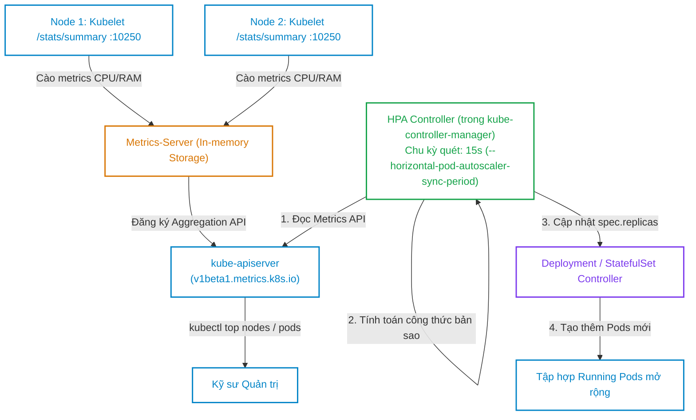
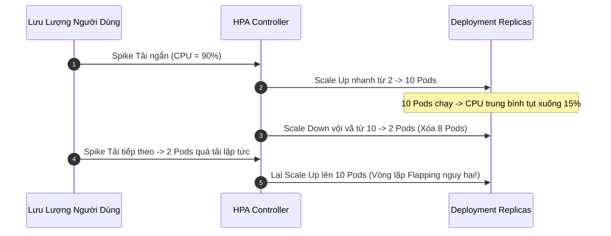
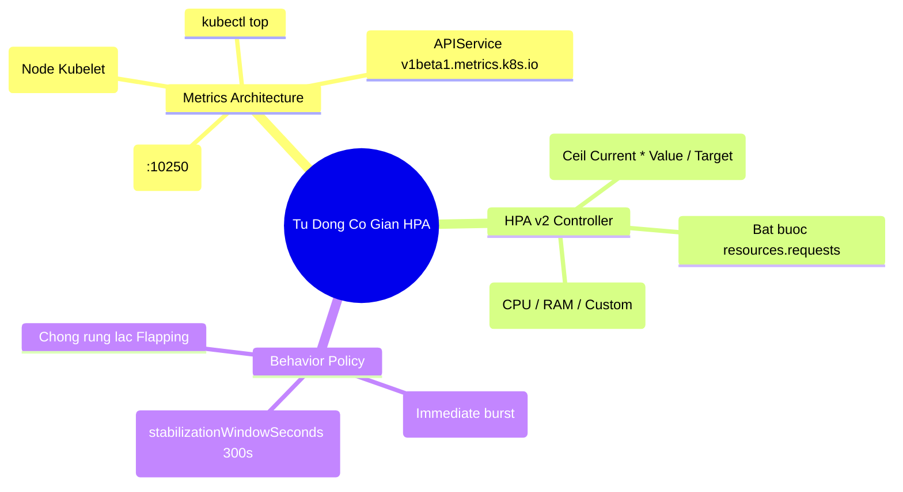


> [!IMPORTANT]
> **Mục tiêu kỹ thuật & Trọng tâm CKA**:
> - Hiểu rõ kiến trúc kết nối giữa Kubelet -> Metrics-Server -> Aggregation Layer -> HPA Controller.
> - Cài đặt và khắc phục lỗi chứng chỉ TLS của `metrics-server` trong cụm Kubeadm (`--kubelet-insecure-tls`).
> - Khởi tạo đối tượng HPA v2 hỗ trợ đa chỉ số: CPU Utilization, Memory Utilization, và Custom Metrics.
> - Thiết lập `behavior` với `stabilizationWindowSeconds`, `percent`, và `pods` rules.
> - Thực hành sinh tải giả lập, quan sát trực quan tiến trình Scale Up tức thì và Scale Down êm ái.

---

## 1. Bản Chất Kiến Trúc & Tư Duy Cốt Lõi: Cơ Chế Vận Hành HPA & Metrics-Server

Tự động co giãn (Autoscaling) là một trong những tính năng mạnh mẽ nhất của Kubernetes, giúp hệ thống tự động đáp ứng các đợt lưu lượng truy cập đột biến (Spike) đồng thời thu hồi tài nguyên nhàn rỗi trong giờ thấp điểm để tối ưu hóa chi phí đám mây.



### 1.1. Công Thức Toán Học Tính Toán Số Lượng Bản Sao HPA

HPA Controller liên tục tính toán số bản sao mong muốn theo công thức chuẩn:

$$\text{desiredReplicas} = \left\lceil \text{currentReplicas} \times \left( \frac{\text{currentMetricValue}}{\text{targetMetricValue}} \right) \right\rceil$$

**Ví dụ thực tế**:
- Đang chạy $\text{currentReplicas} = 2\text{ Pods}$.
- Khai báo $\text{targetCPUUtilizationPercentage} = 50\%$.
- Mức tiêu thụ thực tế đo được trung bình là $\text{currentMetricValue} = 85\%$.
- Số bản sao mới:
  $$\text{desiredReplicas} = \left\lceil 2 \times \frac{85}{50} \right\rceil = \lceil 2 \times 1.7 \rceil = \lceil 3.4 \rceil = \mathbf{4\text{ Pods}}$$

---

## 2. Bảng Ma Trận So Sánh Kỹ Thuật Toàn Diện (Engineering Matrix)

Bảng phân biệt 3 giải pháp co giãn tự động trong hệ sinh thái Kubernetes:

| Tiêu Chí So Sánh | HPA (Horizontal Pod Autoscaler) | VPA (Vertical Pod Autoscaler) | Cluster Autoscaler (CA) |
| :--- | :--- | :--- | :--- |
| **Bản chất co giãn** | **Hàng Ngang**: Tăng/giảm số lượng bản sao Pods | **Hàng Dọc**: Tăng/giảm CPU & RAM Request của Pod | **Hạ Tầng**: Tăng/giảm số lượng Node máy chủ |
| **Đối tượng điều khiển**| `Deployment`, `StatefulSet`, `ReplicaSet` | `Pod`, `Deployment` | Cloud Auto Scaling Group / VM Pool |
| **Yêu cầu khởi động lại**| Không (Pods mới sinh ra song song) | Có (Thường phải khởi động lại Pod để áp RAM/CPU mới)| Không ảnh hưởng Pods đang chạy trên Node khác |
| **Nguồn dữ liệu metric**| `metrics-server` (CPU/RAM) hoặc Prometheus | Lịch sử tiêu thụ tài nguyên thực tế | Trạng thái Pods bị `Pending` (Không đủ chỗ) |
| **Thời gian phản ứng** | Nhanh (~15 - 60 giây) | Chậm (Quan sát xu hướng nhiều giờ/ngày) | Trung bình (~2 - 5 phút để bật VM mới) |
| **Ứng dụng điển hình** | Stateless Microservices, Web APIs | Databases, Legacy Apps đơn luồng không thể scale out| Mở rộng hạ tầng khi HPA sinh quá nhiều Pods |

---

## 3. Cấu Trúc Khai Báo Manifest HPA v2 Đa Chỉ Số

### 3.1. HPA Manifest Hoàn Chỉnh với Đa Metric & Cấu Hình Behavior

```yaml
apiVersion: autoscaling/v2
kind: HorizontalPodAutoscaler
metadata:
  name: order-service-hpa
  namespace: production
spec:
  scaleTargetRef:
    apiVersion: apps/v1
    kind: Deployment
    name: order-service
  minReplicas: 2
  maxReplicas: 10
  metrics:
    # 1. Chỉ số CPU trung bình 60%
    - type: Resource
      resource:
        name: cpu
        target:
          type: Utilization
          averageUtilization: 60
    # 2. Chỉ số Memory trung bình 400Mi
    - type: Resource
      resource:
        name: memory
        target:
          type: AverageValue
          averageValue: 400Mi

  # 3. Tinh chỉnh chính sách co giãn (Behavior)
  behavior:
    scaleUp:
      stabilizationWindowSeconds: 0 # Mở rộng ngay lập tức khi quá tải
      policies:
        - type: Percent
          value: 100 # Tăng tối đa gấp đôi số Pod hiện tại
          periodSeconds: 15
        - type: Pods
          value: 4   # Hoặc tăng thêm tối đa 4 Pods
          periodSeconds: 15
      selectPolicy: Max
    scaleDown:
      stabilizationWindowSeconds: 300 # Chờ 5 phút ổn định trước khi giảm Pods
      policies:
        - type: Percent
          value: 20  # Mỗi 60s chỉ giảm tối đa 20% số Pods
          periodSeconds: 60
```

---

## 4. Phân Tích Cạm Bẫy Thực Chiến: Sự Cố HPA & Rung Lắc Số Lượng Bản Sao

### Tình huống 1: HPA hiển thị `TARGETS: <unknown>/50%` và không bao giờ Scale

Kỹ sư tạo HPA liên kết với Deployment nhưng khi chạy `kubectl get hpa` thì cột `TARGETS` liên tục báo `<unknown>`. Khi lưu lượng tăng cao, số bản sao vẫn giữ nguyên ở mức `minReplicas`.

### Hậu Quả & Log Lỗi Thực Tế:

```text
$ kubectl get hpa order-service-hpa -n production
NAME                REFERENCE                  TARGETS         MINPODS   MAXPODS   REPLICAS   AGE
order-service-hpa   Deployment/order-service   <unknown>/50%   2         10        2          10m

$ kubectl describe hpa order-service-hpa -n production
Events:
  Type     Reason                        Age                From                       Message
  ----     ------                        ----               ----                       -------
  Warning  FailedComputeMetricsReplicas  12s (x5 over 72s)  horizontal-pod-autoscaler  missing request for cpu on container app in pod order-service-789b5c-k2x8p
```

### 5-Whys Root Cause Analysis:
1. **Tại sao HPA không tính được số bản sao?** -> HPA Controller không lấy được tỷ lệ % CPU sử dụng.
2. **Tại sao không tính được tỷ lệ %?** -> Tỷ lệ % được tính bằng: $\frac{\text{CPU thực tế}}{\text{CPU Request}} \times 100\%$.
3. **Tại sao mẫu số không có?** -> Pod Spec của Deployment thiếu khối khai báo `resources.requests.cpu`.
4. **Tại sao lập trình viên không khai báo?** -> Lập trình viên chỉ khai báo `resources.limits` mà quên `requests`.
5. **Giải pháp khắc phục triệt để là gì?** -> Khai báo đầy đủ `resources.requests.cpu` trong Pod template của Deployment.

```diff
       containers:
         - name: app
           image: order-service:v1
           resources:
+            requests:
+              cpu: "200m"
+              memory: "256Mi"
             limits:
               cpu: "500m"
               memory: "512Mi"
```

---

### Tình huống 2: Hiện tượng Rung Lắc Số Lượng Bản Sao (Flapping / Thrashing)

Hệ thống nhận tải biến động nhanh (Spike 30 giây rồi tắt). HPA liên tục tăng từ 2 lên 10 Pods, vừa tăng xong tải giảm lại lập tức xóa 8 Pods, sau 1 phút tải tăng lại tạo 10 Pods mới. Vòng lặp liên tục này làm cạn kiệt tài nguyên mạng và gây gián đoạn dịch vụ.



> [!WARNING]
> **Giải pháp chuẩn sản xuất**: Luôn giữ `stabilizationWindowSeconds: 300` (5 phút) cho khối `scaleDown`. Khi tải giảm, HPA sẽ không vội vàng giảm Pods ngay mà quan sát thuật toán trong 5 phút; nếu tải vẫn thấp ổn định mới bắt đầu thu hồi Pods từng bước an toàn.

---

## 5. Hands-on Lab: Triển Khai & Kiểm Định HPA Chịu Tải (8 Bước)

Bảng tổng hợp 8 bước thực hành:

| Bước | Thao Tác | Mục Tiêu Kỹ Thuật | Lệnh / Công Cụ |
| :--- | :--- | :--- | :--- |
| **1** | Cài đặt Metrics-Server | Triển khai bộ thu thập chỉ số | `kubectl apply -f metrics-server.yaml` |
| **2** | Kiểm tra Metrics API | Xác nhận lệnh `kubectl top` hoạt động | `kubectl top nodes`, `top pods` |
| **3** | Tạo Namespace & Deployment chuẩn | Triển khai Nginx có khai báo CPU requests| `kubectl apply -f deploy.yaml` |
| **4** | Cấu hình HPA qua lệnh Imperative | Thiết lập HPA ngưỡng CPU 50% | `kubectl autoscale deployment` |
| **5** | Khởi tạo Pod sinh tải (Load Generator)| Tạo luồng HTTP requests liên tục | `kubectl run load-gen -- curl` |
| **6** | Quan sát HPA tự động Scale Up | Theo dõi Replicas tăng từ 1 lên 5 | `kubectl get hpa -w` |
| **7** | Dừng Pod sinh tải | Ngắt toàn bộ lưu lượng giả lập | `kubectl delete pod load-gen` |
| **8** | Quan sát cơ chế Scale Down Stabilization| Xác nhận độ trễ giảm an toàn 5 phút | `kubectl get hpa` |

---

### Bước 1: Triển khai Metrics-Server (Bỏ qua kiểm tra chứng chỉ Kubelet nội bộ)

Trong môi trường Lab/Kubeadm, áp dụng manifest Metrics-Server đã bổ sung cờ `--kubelet-insecure-tls`:

```bash
kubectl apply -f https://github.com/kubernetes-sigs/metrics-server/releases/latest/download/components.yaml

# Patch bổ sung cờ insecure tls nếu Kubelet dùng self-signed cert
kubectl patch deployment metrics-server -n kube-system --type='json' -p='[{"op": "add", "path": "/spec/template/spec/containers/0/args/-", "value": "--kubelet-insecure-tls"}]'
```

---

### Bước 2: Kiểm tra trạng thái hoạt động của Metrics-Server

Chờ 30 giây để Metrics-Server cào dữ liệu vòng đầu tiên:

```bash
kubectl top nodes
kubectl top pods -A
```

Output phản hồi dung lượng CPU/RAM thực tế:
```text
NAME       CPU(cores)   CPU%   MEMORY(bytes)   MEMORY%
cp-01      150m         7%     1850Mi          48%
worker-01  85m          4%     1120Mi          29%
```

---

### Bước 3: Tạo Namespace và Deployment có đầy đủ CPU Request

```bash
kubectl create namespace hpa-lab

cat <<EOF | kubectl apply -f -
apiVersion: apps/v1
kind: Deployment
metadata:
  name: php-apache
  namespace: hpa-lab
spec:
  replicas: 1
  selector:
    matchLabels:
      app: php-apache
  template:
    metadata:
      labels:
        app: php-apache
    spec:
      containers:
        - name: php-apache
          image: registry.k8s.io/hpa-example
          ports:
            - containerPort: 80
          resources:
            requests:
              cpu: "200m"
            limits:
              cpu: "500m"
---
apiVersion: v1
kind: Service
metadata:
  name: php-apache
  namespace: hpa-lab
spec:
  ports:
    - port: 80
  selector:
    app: php-apache
EOF
```

---

### Bước 4: Tạo HPA điều khiển php-apache với ngưỡng CPU 50%

```bash
kubectl autoscale deployment php-apache \
  --namespace=hpa-lab \
  --cpu-percent=50 \
  --min=1 \
  --max=5
```

Kiểm tra trạng thái HPA ban đầu:

```bash
kubectl get hpa -n hpa-lab
```

Output ghi nhận CPU đang ở mức 0%/50%:
```text
NAME         REFERENCE               TARGETS   MINPODS   MAXPODS   REPLICAS   AGE
php-apache   Deployment/php-apache   0%/50%    1         5         1          20s
```

---

### Bước 5: Tạo Pod sinh tải liên tục gửi request vào php-apache

```bash
kubectl run -i --tty load-generator \
  --namespace=hpa-lab \
  --image=busybox:1.36 \
  --restart=Never \
  -- /bin/sh -c "while true; do wget -q -O- http://php-apache; done"
```

---

### Bước 6: Quan sát tiến trình HPA Scale Up tự động

Mở một terminal khác và theo dõi:

```bash
kubectl get hpa -n hpa-lab -w
```

Sau khoảng 60-90 giây, CPU vọt lên ~350% và số lượng Replicas tự động tăng lên mức tối đa 5:
```text
NAME         REFERENCE               TARGETS    MINPODS   MAXPODS   REPLICAS   AGE
php-apache   Deployment/php-apache   0%/50%     1         5         1          1m
php-apache   Deployment/php-apache   355%/50%   1         5         4          2m
php-apache   Deployment/php-apache   305%/50%   1         5         5          3m
```

Kiểm tra danh sách Pods:

```bash
kubectl get pods -n hpa-lab -l app=php-apache
```

Output: 5 Pods đang cùng chia sẻ tải!

---

### Bước 7 & 8: Dừng sinh tải và quan sát cơ chế Stabilization Scale Down

Xóa Pod sinh tải:

```bash
kubectl delete pod load-generator -n hpa-lab
```

Theo dõi HPA:
- Mức tải CPU lập tức tụt về `0%/50%`.
- Số lượng Replicas **vẫn giữ nguyên 5 trong vòng 5 phút** (cửa sổ ổn định `stabilizationWindowSeconds` mặc định).
- Sau 5 phút, HPA mới từ từ thu hồi các Pods về lại mức sàn `minReplicas = 1`.

---

## 6. 10 Câu Hỏi Tự Kiểm Tra Chuyên Sâu (Self-Check Q&A Accordion)

<details class="qa-card">
  <summary><b>Câu 1: Điều kiện bắt buộc trong Pod Spec để Horizontal Pod Autoscaler có thể hoạt động là gì?</b></summary>
  <div class="qa-answer">
    <b>Trả lời:</b><br>
    Pod Spec <b>bắt buộc phải khai báo trường <code>resources.requests</code></b> (đặc biệt là <code>requests.cpu</code> hoặc <code>requests.memory</code>). HPA tính toán tỷ lệ phần trăm sử dụng (Utilization %) dựa trên công thức: <code>(Mức tiêu thụ thực tế / Request) * 100%</code>. Nếu thiếu <code>requests</code>, HPA sẽ không thể xác định mẫu số và hiển thị trạng thái <code>&lt;unknown&gt;</code>.
  </div>
</details>

<details class="qa-card">
  <summary><b>Câu 2: Metrics-Server thu thập dữ liệu CPU và Memory từ thành phần nào trên mỗi Worker Node?</b></summary>
  <div class="qa-answer">
    <b>Trả lời:</b><br>
    Metrics-Server kết nối trực tiếp tới <b>Kubelet API</b> trên từng Worker Node (thông qua cổng <code>10250</code> tại endpoint <code>/stats/summary</code>). Kubelet lấy dữ liệu này từ bộ công cụ <b>cAdvisor</b> tích hợp sẵn bên trong Kubelet.
  </div>
</details>

<details class="qa-card">
  <summary><b>Câu 3: Công thức toán học mà HPA Controller sử dụng để tính toán số lượng bản sao mong muốn là gì?</b></summary>
  <div class="qa-answer">
    <b>Trả lời:</b><br>
    Công thức chuẩn là:<br>
    $$\text{desiredReplicas} = \left\lceil \text{currentReplicas} \times \left( \frac{\text{currentMetricValue}}{\text{targetMetricValue}} \right) \right\rceil$$<br>
    Trong đó hàm trần $\lceil \dots \rceil$ (ceiling) đảm bảo số lượng bản sao luôn được làm tròn lên số nguyên gần nhất để tránh thiếu hụt năng lực xử lý.
  </div>
</details>

<details class="qa-card">
  <summary><b>Câu 4: Tham số stabilizationWindowSeconds trong cấu hình behavior của HPA có tác dụng gì?</b></summary>
  <div class="qa-answer">
    <b>Trả lời:</b><br>
    <code>stabilizationWindowSeconds</code> (mặc định là 300 giây cho scaleDown và 0 giây cho scaleUp) thiết lập khoảng thời gian quan sát để làm mịn (smooth) các biến động metric ngắn hạn. Cơ chế này ngăn chặn hiện tượng <b>Flapping (Rung lắc)</b> — tình trạng hệ thống liên tục scale up rồi scale down chập chờn khi lưu lượng mạng trồi sụt thất thường.
  </div>
</details>

<details class="qa-card">
  <summary><b>Câu 5: Chu kỳ quét mặc định của HPA Controller trong kube-controller-manager là bao lâu và được điều khiển bởi cờ nào?</b></summary>
  <div class="qa-answer">
    <b>Trả lời:</b><br>
    Chu kỳ quét mặc định là <b>15 giây</b> một lần, được điều khiển bởi cờ <code>--horizontal-pod-autoscaler-sync-period</code> trong cấu hình của <code>kube-controller-manager</code>.
  </div>
</details>

<details class="qa-card">
  <summary><b>Câu 6: Lệnh kubectl nào cho phép tạo nhanh một HPA với min 2, max 8 bản sao và ngưỡng RAM 80%?</b></summary>
  <div class="qa-answer">
    <b>Trả lời:</b><br>
    Sử dụng lệnh:<br>
    <code>kubectl autoscale deployment &lt;deploy-name&gt; --min=2 --max=8 --cpu-percent=80 -n &lt;namespace&gt;</code><br>
    <i>Lưu ý:</i> Đối với memory hoặc custom metrics, nên khai báo qua file manifest YAML chuẩn <code>autoscaling/v2</code>.
  </div>
</details>

<details class="qa-card">
  <summary><b>Câu 7: Sự khác nhau căn bản giữa HPA và Cluster Autoscaler là gì?</b></summary>
  <div class="qa-answer">
    <b>Trả lời:</b><br>
    <ul>
      <li><b>HPA:</b> Co giãn ở cấp độ Workload (tăng/giảm số lượng <b>Pods</b>).</li>
      <li><b>Cluster Autoscaler:</b> Co giãn ở cấp độ Hạ tầng (tăng/giảm số lượng <b>Worker Nodes/VMs</b>) khi nhận thấy có các Pods bị kẹt ở trạng thái <code>Pending</code> do cụm không còn đủ CPU/RAM.</li>
    </ul>
  </div>
</details>

<details class="qa-card">
  <summary><b>Câu 8: Bốn loại nguồn Metric (Metric Types) được hỗ trợ trong HPA v2 là gì?</b></summary>
  <div class="qa-answer">
    <b>Trả lời:</b><br>
    <ul>
      <li><b>Resource:</b> Chỉ số CPU và Memory tiêu chuẩn từ Metrics-Server.</li>
      <li><b>Pods:</b> Chỉ số trung bình trên từng Pod (ví dụ: số lượng HTTP requests/second trên mỗi Pod).</li>
      <li><b>Object:</b> Chỉ số gắn liền với một đối tượng Kubernetes khác trong cùng namespace (ví dụ: Ingress connection count).</li>
      <li><b>External:</b> Chỉ số từ hệ thống bên ngoài cụm (ví dụ: độ dài hàng đợi tin nhắn AWS SQS / RabbitMQ).</li>
    </ul>
  </div>
</details>

<details class="qa-card">
  <summary><b>Câu 9: Tại sao không nên cấu hình đồng thời HPA và VPA cùng điều khiển CPU/Memory trên cùng một Deployment?</b></summary>
  <div class="qa-answer">
    <b>Trả lời:</b><br>
    Bởi vì HPA và VPA sẽ xảy ra xung đột điều khiển (Control Loop Conflict): Khi tải tăng, HPA cố gắng tạo thêm Pods trong khi VPA lại cố gắng tăng CPU/RAM request và restart Pods cũ. Hai controller sẽ liên tục đưa ra các quyết định trái ngược nhau dẫn đến trạng thái bất ổn định nghiêm trọng.
  </div>
</details>

<details class="qa-card">
  <summary><b>Câu 10: Cờ --kubelet-insecure-tls trong Deployment của Metrics-Server có vai trò gì?</b></summary>
  <div class="qa-answer">
    <b>Trả lời:</b><br>
    Cờ này chỉ thị cho Metrics-Server bỏ qua việc xác thực chứng chỉ CA của Kubelet phục vụ trên cổng 10250 (thường là chứng chỉ self-signed tự sinh trong các cụm kubeadm). Cờ này là cần thiết trong môi trường test/on-premise để tránh lỗi kết nối <code>x509: certificate signed by unknown authority</code>.
  </div>
</details>

---

## 7. Tổng Kết & Lộ Trình Bài Học Tiếp Theo



Thiết lập cơ chế tự động co giãn thông minh với HPA v2 và Metrics-Server là bước ngoặt quyết định giúp hệ thống của bạn tự động thích ứng với lưu lượng người dùng thực tế mà không cần sự can thiệp thủ công của kỹ sư vận hành.

> [!TIP]
> **Bài học tiếp theo**: Trong [Bài 20: Quản Trị Cấu Hình Ứng Dụng với ConfigMap & Secret Bảo Mật](cka-20-20-cau-hinh-configmap-secret.html), chúng ta sẽ phân tích toàn diện phương pháp tách biệt mã nguồn và cấu hình theo nguyên tắc 12-Factor App, các phương thức nạp biến môi trường/volume, cơ chế mã hóa Secret at rest và kỹ thuật tự động reload cấu hình.

