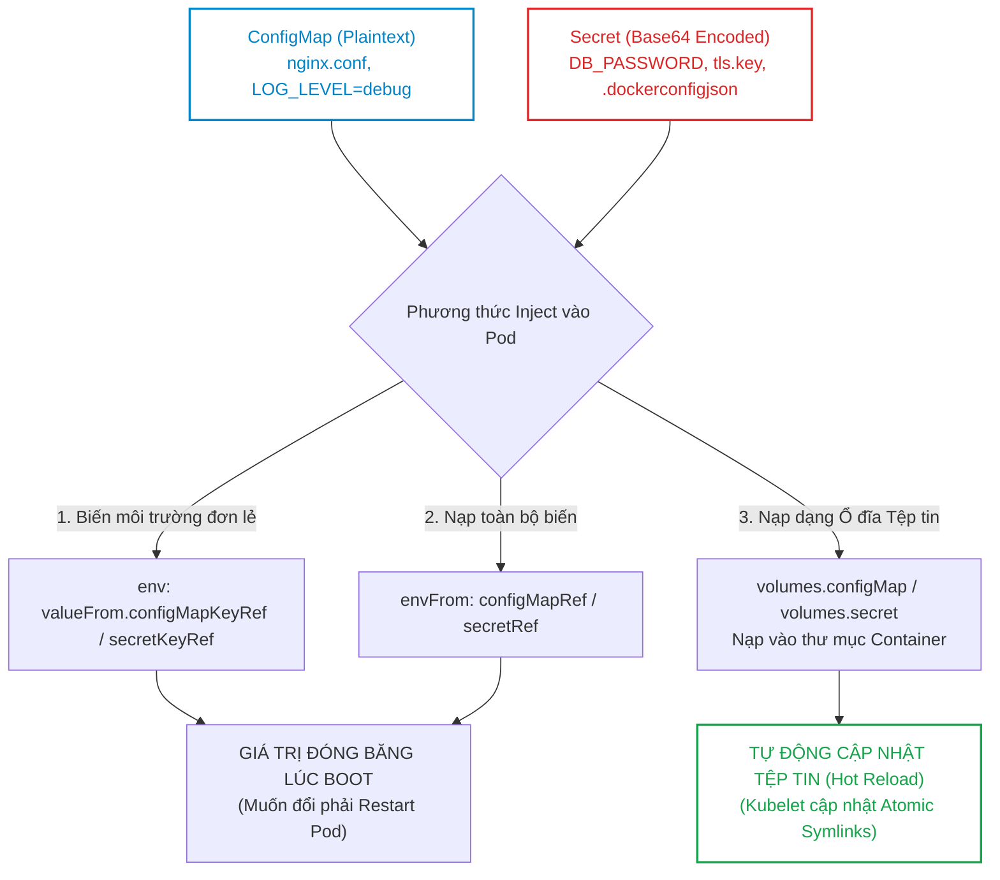
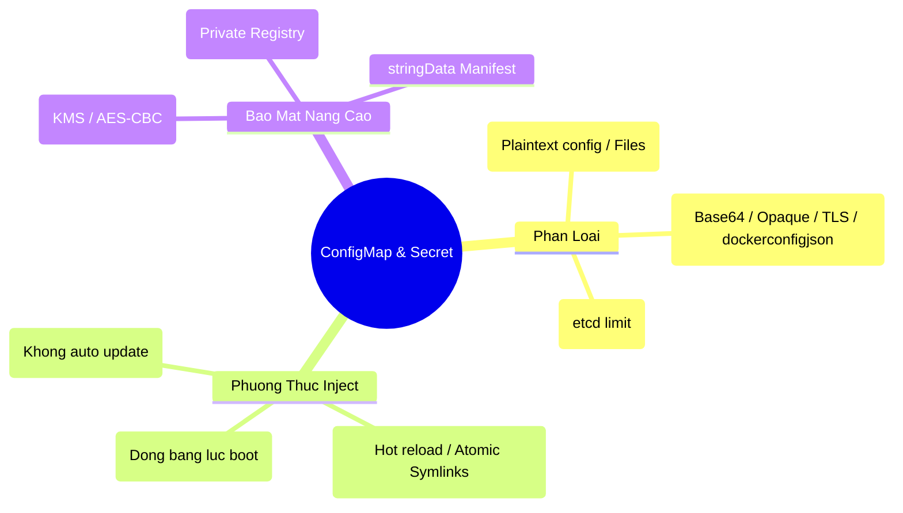


> [!IMPORTANT]
> **Mục tiêu kỹ thuật & Trọng tâm CKA**:
> - Tách biệt triệt để mã nguồn và cấu hình theo chuẩn Twelve-Factor App.
> - Tạo nhanh ConfigMap và Secret từ Literal, Tệp tin riêng lẻ và Thư mục bằng lệnh Imperative CLI.
> - Nạp cấu hình vào Pod thông qua 3 phương thức: `valueFrom`, `envFrom`, và `volumeMounts`.
> - Khởi tạo `imagePullSecrets` xác thực Docker Registry nội bộ.
> - Nắm vững cơ chế cập nhật tự động của Volume Mount và xử lý triệt để cạm bẫy `subPath`.

---

## 1. Bản Chất Kiến Trúc & Tư Duy Cốt Lõi: Tách Biệt Cấu Hình & Mã Nguồn

Theo nguyên tắc thiết kế ứng dụng chuẩn đám mây (**The Twelve-Factor App**), cấu hình của một ứng dụng (chuỗi kết nối cơ sở dữ liệu, cổng dịch vụ, cờ tính năng, chứng chỉ TLS) phải được tách biệt hoàn toàn khỏi mã nguồn đóng gói trong Container Image.

Kubernetes cung cấp hai đối tượng API chuyên dụng:
1. **ConfigMap**: Dành cho dữ liệu cấu hình thông thường dạng chuỗi văn bản (Plaintext) hoặc toàn bộ nội dung tệp tin cấu hình (`nginx.conf`, `app.properties`).
2. **Secret**: Dành cho dữ liệu bí mật, nhạy cảm (Mật khẩu DB, API Token, Private Key, SSH Key).



### 1.1. Giải Mã Cơ Chế Atomic Symlink Của Volume Mount

Khi bạn mount một ConfigMap thành thư mục trong Pod (ví dụ: `/etc/config`), Kubelet không ghi đè trực tiếp lên tệp mà tạo ra cấu trúc liên kết động (Symlinks) 3 tầng:

```text
/etc/config/
├── app.properties -> ..data/app.properties
├── ..data -> ..2026_09_16_03_00_12.891234
└── ..2026_09_16_03_00_12.891234/
    └── app.properties
```

Khi ConfigMap trên cụm được chỉnh sửa:
1. Kubelet phát hiện thay đổi qua chu kỳ đồng bộ.
2. Kubelet tạo một thư mục timestamp mới (ví dụ: `..2026_09_16_03_05_00.123456`) chứa nội dung mới.
3. Kubelet thực hiện thao tác trỏ lại liên kết `..data` tới thư mục mới bằng lệnh nguyên tử (`atomic symlink swap`).
4. Ứng dụng đọc file `/etc/config/app.properties` lập tức nhận được nội dung mới mà không gặp tình trạng đọc dở dang (Inconsistent Read).

---

## 2. Bảng Ma Trận So Sánh Kỹ Thuật Toàn Diện (Engineering Matrix)

Bảng đối chiếu các phương thức nạp dữ liệu và các loại Secret chuyên dụng:

| Tiêu Chí Kỹ Thuật | Biến Môi Trường (`env` / `envFrom`) | Volume Mount Đầy Đủ | Volume Mount với `subPath` |
| :--- | :--- | :--- | :--- |
| **Dạng dữ liệu trong App** | Biến môi trường (`process.env.VAR`)| Tệp tin trong thư mục (`/etc/config/..`)| Tệp tin đơn lẻ đè vào thư mục có sẵn |
| **Ghi đè thư mục đích** | Không ảnh hưởng | Ghi đè toàn bộ thư mục đích | Giữ nguyên các tệp khác trong thư mục |
| **Tự động cập nhật (Hot Reload)**| **KHÔNG** (Bắt buộc restart Pod)| **CÓ** (Tự cập nhật sau ~60 giây) | **KHÔNG** (Bị đóng băng do mount file inode)|
| **Kích thước tối đa** | Bị giới hạn bởi OS Env Buffer | Tối đa 1 MiB (Giới hạn etcd) | Tối đa 1 MiB (Giới hạn etcd) |
| **Khả năng giấu dữ liệu** | Dễ bị lộ qua `/proc/$PID/environ` | An toàn hơn (Lưu trong RAM tmpfs) | An toàn hơn (Lưu trong RAM tmpfs) |

### 2.1. Ma Trận Các Loại Secret Cốt Lõi

| Loại Secret (`type`) | Khóa bắt buộc (`data`) | Mục đích sử dụng |
| :--- | :--- | :--- |
| **`Opaque`** (Mặc định) | Tùy ý người dùng (`password`, `api-key`)| Chứa thông tin cấu hình bí mật chung |
| **`kubernetes.io/tls`** | `tls.crt`, `tls.key` | Cấu hình chứng chỉ HTTPS cho Ingress / NGINX |
| **`kubernetes.io/dockerconfigjson`**| `.dockerconfigjson` | Xác thực kéo Image từ Private Container Registry |
| **`kubernetes.io/service-account-token`**| `token`, `ca.crt`, `namespace` | Token xác thực ServiceAccount tĩnh (Legacy) |

---

## 3. Cấu Trúc Khai Báo Manifest & Chi Tiết Nạp Cấu Hình

### 3.1. Khai Báo ConfigMap & Secret Chuẩn

```yaml
apiVersion: v1
kind: ConfigMap
metadata:
  name: app-config
  namespace: production
data:
  APP_ENV: "production"
  LOG_LEVEL: "info"
  nginx.conf: |
    server {
        listen 80;
        server_name myapp.com;
        location / {
            proxy_pass http://localhost:8080;
        }
    }
---
apiVersion: v1
kind: Secret
metadata:
  name: app-secrets
  namespace: production
type: Opaque
stringData: # stringData tự động encode Base64 thay vì phải gõ chuỗi mã hóa
  DB_USER: "admin"
  DB_PASSWORD: "SuperSecurePassword123!"
```

### 3.2. Pod Manifest Kết Hợp Cả 3 Phương Thức Nạp Dữ Liệu

```yaml
apiVersion: v1
kind: Pod
metadata:
  name: backend-service
  namespace: production
spec:
  # Xác thực kéo ảnh từ Registry riêng
  imagePullSecrets:
    - name: registry-credential

  containers:
    - name: api
      image: myregistry.io/backend:v1.2.0
      
      # 1. Nạp toàn bộ biến từ ConfigMap
      envFrom:
        - configMapRef:
            name: app-config
      
      # 2. Nạp từng biến nhạy cảm từ Secret
      env:
        - name: DATABASE_PASSWORD
          valueFrom:
            secretKeyRef:
              name: app-secrets
              key: DB_PASSWORD

      # 3. Mount tệp tin cấu hình vào thư mục
      volumeMounts:
        - name: config-volume
          mountPath: /etc/nginx/conf.d
          readOnly: true

  volumes:
    - name: config-volume
      configMap:
        name: app-config
        items:
          - key: nginx.conf
            path: default.conf # Đổi tên thành default.conf trong thư mục
```

---

## 4. Phân Tích Cạm Bẫy Thực Chiến: Sự Cố Cấu Hình & Lỗi SubPath

### Tình huống 1: Ứng dụng không nhận cấu hình mới vì sử dụng `subPath`

Lập trình viên mount tệp `app.json` từ ConfigMap vào thư mục `/app/config/app.json` bằng thuộc tính `subPath` để tránh làm mất các file tĩnh khác trong thư mục `/app/config/`. Khi quản trị viên cập nhật ConfigMap, Pod chạy suốt 3 ngày vẫn giữ nguyên cấu hình cũ.

### Hậu Quả & Log Lỗi Thực Tế:

```text
# Kiểm tra nội dung trong container vẫn giữ giá trị ban đầu:
$ kubectl exec -it backend-service -- cat /app/config/app.json
{"feature_flags": {"new_ui": false}}

# Trong khi ConfigMap trên cụm đã đổi thành true:
$ kubectl get configmap app-config -o jsonpath='{.data.app\.json}'
{"feature_flags": {"new_ui": true}}
```

### 5-Whys Root Cause Analysis:
1. **Tại sao tệp trong container không đổi?** -> Kubelet không cập nhật tệp tin khi dùng `subPath`.
2. **Tại sao `subPath` không cập nhật?** -> `subPath` thực hiện Linux bind-mount trực tiếp Inode của tệp tại thời điểm khởi tạo Pod.
3. **Tại sao bind-mount Inode không đổi?** -> Khi ConfigMap đổi, Kubelet tạo file mới ở Inode mới, nhưng bind-mount vẫn trỏ về Inode cũ đã lưu trong RAM.
4. **Tại sao lập trình viên lại dùng `subPath`?** -> Muốn chèn 1 file vào thư mục mà không làm xóa các file sẵn có trong container image.
5. **Giải pháp khắc phục là gì?** -> Sử dụng giải pháp Volume Mount thư mục con riêng biệt hoặc cấu hình công cụ chuyên dụng như **Reloader** để tự động restart Pod khi ConfigMap thay đổi.

---

### Tình huống 2: Pod không thể khởi động vì thiếu Secret (CreateContainerConfigError)

Deployment tham chiếu tới Secret `database-credentials` nhưng Secret này chưa được tạo trong Namespace.

### Hậu Quả & Log Lỗi Thực Tế:

```text
$ kubectl get pods
NAME                               READY   STATUS                       RESTARTS   AGE
backend-service-68d7547b7b-2k8nm   0/1     CreateContainerConfigError   0          45s

$ kubectl describe pod backend-service-68d7547b7b-2k8nm
Events:
  Type     Reason  Age               From     Message
  ----     ------  ----              ----     -------
  Warning  Failed  12s (x4 over 50s) kubelet  Error: secret "database-credentials" not found
```

> [!WARNING]
> Nếu bạn muốn một biến môi trường từ ConfigMap/Secret là tùy chọn (Optional - không bắt buộc có), hãy khai báo thêm thuộc tính `optional: true` trong khối `configMapKeyRef` / `secretKeyRef`. Khi đó, nếu Secret không tồn tại, Pod vẫn khởi động bình thường và biến môi trường sẽ nhận giá trị rỗng.

---

## 5. Hands-on Lab: Quản Trị ConfigMap, Secret & Hot Reload (8 Bước)

Bảng tổng hợp 8 bước thực hành:

| Bước | Thao Tác | Mục Tiêu Kỹ Thuật | Lệnh / Công Cụ |
| :--- | :--- | :--- | :--- |
| **1** | Khởi tạo Namespace Lab | Tạo môi trường cô lập | `kubectl create ns config-lab` |
| **2** | Tạo ConfigMap từ Literal & File | Khởi tạo cấu hình đa nguồn | `kubectl create configmap` |
| **3** | Tạo Secret Opaque từ stringData | Lưu trữ mật khẩu cơ sở dữ liệu | `kubectl apply -f secret.yaml` |
| **4** | Tạo Docker Registry Secret | Thiết lập `imagePullSecrets` | `kubectl create secret docker-registry` |
| **5** | Triển khai Pod Mount ConfigMap | Nạp cấu hình qua Volume Mount | `kubectl apply -f pod-mount.yaml` |
| **6** | Kiểm tra cấu trúc Atomic Symlink | Xác minh liên kết động `..data` | `kubectl exec -- ls -la` |
| **7** | Cập nhật ConfigMap trực tiếp | Sửa nội dung ConfigMap trên cụm | `kubectl edit configmap` |
| **8** | Kiểm định cơ chế Hot Reload | Xác nhận file trong container tự đổi | `kubectl exec -- cat` |

---

### Bước 1: Khởi tạo Namespace

```bash
kubectl create namespace config-lab
```

---

### Bước 2: Tạo ConfigMap từ dòng lệnh và từ tệp tin

Tạo file cấu hình mẫu trên máy chủ:

```bash
echo "theme=dark\nitems_per_page=50" > ~/ui.properties

# Tạo ConfigMap kết hợp cả literal và file
kubectl create configmap web-config \
  --namespace=config-lab \
  --from-literal=APP_MODE=production \
  --from-file=ui.properties=~/ui.properties
```

---

### Bước 3: Tạo Secret Opaque chứa thông tin xác thực Database

```bash
cat <<EOF | kubectl apply -f -
apiVersion: v1
kind: Secret
metadata:
  name: db-credentials
  namespace: config-lab
type: Opaque
stringData:
  DB_HOST: "postgres.internal"
  DB_PASS: "SecretPass2026!"
EOF
```

---

### Bước 4: Tạo Docker Registry Secret (ImagePullSecrets)

```bash
kubectl create secret docker-registry my-docker-vault \
  --namespace=config-lab \
  --docker-server=https://index.docker.io/v1/ \
  --docker-username=mydevuser \
  --docker-password=MySuperTokenPass \
  --docker-email=dev@company.com
```

---

### Bước 5: Triển khai Pod tiêu thụ cả ConfigMap và Secret qua Volume Mount

```bash
cat <<EOF | kubectl apply -f -
apiVersion: v1
kind: Pod
metadata:
  name: config-reader-app
  namespace: config-lab
spec:
  containers:
    - name: reader
      image: busybox:1.36
      command: ["sleep", "3600"]
      volumeMounts:
        - name: config-vol
          mountPath: /etc/app-config
        - name: secret-vol
          mountPath: /etc/app-secrets
          readOnly: true
  volumes:
    - name: config-vol
      configMap:
        name: web-config
    - name: secret-vol
      secret:
        name: db-credentials
EOF
```

---

### Bước 6: Kiểm tra cấu trúc Atomic Symlink bên trong Container

```bash
kubectl exec -it config-reader-app -n config-lab -- ls -la /etc/app-config
```

Output hiển thị rõ liên kết động trỏ vào thư mục timestamp `..data`:
```text
drwxrwxrwx    3 root     root          4096 Sep 16 03:10 .
drwxr-xr-x    3 root     root          4096 Sep 16 03:10 ..
drwxr-xr-x    2 root     root          4096 Sep 16 03:10 ..2026_09_16_03_10_22.912837
lrwxrwxrwx    1 root     root            31 Sep 16 03:10 ..data -> ..2026_09_16_03_10_22.912837
lrwxrwxrwx    1 root     root            15 Sep 16 03:10 APP_MODE -> ..data/APP_MODE
lrwxrwxrwx    1 root     root            20 Sep 16 03:10 ui.properties -> ..data/ui.properties
```

---

### Bước 7: Cập nhật ConfigMap trực tiếp

Chỉnh sửa giá trị `APP_MODE` từ `production` thành `maintenance`:

```bash
kubectl patch configmap web-config -n config-lab -p '{"data":{"APP_MODE":"maintenance"}}'
```

---

### Bước 8: Kiểm định Hot Reloading tự động trong Container

Chờ khoảng 30–60 giây để Kubelet thực hiện chu kỳ đồng bộ:

```bash
sleep 45
kubectl exec -it config-reader-app -n config-lab -- cat /etc/app-config/APP_MODE
```

Output:
```text
maintenance
```

Tệp tin trong container đã tự động cập nhật nội dung mới **mà Pod không hề bị restart (RESTARTS = 0)**!

---

## 6. 10 Câu Hỏi Tự Kiểm Tra Chuyên Sâu (Self-Check Q&A Accordion)

<details class="qa-card">
  <summary><b>Câu 1: Điểm khác biệt quan trọng giữa ConfigMap và Secret trong Kubernetes là gì?</b></summary>
  <div class="qa-answer">
    <b>Trả lời:</b><br>
    <ul>
      <li><b>ConfigMap:</b> Dành cho cấu hình công khai, không nhạy cảm; dữ liệu lưu trữ trực tiếp dưới dạng chuỗi văn bản thuần (Plaintext).</li>
      <li><b>Secret:</b> Dành cho thông tin bảo mật, nhạy cảm (mật khẩu, khóa riêng tư, chứng chỉ); dữ liệu được mã hóa dạng Base64 và khi mount vào Pod được lưu trữ trong bộ nhớ tạm (tmpfs) nhằm tránh ghi đè xuống đĩa vật lý của Node.</li>
    </ul>
  </div>
</details>

<details class="qa-card">
  <summary><b>Câu 2: Giới hạn dung lượng tối đa cho một đối tượng ConfigMap hoặc Secret là bao nhiêu và do đâu quy định?</b></summary>
  <div class="qa-answer">
    <b>Trả lời:</b><br>
    Giới hạn tối đa là <b>1 MiB (1 Megabyte)</b>. Giới hạn này bắt nguồn từ mức dung lượng tối đa cho phép của một bản ghi dữ liệu đơn lẻ trong cơ sở dữ liệu phân tán <b>etcd</b> của Kubernetes.
  </div>
</details>

<details class="qa-card">
  <summary><b>Câu 3: Điều gì xảy ra khi sửa đổi ConfigMap nếu dữ liệu được nạp vào Pod qua biến môi trường (env / envFrom)?</b></summary>
  <div class="qa-answer">
    <b>Trả lời:</b><br>
    Biến môi trường của tiến trình được hệ điều hành nạp cố định vào không gian bộ nhớ lúc container khởi động (Process Spawning). Khi ConfigMap thay đổi, các biến môi trường trong container đang chạy <b>KHÔNG tự động cập nhật</b>. Quản trị viên bắt buộc phải khởi động lại Pod (ví dụ: chạy <code>kubectl rollout restart deployment</code>) để Pod mới nhận giá trị cấu hình mới.
  </div>
</details>

<details class="qa-card">
  <summary><b>Câu 4: Cơ chế Atomic Symlink trong Volume Mount giúp ích gì cho quá trình cập nhật cấu hình nóng (Hot Reload)?</b></summary>
  <div class="qa-answer">
    <b>Trả lời:</b><br>
    Kubelet cập nhật tệp tin bằng cách tạo thư mục timestamp mới và thực hiện tráo đổi liên kết động <code>..data</code> nguyên tử (Atomic Symlink Swap). Cơ chế này đảm bảo ứng dụng không bao giờ đọc phải tệp tin ở trạng thái dở dang (Inconsistent/Partial Write) trong lúc tệp đang được ghi đè, cho phép ứng dụng theo dõi sự kiện file (inotify) để tự tải lại cấu hình mà không cần khởi động lại Pod.
  </div>
</details>

<details class="qa-card">
  <summary><b>Câu 5: Tại sao việc sử dụng subPath trong volumeMounts lại làm mất khả năng tự động cập nhật của ConfigMap?</b></summary>
  <div class="qa-answer">
    <b>Trả lời:</b><br>
    Khi sử dụng <code>subPath</code>, Linux thực hiện thao tác bind-mount trực tiếp <b>Inode vật lý</b> của tệp tin đơn lẻ đó vào container. Khi ConfigMap thay đổi, Kubelet tạo ra một Inode mới, nhưng liên kết bind-mount của container vẫn giữ chặt Inode cũ, dẫn đến việc container bị đóng băng với nội dung ban đầu cho đến khi Pod bị tiêu hủy.
  </div>
</details>

<details class="qa-card">
  <summary><b>Câu 6: Trường stringData trong đối tượng Secret có lợi ích gì so với trường data thông thường?</b></summary>
  <div class="qa-answer">
    <b>Trả lời:</b><br>
    Trường <code>stringData</code> cho phép người dùng viết trực tiếp chuỗi văn bản thô (Plaintext) chưa mã hóa vào file YAML manifest. Khi gửi lên API Server, Kubernetes sẽ tự động chuyển đổi chuỗi đó sang dạng mã hóa Base64 và lưu vào trường <code>data</code>, giúp giảm thiểu thao tác mã hóa thủ công bằng lệnh <code>base64</code>.
  </div>
</details>

<details class="qa-card">
  <summary><b>Câu 7: Làm thế nào để tạo một Secret loại TLS chứa chứng chỉ server.crt và khóa private.key từ dòng lệnh kubectl?</b></summary>
  <div class="qa-answer">
    <b>Trả lời:</b><br>
    Sử dụng lệnh:<br>
    <code>kubectl create secret tls &lt;secret-name&gt; --cert=path/to/server.crt --key=path/to/private.key -n &lt;namespace&gt;</code>
  </div>
</details>

<details class="qa-card">
  <summary><b>Câu 8: Khái niệm EncryptionConfiguration (Encryption at Rest) trong Kubernetes dùng để giải quyết vấn đề gì?</b></summary>
  <div class="qa-answer">
    <b>Trả lời:</b><br>
    Mặc định, các đối tượng Secret được lưu trữ trong etcd dưới dạng mã hóa Base64 đơn thuần (bất kỳ ai đọc được etcd đều giải mã được ngay). Tính năng <b>EncryptionConfiguration</b> cho phép <code>kube-apiserver</code> mã hóa dữ liệu Secret bằng các thuật toán mã hóa mạnh (như <code>aescbc</code>, <code>aesgcm</code>, hoặc qua nhà cung cấp KMS bên ngoài) trước khi ghi xuống đĩa etcd, bảo vệ an toàn dữ liệu ngay cả khi ổ đĩa của etcd bị đánh cắp.
  </div>
</details>

<details class="qa-card">
  <summary><b>Câu 9: Đối tượng imagePullSecrets trong Pod Spec được sử dụng trong trường hợp nào?</b></summary>
  <div class="qa-answer">
    <b>Trả lời:</b><br>
    <code>imagePullSecrets</code> tham chiếu tới một Secret thuộc loại <code>kubernetes.io/dockerconfigjson</code> chứa thông tin đăng nhập (username, token, registry URL). Kubelet sử dụng Secret này để xác thực với các Private Container Registry (như Docker Hub Private, AWS ECR, GCP Artifact Registry, Harbor) nhằm kéo Container Image có bảo mật về Node.
  </div>
</details>

<details class="qa-card">
  <summary><b>Câu 10: Làm sao để một biến môi trường nạp từ ConfigMap không làm sập Pod nếu khóa đó không tồn tại?</b></summary>
  <div class="qa-answer">
    <b>Trả lời:</b><br>
    Khai báo thuộc tính <code>optional: true</code> trong khối cấu hình <code>configMapKeyRef</code> hoặc <code>secretKeyRef</code>:<br>
    <div style="background-color:#1e1e1e; color:#d4d4d4; padding:8px; border-radius:4px; font-family:monospace; margin-top:4px;">
    valueFrom:<br>
    &nbsp;&nbsp;configMapKeyRef:<br>
    &nbsp;&nbsp;&nbsp;&nbsp;name: app-config<br>
    &nbsp;&nbsp;&nbsp;&nbsp;key: OPTIONAL_FEATURE<br>
    &nbsp;&nbsp;&nbsp;&nbsp;optional: true
    </div>
  </div>
</details>

---

## 7. Tổng Kết & Lộ Trình Bài Học Tiếp Theo



Quản trị cấu hình và dữ liệu bảo mật một cách chuyên nghiệp với ConfigMap và Secret là chìa khóa then chốt để xây dựng hệ thống microservices an toàn, linh hoạt và dễ dàng chuyển dịch giữa các môi trường phát triển và sản xuất.

> [!TIP]
> **Bài học tiếp theo**: Trong [Bài 21: Mô Hình Mạng Kubernetes Toàn Diện: Flat Network, Pod-to-Pod & So Sánh CNI Plugins (Flannel, Calico, Cilium)](cka-21-21-mo-hinh-mang-va-cni.html), chúng ta sẽ bước vào chuyên đề Mạng (Networking) - một trong những trụ cột quan trọng nhất của Kubernetes: phân tích nguyên lý mạng phẳng IP-per-Pod, cơ chế đóng gói Overlay VXLAN vs Định tuyến BGP, và công nghệ eBPF tiên tiến.

