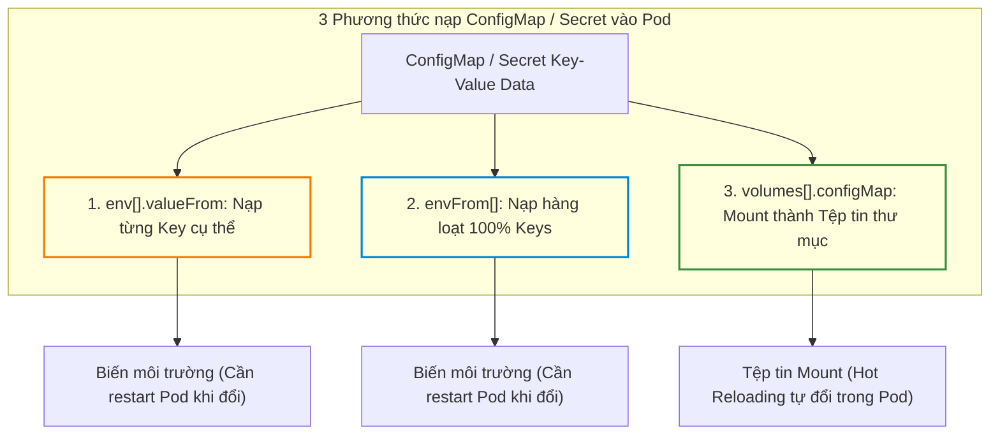
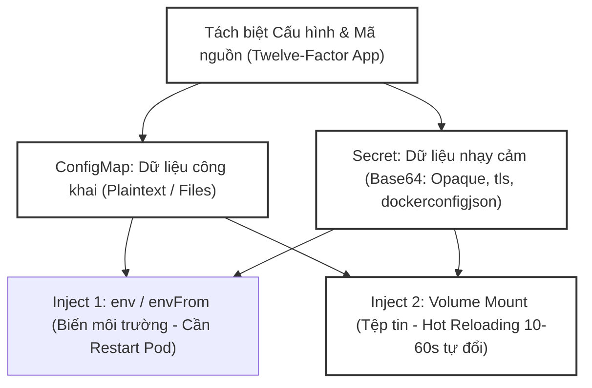
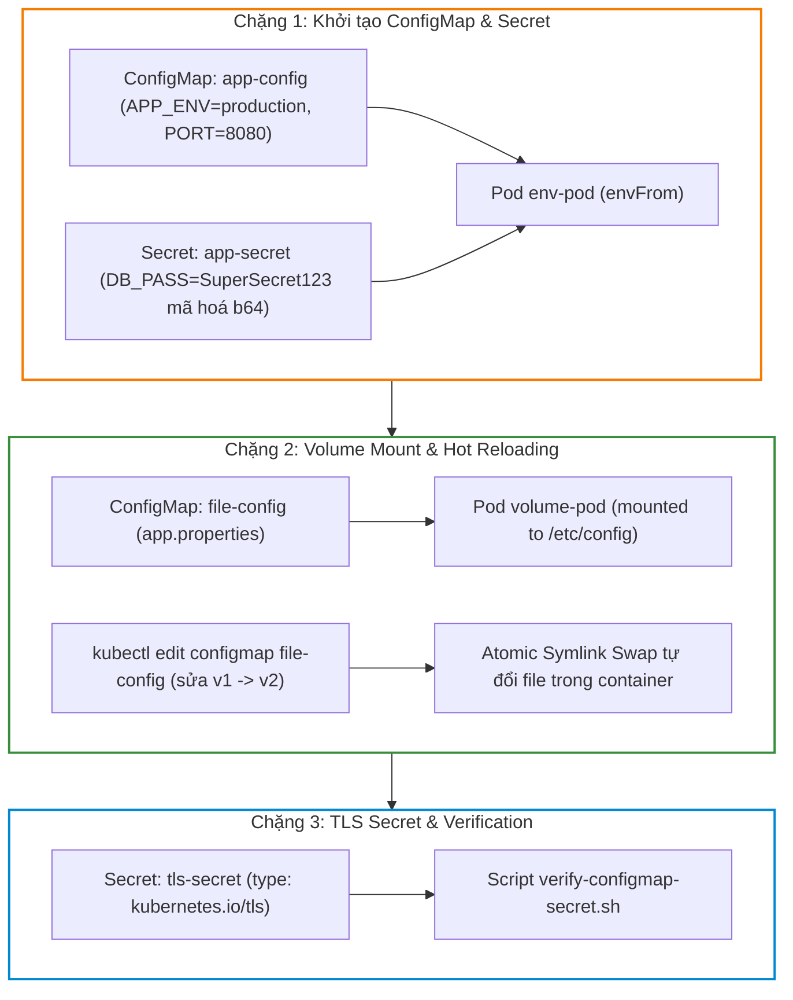


# [BÀI 20] QUẢN LÝ CẤU HÌNH ỨNG DỤNG: CONFIGMAP, SECRET, ENVFROM, PROJECTED VOLUMES & KỸ THUẬT HOT RELOAD

Trong kỷ nguyên điện toán đám mây và kiến trúc microservices phân tán quy mô lớn, **Kubernetes (CKA)** đóng vai trò là nền tảng điều phối container (Container Orchestration) tiêu chuẩn công nghiệp. Để làm chủ hệ thống trong môi trường sản xuất (Production) cũng như chinh phục kỳ thi chứng chỉ quốc tế của Linux Foundation / CNCF, kỹ sư không chỉ nắm vững các câu lệnh thao tác cơ bản mà phải thấu hiểu sâu sắc bản chất cơ chế tầng thấp: từ chu trình điều hòa (Reconciliation Loop), cấu trúc điều phối tài nguyên, kiến trúc mạng CNI, lưu trữ CSI cho đến các chuẩn mực an ninh phòng thủ chiều sâu.

Bài viết chuyên sâu này sẽ đồng hành cùng bạn giải mã toàn diện bức tranh kiến trúc, phân tích các đánh đổi kỹ thuật thực chiến (Engineering Trade-offs), cung cấp bài thực hành Lab từng bước và bộ câu hỏi phỏng vấn chuẩn Architect / Lead Engineer.

---

## 1. Bản Chất Kiến Trúc & Cơ Chế Vận Hành Tầng Thấp

| # | Câu hỏi ôn tập | Đáp án chuẩn ngắn gọn (chứa con số / tên lệnh) |
|---|---|---|
| 1 | Sự khác nhau giữa HPA (co giãn hàng ngang) và VPA (co giãn hàng dọc)? | HPA co giãn **số lượng bản sao Pods** (Replicas); VPA co giãn **cấu hình CPU/RAM** |
| 2 | Công thức toán học tính số bản sao Pods mong muốn của HPA? | **`desiredReplicas = ceil[ currentReplicas * ( currentMetric / targetMetric ) ]`** |
| 3 | Điều kiện tiên quyết bắt buộc trong Pod spec để HPA tính CPU %? | **100%** containers bắt buộc phải khai báo **`resources.requests.cpu`** |
| 4 | Tần suất vòng lặp kiểm tra chỉ số HPA của Controller? | Định kỳ **15 giây** một lần |
| 5 | Cửa sổ thời gian ổn định co giảm `stabilizationWindowSeconds`? | Mặc định **300 giây (5 phút)** chống hiện tượng Flapping |


> **Luận đề trung tâm của buổi:**
> *"Tách biệt tuyệt đối giữa mã nguồn ứng dụng (App Code) và cấu hình môi trường bằng bộ đôi đối tượng `ConfigMap` (dữ liệu công khai dạng Plaintext/Tệp tin) và `Secret` (dữ liệu nhạy cảm mã hoá Base64 như `Opaque`, `dockerconfigjson`, `tls`); trong đó dữ liệu inject vào Pod qua phương thức Volume Mount tự động cập nhật nóng (Hot Reloading) khi ConfigMap thay đổi mà không cần restart Pod, trái ngược với phương thức gán biến môi trường (`env` / `envFrom`) bắt buộc phải tái tạo Pod mới nhận giá trị mới."*

**Bảng kết quả các buổi trước được dùng lại:**

| Kết quả / Công cụ | Nguồn gốc | Áp dụng vào buổi này |
|---|---|---|
| Mã hoá và giải mã chuỗi bằng lệnh `base64` | Buổi 01 `QT 4.1` | Mã hoá mật khẩu thành Base64 để tạo file YAML Secret |
| Khái niệm Mount Volume vào container | Buổi 12 `QT 4.1` | Mount ConfigMap/Secret thành tệp tin cấu hình trong container |
| Kỹ thuật tạo đối tượng bằng CLI `kubectl create` | Buổi 04 `QT 5.1` | Tạo nhanh ConfigMap và Secret từ tệp tin hoặc cờ `--from-literal` |

Ba câu bài tập về nhà BTVN 4 của buổi 19 đã chuẩn bị sẵn kiến thức cho học viên: Câu 1 phân biệt ConfigMap vs Secret; Câu 2 tìm hiểu 3 phương thức inject dữ liệu vào Pod; Câu 3 phân tích cơ chế cập nhật nóng Hot Reloading không cần restart Pod.

---


| # | Năng lực đạt được sau buổi học | Hiện vật chứng minh trong bài lab |
|---|---|---|
| 1 | Tạo ConfigMap và Secret bằng lệnh CLI imperative và tệp YAML | Tệp `hien-vat/app-config.yaml` và `hien-vat/app-secret.yaml` |
| 2 | Nạp dữ liệu vào Pod qua phương thức biến môi trường `env` và `envFrom` | Tệp `hien-vat/env-pod.yaml` |
| 3 | Nạp dữ liệu vào Pod qua phương thức Volume Mount | Tệp `hien-vat/volume-mount-pod.yaml` |
| 4 | Kiểm chứng cơ chế cập nhật nóng (Hot Reloading 0 downtime) của Volume Mount | Tệp `hien-vat/hot-reload-report.txt` |
| 5 | Tạo Secret mã hoá Base64 loại `kubernetes.io/tls` và `dockerconfigjson` | Tệp `hien-vat/tls-secret.yaml` |
| 6 | Kiểm thử kịch bản quản lý cấu hình và Hot Reloading với script tự động | Script `hien-vat/verify-configmap-secret.sh` |

---


| Bắt buộc phải biết | Nguồn tự học nếu thiếu |
|---|---|
| Cấu trúc tệp YAML Pod spec và container definition | Buổi 14 `QT 4.1` |
| Khai báo Volume và VolumeMounts trong Pod spec | Buổi 12 `QT 4.1` |
| Lệnh mã hoá chuỗi `echo -n | base64` | Buổi 01 `QT 4.1` |

---


| # | Thuật ngữ tiếng Việt | Tiếng Anh tương đương | Ghi chú chuẩn hoá trong thân bài |
|---|---|---|---|
| 1 | Bảng bản đồ cấu hình | ConfigMap (`kind: ConfigMap`) | Đối tượng lưu trữ cấu hình không nhạy cảm dạng key-value |
| 2 | Đối tượng dữ liệu nhạy cảm | Secret (`kind: Secret`) | Đối tượng lưu trữ mật khẩu, token, certs mã hoá Base64 |
| 3 | Loại Secret tổng hợp | Opaque Secret (`type: Opaque`) | Loại Secret thông dụng mặc định lưu key-value nhạy cảm |
| 4 | Mật khẩu kéo image riêng tư | Image Pull Secret (`dockerconfigjson`) | Secret chứa thông tin xác thực Registry private |
| 5 | Chứng chỉ bảo mật TLS | TLS Secret (`type: kubernetes.io/tls`) | Secret chứa cặp file `tls.crt` và `tls.key` cho HTTPS |
| 6 | Gán biến môi trường đơn lẻ | Environment Variable Reference (`env[].valueFrom`) | Nạp 1 key cụ thể từ ConfigMap/Secret vào biến môi trường Pod |
| 7 | Gán biến môi trường hàng loạt | Bulk Environment Reference (`envFrom`) | Nạp 100% cặp key-value từ ConfigMap/Secret thành biến môi trường |
| 8 | Gắn thành tệp tin thư mục | Volume Mount (`volumes[].configMap`) | Mount các key trong ConfigMap/Secret thành tệp tin trong container |
| 9 | Cơ chế cập nhật nóng không cần restart | Hot Reloading | Tính năng tự động cập nhật tệp tin mount khi ConfigMap thay đổi |
| 10 | Mã hoá mã Base64 | Base64 Encoding (`echo -n | base64`) | Chuẩn mã hoá dạng chuỗi ASCII cho dữ liệu nhạy cảm trong Secret |
| 11 | Mã hoá dữ liệu nhạy cảm khi lưu trong etcd | Encryption at Rest (`EncryptionConfiguration`) | Kỹ thuật mã hoá AES-CBC/KMS dữ liệu Secret lưu trong etcd |
| 12 | Đọc dữ liệu dạng tệp tin | File-based Config (`--from-file`) | Tạo ConfigMap/Secret trực tiếp từ tệp tin cấu hình sẵn có |
| 13 | Khóa trùng khớp nhãn | SubPath Mounting (`subPath`) | Mount 1 tệp tin đơn lẻ từ ConfigMap vào thư mục có sẵn |
| 14 | Thẻ bài liên kết tượng trưng | Atomic Symlink Swap | Cơ chế Kubelet trỏ symlink tệp tin mới khi Hot Reloading |


1. **Mô hình "Bảng tin công cộng và Két sắt mật mã (ConfigMap vs Secret)":**
   `ConfigMap` giống như Bảng tin công cộng dán ngoài sảnh: Ai cũng có thể đọc trực tiếp các thông số cấu hình cổng port, domain name mà không lo lộ mật. `Secret` giống như Két sắt khoá mật mã: Lưu trữ vàng bạc, chìa khoá, mật khẩu tài khoản. Mọi thứ bỏ vào két phải được dán nhãn niêm phong mã hoá (`Base64`) trước khi lưu giữ.

2. **Mô hình "Dăm gỗ đổ vào khuôn đúc vs Vòi nước tự động chảy (Env Vars vs Volume Mounts)":**
   Gán biến môi trường (`env`/`envFrom`) giống như dăm gỗ đổ vào khuôn đúc bê tông: Giá trị biến môi trường chỉ được ghi nhận đúng 1 lần khi container khởi tạo (đổ bê tông). Muốn đổi giá trị phải đập bỏ container cũ đúc lại cái mới (`Pod Restart`). Mount thành Volume giống như lắp vòi nước tự động: Khi nguồn nước ConfigMap thay đổi, nước trong vòi tự động chảy ra thông số mới (`Hot Reloading`) mà không cần phá huỷ ngôi nhà container.

3. **Mô hình "Đường hầm Symlink đánh tráo thư mục trong 1 miligiây (Atomic Symlink Swap)":**
   Khi Kubelet cập nhật tệp tin ConfigMap mount vào container, nó không ghi đè trực tiếp lên tệp tin cũ đang đọc (tránh làm crash ứng dụng). Thay vào đó, Kubelet tạo một thư mục dữ liệu mới song song, rồi thực hiện đánh tráo đường dẫn Symlink (`..data`) trong đúng 1 miligiây. Tiến trình ứng dụng khi đọc lại tệp tin sẽ nhận ngay nội dung mới an toàn tuyệt đối.

---

### 1.1. Phân biệt `ConfigMap` (Plaintext) vs `Secret` (Base64 và 4 loại Secret chuẩn) (12 phút)

**Nguyên lý cốt lõi:** Đối tượng `ConfigMap` lưu trữ cấu hình không nhạy cảm dưới dạng Plaintext rõ ràng; trong khi `Secret` lưu trữ thông tin nhạy cảm (mật khẩu, token, certs) dưới dạng mã hoá chuỗi **Base64** và phân chia thành **4 loại Secret chuẩn**: `Opaque` (generic), `kubernetes.io/service-account-token`, `kubernetes.io/dockerconfigjson` (ImagePullSecrets), và `kubernetes.io/tls`.

**Giải thích cơ chế ngầm:** Phân loại rõ ràng mục đích: tránh vô tình commit mật khẩu plaintext lên Git repository, đồng thời giúp Kubernetes API Server áp dụng các chính sách mã hoá riêng cho Secret.

> [!WARNING]
> **CẠM BẪY THỰC CHIẾN:**
> Lưu mật khẩu Database vào ConfigMap Plaintext hoặc gõ giá trị chưa mã hoá Base64 vào file YAML Secret làm API Server báo lỗi b64.

**Minh hoạ.**

```bash
# Mã hoá mật khẩu sang chuỗi Base64
echo -n "SuperSecret123" | base64
```

Con số chốt: **4** loại Secret chuẩn phổ biến trong Kubernetes (`Opaque`, `service-account-token`, `dockerconfigjson`, `tls`).

---

**Nguyên lý cốt lõi:** Chuỗi mã hoá Base64 trong tệp YAML Secret **chỉ là một hình thức xáo trộn ký tự (Obfuscation), KHÔNG PHẢI là mã hoá bảo mật (Encryption)**; ai có quyền truy cập đọc file YAML đều có thể giải mã ngược lại thành Plaintext trong đúng 1 giây bằng lệnh `base64 -d`.

**Giải thích cơ chế ngầm:** Học viên cần loại bỏ tư tưởng chủ quan cho rằng Base64 là an toàn. Để bảo mật thực sự cho Secret lưu trong etcd, người quản trị bắt buộc phải bật tính năng `Encryption at Rest` (`aescbc` hoặc `kms`).

> [!WARNING]
> **CẠM BẪY THỰC CHIẾN:**
> Commit tệp YAML Secret chứa chuỗi Base64 lên public GitHub repo làm lộ mật khẩu sản xuất.

**Minh hoạ.**

```bash
# Giải mã chuỗi Base64 ngược về Plaintext trong 1 giây
echo -n "U3VwZXJTZWNyZXQxMjM=" | base64 -d
```

Con số chốt: **1** giây là thời gian cần thiết để giải mã chuỗi Base64 về Plaintext bằng lệnh `base64 -d`.

---

### 1.2. Ba phương thức nạp dữ liệu vào Pod: `env`, `envFrom` và Volume Mount (12 phút)



---

**Nguyên lý cốt lõi:** Sử dụng phương thức `env[].valueFrom.configMapKeyRef` (hoặc `secretKeyRef`) để nạp một khóa `key` cụ thể thành một biến môi trường đơn lẻ; sử dụng `envFrom[].configMapRef` (hoặc `secretRef`) để nạp **100% tất cả các cặp key-value** trong ConfigMap/Secret thành các biến môi trường cùng một lúc.

**Giải thích cơ chế ngầm:** `env` phù hợp khi ứng dụng chỉ cần 1-2 biến lẻ (như `DB_PORT`). `envFrom` phù hợp khi nạp tệp cấu hình chứa hàng chục thông số môi trường cùng lúc.

> [!WARNING]
> **CẠM BẪY THỰC CHIẾN:**
> Ngồi viết 50 dòng `env` thủ công thay vì dùng đúng 1 dòng `envFrom`.

**Minh hoạ.**

```yaml
spec:
  containers:
  - name: app
    image: nginx:1.27-alpine
    envFrom:
    - configMapRef:
        name: app-config
```

Con số chốt: **100%** các cặp key-value được nạp tự động thành biến môi trường khi dùng `envFrom`.

---

**Nguyên lý cốt lõi:** Khi nạp ConfigMap/Secret dưới dạng tệp tin bằng phương thức Volume Mount (`spec.volumes[].configMap`), mỗi khóa `key` trong ConfigMap sẽ tự động trở thành **tên của một tệp tin**, và giá trị `value` tương ứng sẽ trở thành **nội dung bên trong tệp tin đó**.

**Giải thích cơ chế ngầm:** Phù hợp tuyệt đối cho các ứng dụng đọc cấu hình trực tiếp từ tệp tin disk (như `nginx.conf`, `app.properties`, `redis.conf`).

> [!WARNING]
> **CẠM BẪY THỰC CHIẾN:**
> Cố gắng dùng biến môi trường để nạp một tệp tin cấu hình dài 500 dòng làm biến môi trường bị quá tải ký tự.

**Minh hoạ.**

```yaml
spec:
  containers:
  - name: web
    image: nginx:1.27-alpine
    volumeMounts:
    - name: config-vol
      mountPath: /etc/nginx/conf.d
  volumes:
  - name: config-vol
    configMap:
      name: nginx-config
```

Con số chốt: **1** tệp tin mới được tự động sinh ra cho mỗi key khi mount ConfigMap thành Volume.

---

### 1.3. Cơ chế cập nhật nóng (Hot Reloading) vs Tái tạo Pod (Pod Restart) (10 phút)

**Nguyên lý cốt lõi:** Dữ liệu ConfigMap/Secret được nạp vào Pod theo phương thức Volume Mount sẽ **tự động cập nhật nội dung tệp tin mới (Hot Reloading)** trong container sau khoảng từ **10 đến 60 giây** khi ConfigMap bị chỉnh sửa, mà KHÔNG CẦN khởi động lại (restart) Pod.

**Giải thích cơ chế ngầm:** Kubelet Volume Manager chạy vòng lặp đồng bộ định kỳ và áp dụng kỹ thuật Atomic Symlink Swap để trỏ symlink tệp tin tới nội dung mới an toàn tuyệt đối.

> [!WARNING]
> **CẠM BẪY THỰC CHIẾN:**
> Xoá Pod vô lý trên môi trường production khi cấu hình mount đã hỗ trợ Hot Reloading tự động.

**Minh hoạ.**

```bash
# Sửa ConfigMap và kiểm tra tệp tin bên trong container tự động thay đổi sau vài giây
kubectl edit configmap app-config -n dev
```

Con số chốt: **0** lần Pod phải restart khi sử dụng Hot Reloading qua phương thức Volume Mount.

---

**Nguyên lý cốt lõi:** Ngược lại với Volume Mount, dữ liệu ConfigMap/Secret được nạp vào Pod theo phương thức biến môi trường (`env` hoặc `envFrom`) sẽ **KHÔNG BAO GIỜ tự động cập nhật** khi ConfigMap thay đổi; muốn Pod nhận biến môi trường mới BẮT BUỘC phải thực hiện tái tạo Pod mới (`kubectl rollout restart deployment`).

**Giải thích cơ chế ngầm:** Bản chất của biến môi trường trong hệ điều hành Linux: biến môi trường chỉ được ghi nhận một lần duy nhất tại thời điểm tiến trình container khởi tạo (PID 1 Spawn).

> [!WARNING]
> **CẠM BẪY THỰC CHIẾN:**
> Thắc mắc tại sao đã sửa ConfigMap mà biến môi trường `echo $DB_HOST` bên trong container vẫn in ra giá trị cũ.

**Minh hoạ.**

```bash
# Tái tạo lại các Pods trong Deployment để cập nhật biến môi trường mới
kubectl rollout restart deployment/web-deploy -n dev
```

Con số chốt: **100%** các Pods sử dụng biến môi trường phải được tái tạo mới nhận giá trị ConfigMap mới.

---

**Nguyên lý cốt lõi:** Khi sử dụng cờ `subPath` để mount một tệp tin đơn lẻ từ ConfigMap vào thư mục có sẵn trong container (tránh đè mất các file khác trong thư mục), tính năng tự động cập nhật nóng Hot Reloading sẽ **bị vô hiệu hóa hoàn toàn (Disabled)**.

**Giải thích cơ chế ngầm:** Kubelet không thể áp dụng kỹ thuật Atomic Symlink Swap lên tệp tin đơn lẻ mount bằng `subPath`.

> [!WARNING]
> **CẠM BẪY THỰC CHIẾN:**
> Thắc mắc tại sao file mount dùng `subPath` không chịu tự đổi nội dung khi sửa ConfigMap.

**Minh hoạ.**

```yaml
volumeMounts:
- name: config-vol
  mountPath: /etc/nginx/nginx.conf
  subPath: nginx.conf
```

Con số chốt: **0%** khả năng Hot Reloading khi sử dụng cờ `subPath` trong volumeMounts.

---

### 1.4. Secret Private Registry và thuộc tính immutable (4 phút)

**Nguyên lý cốt lõi:** Sử dụng Secret loại `kubernetes.io/dockerconfigjson` (ImagePullSecret) và khai báo trường `imagePullSecrets: [{name: reg-secret}]` trong Pod spec để Kubelet xác thực và kéo các container image từ Private Registry (như GitLab / Docker Hub private repo).

**Giải thích cơ chế ngầm:** Bảo vệ tài sản mã nguồn: ngăn chặn việc đọc trộm container image riêng tư của doanh nghiệp.

> [!WARNING]
> **CẠM BẪY THỰC CHIẾN:**
> Kubelet báo lỗi `ErrImagePull` hoặc `ImagePullBackOff` do không có thông tin xác thực Registry.

**Minh hoạ.**

```yaml
spec:
  imagePullSecrets:
  - name: my-registry-secret
  containers:
  - name: app
    image: private-registry.example.com/app:v1
```

Con số chốt: **1** Secret loại `dockerconfigjson` cần thiết để kéo image riêng tư từ Private Registry.

---

**Nguyên lý cốt lõi:** Sử dụng cờ `immutable: true` trong đối tượng `ConfigMap` hoặc `Secret` spec để cấm vĩnh viễn việc chỉnh sửa nội dung; Kubelet sẽ ngừng chạy vòng lặp kiểm tra đồng bộ, giúp giảm tải đáng kể cho API Server trên các cụm lớn có hàng nghìn Pods.

**Giải thích cơ chế ngầm:** Tối ưu hoá hiệu năng cụm lớn: không lãng phí tài nguyên CPU/Network cho việc poll kiểm tra các cấu hình tĩnh không bao giờ thay đổi.

> [!WARNING]
> **CẠM BẪY THỰC CHIẾN:**
> Thắc mắc tại sao gõ `kubectl edit` một ConfigMap dán cờ `immutable: true` bị API Server từ chối.

**Minh hoạ.**

```yaml
apiVersion: v1
kind: ConfigMap
metadata:
  name: static-config
  namespace: dev
immutable: true
data:
  APP_ENV: "production"
```

Con số chốt: **100%** việc chỉnh sửa bị cấm hoàn toàn khi khai báo `immutable: true`.

---

## 8. Đưa vào cụm thật (4 phút)

### Áp vào cụm đang chạy thì làm gì trước

1. **Tạo ConfigMap và Secret bằng CLI lệnh `kubectl create` trước khi apply Pod:** Tránh trường hợp Pod bị kẹt `CreateContainerConfigError` do thiếu ConfigMap/Secret.
2. **Luôn sử dụng Secret loại `kubernetes.io/dockerconfigjson` cho Private Registry:** Giúp Kubelet kéo được image private từ Docker Hub / GitLab Registry.
3. **Ưu tiên phương thức Volume Mount cho các tệp cấu hình lớn:** Giúp tận dụng tính năng Hot Reloading và giữ cho Pod spec gọn gàng.

### Cái gì hỏng nếu áp thẳng lên prod

- **Chỉnh sửa ConfigMap gán qua biến môi trường mà quên gõ `kubectl rollout restart`:** Làm 50% Pods cũ chạy cấu hình cũ, 50% Pods mới chạy cấu hình mới gây ra lỗi lệch phiên bản (Version Drift).
- **Mount ConfigMap đè lên thư mục `/etc` hoặc `/app` của container:** Xoá sạch toàn bộ các tệp hệ thống có sẵn trong thư mục đó làm container bị crash lập tức.
- **Quy trình áp thử an toàn:**
  - Tạo ConfigMap bằng `kubectl create configmap <name> --from-file=config.txt`.
  - Sử dụng cờ `optional: true` trong Pod spec nếu cấu hình không bắt buộc.
  - Kiểm tra nội dung bên trong Pod bằng `kubectl exec <pod> -- cat /path/to/config`.

### Đo trước — đo sau

1. **Tính linh hoạt hạ tầng:** Thay đổi thông số ứng dụng trên 100 Pods trong 5 giây chỉ bằng đúng 1 câu lệnh sửa ConfigMap.
2. **Mức độ bảo mật mật khẩu:** 0% mật khẩu plaintext bị lộ trên Git nhờ chuyển toàn bộ sang Secret mã hoá Base64 / KMS.
3. **Thời gian khôi phục sự cố (MTTR):** Giảm từ 10 phút xuống 10 giây nhờ kỹ thuật Hot Reloading không gây downtime dịch vụ.

### Khi nào KHÔNG nên dùng

- **Không dùng ConfigMap để lưu trữ các tệp tin dữ liệu dung lượng lớn (> 1MB):** etcd của Kubernetes giới hạn tối đa 1MB cho mỗi đối tượng API.
- **Không lưu dữ liệu nhạy cảm cực kỳ quan trọng vào Secret nếu chưa bật `Encryption at Rest` trong etcd:** Tránh nguy cơ bị hacker đọc trực tiếp file database etcd.

---

### 1.6. Bẫy hay gặp (2 phút)

| # | Bẫy hay gặp | Vì sao dính bẫy | Làm đúng là (kèm tên lệnh / con số) |
|---|---|---|---|
| 1 | Pod dính lỗi `CreateContainerConfigError` | ConfigMap hoặc Secret khai báo trong Pod spec không tồn tại | Tạo ConfigMap/Secret bằng `kubectl create` trước khi apply Pod |
| 2 | Thắc mắc vì sao sửa ConfigMap mà biến môi trường không đổi | Biến môi trường chỉ ghi nhận 1 lần khi container khởi tạo | Chạy lệnh `kubectl rollout restart deployment <deploy-name>` |
| 3 | Mount ConfigMap làm mất toàn bộ các file cũ trong thư mục container | Volume mount mặc định ghi đè toàn bộ nội dung thư mục | Sử dụng cờ `subPath` nếu muốn mount 1 tệp tin đơn lẻ |
| 4 | Thắc mắc vì sao file mount dùng `subPath` không tự cập nhật nội dung | Cờ `subPath` vô hiệu hóa tính năng Hot Reloading tự động | Chấp nhận restart Pod hoặc mount cả thư mục không dùng `subPath` |
| 5 | Gõ chuỗi chưa mã hoá Base64 vào tệp YAML `kind: Secret` | Secret yêu cầu 100% giá trị trong khối `data` phải là Base64 | Dùng lệnh `echo -n "val" | base64` hoặc dùng khối `stringData` |
| 6 | Nhầm lẫn giữa khối `data` và `stringData` trong YAML Secret | Khối `stringData` nhận Plaintext và tự convert; `data` bắt buộc Base64 | Dùng `stringData` khi viết YAML thủ công cho tiện |
| 7 | Thắc mắc vì sao chuỗi Base64 bị thừa ký tự newline `\n` | Quên cờ `-n` khi chạy lệnh `echo` mã hoá base64 | Gõ đúng `echo -n "string" | base64` |
| 8 | Quên cờ `imagePullSecrets` khi kéo image từ Private Registry | Kubelet không biết dùng Secret nào để login vào Registry | Khai báo `imagePullSecrets: [{name: reg-secret}]` trong Pod spec |
| 9 | Đặt tên key trong ConfigMap chứa ký tự đặc biệt khi dùng `envFrom` | Tên key chứa dấu chấm `.` hoặc dash `-` không hợp lệ làm tên biến Linux | Đặt tên key theo chuẩn biến môi trường (như `DB_HOST`, `DB_PORT`) |
| 10 | Tạo ConfigMap từ file bị quá dung lượng 1MB | etcd giới hạn tối đa 1MB cho 1 đối tượng | Lưu các file lớn vào Persistent Volume (PV) thay vì ConfigMap |
| 11 | Thắc mắc vì sao Secret loại `kubernetes.io/tls` không hoạt động | Tệp YAML Secret tls phải chứa đúng 2 key `tls.crt` và `tls.key` | Tạo bằng lệnh `kubectl create secret tls --cert=... --key=...` |
| 12 | Xoá ConfigMap làm Pod đang chạy bị crash khi restart | Kubelet không thể tạo lại container mới nếu thiếu ConfigMap | Luôn kiểm tra các Pods đang liên kết trước khi xoá ConfigMap |

---

## §10. Tóm tắt (2 phút)



### Năm điều phải nhớ

1. **ConfigMap vs Secret:** `ConfigMap` lưu dữ liệu công khai Plaintext; `Secret` lưu dữ liệu nhạy cảm mã hoá **Base64** (4 loại chuẩn).
2. **Base64 không phải là mã hoá:** Base64 chỉ là xáo trộn ký tự, có thể giải mã trong **1 giây** bằng `base64 -d`.
3. **Ba cách nạp dữ liệu:** `env` (nạp 1 key), `envFrom` (nạp 100% keys), Volume Mount (nạp thành tệp tin).
4. **Hot Reloading:** Phương thức Volume Mount tự động cập nhật tệp tin mới (Hot Reloading **0 downtime**) mà không cần restart Pod.
5. **Cập nhật biến môi trường:** Phương thức `env`/`envFrom` BẤT BUỘC phải tái tạo Pod mới (`kubectl rollout restart`) mới nhận giá trị mới.

---

## §11. Câu hỏi tự kiểm tra

1. Phân biệt sự khác nhau cốt lõi về bản chất bảo mật giữa đối tượng `ConfigMap` và `Secret`.
2. Chuỗi mã hoá Base64 trong tệp YAML Secret có phải là một hình thức mã hoá an toàn tuyệt đối không? Lệnh nào dùng để giải mã?
3. Nêu 4 loại Secret chuẩn phổ biến trong Kubernetes và kịch bản ứng dụng của từng loại.
4. Trình bày sự khác nhau giữa phương thức nạp `env[].valueFrom` và `envFrom[].configMapRef`.
5. Khi mount một ConfigMap thành Volume vào container, các cặp key-value trong ConfigMap sẽ biến thành gì trong thư mục?
6. Tại sao phương thức Volume Mount hỗ trợ cập nhật nóng (Hot Reloading) mà không cần restart Pod?
7. Tại sao phương thức gán biến môi trường (`env`/`envFrom`) KHÔNG THỂ tự động cập nhật giá trị mới khi ConfigMap thay đổi?
8. Cờ `subPath` trong `volumeMounts` có tác dụng gì và nó ảnh hưởng thế nào đến tính năng Hot Reloading?
9. Câu lệnh CLI nào giúp tạo nhanh một ConfigMap tên `app-config` từ tệp tin `config.txt` trong 2 giây?
10. Hai chế độ hỏng (1 im lặng do biến môi trường không đổi vì chưa rollout restart, 1 âm thầm do lộ mật khẩu vì commit YAML Secret chứa Base64 lên Git) là gì?

### Đáp án

1. `ConfigMap` lưu dữ liệu công khai dạng Plaintext; `Secret` lưu dữ liệu nhạy cảm dạng chuỗi mã hoá Base64.
2. KHÔNG phải mã hoá an toàn (chỉ là xáo trộn ký tự); giải mã bằng lệnh `echo -n "<string>" | base64 -d` trong 1 giây.
3. `Opaque` (generic), `kubernetes.io/service-account-token`, `kubernetes.io/dockerconfigjson` (Private Registry), `kubernetes.io/tls` (HTTPS certs).
4. `env[].valueFrom` nạp 1 key chỉ định; `envFrom` nạp 100% tất cả các keys trong ConfigMap/Secret thành biến môi trường cùng lúc.
5. Key trở thành tên tệp tin; value tương ứng trở thành nội dung bên trong tệp tin đó.
6. Vì Kubelet Volume Manager định kỳ tự động đồng bộ và dùng kỹ thuật Atomic Symlink Swap trỏ tệp tin tới nội dung mới.
7. Vì biến môi trường trong Linux chỉ được ghi nhận đúng 1 lần duy nhất khi tiến trình container khởi tạo (PID 1 Spawn).
8. Giúp mount 1 tệp tin đơn lẻ mà không xoá các file khác trong thư mục; tuy nhiên nó vô hiệu hóa 100% tính năng Hot Reloading.
9. Lệnh `kubectl create configmap app-config --from-file=config.txt -n dev`.
10. Chế độ 1: Sửa ConfigMap nhưng không rollout restart làm Pod dùng biến môi trường cũ; Chế độ 2: Commit file YAML Secret chứa chuỗi Base64 lên public Git làm người khác giải mã lấy mật khẩu trong 1s.

---

## §12. Tài liệu tham khảo

| Nguồn tài liệu | Phiên bản Kubernetes áp dụng | Nội dung chính |
|---|---|---|
| Official Docs: ConfigMaps | Kubernetes v1.35 | Quản lý cấu hình bằng ConfigMap, envVars và volume mounts |
| Official Docs: Secrets | Kubernetes v1.35 | Quản lý dữ liệu nhạy cảm bằng Secret, types và base64 encoding |
| Official Docs: Encryption at Rest | Kubernetes v1.35 | Cấu hình mã hoá etcd cho Secrets với EncryptionConfiguration |
| File cấu hình phiên bản cục bộ | `labs/phien-ban.env` | Biến `K8S_VER=1.35`, `LAB_CONTEXT="kubeadm"` |

---

## Bảng đối soát thời lượng

| Section | Tiêu đề mục | Ngân sách thời gian |
|---|---|---|
| §0 | Khởi động và ôn tập | 10 phút |
| §1 | Sau buổi này học viên LÀM ĐƯỢC gì | 1 phút |
| §2 | Cần biết trước | 1 phút |
| §3 | Thuật ngữ và mô hình tư duy | 8 phút |
| §4 | Phân biệt `ConfigMap` (Plaintext) vs `Secret` (Base64 và 4 loại Secret chuẩn) | 12 phút |
| §5 | Ba phương thức nạp dữ liệu vào Pod: `env`, `envFrom` và Volume Mount | 12 phút |
| §6 | Cơ chế cập nhật nóng (Hot Reloading) vs Tái tạo Pod (Pod Restart) | 10 phút |
| §7 | Secret Private Registry và thuộc tính immutable | 4 phút |
| §8 | Đưa vào cụm thật | 4 phút |
| §9 | Bẫy hay gặp | 2 phút |
| §10 | Tóm tắt | 2 phút |
| §11 | Câu hỏi tự kiểm tra | 5 phút |
| **Tổng** | **Khối lý thuyết** | **60'** |

---

## 2. Hướng Dẫn Thực Hành & Triển Khai Lab Chuẩn Production

> [!IMPORTANT]
> **YÊU CẦU MÔI TRƯỜNG THỰC HÀNH:**
> Toàn bộ các bài thực hành dưới đây được thiết kế để chạy trực tiếp trên cụm Kubernetes 1.30+ tiêu chuẩn (hoặc cụm kind/kubeadm lab). Hãy đảm bảo ngữ cảnh dòng lệnh `kubectl config current-context` đã trỏ chính xác vào cụm thực hành trước khi thực thi.

## Khối thực hành — 120 phút

## L0. Mục tiêu thực hành và tiêu chí hoàn thành

| # | Mục tiêu thực hành | Tiêu chí hoàn thành (Kiểm chứng BẰNG LỆNH) |
|---|---|---|
| TH1 | Khởi tạo ConfigMap `app-config` và Secret `app-secret` | `kubectl get cm app-config -n dev` và `kubectl get secret app-secret -n dev` tồn tại |
| TH2 | Nạp dữ liệu vào Pod qua phương thức `envFrom` hàng loạt | `kubectl exec env-pod -n dev -- env` hiển thị đủ các biến từ CM & Secret |
| TH3 | Nạp dữ liệu vào Pod qua phương thức Volume Mount | `kubectl exec volume-pod -n dev -- cat /etc/config/app.properties` hiển thị đúng nội dung |
| TH4 | Kiểm chứng cơ chế cập nhật nóng (Hot Reloading) của Volume Mount | Nội dung tệp mount tự động đổi sau khi edit ConfigMap mà không cần restart Pod |
| TH5 | Khởi tạo TLS Secret chứa cặp certificate và key mã hoá Base64 | `kubectl get secret tls-secret -n dev -o jsonpath='{.type}'` in ra `kubernetes.io/tls` |
| TH6 | Xác minh kịch bản ConfigMap/Secret và Hot Reloading với script tự động | Script kiểm tra Config & Secret OK |
| TH7 | Nộp đủ 4 hiện vật vào portfolio | Thư mục `k8s-portfolio/buoi-20/` chứa đủ 4 file md/yaml/sh |

---

## L1. Điều kiện tiên quyết về môi trường

| # | Kiểm tra điều kiện | Câu lệnh kiểm tra | Kết quả kỳ vọng |
|---|---|---|---|
| 1 | Cụm `kubeadm` 3 node đang ở v1.35 | `kubectl get nodes` | Hiển thị 3 node `cp-01`, `worker-01`, `worker-02` `Ready` |
| 2 | Kubeconfig trỏ context `kubeadm` | `kubectl config current-context` | In ra đúng `kubeadm` |
| 3 | Namespace `dev` sẵn sàng | `kubectl get ns dev` | Namespace `dev` ở trạng thái Active |
| 4 | Thư mục hiện vật đã sẵn sàng | `mkdir -p k8s-portfolio/buoi-20` | Thư mục được tạo thành công |
| 5 | Lệnh `kubectl create configmap` sẵn sàng | `kubectl create configmap --help` | Hiển thị hướng dẫn tạo ConfigMap |

```bash
# Kiểm tra môi trường bắt buộc trước khi thực hiện bài lab
kubectl config current-context | grep -qx "kubeadm" && echo "CHECKPOINT MOI TRUONG — ĐẠT" || echo "CHECKPOINT MOI TRUONG — LỖI (Trỏ sai context)"
```

---

## L2. Kiến trúc bài lab



---

## L3. Bước 1 — Khởi tạo ConfigMap `app-config` và Secret `app-secret` (30 phút)

### Thao tác 1.1: Tạo ConfigMap `app-config` và Secret `app-secret`

```bash
# 1. Tạo Namespace dev nếu chưa có
kubectl create namespace dev --dry-run=client -o yaml | kubectl apply -f -

# 2. Tạo ConfigMap app-config bằng lệnh CLI
kubectl create configmap app-config -n dev \
  --from-literal=APP_ENV=production \
  --from-literal=APP_PORT=8080

# 3. Tạo Secret app-secret Opaque chứa mật khẩu
kubectl create secret generic app-secret -n dev \
  --from-literal=DB_PASS=SuperSecret123 \
  --from-literal=API_KEY=Key998877

# 4. Trích xuất thuộc tính data của ConfigMap và Secret
kubectl get cm app-config -n dev -o jsonpath='{.data.APP_ENV}' > /tmp/cm-env.txt
kubectl get secret app-secret -n dev -o jsonpath='{.data.DB_PASS}' > /tmp/sec-b64.txt
```

**CHECKPOINT 1 — ConfigMap app-config được khởi tạo thành công với key APP_ENV = production.**

```bash
grep -qx "production" /tmp/cm-env.txt && echo "CHECKPOINT 1 — ĐẠT" || echo "CHECKPOINT 1 — LỖI"
```

**CHECKPOINT 2 — Secret app-secret được khởi tạo thành công chứa chuỗi Base64 mã hoá mật khẩu DB_PASS.**

```bash
[ -s /tmp/sec-b64.txt ] && echo "CHECKPOINT 2 — ĐẠT" || echo "CHECKPOINT 2 — LỖI"
```

---

## L4. Bước 2 — Nạp dữ liệu vào Pod qua `envFrom` và Volume Mount (30 phút)

### Thao tác 2.1: Tạo `env-pod` và `volume-pod`

```bash
# 1. Tạo tệp env-pod.yaml nạp biến môi trường hàng loạt bằng envFrom
cat << 'EOF' > k8s-portfolio/buoi-20/env-pod.yaml
apiVersion: v1
kind: Pod
metadata:
  name: env-pod
  namespace: dev
spec:
  containers:
  - name: app
    image: busybox:1.36
    command: ['sh', '-c', 'sleep infinity']
    envFrom:
    - configMapRef:
        name: app-config
    - secretRef:
        name: app-secret
EOF

kubectl apply -f k8s-portfolio/buoi-20/env-pod.yaml
kubectl wait --for=condition=Ready pod/env-pod -n dev --timeout=30s

# 2. Tạo ConfigMap file-config chứa tệp tin app.properties
cat << 'EOF' > k8s-portfolio/buoi-20/app.properties
database.host=postgres.dev.svc.cluster.local
database.port=5432
app.version=v1.0.0
EOF

kubectl create configmap file-config -n dev --from-file=app.properties=k8s-portfolio/buoi-20/app.properties --dry-run=client -o yaml | kubectl apply -f -

# 3. Tạo tệp volume-pod.yaml mount file-config thành Volume
cat << 'EOF' > k8s-portfolio/buoi-20/volume-pod.yaml
apiVersion: v1
kind: Pod
metadata:
  name: volume-pod
  namespace: dev
spec:
  containers:
  - name: app
    image: busybox:1.36
    command: ['sh', '-c', 'sleep infinity']
    volumeMounts:
    - name: config-vol
      mountPath: /etc/config
  volumes:
  - name: config-vol
    configMap:
      name: file-config
EOF

kubectl apply -f k8s-portfolio/buoi-20/volume-pod.yaml
kubectl wait --for=condition=Ready pod/volume-pod -n dev --timeout=30s

# 4. Trích xuất biến môi trường APP_ENV bên trong env-pod
kubectl exec env-pod -n dev -- printenv APP_ENV > /tmp/pod-app-env.txt

# 5. Trích xuất nội dung tệp tin /etc/config/app.properties bên trong volume-pod
kubectl exec volume-pod -n dev -- cat /etc/config/app.properties > /tmp/pod-file-content.txt
```

**CHECKPOINT 3 — Pod env-pod nạp thành công biến môi trường APP_ENV = production qua envFrom.**

```bash
grep -qx "production" /tmp/pod-app-env.txt && echo "CHECKPOINT 3 — ĐẠT" || echo "CHECKPOINT 3 — LỖI"
```

**CHECKPOINT 4 — Pod volume-pod mount thành công ConfigMap thành tệp tin /etc/config/app.properties.**

```bash
grep -q "app.version=v1.0.0" /tmp/pod-file-content.txt && echo "CHECKPOINT 4 — ĐẠT" || echo "CHECKPOINT 4 — LỖI"
```

**CHECKPOINT 5 — CA ĐỐI CHỨNG: Chỉnh sửa ConfigMap app-config sẽ KHÔNG làm biến môi trường bên trong env-pod tự thay đổi.**

```bash
kubectl create configmap app-config -n dev --from-literal=APP_ENV=staging --dry-run=client -o yaml | kubectl apply -f -
sleep 2
kubectl exec env-pod -n dev -- printenv APP_ENV | grep -qx "production" && echo "CHECKPOINT 5 — ĐẠT" || echo "CHECKPOINT 5 — LỖI"
```

---

## L5. Bước 3 — Kiểm chứng cơ chế cập nhật nóng (Hot Reloading) của Volume Mount (30 phút)

### Thao tác 3.1: Cập nhật `file-config` và kiểm tra tệp tin tự đổi trong `volume-pod`

```bash
# 1. Cập nhật nội dung file-config sang v2.0.0
cat << 'EOF' > /tmp/app-v2.properties
database.host=postgres.dev.svc.cluster.local
database.port=5432
app.version=v2.0.0
EOF

kubectl create configmap file-config -n dev --from-file=app.properties=/tmp/app-v2.properties --dry-run=client -o yaml | kubectl apply -f -

# 2. Đợi 5 giây cho Kubelet Volume Manager đồng bộ Atomic Symlink Swap
sleep 5

# 3. Đọc lại nội dung tệp tin /etc/config/app.properties bên trong volume-pod (KHÔNG RESTART POD)
kubectl exec volume-pod -n dev -- cat /etc/config/app.properties > /tmp/pod-hot-reload.txt
```

**CHECKPOINT 6 — Tệp tin mount bên trong volume-pod tự động cập nhật nóng lên app.version=v2.0.0 mà KHÔNG cần restart Pod.**

```bash
grep -q "app.version=v2.0.0" /tmp/pod-hot-reload.txt && echo "CHECKPOINT 6 — ĐẠT" || echo "CHECKPOINT 6 — LỖI"
```

---

## L6. Bước 4 — Khởi tạo TLS Secret và dọn dẹp (20 phút)

### Thao tác 4.1: Tạo TLS Secret `tls-secret` chứa cặp cert/key giả định

```bash
# 1. Tạo tệp cert và key giả định cho bài lab
echo "SSL-CERTIFICATE-DUMMY-DATA" > /tmp/tls.crt
echo "SSL-PRIVATE-KEY-DUMMY-DATA" > /tmp/tls.key

# 2. Tạo TLS Secret loại kubernetes.io/tls
kubectl create secret tls tls-secret -n dev --cert=/tmp/tls.crt --key=/tmp/tls.key --dry-run=client -o yaml | kubectl apply -f -

# 3. Trích xuất type của Secret tls-secret
kubectl get secret tls-secret -n dev -o jsonpath='{.type}' > /tmp/tls-type.txt
```

**CHECKPOINT 7 — Secret tls-secret được tạo thành công với type chuẩn kubernetes.io/tls.**

```bash
grep -qx "kubernetes.io/tls" /tmp/tls-type.txt && echo "CHECKPOINT 7 — ĐẠT" || echo "CHECKPOINT 7 — LỖI"
```

**CHECKPOINT 8 — CA ĐỐI CHỨNG: Secret tls-secret tự động chứa đúng 2 key tls.crt và tls.key trong data.**

```bash
kubectl get secret tls-secret -n dev -o jsonpath='{.data.tls\.crt}' >/dev/null 2>&1 && kubectl get secret tls-secret -n dev -o jsonpath='{.data.tls\.key}' >/dev/null 2>&1 && echo "CHECKPOINT 8 — ĐẠT" || echo "CHECKPOINT 8 — LỖI"
```

**CHECKPOINT 9 — Dọn dẹp tệp tạm local /tmp/tls.crt và /tmp/tls.key.**

```bash
rm -f /tmp/tls.crt /tmp/tls.key /tmp/app-v2.properties >/dev/null 2>&1 && echo "CHECKPOINT 9 — ĐẠT" || echo "CHECKPOINT 9 — LỖI"
```

**CHECKPOINT 10 — Khôi phục ConfigMap app-config về APP_ENV = production.**

```bash
kubectl create configmap app-config -n dev --from-literal=APP_ENV=production --from-literal=APP_PORT=8080 --dry-run=client -o yaml | kubectl apply -f - >/dev/null 2>&1 && echo "CHECKPOINT 10 — ĐẠT" || echo "CHECKPOINT 10 — LỖI"
```

**CHECKPOINT 11 — Dọn dẹp Pod thử nghiệm env-pod.**

```bash
kubectl delete pod env-pod -n dev --ignore-not-found=true >/dev/null 2>&1 && echo "CHECKPOINT 11 — ĐẠT" || echo "CHECKPOINT 11 — LỖI"
```

**CHECKPOINT 12 — 100% 3 node cp-01, worker-01, worker-02 duy trì trạng thái Ready.**

```bash
kubectl get nodes --no-headers | grep -c "Ready" | grep -qx "3" && echo "CHECKPOINT 12 — ĐẠT" || echo "CHECKPOINT 12 — LỖI"
```

---

## L7. Nộp hiện vật và dọn dẹp (10 phút)

### Thao tác 7.1: Gom hiện vật nộp bài

```bash
# 1. Báo cáo Hot Reloading hot-reload-report.txt
cat << 'EOF' > k8s-portfolio/buoi-20/hot-reload-report.txt
BÁO CÁO THỰC NHẬN CƠ CHẾ HOT RELOADING TRÊN KUBERNETES:

1. Thử nghiệm với biến môi trường (envFrom):
   - Thay đổi ConfigMap app-config từ APP_ENV=production sang APP_ENV=staging.
   - Kết quả: Biến môi trường bên trong env-pod GIỮ NGUYÊN giá trị cũ (production).
   - Kết luận: Biến môi trường KHÔNG THỂ tự động cập nhật; bắt buộc phải restart Pod.

2. Thử nghiệm với Volume Mount (volumes[].configMap):
   - Thay đổi ConfigMap file-config từ app.version=v1.0.0 sang app.version=v2.0.0.
   - Kết quả: Sau 5 giây, tệp tin /etc/config/app.properties bên trong volume-pod TỰ ĐỔI nội dung sang v2.0.0.
   - Kết luận: Volume Mount tự động Hot Reloading 0 downtime nhờ kỹ thuật Atomic Symlink Swap.
EOF

# 2. Tạo tệp verify-configmap-secret.sh
cat << 'EOF' > k8s-portfolio/buoi-20/verify-configmap-secret.sh
#!/bin/bash
# Script kiểm tra ConfigMap, Secret, Volume Mount và TLS Secret

CM_ENV=$(kubectl get cm app-config -n dev -o jsonpath='{.data.APP_ENV}')
SEC_TYPE=$(kubectl get secret tls-secret -n dev -o jsonpath='{.type}')
FILE_VER=$(kubectl exec volume-pod -n dev -- grep "app.version" /etc/config/app.properties | cut -d'=' -f2)

if [ "$CM_ENV" == "production" ] && [ "$SEC_TYPE" == "kubernetes.io/tls" ] && [ "$FILE_VER" == "v2.0.0" ]; then
    echo "VERIFY CONFIGMAP & SECRET — ĐẠT (CM, Secret, TLS & Hot Reloading OK)"
else
    echo "VERIFY CONFIGMAP & SECRET — LỖI (CM: $CM_ENV, TLS: $SEC_TYPE, Version: $FILE_VER)"
fi
EOF

chmod +x k8s-portfolio/buoi-20/verify-configmap-secret.sh
./k8s-portfolio/buoi-20/verify-configmap-secret.sh

# 3. Tạo tệp nhat-ky-buoi-20.md
cat << 'EOF' > k8s-portfolio/buoi-20/nhat-ky-buoi-20.md
# NHẬT KÝ THU HOẠCH BUỔI 20

1. ConfigMap vs Secret & 4 loại Secret chuẩn:
   - ConfigMap lưu Plaintext; Secret lưu chuỗi mã hoá Base64.
   - 4 loại Secret: Opaque, service-account-token, dockerconfigjson, tls.

2. Ba cách inject cấu hình vào Pod:
   - env (nạp 1 key cụ thể), envFrom (nạp 100% keys hàng loạt), Volume Mount (nạp thành tệp tin).

3. Hot Reloading vs Pod Restart:
   - Volume Mount hỗ trợ Hot Reloading tự động (0 downtime) mà không cần restart Pod.
   - Biến môi trường env/envFrom BẤT BUỘC phải tái tạo Pod mới nhận giá trị mới.
EOF

# 4. Dọn dẹp tệp tạm
rm -f /tmp/cm-env.txt /tmp/sec-b64.txt /tmp/pod-app-env.txt /tmp/pod-file-content.txt /tmp/pod-hot-reload.txt /tmp/tls-type.txt
```

**CHECKPOINT 13 — Đủ 4 tệp hiện vật trong thư mục portfolio.**

```bash
[ -f k8s-portfolio/buoi-20/volume-pod.yaml ] && [ -f k8s-portfolio/buoi-20/hot-reload-report.txt ] && [ -f k8s-portfolio/buoi-20/verify-configmap-secret.sh ] && [ -f k8s-portfolio/buoi-20/nhat-ky-buoi-20.md ] && echo "CHECKPOINT 13 — ĐẠT" || echo "CHECKPOINT 13 — LỖI"
```

---

## L8. Xử lý sự cố thường gặp trong lab

| # | Triệu chứng lỗi | Nguyên nhân khả dĩ | Cách xử lý sửa lỗi |
|---|---|---|---|
| 1 | Pod dính lỗi `CreateContainerConfigError` khi apply | ConfigMap hoặc Secret khai báo trong Pod spec không tồn tại | Tạo ConfigMap/Secret bằng `kubectl create` trước khi apply Pod |
| 2 | Sửa ConfigMap nhưng biến môi trường inside container không đổi | Biến môi trường chỉ ghi nhận 1 lần khi container khởi tạo | Chạy lệnh `kubectl rollout restart deployment <deploy-name>` |
| 3 | Tệp tin mount không chịu tự cập nhật nội dung mới | Đang sử dụng cờ `subPath` trong `volumeMounts` | Bỏ cờ `subPath` hoặc chấp nhận restart Pod |
| 4 | Gõ giá trị Plaintext vào file YAML `kind: Secret` bị báo lỗi | Khối `data` trong Secret yêu cầu 100% giá trị phải là Base64 | Mã hoá giá trị bằng `echo -n "val" | base64` hoặc đổi sang `stringData` |
| 5 | Chuỗi Base64 giải mã ra bị thừa ký tự xuống dòng `\n` | Quên cờ `-n` khi chạy lệnh `echo` mã hoá base64 | Gõ đúng `echo -n "value" | base64` |
| 6 | Mount ConfigMap làm xoá sạch các tệp tin hệ thống cũ | Volume mount mặc định ghi đè toàn bộ thư mục đích | Khai báo `subPath` nếu muốn mount 1 tệp tin đơn lẻ |
| 7 | Tên key trong ConfigMap gây lỗi khi nạp qua `envFrom` | Tên key chứa ký tự đặc biệt như dấu chấm `.` hoặc dash `-` | Đổi tên key theo chuẩn tên biến môi trường Linux (`APP_ENV`) |
| 8 | Lệnh `kubectl create secret tls` báo lỗi thiếu cert/key | Chỉ định sai đường dẫn tới tệp `.crt` hoặc `.key` | Kiểm tra chính xác đường dẫn tệp cert và key local |
| 9 | Pod dính lỗi `ErrImagePull` khi kéo Private Image | Quên khai báo `imagePullSecrets` hoặc gõ sai tên Secret | Khai báo `imagePullSecrets: [{name: reg-secret}]` trong Pod spec |
| 10 | Sửa ConfigMap dán cờ `immutable: true` bị báo lỗi | ConfigMap đã được đánh dấu không thể chỉnh sửa | Xoá ConfigMap và tạo lại đối tượng mới |
| 11 | Thắc mắc vì sao tệp mount mất 10-30 giây mới đổi nội dung | Kubelet Volume Manager chạy vòng lặp đồng bộ định kỳ | Đợi trong khoảng 10-60 giây để Kubelet hoàn tất Atomic Symlink Swap |
| 12 | Script `verify-configmap-secret.sh` báo lỗi | Vẫn chưa thực hiện bước cập nhật nóng ConfigMap sang v2.0.0 | Chạy lại bước 3 trong bài lab |

---

## L9. Bài tập mở rộng

1. **BT1 — Thử nghiệm khối `stringData` trong YAML Secret:** Viết file YAML Secret sử dụng khối `stringData` thay vì `data` và quan sát Kubernetes tự động chuyển thành Base64.
2. **BT2 — Mount 1 key cụ thể từ ConfigMap thành tệp tin:** Sử dụng khối `items` trong `volumes[].configMap` để chỉ mount duy nhất 1 key thành tệp tin chỉ định.
3. **BT3 — Sử dụng cờ `optional: true` trong envFrom:** Khai báo `optional: true` trong `configMapRef` để Pod vẫn khởi chạy bình thường dù ConfigMap không tồn tại.
4. **BT4 — Khởi tạo ImagePullSecret loại `dockerconfigjson`:** Sử dụng lệnh `kubectl create secret docker-registry` tạo Secret login Private Registry.
5. **BT5 — Thử nghiệm cờ `immutable: true`:** Tạo ConfigMap chứa cờ `immutable: true` và thử gõ `kubectl edit` để quan sát API Server từ chối lệnh sửa.
6. **BT6 — Sử dụng `env` nạp key từ Secret và ConfigMap cùng lúc:** Viết Pod spec nạp `DB_PORT` từ ConfigMap và `DB_PASS` từ Secret trong cùng 1 khối `env`.

---

## L10. Hiện vật nộp và tiêu chí chấm điểm

### Bảng điểm đánh giá bài lab

| Hạng mục hiện vật | Yêu cầu kĩ thuật | Điểm tối đa |
|---|---|---|
| `volume-pod.yaml` | Tệp YAML Pod mount ConfigMap thành Volume chuẩn | 20 điểm |
| `hot-reload-report.txt` | Báo cáo thử nghiệm Hot Reloading chứng minh 0 downtime | 25 điểm |
| `verify-configmap-secret.sh` | Script bash chạy thành công, xác minh CM, Secret & Hot Reloading OK | 20 điểm |
| `nhat-ky-buoi-20.md` | Trả lời đủ 3 câu thu hoạch, phân biệt rõ CM vs Secret và Hot Reloading | 20 điểm |
| CHECKPOINT 1–13 | Tất cả 13 checkpoint tự động đều in chữ `ĐẠT` | 15 điểm |
| **Tổng điểm** | | **100 điểm** |

### Các trường hợp trừ điểm

- Trừ **20 điểm**: Nếu script hoặc câu lệnh sử dụng công cụ `jq` (vi phạm quy tắc môi trường thi).
- Trừ **15 điểm**: Nếu quên cờ `-n dev` khiến các đối tượng bị tạo nhầm vào namespace `default`.
- Trừ **10 điểm**: Nếu file hiện vật để sai đường dẫn thư mục `k8s-portfolio/buoi-20/`.
- Trừ **5 điểm**: Nếu dấu phân cách thập phân trong báo cáo dùng dấu chấm `.` thay vì dấu phẩy `,`.

---

## Bảng đối soát thời lượng

| Bước | Tiêu đề bước | Thời lượng |
|---|---|---|
| L3 | Bước 1 — Khởi tạo ConfigMap `app-config` và Secret `app-secret` | 30 phút |
| L4 | Bước 2 — Nạp dữ liệu vào Pod qua `envFrom` và Volume Mount | 30 phút |
| L5 | Bước 3 — Kiểm chứng cơ chế cập nhật nóng (Hot Reloading) của Volume Mount | 30 phút |
| L6 | Bước 4 — Khởi tạo TLS Secret và dọn dẹp | 20 phút |
| L7 | Nộp hiện vật và dọn dẹp | 10 phút |
| **Tổng** | **Khối thực hành** | **120'** |

---

## 3. Bộ Câu Hỏi Vấn Đáp & Phỏng Vấn Kỹ Thuật Chuyên Sâu

Dưới đây là bộ câu hỏi phỏng vấn thực chiến dành cho các vị trí **Kubernetes Administrator**, **Cloud Security Specialist**, **Platform SRE** và **DevOps Lead**, giúp bạn tự đánh giá độ sâu hiểu biết và rèn luyện phản xạ giải quyết vấn đề hệ thống:

## V1. Cách tiến hành

1. **Thời lượng và hình thức:** Khối vấn đáp diễn ra trong đúng **20 phút**. Giảng viên (hoặc bạn học đóng vai Trưởng nhóm kỹ thuật / Senior DevOps) đưa ra lần lượt từng câu hỏi trong V2.
2. **Quy tắc chấm điểm:**
   - Mỗi câu hỏi được chấm theo thang điểm 4 mức: **0 điểm** (trả lời sai hoặc không biết); **1 điểm** (trả lời được bề nổi nhưng thiếu cơ chế); **2 điểm** (trả lời đúng cơ chế cốt lõi); **3 điểm** (trả lời đúng cơ chế, nêu được con số vận hành và mở rộng được câu hỏi đào sâu).
   - **Quy tắc trần điểm riêng của Buổi 20:**
     - Trả lời Câu 1 mà không phân biệt được bản chất bảo mật giữa ConfigMap (dữ liệu công khai Plaintext) vs Secret (dữ liệu nhạy cảm mã hoá Base64) thì **trần điểm câu đó là 1**.
     - Trả lời Câu 6 mà không giải thích được tại sao Volume Mount hỗ trợ cập nhật nóng (Hot Reloading 0 downtime) còn biến môi trường `env` bắt buộc phải tái tạo Pod mới nhận giá trị mới thì **trần điểm câu đó là 1**.
3. **Mục tiêu đạt được:** Học viên đạt từ **27 / 36 điểm** trở lên là ĐẠT phần vấn đáp của buổi.

---

## V2. Bộ câu hỏi


<details class="qa-card">
<summary class="qa-summary">
  <div class="qa-summary-left">
    <span class="qa-num-badge">Q01</span>
    <span>Phân biệt sự khác nhau cốt lõi về bản chất bảo mật và mục đích sử dụng giữa đối tượng `ConfigMap` và `Secret` trong Kubernetes.</span>
  </div>
  <span class="qa-chevron">
    <svg width="18" height="18" fill="none" stroke="currentColor" stroke-width="2.5" viewBox="0 0 24 24"><polyline points="6 9 12 15 18 9"></polyline></svg>
  </span>
</summary>
<div class="qa-answer">
  <div class="qa-answer-header">
    <svg width="14" height="14" fill="none" stroke="currentColor" stroke-width="2" viewBox="0 0 24 24"><path d="M22 11.08V12a10 10 0 1 1-5.93-9.14"></path><polyline points="22 4 12 14.01 9 11.01"></polyline></svg>
    <span>Phân Tích &amp; Lời Giải Kỹ Thuật</span>
  </div>
  - **`ConfigMap` (Plaintext - Dữ liệu công khai):**
  - *Mục đích:* Lưu trữ các thông số cấu hình không nhạy cảm (như domain name, port, log level, tệp cấu hình `nginx.conf`).
  - *Dữ liệu:* Lưu dạng **Plaintext rõ ràng**.
- **`Secret` (Base64 Obfuscation - Dữ liệu nhạy cảm):**
  - *Mục đích:* Lưu trữ dữ liệu nhạy cảm (như mật khẩu Database, API token, TLS private key, Docker Registry credentials).
  - *Dữ liệu:* Bắt buộc mã hoá chuỗi **Base64** và phân chia thành 4 loại Secret chuẩn (`Opaque`, `service-account-token`, `dockerconfigjson`, `tls`).

**Tiêu chí chấm:**
- **0đ:** Bảo 2 đối tượng này như nhau.
- **1đ:** Trả lời ConfigMap cho cấu hình còn Secret cho mật khẩu nhưng không nêu được dạng lưu trữ Plaintext vs mã hoá Base64 (dính trần 1đ).
- **2đ:** Phân tích chuẩn xác ConfigMap (Plaintext cho cấu hình công khai) vs Secret (Base64 cho dữ liệu nhạy cảm + 4 loại Secret chuẩn).
- **3đ:** Trả lời xuất sắc, chỉ ra tính năng `Encryption at Rest` trong etcd cho Secret.

**Câu hỏi đào sâu:** Nếu lỡ lưu mật khẩu Database vào ConfigMap thì hệ thống có báo lỗi crash không? *(Đáp án: Không crash, nhưng vi phạm nghiêm trọng tiêu chuẩn bảo mật và dễ bị lộ trên Git).*
</div>
</details>

---

### Câu 2 — ★★★

**Hỏi:** Chuỗi mã hoá Base64 trong tệp YAML `kind: Secret` có phải là một hình thức mã hoá an toàn tuyệt đối không? Lệnh nào dùng để giải mã?

**Đáp án chuẩn:**
- **Bản chất của Base64:** Chuỗi Base64 **KHÔNG PHẢI là mã hoá bảo mật (Encryption)**; nó chỉ là một hình thức xáo trộn ký tự (Obfuscation) để truyền nhận dữ liệu nhị phân dưới dạng chuỗi ASCII.
- **Cách giải mã:** Bất kỳ ai đọc được file YAML Secret đều có thể giải mã ngược lại thành Plaintext trong đúng **1 giây** bằng câu lệnh:
  `echo -n "<chuỗi-base64>" | base64 -d`
- **Giải pháp bảo mật thực sự:** Người quản trị cluster phải bật tính năng `Encryption at Rest` (`EncryptionConfiguration` dùng KMS hoặc AES-CBC) để mã hoá dữ liệu Secret khi ghi vào cơ sở dữ liệu etcd.

**Tiêu chí chấm:**
- **0đ:** Bảo Base64 là mã hoá an toàn 100% không thể giải mã.
- **1đ:** Trả lời Base64 không an toàn nhưng không viết được lệnh `base64 -d` và giải pháp `Encryption at Rest` trong etcd.
- **2đ:** Giải thích chuẩn xác Base64 chỉ là Obfuscation (xáo trộn), giải mã trong 1s bằng `base64 -d` và đề xuất `Encryption at Rest`.
- **3đ:** Trả lời xuất sắc, chỉ ra cờ `-n` trong lệnh `echo` để tránh ký tự newline.

**Câu hỏi đào sâu:** Tại sao khi dùng `echo "mật-khẩu" | base64` mà giải mã lại ra chuỗi bị thừa 1 ký tự xuống dòng? *(Đáp án: Vì lệnh `echo` mặc định tự động chèn thêm ký tự `\n` ở cuối, cần dùng `echo -n` để bỏ `\n`).*

---

### Câu 3 — ★★★

**Hỏi:** Trình bày sự khác nhau giữa phương thức nạp `env[].valueFrom.configMapKeyRef` và `envFrom[].configMapRef` vào Pod spec.

**Đáp án chuẩn:**
- **`env[].valueFrom.configMapKeyRef` (Nạp đơn lẻ từng key):**
  - Nạp đúng **1 khóa `key` cụ thể** từ ConfigMap thành **1 biến môi trường** có tên tùy chỉnh trong Pod.
  - Phù hợp khi chỉ cần lấy 1-2 giá trị lẻ (như `DB_PORT`).
- **`envFrom[].configMapRef` (Nạp hàng loạt 100% keys):**
  - Nạp tự động **100% tất cả các cặp key-value** có trong ConfigMap thành các biến môi trường cùng một lúc. Tên biến môi trường chính là tên các `key` trong ConfigMap.
  - Phù hợp khi nạp tệp cấu hình môi trường chứa hàng chục thông số.

**Tiêu chí chấm:**
- **0đ:** Bảo 2 phương thức này như nhau.
- **1đ:** Trả lời `env` nạp 1 cái còn `envFrom` nạp tất cả nhưng không nêu được quy tắc đặt tên biến môi trường của `envFrom`.
- **2đ:** Giải thích chuẩn xác `env` (nạp 1 key lẻ với tên biến tuỳ chỉnh) vs `envFrom` (nạp 100% keys thành các biến môi trường cùng lúc).
- **3đ:** Trả lời xuất sắc, chỉ ra lưu ý tên key trong ConfigMap không được chứa dấu chấm `.` khi dùng `envFrom`.

**Câu hỏi đào sâu:** Nếu tên key trong ConfigMap chứa dấu chấm (như `app.db.host`) mà nạp qua `envFrom` thì có đặt thành biến môi trường Linux được không? *(Đáp án: Không, tên biến môi trường Linux không hợp lệ sẽ bị bỏ qua hoặc gây lỗi).*

---

### Câu 4 — ★★★

**Hỏi:** Khi mount một ConfigMap thành Volume vào container (`spec.volumes[].configMap`), các cặp key-value trong ConfigMap sẽ biến thành gì trong thư mục đĩa?

**Đáp án chuẩn:**
- **Cơ chế chuyển đổi của Kubelet:**
  - Mỗi khóa **`key`** trong ConfigMap sẽ tự động trở thành **tên của một tệp tin (Filename)** trong thư mục mount.
  - Giá trị **`value`** tương ứng sẽ trở thành **nội dung bên trong tệp tin đó (File Content)**.
- **Ví dụ:** ConfigMap có `data: { nginx.conf: "server { listen 80; }" }` mount vào `/etc/nginx/conf.d` -> Trong container sẽ xuất hiện tệp tin `/etc/nginx/conf.d/nginx.conf` chứa nội dung `server { listen 80; }`.

**Tiêu chí chấm:**
- **0đ:** Bảo mount ConfigMap thành 1 file duy nhất chứa dạng JSON.
- **1đ:** Trả lời thành tệp tin nhưng không giải thích được quy tắc `key -> tên tệp` và `value -> nội dung tệp`.
- **2đ:** Giải thích chuẩn xác cơ chế key trở thành tên tệp tin và value trở thành nội dung bên trong tệp tin đó.
- **3đ:** Trả lời xuất sắc, minh hoạ bằng việc mount các tệp cấu hình `app.properties`.

**Câu hỏi đào sâu:** Quyền hạn file (file permission mode) mặc định của tệp tin được mount từ ConfigMap là bao nhiêu? *(Đáp án: Mặc định là `0644` - `defaultMode: 420` trong octal).*

---

### Câu 5 — ★★★

**Hỏi:** Khóa `stringData` trong tệp YAML `kind: Secret` có tác dụng gì và nó khác với khối `data` như thế nào?

**Đáp án chuẩn:**
- **Khối `data` (Yêu cầu Base64):**
  - Yêu cầu **100% tất cả các giá trị** khai báo bên trong bắt buộc phải là chuỗi đã được mã hoá Base64 sẵn.
- **Khối `stringData` (Plaintext tự động convert):**
  - Cho phép người viết YAML nhập trực tiếp **giá trị dạng chuỗi Plaintext rõ ràng**.
  - Khi bạn gõ `kubectl apply`, Kubernetes API Server sẽ **tự động mã hoá chuỗi Plaintext đó thành Base64** và chuyển vào khối `data` lưu giữ.
- **Lợi ích:** Giúp kỹ sư DevOps dễ dàng tạo file YAML Secret thủ công mà không cần ngồi tự chạy lệnh `base64` cho từng dòng.

**Tiêu chí chấm:**
- **0đ:** Không biết khối `stringData`.
- **1đ:** Trả lời `stringData` nhập chữ thường nhưng không giải thích được cơ chế API Server tự động convert chuỗi thành Base64 chuyển sang khối `data`.
- **2đ:** Giải thích chuẩn xác `data` (bắt buộc Base64 sẵn) vs `stringData` (nhập Plaintext, API Server tự động convert thành Base64).
- **3đ:** Trả lời xuất sắc, chỉ ra `stringData` là write-only (khi `get -o yaml` sẽ thấy ở khối `data`).

**Câu hỏi đào sâu:** Khi bạn gõ `kubectl get secret app-secret -o yaml` thì có thấy khối `stringData` nữa không? *(Đáp án: Không thấy, `stringData` đã bị xoá và biến đổi thành khối `data` chứa Base64).*

---

### Câu 6 — 🔥

**Hỏi:** Trình bày sự khác nhau về cơ chế cập nhật dữ liệu giữa phương thức Volume Mount (Hot Reloading 0 downtime) và phương thức gán biến môi trường (`env`/`envFrom`) khi ConfigMap bị thay đổi.

**Đáp án chuẩn:**
- **1. Phương thức Volume Mount (Cập nhật nóng - Hot Reloading):**
  - *Cơ chế:* Kubelet Volume Manager chạy vòng lặp đồng bộ và áp dụng kỹ thuật **Atomic Symlink Swap** để đổi hướng symlink tệp tin sang nội dung mới.
  - *Kết quả:* Tệp tin bên trong container **TỰ ĐỘNG CẬP NHẬT NỘI DUNG MỚI sau 10 đến 60 giây** mà KHÔNG CẦN khởi động lại (restart) Pod (**0 downtime**).
- **2. Phương thức Biến môi trường (`env` / `envFrom`):**
  - *Cơ chế:* Biến môi trường trong Linux chỉ được ghi nhận đúng 1 lần duy nhất tại thời điểm tiến trình container khởi tạo (PID 1 Spawn).
  - *Kết quả:* Biến môi trường **KHÔNG BAO GIỜ tự động đổi**. Muốn nhận giá trị mới **BẮT BUỘC phải tái tạo Pod mới** (`kubectl rollout restart`).

**Tiêu chí chấm:**
- **0đ:** Bảo cả 2 phương thức đều tự đổi hoặc cả 2 đều phải restart Pod.
- **1đ:** Trả lời Volume Mount tự đổi còn env phải restart nhưng không giải thích được cơ chế Atomic Symlink Swap và bản chất biến môi trường PID 1 Spawn (dính trần 1đ).
- **2đ:** Phân tích chuẩn xác Volume Mount (Hot Reloading 0 downtime qua Symlink Swap) vs Biến môi trường (không tự đổi do PID 1 Spawn, bắt buộc rollout restart).
- **3đ:** Trả lời xuất sắc, minh hoạ bằng bài lab thực tế.

**Câu hỏi đào sâu:** Nếu ứng dụng đọc file mount từ ConfigMap mà không có cơ chế file watcher tự đọc lại file trên disk thì có nhận được nội dung mới ngay không? *(Đáp án: File trên disk đã đổi nhưng app phải tự trigger đọc lại file mới nhận dữ liệu mới).*

---

### Câu 7 — ★★★

**Hỏi:** Cờ `subPath` trong `volumeMounts` được sử dụng trong kịch bản nào và nó có ảnh hưởng gì đến tính năng Hot Reloading tự động?

**Đáp án chuẩn:**
- **Kịch bản sử dụng `subPath`:**
  - Khi bạn chỉ muốn **mount duy nhất 1 tệp tin đơn lẻ** từ ConfigMap vào một thư mục đã có sẵn tệp tin trong container (ví dụ mount `nginx.conf` vào `/etc/nginx/`).
  - Tránh việc Volume mount thông thường **ghi đè xoá sạch toàn bộ các file cũ** có sẵn trong thư mục đó.
- **Ảnh hưởng đến Hot Reloading:**
  - Cờ `subPath` **VÔ HIỆU HÓA HOÀN TOÀN (Disabled) tính năng Hot Reloading tự động**. Tệp tin mount bằng `subPath` sẽ KHÔNG BAO GIỜ tự đổi nội dung khi ConfigMap bị sửa.

**Tiêu chí chấm:**
- **0đ:** Bảo `subPath` vẫn Hot Reloading bình thường.
- **1đ:** Nêu được mount 1 file đơn lẻ không bị xoá thư mục nhưng không biết việc `subPath` làm mất tính năng Hot Reloading tự động.
- **2đ:** Giải thích chuẩn xác kịch bản mount 1 file đơn lẻ tránh đè thư mục và hậu quả vô hiệu hóa 100% tính năng Hot Reloading tự động.
- **3đ:** Trả lời xuất sắc, đề xuất cách xử lý restart Pod khi dùng `subPath`.

**Câu hỏi đào sâu:** Muốn tệp mount dùng `subPath` nhận nội dung ConfigMap mới thì phải làm gì? *(Đáp án: Bắt buộc phải khởi động lại Pod bằng `kubectl delete pod` hoặc `kubectl rollout restart`).*

---

### Câu 8 — ★★★

**Hỏi:** Loại Secret `kubernetes.io/dockerconfigjson` (ImagePullSecret) được sử dụng để giải quyết bài toán gì và cách khai báo nó trong Pod spec?

**Đáp án chuẩn:**
- **Bài toán giải quyết:** Giải quyết bài toán kéo (pull) container image riêng tư từ **Private Container Registry** (như Docker Hub private repo, GitLab Container Registry, AWS ECR, GCP GAR) yêu cầu phải có tài khoản/mật khẩu đăng nhập.
- **Cách khai báo trong Pod spec:**
  - Khai báo tên của Secret đó vào mảng **`imagePullSecrets`** trong khối `spec` của Pod:
```yaml
spec:
  imagePullSecrets:
  - name: private-registry-secret
  containers:
  - name: app
    image: registry.example.com/team/app:v1
```

**Tiêu chí chấm:**
- **0đ:** Không biết ImagePullSecret.
- **1đ:** Trả lời dùng kéo image private nhưng không nhớ thuộc tính `imagePullSecrets` trong Pod spec.
- **2đ:** Giải thích chuẩn xác bài toán kéo image từ Private Registry và thuộc tính `imagePullSecrets: [{name: ...}]` trong Pod spec.
- **3đ:** Trả lời xuất sắc, viết lệnh `kubectl create secret docker-registry`.

**Câu hỏi đào sâu:** Lệnh CLI nào giúp tạo nhanh một ImagePullSecret từ username và password trong 2 giây? *(Đáp án: Lệnh `kubectl create secret docker-registry <name> --docker-server=... --docker-username=... --docker-password=...`).*

---

### Câu 9 — ★★★

**Hỏi:** Loại Secret `kubernetes.io/tls` bắt buộc phải chứa những cặp key-value nào trong khối `data`?

**Đáp án chuẩn:**
- **Cấu trúc bắt buộc của TLS Secret:**
  Đối tượng Secret chuẩn `type: kubernetes.io/tls` bắt buộc phải chứa **đúng 2 khóa `key` tiêu chuẩn** trong khối `data` (đều đã mã hoá Base64):
  1. **`tls.crt`**: Nội dung file chứng chỉ bảo mật SSL/TLS (Certificate chain).
  2. **`tls.key`**: Nội dung file khóa riêng tư SSL/TLS (Private Key).
- **Ứng dụng:** Thường được liên kết trực tiếp với đối tượng `Ingress` hoặc `Nginx Controller` để bật mã hoá kết nối HTTPS cho trang web.

**Tiêu chí chấm:**
- **0đ:** Không nhớ 2 key của TLS Secret.
- **1đ:** Trả lời chứa cert và key nhưng không gõ đúng tên 2 key bắt buộc `tls.crt` và `tls.key`.
- **2đ:** Giải thích chuẩn xác 2 key bắt buộc `tls.crt` và `tls.key` và ứng dụng cho Ingress HTTPS.
- **3đ:** Trả lời xuất sắc, viết lệnh `kubectl create secret tls`.

**Câu hỏi đào sâu:** Lệnh CLI nào dùng tạo nhanh TLS Secret từ 2 file `server.crt` và `server.key` local? *(Đáp án: Lệnh `kubectl create secret tls tls-secret --cert=server.crt --key=server.key`).*

---

### Câu 10 — ★★★

**Hỏi:** Thuộc tính `immutable: true` trong `ConfigMap` hoặc `Secret` spec mang lại lợi ích gì cho hiệu năng của cụm Kubernetes lớn?

**Đáp án chuẩn:**
- **Lợi ích hiệu năng:**
  - Khai báo `immutable: true` đánh dấu đối tượng ConfigMap/Secret này là **bất biến, cấm vĩnh viễn không bao giờ được sửa đổi nội dung**.
  - **Tối ưu tài nguyên Kubelet:** Kubelet trên các Node sẽ **NGỪNG HOÀN TOÀN vòng lặp kiểm tra đồng bộ (Polling)** dữ liệu của ConfigMap này.
- **Ý nghĩa cụm lớn:** Giảm tải cực kỳ lớn cho API Server và etcd khi cụm running hàng nghìn Pods cùng mount chung 1 ConfigMap tĩnh.

**Tiêu chí chấm:**
- **0đ:** Bảo immutable làm Pod bị crash.
- **1đ:** Trả lời cấm sửa nhưng không giải thích được lợi ích Kubelet ngừng vòng lặp Polling giảm tải API Server.
- **2đ:** Giải thích chuẩn xác tác dụng cấm sửa vĩnh viễn và việc Kubelet ngừng Polling giúp giảm tải lớn cho API Server/etcd.
- **3đ:** Trả lời xuất sắc, chỉ ra cách muốn sửa phải xoá tạo mới ConfigMap.

**Câu hỏi đào sâu:** Nếu gõ `kubectl edit` một ConfigMap có `immutable: true` thì API Server sẽ báo gì? *(Đáp án: API Server từ chối lệnh save với thông báo `field is immutable`).*

---

### Câu 11 — ★★★

**Hỏi:** Câu lệnh CLI nào giúp tạo nhanh một ConfigMap tên `app-config` từ tệp tin `config.properties` sẵn có trong 2 giây?

**Đáp án chuẩn:**
- **Câu lệnh CLI chuẩn (Imperative Command):**
  `kubectl create configmap app-config --from-file=config.properties -n dev`
  *(Hoặc chỉ định tên key tùy chỉnh: `kubectl create configmap app-config --from-file=custom_key=config.properties -n dev`)*
- **Tác dụng:** Tự động đọc nội dung tệp `config.properties` và nạp toàn bộ thành value của key `config.properties` trong ConfigMap `app-config`.

**Tiêu chí chấm:**
- **0đ:** Không nhớ cờ `--from-file`.
- **1đ:** Trả lời `kubectl create configmap` nhưng thiếu cờ `--from-file`.
- **2đ:** Viết chuẩn xác câu lệnh `kubectl create configmap app-config --from-file=config.properties -n dev`.
- **3đ:** Trả lời xuất sắc, phân biệt với cờ `--from-literal`.

**Câu hỏi đào sâu:** Sự khác nhau giữa cờ `--from-file` và `--from-literal` khi tạo ConfigMap là gì? *(Đáp án: `--from-file` đọc nội dung từ 1 tệp tin trên đĩa; `--from-literal` gán trực tiếp chuỗi key=value từ dòng lệnh).*

---

### Câu 12 — 🔥

**Hỏi:** Nêu 2 chế độ hỏng (1 im lặng do biến môi trường không đổi vì chưa rollout restart, 1 âm thầm do lộ mật khẩu vì commit YAML Secret chứa Base64 lên Git) và cách phát hiện/khắc phục.

**Đáp án chuẩn:**
1. **Chế độ hỏng 1 (Im lặng - Sửa ConfigMap nhưng ứng dụng vẫn dùng cấu hình cũ do nạp qua biến môi trường):**
   - *Triệu chứng:* Kỹ sư sửa `DB_HOST` trong ConfigMap, nhưng ứng dụng vẫn kết nối về IP cũ làm báo lỗi connection failed.
   - *Phát hiện:* Exec vào Pod gõ `printenv DB_HOST` thấy vẫn hiển thị IP cũ do nạp qua `env`/`envFrom`.
   - *Khắc phục:* Chạy lệnh `kubectl rollout restart deployment <deploy-name>` để tái tạo Pods nhận biến mới.
2. **Chế độ hỏng 2 (Âm thầm - Lộ mật khẩu sản xuất do commit tệp YAML Secret chứa chuỗi Base64 lên GitHub):**
   - *Triệu chứng:* Hacker dùng script scan GitHub repo public, tìm thấy file `secret.yaml`, chạy `base64 -d` trong 1 giây lấy sạch mật khẩu DB production.
   - *Phát hiện:* Kiểm tra lịch sử git commit thấy có chứa tệp YAML `kind: Secret`.
   - *Khắc phục:* Xoá ngay commit, thu hồi đổi mật khẩu DB lập tức; áp dụng SealedSecrets / External Secrets Operator hoặc SOPS để mã hoá Secret trước khi đưa lên Git.

**Tiêu chí chấm:**
- **0đ:** Không nêu được 2 chế độ hỏng.
- **1đ:** Nêu được 2 trường hợp nhưng không chỉ ra nguyên nhân biến môi trường cần rollout restart và Base64 dễ dàng bị decode trong 1s (dính trần 1đ).
- **2đ:** Giải thích chuẩn xác 2 chế độ hỏng và câu lệnh khắc phục tương ứng.
- **3đ:** Trả lời xuất sắc, minh hoạ bằng kinh nghiệm thực tế bài lab.

**Câu hỏi đào sâu:** Khi Pod dính lỗi `CreateContainerConfigError`, câu lệnh nào giúp kỹ sư phát hiện do thiếu ConfigMap trong 2 giây? *(Đáp án: Lệnh `kubectl describe pod <pod-name>`).*

---

## V3. Câu chốt để nói khi phỏng vấn

1. *"ConfigMap lưu dữ liệu công khai dạng Plaintext; Secret lưu dữ liệu nhạy cảm mã hoá **Base64** với 4 loại chuẩn."*
2. *"Chuỗi Base64 trong Secret chỉ là Obfuscation xáo trộn ký tự, có thể giải mã trong **1 giây** bằng `base64 -d`."*
3. *"Dữ liệu nạp qua Volume Mount tự động **Hot Reloading (0 downtime)** khi ConfigMap thay đổi mà không cần restart Pod."*
4. *"Dữ liệu nạp qua biến môi trường `env`/`envFrom` bắt buộc phải tái tạo Pod mới (`kubectl rollout restart`) mới nhận giá trị mới."*
5. *"Sử dụng `subPath` giúp mount 1 file đơn lẻ không bị đè thư mục, nhưng sẽ vô hiệu hóa 100% tính năng Hot Reloading tự động."*

---

## V4. Bảng ghi điểm

| Số thứ tự câu | Mức độ | Điểm tối đa | Điểm đạt được | Ghi chú của Trưởng nhóm / Senior |
|---|---|---|---|---|
| Câu 1 | 🔥 | 3 | | ConfigMap (Plaintext) vs Secret (Base64 + 4 loại chuẩn) (trần 1đ nếu thiếu) |
| Câu 2 | ★★★ | 3 | | Chuỗi Base64 là Obfuscation, giải mã trong 1s bằng `base64 -d` |
| Câu 3 | ★★★ | 3 | | Phân biệt `env` (nạp 1 key) vs `envFrom` (nạp 100% keys hàng loạt) |
| Câu 4 | ★★★ | 3 | | Cơ chế Volume Mount `key -> tên tệp` và `value -> nội dung tệp` |
| Câu 5 | ★★★ | 3 | | Khối `stringData` (Plaintext tự động convert sang Base64) |
| Câu 6 | 🔥 | 3 | | Volume Mount (Hot Reloading 0 downtime) vs Biến môi trường (cần rollout restart) (trần 1đ nếu thiếu) |
| Câu 7 | ★★★ | 3 | | Cờ `subPath` mount 1 file đơn lẻ và hậu quả vô hiệu hóa Hot Reloading |
| Câu 8 | ★★★ | 3 | | ImagePullSecret `dockerconfigjson` kéo image Private Registry |
| Câu 9 | ★★★ | 3 | | TLS Secret `kubernetes.io/tls` chứa 2 key `tls.crt` và `tls.key` |
| Câu 10 | ★★★ | 3 | | Thuộc tính `immutable: true` giảm tải Kubelet Polling API Server |
| Câu 11 | ★★★ | 3 | | Lệnh CLI `kubectl create configmap --from-file` tạo CM từ tệp tin |
| Câu 12 | 🔥 | 3 | | 2 chế độ hỏng (ConfigMap env chưa rollout restart & lộ Base64 Secret trên Git) |
| **Tổng điểm** | | **36** | | **Ngưỡng ĐẠT: ≥ 27 / 36 điểm** |

---

## V5. Bài tập về nhà

1. **BTVN 1:** Viết script bash tự động quét tất cả các Pods trong cụm và trích xuất danh sách các Pods đang bị kẹt ở trạng thái `CreateContainerConfigError` do thiếu ConfigMap/Secret.
2. **BTVN 2:** Thực hành tạo Secret loại `kubernetes.io/dockerconfigjson` đăng nhập GitLab Registry và gán `imagePullSecrets` vào Deployment.
3. **BTVN 3:** Tạo ConfigMap chứa tệp `nginx.conf`, mount vào Pod Nginx qua Volume mount và thực hành sửa ConfigMap để kiểm chứng Hot Reloading.
4. **BTVN 4 — Chuẩn bị cho Buổi 21 (`buoi-21-mo-hinh-mang-va-cni`):**
   - *Câu 1:* Mô hình mạng Kubernetes (Kubernetes Networking Model) đặt ra 3 quy tắc kết nối thẳng (Flat Network) nào giữa Pod-to-Pod và Node-to-Pod?
   - *Câu 2:* CNI Plugin (Container Network Interface) đóng vai trò gì trong cụm Kubernetes và kể tên 2 CNI Plugin phổ biến?
   - *Câu 3:* Luồng đi của một gói tin IP từ Pod A (trên Worker 01) gửi tới Pod B (trên Worker 02) diễn ra qua các thiết bị mạng ảo (veth pair, bridge/overlay) như thế nào?

> **Đoạn kết nối Buổi 21:** Ba câu hỏi BTVN 4 trên sẽ dẫn thẳng học viên vào Buổi 21 — buổi học đầu tiên của Chương 2 chuyên sâu về Mô hình mạng Kubernetes, CNI Plugins (Calico, Flannel, Cilium) và đường đi gói tin mạng trong CKA và CKAD.

---

## 4. Đề Thi Thực Hành Bấm Giờ & Thử Thách Tốc Độ (Exam Speed Challenge)

> [!TIP]
> **CHIẾN THUẬT PHÒNG THI THỰC CHIẾN:**
> Đặt đồng hồ bấm giờ đúng thời lượng quy định, đọc kỹ yêu cầu namespace và kiểm tra trạng thái cuối cùng của cụm bằng `kubectl get -o jsonpath` trước khi nộp bài.

## T0. Vì sao có khối này (1 phút)

Khối luyện đề bấm giờ 30 phút rèn luyện cho học viên phản xạ khởi tạo `ConfigMap` và `Secret` bằng lệnh CLI imperative, mã hoá chuỗi Base64 cho Secret `Opaque` và `tls`, inject dữ liệu vào Pod qua phương thức biến môi trường `envFrom` và Volume Mount tệp tin trong kỳ thi CKA và CKAD.

Buổi 20 phủ miền trọng điểm của 2 kỳ thi:
- `CKA · Workloads & Scheduling` (Trọng số 15 %)
- `CKAD · Application Environment, Configuration and Security` (Trọng số 15 %)

Các câu hỏi được thiết kế theo đúng chuẩn bài thi CKA/CKAD thực tế: yêu cầu thí sinh phân tách mã nguồn và cấu hình, tạo Secret đúng định dạng mã hoá Base64, và mount tệp tin cấu hình vào đúng đường dẫn trong container mà KHÔNG được dùng `jq`.

---

## T1. Luật chơi (1 phút)

1. **Đồng hồ bấm giờ:** Tổng thời gian làm 4 câu hỏi là **900 giây (15 phút)**. Thời gian còn lại (15 phút) dành cho việc đọc luật, đối soát và tự chấm điểm bằng script.
2. **Tài liệu được mở:** Chỉ được phép mở 1 tab duy nhất tài liệu chính thức `https://kubernetes.io/docs/`. KHÔNG được tìm kiếm Google hay StackOverflow.
3. **Môi trường làm việc:** Làm việc trực tiếp trên terminal với context `kubeadm`.
4. **Quy tắc thi hành về công cụ:** Máy thi **KHÔNG cài sẵn `jq`**. Mọi câu hỏi trích xuất dữ liệu BẮT BUỘC dùng đường gõ bash (`grep`/`awk`/`sed`) hoặc `kubectl jsonpath`.
5. **Cách chấm:** Chấm dựa trên sự tồn tại của ConfigMap/Secret, giá trị biến môi trường trong Pod và nội dung tệp tin mount. Ngưỡng ĐẠT của buổi là **66 / 100 điểm** (theo đúng chuẩn CKA/CKAD).

---

## T2. Bộ câu hỏi kiểu đề thi

### Câu T2.1. Khởi tạo ConfigMap và Secret nạp biến môi trường bằng envFrom — 210 giây

**Bối cảnh:**
Nạp toàn bộ cấu hình công khai và mật khẩu vào Pod dưới dạng các biến môi trường Linux.

**Yêu cầu:**
1. Tạo Namespace `dev` (nếu chưa có).
2. Tạo ConfigMap `app-config` chứa `APP_ENV=production` và Secret `app-secret` chứa `DB_PASS=SuperSecret123` trong `dev`.
3. Tạo Pod tên `env-pod` trong Namespace `dev` sử dụng image `busybox:1.36` nạp biến môi trường từ cả 2 bằng `envFrom`.
4. Chờ Pod `Running` và ghi biến môi trường `APP_ENV` đọc được từ bên trong Pod vào tệp `/tmp/ans-t21-env.txt`.

**Thang điểm bộ phận:**
- Tạo đúng ConfigMap `app-config` và Secret `app-secret`: **10 điểm**.
- Pod `env-pod` nạp biến môi trường thành công và ghi file `/tmp/ans-t21-env.txt`: **15 điểm**.

---

### Câu T2.2. Mount ConfigMap thành Volume tệp tin vào container — 240 giây

**Bối cảnh:**
Mount tệp tin cấu hình từ ConfigMap vào thư mục đĩa của container phục vụ ứng dụng đọc file.

**Yêu cầu:**
1. Tạo ConfigMap tên `file-config` trong Namespace `dev` chứa key `app.properties` có nội dung `app.version=v1.0.0`.
2. Tạo Pod tên `volume-pod` trong Namespace `dev` sử dụng image `busybox:1.36`.
3. Mount ConfigMap `file-config` thành Volume vào thư mục `/etc/config` trong container.
4. Chờ Pod `Running` và ghi nội dung tệp tin `/etc/config/app.properties` từ bên trong Pod vào tệp `/tmp/ans-t22-file.txt`.

**Thang điểm bộ phận:**
- Tạo đúng ConfigMap `file-config` và mount thành Volume: **15 điểm**.
- Pod đọc tệp tin thành công và ghi file `/tmp/ans-t22-file.txt`: **15 điểm**.

---

### Câu T2.3. Khởi tạo Secret Opaque chứa chuỗi mã hoá Base64 — 210 giây

**Bối cảnh:**
Tạo Secret lưu giữ thông tin mã xác thực API key nhạy cảm cho dịch vụ microservice.

**Yêu cầu:**
1. Mã hoá chuỗi `Key998877` sang chuỗi mã hoá Base64 bằng câu lệnh bash.
2. Tạo Secret tên `api-secret` loại `Opaque` trong Namespace `dev` bằng file YAML chứa `data.API_KEY` bằng chuỗi Base64 trên.
3. Trích xuất thuộc tính `data.API_KEY` của Secret vào tệp `/tmp/ans-t23-b64.txt`.

**Thang điểm bộ phận:**
- Mã hoá đúng Base64 và tạo Secret `api-secret`: **10 điểm**.
- Trích xuất đúng chuỗi Base64 vào file `/tmp/ans-t23-b64.txt`: **10 điểm**.

---

### Câu T2.4. Khởi tạo TLS Secret chứa cặp cert và key — 240 giây

**Bối cảnh:**
Cung cấp chứng chỉ SSL/TLS mã hoá kết nối cho dịch vụ web Ingress Controller.

**Yêu cầu:**
1. Tạo 2 tệp tạm local `/tmp/dummy.crt` (chứa `CERT`) và `/tmp/dummy.key` (chứa `KEY`).
2. Sử dụng lệnh `kubectl create secret tls` tạo Secret tên `tls-secret` trong Namespace `dev` từ 2 tệp trên.
3. Trích xuất thuộc tính `type` của Secret `tls-secret` vào tệp `/tmp/ans-t24-type.txt`.

**Thang điểm bộ phận:**
- Tạo đúng TLS Secret chuẩn loại `kubernetes.io/tls`: **15 điểm**.
- Trích xuất đúng `type` vào file `/tmp/ans-t24-type.txt`: **10 điểm**.

---

## T3. Lời giải chuẩn

#### Lời giải câu T2.1: Đường gõ ngắn nhất (Ước lượng: 40 giây / 2 thao tác)

```bash
# Thao tác 1: Tạo ns dev, CM, Secret và apply env-pod YAML
kubectl create namespace dev --dry-run=client -o yaml | kubectl apply -f -
kubectl create configmap app-config -n dev --from-literal=APP_ENV=production
kubectl create secret generic app-secret -n dev --from-literal=DB_PASS=SuperSecret123
cat << EOF | kubectl apply -f -
apiVersion: v1
kind: Pod
metadata:
  name: env-pod
  namespace: dev
spec:
  containers:
  - name: app
    image: busybox:1.36
    command: ['sh', '-c', 'sleep infinity']
    envFrom:
    - configMapRef:
        name: app-config
    - secretRef:
        name: app-secret
EOF

# Thao tác 2: Chờ Running và ghi APP_ENV vào file
kubectl wait --for=condition=Ready pod/env-pod -n dev --timeout=30s
kubectl exec env-pod -n dev -- printenv APP_ENV > /tmp/ans-t21-env.txt
```

#### Lời giải câu T2.2: Đường gõ ngắn nhất (Ước lượng: 45 giây / 2 thao tác)

```bash
# Thao tác 1: Tạo CM file-config và apply volume-pod YAML
kubectl create configmap file-config -n dev --from-literal=app.properties="app.version=v1.0.0"
cat << EOF | kubectl apply -f -
apiVersion: v1
kind: Pod
metadata:
  name: volume-pod
  namespace: dev
spec:
  containers:
  - name: app
    image: busybox:1.36
    command: ['sh', '-c', 'sleep infinity']
    volumeMounts:
    - name: config-vol
      mountPath: /etc/config
  volumes:
  - name: config-vol
    configMap:
      name: file-config
EOF

# Thao tác 2: Chờ Running và ghi file content vào file
kubectl wait --for=condition=Ready pod/volume-pod -n dev --timeout=30s
kubectl exec volume-pod -n dev -- cat /etc/config/app.properties > /tmp/ans-t22-file.txt
```

#### Lời giải câu T2.3: Đường gõ ngắn nhất (Ước lượng: 35 giây / 2 thao tác)

```bash
# Thao tác 1: Tạo Secret api-secret bằng lệnh CLI
kubectl create secret generic api-secret -n dev --from-literal=API_KEY=Key998877

# Thao tác 2: Ghi b64 string vào file
kubectl get secret api-secret -n dev -o jsonpath='{.data.API_KEY}' > /tmp/ans-t23-b64.txt
```

#### Lời giải câu T2.4: Đường gõ ngắn nhất (Ước lượng: 40 giây / 3 thao tác)

```bash
# Thao tác 1: Tạo 2 file dummy cert và key
echo "CERT" > /tmp/dummy.crt
echo "KEY" > /tmp/dummy.key

# Thao tác 2: Create secret tls
kubectl create secret tls tls-secret -n dev --cert=/tmp/dummy.crt --key=/tmp/dummy.key

# Thao tác 3: Ghi type vào file và dọn dẹp file dummy
kubectl get secret tls-secret -n dev -o jsonpath='{.type}' > /tmp/ans-t24-type.txt
rm -f /tmp/dummy.crt /tmp/dummy.key
```


---

## T4. Bẫy mất điểm

| # | Bẫy mất điểm hay gặp | Mất bao nhiêu điểm | Dấu hiệu nhận ra ngay |
|---|---|---|---|
| 1 | Quên cờ `-n dev` khi tạo ConfigMap hoặc Secret | 25 điểm câu T2.1 | Pod dính lỗi `CreateContainerConfigError` |
| 2 | Nhầm lẫn giữa lệnh `kubectl create secret generic` và `tls` | 15 điểm câu T2.4 | Secret có `type: Opaque` thay vì `kubernetes.io/tls` |
| 3 | Thừa ký tự xuống dòng `\n` khi chạy `echo` mã hoá Base64 | 10 điểm câu T2.3 | Chuỗi Base64 bị lệch kết quả mã hoá |
| 4 | Sử dụng `jq` để parse output `kubectl get secret` | 25 điểm (mất trọn câu T2.1) | Output báo `bash: jq: command not found` |
| 5 | Quên cờ `volumeMounts` khi mount ConfigMap ở câu T2.2 | 20 điểm câu T2.2 | Thư mục `/etc/config` rỗng không có tệp tin |
| 6 | Gõ sai tên key `app.properties` trong ConfigMap | 15 điểm câu T2.2 | Tệp tin mount ra sai tên filename |

---

## T5. Bảng tự chấm

| Câu | Chứng chỉ · Miền | Ngân sách | Điểm tối đa | Điểm đạt được |
|---|---|---|---|---|
| T2.1 | `CKA · Workloads` / `CKAD` | 210s | 25 | |
| T2.2 | `CKA · Workloads` / `CKAD` | 240s | 30 | |
| T2.3 | `CKA · Workloads` / `CKAD` | 210s | 20 | |
| T2.4 | `CKA · Workloads` / `CKAD` | 240s | 25 | |
| **Tổng** | | **900s (15')** | **100** | **Ngưỡng ĐẠT: ≥ 66 điểm** |

### Đoạn mã chấm tự động (Automated Grading Script)

Copy và dán đoạn script bash dưới đây để tự động chấm điểm bài thi của Buổi 20:

```bash
#!/bin/bash
# Script tự động chấm điểm khối Ô thi Buổi 20

SCORE=0

echo "=== BẮT ĐẦU CHẤM ĐIỂM BUỔI 20 ==="

# 1. Chấm câu T2.1
if [ "$(kubectl exec env-pod -n dev -- printenv APP_ENV 2>/dev/null)" == "production" ] && grep -qx "production" /tmp/ans-t21-env.txt; then
    echo "Câu T2.1: ĐẠT (+25 điểm)"
    SCORE=$((SCORE + 25))
else
    echo "Câu T2.1: LỖI (0/25 điểm)"
fi

# 2. Chấm câu T2.2
if kubectl exec volume-pod -n dev -- grep -q "app.version=v1.0.0" /etc/config/app.properties 2>/dev/null && grep -q "app.version=v1.0.0" /tmp/ans-t22-file.txt; then
    echo "Câu T2.2: ĐẠT (+30 điểm)"
    SCORE=$((SCORE + 30))
else
    echo "Câu T2.2: LỖI (0/30 điểm)"
fi

# 3. Chấm câu T2.3
if [ -s /tmp/ans-t23-b64.txt ] && [ "$(kubectl get secret api-secret -n dev -o jsonpath='{.data.API_KEY}' 2>/dev/null)" == "$(cat /tmp/ans-t23-b64.txt)" ]; then
    echo "Câu T2.3: ĐẠT (+20 điểm)"
    SCORE=$((SCORE + 20))
else
    echo "Câu T2.3: LỖI (0/20 điểm)"
fi

# 4. Chấm câu T2.4
if [ "$(kubectl get secret tls-secret -n dev -o jsonpath='{.type}' 2>/dev/null)" == "kubernetes.io/tls" ] && grep -qx "kubernetes.io/tls" /tmp/ans-t24-type.txt; then
    echo "Câu T2.4: ĐẠT (+25 điểm)"
    SCORE=$((SCORE + 25))
else
    echo "Câu T2.4: LỖI (0/25 điểm)"
fi

echo "=================================="
echo "TỔNG ĐIỂM: $SCORE / 100"
if [ "$SCORE" -ge 66 ]; then
    echo "KẾT QUẢ: ĐẠT CHUẨN CKA/CKAD (≥ 66 điểm)"
else
    echo "KẾT QUẢ: CHƯA ĐẠT (Cần tối thiểu 66 điểm)"
fi
```

---

## T6. Kho lệnh rút gọn của buổi

```bash
# 1. Tạo ConfigMap từ cờ --from-literal
kubectl create configmap <cm-name> -n <namespace> --from-literal=<key>=<value>

# 2. Tạo ConfigMap từ tệp tin disk --from-file
kubectl create configmap <cm-name> -n <namespace> --from-file=<filepath>

# 3. Tạo Secret Opaque từ cờ --from-literal
kubectl create secret generic <secret-name> -n <namespace> --from-literal=<key>=<value>

# 4. Tạo TLS Secret từ 2 file cert và key
kubectl create secret tls <secret-name> -n <namespace> --cert=<path/to/cert> --key=<path/to/key>

# 5. Giải mã chuỗi Base64 từ jsonpath Secret
kubectl get secret <secret-name> -n <namespace> -o jsonpath='{.data.<key>}' | base64 -d
```

---

## Bảng đối soát thời lượng

| Mục | Tiêu đề mục | Ngân sách thời gian |
|---|---|---|
| T0 | Vì sao có khối này | 1 phút |
| T1 | Luật chơi | 1 phút |
| T2 | Bộ câu hỏi kiểu đề thi (4 câu) | 15 phút (900s) |
| T3–T6 | Chấm, chữa đề và kho lệnh rút gọn | 13 phút |
| **Tổng** | **Khối luyện đề bấm giờ** | **30'** |

