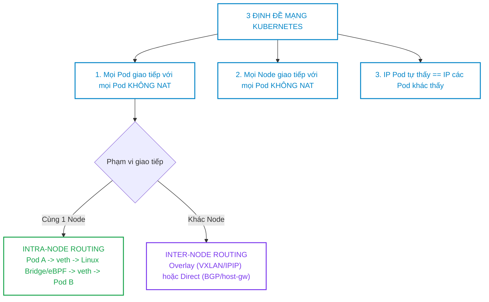
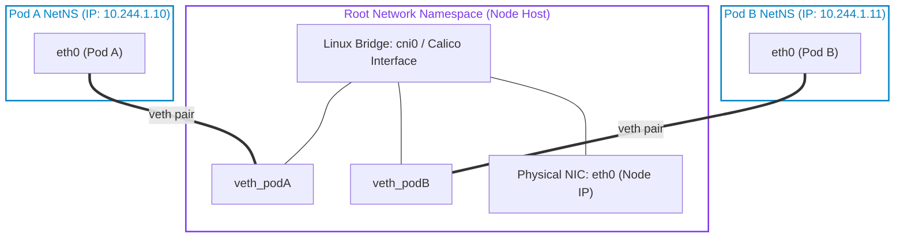
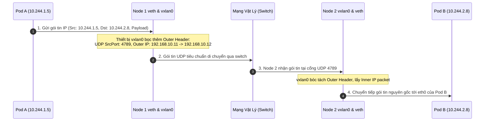
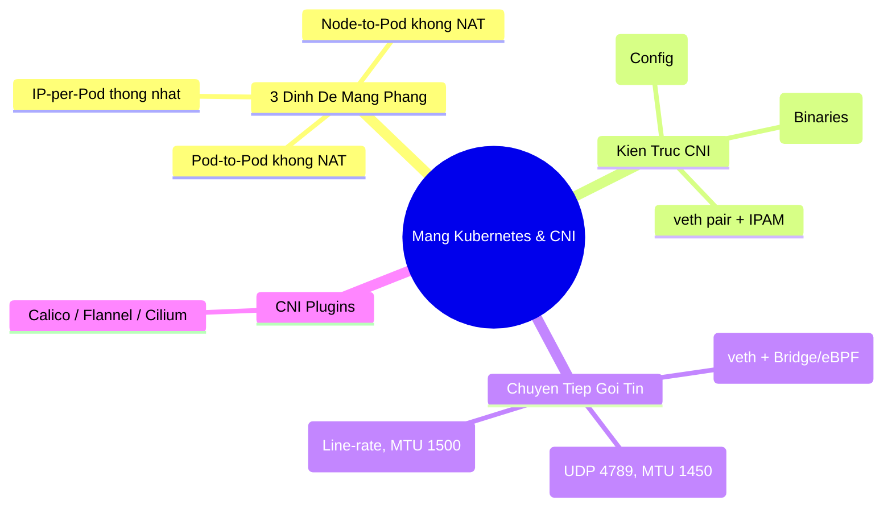


> [!IMPORTANT]
> **Mục tiêu kỹ thuật & Trọng tâm CKA**:
> - Nắm vững 3 định đề cốt lõi của Mô hình Mạng phẳng Kubernetes (Flat Network Model).
> - Hiểu rõ cấu trúc và vòng đời gọi lệnh của CNI: `/etc/cni/net.d/` và `/opt/cni/bin/`.
> - Giải phẫu chi tiết đường đi của gói tin IP qua cặp card mạng ảo `veth pair` trên Linux Kernel.
> - So sánh ưu nhược điểm giữa hai công nghệ mạng: **Overlay Network (VXLAN/Geneve)** vs **Routable Network (BGP/Host-gw)**.
> - Sử dụng `tcpdump`, `ip route`, `bridge` để bắt gói tin và chẩn đoán sự cố mất kết nối liên Node.

---

## 1. Bản Chất Kiến Trúc & Tư Duy Cốt Lõi: Ba Định Đề Mạng Phẳng

Mô hình mạng của Kubernetes được thiết kế theo triết lý **"IP-per-Pod"** — mỗi Pod nhận một địa chỉ IP duy nhất có thể định tuyến trực tiếp trong toàn cụm. Điều này loại bỏ hoàn toàn nhu cầu phải ánh xạ cổng (Port Mapping) phức tạp như thời kỳ đầu của Docker.



### 1.1. Kiến Trúc CNI (Container Network Interface)

Khi Kubelet khởi tạo một Pod:
1. Kubelet tạo một Network Namespace mới cho Pod.
2. Kubelet đọc tệp cấu hình đầu tiên theo thứ tự bảng chữ cái trong thư mục `/etc/cni/net.d/` (ví dụ: `10-calico.conflist` hoặc `10-flannel.conflist`).
3. Kubelet gọi tệp thực thi binary tương ứng trong `/opt/cni/bin/` với biến môi trường `CNI_COMMAND=ADD`.
4. CNI Plugin thực hiện:
   - Cấp phát IP từ dải `podCIDR` của Node thông qua module IPAM (`host-local` hoặc `calico-ipam`).
   - Tạo cặp card mạng ảo **veth pair** (1 đầu nằm trong Pod gắn tên `eth0`, 1 đầu cắm vào Root Network Namespace của Node dạng `vethxxxx`).
   - Thiết lập bảng định tuyến và cấu hình tường lửa iptables/eBPF trên Node.



---

## 2. Bảng Ma Trận So Sánh Kỹ Thuật Toàn Diện (Engineering Matrix)

Bảng đối chiếu giữa 2 công nghệ chuyển tiếp gói tin: **Overlay Network** vs **Direct Routing**:

| Tiêu Chí Kỹ Thuật | Overlay Network (VXLAN / Geneve / IPIP) | Direct Routing (BGP / Host-Gateway) |
| :--- | :--- | :--- |
| **Cơ chế đóng gói** | Bọc gói IP của Pod vào gói UDP cổng 4789 | Gửi gói IP nguyên gốc, Node đóng vai trò Router |
| **Hạ tầng mạng yêu cầu** | Bất kỳ hạ tầng Layer 2 hoặc Layer 3 nào | Yêu cầu các Node cùng Layer 2 Broadcast Domain hoặc Router hỗ trợ BGP Peer |
| **Hao hụt MTU Header** | **Có**: Mất 50 bytes (VXLAN) hoặc 20 bytes (IPIP)| **0 Bytes** (Duy trì trọn vẹn MTU 1500) |
| **Hiệu năng CPU** | Tốn CPU do đóng gói/giải mã (Encapsulation)| **Tối đa (Line-rate)**, độ trễ cực thấp |
| **Độ phức tạp cài đặt** | Cực kỳ đơn giản (Chạy được trên mọi Cloud/On-prem)| Cần cấu hình BGP Peering với Switch vật lý (ToR) |
| **CNI đại diện** | Flannel VXLAN, Calico VXLAN, Cilium VXLAN | Calico BGP, Flannel host-gw, AWS VPC CNI |

### 2.1. Ma Trận So Sánh Các CNI Plugins Phổ Biến

| CNI Plugin | Công nghệ Data Plane | Hỗ trợ NetworkPolicy | Công nghệ nổi bật | Phù hợp nhất cho |
| :--- | :--- | :--- | :--- | :--- |
| **Flannel** | VXLAN / host-gw | **Không** (Cần cài thêm Canal)| Rất nhẹ, đơn giản, dễ cài | Học tập, cụm nhỏ, kiểm thử |
| **Calico** | BGP / VXLAN / eBPF | **Rất mạnh** (Rich policy)| IPAM thông minh, hiệu năng cao | Doanh nghiệp chuẩn, CKA Exam |
| **Cilium** | eBPF thuần (XDP) | **Cực mạnh** (Layer 7 API)| Thay thế kube-proxy, Hubble UI | High-scale, Cloud-native Security|
| **AWS VPC CNI** | AWS ENI Direct IP | Qua AWS Security Groups | Gán thẳng IP phụ của VPC vào Pod | Cụm thuần AWS EKS |

---

## 3. Kiến Trúc Luồng Gói Tin Liên Node (Inter-Node Packet Flow)

### 3.1. Luồng Gói Tin Qua Đường Hầm Overlay VXLAN

Giả sử Pod A (IP `10.244.1.5` trên Node 1 `192.168.10.11`) gửi request tới Pod B (IP `10.244.2.8` trên Node 2 `192.168.10.12`):



---

## 4. Phân Tích Cạm Bẫy Thực Chiến: Sự Cố CNI & Nghẽn Mạng MTU

### Tình huống 1: Lỗi Silent Packet Drop do sai lệch MTU trên VXLAN Overlay

Ứng dụng web hoạt động bình thường với các API nhỏ (JSON 1KB). Nhưng khi người dùng upload file 5MB hoặc thực hiện TLS Handshake với Certificate lớn, kết nối bị treo vô tận và timeout mà không có log lỗi rõ ràng.

### Hậu Quả & Log Lỗi Thực Tế:

```text
# Log Client gửi request lớn bị treo:
curl: (28) Operation timed out after 30001 milliseconds with 0 bytes received

# Kiểm tra MTU card vật lý eth0 và card ảo vxlan:
$ ip link show eth0
2: eth0: <BROADCAST,MULTICAST,UP,LOWER_UP> mtu 1500 ...
$ ip link show flannel.1
4: flannel.1: <BROADCAST,MULTICAST,UP,LOWER_UP> mtu 1500 # SAI! Phải là 1450
```

### 5-Whys Root Cause Analysis:
1. **Tại sao kết nối lớn bị timeout?** -> Các gói tin TCP lớn đạt kích thước 1500 bytes bị rớt dọc đường.
2. **Tại sao bị rớt?** -> Kích thước gói tin sau khi bọc thêm VXLAN Header (50 bytes) vọt lên 1550 bytes, vượt quá MTU 1500 của switch mạng vật lý.
3. **Tại sao gói tin không tự phân mảnh (Fragmentation)?** -> Cờ DF (Don't Fragment) trong TCP handshake ngăn cản việc phân mảnh gói tin.
4. **Tại sao card vxlan lại có MTU 1500?** -> CNI plugin được cấu hình tự động nhận diện sai MTU của card mạng gốc.
5. **Giải pháp khắc phục là gì?** -> Cấu hình MTU của CNI bằng: $\text{MTU}_{\text{CNI}} = \text{MTU}_{\text{Vật lý}} - 50\text{ bytes} = \mathbf{1450\text{ bytes}}$.

```diff
 # Cấu hình trong Calico/Flannel ConfigMap:
 {
   "name": "cbr0",
   "type": "flannel",
   "delegate": {
-    "mtu": 1500
+    "mtu": 1450
   }
 }
```

---

### Tình huống 2: Node rơi vào trạng thái `NotReady` do thiếu tệp cấu hình CNI

Sau khi cài đặt xong cụm bằng Kubeadm, kỹ sư kiểm tra trạng thái Node thấy toàn bộ Node đều báo `NotReady`.

### Hậu Quả & Log Lỗi Thực Tế:

```text
$ kubectl get nodes
NAME        STATUS     ROLES           AGE     VERSION
cp-01       NotReady   control-plane   5m      v1.30.0
worker-01   NotReady   <none>          3m      v1.30.0

$ kubectl describe node cp-01 | grep NetworkReady
  Ready            False   ... KubeletNotReady: container runtime network not ready: NetworkReady=false reason:NetworkPluginNotReady message:Network plugin returns error: cni plugin not initialized
```

> [!WARNING]
> Kubelet **bắt buộc cần một CNI plugin** để chuyển sang trạng thái `Ready`. Nếu thư mục `/etc/cni/net.d/` rỗng, Kubelet sẽ liên tục báo `NetworkPluginNotReady` và từ chối nhận lập lịch bất kỳ Pod nào. Cài đặt Calico hoặc Flannel manifest sẽ lập tức tạo tệp cấu hình và chuyển Node sang `Ready`.

---

## 5. Hands-on Lab: Chẩn Đoán & Khảo Sát Tầng Mạng CNI (8 Bước)

Bảng tổng hợp 8 bước thực hành:

| Bước | Thao Tác | Mục Tiêu Kỹ Thuật | Lệnh / Công Cụ |
| :--- | :--- | :--- | :--- |
| **1** | Kiểm tra cấu hình CNI trên Node | Khảo sát thư mục `/etc/cni/net.d/` | `ls -la /etc/cni/net.d/` |
| **2** | Kiểm tra các Plugin Binary | Khảo sát thư mục `/opt/cni/bin/` | `ls -la /opt/cni/bin/` |
| **3** | Khởi tạo 2 Pods trên 2 Node khác nhau| Chuẩn bị môi trường kiểm thử mạng | `kubectl apply -f cross-node.yaml` |
| **4** | Trích xuất cặp `veth` của Pod | Tìm interface veth tương ứng trên Host | `ip link`, `ethtool -S` |
| **5** | Khảo sát Bảng Định Tuyến Node | Đọc bảng route cho dải PodCIDR | `ip route show` |
| **6** | Bắt gói tin VXLAN bằng `tcpdump` | Quan sát đóng gói UDP cổng 4789 | `tcpdump -i eth0 port 4789` |
| **7** | Kiểm thử Ping liên Node | Kích hoạt lưu lượng qua đường hầm | `kubectl exec -- ping` |
| **8** | Đo lường và xác nhận MTU chuẩn | Thử nghiệm gửi gói tin đầy đủ MTU | `ping -M do -s 1422` |

---

### Bước 1 & 2: Kiểm tra thư mục cấu hình và binary CNI trên Node

Đăng nhập vào một Worker Node và kiểm tra:

```bash
ls -la /etc/cni/net.d/
ls -la /opt/cni/bin/
```

Output:
```text
/etc/cni/net.d/:
10-calico.conflist
calico-kubeconfig

/opt/cni/bin/:
bridge  calico  calico-ipam  host-local  loopback  portmap  tuning  vlan
```

---

### Bước 3: Triển khai 2 Pods cưỡng bức chạy trên 2 Node khác nhau

```bash
kubectl create namespace net-lab

cat <<EOF | kubectl apply -f -
apiVersion: v1
kind: Pod
metadata:
  name: client-pod
  namespace: net-lab
spec:
  nodeName: worker-01 # Chạy trên worker-01
  containers:
    - name: app
      image: curlimages/curl:8.4.0
      command: ["sleep", "3600"]
---
apiVersion: v1
kind: Pod
metadata:
  name: server-pod
  namespace: net-lab
spec:
  nodeName: worker-02 # Chạy trên worker-02
  containers:
    - name: app
      image: nginx:alpine
EOF
```

Lấy địa chỉ IP của 2 Pods:

```bash
kubectl get pods -n net-lab -o wide
```

Giả sử `client-pod` có IP `10.244.1.20` (trên `worker-01`) và `server-pod` có IP `10.244.2.30` (trên `worker-02`).

---

### Bước 4: Khảo sát Bảng Định Tuyến (Routing Table) trên `worker-01`

Trên máy chủ `worker-01`, chạy lệnh xem định tuyến:

```bash
ip route show
```

Output ghi nhận đường hầm chuyển tiếp sang dải IP của `worker-02`:
```text
default via 192.168.10.1 dev eth0 proto dhcp src 192.168.10.11
10.244.1.0/24 dev cni0 proto kernel scope link src 10.244.1.1
10.244.2.0/24 via 192.168.10.12 dev flannel.1 onlink # Trỏ qua IP worker-02!
```

---

### Bước 5 & 6: Bắt gói tin đóng gói VXLAN bằng `tcpdump`

Trên máy chủ `worker-01`, mở một cửa sổ terminal và lắng nghe trên cổng UDP 4789:

```bash
sudo tcpdump -i eth0 -nn -vv "udp port 4789"
```

---

### Bước 7: Thực hiện gửi request từ `client-pod` sang `server-pod`

Trên một terminal khác, thực thi `curl` giữa 2 Pods:

```bash
kubectl exec -it client-pod -n net-lab -- curl -s http://10.244.2.30 | grep -i title
```

---

### Bước 8: Quan sát Payload được đóng gói trong output của `tcpdump`

Quay lại màn hình `tcpdump`, bạn sẽ thấy gói tin đóng gói 2 tầng rõ rệt:

```text
192.168.10.11.51234 > 192.168.10.12.4789: [udp sum ok] VXLAN, flags [I] (0x08), vni 1
IP (tos 0x0, ttl 64, id 41201, offset 0, flags [DF], proto TCP (6), length 60)
    10.244.1.20.48912 > 10.244.2.30.80: Flags [S], seq 3891023812 ...
```

Phân tích: Gói tin bên trong (`10.244.1.20:48912 -> 10.244.2.30:80`) đã được bọc hoàn toàn bên trong gói tin bên ngoài (`192.168.10.11:51234 -> 192.168.10.12:4789`).

---

## 6. 10 Câu Hỏi Tự Kiểm Tra Chuyên Sâu (Self-Check Q&A Accordion)

<details class="qa-card">
  <summary><b>Câu 1: Ba định đề nền tảng trong Mô hình Mạng của Kubernetes là gì?</b></summary>
  <div class="qa-answer">
    <b>Trả lời:</b><br>
    <ul>
      <li>1. Mọi Pod đều có thể giao tiếp với tất cả các Pod khác trên bất kỳ Node nào mà <b>không cần dùng NAT</b> (Network Address Translation).</li>
      <li>2. Mọi tiến trình chạy trên Node (như Kubelet, daemons) đều có thể giao tiếp với toàn bộ các Pods trên Node đó mà <b>không cần NAT</b>.</li>
      <li>3. Địa chỉ IP mà Pod tự nhìn thấy trên card mạng <code>eth0</code> của chính nó phải <b>trùng khớp hoàn toàn</b> với địa chỉ IP mà các Pod khác nhìn thấy khi giao tiếp với nó.</li>
    </ul>
  </div>
</details>

<details class="qa-card">
  <summary><b>Câu 2: Hai thư mục chuẩn trên hệ thống Linux lưu trữ cấu hình và các tệp thực thi của CNI là gì?</b></summary>
  <div class="qa-answer">
    <b>Trả lời:</b><br>
    <ul>
      <li><b>Thư mục cấu hình:</b> <code>/etc/cni/net.d/</code> (chứa các tệp JSON hoặc <code>.conflist</code> định nghĩa danh sách plugin và tham số IPAM).</li>
      <li><b>Thư mục binary thực thi:</b> <code>/opt/cni/bin/</code> (chứa các chương trình thực thi như <code>bridge</code>, <code>loopback</code>, <code>calico</code>, <code>flannel</code>, <code>host-local</code>).</li>
    </ul>
  </div>
</details>

<details class="qa-card">
  <summary><b>Câu 3: Cặp card mạng ảo veth pair hoạt động theo cơ chế nào trong Linux Kernel?</b></summary>
  <div class="qa-answer">
    <b>Trả lời:</b><br>
    <code>veth pair</code> (Virtual Ethernet Pair) hoạt động như một ống nối hai đầu (bi-directional pipe). Bất kỳ gói tin nào được đẩy vào đầu này sẽ lập tức xuất hiện ở đầu kia. Kubernetes sử dụng veth pair để nối giữa card mạng <code>eth0</code> bên trong Network Namespace riêng biệt của Pod với Root Network Namespace của máy chủ Node.
  </div>
</details>

<details class="qa-card">
  <summary><b>Câu 4: Sự khác biệt bản chất giữa mạng Overlay (VXLAN) và mạng Định tuyến Trực tiếp (BGP/host-gw) là gì?</b></summary>
  <div class="qa-answer">
    <b>Trả lời:</b><br>
    <ul>
      <li><b>Overlay (VXLAN):</b> Đóng gói toàn bộ gói tin IP của Pod vào bên trong một gói UDP (thường dùng cổng 4789) giữa các Node. Hoạt động trên mọi hạ tầng mạng nhưng bị hao hụt 50 bytes MTU do phần header đóng gói.</li>
      <li><b>Direct Routing (BGP):</b> Không đóng gói; các Node đóng vai trò là Router quảng bá dải PodCIDR cho nhau qua giao thức BGP. Giữ nguyên 100% MTU 1500 và cho hiệu năng tối đa (Line-rate) nhưng đòi hỏi hạ tầng mạng vật lý hỗ trợ.</li>
    </ul>
  </div>
</details>

<details class="qa-card">
  <summary><b>Câu 5: Tại sao việc cấu hình sai MTU trên mạng VXLAN lại gây ra hiện tượng treo kết nối khi truyền tải tệp tin lớn?</b></summary>
  <div class="qa-answer">
    <b>Trả lời:</b><br>
    Vì VXLAN header chiếm thêm 50 bytes. Nếu card mạng của Pod đặt MTU là 1500, khi đóng gói VXLAN tổng kích thước gói tin sẽ là 1550 bytes, vượt quá MTU 1500 của switch mạng vật lý. Do các gói tin TCP thường bật cờ Don't Fragment (DF), switch mạng sẽ âm thầm hủy gói tin mà không gửi cảnh báo, dẫn đến việc các kết nối payload lớn bị nghẽn và timeout vô tận.
  </div>
</details>

<details class="qa-card">
  <summary><b>Câu 6: Vai trò của module IPAM (IP Address Management) trong CNI plugin là gì?</b></summary>
  <div class="qa-answer">
    <b>Trả lời:</b><br>
    IPAM phụ trách việc cấp phát, theo dõi và thu hồi các địa chỉ IP cho Pod từ dải mạng con (Subnet/PodCIDR) được chỉ định cho từng Node, đảm bảo không có 2 Pod nào bị trùng lặp IP trong cùng một cụm. Các plugin IPAM phổ biến gồm <code>host-local</code> và <code>calico-ipam</code>.
  </div>
</details>

<details class="qa-card">
  <summary><b>Câu 7: Cổng mạng UDP tiêu chuẩn được giao thức đóng gói VXLAN sử dụng để truyền tải dữ liệu liên Node là bao nhiêu?</b></summary>
  <div class="qa-answer">
    <b>Trả lời:</b><br>
    Cổng tiêu chuẩn theo chuẩn IANA là <b>UDP 4789</b> (một số triển khai Linux kernel cũ có thể sử dụng cổng UDP 8472).
  </div>
</details>

<details class="qa-card">
  <summary><b>Câu 8: Khi Kubelet gọi CNI Plugin để tạo mạng cho Pod, các biến môi trường chính nào được truyền vào?</b></summary>
  <div class="qa-answer">
    <b>Trả lời:</b><br>
    Kubelet truyền các biến môi trường chuẩn:<br>
    <ul>
      <li><code>CNI_COMMAND</code>: Thao tác cần thực hiện (<code>ADD</code>, <code>DEL</code>, hoặc <code>CHECK</code>).</li>
      <li><code>CNI_CONTAINERID</code>: ID định danh của container.</li>
      <li><code>CNI_NETNS</code>: Đường dẫn tới file Network Namespace của Pod (<code>/proc/$PID/ns/net</code>).</li>
      <li><code>CNI_IFNAME</code>: Tên card mạng cần tạo bên trong Pod (mặc định là <code>eth0</code>).</li>
    </ul>
  </div>
</details>

<details class="qa-card">
  <summary><b>Câu 9: Flannel CNI có hỗ trợ tính năng NetworkPolicy để chặn lưu lượng mạng giữa các Pod không?</b></summary>
  <div class="qa-answer">
    <b>Trả lời:</b><br>
    <b>KHÔNG</b>. Bản thân Flannel chỉ tập trung vào việc cấp phát dải IP và chuyển tiếp gói tin (Data Plane). Để áp dụng NetworkPolicy khi dùng Flannel, bạn bắt buộc phải cài thêm một Network Policy Controller độc lập (ví0 dụ: Calico chạy ở chế độ Policy-Only, tạo thành dự án <b>Canal</b>).
  </div>
</details>

<details class="qa-card">
  <summary><b>Câu 10: Công nghệ eBPF trong các CNI hiện đại như Cilium hoặc Calico eBPF Mode mang lại ưu thế gì so với iptables truyền thống?</b></summary>
  <div class="qa-answer">
    <b>Trả lời:</b><br>
    eBPF cho phép thực thi mã bytecode trực tiếp bên trong Linux Kernel tại tầng socket và network driver (XDP), giúp xử lý gói tin với độ phức tạp thuật toán <b>$O(1)$</b> thay vì phải duyệt tuần tự qua hàng nghìn quy tắc iptables dạng chuỗi $O(N)$, mang lại độ trễ cực thấp và tiết kiệm đáng kể CPU khi cụm có quy mô hàng chục nghìn Services.
  </div>
</details>

---

## 7. Tổng Kết & Lộ Trình Bài Học Tiếp Theo



Làm chủ mô hình mạng phẳng và hiểu sâu sắc cơ chế đóng gói của CNI là nền tảng kỹ thuật vững chắc giúp bạn tự tin thiết kế, tối ưu hóa và xử lý mọi sự cố kết nối phức tạp trên cụm Kubernetes.

> [!TIP]
> **Bài học tiếp theo**: Trong [Bài 22: Dịch Vụ Mạng Service & Các Chế Độ Kube-Proxy: iptables, IPVS & eBPF](cka-22-22-service-va-kube-proxy.html), chúng ta sẽ phân tích cách Kubernetes cân bằng tải lưu lượng nội bộ tới các Pods thông qua Service (ClusterIP, NodePort, LoadBalancer), cơ chế hoạt động của EndpointSlice và giải mã hiệu năng giữa iptables vs IPVS mode.

