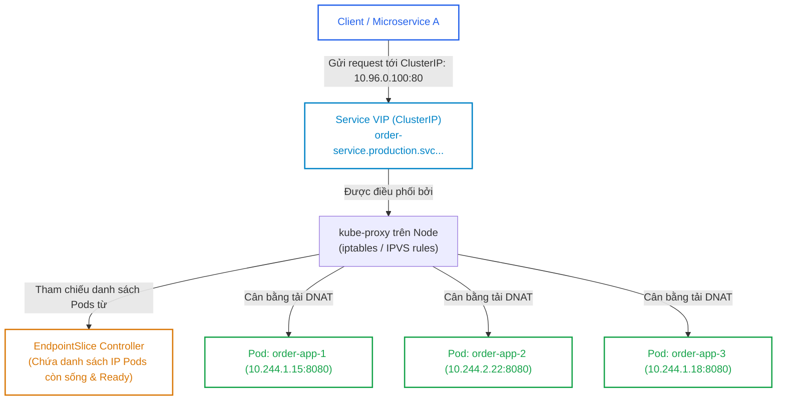
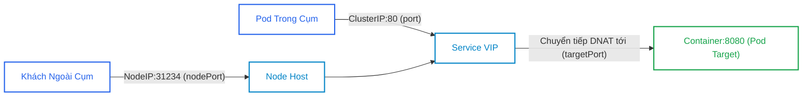


> [!IMPORTANT]
> **Mục tiêu kỹ thuật & Trọng tâm CKA**:
> - Hiểu rõ mối quan hệ giữa `port` (Cổng Service), `targetPort` (Cổng Container trong Pod) và `nodePort` (Cổng vật lý của Node).
> - Nắm vững cơ chế ghép nối Pods thông qua `spec.selector` và đối tượng `EndpointSlice`.
> - Tạo Service thủ công không có selector (`Service without selector`) để trỏ tới cơ sở dữ liệu ngoài cụm.
> - So sánh chi tiết hiệu năng và cơ chế hoạt động của `kube-proxy` chế độ `iptables` vs `IPVS`.
> - Làm chủ cấu hình `externalTrafficPolicy: Local` và kiểm tra bảng định tuyến iptables/IPVS thực tế.

---

## 1. Bản Chất Kiến Trúc & Tư Duy Cốt Lõi: Tại Sao Cần Kubernetes Service?

Trong Kubernetes, các Pods có tính chất phù du (Ephemeral Lifecycle) — chúng có thể bị tiêu diệt, khởi động lại hoặc scale tự động bất cứ lúc nào. Mỗi khi Pod mới sinh ra, nó nhận một địa chỉ IP mới hoàn toàn khác.

Nếu các ứng dụng khác kết nối trực tiếp tới IP của Pod, kết nối sẽ bị đứt gãy liên tục. **Service** ra đời để cung cấp một điểm truy cập trừu tượng duy nhất: **một địa chỉ IP ảo (ClusterIP VIP)** và một **tên miền DNS cố định**.



### 1.1. Giải Phẫu 3 Khái Niệm Cổng: `port`, `targetPort`, `nodePort`

Một trong những điểm gây nhầm lẫn lớn nhất trong cấu hình Service là sự khác biệt giữa các cổng:

```yaml
spec:
  type: NodePort
  ports:
    - port: 80         # 1. CỔNG CỦA SERVICE: Client bên trong cụm gọi vào ClusterIP:80
      targetPort: 8080 # 2. CỔNG CỦA CONTAINER: Ứng dụng thực sự lắng nghe trong Pod
      nodePort: 31234  # 3. CỔNG CỦA MÁY CHỦ NODE: Khách ngoài cụm gọi vào NodeIP:31234
```



---

## 2. Bảng Ma Trận So Sánh Kỹ Thuật Toàn Diện (Engineering Matrix)

Bảng đối chiếu 4 loại Service chính trong Kubernetes:

| Tiêu Chí Kỹ Thuật | ClusterIP (Mặc định) | NodePort | LoadBalancer | ExternalName |
| :--- | :--- | :--- | :--- | :--- |
| **Phạm vi truy cập** | Chỉ bên trong cụm (Internal Only)| Mở cổng trên mọi Node | Từ ngoài Internet / Mạng ngoài | Định tuyến CNAME ra ngoài |
| **Dải cổng phân bổ** | Cổng bất kỳ (1 - 65535) | Cố định trong dải `30000 - 32767`| Cổng bất kỳ (80, 443...) | Không áp dụng (DNS thuần) |
| **Tích hợp Cloud Provider**| Không | Không | Cần Cloud Controller / MetalLB| Không |
| **Chi phí hạ tầng** | Miễn phí | Miễn phí | Tốn phí thuê Cloud Load Balancer| Miễn phí |
| **Mục đích chính** | Giao tiếp Microservice nội bộ | Dev/Test, Ingress NodePort | Production Public Web Traffic | Tích hợp DB ngoài (AWS RDS...)|

### 2.1. So Sánh Hai Chế Độ Kube-Proxy: `iptables` vs `IPVS`

| Tiêu Chí So Sánh | Kube-Proxy chế độ `iptables` | Kube-Proxy chế độ `IPVS` |
| :--- | :--- | :--- |
| **Cơ sở dữ liệu Kernel** | Chuỗi quy tắc tuần tự (Sequential Chain)| Bảng băm bộ nhớ (Hash Table) |
| **Độ phức tạp thuật toán** | **$O(N)$** (Chậm dần khi số Service tăng)| **$O(1)$** (Tốc độ không đổi bất kể quy mô) |
| **Thuật toán Cân bằng tải** | Chỉ hỗ trợ Random (Xác suất ngẫu nhiên)| Rất đa dạng: `rr` (Round-Robin), `lc` (Least Connection), `dh`, `sh` |
| **Tài nguyên CPU khi cập nhật**| Cao (Phải ghi đè lại toàn bộ bảng iptables)| Rất thấp (Chỉ thêm/xóa 1 entry trong Hash Table)|
| **Quy mô khuyến nghị** | Cụm < 1,000 Services | Cụm lớn > 1,000 - 10,000 Services |

---

## 3. Cấu Trúc Khai Báo Manifest & Chi Tiết Kỹ Thuật

### 3.1. Service Chuẩn Kết Hợp EndpointSlice Tự Động

```yaml
apiVersion: v1
kind: Service
metadata:
  name: payment-service
  namespace: production
spec:
  type: ClusterIP
  selector:
    app: payment-api # Tự động tạo EndpointSlice khớp với Pod có nhãn này
  ports:
    - name: http
      protocol: TCP
      port: 80
      targetPort: 8080
---
apiVersion: apps/v1
kind: Deployment
metadata:
  name: payment-api
  namespace: production
spec:
  replicas: 3
  selector:
    matchLabels:
      app: payment-api
  template:
    metadata:
      labels:
        app: payment-api
    spec:
      containers:
        - name: app
          image: nginx:alpine
          ports:
            - containerPort: 8080
```

### 3.2. Service Không Có Selector (Custom Endpoints Trỏ Ngoài Cụm)

Kỹ thuật kết nối an toàn tới Cơ sở dữ liệu Oracle / PostgreSQL bên ngoài cụm Kubernetes:

```yaml
apiVersion: v1
kind: Service
metadata:
  name: external-oracle-db
  namespace: production
spec:
  ports:
    - port: 1521
      targetPort: 1521
# KHÔNG có spec.selector -> Service không tự tạo Endpoints
---
apiVersion: v1
kind: Endpoints
metadata:
  name: external-oracle-db # Bắt buộc phải trùng tên với Service
  namespace: production
subsets:
  - addresses:
      - ip: 192.168.1.200  # IP máy chủ vật lý bên ngoài
      - ip: 192.168.1.201
    ports:
      - port: 1521
```

---

## 4. Phân Tích Cạm Bẫy Thực Chiến: Mất Client IP & Lỗi TargetPort

### Tình huống 1: Mất địa chỉ IP gốc của khách hàng (SNAT Issue)

Ứng dụng yêu cầu kiểm tra Client IP để phòng chống gian lận (Geo-blocking). Khi triển khai Service kiểu `NodePort` hoặc `LoadBalancer`, log ứng dụng chỉ ghi nhận toàn bộ request đều đến từ địa chỉ IP nội bộ của Node (`10.244.x.x` hoặc `192.168.10.x`).

### Hậu Quả & Log Lỗi Thực Tế:

```text
# NGINX Access Log trong Pod:
10.244.1.1 - - [16/Sep/2026:03:30:15 +0000] "POST /checkout HTTP/1.1" 200 452 
# Client IP thực tế (203.0.113.88) đã bị thay thế hoàn toàn bởi IP của Node!
```

### 5-Whys Root Cause Analysis:
1. **Tại sao Client IP bị mất?** -> Gói tin đã bị Source Network Address Translation (SNAT).
2. **Tại sao lại bị SNAT?** -> Request đi vào Node A nhưng Pod xử lý lại nằm trên Node B.
3. **Tại sao Node A phải SNAT?** -> Để khi Pod trên Node B phản hồi, gói tin quay lại Node A trước khi gửi trả khách hàng (tránh asymmetric routing).
4. **Tại sao lại có hành vi này?** -> Cấu hình mặc định `externalTrafficPolicy: Cluster` cân bằng tải trên mọi Node.
5. **Giải pháp khắc phục là gì?** -> Thiết lập `externalTrafficPolicy: Local`. Node A chỉ chuyển request cho Pods nằm cục bộ trên Node A, giữ nguyên vẹn 100% Client IP gốc.

```diff
 spec:
   type: NodePort
+  externalTrafficPolicy: Local
   ports:
     - port: 80
       targetPort: 80
```

---

### Tình huống 2: Nhầm lẫn giữa `port` và `targetPort` khiến Service trả về HTTP 502/Connection Refused

Kỹ sư tạo Service `port: 80`, nhưng quên không khai báo `targetPort: 8080` trong khi Container bên trong Pod chạy ở cổng `8080`.

### Hậu Quả & Log Lỗi Thực Tế:

```text
$ curl http://payment-service.production.svc
curl: (7) Failed to connect to payment-service.production.svc port 80: Connection refused
```

Nguyên nhân: Khi không khai báo `targetPort`, Kubernetes mặc định gán `targetPort = port` (cổng 80). Gói tin gửi tới cổng 80 của Container trong khi Container đang lắng nghe ở 8080, dẫn đến việc Kernel từ chối kết nối ngay lập tức.

---

## 5. Hands-on Lab: Triển Khai & Kiểm Định Service Chuyên Sâu (8 Bước)

Bảng tổng hợp 8 bước thực hành:

| Bước | Thao Tác | Mục Tiêu Kỹ Thuật | Lệnh / Công Cụ |
| :--- | :--- | :--- | :--- |
| **1** | Khởi tạo Namespace Lab | Thiết lập môi trường thử nghiệm | `kubectl create ns svc-lab` |
| **2** | Triển khai Backend Web Deployment | Tạo 3 bản sao Pods Nginx | `kubectl create deployment` |
| **3** | Tạo Service ClusterIP Imperative | Expose deployment thành ClusterIP | `kubectl expose deployment` |
| **4** | Kiểm tra EndpointSlice API | Xác minh danh sách IP Pods tự động | `kubectl get endpointslices` |
| **5** | Tạo Service NodePort Cố Định | Mở cổng ngoài `31080` trên các Node | `kubectl apply -f nodeport.yaml` |
| **6** | Kiểm thử Truy cập qua NodePort | Gửi request tới IP máy chủ vật lý | `curl <NodeIP>:31080` |
| **7** | Tạo Service Không Selector | Trỏ Service vào IP ngoài cụm | `kubectl apply -f external-svc.yaml` |
| **8** | Khảo sát Bảng iptables của Kube-Proxy| Soi các chuỗi `KUBE-SERVICES` | `sudo iptables-save | grep KUBE` |

---

### Bước 1: Khởi tạo Namespace

```bash
kubectl create namespace svc-lab
```

---

### Bước 2: Triển khai Deployment gồm 3 Pods

```bash
kubectl create deployment web-backend \
  --image=nginx:alpine \
  --replicas=3 \
  --namespace=svc-lab
```

---

### Bước 3: Tạo Service ClusterIP nội bộ

```bash
kubectl expose deployment web-backend \
  --port=80 \
  --target-port=80 \
  --name=web-service \
  --namespace=svc-lab
```

Kiểm tra địa chỉ VIP được cấp phát:

```bash
kubectl get svc web-service -n svc-lab
```

Output:
```text
NAME          TYPE        CLUSTER-IP     EXTERNAL-IP   PORT(S)   AGE
web-service   ClusterIP   10.96.120.45   <none>        80/TCP    15s
```

---

### Bước 4: Kiểm tra đối tượng EndpointSlice tương ứng

```bash
kubectl get endpointslices -n svc-lab -l kubernetes.io/service-name=web-service
```

Output xác nhận danh sách 3 IP của 3 Pods:
```text
NAME                  ADDRESSTYPE   PORTS   ENDPOINTS                            AGE
web-service-7x8k2     IPv4          80      10.244.1.25,10.244.2.18,10.244.2.19   30s
```

---

### Bước 5: Tạo Service kiểu NodePort mở cổng 31080

```bash
cat <<EOF | kubectl apply -f -
apiVersion: v1
kind: Service
metadata:
  name: web-nodeport
  namespace: svc-lab
spec:
  type: NodePort
  selector:
    app: web-backend
  ports:
    - port: 80
      targetPort: 80
      nodePort: 31080
EOF
```

---

### Bước 6: Kiểm thử truy cập từ bên ngoài qua địa chỉ IP của Node

```bash
# Lấy IP của Worker Node
NODE_IP=$(kubectl get nodes -o jsonpath='{.items[1].status.addresses[?(@.type=="InternalIP")].address}')

# Gửi HTTP request tới cổng 31080
curl -I http://$NODE_IP:31080
```

Output HTTP 200 OK:
```text
HTTP/1.1 200 OK
Server: nginx/1.25.3
```

---

### Bước 7: Tạo Service không có selector trỏ ra IP ngoài cụm

```bash
cat <<EOF | kubectl apply -f -
apiVersion: v1
kind: Service
metadata:
  name: external-dns-check
  namespace: svc-lab
spec:
  ports:
    - port: 53
      targetPort: 53
---
apiVersion: v1
kind: Endpoints
metadata:
  name: external-dns-check
  namespace: svc-lab
subsets:
  - addresses:
      - ip: 8.8.8.8
    ports:
      - port: 53
EOF
```

Kiểm tra: Service `external-dns-check` liên kết thành công với IP `8.8.8.8`:

```bash
kubectl get endpoints external-dns-check -n svc-lab
```

---

### Bước 8: Khảo sát quy tắc iptables của `kube-proxy` trên Worker Node

Đăng nhập vào Worker Node và kiểm tra các chuỗi NAT:

```bash
sudo iptables-save -t nat | grep "svc-lab/web-service"
```

Output hiển thị quy tắc cân bằng tải xác suất (Probability):
```text
-A KUBE-SVC-XYZ -m statistic --mode random --probability 0.3333333333 -j KUBE-SEP-POD1
-A KUBE-SVC-XYZ -m statistic --mode random --probability 0.5000000000 -j KUBE-SEP-POD2
-A KUBE-SVC-XYZ -j KUBE-SEP-POD3
```

---

## 6. 10 Câu Hỏi Tự Kiểm Tra Chuyên Sâu (Self-Check Q&A Accordion)

<details class="qa-card">
  <summary><b>Câu 1: Bốn loại Service chuẩn trong Kubernetes là gì và loại nào là mặc định khi tạo Service?</b></summary>
  <div class="qa-answer">
    <b>Trả lời:</b><br>
    Bốn loại Service chuẩn bao gồm: <code>ClusterIP</code>, <code>NodePort</code>, <code>LoadBalancer</code>, và <code>ExternalName</code>.<br>
    Trong đó, <b>ClusterIP</b> là loại mặc định nếu người dùng không chỉ định trường <code>spec.type</code>.
  </div>
</details>

<details class="qa-card">
  <summary><b>Câu 2: Dải cổng mặc định được cấp phát cho Service kiểu NodePort là bao nhiêu và có thể thay đổi được không?</b></summary>
  <div class="qa-answer">
    <b>Trả lời:</b><br>
    Dải cổng mặc định là <b>30000 đến 32767</b>. Có thể thay đổi dải cổng này thông qua việc cấu hình cờ <code>--service-node-port-range</code> trên <code>kube-apiserver</code>.
  </div>
</details>

<details class="qa-card">
  <summary><b>Câu 3: Đối tượng EndpointSlice mang lại ưu thế gì so với đối tượng Endpoints truyền thống?</b></summary>
  <div class="qa-answer">
    <b>Trả lời:</b><br>
    Đối tượng <code>Endpoints</code> truyền thống lưu toàn bộ IP của tất cả các Pod trong một đối tượng đơn lẻ; khi có 1 Pod thay đổi, toàn bộ danh sách phải gửi lại qua API Server gây nghẽn etcd. <code>EndpointSlice</code> chia nhỏ danh sách IP thành từng phần (mặc định tối đa <b>100 endpoints</b> mỗi slice), giúp giảm tải băng thông mạng và tối ưu hóa hiệu năng cập nhật của <code>kube-proxy</code> trên các cụm quy mô lớn.
  </div>
</details>

<details class="qa-card">
  <summary><b>Câu 4: Khi nào cần tạo một Service KHÔNG CÓ spec.selector?</b></summary>
  <div class="qa-answer">
    <b>Trả lời:</b><br>
    Khi bạn muốn định tuyến lưu lượng từ bên trong cụm Kubernetes tới một dịch vụ nằm <b>bên ngoài cụm</b> (ví dụ: máy chủ Database vật lý, dịch vụ của bên thứ 3, hoặc hệ thống ở Namespace/Cluster khác) mà vẫn muốn duy trì tên miền DNS nội bộ ổn định. Bạn tạo Service không có selector và tự tạo đối tượng <code>Endpoints</code> thủ công cùng tên.
  </div>
</details>

<details class="qa-card">
  <summary><b>Câu 5: Cơ chế hoạt động của Service loại ExternalName có gì đặc biệt so với các loại Service khác?</b></summary>
  <div class="qa-answer">
    <b>Trả lời:</b><br>
    Service loại <code>ExternalName</code> không có ClusterIP, không có Endpoints và <b>không qua kube-proxy</b>. Khi một Pod truy vấn DNS của Service này, CoreDNS sẽ trực tiếp trả về một bản ghi <b>CNAME</b> trỏ tới tên miền bên ngoài (ví dụ: <code>my-db.rds.amazonaws.com</code>). Việc chuyển hướng hoàn toàn diễn ra ở tầng DNS mà không tốn tài nguyên proxy.
  </div>
</details>

<details class="qa-card">
  <summary><b>Câu 6: Thiết lập externalTrafficPolicy: Local giúp giải quyết bài toán gì và có đánh đổi gì về cân bằng tải?</b></summary>
  <div class="qa-answer">
    <b>Trả lời:</b><br>
    <ul>
      <li><b>Lợi ích:</b> Loại bỏ hoàn toàn việc SNAT giữa các Node, <b>bảo toàn 100% Client Source IP</b> của người dùng và giảm 1 chặng chuyển tiếp mạng (1-hop latency reduction).</li>
      <li><b>Đánh đổi:</b> Lưu lượng có thể bị mất cân bằng (Imbalance) nếu số lượng Pod phân bổ không đều giữa các Node, và nếu request gửi vào một Node không chứa bất kỳ Pod nào của Service thì kết nối sẽ bị từ chối/rớt gói tin.</li>
    </ul>
  </div>
</details>

<details class="qa-card">
  <summary><b>Câu 7: Điểm khác biệt căn bản giữa 3 cổng port, targetPort và nodePort trong cấu hình Service là gì?</b></summary>
  <div class="qa-answer">
    <b>Trả lời:</b><br>
    <ul>
      <li><b>port:</b> Cổng đại diện của Service VIP mà các Pod khác bên trong cụm gọi tới.</li>
      <li><b>targetPort:</b> Cổng thực tế mà Container bên trong Pod đang lắng nghe xử lý.</li>
      <li><b>nodePort:</b> Cổng tĩnh được mở trên toàn bộ các máy chủ Worker Node để client ngoài cụm gọi vào.</li>
    </ul>
  </div>
</details>

<details class="qa-card">
  <summary><b>Câu 8: Tại sao Kube-Proxy chế độ IPVS lại cho hiệu năng vượt trội hơn chế độ iptables khi cụm có quy mô lớn?</b></summary>
  <div class="qa-answer">
    <b>Trả lời:</b><br>
    Kube-Proxy chế độ <code>iptables</code> lưu các quy tắc dưới dạng danh sách liên kết tuyến tính (Linear Chain) với độ phức tạp tìm kiếm <b>$O(N)$</b>. Trong khi đó, chế độ <code>IPVS</code> sử dụng <b>Bảng băm trong bộ nhớ (Hash Table)</b> với độ phức tạp <b>$O(1)$</b>, đảm bảo thời gian xử lý gói tin và định tuyến không bị suy giảm dù cụm có tới hàng chục nghìn Services.
  </div>
</details>

<details class="qa-card">
  <summary><b>Câu 9: Headless Service (clusterIP: None) trả về dữ liệu gì khi Pod truy vấn DNS?</b></summary>
  <div class="qa-answer">
    <b>Trả lời:</b><br>
    Thay vì trả về một địa chỉ IP ảo ClusterIP duy nhất, CoreDNS sẽ trả về trực tiếp <b>danh sách các bản ghi A record chứa IP thực tế của tất cả các Pod</b> đang hoạt động và đạt chuẩn Readiness của Service đó, cho phép Client tự thực hiện cân bằng tải phía client hoặc thiết lập kết nối trực tiếp (thường dùng trong StatefulSet).
  </div>
</details>

<details class="qa-card">
  <summary><b>Câu 10: Nếu một Service có sessionAffinity: ClientIP thì hành vi cân bằng tải của Kube-Proxy thay đổi như thế nào?</b></summary>
  <div class="qa-answer">
    <b>Trả lời:</b><br>
    Mặc định, Kube-Proxy cân bằng tải ngẫu nhiên theo từng kết nối. Khi cấu hình <code>sessionAffinity: ClientIP</code>, Kube-Proxy sẽ đảm bảo mọi request xuất phát từ cùng một địa chỉ IP client sẽ luôn được định tuyến cố định tới <b>cùng một Pod backend duy nhất</b> (Sticky Session) trong suốt khoảng thời gian timeout được chỉ định (mặc định 10800 giây = 3 giờ).
  </div>
</details>

---

## 7. Tổng Kết & Lộ Trình Bài Học Tiếp Theo

```mermaid
mindmap
  root((Kubernetes Service))
    4 Loai Service
      ClusterIP (Internal VIP)
      NodePort (Port 30000-32767)
      LoadBalancer (Cloud LB / MetalLB)
      ExternalName (CNI CNAME)
    3 Khai Niem Cong
      port (Service VIP)
      targetPort (Container Port)
      nodePort (Host Port)
    Kube-Proxy Engine
      EndpointSlice (Nhom 100 endpoints)
      iptables Mode (O(N) Chain)
      IPVS Mode (O(1) Hash Table)
      externalTrafficPolicy (Local vs Cluster)
```

Hiểu sâu sắc cách thức hoạt động của Service, EndpointSlice và cơ chế cân bằng tải của Kube-Proxy là điều kiện tiên quyết để xây dựng hệ thống mạng phân tán hiệu năng cao, ổn định và không bị gián đoạn kết nối.

> [!TIP]
> **Bài học tiếp theo**: Trong [Bài 23: CoreDNS & Phân Giải Tên Miền Trong Cụm: Kiến Trúc Corefile, ndots:5 & Tối Ưu Hóa Truy Vấn DNS](cka-23-23-coredns-va-phan-giai-ten.html), chúng ta sẽ giải phẫu chi tiết máy chủ phân giải tên miền CoreDNS, cấu trúc FQDN chuẩn của Service/Pod, và giải quyết triệt để vấn đề nghẽn DNS do thông số `ndots:5` gây ra.

