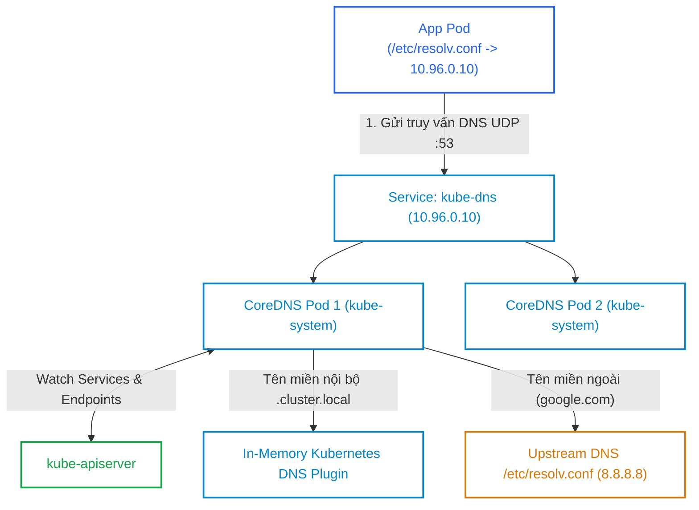
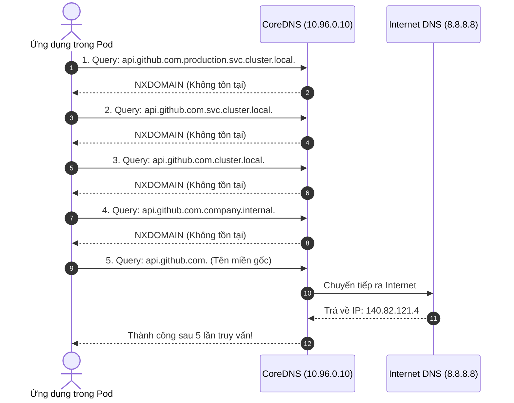
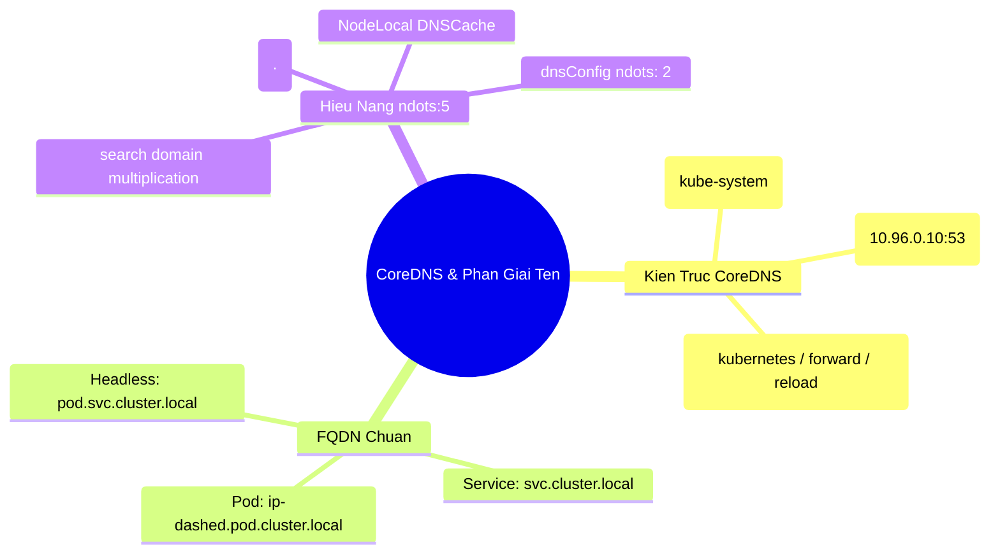


> [!IMPORTANT]
> **Mục tiêu kỹ thuật & Trọng tâm CKA**:
> - Hiểu rõ cấu trúc tệp cấu hình `Corefile` trong ConfigMap `coredns` (plugins: `kubernetes`, `forward`, `cache`, `loop`, `reload`).
> - Nắm vững định dạng FQDN cho Service thường, Headless Service, SRV record và Pod IP.
> - Giải thích chi tiết chu trình tìm kiếm DNS trong `/etc/resolv.conf` với `search` và `ndots:5`.
> - Tùy biến `dnsPolicy` và `dnsConfig` trong Pod Spec để tối ưu hóa thời gian phản hồi API ngoại mạng.
> - Chẩn đoán và xử lý nhanh 4 sự cố DNS phổ biến: Loop detection CrashLoop, Corefile syntax error, Forwarding failure, và DNS Timeout.

---

## 1. Bản Chất Kiến Trúc & Tư Duy Cốt Lõi: Máy Chủ Tên Miền CoreDNS

Trong cụm Kubernetes, **CoreDNS** là máy chủ DNS có khả năng mở rộng cao, được viết bằng ngôn ngữ Go và triển khai mặc định từ phiên bản Kubernetes v1.13+. CoreDNS liên tục theo dõi (Watch) các sự kiện thêm/sửa/xóa của `Service` và `EndpointSlice` từ `kube-apiserver` để tự động cập nhật bảng phân giải tên miền trong bộ nhớ RAM.



### 1.1. Cấu Trúc Khai Báo FQDN Chuẩn (Fully Qualified Domain Name)

| Đối Tượng | Cấu Trúc FQDN Hoàn Chỉnh | Bản Ghi Trả Về | Ví Dụ Cụ Thể |
| :--- | :--- | :--- | :--- |
| **Service Thường** | `<service>.<namespace>.svc.cluster.local` | **A Record** -> ClusterIP | `payment-svc.production.svc.cluster.local` |
| **Headless Service**| `<service>.<namespace>.svc.cluster.local` | **A Records** -> Danh sách Pod IPs | `db-cluster.database.svc.cluster.local` |
| **StatefulSet Pod** | `<pod-name>.<headless-svc>.<namespace>.svc.cluster.local` | **A Record** -> Đúng IP của Pod đó | `db-0.db-cluster.database.svc.cluster.local` |
| **Pod IP Thường** | `<ip-dashed>.<namespace>.pod.cluster.local`| **A Record** -> IP của Pod | `10-244-1-15.default.pod.cluster.local` |
| **Cổng Service SRV**| `_<port-name>._<proto>.<svc>.<ns>.svc.cluster.local` | **SRV Record** -> Cổng và Tên | `_http._tcp.payment-svc.production.svc...` |

---

## 2. Bảng Ma Trận So Sánh Kỹ Thuật Toàn Diện (Engineering Matrix)

Bảng phân tích chi tiết 4 chính sách `dnsPolicy` trong Pod Spec:

| Chính Sách (`dnsPolicy`) | Cấu Hình Nameserver Được Nạp | Hoạt Cảnh Sử Dụng Chuẩn |
| :--- | :--- | :--- |
| **`ClusterFirst`** (Mặc định) | Trỏ vào `kube-dns` (`10.96.0.10`). Nếu không tìm thấy trong cụm thì chuyển tiếp ra ngoài | 99% Workloads thông thường cần gọi cả Service nội bộ và Internet |
| **`ClusterFirstWithHostNet`** | Trỏ vào `kube-dns` nhưng dành riêng cho Pods chạy `hostNetwork: true` | CNI DaemonSets, Ingress Controller chạy chế độ HostNetwork |
| **`Default`** | Kế thừa trực tiếp tệp `/etc/resolv.conf` của **máy chủ Node** (Bỏ qua CoreDNS) | Workloads không bao giờ cần gọi Service nội bộ, giảm tải CoreDNS |
| **`None`** | Bỏ qua mọi cấu hình mặc định; bắt buộc khai báo thủ công trong `spec.dnsConfig` | Tùy biến máy chủ DNS chuyên dụng nội bộ doanh nghiệp |

---

## 3. Giải Mã Nút Thắt Hiệu Năng `ndots:5` & Cấu Trúc Corefile

### 3.1. Phân Tích Cơ Chế `ndots:5` Trong Tệp `/etc/resolv.conf` Của Pod

Mặc định khi Kubelet khởi tạo một Pod, nó tự động sinh tệp `/etc/resolv.conf` với nội dung sau:

```text
nameserver 10.96.0.10
search production.svc.cluster.local svc.cluster.local cluster.local company.internal
options ndots:5
```

**Quy tắc hoạt động của `ndots:5`**:
- Nếu một tên miền có **số lượng dấu chấm `.` ít hơn 5**, thư viện resolver của hệ điều hành sẽ coi đó là tên miền tương đối và **nối lần lượt từng đuôi trong danh sách `search`** để truy vấn trước.
- **Kịch bản thực tế**: Ứng dụng gọi API `api.github.com` (có 2 dấu chấm $< 5$):



> [!WARNING]
> Vì mỗi truy vấn đều gửi cả bản ghi **A (IPv4)** và **AAAA (IPv6)**, một lệnh gọi `api.github.com` đơn giản làm phát sinh tới **10 truy vấn DNS**!
> **Giải pháp tối ưu**:
> 1. Trong mã nguồn ứng dụng, thêm dấu chấm vào cuối: `api.github.com.` (biến thành Fully Qualified Domain Name tuyệt đối, lập tức gửi truy vấn ra Internet).
> 2. Cấu hình `dnsConfig` trong Pod Spec để giảm `ndots` xuống 2:

```yaml
spec:
  dnsPolicy: ClusterFirst
  dnsConfig:
    options:
      - name: ndots
        value: "2"
```

### 3.2. Cấu Trúc Tệp Cấu Hình Corefile Mặc Định

ConfigMap `coredns` trong namespace `kube-system`:

```text
.:53 {
    errors                   # Ghi log các lỗi DNS
    health {                 # Endpoint kiểm tra sức khỏe tại http://:8080/health
       lameduck 5s
    }
    ready                    # Endpoint báo sẵn sàng tại http://:8181/ready
    kubernetes cluster.local in-addr.arpa ip6.arpa { # Xử lý phân giải Kubernetes
       pods insecure
       fallthrough in-addr.arpa ip6.arpa
       ttl 30
    }
    prometheus :9153         # Xuất Prometheus metrics tại cổng 9153
    forward . /etc/resolv.conf # Chuyển tiếp các truy vấn ngoại mạng ra DNS của Node
    cache 30                 # Lưu cache kết quả tối đa 30 giây
    loop                     # Phát hiện và ngăn chặn vòng lặp định tuyến DNS
    reload                   # Tự động nạp lại Corefile khi ConfigMap thay đổi
    loadbalance              # Cân bằng tải Round-Robin giữa các A records
}
```

---

## 4. Phân Tích Cạm Bẫy Thực Chiến: 4 Sự Cố DNS Phổ Biến

### Tình huống 1: CoreDNS bị kẹt CrashLoopBackOff do lỗi vòng lặp (Loop Detection)

Sau khi cài đặt cụm, các Pod CoreDNS liên tục bị Crash với log cảnh báo loop plugin.

### Hậu Quả & Log Lỗi Thực Tế:

```text
$ kubectl logs -n kube-system -l k8s-app=kube-dns
plugin/loop: Loop (127.0.0.1:53 -> :53) detected for zone ".", see https://coredns.io/plugins/loop#troubleshooting
panic: Loop detected
```

### 5-Whys Root Cause Analysis:
1. **Tại sao CoreDNS bị crash?** -> Plugin `loop` phát hiện một truy vấn DNS gửi đi lại quay ngược về chính nó.
2. **Tại sao truy vấn bị quay ngược?** -> Khối `forward . /etc/resolv.conf` đọc tệp cấu hình của Node chứa `nameserver 127.0.0.53` (systemd-resolved).
3. **Tại sao `127.0.0.53` gây lặp?** -> Bên trong Container của CoreDNS, địa chỉ `127.0.0.1` trỏ về chính container CoreDNS chứ không phải máy chủ Host.
4. **Tại sao lại nạp `/etc/resolv.conf` của host?** -> Kubelet mặc định truyền tệp này vào container nếu không cấu hình khác.
5. **Giải pháp khắc phục là gì?** -> Cấu hình Kubelet trỏ cờ `--resolv-conf=/run/systemd/resolve/resolv.conf` (tệp chứa DNS thật từ router/upstream) hoặc sửa trực tiếp upstream trong Corefile thành `forward . 8.8.8.8 1.1.1.1`.

---

### Tình huống 2: Pod chạy `hostNetwork: true` không thể gọi được Service nội bộ

Một Pod giám sát mạng được cấu hình `hostNetwork: true`. Khi gọi Service `payment-service.default.svc.cluster.local` thì báo lỗi `Could not resolve host`.

### Hậu Quả & Log Lỗi Thực Tế:

```text
# Log bên trong Pod hostNetwork:
curl: (6) Could not resolve host: payment-service.default.svc.cluster.local
```

Nguyên nhân: Mặc định khi bật `hostNetwork: true`, Kubernetes tự động đổi `dnsPolicy` từ `ClusterFirst` sang `Default` (trỏ về DNS của máy chủ vật lý). DNS của máy chủ vật lý không biết dải `.cluster.local` của Kubernetes.
**Giải pháp**: Bắt buộc phải khai báo tường minh:

```yaml
spec:
  hostNetwork: true
  dnsPolicy: ClusterFirstWithHostNet # Ép buộc sử dụng CoreDNS ngay cả khi chạy HostNetwork
```

---

## 5. Hands-on Lab: Khảo Sát & Tinh Chỉnh CoreDNS (8 Bước)

Bảng tổng hợp 8 bước thực hành:

| Bước | Thao Tác | Mục Tiêu Kỹ Thuật | Lệnh / Công Cụ |
| :--- | :--- | :--- | :--- |
| **1** | Kiểm tra trạng thái CoreDNS | Xác nhận Deployment và Service `kube-dns`| `kubectl get pods,svc -n kube-system` |
| **2** | Khởi tạo Pod DNS Utils | Triển khai công cụ `dig` và `nslookup` | `kubectl apply -f dnsutils.yaml` |
| **3** | Khảo sát tệp `/etc/resolv.conf` | Đọc `nameserver`, `search` và `ndots` | `kubectl exec -- cat /etc/resolv.conf` |
| **4** | Phân giải FQDN Service nội bộ | Kiểm tra phân giải tên miền chuẩn | `kubectl exec -- nslookup` |
| **5** | Đo lường độ trễ và số truy vấn DNS | Sử dụng `dig` kiểm tra thời gian query | `kubectl exec -- dig api.github.com` |
| **6** | Tinh chỉnh `ndots: 2` trong Pod Spec | Khắc phục nút thắt bùng nổ truy vấn | `kubectl apply -f custom-dns.yaml` |
| **7** | Bổ sung Custom Host Record | Thêm bản ghi DNS tĩnh vào Corefile | `kubectl edit configmap coredns` |
| **8** | Kiểm định bản ghi DNS vừa thêm | Xác nhận CoreDNS Hot Reload tự động | `kubectl exec -- nslookup custom.local` |

---

### Bước 1: Kiểm tra trạng thái hoạt động của CoreDNS

```bash
kubectl get deployment coredns -n kube-system
kubectl get svc kube-dns -n kube-system
```

Output ghi nhận Service `kube-dns` chạy tại IP `10.96.0.10`:
```text
NAME       TYPE        CLUSTER-IP   EXTERNAL-IP   PORT(S)                  AGE
kube-dns   ClusterIP   10.96.0.10   <none>        53/UDP,53/TCP,9153/TCP   10d
```

---

### Bước 2: Triển khai Pod DNS Utils

```bash
cat <<EOF | kubectl apply -f -
apiVersion: v1
kind: Pod
metadata:
  name: dnsutils
  namespace: default
spec:
  containers:
    - name: dnsutils
      image: registry.k8s.io/e2e-test-images/jessie-dnsutils:1.3
      command: ["sleep", "3600"]
EOF
```

---

### Bước 3: Đọc nội dung tệp `/etc/resolv.conf` bên trong Pod

```bash
kubectl exec -it dnsutils -- cat /etc/resolv.conf
```

Output:
```text
nameserver 10.96.0.10
search default.svc.cluster.local svc.cluster.local cluster.local
options ndots:5
```

---

### Bước 4: Kiểm tra phân giải Service nội bộ và kiểm tra phân giải tên ngắn (Short name)

Tạo thử một Service `test-svc` trong namespace `default`:

```bash
kubectl create service clusterip test-svc --tcp=80:80

# Truy vấn bằng Short Name
kubectl exec -it dnsutils -- nslookup test-svc

# Truy vấn bằng Full FQDN
kubectl exec -it dnsutils -- nslookup test-svc.default.svc.cluster.local
```

Cả hai lệnh đều trả về chính xác ClusterIP của Service.

---

### Bước 5: Đo lường chi tiết quá trình tìm kiếm với `dig`

```bash
kubectl exec -it dnsutils -- dig +search +identify google.com
```

Quan sát cờ `+search` để thấy các bước thử nghiệm nối đuôi search domain trước khi nhận IP chính thức từ internet.

---

### Bước 6: Tinh chỉnh `ndots: 2` bằng `dnsConfig`

Triển khai Pod tối ưu hóa truy vấn ngoại mạng:

```bash
cat <<EOF | kubectl apply -f -
apiVersion: v1
kind: Pod
metadata:
  name: fast-dns-app
  namespace: default
spec:
  dnsPolicy: ClusterFirst
  dnsConfig:
    options:
      - name: ndots
        value: "2"
  containers:
    - name: app
      image: registry.k8s.io/e2e-test-images/jessie-dnsutils:1.3
      command: ["sleep", "3600"]
EOF
```

Kiểm tra: Tệp `/etc/resolv.conf` của Pod mới đã cập nhật `options ndots:2`:

```bash
kubectl exec -it fast-dns-app -- cat /etc/resolv.conf
```

---

### Bước 7: Thêm bản ghi tĩnh tùy chỉnh vào Corefile bằng plugin `hosts`

Mở ConfigMap `coredns`:

```bash
kubectl edit configmap coredns -n kube-system
```

Thêm khối `hosts` vào bên trong block `.:53`:

```text
    hosts {
        192.168.10.250 internal-db.company.local
        192.168.10.251 payment-gateway.company.local
        fallthrough
    }
```

Lưu file. Plugin `reload` của CoreDNS sẽ tự động nạp lại cấu hình trong vòng vài giây mà không cần restart Deployment!

---

### Bước 8: Kiểm định bản ghi DNS tùy chỉnh

```bash
kubectl exec -it dnsutils -- nslookup internal-db.company.local
```

Output trả về ngay lập tức IP `192.168.10.250`:
```text
Server:         10.96.0.10
Address:        10.96.0.10#53

Name:   internal-db.company.local
Address: 192.168.10.250
```

---

## 6. 10 Câu Hỏi Tự Kiểm Tra Chuyên Sâu (Self-Check Q&A Accordion)

<details class="qa-card">
  <summary><b>Câu 1: Định dạng FQDN đầy đủ cho một Service và một Pod trong Kubernetes là gì?</b></summary>
  <div class="qa-answer">
    <b>Trả lời:</b><br>
    <ul>
      <li><b>Service:</b> <code>&lt;service-name&gt;.&lt;namespace&gt;.svc.cluster.local</code></li>
      <li><b>Pod:</b> <code>&lt;pod-ip-dashed&gt;.&lt;namespace&gt;.pod.cluster.local</code> (ví dụ: Pod có IP <code>10.244.2.15</code> trong namespace <code>prod</code> sẽ có FQDN là <code>10-244-2-15.prod.pod.cluster.local</code>).</li>
    </ul>
  </div>
</details>

<details class="qa-card">
  <summary><b>Câu 2: Cơ chế ndots:5 trong tệp /etc/resolv.conf hoạt động như thế nào và gây ảnh hưởng gì đến hiệu năng?</b></summary>
  <div class="qa-answer">
    <b>Trả lời:</b><br>
    <code>ndots:5</code> quy định rằng nếu một tên miền có ít hơn 5 dấu chấm, resolver sẽ ưu tiên tìm kiếm bằng cách nối lần lượt các dải <code>search</code> domain nội bộ trước. Khi ứng dụng gọi một tên miền bên ngoài (ví dụ: <code>api.stripe.com</code> có 2 dấu chấm), hệ thống phải thực hiện 4 truy vấn sai hỏng (NXDOMAIN) nội bộ trước khi thực sự gửi ra Internet, gây ra hiện tượng bùng nổ số lượng truy vấn và làm tăng độ trễ mạng.
  </div>
</details>

<details class="qa-card">
  <summary><b>Câu 3: Hai cách đơn giản nhất để khắc phục tình trạng bùng nổ truy vấn DNS do ndots:5 gây ra là gì?</b></summary>
  <div class="qa-answer">
    <b>Trả lời:</b><br>
    <ul>
      <li>1. <b>Thêm dấu chấm vào cuối tên miền:</b> Sử dụng FQDN tuyệt đối trong mã nguồn ứng dụng (ví dụ: gọi <code>api.stripe.com.</code> thay vì <code>api.stripe.com</code>).</li>
      <li>2. <b>Tinh chỉnh dnsConfig:</b> Khai báo trong Pod Spec thuộc tính <code>dnsConfig.options: [{name: "ndots", value: "2"}]</code>.</li>
    </ul>
  </div>
</details>

<details class="qa-card">
  <summary><b>Câu 4: Bốn chính sách dnsPolicy trong Kubernetes là gì?</b></summary>
  <div class="qa-answer">
    <b>Trả lời:</b><br>
    <ul>
      <li><b>ClusterFirst (Mặc định):</b> Ưu tiên chuyển truy vấn cho CoreDNS; nếu không khớp nội bộ thì CoreDNS forward ra ngoài.</li>
      <li><b>ClusterFirstWithHostNet:</b> Sử dụng cho các Pod chạy chế độ <code>hostNetwork: true</code> để vẫn có thể phân giải được tên miền nội bộ cụm.</li>
      <li><b>Default:</b> Kế thừa trực tiếp cấu hình DNS của máy chủ Node vật lý.</li>
      <li><b>None:</b> Xóa bỏ mọi cấu hình mặc định, cho phép người dùng tự định nghĩa hoàn toàn qua khối <code>dnsConfig</code>.</li>
    </ul>
  </div>
</details>

<details class="qa-card">
  <summary><b>Câu 5: Plugin kubernetes trong tệp Corefile đảm nhận nhiệm vụ gì?</b></summary>
  <div class="qa-answer">
    <b>Trả lời:</b><br>
    Plugin <code>kubernetes</code> kết nối với <code>kube-apiserver</code> để đọc danh sách Services, Endpoints/EndpointSlices và tự động phản hồi các truy vấn DNS thuộc dải tên miền cụm (mặc định là <code>cluster.local</code>).
  </div>
</details>

<details class="qa-card">
  <summary><b>Câu 6: Tại sao CoreDNS có thể tự nạp lại cấu hình khi chỉnh sửa ConfigMap mà không cần khởi động lại Pod?</b></summary>
  <div class="qa-answer">
    <b>Trả lời:</b><br>
    Bởi vì trong tệp <code>Corefile</code> mặc định có khai báo plugin <b><code>reload</code></b>. Plugin này định kỳ kiểm tra mã băm (hash) của tệp Corefile trên ổ đĩa; khi ConfigMap được Kubelet cập nhật qua cơ chế Atomic Symlink, plugin sẽ tự động nạp lại cấu hình vào bộ nhớ mà không làm ngắt quãng các truy vấn đang xử lý.
  </div>
</details>

<details class="qa-card">
  <summary><b>Câu 7: Giải pháp NodeLocal DNSCache giải quyết vấn đề gì trong các cụm Kubernetes quy mô lớn?</b></summary>
  <div class="qa-answer">
    <b>Trả lời:</b><br>
    <code>NodeLocal DNSCache</code> chạy dưới dạng DaemonSet trên từng Node, tạo một địa chỉ IP ảo DNS cục bộ trên loopback (thường là <code>169.254.20.10</code>). Các Pod trên Node gửi truy vấn DNS trực tiếp tới cache cục bộ này qua giao thức TCP/UDP không qua conntrack iptables, giúp giảm thiểu tối đa hiện tượng nghẽn mạng CoreDNS tập trung và triệt tiêu lỗi DNS timeout 5 giây (do race condition của kernel netfilter).
  </div>
</details>

<details class="qa-card">
  <summary><b>Câu 8: Khi truy vấn SRV record của một Service trong Kubernetes, cú pháp chuẩn là gì?</b></summary>
  <div class="qa-answer">
    <b>Trả lời:</b><br>
    Cú pháp chuẩn là:<br>
    <code>_&lt;port-name&gt;._&lt;protocol&gt;.&lt;service-name&gt;.&lt;namespace&gt;.svc.cluster.local</code><br>
    Ví dụ: <code>_http._tcp.web-service.default.svc.cluster.local</code>
  </div>
</details>

<details class="qa-card">
  <summary><b>Câu 9: Plugin forward trong Corefile dùng để làm gì?</b></summary>
  <div class="qa-answer">
    <b>Trả lời:</b><br>
    Plugin <code>forward</code> chịu trách nhiệm chuyển tiếp (proxy) bất kỳ truy vấn DNS nào không thuộc thẩm quyền của cụm (như các tên miền Internet công cộng) tới danh sách các máy chủ DNS bên ngoài (upstream DNS servers, ví dụ: <code>/etc/resolv.conf</code> hoặc <code>8.8.8.8</code>).
  </div>
</details>

<details class="qa-card">
  <summary><b>Câu 10: Lệnh nào giúp kiểm tra nhanh log của CoreDNS để xem các truy vấn bị lỗi?</b></summary>
  <div class="qa-answer">
    <b>Trả lời:</b><br>
    Sử dụng lệnh:<br>
    <code>kubectl logs -n kube-system -l k8s-app=kube-dns -f</code><br>
    <i>Mẹo:</i> Bạn có thể bật plugin <code>log</code> trong Corefile để CoreDNS in ra toàn bộ lịch sử mọi truy vấn DNS đi qua hệ thống.
  </div>
</details>

---

## 7. Tổng Kết & Lộ Trình Bài Học Tiếp Theo



Nắm vững cơ chế vận hành của CoreDNS và quy trình tìm kiếm tên miền giúp bạn làm chủ một trong những thành phần cốt lõi nhất của cụm, đồng thời tối ưu hóa đáng kể tốc độ phản hồi của toàn bộ hệ thống microservices.

> [!TIP]
> **Bài học tiếp theo**: Trong [Bài 24: Quản Trị Lưu Lượng Vào Cụm với Ingress Controller & Gateway API](cka-24-24-ingress-va-gateway-api.html), chúng ta sẽ nghiên cứu tầng định tuyến ứng dụng Layer 7: phân tích kiến trúc Ingress NGINX, cơ chế TLS Termination, cấu hình Path-based / Host-based Routing và xu hướng chuyển dịch sang chuẩn Gateway API thế hệ mới.

