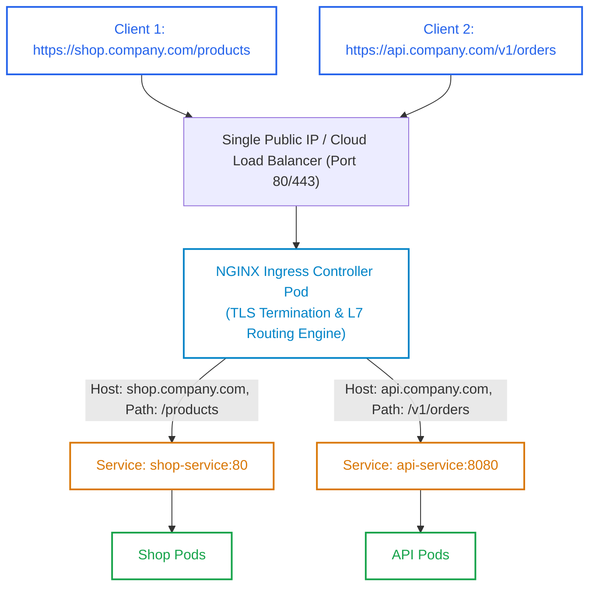
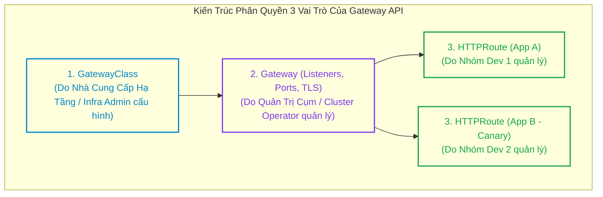
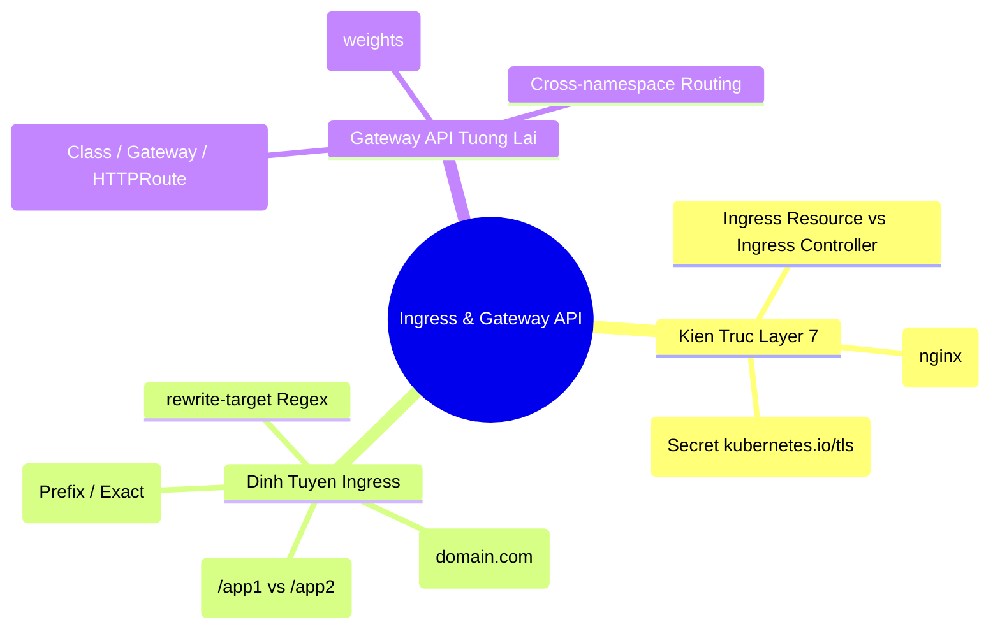


> [!IMPORTANT]
> **Mục tiêu kỹ thuật & Trọng tâm CKA**:
> - Hiểu rõ sự khác biệt giữa Ingress Layer 7 và Service LoadBalancer Layer 4.
> - Cấu hình Ingress v1 chuẩn (`networking.k8s.io/v1`) hỗ trợ cả Host-based Routing và Path-based Routing.
> - Thiết lập bảo mật HTTPS với TLS Secret (`spec.tls`) và kiểm tra tự động Redirect HTTP sang HTTPS.
> - Làm chủ các Annotations quan trọng của NGINX Ingress: `rewrite-target`, `ssl-redirect`, `proxy-body-size`.
> - Nắm vững kiến trúc 3 tầng của Gateway API: `GatewayClass`, `Gateway`, `HTTPRoute` và kỹ thuật phân tách lưu lượng Canary (Traffic Splitting).

---

## 1. Bản Chất Kiến Trúc & Tư Duy Cốt Lõi: Định Tuyến Lớp 7 (Application Layer)

Nếu như **Service** (ClusterIP, NodePort, LoadBalancer) hoạt động ở **Layer 4 (TCP/UDP)** — chỉ biết chuyển tiếp gói tin dựa trên địa chỉ IP và số hiệu Cổng — thì **Ingress** hoạt động ở **Layer 7 (HTTP/HTTPS)**, cho phép kiểm tra nội dung gói tin: Host Header, Đường dẫn URI Path, Cookie, HTTP Headers và giải mã chứng chỉ SSL/TLS.



### 1.1. So Sánh Ingress Resource vs Ingress Controller

1. **Ingress Resource**:
   - Là một đối tượng khai báo API (`networking.k8s.io/v1`) lưu trong etcd.
   - Chỉ chứa các quy tắc định tuyến dạng văn bản (Rules, Hosts, Paths, TLS Secrets).
   - Nếu cụm **không có Ingress Controller**, đối tượng Ingress hoàn toàn vô dụng (không có gì xảy ra).
2. **Ingress Controller**:
   - Là một ứng dụng Reverse Proxy (phổ biến nhất là `ingress-nginx`, ngoài ra có Traefik, HAProxy, Emissary-ingress).
   - Chạy dưới dạng Deployment hoặc DaemonSet.
   - Liên tục theo dõi các đối tượng Ingress trên API Server, tự động render lại tệp cấu hình (ví dụ: `nginx.conf`) và nạp lại cấu hình (Hot Reload) để định tuyến lưu lượng trực tiếp tới các Endpoints của Pod.

---

## 2. Bảng Ma Trận So Sánh Kỹ Thuật Toàn Diện (Engineering Matrix)

Bảng phân tích so sánh chi tiết giữa Ingress truyền thống và Gateway API thế hệ mới:

| Tiêu Chí Kỹ Thuật | Ingress API (`networking.k8s.io/v1`) | Gateway API (`gateway.networking.k8s.io`) |
| :--- | :--- | :--- |
| **Mô hình Quản trị** | Đơn nhất (Single Object cho mọi người)| **Phân quyền 3 vai trò** (Infra, Ops, Dev) |
| **Tính năng Nâng cao** | Phụ thuộc hoàn toàn vào Annotations riêng của vendor | Tích hợp sẵn trong chuẩn (First-class citizen) |
| **Định tuyến Giao thức** | Chỉ hỗ trợ HTTP và HTTPS | Hỗ trợ đa dạng: HTTP, gRPC, TCP, UDP, TLS passthrough |
| **Hỗ trợ Canary / Traffic Split**| Rất phức tạp (Dùng nhiều Ingress + Canary annotation)| Hỗ trợ trực tiếp với trọng số `weight` trong `HTTPRoute` |
| **Đa Namespace (Cross-namespace)**| Bị giới hạn trong 1 Namespace | Hỗ trợ định tuyến xuyên Namespace an toàn |
| **Tính tương thích Vendor** | Khó chuyển đổi do dính chặt NGINX annotations | Chuẩn hóa toàn bộ, dễ dàng tráo đổi implementation |



---

## 3. Cấu Trúc Khai Báo Manifest & Chi Tiết Định Tuyến

### 3.1. Ingress Manifest Hoàn Chỉnh với Host-based, Path-based & TLS Termination

```yaml
apiVersion: networking.k8s.io/v1
kind: Ingress
metadata:
  name: enterprise-ingress
  namespace: production
  annotations:
    kubernetes.io/ingress.class: "nginx"
    nginx.ingress.kubernetes.io/ssl-redirect: "true"
    nginx.ingress.kubernetes.io/proxy-body-size: "20m"
spec:
  ingressClassName: nginx # Khớp với IngressClass trên cụm
  
  # 1. Khối TLS Termination: Tự động giải mã SSL bằng Secret
  tls:
    - hosts:
        - shop.company.com
        - api.company.com
      secretName: company-tls-secret # Secret loại kubernetes.io/tls

  # 2. Khối Quy tắc Định tuyến (Rules)
  rules:
    # Host 1: shop.company.com
    - host: shop.company.com
      http:
        paths:
          - path: /
            pathType: Prefix
            backend:
              service:
                name: shop-frontend-svc
                port:
                  number: 80

    # Host 2: api.company.com (Path-based Routing)
    - host: api.company.com
      http:
        paths:
          - path: /orders
            pathType: Prefix
            backend:
              service:
                name: orders-api-svc
                port:
                  number: 8080
          - path: /payments
            pathType: Prefix
            backend:
              service:
                name: payments-api-svc
                port:
                  number: 9000
```

### 3.2. Cấu Hình Canary Deployment bằng Gateway API `HTTPRoute`

```yaml
apiVersion: gateway.networking.k8s.io/v1
kind: HTTPRoute
metadata:
  name: payment-route
  namespace: production
spec:
  parentRefs:
    - name: production-gateway
  hostnames:
    - "pay.company.com"
  rules:
    - matches:
        - path:
            type: PathPrefix
            value: /checkout
      backendRefs:
        # 90% lưu lượng vào phiên bản hiện tại v1
        - name: payment-svc-v1
          port: 8080
          weight: 90
        # 10% lưu lượng vào phiên bản thử nghiệm Canary v2
        - name: payment-svc-v2
          port: 8080
          weight: 10
```

---

## 4. Phân Tích Cạm Bẫy Thực Chiến: Sự Cố Rewrite-Target & Lỗi 404/502

### Tình huống 1: Trả về HTTP 404 do cấu hình sai `rewrite-target` với biểu thức Regex

Lập trình viên muốn chuyển tiếp toàn bộ request từ `shop.com/api/v2/items` vào Service Backend. Backend chỉ lắng nghe tại đường dẫn gốc `/items`. Kỹ sư cấu hình `path: /api/v2` nhưng không dùng Rewrite, khiến NGINX gửi nguyên đường dẫn `/api/v2/items` vào Backend, gây ra lỗi 404 Not Found.

### Hậu Quả & Log Lỗi Thực Tế:

```text
# Log Client nhận 404:
GET /api/v2/items HTTP/2.0
Host: shop.com
HTTP/2 404 Not Found

# Log ứng dụng backend trong Pod:
10.244.1.1 - [16/Sep/2026:04:00:12] "GET /api/v2/items HTTP/1.1" 404 152 "Cannot GET /api/v2/items"
```

### 5-Whys Root Cause Analysis:
1. **Tại sao Backend trả về 404?** -> Backend không định nghĩa route `/api/v2/items`.
2. **Backend mong muốn nhận route nào?** -> Route `/items`.
3. **Tại sao Ingress không cắt bỏ tiền tố `/api/v2`?** -> Manifest Ingress thiếu cấu hình rewrite regex.
4. **Cú pháp chuẩn của NGINX Ingress cho Regex Rewrite là gì?** -> Khai báo path dạng `/api/v2(/|$)(.*)` và annotation `rewrite-target: /$2`.
5. **Giải pháp khắc phục là gì?** -> Cập nhật đúng cặp Path và Rewrite Target Regex.

```diff
 metadata:
   annotations:
+    nginx.ingress.kubernetes.io/use-regex: "true"
+    nginx.ingress.kubernetes.io/rewrite-target: /$2
 spec:
   rules:
     - http:
         paths:
-          - path: /api/v2
+          - path: /api/v2(/|$)(.*)
             pathType: ImplementationSpecific
```

---

### Tình huống 2: Ingress trả về mã lỗi HTTP 502 Bad Gateway

Người dùng truy cập domain qua Ingress nhưng nhận mã lỗi 502 Bad Gateway.

### Hậu Quả & Log Lỗi Thực Tế:

```text
# Log NGINX Ingress Controller:
2026/09/16 04:05:22 [error] 482#482: *192831 connect() failed (111: Connection refused) 
while connecting to upstream, client: 192.168.10.1, server: shop.company.com, 
request: "GET / HTTP/2.0", upstream: "http://10.244.2.45:8080"
```

> [!WARNING]
> Khi gặp lỗi **HTTP 502 Bad Gateway** tại Ingress, 95% nguyên nhân xuất phát từ việc **Ingress cấu hình sai `backend.service.port.number`**:
> - Service khai báo `port: 80` và `targetPort: 3000`.
> - Trong Ingress khai báo `port.number: 3000` (nhầm sang targetPort) thay vì phải trỏ vào đúng `port.number: 80` của Service!
> Ingress Controller gửi request vào cổng 3000 của ClusterIP (vốn không tồn tại), dẫn đến lỗi Connection Refused (502).

---

## 5. Hands-on Lab: Triển Khai & Kiểm Định Ingress Toàn Diện (8 Bước)

Bảng tổng hợp 8 bước thực hành:

| Bước | Thao Tác | Mục Tiêu Kỹ Thuật | Lệnh / Công Cụ |
| :--- | :--- | :--- | :--- |
| **1** | Cài đặt NGINX Ingress Controller | Triển khai bộ điều phối L7 | `kubectl apply -f ingress-nginx.yaml` |
| **2** | Khởi tạo 2 Backend Deployments | Tạo dịch vụ `web-apple` và `web-banana` | `kubectl create deployment` |
| **3** | Tạo Service ClusterIP cho 2 App | Cung cấp điểm kết nối cho Ingress | `kubectl expose deployment` |
| **4** | Tự sinh Chứng Chỉ TLS & Secret | Tạo SSL Secret loại `kubernetes.io/tls` | `openssl`, `kubectl create secret tls` |
| **5** | Khởi tạo Ingress v1 Hoàn Chỉnh | Thiết lập Host-based & Path Routing + TLS | `kubectl apply -f ingress.yaml` |
| **6** | Kiểm tra phân bổ Ingress Address | Xác nhận Ingress nhận IP của Node | `kubectl get ingress` |
| **7** | Kiểm thử Định tuyến Path-based | Thử nghiệm `/apple` và `/banana` | `curl -k -H "Host:..."` |
| **8** | Kiểm định HTTPS Redirect & TLS | Xác nhận HTTP 308 Auto Redirect | `curl -k -I http://...` |

---

### Bước 1: Cài đặt NGINX Ingress Controller chính thức

```bash
kubectl apply -f https://raw.githubusercontent.com/kubernetes/ingress-nginx/controller-v1.10.0/deploy/static/provider/cloud/deploy.yaml

# Chờ Pod Ingress Controller chuyển sang Running
kubectl wait --namespace ingress-nginx \
  --for=condition=ready pod \
  --selector=app.kubernetes.io/component=controller \
  --timeout=120s
```

---

### Bước 2 & 3: Triển khai 2 ứng dụng Backend mẫu

```bash
kubectl create namespace ingress-lab

# App 1: Apple Web
kubectl create deployment apple-app --image=hashicorp/http-echo --namespace=ingress-lab -- -text="Apple Backend Response"
kubectl expose deployment apple-app --port=5678 --namespace=ingress-lab

# App 2: Banana Web
kubectl create deployment banana-app --image=hashicorp/http-echo --namespace=ingress-lab -- -text="Banana Backend Response"
kubectl expose deployment banana-app --port=5678 --namespace=ingress-lab
```

---

### Bước 4: Tạo chứng chỉ SSL tự ký và lưu vào Kubernetes Secret

```bash
openssl req -x509 -nodes -days 365 -newkey rsa:2048 \
  -keyout /tmp/tls.key -out /tmp/tls.crt \
  -subj "/CN=fruit.company.com/O=Enterprise"

kubectl create secret tls fruit-tls-secret \
  --cert=/tmp/tls.crt \
  --key=/tmp/tls.key \
  --namespace=ingress-lab
```

---

### Bước 5: Triển khai Ingress Manifest

```bash
cat <<EOF | kubectl apply -f -
apiVersion: networking.k8s.io/v1
kind: Ingress
metadata:
  name: fruit-ingress
  namespace: ingress-lab
  annotations:
    nginx.ingress.kubernetes.io/ssl-redirect: "true"
spec:
  ingressClassName: nginx
  tls:
    - hosts:
        - fruit.company.com
      secretName: fruit-tls-secret
  rules:
    - host: fruit.company.com
      http:
        paths:
          - path: /apple
            pathType: Prefix
            backend:
              service:
                name: apple-app
                port:
                  number: 5678
          - path: /banana
            pathType: Prefix
            backend:
              service:
                name: banana-app
                port:
                  number: 5678
EOF
```

---

### Bước 6: Xác nhận trạng thái Ingress

```bash
kubectl get ingress fruit-ingress -n ingress-lab
```

Output ghi nhận Ingress đã sẵn sàng và gắn với địa chỉ IP:
```text
NAME            CLASS   HOSTS               ADDRESS         PORTS     AGE
fruit-ingress   nginx   fruit.company.com   192.168.10.11   80, 443   30s
```

---

### Bước 7: Kiểm thử định tuyến Path-based qua HTTPS với Host Header giả lập

Lấy IP của Ingress Controller và gửi request:

```bash
INGRESS_IP=$(kubectl get ingress fruit-ingress -n ingress-lab -o jsonpath='{.status.loadBalancer.ingress[0].ip}')
[ -z "$INGRESS_IP" ] && INGRESS_IP="127.0.0.1"

# Kiểm tra đường dẫn /apple
curl -k --resolve fruit.company.com:443:$INGRESS_IP https://fruit.company.com/apple

# Kiểm tra đường dẫn /banana
curl -k --resolve fruit.company.com:443:$INGRESS_IP https://fruit.company.com/banana
```

Output phản hồi chính xác từng Backend:
```text
Apple Backend Response
Banana Backend Response
```

---

### Bước 8: Kiểm định cơ chế tự động chuyển hướng HTTP -> HTTPS (SSL Redirect)

Gửi request HTTP thường ở cổng 80:

```bash
curl -I --resolve fruit.company.com:80:$INGRESS_IP http://fruit.company.com/apple
```

Output xác nhận mã HTTP 308 Permanent Redirect sang HTTPS:
```text
HTTP/1.1 308 Permanent Redirect
Location: https://fruit.company.com/apple
```

---

## 6. 10 Câu Hỏi Tự Kiểm Tra Chuyên Sâu (Self-Check Q&A Accordion)

<details class="qa-card">
  <summary><b>Câu 1: Điểm khác biệt căn bản giữa Ingress Resource và Ingress Controller là gì?</b></summary>
  <div class="qa-answer">
    <b>Trả lời:</b><br>
    <ul>
      <li><b>Ingress Resource:</b> Là đối tượng khai báo (Declaration Object) trong Kubernetes API định nghĩa các quy tắc định tuyến tên miền, đường dẫn và chứng chỉ SSL. Bản thân đối tượng này không xử lý bất kỳ lưu lượng mạng nào.</li>
      <li><b>Ingress Controller:</b> Là ứng dụng phần mềm Reverse Proxy thực tế (như NGINX Ingress, Traefik, HAProxy) chạy trên cụm. Nó liên tục đọc các đối tượng Ingress và thực thi việc tiếp nhận, giải mã TLS và chuyển tiếp gói tin Layer 7 tới các Pods backend.</li>
    </ul>
  </div>
</details>

<details class="qa-card">
  <summary><b>Câu 2: Ba giá trị hợp lệ của trường pathType trong Ingress v1 (networking.k8s.io/v1) là gì?</b></summary>
  <div class="qa-answer">
    <b>Trả lời:</b><br>
    <ul>
      <li><b>Exact:</b> Khớp chính xác 100% từng ký tự của đường dẫn URL (phân biệt hoa thường).</li>
      <li><b>Prefix:</b> Khớp theo tiền tố được phân tách bằng dấu gạch chéo <code>/</code> (ví dụ: path <code>/foo</code> sẽ khớp với <code>/foo</code>, <code>/foo/</code>, <code>/foo/bar</code> nhưng không khớp với <code>/foobar</code>).</li>
      <li><b>ImplementationSpecific:</b> Quy tắc khớp đường dẫn phụ thuộc hoàn toàn vào cấu hình riêng của Ingress Controller đang sử dụng.</li>
    </ul>
  </div>
</details>

<details class="qa-card">
  <summary><b>Câu 3: Cơ chế TLS Termination tại tầng Ingress mang lại lợi ích gì cho hệ thống Microservices?</b></summary>
  <div class="qa-answer">
    <b>Trả lời:</b><br>
    TLS Termination thực hiện giải mã mã hóa HTTPS ngay tại cửa ngõ Ingress Controller bằng chứng chỉ SSL tập trung. Lưu lượng từ Ingress Controller đi vào các Pods backend bên trong mạng nội bộ cụm là HTTP thuần không mã hóa, giúp giảm tải đáng kể việc tính toán mã hóa/giải mã CPU trên từng Pod và đơn giản hóa việc quản trị chứng chỉ SSL (chỉ cần cập nhật Secret ở 1 nơi duy nhất).
  </div>
</details>

<details class="qa-card">
  <summary><b>Câu 4: Annotation rewrite-target trong NGINX Ingress Controller được sử dụng trong tình huống nào?</b></summary>
  <div class="qa-answer">
    <b>Trả lời:</b><br>
    Được sử dụng khi đường dẫn công khai mà khách hàng truy cập ngoài Internet khác với đường dẫn mà ứng dụng Backend trong container thực sự lắng nghe. Ví dụ: khách truy cập <code>shop.com/api/v1/orders</code>, Ingress sử dụng <code>rewrite-target: /$1</code> để cắt bỏ tiền tố <code>/api/v1</code> và chỉ chuyển tiếp <code>/orders</code> tới Backend.
  </div>
</details>

<details class="qa-card">
  <summary><b>Câu 5: Ba đối tượng cốt lõi tương ứng với 3 vai trò quản trị trong Gateway API là gì?</b></summary>
  <div class="qa-answer">
    <b>Trả lời:</b><br>
    <ul>
      <li>1. <b>GatewayClass:</b> Do Nhà cung cấp hạ tầng (Infrastructure Provider) định nghĩa loại controller/proxy (như Envoy, Istio).</li>
      <li>2. <b>Gateway:</b> Do Quản trị viên cụm (Cluster Operator) cấu hình điểm tiếp nhận mạng (IP, Port, Protocol, TLS Secrets).</li>
      <li>3. <b>HTTPRoute (hoặc GRPCRoute/TCPRoute):</b> Do Lập trình viên ứng dụng (Application Developer) định nghĩa quy tắc định tuyến, chuyển tiếp đường dẫn và cân bằng tải Canary.</li>
    </ul>
  </div>
</details>

<details class="qa-card">
  <summary><b>Câu 6: Cổng dịch vụ được khai báo trong Ingress backend.service.port.number phải là cổng nào?</b></summary>
  <div class="qa-answer">
    <b>Trả lời:</b><br>
    Phải là <b>cổng của đối tượng Service (trường <code>spec.ports[].port</code>)</b>, KHÔNG PHẢI cổng <code>targetPort</code> của container. Ingress Controller giao tiếp thông qua Service trừu tượng để tìm danh sách Endpoints tương ứng.
  </div>
</details>

<details class="qa-card">
  <summary><b>Câu 7: Đối tượng IngressClass trong Kubernetes v1.18+ đóng vai trò gì?</b></summary>
  <div class="qa-answer">
    <b>Trả lời:</b><br>
    <code>IngressClass</code> là tài nguyên cấp cụm (Cluster-scoped) dùng để định danh và phân loại các bộ Ingress Controller khác nhau cùng chạy trên một cụm (ví dụ: 1 controller cho mạng nội bộ <code>nginx-internal</code> và 1 controller cho mạng công cộng <code>nginx-external</code>). Đối tượng Ingress sử dụng trường <code>spec.ingressClassName</code> để chỉ định chính xác controller nào sẽ xử lý định tuyến cho nó.
  </div>
</details>

<details class="qa-card">
  <summary><b>Câu 8: Làm thế nào để cấu hình Ingress hỗ trợ upload file dung lượng lớn mà không bị lỗi HTTP 413 Payload Too Large?</b></summary>
  <div class="qa-answer">
    <b>Trả lời:</b><br>
    Bổ sung annotation tăng kích thước body của NGINX Ingress:<br>
    <code>nginx.ingress.kubernetes.io/proxy-body-size: "50m"</code> (cho phép upload file tối đa 50MB; đặt <code>"0"</code> để tắt hoàn toàn giới hạn).
  </div>
</details>

<details class="qa-card">
  <summary><b>Câu 9: Điểm khác biệt giữa Host-based Routing và Path-based Routing trong cấu hình Ingress là gì?</b></summary>
  <div class="qa-answer">
    <b>Trả lời:</b><br>
    <ul>
      <li><b>Host-based Routing:</b> Định tuyến dựa trên tiêu đề HTTP <code>Host</code> (ví dụ: <code>app1.company.com</code> trỏ vào Service 1, còn <code>app2.company.com</code> trỏ vào Service 2).</li>
      <li><b>Path-based Routing:</b> Định tuyến trên cùng một Host nhưng dựa trên đường dẫn URL (ví dụ: <code>company.com/blog</code> trỏ vào Service Blog, còn <code>company.com/shop</code> trỏ vào Service Shop).</li>
    </ul>
  </div>
</details>

<details class="qa-card">
  <summary><b>Câu 10: Tại sao Gateway API lại vượt trội hơn Ingress khi triển khai kỹ thuật phát hành Canary Deployment?</b></summary>
  <div class="qa-answer">
    <b>Trả lời:</b><br>
    Gateway API hỗ trợ trực tiếp thuộc tính <code>weight</code> trong mảng <code>backendRefs</code> của đối tượng <code>HTTPRoute</code> (ví dụ: Service A nhận weight 90, Service B nhận weight 10). Lập trình viên có thể phân chia lưu lượng phần trăm chuẩn xác ngay trong 1 manifest duy nhất mà không cần phụ thuộc vào các annotation phi tiêu chuẩn phức tạp như trên Ingress.
  </div>
</details>

---

## 7. Tổng Kết & Lộ Trình Bài Học Tiếp Theo



Làm chủ Ingress Controller và Gateway API giúp bạn kiểm soát toàn diện luồng lưu lượng truy cập từ Internet vào cụm, tối ưu hóa chi phí Public IP và thiết lập các chiến lược phát hành phần mềm Canary tiên tiến.

> [!TIP]
> **Bài học tiếp theo**: Trong [Bài 25: Tường Lửa Mạng NetworkPolicy: Phân Đoạn Cụm (Micro-segmentation) & Zero Trust Security](cka-25-25-networkpolicy.html), chúng ta sẽ nghiên cứu giải pháp tường lửa phân tán Layer 3/Layer 4: thiết lập chính sách Default Deny, kiểm soát luồng Ingress/Egress giữa các Pods và bảo vệ an toàn cụm theo mô hình Zero Trust.

