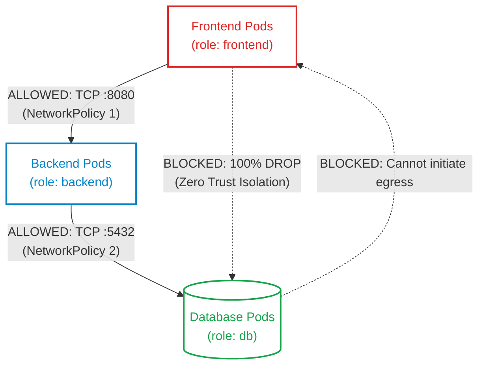
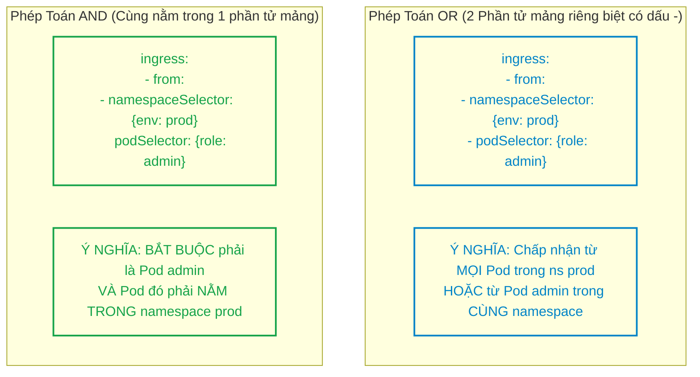
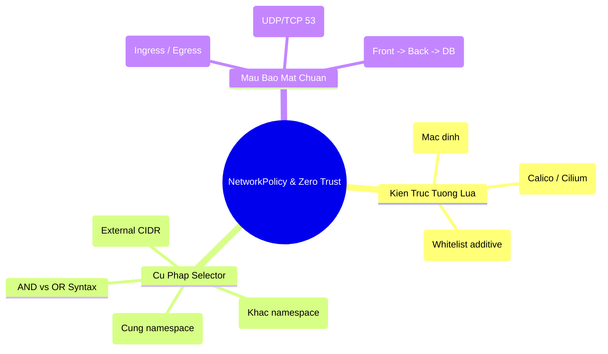


> [!IMPORTANT]
> **Mục tiêu kỹ thuật & Trọng tâm CKA**:
> - Nắm vững nguyên lý hoạt động của NetworkPolicy ở Layer 3 và Layer 4 (IP, Protocol, Port).
> - Thiết lập chiến lược bảo mật **Zero Trust**: áp dụng `Default-Deny-All` cho cả Ingress và Egress.
> - Xây dựng ma trận phân đoạn mạng 3 tầng (Frontend -> Backend -> Database).
> - Phân biệt chính xác cú pháp kết hợp giữa `podSelector`, `namespaceSelector` và `ipBlock`.
> - Sử dụng `nc -zv` và `curl --connect-timeout` để kiểm thử và chứng minh trạng thái tường lửa đóng/mở.

---

## 1. Bản Chất Kiến Trúc & Tư Duy Cốt Lõi: Tường Lửa Phân Tán Zero Trust

Trong một cụm Kubernetes tiêu chuẩn, nếu kẻ tấn công chiếm quyền điều khiển (RCE) một Pod frontend công cộng, chúng có thể tự do quét mạng nội bộ (Port Scanning) và tấn công trực tiếp vào cơ sở dữ liệu hoặc hệ thống quản trị nội bộ.

**NetworkPolicy** (`networking.k8s.io/v1`) cung cấp giải pháp tường lửa phân tán cấp Pod (Pod-level Distributed Firewall), thực thi chính sách tại card mạng ảo `veth` của từng Pod thông qua Linux iptables / ipset hoặc eBPF do CNI Plugin đảm nhiệm.



### 1.1. Chu Trình Đánh Giá Quy Tắc NetworkPolicy

1. **Trạng thái Mặc định (Unisolated)**: Nếu không có NetworkPolicy nào trỏ tới Pod, Pod nhận và gửi toàn bộ traffic tự do.
2. **Trạng thái Bị Cách Ly (Isolated)**: Ngay khi xuất hiện một NetworkPolicy khớp với `podSelector` của Pod:
   - Toàn bộ lưu lượng không được khai báo rõ ràng sẽ bị **DROP (Từ chối)**.
   - Các NetworkPolicy hoạt động theo cơ chế **Cộng dồn (Additive Whitelist)**: Một kết nối được chấp thuận nếu nó thỏa mãn ít nhất MỘT quy tắc trong BẤT KỲ NetworkPolicy nào áp dụng lên Pod.

---

## 2. Bảng Ma Trận So Sánh Kỹ Thuật Toàn Diện (Engineering Matrix)

Bảng phân tích sự khác nhau giữa các khối cấu hình trong NetworkPolicy:

| Tiêu Chí Kỹ Thuật | podSelector | namespaceSelector | ipBlock | ports |
| :--- | :--- | :--- | :--- | :--- |
| **Phạm vi áp dụng** | Các Pods trong CÙNG Namespace (hoặc kết hợp với NS khác)| Toàn bộ các Pods thuộc các Namespace khớp nhãn | Dải địa chỉ IP CIDR bên ngoài cụm | Cổng Port và Giao thức L4 |
| **Cơ chế lọc** | So khớp nhãn (Labels: `app=backend`)| So khớp nhãn (Labels: `env=prod`) | So khớp địa chỉ IP nguồn/đích (`cidr`, `except`)| TCP, UDP, SCTP (`port: 5432`) |
| **Giao tiếp nội cụm** | Rất phổ biến (Lọc microservice)| Rất phổ biến (Lọc giữa các team)| Không nên dùng cho Pod IP nội bộ | Đi kèm để khóa chặt cổng |
| **Giao tiếp ngoại mạng**| Không áp dụng | Không áp dụng | Dành riêng cho External API / DB | Mở cổng HTTPS (443) ra ngoài |

### 2.1. Cú pháp Phép Toán Logic: AND vs OR trong NetworkPolicy



---

## 3. Cấu Trúc Khai Báo Manifest & Các Mẫu Bảo Mật Chuẩn

### 3.1. Mẫu 1: Khóa Toàn Bộ Lưu Lượng (Default Deny All Ingress & Egress)

Chốt chặn bảo mật Zero Trust số một cho mọi Namespace sản xuất:

```yaml
apiVersion: networking.k8s.io/v1
kind: NetworkPolicy
metadata:
  name: default-deny-all
  namespace: production
spec:
  podSelector: {} # Áp dụng cho 100% Pods trong namespace
  policyTypes:
    - Ingress
    - Egress
  # ingress: [] -> Không khai báo gì đồng nghĩa chặn 100% Ingress
  # egress: []  -> Không khai báo gì đồng nghĩa chặn 100% Egress
```

### 3.2. Mẫu 2: Mở Khóa Truy Vấn DNS Egress (Port 53 Bắt Buộc)

Khi đã khóa Default Deny Egress, bắt buộc phải có Policy này để các Pods có thể phân giải tên miền qua CoreDNS:

```yaml
apiVersion: networking.k8s.io/v1
kind: NetworkPolicy
metadata:
  name: allow-dns-egress
  namespace: production
spec:
  podSelector: {} # Áp dụng cho mọi Pods
  policyTypes:
    - Egress
  egress:
    - to:
        - namespaceSelector:
            matchLabels:
              kubernetes.io/metadata.name: kube-system
          podSelector:
            matchLabels:
              k8s-app: kube-dns
      ports:
        - protocol: UDP
          port: 53
        - protocol: TCP
          port: 53
```

### 3.3. Mẫu 3: Bảo Vệ Cơ Sở Dữ Liệu (Chỉ Cho Phép Backend Gọi Cổng 5432)

```yaml
apiVersion: networking.k8s.io/v1
kind: NetworkPolicy
metadata:
  name: db-protection-policy
  namespace: production
spec:
  podSelector:
    matchLabels:
      role: database
  policyTypes:
    - Ingress
  ingress:
    - from:
        - podSelector:
            matchLabels:
              role: backend
      ports:
        - protocol: TCP
          port: 5432
```

---

## 4. Phân Tích Cạm Bẫy Thực Chiến: Khóa Nhầm DNS & Lỗi Flannel CNI

### Tình huống 1: Khóa Egress làm ứng dụng chết đứng vì lỗi `Temporary failure in name resolution`

Đội ngũ bảo mật áp dụng chính sách Default Deny Egress để ngăn dữ liệu bị rò rỉ ra Internet. Ngay lập tức, toàn bộ hệ thống microservices nội bộ bị sập, các Pods không thể kết nối tới nhau.

### Hậu Quả & Log Lỗi Thực Tế:

```text
# Log ứng dụng Java/NodeJS:
Error: getaddrinfo EAI_AGAIN payment-service.production.svc.cluster.local
java.net.UnknownHostException: payment-service.production.svc.cluster.local: Temporary failure in name resolution
```

### 5-Whys Root Cause Analysis:
1. **Tại sao ứng dụng báo lỗi UnknownHostException?** -> Ứng dụng không thể phân giải tên miền Service thành IP.
2. **Tại sao không phân giải được?** -> Gói tin gửi tới máy chủ CoreDNS (`10.96.0.10:53`) bị chặn hoàn toàn.
3. **Tại sao bị chặn?** -> NetworkPolicy áp dụng Default Deny Egress chặn toàn bộ lưu lượng đi ra khỏi Pod.
4. **Tại sao không thể gọi CoreDNS nội cụm?** -> CoreDNS nằm ở namespace `kube-system`, gói tin đi ra khỏi Pod là một luồng Egress.
5. **Giải pháp khắc phục là gì?** -> Luôn luôn triển khai chính sách `allow-dns-egress` (cho phép UDP/TCP port 53) song song với bất kỳ chính sách Deny Egress nào.

---

### Tình huống 2: Tạo NetworkPolicy nhưng không có tác dụng do CNI không hỗ trợ

Kỹ sư tạo đầy đủ các manifest NetworkPolicy trên cụm sử dụng Flannel CNI. Tuy nhiên, khi kiểm thử, tất cả các Pods vẫn kết nối tự do không hề bị chặn.

### Hậu Quả & Log Lỗi Thực Tế:

```text
# Pod frontend vẫn ping và curl thoải mái vào Database:
$ kubectl exec -it frontend -- nc -zv db-service 5432
db-service (10.96.45.10:5432) open  # BẢO MẬT THẤT BẠI!
```

> [!WARNING]
> **Flannel thuần túy (Pure Flannel)** không chứa Network Policy Controller. Kubernetes API Server vẫn lưu đối tượng NetworkPolicy vào etcd bình thường mà không báo lỗi, nhưng tầng Kernel mạng không có ai thực thi quy tắc! Muốn NetworkPolicy hoạt động, cụm bắt buộc phải sử dụng **Calico, Cilium, Weave Net, Antrea hoặc Kube-router**.

---

## 5. Hands-on Lab: Triển Khai Kiến Trúc Zero Trust 3 Tầng (8 Bước)

Bảng tổng hợp 8 bước thực hành:

| Bước | Thao Tác | Mục Tiêu Kỹ Thuật | Lệnh / Công Cụ |
| :--- | :--- | :--- | :--- |
| **1** | Khởi tạo Namespace Lab | Tạo môi trường kiểm thử bảo mật | `kubectl create ns netpol-lab` |
| **2** | Triển khai 3 tầng Workload | Tạo Frontend, Backend, và DB Pods | `kubectl run frontend/backend/db` |
| **3** | Kiểm thử kết nối mở ban đầu | Xác nhận Default Allow 100% | `kubectl exec -- nc -zv` |
| **4** | Áp dụng Default Deny All | Khóa 100% Ingress trong namespace | `kubectl apply -f default-deny.yaml` |
| **5** | Mở khóa Ingress Backend | Cho phép Frontend gọi Backend:8080 | `kubectl apply -f backend-policy.yaml` |
| **6** | Mở khóa Ingress Database | Chỉ cho phép Backend gọi DB:5432 | `kubectl apply -f db-policy.yaml` |
| **7** | Kiểm định Frontend gọi DB bị chặn | Xác minh Frontend không thể chạm vào DB | `nc -zv -w 2` (Kỳ vọng: Timeout) |
| **8** | Kiểm định Backend gọi DB thành công | Xác minh Backend kết nối DB thông suốt | `nc -zv` (Kỳ vọng: Open) |

---

### Bước 1 & 2: Khởi tạo Namespace và triển khai 3 Pods đại diện 3 tầng

```bash
kubectl create namespace netpol-lab

# 1. Frontend Pod
kubectl run frontend -n netpol-lab --image=curlimages/curl:8.4.0 --labels="app=frontend" -- sleep 3600

# 2. Backend Pod & Service
kubectl run backend -n netpol-lab --image=nginx:alpine --labels="app=backend" --port=80
kubectl expose pod backend -n netpol-lab --port=80

# 3. Database Pod & Service
kubectl run database -n netpol-lab --image=redis:alpine --labels="app=database" --port=6379
kubectl expose pod database -n netpol-lab --port=6379
```

---

### Bước 3: Kiểm tra kết nối ban đầu khi chưa có NetworkPolicy

```bash
# Frontend gọi Backend (Thành công)
kubectl exec -it frontend -n netpol-lab -- curl -s -I http://backend.netpol-lab.svc | grep HTTP

# Frontend gọi trực tiếp Database (Thành công - Nguy cơ bảo mật!)
kubectl exec -it frontend -n netpol-lab -- nc -zv database.netpol-lab.svc 6379
```

Output:
```text
HTTP/1.1 200 OK
database.netpol-lab.svc (10.96.15.20:6379) open
```

---

### Bước 4: Áp dụng Default Deny Ingress toàn bộ Namespace

```bash
cat <<EOF | kubectl apply -f -
apiVersion: networking.k8s.io/v1
kind: NetworkPolicy
metadata:
  name: default-deny-ingress
  namespace: netpol-lab
spec:
  podSelector: {} # Áp dụng cho mọi Pods
  policyTypes:
    - Ingress
EOF
```

Thử lại kết nối từ Frontend:

```bash
kubectl exec -it frontend -n netpol-lab -- curl -s -m 2 http://backend.netpol-lab.svc || echo "ĐÃ KHÓA THÀNH CÔNG!"
```

---

### Bước 5: Cho phép Frontend kết nối vào Backend (Port 80)

```bash
cat <<EOF | kubectl apply -f -
apiVersion: networking.k8s.io/v1
kind: NetworkPolicy
metadata:
  name: allow-frontend-to-backend
  namespace: netpol-lab
spec:
  podSelector:
    matchLabels:
      app: backend
  policyTypes:
    - Ingress
  ingress:
    - from:
        - podSelector:
            matchLabels:
              app: frontend
      ports:
        - protocol: TCP
          port: 80
EOF
```

---

### Bước 6: Cho phép DUY NHẤT Backend kết nối vào Database (Port 6379)

```bash
cat <<EOF | kubectl apply -f -
apiVersion: networking.k8s.io/v1
kind: NetworkPolicy
metadata:
  name: allow-backend-to-db
  namespace: netpol-lab
spec:
  podSelector:
    matchLabels:
      app: database
  policyTypes:
    - Ingress
  ingress:
    - from:
        - podSelector:
            matchLabels:
              app: backend
      ports:
        - protocol: TCP
          port: 6379
EOF
```

---

### Bước 7: Kiểm định Frontend gọi Database bị chặn hoàn toàn (Zero Trust)

```bash
kubectl exec -it frontend -n netpol-lab -- nc -zv -w 2 database.netpol-lab.svc 6379
```

Output bị ngắt kết nối chính xác theo kỳ vọng:
```text
nc: database.netpol-lab.svc (10.96.15.20:6379): Connection timed out
```

---

### Bước 8: Kiểm định chuỗi kết nối hợp lệ hoạt động hoàn hảo

```bash
# 1. Frontend gọi Backend: THÀNH CÔNG
kubectl exec -it frontend -n netpol-lab -- curl -s -I http://backend.netpol-lab.svc | grep HTTP

# 2. Backend gọi Database: THÀNH CÔNG
kubectl exec -it backend -n netpol-lab -- nc -zv database.netpol-lab.svc 6379
```

Output:
```text
HTTP/1.1 200 OK
database.netpol-lab.svc (10.96.15.20:6379) open
```

---

## 6. 10 Câu Hỏi Tự Kiểm Tra Chuyên Sâu (Self-Check Q&A Accordion)

<details class="qa-card">
  <summary><b>Câu 1: Trạng thái mặc định của mạng Kubernetes khi chưa áp dụng bất kỳ NetworkPolicy nào là gì?</b></summary>
  <div class="qa-answer">
    <b>Trả lời:</b><br>
    Mặc định là <b>Default Allow (Mở 100%)</b>. Bất kỳ Pod nào trong cụm đều có thể tự do gửi (Egress) và nhận (Ingress) lưu lượng mạng từ tất cả các Pod khác trên mọi Namespace và từ ngoài mạng.
  </div>
</details>

<details class="qa-card">
  <summary><b>Câu 2: Điều kiện tiên quyết để NetworkPolicy có thể thực thi và chặn được lưu lượng mạng là gì?</b></summary>
  <div class="qa-answer">
    <b>Trả lời:</b><br>
    Cụm Kubernetes <b>bắt buộc phải sử dụng CNI Plugin có hỗ trợ NetworkPolicy Enforcement</b> (như Calico, Cilium, Antrea, Weave Net). Nếu chỉ dùng Flannel thuần túy, các đối tượng NetworkPolicy vẫn tạo được trong API Server nhưng sẽ bị Kernel bỏ qua hoàn toàn và không có tác dụng chặn.
  </div>
</details>

<details class="qa-card">
  <summary><b>Câu 3: Điều gì xảy ra với một Pod ngay khi nó được chọn bởi trường podSelector của một NetworkPolicy?</b></summary>
  <div class="qa-answer">
    <b>Trả lời:</b><br>
    Pod đó lập tức chuyển từ trạng thái tự do sang trạng thái <b>Bị Cách Ly (Isolated)</b> theo hướng quy định trong <code>policyTypes</code> (Ingress hoặc Egress). Mọi lưu lượng kết nối vào/ra Pod sẽ bị chặn hoàn toàn (Deny), ngoại trừ những luồng được cho phép rõ ràng (Whitelist) trong các quy tắc của Policy.
  </div>
</details>

<details class="qa-card">
  <summary><b>Câu 4: Làm thế nào để phân biệt phép toán logic AND và OR trong danh sách from của NetworkPolicy?</b></summary>
  <div class="qa-answer">
    <b>Trả lời:</b><br>
    <ul>
      <li><b>Phép OR:</b> Khi các selector nằm ở các phần tử mảng riêng biệt (mỗi dòng bắt đầu bằng dấu gạch ngang <code>-</code> riêng). Ví dụ: <code>- namespaceSelector: ...</code> và <code>- podSelector: ...</code>.</li>
      <li><b>Phép AND:</b> Khi các selector cùng nằm trong <b>một phần tử mảng duy nhất</b> (chỉ có 1 dấu gạch ngang ở dòng đầu). Ví dụ: <code>- namespaceSelector: ...</code> và dòng dưới thụt lề cùng cấp <code>  podSelector: ...</code>.</li>
    </ul>
  </div>
</details>

<details class="qa-card">
  <summary><b>Câu 5: Tại sao khi áp dụng chính sách Default Deny Egress thì bắt buộc phải mở quy tắc DNS Port 53?</b></summary>
  <div class="qa-answer">
    <b>Trả lời:</b><br>
    Bởi vì khi ứng dụng muốn kết nối tới một Service (như <code>backend.default.svc</code>), hệ điều hành phải gửi gói tin UDP/TCP cổng 53 ra máy chủ CoreDNS trong namespace <code>kube-system</code> để phân giải tên miền. Nếu Deny Egress toàn bộ mà không mở cổng 53, Pod sẽ không thể phân giải được bất kỳ tên miền nào và báo lỗi <code>Temporary failure in name resolution</code>.
  </div>
</details>

<details class="qa-card">
  <summary><b>Câu 6: Cú pháp manifest để áp dụng Default Deny Ingress cho toàn bộ một Namespace là gì?</b></summary>
  <div class="qa-answer">
    <b>Trả lời:</b><br>
    Khai báo <code>podSelector: {}</code> (chọn mọi Pods), <code>policyTypes: ["Ingress"]</code> và để trống khối <code>ingress:</code> (không có rule allow nào).
  </div>
</details>

<details class="qa-card">
  <summary><b>Câu 7: Khối ipBlock trong NetworkPolicy dùng để làm gì và có nên dùng nó để lọc IP của Pod nội cụm không?</b></summary>
  <div class="qa-answer">
    <b>Trả lời:</b><br>
    Khối <code>ipBlock</code> (kèm <code>cidr</code> và <code>except</code>) dùng để kiểm soát lưu lượng đi/đến từ <b>dải IP bên ngoài cụm</b> (như dải mạng công ty, internet, public subnet). <b>KHÔNG NÊN</b> dùng <code>ipBlock</code> cho IP của Pods nội cụm vì IP của Pod mang tính chất động (thay đổi liên tục khi scale/restart); thay vào đó hãy luôn dùng <code>podSelector</code> và <code>namespaceSelector</code>.
  </div>
</details>

<details class="qa-card">
  <summary><b>Câu 8: Nếu một Pod bị chi phối bởi nhiều NetworkPolicy khác nhau thì thứ tự ưu tiên diễn ra như thế nào?</b></summary>
  <div class="qa-answer">
    <b>Trả lời:</b><br>
    Kubernetes NetworkPolicy hoạt động theo cơ chế <b>Cộng dồn (Union / Additive Whitelist)</b>, không có khái niệm độ ưu tiên (Priority) giữa các Policy. Nếu một kết nối được cho phép bởi <i>bất kỳ một</i> NetworkPolicy nào thì kết nối đó sẽ được thông qua, bất kể các Policy khác có nhắc tới nó hay không.
  </div>
</details>

<details class="qa-card">
  <summary><b>Câu 9: Làm thế nào để cho phép toàn bộ lưu lượng từ một Namespace có nhãn environment: staging đi vào Pod Backend?</b></summary>
  <div class="qa-answer">
    <b>Trả lời:</b><br>
    Khai báo trong khối <code>ingress.from</code> của NetworkPolicy áp dụng cho Backend:<br>
    <div style="background-color:#1e1e1e; color:#d4d4d4; padding:8px; border-radius:4px; font-family:monospace; margin-top:4px;">
    ingress:<br>
    from:<br>
    &nbsp;&nbsp;namespaceSelector:<br>
    &nbsp;&nbsp;&nbsp;&nbsp;matchLabels:<br>
    &nbsp;&nbsp;&nbsp;&nbsp;&nbsp;&nbsp;environment: staging
    </div>
  </div>
</details>

<details class="qa-card">
  <summary><b>Câu 10: Hai công cụ dòng lệnh nào thường được kỹ sư sử dụng trong kỳ thi CKA để kiểm thử nhanh quy tắc NetworkPolicy?</b></summary>
  <div class="qa-answer">
    <b>Trả lời:</b><br>
    <ul>
      <li><code>nc -zv -w 2 &lt;host&gt; &lt;port&gt;</code> (Netcat kiểm tra mở cổng TCP với timeout 2 giây).</li>
      <li><code>curl -s --connect-timeout 2 http://&lt;host&gt;:&lt;port&gt;</code> (Curl gửi HTTP request với timeout kết nối).</li>
    </ul>
  </div>
</details>

---

## 7. Tổng Kết & Lộ Trình Bài Học Tiếp Theo



Làm chủ NetworkPolicy là chìa khóa then chốt để thiết lập môi trường Zero Trust bảo mật đa tầng, ngăn chặn các cuộc tấn công di chuyển ngang (Lateral Movement) và bảo vệ an toàn tuyệt đối cho hạ tầng dữ liệu doanh nghiệp.

> [!TIP]
> **Bài học tiếp theo**: Trong [Bài 26: Quản Trị Lưu Trữ Dữ Liệu: Volumes, PersistentVolume (PV) & PersistentVolumeClaim (PVC)](cka-26-26-volume-pv-pvc.html), chúng ta sẽ bước vào chuyên đề Lưu Trữ (Storage): phân tích vòng đời cấp phát tĩnh (Static Provisioning), cơ chế Binding giữa PV và PVC, các chế độ Access Modes (`RWO`, `ROX`, `RWX`) và các chính sách thu hồi `ReclaimPolicy`.

