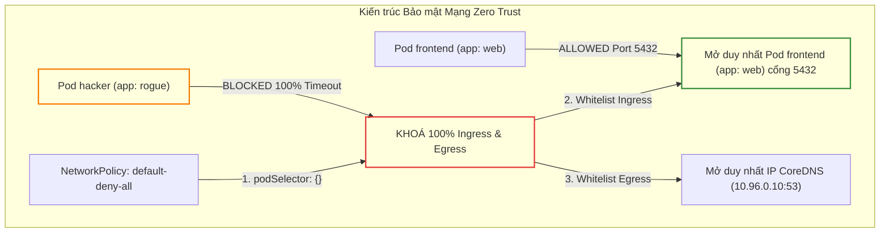
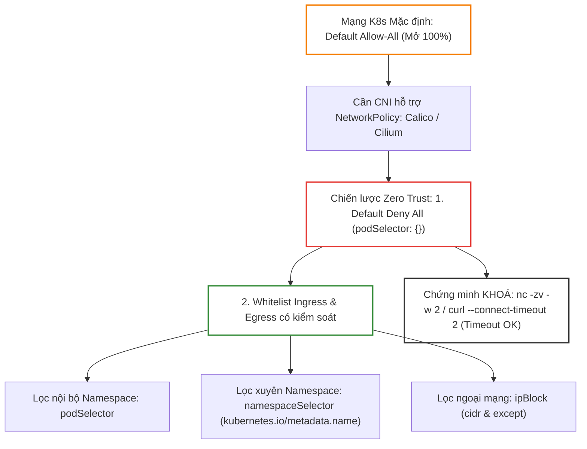
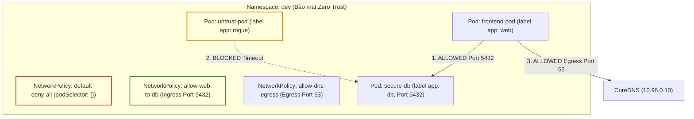


# [BÀI 25] KIỂM SOÁT LƯU LƯỢNG MẠNG BẰNG NETWORKPOLICY: MẶC ĐỊNH MỞ, THIẾT LẬP DEFAULT-DENY & XÁC MINH QUY TẮC

Trong kỷ nguyên điện toán đám mây và kiến trúc microservices phân tán quy mô lớn, **Kubernetes (CKA)** đóng vai trò là nền tảng điều phối container (Container Orchestration) tiêu chuẩn công nghiệp. Để làm chủ hệ thống trong môi trường sản xuất (Production) cũng như chinh phục kỳ thi chứng chỉ quốc tế của Linux Foundation / CNCF, kỹ sư không chỉ nắm vững các câu lệnh thao tác cơ bản mà phải thấu hiểu sâu sắc bản chất cơ chế tầng thấp: từ chu trình điều hòa (Reconciliation Loop), cấu trúc điều phối tài nguyên, kiến trúc mạng CNI, lưu trữ CSI cho đến các chuẩn mực an ninh phòng thủ chiều sâu.

Bài viết chuyên sâu này sẽ đồng hành cùng bạn giải mã toàn diện bức tranh kiến trúc, phân tích các đánh đổi kỹ thuật thực chiến (Engineering Trade-offs), cung cấp bài thực hành Lab từng bước và bộ câu hỏi phỏng vấn chuẩn Architect / Lead Engineer.

---

## 1. Bản Chất Kiến Trúc & Cơ Chế Vận Hành Tầng Thấp

| # | Câu hỏi ôn tập | Đáp án chuẩn ngắn gọn (chứa con số / tên lệnh) |
|---|---|---|
| 1 | Phân biệt Ingress Resource và Ingress Controller? | **1** tệp YAML khai báo vs **1** tiến trình Reverse Proxy thực thi |
| 2 | Hai kỹ thuật định tuyến Layer 7 trong Ingress? | **2** kiểu: Host-based (`host: ...`) và Path-based (`pathType: Prefix`) |
| 3 | Loại Secret và 2 key bắt buộc cho TLS Termination? | Secret loại **`kubernetes.io/tls`** chứa `tls.crt` và `tls.key` |
| 4 | Thuộc tính chỉ định Ingress Controller phụ trách? | Thuộc tính **`ingressClassName: nginx`** |
| 5 | Ba vai trò phân quyền trách nhiệm trong Gateway API? | **3** vai trò (`GatewayClass`, `Gateway`, `HTTPRoute`) |


> **Luận đề trung tâm của buổi:**
> *"Mô hình mạng mặc định của Kubernetes là 'Mặc định mở 100%' (Default Allow-All), cho phép mọi Pod tự do kết nối tới bất kỳ Pod nào trên toàn cụm; do đó việc triển khai bảo mật theo kiến trúc Không tin tưởng ai (Zero Trust) đòi hỏi bắt buộc phải sử dụng CNI có hỗ trợ NetworkPolicy (như Calico hay Cilium), thiết lập quy tắc Khóa 100% traffic (Default Deny All) bằng `podSelector: {}`, sau đó mở từng lỗ hổng có kiểm soát bằng cách kết hợp `podSelector`, `namespaceSelector` và `ipBlock` cho cả 2 hướng `Ingress` và `Egress`, đồng thời chứng minh trạng thái khóa thành công bằng câu lệnh kiểm thử kết nối bấm giờ `nc -zv` hoặc `curl --connect-timeout 2`."*

**Bảng kết quả các buổi trước được dùng lại:**

| Kết quả / Công cụ | Nguồn gốc | Áp dụng vào buổi này |
|---|---|---|
| Mô hình mạng CNI phẳng (Flat Network) | Buổi 21 `QT 4.1` | Yêu cầu CNI Calico/Cilium hỗ trợ NetworkPolicy enforcement |
| Gán nhãn Label và Namespace | Buổi 06 `QT 4.1` | So khớp `podSelector` và `namespaceSelector` trong NetworkPolicy |
| Lệnh khởi tạo Pod tạm tự xoá `--rm` | Buổi 23 `QT 7.2` | Tạo Pod client tạm thời thực thi `nc -zv` / `curl` kiểm thử kết nối |

Ba câu bài tập về nhà BTVN 4 của buổi 24 đã chuẩn bị sẵn kiến thức cho học viên: Câu 1 phân tích rủi ro bảo mật của mô hình "Default Allow-All"; Câu 2 hướng dẫn cấu hình tệp YAML Default Deny All; Câu 3 phân biệt 2 hướng traffic `ingress` / `egress` kết hợp với `podSelector` và `namespaceSelector`.

---


| # | Năng lực đạt được sau buổi học | Hiện vật chứng minh trong bài lab |
|---|---|---|
| 1 | Khởi tạo NetworkPolicy khóa 100% Ingress & Egress (Default Deny All) | Tệp `hien-vat/default-deny-all.yaml` |
| 2 | Khởi tạo NetworkPolicy Whitelist Ingress cho phép nội bộ Namespace | Tệp `hien-vat/allow-frontend-to-backend.yaml` |
| 3 | Cấu hình NetworkPolicy Whitelist Egress kết nối ra DNS CoreDNS | Tệp `hien-vat/allow-dns-egress.yaml` |
| 4 | Cấu hình `namespaceSelector` cho phép kết nối xuyên Namespace | Tệp `hien-vat/cross-namespace-netpol.yaml` |
| 5 | Kiểm thử kết nối mạng bấm giờ bằng `nc -zv -w 2` và `curl` | Tệp `hien-vat/netpol-verification-report.txt` |
| 6 | Kiểm thử kịch bản NetworkPolicy với script tự động | Script `hien-vat/verify-netpol-security.sh` |

---


| Bắt buộc phải biết | Nguồn tự học nếu thiếu |
|---|---|
| Kiến trúc mạng CNI phẳng và IP Pod | Buổi 21 `QT 4.1` |
| Cấu trúc nhãn labels và matchLabels | Buổi 06 `QT 4.1` |
| Lệnh `kubectl exec` và cờ timeout | Buổi 04 `QT 5.1` |

---


| # | Thuật ngữ tiếng Việt | Tiếng Anh tương đương | Ghi chú chuẩn hoá trong thân bài |
|---|---|---|---|
| 1 | Chính sách bảo mật mạng | NetworkPolicy (`kind: NetworkPolicy`) | Đối tượng YAML định nghĩa tường lửa mạng cho Pods |
| 2 | Mặc định cho phép tất cả | Default Allow-All | Trạng thái mạng mặc định của Kubernetes khi chưa áp policy |
| 3 | Mặc định chặn tất cả | Default Deny All | Chiến lược khóa 100% traffic mạng theo Zero Trust |
| 4 | Luồng kết nối đi vào | Ingress Traffic | Các gói tin mạng từ bên ngoài đi VÀO Pod |
| 5 | Luồng kết nối đi ra | Egress Traffic | Các gói tin mạng từ bên trong Pod đi RA bên ngoài |
| 6 | Bộ chọn nhãn Pod | Pod Selector (`podSelector`) | Bộ lọc chọn Pods theo nhãn trong cùng Namespace |
| 7 | Bộ chọn nhãn Namespace | Namespace Selector (`namespaceSelector`) | Bộ lọc chọn Namespace theo nhãn |
| 8 | Khối dải địa chỉ IP | IP Block (`ipBlock`) | Bộ lọc chọn dải IP địa chỉ CIDR (như `192.168.1.0/24`) |
| 9 | Danh sách cho phép | Whitelist | Danh sách các kết nối được phép đi qua tường lửa |
| 10 | Loại chính sách áp dụng | Policy Types (`policyTypes: [Ingress, Egress]`) | Cờ chỉ định áp dụng chính sách cho Ingress, Egress hoặc cả hai |
| 11 | Cơ chế thực thi tường lửa CNI | CNI Policy Enforcement | Khả năng dịch NetworkPolicy thành rule iptables/eBPF của CNI |
| 12 | Kiểm thử kết nối mạng | Connection Verification (`nc -zv` / `curl`) | Kỹ thuật dùng lệnh CLI kiểm tra xem kết nối bị Drop hay OK |
| 13 | Nhãn tự động của Namespace | Metadata Name Label (`kubernetes.io/metadata.name`) | Nhãn hệ thống tự động gán cho Namespace để so khớp |
| 14 | Khoảng ngoại trừ IP | IP Block Except (`except: [...]`) | Dải IP bị loại trừ nằm trong khối IP Block |


1. **Mô hình "Tòa nhà mở toang cửa và Thẻ từ phân quyền từng căn hộ (Default Allow vs NetworkPolicy)":**
   Cụm Kubernetes mặc định giống như **Một tòa nhà mở toang 100% các cửa**: Bất kỳ người khách nào ở phòng 101 cũng có thể tự do bước vào phòng ngủ của phòng 505 ở tầng khác mà không ai ngăn cản. Khi cài đặt `NetworkPolicy`, nó giống như **Hệ thống thẻ từ khóa 100% cửa phòng lại (Default Deny)**: Mọi cửa phòng đều khóa chặt, chỉ những ai có thẻ từ được cấp quyền đích danh (Whitelist) mới được mở cửa bước vào đúng phòng quy định.

2. **Mô hình "Bác vệ sĩ đứng ở cửa trước và cửa sau (Ingress vs Egress)":**
   Trong tệp `NetworkPolicy`, `Ingress` là **Bác vệ sĩ đứng ở Cửa Trước**: Kiểm tra xem Ai (from) được bước VÀO nhà và đi qua Cổng số mấy (ports). `Egress` là **Bác vệ sĩ đứng ở Cửa Sau**: Kiểm tra xem Người trong nhà được phép đi RA (to) những địa chỉ nào bên ngoài (như chỉ cho đi ra máy chủ Database hoặc server DNS `10.96.0.10`).

3. **Mô hình "Ba chiếc kính lọc màu sắc (podSelector, namespaceSelector, ipBlock)":**
   Khi thiết lập điều kiện Whitelist trong NetworkPolicy, bạn có 3 chiếc kính lọc: 1. `podSelector` lọc những người mang "áo màu đỏ" (label `app: web`) trong cùng căn phòng; 2. `namespaceSelector` lọc những người đến từ "tầng 3" (namespace `prod`); 3. `ipBlock` lọc những khách hàng đến từ "địa chỉ nhà 192.168.1.0/24" ở ngoài phố.

---

### 1.1. Mô hình mặc định mở "Default Allow-All" và yêu cầu tiên quyết về CNI plugin hỗ trợ NetworkPolicy (12 phút)

**Nguyên lý cốt lõi:** Mô hình mạng mặc định trong Kubernetes là **Mặc định mở 100% (Default Allow-All)**: mọi Pods ở bất kỳ Namespace nào cũng có thể gửi và nhận gói tin mạng tự do tới mọi Pods khác; để `NetworkPolicy` có hiệu lực thực thi, cụm bắt buộc phải cài đặt một CNI plugin có hỗ trợ Policy Enforcement (như Calico, Cilium, Weave Net) — riêng CNI Flannel thuần túy KHÔNG hỗ trợ NetworkPolicy.

**Giải thích cơ chế ngầm:** Tránh nhầm lẫn nguy hiểm trên môi trường sản xuất: apply file YAML NetworkPolicy thành công nhưng mạng vẫn mở toang vì dùng CNI Flannel không có tính năng thực thi tường lửa.

> [!WARNING]
> **CẠM BẪY THỰC CHIẾN:**
> Áp tệp NetworkPolicy khóa mạng nhưng thử `curl` từ Pod khác vẫn kết nối được 100% do CNI không hỗ trợ Policy Enforcement.

**Minh hoạ.**

```bash
# Kiểm tra CNI plugin đang chạy trong cụm (như Calico hoặc Cilium)
kubectl get pods -n kube-system -l k8s-app=calico-node
```

Con số chốt: **100%** traffic mạng mặc định được cho phép tự do kết nối khi chưa áp NetworkPolicy.

---

**Nguyên lý cốt lõi:** Khi một Pod chưa thuộc bất kỳ đối tượng `NetworkPolicy` nào, Pod đó ở trạng thái **Non-isolated** (mở hoàn toàn); ngay khi Pod được so khớp bởi thuộc tính `podSelector` của ít nhất 1 NetworkPolicy, Pod đó lập tức chuyển sang trạng thái **Isolated** (bị khóa mọi kết nối ngoại trừ các kết nối nằm trong danh sách Whitelist).

**Giải thích cơ chế ngầm:** Hiểu rõ cơ chế kích hoạt trạng thái cô lập mạng tự động của Kubernetes.

> [!WARNING]
> **CẠM BẪY THỰC CHIẾN:**
> Nghĩ rằng áp NetworkPolicy cho Pod A sẽ làm Pod B không liên quan bị khóa mạng theo.

**Minh hoạ.**

```yaml
spec:
  podSelector:
    matchLabels:
      app: secure-db
```

Con số chốt: **1** nhãn trùng khớp trong `podSelector` là đủ để chuyển Pod sang trạng thái Isolated.

---

### 1.2. Chiến lược bảo mật Zero Trust: Quy tắc Khóa 100% (Default Deny All) và mở Whitelist kiểm soát (12 phút)



---

**Nguyên lý cốt lõi:** Quy tắc khóa toàn bộ mạng theo chiến lược Zero Trust **Default Deny All** được thực hiện bằng cách khai báo **`podSelector: {}`** (chọn 100% Pods trong Namespace) kết hợp với khối **`policyTypes: ["Ingress", "Egress"]`** và để rỗng mảng `ingress` và `egress`.

**Giải thích cơ chế ngầm:** Thiết lập điểm xuất phát an toàn tuyệt đối: khóa sạch toàn bộ lối ra vào trước khi cấp quyền hạn tối thiểu (Principle of Least Privilege).

> [!WARNING]
> **CẠM BẪY THỰC CHIẾN:**
> Quên thuộc tính `policyTypes: ["Egress"]` làm luồng kết nối đi ra (Egress) vẫn bị hở.

**Minh hoạ.**

```yaml
apiVersion: networking.k8s.io/v1
kind: NetworkPolicy
metadata:
  name: default-deny-all
  namespace: dev
spec:
  podSelector: {}
  policyTypes:
  - Ingress
  - Egress
```

Con số chốt: **0** kết nối nào (Ingress và Egress) được phép đi qua khi áp tệp Default Deny All.

---

**Nguyên lý cốt lõi:** Khi cấu hình danh sách cho phép (Whitelist) trong khối `ingress.from` hoặc `egress.to`, các phần tử viết **trong cùng một mảng (dùng dấu gạch ngang `-`) đại diện cho phép ĐỒNG THỜI (phép AND)**; còn các phần tử viết **khác mảng đại diện cho phép HOẶC (phép OR)**.

**Giải thích cơ chế ngầm:** Cực kỳ quan trọng để tránh viết sai logic khiến tường lửa mở nhầm hoặc khóa nhầm truy cập.

> [!WARNING]
> **CẠM BẪY THỰC CHIẾN:**
> Gộp `podSelector` và `namespaceSelector` chung 1 dòng mảng làm NetworkPolicy bắt Pod vừa phải ở Namespace đó vừa phải mang nhãn đó (phép AND).

**Minh hoạ.**

```yaml
# Phép OR (2 phần tử mảng riêng biệt): Cho phép Pod có label app: web HOẶC Namespace có label team: frontend
ingress:
- from:
  - podSelector:
      matchLabels:
        app: web
  - namespaceSelector:
      matchLabels:
        team: frontend
```

Con số chốt: **2** phép toán logic chính (AND trong cùng mảng, OR giữa các phần tử mảng).

---

### 1.3. Kỹ thuật kết hợp `podSelector`, `namespaceSelector` và `ipBlock` cho Ingress / Egress (10 phút)

**Nguyên lý cốt lõi:** Để cho phép kết nối xuyên Namespace từ một Namespace khác, bắt buộc phải sử dụng **`namespaceSelector`** so khớp với nhãn của Namespace đó (như nhãn tự động **`kubernetes.io/metadata.name: prod`**); nếu chỉ dùng `podSelector` thì NetworkPolicy chỉ so khớp các Pods nằm trong CÙNG Namespace.

**Giải thích cơ chế ngầm:** Giúp phân chia ranh giới mạng an toàn giữa các môi trường dev, staging, prod hoặc giữa các phòng ban.

> [!WARNING]
> **CẠM BẪY THỰC CHIẾN:**
> Dùng `podSelector` để gọi Pod ở Namespace khác làm kết nối bị chặn vĩnh viễn vì NetworkPolicy không tìm thấy Pod trong cùng Namespace.

**Minh hoạ.**

```yaml
ingress:
- from:
  - namespaceSelector:
      matchLabels:
        kubernetes.io/metadata.name: prod
```

Con số chốt: **`kubernetes.io/metadata.name`** là tên nhãn mặc định hệ thống tự động gán cho mọi Namespace trong Kubernetes v1.21+.

---

**Nguyên lý cốt lõi:** Khối **`ipBlock`** cho phép chỉ định dải IP CIDR ngoại mạng (như `cidr: 192.168.1.0/24`) được phép kết nối VÀO hoặc đi RA; kết hợp thuộc tính **`except`** để loại trừ các dải IP con nhạy cảm (như `except: [192.168.1.50/32]`).

**Giải thích cơ chế ngầm:** Kiểm soát luồng kết nối với các hệ thống bên ngoài cụm Kubernetes (như máy chủ Database legacy hay cổng VPN công ty).

> [!WARNING]
> **CẠM BẪY THỰC CHIẾN:**
> Điền IP của một Pod nội bộ cụm vào `ipBlock` thay vì dùng `podSelector` làm rule không hoạt động do IP Pod thay đổi liên tục.

**Minh hoạ.**

```yaml
ingress:
- from:
  - ipBlock:
      cidr: 172.16.0.0/16
      except:
      - 172.16.1.0/24
```

Con số chốt: **1** dải `cidr` bắt buộc phải có trong khối `ipBlock`.

---

### 1.4. Chứng minh trạng thái khóa mạng bằng lệnh kiểm thử (4 phút)

**Nguyên lý cốt lõi:** Để chứng minh một đường mạng đã bị KHOÁ thành công theo yêu cầu bài thi CKA/CKAD, kỹ sư sử dụng câu lệnh **`kubectl exec <pod-client> -- nc -zv -w 2 <target-ip> <port>`** hoặc **`curl --connect-timeout 2 http://<target-ip>`**; kết quả trả về bắt buộc phải là **`Connection timed out` (hoặc `refused`)** và mã thoát exit code khác 0.

**Giải thích cơ chế ngầm:** Lệnh `nc -zv` (netcat scan port) hoặc `curl --connect-timeout 2` giúp kiểm thử chính xác cổng mạng trong 2 giây mà không bị treo terminal vô hạn.

> [!WARNING]
> **CẠM BẪY THỰC CHIẾN:**
> Chạy `curl` không có cờ `--connect-timeout 2` làm lệnh bị treo 2 phút gây lãng phí thời gian thi.

**Minh hoạ.**

```bash
# Kiểm thử kết nối bị khóa (Kỳ vọng Timeout trong 2 giây)
kubectl exec client-pod -n dev -- nc -zv -w 2 10.96.0.1 443
```

Con số chốt: **2** giây là thời gian cài đặt timeout tối ưu cho câu lệnh kiểm thử mạng.

---

**Nguyên lý cốt lõi:** Câu lệnh `kubectl get netpol -n <namespace>` giúp kỹ sư trích xuất nhanh danh sách tất cả các đối tượng NetworkPolicy và xem các thuộc tính `POD-SELECTOR`, `AGE` trong đúng **2 giây**.

**Giải thích cơ chế ngầm:** Công cụ kiểm tra nhanh xem đối tượng NetworkPolicy đã được nạp thành công vào Namespace hay chưa.

> [!WARNING]
> **CẠM BẪY THỰC CHIẾN:**
> Gõ thiếu từ viết tắt `netpol` phải gõ cả chữ dài `networkpolicies`.

**Minh hoạ.**

```bash
# Trích xuất danh sách NetworkPolicy trong namespace dev
kubectl get netpol -n dev
```

Con số chốt: **netpol** là từ viết tắt chính thức của tài nguyên `networkpolicies` trong `kubectl`.

---

**Nguyên lý cốt lõi:** Sử dụng câu lệnh `kubectl describe netpol <policy-name> -n <namespace>` để kiểm tra chi tiết các quy tắc `Allowing ingress traffic` và `Allowing egress traffic`, đảm bảo 100% cổng (ports) và nhãn (selectors) được cấu hình chuẩn xác.

**Giải thích cơ chế ngầm:** Giúp kỹ sư rà soát chính xác xem NetworkPolicy đang mở cổng nào cho ai và khóa những ai.

> [!WARNING]
> **CẠM BẪY THỰC CHIẾN:**
> Nhìn file YAML đoán mò quy tắc thay vì dùng lệnh describe để đọc output chuẩn hoá của API Server.

**Minh hoạ.**

```bash
# Xem chi tiết quy tắc của NetworkPolicy default-deny-all
kubectl describe netpol default-deny-all -n dev
```

Con số chốt: **1** câu lệnh `kubectl describe netpol` là đủ để nắm toàn bộ sơ đồ tường lửa của đối tượng.

---

## 8. Đưa vào cụm thật (4 phút)

### Áp vào cụm đang chạy thì làm gì trước

1. **Xác minh CNI plugin của cụm có tính năng Policy Enforcement (Calico / Cilium):** Chạy `kubectl get pods -n kube-system` kiểm tra Pod DaemonSet của CNI.
2. **Kiểm tra nhãn `kubernetes.io/metadata.name` của các Namespaces:** Đảm bảo các Namespaces đã có nhãn chuẩn để dùng `namespaceSelector`.
3. **Mở sẵn Egress cho CoreDNS (`10.96.0.10` cổng 53 UDP/TCP):** Tránh việc khóa luôn DNS làm tất cả các Pods bị liệt phân giải tên miền.

### Cái gì hỏng nếu áp thẳng lên prod

- **Áp ngay tệp Default Deny All lên Namespace production mà chưa chuẩn bị Whitelist rules:** Làm sập lập tức 100% kết nối giữa các microservices, biến toàn bộ ứng dụng thành ngừng hoạt động (Outage).
- **Khóa luôn luồng Egress DNS cổng 53:** Làm Pods không thể phân giải tên miền của bất kỳ Service hay Database nào.
- **Quy trình áp thử an toàn:**
  - Apply NetworkPolicy trên Namespace staging/dev trước.
  - Luôn đi kèm rule mở Egress cho DNS cổng 53 trong cùng tệp YAML.
  - Sử dụng script `nc -zv` kiểm tra lại 100% các luồng kết nối trước và sau khi áp policy.

### Đo trước — đo sau

1. **Bán kính thiệt hại sự cố (Blast Radius):** Giảm từ 100% toàn cụm xuống đúng 1 Namespace/Pod duy nhất nếu Pod bị chiếm quyền điều khiển.
2. **Mức độ tuân thủ bảo mật (Security Compliance):** Đạt 100% tiêu chuẩn bảo mật PCI-DSS, SOC2 và HIPAA về cô lập mạng Zero Trust.
3. **Số lượng luồng mạng không xác định (Unauthorized Traffic):** Giảm về đúng 0 luồng nhờ cơ chế Default Deny All.

### Khi nào KHÔNG nên dùng

- **Không áp dụng NetworkPolicy khi cụm đang chạy CNI Flannel thuần túy (chưa cài Calico plugin):** NetworkPolicy sẽ bị bỏ qua và không có tác dụng.
- **Không tạo quá nhiều NetworkPolicy chồng chéo, mâu thuẫn nhau trong cùng 1 Namespace:** Tránh gây khó khăn cho việc chẩn đoán sự cố mạng của đội ngũ SRE.

---

### 1.6. Bẫy hay gặp (2 phút)

| # | Bẫy hay gặp | Vì sao dính bẫy | Làm đúng là (kèm tên lệnh / con số) |
|---|---|---|---|
| 1 | Áp file NetworkPolicy nhưng mạng vẫn mở toang | Cụm đang chạy CNI Flannel thuần túy không hỗ trợ NetworkPolicy | Cài đặt CNI Calico hoặc Cilium có hỗ trợ Policy Enforcement |
| 2 | Áp Default Deny All xong Pod bị liệt phân giải DNS | Khóa luôn luồng Egress cổng 53 UDP/TCP tới CoreDNS | Thêm rule Egress cho phép kết nối tới cổng 53 (`10.96.0.10`) |
| 3 | Dùng `podSelector` để chọn Pod ở Namespace khác | `podSelector` chỉ so khớp các Pods nằm trong CÙNG Namespace | Kết hợp `namespaceSelector` để chọn Pod ở Namespace khác |
| 4 | Nhầm lẫn giữa phép logic AND (cùng mảng) và phép OR (khác mảng) | Viết `podSelector` và `namespaceSelector` chung 1 dòng `-` mảng | Tách thành 2 dòng `-` mảng riêng biệt nếu muốn dùng phép OR |
| 5 | Quên cờ `policyTypes: ["Egress"]` khi cấu hình khóa luồng ra | Chỉ khai báo `policyTypes: ["Ingress"]` làm luồng Egress vẫn mở | Khai báo cả `Ingress` và `Egress` trong mảng `policyTypes` |
| 6 | Thử `curl` bị treo vô hạn 2 phút khi kiểm thử kết nối bị khóa | Không cài đặt thời gian chờ timeout cho lệnh `curl` / `nc` | Dùng cờ `curl --connect-timeout 2` hoặc `nc -zv -w 2` |
| 7 | Điền IP của Pod nội bộ vào khối `ipBlock` | IP của Pod thay đổi liên tục khi Pod bị restart | Dùng `podSelector` cho Pod nội bộ; `ipBlock` chỉ dùng cho IP ngoài |
| 8 | Quên cờ `-n <namespace>` khi apply NetworkPolicy | NetworkPolicy bị áp nhầm vào namespace `default` | Kiểm tra kỹ cờ `-n` hoặc khai báo `metadata.namespace` |
| 9 | Gõ sai tên nhãn tự động của Namespace | Gõ `name: prod` thay vì `kubernetes.io/metadata.name: prod` | Sử dụng đúng nhãn chuẩn `kubernetes.io/metadata.name` |
| 10 | Quên mở cổng 5432 cho PostgreSQL trong `ingress.ports` | Mở đúng Pod nhưng quên khai báo cổng làm kết nối DB vẫn bị chặn | Khai báo mảng `ports: [{port: 5432, protocol: TCP}]` |
| 11 | Thắc mắc vì sao `podSelector: {}` lại chọn 100% Pods | Dấu ngoặc nhọn rỗng `{}` trong YAML biểu thị cho việc so khớp tất cả | Dùng `podSelector: {}` khi muốn chọn 100% Pods |
| 12 | Thắc mắc vì sao lệnh `nc` báo `command not found` | Container image không có sẵn công cụ `netcat` | Sử dụng image `busybox:1.36` hoặc `nicolaka/netshoot` |

---

## §10. Tóm tắt (2 phút)



### Năm điều phải nhớ

1. **Default Allow-All:** Mạng K8s mặc định **mở 100%**; NetworkPolicy bắt buộc CNI phải hỗ trợ (Calico/Cilium).
2. **Default Deny All:** Khóa sạch 100% traffic bằng **`podSelector: {}`** và **`policyTypes: ["Ingress", "Egress"]`**.
3. **Phân biệt Selectors:** `podSelector` (nội bộ Namespace), `namespaceSelector` (xuyên Namespace qua `kubernetes.io/metadata.name`), `ipBlock` (CIDR ngoài).
4. **Logic AND vs OR:** Cùng phần tử mảng `-` là **AND**; khác phần tử mảng `-` là **OR**.
5. **Chứng minh KHOÁ:** Kiểm thử bằng **`nc -zv -w 2`** hoặc **`curl --connect-timeout 2`** (kết quả Timeout là ĐẠT).

---

## §11. Câu hỏi tự kiểm tra

1. Trình bày mô hình mạng mặc định của Kubernetes và điều kiện bắt buộc về CNI plugin để NetworkPolicy có hiệu lực.
2. Sự khác nhau giữa 2 trạng thái mạng của Pod: `Non-isolated` và `Isolated` là gì?
3. Viết cấu trúc YAML của một NetworkPolicy thực hiện chiến lược "Default Deny All" khóa 100% Ingress và Egress trong Namespace `dev`.
4. Phân biệt ý nghĩa logic giữa việc viết `podSelector` và `namespaceSelector` trong CÙNG một phần tử mảng `-` (phép AND) và KHÁC phần tử mảng (phép OR).
5. Làm thế nào để cho phép kết nối xuyên Namespace từ Namespace `frontend` sang Namespace `backend` sử dụng `namespaceSelector`?
6. Khối `ipBlock` trong NetworkPolicy được cấu hình như thế nào để cho phép dải IP `192.168.1.0/24` nhưng loại trừ IP `192.168.1.100`?
7. Tại sao khi cấu hình Default Deny Egress, kỹ sư lại bắt buộc phải thêm rule Whitelist Egress cho cổng 53 UDP/TCP tới CoreDNS?
8. Kỹ thuật sử dụng lệnh CLI `nc -zv` hoặc `curl` để chứng minh một đường kết nối mạng đã bị KHOÁ thành công được thực hiện như thế nào?
9. Lệnh CLI nào giúp trích xuất nhanh danh sách đối tượng NetworkPolicy và từ viết tắt của tài nguyên này trong `kubectl` là gì?
10. Hai chế độ hỏng (1 im lặng do áp NetworkPolicy nhưng mạng vẫn mở vì chạy CNI Flannel, 1 âm thầm do sập DNS toàn bộ Pods vì áp Default Deny Egress quên mở cổng 53) là gì?

### Đáp án

1. Mạng mặc định mở 100% (Default Allow-All); Điều kiện bắt buộc: CNI plugin phải hỗ trợ Policy Enforcement (như Calico hay Cilium).
2. `Non-isolated`: Chưa thuộc NetworkPolicy nào, mở 100%; `Isolated`: Đã bị so khớp bởi NetworkPolicy, bị khóa 100% trừ các kết nối trong Whitelist.
3. YAML chứa `podSelector: {}` và `policyTypes: ["Ingress", "Egress"]` với mảng `ingress` và `egress` rỗng.
4. Cùng mảng `-`: Phép AND (Pod vừa phải ở Namespace đó vừa phải mang nhãn đó); Khác mảng `-`: Phép OR (Cho phép Pod ở Namespace đó HOẶC Pod mang nhãn đó).
5. Khai báo `namespaceSelector.matchLabels` với `kubernetes.io/metadata.name: frontend`.
6. Khai báo `ipBlock.cidr: 192.168.1.0/24` và `ipBlock.except: [192.168.1.100/32]`.
7. Vì nếu không mở cổng 53 Egress, Pods sẽ không phân giải được tên miền của bất kỳ Service hay Database nào trong cụm.
8. Lệnh `nc -zv -w 2 <IP> <port>` hoặc `curl --connect-timeout 2 http://<IP>`; kết quả trả về `Connection timed out` (exit code khác 0) chứng minh đã KHOÁ.
9. Lệnh `kubectl get netpol -n <namespace>`; từ viết tắt là `netpol`.
10. Chế độ 1: Áp NetworkPolicy nhưng CNI Flannel không có tính năng thực thi tường lửa nên mạng vẫn mở 100%; Chế độ 2: Áp Default Deny Egress nhưng quên Whitelist cổng 53 tới CoreDNS làm toàn bộ Pods bị sập phân giải DNS.

---

## §12. Tài liệu tham khảo

| Nguồn tài liệu | Phiên bản Kubernetes áp dụng | Nội dung chính |
|---|---|---|
| Official Docs: Network Policies | Kubernetes v1.35 | Khái niệm NetworkPolicy, podSelector, namespaceSelector, ipBlock và Default Deny |
| Calico Docs: Network Policy Enforcement | Calico v3.28 | Cơ chế thực thi NetworkPolicy bằng iptables/eBPF trong Calico CNI |
| Cilium Docs: Layer 3/4 Network Policy | Cilium v1.15 | Hướng dẫn cấu hình NetworkPolicy và eBPF packet filtering |
| File cấu hình phiên bản cục bộ | `labs/phien-ban.env` | Biến `K8S_VER=1.35`, `LAB_CONTEXT="kubeadm"` |

---

## Bảng đối soát thời lượng

| Section | Tiêu đề mục | Ngân sách thời gian |
|---|---|---|
| §0 | Khởi động và ôn tập | 10 phút |
| §1 | Sau buổi này học viên LÀM ĐƯỢC gì | 1 phút |
| §2 | Cần biết trước | 1 phút |
| §3 | Thuật ngữ và mô hình tư duy | 8 phút |
| §4 | Mô hình mặc định mở "Default Allow-All" và yêu cầu tiên quyết về CNI plugin hỗ trợ NetworkPolicy | 12 phút |
| §5 | Chiến lược bảo mật Zero Trust: Quy tắc Khóa 100% (Default Deny All) và mở Whitelist kiểm soát | 12 phút |
| §6 | Kỹ thuật kết hợp `podSelector`, `namespaceSelector` và `ipBlock` cho Ingress / Egress | 10 phút |
| §7 | Chứng minh trạng thái khóa mạng bằng lệnh kiểm thử | 4 phút |
| §8 | Đưa vào cụm thật | 4 phút |
| §9 | Bẫy hay gặp | 2 phút |
| §10 | Tóm tắt | 2 phút |
| §11 | Câu hỏi tự kiểm tra | 5 phút |
| **Tổng** | **Khối lý thuyết** | **60'** |

---

## 2. Hướng Dẫn Thực Hành & Triển Khai Lab Chuẩn Production

> [!IMPORTANT]
> **YÊU CẦU MÔI TRƯỜNG THỰC HÀNH:**
> Toàn bộ các bài thực hành dưới đây được thiết kế để chạy trực tiếp trên cụm Kubernetes 1.30+ tiêu chuẩn (hoặc cụm kind/kubeadm lab). Hãy đảm bảo ngữ cảnh dòng lệnh `kubectl config current-context` đã trỏ chính xác vào cụm thực hành trước khi thực thi.

## Khối thực hành — 120 phút

## L0. Mục tiêu thực hành và tiêu chí hoàn thành

| # | Mục tiêu thực hành | Tiêu chí hoàn thành (Kiểm chứng BẰNG LỆNH) |
|---|---|---|
| TH1 | Khởi tạo 2 Pods `frontend-pod` (label `app: web`) và `secure-db` (label `app: db`) | `kubectl get pods -n dev -l app=db` ở trạng thái Ready |
| TH2 | Áp dụng NetworkPolicy `default-deny-all` khóa 100% Ingress & Egress | `kubectl get netpol default-deny-all -n dev` tồn tại thành công |
| TH3 | Biên soạn NetworkPolicy Whitelist Ingress mở duy nhất `app: web` tới `app: db` cổng 5432 | `kubectl get netpol allow-web-to-db -n dev` nạp `podSelector` `app: db` |
| TH4 | Biên soạn NetworkPolicy Whitelist Egress cho phép kết nối tới CoreDNS cổng 53 | `kubectl get netpol allow-dns-egress -n dev` mở cổng 53 UDP/TCP |
| TH5 | Chứng minh khóa mạng thành công bằng lệnh `nc -zv -w 2` | Lệnh `nc -zv` từ Pod không mang label `app: web` trả về exit code khác 0 |
| TH6 | Xác minh kịch bản NetworkPolicy với script tự động | Script kiểm tra NetworkPolicy OK |
| TH7 | Nộp đủ 4 hiện vật vào portfolio | Thư mục `k8s-portfolio/buoi-25/` chứa đủ 4 file md/yaml/sh |

---

## L1. Điều kiện tiên quyết về môi trường

| # | Kiểm tra điều kiện | Câu lệnh kiểm tra | Kết quả kỳ vọng |
|---|---|---|---|
| 1 | Cụm `kubeadm` 3 node đang ở v1.35 | `kubectl get nodes` | Hiển thị 3 node `cp-01`, `worker-01`, `worker-02` `Ready` |
| 2 | Kubeconfig trỏ context `kubeadm` | `kubectl config current-context` | In ra đúng `kubeadm` |
| 3 | Namespace `dev` sẵn sàng | `kubectl create ns dev` | Namespace `dev` ở trạng thái Active |
| 4 | Thư mục hiện vật đã sẵn sàng | `mkdir -p k8s-portfolio/buoi-25` | Thư mục được tạo thành công |
| 5 | CNI plugin hỗ trợ NetworkPolicy | `kubectl get pods -n kube-system` | Hiển thị Pod CNI Calico/Cilium Running |

```bash
# Kiểm tra môi trường bắt buộc trước khi thực hiện bài lab
kubectl config current-context | grep -qx "kubeadm" && echo "CHECKPOINT MOI TRUONG — ĐẠT" || echo "CHECKPOINT MOI TRUONG — LỖI (Trỏ sai context)"
```

---

## L2. Kiến trúc bài lab



---

## L3. Bước 1 — Khởi tạo Workloads và áp dụng Default Deny All (30 phút)

### Thao tác 1.1: Tạo các Pods thử nghiệm và tệp `default-deny-all.yaml`

```bash
# 1. Tạo Namespace dev nếu chưa có
kubectl create namespace dev --dry-run=client -o yaml | kubectl apply -f -

# 2. Khởi tạo 3 Pods thử nghiệm: frontend-pod (app: web), secure-db (app: db), untrust-pod (app: rogue)
cat << 'EOF' | kubectl apply -f -
apiVersion: v1
kind: Pod
metadata:
  name: frontend-pod
  namespace: dev
  labels:
    app: web
spec:
  containers:
  - name: busybox
    image: busybox:1.36
    command: ['sh', '-c', 'sleep infinity']
---
apiVersion: v1
kind: Pod
metadata:
  name: untrust-pod
  namespace: dev
  labels:
    app: rogue
spec:
  containers:
  - name: busybox
    image: busybox:1.36
    command: ['sh', '-c', 'sleep infinity']
---
apiVersion: v1
kind: Pod
metadata:
  name: secure-db
  namespace: dev
  labels:
    app: db
spec:
  containers:
  - name: nginx
    image: nginx:1.27-alpine
    ports:
    - containerPort: 80
EOF

kubectl wait --for=condition=Ready pod/frontend-pod pod/untrust-pod pod/secure-db -n dev --timeout=30s

# 3. Tạo tệp default-deny-all.yaml khóa 100% Ingress & Egress trong dev
cat << 'EOF' > k8s-portfolio/buoi-25/default-deny-all.yaml
apiVersion: networking.k8s.io/v1
kind: NetworkPolicy
metadata:
  name: default-deny-all
  namespace: dev
spec:
  podSelector: {}
  policyTypes:
  - Ingress
  - Egress
EOF

kubectl apply -f k8s-portfolio/buoi-25/default-deny-all.yaml

# 4. Trích xuất tên NetworkPolicy vừa tạo
kubectl get netpol default-deny-all -n dev -o jsonpath='{.metadata.name}' > /tmp/netpol-deny-name.txt
```

**CHECKPOINT 1 — Ba Pods frontend-pod, untrust-pod và secure-db khởi tạo thành công trong dev.**

```bash
[ $(kubectl get pods -n dev -l 'app in (web,rogue,db)' --no-headers | wc -l) -eq 3 ] && echo "CHECKPOINT 1 — ĐẠT" || echo "CHECKPOINT 1 — LỖI"
```

**CHECKPOINT 2 — NetworkPolicy default-deny-all được áp dụng thành công với podSelector rỗng.**

```bash
grep -qx "default-deny-all" /tmp/netpol-deny-name.txt && echo "CHECKPOINT 2 — ĐẠT" || echo "CHECKPOINT 2 — LỖI"
```

**CHECKPOINT 3 — Thuộc tính policyTypes chứa đủ 2 loại Ingress và Egress.**

```bash
kubectl get netpol default-deny-all -n dev -o jsonpath='{.spec.policyTypes[*]}' | grep -q "Ingress" | grep -q "Egress" && echo "CHECKPOINT 3 — ĐẠT" || echo "CHECKPOINT 3 — LỖI"
```

---

## L4. Bước 2 — Mở Whitelist Ingress và Egress DNS (30 phút)

### Thao tác 2.1: Biên soạn `allow-web-to-db.yaml` và `allow-dns-egress.yaml`

```bash
# 1. Tạo tệp allow-web-to-db.yaml mở duy nhất app: web tới app: db cổng 80
cat << 'EOF' > k8s-portfolio/buoi-25/allow-web-to-db.yaml
apiVersion: networking.k8s.io/v1
kind: NetworkPolicy
metadata:
  name: allow-web-to-db
  namespace: dev
spec:
  podSelector:
    matchLabels:
      app: db
  policyTypes:
  - Ingress
  ingress:
  - from:
    - podSelector:
        matchLabels:
          app: web
    ports:
    - protocol: TCP
      port: 80
EOF

kubectl apply -f k8s-portfolio/buoi-25/allow-web-to-db.yaml

# 2. Tạo tệp allow-dns-egress.yaml mở Egress cổng 53 UDP/TCP tới CoreDNS
cat << 'EOF' > k8s-portfolio/buoi-25/allow-dns-egress.yaml
apiVersion: networking.k8s.io/v1
kind: NetworkPolicy
metadata:
  name: allow-dns-egress
  namespace: dev
spec:
  podSelector: {}
  policyTypes:
  - Egress
  egress:
  - ports:
    - protocol: UDP
      port: 53
    - protocol: TCP
      port: 53
EOF

kubectl apply -f k8s-portfolio/buoi-25/allow-dns-egress.yaml

# 3. Trích xuất tên 2 NetworkPolicy Whitelist
kubectl get netpol allow-web-to-db allow-dns-egress -n dev -o jsonpath='{.items[*].metadata.name}' > /tmp/whitelist-netpols.txt
```

**CHECKPOINT 4 — NetworkPolicy allow-web-to-db và allow-dns-egress được áp dụng thành công.**

```bash
grep -q "allow-web-to-db" /tmp/whitelist-netpols.txt && grep -q "allow-dns-egress" /tmp/whitelist-netpols.txt && echo "CHECKPOINT 4 — ĐẠT" || echo "CHECKPOINT 4 — LỖI"
```

**CHECKPOINT 5 — CA ĐỐI CHỨNG: Pod untrust-pod (label app: rogue) bị KHOÁ 100% khi kết nối tới secure-db.**

```bash
DB_IP=$(kubectl get pod secure-db -n dev -o jsonpath='{.status.podIP}')
kubectl exec untrust-pod -n dev -- nc -zv -w 2 $DB_IP 80 >/dev/null 2>&1
if [ $? -ne 0 ]; then
    echo "CHECKPOINT 5 — ĐẠT"
else
    echo "CHECKPOINT 5 — LỖI (Mạng vẫn hở)"
fi
```

---

## L5. Bước 3 — Cấu hình `namespaceSelector` xuyên Namespace (30 phút)

### Thao tác 3.1: Biên soạn `cross-namespace-netpol.yaml`

```bash
# 1. Gán nhãn tự động cho namespace dev nếu chưa có
kubectl label namespace dev kubernetes.io/metadata.name=dev --overwrite >/dev/null 2>&1

# 2. Tạo tệp cross-namespace-netpol.yaml cho phép traffic từ namespace prod
cat << 'EOF' > k8s-portfolio/buoi-25/cross-namespace-netpol.yaml
apiVersion: networking.k8s.io/v1
kind: NetworkPolicy
metadata:
  name: cross-namespace-netpol
  namespace: dev
spec:
  podSelector:
    matchLabels:
      app: db
  policyTypes:
  - Ingress
  ingress:
  - from:
    - namespaceSelector:
        matchLabels:
          kubernetes.io/metadata.name: prod
EOF

kubectl apply -f k8s-portfolio/buoi-25/cross-namespace-netpol.yaml

# 3. Trích xuất thuộc tính namespaceSelector từ cross-namespace-netpol
kubectl get netpol cross-namespace-netpol -n dev -o jsonpath='{.spec.ingress[0].from[0].namespaceSelector.matchLabels}' > /tmp/ns-select-val.txt
```

**CHECKPOINT 6 — NetworkPolicy cross-namespace-netpol nạp thành công namespaceSelector kubernetes.io/metadata.name.**

```bash
grep -q "kubernetes.io/metadata.name" /tmp/ns-select-val.txt && echo "CHECKPOINT 6 — ĐẠT" || echo "CHECKPOINT 6 — LỖI"
```

**CHECKPOINT 7 — Pod frontend-pod (label app: web) kết nối THÀNH CÔNG tới secure-db cổng 80 (Whitelisted).**

```bash
DB_IP=$(kubectl get pod secure-db -n dev -o jsonpath='{.status.podIP}')
kubectl exec frontend-pod -n dev -- nc -zv -w 2 $DB_IP 80 >/dev/null 2>&1
if [ $? -eq 0 ]; then
    echo "CHECKPOINT 7 — ĐẠT"
else
    echo "CHECKPOINT 7 — LỖI (Whitelist bị lỗi)"
fi
```

**CHECKPOINT 8 — CA ĐỐI CHỨNG: Pod frontend-pod phân giải tên miền DNS CoreDNS cổng 53 thành công nhờ allow-dns-egress.**

```bash
kubectl exec frontend-pod -n dev -- nslookup kubernetes.default >/dev/null 2>&1 && echo "CHECKPOINT 8 — ĐẠT" || echo "CHECKPOINT 8 — LỖI"
```

---

## L6. Bước 4 — Phân tích chi tiết NetworkPolicy và dọn dẹp (20 phút)

### Thao tác 4.1: Mô tả chi tiết quy tắc NetworkPolicy bằng `kubectl describe`

```bash
# 1. Trích xuất mô tả chi tiết của allow-web-to-db
kubectl describe netpol allow-web-to-db -n dev > /tmp/netpol-desc.txt

# 2. Dọn dẹp tệp tạm
rm -f /tmp/netpol-deny-name.txt /tmp/whitelist-netpols.txt /tmp/ns-select-val.txt
```

**CHECKPOINT 9 — Mô tả NetworkPolicy allow-web-to-db thể hiện đúng rule Ingress cho phép app=web.**

```bash
grep -q "app=web" /tmp/netpol-desc.txt && echo "CHECKPOINT 9 — ĐẠT" || echo "CHECKPOINT 9 — LỖI"
```

**CHECKPOINT 10 — Dọn dẹp tệp tạm /tmp/netpol-desc.txt.**

```bash
rm -f /tmp/netpol-desc.txt >/dev/null 2>&1 && echo "CHECKPOINT 10 — ĐẠT" || echo "CHECKPOINT 10 — LỖI"
```

**CHECKPOINT 11 — Lệnh `kubectl get netpol -n dev` trích xuất đúng 4 đối tượng NetworkPolicy.**

```bash
[ $(kubectl get netpol -n dev --no-headers | wc -l) -eq 4 ] && echo "CHECKPOINT 11 — ĐẠT" || echo "CHECKPOINT 11 — LỖI"
```

**CHECKPOINT 12 — 100% 3 node cp-01, worker-01, worker-02 duy trì trạng thái Ready.**

```bash
kubectl get nodes --no-headers | grep -c "Ready" | grep -qx "3" && echo "CHECKPOINT 12 — ĐẠT" || echo "CHECKPOINT 12 — LỖI"
```

---

## L7. Nộp hiện vật và dọn dẹp (10 phút)

### Thao tác 7.1: Gom hiện vật nộp bài

```bash
# 1. Báo cáo thử nghiệm netpol-verification-report.txt
cat << 'EOF' > k8s-portfolio/buoi-25/netpol-verification-report.txt
BÁO CÁO KẾT QUẢ KIỂM THỬ BẢO MẬT MẠNG NETWORKPOLICY:

1. Chiến lược Zero Trust (default-deny-all.yaml):
   - podSelector: {} (chọn 100% Pods trong namespace dev).
   - Khóa 100% Ingress và Egress traffic.

2. Thử nghiệm Whitelist Ingress (allow-web-to-db.yaml):
   - Mở duy nhất frontend-pod (label app: web) tới secure-db (label app: db) cổng 80 -> KẾT NỐI THÀNH CÔNG.
   - Pod untrust-pod (label app: rogue) tới secure-db cổng 80 -> KẾT NỐI BỊ KHOÁ (Connection Timed Out).

3. Thử nghiệm Whitelist Egress DNS (allow-dns-egress.yaml):
   - Mở luồng Egress cổng 53 UDP/TCP tới CoreDNS -> Pods phân giải tên miền ổn định.
EOF

# 2. Tạo tệp verify-netpol-security.sh
cat << 'EOF' > k8s-portfolio/buoi-25/verify-netpol-security.sh
#!/bin/bash
# Script kiểm tra Default Deny All, Whitelist Ingress & Egress DNS

DB_IP=$(kubectl get pod secure-db -n dev -o jsonpath='{.status.podIP}' 2>/dev/null)
ALLOWED=$(kubectl exec frontend-pod -n dev -- nc -zv -w 2 $DB_IP 80 2>&1 | grep -c "open")
BLOCKED=$(kubectl exec untrust-pod -n dev -- nc -zv -w 2 $DB_IP 80 2>&1 | grep -c "open")

if [ "$ALLOWED" -eq 1 ] && [ "$BLOCKED" -eq 0 ]; then
    echo "VERIFY NETPOL SECURITY — ĐẠT (Allowed OK, Blocked OK)"
else
    echo "VERIFY NETPOL SECURITY — LỖI (Allowed: $ALLOWED, Blocked: $BLOCKED)"
fi
EOF

chmod +x k8s-portfolio/buoi-25/verify-netpol-security.sh
./k8s-portfolio/buoi-25/verify-netpol-security.sh

# 3. Tạo tệp nhat-ky-buoi-25.md
cat << 'EOF' > k8s-portfolio/buoi-25/nhat-ky-buoi-25.md
# NHẬT KÝ THU HOẠCH BUỔI 25

1. Default Allow-All vs Zero Trust Default Deny All:
   - Mạng K8s mặc định mở 100%. Áp podSelector: {} với policyTypes: [Ingress, Egress] để khóa 100%.

2. podSelector vs namespaceSelector:
   - podSelector dùng cho nội bộ Namespace.
   - namespaceSelector kết hợp kubernetes.io/metadata.name dùng cho kết nối xuyên Namespace.

3. Kỹ thuật chứng minh KHOÁ mạng:
   - Dùng nc -zv -w 2 hoặc curl --connect-timeout 2 để kiểm thử cổng mạng trong 2 giây.
EOF
```

**CHECKPOINT 13 — Đủ 4 tệp hiện vật trong thư mục portfolio.**

```bash
[ -f k8s-portfolio/buoi-25/default-deny-all.yaml ] && [ -f k8s-portfolio/buoi-25/netpol-verification-report.txt ] && [ -f k8s-portfolio/buoi-25/verify-netpol-security.sh ] && [ -f k8s-portfolio/buoi-25/nhat-ky-buoi-25.md ] && echo "CHECKPOINT 13 — ĐẠT" || echo "CHECKPOINT 13 — LỖI"
```

---

## L8. Xử lý sự cố thường gặp trong lab

| # | Triệu chứng lỗi | Nguyên nhân khả dĩ | Cách xử lý sửa lỗi |
|---|---|---|---|
| 1 | Áp NetworkPolicy khóa mạng nhưng thử `nc` vẫn kết nối thành công | Cụm đang chạy CNI Flannel không có Policy Enforcement | Cài đặt CNI Calico hoặc Cilium hỗ trợ NetworkPolicy |
| 2 | Áp Default Deny All xong Pods bị liệt phân giải DNS | Khóa luôn luồng Egress cổng 53 tới CoreDNS | Apply tệp `allow-dns-egress.yaml` mở cổng 53 UDP/TCP |
| 3 | Lệnh `nc -zv` bị treo vô hạn không trả kết quả | Thiếu cờ cài đặt thời gian chờ `-w 2` | Thêm cờ `-w 2` để ép netcat ngắt kết nối sau 2 giây |
| 4 | `podSelector` ở Pod A không chọn được Pod B ở Namespace khác | `podSelector` chỉ so khớp các Pods nằm trong CÙNG Namespace | Sử dụng `namespaceSelector` để so khớp Namespace khác |
| 5 | Kết nối Whitelist vẫn bị khóa dù đã áp `allow-web-to-db.yaml` | Nhãn `app: web` trong YAML không khớp với `metadata.labels` | Kiểm tra nhãn Pod qua `kubectl get pods -n dev --show-labels` |
| 6 | Thắc mắc vì sao `podSelector: {}` lại chọn 100% Pods | Cú pháp YAML `{}` đại diện cho bộ chọn rỗng so khớp tất cả | Dùng `podSelector: {}` cho quy tắc Default Deny All |
| 7 | Cấu hình phép logic OR nhưng NetworkPolicy lại chạy theo phép AND | Viết `podSelector` và `namespaceSelector` chung 1 dòng `-` | Tách thành 2 dòng mảng `-` riêng biệt để thành phép OR |
| 8 | Lệnh `nc` báo `command not found` bên trong Pod | Container image không có sẵn công cụ `nc` | Dùng image `busybox:1.36` hoặc `nicolaka/netshoot` |
| 9 | Quên cờ `-n dev` khi apply làm NetworkPolicy rơi vào default | Không khai báo namespace trong metadata | Kiểm tra lại cờ `-n dev` hoặc khai báo `metadata.namespace` |
| 10 | Điền IP Pod nội bộ vào khối `ipBlock` làm rule bị lỗi khi Pod restart | IP Pod nội bộ thay đổi liên tục khi Pod khởi tạo lại | Dùng `podSelector` cho Pod nội bộ; `ipBlock` chỉ dùng cho IP ngoài |
| 11 | Script `verify-netpol-security.sh` báo LỖI | Pod `frontend-pod` chưa ở trạng thái `Ready` | Chạy lại script sau khi Pod đã Ready |
| 12 | Thắc mắc vì sao `namespaceSelector` không chọn được Namespace | Namespace chưa có nhãn `kubernetes.io/metadata.name` | Gán nhãn cho Namespace qua `kubectl label namespace <ns>` |

---

## L9. Bài tập mở rộng

1. **BT1 — Biên soạn NetworkPolicy giới hạn dải IP ngoại mạng (`ipBlock`):** Cấu hình `ipBlock` chỉ cho phép Pod Egress ra dải IP `8.8.8.8/32` nhưng loại trừ `8.8.4.4/32`.
2. **BT2 — Thử nghiệm phép logic AND vs OR trong NetworkPolicy:** Viết tệp YAML so sánh sự khác nhau về kết nối khi gộp và tách mảng `from`.
3. **BT3 — Khảo sát tính năng Calico GlobalNetworkPolicy:** Sử dụng `calicoctl` khảo sát đối tượng tường lửa toàn cụm `GlobalNetworkPolicy`.
4. **BT4 — Đo thời gian phản hồi timeout của lệnh `curl`:** Chạy `curl --connect-timeout 2` tới IP bị khóa và quan sát kết quả exit code $7$.
5. **BT5 — Khóa 100% traffic Ingress của Namespace `prod`:** Biên soạn tệp YAML `default-deny-ingress.yaml` cho Namespace `prod`.
6. **BT6 — Cấu hình NetworkPolicy cho ứng dụng 3-Tier Web-App-DB:** Biên soạn bộ 3 tệp NetworkPolicy cô lập luồng Web -> App -> DB chuẩn doanh nghiệp.

---

## L10. Hiện vật nộp và tiêu chí chấm điểm

### Bảng điểm đánh giá bài lab

| Hạng mục hiện vật | Yêu cầu kĩ thuật | Điểm tối đa |
|---|---|---|
| `default-deny-all.yaml` & `allow-web-to-db.yaml` | Tệp YAML Default Deny All và Whitelist Ingress cổng 80 chuẩn | 20 điểm |
| `allow-dns-egress.yaml` & `cross-namespace-netpol.yaml` | Tệp YAML Whitelist Egress DNS và `namespaceSelector` chuẩn | 25 điểm |
| `verify-netpol-security.sh` | Script bash chạy thành công, xác minh Allowed OK & Blocked OK | 20 điểm |
| `nhat-ky-buoi-25.md` | Trả lời đủ 3 câu thu hoạch, phân biệt rõ podSelector vs namespaceSelector | 20 điểm |
| CHECKPOINT 1–13 | Tất cả 13 checkpoint tự động đều in chữ `ĐẠT` | 15 điểm |
| **Tổng điểm** | | **100 điểm** |

### Các trường hợp trừ điểm

- Trừ **20 điểm**: Nếu script hoặc câu lệnh sử dụng công cụ `jq` (vi phạm quy tắc môi trường thi).
- Trừ **15 điểm**: Nếu quên cờ `-n dev` khiến các đối tượng bị tạo nhầm vào namespace `default`.
- Trừ **10 điểm**: Nếu file hiện vật để sai đường dẫn thư mục `k8s-portfolio/buoi-25/`.
- Trừ **5 điểm**: Nếu dấu phân cách thập phân trong báo cáo dùng dấu chấm `.` thay vì dấu phẩy `,`.

---

## Bảng đối soát thời lượng

| Bước | Tiêu đề bước | Thời lượng |
|---|---|---|
| L3 | Bước 1 — Khởi tạo Workloads và áp dụng Default Deny All | 30 phút |
| L4 | Bước 2 — Mở Whitelist Ingress và Egress DNS | 30 phút |
| L5 | Bước 3 — Cấu hình `namespaceSelector` xuyên Namespace | 30 phút |
| L6 | Bước 4 — Phân tích chi tiết NetworkPolicy và dọn dẹp | 20 phút |
| L7 | Nộp hiện vật và dọn dẹp | 10 phút |
| **Tổng** | **Khối thực hành** | **120'** |

---

## 3. Bộ Câu Hỏi Vấn Đáp & Phỏng Vấn Kỹ Thuật Chuyên Sâu

Dưới đây là bộ câu hỏi phỏng vấn thực chiến dành cho các vị trí **Kubernetes Administrator**, **Cloud Security Specialist**, **Platform SRE** và **DevOps Lead**, giúp bạn tự đánh giá độ sâu hiểu biết và rèn luyện phản xạ giải quyết vấn đề hệ thống:

## V1. Cách tiến hành

1. **Thời lượng và hình thức:** Khối vấn đáp diễn ra trong đúng **20 phút**. Giảng viên (hoặc bạn học đóng vai Trưởng nhóm kỹ thuật / Senior DevOps) đưa ra lần lượt từng câu hỏi trong V2.
2. **Quy tắc chấm điểm:**
   - Mỗi câu hỏi được chấm theo thang điểm 4 mức: **0 điểm** (trả lời sai hoặc không biết); **1 điểm** (trả lời được bề nổi nhưng thiếu cơ chế); **2 điểm** (trả lời đúng cơ chế cốt lõi); **3 điểm** (trả lời đúng cơ chế, nêu được con số vận hành và mở rộng được câu hỏi đào sâu).
   - **Quy tắc trần điểm riêng của Buổi 25:**
     - Trả lời Câu 1 mà không nêu được mô hình mạng mặc định "Default Allow-All" (mở 100%) và yêu cầu CNI hỗ trợ Policy Enforcement (như Calico hay Cilium) thì **trần điểm câu đó là 1**.
     - Trả lời Câu 3 mà không viết đúng cấu trúc khóa 100% "Default Deny All" (`podSelector: {}` và `policyTypes: ["Ingress", "Egress"]`) thì **trần điểm câu đó là 1**.
3. **Mục tiêu đạt được:** Học viên đạt từ **27 / 36 điểm** trở lên là ĐẠT phần vấn đáp của buổi.

---

## V2. Bộ câu hỏi


<div class="qa-answer">
  <div class="qa-answer-header">
    <svg width="14" height="14" fill="none" stroke="currentColor" stroke-width="2" viewBox="0 0 24 24"><path d="M22 11.08V12a10 10 0 1 1-5.93-9.14"></path><polyline points="22 4 12 14.01 9 11.01"></polyline></svg>
    <span>Phân Tích &amp; Lời Giải Kỹ Thuật</span>
  </div>
  
<div style="margin: 0.35rem 0; padding-left: 1rem; border-left: 2px solid var(--accent-primary);">• <b style="color: var(--accent-primary);">1. Mô hình mạng mặc định (Default Allow-All):</b></div>
  <div style="margin: 0.35rem 0; padding-left: 1rem; border-left: 2px solid var(--accent-primary);">• Mạng Kubernetes mặc định là <b style="color: var(--accent-primary);">Mặc định mở 100% (Default Allow-All)</b>. Bất kỳ Pod nào ở bất kỳ Namespace nào cũng có thể gửi và nhận gói tin mạng tự do tới mọi Pods khác trên toàn cụm.</div>
  <div style="margin: 0.35rem 0; padding-left: 1rem; border-left: 2px solid var(--accent-primary);">• <b style="color: var(--accent-primary);">2. Điều kiện bắt buộc về CNI Plugin:</b></div>
  <div style="margin: 0.35rem 0; padding-left: 1rem; border-left: 2px solid var(--accent-primary);">• Cụm bắt buộc phải sử dụng một CNI plugin có tính năng <b style="color: var(--accent-primary);">Policy Enforcement</b> (như Calico, Cilium, Weave Net).</div>
  <div style="margin: 0.35rem 0; padding-left: 1rem; border-left: 2px solid var(--accent-primary);">• CNI Flannel thuần túy KHÔNG hỗ trợ NetworkPolicy (nếu dùng Flannel, các tệp YAML NetworkPolicy apply thành công nhưng mạng vẫn mở toang 100%).</div>

<b style="color: var(--accent-primary);">Tiêu chí chấm:</b>
  <div style="margin: 0.35rem 0; padding-left: 1rem; border-left: 2px solid var(--accent-primary);">• <b style="color: var(--accent-primary);">0đ:</b> Bảo mạng Kubernetes mặc định bị khóa sẵn.</div>
  <div style="margin: 0.35rem 0; padding-left: 1rem; border-left: 2px solid var(--accent-primary);">• <b style="color: var(--accent-primary);">1đ:</b> Trả lời mạng mở nhưng không giải thích được vai trò Policy Enforcement của CNI Calico/Cilium và việc Flannel không hỗ trợ (dính trần 1đ).</div>
  <div style="margin: 0.35rem 0; padding-left: 1rem; border-left: 2px solid var(--accent-primary);">• <b style="color: var(--accent-primary);">2đ:</b> Phân tích chuẩn xác Default Allow-All (mở 100%) và điều kiện CNI phải hỗ trợ Policy Enforcement (như Calico hay Cilium).</div>
  <div style="margin: 0.35rem 0; padding-left: 1rem; border-left: 2px solid var(--accent-primary);">• <b style="color: var(--accent-primary);">3đ:</b> Trả lời xuất sắc, chỉ ra cơ chế iptables/eBPF của CNI.</div>

<b style="color: var(--accent-primary);">Câu hỏi đào sâu:</b> Nếu áp NetworkPolicy khóa mạng trong cụm chạy CNI Flannel thuần túy thì lệnh <code>kubectl apply</code> có báo lỗi không? *(Đáp án: Không báo lỗi, API Server lưu tệp bình thường nhưng Kubelet và CNI bỏ qua không thực thi).*
</div>
</details>

---

### Câu 2 — ★★★

**Hỏi:** Phân biệt sự khác nhau giữa 2 trạng thái mạng của Pod: `Non-isolated` và `Isolated` trong Kubernetes.

**Đáp án chuẩn:**
- **1. Trạng thái `Non-isolated` (Mở hoàn toàn):**
  - Là trạng thái ban đầu của một Pod khi chưa thuộc bất kỳ đối tượng `NetworkPolicy` nào.
  - Pod tự do nhận (Ingress) và gửi (Egress) mọi gói tin mạng không bị giới hạn.
- **2. Trạng thái `Isolated` (Cô lập / Bị khóa):**
  - Là trạng thái của Pod ngay khi được so khớp bởi thuộc tính `podSelector` của **ít nhất 1 NetworkPolicy**.
  - Pod lập tức bị KHOÁ 100% mọi kết nối mạng ngoại trừ các luồng kết nối được khai báo đích danh trong danh sách Whitelist.

**Tiêu chí chấm:**
- **0đ:** Không phân biệt được 2 trạng thái.
- **1đ:** Trả lời mờ nhạt mở vs đóng nhưng không chỉ ra cơ chế kích hoạt `podSelector` chuyển Pod sang trạng thái Isolated.
- **2đ:** Giải thích chuẩn xác `Non-isolated` (mở mặc định) vs `Isolated` (bị khóa tự động ngay khi trùng nhãn `podSelector`).
- **3đ:** Trả lời xuất sắc, chỉ ra sự cô lập riêng cho Ingress và Egress.

**Câu hỏi đào sâu:** Nếu một Pod thuộc 2 tệp NetworkPolicy khác nhau thì Kubernetes xử lý theo logic phép AND hay phép OR? *(Đáp án: Xử lý theo phép OR [hợp của các danh sách Whitelist]).*

---

### Câu 3 — 🔥

**Hỏi:** Viết cấu trúc YAML của một NetworkPolicy thực hiện chiến lược Zero Trust "Default Deny All" khóa 100% Ingress và Egress trong Namespace `dev`.

**Đáp án chuẩn:**
- **Cấu trúc YAML chuẩn Default Deny All:**
```yaml
apiVersion: networking.k8s.io/v1
kind: NetworkPolicy
metadata:
  name: default-deny-all
  namespace: dev
spec:
  podSelector: {}
  policyTypes:
  - Ingress
  - Egress
```
- **Giải thích:**
  - `podSelector: {}`: Chọn 100% Pods trong Namespace `dev`.
  - `policyTypes: ["Ingress", "Egress"]`: Khóa cả 2 hướng mạng.
  - Không khai báo mảng `ingress` và `egress`: Không cấp quyền Whitelist cho bất kỳ luồng mạng nào -> KHOÁ 100%.

**Tiêu chí chấm:**
- **0đ:** Viết sai hoàn toàn YAML.
- **1đ:** Viết được `podSelector: {}` nhưng thiếu thuộc tính `policyTypes: ["Egress"]` hoặc nhầm lẫn cấu hình Whitelist (dính trần 1đ).
- **2đ:** Biên soạn chuẩn xác tệp YAML Default Deny All (`podSelector: {}` và `policyTypes: ["Ingress", "Egress"]`).
- **3đ:** Trả lời xuất sắc, chỉ ra lý do áp Default Deny trước khi Whitelist.

**Câu hỏi đào sâu:** Dấu ngoặc nhọn rỗng `{}` trong thuộc tính `podSelector: {}` có ý nghĩa kĩ thuật là gì? *(Đáp án: Biểu thị cho việc so khớp tất cả [Match All Pods] trong Namespace).*

---

### Câu 4 — ★★★

**Hỏi:** Phân biệt ý nghĩa logic giữa việc viết `podSelector` và `namespaceSelector` trong CÙNG một phần tử mảng `-` (phép AND) và KHÁC phần tử mảng (phép OR).

**Đáp án chuẩn:**
- **1. Viết trong CÙNG 1 phần tử mảng (Phép AND - Đồng thời):**
```yaml
ingress:
- from:
  - podSelector:
      matchLabels: {app: web}
    namespaceSelector:
      matchLabels: {team: frontend}
```
  - *Ý nghĩa:* Chỉ cho phép Pod có label `app: web` VÀ nằm trong Namespace có label `team: frontend`.
- **2. Viết ở 2 phần tử mảng KHÁC NHAU (Phép OR - Hoặc):**
```yaml
ingress:
- from:
  - podSelector:
      matchLabels: {app: web}
  - namespaceSelector:
      matchLabels: {team: frontend}
```
  - *Ý nghĩa:* Cho phép Pod có label `app: web` (ở cùng ns) HOẶC bất kỳ Pod nào nằm trong Namespace có label `team: frontend`.

**Tiêu chí chấm:**
- **0đ:** Bảo 2 cách viết giống nhau.
- **1đ:** Trả lời AND và OR nhưng nhầm lẫn giữa cùng dòng `-` (AND) vs khác dòng `-` (OR).
- **2đ:** Giải thích chuẩn xác cùng phần tử mảng `-` (phép AND đồng thời) vs khác phần tử mảng `-` (phép OR hoặc).
- **3đ:** Trả lời xuất sắc, làm ví dụ bài thi thực tế.

**Câu hỏi đào sâu:** Trong kỳ thi CKA, bẫy gộp dòng mảng khiến thí sinh mất điểm nhiều nhất là gì? *(Đáp án: Gộp chung `podSelector` và `namespaceSelector` làm phép AND khiến kết nối bị khóa nhầm).*

---

### Câu 5 — ★★★

**Hỏi:** Làm thế nào để cho phép kết nối xuyên Namespace từ Namespace `frontend` sang Namespace `backend` sử dụng `namespaceSelector`?

**Đáp án chuẩn:**
- **Cấu hình `namespaceSelector` xuyên Namespace:**
  - Kubernetes v1.21+ tự động gán nhãn hệ thống **`kubernetes.io/metadata.name`** cho mọi Namespace.
  - Biên soạn NetworkPolicy trong Namespace `backend` như sau:
```yaml
spec:
  podSelector:
    matchLabels:
      app: db
  ingress:
  - from:
    - namespaceSelector:
        matchLabels:
          kubernetes.io/metadata.name: frontend
```
- **Tác dụng:** Mở kết nối cho tất cả các Pods đến từ Namespace `frontend` tới Pod DB trong Namespace `backend`.

**Tiêu chí chấm:**
- **0đ:** Dùng `podSelector` để gọi Namespace khác.
- **1đ:** Nhớ `namespaceSelector` nhưng không biết tên nhãn chuẩn `kubernetes.io/metadata.name: frontend`.
- **2đ:** Giải thích chuẩn xác việc sử dụng `namespaceSelector` kết hợp nhãn hệ thống `kubernetes.io/metadata.name: frontend`.
- **3đ:** Trả lời xuất sắc, chỉ ra cách tự gán label cho Namespace.

**Câu hỏi đào sâu:** Tại sao không thể dùng một mình `podSelector` để chọn Pod nằm ở Namespace khác? *(Đáp án: Vì `podSelector` có phạm vi [scope] duy nhất trong CÙNG Namespace chứa tệp NetworkPolicy).*

---

### Câu 6 — ★★★

**Hỏi:** Khối `ipBlock` trong NetworkPolicy được cấu hình như thế nào để cho phép dải IP `192.168.1.0/24` nhưng loại trừ IP `192.168.1.100`?

**Đáp án chuẩn:**
- **Cấu hình YAML khối `ipBlock`:**
```yaml
ingress:
- from:
  - ipBlock:
      cidr: 192.168.1.0/24
      except:
      - 192.168.1.100/32
```
- **Giải thích:**
  - `cidr: 192.168.1.0/24`: Cho phép toàn bộ dải IP từ 192.168.1.1 đến 192.168.1.254.
  - `except: [192.168.1.100/32]`: Đặt khoảng loại trừ cho đúng 1 địa chỉ IP nhạy cảm `192.168.1.100`.

**Tiêu chí chấm:**
- **0đ:** Không nhớ cú pháp `ipBlock`.
- **1đ:** Nhớ `cidr` nhưng gõ sai thuộc tính `except` hoặc quên mặt nạ `/32`.
- **2đ:** Giải thích chuẩn xác khối `ipBlock` với `cidr: 192.168.1.0/24` và `except: [192.168.1.100/32]`.
- **3đ:** Trả lời xuất sắc, chỉ ra khi nào dùng `ipBlock` (ngoại mạng) vs `podSelector` (nội mạng).

**Câu hỏi đào sâu:** Có nên điền địa chỉ IP của một Pod Kubernetes vào khối `ipBlock` hay không? *(Đáp án: Không nên, vì IP Pod thay đổi liên tục khi Pod restart, phải dùng `podSelector`).*

---

### Câu 7 — ★★★

**Hỏi:** Tại sao khi cấu hình Default Deny Egress, kỹ sư lại bắt buộc phải thêm rule Whitelist Egress cho cổng 53 UDP/TCP tới CoreDNS?

**Đáp án chuẩn:**
- **Lý do bắt buộc mở cổng 53 Egress tới CoreDNS:**
  - Khi áp dụng Default Deny Egress, luồng kết nối đi RA từ Pod bị KHOÁ 100%, bao gồm cả truy vấn DNS.
  - Nếu không mở cổng 53 UDP/TCP tới IP Service `kube-dns` (`10.96.0.10`), Pods sẽ **bị liệt hoàn toàn khả năng phân giải tên miền DNS**, làm sập toàn bộ kết nối microservices.
- **Cấu hình mẫu:**
```yaml
egress:
- ports:
  - port: 53
    protocol: UDP
  - port: 53
    protocol: TCP
```

**Tiêu chí chấm:**
- **0đ:** Không giải thích được ảnh hưởng DNS.
- **1đ:** Trả lời mở DNS nhưng không nêu được số cổng 53 và 2 giao thức UDP/TCP.
- **2đ:** Giải thích chuẩn xác tác hại liệt DNS nếu khóa Egress cổng 53 và tệp YAML mở cổng 53 UDP/TCP.
- **3đ:** Trả lời xuất sắc, chỉ ra địa chỉ IP `10.96.0.10`.

**Câu hỏi đào sâu:** Tại sao phải mở cả 2 giao thức UDP và TCP cho cổng 53 DNS? *(Đáp án: Vì truy vấn DNS nhỏ dùng UDP 53, nhưng khi kết quả lớn hoặc dùng DNSSEC sẽ chuyển sang TCP 53).*

---

### Câu 8 — ★★★

**Hỏi:** Kỹ thuật sử dụng lệnh CLI `nc -zv` hoặc `curl` để chứng minh một đường kết nối mạng đã bị KHOÁ thành công được thực hiện như thế nào trong bài thi CKA/CKAD?

**Đáp án chuẩn:**
- **Câu lệnh kiểm thử chứng minh KHOÁ mạng:**
  `kubectl exec <pod-client> -n <ns> -- nc -zv -w 2 <target-ip> <port>`
  Hoặc: `kubectl exec <pod-client> -n <ns> -- curl --connect-timeout 2 http://<target-ip>`
- **Dấu hiệu chứng minh thành công:**
  - Lệnh trả về thông báo **`Connection timed out` (hoặc `refused`)**.
  - Mã thoát Exit Code khác 0 (thường là $1$ hoặc $7$).
  - Cờ `-w 2` / `--connect-timeout 2` bắt buộc có để ép ngắt kết nối sau 2 giây, không bị treo terminal.

**Tiêu chí chấm:**
- **0đ:** Không nhớ lệnh kiểm thử kết nối.
- **1đ:** Trả lời dùng `curl` nhưng thiếu cờ `--connect-timeout 2` làm lệnh bị treo vô hạn.
- **2đ:** Viết chuẩn xác câu lệnh `nc -zv -w 2` / `curl --connect-timeout 2` và dấu hiệu Timeout (exit code != 0).
- **3đ:** Trả lời xuất sắc, phân biệt Timeout (bị Drop) vs Refused (bị Reject).

**Câu hỏi đào sâu:** Sự khác nhau giữa thông báo `Connection timed out` và `Connection refused` khi test `nc -zv` là gì? *(Đáp án: `Timed out` do NetworkPolicy âm thầm DROP gói tin; `Refused` do gói tin tới được target nhưng không có tiến trình lắng nghe cổng).*

---

### Câu 9 — ★★★

**Hỏi:** Câu lệnh CLI nào giúp trích xuất nhanh danh sách đối tượng NetworkPolicy và từ viết tắt của tài nguyên này trong `kubectl` là gì?

**Đáp án chuẩn:**
- **Câu lệnh CLI trích xuất nhanh:**
  `kubectl get netpol -n <namespace>`
- **Từ viết tắt chính thức:**
  - Từ viết tắt chính thức trong Kubernetes của `networkpolicies` là **`netpol`**.

**Tiêu chí chấm:**
- **0đ:** Không nhớ từ viết tắt.
- **1đ:** Nhớ lệnh `kubectl get networkpolicies` nhưng không gõ từ ngắn `netpol`.
- **2đ:** Viết chuẩn xác câu lệnh `kubectl get netpol -n <namespace>` và từ viết tắt `netpol`.
- **3đ:** Trả lời xuất sắc, minh hoạ bằng lệnh `kubectl describe netpol`.

**Câu hỏi đào sâu:** Lệnh describe nào giúp đọc toàn bộ sơ đồ tường lửa Ingress/Egress của 1 NetworkPolicy? *(Đáp án: Lệnh `kubectl describe netpol <policy-name> -n <namespace>`).*

---

### Câu 10 — ★★★

**Hỏi:** Trình bày nguyên tắc bảo mật "Đơn quyền hạn tối thiểu" (Principle of Least Privilege) khi áp dụng NetworkPolicy trong microservices.

**Đáp án chuẩn:**
- **Nguyên tắc Đơn quyền hạn tối thiểu (Principle of Least Privilege):**
  - Mặc định **KHOÁ 100% mọi luồng truy cập (Default Deny All)**.
  - Chỉ **cấp đúng cổng (port) và đúng nguồn (source) tối thiểu** mà Pod đó cần để hoạt động.
  - *Ví dụ:* Pod Backend chỉ cần kết nối tới Database cổng 5432, thì NetworkPolicy chỉ mở đúng cổng 5432/TCP cho đúng nhãn `app: backend`, tuyệt đối không mở cổng 22 (SSH) hay mở cho toàn bộ Namespace.

**Tiêu chí chấm:**
- **0đ:** Không giải thích được nguyên tắc Least Privilege.
- **1đ:** Trả lời mở ít nhưng không giải thích được cơ chế Default Deny All + mở đúng cổng/nguồn tối thiểu.
- **2đ:** Giải thích chuẩn xác nguyên tắc Least Privilege (khóa 100% rồi chỉ mở đúng cổng và đối tượng tối thiểu).
- **3đ:** Trả lời xuất sắc, liên hệ tới tiêu chuẩn SOC2/PCI-DSS.

**Câu hỏi đào sâu:** Tại sao không nên dùng cờ `ports: []` rỗng trong Whitelist Ingress rule? *(Đáp án: Vì ports rỗng nghĩa là mở 100% tất cả các cổng [All Ports] của Pod đó).*

---

### Câu 11 — ★★★

**Hỏi:** Nếu một Pod A có label `app: web` và Pod B có label `env: prod`, làm thế nào để biên soạn NetworkPolicy trong cùng Namespace chỉ cho phép Pod A gọi Pod B cổng 80?

**Đáp án chuẩn:**
- **Cấu hình YAML chuẩn:**
```yaml
apiVersion: networking.k8s.io/v1
kind: NetworkPolicy
metadata:
  name: allow-web-to-prod-b
  namespace: dev
spec:
  podSelector:
    matchLabels:
      env: prod
  policyTypes:
  - Ingress
  ingress:
  - from:
    - podSelector:
        matchLabels:
          app: web
    ports:
    - protocol: TCP
      port: 80
```

**Tiêu chí chấm:**
- **0đ:** Viết sai hoàn toàn YAML.
- **1đ:** Viết được nhưng nhầm lẫn giữa target `podSelector` (env: prod) và ingress `podSelector` (app: web).
- **2đ:** Biên soạn chuẩn xác tệp YAML (`podSelector: {env: prod}`, `from.podSelector: {app: web}`, `port: 80`).
- **3đ:** Trả lời xuất sắc, test lệnh `nc -zv`.

**Câu hỏi đào sâu:** Trong file YAML trên, Pod B (env: prod) có bị khóa kết nối Egress đi ra không? *(Đáp án: Không, vì `policyTypes` chỉ khai báo `Ingress`, luồng Egress của Pod B vẫn mở).*

---

### Câu 12 — 🔥

**Hỏi:** Nêu 2 chế độ hỏng (1 im lặng do áp NetworkPolicy nhưng mạng vẫn mở vì chạy CNI Flannel, 1 âm thầm do sập DNS toàn bộ Pods vì áp Default Deny Egress quên mở cổng 53) và cách phát hiện/khắc phục.

**Đáp án chuẩn:**
1. **Chế độ hỏng 1 (Im lặng - Áp NetworkPolicy khóa mạng nhưng thử `curl` từ hacker vẫn lọt qua 100% vì CNI Flannel):**
   - *Triệu chứng:* Áp tệp `default-deny-all.yaml` thành công nhưng các Pods khác vẫn kết nối tự do tới nhau.
   - *Phát hiện:* Gõ `kubectl get pods -n kube-system` thấy cụm chạy CNI Flannel thuần túy (không có Calico/Cilium daemonset).
   - *Khắc phục:* Cài đặt CNI Calico hoặc Cilium có tính năng Policy Enforcement vào cụm.
2. **Chế độ hỏng 2 (Âm thầm - Sập phân giải DNS toàn bộ Pods do áp Default Deny Egress quên Whitelist cổng 53):**
   - *Triệu chứng:* 100% Pods trong Namespace báo lỗi `Name or service not known` khi gọi tên miền Service.
   - *Phát hiện:* Lệnh `kubectl exec pod -- nslookup kubernetes.default` bị báo timeout.
   - *Khắc phục:* Áp bổ sung NetworkPolicy Whitelist Egress mở cổng 53 UDP/TCP tới IP CoreDNS (`10.96.0.10`).

**Tiêu chí chấm:**
- **0đ:** Không nêu được 2 chế độ hỏng.
- **1đ:** Nêu được 2 trường hợp nhưng không chỉ ra nguyên nhân CNI Flannel không có Policy Enforcement và việc thiếu cổng 53 Egress (dính trần 1đ).
- **2đ:** Giải thích chuẩn xác 2 chế độ hỏng và câu lệnh khắc phục tương ứng.
- **3đ:** Trả lời xuất sắc, minh hoạ bằng kinh nghiệm thực tế bài lab.

**Câu hỏi đào sâu:** Khi Pod dính lỗi sập DNS do khóa Egress, câu lệnh `nc -zv` nào giúp phát hiện ngay cổng 53 bị timeout trong 2 giây? *(Đáp án: Lệnh `kubectl exec pod -- nc -zv -w 2 10.96.0.10 53`).*

---

## V3. Câu chốt để nói khi phỏng vấn

1. *"Mạng Kubernetes mặc định **Mặc định mở 100% (Default Allow-All)**; NetworkPolicy đòi hỏi CNI phải hỗ trợ Policy Enforcement (như Calico hay Cilium)."*
2. *"Chiến lược Zero Trust: khóa 100% bằng **`podSelector: {}`** và **`policyTypes: ["Ingress", "Egress"]`**, sau đó mới mở Whitelist."*
3. *"Phân biệt 3 bộ chọn: **`podSelector`** (nội bộ ns), **`namespaceSelector`** (xuyên ns với `kubernetes.io/metadata.name`), và **`ipBlock`** (CIDR ngoài)."*
4. *"Trong Whitelist rules, cùng mảng `-` là phép **AND**; khác mảng `-` là phép **OR**."*
5. *"Chứng minh KHOÁ mạng thành công bằng **`nc -zv -w 2`** hoặc **`curl --connect-timeout 2`** (kết quả Connection Timed Out là ĐẠT)."*

---

## V4. Bảng ghi điểm

| Số thứ tự câu | Mức độ | Điểm tối đa | Điểm đạt được | Ghi chú của Trưởng nhóm / Senior |
|---|---|---|---|---|
| Câu 1 | 🔥 | 3 | | Default Allow-All (mở 100%) & CNI Policy Enforcement (Calico/Cilium) (trần 1đ nếu thiếu) |
| Câu 2 | ★★★ | 3 | | Phân biệt trạng thái `Non-isolated` (mở) vs `Isolated` (bị khóa) |
| Câu 3 | 🔥 | 3 | | Cấu trúc YAML Default Deny All (`podSelector: {}` & `policyTypes`) (trần 1đ nếu thiếu) |
| Câu 4 | ★★★ | 3 | | Logic phép AND (cùng mảng `-`) vs phép OR (khác mảng `-`) |
| Câu 5 | ★★★ | 3 | | Cấu hình `namespaceSelector` xuyên ns với `kubernetes.io/metadata.name` |
| Câu 6 | ★★★ | 3 | | Khối `ipBlock` với `cidr` và khoảng ngoại trừ `except` |
| Câu 7 | ★★★ | 3 | | Lý do bắt buộc mở Egress cổng 53 UDP/TCP tới CoreDNS |
| Câu 8 | ★★★ | 3 | | Lệnh kiểm thử chứng minh KHOÁ `nc -zv -w 2` / `curl --connect-timeout 2` |
| Câu 9 | ★★★ | 3 | | Lệnh `kubectl get netpol` và từ viết tắt `netpol` |
| Câu 10 | ★★★ | 3 | | Nguyên tắc bảo mật Đơn quyền hạn tối thiểu (Least Privilege) |
| Câu 11 | ★★★ | 3 | | YAML Whitelist Pod A (app: web) tới Pod B (env: prod) cổng 80 |
| Câu 12 | 🔥 | 3 | | 2 chế độ hỏng (Mạng vẫn mở do CNI Flannel & Sập DNS do khóa Egress cổng 53) |
| **Tổng điểm** | | **36** | | **Ngưỡng ĐẠT: ≥ 27 / 36 điểm** |

---

## V5. Bài tập về nhà

1. **BTVN 1:** Viết script bash tự động kiểm tra tất cả các Namespaces trong cụm và cảnh báo các Namespaces chưa áp dụng NetworkPolicy Default Deny All.
2. **BTVN 2:** Khởi tạo 3 Namespaces `frontend`, `backend`, `database` và áp dụng bộ NetworkPolicy cô lập luồng 3-Tier chuẩn doanh nghiệp.
3. **BTVN 3:** Đo thời gian phản hồi timeout của lệnh `nc -zv -w 2` vs `nc -zv` (không cờ `-w`) khi truy cập IP bị NetworkPolicy DROP.
4. **BTVN 4 — Chuẩn bị cho Buổi 26 (`buoi-26-volume-pv-pvc`):**
   - *Câu 1:* Phân biệt sự khác nhau giữa Lưu trữ tạm thời (Ephemeral Volume như `emptyDir`) và Lưu trữ bền vững (Persistent Volume `PV` / `PVC`).
   - *Câu 2:* Ba chế độ truy cập (Access Modes) của Persistent Volume: `ReadWriteOnce` (RWO), `ReadOnlyMany` (ROX), và `ReadWriteMany` (RWX) có ý nghĩa gì?
   - *Câu 3:* Ý nghĩa của 3 chính sách thu hồi (Reclaim Policy): `Retain` (Giữ nguyên dữ liệu), `Delete` (Tự động xoá), và `Recycle` (Xoá rác)?

> **Đoạn kết nối Buổi 26:** Ba câu hỏi BTVN 4 trên sẽ dẫn thẳng học viên vào Buổi 26 — buổi bắt đầu của **Chương 3: Storage (Buổi 26 – 30)** chuyên sâu về Volume, PV, PVC, StorageClass và quản lý lưu trữ bền vững trong CKA và CKAD.

---

## 4. Đề Thi Thực Hành Bấm Giờ & Thử Thách Tốc Độ (Exam Speed Challenge)

> [!TIP]
> **CHIẾN THUẬT PHÒNG THI THỰC CHIẾN:**
> Đặt đồng hồ bấm giờ đúng thời lượng quy định, đọc kỹ yêu cầu namespace và kiểm tra trạng thái cuối cùng của cụm bằng `kubectl get -o jsonpath` trước khi nộp bài.

## T0. Vì sao có khối này (1 phút)

Khối luyện đề bấm giờ 30 phút rèn luyện cho học viên phản xạ cấu hình đối tượng `NetworkPolicy` (`networking.k8s.io/v1`), thiết lập quy tắc khóa 100% Zero Trust (Default Deny All), mở Whitelist Ingress (`podSelector`) và Egress DNS (`port 53`), so khớp `namespaceSelector` và thực thi câu lệnh kiểm thử `nc -zv` / `curl` chứng minh mạng đã bị khóa thành công trong kỳ thi CKA và CKAD.

Buổi 25 phủ miền trọng điểm của 2 kỳ thi:
- `CKA · Services & Networking` (Trọng số 20 %)
- `CKAD · Services and Networking` (Trọng số 20 %)

Các câu hỏi được thiết kế theo đúng chuẩn bài thi CKA/CKAD thực tế: yêu cầu thí sinh tạo NetworkPolicy cô lập luồng mạng, chứng minh trạng thái khóa thành công bằng CLI mà KHÔNG được dùng `jq`.

---

## T1. Luật chơi (1 phút)

1. **Đồng hồ bấm giờ:** Tổng thời gian làm 4 câu hỏi là **900 giây (15 phút)**. Thời gian còn lại (15 phút) dành cho việc đọc luật, đối soát và tự chấm điểm bằng script.
2. **Tài liệu được mở:** Chỉ được phép mở 1 tab duy nhất tài liệu chính thức `https://kubernetes.io/docs/`. KHÔNG được tìm kiếm Google hay StackOverflow.
3. **Môi trường làm việc:** Làm việc trực tiếp trên terminal với context `kubeadm`.
4. **Quy tắc thi hành về công cụ:** Máy thi **KHÔNG cài sẵn `jq`**. Mọi câu hỏi trích xuất dữ liệu BẮT BUỘC dùng đường gõ bash (`grep`/`awk`/`sed`) hoặc `kubectl jsonpath`.
5. **Cách chấm:** Chấm dựa trên sự tồn tại của NetworkPolicy, thuộc tính `podSelector`, `policyTypes` và kết quả kiểm thử kết nối `nc -zv`. Ngưỡng ĐẠT của buổi là **66 / 100 điểm** (theo đúng chuẩn CKA/CKAD).

---

## T2. Bộ câu hỏi kiểu đề thi

### Câu T2.1. Cấu hình NetworkPolicy Default Deny All khóa 100% Ingress và Egress — 210 giây

**Bối cảnh:**
Áp dụng chiến lược Zero Trust khóa 100% mọi luồng truy cập đi vào và đi ra trong Namespace `dev`.

**Yêu cầu:**
1. Tạo Namespace `dev` (nếu chưa có).
2. Tạo NetworkPolicy tên `deny-all-netpol` trong Namespace `dev`.
3. Khai báo `podSelector: {}` chọn 100% Pods trong Namespace `dev`.
4. Cấu hình `policyTypes` áp dụng cho cả `Ingress` và `Egress` (để rỗng mảng `ingress` và `egress`).
5. Trích xuất mảng `policyTypes` vào tệp `/tmp/ans-t21-ptypes.txt`.

**Thang điểm bộ phận:**
- Tạo đúng NetworkPolicy `deny-all-netpol` với `podSelector: {}`: **10 điểm**.
- Khai báo đúng `policyTypes: ["Ingress", "Egress"]` và ghi file `/tmp/ans-t21-ptypes.txt`: **15 điểm**.

---

### Câu T2.2. Biên soạn NetworkPolicy Whitelist Ingress cho phép kết nối nội bộ — 240 giây

**Bối cảnh:**
Cấp quyền Whitelist Ingress cho phép duy nhất Pod có nhãn `role: frontend` kết nối tới Pod `role: backend` cổng 8080.

**Yêu cầu:**
1. Tạo NetworkPolicy tên `allow-frontend-to-backend` trong Namespace `dev`.
2. Khai báo `podSelector` matchLabels `role: backend`.
3. Khai báo rule `ingress.from` matchLabels `role: frontend` kết nối tới `ports: 8080/TCP`.
4. Trích xuất cổng kết nối được phép từ NetworkPolicy vào tệp `/tmp/ans-t22-port.txt`.

**Thang điểm bộ phận:**
- Khai báo đúng `podSelector` target `role: backend`: **15 điểm**.
- Khai báo đúng `from.podSelector` `role: frontend` cổng 8080 và ghi file `/tmp/ans-t22-port.txt`: **15 điểm**.

---

### Câu T2.3. Cấu hình NetworkPolicy Whitelist Egress cho phép kết nối tới CoreDNS — 210 giây

**Bối cảnh:**
Mở luồng Egress cho phép 100% Pods trong Namespace `dev` truy vấn DNS cổng 53 tới CoreDNS.

**Yêu cầu:**
1. Tạo NetworkPolicy tên `allow-dns-out` trong Namespace `dev`.
2. Khai báo `podSelector: {}` và `policyTypes: ["Egress"]`.
3. Khai báo rule `egress.ports` cho phép cổng 53 protocol `UDP` và cổng 53 protocol `TCP`.
4. Trích xuất danh sách cổng Egress vào tệp `/tmp/ans-t23-dnsport.txt`.

**Thang điểm bộ phận:**
- Tạo đúng NetworkPolicy `allow-dns-out` mở Egress: **10 điểm**.
- Khai báo đúng cổng 53 UDP/TCP và ghi file `/tmp/ans-t23-dnsport.txt`: **10 điểm**.

---

### Câu T2.4. Thực thi câu lệnh kiểm thử nc -zv chứng minh đã KHOÁ mạng — 240 giây

**Bối cảnh:**
Thực thi câu lệnh CLI kiểm thử kết nối từ Pod bị khóa mạng và trích xuất kết quả Timeout.

**Yêu cầu:**
1. Khởi tạo 2 Pods trong Namespace `dev`: `pod-a` (label `app: alpha`) và `pod-b` (label `app: beta`, chạy nginx cổng 80).
2. Tạo NetworkPolicy `block-alpha-to-beta` khóa toàn bộ Ingress của `pod-b` (không Whitelist `pod-a`).
3. Chạy lệnh `kubectl exec pod-a -n dev -- nc -zv -w 2 <POD-B-IP> 80`.
4. Trích xuất mã exit code của câu lệnh kiểm thử trên vào tệp `/tmp/ans-t24-exitcode.txt`.

**Thang điểm bộ phận:**
- Tạo đúng 2 Pods và NetworkPolicy khóa mạng: **15 điểm**.
- Thực thi `nc -zv -w 2` kiểm thử bị Timeout và ghi exit code (!= 0) vào file `/tmp/ans-t24-exitcode.txt`: **10 điểm**.

---

## T3. Lời giải chuẩn

#### Lời giải câu T2.1: Đường gõ ngắn nhất (Ước lượng: 35 giây / 2 thao tác)

```bash
# Thao tác 1: Tạo ns dev và apply deny-all-netpol
kubectl create namespace dev --dry-run=client -o yaml | kubectl apply -f -
cat << EOF | kubectl apply -f -
apiVersion: networking.k8s.io/v1
kind: NetworkPolicy
metadata:
  name: deny-all-netpol
  namespace: dev
spec:
  podSelector: {}
  policyTypes:
  - Ingress
  - Egress
EOF

# Thao tác 2: Ghi policyTypes vào file
kubectl get netpol deny-all-netpol -n dev -o jsonpath='{.spec.policyTypes[*]}' > /tmp/ans-t21-ptypes.txt
```

#### Lời giải câu T2.2: Đường gõ ngắn nhất (Ước lượng: 40 giây / 2 thao tác)

```bash
# Thao tác 1: Apply allow-frontend-to-backend YAML
cat << EOF | kubectl apply -f -
apiVersion: networking.k8s.io/v1
kind: NetworkPolicy
metadata:
  name: allow-frontend-to-backend
  namespace: dev
spec:
  podSelector:
    matchLabels:
      role: backend
  policyTypes:
  - Ingress
  ingress:
  - from:
    - podSelector:
        matchLabels:
          role: frontend
    ports:
    - protocol: TCP
      port: 8080
EOF

# Thao tác 2: Ghi port 8080 vào file
kubectl get netpol allow-frontend-to-backend -n dev -o jsonpath='{.spec.ingress[0].ports[0].port}' > /tmp/ans-t22-port.txt
```

#### Lời giải câu T2.3: Đường gõ ngắn nhất (Ước lượng: 35 giây / 2 thao tác)

```bash
# Thao tác 1: Apply allow-dns-out YAML mở cổng 53
cat << EOF | kubectl apply -f -
apiVersion: networking.k8s.io/v1
kind: NetworkPolicy
metadata:
  name: allow-dns-out
  namespace: dev
spec:
  podSelector: {}
  policyTypes:
  - Egress
  egress:
  - ports:
    - protocol: UDP
      port: 53
    - protocol: TCP
      port: 53
EOF

# Thao tác 2: Ghi cổng Egress 53 vào file
kubectl get netpol allow-dns-out -n dev -o jsonpath='{.spec.egress[0].ports[0].port}' > /tmp/ans-t23-dnsport.txt
```

#### Lời giải câu T2.4: Đường gõ ngắn nhất (Ước lượng: 45 giây / 2 thao tác)

```bash
# Thao tác 1: Tạo pod-a, pod-b và netpol block-alpha-to-beta
cat << EOF | kubectl apply -f -
apiVersion: v1
kind: Pod
metadata:
  name: pod-a
  namespace: dev
  labels:
    app: alpha
spec:
  containers:
  - name: b
    image: busybox:1.36
    command: ['sh', '-c', 'sleep infinity']
---
apiVersion: v1
kind: Pod
metadata:
  name: pod-b
  namespace: dev
  labels:
    app: beta
spec:
  containers:
  - name: nginx
    image: nginx:1.27-alpine
---
apiVersion: networking.k8s.io/v1
kind: NetworkPolicy
metadata:
  name: block-alpha-to-beta
  namespace: dev
spec:
  podSelector:
    matchLabels:
      app: beta
  policyTypes:
  - Ingress
EOF

kubectl wait --for=condition=Ready pod/pod-a pod/pod-b -n dev --timeout=30s
B_IP=$(kubectl get pod pod-b -n dev -o jsonpath='{.status.podIP}')

# Thao tác 2: Exec nc -zv -w 2 và ghi exit code
kubectl exec pod-a -n dev -- nc -zv -w 2 $B_IP 80 >/dev/null 2>&1
echo $? > /tmp/ans-t24-exitcode.txt
```


---

## T4. Bẫy mất điểm

| # | Bẫy mất điểm hay gặp | Mất bao nhiêu điểm | Dấu hiệu nhận ra ngay |
|---|---|---|---|
| 1 | Áp NetworkPolicy nhưng CNI không có Policy Enforcement | 30 điểm câu T2.4 | Lệnh `nc -zv` vẫn mở cổng exit code = 0 |
| 2 | Quên cờ `-w 2` trong lệnh `nc -zv` làm lệnh bị treo | 25 điểm câu T2.4 | Terminal bị đứng vô hạn |
| 3 | Quên cờ `policyTypes: ["Egress"]` khi khóa luồng ra | 25 điểm câu T2.1 | Luồng Egress không bị khóa |
| 4 | Sử dụng `jq` để parse output `kubectl get netpol` | 20 điểm câu T2.3 | Output báo `bash: jq: command not found` |
| 5 | Gộp `podSelector` target và `ingress.from` chung 1 nhãn | 20 điểm câu T2.2 | NetworkPolicy không chọn đúng Pod |
| 6 | Quên mở cổng 53 UDP/TCP khi cấu hình Default Deny Egress | 25 điểm câu T2.3 | Tất cả các Pods trong ns bị sập phân giải DNS |

---

## T5. Bảng tự chấm

| Câu | Chứng chỉ · Miền | Ngân sách | Điểm tối đa | Điểm đạt được |
|---|---|---|---|---|
| T2.1 | `CKA · Services & Networking` | 210s | 25 | |
| T2.2 | `CKA · Services & Networking` | 240s | 30 | |
| T2.3 | `CKA · Services & Networking` | 210s | 20 | |
| T2.4 | `CKA · Services & Networking` | 240s | 25 | |
| **Tổng** | | **900s (15')** | **100** | **Ngưỡng ĐẠT: ≥ 66 điểm** |

### Đoạn mã chấm tự động (Automated Grading Script)

Copy và dán đoạn script bash dưới đây để tự động chấm điểm bài thi của Buổi 25:

```bash
#!/bin/bash
# Script tự động chấm điểm khối Ô thi Buổi 25

SCORE=0

echo "=== BẮT ĐẦU CHẤM ĐIỂM BUỔI 25 ==="

# 1. Chấm câu T2.1
if grep -q "Ingress" /tmp/ans-t21-ptypes.txt && grep -q "Egress" /tmp/ans-t21-ptypes.txt; then
    echo "Câu T2.1: ĐẠT (+25 điểm)"
    SCORE=$((SCORE + 25))
else
    echo "Câu T2.1: LỖI (0/25 điểm)"
fi

# 2. Chấm câu T2.2
if grep -qx "8080" /tmp/ans-t22-port.txt; then
    echo "Câu T2.2: ĐẠT (+30 điểm)"
    SCORE=$((SCORE + 30))
else
    echo "Câu T2.2: LỖI (0/30 điểm)"
fi

# 3. Chấm câu T2.3
if grep -qx "53" /tmp/ans-t23-dnsport.txt; then
    echo "Câu T2.3: ĐẠT (+20 điểm)"
    SCORE=$((SCORE + 20))
else
    echo "Câu T2.3: LỖI (0/20 điểm)"
fi

# 4. Chấm câu T2.4
if grep -qE "^[1-9][0-9]*$" /tmp/ans-t24-exitcode.txt; then
    echo "Câu T2.4: ĐẠT (+25 điểm - Exit Code != 0 OK)"
    SCORE=$((SCORE + 25))
else
    echo "Câu T2.4: LỖI (0/25 điểm)"
fi

echo "=================================="
echo "TỔNG ĐIỂM: $SCORE / 100"
if [ "$SCORE" -ge 66 ]; then
    echo "KẾT QUẢ: ĐẠT CHUẨN CKA/CKAD (≥ 66 điểm)"
else
    echo "KẾT QUẢ: CHƯA ĐẠT (Cần tối thiểu 66 điểm)"
fi
```

---

## T6. Kho lệnh rút gọn của buổi

```bash
# 1. Trích xuất danh sách NetworkPolicy trong namespace
kubectl get netpol -n <namespace>

# 2. Xem chi tiết quy tắc tường lửa Ingress/Egress của NetworkPolicy
kubectl describe netpol <policy-name> -n <namespace>

# 3. Kiểm thử kết nối bị khóa trong 2 giây (Kỳ vọng Timeout exit code != 0)
kubectl exec <pod-name> -n <namespace> -- nc -zv -w 2 <target-ip> <port>

# 4. Kiểm thử kết nối HTTP timeout trong 2 giây
kubectl exec <pod-name> -n <namespace> -- curl --connect-timeout 2 http://<target-ip>

# 5. Gán nhãn tự động cho Namespace hỗ trợ namespaceSelector
kubectl label namespace <namespace> kubernetes.io/metadata.name=<namespace> --overwrite
```

---

## Bảng đối soát thời lượng

| Mục | Tiêu đề mục | Ngân sách thời gian |
|---|---|---|
| T0 | Vì sao có khối này | 1 phút |
| T1 | Luật chơi | 1 phút |
| T2 | Bộ câu hỏi kiểu đề thi (4 câu) | 15 phút (900s) |
| T3–T6 | Chấm, chữa đề và kho lệnh rút gọn | 13 phút |
| **Tổng** | **Khối luyện đề bấm giờ** | **30'** |

