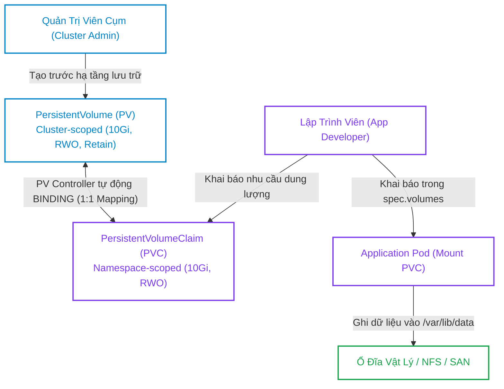
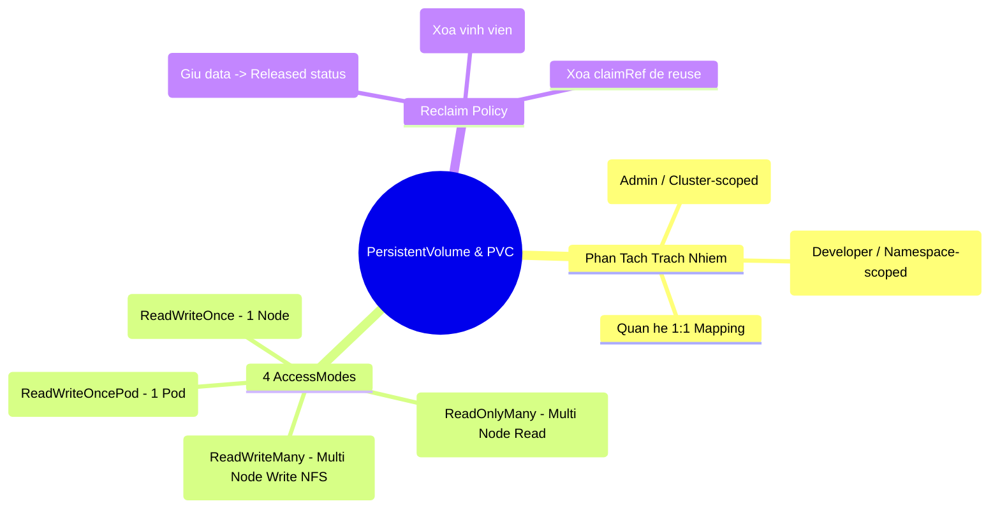


> [!IMPORTANT]
> **Mục tiêu kỹ thuật & Trọng tâm CKA**:
> - Hiểu rõ sự khác biệt bản chất giữa Ephemeral Volumes (`emptyDir`, `hostPath`) và Persistent Volumes.
> - Nắm vững vòng đời của PV: `Available` -> `Bound` -> `Released` -> `Failed`.
> - Cấu hình chính xác 4 chế độ `accessModes` tương ứng với từng loại thiết bị lưu trữ (Block Storage vs File Storage).
> - Làm chủ chính sách `persistentVolumeReclaimPolicy`: `Retain` vs `Delete`.
> - Thực hành quy trình xử lý thủ công để tái sử dụng một PV bị kẹt ở trạng thái `Released` sau khi xóa PVC.

---

## 1. Bản Chất Kiến Trúc & Tư Duy Cốt Lõi: Phân Tách Trách Nhiệm Lưu Trữ

Trong kiến trúc container, hệ thống tệp tin (Rootfs) bên trong Container là tạm thời (Ephemeral). Khi Container bị crash hoặc khởi động lại, mọi dữ liệu ghi trên tầng writable layer đều bị xóa sạch.

Để cung cấp khả năng lưu trữ bền vững (Persistent Storage) cho các ứng dụng cơ sở dữ liệu, Kubernetes thiết kế mô hình **Phân tách trách nhiệm (Separation of Concerns)** giữa người quản trị hạ tầng và người phát triển ứng dụng:



### 1.1. Phạm Vi Tài Nguyên (Resource Scope)

- **PersistentVolume (PV)**: Là tài nguyên cấp cụm (**Cluster-scoped**), không trực thuộc bất kỳ Namespace nào (tương tự như `Node`).
- **PersistentVolumeClaim (PVC)**: Là tài nguyên cấp không gian tên (**Namespace-scoped**), chỉ có thể được mount bởi các Pods nằm trong cùng Namespace với PVC đó.

---

## 2. Bảng Ma Trận So Sánh Kỹ Thuật Toàn Diện (Engineering Matrix)

Bảng đối chiếu 4 chế độ truy cập (`accessModes`) trong Kubernetes:

| Access Mode | Ký Hiệu Viết Tắt | Số Node Gắn Cùng Lúc | Quyền Hạn Đọc / Ghi | Loại Ổ Đĩa Tiêu Biểu |
| :--- | :--- | :--- | :--- | :--- |
| **ReadWriteOnce** | `RWO` | Đúng **1 Node vật lý** | Đọc và Ghi (Read-Write) | AWS EBS, GCP PD, Azure Disk, iSCSI |
| **ReadOnlyMany** | `ROX` | **Nhiều Node đồng thời**| Chỉ Đọc (Read-Only) | NFS, CephFS, AWS EFS, GlusterFS |
| **ReadWriteMany** | `RWX` | **Nhiều Node đồng thời**| Đọc và Ghi (Read-Write) | NFS, AWS EFS, CephFS, Azure Files |
| **ReadWriteOncePod**| `RWOP` | Đúng **1 Pod duy nhất** | Đọc và Ghi (Read-Write) | CSI Plugins hỗ trợ khóa cấp Pod |

### 2.1. Ma Trận Chính Sách Thu Hồi (`persistentVolumeReclaimPolicy`)

| Chính Sách | Hành Vi Khi Xóa PVC | Trạng Thái Của PV | Dữ Liệu Trên Ổ Đĩa Vật Lý | Khả Năng Tái Sử Dụng |
| :--- | :--- | :--- | :--- | :--- |
| **`Retain`** (Mặc định Static)| Giữ nguyên PV và Dữ liệu | Chuyển sang `Released` | **Còn nguyên vẹn 100%** | Cần Admin xóa `claimRef` thủ công |
| **`Delete`** (Mặc định Dynamic)| Tự động xóa PV | PV bị xóa hoàn toàn | **Bị xóa vĩnh viễn** khỏi Cloud | Không (Tài nguyên bị hủy) |
| **`Recycle`** (Deprecated) | Xóa dữ liệu bằng `rm -rf` | Chuyển sang `Available` | Bị xóa trắng | Có thể gán ngay cho PVC mới |

---

## 3. Cấu Trúc Khai Báo Manifest & Chi Tiết Ghép Nối

### 3.1. Khai Báo PersistentVolume (Static Provisioning với hostPath/NFS)

```yaml
apiVersion: v1
kind: PersistentVolume
metadata:
  name: enterprise-pv-01
  labels:
    tier: storage-gold
spec:
  capacity:
    storage: 10Gi
  volumeMode: Filesystem
  accessModes:
    - ReadWriteOnce
  persistentVolumeReclaimPolicy: Retain # Giữ dữ liệu khi xóa PVC
  storageClassName: manual
  hostPath:
    path: /mnt/data/enterprise-db
```

### 3.2. Khai Báo PersistentVolumeClaim & Gắn Vào Pod

```yaml
apiVersion: v1
kind: PersistentVolumeClaim
metadata:
  name: enterprise-db-pvc
  namespace: production
spec:
  accessModes:
    - ReadWriteOnce
  storageClassName: manual # Bắt buộc khớp với storageClassName của PV
  resources:
    requests:
      storage: 10Gi
---
apiVersion: v1
kind: Pod
metadata:
  name: database-app
  namespace: production
spec:
  containers:
    - name: postgres
      image: postgres:15-alpine
      env:
        - name: POSTGRES_PASSWORD
          value: "SecurePass2026"
      volumeMounts:
        - name: db-storage
          mountPath: /var/lib/postgresql/data
  volumes:
    - name: db-storage
      persistentVolumeClaim:
        claimName: enterprise-db-pvc
```

---

## 4. Phân Tích Cạm Bẫy Thực Chiến: PV Bị Kẹt `Released` & Không Thể Re-bind

### Tình huống 1: Xóa PVC và tạo lại nhưng PVC mới bị kẹt `Pending` vô tận

Kỹ sư xóa PVC cũ (`kubectl delete pvc my-pvc`) có chính sách `persistentVolumeReclaimPolicy: Retain`. Sau đó kỹ sư tạo một PVC mới với cấu hình giống hệt để mượn lại PV đó, nhưng PVC mới liên tục báo `Pending`.

### Hậu Quả & Log Lỗi Thực Tế:

```text
$ kubectl get pvc -n production
NAME         STATUS    VOLUME   CAPACITY   ACCESS MODES   STORAGECLASS   AGE
my-new-pvc   Pending                                      manual         2m

$ kubectl get pv enterprise-pv-01
NAME               CAPACITY   ACCESS MODES   RECLAIM POLICY   STATUS     CLAIM
enterprise-pv-01   10Gi       RWO            Retain           Released   production/my-pvc
```

### 5-Whys Root Cause Analysis:
1. **Tại sao PVC mới không bind được vào PV?** -> Trạng thái của PV đang là `Released`, không phải `Available`.
2. **Tại sao PV ở trạng thái `Released`?** -> PVC cũ đã bị xóa nhưng Reclaim Policy là `Retain`.
3. **Tại sao PV không tự chuyển sang `Available`?** -> PV vẫn còn lưu thông tin tham chiếu `spec.claimRef` trỏ vào UID của PVC cũ.
4. **Tại sao Kubernetes không tự xóa `claimRef`?** -> Để bảo vệ dữ liệu, tránh việc một PVC mới nhảy vào ghi đè dữ liệu cũ chưa được dọn dẹp.
5. **Giải pháp khắc phục là gì?** -> Quản trị viên kiểm tra dữ liệu, sau đó thực thi lệnh patch xóa trường `claimRef` trong PV để đưa PV về `Available`.

```bash
# Lệnh mở khóa PV đưa về Available:
kubectl patch pv enterprise-pv-01 --type='json' -p='[{"op": "remove", "path": "/spec/claimRef"}]'
```

---

### Tình huống 2: Pod bị kẹt `ContainerCreating` do vi phạm AccessMode ReadWriteOnce (RWO)

Một PV dạng AWS EBS (chỉ hỗ trợ `ReadWriteOnce`) được mount bởi Pod 1 trên Node A. Deployment scale up tạo Pod 2 trên Node B cũng mount cùng PVC này.

### Hậu Quả & Log Lỗi Thực Tế:

```text
Events:
  Type     Reason              Age   From                     Message
  ----     ------              ----  ----                     -------
  Warning  FailedAttachVolume  15s   attachdetach-controller  Multi-Attach error for volume "pvc-8912x" Volume is already exclusively attached to one node and can't be attached to another
```

> [!WARNING]
> `ReadWriteOnce` (`RWO`) có nghĩa là **Read-Write bởi DUY NHẤT 1 Node vật lý tại một thời điểm**. Nếu muốn nhiều Pods trên nhiều Node khác nhau cùng ghi đọc song song, bạn bắt buộc phải sử dụng storage hỗ trợ **`ReadWriteMany` (`RWX`)** như NFS, AWS EFS, hoặc CephFS.

---

## 5. Hands-on Lab: Khởi Tạo, Ghép Nối & Tái Sử Dụng PV (8 Bước)

Bảng tổng hợp 8 bước thực hành:

| Bước | Thao Tác | Mục Tiêu Kỹ Thuật | Lệnh / Công Cụ |
| :--- | :--- | :--- | :--- |
| **1** | Chuẩn bị thư mục dữ liệu trên Node | Tạo đường dẫn `/mnt/disk/pv-lab` | `mkdir -p`, `chmod 777` |
| **2** | Khởi tạo PersistentVolume (PV) | Tạo PV 2Gi, RWO, Retain | `kubectl apply -f pv.yaml` |
| **3** | Khởi tạo PersistentVolumeClaim (PVC)| Yêu cầu dung lượng 2Gi | `kubectl apply -f pvc.yaml` |
| **4** | Xác minh Trạng Thái `Bound` | Kiểm tra quan hệ ghép nối 1:1 | `kubectl get pv,pvc` |
| **5** | Triển khai Pod ghi dữ liệu | Ghi tệp kiểm thử vào Volume | `kubectl exec -- echo ...` |
| **6** | Xóa Pod và Xóa PVC | Kích hoạt chu trình Retain của PV | `kubectl delete pvc` |
| **7** | Quan sát PV chuyển sang `Released` | Xác nhận PV bị khóa an toàn | `kubectl get pv` |
| **8** | Mở khóa PV và Tái sử dụng | Xóa `claimRef` đưa về `Available` | `kubectl patch pv` |

---

### Bước 1: Chuẩn bị thư mục trên Worker Node

Đăng nhập vào node `worker-01` và tạo thư mục lưu trữ:

```bash
sudo mkdir -p /mnt/disk/pv-lab
sudo chmod 777 /mnt/disk/pv-lab
echo "Dữ liệu ban đầu từ năm 2026" | sudo tee /mnt/disk/pv-lab/welcome.txt
```

---

### Bước 2: Tạo PersistentVolume (Cluster-scoped)

```bash
cat <<EOF | kubectl apply -f -
apiVersion: v1
kind: PersistentVolume
metadata:
  name: lab-pv-01
spec:
  capacity:
    storage: 2Gi
  accessModes:
    - ReadWriteOnce
  persistentVolumeReclaimPolicy: Retain
  storageClassName: local-storage
  hostPath:
    path: /mnt/disk/pv-lab
EOF
```

Kiểm tra trạng thái PV vừa tạo (`Available`):

```bash
kubectl get pv lab-pv-01
```

Output:
```text
NAME        CAPACITY   ACCESS MODES   RECLAIM POLICY   STATUS      CLAIM   STORAGECLASS    AGE
lab-pv-01   2Gi        RWO            Retain           Available           local-storage   10s
```

---

### Bước 3: Tạo PersistentVolumeClaim trong namespace `default`

```bash
cat <<EOF | kubectl apply -f -
apiVersion: v1
kind: PersistentVolumeClaim
metadata:
  name: lab-pvc-01
  namespace: default
spec:
  accessModes:
    - ReadWriteOnce
  storageClassName: local-storage
  resources:
    requests:
      storage: 2Gi
EOF
```

---

### Bước 4: Xác nhận trạng thái Ghép nối (Bound)

```bash
kubectl get pv,pvc
```

Output xác nhận cả hai đều chuyển sang `Bound`:
```text
NAME                         CAPACITY   ACCESS MODES   RECLAIM POLICY   STATUS   CLAIM                STORAGECLASS
persistentvolume/lab-pv-01   2Gi        RWO            Retain           Bound    default/lab-pvc-01   local-storage

NAME                               STATUS   VOLUME      CAPACITY   ACCESS MODES   STORAGECLASS
persistentvolumeclaim/lab-pvc-01   Bound    lab-pv-01   2Gi        RWO            local-storage
```

---

### Bước 5: Triển khai Pod đọc và ghi thêm dữ liệu vào PVC

```bash
cat <<EOF | kubectl apply -f -
apiVersion: v1
kind: Pod
metadata:
  name: storage-tester
  namespace: default
spec:
  nodeName: worker-01 # hostPath yêu cầu chạy đúng Node chứa thư mục
  containers:
    - name: tester
      image: busybox:1.36
      command: ["sleep", "3600"]
      volumeMounts:
        - name: my-vol
          mountPath: /data
  volumes:
    - name: my-vol
      persistentVolumeClaim:
        claimName: lab-pvc-01
EOF
```

Ghi thêm tệp tin vào ổ đĩa:

```bash
kubectl exec -it storage-tester -- cat /data/welcome.txt
kubectl exec -it storage-tester -- sh -c "echo 'App transaction data' > /data/tx.log"
```

---

### Bước 6 & 7: Xóa Pod, xóa PVC và quan sát trạng thái `Released`

```bash
kubectl delete pod storage-tester
kubectl delete pvc lab-pvc-01

kubectl get pv lab-pv-01
```

Output ghi nhận PV ở trạng thái `Released` (vẫn còn giữ `CLAIM: default/lab-pvc-01`):
```text
NAME        CAPACITY   ACCESS MODES   RECLAIM POLICY   STATUS     CLAIM                STORAGECLASS
lab-pv-01   2Gi        RWO            Retain           Released   default/lab-pvc-01   local-storage
```

---

### Bước 8: Mở khóa PV để đưa trở lại trạng thái `Available`

Chạy lệnh patch xóa trường `spec.claimRef`:

```bash
kubectl patch pv lab-pv-01 --type='json' -p='[{"op": "remove", "path": "/spec/claimRef"}]'
kubectl get pv lab-pv-01
```

Output:
```text
NAME        CAPACITY   ACCESS MODES   RECLAIM POLICY   STATUS      CLAIM   STORAGECLASS
lab-pv-01   2Gi        RWO            Retain           Available           local-storage
```

PV đã sẵn sàng cho một PVC khác kết nối và toàn bộ dữ liệu `/mnt/disk/pv-lab/tx.log` vẫn được bảo toàn nguyên vẹn!

---

## 6. 10 Câu Hỏi Tự Kiểm Tra Chuyên Sâu (Self-Check Q&A Accordion)

<details class="qa-card">
  <summary><b>Câu 1: PersistentVolume (PV) và PersistentVolumeClaim (PVC) khác nhau về phạm vi (Scope) như thế nào?</b></summary>
  <div class="qa-answer">
    <b>Trả lời:</b><br>
    <ul>
      <li><b>PersistentVolume (PV):</b> Là tài nguyên cấp cụm (<b>Cluster-scoped</b>), không trực thuộc bất kỳ Namespace nào, do Quản trị viên cụm (Cluster Administrator) quản lý.</li>
      <li><b>PersistentVolumeClaim (PVC):</b> Là tài nguyên cấp không gian tên (<b>Namespace-scoped</b>), do Nhà phát triển ứng dụng (Developer) tạo ra trong một Namespace cụ thể để yêu cầu dung lượng lưu trữ.</li>
    </ul>
  </div>
</details>

<details class="qa-card">
  <summary><b>Câu 2: Bốn điều kiện để một PVC có thể ghép nối (Bound) thành công với một PV có sẵn là gì?</b></summary>
  <div class="qa-answer">
    <b>Trả lời:</b><br>
    1. Dung lượng của PV phải <b>lớn hơn hoặc bằng</b> dung lượng yêu cầu trong PVC.<br>
    2. Chế độ truy cập (<code>accessModes</code>) của PV phải khớp hoặc bao hàm chế độ yêu cầu của PVC.<br>
    3. Tên <code>storageClassName</code> của cả hai phải trùng khớp hoàn toàn (hoặc cùng để trống).<br>
    4. Trạng thái của PV phải đang là <code>Available</code> (chưa bị bind bởi PVC khác).
  </div>
</details>

<details class="qa-card">
  <summary><b>Câu 3: Bốn chế độ truy cập (AccessModes) trong Kubernetes là gì?</b></summary>
  <div class="qa-answer">
    <b>Trả lời:</b><br>
    <ul>
      <li><b>ReadWriteOnce (RWO):</b> Cho phép đúng 1 Node vật lý mount ở chế độ đọc-ghi.</li>
      <li><b>ReadOnlyMany (ROX):</b> Cho phép nhiều Node mount đồng thời ở chế độ chỉ đọc.</li>
      <li><b>ReadWriteMany (RWX):</b> Cho phép nhiều Node mount đồng thời ở chế độ đọc-ghi (yêu cầu File Storage như NFS/EFS).</li>
      <li><b>ReadWriteOncePod (RWOP):</b> Cho phép duy nhất 1 Pod mount ở chế độ đọc-ghi trên toàn cụm.</li>
    </ul>
  </div>
</details>

<details class="qa-card">
  <summary><b>Câu 4: Điều gì xảy ra với dữ liệu và đối tượng PV khi xóa PVC nếu persistentVolumeReclaimPolicy là Retain?</b></summary>
  <div class="qa-answer">
    <b>Trả lời:</b><br>
    Dữ liệu trên ổ đĩa vật lý và đối tượng PV <b>vẫn còn nguyên vẹn 100%</b>. Đối tượng PV sẽ chuyển từ trạng thái <code>Bound</code> sang trạng thái <code>Released</code>. PV này sẽ không cho phép bất kỳ PVC mới nào bind vào cho đến khi Quản trị viên can thiệp xử lý thủ công.
  </div>
</details>

<details class="qa-card">
  <summary><b>Câu 5: Làm thế nào để tái sử dụng một PV đang ở trạng thái Released cho một PVC mới?</b></summary>
  <div class="qa-answer">
    <b>Trả lời:</b><br>
    Sử dụng lệnh patch để xóa trường tham chiếu <code>spec.claimRef</code> trong manifest của PV:<br>
    <code>kubectl patch pv &lt;pv-name&gt; --type='json' -p='[{"op": "remove", "path": "/spec/claimRef"}]'</code><br>
    Sau lệnh này, PV sẽ chuyển sang trạng thái <code>Available</code> và sẵn sàng bind với PVC mới.
  </div>
</details>

<details class="qa-card">
  <summary><b>Câu 6: Sự khác biệt giữa volumeMode: Filesystem và volumeMode: Block là gì?</b></summary>
  <div class="qa-answer">
    <b>Trả lời:</b><br>
    <ul>
      <li><b>Filesystem (Mặc định):</b> Volume được format định dạng tệp (ext4, xfs) và mount thành một thư mục cây tệp tin bên trong Container.</li>
      <li><b>Block:</b> Volume được đưa thẳng vào Container dưới dạng một thiết bị khối thô (Raw Block Device, ví dụ: <code>/dev/xvda</code>) không qua filesystem, dành cho các ứng dụng cơ sở dữ liệu hiệu năng cao tự quản lý I/O đĩa (như Oracle ASM).</li>
    </ul>
  </div>
</details>

<details class="qa-card">
  <summary><b>Câu 7: Tại sao volume hostPath không được khuyến nghị sử dụng cho môi trường Production đa Node?</b></summary>
  <div class="qa-answer">
    <b>Trả lời:</b><br>
    Bởi vì <code>hostPath</code> liên kết dữ liệu trực tiếp với một thư mục cục bộ trên ổ đĩa của một máy chủ Node duy nhất. Nếu Pod bị chết và Kube-Scheduler lập lịch Pod mới sang một Node khác, Pod mới sẽ không thể truy cập dữ liệu cũ trên Node ban đầu.
  </div>
</details>

<details class="qa-card">
  <summary><b>Câu 8: Một PVC yêu cầu 5Gi storage có thể bind vào một PV có dung lượng 20Gi được không?</b></summary>
  <div class="qa-answer">
    <b>Trả lời:</b><br>
    <b>CÓ THỂ</b>. Kubernetes sẽ bind thành công nếu các thông số khác khớp nhau. Tuy nhiên, toàn bộ 20Gi của PV đó sẽ bị chiếm dụng riêng bởi PVC này (lãng phí 15Gi dung lượng), vì quan hệ giữa PV và PVC luôn là quan hệ ánh xạ <b>1:1</b>.
  </div>
</details>

<details class="qa-card">
  <summary><b>Câu 9: Bốn trạng thái trong vòng đời của một PersistentVolume là gì?</b></summary>
  <div class="qa-answer">
    <b>Trả lời:</b><br>
    <ul>
      <li><b>Available:</b> Tài nguyên đĩa rảnh rỗi, sẵn sàng để bind.</li>
      <li><b>Bound:</b> Đã được ghép nối thành công với một PVC.</li>
      <li><b>Released:</b> PVC liên kết đã bị xóa, nhưng tài nguyên chưa được thu hồi bởi cluster.</li>
      <li><b>Failed:</b> Quá trình tự động thu hồi/dọn dẹp dữ liệu của PV bị lỗi.</li>
    </ul>
  </div>
</details>

<details class="qa-card">
  <summary><b>Câu 10: Trường selector trong spec của PersistentVolumeClaim có tác dụng gì?</b></summary>
  <div class="qa-answer">
    <b>Trả lời:</b><br>
    Trường <code>spec.selector</code> trong PVC cho phép người dùng chỉ định nhãn nhãn (<code>matchLabels</code> hoặc <code>matchExpressions</code>) để lọc và <b>chỉ ghép nối với đúng PersistentVolume nào sở hữu các nhãn tương ứng</b>, giúp định hướng chính xác PVC vào loại ổ đĩa vật lý mong muốn (ví dụ: ổ SSD tốc độ cao).
  </div>
</details>

---

## 7. Tổng Kết & Lộ Trình Bài Học Tiếp Theo



Làm chủ cơ chế quản trị PersistentVolume và PersistentVolumeClaim giúp bạn tự tin xây dựng các hệ thống lưu trữ dữ liệu an toàn, đảm bảo tính toàn vẹn thông tin trước mọi sự cố sập container trên Kubernetes.

> [!TIP]
> **Bài học tiếp theo**: Trong [Bài 27: Cấp Phát Động StorageClass, Container Storage Interface (CSI) & Mở Rộng Dung Lượng Volume](cka-27-27-storageclass-csi-va-mo-rong.html), chúng ta sẽ nghiên cứu cơ chế cấp phát đĩa tự động theo yêu cầu (Dynamic Provisioning), chuẩn giao tiếp CSI hiện đại, tham số `volumeBindingMode: WaitForFirstConsumer` và kỹ thuật mở rộng dung lượng PVC online không downtime.

