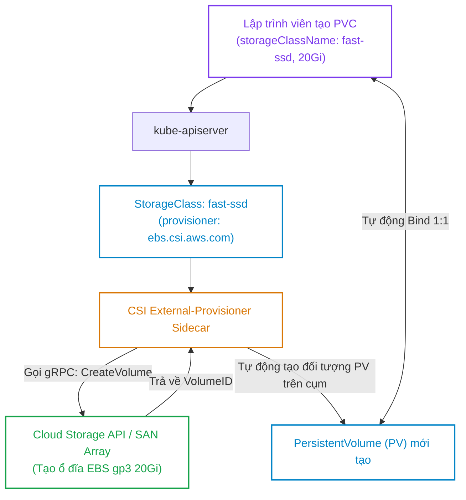
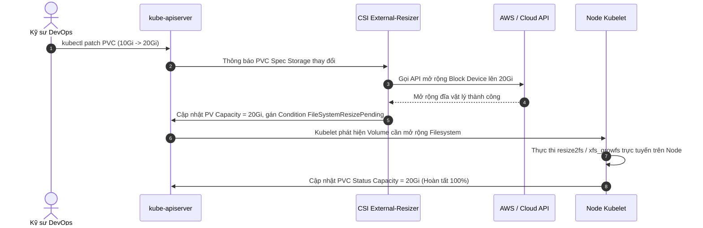
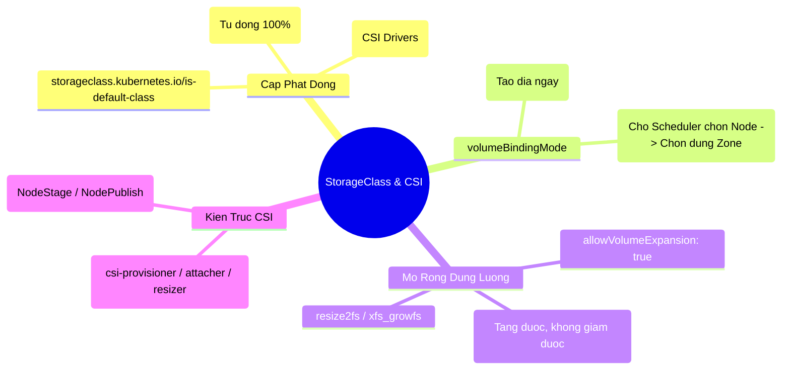


> [!IMPORTANT]
> **Mục tiêu kỹ thuật & Trọng tâm CKA**:
> - Hiểu rõ sự tiến hóa từ In-tree Volume Plugins sang chuẩn Out-of-tree Container Storage Interface (CSI).
> - Cấu hình StorageClass hỗ trợ Dynamic Provisioning với các tham số `provisioner`, `parameters`, `reclaimPolicy`.
> - Phân biệt bản chất và ứng dụng của `volumeBindingMode: Immediate` vs `WaitForFirstConsumer`.
> - Thực hiện mở rộng dung lượng PVC trực tiếp trên cụm đang chạy và kiểm tra việc tự động resize Filesystem.
> - Thiết lập và chuyển đổi StorageClass mặc định của cụm Kubernetes.

---

## 1. Bản Chất Kiến Trúc & Tư Duy Cốt Lõi: Cấp Phát Động & Chuẩn CSI

Trong mô hình cấp phát tĩnh (Static Provisioning ở Bài 26), Quản trị viên phải dự đoán trước và tạo sẵn hàng loạt PV với các mức dung lượng 5Gi, 10Gi, 20Gi. Phương pháp này bộc lộ nhiều điểm yếu: tốn công sức quản trị, lãng phí tài nguyên và không thể tự động co giãn theo CI/CD pipelines.

**Cấp Phát Động (Dynamic Provisioning)** thông qua **StorageClass** giải quyết triệt để vấn đề này:



### 1.1. Kiến Trúc CSI (Container Storage Interface)

CSI là chuẩn mở tiêu chuẩn công nghiệp (Industry Standard) cho phép các nhà cung cấp lưu trữ (AWS, Google Cloud, Azure, Dell EMC, NetApp, Ceph) phát triển driver độc lập mà không cần nhúng mã nguồn vào Kubernetes Core:

1. **Controller Plugin (Deployment)**: Chạy trên Control Plane, gồm các container sidecar:
   - `csi-provisioner`: Lắng nghe PVC và tạo/xóa đĩa trên Cloud Storage API.
   - `csi-attacher`: Gắn (Attach) hoặc Tháo (Detach) ổ đĩa vào máy chủ Node.
   - `csi-resizer`: Mở rộng dung lượng đĩa khi PVC tăng size.
2. **Node Plugin (DaemonSet)**: Chạy trên từng Worker Node:
   - `node-driver-registrar`: Đăng ký driver với Kubelet.
   - `csi-node`: Format định dạng tệp (ext4/xfs) và mount ổ đĩa vào thư mục của Pod (`NodeStageVolume`, `NodePublishVolume`).

---

## 2. Bảng Ma Trận So Sánh Kỹ Thuật Toàn Diện (Engineering Matrix)

Bảng phân tích sự khác nhau giữa hai chế độ `volumeBindingMode`:

| Tiêu Chí Kỹ Thuật | Immediate (Mặc định) | WaitForFirstConsumer (Khuyến nghị) |
| :--- | :--- | :--- |
| **Thời điểm tạo PV** | Ngay lập tức khi tạo PVC | Trì hoãn cho tới khi có Pod sử dụng PVC xuất hiện |
| **Nhận biết vị trí Node** | **Không** (Tạo đĩa ở Zone ngẫu nhiên trên Cloud)| **Có** (Chờ Scheduler chọn Node xong mới tạo đĩa)|
| **Nguy cơ lỗi Topology** | Rất cao (Đĩa tạo ở `us-east-1a`, Pod chạy ở `us-east-1b`)| **Triệt tiêu 100% lỗi lệch Zone** |
| **Độ trễ gắn Pod** | Nhanh hơn lúc tạo Pod (vì đĩa đã có sẵn) | Chậm hơn vài giây ở lần khởi chạy Pod đầu tiên |
| **Loại lưu trữ bắt buộc** | Đĩa chia sẻ đa vùng (NFS, EFS) | **Block Storage gắn trực tiếp** (EBS, Local Disk, Ceph RBD)|

---

## 3. Cấu Trúc Khai Báo Manifest & Chi Tiết Mở Rộng Dung Lượng

### 3.1. StorageClass Manifest Chuẩn Doanh Nghiệp

```yaml
apiVersion: storage.k8s.io/v1
kind: StorageClass
metadata:
  name: premium-ssd-sc
  annotations:
    storageclass.kubernetes.io/is-default-class: "true" # Đặt làm StorageClass mặc định
provisioner: ebs.csi.aws.com # Tên CSI driver phụ trách
volumeBindingMode: WaitForFirstConsumer # Tránh lỗi lệch Availability Zone
allowVolumeExpansion: true # Cho phép mở rộng đĩa online
reclaimPolicy: Delete # Xóa đĩa trên Cloud khi xóa PVC (hoặc Retain)
parameters:
  type: gp3
  iops: "3000"
  throughput: "125"
  encrypted: "true"
```

### 3.2. Khai Báo PVC Tiêu Thụ StorageClass & Quy Trình Mở Rộng Dung Lượng

```yaml
apiVersion: v1
kind: PersistentVolumeClaim
metadata:
  name: mysql-data-pvc
  namespace: database
spec:
  accessModes:
    - ReadWriteOnce
  storageClassName: premium-ssd-sc
  resources:
    requests:
      storage: 10Gi # Ban đầu cấp 10Gi
```

Quy trình mở rộng trực tuyến (Online Expansion) lên 20Gi:
1. Chạy lệnh: `kubectl patch pvc mysql-data-pvc -n database -p '{"spec":{"resources":{"requests":{"storage":"20Gi"}}}}'`
2. `csi-resizer` gọi Cloud API tăng kích thước đĩa vật lý.
3. Kubelet trên Node tự động gọi `resize2fs` (ext4) hoặc `xfs_growfs` (xfs) để mở rộng Filesystem bên trong Container **mà không cần dừng Pod**.



---

## 4. Phân Tích Cạm Bẫy Thực Chiến: Sự Cố Topology Mismatch & Lỗi Cấp Phát

### Tình huống 1: Lỗi `volume node affinity conflict` do dùng `volumeBindingMode: Immediate`

Một cụm Kubernetes chạy trên AWS đa vùng (Multi-AZ: `us-east-1a`, `us-east-1b`). Kỹ sư tạo PVC với StorageClass có `volumeBindingMode: Immediate`. Ổ đĩa EBS được tạo ngay lập tức tại zone `us-east-1a`. Sau đó, Kube-Scheduler xếp lịch Pod chạy trên một Worker Node nằm ở zone `us-east-1b` (do zone 1a đang hết CPU).

### Hậu Quả & Log Lỗi Thực Tế:

```text
$ kubectl get pods -n database
NAME          READY   STATUS   RESTARTS   AGE
mysql-app-0   0/1     Pending  0          3m

$ kubectl describe pod mysql-app-0 -n database
Events:
  Type     Reason            Age   From               Message
  ----     ------            ----  ----               -------
  Warning  FailedScheduling  15s   default-scheduler  0/3 nodes are available: 1 node(s) had volume node affinity conflict, 2 node(s) had untolerated taint.
```

### 5-Whys Root Cause Analysis:
1. **Tại sao Pod bị kẹt Pending?** -> Scheduler không thể gán Pod vào Node ở zone `us-east-1b`.
2. **Tại sao không gán được?** -> Ổ đĩa EBS đã bị gắn chặt (Topology Affined) vào zone `us-east-1a`.
3. **Tại sao đĩa lại nằm ở zone 1a?** -> StorageClass sử dụng chế độ mặc định `volumeBindingMode: Immediate`, tạo đĩa ngay khi có PVC mà không biết Pod sẽ chạy ở đâu.
4. **Tại sao Node ở zone 1a không chạy Pod?** -> Node ở zone 1a đã hết tài nguyên CPU.
5. **Giải pháp khắc phục triệt để là gì?** -> Luôn cấu hình **`volumeBindingMode: WaitForFirstConsumer`** trong StorageClass.

---

### Tình huống 2: Cố tình thu nhỏ dung lượng PVC (Downsizing Unsupported)

Kỹ sư lỡ tay sửa dung lượng PVC từ 50Gi xuống 20Gi (`kubectl patch pvc ... storage=20Gi`).

### Hậu Quả & Log Lỗi Thực Tế:

```text
The PersistentVolumeClaim "mysql-data-pvc" is invalid: 
spec.resources.requests.storage: Forbidden: field can not be less than previous value
```

> [!WARNING]
> Hầu hết các hệ thống tệp tin Linux (ext4, xfs) và các nhà cung cấp Cloud Storage **KHÔNG HỖ TRỢ thu nhỏ dung lượng trực tuyến** vì nguy cơ làm hỏng cấu trúc phân vùng và mất mát dữ liệu. Kubernetes chặn hoàn toàn việc giảm `storage` ngay tại tầng API Validation. Muốn giảm dung lượng, bắt buộc phải tạo PVC mới dung lượng nhỏ hơn và tự migrate dữ liệu sang.

---

## 5. Hands-on Lab: Cấp Phát Động & Mở Rộng Ổ Đĩa Trực Tuyến (8 Bước)

Bảng tổng hợp 8 bước thực hành:

| Bước | Thao Tác | Mục Tiêu Kỹ Thuật | Lệnh / Công Cụ |
| :--- | :--- | :--- | :--- |
| **1** | Khảo sát StorageClass hiện có | Kiểm tra danh sách provisioner | `kubectl get sc` |
| **2** | Tạo Custom StorageClass | Cấu hình `WaitForFirstConsumer` & Expansion | `kubectl apply -f sc.yaml` |
| **3** | Khởi tạo PVC Cấp phát động | Yêu cầu 1Gi dung lượng | `kubectl apply -f dynamic-pvc.yaml` |
| **4** | Xác nhận PVC ở trạng thái `Pending`| Chứng minh cơ chế WaitForFirstConsumer | `kubectl get pvc` |
| **5** | Triển khai Pod sử dụng PVC | Kích hoạt Kubelet tạo PV tự động | `kubectl apply -f app-pod.yaml` |
| **6** | Xác nhận PV được tạo và `Bound` | Kiểm tra chu trình Dynamic Provisioning | `kubectl get pv,pvc` |
| **7** | Mở rộng dung lượng PVC lên 3Gi | Thực hiện Online Volume Expansion | `kubectl patch pvc` |
| **8** | Kiểm định Filesystem trong Container| Xác nhận dung lượng đĩa thực tế tăng | `kubectl exec -- df -h` |

---

### Bước 1 & 2: Tạo StorageClass hỗ trợ mở rộng đĩa và trì hoãn binding

```bash
cat <<EOF | kubectl apply -f -
apiVersion: storage.k8s.io/v1
kind: StorageClass
metadata:
  name: local-expandable-sc
provisioner: rancher.io/local-path # Hoặc provisioner CSI của cụm lab
volumeBindingMode: WaitForFirstConsumer
allowVolumeExpansion: true
reclaimPolicy: Delete
EOF
```

---

### Bước 3: Tạo PersistentVolumeClaim yêu cầu 1Gi

```bash
cat <<EOF | kubectl apply -f -
apiVersion: v1
kind: PersistentVolumeClaim
metadata:
  name: dynamic-pvc-demo
  namespace: default
spec:
  accessModes:
    - ReadWriteOnce
  storageClassName: local-expandable-sc
  resources:
    requests:
      storage: 1Gi
EOF
```

---

### Bước 4: Quan sát PVC giữ trạng thái `Pending` (Đúng theo thiết kế)

```bash
kubectl get pvc dynamic-pvc-demo
```

Output:
```text
NAME               STATUS    VOLUME   CAPACITY   ACCESS MODES   STORAGECLASS          AGE
dynamic-pvc-demo   Pending                                      local-expandable-sc   15s
```

PVC chưa tạo PV vì đang chờ Pod đầu tiên xuất hiện để xác định Node.

---

### Bước 5: Triển khai Pod tiêu thụ PVC

```bash
cat <<EOF | kubectl apply -f -
apiVersion: v1
kind: Pod
metadata:
  name: dynamic-storage-app
  namespace: default
spec:
  containers:
    - name: writer
      image: busybox:1.36
      command: ["sleep", "3600"]
      volumeMounts:
        - name: data-vol
          mountPath: /data
  volumes:
    - name: data-vol
      persistentVolumeClaim:
        claimName: dynamic-pvc-demo
EOF
```

---

### Bước 6: Xác nhận PV tự động sinh ra và chuyển sang `Bound`

```bash
sleep 10
kubectl get pvc dynamic-pvc-demo
kubectl get pv
```

Output xác nhận PV được tự động sinh ra với tiền tố `pvc-...` và chuyển sang `Bound`:
```text
NAME                                       CAPACITY   ACCESS MODES   RECLAIM POLICY   STATUS   CLAIM
pvc-a78b9c12-34ef-5678-90ab-cdef12345678   1Gi        RWO            Delete           Bound    default/dynamic-pvc-demo
```

---

### Bước 7: Mở rộng dung lượng PVC từ 1Gi lên 3Gi trực tuyến

Thực thi lệnh patch tăng kích thước lưu trữ:

```bash
kubectl patch pvc dynamic-pvc-demo -p '{"spec":{"resources":{"requests":{"storage":"3Gi"}}}}'
```

Kiểm tra trạng thái PVC:

```bash
kubectl get pvc dynamic-pvc-demo
```

Output xác nhận dung lượng PVC đã mở rộng thành `3Gi`:
```text
NAME               STATUS   VOLUME                                     CAPACITY   ACCESS MODES   STORAGECLASS
dynamic-pvc-demo   Bound    pvc-a78b9c12-34ef-5678-90ab-cdef12345678   3Gi        RWO            local-expandable-sc
```

---

### Bước 8: Kiểm tra dung lượng hệ thống tệp tin bên trong Container

```bash
kubectl exec -it dynamic-storage-app -- df -h /data
```

Output xác nhận Filesystem đã tự động nở rộng lên ~3.0G mà Pod không hề bị dừng:
```text
Filesystem                Size      Used Available Use% Mounted on
/dev/sdX                  2.9G     12.0M      2.8G   1% /data
```

---

## 6. 10 Câu Hỏi Tự Kiểm Tra Chuyên Sâu (Self-Check Q&A Accordion)

<details class="qa-card">
  <summary><b>Câu 1: StorageClass trong Kubernetes giải quyết bài toán gì vượt trội hơn mô hình cấp phát tĩnh?</b></summary>
  <div class="qa-answer">
    <b>Trả lời:</b><br>
    StorageClass cung cấp cơ chế <b>Cấp phát động (Dynamic Provisioning)</b>: thay vì Quản trị viên phải tạo trước hàng loạt PersistentVolume thủ công, StorageClass tự động gọi API của nhà cung cấp đĩa (thông qua CSI Driver) để tạo ổ đĩa thực tế ngay khi có PersistentVolumeClaim xuất hiện, giúp tự động hóa 100% quy trình cấp phát lưu trữ.
  </div>
</details>

<details class="qa-card">
  <summary><b>Câu 2: Tại sao chế độ volumeBindingMode: WaitForFirstConsumer được khuyến nghị sử dụng hơn chế độ Immediate?</b></summary>
  <div class="qa-answer">
    <b>Trả lời:</b><br>
    Chế độ <code>WaitForFirstConsumer</code> trì hoãn việc cấp phát đĩa cho tới khi Pod sử dụng PVC được <code>kube-scheduler</code> chọn xong Node chạy. Điều này đảm bảo ổ đĩa vật lý (như AWS EBS) luôn được tạo chính xác tại cùng một Availability Zone với Node mà Pod sẽ cư ngụ, triệt tiêu hoàn toàn sự cố <b>Topology Mismatch</b> (lỗi lệch vùng).
  </div>
</details>

<details class="qa-card">
  <summary><b>Câu 3: Thuộc tính nào trong StorageClass cho phép người dùng tăng dung lượng của PVC sau khi đã tạo?</b></summary>
  <div class="qa-answer">
    <b>Trả lời:</b><br>
    Thuộc tính <b><code>allowVolumeExpansion: true</code></b>. Nếu thuộc tính này bị đặt là <code>false</code> hoặc không khai báo, mọi thao tác sửa đổi trường <code>spec.resources.requests.storage</code> trên PVC sẽ bị API Server từ chối.
  </div>
</details>

<details class="qa-card">
  <summary><b>Câu 4: Annotation nào dùng để thiết lập một StorageClass làm StorageClass mặc định của toàn cụm?</b></summary>
  <div class="qa-answer">
    <b>Trả lời:</b><br>
    Sử dụng annotation:<br>
    <code>storageclass.kubernetes.io/is-default-class: "true"</code><br>
    Khi có annotation này, bất kỳ PVC nào tạo ra mà không khai báo trường <code>storageClassName</code> sẽ tự động sử dụng StorageClass này.
  </div>
</details>

<details class="qa-card">
  <summary><b>Câu 5: Chuẩn giao tiếp CSI (Container Storage Interface) mang lại lợi ích gì so với các In-tree Volume Plugins cũ?</b></summary>
  <div class="qa-answer">
    <b>Trả lời:</b><br>
    CSI tách rời mã nguồn của các nhà cung cấp lưu trữ ra khỏi mã nguồn lõi của Kubernetes (Out-of-tree). Điều này cho phép các hãng lưu trữ có thể cập nhật, vá lỗi và phát hành driver mới độc lập theo chu kỳ riêng mà không cần chờ đợi các bản phát hành chính thức của Kubernetes Core, đồng thời giảm thiểu rủi ro bảo mật cho <code>kube-controller-manager</code>.
  </div>
</details>

<details class="qa-card">
  <summary><b>Câu 6: Ba container sidecar chuẩn chạy kèm trong một triển khai CSI Controller Plugin là gì?</b></summary>
  <div class="qa-answer">
    <b>Trả lời:</b><br>
    <ul>
      <li><b>csi-provisioner:</b> Lắng nghe sự kiện PVC để tạo và xóa đĩa trên hệ thống lưu trữ bên ngoài.</li>
      <li><b>csi-attacher:</b> Thực hiện thao tác gắn (Attach) và tháo (Detach) đĩa vào máy chủ Node.</li>
      <li><b>csi-resizer:</b> Theo dõi việc tăng dung lượng PVC để gọi API mở rộng kích thước đĩa vật lý.</li>
    </ul>
  </div>
</details>

<details class="qa-card">
  <summary><b>Câu 7: Có thể thu nhỏ (shrink/downsize) dung lượng của một PVC đang chạy không và tại sao?</b></summary>
  <div class="qa-answer">
    <b>Trả lời:</b><br>
    <b>KHÔNG THỂ</b>. Kubernetes và hầu hết các hệ điều hành Linux (ext4, xfs) không hỗ trợ thu nhỏ dung lượng trực tuyến vì nguy cơ làm hỏng bảng phân vùng và mất mát dữ liệu. Kubernetes API Server sẽ chặn hoàn toàn mọi yêu cầu giảm dung lượng lưu trữ trong PVC.
  </div>
</details>

<details class="qa-card">
  <summary><b>Câu 8: Giá trị reclaimPolicy trong StorageClass mặc định là gì nếu không khai báo rõ ràng?</b></summary>
  <div class="qa-answer">
    <b>Trả lời:</b><br>
    Mặc định là <b><code>Delete</code></b> (đối với các PV được tạo động qua StorageClass). Khi PVC bị xóa, PV và toàn bộ dữ liệu trên ổ đĩa vật lý của nhà cung cấp Cloud sẽ tự động bị xóa theo.
  </div>
</details>

<details class="qa-card">
  <summary><b>Câu 9: Khi mở rộng dung lượng PVC thành công, tại sao cần kiểm tra cả dung lượng Filesystem bằng lệnh df -h bên trong Pod?</b></summary>
  <div class="qa-answer">
    <b>Trả lời:</b><br>
    Bởi vì việc mở rộng gồm 2 giai đoạn: (1) Mở rộng kích thước khối đĩa vật lý (Block Device Size) trên Cloud, và (2) Mở rộng hệ thống tệp tin (Filesystem Resize) trên Node. Kiểm tra bằng <code>df -h</code> đảm bảo Kubelet đã hoàn tất bước 2 và ứng dụng thực sự có thể ghi thêm dữ liệu vào không gian mới.
  </div>
</details>

<details class="qa-card">
  <summary><b>Câu 10: Nếu cụm có 2 StorageClass cùng được gắn annotation is-default-class: "true" thì điều gì xảy ra?</b></summary>
  <div class="qa-answer">
    <b>Trả lời:</b><br>
    Khi có nhiều hơn 1 StorageClass mặc định, Kubernetes Admission Controller sẽ <b>từ chối tự động gán</b> cho các PVC không khai báo <code>storageClassName</code> và trả về lỗi, buộc người dùng phải chỉ định tường minh tên StorageClass cần dùng.
  </div>
</details>

---

## 7. Tổng Kết & Lộ Trình Bài Học Tiếp Theo



Nắm vững cơ chế cấp phát động với StorageClass và chuẩn CSI là nền tảng tối quan trọng giúp bạn tự tin vận hành các cơ sở dữ liệu phân tán quy mô lớn và vượt qua mọi câu hỏi thực hành lưu trữ trong kỳ thi CKA.

> [!TIP]
> **Bài học tiếp theo**: Trong [Bài 28: Phương Pháp Chẩn Đoán Sự Cố 4 Tầng Kubernetes (App, Pod, Node, Cluster)](cka-28-28-chan-doan-bon-tang.html), chúng ta sẽ bước vào chuyên đề Sửa Chữa & Khắc Phục Sự Cố (Troubleshooting): xây dựng tư duy chẩn đoán hệ thống theo 4 tầng phân lớp khoa học, làm chủ quy trình phân tích nhật ký lỗi và xử lý nhanh các tình huống cụm tê liệt.

